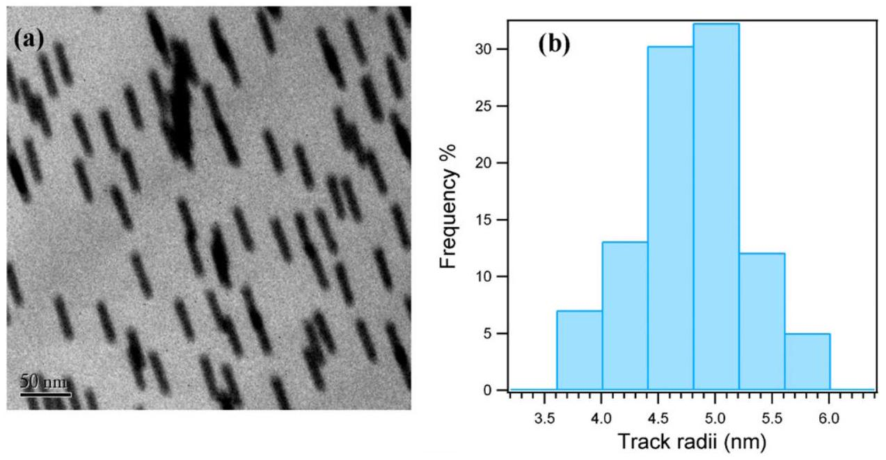
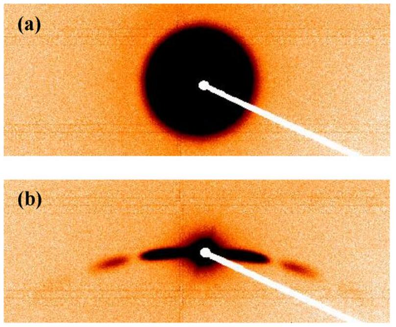
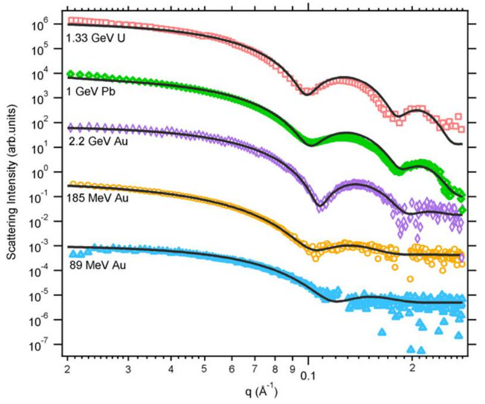
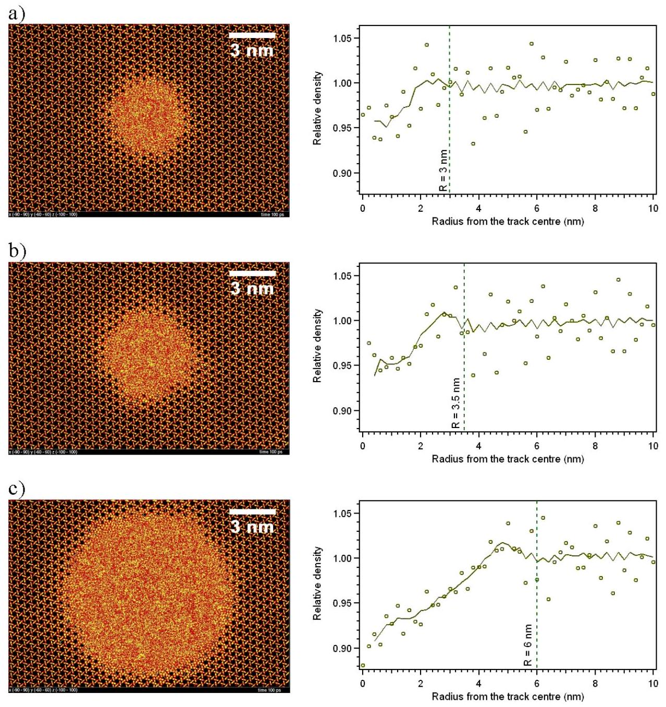
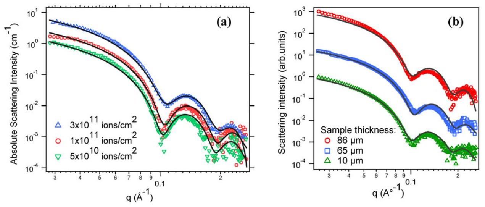
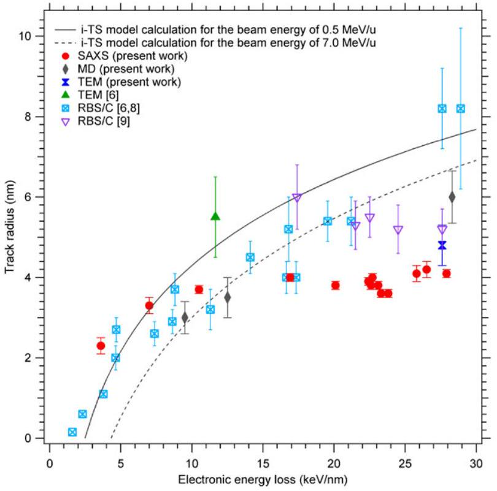

## PAPER

## SAXS investigations of the morphology of swift heavy ion tracks in $\alpha$-quartz

To cite this article: B Afra et al 2013 J. Phys.: Condens. Matter 25045006

View the article online for updates and enhancements.

## You may also like

- Oxygen deficient centers in silica: optical properties within many-body perturbation theory
N Richard, L Martin-Samos, S Girard et al.
- INFRARED SPECTRA OF SILICA POLYMORPHS AND THE CONDITIONS OF THEIR FORMATION
C. Koike, R. Noguchi, H. Chihara et al.
- Effects of anisotropy and size of polar nano thin films on their thermal conductivity due to surface phononpolaritons
Jose Ordonez-Miranda, Laurent Tranchant, Beomjoon Kim et al.

# SAXS investigations of the morphology of swift heavy ion tracks in $\boldsymbol{\alpha}$-quartz 

B Afra ${ }^{1}$, M D Rodriguez ${ }^{1}$, C Trautmann ${ }^{2,3}$, O H Pakarinen ${ }^{4}$, F Djurabekova ${ }^{4}$, K Nordlund ${ }^{4}$, T Bierschenk ${ }^{1}$, R Giulian ${ }^{1}$, M C Ridgway ${ }^{1}$, G Rizza ${ }^{5}$, N Kirby ${ }^{6}$, M Toulemonde ${ }^{7}$ and P Kluth ${ }^{1}$ ${ }^{1}$ Department of Electronic Materials Engineering, Research School of Physics and Engineering, The Australian National University, Canberra ACT 0200, Australia ${ }^{2}$ GSI Helmholtzzentrum für Schwerionenforschung, D-64291 Darmstadt, Germany ${ }^{3}$ Technische Universität Darmstadt, D-64289 Darmstadt, Germany ${ }^{4}$ Department of Physics and Helsinki Institute of Physics, University of Helsinki, Helsinki, Finland ${ }^{5}$ Ecole Polytechnique, Laboratoire des Solides Irradiés, CEA/IRAMIS-CNRS, F-91128 Palaiseau Cedex, France ${ }^{6}$ Australian Synchrotron, 800 Blackburn Road, Clayton VIC 3168, Australia ${ }^{7}$ Centre Interdisciplinaire de Recherche sur les Ions, les Matériaux et la Photonique, Caen, France

E-mail: baf109@physics.anu.edu.au
Received 25 September 2012, in final form 2 November 2012
Published 13 December 2012
Online at stacks.iop.org/JPhysCM/25/045006

#### Abstract

The morphology of swift heavy ion tracks in crystalline $\alpha$-quartz was investigated using small angle x-ray scattering (SAXS), molecular dynamics (MD) simulations and transmission electron microscopy. Tracks were generated by irradiation with heavy ions with energies between 27 MeV and 2.2 GeV . The analysis of the SAXS data indicates a density change of the tracks of $\sim 2 \pm 1 \%$ compared to the surrounding quartz matrix for all irradiation conditions. The track radii only show a weak dependence on the electronic energy loss at values above $17 \mathrm{keV} \mathrm{nm}{ }^{-1}$, in contrast to values previously reported from Rutherford backscattering spectrometry measurements and expectations from the inelastic thermal spike model. The MD simulations are in good agreement at low energy losses, yet predict larger radii than SAXS at high ion energies. The observed discrepancies are discussed with respect to the formation of a defective halo around an amorphous track core, the existence of high stresses and/or the possible presence of a boiling phase in quartz predicted by the inelastic thermal spike model.

(Some figures may appear in colour only in the online journal)

## 1. Introduction

When high energetic heavy ions pass through a solid, they lose their energy predominantly by interaction with the target electrons. The intense electronic excitations can induce structural modifications in very narrow cylindrical regions along the ion trajectories. Since the discovery of these so-called ion tracks in 1959 [ 1,2 ] numerous studies have been performed, motivated by applications in disciplines including materials science and nanotechnology, nuclear physics, geochronology, archaeology, and interplanetary science. Synthetic quartz possesses unique optical properties. It is transparent over a wide spectral range, with a low coefficient
of thermal expansion and its good endurance against wear and fatigue makes it a suitable material for optical devices. Crystalline quartz is also used as an essential electronic component for various devices due to its great frequency stability over a wide temperature range. Swift heavy ion irradiation of quartz leads to a change in the refractive index and offers a means to impose an etch anisotropy in the material which paves the way for nano-fabrication and micromachining of optical devices [3,4].

Experimental results on track properties in quartz and vitreous silica are reviewed in [5]. Damage in quartz induced by swift heavy ions was previously studied using transmission electron microscopy (TEM) [6, 7], Rutherford backscattering

Table 1. Irradiation parameters including the initial beam energy and the energy after the ions passed through the Al degrader foil i.e. when entering the sample surface. The track radius and its polydispersity are deduced from fits to the SAXS data. The Average $\mathrm{d} E / \mathrm{d} x_{e}$ gives the mean energy loss over the length of the tracks.
| Ion | Initial beam energy ( $\mathrm{MeV} \mathrm{u}^{-1}$ ) | Projected range ( $\mu \mathrm{m}$ ) | Thickness of Al degrader foil ( $\mu \mathrm{m}$ ) | Energy (MeV) | Average $\mathrm{d} E / \mathrm{d} x_{e}$ ( $\mathrm{keV} \mathrm{nm}^{-1}$ ) | Surface $\mathrm{d} E / \mathrm{d} x_{e}$ ( $\mathrm{keV} \mathrm{nm}^{-1}$ ) | Radius (nm) | Polydispersity of track radius (nm) |
| :--- | :--- | :--- | :--- | :--- | :--- | :--- | :--- | :--- |
| ${ }^{197} \mathrm{Au}$ | 0.14 | 5 | - | 27 | 3.6 | 5.4 | $2.3 \pm 0.2$ | $0.5 \pm 0.1$ |
| ${ }^{197} \mathrm{Au}$ | 0.45 | 11 | - | 89 | 7.0 | 14.4 | $3.3 \pm 0.2$ | $0.5 \pm 0.1$ |
| ${ }^{197} \mathrm{Au}$ | 0.94 | 17 | - | 185 | 10.5 | 20.1 | $3.7 \pm 0.1$ | $0.4 \pm 0.1$ |
| ${ }^{197} \mathrm{Au}$ | 11.1 | 95 | - | 2186 | 23.8 | 24.1 | $3.6 \pm 0.1$ | $0.3 \pm 0.1$ |
| ${ }^{197} \mathrm{Au}$ | 8.3 | 73 | - | 1635 | 23.2 | 25.4 | $3.6 \pm 0.1$ | $0.3 \pm 0.1$ |
| ${ }^{197} \mathrm{Au}$ | 11.1 | 66 | 32 | 1438 | 23.1 | 25.8 | $3.8 \pm 0.1$ | $0.3 \pm 0.1$ |
| ${ }^{197} \mathrm{Au}$ | 8.3 | 59 | 16 | 1250 | 22.5 | 26.1 | $3.8 \pm 0.1$ | $0.3 \pm 0.1$ |
| ${ }^{197} \mathrm{Au}$ | 11.1 | 36 | 64 | 652 | 20.1 | 26.2 | $3.8 \pm 0.1$ | $0.4 \pm 0.1$ |
| ${ }^{238} \mathrm{U}$ | 5.6 | 23 | 32 | 369 | 16.9 | 27.1 | $4.0 \pm 0.1$ | $0.5 \pm 0.1$ |
| ${ }^{207} \mathrm{~Pb}$ | 4.83 | 47 | - | 1000 | 22.3 | 27.6 | $3.9 \pm 0.1$ | $0.4 \pm 0.1$ |
| ${ }^{238} \mathrm{U}$ | 5.6 | 38 | 16 | 826 | 22.7 | 32.5 | $4.0 \pm 0.1$ | $0.4 \pm 0.1$ |
| ${ }^{238} \mathrm{U}$ | 8.3 | 72 | - | 1975 | 27.9 | 33.2 | $4.1 \pm 0.1$ | $0.3 \pm 0.1$ |
| ${ }^{238} \mathrm{U}$ | 5.6 | 53 | - | 1333 | 25.8 | 33.8 | $4.1 \pm 0.2$ | $0.4 \pm 0.1$ |
| ${ }^{238} \mathrm{U}$ | 8.3 | 57 | 16 | 1475 | 26.5 | 33.8 | $4.2 \pm 0.2$ | $0.4 \pm 0.1$ |

spectrometry in channelling geometry (RBS/C) [6, 8, 9], atomic force microscopy (AFM) [10], surface profilometry [9, 11], and chemical etching [12-15]. RBS/C measurements [6] show a steady increase of the damage cross section with increasing electronic energy loss ( $\mathrm{dE} / \mathrm{d} x_{\mathrm{e}}$ ). The track interior is completely disordered and presumably amorphous, consistent with electron diffraction analysis of the damaged areas [6]. TEM measurements of ion tracks in thin quartz samples reveal a radial strain field around the amorphous core that extends up to a distance of three times the core radius from the track centre into the crystalline matrix [7]. Swelling measurements by surface profilometry indicate significant density changes. The reported values for out-of-plane swelling vary between $4 \%$ [9] and $16 \%$ [11], the latter of which coincides with the density difference between the crystalline and amorphous $\mathrm{SiO}_{2}$ phase. AFM investigations report conical hillocks with circular bases at the sample surface for each individual track above an energy loss of $7 \mathrm{keV} \mathrm{nm}^{-1}$ [10]. Reported values for track formation threshold in quartz vary between $2 \mathrm{keV} \mathrm{nm}{ }^{-1}[9,11,16$, 17] and $7.2 \mathrm{keV} \mathrm{nm}^{-1}$ [15] depending on the measurement technique and ion irradiation conditions.

The threshold values are subject to the so-called velocity effect, which considers the increase of initial electron cascade for projectiles of higher velocity [6, 18]. According to reference [16], the threshold for damage creation varies by about $20 \%$ when comparing high and low velocity ions.

Small angle x-ray scattering (SAXS) is a powerful tool for the measurement of ion track damage as it is non-destructive, not limited to the surface or near-surface regions and is sensitive to small density changes at the nanometre scale [19-24]. Changes in the track radii can be identified with up to sub-nanometre precision, and moreover, SAXS is well suited for in situ annealing studies [25]. In contrast to RBS/C measurements, SAXS requires only low ion fluences that yield well-separated tracks and thus avoids proximity effects that may affect RBS/C results on
ion track cross sections. It does not require elaborate sample preparation such as TEM and measures the ion track over its entire length, i.e. it is less susceptible to artefacts and surface effects. In this work, we present results on the morphology of ion tracks in crystalline $\alpha$-quartz obtained using synchrotron SAXS, TEM and molecular dynamics (MD) simulations.

## 2. Experiment

### 2.1. Sample preparation

Single crystalline wafer pieces of $\alpha$-quartz were irradiated with a variety of high energy heavy ions. Irradiations with 27, 89 , and $185 \mathrm{MeV}{ }^{197} \mathrm{Au}$ ions were performed at the ANU Heavy Ion Accelerator Facility (Canberra, Australia). For irradiations at higher energies we used ${ }^{207} \mathrm{~Pb}$ ions of 1 GeV at the GANIL accelerator (Caen, France) and ${ }^{197} \mathrm{Au}$ ions ( 1.6 and 2.2 GeV ) as well as ${ }^{238} \mathrm{U}$ ions ( 1.3 and 2.0 GeV ) at the UNILAC accelerator at GSI (Darmstadt, Germany). In order to vary the energy loss of the ions, degrader foils of aluminum with thicknesses between 16 and $64 \mu \mathrm{~m}$ were placed in front of some of the samples. All irradiations were performed at normal incidence and room temperature (RT). Details of the irradiation parameters are summarized in table 1 in the order of decreasing surface electronic energy loss. The ion energies and surface energy losses were calculated with the SRIM-2008 code [26] assuming a mass density of $2.65 \mathrm{~g} \mathrm{~cm}^{-3}$ for quartz [27].

Samples were irradiated with fluences between $3 \times 10^{10}$ and $4 \times 10^{11}$ ions $\mathrm{cm}^{-2}$. Most samples irradiated to a fluence of $4 \times 10^{11}$ ions $\mathrm{cm}^{-2}$ fractured during the irradiation as a result of high stresses generated in the ion track regions.

All quartz samples had the same thickness of $360 \mu \mathrm{~m}$ before irradiation. After irradiation, samples were mechanically polished from the backside to thicknesses between 10 and $130 \mu \mathrm{~m}$ using a tripod method. For the high energy

Figure 1. (a) plan-view TEM image of ion tracks in quartz generated with 1 GeV Pb ions of fluence $5 \times 10^{10}$ ions $\mathrm{cm}^{-2}$. Ion tracks were tilted with respect to the electron beam. (b) Histogram of the track size distribution from analysing close to one hundred tracks from TEM images. The measurement is based on the average value of track radii from FWHM and FWFM of the intensity cross sections.

irradiations ( $>600 \mathrm{MeV}$ ), the ion tracks are up to tens of micrometres long. In most cases, the thickness of the polished sample was smaller than the projected ion range, and the variation of the energy loss along the ion track less than $10 \%$. For irradiations with ions of lower energies, the sample thicknesses exceed the track lengths. Here thinning was performed predominantly in order to reduce absorption and inelastic x-ray scattering from the unirradiated crystal matrix in the SAXS data.

### 2.2. Transmission electron microscopy

Plan-view transmission electron microscopy (TEM) was performed on selected samples using a Philips CM300 microscope operating at 300 kV . Samples were prepared using standard polishing and ion milling processes. As ion tracks in quartz are very susceptible to electron beam irradiation effects the beam was focused on one spot and the image was taken after quick movement to an adjacent spot in order to record images before the tracks started to shrink in size. Figure 1(a) shows a TEM image of ion tracks in quartz irradiated with 1 GeV Pb ions to a fluence of $5 \times 10^{10}$ ions $\mathrm{cm}^{-2}$.

### 2.3. SAXS measurements

SAXS measurements were carried out at the SAXS/WAXS beamline at the Australian Synchrotron in transmission geometry with an x-ray energy of 12 keV and a camera length of approximately 1600 mm . Samples were mounted on a 3-axis goniometer which allowed precise alignment of the ion tracks with respect to the x-ray beam. Measurements were taken with the ion tracks tilted by $0^{\circ}, 5^{\circ}$ and $10^{\circ}$ with respect to the incoming x-ray beam. Additionally, scattering was measured from an unirradiated sample for background removal and from a glassy carbon standard for absolute calibration of the scattering intensities. Spectra were collected with a Pilatus 1 M detector with exposure times of 5 and

Figure 2. SAXS images of a quartz sample irradiated by 1.6 GeV Au ions to a fluence of $5 \times 10^{10}$ ions $\mathrm{cm}^{-2}$, (a) with the x-ray beam parallel to the ion tracks, (b) with the ion tracks tilted by $5^{\circ}$ with respect to the x-ray beam.

10 s. Aligning the ion tracks parallel/collinear to the x-ray beam ( $0^{\circ}$ ) results in isotropic scattering. Figure 2(a) shows the isotropic scattering in collinear geometry for tracks in a quartz sample produced by 1.6 GeV Au ions of fluence $5 \times 10^{10}$ ions $\mathrm{cm}^{-2}$. Due to the parallel orientation of the ion tracks, the radial symmetry is consistent with a circular cross section of the track cylinders or a random rotation of tracks with a non-circular cross section along the track axis, the former consistent with previous studies [6]. By tilting the sample from this position, the scattering changes to two slightly curved streaks as apparent from figure 2(b), which shows the same sample as in figure 2(a) tilted by $5^{\circ}$. This anisotropy results from the high aspect ratio of the tracks that are only a few nanometres wide, but tens of micrometres long. The x-ray scattering intensities of radial sectors perpendicular
to the streaks (e.g. a small arc sector in the area between the two streaks which does not overlap with either of the streaks) were compared to those of unirradiated quartz samples and found to be identical. This is consistent with the lack of significant density fluctuations on the nanometre length scale along the ion tracks, confirming their cylindrical morphology.

### 2.4. SAXS data analysis

For analysis of the SAXS data, the scattering intensities were extracted from the streaks in the images and scattering from an unirradiated sample was subtracted. Examples of the scattering intensities from ion tracks in quartz after background removal are shown in figure 3 for different irradiation conditions. The presence of strong oscillations is consistent with monodisperse track radii and a sharp density change between the track and the matrix material [25]. To analyse the size of the tracks, we modelled them by parallel aligned cylinders of length $L$ and radius $R$. The intensity of the scattered x-rays as a function of scattering vector $q= 4 \pi \sin (\theta) / \lambda$, where $2 \theta$ is the scattering angle and $\lambda$ is the wavelength of the x-ray beam, is given by

$$
I(q)=C\langle F(q)\rangle^{2} .
$$

The coefficient $C$ contains information about the number density of the ion tracks $n$, the track volume $V$ and the electron density change $\Delta \rho$ between track and matrix material:

$$
C=n V^{2}(\Delta \rho)^{2} .
$$

The scattering amplitude $F(q)$ represents the form factor for a cylindrical object. Due to the random distribution and large separation of the tracks, no structure factor is considered, consistent with the scaling of the scattering with the ion fluence as outlined later. The energy losses of the ions for the current experiment are well above the threshold for continuous track formation, thus justifying the assumption of continuous cylindrical tracks, also consistent with the remarks in section 2.1. The simplest model is a cylinder with constant density that differs from that of the surrounding matrix. The form factor for this model is given by [28]

$$
F(\vec{q})=\frac{\sin \left(q_{z} L / 2\right)}{q_{z}} \frac{J_{1}\left(R q_{r}\right)}{q_{r}},
$$

where $J_{1}$ is the first order Bessel function. To account for a variation of the track radius over the depth of the tracks due to changes in the stopping power, and deviations of perfectly sharp boundaries between track and matrix, a narrow Gaussian distribution of the radius is assumed [20]. Furthermore, a narrow angular distribution was fitted to model deviations from perfectly parallel tracks that result from beam divergence during irradiation or bending of the thin samples. For all samples the angular spread was small and best described by a fit below $0.2^{\circ}$. Fitting of both the distribution in radii and the angular spread had no influence on the fitted track radii. Fits to the simple cylinder model are shown in figure 3 as solid lines.

The average $\mathrm{d} E / \mathrm{d} x_{e}$ is estimated by integrating $\mathrm{d} E / \mathrm{d} x_{e}$ calculated by SRIM-2008 over the depth of the penetrating

Figure 3. SAXS spectra of ion tracks as a function of the scattering vector $q$ for a variety of ion/energy combinations. The scattering intensities have been offset for clarity. The solid lines are the corresponding fits to the theoretical model.

ion, from the sample surface to the depth where it reaches its threshold for track formation ( $2 \mathrm{keV} \mathrm{nm}^{-1}$ ), the latter of which provides an estimate of the track length.

From the experimental determination of the coefficient $C$ in equation (1), we can estimate the absolute density change in the ion tracks using equation (2). The number density $n$ corresponds to the irradiation fluence and the volume $V$ of an ion track is estimated using the fitted values for the track radii and the estimated track length. In cases when the sample was thinned to a thickness smaller than the maximum track length, the sample thickness was used as the track length.

## 3. MD simulations

The formation of swift heavy ion tracks was simulated using the classical molecular dynamics (MD) code PARCAS [29] ${ }^{8}$. The atomic interactions are calculated with the Watanabe-Samela $\mathrm{Si}-\mathrm{O}$ mixed system many-body potential [30, 31]. The electronic energy loss of the track producing ions is implemented by continuously following the evolution of the atomic lattice temperature as calculated with the inelastic Thermal Spike model (i-TS) [32] parameterized based on the RBS/C results from [6]. We applied the energy transfer between the electronic and lattice subsystems of the i-TS by deposition of kinetic energy in a random direction to all of the atoms in the MD simulation cell. At each time step, the energy decreases radially with increasing distance from the track centre until the two subsystems are in thermal equilibrium. To ensure compatibility of results, the energy input to the MD simulation is scaled with respect to the higher melting point of the interatomic potentials used. Inside the melting radius, a constant value of 0.6145 eV /atom was added, whereas outside the melting radius a scaling factor of 2.2523 was applied to the total energy deposition. This

[^0]
Figure 4. Left: atomistic images of MD simulated tracks in crystalline quartz. Right: symbols give the corresponding atomic density as a function of the track radii. The solid lines are the smoothed density profile using a five point running average. The dashed lines indicate the track radii deduced from the amorphous/crystalline interface.

ensures a continuous temperature evolution while limiting extra deposition far from the ion path.

The formation of tracks was calculated for Au projectiles of three different stopping powers, namely 9.9, 12.5, and $28.3 \mathrm{keV} \mathrm{nm}^{-1}$, which are close to the average $\mathrm{d} E / \mathrm{d} x_{e}$ for irradiation energies of 89,185 , and 2200 MeV . We emphasize that the kinetic energy is deposited to all atoms in the computation cell, even though the resulting damage is limited to few nanometres around the ion trajectory. The cell of the MD simulation consists of a 25 nm cube with periodic boundary conditions resulting in a system size of about 1.3 million atoms. The cell is created as a perfect crystalline $\alpha$-quartz structure and is initially relaxed. The track area is surrounded by several nanometres of pristine material in the $x$ - and $y$-directions, whereas in the $z$ direction the track penetrates through the periodic cell, modelling an infinitely long, homogeneous track. The last 0.5 nm at the borders of the computation cell in the $x$ - and $y$-directions is cooled by Berendsen temperature control [33] to approximate heat conduction further into the material. The initial temperature in the calculation is 300 K , a time step of about 0.4 fs is used,
and simulations are continued for 200 ps until the cell density converges to the stable profiles.

Top-view images of the MD simulation cells are shown in figure 4 along with the relative radial density profiles originating in the centre of the track. For better visualization of the MD density profiles obtained, smoothed profiles using a five point running average are also plotted. The track radii obtained by the MD simulations are shown on the density profiles as dashed lines and mark the boundary between disordered/amorphous and crystalline material.

## 4. Results

### 4.1. SAXS

The presence of strong oscillations in the small angle x-ray scattering intensities of the irradiated quartz samples indicates monodisperse track radii and a sharp density transition between the track and the matrix material. The most appropriate model that fits the data is a cylinder with constant density (different from that of the matrix material). This is

Figure 5. SAXS spectra from ion tracks in quartz after background removal as a function of scattering vector $q$. (a) Samples are irradiated with 1.4 GeV Au ions at fluences of $0.5,1$, and $3 \times 10^{11}$ ions $\mathrm{cm}^{-2}$. (b) Samples with thicknesses of 10,65 and $86 \mu \mathrm{~m}$ are irradiated with 1 GeV Pb ions at fluences of $5 \times 10^{10}$ ions $\mathrm{cm}^{-2}$. The solid lines are the corresponding fits to the theoretical model.

consistent with the formation of amorphous tracks inside the crystalline quartz matrix. While the scattering intensities extracted from the streaks can only give information on the radial morphology of the ion tracks, the observed high anisotropy in the tilted images and the absence of scattering perpendicular to the streaks, confirm continuous tracks.

Figure 3 shows the scattering spectra from ion tracks after background removal for different ion and energy combinations along with their corresponding fits to the cylinder model (solid lines).

The fits using this model are also shown as solid lines in figure 5(a) for the scattering data from the irradiations with 1.4 GeV Au ions. For the fluences of $0.5,1$, and $3 \times 10^{11}$ ions $\mathrm{cm}^{-2}$, the fits yield the track radii of $3.8 \pm 0.1$, $3.7 \pm 0.1$, and $3.8 \pm 0.1 \mathrm{~nm}$ respectively. This excellent agreement is not surprising considering that for the applied fluences track overlap is negligible being below $7 \%$ for $3 \times 10^{11}$ ions $\mathrm{cm}^{-2}$ [21]. Figure 5(b) shows the scattering intensity of three quartz samples of different thicknesses $(\sim 10,65$ and $86 \mu \mathrm{~m})$ irradiated with 1 GeV Pb ions of fluence $5 \times 10^{10}$ ions $\mathrm{cm}^{-2}$. At this beam energy, the tracks have a length of about $44 \mu \mathrm{~m}$ and the average energy loss is $22.3 \mathrm{keV} \mathrm{nm}{ }^{-1}$. The scattering intensities are very similar even though the lengths of the track and the lengths of the unirradiated part in these samples are different. The track radii for samples with the thicknesses of 10,65 and $86 \mu \mathrm{~m}$ are $3.9 \pm 0.1,3.8 \pm 0.1$, and $3.9 \pm 0.1 \mathrm{~nm}$, respectively. The thickness of the material in which the tracks are embedded has obviously no significant influence on the background-subtracted SAXS spectra and the deduced track radius.

A complete set of all SAXS radii measured and their size distributions obtained from the fits to the different measurements are listed in table 1. Extracted track radii from SAXS measurements are plotted as a function of electronic energy loss in figure 6 along with data from other measurement techniques which is explained in later sections.

### 4.2. TEM

Figure 1(a) shows the TEM image of ion tracks in a quartz sample irradiated with 1 GeV Pb ions to a fluence of $5 \times$

Figure 6. Track radii as a function of the electronic energy loss in $\alpha$-quartz for different ion/energy combinations. The uncertainties of the SAXS data shown in the plot correspond to the fitted radius polydispersity.

$10^{10}$ ions $\mathrm{cm}^{-2}$ tilted with respect to the electron beam. As mentioned earlier, the susceptibility of the ion tracks to the electron beam rendered acquisition of an image with clear contrast between track and matrix difficult.

For measuring track radii from the acquired images, we have analysed the intensity cross sections of tracks using their full width half maximum (FWHM) and full width full maximum (FWFM). The FWHM of the intensity cross sections yielded a radius of $4.2 \pm 0.3 \mathrm{~nm}$ while the FWFM values indicated a radius of $5.5 \pm 0.6 \mathrm{~nm}$. The mean value of track radii from these measurements is $4.8 \pm 0.5 \mathrm{~nm}$.

It should be noted that high resolution TEM images of track cross section could improve the TEM measurement but the instability of quartz in the electron beam is problematic and tracks may change under observation.

### 4.3. Model calculations

Calculations were performed using the i-TS model that was developed to describe how the energy deposited into the electronic system [26, 34, 35] is transferred to the lattice atoms via the electron-phonon coupling. This rapid heating can induce local melting or boiling. The track formation criteria is linked to the quenching of the molten phase leading to amorphization [6, 36]. Good agreement with experimental track radii and sputtering rates are obtained using a fixed electron-phonon mean free path of 3.8 nm [35, 37]. Track radii from the i-TS model as a function of the $\mathrm{d} E / \mathrm{d} x_{e}$ are shown as solid and dashed lines in figure 6 for two different beam velocities due to energies of 0.5 and $7.0 \mathrm{MeV} \mathrm{u}^{-1}$.

MD simulation combined with the energy distribution predicted from the thermal spike model yield the atomistic structure of track embedded in crystalline quartz. It is evident that the MD simulations are also consistent with the formation of amorphous tracks.

## 5. Discussion

Figure 6 compiles all SAXS and TEM track radii as a function of the electronic energy loss of the ions together with the data from the MD simulations, and experimental data from earlier studies using RBS/C [6, 8, 9] and TEM [6]. AFM data provided in the literature [10] measuring surface hillocks that occur due to relaxation and material expansion at the surface are not included as these cannot be compared with tracks surrounded by a matrix material measured by the other techniques.

In order to compare these results consistently, $\mathrm{d} E / \mathrm{d} x_{e}$ was calculated for all data points using SRIM-2008 by taking into account the ion and energy of each irradiation condition. RBS/C measurements are based on the first 500 nm depth from the surface of the sample [6,8,9]. We calculated the corresponding mean $\mathrm{d} E / \mathrm{d} x_{e}$ values which differ by up to $20 \%$ from the reported ones (calculated using the TRIM-91 [6, 9] and TRIM-95 [10] codes).

Although the reported values for the track formation threshold in quartz vary based on the measurement technique, the effect of the different threshold values on the calculation of the average $\mathrm{d} E / \mathrm{d} x_{e}$ is small (for example, for 1 GeV Pb ions the mean energy loss is $22.9 \mathrm{keV} \mathrm{nm}^{-1}$ using a threshold value of 6 and $21.3 \mathrm{keV} \mathrm{nm}^{-1}$ using $1.8 \mathrm{keV} \mathrm{nm}^{-1}$ ). Given an approximate $10 \%$ uncertainty of the SRIM calculations [27], the influence of the threshold value on the mean energy loss remains within the code precision. Due to its small effect [16], the velocity effect on the threshold was not considered when calculating the mean energy loss for our low energy beams ( 27,89 , and 185 MeV ) experiments.

Results of SAXS and RBS measurements [6, 8] show reasonable agreement at energy losses below $\sim 17 \mathrm{keV} \mathrm{nm}^{-1}$. At higher energy losses, the radii measured by SAXS saturate at approximately 4 nm , while track radii determined from RBS measurements [6, 8] are consistently higher. While the uncertainties in the RBS/C data is significantly higher than those from SAXS measurements, and modern Monte Carlo
methods for RBS/C simulation may yield more accurate track radii, a clear trend of increasing track radii with the energy loss is apparent. It is worth noting that the RBS/C results in [9] show no obvious dependence on the energy loss, different to those in [6, 8] however, only limited data with high uncertainties are presented in this study. The small dependence of the track radii measured by SAXS on the electronic energy loss is somewhat surprising, as most insulators show a clear increase of the track radii with $\mathrm{d} E / \mathrm{d} x_{e}$ [35]. An exception is mica, where a weak dependence of the track size on the electronic energy loss has been previously reported [38]. The mentioned study has also employed SAXS for determining the track radii [38]. Calculations using the thermal spike model, which are based on the RBS/C results from [6], however, predict a steady increase in the track radius in quartz with increasing energy loss. At low energy losses, the radii extracted from MD simulations also agree well with the ones obtained from SAXS, however, at high $\mathrm{d} E / \mathrm{d} x_{e}$, MD results yield a larger value. This is not unexpected because-as described above-MD simulations are based on the energy distribution predicted from the thermal spike model. These observations indicate, that the simple model of melting and quenching, that underlies the thermal spike concept, may not be sufficient to explain track formation in quartz. High stresses and the role of point defect creation may have a significant influence on the resulting track morphology, which is not considered in the thermal spike calculation.

We now consider possible scenarios, why the radii in quartz deduced from SAXS observations are in agreement with RBS/C for electronic energy loss less than about $17 \mathrm{keV} \mathrm{nm} \mathrm{m}^{-1}$ and not for larger electronic energy losses.

A discrepancy between the RBS/C measurements and the SAXS results could originate from the existence of a defective halo around an amorphous track core. The defective halo will perturb channelling leading to effectively larger track radii but may possess the density of crystalline quartz, thus not showing up in the SAXS measurements. A defective halo has been previously studied in quartz [39] and $\mathrm{LiNbO}_{3}$ [40-42] under high energy ion irradiation. It is suggested that the radial morphology of tracks in insulators, produced with ions above the damage creation threshold [41], is typically characterized by a core, halo, and tail structure resulting from the concentration of defects above a certain threshold in the centre of the track (amorphous core) surrounded by a damaged or preamorphised region (halo), followed by a less damaged tail region.

A defective halo could be the result of partial recrystallization of quartz during the quenching phase. The thermal spike model uses the radius of the molten cylinder as criterion for the track size. During the rapid cooling, however, part of the molten material may recrystallize at the interface to the surrounding solid matrix, leading to a smaller radius of the residual amorphous phase. This has been observed experimentally and in MD simulations of ion tracks in complex oxides (pyrochlores) [43]. The recrystallization of the outer region of the molten track was shown to be imperfect, leaving a crystalline but defective halo around
the amorphous core. In contrast to the MD simulations on complex oxides, our MD results on quartz do not indicate this recrystallization process is operative and thus we consider it unlikely. A defective halo might also be an intrinsic feature of the ion track occurring during formation. It was suggested for the case of quartz [39] and $\mathrm{LiNbO}_{3}$ [41, 42] that the amorphization mechanism during track formation proceeds via point defect generation, similar to the case of ballistic collisions. In the area where the defect concentration exceeds a threshold value, the material collapses into an amorphous state, leaving a halo of defects around it where the threshold value is not exceeded. We note that for the ion tracks in quartz, it is predicted the halo area reduces by increasing the electronic energy loss above $4 \mathrm{keV} \mathrm{nm}^{-1}$ [39], however, the study only investigates energy losses of up to $10 \mathrm{keV} \mathrm{nm}^{-1}$. The discrepancies between RBS/C and SAXS which are apparent at large energy losses and correspond to high ion velocities may result from the fact that at these energies the electron cascades rapidly dissipate energy through the crystal and result in a higher cooling rate of the material [44]. This process will leave behind more residual defects in the halo region that would be observed in RBS/C. The existence of a halo may thus explain the differences of the RBS/C and SAXS data.

MD simulations also predict amorphization of the ion track with good agreement of the track size at low energy loss ranges. The disagreement at high energy losses could be an indication that the energy distribution provided by the thermal spike model and serving as an input for the MD calculations overestimates the temperature.

Alternatively, the typical melting criteria established for track formation within the thermal spike scenario can be discussed. A boiling phase during ion track formation also offers a plausible explanation for the discrepancy of SAXS and RBS/C measurements, and i-TS calculations. According to i-TS model calculations, the melting is reached for Au ions of energy below $1 \mathrm{MeV} \mathrm{u}^{-1}\left(\mathrm{~d} E / \mathrm{d} x_{e}<13.5 \mathrm{keV} \mathrm{nm}^{-1}\right)$, and track radii observed by SAXS coincide well with the one deduced from RBS/C [6].

From [45], the appearance of the boiling phase can be associated to the appearance of a sputtering rate which is significant above $11 \mathrm{keV} \mathrm{nm}^{-1}$. Using this criterion it is suggested that the boiling phase is reached in the centre of the tracks and may induce a pressure wave propagating radially from the centre of the track. If this wave creates a shell of compact amorphous $\mathrm{SiO}_{2}$ [20] with nearly the same electron density as crystalline $\mathrm{SiO}_{2}$, SAXS would not identify this outer shell. Such a scenario is supported by the MD calculations which show an under dense area smaller than the amorphous track radius. For example, tracks induced by GeV Au projectiles have an under dense core of 4 nm radius with a denser but still amorphous shell of about 2 nm thickness. While the compacted amorphous shell cannot be identified by SAXS, RBS/C is sensitive to its structural disorder. An accurate TEM measurement that shows the possible amorphous core and amorphous shell zones could resolve the ambiguity of the explanation and rule out the structure of an amorphous core with a partially recrystallized
halo, but the uncertainty of TEM measurement in quartz is usually beyond the difference between the core and shell sizes. The large uncertainty may be due to artefacts, relaxation of the tracks in quartz or susceptibility of the damaged zone to the electron beam.

Absolute calibration of the scattering intensities enables an estimate of the electron density change within the amorphous tracks of approximately $2 \pm 1 \%$ as compared with the crystalline matrix, independent of the irradiation conditions. Swelling measurements of quartz indicated values around $4 \%$ [9] and $15 \%$ [11] for the density change at high fluence irradiation. In these experiments, the step height at the border between an irradiated and unirradiated sample surface is recorded by profilometry. The volume expansion is due to amorphization of the irradiated material which can expand relatively freely at the surface. In contrast, SAXS measures the density change of tracks confined in the bulk matrix. At low fluences, the curvature measurements by profilometry also identified the built up of high stresses of these samples [11]. Their density change has a similar magnitude as the value observed by our SAXS experiments.

## 6. Conclusions

Crystalline $\alpha$-quartz samples were irradiated with swift heavy ions and analysed by SAXS. The track morphology is consistent with amorphous cylinders surrounded by stressed, possibly defective crystalline quartz. At low electronic energy losses, SAXS and complementing MD simulations yield similar track radii. At high $\mathrm{d} E / \mathrm{d} x_{e}$, the SAXS track radius saturates at a value of approximately 4 nm in disagreement with MD simulations and thermal spike predictions. The weak dependence of the track radius on the electronic energy loss indicates that track formation is probably a more complex process than a simple melt and quench predicted by the thermal spike model. Alternative explanations include the presence of a defective halo, which indicates track formation proceeds via point defect generation, and/or the presence of a boiling phase during track formation. The observed density change of $\sim 2 \%$ in the amorphous core (with respect to the matrix) is consistent with observations from macroscopic swelling measurement for low fluences but is significantly lower than the $\sim 15 \%$ density difference between bulk silica and quartz, leading to high stresses in the material.

Although this work cannot unambiguously verify the mechanisms for ion track formation in quartz, it highlights that the processes involved are clearly complex in nature and thus accurate modelling becomes extremely challenging. Furthermore, comparing track results obtained by different analytical techniques emphasizes their specific sensitivity to different properties of the tracks. Interpretation and comparison of the measured track properties have to be done with extreme care.

## Acknowledgments

This research was undertaken on the SAXS/WAXS beamline at the Australian Synchrotron, Victoria, Australia. PK
acknowledges the Australian Research Council for financial support. We thank the staffs of the different Heavy Ion Accelerator Facilities for technical assistance during irradiation experiments. The computer resources provided by the IT center for science CSC are highly acknowledged. OP is grateful to the Academy of Finland for financial support.

## References

[1] Young D A 1958 Nature 182375
[2] Silk E C H and Barnes R S 1959 Phil. Mag. 4970
[3] Chandler P J, Lama F L, Townsend P D and Zhang L 1988 Appl. Phys. Lett. 5389
[4] Hjort K, Thornell G, Schweitz J A and Spohr R 1996 Appl. Phys. Lett. 693435
[5] Klaumunzer S 2004 Nucl. Instrum. Methods Phys. Res. B 225136
[6] Meftah A, Brisard F, Costantini J M, Dooryhee E, Hageali M, Hervieu M, Stoquert J P, Studer F and Toulemonde M 1994 Phys. Rev. B 4912457
[7] Follstaedt D M, Norman A K, Doyle B L and McDaniel F D 2006 J. Appl. Phys. 1006
[8] Tombrello T A 1984 Nucl. Instrum. Methods Phys. Res. B 2555
[9] Trautmann C, Costantini J M, Meftah A, Schwartz K, Stoquert J P and Toulemonde M 1999 Atomistic Mechanisms in Beam Synthesis and Irradiation of Materials 504, ed J C Barbour, S Roorda, D Ila and M Tsujioka (Warrendale: Materials Research Society) p 123
[10] Khalfaoui N, Rotaru C C, Bouffard S, Jacquet E, Lebius H and Toulemonde M 2003 Nucl. Instrum. Methods Phys. Res. B 209165
[11] Trautmann C, Boccanfuso M, Benyagoub A, Klaumunzer S, Schwartz K and Toulemonde M 2002 Nucl. Instrum. Methods Phys. Res. B 191144
[12] Aframian A 1977 Radiat. Eff. Defects Solids 3395
[13] Singh L, Sandhu A S, Singh S and Virk H S 1990 Nucl. Instrum. Methods Phys. Res. B 46149
[14] Sawamura T, Baba S and Narita M 1999 Radiat. Meas. 30453
[15] Sigrist A and Balzer R 1977 Helv. Phys. Acta 5049
[16] Toulemonde M, Ramos S M M, Bernas H, Clerc C, Canut B, Chaumont J and Trautmann C 2001 Nucl. Instrum. Methods Phys. Res. B 178331
[17] Toulemonde M, Assmann W, Dufour C, Meftah A and Trautmann C 2012 Nucl. Instrum. Methods Phys. Res. B 27728
[18] Szenes G 1997 Nucl. Instrum. Methods Phys. Res. B 122530
[19] Albrecht D D, Armbruster P, Spohr R, Roth M, Schaupert K and Stuhrmann H 1985 Appl. Phys. A 3737
[20] Kluth P et al 2008 Phys. Rev. Lett. 101175503
[21] Kluth P, Schnohr C S, Sprouster D J, Byrne A P, Cookson D J and Ridgway M C 2008 Nucl. Instrum. Methods Phys. Res. B 2662994
[22] Eyal Y and Abu Saleh S 2007 J. Appl. Crystallogr. 4071
[23] Kluth P, Pakarinen O H, Djurabekova F, Giulian R, Ridgway M C, Byrne A P and Nordlund K 2011 J. Appl. Phys. 110123520
[24] Rodriguez M D, Afra B, Trautmann C, Toulemonde M, Bierschenk T, Leslie J, Giulian R, Kirby N and Kluth P 2012 J. Non-Cryst. Solids 358571
[25] Afra B, Lang M, Rodriguez M D, Zhang J, Giulian R, Kirby N, Ewing R C, Trautmann C, Toulemonde M and Kluth P 2011 Phys. Rev. B 83
[26] Ziegler J 2008 SRIM-The Stopping and Range of Ions in Matter www.srim.org/
[27] www.mindat.org/min-3337.html, accessed 15 Aug 2012
[28] Guinier A and Fournet G 1955 Small Angle Scattering of X-rays (New York: Wiley)
[29] Nordlund K 2006 PARCAS computer code
[30] Watanabe T, Yamasaki D, Tatsumura K and Ohdomari I 2004 Appl. Surf. Sci. 234207
[31] Samela J, Nordlund K, Popok V N and Campbell E E B 2008 Phys. Rev. B 77075309
[32] Toulemonde M, Paumier E and Dufour C 1993 Radiat. Eff. Defects Solids 126201
[33] Berendsen H J C, Postma J P M, van Gunsteren W F, DiNola A and Haak J R 1984 J. Chem. Phys. 813684
[34] Waligorski M P R, Hamm R N and Katz R 1986 Nucl. Tracks Radiat. Meas. 11309
[35] Toulemonde M, Assmann W, Dufour C, Meftah A, Studer F and Trautmann C 2006 Ion Beam Science: Solved and Unsolved Problems, Pts 1 and 2 vol 52, ed P Sigmund (Copenhagen: Royal Danish Academy Sciences \& Letters) p 263
[36] Studer F, Houpert C, Toulemonde M and Dartyge E 1991 J. Solid State Chem. 91238
[37] Toulemonde M, Dufour C, Meftah A and Paumier E 2000 Nucl. Instrum. Methods Phys. Res. B 166903
[38] Spohr R, Armbruster P and Schaupert K 1989 Radiat. Eff. Defects Solids 11027
[39] Pena-Rodriguez O, Manzano-Santamaria J, Rivera A, Garcia G, Olivares J and Agullo-Lopez F 2012 J. Nucl. Mater. 430125
[40] Olivares J, Garcia-Navarro A, Garcia G, Myndez A and Agullo-Lopez F 2006 Appl. Phys. Lett. 89
[41] Agullo-Lopez F, Garcia G and Olivares J 2005 J. Appl. Phys. 978
[42] Rivera A, Olivares J, Garcia G, Cabrera J M, Agullo-Rueda F and Agullo-Lopez F 2009 Phys. Status Solidi a 2061109
[43] Zhang J et al 2010 J. Mater. Res. 2571344
[44] Rutherford A M and Duffy D M 2007 J. Phys.: Condens. Matter 19
[45] Toulemonde M, Assmann W, Trautmann C and Gruner F 2002 Phys. Rev. Lett. 884
[46] Nordlund K, Ghaly M, Averback R S, Caturla M and Diaz de la Rubia T 1998 J. Tarus, Phys. Rev. B 577556
[47] Ghaly M, Nordlund K and Averback R S 1999 Phil. Mag. A 79795
[48] Nordlund K 1995 Comput. Mater. Sci. 3448

[^0]:    ${ }^{8}$ The main principles of the MD algorithms are presented in [46, 47]. The adaptive time step and electronic stopping algorithms are the same as in [48].

