# Dr. Probe: A software for high-resolution STEM image simulation 

J. Barthel ${ }^{\mathrm{a}, \mathrm{b}, *}$ ${ }^{\mathrm{a}}$ Central Facility for Electron Microscopy, RWTH Aachen University, 52074 Aachen, Germany ${ }^{\mathrm{b}}$ Ernst Ruska-Centre (ER-C 2), Forschungszentrum Jülich GmbH, 52425 Jülich, Germany

## ARTICLE INFO

## Keywords:

STEM
Image simulation
Multislice
Software

#### Abstract

The Dr. Probe software for multislice simulations of STEM images is introduced, and reference is given of the applied methods. Major program features available with the graphical user interface version are demonstrated by means of a few examples for bright-field and dark-field STEM imaging as well as simulations of diffraction patterns. The numerical procedure applied for the simulation of thermal-diffuse scattering by the frozen-lattice approach is described in detail. Intensity variations occurring in simulations with atomic-column resolution due to frozen-lattice variations are discussed in the context of atom counting. It is found that a significant averaging over many lattice configurations with different random atomic displacements is required to prevent atomcounting bias from simulations. A strategy is developed for the assessment of the amount of required averaging based on the estimated signal variance and the expected signal gain per atom in a column.

## 1. Introduction

In the recent years high-resolution scanning transmission electron microscopy (STEM) has gained increasing interest with the commercial availability of aberration correctors. With this technique electron probes of below 100 pm size can be generated [1,2], to acquire structural information at a resolution sufficient to separate essentially all atomic distances materials. The very intuitive STEM modes of recording high-angle annular dark-field (HAADF) images providing $Z$-contrast [3] and the imaging of light atoms with annular bright-field (ABF) detectors [4] have attracted many labs world-wide to install and use aberration corrected STEM instruments.

While dark-field and bright-field STEM images can often be interpreted intuitively and directly on a qualitative level, the extraction of quantitative sample information at the atomic scale often requires researchers to reproduce the mechanisms determining the image contrast numerically in the computer. Careful determination of experimental parameters and in particular of the detector sensitivity has been shown to allow a comparison of experiment and simulation on the same absolute intensity scale with atomic column resolution [5]. Image simulations are applied to solve a large variety of problems occurring in local atomic structure analysis where other references are rare, difficult to obtain, or completely absent. Out of many, a few examples are referenced here demonstrating the use of image simulations for the determination of local sample tilt and thickness, the measurement of elemental concentrations in atomic columns, the clarification of atomic arrangements at interfaces, surfaces, and defects, and the analysis of
structural disorder and relative column shifts [6-15].
There exist several computer programs implementing numerical image simulations, which differ partially in the applied methodological approaches, in the procedural concepts, and in the accessible computational power. The present paper gives an introduction and overview of the Dr. Probe simulation software, which is mainly focused on providing a quick and user-friendly access to quantitative STEM image simulations with commercial desktop computers. Simulations with Dr. Probe concern the imaging of high-energy electron diffraction signals with insignificant energy loss (quasi elastic) at the atomic scale. The applied simulation approach allows the user to quantitatively reproduce experimental data and is implemented in a flexible algorithm keeping the computational costs low without compromising much in terms of simulation quality.

The program is distributed free-of-charge for the academic community via download from website in form of executable object code [17]. The code runs on the central processing unit (CPU) of a computer node and allows spreading the calculation load in parallel over many processors. An intuitive graphical user interface (GUI) as shown in Fig. 1 is provided for Microsoft Windows operating systems to perform STEM image and diffraction simulations. In addition to the GUI, com-mand-line tools are provided for Microsoft Windows, Linux, and Mac OS X allowing versatile, scripted and larger scale computations even across several computer nodes. Besides STEM image simulations, the command-line tools also offer capabilities to calculate high-resolution coherent transmission electron microscopy (TEM) images. However, the introduction given in this paper is meant to provide reference of the

[^0]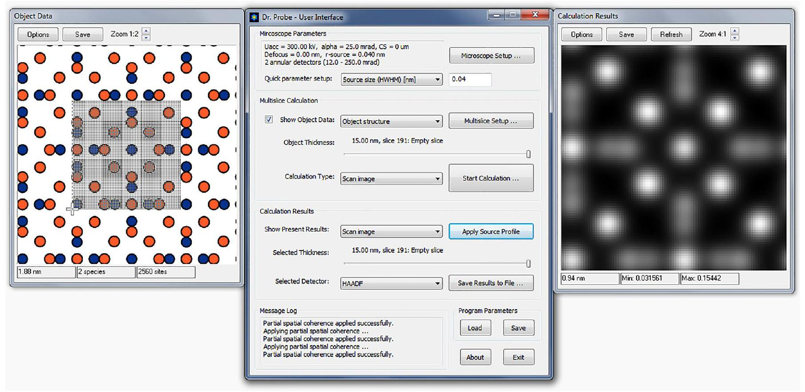
Fig. 1. Screenshot of the Dr. Probe graphical user interface showing, as an example, the structure model of $\mathrm{Ru}_{3} \mathrm{Sn}_{7}[16]$ in [001] projection and a corresponding HAADF image calculated for an aberration corrected STEM instrument with 80 pm resolution at 300 kV accelerating voltage and for a sample of 15 nm thickness.

particular methods, their implementation, and functionalities available with the graphical user interface for STEM simulations. Additional and more detailed information is presented on the Dr. Probe website [17] which contains an extensive documentation of all software features as well as introductory examples.

## 2. Methods

STEM image simulations with Dr. Probe apply the multislice method [18] to calculate the quasi-elastic forward scattering of the incident high-energy electron probes by the sample. While scanning an electron probe over positions distributed equidistantly in a rectangular frame, multislice electron-diffraction calculations are performed independently for each position, and the fractions of probe intensity falling into detector areas are registered. Atomic structure models are input to the simulations and provided in form of text lists similar to the CEL format of the EMS software [19] or by CIF structure files [20]. Information is required regarding the input cell dimension, angles, and symmetries together with fractional coordinates, occupancy factors, and thermal vibration parameters for each atomic site. STEM detectors are placed in a diffraction plane as disks for bright-field (BF), and as rings for annular bright-field, and annular dark-field imaging. Azimuthal segments of disks and rings are supported enabling the simulation of differential phase-contrast imaging [21,22]. A radial sensitivity profile may be specified for each detector, allowing a more accurate quantitative comparison between simulation and experiment [23]. With one simulation run, images are calculated for multiple detectors.

Image simulations with the Dr. Probe software have been tested for consistency with other simulation programs. The calculation of projected potentials agrees down to the numerical single-precision level $\left(10^{-6}\right)$ with those of $\mu$ STEM [24] when using the same atomic form factors of Waasmaier \& Kirfel [25]. HAADF STEM image intensities agree on the sub-percent level with $\mu$ STEM results also when form factors of Weickenmeier \& Kohl [26] are used by Dr. Probe. HR-TEM image simulations with the Dr. Probe command-line tools have been checked to agree on an absolute scale to those of EMS [19] and MacTempas [27].

### 2.1. Electron-probe formation

Experimental parameters relevant for an image simulation essentially define the shape of the electron probe and how it propagates through an atomic structure. The most important instrumental parameters are

- the kinetic energy $e U$ of the incident electrons, where $U$ is the microscope's accelerating voltage and $e$ is the elementary charge,
- the size of the probe-forming aperture in terms of the semi-convergence angle $\alpha$,
- coefficients of coherent aberrations of the probe forming lenses (e.g. defocus $C_{1,0}$, two-fold astigmatism $C_{1,2}$, coma $C_{2,1}$, three-fold astigmatism $C_{2,3}$, spherical aberration $C_{3,0}$, etc.), and
- the effective diameter $D_{0}$ (FWHM) of the source in the object plane.

The kinetic energy of the incident electron determines its de Broglie wavelength according to the formula

$$
\lambda=\frac{c h}{\sqrt{e U\left(e U+2 m_{0} c^{2}\right)}},
$$

where $c$ is the speed of light in vacuum, $h$ is Planck's constant, and $m_{0}$ is the rest mass of the electron. A convergent electron probe incident along the $z$ axis on a point $\boldsymbol{R}=(x, y)$ of the object plane is calculated in a conjugate reciprocal-space plane with vectors $\boldsymbol{k}=\left(k_{x}, k_{y}\right)$ according to the expression

$$
\psi_{0}(\boldsymbol{k} ; \boldsymbol{R})=A(\boldsymbol{k}) \exp [-i \chi(\boldsymbol{k})] \exp [-2 \pi i \boldsymbol{k} \cdot \boldsymbol{R}],
$$

where $A(\boldsymbol{k})$ is an aperture function, and $\chi(\boldsymbol{k})$ describes the coherent aberrations of the probe. The vector $\boldsymbol{k}$ is the component of the wave vector $\boldsymbol{K}$ perpendicular to the $z$ axis and $\lambda=1 /|\boldsymbol{K}|$. Within the usual approximation for small angles ( $\theta \approx \lambda|\boldsymbol{k}| \ll 1$ ), the parallel component $k_{z}$ is approximately constant with $k_{z} \approx|\boldsymbol{K}|$. Respective phase factors $\exp \left[2 \pi i k_{z} z\right]$ are omitted in the probe wave function of Eq. (2). The aperture $A(\boldsymbol{k})$ blocks incident electrons with trajectories having angles $\theta>\alpha$ with respect to the $z$ axis, and the aberration function is a polynomial of the form

## b   $\mathbf{1 0 ~ m r a d}$

c

0

Fig. 2. Images related to STEM probe formation as generated by the Dr. Probe user interface showing (a) an aberration function, (b) a ronchigram at 90 nm defocus, and (c) a probe intensity distribution. The examples are for 300 keV electrons, a semi-convergence angle of 25 mrad , and an effective source size of 80 pm . A strong and dominant three-fold astigmatism of 415 nm has been applied besides small other aberrations.

$$
\chi(\boldsymbol{k})=\frac{2 \pi}{\lambda} \Re\left[\sum_{j=1}^{N} \sum_{l=0}^{L(j)} \frac{C_{j+l-1, j-l}}{j+l} \lambda^{j+l}\left(k^{*}\right)^{j} k^{l}\right],
$$

describing an expansion to the order $N$ in powers of $k$. The second summation is up to a dynamic limit $L(j)=\min (j, N-j)$ depending on the index $j$ of the first summation, such that $1 \leq j+l \leq N$. The symbol $\Re$ indicates that the real part is taken from the polynomial as a function of wave-vector components in complex number notation $k=k_{x}+i k_{y}$, $k^{*}=k_{x}-i k_{y} \quad$ with complex-valued aberration coefficients $C_{m, n}=C_{m, n, x}+i C_{m, n, y}$. The general expression in Eq. (3) reproduces the notation used by Krivanek et al. [1]. The probe wave function in real space is obtained by the inverse Fourier transformation of Eq. (2). Reference of the Fourier transformation and its discretized numerical form used in the program is given in Appendix A. The effect of instrumental parameters on the formation of the electron probes and ronchigrams as displayed in Fig. 2 can be studied in real-time on user input with a dialog of the user interface. The implementation of Eq. (3) in the Dr. Probe user interface supports an expansion up to the order $N=8$.

### 2.2. Electron-diffraction calculation

Electron diffraction calculations by the multislice method can be implemented efficiently as an iterative algorithm of electron scattering in a thin object slice and subsequent propagation to the next slice [18]. The electron scattering in an object slice $j$ is described by multiplication of the electron wave function with a transmission function $T_{j}(\boldsymbol{r})$. Propagation of the scattering result to the next slice is done by multiplication of a propagator function $P_{j}(\boldsymbol{k})$ in reciprocal space. Slices are partitions of the input atomic structure along $z$, ideally made thin enough to contain only one atomic plane. Given a wave function $\psi_{j}(\boldsymbol{r})$ present in the slice plane number $j$, the wave function in the next slice plane $j+1$ is calculated as

$$
\psi_{j+1}(\boldsymbol{r})=\mathscr{F}^{-1}\left[P_{j}(\boldsymbol{k}) \mathscr{F}\left[T_{j}(\boldsymbol{r}) \psi_{j}(\boldsymbol{r})\right]\right] .
$$

This sequence of scattering and propagation is iterated over the slices of the structure model until the target specimen thickness is reached. The iteration begins at the entrance plane $j=0$ with incident wave function $\psi_{0}(\boldsymbol{r})$, as obtained by inverse Fourier transformation of Eq. (2). Fast numerical Fourier transformations provide an efficient way to implement the algorithm as described by Ishizuka and Uyeda [28].

Transmission functions, also called phase gratings, describe the scattering of the electron from the atoms in an object slice in terms of phase changes applied to the electron wave function. In approximation for high electron energies $e U$ and $m_{0} c^{2} \gg V(\boldsymbol{r})$ [29], the phase change is calculated from a projected scattering potential $V_{j}^{P}(\boldsymbol{r})$ for each slice as a complex phase factor

$$
T_{j}(\boldsymbol{r})=e^{i \sigma V_{j}^{P}(\boldsymbol{r})},
$$

with interaction constant $\sigma=m \lambda /\left(2 \pi \hbar^{2}\right)$. The interaction constant contains the relativistic electron mass $m=\gamma m_{0}$ with $\gamma=1+e U /\left(m_{0} c^{2}\right)$, the electron wavelength $\lambda$, and $\hbar=h /(2 \pi)$. Projected potentials are integrals of the three-dimensional scattering potential $V(\boldsymbol{r}, \boldsymbol{z})$ along the $z$ axis over right-open slice intervals $\left[z_{j}, z_{j+1}\right)$
described by the formula

$$
V_{j}^{P}(\boldsymbol{r})=\int_{z_{j}}^{z_{j+1}} V(\boldsymbol{r}, z) d z
$$

For the numerical implementation, Eq. (6) is approximated by a full projection of a surrogate potential $V_{j}(\boldsymbol{r}, z)$, which only includes contributions from the atoms contained in slice $j$. In this way, the projected potential can be computed efficiently by taking the inverse Fourier transformation of $\left.V_{j}\left(\boldsymbol{k}, k_{z}\right)\right|_{k_{z}=0}$ in the reciprocal slice plane by the formula

$$
V_{j}^{P}(\boldsymbol{r}) \approx \int_{-\infty}^{+\infty} V_{j}(\boldsymbol{r}, z) d z=\mathscr{F}^{-1}\left[V_{j}(\boldsymbol{k}, 0)\right]
$$

instead of handling and integrating a three-dimensional potential. The Fourier coefficients of the projected potential $V_{j}(\boldsymbol{k}, 0)$ are sums of atomic form factors $f_{\alpha}^{e}(|\boldsymbol{k}|)$ for electron scattering of atom types identified by index $\alpha$ as in the expression

$$
V_{j}(\boldsymbol{k}, 0)=V_{j}^{P}(\boldsymbol{k})=\frac{2 \pi \hbar^{2}}{m_{0} a b} \sum_{\alpha=1}^{N_{t}} f_{\alpha}^{e}(|\boldsymbol{k}|) \sum_{l=1}^{N_{\alpha, j}} \eta_{\alpha, l} e^{-2 \pi i \boldsymbol{k} \cdot \boldsymbol{R}_{\alpha, l}},
$$

with factors $\eta_{\alpha, l}$ accounting for partial site occupancy and a phase factor for shifting atomic form factors to the projected atom position $\boldsymbol{R}_{\alpha}$, ${ }_{l}$. The second sum of Eq. (8) includes only the $N_{\alpha, j}$ atoms with equilibrium positions in slice $j$. The product of the orthogonal supercell extensions $a$ and $b$ in the denominator of the pre-factor is due to a boxnormalization by the slice area when sampling form factors on discrete points of the reciprocal slice plane under periodic boundary conditions (cf. Eq. (A3) in Appendix A). The double summation over all $N_{t}$ types of atoms and the $N_{\alpha, j}$ atoms of type $\alpha$ in slice $j$ represents a two-dimensional structure factor given by

$$
F_{j}(\boldsymbol{k})=\sum_{\alpha=1}^{N_{t}} f_{\alpha}^{e}(|\boldsymbol{k}|) \sum_{l=1}^{N_{\alpha, j}} \eta_{\alpha, l} e^{-2 \pi i \boldsymbol{k} \cdot \boldsymbol{R}_{\alpha, l}} .
$$

Inserting Eqs. (7) to (9) in Eq. (5) yields a compact expression for the numerical calculation of slice transmission functions

$$
T_{j}(\boldsymbol{r})=\exp \left[i \gamma \frac{\lambda}{a b} F_{j}(\boldsymbol{r})\right],
$$

where the functions $F_{j}(\boldsymbol{r})$ are obtained by inverse Fourier transform of Eq. (9).

The numerical calculations of transmission functions are performed on a two-dimensional grid of $N_{a} \times N_{b}$ points $\boldsymbol{r}=\left(r a / N_{a}, s b / N_{b}\right)$ with integer $r$ and $s$ in ranges $0 \leq r<N_{a}$ and $0 \leq s<N_{b}$ for a given size $a \times b$ of the supercell in the slice plane. Resulting real-space sampling rates $a / N_{a}$ and $b / N_{b}$ are related to the highest spatial frequencies $k_{\mathrm{Ny}, a}=N_{a} /(2 a)$ and $k_{\mathrm{Ny}, b}=N_{b} /(2 b)$ (Nyquist frequencies) and the reciprocal grid is sampled at points $\boldsymbol{k}=(u / a, v / b)$ with integer $u$ and $v$ in ranges $-N_{a} / 2 \leq u<N_{a} / 2$ and $-N_{b} / 2 \leq v<N_{b} / 2$. A further numerical limitation of the maximum diffraction vector $k_{\text {max }}$ is applied by an artificial circular aperture at $2 / 3$ of the smaller Nyquist frequency for propagators and transmission functions. This aperture suppresses the generation of diffracted beams with alias frequencies due to periodic wrap around occurring with the repeated forward and inverse Fourier transformation in Eq. (4). Including the aperture, the maximum
diffraction vector considered by the diffraction simulation is given by
$k_{\text {max }} \leq \frac{1}{3} \min \left(\frac{N_{a}}{a}, \frac{N_{b}}{b}\right)$.

Although using lower number of grid points is favorable in terms of calculation speed, too low numbers may cause a loss of accuracy by cutting off significant Fourier coefficients $V_{j}^{P}(\boldsymbol{k})$ of projected potentials. When preparing a simulation, the number of samples $N_{a}$ and $N_{b}$ should be chosen based on Eq. (11), where the value of $k_{\text {max }}$ relevant for the numerical calculation can be decided by fulfilling the following two conditions: (i) The maximum scattering angle $\theta_{\text {max }}$ with $2 \sin \left(\theta_{\text {max }} / 2\right)=\lambda k_{\text {max }}$ should be larger than the largest detection angle, and (ii) applied atomic form factors $f_{\alpha}^{e}(|\boldsymbol{k}|)$ should be sufficiently decayed at $|\boldsymbol{k}|=k_{\text {max }}$. While reasoning for the first condition is trivial, the second condition depends on accuracy requirements defining which decay of form factors is acceptable in a particular case. Working with a too low $k_{\text {max }}$ results in real-space grid which is too coarse for an accurate sampling of the sharp potential peaks occurring at the projected atomic positions. As a consequence, the scattering strengths of the corresponding atoms are reduced. An example has been discussed by Forbes et al. [30] who found "imperceptively different results" when reducing $k_{\text {max }}$ from $3301 / \mathrm{nm}$ to $1651 / \mathrm{nm}$ for the diffraction of electrons with 300 keV kinetic energy by a thin strontium titanate crystal. Similar convergence tests could help to determine optimum sampling parameters when aiming for highly accurate simulations.

The atomic form factors $f_{\alpha}^{e}(|\boldsymbol{k}|)$ are calculated with the parameterization and tables published by Weickenmeier \& Kohl [26]. This parameterization implicitly reproduces the asymptotic behavior of screened Coulomb potentials at large scattering angles relevant for HAADF STEM imaging. In addition, absorptive form factors are available with this parameterization in an already integrated form, which account for the loss of probe current in the elastic channel due to thermal-diffuse scattering by phonon excitations. Absorptive form factors may be used for pure bright-field calculations when including damping of form factors by Debye-Waller factors $e^{-B|\boldsymbol{k}|^{2} / 4}$ due thermal vibrations. The Debye-Waller parameter is given by $B=8 \pi^{2} u_{s}^{2}$, and $u_{s}^{2}=u_{x}^{2}=u_{y}^{2}=u_{z}^{2}$ is the isotropic equivalent mean square displacement amplitude. Calculations including thermal-diffuse scattering and in particular scattering to large angles, e.g. HAADF STEM, should be done without Debye-Waller factors in a different approach, as will be discussed in detail below.

Free-space propagator functions $P_{j}=e^{-i \chi_{j}}$ applied with each step of the multislice algorithm in Eq. (4) account for the phase shifts $\chi_{j}$ of the partial plane waves (beams) after diffraction by the projected potential. The phase shift for a beam under given diffraction angle $\theta$ is measured relative to that of the beam along the $z$ direction of the simulation frame. It is proportional to the respective difference $\Delta s_{j}$ in optical path length for considering the transfer of two different beams between two parallel planes, which are at distance $c_{j}$ to each other, as illustrated in Fig. 3a. The relation between relative phase shift and optical path difference is given by the equation

$$
\chi_{j}=\frac{2 \pi}{\lambda} \Delta s_{j} .
$$

Geometrical analysis for $\Delta s_{j}$ yields a formula for the relative phase shift with

$$
\chi_{j}(\theta, \varphi, \tau, \xi)=\frac{2 \pi}{\lambda} c_{j}\left[\frac{1}{\cos (\tau)}-\frac{1}{\cos (\theta) \cos (\tau)+\cos (\xi-\varphi) \sin (\theta) \sin (\tau)}\right],
$$

where a general tilt of plane normals has been considered by angles $\tau$ with respect to the $z$ axis and an orientation $\xi$ of the tilt to the $x$ axis. Angles $\theta$ and $\varphi$ denote scattering angle and orientation, respectively.

The application of a propagator for tilted planes allows us to simulate tilt of the crystal structure away from a zone axis avoiding conflict with periodic boundary conditions in the structure model as proposed by Chen et al. [31]. The angular variables in Eq. (13) are related to the component $\boldsymbol{k}=\left(k_{x}, k_{y}\right)$ of the wave vector $\boldsymbol{K}=\left(\boldsymbol{k}, k_{z}\right)$ with

$$
\sin (\theta)=\lambda|\boldsymbol{k}|, k_{x}=|\boldsymbol{k}| \cos (\varphi), k_{y}=|\boldsymbol{k}| \sin (\varphi),
$$

and to the respective component $\boldsymbol{t}$ of a reference wave vector $\boldsymbol{K}_{\boldsymbol{t}}=\left(\boldsymbol{t}, t_{z}\right)$ with

$$
\sin (\tau)=\lambda|\boldsymbol{t}|, t_{x}=|\boldsymbol{t}| \cos (\xi), t_{y}=|\boldsymbol{t}| \sin (\xi) .
$$

In the approximation for small angles $\theta$ and $\tau$, Eq. (13) simplifies drastically to the well-known formula of the parabolic propagator

$$
\chi_{j}(\theta, \varphi, \tau, \xi)=\chi_{j}(\boldsymbol{k}, \boldsymbol{t}) \approx-\pi \lambda c_{j}\left(|\boldsymbol{k}-\boldsymbol{t}|^{2}-|\boldsymbol{t}|^{2}\right),
$$

which can be safely applied for bright-field STEM and TEM simulations with medium and high accelerating voltages. The relative error made with the small angle approximation of Eq. (16) compared to the propagator in Eq. (13) is on the order of $10^{-3}$ for typical bright-field TEM regimes below 50 mrad . In the large-angle regime, the relative error increases to a few percent as shown in Fig. 3b. Simulations with the Dr. Probe user interface apply propagators with phase shifts given by Eq. (13).

### 2.3. Thermal-diffuse scattering

Thermal-diffuse scattering (TDS) is simulated by the frozen-lattice approach [32] with random atomic displacements following a normal probability distribution (Einstein solid). The root mean square width $\left\langle u_{s}^{2}\right\rangle^{-1 / 2}$ of the displacement distribution along a spatial axis is parameterized by isotropic, equivalent thermal-displacement parameters $U$ or $B$ with $\left\langle u_{s}^{2}\right\rangle=U=B /\left(8 \pi^{2}\right)$, which has been introduced above as Debye-Waller parameter. The parameters $U$ or $B$ are provided individually for each atomic site with the input structure model. After partitioning the structure into thin slices, respectively scaled random displacements are added to the equilibrium position $\boldsymbol{R}_{\alpha, l}$ of each atom before calculating the projected slice structure-factor $F_{j}(\boldsymbol{k})$ as in Eq. (10). The random displacements follow a normal probability distribution implemented by Box-Muller transformation of uniformly
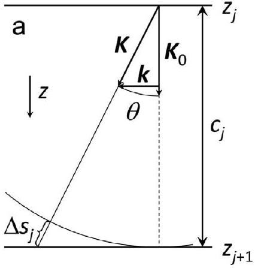
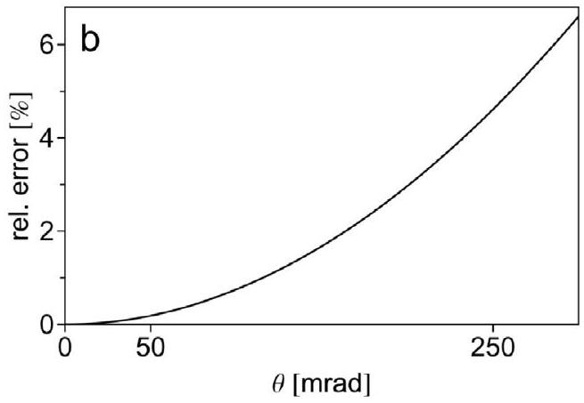

Fig. 3. (a) Ray diagram illustrating the optical path difference $\Delta s_{j}$ for two plane waves with wave vectors $\boldsymbol{K}$ and $\boldsymbol{K}_{0}$ under relative angle of $\theta$ traveling in free space downwards between two parallel planes. (b) Relative error of the small angle approximation with a parabolic propagator of Eq. (16) compared to the propagator based on the optical path difference in Eq. (13) without sample tilt.

periodic structure model
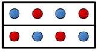

slice 1 slice 2

## prepared frozen-lattice configurations

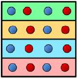
slice 1, config. 1
slice 1, config. 2
slice 1, config. 3
slice 1, config. 4
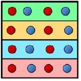
slice 2, config. 1
slice 2, config. 2
slice 2, config. 3
slice 2, config. 4

two object slice sequences created by random selection
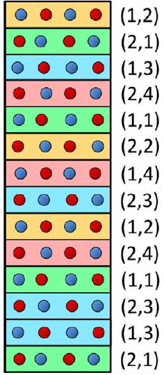

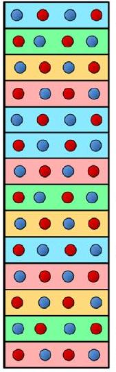

Fig. 4. Scheme of frozen-lattice variation implemented in the Dr. Probe multislice algorithm. For a given periodic structure model, a certain number (here 4) of frozen-lattice configurations are pre-calculated for each slice (here 2 ) and stored as set of transmission functions in the computer working memory. During each step of the multislice, a random configuration is selected from the stored sets, building an individual sequence of random atomic displacements. Two examples are shown on the right side, where pairs of numbers in brackets denote the structure slice and the index of the randomly selected configuration which is color-coded additionally.
distributed pseudo-random numbers [33]. Care is taken, that partial form factors of different atomic species assigned to the same site are displaced coherently in the case of mixed partial site occupancy.

The implementation of frozen-lattice variations in the multislice algorithm is realized with a set of pre-calculated frozen states for each slice of the input structure. The specific transmission function applied for an object slice is chosen randomly from the set of prepared configurations as illustrated in Fig. 4. By this way, an individual sequence of the pre-calculated random atom displacements is produced for each multislice calculation by repeated application of the random selection scheme over the whole sample thickness.

Pre-loading a large set of transmission functions with different random atomic displacements into the computer working memory enables fast run-time variation of frozen-lattice configurations. Each pixel of a scan image may then be calculated with a different frozen lattice of the sample without repeating the often computational demanding calculation of projected potentials with new random displacements. This procedure also reproduces closely the actual scenario of sequential scan-image recording, where each electron of the scanning probe is diffracted by an atomic structure in a different state and the image intensity is generated by an incoherent superposition of such individual electron-diffraction signals. Furthermore, free control is achieved over the number of lattice configurations applied to a probe position (scan pixel) during run-time without additional computational effort. The frozen-lattice variation can thus be combined with simultaneous statistical variations of probe position and probe aberrations, for example when simulating partial spatial and partial temporal coherence of the electron probe, or to calculate position-averaged convergent-beam electron-diffraction (PACBED) patterns.

The random selection described above is limited in terms of how many configurations can be stored in the working memory of a computer. Random sequences drawn from a limited statistical set as such are also not as statistically independent as if new random displacements would have been calculated for each multislice run. However, with a large number of pre-calculated configurations, random sequences provide a sufficiently rich diversity such that a good estimate of thermaldiffuse scattering can be achieved. As a rough guideline for thicker samples, the number of statistically independent configurations per slice of the periodic unit should be larger than the number of repeats of that unit to realize the target sample thickness. In this case, consecutive repeats of the same displacement configuration become rare events and can be almost completely avoided by applying random selection without returning. For very thin samples, the number of statistically independent configurations of the periodic unit should be larger than the number of multislice calculations performed for probe positions within the area illuminated by the probe. The two guidelines stated
above should be applied in combination, i.e. by using the larger of the two numbers.

## 3. Results and discussion

A very practical feature of the Dr. Probe software is the option to extract signal at periodic thickness levels up to a maximum object thickness in one simulation run. This means that STEM images for all detectors, wave functions, or diffraction patterns are generated as a series over sample thickness with minimum additional effort. Example images are displayed in Fig. 5 for three different thicknesses of a $\mathrm{Ru}_{3} \mathrm{Sn}_{7}$ crystal in [001] orientation (cf. Fig. 1) where STEM images of three different detectors ( $\mathrm{BF}, \mathrm{ABF}$, and HAADF) have been calculated simultaneously in one simulation run. The simulation was done for an aberration-free 300 keV electron probe with 25 mrad semi-convergence angle and an effective source size of 80 pm . Detectors were placed on the optical axis in the diffraction plane as a BF detector disk of 5 mrad radius, an ABF detector from 12 mrad to 24 mrad , and a HAADF detector from 80 mrad to 200 mrad . As expected, the BF images show strong contrast variations with increasing thickness, while this is greatly reduced for ABF and essentially absent in HAADF images. The PACBED patterns in the rightmost column required a different simulation setup with 10 mrad semi-convergence angle and were calculated in a second run. These patterns show a strong variation of beam excitations and interferences in the bright-field region, which can find use in accurate measurements of sample thickness and tilt [34].

Extracting detected signal at each slice of the object structure is the densest sampling of thickness dependency achievably with multislice calculations. Such image series may provide insight into the dynamics of the electron probe diffraction and propagation as a function of sample thickness and probe position. Examples are displayed in Fig. 6 in form of intensity distributions in the $x-z$ plane containing the incident probe position, where the electron probe propagates through the sample along $z$ from top to bottom. Common to all three profiles is a focusing of the probe intensity to the first few nanometers of the sample. This indicates that the majority of the STEM signal will be generated from scattering events close to the entrance surface. The left profile shows also a transfer of intensity to the Ru column left of the Sn column where the probe was initially positioned. This cross-column intensity transfer is absent in the profile on the right, when the probe is positioned over a more isolated Ru column. Such observations may be of importance when evaluating STEM images in terms of local concentration. Probe intensity profiles also help to determine optimum experimental setups, for example to decide which sample tilt away from a crystallographic zone axis should be applied to maximize the signal for dopant atom detection [35] or how to obtain optimum signal for

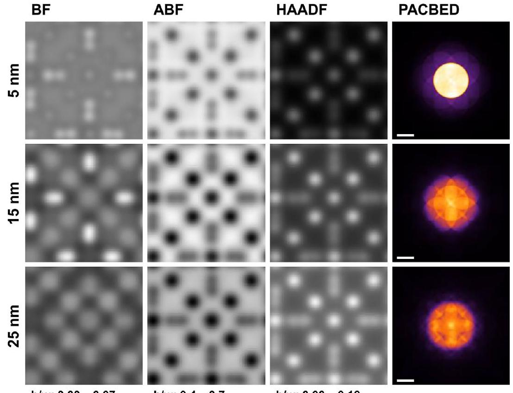
Fig. 5. Example STEM image simulation of the $\mathrm{Ru}_{3} \mathrm{Sn}_{7}$ crystal structure (cf. Fig. 1) for $\mathrm{BF}, \mathrm{ABF}$ and HAADF detectors and different sample thickness. The STEM images have an edge length of 0.937 nm and are displayed with linear gray-level scales over the intensity ranges noted below each column in fractions of the incident probe current. Each row corresponds to a different sample thickness, as noted on the left. The PACBED pattern simulated with 10 mrad probe semi-convergence angle for the same thicknesses are displayed in the rightmost column. The scale bars in the PACBED patterns correspond to 10 mrad .

b/w: 0.00-0.07

b/w: 0.4-0.7
composition analysis [36].
The requirement to perform many multislice calculations for STEM image simulations including thermal-diffuse scattering usually leads to very long calculation times on the scale of several minutes up to hours. Reduction of the computation time can be achieved in general by using faster computing hardware, by intensive parallelization of the algorithm, and by minimizing the number of multislice calculations with clever calculation setups and algorithms. While the computational power of hardware is usually a matter of financial resources, the latter two points, parallelization and optimized algorithms, need to be provided as functionality of the software.

Parallelization can be applied very effectively to STEM image
simulations, since the repeated multislice calculations are essentially independent and therefore pose a computational farming problem. This means that STEM simulations offer high parallelization potential on the level of single scan image pixels. Alternatively, parallelization approaches making use of the immense number of processing cores available on graphical processing units (GPUs) work on a lower algorithmic level to perform huge amounts of multiplications and Fourier transformations simultaneously. The parallelization concept used with the Dr. Probe GUI distributes individual multislice calculations over multiple CPU cores available on a given machine and combines the results to STEM images. Support of parallel GPU computing is under consideration for future versions. The command-line tools of the Dr.

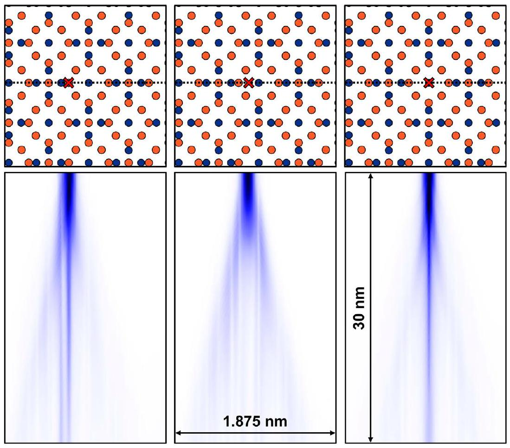
Fig. 6. Intensity profiles for three different probe positions as indicated by the crosses in the structure projections. The profiles show the intensity distributions in a $\mathrm{Ru}_{3} \mathrm{Sn}_{7}$ sample of 30 nm thickness in the $x-z$ plane marked by the dotted line in the projected structure models above. The electron probe is placed (left) on a Sn column close to a Ru column, (center) over free space between two columns, and (right) on a more isolated Ru column.

Probe package are designed to calculate strictly on a single CPU core. This provides control over the use of CPUs when running multiple calculation processes in parallel, for example by calls from a scripting language.

Optimized scan setups, e.g. by minimizing the number of scan pixels, provide a very efficient way of reducing the computational costs for essentially all simulation scenarios [37]. The range of spatial frequencies of STEM images is limited by the effective probe size in the object plane. The maximum spatial frequency to be expected in this context is $g_{\text {max }}=2 \alpha / \lambda$, neglecting a further limitation due to partial coherence effects, where $\alpha$ is the semi-convergence angle and $\lambda$ the electron wavelength. Accordingly, the minimum number of scan pixels $N_{\mathrm{h}, \mathrm{v}}$ for a rectangular scan frame of edge lengths $L_{\mathrm{h}, \mathrm{v}}$ required to sample spatial frequencies up to $g_{\text {max }}$ is given by the formula

$$
N_{\mathrm{h}, \mathrm{v}}=4 L_{\mathrm{h}, \mathrm{v}} \alpha / \lambda,
$$

where the indices " $h$ " and " $v$ " denote the quantities applying to the horizontal ( h ) and vertical (v) direction of the scan frame. For a periodic object, minimum edge lengths of the scan frame are obtained by setting them equal to the edge lengths of the projected unit cell.

The finally decisive factor determining the computational costs of a STEM simulation with a given computer program, regardless of the applied parallelization approach, is the total number of multislice calculations to be performed. Intuitively, one might assume that this number is equal to the number of scan pixels, and this is certainly sufficient as long as the target is a qualitative comparison between experiment and simulation. However, a significant variation of the detected intensity is caused by frozen-lattice variations. This signal variation is visible in the middle row of Fig. 7, where only one individual frozen-lattice configuration has been used for each probe position. Due to the low number of samples taken from the set of frozen states, the signal registered for identical atomic columns still varies even when evaluating integrated column intensities and after applying the convolution with the effective source distribution. The effect of insufficient averaging can be observed also in diffraction patterns as displayed in Fig. 8, where the expected character of thermal diffuse scattering is reproduced only in the patterns calculated from a significant number of configurations. Thus, a certain amount of averaging over frozen-lattice configurations is required in order to achieve quantitatively correct simulations.

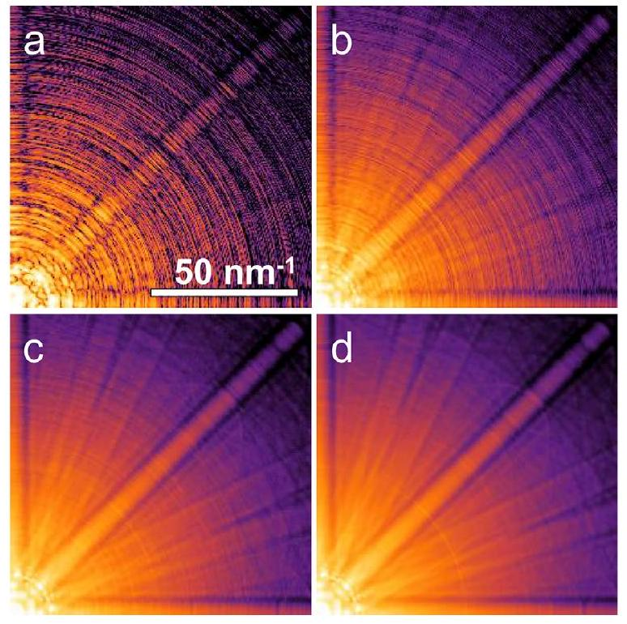
Fig. 8. Convergent-beam electron-diffraction patterns of a STEM probe placed over a Sr column in perovskite $\mathrm{SrTiO}_{3}$ calculated with parameters as in Fig. 7. The crystal is in [001] orientation and has a thickness of 20 nm . Different amounts of frozen-lattice configurations were used in the calculations: (a) shows the result obtained with one configuration, while the other patterns are averages of (b) 10, (c) 100, and (d) 1000 configurations. All patterns show one quarter of the diffraction plane with the origin in the lower left corner and a common scale bar as displayed in (a). The diffraction intensity distributions are color-coded on the same logarithmic scale.

An interesting question is therefore: How often should the multislice calculation be repeated per scan pixel for averaging frozen-lattice configurations until a sufficiently accurate signal estimate is obtained? There are two alternative routes for improving the accuracy of the simulation with approximately similar additional computational effort (i) averaging multiple calculations per scan pixel and (ii) increasing the number of scan pixels per unit area. The second route requires a flexible variation scheme as described above, i.e. the ability to calculate each probe position with different lattice configurations. The subsequent

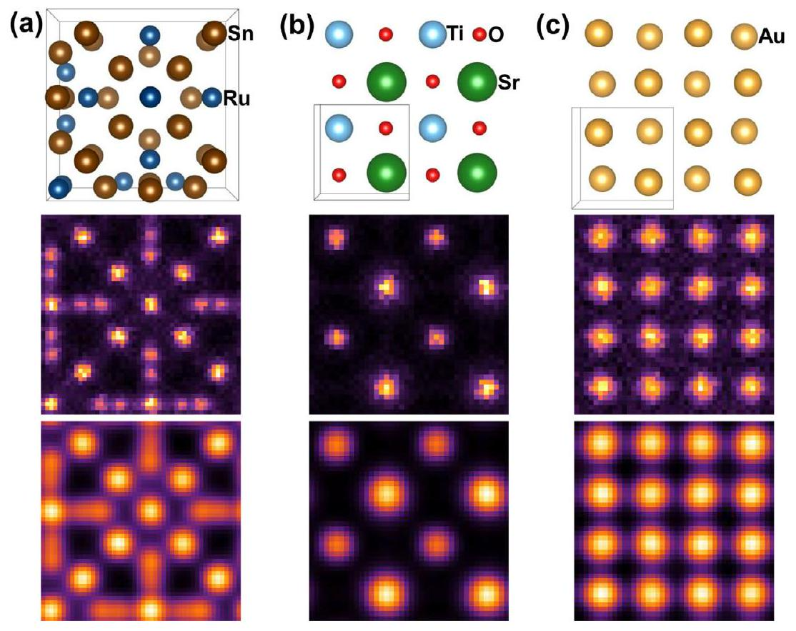
Fig. 7. HAADF STEM image simulations for (a) $\mathrm{Ru}_{3} \mathrm{Sn}_{7}$ [001], (b) $\mathrm{SrTiO}_{3}$ [001], and (c) Au [001] as displayed by the structure models in the top row (rendered by VESTA [38]) with unit cells marked by boxes. Image simulations were performed for aberration-free 300 keV electron probes with a semi-convergence angle of $\alpha=25 \mathrm{mrad}$, a detector collection range of 80 mrad to 250 mrad , and a minimum number of probe positions. The middle row illustrates the signal variation obtained with one frozen-lattice configuration per probe position. Images in the bottom row are obtained from the middle row images by convolution with a Gaussian source distribution of 80 pm diameter (FWHM). The scan frame sizes are (a) 0.937 nm (48), (b) 0.781 nm (40), and (c) 0.816 nm (42), where numbers in brackets denote the respective number of probe positions used along each image dimension.

convolution with the effective source distribution will in this scheme average over the different configurations used for the probe positions within the source diameter. Increasing the number of scan pixels for a given scan area will consequently increase the number of configurations contributing to a scan pixel after convolution with the source distribution.

An uncertainty in the signal estimation on the side of the simulation can introduce a bias for the quantitative comparison between simulation and experiment, i.e. a systematic error, to the evaluation. In the following we will discuss the atom counting approach [34] in this context, which has high demands for signal-to-noise ratio and minimum simulation bias when aiming for single atom accuracy. In this approach, the simulation is used as calibration reference, and ideally the final counting error should be limited by the experimental recording noise. In order to minimize the influences of insufficiently known optical parameters, recording noise, and variations in the simulation, integrated or mean intensities are evaluated frequently, where signal is accumulated over image areas assigned to single atomic columns [12,34,39-41]. The same approach is applied here by summing intensities of discrete scan positions $\boldsymbol{x}_{i, j}$ according to the formula

$$
\bar{I}\left(\boldsymbol{x}_{0}\right)=\Delta x_{\mathrm{h}} \Delta x_{\mathrm{v}} \sum_{\boldsymbol{x}_{\mathrm{i}, \mathrm{j}} \in A} I\left(\boldsymbol{x}_{i, j}-\boldsymbol{x}_{0}\right),
$$

where $A$ denotes the area of the scan assigned to an atomic column position $\boldsymbol{x}_{0}$ in the image. Horizontal and vertical scan step sizes are denoted by $\Delta x_{\mathrm{h}}, \Delta x_{\mathrm{v}}$, respectively. When the integrated intensity of Eq. (18) is normalized as fraction of the incident probe intensity $I_{0}$, effective cross-sections $\sigma=\bar{I}\left(\boldsymbol{x}_{0}\right) / I_{0}$ of the electron probe are calculated in square length units [40]. For aberration-corrected STEM imaging such cross sections depend essentially on sample thickness (number of atoms in a column), structure, orientation, electron energy, probe convergence angle, and detector collection angle. In order to avoid confusion in the following, cross sections are denoted by the symbol $\sigma$, and standard deviations are denoted by the symbol $s$.

The variances of cross sections of the incident probe with atomic columns are estimated from HAADF STEM test simulations of perovskite $\mathrm{SrTiO}_{3}$ and f.c.c. Au crystals, both in [001] orientation, with the same parameters as those used for the simulated images displayed in Fig. 7. Two column species of medium core charge density are found in the $\mathrm{SrTiO}_{3}$ images (i) Sr columns with $Z=38$ and (ii) TiO columns with $\mathrm{Z}=22+8=30$ per periodic thickness unit ( $c=3.905 \AA$ ). These are compared to gold columns with a large core charge density of $Z=78$ per unit ( $c=4.078 \AA$ ). The tests are performed with minimum computational effort in terms of the number of multislice calculations, i.e. with minimum number of probe positions according to Eq. (17) and with one frozen-lattice configuration per probe position. However, each probe position is calculated with a different frozen-lattice configuration using the random selection scheme described in the previous section. The signal after convolution by the source distribution is integrated as described by Eq. (18) over circular areas of 130 pm and 90 pm radius around the known column positions for $\mathrm{SrTiO}_{3}$ and Au , respectively. Different radii are used here due to the different distances of apparent peaks in the HAADF scans. In total 640 peaks have been analyzed for each column species and thickness. The thickness dependency is sampled in discrete steps of a unit cell, thus corresponding to an increase of one Au atom, one Sr atom, and one TiO group, respectively.

The results of the statistical analysis are plotted in Fig. 9 over a range of sample thickness up to $250 \AA$. The mean values are on the order of $1000 \mathrm{pm}^{2}$ and show the monotonic increase over thickness already discussed by E et al. [40]. Slight changes in the slope are found for very thin samples below $50 \AA$. Consistently higher values are obtained for columns with higher accumulated core charge reproducing the well-known $Z$-contrast in STEM imaging [3]. Dots in the plot of Fig. 9a are for values obtained with $\mu$ STEM software and identical simulation setups. Good consistency is found between the two programs. The mean values deviate by less than $1 \%$, although different

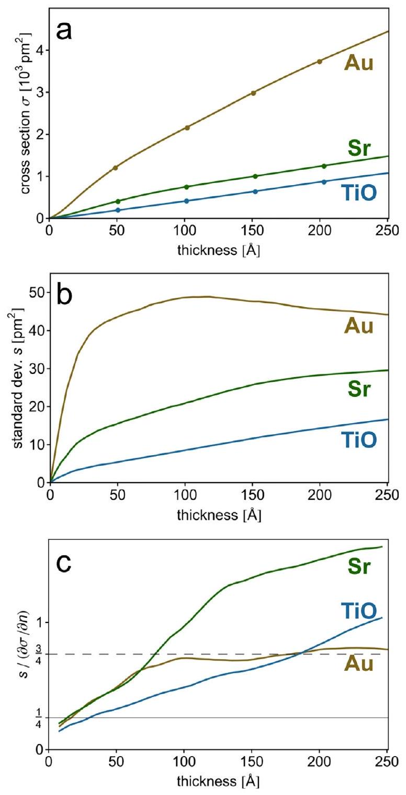
Fig. 9. Statistics on integrated column intensities measured as cross-sections of the incident probe. (a) Mean values (lines) compared to a few example values (dots) obtained with the $\mu$ STEM software [24]. (b) Standard deviations of effective cross-sections measured from Au (yellow), Sr (green), and TiO (blue) peaks in HAADF STEM images of Au [001] and $\mathrm{SrTiO}_{3}$ [001] (cf. Fig. 7). (c) Ratios of standard deviations $s$ and local slopes $\Delta \sigma / \Delta n$ of the mean signal with respect to a change in thickness by one unit cell, i.e. one atom. Horizontal lines mark the limits for atom counting errors of $\pm 0$ atoms (solid) and $\pm 1$ atom (dashed) with a confidence of $95 \%$ assuming normally distributed variations of cross-sections. (For interpretation of the references to color in this figure legend, the reader is referred to the web version of this article.)

parameterizations of atomic form factors were used. The deviations are in the range of expected variance caused by frozen-lattice variations in the applied test cases.

Standard deviations calculated from the 640 independent column scan images are by about two orders of magnitude smaller than the cross-section mean values with stronger slopes at lower thicknesses, see Fig. 9b. Interestingly, the standard deviation of the Au column data decreases even slightly beyond $100 \AA$ sample thickness. Although the relative errors of about $1 \%$ seem low and promising at first glance, the ability to determine the number of atoms in a column by means of cross-sections depends on the ratio between signal variation and signal gain per atom. Low ratios indicate better signal-to-noise ratio for atom counting. While the signal variation is reflected by the standard
deviation $s$ of the measured cross section, the signal gain per atom is given by the slope $\Delta \sigma / \Delta n$ with respect to a change in the number of atoms. Ratios $s /(\Delta \sigma / \Delta n)$ are plotted in Fig. 9c starting at values just below 1/4 for very thin samples and increasing to values close to or above 1 for thicker samples. This means, that the probability to determine the number of atoms correctly from measured cross-sections decreases with increasing thickness.

Assuming normally distributed variations of cross sections and a locally linear signal gain per atom, an atom counting error of $\pm 0$ can be achieved with better than $95 \%$ confidence if the ratio $s /(\Delta \sigma / \Delta n)$ is below $1 / 4$. Atom counting errors of $\pm 1$ are achieved with better than $95 \%$ confidence in cases with ratios below 3/4. Relaxing the confidence to $1 s$ levels (68\%) essentially doubles these limits. A derivation of these relations between ratio limits and atom counting error is presented in Appendix B for a reasonable linear approximation of local signal gain. In the presented test cases, atom counting errors of zero cannot be expected with high probability based on such minimum effort calculations. Counting Sr atoms with an error of $\pm 1$ requires a significantly lower variance of the simulation data for samples thicker than $100 \AA$, while this is already achievable with the minimum-effort setup for TiO and Au columns applied here. Lower ratios can be obtained by increasing the number $M$ of averaged frozen-lattice configurations per probe position. The improvement will, however, be approximately proportional to $\sqrt{M}$. Aiming for the lower limit of $1 / 4$ for counting errors of $\pm 0$, the number of configurations to average should be around 10 or more for TiO columns and Au columns and even 40 for counting Sr atoms. It should be emphasized again, that the error estimates presented here are due to variances introduced by the frozenlattice approach alone and do not consider experimental counting noise at all. Nevertheless, analogous error estimation is possible for the experimental data by replacing values for $s$ by respective estimates of signal variations occurring in experiment. If ratios $s /(\Delta \sigma / \Delta n)$ for the experimental data are much larger than those of the reference simulation, an increase of the number of averaged frozen-lattice configurations per probe position in the simulation will, however, not improve the error estimates for atom counting.

## 4. Conclusion

The Dr. Probe software for high-resolution STEM image simulation is introduced giving reference of the methods and approximations applied in the numerical calculations. A graphical user interface is available free-of-charge for academic and research institutions providing easy and intuitive access to quantitatively correct simulations. Program features interesting for most users are demonstrated by means of a few examples, such as the simultaneous calculation of bright-field, annular bright-field, and annular dark-field STEM images as series over
sample thickness. Guidelines for reasonable simulation setups are given concerning the required grid size to sample projected potentials, the required number of frozen-lattice configurations to consider, and the number of probe positions to be used. Detailed documentation describing how to use the software is available from a website [17].

An algorithm allowing fast run-time variation of frozen-lattice configurations for multislice simulations including thermal-diffuse scattering is described in detail. An effectively individual configuration of random atomic displacements can be used for each probe position by means of random selection from sufficiently large pre-calculated sets of slice transmission functions. This scheme provides full control over the number of configurations considered for each scan pixel and enables combined variations of frozen-lattice configurations, probe position and aberrations, e.g. for PACBED simulations and image calculations considering partial coherence.

HAADF STEM simulations performed with minimum computational effort, i.e. minimum number of probe positions per unit cell and one frozen-lattice configuration per probe position, show noticeable signal variations. Implications of these variations on the accuracy of atom counting using simulations as reference are discussed for selected examples. Case studies for perovskite $\mathrm{SrTiO}_{3}$ and f.c.c. Au, both in [001] crystal orientation indicate that such minimum effort calculations can introduce a systematic bias in the atom counting corresponding to an error of $\pm 1$ with $95 \%$ confidence even when evaluating integrated intensities. A reduction of this bias is possible by averaging over several calculations with different frozen-lattice configurations for each probe position or alternatively by increasing the number of probe positions per unit area. For the presented examples, an increase of computational effort by about a factor of 10 and more reduces the signal variance in the simulation to a level where the correct atom count can be determined with high confidence. The required minimum amount of extra averaging may however depend on the specific STEM setup and should be evaluated for each case. Such an increase of the already quite demanding computational effort for STEM image simulations is, however, only justified if the variance estimated for the experimental data is on a similar or even lower level.

## Acknowledgments

I want to acknowledge and thank M. Lentzen, A. Thust (Forschungszentrum Jülich GmbH, Germany), L. Houben (Weizmann Institute of Science, Isreal), L.J. Allen (University of Melbourne, Australia), and M. Heidelmann (University of Duisburg-Essen, Germany) for continuous discussions and feedback during the development of the Dr. Probe software. The German Science Foundation (DFG) is acknowledged for funding by the grant MA 1280/40-1.

## Appendix A. Fourier transformation

Fourier transformation is essential in the numerical realization of the multislice algorithm. It is also applied in the calculation of projected potential distributions in real space from atomic form factors given in reciprocal space, for band-width limitations, and for convolution of signal for example with source-distribution functions. The forward Fourier transformation of a function $y(x)$ is expressed in one dimension as

$$
\mathscr{F}[y(x)](k)=\tilde{y}(k)=\int_{-\infty}^{+\infty} y(x) e^{-2 \pi i k x} d x
$$

And the inverse Fourier transformation is given by

$$
\mathscr{F}^{-1}[\widetilde{y}(k)](x)=y(x)=\int_{-\infty}^{+\infty} \tilde{y}(k) e^{2 \pi i k x} d k .
$$

The discretized Fourier transformation used in the multislice algorithm works on two-dimensional arrays of size $n \times m$ and assumes periodic boundary conditions along both dimensions. The implementation used by Dr. Probe is based on the FFTPACK library [42]. Box normalization is applied as in the following formula for the Fourier coefficients

$$
\tilde{y}_{u, v}=\frac{1}{m n} \sum_{r=0}^{m-1} \sum_{s=0}^{n-1} y_{r, s} e^{-2 \pi i(u r / m+v s / n)},
$$

and for the inverse transformation to real-space data
$y_{r, s}=\sum_{u=0}^{m-1} \sum_{v=0}^{m-1} \tilde{y}_{u, v} e^{2 \pi i(u r / m+v s / n)}$,
where indices $(r, s)$ and $(u, v)$ denote zero-based pixel indices along the two dimensions sampled by $m$ and $n$ points in real space and reciprocal space, respectively. The normalization should be considered when evaluating wave-function output in terms of the incident probe current. For example the DC Fourier coefficient $\widetilde{y}_{0,0}$ corresponds to the mean value of the real-space data. In the main text, the Fourier-space representation is noted by an explicit dependency on a reciprocal coordinate $k$ or $q$, i.e. by $y(k)$ instead of using a curly mark $\tilde{y}$, whereas $y(r)$ denotes the representation of a function of a real space coordinate $r$ or $x$.

## Appendix B. Derivation of limits for estimating atom counting errors

We assume a normal distribution of observed cross-section data $\sigma$ with the probability density functions
$p_{n}\left(\sigma ; \sigma_{n}, s_{n}\right)=\exp \left(\frac{-\left(\sigma-\sigma_{n}\right)^{2}}{2 s_{n}^{2}}\right) / \sqrt{2 \pi s_{n}^{2}}$,
around mean values $\sigma_{n}$ with variances $s_{n}^{2}$, where $n$ identifies an integer number of atoms in a column. We assume further a positive signal gain $\mu_{n}=\frac{\Delta \sigma_{n}}{\Delta n}>0$ per atom and that atom counting is done by assigning an observed signal $\sigma$ to a number of atoms $n$ where $\left(\sigma-\sigma_{n}\right)^{2}$ is minimum. In this scenario and within a linear approximation between discrete expectation values $\sigma_{n}$ of the signal as obtained from a reference simulation, the assignment $\sigma \rightarrow n$ can be done based on the condition
$\sigma_{\text {low }}=\frac{\sigma_{n}-\sigma_{n-1}}{2}<\sigma \leq \frac{\sigma_{n+1}-\sigma_{n}}{2}=\sigma_{\text {high }}$.

The probability that the correct number of atoms (no counting error) is assigned for a given signal is then determined by
$P_{0}\left(n, \sigma_{n}, s_{n}\right)=\frac{\int_{\sigma_{\text {low }}}^{\sigma_{\text {high }}} p_{n}\left(\sigma ; \sigma_{n}, s_{n}\right) d \sigma}{\sum_{i=n_{\text {min }}}^{n_{\text {max }}} \int_{\sigma_{\text {low }}}^{\sigma_{\text {high }}} p_{i}\left(\sigma ; \sigma_{i}, s_{i}\right) d \sigma}$,
where the atom counts $n_{\text {min }} \geq 1$ and $n_{\text {max }}$ cover a sufficiently large range of probability distributions with significant contribution in the integrated signal range $\left\{\sigma_{\text {low }}, \sigma_{\text {high }}\right\}$. Accordingly, the probability to make similar assignments with a counting error of $\delta n$ is given by
$P_{\delta n}\left(n, \sigma_{n}, s_{n}\right)=\frac{\sum_{i=n-\delta n}^{n+\delta n} \int_{\sigma_{\text {low }}}^{\sigma_{\text {high }}} p_{i}\left(\sigma ; \sigma_{n}, s_{n}\right) d \sigma}{\sum_{i=n_{\text {min }}}^{n_{\text {max }}} \int_{\sigma_{\text {low }}}^{\sigma_{\text {high }}} p_{i}\left(\sigma ; \sigma_{n}, s_{n}\right) d \sigma}$.

The summation range in the numerator of Eq. (B4) should be limited such that $n-\delta n \geq 1$.
The probability $P_{\delta n}\left(n, \sigma_{n}, s_{n}\right)$ of identifying the number of atoms $n$ in a column from the measured signal with an error of $\delta n$ reflects the confidence of successful atom counting. Fig. B1 shows how the confidence decays with increasing estimate of the signal variance $s$ relative to the signal gain $\Delta \sigma / \Delta n$ per atom when aiming for counting errors of 0 and 1 . For the calculation of the plotted confidences a constant signal gain per atom and equal standard deviations have been assumed. This corresponds to a local approximation of the situation described in Fig. 8 of the main text, where signal gain and standard deviation can change with object thickness. The approximation should be sufficient for larger thickness, where the second derivative in the signal is small. The plot indicates that a high confidence of $95 \%$ is obtained for ratios below $1 / 4$ and $3 / 4$ for counting errors of 0 and 1 , respectively. These limits double to $1 / 2$ and $3 / 2$ if the confidence level is lowered to $68 \%$.

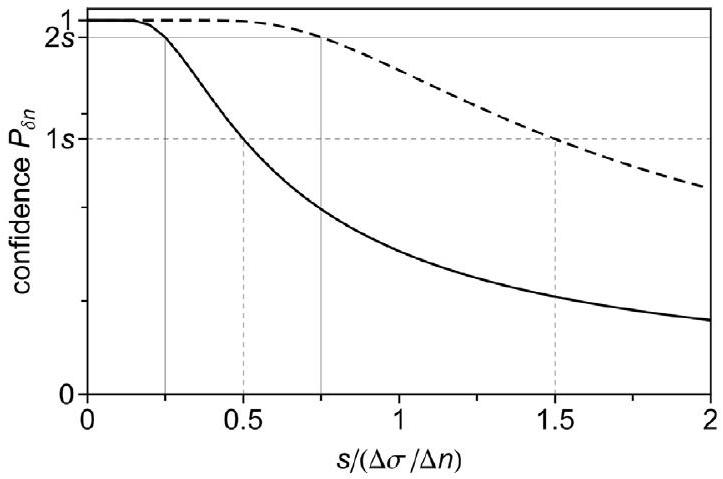
Fig. B1. Confidence of achieving counting errors of $\delta n=0$ (solid curve) and $\delta n=1$ (dashed curve) depending on the ratio of standard deviation $s$ to constant signal gain $\partial \sigma / \partial n$ per atom and normally distributed signal of variance $s^{2}$. Horizontal lines mark confidence levels of $68 \%$ (dashed) and $95 \%$ (solid) corresponding to a 1 s and 2 s levels, respectively. Vertical lines are drawn from the respective points where these probabilities are met for the assumed atom counting scenario.

## References

[1] O.L. Krivanek, N. Dellby, A.R. Lupini, A.R, Towards sub-Å electron beams, Ultramicroscopy 78 (1999) 1-11 https://doi.org/10.1016/S0304-3991(99)

00013-3.
[2] H. Müller, S. Uhlemann, P. Hartel, M. Haider, Advancing the hexapole Cs-corrector for the scanning transmission electron microscope, Microscopy Microanal 12 (2006) 442-455 https://doi.org/10.1017/S1431927606060600.
[3] S.J. Pennycook, Z-contrast STEM for material science, Ultramicroscopy 30 (1989)

58-69 https://doi.org/10.1016/0304-3991(89)90173-3.
[4] S.D. Findlay, N. Shibata, H. Sawada, E. Okunishi, Y. Kondo, T. Yamamoto, Y. Ikuhara, Robust atomic resolution imaging of light elements using scanning transmission electron microscopy, Appl. Phys. Lett. 95 (2009) 191913https://doi. org/10.1063/1.3265946.
[5] J.M. LeBeau, S.D. Findlay, L.J. Allen, S.Stemmer L.J., Quantitative atomic resolution scanning transmission electron microscopy, Phys. Rev. Lett. 100 (2008) 206101https://doi.org/10.1103/PhysRevLett.100.206101.
[6] R. Erni, H. Heinrich, G. Kostorz, Quantitative characterisation of chemical inhomogeneities in Al-Ag using high-resolution Z-contrast STEM, Ultramicroscopy 94 (2003) 125-133 https://doi.org/10.1016/S0304-3991(02)00249-8.
[7] L. Fitting, S. Thiel, A. Schmehl, J. Mannhart, D.A. Muller, Subtleties in ADF imaging and spatially resolved EELS: a case study of low-angle twist boundaries in $\mathrm{SrTiO}_{3}$, Ultramicroscopy 106 (2006) 1053-1061 https://doi.org/10.1016/j.ultramic.2006. 04.019.
[8] V. Grillo, E. Carlino, F. Glas, Influence of the static atomic displacement on atomic resolution Z-contrast imaging, Phys. Rev. B 77 (2008) 054103https://doi.org/10. 1103/PhysRevB.77.054103.
[9] S. Van Aert, J. Verbeeck, R. Erni, S. Bals, M. Luysberg, D. Van Dyck, G. Van Tendeloo, Quantitative atomic resolution mapping using high-angle annular dark field scanning transmission electron microscopy, Ultramicroscopy 109 (2009) 1236-1244 https://doi.org/10.1016/j.ultramic.2009.05.010.
[10] A. Rosenauer, K. Gries, K. Müller, A. Pretorius, M. Schowalter, A. Avramescu, K. Engl., S. Lutgen, Measurement of specimen thickness and composition in $\mathrm{Al}_{\mathrm{x}} \mathrm{Ga}_{1 \text { - }} { }_{\mathrm{x}} \mathrm{N} / \mathrm{GaN}$ using high-angle annular dark field images, Ultramicroscopy 109 (2009) 1171-1182 https://doi.org/10.1016/j.ultramic.2009.05.003.
[11] J.M. LeBeau, S.D. Findlay, L.J. Allen, S. Stemmer, Position averaged convergent beam electron diffraction: theory and applications, Ultramicroscopy 110 (2010) 118-125 https://doi.org/10.1016/j.ultramic.2009.10.001.
[12] M. Heidelmann, J. Barthel, G. Cox, T.E. Weirich, Periodic cation segregation in $\mathrm{Cs}_{0.44}\left[\mathrm{Nb}_{2.54} \mathrm{~W}_{2.46} \mathrm{O}_{14}\right]$ quantified by high-resolution scanning transmission electron microscopy, Microscopy Microanal. 20 (2014) 1453-1462 https://doi.org/10. 1017/S1431927614001330.
[13] A.B. Yankovich, B. Berkels, W. Dahmen, P. Binev, S.I. Sanches, S.A. Bradley, A. Li, I. Szlufarska, P.M. Voyles, Picometre-precision analysis of scanning transmission electron microscopy images of platinum nanocatalysts, Nat. Commun. 5 (2014) 4155 https://doi.org/10.1038/ncomms5155.
[14] H. Du, C.L. Jia, A. Koehl, J. Barthel, R. Dittmann, R. Waser, J. Mayer, Nanosized conducting filaments formed by atomic-scale defects in redox-based resistive switching memories, Chem. Mater. 29 (2017) 3164-3173 https://doi.org/10.1021/ acs.chemmater.7b00220.
[15] L. Jin, P.X. Xu, Y. Zeng, L. Lu, J. Barthel, T. Schulthess, R.E. Dunin-Borkowski, H. Wang, C.L. Jia, Surface reconstructions and related local properties of a $\mathrm{BiFeO}_{3}$ thin film, Scientific Reports 7 (2017) 39698 https://doi.org/10.1038/srep39698.
[16] B.C. Chakoumakos, D. Mandrus, $\mathrm{Ru}_{3} \mathrm{Sn}_{7}$ with the $\mathrm{Ir}_{3} \mathrm{Ge}_{7}$ structure type, J. Alloys Comp. 281 (1998) 157-159 https://doi.org/10.1016/S0925-8388(98)00790-7.
[17] J. Barthel, Dr. Probe - high-resolution (S)TEM image simulation software, http:// www.er-c.org/barthel/drprobe/, (2018) (accessed 15 April 2018).
[18] J.M. Cowley, A.F. Moodie, The scattering of electrons by atoms and crystals. I. A new theoretical approach, Acta Crystallographica 10 (1957) 609-619 https://doi. org/10.1107/S0365110X57002194.
[19] P. Stadelmann, EMS - a software package for electron diffraction analysis and HREM image simulation in materials science, Ultramicroscopy 21 (1987) 131-146 https://doi.org/10.1016/0304-3991(87)90080-5.
[20] S.R. Hall, F.H. Allen, I.D. Brown, The crystallographic information file (CIF): a new standard archive file for crystallography, Acta Crystallographica A 47 (1991) 655-685 https://doi.org/10.1107/S010876739101067X.
[21] N. Shibata, Y. Kohno, S.D. Findlay, H. Sawada, Y. Kondo, Y. Ikuhara, New area detector for atomic-resolution scanning transmission electron microscopy, J. Electron Microscopy 59 (2010) 473-479 https://doi.org/10.1093/jmicro/dfq014.
[22] N. Shibata, S.D. Findlay, Y. Kohno, H. Sawada, Y. Kondo, Y. Ikuhara, Differential phase-contrast microscopy at atomic resolution, Nat. Phys. 8 (2012) 611-615 https://doi.org/10.1038/nphys2337.
[23] S.D. Findlay, J.M. LeBeau, Detector non-uniformity in scanning transmission electron microscopy, Ultramicroscopy 124 (2013) 52-60 https://doi.org/10.1016/j. ultramic.2012.09.001.
[24] L.J. Allen, A.J. D'Alfonso, S.D. Findlay, Modelling the inelastic scattering of fast electrons, Ultramicroscopy 151 (2015) 11-22 https://doi.org/10.1016/j.ultramic. 2014.10.011.
[25] D. Waasmaier, A. Kirfel, New analytical scattering-factor functions for free atoms and ions, Acta Crystallographica A 51 (1995) 416-431 https://doi.org/10.1107/ S0108767394013292.
[26] A. Weickenmeier, H. Kohl, Computation of absorptive form factors for high-energy electron diffraction, Acta Crystallographica. A 47 (1991) 590-597 https://doi.org/ 10.1107/S0108767391004804.
[27] M.A. O'Keefe, R. Kilaas, Advances in high-resolution image simulation, Scanning Microscopy Suppl 2 (1988) 225-244 https://escholarship.org/uc/item/6qb303ch.
[28] K. Ishizuka, N. Uyeda, A new theoretical and practical approach to the multislice method, Acta Crystallographica A 33 (1977) 740-749 https://doi.org/10.1107/ S0567739477001879.
[29] L. Reimer, Transmission Electron Microscopy, Springer Verlag, Berlin, 1984.
[30] B.D. Forbes, A.J. D'Alfonso, S.D. Findlay, D. Van Dyck, J.M. LeBeau, S. Stemmer, L.J. Allen, Thermal diffuse scattering in transmission electron microscopy, Ultramicroscopy 111 (2011) 1670-1680 https://doi.org/10.1016/j.ultramic.2011. 09.017.
[31] J.H. Chen, D. Van Dyck, M. Op De Beeck, Multislice method for large beam tilt with application to HOLZ effects in triclinic and monoclinic crystals, Acta Crystallographica A 53 (1997) 576-589 https://doi.org/10.1107/ S0108767397005539.
[32] R.F. Loane, P. Xu, J. Silcox, Thermal vibration in convergent-beam electron diffraction, Acta Crystallographica A 47 (1991) 267-278 https://doi.org/10.1107/ S0108767391000375.
[33] G.E.P. Box, M.E. Muller, A note on the generation of random normal deviates, Annals Math. Stat. 29 (1958) 610-611 https://doi.org/10.1214/aoms/ 1177706645.
[34] J.M. LeBeau, S.D. Findlay, L.J. Allen, S. Stemmer, Standardless atom counting in scanning transmission electron microscopy, Nano Lett. 10 (2010) 4405-4408 https://doi.org/10.1021/nl102025s.
[35] M. Bar-Sadan, J. Barthel, H. Shtrikman, L. Houben, Direct imaging of single Au atoms in GaAs nanowires, Nano Lett. 12 (2012) 2352-2356 https://doi.org/10. 1021/nl300314k.
[36] N.R. Lugg, G. Kothleitner, N. Shibata, Y. Ikuhara, On the quantitativeness of EDS STEM, Ultramicroscopy 151 (2015) 150-159 https://doi.org/10.1016/j.ultramic. 2014.11.029.
[37] C. Dwyer, Simulation of scanning transmission electron microscope images on desktop computers, Ultramicroscopy 110 (2010) 195-198 https://doi.org/10. 1016/j.ultramic.2009.11.009.
[38] K. Momma, F. Izumi, VESTA 3 for three-dimensional visualization of crystal, volumetric and morphology data, J. Appl. Crystallography 44 (2011) 1272-1276 https://doi.org/10.1107/S0021889811038970.
[39] A. Rosenauer, T. Mehrtens, K. Müller, K. Gries, M. Schowalter, P. Venkata Satyam, S. Bley, C. Tessarek, D. Hommel, K. Sebald, M. Seyfried, J. Gutowski, A. Avramescu, K. Engl, S. Lutgen, Composition mapping in InGaN by scanning transmission electron microscopy, Ultramicroscopy 111 (2011) 1316-1327 https://doi.org/10. 1016/j.ultramic.2011.04.009.
[40] H. E, K.E. MacArthur, T.J. Pennycook, E. Okunishi, A. D'Alfonso, N.R. Lugg, L.J. Allen, P.D. Nellist, Probe integrated scattering cross sections in the analysis of atomic resolution HAADF STEM images, Ultramicroscopy 133 (2013) 109-119 https://doi.org/10.1016/j.ultramic.2013.07.002.
[41] K.E. MacArthur, A.J. D'Alfonso, D. Ozkaya, L.J. Allen, P.D. Nellist, Optimal ADF STEM imaging parameters for tilt-robust image quantification, Ultramicroscopy 156 (2015) 1-8 https://doi.org/10.1016/j.ultramic.2015.04.010.
[42] P.N. Swarztrauber, Vectorizing the FFTs, in Parallel Computations, in: G. Rodrigue (Ed.), Academic Press, 1982, pp. 51-83 https://doi.org/10.1016/B978-0-12-592101-5.50007-5.

[^0]:    *Corresponding author at: Central Facility for Electron Microscopy, RWTH Aachen University, 52074 Aachen, Germany.
    E-mail address: ju.barthel@fz-juelich.de.

