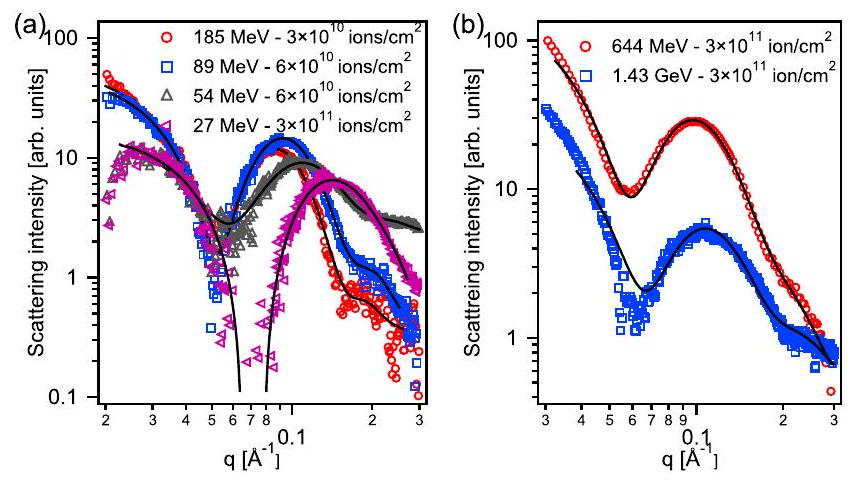
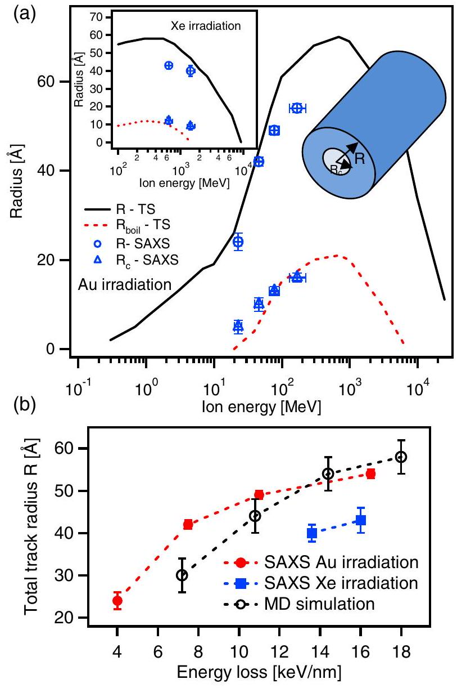
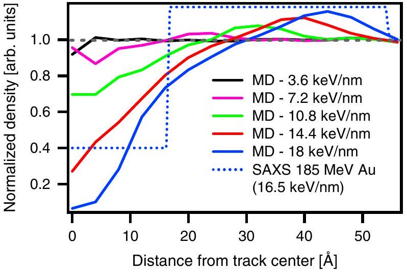

# Fine Structure in Swift Heavy Ion Tracks in Amorphous $\mathbf{S i O}_{\mathbf{2}}$ 

P. Kluth, ${ }^{1, *}$ C. S. Schnohr, ${ }^{1}$ O. H. Pakarinen, ${ }^{2}$ F. Djurabekova, ${ }^{2}$ D. J. Sprouster, ${ }^{1}$ R. Giulian, ${ }^{1}$ M. C. Ridgway, ${ }^{1}$ A. P. Byrne, ${ }^{3}$ C. Trautmann, ${ }^{4}$ D. J. Cookson, ${ }^{5}$ K. Nordlund, ${ }^{2}$ and M. Toulemonde ${ }^{6}$ ${ }^{1}$ Department of Electronic Materials Engineering, Australian National University, Canberra ACT 0200, Australia ${ }^{2}$ Department of Physics and Helsinki Institute of Physics, University of Helsinki, Helsinki, Finland ${ }^{3}$ Department of Nuclear Physics, Australian National University, Canberra ACT 0200, Australia ${ }^{4}$ Materials Research Department, Gesellschaft für Schwerionenforschung (GSI), Darmstadt, Germany ${ }^{5}$ Australian Synchrotron, 800 Blackburn Road, Clayton VIC 3168, Australia ${ }^{6}$ Centre interdisciplinaire de recherche sur les Ions, les MAtériaux et la Photonique (CIMAP), Caen, France

(Received 22 July 2008; published 24 October 2008)

#### Abstract

We report on the observation of a fine structure in ion tracks in amorphous $\mathrm{SiO}_{2}$ using small angle x-ray scattering measurements. Tracks were generated by high energy ion irradiation with Au and Xe between 27 MeV and 1.43 GeV . In agreement with molecular dynamics simulations, the tracks consist of a core characterized by a significant density deficit compared to unirradiated material, surrounded by a high density shell. The structure is consistent with a frozen-in pressure wave originating from the center of the ion track as a result of a thermal spike.

DOI: 10.1103/PhysRevLett.101.175503
PACS numbers: 61.80.Jh, 61.05.cf, 61.43.Bn, 61.43.Fs

When penetrating a solid, swift heavy ions (SHI) lose their energy predominately through inelastic interactions with the target electrons. The resulting intense electronic excitation can produce a narrow trail of permanent damage along the ion path, a so called ion track. Tracks have been observed in many materials, including semiconductors $[1,2]$, insulators [ $3-6$ ] and various metals [ 7,8 ], beyond a material dependent threshold value of electronic energy loss $[9,10]$. The nature of ion track damage ranges from subtle differences between track and matrix material such as densification and plastic deformation in amorphous materials (e.g., $\mathrm{SiO}_{2}$ [11] and glassy metals [12]), point defect and defect cluster formation in ionic crystals (e.g., LiF [6] and $\mathrm{CaF}_{2}$ [13]) to amorphization of crystalline materials (e.g., $\operatorname{InP}$ [2] and quartz- $\mathrm{SiO}_{2}$ [3,11]). Though average structural properties of ion tracks can often be inferred from macroscopic measurements (e.g., in amorphous $\left.\mathrm{SiO}_{2}\left(a-\mathrm{SiO}_{2}\right)[11,14]\right)$, the inner track structure remains extremely difficult to retrieve due to the lack of sufficient contrast inherent with most techniques. Small angle x-ray scattering (SAXS) provides an interesting technique for determining structural details in ion tracks. It has previously been used to study tracks in polymers, LiF and mica [15-17]. In this Letter we report on new results on ion track formation in $a-\mathrm{SiO}_{2}$ using synchrotron SAXS measurements and molecular dynamics (MD) simulations.

The ion tracks were produced in thermally grown $a-\mathrm{SiO}_{2}, 2 \mu \mathrm{~m}$ thick, on $\mathrm{Si}(100)$ substrates by irradiation with Au ions at energies between 27.4 and 185 MeV at the ANU Heavy Ion Accelerator Facility and Xe ions with 0.64 and 1.43 GeV at the UNILAC accelerator at GSI in Darmstadt, Germany. Fluences ranged between $3 \times 10^{10}$ and $3 \times 10^{11}$ ions $/ \mathrm{cm}^{2}$. Irradiation was performed at room temperature with the incident ion direction normal to the
sample surface. Details of the irradiation conditions are listed in Table I. Thin $\mathrm{SiO}_{2}$ layers were utilized to achieve a reasonably uniform energy loss over the extent of the layer and hence uniform ion tracks. The average energy loss given in Table I was estimated by SRIM2006 calculations [18] and is virtually entirely due to electronic interactions. The track structure was studied using synchrotron SAXS in transmission geometry. The measurements were performed at beam line 15ID-D of the Advanced Photon Source, Argonne National Laboratories, USA, using an x-ray wavelength of $1.1 \AA(\sim 11.27 \mathrm{keV})$ and camera lengths of 555 and 1894 mm . Samples were prepared by locally removing the Si substrate to isolate the thin $\mathrm{SiO}_{2}$ film [19]. This enables measurements on the thin film only and negates artifacts due to irradiation induced inhomogeneities in the Si substrate. Measurements were performed with the sample surface aligned normal to the x-ray beam, i.e., parallel to the ion tracks. The resulting isotropic images were radially integrated around the beam center. Scattering from an unirradiated $\mathrm{SiO}_{2}$ standard was subtracted from all spectra. Figure 1 shows the scattering intensities of samples irradiated with (a) Au and (b) Xe. For the given fluence range, track overlap was negligible as confirmed by an overlap model [20]. In this range the scattering intensity scales with the ion fluence which corresponds to the number of tracks generated in the $\mathrm{SiO}_{2}$ [19] and thus analysis of the scattering yields information about the inner track structure of the (virtually) identical tracks. The presence of oscillations in the scattering intensities is indicative of a narrow distribution of track sizes with well defined boundaries in the internal track structure. We assumed a cylindrically symmetric density distribution within a track, consistent with continuous track formation and approximately constant energy loss throughout the

TABLE I. Ion irradiation parameters and fitting results from the SAXS analysis. $E_{\text {irr }}$ denotes the initial ion energy, $E_{\text {av }}$ the average ion energy in the $2 \mu \mathrm{~m} \mathrm{SiO}_{2}$ layer, $d E / d X_{\mathrm{av}}$ the average electronic energy loss, $R_{c}$ the (mean) track core radius, $T_{s}$ the (mean) shell thickness, $R=R_{c}+T_{s}$ the (mean) total track radius, $\rho_{s}$ the density contrast in the shell with respect to the track core, and $\sigma$ the width of the distribution in $r_{c}$. The errors in the fitting parameters were estimated from systematic analysis of the correlations between them.
| Ion | $E_{\text {irr }}(\mathrm{MeV})$ | $E_{\mathrm{av}}(\mathrm{MeV})$ | $d E / d X_{\mathrm{av}}(\mathrm{keV} / \mathrm{nm})$ | $R_{c}(\AA)$ | $T_{s}(\AA)$ | $R(\AA)$ | $\rho_{s}$ | $\sigma(\AA)$ |
| :--- | :--- | :--- | :--- | :--- | :--- | :--- | :--- | :--- |
| ${ }^{197} \mathrm{Au}$ | 27.4 | 22.7 | 4 | $5 \pm 1.5$ | $19 \pm 2$ | $24 \pm 2$ | $-0.12 \pm 0.05$ | $1.4 \pm 0.2$ |
| ${ }^{197} \mathrm{Au}$ | 54 | 46.1 | 7.5 | $10 \pm 1.5$ | $32 \pm 1$ | $42 \pm 1$ | $-0.2 \pm 0.08$ | $1.5 \pm 0.3$ |
| ${ }^{197} \mathrm{Au}$ | 89 | 77.6 | 11 | $13 \pm 1$ | $36 \pm 1$ | $49 \pm 1$ | $-0.3 \pm 0.05$ | $1.8 \pm 0.2$ |
| ${ }^{197} \mathrm{Au}$ | 185 | 168.4 | 16.5 | $16 \pm 1$ | $38 \pm 2$ | $54 \pm 1$ | $-0.45 \pm 0.10$ | $2.1 \pm 0.2$ |
| ${ }^{129} \mathrm{Xe}$ | 644 | 627.7 | 16 | $12 \pm 2$ | $31 \pm 2$ | $43 \pm 2$ | $-0.41 \pm 0.15$ | $2.7 \pm 0.3$ |
| ${ }^{129} \mathrm{Xe}$ | 1430 | 1426 | 13.6 | $9 \pm 2$ | $31 \pm 3$ | $40 \pm 3$ | $-0.3 \pm 0.15$ | $2.0 \pm 0.3$ |

$\mathrm{SiO}_{2}$ layer. This is further substantiated by measurements of the tracks tilted with respect to the x-ray beam [19]. Radial symmetry was assumed in the amorphous material. The simplest model that adequately fits the experimental data requires a cylindrical core and shell with different densities indicating the presence of a fine structure in the ion track radial density distribution. The scattering amplitude for the given geometry can be written as [19,21]:

$$
\begin{aligned}
f\left(q_{r}\right)= & 2 \pi L\left[\left(\rho_{0}-\rho_{s}\right) \frac{r_{c}}{q_{r}} J_{1}\left(r_{c} q_{r}\right)\right. \\
& \left.+\rho_{s} \frac{r_{c}+t_{s}}{q_{r}} J_{1}\left(\left(r_{c}+t_{s}\right) q_{r}\right)\right],
\end{aligned}
$$

where $L$ is the track length, $\rho_{0}$ is the density contrast in the core, $\rho_{s}$ the density contrast in the shell, $r_{c}$ the core diameter, $t_{s}$ the shell thickness, and $J_{1}$ the Bessel function of first order. The scattering intensity can then be written as

$$
I\left(q_{r}\right) \propto \int \frac{1}{\sqrt{2 \pi} \sigma} \exp \left(-\frac{\left(r_{c}-R_{c}\right)^{2}}{2 \sigma^{2}}\right)\left|f\left(q_{r}\right)\right|^{2} d r_{c}
$$

assuming a narrow Gaussian distribution of track core radii with a mean value of $R_{c}$. The distribution of shell thicknesses $t_{s}$ with a mean value of $T_{s}$ was then fixed by scaling the distribution in $r_{c}$ to $T_{s} / R_{c}$. The distributions account for deviations from the model of perfectly aligned, monodisperse cylinders with abrupt boundaries. For the fits, $\rho_{0}:=1$ was assumed and as such $\rho_{s}$ describes the relative density contrast in the cylinder shell with respect to that in the core as compared to unirradiated $a-\mathrm{SiO}_{2}$. The fits, plotted as solid lines in Fig. 1, show excellent agreement with the scattering data. The fitting parameters are listed in Table I. A negative $\rho_{s}$ is apparent for all irradiation conditions and represents an underdense core and an overdense shell (or vice versa) when compared to unirradiated $\mathrm{SiO}_{2}$. Given the net compaction of $a-\mathrm{SiO}_{2}$ under swift heavy ion irradiation [22], the results are consistent with a lower density core and a higher density shell.

We now discuss how these observations fit within existing models of track formation. It is widely accepted that the later stages of track formation in insulators are well described by a thermal spike (TS) formalism [23-26].

Within these models, the energy transferred to the substrate electrons is dissipated to the lattice via electron-phonon coupling resulting in a rapid increase in the local temperature surrounding the ion path. For comparison with our measurements we have used an inelastic TS (i-TS) model to calculate the ion track radii in $a$ - $\mathrm{SiO}_{2}$ as a function of the irradiation energy for Au and Xe [24-26]. These calculations were performed including the scenario of superheating, where the latent heat during the melting or boiling phase transitions was ignored, leading to higher temperatures and faster cooling rates [27]. The values for Au irradiation are shown in Fig. 2(a) together with our experimental results for the total track radii $R=R_{c}+T_{s}$ (the inset of Fig. 2(a) shows the corresponding calculations and experimental data for Xe irradiation). In the TS model the ion track is assumed to result from a rapid quench of the molten phase, freezing in the related density changes. The total track radii are thus associated with a cylinder where the temperature exceeds the melting temperature of the material. For $a-\mathrm{SiO}_{2}$, where a gradual transition to the molten phase occurs, an energy of 1.14 eV per molecule of $\mathrm{SiO}_{2}$ (corresponding to a critical flow temperature of 2100 K ) was chosen to calculate the total track radii and yields good agreement with the total measured track radii. Figure 2(b) shows the total measured track radii as a

FIG. 1 (color online). SAXS spectra of $a-\mathrm{SiO}_{2}$ as a function of irradiation energy for (a) ${ }^{197} \mathrm{Au}$ and (b) ${ }^{129} \mathrm{Xe}$ irradiation. The solid lines show the corresponding fits to the core-shell cylinder model.

FIG. 2 (color online). (a) Calculations of molten ( $R-T S$ ) and boiling ( $R_{\text {boil }}-T S$ ) radii of Au irradiation (inset: Xe irradiation) in $a-\mathrm{SiO}_{2}$ using an i-TS model. The symbols show measurements of total track radii (R-SAXS, circles) and core radii ( $R_{\mathrm{c}}$-SAXS, triangles). (b) Total track radii as a function of electronic energy deposition measured by SAXS and obtained from MD simulations.

function of electronic stopping power. The values for the Xe irradiations are approximately $10 \AA$ smaller than those for the Au irradiations at the same stopping powers. This demonstrates the influence of the ion velocity in addition to the ion energy and reflects the differences in the associated energy densities (often referred to as the "velocity effect" [28]). Figure 2(a) also shows calculated radii where the boiling point of $\mathrm{SiO}_{2}$ is exceeded (chosen as 5.1 eV per molecule corresponding to a temperature of 7000 K ) along with the experimental results for the track core radii. This criterion was previously applied to successfully describe sputtering yields from quartz- $\mathrm{SiO}_{2}$ using swift heavy ions [27]. The good agreement supports the simplistic view of a frozen-in pressure wave originating from the center of the track with a dilatation around the hot track core. We note that in the context of the highly nonequilibrium process of ion track formation, the use of equilibrium quantities must be taken with some reservation. The agreement between
experimental results and calculations, however, supports the applicability of the i-TS model for a simple yet effective approach to estimate ion track dimensions in $a-\mathrm{SiO}_{2}$.

Our formalism does not include a description of the mass transport. Trinkaus [29] and Klaumünzer [23] have developed a model combining the TS approach with mechanical equations describing ion tracks in amorphous solids as frozen-in thermoelastic inclusions. Consistent with our observation, an acoustic shock wave is emitted caused by the sudden thermal expansion in the track center [29]. The model can describe phenomena such as ion hammering; however, to calculate the observed permanent density changes in the track structure the constitutive equations require modification and the dynamics of the material transport must be included. To also model mass transport during track formation, we have performed MD simulations in amorphous and crystalline (quartz) $\mathrm{SiO}_{2}$ using the classical MD code parcas [30]. The atomic interactions were calculated using the Watanabe Si-O mixed system many-body potential [ 31,32 ]. The electronic energy loss of the swift heavy ions inducing the tracks was implemented by an instantaneous deposition of kinetic energy in a random direction to the atoms in the simulation cell. The cell sizes were $11.5 \times 11.5 \times 5.8 \mathrm{~nm}^{3}$ for $a-\mathrm{SiO}_{2}$ and $10.6 \times 10.5 \times 5.5 \mathrm{~nm}^{3}$ for quartz, with periodic boundary conditions and a computation time of 50 ps . The $a-\mathrm{SiO}_{2}$ was obtained with a Monte Carlo method that ensured an ideal bonding environment, previously shown to yield radial and angular distribution functions in very good agreement with experiments [33]. In the $x$ and $y$ directions, the last 0.5 nm at the borders of the computation cell were cooled by Berendsen temperature control [34] to mimic the heat conduction further into the material. The energy deposition profile was deduced from an i-TS calculation for Au ions with $1.1 \mathrm{MeV} / \mathrm{u}$ energy at the initial stage of the energy deposition (at about 100 fs ). This kinetic energy distribution was then scaled linearly to approximately match the experimental irradiation conditions. The simulations reveal a glass transition temperature of $2500 \pm 500 \mathrm{~K}$ and boiling temperature of $5500 \pm$ 500 K for $a-\mathrm{SiO}_{2}$ under superheating conditions, both in good agreement with the values used in the i-TS calculations. Figure 3 shows the radial density profiles derived from the simulations for irradiated $a-\mathrm{SiO}_{2}$. For all but the lowest energy deposition ( $3.6 \mathrm{keV} / \mathrm{nm}$ ) a track is formed both in $a$ - $\mathrm{SiO}_{2}$ and quartz, the latter not shown. All tracks were comprised of a low density core and a higher density shell in agreement with the SAXS measurements. The dotted line shows for comparison a density profile extracted from SAXS measurements of the 185 MeV Au irradiation. The track radii obtained from the MD simulations (determined as the radial distance where the density of the shell falls to that of the unirradiated material) are plotted in Fig. 2(b) and agree extremely well with the measurements particularly given the approximative nature

FIG. 3 (color online). Radial density profiles obtained from MD simulations for $a-\mathrm{SiO}_{2}$. The dashed line denotes the density of unirradiated material. The dotted line shows for comparison a density profile extracted from SAXS measurements of the 185 MeV Au irradiation.

of the initial energy deposition profile in the simulations. Though the MD results did somewhat depend on the choice of the energy deposition model, our tests of different models (including time-dependent ones) showed that the qualitative features of an underdense core and an overdense shell always remain the same above the track formation threshold.

In conclusion, synchrotron SAXS measurements and MD simulations reveal a fine structure in swift heavy ion tracks in $a-\mathrm{SiO}_{2}$ consisting of a core lower and a shell higher in density when compared to unirradiated $\mathrm{SiO}_{2}$. The questions as to whether this fine structure is also present in other materials or can be attributed to the density anomaly existent in $a$ - $\mathrm{SiO}_{2}$ remains open. In previous investigations of ion tracks using SAXS, no comparable density profile has been observed; however, our combination of thin film technologies and synchrotron SAXS offers enhanced sensitivity to radial density variations and can be readily applied to other materials.

The authors acknowledge the ARC and the ASRP for financial support. O. H. P., F. D., and K. N. acknowledge support from the Academy of Finland as well as the CONADEP and OPNA projects, and grants of from CSC. ChemMatCARS Sector 15 at the APS is principally supported by the NSF/DoE under Grant No. CHE0087817 and by the Illinois Board of Higher Education. The APS is supported by the U.S. DOE, Basic Energy Sciences, Office of Science, under Contract No. W-31-109-Eng-38.

[^0][2] W. Wesch, A. Kamarou, and E. Wendler, Nucl. Instrum. Methods Phys. Res., Sect. B 225, 111 (2004).
[3] A. Meftah et al., Phys. Rev. B 49, 12457 (1994).
[4] M. Toulemonde et al., Nucl. Instrum. Methods Phys. Res., Sect. B 39, 1 (1989).
[5] M. Toulemonde et al., Nucl. Instrum. Methods Phys. Res., Sect. B 216, 1 (2004).
[6] C. Trautmann et al., Nucl. Instrum. Methods Phys. Res., Sect. B 164-165, 365 (2000).
[7] A. Barbu et al., Europhys. Lett. 15, 37 (1991).
[8] C. Dufour et al., J. Phys. Condens. Matter 5, 4573 (1993).
[9] A. Dunlop and D. Lesueur, Radiat. Eff. Defects Solids 126, 123 (1993).
[10] A. Meftah et al., Nucl. Instrum. Methods Phys. Res., Sect. B 237, 563 (2005).
[11] S. Klaumunzer, Nucl. Instrum. Methods Phys. Res., Sect. B 225, 136 (2004).
[12] M.-d. Hou, S. Klaumünzer, and G. Schumacher, Phys. Rev. B 41, 1144 (1990).
[13] N. Khalfaoui et al., Nucl. Instrum. Methods Phys. Res., Sect. B 240, 819 (2005).
[14] K. Awazu et al., Phys. Rev. B 62, 3689 (2000).
[15] D. Albrecht et al., Appl. Phys. A 37, 37 (1985).
[16] S. Sameer Abu and E. Yehuda, Appl. Phys. Lett. 85, 2529 (2004).
[17] K. Schwartz et al., Phys. Rev. B 58, 11232 (1998).
[18] J. F. Ziegler, J. P. Biersack, and U. Littmark, The Stopping and Range of Ions in Matter (Pergamon Press, New York, 1985).
[19] P. Kluth et al., Nucl. Instrum. Methods Phys. Res., Sect. B 266, 2994 (2008).
[20] C. Riedel and R. Spohr, Radiat. Eff. 42, 69 (1979).
[21] A. Guinier and G. Fournet, Small-Angle Scattering of X-rays (John Wiley, New York, 1955).
[22] R. A. B. Devine, J. Non-Cryst. Solids 152, 50 (1993).
[23] S. Klaumünzer, Mat Fys Medd Dan Vid Selsk 52, 293 (2006).
[24] M. Toulemonde et al., Nucl. Instrum. Methods Phys. Res., Sect. B 116, 37 (1996).
[25] M. Toulemonde et al., Nucl. Instrum. Methods Phys. Res., Sect. B 166-167, 903 (2000).
[26] M. Toulemonde, C. Dufour, and E. Paumier, Phys. Rev. B 46, 14362 (1992).
[27] M. Toulemonde et al., Phys. Rev. Lett. 88, 057602 (2002).
[28] A. Meftah et al., Phys. Rev. B 48, 920 (1993).
[29] H. Trinkaus, Nucl. Instrum. Methods Phys. Res., Sect. B 107, 155 (1996).
[30] The main principles of the molecular dynamics algorithms are presented in K. Nordlund et al., Phys. Rev. B 57, 7556 (1998); M. Ghaly et al., Philos. Mag. A 79, 795 (1999); The adaptive time step and electronic stopping algorithms are the same as in K. Nordlund, Comput. Mater. Sci. 3, 448 (1995).
[31] J. Samela et al., Phys. Rev. B 77, 075309 (2008).
[32] T. Watanabe et al., Appl. Surf. Sci. 234, 207 (2004).
[33] F. Djurabekova and K. Nordlund, Phys. Rev. B 77, 115325 (2008).
[34] H. J. C. Berendsen et al., J. Chem. Phys. 81, 3684 (1984).

[^0]:    *Corresponding author.
    Patrick.kluth@anu.edu.au
    [1] M. Levalois, P. Bogdanski, and M. Toulemonde, Nucl. Instrum. Methods Phys. Res., Sect. B 63, 14 (1992).

