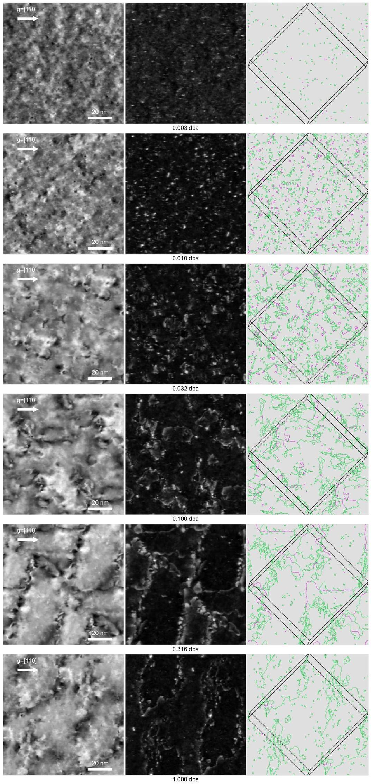
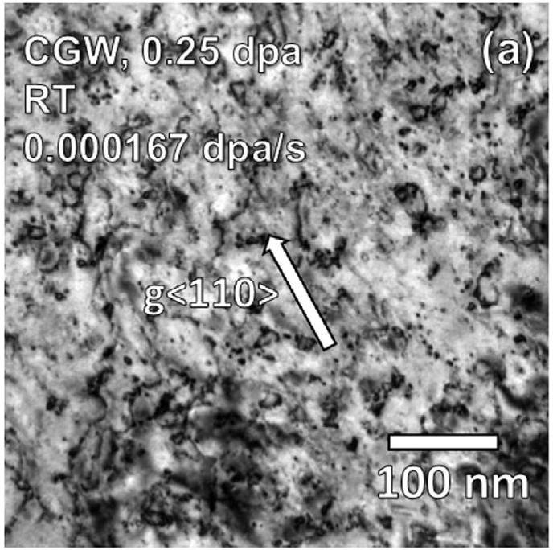
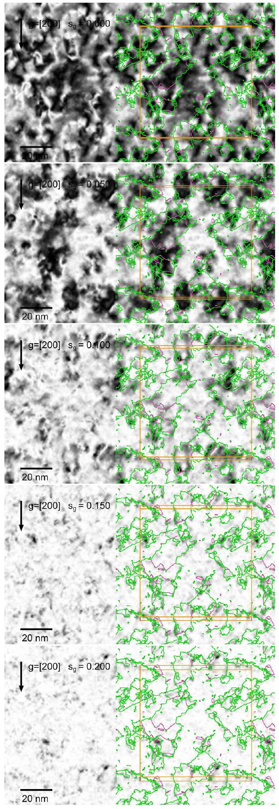
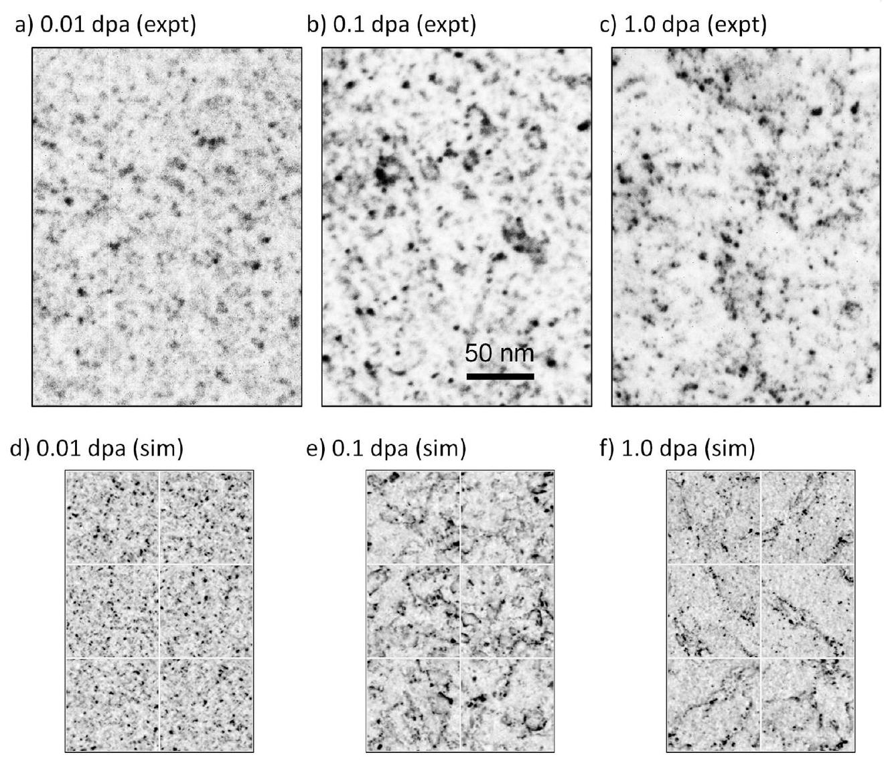
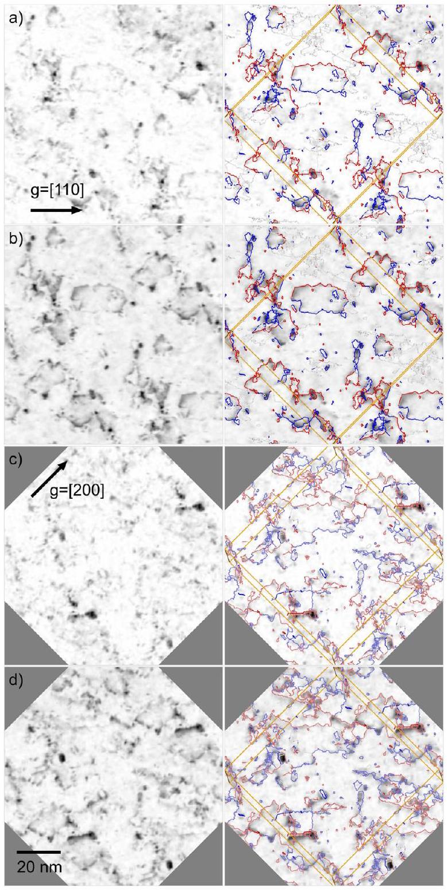

Full length article

# Simulated TEM imaging of a heavily irradiated metal 

Daniel R. Mason ${ }^{\mathrm{a}, *}$, Max Boleininger ${ }^{\mathrm{a}}$, Jack Haley ${ }^{\mathrm{a}}$, Eric Prestat ${ }^{\mathrm{a}}$, Guanze He ${ }^{\mathrm{b}}$, Felix Hofmann ${ }^{\mathrm{c}}$, Sergei L. Dudarev ${ }^{\mathrm{a}}$ ${ }^{\mathrm{a}}$ UK Atomic Energy Authority, Culham Centre for Fusion Energy, Oxfordshire OX14 3DB, United Kingdom ${ }^{\mathrm{b}}$ Department of Materials, University of Oxford, Parks Road, Oxford, OX1 3PH, United Kingdom ${ }^{\mathrm{c}}$ Department of Engineering, University of Oxford, Parks Road, Oxford, OX1 3PJ, United Kingdom

## ARTICLE INFO

Dataset link: https://zenodo.org/doi/10.5281/ zenodo. 11083370

## Keywords:

TEM
Radiation damage
Cascade simulation
Radiation induced defects

#### Abstract

We recast the Howie-Whelan equations for generating simulated transmission electron microscope (TEM) images, replacing the dependence on local atomic displacements with atomic positions only. This allows rapid computation of simulated TEM images for arbitrarily complex atomistic configurations of lattice defects and dislocations in the dynamical two beam approximation directly from standard atomistic simulation output files. Large-scale massively-overlapping cascade simulations, performed with molecular dynamics, are used to generate representative high-dose nanoscale defect and dislocation microstructures in tungsten at room temperature. We then compare the simulated TEM images to experimental TEM images with similar irradiation and imaging conditions. The simulated TEM shows 'white-dot' damage in weak-beam dark-field imaging conditions, in agreement with our experimental observations and as expected from previous studies, and in bright-field conditions a dislocation network is observed. In this work we also compare the simulated images to the nanoscale lattice defects in the original atomic structures, and find that at high dose the white spots are not only created by small dislocation loops, but rather arise from nanoscale fluctuations in strains around curved sections of dislocation lines.

## 1. Introduction

The thermomechanical properties of structural materials are strongly dependent on the material microstructure, yet materials proposed for advanced nuclear fission and fusion must tolerate exposure to irradiation, which introduces nanoscale defects changing the microstructure in service [1,2]. There is, therefore, a real interest in characterising the evolution of microstructure as a function of irradiation dose and temperature. A popular and long-established tool for investigating nanoscale defects characteristic of irradiated microstructures is conventional TEM, as it offers a direct window onto the microstructure at the micrometre scale with sub-nanometre resolution [3,4]. Many features of irradiated microstructure can be identified unambiguously with TEM - voids [5,6], bubbles [7,8], large dislocation loops [9,10], dislocation lines [11,12], stacking faults [13], stacking fault tetrahedra [14,15] and second-phase particles [16]. But small features of a few nanometres in size are much more difficult to characterise. Notwithstanding the issue that a small cluster of defected atoms may image too faintly to be readily detected, by eye or otherwise, those small features which do image brightly typically appear as featureless spots, offering no real insight into their true atomic
nature. These small features, characteristic of radiation damage, are often referred to as 'black-dot' damage when observed in bright-field conditions (or 'white-dot' in dark-field) [17-19]. The small features are of fundamental importance to understanding microstructural evolution, for as well as being the characteristic state for low temperature irradiation, quasi-independent prismatic dislocation loops are the first defects formed during irradiation [20,21], and they also form the building blocks for defect annealing and coarsening.

Image simulations suggest a single, isolated black-dot is consistent with a single, perfect, isolated dislocation loop. Experimentally, we sometimes find dots that become invisible at a particular set of imaging $\mathbf{g}$-vectors, suggesting that $\mathbf{g} \cdot \mathbf{b}=0$ in these conditions, and hence indicating a loop with a single Burgers vector [4]. But this invisibility criterion is only really true in the limit of long-range linear elasticity, and cannot be relied on in cases where the defect is much smaller than this elastic limit [4,22]. This identification is further complicated by the fact that a single, perfect, isolated dislocation loop is often the one thing the spot cannot possibly be: molecular dynamics simulations show that small dislocation loops in Body-Centre Cubic (BCC) metals are extremely mobile, with a diffusion constant order $0.01 \mu \mathrm{~m}^{2} / \mathrm{s}$ [23], and

[^0]so prismatic loops would find their way to the TEM foil surface before observation is possible [24]. This contradiction has been explained previously by assuming the loop is pinned by impurity atoms [25,26], or by elastic interactions with other lattice defects [27]. Molecular dynamics simulations of overlapping cascades have offered another possibility - that the defects are not simple loops with one Burgers vector, but may be complex objects [28,29]. High-dose, massively overlapping cascade simulations have suggested that the transition from simple loop-like defects to complex network dislocation microstructure may happen at a dose of 0.01 to 0.1 dpa [30-32]. The true nature of the black dots is therefore uncertain.

Rather than adopting the standard approach of simulating TEM images of known, isolated defects, and checking they image in a way consistent with experimental observations [33], in this work we perform image simulations of characteristic irradiated microstructure and view them dispassionately. While this approach is similar in motivation to that employed by Schäublin et al. previously [34]; our work has important computational differences allowing us to explore larger simulation sizes with a wider range of defect environments. In Section 2, we rederive the equations for simulating dynamical two-beam imaging. We recast the partial differential equations, replacing the dependence on an atomistic displacement field with a dependence only on atomic position. This is more physically meaningful for arbitrary atomic configurations typically generated using molecular dynamics simulations where the reference lattice may be difficult to define, and is computationally very efficient, generating a simulated image of a million atom configuration in seconds.

We emphasize that more sophisticated (and therefore more computationally expensive) models for generating simulated TEM or STEM images exist. ABTEM [35] and PRISTMATIC [36] consider the dispersion of electrons during their propagation through the material, requiring a multi-slice simulation technique. While often more accurate, particularly when a simulation aims at generating a high-resolution image of an arbitrary highly distorted atomic configuration with no clearly defined reference crystal lattice, this added level of resolution implies greater computational effort and restricts the number of atoms which can be handled on a desktop computer, and requires more user input in the form of testing for convergence in the solution.

In Section 3 we describe large-scale MD simulations used to produce characteristic high-dose irradiated microstructures. Similar simulations have been shown previously to have a maximum hydrogen retention capacity in agreement with hydrogen plasma-loading experiments [37], a qualitative strain response in agreement with Xray diffraction measurements [31], ion-beam mixing in agreement with Rutherford Backscattering (channelling) experiments [38-40], and thermal conductivity in agreement with transient grating spectroscopy experiments [41]. For this work we use simulation boxes of 21 million atoms; from a computational perspective, this size is necessary to minimise elastic periodic image effects from the defects generated, but more importantly the cell side length ( 70 nm ) is directly comparable to the typical thickness of a TEM transparent foil, and the simulation boxes contain sufficient defects to enable a non-trivial statistical image analysis. A TEM image calculation of this kind, using the methodology developed in this study, takes a couple of minutes on a desktop computer, and has good parallel scaling (currently to 128 cores) on a computer cluster.

Finally, in Section 4 we use a JEOL 2100 TEM equipped with a $\mathrm{LaB}_{6}$ source to image tungsten foils irradiated to 1 dpa with 20 MeV self ions at room temperature. These irradiation experiments are, as close as possible, a match to the simulations. We show that there is a very good qualitative agreement between simulated and experimental TEM images. But when we look closer at the known nanoscale defects in the microstructure responsible for the simulated image, we see a rather weak correlation between the position of brightly imaging spots and the dislocation loops. Rather we find that, in dark field conditions, the brightly imaging regions are due to any strain fields which fluctuate at
the nanometre scale. These strain fields are generated by all defects, be they simple or complex loops or parts of the dislocation line network. We conclude that black-dot damage is consistent with a range of complex microstructural features with a characteristic nanometre scale. And so for characterising a high dose microstructure, we show by direct simulation that it is necessary to consider both dynamical and weak beam conditions.

## 2. Howie-Whelan approximation for generating simulated TEM images

In this section we rederive the Howie-Whelan equations for dynamical two-beam imaging in a form which allows us to use atomic positions only, rather than a strain or displacement field, computed in the elasticity theory approximation.

We start with the Schrödinger equation to describe the propagation of high-energy electrons:

$$
-\frac{\hbar^{2}}{2 m} \frac{\partial^{2}}{\partial \mathbf{r}^{2}} \Psi(\mathbf{r})+U(\mathbf{r}) \Psi(\mathbf{r})=\frac{\hbar^{2} \mathbf{k}^{2}}{2 m} \Psi(\mathbf{r}),
$$

where $\Psi(\mathbf{r})$ is the one-electron wave function of a high-energy electron, as a function of position $\mathbf{r}, \mathbf{k}$ is the wave vector of incident electrons, and $U(\mathbf{r})$ is the potential energy of interaction between the highenergy electron and the atoms. Although the above equation is taken in the non-relativistic form, in the treatment of electron diffraction the relativistic effects can be accounted for by replacing $m$ with the relativistic electron mass [42].

We look for the solution in the form of a sum of propagating and diffracted beams, where the amplitude of each varies slowly as a function of spatial coordinates

$$
\Psi(\mathbf{r})=\Phi_{0}(\mathbf{r}) \exp (i \mathbf{k} \cdot \mathbf{r})+\Phi_{\mathbf{g}}(\mathbf{r}) \exp [i(\mathbf{k}+\mathbf{g}) \cdot \mathbf{r}]
$$

where $\mathbf{g}$ is a reciprocal lattice vector used for imaging.
A dark field TEM image of microstructure is given by the intensity distribution $I_{\mathbf{g}}(x, y)$ computed as $\left|\boldsymbol{\Phi}_{\mathbf{g}}(x, y, L)\right|^{2}$ at the exit surface of the foil at $z=L$. The corresponding bright-field image is computed as the intensity distribution of the transmitted beam $\left|\Phi_{0}(x, y, L)\right|^{2}$.

Substituting (2) into (1), we find (see the Eq. (3) in Box I). we have neglected the second order derivatives of the slowly varying amplitude functions $\Phi_{0}(\mathbf{r})$ and $\Phi_{\mathbf{g}}(\mathbf{r})$. The fact that these functions indeed vary slowly as functions of $z$ is confirmed by the form of Eqs. (4). The relative significance of the second order derivatives in these equations is discussed below.

Separating the terms associated with either $\exp (i \mathbf{k} \cdot \mathbf{r})$ and $\exp (i[\mathbf{k}+ \mathbf{g )} \cdot \mathbf{r}$ ], and choosing the direction of the $z$ axis in the direction of $\mathbf{k}$, where $|\mathbf{k}| \gg|\mathbf{g}|$, we arrive at a system of coupled equations for the amplitudes of the transmitted and diffracted beams
$\frac{\partial}{\partial z} \boldsymbol{\Phi}_{0}(\mathbf{r})=-i \frac{U_{-\mathbf{g}}}{\hbar v} \exp [i \mathbf{g} \cdot \mathbf{u}(\mathbf{r})] \boldsymbol{\Phi}_{\mathbf{g}}(\mathbf{r})$,

$$
\frac{\partial}{\partial z} \boldsymbol{\Phi}_{\mathbf{g}}(\mathbf{r})=-i \frac{\epsilon_{\mathbf{g}}}{\hbar v} \boldsymbol{\Phi}_{\mathbf{g}}(\mathbf{r})-i \frac{U_{\mathbf{g}}}{\hbar v} \exp [-i \mathbf{g} \cdot \mathbf{u}(\mathbf{r})] \boldsymbol{\Phi}_{0}(\mathbf{r}),
$$

where $v=\hbar k / m$ is the velocity of electrons, $\mathbf{u}(\mathbf{r})$ is the field of atomic displacements at $\mathbf{r}$, treated in the deformable lattice approximation [43], where ions are assumed to be displaced from ideal lattice positions as rigid objects whereas the $\mathbf{u}(\mathbf{r})$ field is assumed to vary smoothly on the lattice parameter scale, and $U_{\mathbf{g}}$ is a Fourier component of the periodic potential in an ideal crystal with no atomic distortions, i.e.

$$
U(\mathbf{r})=\sum_{\mathbf{h}} U_{\mathbf{h}} \exp (i \mathbf{h} \cdot \mathbf{r}) .
$$

Summation over $\mathbf{h}$ in the above equation is performed over reciprocal lattice vectors. Parameter

$$
\epsilon_{\mathbf{g}}=\frac{\hbar^{2}(\mathbf{k}+\mathbf{g})^{2}}{2 m}-\frac{\hbar^{2} \mathbf{k}^{2}}{2 m}
$$

$$
\begin{aligned}
\frac{\hbar^{2} \mathbf{k}^{2}}{2 m} \exp (i \mathbf{k} \cdot \mathbf{r}) \Phi_{0}(\mathbf{r})+\frac{\hbar^{2}(\mathbf{k}+\mathbf{g})^{2}}{2 m} \exp [i(\mathbf{k}+\mathbf{g}) \cdot \mathbf{r}] \Phi_{\mathbf{g}}(\mathbf{r}) \\
-i \frac{\hbar^{2}}{m} \exp (i \mathbf{k} \cdot \mathbf{r})\left(\mathbf{k} \cdot \frac{\partial}{\partial \mathbf{r}}\right) \Phi_{0}(\mathbf{r})-i \frac{\hbar^{2}}{m} \exp [i(\mathbf{k}+\mathbf{g}) \cdot \mathbf{r}]\left((\mathbf{k}+\mathbf{g}) \cdot \frac{\partial}{\partial \mathbf{r}}\right) \Phi_{\mathbf{g}}(\mathbf{r}) \\
+U(\mathbf{r})\left\{\Phi_{0} \exp (i \mathbf{k} \cdot \mathbf{r})+\Phi_{\mathbf{g}} \exp [i(\mathbf{k}+\mathbf{g}) \cdot \mathbf{r}]\right\}=\frac{\hbar^{2} \mathbf{k}^{2}}{2 m}\left\{\Phi_{0} \exp (i \mathbf{k} \cdot \mathbf{r})+\Phi_{\mathbf{g}} \exp [i(\mathbf{k}+\mathbf{g}) \cdot \mathbf{r}]\right\}
\end{aligned}
$$

## Box I.

characterises the deviation of the orientation of the incident electron beam from the exact Bragg condition, corresponding to $\epsilon_{\mathrm{g}}=0$. In applications, it is often advantageous to use imaging conditions where the magnitude of $\epsilon_{\mathbf{g}}$ is substantial, even though this implies that the amplitude of $\Phi_{\mathbf{g}}(\mathbf{r})$ is relatively small and the overall intensity of the diffraction image is lower.

The derivation of Eqs. (4) assumes that the notion of the Fourier component of the potential $U_{\mathbf{g}}$ is still well defined, and the field of displacements $\mathbf{u}(\mathbf{r})$ varies on the scale much larger than the size of the unit cell. This condition is often satisfied even in the core regions of defects and dislocations [44-46].

The fact that the scale of variation of the displacement field is much larger than the interatomic distance also enables neglecting the $x$ and $y$ second-order derivatives of the amplitude functions $\boldsymbol{\Phi}_{0}(\mathbf{r})$ and $\boldsymbol{\Phi}_{\mathbf{g}}(\mathbf{r})$ [47]. Indeed, the magnitude of a second order derivative term $\partial^{2} \Phi(\mathbf{r}) / \partial x^{2}$ is of order $l^{-2} \Phi(\mathbf{r})$, where $l$ is the characteristic scale of variation of the displacement field in $x$ and $y$. At the same time, the transverse Howie-Basinski [48,49] linear derivative terms, accounting for the non-parallel propagation of the transmitted and diffracted beams, and proportional to derivatives $\mathbf{g}_{x} \partial \Phi(\mathbf{r}) / \partial x$, have the magnitude of order $(a l)^{-1} \boldsymbol{\Phi}(\mathbf{r})$, where $a$ is the interatomic distance. In the limit where $l \gg a$, the Howie-Basinski linear derivative terms therefore play a more significant part in image simulations than the transverse second order derivatives. While we are not treating either term here, in applications the Howie-Basinski terms are known to affect mostly the images of the smallest visible defects in the 1 to 2 nm size range, see for example the detailed analysis given in Ref. [49] and in the Appendix to Ref. [50].

In many cases of practical relevance $U_{\mathbf{g}}=U_{-\mathbf{g}}<0$, and it is convenient to define the so-called extinction distance $\xi_{\mathbf{g}}$
$\xi_{\mathbf{g}}=\frac{\pi \hbar v}{\left|U_{\mathbf{g}}\right|}$,
characterising the depth dependence of the solution, describing diffraction of high-energy electrons in the crystal. At the exact Bragg condition $\epsilon_{\mathbf{g}}=0$, the distance $\xi_{\mathbf{g}}$ corresponds to a half the period of oscillation of solutions of (4). In this study, for the sole purpose of focusing attention on the complexity of the defect microstructure and its representation in electron microscope images, we did not include the effects of anomalous absorption stemming from the imaginary part of Fourier components of the periodic potential, and also neglected the effects of phonon thermal diffuse scattering. For the treatment of the latter, we refer an interested reader to Ref. [42].

Finally, as a purely technical note, we observe that in literature [13, 51], the energy parameter $\epsilon_{\mathbf{g}}$ is often replaced by another parameter $s_{\mathbf{g}}$ that also characterises the deviation of the direction of the incident beam from the exact Bragg diffraction condition. This parameter is defined as
$s_{\mathrm{g}}=-\frac{1}{2 \pi} \frac{\epsilon_{\mathrm{g}}}{\hbar v}$.
Using the above notations, and also adding the term describing the effect of the average constant crystal potential, Eqs. (4) can be written in the form [52]
$\frac{\partial}{\partial z} \boldsymbol{\Phi}_{0}(\mathbf{r})=\frac{i \pi}{\xi_{0}} \boldsymbol{\Phi}_{0}(\mathbf{r})+\frac{i \pi}{\xi_{\mathbf{g}}} \exp [i \mathbf{g} \cdot \mathbf{u}(\mathbf{r})] \boldsymbol{\Phi}_{\mathbf{g}}(\mathbf{r})$,

$$
\frac{\partial}{\partial z} \boldsymbol{\Phi}_{\mathbf{g}}(\mathbf{r})=\left(\frac{i \pi}{\xi_{0}}+i 2 \pi s_{\mathbf{g}}\right) \boldsymbol{\Phi}_{\mathbf{g}}(\mathbf{r})+\frac{i \pi}{\xi_{\mathbf{g}}} \exp [-i \mathbf{g} \cdot \mathbf{u}(\mathbf{r})] \boldsymbol{\Phi}_{0}(\mathbf{r})
$$

Note that in our notations, the reciprocal lattice vectors already include the factor of $2 \pi$ that in earlier literature on electron microscopy is still written separately in the relevant formulae [51,52].

To integrate Eqs. (5), we need relatively smoothly varying fields of atomic displacements. Consider atoms at positions $\mathbf{R}_{j}$, where $j= \{1,2, \ldots, N\}$. If we imagine perfect reference positions for these atoms, $\mathbf{R}_{j}^{(0)}$, then small displacements $\mathbf{u}_{j}=\mathbf{R}_{j}-\mathbf{R}_{j}^{(0)}$ are well defined. But near a dislocation core, displacements are not small, and even the reference lattice site for a given atom may be difficult to uniquely identify. To solve this problem, note that to integrate Eq. (5) we actually only need the phase factor $\exp [i \mathbf{g} \cdot \mathbf{u}(\mathbf{r})]$.

If our imaging vector $\mathbf{g}$ is a reciprocal lattice vector satisfying
$\exp \left(i \mathbf{g} \cdot \mathbf{R}_{j}^{(0)}\right)=1$,
we find that at atom positions $\exp \left(i \mathbf{g} \cdot \mathbf{u}_{j}\right)=\exp \left(i \mathbf{g} \cdot \mathbf{R}_{j}\right)$. Therefore, to provide an unambiguous answer for the smoothly varying field of displacements needed to integrate Eq. (5), we can interpolate the phase factor from atomic positions themselves, and not the atomic displacements, by interpolating the uniquely defined value of $\exp \left(i \mathbf{g} \cdot \mathbf{R}_{j}\right)$. At position $\mathbf{r}$, we write the interpolated phase as
$x(\mathbf{r})=\frac{\sum_{j \in \mathcal{N}(\mathbf{r})} \exp \left[-\frac{\left(\mathbf{R}_{j}-\mathbf{r}\right)^{2}}{2 \sigma^{2}}+i \mathbf{g} \cdot \mathbf{R}_{j}\right]}{\left|\sum_{j \in \mathcal{N}(\mathbf{r})} \exp \left[-\frac{\left(\mathbf{R}_{j}-\mathbf{r}\right)^{2}}{2 \sigma^{2}}+i \mathbf{g} \cdot \mathbf{R}_{j}\right]\right|}$,
where $\mathcal{N}(\mathbf{r})$ is the set of atoms local to point $\mathbf{r}$, taken to be those within a $3 \sigma$ cutoff distance. $\sigma$ is taken to be approximately half the unit cell parameter.

One can then reformulate Eqs. (5) using a gauge transformation defined by the formulae
$\Phi_{0}(\mathbf{r})=\phi_{0}(\mathbf{r})$,
$\boldsymbol{\Phi}_{\mathbf{g}}(\mathbf{r})=x^{-1}(\mathbf{r}) \phi_{\mathbf{g}}(\mathbf{r})$.

This does not affect the images since $\left|\Phi_{\mathbf{g}}(\mathbf{r})\right|^{2}=\left|\phi_{\mathbf{g}}(\mathbf{r})\right|^{2}$. As a final detail, we note that in a void region electron waves propagate freely, and to describe this we need to set the crystal potential to zero but retain the energy parameter $\epsilon_{\mathbf{g}}$ in Eqs. (4).

We write an atomic density function $\rho(\mathbf{r})$ defined as equal to one in the crystal and zero in void regions, which is determined from the closest atomic position to $\mathbf{r}$ as
$\rho(\mathbf{r})=$ SmoothStep $\left[2-\min \left(\frac{\left|\mathbf{R}_{j}-\mathbf{r}\right|}{\sigma}\right)\right]$.

SmoothStep( $y$ ) is Perlin's polynomial function [53], zero for $y \leq 0$, one for $y \geq 1$, and smoothly varying between.

Note that as it is a requirement of the approximations used here that the displacement field, $x(\mathbf{r})$ and $\rho(\mathbf{r})$ are smoothly varying fields on the lengthscale of atomic separation. Therefore while the output image is insensitive to the exact form of Eqs. (7) and (9), the smoothing lengthscale $\sigma$ effectively determines the spatial resolution of the output image.

$$
\frac{\partial}{\partial z}\binom{\phi_{0}(z)}{\phi_{\mathbf{g}}(z)}=i \pi\left[\left(\begin{array}{cc}
0 & 0 \\
0 & 2 s_{\mathbf{g}}
\end{array}\right)+\rho(\mathbf{r})\left(\begin{array}{cc}
1 / \xi_{0} & 1 / \xi_{\mathbf{g}} \\
1 / \xi_{\mathbf{g}} & 1 / \xi_{0}
\end{array}\right)+\rho(\mathbf{r})\left(\begin{array}{cc}
0 & 0 \\
0 & x^{-1}(\mathbf{r}) \frac{\partial}{\partial z} x(\mathbf{r})
\end{array}\right)\right]\binom{\phi_{0}(z)}{\phi_{\mathbf{g}}(z)}
$$

## Box II.

Eqs. (5) therefore acquire the final form to be numerically integrated for each pixel in the output image (see the Eq. (10) in Box II).

As an aside, we note that we can re-express the phase-factor term using
$x^{-1}(\mathbf{r}) \frac{\partial}{\partial z} x(\mathbf{r})=i \mathbf{g} \cdot[\mathbf{F}(\mathbf{r}) \hat{\mathbf{z}}]$,
where $\mathbf{F}(\mathbf{r})$ is the deformation gradient tensor [54] at position $\mathbf{r}$ with elements $F_{i j}=\partial u_{i} / \partial x_{j}$, and $\hat{\mathbf{z}}$ is a unit vector pointing along $z$. This shows explicitly that it is the deformation gradient tensor projected onto the imaging vector $\mathbf{g}$ and the direction of propagation of the electron beam $\hat{\mathbf{z}}$, rather than atomic displacements as such, that is responsible for the observed variation of intensity in TEM images of defects.

We can recognise the three matrix terms in Eq. (10) as the partial differential equation coefficients for propagation through vacuum, propagation through perfect crystal, and the effective change in the local lattice orientation due to the strain field. Lattice strain and rotation enters the equations, through the lattice deformation gradient tensor, via the third term in (10) that is analogous to the deviation $s_{\mathbf{g}}$ from the exact Bragg diffraction conditions entering the first term in the same equation. The effect of local lattice distortions on the propagation of high-energy electrons is therefore exactly equivalent to the effect of spatial variation of the local Bragg condition.

Furthermore, our phase field $x(\mathbf{r})$ has an associated multi-valued coordinate-dependent displacement field, $\mathcal{U}(\mathbf{r})$, defined by $x(\mathbf{r})= \exp [i \mathbf{g} \cdot \mathcal{U}(\mathbf{r})]$. Near atom sites, this displacement field satisfies
$\mathbf{g} \cdot \mathcal{U}(\mathbf{r})=\mathbf{g} \cdot \mathcal{U}\left(\mathbf{R}_{j}+\boldsymbol{\delta}\right)=\mathbf{g} \cdot \mathbf{u}_{j}+\mathbf{g} \cdot(\mathbf{F} \boldsymbol{\delta})+2 n \pi$,
where $n$ is an integer. This shows that by introducing a single-valued phase field $x(\mathbf{r})$, we are able to truly circumvent the problem of having a multi-valued displacement field near a dislocation core.

We use a fourth-order Runge-Kutta integration scheme with four samples of $x(z)$ per unit cell length. The extinction distances are computed from the crystal structure factors $\left|U_{\mathbf{g}}\right|$ in the Doyle-Turner approximation [55,56] including a finite temperature Debye-Waller factor [57].

More technical details about our implementation of these equations are given in the Appendix. We validate the correct functioning of the code by comparing to TEMACI [50] in the supplementary material, section X A. Choosing a foil orientation for a good two-beam condition is discussed in section X B. The geometry of how the imaging space relates to the frame represented by the input atomic positions is in section X C.

## 3. Generation of high-dose simulated microstructure

To be able to compare simulated TEM with ground truth high dose network dislocation microstructures, we need to generate representative atomic configurations. Recently it has been shown that massively overlapping MD cascade simulations [38-40,58,59] produce high dose microstructures with characteristic properties consistent with several independent experiments: Zhang et al. [60] and Markelj et al. [61] have shown that simulations agree with Rutherford Back Scattering Channeling measurements; Mason et al. have shown that changes in lattice strain in high dose simulations of tungsten are consistent with microLaue X-ray diffraction [31], the vacancy content in high dose simulations of tungsten is consistent with the observed saturated deuterium
retention [37], and the thermal diffusivity consistent with transient grating spectroscopy experiments [41]. But these are all calculations of ensemble properties of the simulated microstructures, and here we need to consider the spatial variation in the microstructure.

We therefore use here the simulated irradiation microstructures generated for an earlier paper by some of the authors, Ref. [62], where full details of the simulation methodology can be found. Briefly, a large single crystal box of 21 million tungsten atoms was subjected to multiple 10 keV PKA collision cascades using the MD code LAMMPS [63], with traction-free periodic boundary conditions, until an NRT dose [64] of 1 dpa was reached at order $6 \times 10^{5}$ cascades total exposure.

These simulation boxes have a good size for our purpose, as the simulation cell side of 70 nm is comparable to TEM foil thickness. Sub-optimally they have periodic boundary conditions in all directions, rather than a free surface, so there are no image forces on the microstructure [65], and no loop loss to the surface [66]. To generate the images, we take multiple periodic replicas in the plane normal to the beam direction, and a single replica parallel to the beam, essentially creating a new, unrelaxed surface. The geometry of the image generation is discussed in section X C.

In these and similar massively overlapping cascade simulations in bcc metals, the microstructure at low dose (order 0.01 dpa ) shows small, isolated, interstitial character dislocation loops. The size and the Burgers vector of these loops is somewhat potential dependent [59]here we used the potential of Ref. [67]. At a critical dose (order 0.1 dpa), the density of the loops gets so high that they are no longer separated, but rather form complex networks. At high dose, the loops have become so large that they span the simulation cell, and can be better described as planes of perfect crystal cut by dislocation lines. At all doses we see some dislocation loops, but we note that MD simulations have a short timescale, order tens of nanoseconds, and so these isolated loops might be able to diffuse and further coalesce if evolved over a longer timescale or at higher temperature.

## 4. Experimental imaging of high-dose microstructure

TEM imaging of dislocation loops was carried out on a set of tungsten samples irradiated to $0.01,0.1$, and 1.0 dpa . These samples were electro-polished and then irradiated by 20 MeV self ions at room temperature. Images were taken using weak beam dark field conditions on a JEOL-2100 TEM (accelerating voltage 200 kV , $\mathrm{LaB}_{6}$ source). All images were taken with $\mathbf{g}=[200]$ and zone axis [001] diffraction conditions. The weak beam images were taken in conditions $\mathbf{g}, 4-5 \mathbf{g}$, with the deviation parameter varying from $0.161 / \mathrm{nm}$ at $n_{\mathbf{g}}=4$ to 0.22 $1 / \mathrm{nm}$ at $n_{\mathrm{g}}=5$.

A detailed description of the high dose microscopy can be found in [68].

## 5. Results and discussion

In this section we show images of simulated high-dose microstructure and compare to overlays of the ground-truth dislocations and to experimental TEM images.

The principal result of this work is shown in Fig. 1. This shows the evolution of the microstructure from dislocation loops through a network to dislocation lines. Dynamical bright-field and weak-beam dark-field images were generated with $s_{\mathbf{g}} \approx 0.03 \mathrm{~nm}^{-1}$ and $s_{\mathbf{g}} \approx 0.20 \mathrm{~nm}^{-1}$ respectively, corresponding to $n_{\mathbf{g}}=1.50$ and $n_{\mathbf{g}}=6.25$. A
description of how the foil orientation is chosen to find these deviation parameters is given in appendix X B . In these, and subsequent simulated TEM images, we use an accelerating voltage of 200 keV , and assume a sample temperature of 300 K for the extinction distances. The brightfield images can be compared directly to the images of high-dose, room-temperature tungsten irradiation by El-Atwani et al. [6,69] who observed spatially ordered structures at the tens of nanometre lengthscales. An image from Ref. [69] is reproduced in Fig. 2. We see the same qualitative pattern of a high density of curved dislocation lines in both experiment, Fig. 2 and the corresponding dose in simulation, Fig. 1. El Atwani et al. attributed the spatial ordering to loop rafting [70], where mobile loops with the same Burgers vector orient and align themselves to reduce their mutual elastic interaction energy. Here, we have found the complex dislocation network is generated at low temperature in such a way as to lower elastic energy density, which leads to orientation and alignment of parts of the network without the need for assuming the existence of independent mobile dislocation loops. This is in better agreement with the network growth mechanism suggested by Wang et al. [71]. Note that our simulations are low-temperature irradiation, and so would not show the loop rafting mechanism where the defect density is lower at high temperatures.

The image size of the spots seen at low dose in weak beam conditions in Fig. 1 is very similar to the dislocation loop size. But at high dose it is clear that the spot size in weak beam conditions is correlated with the curved sections of dislocation lines. Individual small dislocation loops are present in the high-dose simulation images but have lower intensity contrast than the emerging network of dislocations which has higher local strain fields. A discussion of brightly and faintly imaging defects in otherwise perfect crystal is given in section X A .

To understand the difference in the bright-field and dark-field images, we consider a high-dose microstructure snapshot at a range of deviation parameters. Fig. 3 shows a series of images with the same $\mathbf{g}=[200]$ imaging vector and zone axis close to [001], with varying fine tilt in the g-vector direction of the order of a few degrees to change the value of $s_{g}$. The images go from dynamical two beam condition to weak beam condition. The dose for this sequence of images is 0.1 dpa , where the microstructure is one of densely packed complex network dislocations and dislocation loops. From Eq. (10), we see that under kinematical conditions, $\left|x^{-1} \partial x / \partial z\right| \gg\left|s_{\mathbf{g}}\right|$, image intensity associated with the long range elastic fields is seen. As the foil is tilted to a weakbeam condition, $\left|s_{\mathbf{g}}\right| \gg\left|x^{-1} \partial x / \partial z\right|$, we only see short range intensity peaks at the positions of the highest strain. The spatial correlation between the simulated TEM image and the ground truth dislocation configuration is equally good in each image, we simply highlight different magnitudes of the strain field.

The sequence of images in Fig. 3 demonstrates how the weak beam image offers a correct but incomplete view of the microstructure, and interpreting a high dose microstructure as consisting of quasiindependent dislocation loops from the weak beam image alone can be misleading. Fig. 4 makes a direct comparison between experimental weak beam TEM images of ion-irradiated tungsten with the corresponding simulated TEM images. As the experimental images cover a much larger area with a long spatial correlation length compared to the simulations, we artificially increase the apparent simulated area by stitching together six symmetry-related $\mathbf{g}$-vector - zone axis orientations of the same simulation.

Comparing these image shows the same qualitative behaviour in experiment and simulation. At low dose ( 0.01 dpa ) the image is one of isolated black dots, apparently homogeneously distributed. At intermediate dose ( 0.1 dpa ), the dots show emergent spatial correlation, appearing clustered rather than homogeneous. At high dose ( 1.0 dpa ), the spatial arrangement is of strings of dots. With the ground-truth dislocation microstructure, we therefore identify the low dose as dislocation loops, the intermediate as complex dislocation networks, and the high dose as curved sections of dislocation lines. This is the same
conclusion as that drawn by Wang et al. [71] looking at dynamical two-beam images.

We note that the spot size in our simulations is smaller than seen in experiment. As noted above, this is partly potential dependent, though it may also be related the fact that loops at room temperature will have non-zero mobility, even when self-trapped by elastic interactions [27], and so be able to coalesce to some extent at timescales beyond those accessible with MD.

A slightly better conventional TEM image can be generated by using the precession method of Haley et al. [10]. This is a microscopy technique similar in intent to the convergent weak-beam method of Prokhodtseva et al. [18], in that both methods sample a small range of deviation parameters $s_{g}$ by rocking the incident beam angle over a small angle. Where Prokhodtseva used a linear tilt, Haley precesses the beam in a circle. Both suggest averaging over order 10 images with the angle chosen so that the diffracted spot remains within the objective aperture. In simulation we use a tilt angle of 5 mrad and 10 images. Taking more images does not improve the result to the naked eye. The result of this procedure is shown in Fig. 5. Two g-vectors are shown here, both in weak beam conditions, $s_{\mathbf{g}} \sim 0.2 \mathrm{~nm}^{-1}$. For both imaging vectors the contrast oscillations due to variations in strain in the background and the beading seen in dislocation lines, exaggerated by high deviation parameter, are smoothed out by averaging over several images with varying $s_{\mathbf{g}}$ [73]. This has the effect of joining the black spots into more clear lines. However the $\mathbf{g} \cdot \mathbf{b}$ invisibility criterion [4] is still clearly in effect, with approximately half the dislocation network visible at each $\mathbf{g}$-vector.

This observation leads us to conclude that it will be difficult to establish the true extent of a complex dislocation network using TEM, unless care is taken to superimpose the images from a range of $\mathbf{g}$ vectors. A dramatic example of this can be seen in Ref. [6], where elastic energy minimisation leads to the majority of large loops having the same Burgers vector at high dose.

## 6. Conclusions

In this paper we have described a simple transformation of the Howie-Whelan equations which enables their quick and efficient evaluation over arbitrarily complex atomic configurations without the need to find displacement or strain fields. This is done by constructing the complex phase $x(\mathbf{r})=\exp (i \mathbf{g} \cdot \mathbf{r})$ at atom sites, and interpolating to form a continuous field.

Partly for didactic purposes, we showed how established results in expert TEM lab use transfer to simulated TEM image generation. We showed how changing the deviation parameter highlights different parts of the strain field, and how each images produced show a strong spatial correlation to the ground truth dislocation structure, and how our simulated microstructure is a good qualitative fit to both dynamical and weak beam images in the literature. We conclude that the generation and evolution of our low-temperature high dose microstructure in simulation is a match to the description of network formation in Wang et al. [71], and does not require the diffusion of mobile loops. Importantly here we were able to demonstrate unambiguously, by comparing to ground-truth dislocation microstructure, how the network of dislocations produced by high dose irradiation is almost invisible in weak-beam dark-field imaging due to a combination of the suppression of the image intensity of small strain fields and $\mathbf{g} \cdot \mathbf{b}$ invisibility.

We conclude that attempts to model the irradiated microstructure with simple dislocation loop objects, such as used in object kinetic Monte Carlo [74-76] or cluster dynamics [77], must fail at the highdose limit where the formation of a complex dislocation network is driven by fluctuating elastic stresses rather than diffusing point-like objects. Conversely, attempts to characterise high-dose microstructure in terms of a size-frequency distribution of dislocation loops will also be misleading, without first demonstrating that a complex dislocation network has not formed.

Fig. 1. Snapshots of massively overlapping cascade simulations with zone axis close to the [001] direction. At each dose, the three panels are Left: simulated dynamical bright-field two-beam image with $\mathbf{g}=[110]$ horizontal; Centre: weak-beam dark field image; Right: dislocation network shown computed with Ovito [72] (green lines $1 / 2\langle 111\rangle$, pink lines $\langle 100\rangle$ ). (For interpretation of the references to colour in this figure legend, the reader is referred to the web version of this article.)

Fig. 2. Bright-field experimental image of tungsten, ion-irradiated at room temperature to 0.25 dpa , reproduced from Ref. [69]. Note the simulated images in this work are about 100 nm across, the size of the scale bar in this image.

## CRediT authorship contribution statement

Daniel R. Mason: Writing - review \& editing, Writing - original draft, Visualization, Validation, Software, Project administration, Methodology, Investigation, Formal analysis. Max Boleininger: Investigation, Data curation. Jack Haley: Validation, Methodology. Eric Prestat: Validation, Methodology. Guanze He: Investigation. Felix Hofmann: Supervision, Methodology. Sergei L. Dudarev: Writing review \& editing, Writing - original draft, Supervision, Methodology, Formal analysis, Conceptualization.

## Declaration of competing interest

The authors declare that they have no known competing financial interests or personal relationships that could have appeared to influence the work reported in this paper.

## Data availability

Snapshots of the MD simulations and the code used to generate the dynamical two-beam images are available at https://zenodo.org/doi/ 10.5281/zenodo.11083370. The authors can be contacted directly for the latest code update.

## Acknowledgements

The authors would like to thank Nitesh Bhatia for rendering a visualisation for the graphical abstract, Hongbing Yu and Chris Grovenor for helpful insights, and Andrew Warwick for code testing.

This work has been carried out within the framework of the EUROfusion Consortium, funded by the European Union via the Euratom Research and Training Programme (Grant Agreement No. 101052200 EUROfusion), and by the RCUK Energy Programme, Grant No. EP/W006839/1. To obtain further information on the data and models underlying the paper please contact PublicationsManager@ukaea.uk. The views and opinions expressed herein do not necessarily reflect those of the European Commission. The authors acknowledge the use of the Cambridge Service for Data Driven Discovery (CSD3) and associated support services provided by the University of Cambridge Research Computing Services [78] that assisted the completion of this study.

Fig. 3. Snapshots of overlapping cascade simulations at 0.1 dpa , with zone axis close to the [001] direction, computed for different deviation parameters $s_{g}$. Top dynamical two-beam conditions, rotating to bottom weak beam conditions. Dislocation network computed with Ovito [72] overlaid coloured by Burgers vector: green $\frac{1}{2}\langle 111\rangle$ type and pink $\langle 100\rangle$. All images shown with inverted contrast. Note we have exploited the simulation box periodic boundary conditions to extend the images. (For interpretation of the references to colour in this figure legend, the reader is referred to the web version of this article.)

Fig. 4. A direct comparison between experimental and simulated weak beam dark field images of irradiated tungsten, shown in inverted contrast with same scale bar and $\mathbf{g} \boldsymbol{=}$ [200] imaging vector.

Fig. 5. A snapshot of a massively overlapping cascade simulations at 0.10 dpa , with zone axis close to the [001] direction. Simulated TEM with g-vectors $\mathbf{g}=[110], n_{\mathbf{g}}=$ 6.25 in images (a) and (b) and $\mathbf{g}=[200], n_{\mathbf{g}}=4.0$ in (c) and (d). Images (b) and (d) use the precession technique. Images are shown in reverse contrast. Right: dislocation network coloured by $\mathbf{g} \cdot \mathbf{b}$ (red $\mathbf{g} \cdot \mathbf{b}=+1$, white $\mathbf{g} \cdot \mathbf{b}=0$, blue $\mathbf{g} \cdot \mathbf{b}=-1$ ). (For interpretation of the references to colour in this figure legend, the reader is referred to the web version of this article.)

## Appendix A. Supplementary data

Supplementary material related to this article can be found online at https://doi.org/10.1016/j.actamat.2024.120162.

## References

[1] J.H. You, E. Visca, C. Bachmann, T. Barrett, F. Crescenzi, M. Fursdon, H. Greuner, D. Guilhem, P. Languille, M. Li, S. McIntosh, A.V. Müller, J. Reiser, M. Richou, M. Rieth, European DEMO divertor target: Operational requirements and material-design interface, Nucl. Mater. Energy 9 (2016) 171-176, URL https://www.sciencedirect.com/science/article/pii/S2352179115300788.
[2] A. Hasegawa, T. Tanno, S. Nogami, M. Satou, Property change mechanism in tungsten under neutron irradiation in various reactors, J. Nucl. Mater. 417 (1) (2011) 491-494, URL https://www.sciencedirect.com/science/article/ pii/S0022311510009360.
[3] M.A. Kirk, X. Yi, M.L. Jenkins, Characterization of irradiation defect structures and densities by transmission electron microscopy, J. Mater. Res. 30 (9) (2015) 1195-1201, URL https://link.springer.com/article/10.1557/jmr.2015.19.
[4] M.L. Jenkins, M.A. Kirk, Characterization of Radiation Damage by Transmission Electron Microscopy, in: Series in Microscopy in Materials Science, IOP, Bristol, 2001, URL https://www.taylorfrancis.com/books/mono/10.1201/ 9781420034646/characterisation-radiation-damage-transmission-electron-microscopy-jenkins-kirk.
[5] T. Allen, J. Cole, C. Trybus, D. Porter, H. Tsai, F. Garner, E. Kenik, T. Yoshitake, J. Ohta, The effect of dose rate on the response of austenitic stainless steels to neutron radiation, J. Nucl. Mater. 348 (1) (2006) 148-164, URL https: //www.sciencedirect.com/science/article/pii/S0022311505004502.
[6] O. El-Atwani, E. Aydogan, E. Esquivel, M. Efe, Y. Wang, S. Maloy, Detailed transmission electron microscopy study on the mechanism of dislocation loop rafting in tungsten, Acta Mater. 147 (2018) 277-283, URL https://www.sciencedirect. com/science/article/pii/S135964541830034X.
[7] O. El-Atwani, J. Hinks, G. Greaves, S. Gonderman, T. Qiu, M. Efe, J. Allain, Insitu TEM observation of the response of ultrafine- and nanocrystalline-grained tungsten to extreme irradiation environments, Sci. Rep. 4 (2014) 4716, URL https://www.nature.com/articles/srep04716.
[8] O. El-Atwani, K. Hattar, J. Hinks, G. Greaves, S. Harilal, A. Hassanein, Helium bubble formation in ultrafine and nanocrystalline tungsten under different extreme conditions, J. Nucl. Mater. 458 (2015) 216-223, URL https://www. sciencedirect.com/science/article/pii/S0022311514010472.
[9] B. Yao, D. Edwards, R. Kurtz, TEM characterization of dislocation loops in irradiated bcc Fe-based steels, J. Nucl. Mater. 434 (1) (2013) 402-410, URL https://www.sciencedirect.com/science/article/pii/S0022311512006587.
[10] J.C. Haley, S.A. Briggs, P.D. Edmondson, K. Sridharan, S.G. Roberts, S. LozanoPerez, K.G. Field, Dislocation loop evolution during in-situ ion irradiation of model FeCrAl alloys, Acta Mater. 136 (2017) 390-401, URL https://www. sciencedirect.com/science/article/pii/S135964541730561X.
[11] P.B. Hirsch, R.W. Horne, M.J. Whelan, Direct observations of the arrangement and motion of dislocations in aluminium, Philos. Mag.: J. Theor. Exp. Appl. Phys. 1 (7) (1956) 677-684, URL https://www.tandfonline.com/doi/abs/10. 1080/14786435608244003.
[12] W. Wu, R. Schäublin, TEM diffraction contrast images simulation of dislocations, J. Microsc. 275 (1) (2019) 11-23, URL https://onlinelibrary.wiley.com/doi/abs/ 10.1111/jmi.12797.
[13] P.B. Hirsch, A. Howie, R. Nicholson, D.W. Pashley, M.J. Whelan, Electron Microscopy of Thin Crystals, second ed., Krieger Publishing Company, Malabar, Florida, 1967, URL https://doi.org/10.1016/0022-3115(67)90194-8.
[14] J. Silcox, P.B. Hirsch, Direct observations of defects in quenched gold, Philos. Mag.: J. Theor. Exp. Appl. Phys. 4 (37) (1959) 72-89, URL https://www. tandfonline.com/doi/abs/10.1080/14786435908238228.
[15] M. Loretto, P. Phillips, M. Mills, Stacking fault tetrahedra in metals, Scr. Mater. 94 (2015) 1-4, URL https://www.sciencedirect.com/science/article/pii/ S1359646214003157.
[16] N. Baluc, J.L. Boutard, S.L. Dudarev, M. Rieth, J. Brito Correia, B. Fournier, J. Henry, F. Legendre, T. Leguey, M. Lewandowska, R. Lindau, E. Marquis, A. Muñoz, B. Radiguet, Z. Oksiuta, Review on the EFDA work programme on nano-structured ODS RAF steels, J. Nucl. Mater. 417 (2011) 149-153, URL https://www.sciencedirect.com/science/article/pii/S0022311510008871.
[17] Z. Yao, M. Hernández-Mayoral, M.L. Jenkins, M.A. Kirk, Heavy-ion irradiations of Fe and Fe-Cr model alloys Part 1: Damage evolution in thin-foils at lower doses, Phil. Mag. 88 (21) (2008) 2851-2880, URL https://www.tandfonline.com/ doi/full/10.1080/14786430802380469.
[18] A. Prokhodtseva, B. Décamps, A. Ramar, R. Schäublin, Impact of He and Cr on defect accumulation in ion-irradiated ultrahigh-purity $\mathrm{Fe}(\mathrm{Cr})$ alloys, Acta Mater. 61 (18) (2013) 6958-6971, URL https://www.sciencedirect.com/science/article/ pii/S1359645413005934.
[19] X. Yi, M.L. Jenkins, M.A. Kirk, Z. Zhou, S.G. Roberts, In-situ TEM studies of 150 keV W+ ion irradiated W and W-alloys: Damage production and microstructural evolution, Acta Mater. 112 (2016) 105-120, URL https://www.sciencedirect. com/science/article/pii/S135964541630204X.
[20] A.E. Sand, S.L. Dudarev, K. Nordlund, High-energy collision cascades in tungsten: Dislocation loops structure and clustering scaling laws, Europhys. Lett. 103 (4) (2013) 46003, URL http://stacks.iop.org/0295-5075/103/i=4/a=46003.
[21] X. Yi, A.E. Sand, D.R. Mason, M.A. Kirk, S.G. Roberts, K. Nordlund, S.L. Dudarev, Direct observation of size scaling and elastic interaction between nano-scale defects in collision cascades, Europhys. Lett. 110 (3) (2015) 36001, URL http: //stacks.iop.org/0295-5075/110/i=3/a=36001.
[22] D.R. Mason, D. Nguyen-Manh, M.-C. Marinica, R. Alexander, A.E. Sand, S.L. Dudarev, Relaxation volumes of microscopic and mesoscopic irradiationinduced defects in tungsten, J. Appl. Phys. 126 (2019) 075112, URL https: //pubs.aip.org/aip/jap/article-abstract/126/7/075112/281726/Relaxation-volumes-of-microscopic-and-mesoscopic?redirectedFrom=fulltext.
[23] P.M. Derlet, M.R. Gilbert, S.L. Dudarev, Simulating dislocation loop internal dynamics and collective diffusion using stochastic differential equations, Phys. Rev. B 84 (2011) 134109, URL https://link.aps.org/doi/10.1103/PhysRevB.84. 134109.
[24] W. Wu, R. Schäublin, J. Chen, General dislocation image stress of anisotropic cubic thin film, J. Appl. Phys. 112 (2012) 093522, URL https://pubs.aip.org/aip/jap/article-abstract/112/9/093522/372844/General-dislocation-image-stress-of-anisotropic?redirectedFrom=fulltext.
[25] K. Arakawa, K. Ono, M. Isshiki, K. Mimura, M. Uchikoshi, H. Mori, Observation of the one-dimensional diffusion of nanometer-sized dislocation loops, Science 318 (5852) (2007) 956-959, URL https://www.science.org/doi/10.1126/science. 1145386.
[26] N. Castin, A. Dubinko, G. Bonny, A. Bakaev, J. Likonen, A. De Backer, A. Sand, K. Heinola, D. Terentyev, The influence of carbon impurities on the formation of loops in tungsten irradiated with self-ions, J. Nucl. Mater. 527 (2019) 151808, URL https://www.sciencedirect.com/science/article/pii/S0022311519305938.
[27] D.R. Mason, X. Yi, M.A. Kirk, S.L. Dudarev, Elastic trapping of dislocation loops in cascades in ion-irradiated tungsten foils, J. Phys.: Condens. Matter. 26 (37) (2014) 375701, URL http://stacks.iop.org/0953-8984/26/i=37/a=375701.
[28] A. Sand, J. Byggmästar, A. Zitting, K. Nordlund, Defect structures and statistics in overlapping cascade damage in fusion-relevant bcc metals, J. Nucl. Mater. 511 (2018) 64-74, URL https://www.sciencedirect.com/science/article/ pii/S0022311518305178.
[29] J. Byggmästar, F. Granberg, A.E. Sand, A. Pirttikoski, R. Alexander, M.-C. Marinica, K. Nordlund, Collision cascades overlapping with self-interstitial defect clusters in Fe and W, J. Phys.: Condens. Matter. 31 (24) (2019) 245402, URL https://iopscience.iop.org/article/10.1088/1361-648X/ab0682.
[30] P.M. Derlet, S.L. Dudarev, Microscopic structure of a heavily irradiated material, Phys. Rev. Mater. 4 (2020) 023605, URL https://link.aps.org/doi/10.1103/ PhysRevMaterials.4.023605.
[31] D.R. Mason, S. Das, P.M. Derlet, S.L. Dudarev, A.J. London, H. Yu, N.W. Phillips, D. Yang, K. Mizohata, R. Xu, F. Hofmann, Observation of transient and asymptotic driven structural states of tungsten exposed to radiation, Phys. Rev. Lett. 125 (2020) 225503, URL https://link.aps.org/doi/10.1103/PhysRevLett. 125.225503.
[32] A.R. Warwick, M. Boleininger, S.L. Dudarev, Microstructural complexity and dimensional changes in heavily irradiated zirconium, Phys. Rev. Mater. 5 (2021) 113604, URL https://link.aps.org/doi/10.1103/PhysRevMaterials.5.113604.
[33] A. Head, P. Humble, L. Clarebrough, A. Morton, C. Forwood, Computed Electron Micrographs and Defect Identification, North-Holland Publishing Company, Amsterdam, 1973, URL https://www.sciencedirect.com/bookseries/defects-in-crystalline-solids/vol/7/suppl/C.
[34] R. Schäublin, M.-J. Caturla, M. Wall, T. Felter, M. Fluss, B. Wirth, T. Diaz de la Rubia, M. Victoria, Correlating TEM images of damage in irradiated materials to molecular dynamics simulations, J. Nucl. Mater. 307-311 (2002) 988-992, URL https://www.sciencedirect.com/science/article/pii/S0022311502011406.
[35] J. Madsen, T. Susi, abTEM: Ab initio transmission electron microscopy image simulation, Microsc. Microanal. 26 (S2) (2020) 448-450, URL https://academic. oup.com/mam/article-abstract/26/S2/448/6892855?redirectedFrom=fulltext.
[36] L. Rangel DaCosta, H.G. Brown, P.M. Pelz, A. Rakowski, N. Barber, P. O'Donovan, P. McBean, L. Jones, J. Ciston, M. Scott, C. Ophus, Prismatic 2.0 - simulation software for scanning and high resolution transmission electron microscopy (STEM and HRTEM), Micron 151 (2021) 103141, URL https://www. sciencedirect.com/science/article/pii/S0968432821001323.
[37] D.R. Mason, F. Granberg, M. Boleininger, T. Schwarz-Selinger, K. Nordlund, S.L. Dudarev, Parameter-free quantitative simulation of high-dose microstructure and hydrogen retention in ion-irradiated tungsten, Phys. Rev. Mater. 5 (2021) 095403, URL https://link.aps.org/doi/10.1103/PhysRevMaterials.5.095403.
[38] F. Granberg, K. Nordlund, M.W. Ullah, K. Jin, C. Lu, H. Bei, L.M. Wang, F. Djurabekova, W.J. Weber, Y. Zhang, Mechanism of radiation damage reduction in equiatomic multicomponent single phase alloys, Phys. Rev. Lett. 116 (13) (2016) 135504, URL https://link.aps.org/doi/10.1103/PhysRevLett.116.135504.
[39] G. Velişa, M.W. Ullah, H. Xue, K. Jin, M.L. Crespillo, H. Bei, W.J. Weber, Y. Zhang, Irradiation-induced damage evolution in concentrated Ni-based alloys, Acta Mater. 135 (2017) 54-60, URL https://www.sciencedirect.com/science/ article/pii/S1359645417304640.
[40] F. Granberg, J. Byggmästar, K. Nordlund, Defect accumulation and evolution during prolonged irradiation of Fe and FeCr alloys, J. Nucl. Mater. 528 (2020) 151843, URL https://www.sciencedirect.com/science/article/pii/ S0022311519305719.
[41] D.R. Mason, A. Reza, F. Granberg, F. Hofmann, Estimate for thermal diffusivity in highly irradiated tungsten using molecular dynamics simulation, Phys. Rev. Mater. 5 (2021) 125407, URL https://link.aps.org/doi/10.1103/ PhysRevMaterials.5.125407.
[42] L.-M. Peng, S.L. Dudarev, M.J. Whelan, High Energy Electron Diffraction and Microscopy, Oxford University Press, 2004, URL https://doi.org/10.1093/oso/ 9780198500742.001.0001.
[43] D.M. Bird, A.R. Preston, Observation of Berry's geometrical phase in electron diffraction from a screw dislocation, Phys. Rev. Lett. 61 (1988) 2863-2866, URL https://link.aps.org/doi/10.1103/PhysRevLett.61.2863.
[44] S.L. Dudarev, Coherent motion of interstitial defects in a crystalline material, Phil. Mag. 83 (2003) 3577-3597, URL https://www.tandfonline.com/doi/abs/ 10.1080/14786430310001599388.
[45] M. Boleininger, T.D. Swinburne, S.L. Dudarev, Atomistic-to-continuum description of edge dislocation core: Unification of the Peierls-Nabarro model with linear elasticity, Phys. Rev. Mater. 2 (2018) 083803, URL https://journals.aps. org/prmaterials/abstract/10.1103/PhysRevMaterials.2.083803.
[46] M. Boleininger, S.L. Dudarev, Continuum model for the core of a straight mixed dislocation, Phys. Rev. Mater. 3 (2019) 093801, URL https://journals.aps.org/ prmaterials/abstract/10.1103/PhysRevMaterials.2.083803.
[47] A.L. Lewis, R.B. Hammond, R.E. Villagrana, The importance of second-order partial derivatives in the theory of high-energy-electron diffraction from imperfect crystals, Acta Crystallogr. A 31 (1975) 221-227, URL https://doi.org/10.1107/ S0567739475000447.
[48] A. Howie, Z.S. Basinski, Approximations of the dynamical theory of diffraction contrast, Philos. Mag.: J. Theor. Exp. Appl. Phys. 17 (149) (1968) 1039-1063, URL https://www.tandfonline.com/doi/abs/10.1080/14786436808223182.
[49] A. Howie, C.H. Sworn, Column approximation effects in high resolution electron microscopy using weak diffracted beams, Philos. Mag.: J. Theor. Exp. Appl. Phys. 22 (1970) 861-864, URL https://www.tandfonline.com/doi/abs/10.1080/ 14786437008220955.
[50] Z. Zhou, M.L. Jenkins, S.L. Dudarev, A.P. Sutton, M.A. Kirk, Simulations of weak-beam diffraction contrast images of dislocation loops by the many-beam Howie-Basinski equations, Phil. Mag. 86 (29-31) (2006) 4851-4881, URL https: //www.tandfonline.com/doi/abs/10.1080/14786430600615041.
[51] K. Arakawa, M.P. Short, Experimental validation of models: In situ TEM for radiation damage, in: W. Andreoni, S. Yip (Eds.), Handbook of Materials Modelling, Springer, 2020, pp. 2503-2516, URL https://doi.org/10.1007/978-3-319-44680-6_139.
[52] A. Howie, M.J. Whelan, Diffraction contrast of electron microscope images of crystal lattice defects. II. The development of a dynamical theory, Proc. R. Soc. Lond. Ser. A Math. Phys. Eng. Sci. 263 (1961) 217-237, URL https: //www.jstor.org/stable/2414111.
[53] D.S. Ebert, F.K. Musgrave, D. Peachey, K. Perlin, S. Worley, Texturing and Modeling: A Procedural Approach, third ed., Morgan Kaufmann Publishers Inc., San Francisco, CA, USA, 2002.
[54] F. Roters, P. Eisenlohr, L. Hantcherli, D.D. Tjahjanto, T.R. Bieler, D. Raabe, Overview of constitutive laws, kinematics, homogenization and multiscale methods in crystal plasticity finite-element modeling: Theory, experiments, applications, Acta Mater. 58 (2010) 1152, URL https://doi.org/10.1016/j.actamat. 2009.10.058.
[55] S. Dudarev, L.-M. Peng, M. Whelan, On the Doyle-Turner representation of the optical potential for RHEED calculations, Surf. Sci. 330 (1) (1995) 86-100, URL https://www.sciencedirect.com/science/article/pii/0039602895004645.
[56] L. Peng, G. Ren, S.L. Dudarev, M.J. Whelan, Robust parameterization of elastic and absorptive electron atomic scattering factors, Acta Crystallogr. Sect. A 52 (1996) 257-276, URL https://api.semanticscholar.org/CorpusID:19936796.
[57] L. Peng, G. Ren, S.L. Dudarev, M.J. Whelan, Debye-Waller factors and absorptive scattering factors of elemental crystals, Acta Crystallogr. Sect. A 52 (1996) 456-470, URL https://api.semanticscholar.org/CorpusID:44146185.
[58] J. Byggmästar, F. Granberg, K. Nordlund, Effects of the short-range repulsive potential on cascade damage in iron, J. Nucl. Mater. 508 (2018) 530-539, URL https://doi.org/10.1016/j.jnucmat.2018.06.005.
[59] F. Granberg, J. Byggmästar, K. Nordlund, Molecular dynamics simulations of high-dose damage production and defect evolution in tungsten, J. Nucl. Mater. 556 (2021) 153158, URL https://www.sciencedirect.com/science/article/ pii/S0022311521003810.
[60] S. Zhang, K. Nordlund, F. Djurabekova, F. Granberg, Y. Zhang, T.S. Wang, Radiation damage buildup by athermal defect reactions in nickel and concentrated nickel alloys, Mater. Res. Lett. 5 (6) (2017) 433-439, URL https: //doi.org/10.1080/21663831.2017.1311284.
[61] S. Markelj, X. Jin, F. Djurabekova, J. Zavašnik, E. Punzón-Quijorna, T. SchwarzSelinger, M.L. Crespillo, G.G. López, F. Granberg, E. Lu, K. Nordlund, A. Šestan, M. Kelemen, Unveiling the radiation-induced defect production and damage evolution in tungsten using multi-energy Rutherford backscattering spectroscopy in channeling configuration, Acta Mater. (2023) 119499, URL https://www. sciencedirect.com/science/article/pii/S1359645423008285.
[62] M. Boleininger, S.L. Dudarev, D.R. Mason, E. Martínez, Volume of a dislocation network, Phys. Rev. Mater. 6 (2022) 063601, URL https://link.aps.org/doi/10. 1103/PhysRevMaterials.6.063601.
[63] S. Plimpton, Fast parallel algorithms for short-range molecular dynamics, J. Comput. Phys. 117 (1) (1995) 1-19, URL http://www.sciencedirect.com/science/ article/pii/S002199918571039X.
[64] M.J. Norgett, M.T. Robinson, I.M. Torrens, A proposed method of calculating displacement dose rates, Nucl. Eng. Des. 33 (1975) 50-54, URL https://doi.org/ 10.1016/0029-5493(75)90035-7.
[65] J. Fikar, R. Gröger, R. Schäublin, Interaction of irradiation-induced prismatic dislocation loops with free surfaces in tungsten, Nucl. Instrum. Methods Phys. Res. B 393 (2017) 186-189, URL https://www.sciencedirect.com/science/article/ pii/S0168583X16304281.
[66] R.-Y. Zheng, W.-Z. Han, Comparative study of radiation defects in ion irradiated bulk and thin-foil tungsten, Acta Mater. 186 (2020) 162-171, URL https://www. sciencedirect.com/science/article/pii/S1359645420300094.
[67] D.R. Mason, D. Nguyen-Manh, C.S. Becquart, An empirical potential for simulating vacancy clusters in tungsten, J. Phys.: Condens. Matter. 29 (50) (2017) 505501, URL https://doi.org/10.1088/1361-648x/aa9776.
[68] G. He, H. Yu, P. Karamched, J. Liu, F. Hofmann, Elastic strain associated with irradiation-induced defects in self-ion irradiated tungsten, Scr. Mater. 237 (2023) 115687, URL https://www.sciencedirect.com/science/article/pii/ S1359646223004104.
[69] O. El-Atwani, E. Esquivel, M. Efe, E. Aydogan, Y. Wang, E. Martinez, S. Maloy, Loop and void damage during heavy ion irradiation on nanocrystalline and coarse grained tungsten: Microstructure, effect of dpa rate, temperature, and grain size, Acta Mater. 149 (2018) 206-219, URL http://www.sciencedirect.com/ science/article/pii/S1359645418301356.
[70] S.L. Dudarev, K. Arakawa, X. Yi, Z. Yao, M.L. Jenkins, M.R. Gilbert, P.M. Derlet, Spatial ordering of nano-dislocation loops in ion-irradiated materials, J. Nucl. Mater. 455 (1) (2014) 16-20, URL https://www.sciencedirect.com/science/ article/pii/S0022311514001044.
[71] S. Wang, W. Guo, T. Schwarz-Selinger, Y. Yuan, L. Ge, L. Cheng, X. Zhang, X. Cao, E. Fu, G.-H. Lu, Dynamic equilibrium of displacement damage defects in heavy-ion irradiated tungsten, Acta Mater. 244 (2023) 118578, URL https: //www.sciencedirect.com/science/article/pii/S1359645422009533.
[72] A. Stukowski, Visualization and analysis of atomistic simulation data with OVITO-the open visualization tool, Modelling Simul. Mater. Sci. Eng. 18 (1) (2009) 015012, URL https://doi.org/10.1088/0965-0393/18/1/015012.
[73] D.J.H. Cockayne, The principles and practice of the weak-beam method of electron microscopy, J. Microsc. 98 (1973) 116-134, URL https://doi.org/10. 1111/j.1365-2818.1973.tb03815.x.
[74] C. Domain, C. Becquart, L. Malerba, Simulation of radiation damage in Fe alloys: an object kinetic Monte Carlo approach, J. Nucl. Mater. 335 (1) (2004) 121-145, URL http://www.sciencedirect.com/science/article/pii/S0022311504006385.
[75] C. Becquart, C. Domain, An object kinetic Monte Carlo simulation of the dynamics of helium and point defects in tungsten, J. Nucl. Mater. 385 (2) (2009) 223-227, URL http://www.sciencedirect.com/science/article/pii/ S0022311508007150.
[76] I. Martin-Bragado, A. Rivera, G. Valles, J.L. Gomez-Selles, M.J. Caturla, MMonCa: An object kinetic Monte Carlo simulator for damage irradiation evolution and defect diffusion, Comput. Phys. Comm. 184 (12) (2013) 2703-2710, URL http: //www.sciencedirect.com/science/article/pii/S0010465513002397.
[77] J. Marian, V.V. Bulatov, Stochastic cluster dynamics method for simulations of multispecies irradiation damage accumulation, J. Nucl. Mater. 415 (1) (2011) 84-95, URL https://doi.org/10.1016/j.jnucmat.2011.05.045.
[78] www.csd3.cam.ac.uk.

[^0]:    * Corresponding author.

    E-mail addresses: daniel.mason@ukaea.uk (D.R. Mason), max.boleininger@ukaea.uk (M. Boleininger), jack.haley@ukaea.uk (J. Haley), eric.prestat@ukaea.uk (E. Prestat), guanze.he@materials.ox.ac.uk (G. He), felix.hofmann@eng.ox.ac.uk (F. Hofmann), sergei.dudarev@ukaea.uk (S.L. Dudarev).

