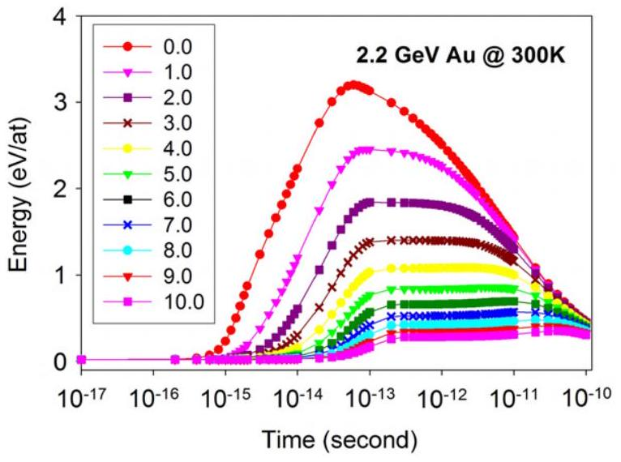
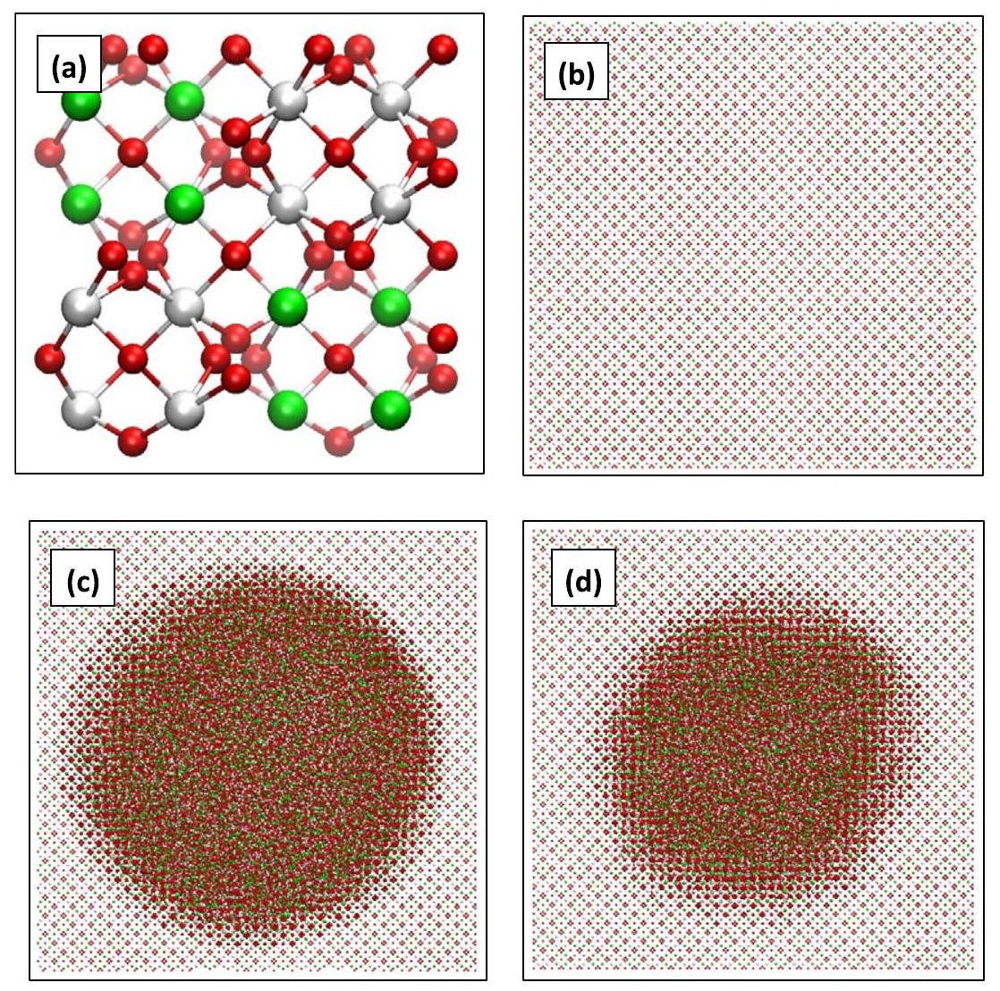
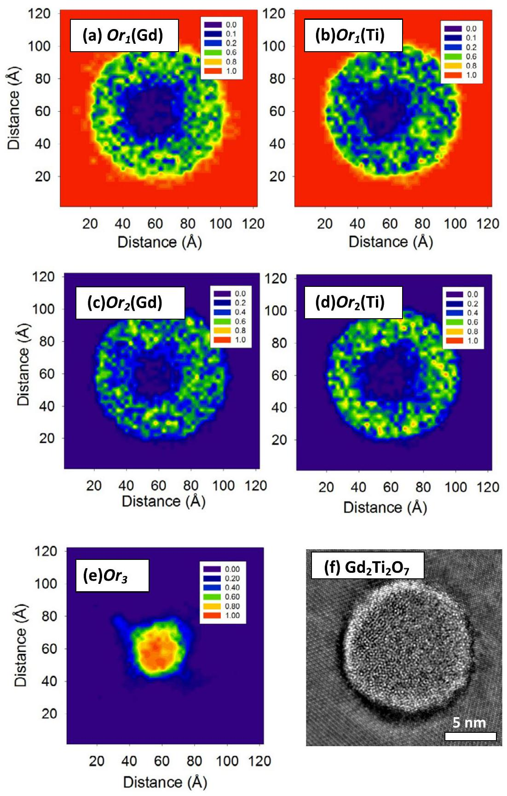
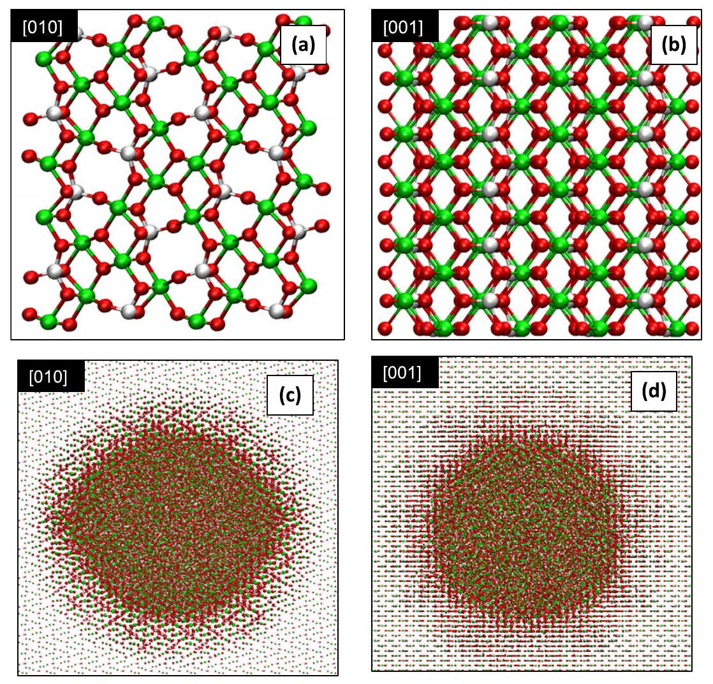
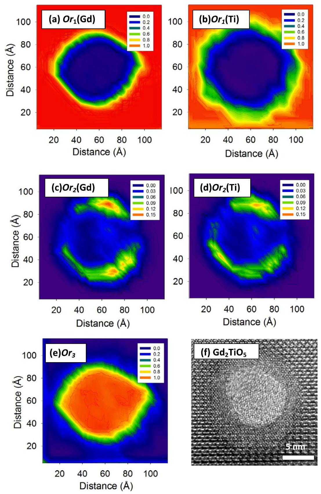
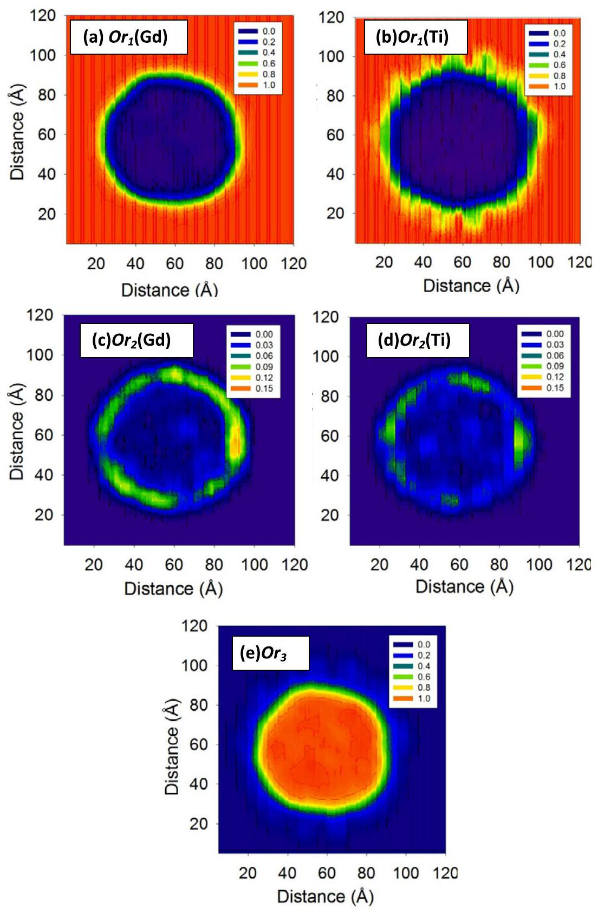

## PAPER

## Multi-scale simulation of structural heterogeneity of swift-heavy ion tracks in complex oxides

To cite this article: Jianwei Wang et al 2013 J. Phys.: Condens. Matter 25135001

View the article online for updates and enhancements.

You may also like

- Effects of Sn and Nb Doping on the Performance of $\mathrm{Fe}_{2} \mathrm{TiO}_{5}$ As a Water Splitting Photocatalyst
Mauricio A. Melo and Renato Vitalino Goncalves
- Evolution of magnetic surfboards and spin glass behavior in $\left(\mathrm{Fe}_{1 p} \mathrm{Ga}_{p}\right)_{2} \mathrm{TiO}_{5}$ Y Li, D Phelan, F Ye et al.
- Envirronmentally friendly fabrication of $\mathrm{Fe}_{2} \mathrm{TiO}_{5}-\mathrm{TiO}_{2}$ nanocomposite for enhanced photodegradation of cinnamic acid solution
Nguyen Phung Anh, Nguyen Tri, Nguyen Dien Trung et al.

# Multi-scale simulation of structural heterogeneity of swift-heavy ion tracks in complex oxides 

Jianwei Wang ${ }^{1}$, Maik Lang, Rodney C Ewing and Udo Becker Department of Earth and Environmental Sciences, University of Michigan, Ann Arbor, MI 48109-1005, USA E-mail: jwwang @ umich.edu

Received 3 October 2012, in final form 17 January 2013
Published 1 March 2013
Online at stacks.iop.org/JPhysCM/25/135001

#### Abstract

Tracks formed by swift-heavy ion irradiation, 2.2 GeV Au , of isometric $\mathrm{Gd}_{2} \mathrm{Ti}_{2} \mathrm{O}_{7}$ pyrochlore and orthorhombic $\mathrm{Gd}_{2} \mathrm{TiO}_{5}$ were modeled using the thermal-spike model combined with a molecular-dynamics simulation. The thermal-spike model was used to calculate the energy dissipation over time and space. Using the time, space, and energy profile generated from the thermal-spike model, the molecular-dynamics simulations were performed to model the atomic-scale evolution of the tracks. The advantage of the combination of these two methods, which uses the output from the continuum model as an input for the atomistic model, is that it provides a means of simulating the coupling of the electronic and atomic subsystems and provides simultaneously atomic-scale detail of the track structure and morphology. The simulated internal structure of the track consists of an amorphous core and a shell of disordered, but still periodic, domains. For $\mathrm{Gd}_{2} \mathrm{Ti}_{2} \mathrm{O}_{7}$, the shell region has a disordered pyrochlore with a defect fluorite structure and is relatively thick and heterogeneous with different degrees of disordering. For $\mathrm{Gd}_{2} \mathrm{TiO}_{5}$, the disordered region is relatively small as compared with $\mathrm{Gd}_{2} \mathrm{Ti}_{2} \mathrm{O}_{7}$. In the simulation, 'facets', which are surfaces with definite crystallographic orientations, are apparent around the amorphous core and more evident in $\mathrm{Gd}_{2} \mathrm{TiO}_{5}$ along [010] than [001], suggesting an orientational dependence of the radiation response. These results show that track formation is controlled by the coupling of several complex processes, involving different degrees of amorphization, disordering, and dynamic annealing. Each of the processes depends on the mass and energy of the energetic ion, the properties of the material, and its crystallographic orientation with respect to the incident ion beam.

(Some figures may appear in colour only in the online journal)

## 1. Introduction

Understanding the response of materials under irradiation is important for nuclear-energy applications. Materials used in a nuclear reactor, such as inert matrix fuels and structural materials, experience intense radiation fields that

[^0]can lead to significant changes in their physical and chemical properties [1-6]. At the high-energy end of the radiation spectrum, energetic particles from swift-heavy ions or fission events cause various degrees of damage in materials, depending on the irradiation condition and the properties of the materials [7-17]. For many insulators, damage caused by GeV swift-heavy ions are typically tracks of amorphous or lower atomic density material, which are micrometers in length and nanometers wide, similar to the tracks caused by fission events, but with higher energy losses [6, 13,

15-20]. Recently, swift-heavy ions have been used to probe the effect of the high-energy radiation on a wide variety of materials and to explore the complex far-from-equilibrium behavior of the materials under extreme conditions [6, 16, 17, 21-23]. Most of these experiments focus on the size of the tracks and phase transformations within the tracks [6, 16, 17, 21-23]. However, the details of the track formation process are difficult to ascertain from experiments because the tracks form within a few tens of picoseconds. For instance, whether an experimentally observed track structure is formed during the initial thermal event caused by the irradiation or during subsequent cooling and quenching cannot be determined by experiments alone. There are very few experimental techniques to observe these nanoscale processes over exceedingly short time frames (fs to ps). Thus, theoretical models are essential to understanding the track formation process [18, 21, 22, 24-27]. By comparing simulated characteristics of a track, such as its diameter and internal structure, with results from experiments, the usefulness of the calculation can be evaluated, and insights can be obtained regarding the details of the track formation process.

Swift-heavy ions lose their energy predominantly through inelastic interactions with the electrons (electronic energy loss). The energy is transferred to the electrons along the ion path, leading to local states of intense electronic excitation, which decreases rapidly away from the center of the track. Through electron-phonon coupling, the excited electrons transfer their energy to atoms. The thermal-spike model, which is based on a continuum method [27-29], has been used to describe and model track formation for a wide variety of materials. The initial energy distribution deposited on the electrons is described by the analytical formula proposed by Waligorski et al [30]. In many cases, the model has successfully predicted track radii and sputtering rates [16, 17, 28, 31-34]. However, the thermal-spike model does not provide atomic-scale details of the internal structure of the track [27-29]. As an example, the thermal-spike model does not consider phase transformations among crystalline structures (other than melting and sputtering), such as disordering, defect annealing, damage recovery, and recrystallization. However, recent experimental observations, especially those using high-resolution TEM, have revealed that there are atomic-scale variations within individual tracks that indicate defect formation, disordering, and phase transitions, as well as amorphization [16, 17, 22, 35]. Thus, the thermal-spike model alone does not provide sufficient detail of the internal structure of a track that can be compared to experimental observations. Molecular-dynamics (MD) simulations, on the other hand, can provide atomic-scale details and have been used to simulate track formation in a number of materials [18, 21, 22, 25]. However, in most of the previous MD simulations, an instantaneous deposition of energy into the structure was used to simulate the energy deposition. Such an approach simplifies the coupling process between the electron and phonon subsystems, but results in an unrealistic initial energy being assigned to the atoms at the initiation of the molecular-dynamics simulations. In a recent
development of using MD simulations to model swift-heavy ion irradiations, the energy transport from the electrons to the structure is coupled at each MD time step [36, 37]. This concurrent, multi-scale simulation method of treating the electron and phonon subsystems significantly improves the implementation of the coupling between the two subsystems in the simulations of swift-heavy ion irradiations.

Inspired by recent experimental results on the atomicscale internal structure of swift-heavy ion tracks in complex oxides [16, 22, 23], we simulate track formation in a gadolinium titanate pyrochlore, $\mathrm{Gd}_{2} \mathrm{Ti}_{2} \mathrm{O}_{7}$, and a gadolinium titanate phase with different stoichiometry and structure, $\mathrm{Gd}_{2} \mathrm{TiO}_{5}$. A multi-scale sequential simulation scheme based on the thermal-spike model in combination with molecular dynamics was used to investigate the evolution of tracks after irradiation with typical energetic ion projectiles, e.g., 2.2 GeV Au ions. The thermal-spike simulation was used to describe the energy coupling between the electron and atomic structure. The information generated from the continuum thermal-spike simulation, such as energy or temperature as a function of time and space was then used for the atomic-scale molecular-dynamics simulation. The energy calculated from the thermal-spike simulation was treated as the kinetic energy in the molecular-dynamics simulation, which is controlled by the temperature within a statistical ensemble (i.e., $N V T$ ). We assume that the initial energy deposition and coupling between electrons and atoms are reasonably implemented in the thermal-spike model. Moreover, using the energy-space-time profile generated from the thermal-spike calculation in the MD simulation has an advantage for describing the temperature evolution of the track. In previous molecular-dynamics simulations, after the energy is deposited into the track region, the track core cools with time by transferring its kinetic energy to the rest of the atomic structure without any additional temperature constraints [25] or by controlling the temperature further away from the track at low temperatures [21, 24, 37]. Both cases require that the thermal conductivity and heat capacity of the system be accurately described by the interaction potentials of the atomistic models. However, most interaction potentials are not well calibrated with the physical properties of the materials. Thus, the accuracy of the simulations, especially the temperature profile as a function of time and space, is not explicitly known. Since experimentally determined physical properties, such as thermal conductivity and heat capacity are used in the thermal-spike simulation, the temperature evolution calculated from the thermal-spike model probably gives reasonable results. Using this combination of the methods has the advantage of accounting for the coupling between the electron and structure while providing atomicscale details of the damage process.

The major difference between this study and previous MD simulations of track formations is that the energy deposition, electron-phonon coupling, and thermal evolution of the track are simulated using the thermal-spike model [18, 21, 22, 24, 25, 37]. This leads to a more physical description of the energy deposition, electron-phonon coupling, and thermal evolution of the track, which affects the thermal and structure

Figure 1. The energy per atom ( $\mathrm{eV} /$ at.) as a function of time (second) and distance (nanometer) from the track center based on the thermal-spike simulation of $\mathrm{Gd}_{2} \mathrm{TiO}_{5}$ by 2.2 GeV Au. The energy profile is translated to the kinetic energy profile, which is then supplied as an input in the subsequent MD simulation.

evolution of the simulated track. As an example illustrated in figure 1 of this new approach, energy per atom as a function of distance and time profile was generated from the thermal-spike simulation of $\mathrm{Gd}_{2} \mathrm{TiO}_{5}$ by a 2.2 GeV Au ion. The energy profile is translated to the kinetic energy profile, which is then treated as an input in the subsequent MD simulation. Thus, the temperature evolution of the MD simulation follows the profile generated by the thermal-spike simulation. As shown in figure 1, the structure is gradually heated up, which is different from most of the previous MD simulations where the coupling between the electrons and structure is not explicitly implemented and the structure is heated up at 0 ps of the MD simulations [21, 22, 24, 25]. In some of the previous simulations [18, 37], the coupling between the electrons and structure is explicitly implemented but the thermal evolution is not controlled, which could lead to errors originated from the inaccuracy of interatomic potentials in describing the thermal properties of the material.
$\mathrm{A}_{2} \mathrm{~B}_{2} \mathrm{O}_{7}$ and $\mathrm{A}_{2} \mathrm{BO}_{5}(\mathrm{~A}=$ lanthanides, Y , and $\mathrm{Sc} ; \mathrm{B}=\mathrm{Ti}$, $\mathrm{Zr}, \mathrm{Sn}, \mathrm{Hf}$ ) belong to the $\mathrm{A}_{2} \mathrm{O}_{3}-\mathrm{BO}_{2}$ binary [38, 39] and have been extensively studied for a variety of technological applications, but most importantly in the nuclear field as inert matrix fuels [2,40] and as potential materials for the immobilization of actinides [41]. Of particular interest is the discovery that certain compositions are 'resistant' to radiation damage [42]. The $\mathrm{Gd}_{2} \mathrm{Ti}_{2} \mathrm{O}_{7}$ pyrochlore, an $\mathrm{A}_{2} \mathrm{~B}_{2} \mathrm{O}_{7}$ compound, is isometric ( $F d 3 m$ ), derived from the fluorite $\left(\mathrm{AX}_{2}\right)$ structure. However, for pyrochlore, there are two cation sites and one-eighth of the anion sites are absent. The two cations and the anion vacancies are ordered. There are different types of point defects in pyrochlore: (a) cation anti-sites (switching a cation at the 16c site with a cation at the 16d site) and (b) anion Frenkel pairs (moving a 48f oxygen to an empty 8 b site) are two basic point defects. Complete disordering in cation sites (i.e., 16c and 16d sites) and in anion sites (i.e., 48f, 8a sites, and vacant 8b site) leads to a defect fluorite structure where each of the 16c and 16d sites is half-occupied by the two cations, and all the anion sites are

7/8 occupied. Under irradiation, cation Frenkel pair defects become possible and the accumulation of cation Frenkel pairs is believed to be the driving force for the amorphization of the material under irradiation [43]. There are extensive studies in recent years on structural disordering and radiation damage of $\mathrm{A}_{2} \mathrm{~B}_{2} \mathrm{O}_{7}$ pyrochlore [41]. For instance, irradiation studies of the $\mathrm{Gd}_{2} \mathrm{Ti}_{x} \mathrm{Zr}_{2-x} \mathrm{O}_{7}$ solid solution show that the radiation resistance under the MeV ion beam increases as the Zr-content increases [42]. Recent experiments have also shown that the track size resulting from GeV swift-heavy ion irradiation decrease as the Zr -content increases [16]. High-pressure studies of the $\mathrm{Gd}_{2} \mathrm{Ti}_{x} \mathrm{Zr}_{2-x} \mathrm{O}_{7}$ solid solution reveal that the pressure at which the pyrochlore structure transforms to a high-pressure phase with cotunnite structure decreases with increasing Zr-content [44]. Thus, there is a relation between the response of the pyrochlore structure to high pressures and to irradiation. A recent theoretical study has shown that the response of the pyrochlore structure to irradiation and to high pressure may be understood in the context of its ability to form defects [45].
$\mathrm{A}_{2} \mathrm{BO}_{5}$ ( $\mathrm{A}=$ lanthanides, Y , and $\mathrm{Sc}, \mathrm{B}=\mathrm{Ti}$ ) forms an orthorhombic structure (Pnam) at low temperatures. The coordination polyhedron of the rare-earth cation is a monocapped octahedron ( $\mathrm{CN}=7$ ). Each titanium atom is coordinated by a square pyramid ( $\mathrm{CN}=5$ ). As the A-site cation changes from La to Sc in the series, the orthorhombic structure changes to a cubic structure similar to pyrochlore $(F d 3 m)$ with a mixed occupancy at one cation site in the structure [46]. At high temperatures, $\mathrm{Ln}_{2} \mathrm{TiO}_{5}$ crystallizes in a hexagonal structure ( $P 6_{3} / m m c$ ) for the Ln in the middle of lanthanide series, for instance, $\mathrm{Gd}_{2} \mathrm{TiO}_{5}$. In the structure, Gd is in six-fold octahedral coordination and a mixed cation site is in five-fold trigonal bipyramid coordination. For $\mathrm{A}_{2} \mathrm{BO}_{5}$ compounds, recent progress has been made on both thermodynamics [47] and irradiation studies [22, 23, 48]. A swift-heavy ion track caused by 2.2 GeV Au ion in $\mathrm{Gd}_{2} \mathrm{TiO}_{5}$ shows a complex track internal structure with an amorphous core, a shell with hexagonal structure, and the host with the orthorhombic structure of $\mathrm{Gd}_{2} \mathrm{TiO}_{5}$ [22]. A recent experimental study of $\mathrm{Ln}_{2} \mathrm{TiO}_{5}(\mathrm{Ln}=\mathrm{La}, \mathrm{Nd}, \mathrm{Sm}, \mathrm{Gd})$ shows that the track size caused by a swift-heavy ion radiation (Xe ions, 1.47 GeV ) decreases from La to Gd [23], suggesting an increased radiation resistance in the series.

In both of $\mathrm{A}_{2} \mathrm{~B}_{2} \mathrm{O}_{7}$ pyrochlore and $\mathrm{A}_{2} \mathrm{BO}_{5}$ phase, swift-heavy ions induce complex tracks consisting of cores and shells with different atomic-scale structures [6, 22, 23, 49, 50]. In the present study, track formation was studied computationally in $\mathrm{Gd}_{2} \mathrm{Ti}_{2} \mathrm{O}_{7}$, and $\mathrm{Gd}_{2} \mathrm{TiO}_{5}$, which serve as model systems due to their similar chemical composition but different crystal structures. For a given compound, the density, chemical bonding, and details of the crystal structure affect its response under irradiation. This has been documented for materials with different polymorphs [25, 51, 52]. For instance, among the three polymorphs of titania, rutile has demonstrated the highest radiation resistance, while anatase has the lowest of the three [25]. The density and chemical bonding play an important role in the irradiation response [25, 51, 53-56]. Different irradiation behaviors have also been
observed for different zirconia polymorphs [52, 57]. Since chemical bonding is different along different crystallographic directions for a given crystal structure with an anisotropic symmetry, it is expected that the track structure will vary with the direction of a swift-heavy ion with respect to the target crystal orientation. Thus, track formations along two crystallographic orientations, [010] and [001], of $\mathrm{Gd}_{2} \mathrm{TiO}_{5}$ were also modeled. The results of the simulations improve the understanding of the track formations with information on the detailed track structure at the atomic scale. The simulated track structures are compared to available experimental data of swift-heavy ion tracks in the materials investigated. This study uses an explicit thermal-spike model sequentially coupled to molecular-dynamics simulations in order to simulate the atomic-scale response of different structures at various orientations to irradiation by swift-heavy ions.

## 2. Methods

### 2.1. Thermal-spike model

The thermal-spike model can be described by two coupled equations, and these two equations determine the energy evolution of the electron and atomic subsystems [27-29]. In this model, the initial energy is deposited into the electron subsystem. A time-dependent transient thermal process couples the two subsystems. Using a cylindrical geometry for the track with its axis parallel to the ion path, the two equations for the electron and atom subsystems are written as:

$$
\begin{gathered}
C_{\mathrm{e}} \frac{\partial T_{\mathrm{e}}}{\partial t}=\nabla\left(K_{\mathrm{e}} \nabla T_{\mathrm{e}}\right)-g\left(T_{\mathrm{e}}-T\right)+B(r, t) \\
\rho C(T) \frac{\partial T}{\partial t}=\nabla(K(T) \nabla T)-g\left(T_{\mathrm{e}}-T\right)
\end{gathered}
$$

where $T_{\mathrm{e}}$ and $T, C_{\mathrm{e}}$ and $C(T), K_{\mathrm{e}}$ and $K(T)$ are the temperatures, specific heats, and thermal conductivities of the electron and atomic subsystems, respectively. $\rho$ is the specific mass of the material. $g$ is the electron-phonon coupling constant with $g \propto 1 / \lambda^{2} . \lambda$ is the electron mean free path. $B(r, t)$ is the energy density supplied by the incident ion to the electron subsystem at radius $r$ and time $t$. Integration of $B(r, t)$ over time and space gives the total $\mathrm{d} E / \mathrm{d} x$ [58]. With appropriate thermodynamic parameters taken from experimental measurements including heat capacity, thermal conductivity, melting and vaporization temperatures, these two equations can be solved numerically, resulting in a temporal and spatial evolution of energy and temperature in the electron and the atomic subsystems. Energy losses $\mathrm{d} E / \mathrm{d} x$ are needed for thermal-spike calculations and can be calculated using the SRIM program [58]. The thermal-spike calculations provide energy profiles as a function of time and distance from the center of the tracks, and these profiles were used as an input for the molecular-dynamics calculations. More details of the thermal-spike model and its applications are described in previous publications [27-29].

### 2.2. Molecular-dynamics simulation

Three-dimensional periodic boundary conditions were employed in the molecular-dynamics simulations using GROMACS and standard algorithms [59, 60]. Since the standard three-dimensional periodic boundary conditions require Ewald summation for long-range electrostatic interactions, which can be computationally expensive, the fast particlemesh Ewald (FPME) summation method was used [61]. The Buckingham potentials from literature were used for $\mathrm{Gd}_{2} \mathrm{Ti}_{2} \mathrm{O}_{7}$ and $\mathrm{Gd}_{2} \mathrm{TiO}_{5}$ [43,62]. The first part of the Buckingham potentials (i.e., the exponential part) describes the Pauli repulsion interactions while the second part describes attractive van der Waals ( $1 / r^{6}$ ) dispersion interactions.

The positions of all atoms in the simulation cell were free to move. Formal charges were used for each of the atoms, i.e., $3+$, $4+$, $4+$, and $2-$ for $\mathrm{Gd}, \mathrm{Ti}, \mathrm{Zr}$, and O , respectively. The potentials used here have been calibrated over a wide range of separations. These potentials have been used previously in simulation studies of a wide range of binary and ternary oxides and have been particularly useful for problems involving defects and irradiation damages where the interatomic distances close to the defect after relaxation may be very different from those in the perfect lattice at equilibrium. The potentials have been well tested for simulating defects, disordering, amorphization, and radiation damages of the pyrochlores [43, 62, 63].

Unit cell parameters of the two phases were used to test the performance of the potentials, and the calculated cell parameter at ambient condition is $10.178 \AA$ for the pyrochlore $\mathrm{Gd}_{2} \mathrm{Ti}_{2} \mathrm{O}_{7}$ as compared with an experimental value of $10.185 \AA$, which is less than $1 \%$ difference [64]. For $\mathrm{Gd}_{2} \mathrm{TiO}_{5}$, the difference is less than $3 \%$. For the track formation simulation of $\mathrm{Gd}_{2} \mathrm{Ti}_{2} \mathrm{O}_{7}$ and $\mathrm{Gd}_{2} \mathrm{Zr}_{2} \mathrm{O}_{7}$, the simulation supercell contains 152064 atoms ( $12 \times 12 \times 12$ unit cells) with $\mathrm{a} \sim 122 \AA$ cubic supercell geometry. For $\mathrm{Gd}_{2} \mathrm{TiO}_{5}$, the simulation cell contains 165888 atoms ( $12 \times 36 \times 12$ unit cells) with a $\sim 125 \AA \times 135 \AA \times 136 \AA$ orthogonal supercell geometry. For $\mathrm{Gd}_{2} \mathrm{Ti}_{2} \mathrm{O}_{7}$, the projectile is along [001] direction, and for $\mathrm{Gd}_{2} \mathrm{TiO}_{5}$, the projectile directions along [010] and [001] were both simulated.

The simulated annealing protocol implemented in the GROMACS package was used to control the system temperature [59], by varying the reference temperature in the NVT ensemble (constant temperature and volume). The difference between the simulated annealing MD from a standard MD is that the system temperature in the former is controlled by a set of reference temperatures. The annealing protocol is specified by a series of corresponding time intervals and reference temperatures. The energy profiles as a function of time and space generated from the thermal-spike calculations were used as the kinetic energy input into the molecular-dynamics simulations. For the temperature coupling of the MD simulations, the Nose-Hoover thermostat was used. The initial time step of the MD simulations is 0.0001 fs when the temperature of the track center region is high, and is increased to 1 fs at 100 ps . The MD trajectory was recorded for every 0.1 ps for 100 ps .

Figure 2. Atomic structure of pyrochlore $\mathrm{Gd}_{2} \mathrm{Ti}_{2} \mathrm{O}_{7}$ (a) and snapshots of the molecular-dynamics simulations at beginning 0 ps (b), 5 ps (c), and $100 \mathrm{ps}(\mathrm{d})$. All the structures are projected on (001) plane and perpendicular to the projectile direction. The atoms are explicitly represented: oxygen as red, cations as green (Gd) and white-gray (Ti). The computational cell size is $\sim 122 \times 122 \times 122 \mathrm{~A}^{3}$ cube.

### 2.3. Order parameters

Structural changes inside a track can be qualitatively visualized by simply plotting the atomic structures resulting from the molecular-dynamics simulations. A better way to analyze the track's internal structure is to quantitatively describe the structural changes, using statistical principles and by consideration of the variation of the structures. Since the pyrochlore structure, disordered pyrochlore structure, and amorphous structure are the possible final states of the irradiated pyrochlore, three simplified order parameters were devised to distinguish the amorphous phase and the disordered phase from the original, ordered pyrochlore structure. The first order parameter is defined as $\mathrm{O} r_{1}=\left\langle\delta\left(i=j, r_{i, j} \leq 1 \AA\right)\right\rangle$, where $i$ is a reference cation site in the original undamaged lattice, $j$ is a cation at the final damaged structure, $r_{i, j}$ is the distance between a cation in the final structure and its nearby closest reference cation lattice site in the original lattice. The bracket means an average over the number of cations in the system. This order parameter is defined to describe the structural deviation from the original pyrochlore structure. $\delta=1$ only if $i$ and $j$ have the same type of atom and $r_{i, j}$ is less than or equal to $1 \AA$, indicating the structure is not damaged as compared with the original structure at the site. The second order parameter is defined as $\mathrm{O} r_{2}=\left\langle\delta\left(i \neq j, r_{i, j} \leq 1 \AA\right)\right\rangle$, $\delta=1$ only if $i$ and $j$ are different types of cations and $r_{i, j}$ is less than or equal to $1 \AA$, indicating an anti-site cation defect at the site. This order parameter measures the fraction of cation
anti-site defects, a common defect type in the structure. For both $\mathrm{O} r_{1}$ and $\mathrm{O} r_{2}, 0.5$ indicates disordered pyrochlore with a defect fluorite structure. The third order parameter is defined as $\mathrm{O} r_{3}=\left\langle\delta\left(r_{i, j} \geq 1 \AA\right)\right\rangle, \delta=1$ only if $r_{i, j}$ is larger than $1 \AA$, which indicates the crystal structure is damaged. This order parameter is used to define the amorphous region of the track. An amorphous region is indicated if the order parameter $\mathrm{O} r_{3}$ is near 1.0 in an extended region across multiple lattice sites. The $1 \AA$ distance criterion used in the order parameter definitions, or $\sim 30 \%$ of the shortest cation-cation distance of the structure, is arbitrary, but a reasonable approximation for distinguishing a damaged structure from an intact one. This is because a normal deviation from the unperturbed lattice sites is typically not expected to be greater than $1 \AA$. Values slightly larger or smaller than $1 \AA$ could be used, but the results are not expected to significantly change the conclusions based on these results.

## 3. Results and discussion

### 3.1. Amorphization and thermal annealing of a track in $G d_{2} \mathrm{Ti}_{2} \mathrm{O}_{7}$

Structural changes within a swift-heavy ion track in $\mathrm{Gd}_{2} \mathrm{Ti}_{2} \mathrm{O}_{7}$ can be readily visualized using the atomic coordinates generated from the molecular-dynamics simulation. Figure 2(a) shows the unit cell of the atomic structure of pyrochlore, and
figure 2(b) shows the computational supercell at 0 ps before the energy was deposited into the system. Figure 2(c) is a snapshot of the molecular-dynamics simulation at $\sim 5 \mathrm{ps}$. At this time, the size of the track, where atoms are displaced from their lattice sites, is $\sim 9 \mathrm{~nm}$ in diameter (figure 2(c)). As the temperature of the atomic subsystem decreases, the track size decreases. At 100 ps of the MD simulation, the track size decreases to 7 nm (figure 2(d)), but no significant changes were observed with a longer simulation time. This result is similar to the molecular-dynamics simulations of the track formation in $\mathrm{Gd}_{2} \mathrm{Ti}_{2} \mathrm{O}_{7}$ previously reported [22].

The atomic subsystem is heated after the energy is deposited, and then the system cools as the heat in the track core is dissipated. The initial heating process causes the aperiodic structure of the track core. As the temperature decreases, some of the originally displaced atoms return to the lattice sites resulting in a recrystallization at the interface between the amorphous core and the ordered crystal region, which starts a few picoseconds after the radiation $(\sim 5 \mathrm{ps})$. The kinetic energy of the atoms near the interface is expected to be the driving force for the annealing of the track, which is the transport of the displaced atoms back to their respective lattice sites. Recent experiments show that energetic ion beams with energies in the GeV range induce recrystallization of amorphous phases via the so-called swift-heavy-ion-beam-induced epitaxial crystallization process [65, 66]. Thus, the annealing-induced recrystallization process as evident by the simulation is expected. Experimentally, it is not possible to directly observe the recovery process within individual ion tracks because of the very short time scale of the process and the nanometer-scale dimensions. MD simulations are necessary to understand how the size and internal structure tracks in pyrochlore are affected by the annealing processes. For $\mathrm{Gd}_{2} \mathrm{Ti}_{2} \mathrm{O}_{7}$, based on the MD simulation, the track size is reduced by $\sim 25 \%$ (from $\sim 9$ to 7 nm ) at a time scale of 0.1 ns as shown in figures 2(c) and (d). Similar recovery processes have been reported in previous molecular-dynamics simulations of titania [25] and pyrochlore [22]. In the molecular-dynamics simulations of three different polymorphs of titania [25], the energy was instantaneously deposited into the atomic subsystem at the beginning of the simulations. The results show different degrees of annealing effects, depending on their crystal structures and physical properties as revealed by the structures of the tracks [25]. Molecular-dynamics simulations of pyrochlore compositions: $\mathrm{Gd}_{2} \mathrm{Ti}_{2} \mathrm{O}_{7}$ and $\mathrm{Gd}_{2} \mathrm{Zr}_{2} \mathrm{O}_{7}$ [22] have revealed dramatically different annealing effects resulting in distinctively different track morphologies for the systems with the same crystal structure but different chemical compositions. The present results for $\mathrm{Gd}_{2} \mathrm{Ti}_{2} \mathrm{O}_{7}$ also show a track size reduction during the cooling period of the thermal spike, but the size reduction is $\sim 20 \%$ less than the previous result based on the final track structures of the MD simulations [22]. The main reason for this difference may be caused by different implementations of how the energy is deposited into the atomic system. In the previous simulation [22], the energy is instantaneously deposited into a cylinder-shaped region with an assigned energy deposition
efficiency, and the cooling process of the track core is then largely controlled by the accuracy of the thermal conductivity and heat capacity used by the model, which are not calibrated with respect to the corresponding experimental values [67]. The effect of thermodynamic properties and transport properties, such as the conductivity and heat capacity, described by the potentials on the simulation results need to be addressed. In the present molecular-dynamics simulation, the system temperature evolution was predetermined based on the thermal-spike calculation, where experimental physical properties, such as thermal conductivity and heat capacity were used [68-70].

### 3.2. Formation of defect fluorite structure in $\mathrm{Gd}_{2} \mathrm{Ti}_{2} \mathrm{O}_{7}$ pyrochlore

Although the damage of the structure can be readily visualized using the trajectory of the molecular-dynamics simulations, it is difficult to distinguish the defect fluorite structure from the pyrochlore structure because they have the same structural topology. It is particularly difficult to accurately interpret the simulation results at the boundary region between the amorphous core and the crystalline shell and between the crystalline shell and the host. The introduction of order parameters facilitates the description of the simulated track structures and the comparison to experimental results from TEM analysis.

Figure 3 shows contour maps of the calculated order parameters averaged along the track length and projected onto the (001) plane of $\mathrm{Gd}_{2} \mathrm{Ti}_{2} \mathrm{O}_{7}$ from the structure after 100 ps simulation time. The amorphous region, the completely disordered fluorite structure, the anti-pyrochlore structure, and the partially disordered pyrochlore structure are shown inside the track. Figures 3(a) and (b) show the undamaged matrix of the pyrochlore structure surrounding the ion track, where the order parameter $\mathrm{O} r_{1}$ is close to unity (red) and a track region where the order parameter $\mathrm{O} r_{1}$ is less than $\sim 1.0$. Within the track, there is also a distinct difference between the amorphous core where the order parameter $\mathrm{O} r_{1}$ is close to zero (blue) and the disordered region where the order parameter $\mathrm{O} r_{1}$ is between 0 (blue) and 1 (red). As shown in figures 3(a) and (b), the result from the order parameter $\mathrm{O} r_{1}$ based on Gd (figure 3(a)) is similar to the one based on Ti (figure 3(b)). Figures 3(c) and (d) show the results based on the order parameter $\mathrm{O} r_{2}$. For this order parameter, a value of zero (blue) represents the amorphous or unperturbed pyrochlore region, and a value of unity (red) indicates an ordered structure where the Gd and Ti sites are exchanged in the pyrochlore structure. Note that the color for the host matrix is different in figures 3(a), and (b) and in figures 3(c) and (d) because of different definitions of the two order parameters. Similar to the order parameter $\mathrm{O} r_{1}$, a value between 0 (blue) and 1 (red) indicates the degree of disordering as 0.5 for both order parameters indicates fully disordered defect fluorite structure. As figures 3(a)-(d) show, the disordered region is highly heterogeneous, which includes a mixture of the defect fluorite structure, partially ordered pyrochlore structure, and partially amorphous domains. The order parameters ( $\mathrm{O} r_{1}$ and $\mathrm{O} r_{2}$ ) vary over a wide range within the disordered region. In figure 3(e),

Figure 3. Order parameter contour maps of swift-heavy ion track in $\mathrm{Gd}_{2} \mathrm{Ti}_{2} \mathrm{O}_{7}$. The cation used for the order parameter $\mathrm{O} r_{1}$ is $\mathrm{Gd}(\mathrm{a})$, and Ti (b). For (a) and (b), value 1.0 (red) is for pyrochlore structure, 0.5 for disordered fluorite structure, 0.0 (blue) for amorphous structure. For (c) and (d), the cation used for the order parameter $\mathrm{Or} r_{2}$ is $\mathrm{Gd}(\mathrm{c})$, and $\mathrm{Ti}(\mathrm{d})$. A value 1.0 (red) is for anti-pyrochlore structure (e.g., Gd and Ti occupies each other's lattice site), 0.5 for disorder fluorite structure, and 0.0 (blue-purple) for amorphous or pyrochlore structure. For (e), the cations used for the order parameter $\mathrm{O} r_{3}$ are Gd and Ti . A value 1.0 (red) is for amorphous structure. Insets are color scheme. (f) A high-resolution TEM image of single track in $\mathrm{Gd}_{2} \mathrm{Ti}_{2} \mathrm{O}_{7}$ induced by 2.2 GeV Au ions. Based on fast-Fourier analysis, the damaged region is amorphous + defect fluorite. Reproduced with permission from [22]. Copyright 2010 Cambridge University Press.

the amorphous region, where the order parameter $\mathrm{O} r_{3}$ is close to 1 (red), is obvious, which is consistent with the results based on order parameters $\mathrm{O} r_{1}$ and $\mathrm{O} r_{2}$. Based on the three order parameters, the estimated size of the amorphous region is $3-4 \mathrm{~nm}$ in diameter. The size of the amorphous core based on the order parameters is much smaller than that based on the visual impression (figure 2(d)), demonstrating the value of using the order parameters in order to quantify the description of the heterogeneous structure of a track.

### 3.3. Phase behavior of orthorhombic $\mathrm{Gd}_{2} \mathrm{TiO}_{5}$ under the swift-heavy ion irradiation and effect of crystallographic orientation

Figures 4(a) and (b) show the crystal structure of orthorhombic $\mathrm{Gd}_{2} \mathrm{TiO}_{5}$ projected along the [010] and [001] zone axes. Thermal-spike calculations in combination with molecular-dynamics simulations, similar to those for $\mathrm{Gd}_{2} \mathrm{Ti}_{2} \mathrm{O}_{7}$, were performed for orthorhombic $\mathrm{Gd}_{2} \mathrm{TiO}_{5}$

Figure 4. Atomic structure of orthorhombic $\mathrm{Gd}_{2} \mathrm{TiO}_{5}$ phase projected on (010) (a) and (001) (b) planes, and structures of molecular-dynamics simulations at 100 ps for the projectile direction [010] (c) and [001] (d). Colors of atoms are the same as in figure 2. The computational supercell size is a $\sim 125 \AA \times 135 \AA \times 136 \AA$ tetragonal prism.

with the swift-heavy ion projectile being along [010] and [001]. Figures 4(c) and (d) show snapshots of the MD simulations projected on to the (010) and (001) planes of the computational supercell after 100 ps molecular-dynamics simulations. The track is slightly larger and more asymmetric along [010] than along [001]. Internal 'facets' are more evident along the [010] than [001]. Visualization of the MD trajectories shows that the facet development occurs gradually during the cooling period of the simulations, largely because of the asymmetric symmetry of the structure. The track size is also reduced during the process, but the size change is relatively small compared with $\mathrm{Gd}_{2} \mathrm{Ti}_{2} \mathrm{O}_{7}$.

Figures 5 and 6 show contour maps of the order parameters $\mathrm{O} r_{1}, \mathrm{O} r_{2}$, and $\mathrm{O} r_{3}$, calculated from the structures in figures 4(c) and (d), projected on to the (010) and (001) planes, respectively. The figures only show the track regions of the maps. The damaged core regions are amorphous as suggested by the atomic structures (figures 4(c) and (d)), consistent with the results from the order parameter contour maps (figures 5 and 6). Sizes of the amorphous cores are larger as determined by the order parameter $\mathrm{O} r_{1}$ based on Ti cation than based on Gd along both directions (figures 5(a), (b), 6(a) and (b)). In addition, outside the amorphous core and transition regions, there are atoms slightly displaced from their lattice sites, forming a $2-3 \mathrm{~nm}$ thick shell-like structure (figures 4(c) and (d)). The order parameter analysis shows that these regions are damaged in the Ti sublattice (figures 5(b) and 6(b)) but not in the Gd sublattice (figures 5(a) and 6(a)).

These results suggest that the Ti sublattice is more damaged than the Gd sublattice. Figure 5(c), (d), 6(c) and (d) show that cation anti-site disordering is limited as suggested by the low $\mathrm{O} r_{2}$ values in the contour maps (high value in red and low value in blue). The large disordered region with defect fluorite structure of the track ( $2-3 \mathrm{~nm}$ ) that appears in the $\mathrm{Gd}_{2} \mathrm{Ti}_{2} \mathrm{O}_{7}$ phase (figures 3(a)-(d)) is not observed in $\mathrm{Gd}_{2} \mathrm{TiO}_{5}$, where in the latter, only a $\sim 1-2 \mathrm{~nm}$ transition region from the unperturbed to amorphous region is present. This region has about $10-15 \%$ anti-site defects, which is distinctively higher than the rest of the track (<0.3\%, figures 5(c), (d), 6(c) and (d)). The region with high anti-site defects is located inside the Ti sublattice damaged region and outside the Gd sublattice damaged region. The boundary between the amorphous region and undamaged $\mathrm{Gd}_{2} \mathrm{TiO}_{5}$ phase appears to be larger in the Ti sublattice than in the Gd sublattice. The amorphous core determined by the order parameter $\mathrm{O} r_{3}$ is an average of both the Gd and Ti sublattices (figures 5(e) and 6(e)). As the figures show, the amorphous core along [010] is marginally larger than that along [001].

### 3.4. Heterogeneous tracks in complex oxides from MD simulations and previous experimental results

3.4.1. Track complexity in complex oxides from previous experimental results. The structural stability of a number of different complex oxides such as $\mathrm{A}_{2} \mathrm{~B}_{2} \mathrm{O}_{7}$ pyrochlores under swift-heavy ion irradiation has been a

Figure 5. Order parameter contour maps of swift-heavy ion track in $\mathrm{Gd}_{2} \mathrm{TiO}_{5}$ with the projectile along [010]. The same order parameters and colors are used as in figure 3. The cation used for the order parameter $\mathrm{O} r_{1}$ is Gd (a), and Ti (b). For (c) and (d), the cation used for the order parameter $\mathrm{O} r_{2}$ is $\mathrm{Gd}(\mathrm{c})$, and $\mathrm{Ti}(\mathrm{d})$. For (e), the cations used for the order parameter $\mathrm{O} r_{3}$ are Gd and Ti . (f) A high-resolution TEM image of single track in $\mathrm{Gd}_{2} \mathrm{TiO}_{5}$ induced by 2.2 GeV Au ions. Based on fast-Fourier analysis, the damaged region is amorphous + hexagonal. Reproduced with permission from [22]. Copyright 2010 Cambridge University Press.

subject of recent experimental studies [6, 16, 17, 22, 23, 49, 50]. Structural modifications have been revealed by a number of complementary analytical techniques, such as x-ray diffraction, Raman spectroscopy, and transmission electron microscopy (TEM). Swift-heavy ion tracks have been observed in different cubic pyrochlore compositions, $\mathrm{A}_{2} \mathrm{~B}_{2} \mathrm{O}_{7}$ [22, 49, 50], and orthorhombic $\mathrm{A}_{2} \mathrm{BO}_{5}$ phases [22, 23] with a core-shell damage morphology [22, 23, 49]. The track core was found to be amorphous while the surrounding shell is in general a disordered crystalline phase. Both the
track size and its internal structure depend strongly on the chemical composition and crystal structure of the sample, irradiation temperature, and energy deposition ( $\mathrm{d} E / \mathrm{d} x$ ) of the ion projectiles [22]. Swift-heavy Au ions ( 2.2 GeV ) induce continuous tracks of comparable sizes (diameter: $\sim 11 \mathrm{~nm}$ ) in $\mathrm{Gd}_{2} \mathrm{Ti}_{2} \mathrm{O}_{7}$ (figure 3(f)) and $\mathrm{Gd}_{2} \mathrm{TiO}_{5}$ (figure 5(f)). Both materials investigated in this study show tracks with a large amorphous core surrounded by a crystalline shell, which is somewhat thinner for pyrochlore. By means of fast-Fourier transform (FFT) analysis, it was evident that the shell

Figure 6. Order parameter contour maps of swift-heavy ion track in $\mathrm{Gd}_{2} \mathrm{TiO}_{5}$ with the projectile along [001]. The same order parameters and color code are used as in figures 3 and 5.

structure is defect fluorite and hexagonal for the $\mathrm{Gd}_{2} \mathrm{Ti}_{2} \mathrm{O}_{7}$ pyrochlore and $\mathrm{Gd}_{2} \mathrm{TiO}_{5}$ phase respectively [22]. A structural relationship was found between shell and undamaged sample matrix, indicating epitaxial recrystallization as the shell-forming mechanism. The core-shell boundary is rather sharp, but shows some degree of irregularity with a transition zone consisting of mixed phases. Ion tracks with core-shell morphology have been also found in other pyrochlore compositions, e.g., $\mathrm{Gd}_{2} \mathrm{Ti}_{1} \mathrm{Zr}_{1} \mathrm{O}_{7}$ [22]. Interestingly in this case, the track structure is not distinctively divided into core and shell, but consists mainly of overlapping fluorite and amorphous regions with the latter being more dominant towards the center of the track. For the $\mathrm{A}_{2} \mathrm{BO}_{5}$ phases, the structure of the track shell depends on the chemical
composition. While the shell is hexagonal in $\mathrm{Gd}_{2} \mathrm{TiO}_{5}$ (figure 5(f)), a defect fluorite phase was found in $\mathrm{Sm}_{2} \mathrm{TiO}_{5}$ after irradiation with 1.47 GeV Xe ions [23]. Note, TEM characterization at high resolution as shown in figures 3(f) and 5(f) has only been completed for a limited number of tracks. Thus, they represent rather selected examples.
3.4.2. Swift-heavy ion track morphology with a core-shell internal structure. The present thermal-spike model and molecular-dynamics simulations show complex heterogeneous internal structures of swift-heavy ion tracks in $\mathrm{Gd}_{2} \mathrm{Ti}_{2} \mathrm{O}_{7}$ and $\mathrm{Gd}_{2} \mathrm{TiO}_{5}$ oxides. Those tracks form over exceedingly short time scales, and the occurrence of
heterogeneous structures is controlled by the phase behavior of the target material and related kinetic and thermodynamic constraints. For $\mathrm{Gd}_{2} \mathrm{Ti}_{2} \mathrm{O}_{7}$ pyrochlore and $\mathrm{Gd}_{2} \mathrm{TiO}_{5}$ compositions, the ability to form different disordered structures plays a crucial role in the formation of swift-heavy ion tracks with an internal core-shell structure. Thus, these complex oxides are ideally suited to simulate the formation of ion tracks consisting of different equilibrium and non-equilibrium phases. For $\mathrm{Gd}_{2} \mathrm{Ti}_{2} \mathrm{O}_{7}$ pyrochlore, the molecular-dynamics simulations reveal an amorphous core and a disordered shell structure, consistent with previous molecular-dynamics simulations and experiment results [22]. The calculated size of the track based on the molecular-dynamics simulation is 9 nm (figures 3(a)-(d)), as compared with an experimental value from TEM measurements of 12 nm for the 2.2 GeV Au ion on $\mathrm{Gd}_{2} \mathrm{Ti}_{2} \mathrm{O}_{7}$ pyrochlore (figure 3(f)). Although the overall size of the simulated tracks is comparable with the observed ones, the present simulations show differences between the simulations and experiments in structural details. In figures 3(a)-(d), the disordered fluorite structure extends $2-3 \mathrm{~nm}$ from the edge of the amorphous core to the unperturbed pyrochlore, which is larger than the experimentally observed value of $\sim 1 \mathrm{~nm}$ (figure 3(f)). The calculated amorphous core is $\sim 3-4 \mathrm{~nm}$, significantly smaller than the observed size of $\sim 10 \mathrm{~nm}$ [22]. The amorphous core is expected to form for insulators like pyrochlores when the temperature of the track core induced by the radiation rises above the melting temperature but the material fails to recrystallize during the annealing process of the track formation. The origin of the defect fluorite shell cannot be unambiguously understood by either the thermal-spike approach or experimental results [16, 17, 22]. The disordered shell may form during the period of rising temperature in the thermal-spike on the edges of a molten core track zone when the temperature is high enough to initiate defect formation but not melting. On the other hand, the defect fluorite phase may form during the cooling/annealing period when the initial molten region recrystallizes epitaxially inward but fails to form the fully ordered pyrochlore structure. The present molecular-dynamics simulations clearly show that a substantial recrystallization occurs during cooling in $\mathrm{Gd}_{2} \mathrm{Ti}_{2} \mathrm{O}_{7}$, which is responsible for the defect fluorite structure. This is reasonable since the heating period of swift-heavy ion irradiation is more rapid than the cooling period. Based on the thermal-spike simulations of $\mathrm{Gd}_{2} \mathrm{Ti}_{2} \mathrm{O}_{7}$ pyrochlore (figure 1), the time to increase the temperature for a track core to the maximum is a fraction of a picosecond and the time to cool the system to room temperature is longer than 50 ps . During the latter process, the track region could stay near the recrystallization temperature for a sufficiently long time to allow a partial recrystallization of the amorphous core into crystalline track shells.

The present molecular-dynamics simulations show that similar recrystallization of the tracks in $\mathrm{Gd}_{2} \mathrm{TiO}_{5}$ leads to a similar core-shell structure (figures 5 and 6). This is supported by high-resolution TEM results of ion tracks consisting of an amorphous core surrounded by a crystalline shell (figure 5(f)). The relative size of core and shell in the experimental and simulation results do not agree, the latter suggesting a very
thin crystalline shell and a relatively large amorphous core. Based on FFT analysis of the high-resolution TEM image, it was concluded that the shell in $\mathrm{Gd}_{2} \mathrm{TiO}_{5}$ consists of a hexagonal high-temperature phase [22], in agreement with the phase diagram [46]. However, as shown in $\mathrm{Sm}_{2} \mathrm{TiO}_{5}$, a cubic structure (defect fluorite) can also form in nanometer-sized track shells of $\mathrm{Sm}_{2} \mathrm{TiO}_{5}$ phase under the irradiation [23]. Our MD simulations show cation anti-site disordering in the region between the undamaged orthorhombic matrix and the inner amorphous core (figures 4-6). It is difficult to conclude from the MD simulation data whether the observed cation anti-site disordering within the shell indicates an orthorhombic-tohexagonal phase transition. In an effort to test whether simple molecular-dynamics simulations are capable of simulating the orthorhombic-to-hexagonal phase transition, a computational supercell of orthorhombic $\mathrm{Gd}_{2} \mathrm{TiO}_{5}$ with 768 atoms was constructed, and molecular-dynamics simulations were performed at temperatures between 1400 and 2100 K . In all these simulations, no phase transition was observed except that there is a substantial disordering at high temperatures. This disordering is similar to the disordered structure that was seen in the simulated track of the orthorhombic $\mathrm{Gd}_{2} \mathrm{TiO}_{5}$ phase (figures 5(c), (d), 6(c) and (d)). Although the simulations were not able to directly reproduce the experimental observed phase transitions (figure 5(f)), the $15-20 \%$ of cation anti-site defect formation in the MD simulations (figures 5 and 6) may indicate a possible phase transition that could lead to a different structure, such as the hexagonal structure or the defect fluorite structure as observed for a different $\mathrm{Sm}_{2} \mathrm{TiO}_{5}$ composition [23].
3.4.3. Structural heterogeneity within the swift-heavy ion tracks. Regardless of the identification of the actual phase that forms the shell, the simulations suggest a pronounced structural heterogeneity throughout the tracks for both $\mathrm{Gd}_{2} \mathrm{Ti}_{2} \mathrm{O}_{7}$ pyrochlore and orthorhombic $\mathrm{Gd}_{2} \mathrm{TiO}_{5}$. The degree of disordering, as measured by the order parameter $\mathrm{O} r_{1}$ and $\mathrm{O} r_{2}$, varies significantly within the track shell of the $\mathrm{Gd}_{2} \mathrm{Ti}_{2} \mathrm{O}_{7}$ pyrochlore as shown in figures 3(a)-(d). This heterogeneous character is also observed in high-resolution TEM data of the swift-heavy ion track of $\mathrm{Gd}_{2} \mathrm{Ti}_{2} \mathrm{O}_{7}$, more clearly of $\mathrm{Gd}_{2} \mathrm{ZrTiO}_{7}$, showing that the track shell zone consists mainly of overlapping defect fluorite and amorphous regions [22]. In addition, the simulated tracks also depend on the cation sublattice in the $\mathrm{Gd}_{2} \mathrm{TiO}_{5}$ phase. For example, the track size calculated from the order parameter $\mathrm{O} r_{1}$ is different for the Gd and Ti cations (figures 5(a), (b), 6(a) and (b)), indicating a different structural response of the corresponding sublattices under the irradiation. Thus, a heterogeneous track structure as evident by the MD simulation results is expected for the conditions prevailing within a swift-heavy ion track. A heterogeneous track morphology within the track region, as revealed by high-resolution TEM images, has been also confirmed for $\mathrm{Nd}_{2} \mathrm{Zr}_{2} \mathrm{O}_{7}$ pyrochlore irradiated with 120 MeV U ions [50].
3.4.4. Discrepancies between the simulations and high-resolution TEM observations. As pointed out in the
previous paragraphs, there are differences between the experimental observations using high-resolution TEM and the MD simulations. The reason for the discrepancies between the two techniques in terms of the track size and damage morphology can be explained by the uncertainties from both approaches. On the experimental side, high-resolution TEM imaging is the only technique that allows the direct observation of the internal track structure. Here, the sample preparation procedure and specifics of the imaging conditions may affect the image of the actual track size and structure. In addition, a direct comparison between the simulation and the TEM observation is not straightforward. The MD simulated track is often different from the track estimate derived from the analysis of high-resolution TEM images of an inhomogeneous material [71]. The MD calculated track is a direct representation of the molecular structure from the MD simulation. In contrast, the TEM image is not a 'picture' of the atomic positions but the result of the interactions of the electron beam with the material through its entire thickness of a few hundreds nm , which could be a mixture of crystalline and aperiodic domains inside a track [71]. For example, the coexistence of defect fluorite domains with amorphous regions along the track will lead to a TEM image with a character of both amorphous and crystalline, which is nonlinear to the volume fractions of the two [71]. Here, the challenge is to image amorphous domains within a crystalline matrix.

In the molecular-dynamics simulations, errors from the interaction potentials describing the diffusion and transport processes and constraints from the MD methods could affect the simulation results of the melting and annealing processes, resulting in errors of the calculated size of the track and the heterogeneous structure. The differences on the details between the simulations and the experiments are expected. This is largely because the molecular models used in this study are not calibrated with the experimental energetics and other properties that are critical for the simulations of the kinetics of recrystallization and annealing of the $\mathrm{Gd}_{2} \mathrm{Ti}_{2} \mathrm{O}_{7}$ pyrochlore and the $\mathrm{Gd}_{2} \mathrm{TiO}_{5}$ phase, such as defect formation energies, amorphization energies, and activation energies of diffusion, heat capacity, and thermal conductivity. The calculated defect formation energies and activation energies are often much higher than experimental results [43]. Similar molecular models also predict defect energies of the materials much higher than what would be expected from experimental determinations [38]. In addition, constraints such as periodic boundary conditions in the MD simulations may cause difficulties to simulate phase transitions and structure changes that are incompatible with the constraints. It also needs to mention that the connections between the two different scales (i.e., the thermal-spike model and the MD model) of the descriptions of the thermal evolution of the materials are not one-to-one match. This kind of problems is common in many multi-scale simulations because a property at one scale often cannot directly be translated to the next scale. The thermal-spike model is a continuum model that cannot account for the symmetry of the crystal structures while the crystal structures are specifically modeled in the MD
simulations. The forces generated by the potentials in the MD simulations are only true to the interatomic potentials and the thermal evolution resulted from the thermal-spike model.

## 4. Summary and concluding remarks

Thermal-spike model calculations and molecular-dynamics simulations reveal the details of the internal structures of swift-heavy ion tracks in $\mathrm{Gd}_{2} \mathrm{Ti}_{2} \mathrm{O}_{7}$ pyrochlore and $\mathrm{Gd}_{2} \mathrm{TiO}_{5}$ phase. This combination of the methods takes the advantages of the continuum model for the coupling of the electronic subsystem with the atomic subsystem and the atomic models for the atomic-scale details of the heterogeneous internal structures of the tracks. In addition to the internal structures directly visualized by the atomic structures from the molecular simulations, the order parameters reveal additional structural details and provide more insight into the structures of the damaged regions. The simulated internal structure of the track consists of an amorphous core and a shell of disordered, but still crystalline, domains for both $\mathrm{Gd}_{2} \mathrm{Ti}_{2} \mathrm{O}_{7}$ and $\mathrm{Gd}_{2} \mathrm{TiO}_{5}$. For $\mathrm{Gd}_{2} \mathrm{Ti}_{2} \mathrm{O}_{7}$ pyrochlore, the shell region is heterogeneous with various degrees of disordering from the host pyrochlore structure, but on average, leading to a defect fluorite structure in the region. For $\mathrm{Gd}_{2} \mathrm{TiO}_{5}$ phase, crystal faces with a definite crystallographic orientation are apparent around the amorphous core and are more evident in $\mathrm{Gd}_{2} \mathrm{TiO}_{5}$ along the[010] than [001], suggesting an orientational dependence of the radiation response of this structure. The structural analysis also shows that the Ti sublattice has a larger damage region than the Gd sublattice. These simulation results suggest that the tracks caused by the swift-heavy ion are more complex than previously thought in the complex oxides. The track formation process as revealed by the simulations involves the transport of the atoms within the track caused by the kinetic energy of the atoms, resulting in different degrees of amorphization, disordering, and dynamic annealing that depend on the energetic ion, the target material, the crystallographic orientation. The heterogeneity observed in the disordered region in $\mathrm{Gd}_{2} \mathrm{Ti}_{2} \mathrm{O}_{7}$ raises a question if the aperiodic region based on the TEM experiments [22] is entirely truly amorphous, a mixture of partially amorphous and disordered pyrochlore, or just an aperiodic phase. If the latter is true, experimental methods capable of probing short or intermediate range structure are required to characterize the internal structure and complex phases inside a swift-heavy ion track. Such a characterization method may be made possible by using a combination of electron diffraction and fluctuation electron microscopy (FEM) variance data [72].

## Acknowledgments

This work was supported by the Center for the Materials Science of Actinides, an Energy Frontier Research Center, funded by the US Department of Energy, Office of Basic Energy Sciences (DE-SC0001089). The computational work was supported by the National Energy Research Scientific Computing Center (NERSC), which is supported by the Office
of Science of the US Department of Energy under Contract No. DE-AC02-05CH11231. Computational resources were also made available in part by the National Science Foundation through XSEDE resources from NCSA and NICS under grant TG-DMR080047N and TG-DMR100034. JW is grateful for discussions with Dr Marcel Toulemonde (CNRS, France) on thermal-spike model and allowing us to use his code for the thermal-spike model simulation.

## References

[1] Hobbs L W, Clinard F W, Zinkle S J and Ewing R C 1994 J. Nucl. Mater. 216 291-321
[2] Lutique S, Staicu D, Konings R J M, Rondinella V V, Somers J and Wiss T 2003 J. Nucl. Mater. 319 59-64
[3] Little E A 2006 Mater. Sci. Technol. 22 491-518
[4] Zinkle S J and Busby J T 2009 Mater. Today 12 12-9
[5] Katoh Y, Snead L L, Szlufarska I and Weber W J 2012 Curr. Opin. Solid State Mater. Sci. 16 143-52
[6] Thome L, Moll S, Debelle A, Garrido F, Sattonnay G and Jagielski J 2012 Adv. Mater. Sci. Eng. 2012905474
[7] Balanzat E 1993 Radiat. Eff. Defects Solids 126 97-104
[8] Meftah A, Brisard F, Costantini J M, Hageali M, Stoquert J P, Studer F and Toulemonde M 1993 Phys. Rev. B 48 920-5
[9] Wang Z G, Dufour C, Paumier E and Toulemonde M 1994 J. Phys.: Condens. Matter 6 6733-50
[10] Toulemonde M, Bouffard S and Studer F 1994 Nucl. Instrum. Methods Phys. Res. B 91 108-23
[11] Szenes G 1995 Phys. Rev. B 51 8026-9
[12] Dunlop A, Jaskierowicz G and Della-Negra S 1998 Nucl. Instrum. Methods Phys. Res. B 146 302-8
[13] Komarov F F 2003 Phys.-Usp. 46 1253-82
[14] Wesch W, Kamarou A and Wendler E 2004 Nucl. Instrum. Methods Phys. Res. B 225 111-28
[15] Toulemonde M, Trautmann C, Balanzat E, Hjort K and Weidinger A 2004 Nucl. Instrum. Methods Phys. Res. B 216 1-8
[16] Lang M, Zhang F X, Zhang J M, Wang J W, Lian J, Weber W J, Schuster B, Trautmann C, Neumann R and Ewing R C 2010 Nucl. Instrum. Methods Phys. Res. B 268 2951-9
[17] Moll S, Sattonnay G, Thome L, Jagielski J, Decorse C, Simon P, Monnet I and Weber W J 2011 Phys. Rev. B 84064115
[18] Itoh N, Duffy D M, Khakshouri S and Stoneham A M 2009 J. Phys.: Condens. Matter 21474205
[19] Rath H, Dash P, Som T, Satyam P V, Singh U P, Kulriya P K, Kanjilal D, Avasthi D K and Mishra N C 2009 J. Appl. Phys. 105074311
[20] Lu F, Wang J, Lang M, Toulemonde M, Namavar F, Trautmann C, Zhang J, Ewing R C and Lian J 2012 Phys. Chem. Chem. Phys. 14 12295-300
[21] Kluth P et al 2008 Phys. Rev. Lett. 101175503
[22] Zhang J M, Lang M, Ewing R C, Devanathan R, Weber W J and Toulemonde M 2010 J. Mater. Res. 25 1344-51
[23] Tracy C L, Lang M, Zhang J, Zhang F, Wang Z and Ewing R C 2012 Acta Mater. 60 4477-86
[24] Pakarinen O H, Djurabekova F, Nordlund K, Kluth P and Ridgway M C 2009 Nucl. Instrum. Methods Phys. Res. B 267 1456-9
[25] Marks N A, Thomas B S, Smith K L and Lumpkin G R 2008 Nucl. Instrum. Methods Phys. Res. B 266 2665-70
[26] Rutherford A M and Duffy D M 2007 J. Phys.: Condens. Matter 19496201
[27] Toulemonde M, Dufour C, Meftah A and Paumier E 2000 Nucl. Instrum. Methods Phys. Res. B 166 903-12
[28] Meftah A, Brisard F, Costantini J M, Dooryhee E, Hageali M, Hervieu M, Stoquert J P, Studer F and Toulemonde M 1994 Phys. Rev. B 49 12457-63
[29] Toulemonde M, Dufour C, Wang Z and Paumier E 1996 Nucl. Instrum. Methods Phys. Res. B 112 26-9
[30] Waligorski M P R, Hamm R N and Katz R 1986 Nucl. Tracks Radiat. Meas. 11 309-19
[31] Dawi E A, Vredenberg A M, Rizza G and Toulemonde M 2011 Nanotechnology 22215607
[32] Toulemonde M, Assmann W, Dufour C, Meftah A, Studer F and Trautmann C 2006 Ion Beam Science: Solved and Unsolved Problems, Parts 1 and 2 vol 52, ed P Sigmund (Copenhagen: The Royal Danish Academy of Sciences and Letters) pp 263-92
[33] Meftah A, Costantini J M, Khalfaoui N, Boudjadar S, Stoquert J P, Studer F and Toulemonde M 2005 Nucl. Instrum. Methods Phys. Res. B 237 563-74
[34] Toulemonde M, Constantini J M, Dufour C, Meftah A, Paumier E and Studer F 1996 Nucl. Instrum. Methods Phys. Res. B 116 37-42
[35] Lang M, Zhang F X, Ewing R C, Lian J, Trautmann C and Wang Z W 2009 J. Mater. Res. 24 1322-34
[36] Duffy D M, Itoh N, Rutherford A M and Stoneham A M 2008 J. Phys.: Condens. Matter 20082201
[37] Duffy D M and Rutherford A M 2007 J. Phys.: Condens. Matter 19016207
[38] Sickafus K E, Grimes R W, Valdez J A, Cleave A, Tang M, Ishimaru M, Corish S M, Stanek C R and Uberuaga B P 2007 Nature Mater. 6 217-23
[39] Sickafus K E, Minervini L, Grimes R W, Valdez J A, Ishimaru M, Li F, McClellan K J and Hartmann T 2000 Science 289 748-51
[40] Imaura A, Touran N and Ewing R C 2009 J. Nucl. Mater. 389 341-50
[41] Ewing R C, Weber W J and Lian J 2004 J. Appl. Phys. 95 5949-71
[42] Wang S X, Begg B D, Wang L M, Ewing R C, Weber W J and Kutty K V G 1999 J. Mater. Res. 14 4470-3
[43] Chartier A, Catillon G and Crocombette J-P 2009 Phys. Rev. Lett. 102155503
[44] Zhang F X, Wang J W, Lian J, Lang M K, Becker U and Ewing R C 2008 Phys. Rev. Lett. 100045503
[45] Wang J W, Zhang F X, Lian J, Ewing R C and Becker U 2011 Acta Mater. 59 1607-18
[46] Shepelev Y F and Petrova M A 2008 Inorg. Mater. 44 1354-61
[47] Hayun S and Navrotsky A 2012 J. Solid State Chem. 187 70-4
[48] Whittle K R, Lumpkin G R, Blackford M G, Aughterson R D, Smith K L and Zaluzec N J 2010 J. Solid State Chem. 183 2416-20
[49] Lang M, Lian J, Zhang J M, Zhang F X, Weber W J, Trautmann C and Ewing R C 2009 Phys. Rev. B 79224105
[50] Sattonnay G, Grygiel C, Monnet I, Legros C, Herbst-Ghysel M and Thome L 2012 Acta Mater. 60 22-34
[51] Meldrum A, Zinkle S J, Boatner L A and Ewing R C 1999 Phys. Rev. B 59 3981-92
[52] Sickafus K E, Matzke H, Hartmann T, Yasuda K, Valdez J A, Chodak P, Nastasi M and Verrall R A 1999 J. Nucl. Mater. 274 66-77
[53] Wang S X, Wang L M and Ewing R C 2001 Beam Interactions with Materials and Atoms. 12th Int. Conf. of Ion Beam Modification of Materials; Nucl. Instrum. Methods Phys. Res. B 175-177 615-9
[54] Wang S X, Wang L M, Ewing R C and Doremus R H 1998 J. Non-Cryst. Solids 238 214-24
[55] Hobbs L W, Sreeram A N, Jesurum C E and Berger B A 1996 Nucl. Instrum. Methods Phys. Res. B 116 18-25
[56] Eby R K, Ewing R C and Birtcher R C 1992 J. Mater. Res. 7 3080-102
[57] Simeone D, Bechade J L, Gosset D, Chevarier A, Daniel P, Pilliaire H and Baldinozzi G 2000 J. Nucl. Mater. 281 171-81
[58] Ziegler J F, Ziegler M D and Biersack J P 2010 Nucl. Instrum. Methods Phys. Res. B 268 1818-23
[59] van der Spoel D, Lindahl E, Hess B, van Buuren A R, Apol E, Meulenhoff P J, Tieleman D P, Sijbers A L T M, Feenstra K A, van Drunen R and Berendsen H J C 2005 Gromacs User Manual Version 3.3 (University of Groningen) www.gromacs.org
[60] Allen M P and Tildesley D J 1987 Computer Simulation of Liquids (Oxford: Clarendon)
[61] Essmann U, Perera L, Berkowitz M L, Darden T, Lee H and Pedersen L G 1995 J. Chem. Phys. 103 8577-93
[62] Todorov I T, Purton J A, Allan N L and Dove M T 2006 J. Phys.: Condens. Matter 18 2217-34
[63] Chartier A, Meis C, Crocombette J-P, Weber W J and Corrales L R 2005 Phys. Rev. Lett. 94025505
[64] Subramanian M A, Aravamudan G and Subba Rao G V 1983 Prog. Solid State Chem. 15 55-143
[65] Benyagoub A, Audren A, Thome L and Garrido F 2006 Appl. Phys. Lett. 89241914
[66] Som T, Satpati B, Sinha O P and Kanjilal D 2005 J. Appl. Phys. 98013532
[67] Minervini L, Grimes R W and Sickafus K E 2000 J. Am. Ceram. Soc. 83 1873-8
[68] Johnson M B, James D D, Bourque A, Dabkowska H A, Gaulin B D and White M A 2009 J. Solid State Chem. 182 725-9
[69] Janssen A, Poml P, Benes O, Geisler T and Konings R J M 2009 J. Chem. Thermodyn. 41 1049-51
[70] Haynes W M (ed) 2012 CRC Handbook of Chemistry and Physics 92nd edn (Boca Raton, FL: CRC Press)
[71] Miller M L and Ewing R C 1993 Ultramicroscopy 48 203-37
[72] Treacy M M J and Borisenko K B 2012 Science 335 950-3

[^0]:    ${ }^{1}$ Address for correspondence: Department of Earth and Environmental Sciences, University of Michigan, 2534 C. C. Little Building, 1100 North University Avenue, Ann Arbor, MI 48109-1005, USA.

