# A linear response approach to the calculation of the effective interaction parameters in the LDA+U method 

Matteo Cococcioni* and Stefano de Gironcoli SISSA - Scuola Internazionale Superiore di Studi Avanzati and INFM-DEMOCRITOS National Simulation Center, via Beirut 2-4, I-34014 Trieste, Italy

(Dated: November 26, 2024)

#### Abstract

In this work we reexamine the LDA+U method of Anisimov and coworkers in the framework of a plane-wave pseudopotential approach. A simplified rotational-invariant formulation is adopted. The calculation of the Hubbard $U$ entering the expression of the functional is discussed and a linear response approach is proposed that is internally consistent with the chosen definition for the occupation matrix of the relevant localized orbitals. In this way we obtain a scheme whose functionality should not depend strongly on the particular implementation of the model in ab-initio calculations. We demonstrate the accuracy of the method, computing structural and electronic properties of a few systems including transition and rare-earth correlated metals, transition metal monoxides and iron-silicate.

## INTRODUCTION

The description and understanding of electronic properties of strongly correlated materials is a very important and long standing problem for ab-initio calculations. Widely used approximations for the exchange and correlation energy in density functional theory (DFT), mainly based on parametrization of (nearly) homogeneous electron gas, miss important features of their physical behavior. For instance both local spin-density approximation (LSDA) and spin-polarized generalized gradient approximations ( $\sigma-\mathrm{GGA}$ ), in their several flavors, fail in predicting the insulating behavior of many simple transition metal oxides (TMO), not only by severely underestimating their electronic band gap but, in most cases, producing a qualitatively wrong metallic ground state.

TMOs have represented for long time the most notable failure of DFT. When the high- $\mathrm{T}_{\mathrm{c}}$ superconductors entered the scene (their parent materials are also strongly correlated systems) the quest for new approaches that could describe accurately these systems by first principles received new impulse, and in the last fifteen years many methods were proposed in this direction. Among these, LDA+U approach, first introduced by Anisimov and coworkers $\left[\begin{array}{ccc}1 & 2 & 1 \\ 1 & 2 & 1\end{array}\right]$, has allowed to study a large variety of strongly correlated compounds with considerable improvement with respect to LSDA or $\sigma-$ GGA results. The successes of the method have led to further developments during the last decade which have produced very sophisticated theoretical approaches and efficient numerical techniques.

The formal expression of LDA +U energy functional is adapted from model hamiltonians (Hubbard model

[^0]in particular) that represent the "natural" theoretical framework to deal with strongly correlated materials. As in these models, a small number of localized orbitals is selected and the electronic correlation associated to them is treated in a special way. The obtained results strongly depend on the definition of the localized orbitals and on the choice of the interaction parameters used in the calculation, that should be determined in an internally consistent with. This is not always done and a widespread but, in our opinion, unsatisfactory attitude is to determine the value of the electronic couplings by seeking a good agreement of the calculated properties with the experimental results in a semiempirical way.

In this work a critical reexamination of the LDA+U approach is proposed, which starting from the formulation of Anisimov and coworkers [1], and its further improvements $\left[\begin{array}{lll}\overline{\boldsymbol{p}_{\mathbf{r}}} & \overline{\boldsymbol{k}_{\mathbf{r}}} & \overline{\boldsymbol{p}_{\mathbf{n}}}\end{array}\right]$, develops a simpler approximation. This is, in our opinion, the "minimal" extension of the usual approximate DFT (LDA or GGA) schemes needed when atomic-like features are persistent in the solid environment.

In the central part of this work we describe a method, based on a linear response approach, to calculate in an internally consistent way-without aprioristic assumption about screening and/or basis set employed in the calculation-the interaction parameters entering the $\mathrm{LDA}+\mathrm{U}$ functional used. In this context our plane-wave pseudopotential (PWPP) implementation of the LDA+U approach is presented and discussed in some details. We stress however that the proposed method is basis-set independent.

Our methodology is then applied to the study of the electronic properties of some real materials, chosen as representative of "normal" (bulk iron) and correlated (bulk cerium) metals, as well as a few examples of strongly correlated systems (iron oxide, nickel oxide and fayalite).

## STANDARD LDA+U IMPLEMENTATION:

In order to account explicitly for the on-site Coulomb interaction responsible for the correlation gap in Mott insulators and not treated faithfully within LDA, Anisimov and coworkers $\left[\begin{array}{lll}1 & 1 \\ 1 & 1 & 1 \\ 2 & 1 & 1\end{array}\right]$ correct the standard functional adding an on-site Hubbard-like interaction, $E_{H u b}$ :

$$
\begin{aligned}
E_{L D A+U}[n(\mathbf{r})]= & E_{L D A}[n(\mathbf{r})]+ \\
& E_{H u b}\left[\left\{n_{m}^{I \sigma}\right\}\right]-E_{d c}\left[\left\{n^{I \sigma}\right\}\right]
\end{aligned}
$$

where $n(\mathbf{r})$ is the electronic density, and $n_{m}^{I \sigma}$ are the atomic-orbital occupations for the atom $I$ experiencing the "Hubbard" term. The last term in the above equation is then subtracted in order to avoid double counting of the interactions contained both in $E_{H u b}$ and, in some average way, in $E_{L D A}$. In this term the total, spinprojected, occupation of the localized manifold is used: $n^{I \sigma}=\sum_{m} n_{m}^{I \sigma}$.

In its original definition the functional defined in Eq. ${ }_{1}^{\overline{1} 1}$ was not invariant under rotation of the atomic-orbital basis set used to define the occupancies $n_{m}^{I \sigma}$. A rotation-
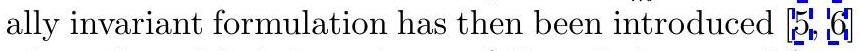 where the orbital dependence of $E_{H u b}$ is borrowed from atomic Hartree-Fock with renormalized slater integrals:

$$
J=\frac{1}{2 l(2 l+1)} \sum_{m \neq m^{\prime}, m^{\prime}}\left\langle m, m^{\prime}\right| V e e\left|m^{\prime}, m\right\rangle=\frac{F^{2}+F^{4}}{14}
$$

by assuming atomic values for $F^{4} / F^{2}$ and $F^{6} / F^{4}$ ratios.
To obtain $U$ and $J$, Anisimov and coworkers propose to perform LMTO calculations in supercells in which the occupation of the localized orbitals of one atom is constrained. The localized orbitals of all atoms in the supercell are decoupled from the remainder of the basis set. This makes the treatment of the local orbitals an atomic-like problem-making it easy to fix their occupation numbers - and allows to use Janak theorem to identify the shift in the corresponding eigenvalue with the second-order derivative of the LDA total energy with respect to orbital occupation. It has however the effect of leaving a rather artificial system to perform the screening, in particular when it is not completely intra-atomic. In elemental metallic Iron, for instance, Anisimov and Gunnarsson showed that only half of the screening charge is contained in the Wigner-Seitz cell. This fact, in addition to a sizable error due to the Atomic Sphere Approximation used , could be at the origin of the severe overestimation of the computed on-site coulomb interaction with respect to estimates based on comparison of spectroscopic data and model calculations $\left[{ }_{\mathbf{1}} \mathbf{1}_{\mathbf{2}}^{1} \mathbf{1}_{\mathbf{2}}^{1} \mathbf{1}_{\mathbf{1}}^{1}\right]$.

$$
\begin{aligned}
E_{H u b}\left[\left\{n_{m m^{\prime}}^{I}\right\}\right]= & \frac{1}{2} \sum_{\{m\}, \sigma, I}\left\{\left\langle m, m^{\prime \prime}\right| V_{e e}\left|m^{\prime}, m^{\prime \prime \prime}\right\rangle n_{m m^{\prime}}^{I \sigma} n_{m^{\prime \prime} m^{\prime \prime \prime}}^{I-\sigma}\right. \\
& +\left(\left\langle m, m^{\prime \prime}\right| V_{e e}\left|m^{\prime}, m^{\prime \prime \prime}\right\rangle\right. \\
& \left.\left.-\left\langle m, m^{\prime \prime}\right| V_{e e}\left|m^{\prime \prime \prime}, m^{\prime}\right\rangle\right) n_{m m^{\prime}}^{I \sigma} n_{m^{\prime \prime} m^{\prime \prime \prime}}^{I \sigma}\right\}
\end{aligned}
$$

## BASIS SET INDEPENDENT FORMULATION OF LDA+U METHOD

with

$$
\left\langle m, m^{\prime \prime}\right| V_{e e}\left|m^{\prime}, m^{\prime \prime \prime}\right\rangle=\sum_{k=0}^{2 l} a_{k}\left(m, m^{\prime}, m^{\prime \prime}, m^{\prime \prime \prime}\right) F^{k}
$$

where $l$ is the angular moment of the localized ( $d$ or $f$ ) electrons and
$a_{k}\left(m, m^{\prime}, m^{\prime \prime}, m^{\prime \prime \prime}\right)=\frac{4 \pi}{2 k+1} \sum_{q=-k}^{k}\langle l m| Y_{k q}\left|l m^{\prime}\right\rangle\left\langle l m^{\prime \prime}\right| Y_{k q}^{*}\left|l m^{\prime \prime \prime}\right\rangle$.
Some aspects of currently used LDA+U formulation, and in particular of the determination of the parameters entering the model, have been so far tied to the LMTO approach. This is not a very pleasant situation and some efforts have been done recently $\left[\overline{T_{1}}, \overline{1_{2}} \overline{2}_{n}^{1}\right]$ to reformulate the method for different basis sets. Here we want to elaborate further on these attempts and provide an internally consistent, basis-set independent, method for the calculation of the needed parameters.

The double-counting term $E_{d c}$ is given by:

$$
\begin{aligned}
E_{d c}\left[\left\{n^{I}\right\}\right] & =\sum_{I} \frac{U}{2} n^{I}\left(n^{I}-1\right) \\
& -\sum_{I} \frac{J}{2}\left[n^{I \uparrow}\left(n^{I \uparrow}-1\right)+n^{I \downarrow}\left(n^{I \downarrow}-1\right)\right] .
\end{aligned}
$$

The radial Slater integrals $F^{k}$ are the parameters of the model ( $F^{0}, F^{2}$ and $F^{4}$ for $d$ electrons, while also $F^{6}$ must be specified for $f$ states) and are usually re-expressed in terms of only two parameters, $U$ and $J$, describing screened on-site Coulomb and exchange interaction,
$U=\frac{1}{(2 l+1)^{2}} \sum_{m, m^{\prime}}\left\langle m, m^{\prime}\right| V e e\left|m, m^{\prime}\right\rangle=F^{0}$

## Localized orbital occupations

In order to fully define how the approach works the first thing to do is to select the degrees of freedom on which "Hubbard $U$ " will operate and define the corresponding occupation matrix, $n_{m m^{\prime}}^{I \sigma}$. Although it is usually straightforward to identify in a given system the atomic levels to be treated in a special way (the $d$ electrons in transition metals and the $f$ ones in the rare earths and actinides series) there is no unique or rigorous way to define occupation of localized atomic levels in a multi-atom system. Equally legitimate choices for $n_{m m^{\prime}}^{I \sigma}$ are $i$ ) projections on normalized atomic orbitals, or $i i)$ projections on Wannier functions whenever the relevant orbitals give raise to isolated band manifolds, or $i i i)$ Mulliken population or $i v)$
integrated values in (spherical) regions around the atoms of the angular-momentum-decomposed charge densities. Taking into account the arbitrariness in the definition of $n_{m m^{\prime}}^{I \sigma}$ no particular significance should be attached to any of them (or other that could be introduced) and the usefulness and reliability of an approximate DFT +U method $(\mathrm{aDFT}+\mathrm{U})$, and of its more recent and involved evolutions like the aDFT+DMFT method, should be judged from its ability to provide a correct physical picture of the systems under study irrespective of the details of the formulation, once all ingredients entering the calculation are determined consistently.

All above mentioned definitions for the occupation matrices can be put in the generic form

$$
n_{m m^{\prime}}^{I \sigma}=\sum_{\mathbf{k}, v} f_{\mathbf{k} v}^{\sigma}\left\langle\psi_{\mathbf{k} v}^{\sigma}\right| P_{m m^{\prime}}^{I}\left|\psi_{\mathbf{k} v}^{\sigma}\right\rangle
$$

where $\psi_{\mathbf{k} v}^{\sigma}$ is the valence electronic wavefunction corresponding to the state ( $\mathbf{k} v$ ) with spin $\sigma$ of the system and $f_{\mathbf{k} v}^{\sigma}$ is the corresponding occupation number. The $P_{m m^{\prime}}^{I}$ 's are generalized projection operators on the localizedelectron manifold that satisfy the following properties:

$$
\begin{gathered}
\sum_{m^{\prime}} P_{m m^{\prime}}^{I} P_{m^{\prime} m^{\prime \prime}}^{I}=P_{m m^{\prime \prime}}^{I} ; \quad P_{m m^{\prime}}^{I}=\left(P_{m^{\prime} m}^{I}\right)^{\dagger} ; \\
P_{m m^{\prime}}^{I} P_{m^{\prime \prime} m^{\prime \prime \prime}}^{I}=0 \quad \text { when } \quad m^{\prime} \neq m^{\prime \prime} .
\end{gathered}
$$

In particular $P^{I}=\sum_{m} P_{m m}^{I}$ is the projector on the complete manifold of localized states associated with atom at site $I$ and therefore

$$
n_{I}=\sum_{\sigma} \sum_{\mathbf{k}, v} f_{\mathbf{k} v}^{\sigma}\left\langle\psi_{\mathbf{k} v}^{\sigma}\right| P^{I}\left|\psi_{\mathbf{k} v}^{\sigma}\right\rangle=\sum_{\sigma, m} n_{m m}^{I \sigma}
$$

is the total localized-states occupation for site $I$. Orthogonality of projectors on different sites is not assumed.

In the applications discussed in this work we will define localized-level occupation matrices projecting on atomic pseudo-wavefunctions. The needed projector operators are therefore simply

$$
P_{m m^{\prime}}^{I}=\left|\varphi_{m}^{I}\right\rangle\left\langle\varphi_{m^{\prime}}^{I}\right|
$$

where $\left|\varphi_{m}^{I}\right\rangle$ is the valence atomic orbital with angular momentum component $|l m\rangle$ of the atom sitting at site $I$ (the same wavefunctions are used for both spins). Since we will be using ultrasoft pseudopotentials to describe valence-core interaction, all scalar products between crystal and atomic pseudo-wavefunctions are intended to include the usual S matrix describing orthogonality in presence of charge augmentation [13].

As already mentioned, other choices could be used as well and different definitions for the occupation matrices will require, in general, different values of the parameter entering the aDFT+U functional, as it has been pointed out recently also by Pickett et al. [7] where, for instance, the value of Hubbard $U$ in FeO shifts from 4.6 to 7.8 eV when atomic d-orbitals for $\mathrm{Fe}^{2+}$ ionic configuration are
used instead of those of the neutral atom. In an early study [19] the U parameter in $\mathrm{La}_{2} \mathrm{CuO}_{4}$ varies from 6.8 to 7.7 eV upon variation of the atomic sphere radius employed in the LMTO calculation. As pointed out in these works it is not fruitful to compare numerical values of U obtained by different methods but rather comparison should be made between results of complete calculations.

## A simplified rotationally invariant scheme and the meaning of U

In order to simplify our analysis and gaining a more transparent physical interpretation of the "+U" correction to standard aDFT functionals we concentrate on the main effect associated to on-site Coulomb repulsion. We thus neglect the important but somehow secondary effects associated to non sphericity of the electronic interaction and the proper treatment of magnetic interaction, that in the currently used rotational invariant method is dealt with assuming a screened Hartree-Fock form.

We are therefore going to assume in the following that parameter $J$ describing these effects can be set to zero, or alternatively that its effects can be mimicked redefining the U parameter as $U_{e f f}=U-J$, a practice that have been sometime used in the literature [14].

The Hubbard correction to the energy functional, Eqs. $\overline{2}$ and greatly simplifies and reads:

$$
\begin{aligned}
E_{U}\left[\left\{n_{m m^{\prime}}^{I \sigma}\right\}\right] & =E_{H u b}\left[\left\{n_{m m^{\prime}}^{I}\right\}\right]-E_{d c}\left[\left\{n^{I}\right\}\right] \\
& =\frac{U}{2} \sum_{I} \sum_{m, \sigma}\left\{n_{m m}^{I \sigma}-\sum_{m^{\prime}} n_{m m^{\prime}}^{I \sigma} n_{m^{\prime} m}^{I \sigma}\right\} \\
& =\frac{U}{2} \sum_{I, \sigma} \operatorname{Tr}\left[\mathbf{n}^{I \sigma}\left(1-\mathbf{n}^{I \sigma}\right)\right] .
\end{aligned}
$$

Choosing for the localized orbitals the representation that diagonalizes the occupation matrices

$$
\mathbf{n}^{I \sigma} \mathbf{v}_{i}^{I \sigma}=\lambda_{i}^{I \sigma} \mathbf{v}_{i}^{I \sigma}
$$

with $0 \leq \lambda_{i}^{I \sigma} \leq 1$, the energy correction becomes

$$
E_{U}\left[\left\{n_{m m^{\prime}}^{I \sigma}\right\}\right]=\frac{U}{2} \sum_{I, \sigma} \sum_{i} \lambda_{i}^{I \sigma}\left(1-\lambda_{i}^{I \sigma}\right) .
$$

from where it appears clearly that the energy correction introduces a penalty, tuned by the value of the U parameter, for partial occupation of the localized orbitals and thus favors disproportionation in fully occupied $(\lambda \approx 1)$ or completely empty ( $\lambda \approx 0$ ) orbitals. This is the basic physical effect built in the aDFT +U functional and its meaning can be traced back to known deficiencies of LDA or GGA for atomic systems.

An atom in contact with a reservoir of electrons can exchange integer numbers of particles with its environment. The intermediate situation with fractional number

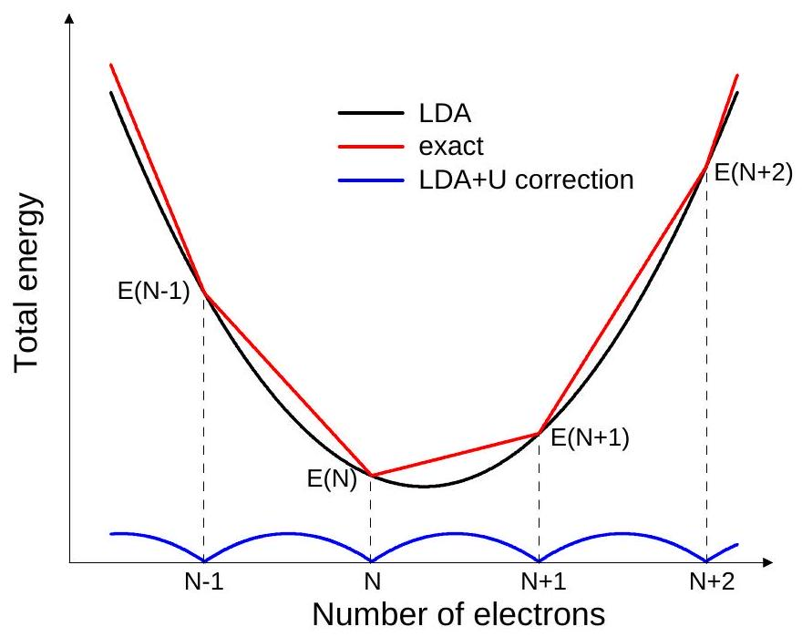
FIG. 1: Sketch of the total energy profile as a function of number of electrons in a generic atomic system in contact with a reservoir. The bottom curve is simply the difference between the other two (the LDA energy and the "exact" result for an open system).

of electrons in this open atomic system is described not by a pure state wave function, but rather by a statistical mixture so that, for instance, the total energy of a system with $N+\omega$ electrons (where N is an integer and $0 \leq \omega \leq 1$ ) is given by:

$$
E_{n}=(1-\omega) E_{N}+\omega E_{N+1}
$$
=
where $E_{N}$ and $E_{N+1}$ are the energies of the system corresponding to states with $N$ and $N+1$ particles respectively, while $\omega$ represents the statistical weight of the state with $N+1$ electrons. The total energy of this open atomic system is thus represented by a series of straightline segments joining states corresponding to integer occupations of the atomic orbitals as depicted in fig. ${ }_{1}^{1}$ - The slope of the energy vs electron-number curve is instead piece-wise constant, with discontinuity for integer number of electrons, and corresponds to the electron affinity (ionization potential) of the $\mathrm{N}(\mathrm{N}+1)$ electron system.

Exact DFT correctly reproduce this behavior [15, 16, which is instead not well described by the LDA or GGA approach, which produces total energy with unphysical curvatures for non integer occupation and spurious minima in correspondence of fractional occupation of the orbital of the atomic system. This leads to serious problems when one consider the dissociation limit of hetero-polar molecules or an open-shell atom in front of a metallic surface $\overline{1} \overline{1} \overline{1} \overline{6}]$, and is at the heart of the LDA/GGA failure in the description of strongly correlated systems . The unphysical curvature is associated basically to the incorrect treatment by LDA or GGA of the self-interaction of the partially occupied Kohn-Sham orbital that gives a
non-linear contribution to the total energy with respect to orbital occupation (with mainly a quadratic term coming from the Hartree energy not canceled properly in the exchange-correlation term).

Nevertheless, it is well known [1] that total energy differences between different states can be reproduced quite accurately by the LDA (or GGA) approach, if the occupation of the orbitals is constrained to assume integer values. As an alternative, we can recover the physical situation (an approximately piece-wise linear total energy curve) by adding a correction to the LDA total energy which vanishes for integer number of electrons and eliminates the curvature of the LDA energy profile in every interval with fractional occupation (bottom curve of fig. ${ }^{\overline{1} 1}{ }^{\overline{1}}$ ). But this is exactly the kind of correction that is provided by eq. $\overline{9}$, if the numerical value of the parameter $U$ is set equal to the curvature of the LDA (GGA) energy profile.

This clarifies the meaning of the interaction parameter $U$ as the (unphysical) curvature of the LDA energy as a function of $N$ which is associated with the spurious self-interaction of the fractional electron injected into the system. From this analysis it is clear that the numerical value of $U$ will depend in general not only, as noted in the preceding section, on the definition adopted for the occupation matrices but also on the particular approximate exchange-correlation functional to be corrected, and should vanish if the exact DFT functional were used.

The situation is of course more complicated in solids where fractional occupations of the atomic orbitals can occur due to hybridization of the localized atomic-like orbitals with the crystal environment and the unphysical part of the curvature has to be extracted from the total LDA/GGA energy, which contains also hybridization effects. In the next section this problem is discussed and a linear response approach to evaluate Hubbard $U$ is proposed.

## Internally consistent calculation of U

Following previous seminal works $\left[\bar{\beta}_{0}^{1}, \overline{1}_{0}^{1} \stackrel{1}{1} \stackrel{1}{1} \stackrel{1}{9}\right]$ we compute $U$ by means of constrained-density-functional calculations $\left[20_{1}\right]$. What we need is the total energy as a function of the localized-level occupations of the "Hubbard" sites:

$$
E\left[\left\{q_{I}\right\}\right]=\min _{n(\mathbf{r}), \alpha_{I}}\left\{E[n(\mathbf{r})]+\sum_{I} \alpha_{I}\left(n_{I}-q_{I}\right)\right\},
$$

where the constraints on the site occupations, $n_{I}$ 's from Eq. $\overline{7}$, are applied employing the Lagrange multipliers, $\alpha_{I}$ 's. From this dependence we can compute numerically the curvature of the total energy with respect to
the variation, around the unconstrained values $\left\{n_{I}^{(0)}\right\}$, of the occupation of one isolated site. A supercell approach is adopted in which occupation of one representative site in a sufficiently large supercell is changed leaving unchanged all other site occupations. This curvature contains the energy cost associated to the localization of an electron on the chosen site including all screening effects from the crystal environment, but it is not yet the Hubbard $U$ we want to compute. In fact, had we computed the same quantity from the total energy of the noninteracting Kohn-Sham problem associated to the same system,

$$
E^{K S}\left[\left\{q_{I}\right\}\right]=\min _{n(\mathbf{r}), \alpha_{I}}\left\{E^{K S}[n(\mathbf{r})]+\sum_{I} \alpha_{I}^{K S}\left(n_{I}-q_{I}\right)\right\},
$$

we would have obtained a non vanishing results as well because by varying the site occupation a rehybridization of the localized orbitals with the other degrees of freedom is induced that gives rise to a non-linear change in the energy of the system. This curvature coming from rehybridization, originating from the non-interacting band structure but present also in the interacting case, has clearly nothing to do with the Hubbard $U$ of the interacting system and should be subtracted from the total curvature:

$$
U=\frac{\partial^{2} E\left[\left\{q_{I}\right\}\right]}{\partial q_{I}^{2}}-\frac{\partial^{2} E^{K S}\left[\left\{q_{I}\right\}\right]}{\partial q_{I}^{2}}
$$

In Ref. $[\underline{\underline{8}}]$ Anisimov and Gunnarsson, in order to avoid dealing with the above mentioned non-interacting curvature, exploited the peculiarities of the LMTO method, used in their calculation, and decoupled the chosen localized orbitals from the remainder of the crystal by suppressing in the LMTO hamiltonian the corresponding hopping terms. This reduced the problem to the one of an isolated atom embedded in an artificially disconnected charge background. Thanks to Janak theorem the second order derivative of the total energy in Eq. $131^{1}$ can then be recast as a first order derivative of the localizedlevel eigenvalue. In our approach the role played in Refs. [3], by by the eigenvalue of the artificially isolated atom is taken by the Lagrange multiplier, used to enforce level occupation [20]]:

$$
\begin{aligned}
& \frac{\partial E\left[\left\{q_{J}\right\}\right]}{\partial q_{I}}=-\alpha_{I}, \quad \frac{\partial^{2} E\left[\left\{q_{J}\right\}\right]}{\partial q_{I}^{2}}=-\frac{\partial \alpha_{I}}{\partial q_{I}} \\
& \frac{\partial E^{K S}\left[\left\{q_{J}\right\}\right]}{\partial q_{I}}=-\alpha_{I}^{K S}, \quad \frac{\partial^{2} E^{K S}\left[\left\{q_{J}\right\}\right]}{\partial q_{I}^{2}}=-\frac{\partial \alpha_{I}^{K S}}{\partial q_{I}} .
\end{aligned}
$$

At variance with the original method of Refs. [3], in our approach we need to compute and subtract the bandstructure contribution, $-\partial \alpha_{I}^{K S} / \partial q_{I}$, from the total curvature, but, in return, Hubbard $U$ is computed in exactly the same system to which it is going to be applied and
the screening from the environment is more realistically included. The present method was inspired by the linear response scheme proposed by Pickett and coworkers [7] where however the role of the non-interacting curvature was not appreciated.

In actual calculations constraining the localized orbital occupations is not very practical and it is easier to pass, via a Legendre transform, to a representation where the independent variables are the $\alpha_{I}$ 's

$$
\begin{aligned}
E\left[\left\{\alpha_{I}\right\}\right] & =\min _{n(\mathbf{r})}\left\{E[n(\mathbf{r})]+\sum_{I} \alpha_{I} n_{I}\right\} \\
E^{K S}\left[\left\{\alpha_{I}^{K S}\right\}\right] & =\min _{n(\mathbf{r})}\left\{E^{K S}[n(\mathbf{r})]+\sum_{I} \alpha_{I}^{K S} n_{I}\right\} .
\end{aligned}
$$

Variation of these functionals with respect to wavefunctions shows that the effect of the $\alpha_{I}$ 's is to add to the single particle potential a term, $\Delta V=\sum_{I} \alpha_{I} P^{I}$ (or $\Delta V=\sum_{I} \alpha_{I}^{K S} P^{I}$ for the non-interacting case), where localized potential shifts of strength $\alpha_{I}\left(\alpha_{I}^{K S}\right)$ are applied to the localized levels associated to site $I$.

It is useful to introduce the (interacting and noninteracting) density response functions of the system with respect to these localized perturbations:

$$
\begin{aligned}
\chi_{I J} & =\frac{\partial^{2} E}{\partial \alpha_{I} \partial \alpha_{J}}=\frac{\partial n_{I}}{\partial \alpha_{J}} \\
\chi_{I J}^{0} & =\frac{\partial^{2} E^{K S}}{\partial \alpha_{I}^{K S} \partial \alpha_{J}^{K S}}=\frac{\partial n_{I}}{\partial \alpha_{J}^{K S}}
\end{aligned}
$$

Using this response-function language, the effective interaction parameter $U$ associated to site $I$ can be recast as:

$$
U=+\frac{\partial \alpha_{I}^{K S}}{\partial q_{I}}-\frac{\partial \alpha^{I}}{\partial q_{I}}=\left(\chi_{0}^{-1}-\chi^{-1}\right)_{I I}
$$

that is reminiscent of the well known random-phase approximation [21] in linear response theory giving the interacting density response in terms of the non-interacting one and the Coulomb kernel. A similar result is obtained within DFT linear response [22] where the interaction kernel also contains an exchange-correlation part.

The response functions, Eq. 18 , needed in Eq. 191 are computed taking numerical derivatives. We perform a well converged LDA calculation for the unconstrained system ( $\alpha_{I}=0$ for all sites in the supercell) and-starting from its self-consistent potential-we add small (positive and negative) potential shifts on each non equivalent "Hubbard" site $J$ and compute the variation of the occupations, $n_{I}$ 's, for all sites in the supercell in two ways: $i)$ letting the Kohn-Sham potential of the system readjust self-consistently to optimally screen the localized perturbation, $\Delta V=\alpha_{J} P_{J}$, and $\left.i i\right)$ without allowing this screening. This latter result is nothing but the variation computed from the first iteration in
the self-consistent cycle leading eventually to the former (screened) results. The site-occupation derivatives calculated according to $i)$ and $i i)$ give the matrices $\chi_{I J}$ and $\chi_{I J}^{0}$ respectively.

## Further considerations

Before moving to examine some specific examples in the next section, let's end the present one discussing a few additional technical points.

As mentioned earlier, Hubbard $U$ is computed, ideally, from variation of the site occupation of a single site in an infinite crystal and in practice adopting a supercell approach where periodically repeated sites are perturbed coherently. In order to speed up the convergence of the computed $U$ with supercell size it may result useful to enforce explicitly charge neutrality for the perturbation, that is to be introduced in the response functions, thus enhancing its local character and reduce the interaction with its periodic images. In this procedure we introduce in the response functions, $\chi$ and $\chi^{0}$, -in addition to the degrees of freedom associated to the localized sitesalso a "delocalized background" representing all other degrees of freedom in the system. This translates in one more column and row in the response matrices, whose elements are determined imposing overall charge neutrality of the perturbed system for all localized perturbations, $\left(\sum_{I} \chi_{I J}=0, \quad \sum_{I} \chi_{I J}^{0}=0, \quad \forall J\right)$ and absence of any charge density variation upon perturbing the system with a constant potential ( $\sum_{J} \chi_{I J}=0, \quad \sum_{J} \chi_{I J}^{0}=0, \quad \forall I$ ). From a mathematical point of view both $\chi$ and $\chi_{0}$ acquire a null eigenvalue, corresponding to a constant potential shift, and the needed inversions in Eq. 191 must be taken with care. It can be shown that their singularities cancel out when computing the difference $\chi_{0}^{-1}-\chi^{-1}$ and the final result is well defined. We stress that in the limit of infinitely large supercell the coupling with the background gives no contribution to the computed $U$, but we found that this limit is approached more rapidly when this additional degrees of freedom is included.

In the same spirit we found that the spatial locality of the response matrices can be rather different from the one of their inverse and a supercell sufficient to decouple the periodically repeated response may be too small to describe correctly the inverse in eq. $19 \mathbf{1}_{\mathbf{r}}^{\prime}$ As a practical procedure, therefore, after evaluating the response function matrices in a given supercell, we extrapolate the result to much larger supercells assuming that the most important matrix elements in $\chi_{0}$ and $\chi$ involve the atoms in the few nearest coordination-shells accessible in the original supercell. The corresponding matrix elements of the larger supercell are filled with the values extracted from the smaller one while all other, more distant, interactions are neglected. Again, when a sufficiently large supercell to extract the matrix elements of the response
functions is considered, the effect of this extrapolation vanishes, but, as we will see in the following, this scheme capture a large fraction of the system-size dependence of the calculated $U$ and it may allow to reach more rapidly the converged result.

As a final remark we notice that the electronic structure of a system described within the LDA+U approach may largely differ from the one obtained within the LDA used to compute $U$. In a more refined approach one might seek internal consistency between the band structure used in the calculation of $U$ and the one obtained using it. We have not addressed this issue here, but one can imagine performing the same type of analysis leading to the $U$ determination for a functional already containing an LDA +U correction. The computed $U$ would in that case be a correction to be added to the original $U$ and internal consistency would be reached when the correction vanishes.

## EXAMPLES

## Metals: Iron and Cerium

In their seminal paper Anisimov and Gunnarsson computed the effective on site Coulomb interaction between the localized electrons in metallic Fe and Ce . For Ce the calculated Coulomb interaction was about 6 eV in good agreement with empirical and experimental estimates ranging from 5 to $7 \mathrm{eV}[20,232,24]$, while the result for Fe (also about 6 eV ) was surprisingly high since $U$ was expected to be in the range of $1-2 \mathrm{eV}$ for elemental transition metals, with the exception of $\mathrm{Ni}[10,111]$. Let us apply the present approach to these two system, starting with Iron.

In its ground state elemental Iron has a ferromagnetic (FM) spin arrangement and a body-centered cubic (BCC) structure. Gradient corrected exchangecorrelation functional are needed in order to stabilize the experimental structure as compared with non-magnetic face-centered cubic (FCC) structure preferred by LDA. The Perdew-Burke-Ernzherof (PBE) [25] GGA functional was employed here. Iron ions were represented by ultrasoft pseudopotential and kinetic energy cutoffs of 35 Ry and 420 Ry were adopted for wavefunction and charge density Fourier expansion. Brillouin Zone integrations where performed using $8 \times 8 \times 8$ Monkhorst and Pack special point grids $\left[26_{1}^{3}\right]$ using Methfessel and Paxton smearing technique [27]] with a smearing width of 0.005 Ry in order to smooth the Fermi distribution.

The calculation of the effective Hubbard $U$ followed the procedure outlined in preceding section: a supercell was selected containing a number of inequivalent Iron atoms; then, after a well converged self-consistent calculation, we applied to one of these atoms small, positive and negative, potential shifts, $\Delta V=\alpha P_{d}$ (with $\alpha= \pm 0.2-0.5$

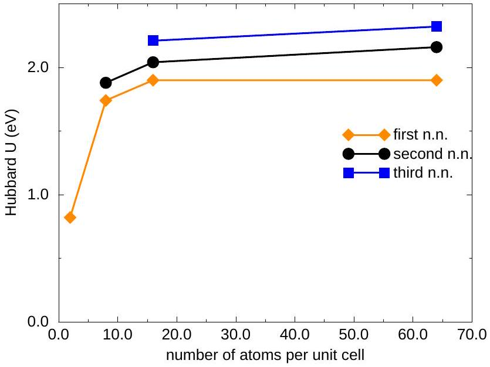
FIG. 2: Calculated Hubbard $U$ in metallic Iron for different supercells. Lines connect results from the cell-extrapolation procedure described in the text and different symbols correspond to inclusion of screening contributions up to the indicated shell of neighbors of the perturbed atom.

eV ), where $P_{d}$ is the projector on the localized $d$ electron of the selected atom. From the variation of the $d$-level occupations of all Iron atoms in the cell one column of $\chi$ and $\chi^{0}$ response functions was extracted and all other matrix elements were reconstructed by symmetry, including the background as explained previously. Hubbard $U$ was then calculated from Eq. ${ }_{1}^{1} \underline{9}_{1}^{1}$

In order to describe response for an isolated perturbation four supercells were considered: i) a simple cubic (SC) cell containing two inequivalent iron atoms, the perturbed atom and one of its nearest neighbors; ii) a $2 \times 2 \times 2$ BCC supercell containing 8 inequivalent Iron atoms, 4 in the nearest-neighbor shell of the perturbed atom and 3 belonging to the second shell of neighbors; iii) a $2 \times 2 \times 2$ SC cell containing 16 atoms, including also some third nearest-neighbor atom and iv) a $4 \times 4 \times 4 \mathrm{BBC}$ supercell containing 64 inequivalent Iron atoms; we used this largest cell just to extrapolate the results from the smaller ones.

The convergence properties of the effective $U$ of bulk iron with the size of the used supercell are shown in fig.

The Hubbard $U$ obtained from the SC 2 -atom cell, once inserted in the 64 -atom supercell, captures most of the effective interaction; second nearest neighbors shell brings some significant corrections to the final extrapolated result, while third nearest neighbor shell has a smaller effect. We believe that contributions from further neighbor rapidly vanish and that an accurate value of $U$ can be extracted from the SC supercell containing 16 atoms. The extrapolation from this cell to larger cells

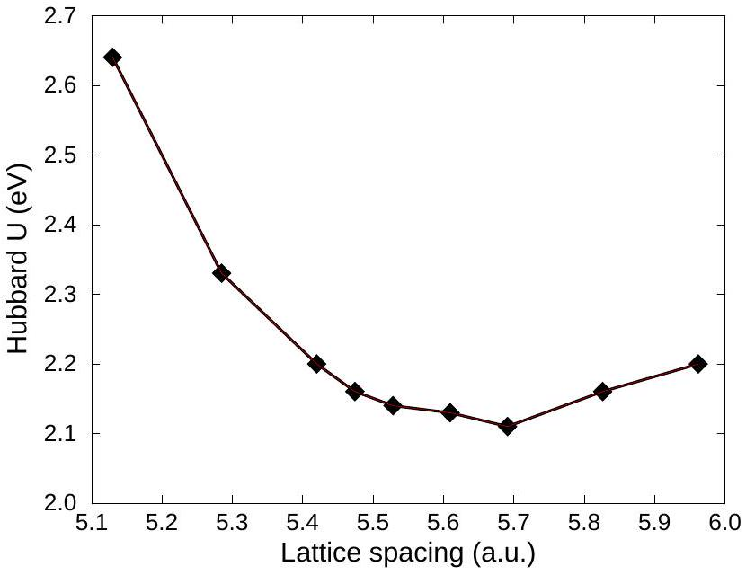
FIG. 3: Lattice spacing dependence of the calculated Hubbard $U$ parameter for Iron.

brings only minor variations which are within the finite numerical accuracy that we estimate within a fraction of an eV . From this analysis our estimate for the Hubbard $U$ in elemental Iron at the experimental lattice parameter is therefore $2.2 \pm 0.2 \mathrm{eV}$.

This results is in very good agreement with the experimental estimates [10, 11], but disagrees with Anisimov and Gunnarsson result [4]. We can only recall here that many technical details differ in the two approaches. In particular $i$ ) in the original approach the perturbed atom is disconnected from the rest of the crystal by removing all hopping terms, thus leaving a rather unphysical environment to perform the screening, while in our approach the actual system is allowed to screen the perturbation, ii) the Atomic Sphere Approximation (ASA) was employed in the original LMTO calculation while no shape approximation is made in our case.

In order to further test our approach on this element we investigate the dependence of the Hubbard parameter on crystal structure. The dependence of the calculated interaction parameter on the lattice spacing of the unit cell is shown in fig. ${ }_{11}^{\overline{3} 1}$ where a marked increase of the Hubbard $U$ can be observed when the lattice parameter is squeezed below its experimental value. Despite this may appear counterintuitive, as correlation effects are expected to become less important when atoms gets closer, one should actually compare the increasing value of $U$ with the much steeper increase of bandwidth when reducing the interatomic distance. Upon increase of the lattice parameter the Hubbard parameter should approach the atomic limit that can be estimated from all-electron atomic calculations where the local neutrality of the metallic system is maintained: $U=E\left(d^{8} s^{0}\right)+E\left(d^{6} s^{2}\right)-2 \times E\left(d^{7} s^{1}\right)=2.1$ eV , in reasonable agreement with the results of fig. $\bar{\beta}_{\mathbf{r}}$

TABLE I: Comparison between the calculated lattice constant ( $a_{0}$ ), bulk modulus ( $B_{0}$ ) and magnetic moment ( $\mu_{0}$ ) within several approximate DFT schemes and experimental results quoted from [28].
|  | $a_{0}($ a.u. $)$ | $B_{0}($ Mbar $)$ | $\mu_{0}\left(\mu_{B}\right)$ |
| :--- | :---: | :---: | :---: |
| Expt. | 5.42 | 1.68 | 2.22 |
|  |  |  |  |
| LSDA | 5.22 | 2.33 | 2.10 |
| $\sigma$-GGA | 5.42 | 1.45 | 2.46 |
| LDA+U | 5.53 | 2.12 | 2.60 |
| LDA+U (AMF) | 5.34 | 1.53 | 2.00 |

Using the calculated volume dependent Hubbard $U$ parameter we have studied the effect of the $\mathrm{LDA}+\mathrm{U}$ approximation on the structural properties of Iron. Results are reported in table where they are compared with results obtained within LSDA and $\sigma$-GGA(PBE) approximation and with experimental data. From these data it appears that, although simple $\sigma$-GGA(PBE) approximation appears to be superior in this case, LDA+U provides a reasonable description of the data, of the same quality as LSDA. In weakly correlated metals it has been suggested [29] that a formulation of LDA +U in terms of occupancy fluctuations around the uniform occupancy of the localized level could be more appropriate than the standard one. This "around mean field" (AMF) LDA+U approach has been revisited recently $\left[30_{n}^{1} 31_{n}^{1}\right]$ and an "optimally mixed" scheme has also been proposed [31]. We don't want to enter in this discussion here, but we mention that by following the AMF recipe the description of structural and magnetic properties of metallic Iron improves as it is evident from table I’1.

Using the calculated value of $U$ we have obtained the electronic structure of Iron at the experimental lattice spacing. The theoretical band structure obtained using the AMF version of LDA+U is reported in fig. ${ }^{7} 4^{1}$ together with some experimental results [32]. The overall agreement is rather good for this scheme. However, when using the standard LDA +U scheme a somehow worse agreement with experimental data was obtained, mainly due to a rigid downward shift of the majority spin bands of about 1 eV . This is an indication that LDA+U approximation may still require some fine tuning in order to describe accurately both strongly and weakly correlated systems [ 31 ].

Let us proceed to examine the Cerium case. Elemental cerium presents a very interesting phase diagram with a peculiar isostructural $\alpha-\gamma$ phase transition between a low volume ( $\alpha$ ) and a high volume ( $\gamma$ ) phase, both FCC. This phase transition has attracted much experimental and theoretical interest and in the last 20 years 33 ], many interpretations have been put forward to explain its occurrence. It is clear now that standard LDA

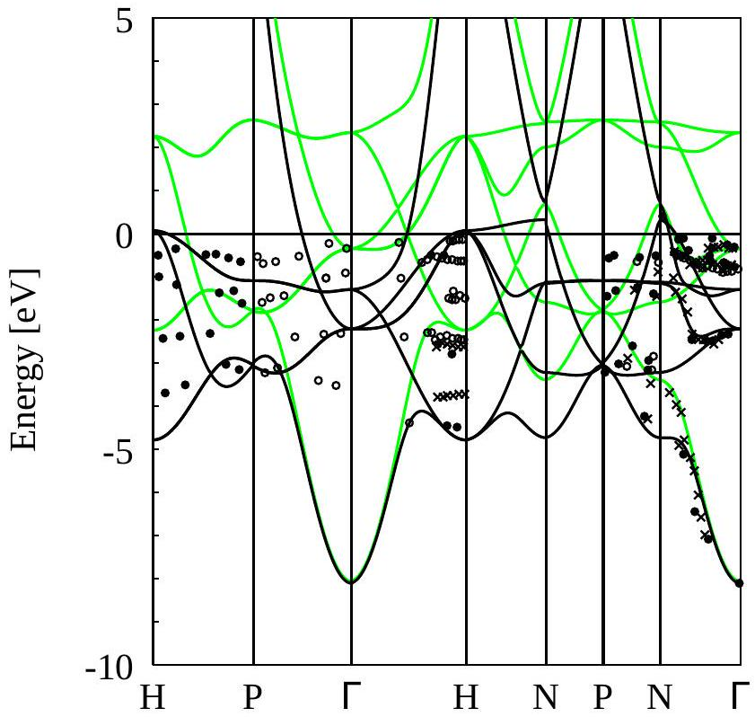
FIG. 4: Band structure of bulk iron obtained within the AMF $\mathrm{LDA}+\mathrm{U}$ approach. Green lines are for minority spin states, black ones for majority spin levels. Photoemission results from 32] are also reported for comparison.

or GGA approximations do not describe the transition and it appears that a treatment of the correlation at the DMFT level might be required [34], however a full understanding of the nature of the transition is still under debate 35. Here, we do not want to address this delicate topics but we simply want to follow Anisimov and Gunnarsson by computing the Hubbard $U$ parameter for elemental cerium in the high volume $\gamma$ phase.

The interaction of valence-electrons with Ce nuclei and its core electrons was described by a non-local ultrasoft pseudopotential [13] generated in the $5 s^{2} 5 p^{6} 5 d^{1} 4 f^{1}$ electronic configuration. Kinetic cutoffs of 30 Ry and 240 Ry were adopted for wavefunction and charge density Fourier expansion. The LSDA approximation was adopted for the exchange and correlation functional. Brillouin Zone integrations where performed using $8 \times 8 \times 8$ Monkhorst and Pack special point grids [26] using Methfessel and Paxton smearing technique $\left[27_{1}^{1}\right]$ with a smearing width of 0.05 Ry .

To obtain the response to an isolated perturbation we have perturbed a Cerium atom in three different cells: i) the fundamental face-centered cubic (FCC) cell containing just one inequivalent atom, ii) a simple-cubic (SC) cell containing 4 atoms (giving access to the first nearestneighbor response) and iii) a $2 \times 2 \times 2$ FCC cell ( 8 inequivalent atoms) including also the response of secondnearest neighbor atoms. The result of these calculations and their extrapolation to very large SC cells is reported in Fig. ${ }_{1}^{\overline{5}}$ where it can be seen that the converged value

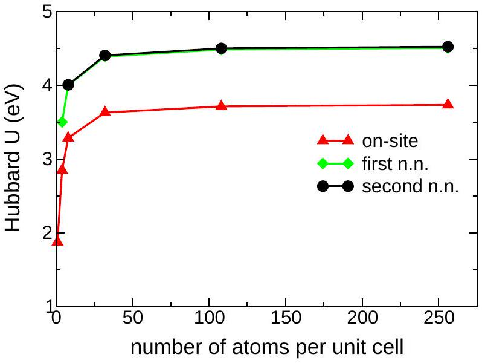
FIG. 5: Calculated Hubbard $U$ in metallic Cerium for different supercells. Lines connect results from the cellextrapolation procedure and different symbols correspond to inclusion of screening contributions up to the indicated shell of neighbors of the perturbed atom.

for $U$ approaches 4.5 eV .
The screening in metallic cerium is extremely localized, as can be seen from the fact that inclusion of the firstnearest neighbor response is all is needed to reach converged results. This is at variance with what we found in metallic Iron where third nearest-neighbor response was still significant (see Fig. ${ }_{21}$ ). The calculated value is not far from the value ( $5-7 \mathrm{eV}$ ) expected from empirical and experimental estimates $\left[20,2 \overline{3}_{1}^{1}, 24\right]$, especially if we consider that the parameter $U$ we compute plays the role of $U-J$ in the simplified rotational invariant LDA+U scheme adopted [1]4].

As a check, we performed all-electron atomic calculations for $\mathrm{Ce}^{+}$ions where localized $4 f$ electrons were promoted to more delocalized $6 s$ or $5 d$ states and obtained $U=E\left(f^{3} s^{0}\right)+E\left(f^{1} s^{2}\right)-2 \times E\left(f^{2} s^{1}\right)=4.4 \mathrm{eV}$, or $U=E\left(f^{2} s^{0} d^{1}\right)+E\left(f^{0} s^{2} d^{1}\right)-2 \times E\left(f^{1} s^{1} d^{1}\right)=6.4 \mathrm{eV}$, depending on the selected atomic configurations. This confirms the correct order of magnitude of our calculated value in the metal.

The present formulation is therefore able to provide reasonable values for the on-site Coulomb parameter both in Iron and Cerium, at variance with the original scheme of ref. where only the latter was satisfactorily described. We believe that a proper description of the interatomic screening, rather unphysical in the original scheme where atoms were artificially disconnected from the environment, is important to obtain a correct value for Hubbard $U$ parameter, especially in Iron where this response is more long-ranged.

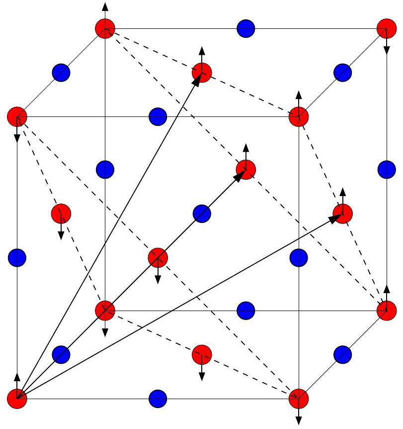
FIG. 6: The unit cell of FeO: blue spheres represent Oxygen ions, red ones are Fe ions, with arrows showing the orientation of their magnetic moments. Ferromagnetic (111) planes of iron ions alternate with opposite spins producing type II antiferromagnetic order and rhombohedral symmetry.

## Transition metal monoxides: FeO and NiO

The use of the LDA+U method for studying FeO is mainly motivated by the attempt to reproduce the observed insulating behavior. In fact, as for other transition metal oxides (TMO), standard DFT methods, as LDA or GGA, produce an unphysical metallic character due to the fact that crystal field and electronic structure effects are not sufficient in this case to open a gap in the three-fold minority-spin $t_{2 g}$ levels that host one electron per $\mathrm{Fe}^{2+}$ atom. As already addressed in quite abundant literature on TMO (and FeO in particular), a better description of the electronic correlations is necessary to obtain the observed insulating behavior and the structural properties of this compound at low pressure [36, 37, 38, 394. The application of our approach to this material will thus allow us to check its validity by comparison of our results with the ones from experiments and other theoretical works.

The unit cell of this compound is of rock-salt type, with a rhombohedral symmetry introduced by a type II antiferromagnetic (AF) order (see fig. ${ }_{1}^{\mathbf{6} \boldsymbol{1}}$ ) which sets in along the [111] direction below a Neél temperature of 198 K, at ambient pressure.

The calculations on this materials were all performed in the antiferromagnetic phase starting from the cubic (undistorted) unit cell of fig. lattice spacing. We used a 40 Ry energy cut off for the

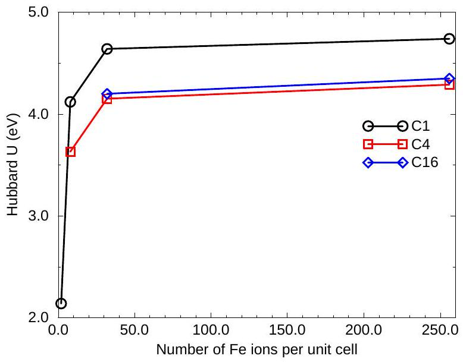
FIG. 7: Convergence of Hubbard $U$ parameter of FeO with the number of iron included in the supercell used in the extrapolation. Lines connect results including the screening contributions extracted from the indicated cell.

electronic wavefunctions ( 400 Ry for the charge density due to the use of ultrasoft pseudopotentials [1] both for Fe and O) and a small smearing width of 0.005 Ry which required a $4 \times 4 \times 4 \mathrm{k}$-points mesh.

To compute the Hubbard effective interactions, we performed GGA calculations with potential shifts on one Hubbard site in larger and larger unit cells, that we named C1, C4, and C16, containing 2, 8, and 32 iron ions respectively, and extrapolated their results up to a supercell containing 256 magnetic ions (called C128). The result for the undistorted cubic cell at the experimental lattice spacing is reported in fig. $\overline{\mathbf{T r}_{\mathbf{r}}}$ We can observe that the effective interaction obtained from C4 is already very well converged, when extrapolated to the largest cell, with respect to inclusion of screening from additional shells of neighborers,

The final result for the Hubbard $U$ is 4.3 eV which is smaller than most of the values obtained (or simply assumed) in other works $37,38,39$. If we use this value in a LDA+U calculation we can obtain the observed insulating behavior as shown in the band structure plot of fig. ${ }_{11}^{\overline{8} 1}$ where a comparison is made with GGA (metallic) results.

A gap opens around the Fermi level whose minimal width is about 2 eV . The band gap is direct and located at the $\Gamma$ point. The corresponding transition, of $3 d(\mathrm{Fe})$ $2 p(\mathrm{O}) \rightarrow 4 s(\mathrm{Fe})$ character, should be quite weak due to the vanishing weight of Iron $s$ states at the bottom of the valence band (fig., bottom picture). We can expect that a stronger absorption line will appear instead around 2.6 eV due to the transition, of $3 d(\mathrm{Fe})-2 p(\mathrm{O}) \rightarrow 3 d(\mathrm{Fe})$ character, among two pronounced peaks of the density of states around the Fermi level. This picture

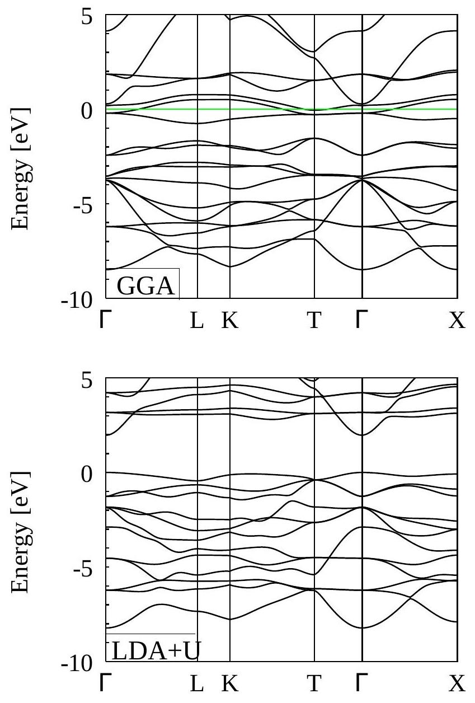
FIG. 8: The band structure of FeO in the undistorted (cubic) AF configuration at the experimental lattice spacing obtained within GGA (top panel) and LDA+U using the computed Hubbard $U$ of 4.3 eV (bottom panel). The zero of the energy is set at the top of the valence band.

is in very good agreement with experiments (and other theoretical results $\left[3 \bar{q}_{1}^{1}, \overline{4} \overline{0}_{1}^{0}\right]$ ) where a first weak absorption is reported between 0.5 and 2 eV and a stronger line appears around 2.4 eV [41]. The large mixing between majority-spin Iron $3 d$ states and the Oxygen $2 p$ manifold over a wide region of energy and the finite contribution of the Oxygen states at the top of the valence band-a feature not present within $\sigma$-GGA (see top panel in fig. $\underline{9}_{1}^{\prime}$ )- are also in good agreement with experiments, which indicate for FeO a moderate charge transfer character of the insulating state.

Despite our $U$ is smaller than the ones used in literature, we find a good agreement of our results about the electronic structure of the system with experiments and other theoretical works. These findings confirm the validity of our internally consistent method to compute $U$. We now want to extend its application to the study of

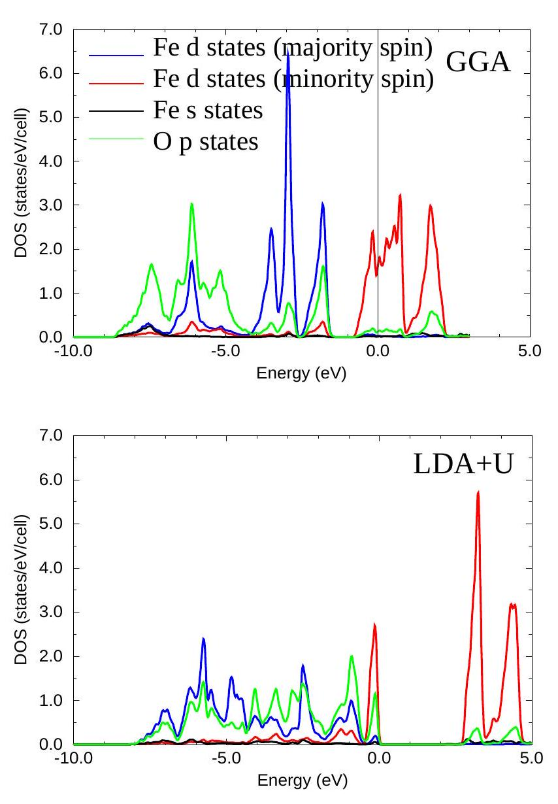
FIG. 9: Projected density of states of FeO in the undistorted (cubic) AF configuration at the experimental lattice spacing obtained within GGA (top panel) and LDA+U using the computed Hubbard $U$ of 4.3 eV (bottom panel).

structural properties. This is indeed a very important test because a good ab-initio method should be able to describe the true ground state of a system and provide a complete description of both electronic and structural properties. Furthermore the plane-wave implementation we use allows a straightforward calculation of HellmannFeynman forces and stresses, thus giving easily access to equilibrium crystal structure.

As observed in experiments [42], the cubic rock salt structure of FeO shown in fig. $\underline{6}_{1}^{1}$ becomes unstable under a pressure of 16 GPa (at room temperature) toward a rhombohedral distortion. In the distorted phase the unit cell is elongated along the [111] direction with a consequent shrinking of the interionic distances on the (111) planes. This transition is driven by the onset of the AFII magnetic order [42-1] (the Neél temperature reaches room value at about 16 GPa ) which imposes a rhombohedral symmetry even in the cubic phase. Upon increasing pressure above the threshold value the distortion of the unit cell is observed to increase producing more elongated

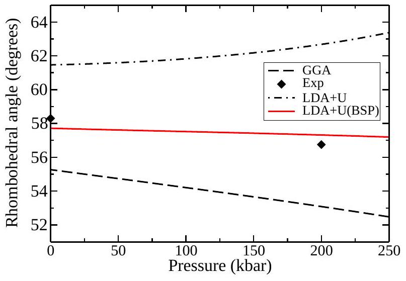
FIG. 10: The pressure dependence of the rhombohedral angle in FeO for the various approximations described in the text is compared with experimental results. These latter results were extracted extrapolating the data for the non stoichiometric compound $\mathrm{Fe}_{1-x} \mathrm{O}$ up to the stoichiometric composition 12 , 43].

structures $[\overline{4} \overline{2}]$.
We have computed the Hubbard $U$ on a grid of possible values for the rhombohedral distortion and cell parameter and then from the corresponding total energy calculations we determined the rhombohedral distortion and the enthalpy of the system as a function of the pressure up to 250 Kbar.

As evident from fig. 10 , while GGA overestimates the rhombohedral distortion and his pressure dependence, $\mathrm{LDA}+\mathrm{U}$ method-in the standard electronic configuration examined so far-overcorrects the GGA results and introduces even larger errors with respect to experimental results. In fact not only we obtain a distortion with the wrong sign (of compressive character along the [111] direction), but also the wrong pressure dependence. The reason for this failure can be traced back to the different occupation of the orbitals around the gap/Fermi level in the two cases. Even in the undistorted cell, the rhombohedral symmetry, induced by the antiferromagnetic order, lifts the degeneracy of the minority spin $t_{2 g}$ states of iron and split them in one state of $A_{1 g}$ characterwhich is essentially the $\mathrm{m}=0\left(z^{2}\right)$ state along the [111] quantization axis-and two states of $e_{g}$ symmetry localized on the iron (111) planes. Within GGA, the Iron minority-spin $3 d$ electrons partially occupy the two equivalent $e_{g}$ orbitals giving rise to two half filled bands and a (wrong) metallic state which is delocalized on the (111) plane. The system gains energy by filling the lowest half of the $e_{g}$ states and tends to elongate in the [111] direction, shrinking in the plane, because this increases the overlap of the $e_{g}$ states and their bandwidth. Within LDA+U, fractional occupation of orbitals is energetically disfavored and the system would like to have completely filled or empty $3 d$ states. In the standard unit-cell considered so far in the literature - and used by us in the
iron [111] plane

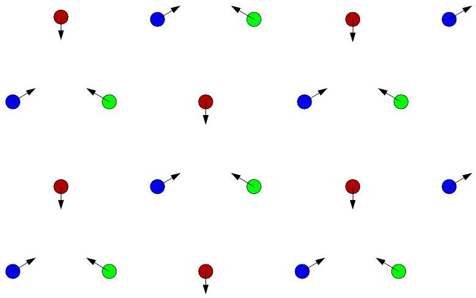
FIG. 11: Lattice distortion in the (111) iron planes used to induce symmetry breaking in the electronic configuration of FeO .

calculation above-this can be accomplished only by filling the non-degenerate $A_{1 g}$ level, corresponding to wavefunctions elongated along [111], and pushing upward in energy the in-plane $e_{g}$ states, leaving them empty. As a consequence, the system tends to pull apart the ions on the same (111) plane, so that the bandwidth of the state in the plane is reduced, and increases instead the inter-plane overlap of the $A_{1 g}$ states. This simple picture gives an explanation of the fact that GGA overestimates the elongation of the unit cell in the [111] direction, as well as the (wrong) compressive behavior of the standard $\mathrm{LDA}+\mathrm{U}$ solution. We are thus left with the paradoxical situation that a correct pressure dependence of the structural properties can be obtained from the wrong band structure and viceversa.

We have found that it is possible to solve this paradox by allowing the possibility that the system partially occupies, as within GGA, the $e_{g}$ levels, thus maintaining the driving force for the right rhombohedral deformation, and still opens a gap, as in standard LDA+U, by some orbital ordering that breaks the equivalence of the iron ions in the (111) plane. This possibility has been sometimes proposed in literature [ $39^{1}, 44^{1}$ ] but has never been clearly addressed.

From a simple tight-binding picture one finds that the optimal broken symmetry phase would be the one where occupied $e_{g}$ orbitals have the highest possible hopping term with unoccupied $e_{g}$ orbitals in nearest-neighbor atoms in the plane, in order to maximize the kinetic energy gain coming from delocalization, and the lowest possible hopping term with neighboring occupied $e_{g}$ orbitals, in order to minimize bandwidth that tends to destroy the insulating state. In bipartite lattice this is simply achieved by making occupied orbitals in nearestneighbor sites orthogonal but, in the triangular lattice, formed by iron atoms in (111) planes, this is not exactly

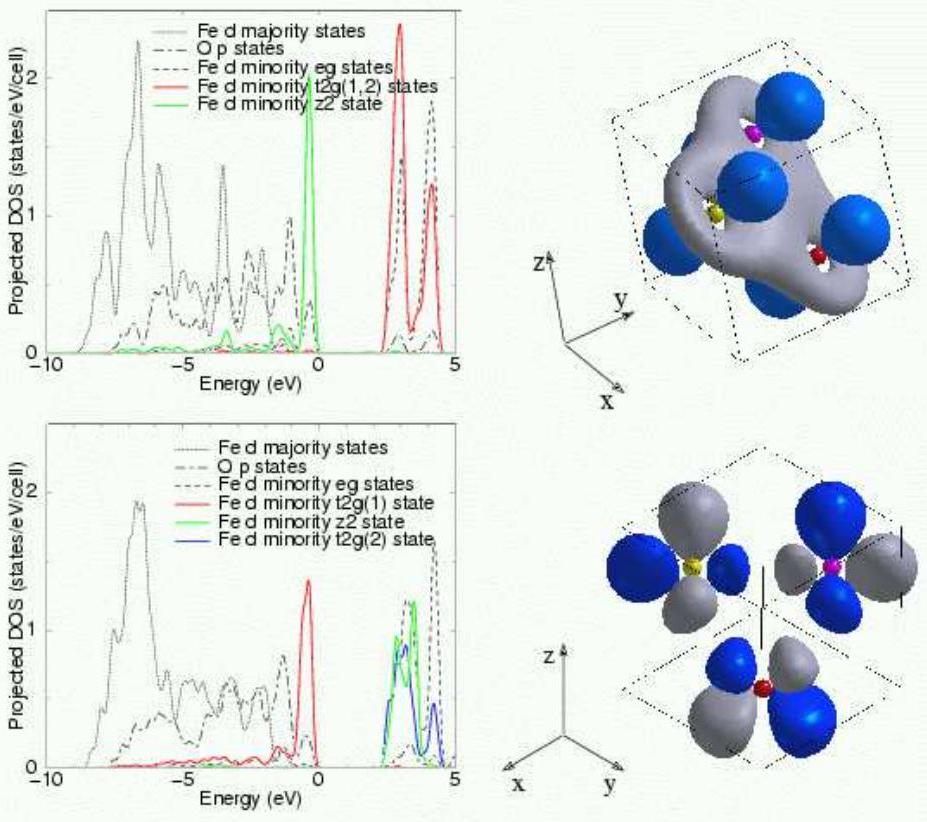
FIG. 12: The projected density of states of FeO as obtained in the "standard" LDA + U ground state (top panel) and in the proposed broken symmetry phase (bottom panel). On the right of each DOS is a picture of the corresponding occupied Fe-3d minority states.

possible, the system is topologically frustrated and some compromise is necessary.

It is generally believed [455] that Heisenberg model in the triangular lattice, to which our system resemble in some sense, displays a three-sublattice $120^{\circ}$ Néel longrange order. We thus imposed a symmetry breaking to the system where three nearest-neighbor atoms in the (111) plane were made inequivalent by slightly displacing them from the ideal positions in the way shown in fig. $111_{1}^{\prime}$. This induced the desired symmetry breaking of the electronic structure and opened a gap that was robust and persisted when the atoms were brought back into the ideal positions. We found, quite satisfactorily, that the new broken symmetry phase (BSP) corresponds to a lower energy minimum than the "standard" LDA +U solution and that therefore it is, to say the least, a more consistent description of the ground state of FeO . The one depicted in fig. ILi Is, of course, only one of three equivalent distortions we could have imposed to the electronic structure of the system and three symmetry related BSPs could be defined. In the actual system an effective equivalence of the ions in the (111) planes is probably restored by a (dynamical) switching among equivalent states but considering the atoms as strictly equivalent, as in the standard solution, leads to incorrect results.

The comparison of the projected density of state in the
＂standard＂LDA + U solution and in the novel BSP phase is shown in fig．1221 where also a pictorial representation of the occupied minority－spin orbitals in the two cases is shown．As we can observed，no remarkable qualita－ tive difference in the DOS appears apart from the differ－ ent ordering of the $d$ states around the gap．In fact the minority－spin $d$ electron is now accommodated on a state lying on the（111）plane（shown on the right panel）while the one with $A_{1 g}\left(z^{2}\right)$ character has been pushed above the energy gap．The gap width and the charge transfer character of the system do not change significantly and are still in very good agreement with the experiments．

We repeated the structural calculations（according to the same procedure described above）in the BSP，and obtained the LDA＋U（BSP）curve reported in fig． 100 ． The agreement with experiments is much improved with respect to both GGA and LDA＋U＂standard＂ground states．The mechanism leading to the pressure behavior in BSP case is basically the same already producing the correct evolution of distortion in the GGA calculations． When the unit cell elongates along the cubic diagonal the iron ions in the（111）plane get closer and the hop－ ping between nearest－neighbor orbitals increased with a consequent lowering of the electronic kinetic energy．

We therefore conclude that LDA＋U，not only improves the description of the structural and electronic properties with respect to GGA，but that a close examination of both electronic and structural properties is in this case necessary in order to describe the correct ground state of the system．

Another classical example of TMO we want to study in order to test the present implementation of LDA＋U is Nickel Oxide．It is a very well studied material and there is a good number of theoretical $[1]$ and experi－ mental works，including some photoemission experiments ［46，${ }^{1} \overline{4}_{1} \overline{7}_{1}$ ］，our results can be compared with．At variance with FeO ，no compositional instability is observed for NiO so that the stoichiometric compound is easy to study and is much better characterized than iron oxide．It has cubic structure with the same AF spin arrangements of rhombohedral symmetry as FeO ，but does not show ten－ dencies toward geometrical distortions of any kind and is therefore easier to study．

In this case we did not perform any structural relax－ ation and calculated the value of $U$ at the experimental lattice spacing for the cubic unit cell imposing the rhom－ bohedral AF magnetic order which is the ground state spin arrangement for this compound．The GGA approx－ imation（in the PBE prescription）was used in the calcu－ lation．US pseudopotentials for Nickel and Oxygen（the same as in FeO ）were used with the same energy cutoffs （of 40 and 400 Ry respectively）for both the electronic wavefunctions and the charge density as for FeO and also the same $4 \times 4 \times 4 \mathrm{k}$－point grid for reciprocal space integra－ tions．

In the calculation of the Hubbard $U$ of NiO we did not
studied the convergence properties of $U$ with system size as we did in FeO but，assuming a similar convergence also in this case，we performed a constrained calculation only in the C4 cell and then extrapolated the obtained result to the C128 supercell．The calculated value of the $U$ parameter is 4.6 eV ．This value is smaller than litera－ ture values for the same parameter that are rather in the range of $7-8 \mathrm{eV}$－ 11 ，however it has been recently pointed out［12］，124］that in obtaining these values self－screening of $d$ electrons is neglected and that better agreement with experimental results is obtained using an effective Hub－ $\operatorname{bard} U$ of the order of $5-6 \mathrm{eV}$ ．

The magnetic moment of the Ni ions is correctly de－ scribed within the present GGA＋U approach which gives a value of $1.7 \mu_{B}$ well within the experimental range of values ranging from 1.64 and $1.9 \mu_{B}[484]$ ，better than the value of $1.55 \mu_{B}$ obtained within GGA．

In fig． 13 and fig． 121 the band structure and atomic－ state projected density of states of NiO obtained with this value of $U$ is shown，along with the results of standard GGA，and compared with the photoemission data in the $\Gamma \mathrm{X}$ direction extracted from ref．［426， 474 ．

Despite the agreement with the experimental band－ dispersion is not excellent－the valence band width is somehow overestimated by both GGA and GGA＋U calculations－，GGA＋U band structure reproduces well some features of the photoemmission spectrum for this compound and gives a much larger band gap than the one obtained within GGA approximation．A very im－ portant feature to be noticed in the density of states re－ ported in fig．${ }_{1}^{1} \underline{1}_{1}^{1}$ is the fact that GGA＋U modifies quali－ tatively the nature of the states at the top of the valence band，and hence the nature of the band gap：in GGA approximation the top of valence band is dominated by Nickel $d$－states while in the GGA＋U calculation the Oxy－ gen $p$－states give the most important contribution．In both approaches the bottom of the conduction band is mainly Nickel $d$－like and therefore the predicted band gap is primarily of charge－transfer type within GGA＋U， in agreement with experimental and theoretical evidence ［40，50，51，while it is wrongly described as of Mott－ Hubbard type according GGA approximation．

Our GGA＋U value for the optical gap is $\approx 2.7 \mathrm{eV}$ around the T point，smaller that commonly accepted experimental values that range from 3.7 to 4.3 eV ［52，53，54，55⿱⺊口灬几⿱丆贝， ［56］of the best available optical absorption data［52］ pointed out that optical absorption in NiO starts at pho－ ton energy as low as 3.1 eV ，not far from our theoretical result．Indeed，Bengone and coworkers［12－1］reported re－ cently an LDA＋U calculation in NiO where different em－ pirical values of $U$ were employed．When $U=5 \mathrm{eV}$ was used－a value close to our present first－principles result－ ，they obtained an optical gap of 2.8 eV ，very close to our results，and an excellent agreement between the cal－ culated and experimental［52］optical absorption spectra．

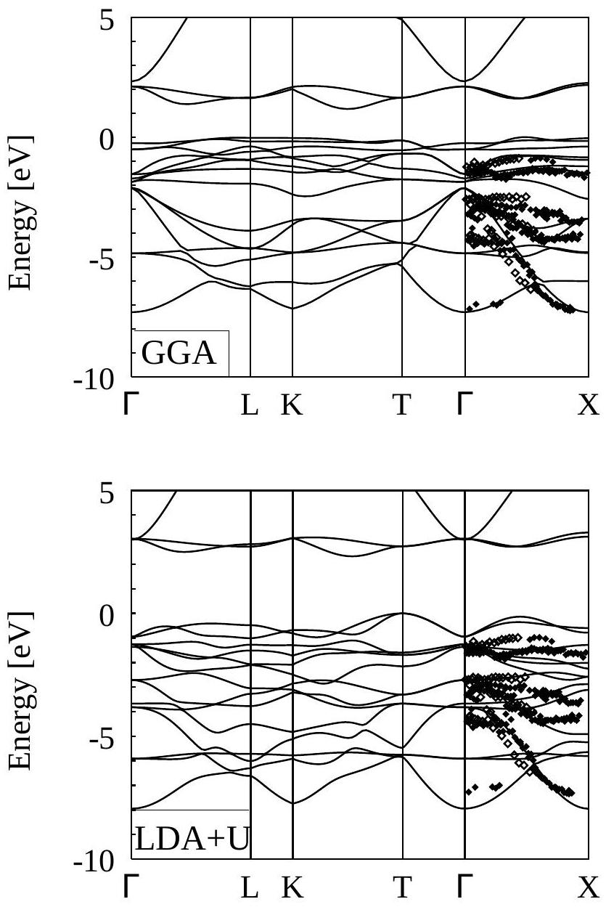
FIG. 13: The band structure of NiO in the undistorted (cubic) AF configuration at the experimental lattice spacing obtained within GGA (top panel) and with the computed Hubbard $U$ of 4.6 eV (bottom panel). The zero of the energy is set at the top of the valence band. Experimental data from ref. [46] (empty symbols) and ${ }_{16}^{17}$ (solid symbols) are also reported.

The same calculation with the literature value of $U=8$ eV , gave a larger value for the optical gap but a very poor agreement with the experimental absorption spectrum.

## Minerals: Fayalite

As a final example we want to apply the present methodology to Fayalite, the iron-rich end member of $(\mathrm{Mg}, \mathrm{Fe})_{2} \mathrm{SiO}_{4}$ olivine (orthorhombic structure), one of the most abundant minerals in Earth's upper mantle. Recently [527] we showed that, although good structural and magnetic properties could be obtained for this mineral within LDA or GGA, its electronic properties were incorrectly described as metallic, confirming the correlated origin of the observed insulating behavior.

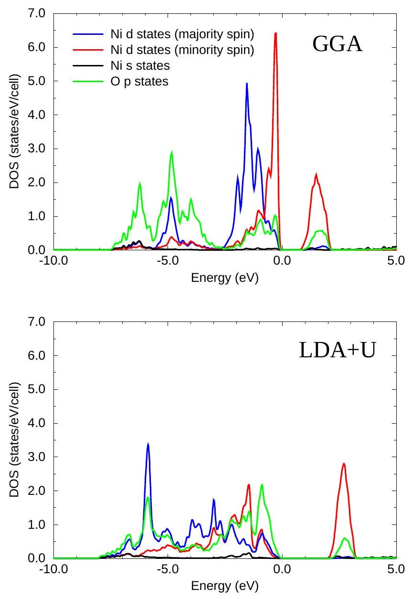
FIG. 14: Projected density of states of NiO in the undistorted AF configuration at the experimental lattice spacing obtained with $U=4.6 \mathrm{eV}$.

From x-rays diffraction studies it is known that Fayalite has an orthorhombic cell, whose experimental lattice parameters are (in atomic units) $\mathrm{a}=19.79, \mathrm{~b}=11.50$, $\mathrm{c}=9.11$. The unit cell (depicted in fig. $15_{1}^{1}$ ) contains four formula units, 28 atoms: 8 iron, 4 silicon, and 16 oxygen atoms. Silicon ions are tetrahedrally coordinated to oxygens, whereas iron ions occupy the centers of distorted oxygen octahedra. The point group symmetry of the non magnetic crystal is mmm ( $\mathrm{D}_{2 h}$ in the Schoenflies notation) and the space group is Pnma. The magnetization of iron reduces the original symmetry and only half of the symmetry operations survive. The general expression for the internal structural degrees of freedom is given in table I’11 in the Wyckoff notation

Iron sites can be divided into two classes (see fig. $\overline{1} \overline{5}$ and tab. I’I’1): Fe1 centers which are structured in chains running parallel to the $b$, [010], side of the orthorhombic cell, and Fe2 sites which belong to mirror planes for the non magnetic crystal structure perpendicular to the $b$ side and cutting it at $1 / 4$ and $3 / 4$ of its length. The main structural units are the iron centered oxygen octa-

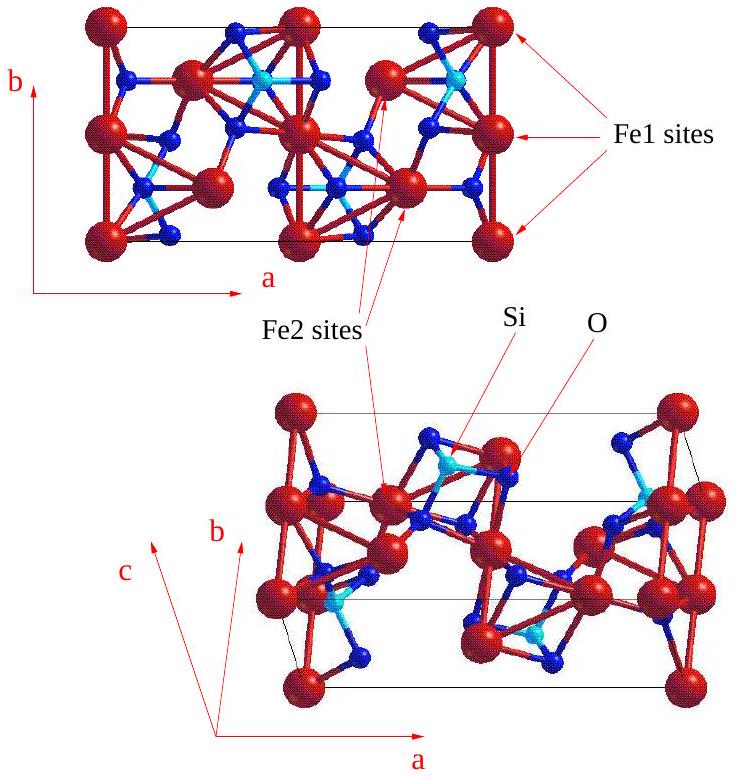
FIG. 15: The unit cell of Fayalite. Large dark ions are Fe, small dark ions are O, light ions are Si .

TABLE II: Definition of the Wyckoff structural parameters appropriate for Fayalite structure
| Ion | Class | Coordinates |
| :---: | :---: | :---: |
| Fe1 | 4 a | $(0,0,0),(1 / 2,0,1 / 2)$ |
|  |  | $(0,1 / 2,0),(1 / 2,1 / 2,1 / 2)$ |
| Fe2, Si, O1, O2 | 4 c | $\pm(\mathrm{u}, 1 / 4, \mathrm{v})$, |
|  |  | $\pm(\mathrm{u}+1 / 2,1 / 4,1 / 2-\mathrm{v})$ |
| O3 | 8 d | $\pm(\mathrm{x}, \mathrm{y}, \mathrm{z}), \pm(\mathrm{x}, 1 / 2-\mathrm{y}, \mathrm{z})$, |
|  |  | $\pm(\mathrm{x}+1 / 2,1 / 2-\mathrm{y}, 1 / 2-\mathrm{z})$, |
|  |  |  |
|  | $\pm(\mathrm{x}+1 / 2, \mathrm{y}, 1 / 2-\mathrm{z})$ |  |

hedra which are distorted from the cubic symmetry and tilted with respect to each other both along the chains and on nearest Fe2 sites. Fayalite is known to be an antiferromagnetic (AF) compound with slightly non collinear arrangement of spin on Fe1 iron site (this non collinearity will not be addressed here). Magnetic moments along the central and the edge Fe1 chains are antiferromagnetically oriented and from our previous work [57, the most stable spin configuration is the one in which the magnetization of Fe2 ion is parallel to the one of the closest Fe1 iron. This magnetic structure is consistent with an

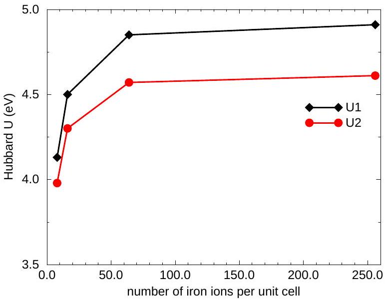
FIG. 16: Convergence of Hubbard parameters of Fayalite with the number of iron included in the supercell used in the extrapolation. U1 is the value obtained for Fe1 ions, U2 the one for Fe 2 .

iron-iron magnetic interaction via a superexchange mechanism through oxygen $p$ orbitals.

The calculation of $U$ was performed for the experimental geometry, in the above mentioned spin configuration. As the primitive unit cell of fayalite is already quite large, we performed the constrained calculation only in this cell and used larger supercells only to extrapolate the results. We considered three supercells in addition to the primitive one: $i$ ) a cell duplicated in the $[0,1,0]$ chain direction (a $1 \times 2 \times 1$ supercell), containing 16 iron atoms; $i i$ ) a cell, containing 64 iron ions, obtained by duplicating the primitive structure in all directions (a $2 \times 2 \times 2$ supercell) and $i i i)$ a $4 \times 4 \times 2$ supercell ( 256 iron ions). Other computational details where similar to those used in our previous work [57]. As GGA approximation provided a slightly better description of the system than LDA, we assumed this functional as the starting point to be improved; the same pseudopotentials used in ref. [57] for $\mathrm{Fe}, \mathrm{O}$ and Si were adopted here; somehow larger energy cutoff for the electronic wave functions and charge density ( 36 and 288 Ry respectively) and a small smearing width of 0.005 Ry were used. A $2 \times 4 \times 4$ Monkhorst-Pack grid of k -points in the primitive cell was found sufficient for the BZ integration.

The results of the $U$ calculation for the two different families of iron sites (Fe1 and Fe2) are reported in fig. 16- where the rapid convergence with respect supercell dimension can be seen. The final results for the on-site Coulomb parameters are $U_{1}=4.9 \mathrm{eV}$ for Fe1 ions and $U_{2}=4.6 \mathrm{eV}$ for Fe2, which are in fairly good agreement with the approximate (average) value of 4.5 eV obtained in ref. 57 from a rather crude estimate.

The GGA+U band structure of Fayalite is shown in fig.

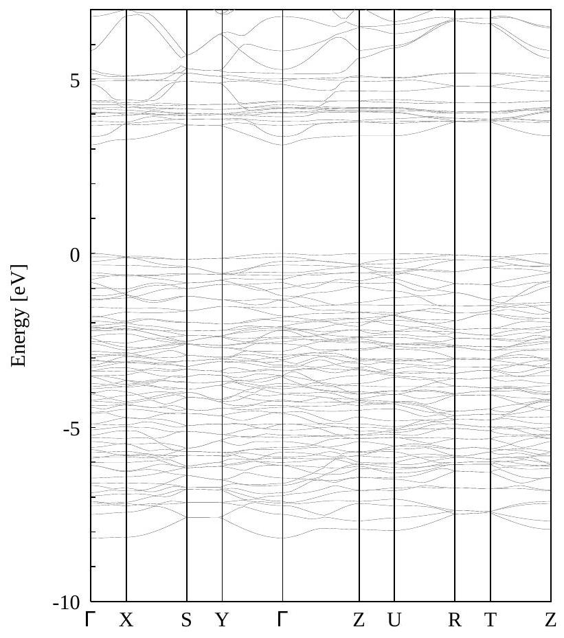
FIG. 17: The band structure of Fayalite obtained within the present LDA+U approach. The zero of the energy is set to the top of the valence band. Complete degeneracy among spin up and spin down states is present.

${ }_{1}^{1} \overline{7}_{1}$ while in fig. $\overline{1}_{2}^{1} \overline{8}_{1}^{1}$ some atomic-projected density of states are reported. At variance with the GGA results reported in ref. 57 a band gap of about 3 eV now separates the valence manifold from the conduction one, in reasonable agreement with the experimental result of about 2 eV $59{ }^{1}$ at zero pressure.

The minority spin $t_{2 g}$ manifold of iron ions, that within GGA cross the Fermi energy, is split into two subgroups by the gap opening. The conduction-band states are shrunk to a narrow energy range and moved above the bottom of the iron $s$-states band which remains almost unaffected; the lower-energy minority-spin $d$-states, instead, merge in the group of states below the Fermi level where they mix strongly with states originating from Oxygen $p$ orbitals: the two sets of states, well separated in the GGA results, collapse into a unique block. The most evident consequence of the gap opening consists in a pronounced shrinking of the $d$ states of iron which become flatter than in the GGA case. This is evident on the top of the valence band, but also for states well below this energy level, which thus reveal a more pronounced atomic-like behavior. Beside the gap opening between the two groups of the minority-spin states, a strong mixing occurs among the oxygen $p$ states and the iron $d$ levels over a rather large region extending down to 8 eV

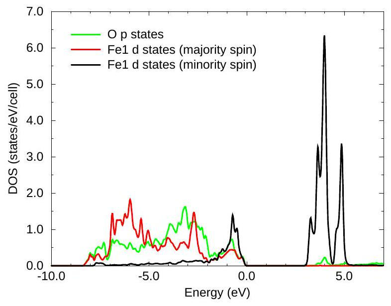
FIG. 18: Some atomic-projected density of states of Fayalite obtained within the present LDA +U approach. Contributions from majority- and minority-spin $3 d$ states of one of the Fe1 iron ions and from the total $2 p$ manifold of one oxygen ion are shown.

TABLE III: Comparison of the experimental and LDA+U calculated values for the Wyckoff structural parameters of Fayalite as defined in table II
| Ion | u | v | x | y | z |
| :--- | :--- | :--- | :--- | :--- | :--- |
| Exp. |  |  |  |  |  |
| Fe2 | 0.780 | 0.515 |  |  |  |
| Si | 0.598 | 0.071 |  |  |  |
| O1 | 0.593 | 0.731 |  |  |  |
| O2 | 0.953 | 0.292 |  |  |  |
| O3 |  |  | 0.164 | 0.038 | 0.289 |
| $G G A+U$ |  |  |  |  |  |
| Fe2 | 0.779 | 0.515 |  |  |  |
| Si | 0.597 | 0.072 |  |  |  |
| O1 | 0.593 | 0.735 |  |  |  |
| O2 | 0.951 | 0.289 |  |  |  |
| O3 |  |  | 0.165 | 0.036 | 0.286 |

below the top of the valence band. A finite contribution of the oxygen states is present close to the top of the valence manifold showing that the gap is mainly of Mott-Hubbard type with a partial charge-transfer character.

We have then relaxed the geometric structure of the system (both internal and cell degrees of freedom) assuming no dependence of $U_{1}$ and $U_{2}$ on the atomic configuration. The resulting structural parameters ( $a=20.18$, $b=11.75, c=9.29$ atomic unit) as well as the internal coordinates reported in table $\underset{\sim}{\bar{I}} \bar{I}_{\mathbf{I}}$ are in very good agreement with the experimental results, even better than the already satisfactory agreement obtained in ref. $\left.[5]_{1}\right]$ within GGA.

Although we did not studied other spin-configurations, magnetic properties seam to improve slightly in the GGA +U approximation. The magnetic moment on each iron (both Fe1 and Fe2) was found to be $3.9 \mu_{B}$, in closer agreement with the spin-only value ( $4 \mu_{B}$ ) of the experimental result ( $4.4 \mu_{B}$ ) than the one obtained by GGA only ( $3.8 \mu_{B}$ ). This improvement is probably due to the enhanced atomic-like character of iron $d$ states, which is consequence of the gap opening.

In conclusion, the GGA+U provides a quite good description of structural, magnetic and electronic properties of fayalite, reproducing the observed insulating behavior with a reasonable value for its fundamental band gap.

## SUMMARY

In this work we have reexamined the $\mathrm{LDA}+\mathrm{U}$ approximation to DFT and a simplified rotational-invariant form of the functional was adopted. We then developed a method, based on a linear response approach, to calculate in an internally consistent way the interaction parameters entering the LDA+U functional, without making aprioristic assumption about screening and/or basis set employed in the calculation. Our methodology was then successfully tested on a few systems representative of normal and correlated metals, simple transition metal oxides and iron silicates. In all cases we obtained rather accurate results indicating that our scheme allows us to study both electronic and structural properties of strongly correlated material on equal footing, without resorting to any empirical parameter adjustment.

This work has been supported by the MIUR under the PRIN program and by the INFM in the framework of the Iniziativa Trasversale Calcolo Parallelo.
[1] V.I. Anisimov, J. Zaanen, and O.K. Andersen, Phys. Rev. B 44, 943 (1991).
[2] V.I. Anisimov, I.V. Solovyev, M.A. Korotin, M.T. Czyzyk, and G.A. Sawatzky, Phys. Rev. B 48, 16929 (1993).
[3] I.V. Solovyev, P.H. Dederichs, and V.I. Anisimov, Phys. Rev. B 50, 16861 (1994).
[4] A.I. Lichtenstein, M.I. Katsnelson, Phys. Rev. B 57, 6884 (1998); M.I. Katsnelson, and A.I. Lichtenstein, Phys. Rev. B 61, 8906 (2000); A.I. Lichtenstein, M.I. Katsnelson, and G. Kotliar, Phys. Rev. Letters 87, 067295 (2001).
[5] A.I. Liechtenstein, V.I. Anisimov, and J. Zaanen, Phys. Rev. B 52, R5467 (1995).
[6] V.I. Anisimov, F. Aryasetiawan, and A.I. Liechtenstein, J. Phys.: Condensed Matter 9, 767 (1997).
[7] W.E. Pickett, S.C. Erwin, and E.C. Ethridge, Phys. Rev. B 58, 1201 (1998).
[8] V.I. Anisimov, and O. Gunnarsson, Phys. Rev. B 43, 7570 (1991).
[9] J.F. Janak, Phys. Rev. B 18, 7165 (1978).
[10] E. Antonides, E.C. Janse, and G.A. Sawatzky, Phys. Rev. B 15, 1669 (1977).
$[11]$ D. van der Marel, G.A. Sawatzky, and F.U. Hillebrecht, Phys. Rev. Lett. 53, 206 (1984).
[12] O. Bengone, M. Alouani, P. Blöchl, J. Hugel, Phys. Rev. B 62, 16392 (2000).
[13] D. Vanderbilt, Phys. Rev. B 41, 7892 (1990).
[14] S.L. Dudarev, G.A. Botton, S.Y. Savrasov, C.J. Humphreys, and A.P. Sutton, Phys. Rev. B, 57, 1505 (1998).
[15] J.P. Perdew, R.G. Parr, M. Levy, and J.L. Balduz, Phys. Rev. Letters 49, 1691 (1982).
[16] J.P. Perdew, and M. Levy, in Many-body phenomena at surfaces, D.C. Langreth and H. Suhl editors (Academic, New-York, 1984).
[17] R.O. Jones, and O. Gunnarsson, Rev. Mod. Phys. 61, 689 (1989).
[18] M.S. Hybertsen, M. Schlüter, and N.E. Christensen, Phys. Rev. B 39, 9028 (1989).
[19] A.K. McMahan, R.M. Martin, and S. Satpathy, Phys. Rev B 38, 6650 (1988).
[20] P.H. Dederichs, S. Blügel, R. Zeller, and H. Akai, Phys. Rev. Letters 53, 2512 (1984).
[21] S.L. Adler, Phys. Rev. 126, 413 (1962); N. Wiser, Phys. Rev. 129, 62 (1963).
[22] S. Baroni, and R. Resta, Phys. Rev. B 33, 7017 (1986); M.S. Hybertsen, and S.G. Louie, Phys. Rev. B 35, 5585 (1987).
[23] J.W. Allen, S.J. Oh, O. Gunnarsson, K. Schönhammer, M.B. Maple, M.S. Torikachvili, and I. Lindau, Adv. Phys. 35, 275 (1986).
[24] J.F. Herbst, R.E. Watson, and J.W. Wilkins, Phys. Rev. B 17, 3089 (1978).
[25] J.P. Perdew, K. Burke, M. Ernzerhof, Phys. Rev. Letters 77, 3865 (1996).
[26] A. Baldereschi, Phys. Rev. B 7, 5212 (1973); D.J. Chadi, and M.L. Cohen, Phys. Rev. B 8, 5747 (1973); H.J. Monkhorst, and J.D. Pack, Phys. Rev. B 13, 5188 (1976); J.D. Pack, and H.J. Monkhorst Phys. Rev. B 16, 1748 (1977).
[27] M. Methfessel and A.T. Paxton, Phys. Rev. B 40, 3616 (1989).
[28] E.G. Moroni, G. Kresse, J. Hafner, and J. Furthmüller, Phys. Rev. B 56, 15629 (1997).
[29] M.T. Czyzyk, and G.A. Sawatzky, Phys. Rev. B 49, 14211 (1994).
[30] P. Mohn, C. Persson, P. Blaha, K. Schwarz, P. Novak, and H. Eschrig, Phys. Rev. Letters 87, 196401 (2001)
[31] A.G. Petukhov, I.I. Mazin, L. Chioncel, and A.I. Lichtenstein, Phys. Rev. B 67, 153106 (2003).
[32] A.M. Turner, A.W. Donoho, and J.L. Erskine, Phys. Rev. B 29, 2986 (1984).
[33] B. Johansson, Philos. Mag. 30, 469 (1976); J.W. Allen and R.M. Martin, Phys. Rev. Letters 49, 1106 (1982); J.W. Allen and L.Z. Liu, Phys. Rev. B 46, 5047 (1992); I.S. Sandalov, O. Hjortstam, B. Johansson, and O. Eriksson, Phys. Rev. B 51, 13987 (1995).
[34] M.B. Zolf, I.A. Nekrasov, Th. Pruschke, V.I. Anisimov, and J. Keller Phys. Rev. Letters 87, 276403 (2001); K. Held, A.K. McMahan, and R.T. Scalettar Phys. Rev. Letters 87, 276404 (2001).
[35] I.-K. Jeong, T.W. Darling, M.J. Graf, Th. Proffen, R.H. Heffner, Y. Lee, T. Vogt, and J.D. Jorgensen, Phys. Rev.

Letters 92, 105702 (2004).
[36] D.G. Isaak, R.E. Cohen, M.J. Mehl, and D.J. Singh, Phys. Rev. B 47, 7720 (1993).
[37] Z. Fang, I.V. Solovyev, H. Sawada, and K. Terakura, Phys. Rev. B 59, 762 (1999).
[38] Z. Fang, K. Terakura, H. Sawada, T. Miyazaki, and I. Solovyev, Phys. Rev. Letters 81, 1027 (1998).
[39] I.I. Mazin, and V.I. Anisimov, Phys. Rev. B 55, 12822 (1997).
[40] P. Wei, and Z.Q. Qi, Phys. Rev. B 49, 10864 (1994).
[41] I. Balberg, and H.L. Pinch, J. Magn. Magn. Mater. 7, 12 (1978).
[42] T. Yagi, T. Suzuki, and S. Akimoto, J. Geophys. Res. 90, 8784-8788 (1985).
[43] B. T. M. Willis, H. P. Rooksby, Acta Cryst. 6, 827 (1953).
[44] R.E. Cohen, S. Gramsh, G. Steinle-Neumann and L. Stixrude, in International School of Physics "Enrico Fermi" (couse 147, Varenna 2001); High pressure Phenomena, R.J. Hemley and G.L. Chiarotti editors (IOS Press, Amsterdam, 2002), p. 215.
[45] B. Bernu, C. Lhuillier, and L. Pierre, Phys. Rev. Letters 69, 2590 (1992); L. Capriotti, A.E. Trumper, and S. Sorella, Phys. Rev. Letters 82,3899 (1999).
[46] Z.X. Shen, C.K. Shih, O. Jepsen, W.E. Spicer, I. Lindau, and J.W. Allen, Phys. Rev. Letters 64, 2442 (1990).
[47] H. Kuhlenbeck, G. Odörfer, R. Jaeger, G. Illing, M.

Menges, Th. Mull, H.J. Freund, M. Pöhlchen, V. Staemmler, S. Witzel, C. Scharfschwerdt, K. Wennemann, T. Liedtke, and M. Neumann, Phys. Rev. B 43, 1969 (1991).
[48] H.A. Alperin, J. Phys. Soc. Jpn. 17, 12 (1962).
[49] A.K. Cheetham, and D.A. Hope, Phys. Rev. B 27, 6964 (1983).
[50] G. Lee, and S.J. Oh, Phys. Rev. B 43, 14674 (1991).
[51] G.A. Sawatzky, and J.W. Allen, Phys. Rev. Letters 53, 2339 (1984).
[52] R.J. Powell, and W.E. Spicer, Phys. Rev. B 2, 2182 (1970).
[53] D. Adler, and J. Feinleib, Phys. Rev. B 2, 3112 (1970).
[54] J. McNatt, Phys. Rev. Letters 23, 915 (1969).
[55] S. Hüfner, and T. Riesterer, Phys. Rev. B 33, 7267 (1986).
[56] S. Hüfner, P. Steiner, I. Sander, F. Reinert, and H. Schmitt, Z. Phys. B: Condens. Matter 86, 207 (1992)
[57] M. Cococcioni, A. Dal Corso, and S. de Gironcoli, Phys. Rev. B 67, 094106 (2003).
[58] R.W.G. Wyckoff, Crystal Structures, 2nd ed. (Krieger, Florida, 1981), Vol. 3, chapter VIII,b10.
[59] Q. Williams, E. Knittle, R. Reichlin, S. Martin, and R. Jeanloz, J. Geophys. Res. 95, 21549 (1990).

[^0]:    *present address: Massachusetts Institute of Technology, 77 Massachusetts avenue, Cambridge MA, 02139 USA.

