Cite this: _Phys.Chem.Chem.Phys.,_ 2018, 20, 15293

# Anisotropic chemical strain in cubic ceria due to oxygen-vacancy-induced elastic dipoles†
Tridip Das, a Jason D. Nicholas, a Brian W. Sheldonb and Yue Qi *a

Received 23rd February 2018, Accepted 14th May 2018 DOI: 10.1039/c8cp01219a rsc.li/pccp

Accurate characterization of chemical strain is required to study a broad range of chemical-mechanical coupling phenomena. One of the most studied mechano-chemically active oxides, nonstoichiometric ceria (CeO2-d), has only been described by a scalar chemical strain assuming isotropic deformation. However, combined density functional theory (DFT) calculations and elastic dipole tensor theory reveal that both the short-range bond distortions surrounding an oxygen-vacancy and the long-range chemical strain are anisotropic in cubic CeO2-d. The origin of this anisotropy is the charge disproportionation between the four cerium atoms around each oxygen-vacancy (two become Ce3+ and two become Ce4+ ) when a neutral oxygen-vacancy is formed. Around the oxygen-vacancy, six of the Ce3+ -O bonds elongate, one of the Ce3+ -O bond shorten, and all seven of the Ce4+ -O bonds shorten. Further, the average and maximum chemical strain values obtained through tensor analysis successfully bound the various experimental data. Lastly, the anisotropic, oxygen-vacancy-elastic-dipole induced chemical strain is polarizable, which provides a physical model for the giant electrostriction recently discovered in doped and non-doped CeO2-d. Together, this work highlights the need to consider anisotropic tensors when calculating the chemical strain induced by dilute point defects in all materials, regardless of their symmetry.

### 1 Introduction

Chemical strain, the dimensional change caused by a compositional change, is of interest in a variety of electrochemical devices.1 For instance, the coupling between the chemical, mechanical, and electrical state that results from an electrochemically-active material experiencing chemical strain can:1 (a) produce stress in constrained materials that can (under some situations) lead to their mechanical degradation or failure,2,3 (b) provide new opportunities to characterize point defect concentration in materials,4,5 and (c) allow internal point defect concentrations to be altered with an externally applied stress, strain, or electrical potential.6-8 Since the majority of electrochemically active materials are mechano-chemically active, accurate values of chemical strain are required to quantify the general chemical-mechanical coupling phenomena.9-12

Of materials where chemical-mechanical coupling occurs, cerium oxide (either in pure or doped form) is the most widely studied nonstoichiometric oxide to date5 because its oxygen vacancy concentration can be varied over many orders of magnitude13,14 and because of its broad application as a catalyst,15 Solid Oxide Fuel Cell (SOFC) material,13,14,16-19 high-performance electrostrictor,7 oxide memristor component,8,20 etc. It is also helpful that ceria has a high

> a Chemical Engineering & Materials Science Department, Michigan State University, East Lansing, MI 48824, USA. E-mail: yueqi@egr.msu.edu

> b School of Engineering, Brown University, Providence, RI 02912, USA

> † Electronic supplementary information (ESI) available. See DOI: 10.1039/c8cp01219a

chemical expansion coefficient (the chemical strain per defect),5 aC, defined as:

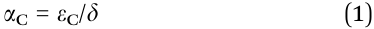

where eC is the chemical strain and d is the oxygen nonstoichiometry. Its unique functionality and chemical strain are largely determined by the electronic structure of the oxygen vacancies. Therefore, accurate chemical expansion coefficients, aC, determined by density functional theory (DFT) calculations can be used along with the measured chemical strain, eC, to determine the vacancy concentration, d in operando, as demonstrated in other oxide materials for battery applications.11,21

Although an elastic dipole tensor22 is the most general way to describe the short-and-long range deformation caused by changes in dilute point defect concentrations, previous experimental23-33 and computational9,10,19 studies on ceria have often treated the chemical strain, eC, as a scalar (effectively assuming uniform oxygen-vacancy-induced strains in pure and doped CeO2-d). For instance, by computing the average lattice parameter change as a function of d, Marrocchelli et al.9 predicted the average aC in CeO2-d using molecular dynamics with a DIPole Polarizable Ion Model (DIPPIM) force field.34 Further, Er et al.10 found uniform Ce deformation around an oxygen vacancy using density functional theory (DFT) and calculated a scalar aC based only on the principle components of the elastic dipole tensor. Wang et al. demonstrated non-uniform Ce displacement around an oxygen vacancy using DFT+U calculations but still reported a scalar aC using the average

lattice parameter change from a simulation cell containing one vacancy (which lead to aC varying with the simulation cell size).12

Even though fluorite-structured CeO2-d has cubic symmetry, several new experimental observations suggest a directionally anisotropic12 chemical expansion, which requires a tensor representation. For instance, it has been shown that large biaxial stresses cause cubic ceria thin films to become tetragonal with increased vacancy concentration.35 Further, doped and un-doped ceria thin films7 and bulk pellets36 exhibit electrostrictive strains that are related to simultaneous Ce-O bond shortening and Ce-O bond lengthening around the oxygen vacancies (i.e. anisotropic local lattice distortion).37 In addition, Li et al. further characterized the short-range Ce-O bond 37 distortions around an oxygen vacancy in CeO2-d and hypothesized that the oxygen vacancy induced chemical strain must be anisotropic in nature (and polarizable) to produce the large strains observed in ceria under an applied electric field, the so-called giant electrostriction phenomenon; while other mechanisms will give a much smaller electrostriction strain.

The goal of the present work was to reveal the physics of the counter-intuitive anisotropic chemical strain in cubic CeO2-d. This was accomplished by fully describing both the short-range lattice distortion and long-range elastic strain induced by dilute oxygen vacancies in CeO2-d. While the short-range lattice distortion (i.e. the oxygen nearest and second nearest neighbor bond distortions) could be accurately described by DFT+U calculations with a set of atomic displacements, the long-range elastic strain required the full chemical expansion coefficient tensor. As demonstrated here, with a tensorial aC, the anisotropic chemical strain, average chemical strain, maximum expansion direction, and maximum contraction direction were fully captured and used to explain a broad range of experimentally-measured chemical strains24,25,38 and the "giant electrostriction"7 behavior observed in pure and doped ceria.

### 2 Methods

The chemical expansion coefficient tensor was calculated following the definition of Gillan22 and others.10,11 In this method, the short-range elastic dipole tensor, G, associated with an oxygen vacancy can be calculated by taking the first order Taylor expansion of the oxygen vacancy formation energy, EVf-- O;e with respect to the applied strain tensor, e. Since

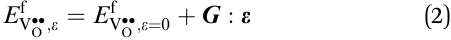

where EVf-- O;e=0 is the VO-- formation energy in the absence of any applied strain, taking the derivative of eqn (2) with respect to e, yields:

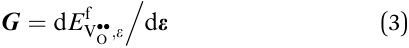

The chemical strain tensor at a given dilute oxygen vacancy concentration can be calculated by minimizing the total energy, DEtotal with respect to the applied stain. DEtotal consists of the energy due to the local lattice distortions caused by oxygen

vacancy formation (DEshort) and the long-range elastic strain energy caused by oxygen vacancy formation (DElong) as:

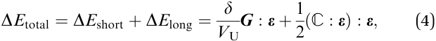

where VU is the volume per formula unit of perfect CeO2 and C is the elastic stiffness tensor for the perfect lattice. Taking the derivative of eqn (4) with respect to e yields:

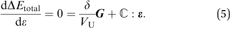

As shown in Section S1 of the ESI,† the chemical strain tensor, eC can be obtained by rearranging eqn (5) and substituting eqn (4) to yield:

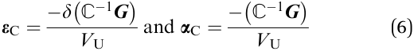

Here, both the short-range bond distortions around an oxygen vacancy and the elastic dipole tensor G were computed using spin-polarized plane wave DFT calculations implemented in the Vienna Ab Initio Simulation Package (VASP). A generalized gradient approximation with a Hubbard-U correction (GGA+U) was utilized with Ueff = 4.5 to treat the highly localized Ce 4f orbitals, following the rotationally invariant approach proposed by Dudarev et al.39 and previous calculations on ceria by Fabris et al.40 This Ueff value for Ce 4f has been shown to provide satisfactory charge localization on Ce due to oxygen vacancy formation25 in the bulk and at the surface.41 The 2 x 2 x 2 ceria cubic-supercell shown in Fig. 1a was used for the neutral oxygen vacancy formation and short-range bond distortion calculations (with d = 0.03125). Such a low d avoided any vacancy-vacancy interactions caused by the periodic boundary conditions,42 a condition we consider as a dilute approximation. Future lowering the vacancy concentration below 1% may involve other charge redistribution mechanisms.43,44 However, this situation is not considered here because most prior chemical-mechanical characterizations examined higher oxygen nonstoichiometry levels.

### 3 Results and discussion

##### 3.1 Charge-disproportionation-induced anisotropic local lattice distortions around an oxygen vacancy

Neutral oxygen vacancy formation leaves two electrons in the CeO2-d lattice. In a perfect CeO2 lattice, each Ce is in cubic coordination with 8 oxygen atoms and each oxygen is in tetrahedral coordination with 4 Ce atoms (Fig. 1a). As shown in Table 1, the DFT-predicted lattice parameters for the perfect lattice agree well with the values obtained from X-ray absorption near edge structure (XANES) measurements.37 The distribution of these two electrons on the CeO2-d lattice directly impacts the short-range (local) lattice distortions and the long-range chemical strain. Therefore DFT+U calculations were performed to compare two possibilities: (a) the two electrons are equally shared among the four oxygen-vacancy-coordinated Ce atoms (resulting in isotropic local distortions) and (b) the two electrons are preferentially localized on only two oxygen-vacancy-coordinated Ce

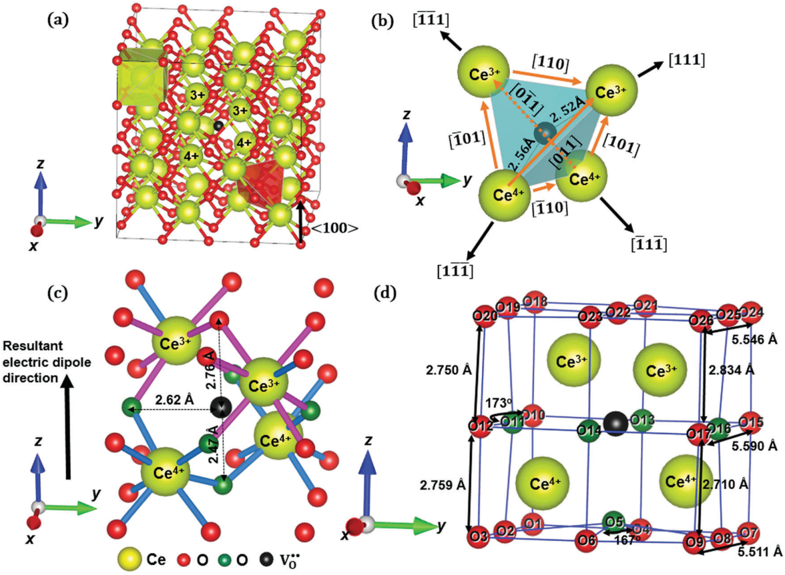

Table 1, the non-uniform distortions were energetically favorable over the uniform distortions by 0.55 eV. In this case, two of the oxygen-vacancy-adjacent Ce atoms maintained a 4+ charge and the other two Ce atoms became 3+, as depicted in Fig. 1a. More detailed partial density of states (PDOS) calculations for the Ce 5d and 4f orbitals before and after the formation of an oxygen vacancy showed charge localization in the 4f orbital after V-- Oformation(detailsprovidedinESI,†SectionS2),whichis consistent with previous computational studies.45,46

This charge disproportionation occurs between the oxygen-vacancy-adjacent Ce atoms in CeO2-d leading to non-uniform local lattice distortions. Fig. 1b illustrates how the Ce-V--O distances changed from 2.38 Å to 2.52 and 2.56 Å for Ce3+-V--O and Ce4+-V--O, respectively. All four oxygen-vacancy-adjacent Ce atoms moved away from the V--O along the h111i directions, with the Ce4+ atoms moving further than the Ce3+ atoms to form a distorted tetrahedron. Fig. 1c illustrates the effect that oxygen vacancy formation has on the local oxygen anion sublattice. As shown in Fig. 1c, each V--O has 6 FNN, 12 SNN, and 8 third nearest neighboring (TNN) oxygen atoms. The green oxygen atoms in Fig. 1c came closer to the V--O while the red oxygen atoms moved away from the V--O. Specifically, the 4 FNN oxygen atoms connected to Ce3+ and Ce4+ moved closer by ~0.13 Å, the FNN oxygen atoms connected to two Ce4+ atoms moved closer by 0.28 Å, and the FNN oxygen atoms connecting the two Ce3+ atoms moved away only by 0.01 Å.

Table 1 details the changes in the Ce-O bond distances around each V-- O. As seen in Fig. 1c, the pink Ce-O bonds were shortened by oxygen vacancy formation while the blue bonds were lengthened. All seven of the Ce4+ -O bonds around each oxygen-vacancy-coordinated Ce4+ contracted to lengths between 2.27 Å and 2.35 Å, or by -4.6% to -1.3% compared to Ce-O in the perfect lattice. In contrast, six out of the seven Ce-O bonds around each oxygen-vacancy-coordinated Ce3+ elongated (as denoted by the pink bonds in Fig. 1c) to ~2.43 Å or by 2%. The Ce3+ -O bond on the O-Ce3+ -V-- Odiagonalcontractedto 2.33 Å or by -2%. Li et al.37 used XANES to experimentally determine the local Ce-O bond length changes that occur when oxygen is removed from Gd doped ceria. They noticed that some Ce-O bonds were shortened to 2.013-2.288 Å (or by -13% to -2%) but some were elongated to 2.398-2.673 Å (2.3-16%) with the introduction of oxygen vacancies. They also observed that the local bond length change was not sensitive to Gd-dopant level; therefore, it is appropriate to compare the predicted bond changes with the experiments, or at least the trends in bond length change. The simulations presented here on pure ceria show that bond contraction was in the range of -4.6% to -1.3% while bond elongation was in the range of 1.6-2.5%. Despite the differences in absolute bond length magnitude, unlike previous modeling work performed assuming uniform local expansion (as shown in Table 1), the present DFT results effectively captured the simultaneous bond lengthening and shortening observed experimentally when oxygen is removed from ceria. It must be noted, however, that the two local deformation models proposed by Li et al.37 are only partially correct because they did not account for the nonuniform charge states on the oxygen-vacancy-adjacent Ce atoms.

##### 3.2 The relationship between elastic dipoles and the anisotropic chemical strain induced by oxygen vacancies

Charge disproportionation and anisotropic local lattice distortions lead to anisotropic elastic dipoles and an anisotropic long-range chemical expansion coefficient as summarized in eqn (2)-(6). The short-range elastic dipole tensor, G, is calculated by computing the oxygen vacancy formation energy EVf-- O;ewithdifferentapplied strain components, e, from DFT+U and then fitting EVf-- O;easa linear function of strain along each strain direction as shown in Fig. 2a, producing:

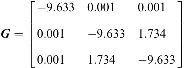

Fig. 2a clearly shows that the oxygen vacancy formation energy decreases under tension but does not vary much with shear strain. This indicates that the oxygen vacancy concentration in CeO2-d increases under tensile uniaxial, biaxial, or hydrostatic stress; a trend experimentally-observed by Gopal et al.35

Entering G and the DFT predicted VU and C values into eqn (6) leads to the DFT-predicted chemical expansion coefficient and chemical strain tensor. The calculated VU = 41.50 Å3 and cubic CeO2 C values of C11 = 343 GPa, C12 = 103 GPa, and C44 = 54 GPa are comparable to those obtained in previous calculations.13,47,48 Further, the 198 GPa Young’s modulus calculated from these Cij’s is comparable to the experimentally-reported values (225 GPa).49 A fully DFT-predicted chemical expansion coefficient tensor with its primary directions along the h100i directions is:

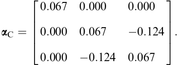

This complete, aC tensor contains information on the directions of the maximum and minimum strain values. By diagonalization of the aC tensor, one can obtain the anisotropy of the chemical strain projected onto the principle directions, using the relationship:

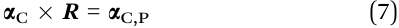

where the eigenvectors provide the rotation matrix,

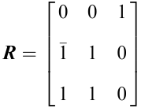

and the eigenvalues identify the components of the chemical expansion coefficient projected onto each the principal directions in aC,P to yield:

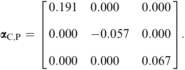

After diagonalizing aC, the chemical strain anisotropy is apparent. The maximum possible chemical expansion coefficient of 0.191 occurs in the [0-11] direction shown in Fig. 1b. This is almost three times larger than the chemical expansion coefficient along the [100] direction. In the perpendicular [011] direction a compressive strain with aC,yy = -0.057 is observed. This chemical strain anisotropy is caused by the local anisotropic lattice distortion. Fig. 1d shows the oxygen square sublattice on the (100) planes exhibited a rhombohedral distortion with a side length of 5.546 Å and a (+O19-O20-O23) corner angle of 93 degrees. The four corner O-atoms (O18, O3, O7, O26) forming linear O-Ce3+/4+-V--O bonds with the oxygen vacancy are also distorted, while the O-Ce3+-V--O lengths are longer than the O-Ce4+-V--O lengths. On close observation of the rotation matrix, or eigenvectors, it can be seen that the x and y-axes of the diagonalized tensor correspond to the [0-11] (O7-O18 direction) and the [011] (O1-O24 direction) directions, respectively. On the (001) plane, the O7-O18 diagonal elongated to 7.90 Å in the [0-11] direction from 7.77 Å in perfect ceria, while the O1-O24 diagonal contracted to 7.73 Å in the [011] direction, inducing the long-range anisotropic strain.

From the chemical expansion coefficient tensor calculated here, aC,P, the average chemical expansion coefficient produced by a collection of randomly-oriented anisotropic dipoles is given by aC,Ave = tr(aC) = 0.067. This will happen in polycrystalline samples or even in single crystals. Because there are six equivalent arrangements for Ce3+ and Ce4+ ions to occupy around each V--O, in an unbiased CeO2-d crystal with a dilute concentration of oxygen vacancies, these elastic dipoles will be randomly oriented, resulting in an average crystal structure that remains cubic. The averaged maximum chemical expansion coefficient aC,Max is given by the two principal positive aC,P values, and is equal to 0.129. Fig. 2b shows the eC vs. d trends obtained from the average and maximum aC values (as shown in eqn (1), aC is the slope of the lines in Fig. 2b) capture/bracket all the dilute (i.e. d < 0.05) experimental and previously-calculated CeO2-d chemical strain values in the literature.9,10,24,25,38 The experimental values display significant variation due to sample processing and testing differences. Hull et al.38 obtained a chemical expansion coefficient of 0.065 from neutron diffraction measurements of powdered ceria samples at 1000 degrees C under different oxygen partial pressures. This compares well with the average tr(aC) = 0.067 obtained here. Bishop et al.23 obtained a chemical expansion coefficient of 0.108 from 800 degrees C dilatometry measurements. Chiang et al.25 obtained chemical expansion coefficients of 0.094 and 0.091 from dilatometry measurements at 800 degrees C and 900 degrees C respectively. aC,M provides an upper bound for all the experimental data and is comparable to the experimental observations of Hull et al.38 This is consistent with the idea that the present DFT-based anisotropic chemical strain model can determine the overall chemical strain response of CeO2-d.

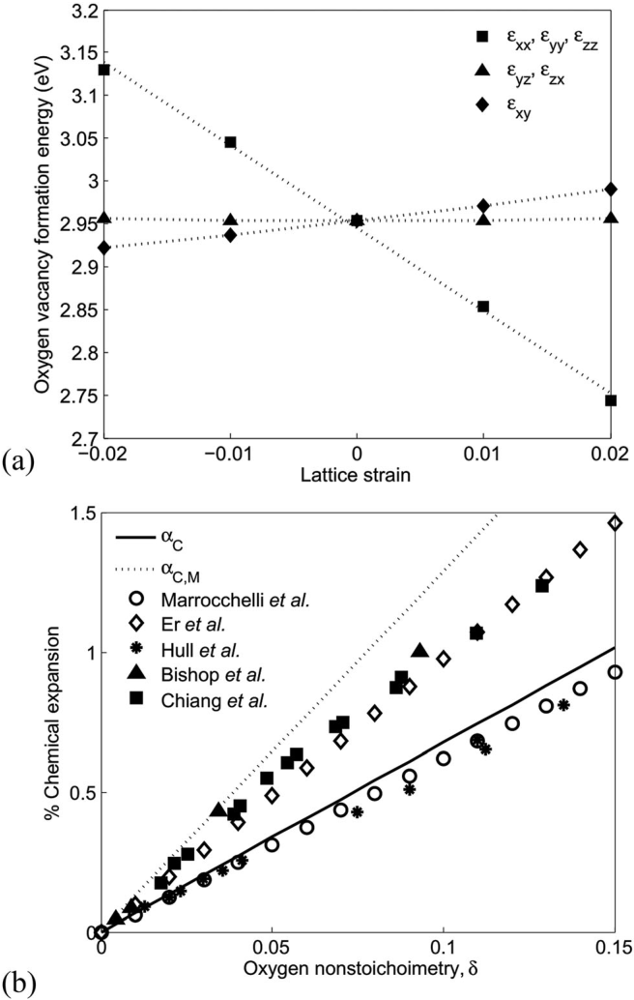

Fig. 2 (a) Variation of the oxygen vacancy formation energy as a function of the strain applied in various directions. As denoted by eqn (3), the slope of the formation energy versus strain gives the elastic dipole tensor projected on a specific strain direction. (b) Predictions of the average CeO2-d chemical strain (aC) and maximum CeO2-d chemical strain (aC,M) from this study (lines) compared to past experimentally measured CeO2-d chemical strains (solid symbols) and past DFT-predicted CeO2-d chemical strains (open symbols).

##### 3.3 Electric dipoles and electrostriction in ceria-based materials

In addition to producing an elastic dipole, as shown in Fig. 1, oxygen vacancies in nonstoichiometric ceria also produce an electric dipole with a <001> orientation with a magnitude of 2.9 e Å, as calculated in Section S3 of the ESI. In an unbiased CeO2-d crystal with a dilute concentration of oxygen vacancies, the electric dipoles can exist in the +/-[100], +/-[010], or +/-[001] directions. Random orientation of these will produce no net electric charge, along with an analogous distribution of elastic dipole tensors, resulting in an average chemical strain. However, under the bias of an electric field, the electrons can redistribute between the oxygen-vacancy-adjacent cerium atoms to create a Ce3+-Ce4+ arrangement with a dipole more closely aligned with the applied electric field. For example, an electric field applied in the [001] direction leads to the preferential Ce3+-Ce4+ arrangement shown in Fig. 1. Due to the applicability of the dilute point defect approximation, both dipole-dipole interactions and the total dipole moment per volume are weak; thus domain structures are unlikely in the dilute ceria examined here. Since the long-range chemical strain is anisotropic, this partial alignment of the oxygen-vacancy-induced dipoles will create a net strain compared to the unbiased E = 0 state. The maximum strain difference due to this effect is:

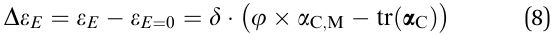

where j is an orientation factor that is related to crystal orientation, the electric field direction, and the angles between the maximum strain direction with the preferred dipole direction. Since the dipole orientations are symmetric in pairs (i.e. the occur in the + and - of each h100i direction), if the electric field is changed to the opposite direction, the net strain change will be the same, causing nonstoichiometric ceria to exhibit electrostrictive instead of ferroelectric behavior. Using eqn (8), the maximum possible

electrostriction strain coefficient is estimated as aE = DeE/d = aC,M - tr(aC) = 0.062. This value is larger than the electrostrictive strain coefficients of ~0.005-0.008 for pure ceria and ~0.003-0.011 for gadolinium doped ceria obtained by dividing the measured electrostriction strains and measured d in the thin film work of Korobko et al.50 This overestimate can be attributed to several experimental effects including less than optimal grain orientations, slow dipole rearrangement kinetics, and vacancy-vacancy interactions (at least in the Gd doped ceria thin films) that may have produced thin film aE values less than the maximum possible values. Nevertheless, the anisotropic oxygen-vacancy-induced elastic dipole model introduced here provides a reasonable explanation of the experimentally observed electrostriction in nonstoichiometric, fluorite-based oxides such as CeO2-d.

### 4 Conclusions

In summary, by combining DFT+U calculations with elastic dipole theory, the present work reveals that oxygen vacancy formation induces both anisotropic elastic dipoles and anisotropic long-range chemical strain in cubic CeO2-d. The origin of this anisotropy is the charge disproportionation on the four oxygen vacancy adjacent cerium atoms, which become two Ce3+ and two Ce4+ when a neutral oxygen vacancy forms. These Ce3+ and Ce4+ atoms move away from the oxygen vacancy by differing amounts which causes some of the neighboring oxygen atoms to move closer to the oxygen vacancy and some to move further away, resulting in an overall anisotropic lattice distortion. The oxygen-vacancy-adjacent Ce-O bond lengths calculated here, some of which are larger and some of which are smaller than those in the perfect lattice, are consistent with experimental observations. The calculations also reveal that most of the Ce3+ -O bonds elongate while the Ce4+ -O bonds shorten around each oxygen vacancy. The long-range chemical strain and chemical expansion coefficient tensors calculated here fully describe the directions of the maximum strain and the average strain; strains which bound all the experimentally measured chemical strain data for ceria. In addition to the elastic dipoles, the charge disproportionation creates electric dipole moments oriented along the h100i directions, one for each of the six possible Ce3+ and Ce4+ arrangements in a single crystal. Without an external bias, these anisotropic dipoles are randomly oriented and an average chemical strain is likely to be measured. However, an electric field bias can align the dipoles since the charge transfer among the neighboring Ce atoms around an oxygen vacancy is possible. This creates a finite strain change as a function of applied electric field, which explains the recently observed giant electrostriction in doped and undoped cubic CeO2-d. This model system illustrates the need to use anisotropic tensors when calculating the chemical strain induced by dilute point defects in all materials, regardless of their symmetry.

### Conflicts of interest

There are no conflicts to declare.

### Acknowledgements

TD, BWS, and YQ gratefully acknowledge GOALI collaborative research support from the National Science Foundation under Grant No. DMR-1410946 and DMR-1410850. JDN gratefully acknowledges support from NSF CAREER Award Number CBET1254453. The calculations presented here were performed at the Michigan State High-Performance Computing Center. The authors would like to thank Christine James for assistance with the chemical strain tensor calculations.

### References

- 1 J. D. Nicholas, Y. Qi, S. R. Bishop and P. P. Mukherjee, J. Electrochem. Soc., 2014, 161, Y11.

- 2 A. Rao, J. Dsa, S. Goyal and B. R. Singh, in Physics of Semiconductor Devices, ed. Jain, V. K.; Verma, A., Springer International Publishing, Cham, 2014; pp. 555-558.

- 3 A. Scarpa, G. Ghibaudo, G. Ghidini, G. Pananakakis and A. Paccagnella, Microelectron. Reliab., 1998, 38, 195.

- 4 B. W. Sheldon, S. Mandowara and J. Rankin, Solid State Ionics, 2013, 233, 38.

- 5 J. D. Nicholas, Extreme Mech. Lett., 2016, 9, 405.

- 6 M. M. Hasan, M. M. Billah, M. N. Naik, J. G. Um and J. Jang, IEEE Electron Device Lett., 2017, 38, 1035.

- 7 R. Korobko, A. Patlolla, A. Kossoy, E. Wachtel, H. L. Tuller, A. I. Frenkel and I. Lubomirsky, Adv. Mater., 2012, 24, 5857.

- 8 R. Schmitt, J. Spring, R. Korobko and J. L. M. Rupp, ACS Nano, 2017, 11, 8881.

- 9 D. Marrocchelli, S. R. Bishop, H. L. Tuller and B. Yildiz, Adv. Funct. Mater., 2012, 22, 1958.

- 10 D. Er, J. Li, M. Cargnello, P. Fornasiero, R. J. Gorte and V. B. Shenoy, J. Electrochem. Soc., 2014, 161, F3060.

- 11 C. James, Y. Wu, B. Sheldon and Y. Qi, MRS Adv., 2016, 1, 1037.

- 12 B. Wang, X. Xi and A. N. Cormack, Chem. Mater., 2014, 26, 3687.

- 13 M. Mogensen, S. Nigel and T. Geoff, Solid State Ionics, 2000, 129, 63.

- 14 H. L. Tuller and S. R. Bishop, Annu. Rev. Mater. Res., 2011, 41, 369.

- 15 A. Trovarelli, Catal. Rev., 1996, 38, 439.

- 16 C. Xia and M. Liu, Solid State Ionics, 2002, 152-153, 423.

- 17 G. A. Deluga, J. R. Salge, L. D. Schmidt and X. E. Verykios, Science, 2004, 303, 993.

- 18 V. Esposito and E. Traversa, J. Am. Ceram. Soc., 2008, 91, 1037.

- 19 J. S. Ahn, D. Pergolesi, M. A. Camaratta, H. Yoon, B. W. Lee, K. T. Lee, D. W. Jung, E. Traversa and E. D. Wachsman, Electrochem. Commun., 2009, 11, 1504.

- 20 M. Ismail, C.-Y. Huang, D. Panda, C.-J. Hung, T.-L. Tsai, J.-H. Jieng, C.-A. Lin, U. Chand, A. Rana, E. Ahmed, I. Talib,

   - M. Nadeem and T.-Y. Tseng, Nanoscale Res. Lett., 2014, 9, 45.

- 21 L. Nation, J. Li, C. James, Y. Qi, N. Dudney and B. W. Sheldon, J. Power Sources, 2017, 364, 383.

- 22 M. J. Gillan, J. Phys. C: Solid State Phys., 1984, 17, 1473.

- 23 S. R. Bishop, K. L. Duncan and E. D. Wachsman, Acta Mater., 2009, 57, 3596.

- 24 S. R. Bishop, K. L. Duncan and E. D. Wachsman, Electrochim. Acta, 2009, 54, 1436.

- 25 H.-W. Chiang, R. N. Blumenthal and R. A. Fournelle, Solid State Ionics, 1993, 66, 85.

- 26 V. V. Kharton, A. A. Yaremchenko, M. V. Patrakeev, E. N. Naumovich and F. M. B. Marques, J. Eur. Ceram. Soc., 2003, 23, 1417.

- 27 S. R. Bishop, K. L. Duncan and E. D. Wachsman, J. Am. Ceram. Soc., 2010, 93, 4115.

- 28 S. B. Adler, J. Am. Ceram. Soc., 2004, 84, 2117.

- 29 Y. Chen and S. B. Adler, Chem. Mater., 2005, 17, 4537.

- 30 M. Vracˇar, A. Kuzmin, R. Merkle, J. Purans, E. A. Kotomin, J. Maier and O. Mathon, Phys. Rev. B: Condens. Matter Mater. Phys., 2007, 76, 174107.

- 31 S. McIntosh, J. F. Vente, W. G. Haije, D. H. A. Blank and

   - H. J. M. Bouwmeester, Chem. Mater., 2006, 18, 2187.

- 32 P. H. Larsen, P. V. Hendriksen and M. Mogensen, J. Therm. Anal., 1997, 49, 1263.

- 33 S. Miyoshi, Solid State Ionics, 2003, 161, 209.

- 34 M. Burbano, D. Marrocchelli, B. Yildiz, H. L. Tuller, S. T. Norberg, S. Hull, P. A. Madden and G. W. Watson, J. Phys.: Condens. Matter, 2011, 23, 255402.

- 35 C. Balaji Gopal, M. Garcı´a-Melchor, S. C. Lee, Y. Shi, A. Shavorskiy, M. Monti, Z. Guan, R. Sinclair, H. Bluhm, A. Vojvodic and W. C. Chueh, Nat. Commun., 2017, 8, 15360.

- 36 N. Yavo, O. Yeheskel, E. Wachtel, D. Ehre, A. I. Frenkel and I. Lubomirsky, Acta Mater., 2018, 144, 411.

- 37 Y. Li, O. Kraynis, J. Kas, T.-C. Weng, D. Sokaras, R. Zacharowicz, I. Lubomirsky and A. I. Frenkel, AIP Adv., 2016, 6, 055320.

- 38 S. Hull, S. T. Norberg, I. Ahmed, S. G. Eriksson, D. Marrocchelli and P. A. Madden, J. Solid State Chem., 2009, 182, 2815.

- 39 S. L. Dudarev, G. A. Botton, S. Y. Savrasov, C. J. Humphreys and A. P. Sutton, Phys. Rev. B: Condens. Matter Mater. Phys., 1998, 57, 1505.

- 40 S. Fabris, S. de Gironcoli, S. Baroni, G. Vicario and G. Balducci, Phys. Rev. B: Condens. Matter Mater. Phys., 2005, 71, 041102.

- 41 L.-J. Chen, Y. Tang, L. Cui, C. Ouyang and S. Shi, J. Power Sources, 2013, 234, 69.

- 42 T. Das, J. D. Nicholas and Y. Qi, J. Mater. Chem. A, 2017, 5, 4493.

- 43 O. Hellman, N. V. Skorodumova and S. I. Simak, Phys. Rev. Lett., 2012, 108, 135504.

- 44 L. Cui, Y. Tang, H. Zhang, L. G. Hector, C. Ouyang, S. Shi, H. Li and L. Chen, Phys. Chem. Chem. Phys., 2012, 14, 1923.

- 45 C. W. M. Castleton, A. L. Lee, J. Kullgren and K. Hermansson, J. Phys.: Conf. Ser., 2014, 526, 012002.

- 46 C. Loschen, J. Carrasco, K. M. Neyman and F. Illas, Phys. Rev. B: Condens. Matter Mater. Phys., 2007, 75, 035115.

- 47 S. Shi, Y. Tang, C. Ouyang, L. Cui, X. Xin, P. Li, W. Zhou, H. Zhang, M. Lei and L. Chen, J. Phys. Chem. Solids, 2010, 71, 788.

- 48 Y. Wang, K. Duncan, E. Wachsman and F. Ebrahimi, Solid State Ionics, 2007, 178, 53.

- 49 N. Yavo, D. Noiman, E. Wachtel, S. Kim, Y. Feldman, I. Lubomirsky and O. Yeheskel, Scr. Mater., 2016, 123, 86.

- 50 R. Korobko, A. Lerner, Y. Li, E. Wachtel, A. I. Frenkel and I. Lubomirsky, Appl. Phys. Lett., 2015, 106, 042904.
