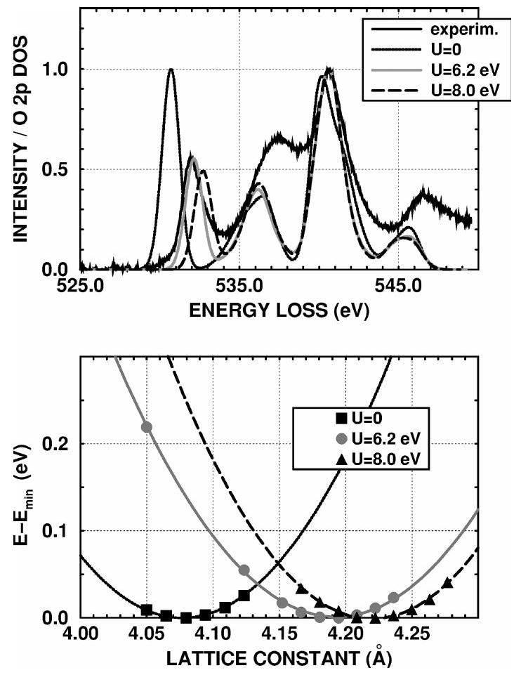
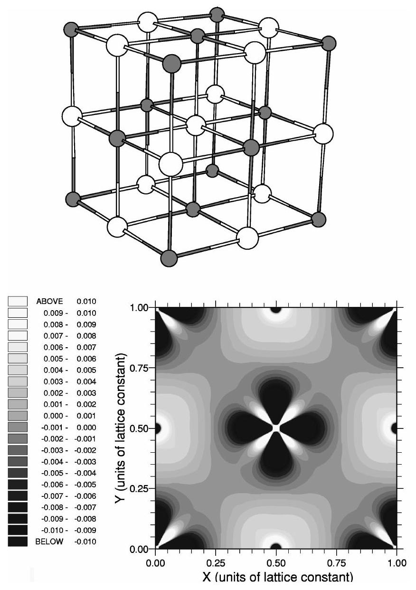

# Electron-energy-loss spectra and the structural stability of nickel oxide: An LSDA+U study 

S. L. Dudarev Department of Materials, University of Oxford, Parks Road, Oxford OX1 3PH, United Kingdom G. A. Botton Department of Materials Science and Metallurgy, University of Cambridge, Pembroke Street, Cambridge CB2 3QZ, United Kingdom S. Y. Savrasov Max-Planck-Institut für Festköperforschung, Heisenbergstrasse 1, D-70569 Stuttgart, Germany C. J. Humphreys Department of Materials Science and Metallurgy, University of Cambridge, Pembroke Street, Cambridge CB2 3QZ, United Kingdom A. P. Sutton Department of Materials, University of Oxford, Parks Road, Oxford OX1 3PH, United Kingdom

(Received 23 June 1997)

#### Abstract

We demonstrate how by taking better account of electron correlations in the $3 d$ shell of metal ions in nickel oxide it is possible to improve the description of both electron energy loss spectra and parameters characterizing the structural stability of the material compared with local spin density functional theory. [S0163-1829(98)05903-7]

## I. INTRODUCTION

In recent years substantial progress has been achieved in the development of accurate $a b$ initio approaches to calculating the physical properties of various compounds, and in some cases it is now easier to predict the structure of a new material theoretically than to make it in a laboratory. ${ }^{1}$ For many metals, semiconductors and insulators the local spin density approximation (LSDA) to the density functional theory (DFT) is known to provide a reliable variational description of the ground state of the electronic structure of the solid. ${ }^{2,3}$ At the same time there are cases where applications of the DFT-LSDA have been far less successful. In particular, difficulties arise when a conventional DFT-LSDA approach is applied to the treatment of the electronic structure of the material where some of the ions contain partly filled valence $d$ or $f$ shells. It was shown by Terakura et al. ${ }^{4}$ that for many of the transition metal oxides the DFT-LSDA predicts metallic ground states instead of experimentally observed insulating ones. If antiferromagnetic order is taken into account, the DFT-LSDA treatment may lead to an insulating state but the forbidden gap still turns out to be an order of magnitude smaller than that observed using electron spectroscopy. ${ }^{5}$ The origin of the failure of the DFT-LSDA in transition metal oxides is known to be associated with an inadequate description of the strong Coulomb repulsion between $3 d$ electrons localized on metal ions. ${ }^{6}$ Uranium dioxide represents a similar example of a compound where uranium ions contain partly filled $f$ shells and where all of the known LSDA solutions favor metallic conductivity. ${ }^{7}$ Experimentally $\mathrm{UO}_{2}$ is known to be a good insulator, ${ }^{8}$ and to explain the origin of the insulating ground state, it is necessary to go beyond the LSDA. ${ }^{9}$ In addition to making incorrect predictions regarding the nature of the ground state of tran-
sition metal and actinide oxides quoted above, the DFTLSDA systematically underestimates their equilibrium lattice constants ${ }^{10}$ and overestimates binding energies, raising questions about the applicability of this approach to making predictions about equilibrium configurations of surface and defect structures.

The rapid progress of experimental scanning tunneling microscope (STM) techniques has already made possible the observation of atoms and individual defects on insulating transition metal oxide surfaces. ${ }^{11,12}$ These new experimental data require the development of an approach that does not suffer from the inadequacies of the DFT-LSDA. In order to describe surface structures and corresponding scanning tunneling images, it is necessary to be able to calculate total energies as well as certain spectroscopical quantities, for example, the spectrum of one-electron excitations of the material. Below we address this question and, by using nickel oxide as an example, show how it can be answered within the framework of a recently proposed computational approach bridging the DFT-LSDA with the unrestricted Hartree-Fock (UHF) approximation (the LSDA +U method ${ }^{13-15}$ ). All the numerical results presented in this paper have been obtained using a full-potential linear muffintin orbital (LMTO) ${ }^{16}$ implementation of the LSDA +U approach.

We have calculated the density of oxygen $2 p$ states and compared the results with the near-edge structure of the oxygen $K$-loss spectrum of nickel oxide observed in a transmission electron microscope. We have also applied the LSDA + U method to evaluate the total energy of crystalline nickel oxide. We have found that by using the same value of the effective Hubbard $U$ characterizing on-site Coulomb repulsion between 3d electrons, it is possible to give a reasonbly good description of the measured electron energy loss
spectra and values of the lattice constant, cohesive energy and elastic moduli. We have therefore demonstrated that a detailed simulation of energy loss spectra can provide useful information about bonding in transition metal oxides and that the structure of these spectra can be related to the ground state properties of the material.

## II. LSDA+U FUNCTIONAL AND THE TOTAL ENERGY

The main feature distinguishing transition metal oxides from more conventional oxides like MgO or $\mathrm{TiO}_{2}$ is that in the former case ions of metal contain partly filled $d$ shells. Since the strength of the effective on-site Coulomb interaction between $d$ electrons (characterized by the Hubbard $U$ ) is comparable with the valence bandwidth, ${ }^{6}$ the processes associated with electron transfer between two metal ions or resulting from addition or removal of $d$ electrons give rise to large fluctuations of the energy of the system, leading to the localization of carriers and to the formation of band gaps. ${ }^{17}$

The method which is commonly used to estimate the size of the band gap in the spectrum of one-electron excitations of the Hubbard model, with one $s$ state per site, is based on the UHF approximation. ${ }^{18}$ The term describing on-site repulsion between electrons, $U \hat{n}_{\sigma} \hat{n}_{-\sigma}$, is approximated by $U \hat{n}_{\sigma} n_{-\sigma}$, where $\hat{n}_{\sigma}=\hat{a}_{\sigma}^{\dagger} \hat{a}_{\sigma}$ is the operator for the number of electrons occupying a particular site and $n_{\sigma}$ is its expectation value. The UHF ground state of the three-dimensional simple cubic Hubbard model is antiferromagnetic and insulating, the magnetic planes being parallel to the (111) plane. ${ }^{18}$

At a more realistic level, to describe $3 d$ electrons localized on nickel sites in NiO we take into account the orbital degeneracy of the $3 d$ shell and use a model Hamiltonian of the form ${ }^{20}$

$$
\hat{H}=\frac{\bar{U}}{2} \sum_{m, m^{\prime}, \sigma} \hat{n}_{m, \sigma} \hat{n}_{m^{\prime},-\sigma}+\frac{(\bar{U}-\bar{J})}{2} \sum_{m \neq m^{\prime}, \sigma} \hat{n}_{m, \sigma} \hat{n}_{m^{\prime}, \sigma},
$$

where the summation is performed over projections of the orbital momentum ( $m, m^{\prime}=-2,-1, \ldots, 2$ in the case of $d$ electrons) and $\bar{U}$ and $\bar{J}$ are the spherically averaged matrix elements of the screened Coulomb electron-electron interaction. For an integer number of $d$ electrons the expectation value of $\hat{H}$ equals ${ }^{14}$

$$
\begin{aligned}
\left.\left\langle\text { integer } N_{\sigma}\right| \hat{H} \mid \text { integer } N_{\sigma}\right\rangle= & \frac{\bar{U}}{2} \sum_{\sigma} N_{\sigma} N_{-\sigma} \\
& +\frac{(\overline{U-} \overline{J)}}{2} \sum_{\sigma} N_{\sigma}\left(N_{\sigma}-1\right),
\end{aligned}
$$

where $N_{\sigma}$ is the total number of $d$ electrons with a given projection of spin $\sigma$. For a noninteger occupation number, corresponding to an ion embedded in a larger system with which it can exchange electrons, the expectation value of $\hat{H}$ is given by the UHF expression

$$
\begin{aligned}
& \left.\left\langle\text { noninteger } N_{\sigma}\right| \hat{H} \mid \text { noninteger } N_{\sigma}\right\rangle_{\mathrm{UHF}} \\
& \quad=\frac{\bar{U}}{2} \sum_{\sigma, m, m^{\prime}} n_{m, \sigma} n_{m^{\prime},-\sigma}+\frac{(\bar{U}-\bar{J})}{2} \sum_{\sigma, m \neq m^{\prime}} n_{m, \sigma} n_{m^{\prime}, \sigma}
\end{aligned}
$$

where $n_{m, \sigma}$ is the occupation number of the $m$ th $d$ state. Since for a localized shell it is the total number of electrons which enters the proof of the Hohenberg-Kohn theorem for a slowly varying external field, ${ }^{19}$ we follow Refs. 13-15 and conjecture that Eq. (2) represents the correct form of the density functional for the Hamiltonian of the form (1). Subtracting Eq. (2) from Eq. (3), we arrive at the LSDA +U functional

$$
E_{\mathrm{LSDA}+\mathrm{U}}=E_{\mathrm{LSDA}}+\frac{(\bar{U}-\bar{J})}{2} \sum_{\sigma}\left(n_{m, \sigma}-n_{m, \sigma}^{2}\right)
$$

where we expressed the total number of electrons, $N_{\sigma}$, as $N_{\sigma}=\Sigma_{m} n_{m, \sigma}$. It is a simple matter to see how Eq. (4) can be written in a form which is invariant with respect to a unitary transformation of orbitals. Indeed, by noticing that the required matrix construction should be diagonal in the spherical harmonics representation, we arrive at

$$
\begin{aligned}
E_{\mathrm{LSDA}+\mathrm{U}}= & E_{\mathrm{LSDA}}+\frac{(\overline{U-} \bar{J})}{2} \sum_{\sigma}\left[\operatorname{Tr} \rho^{\sigma}-\operatorname{Tr}\left(\rho^{\sigma} \rho^{\sigma}\right)\right] \\
= & E_{\mathrm{LSDA}}+\frac{(\overline{U-} \bar{J})}{2} \sum_{\sigma}\left[\left(\sum_{j} \rho_{j j}^{\sigma}\right)\right. \\
& \left.-\left(\sum_{j, l} \rho_{j l}^{\sigma} \rho_{l j}^{\sigma}\right)\right],
\end{aligned}
$$

and where $\rho_{j l}^{\sigma}$ is the density matrix of $d$ electrons. For an individual ion this density matrix is diagonal in the $m, m^{\prime}$ representation and its eigenvalues equal $n_{m, \sigma}$. Equation (5) bridges the orbital-dependent formulation by Anisimov et al. [see Eq. (13) from Ref. 21] with the rotationally invariant functional proposed by Liechtenstein et al. [see Eq. (3) from Ref. 15], retaining the simplicity of the first and the covariant character of the second. Since Eqs. (3) and (2) compensate each other exactly in the limit of integer occupation numbers, the second term on the right-hand side of Eq. (5) vanishes in that limit and this makes Eq. (5) suitable for evaluating the cohesive energy of the solid.

The matrix of the one-electron potential is given by the derivative of Eq. (5) with respect to $\rho_{l j}^{\sigma}$,

$$
V_{j l}^{\sigma} \equiv \frac{\delta E_{\mathrm{LSDA}+\mathrm{U}}}{\delta \rho_{l j}^{\sigma}}=\frac{\delta E_{\mathrm{LSDA}}}{\delta \rho_{l j}^{\sigma}}+(\bar{U}-\bar{J})\left[\frac{1}{2} \delta_{j l}-\rho_{j l}^{\sigma}\right]
$$

and the total energy is expressed in terms of the Kohn-Sham eigenvalues $\left\{\epsilon_{i}\right\}$ as

$$
E_{\mathrm{LSDA}+\mathrm{U}}=E_{\mathrm{LSDA}}\left[\left\{\epsilon_{i}\right\}\right]+\frac{(\bar{U}-\bar{J})}{2} \sum_{l, j, \sigma} \rho_{l j}^{\sigma} \rho_{j l}^{\sigma}
$$

where the last term represents the double counting correction. ${ }^{2}$ Below we apply Eqs. (6) and (7) to calculate the spectrum of one-electron excitations and the structural stability of nickel oxide.

FIG. 1. Top: normalized experimental electron energy loss spectrum corresponding to the vicinity of the oxygen $K$ edge and normalized oxygen $2 p$ DOS calculated by using the LSDA and LSDA +U . The energy scale of the DOS is shifted upwards by 528.3 eV . Bottom: the total energy of crystalline nickel oxide (per NiO unit) calculated using the LSDA and LSDA +U for two values of $\bar{U}$ and plotted as a function of the lattice constant.

## III. EXPERIMENTAL EELS SPECTRA AND COMPARISON WITH LSDA+U RESULTS

The specimens for the electron energy loss spectroscopy (EELS) experiments were prepared by crushing the NiO crystals in pure ethanol and subsequently drying the dispersion onto a lacey carbon film deposited on a transmission electron microscope (TEM) Cu grid. The EELS measurements were carried out on a dedicated scanning transmission electron microscope equipped with a Gatan Imaging Filter (UHV GIF model 678). The system uses a cold field emission gun enabling an energy resolution of about $0.4-0.5 \mathrm{eV}$ to be obtained (as measured at the full width at half maximum of the zero loss peak). Spectra obtained from single grains of the powder were background subtracted and corrected for gain variation of the detector as described in Ref. 22. The near-edge structure of the $\mathrm{O} K$ spectrum obtained in such a way (solid line in Fig. 1) represents the transitions from the occupied O 1s core levels to the conduction band states. Due to dipole selection rules and the necessary overlap of the initial and final states for the transition to be observed (i.e., nonzero transition matrix elements), the final states probed are of $p$ symmetry and at the oxygen sites.

Numerical calculations were performed using the method described above and implemented on the basis of the fullpotential LMTO program described in Ref. 16 and using the Moruzzi-Janak-Williams exchange-correlation potential. The densities of one-particle electron states were calculated using three energy panels and $343 k$ points in the Brillouin zone.

FIG. 2. Top: sodium chloride crystal structure of nickel oxide. Oxygen sites are shown in white; nickel sites are shown in grey. Bottom: the difference between the LSDA +U and LSDA charge density distributions in the (100) plane, $\bar{U}=6.2 \mathrm{eV}$.

Since the structure of the experimental EELS spectrum shown in Fig. 1 is dominated by the dipole-allowed ffilled $1 s\} \rightarrow\{$ empty $2 p\}$ transitions (note that the presence of nonsphericity of the crystal field around oxygen sites in NiO does not alter this conclusion since ${ }^{23}$ the expansion of the nonspherical part of the electron density starts from $l=4$ ), to simulate the experimental spectrum the oxygen $2 p$ density of states (DOS) was broadened with a Gaussian distribution to account for the lifetime of the excited state and the instrumental response of the system (that is, the resolution and the energy spread of the primary electrons). This method has already been successfully applied to simulations of $L$ and $K$ edges in semiconductors ${ }^{24}$ and oxygen $K$ edges in early transition metal oxides. ${ }^{25}$ Figure 1 also shows the DOS of empty oxygen $2 p$ states calculated using a conventional LSDA (i.e., assuming $\overline{U=0}$ ). In agreement with the results of previous LSDA calculations, ${ }^{4}$ the ground state of nickel oxide in the LSDA is antiferromagnetic and insulating, where the 0.6 eV band gap separates two bands of nickel $d$ states. This LSDA result is known to be at odds with experimental data which exhibit a much larger band gap and different ordering of bands. ${ }^{5,13}$ Figure 1 shows that the O $2 p$ DOS spectrum calculated using the LSDA does not agree well with the experimental EELS spectrum. The separation between the two main peaks seen in the LSDA DOS curve is approximately 2

TABLE I. Calculated and experimentally observed values of parameters characterizing the electronic structure and the structural stability of crystalline nickel oxide.
| Quantity vs method | LSDA | $\mathrm{LSDA}+\mathrm{U}, \bar{U}=6.2 \mathrm{eV}$ | Hartree-Fock | Experimental value |
| :--- | :--- | :--- | :--- | :--- |
| Lattice constant (Å) | 4.08 | 4.19 | 4.26 | 4.17 |
| Band gap (eV) | 0.6 | 3.0 | 14.2 | 4.2 |
| Cohesive energy (eV) | 13.74 | 11.60 | 6.2 | 8.26 |
| $B=\left(C_{11}+2 C_{12}\right) / 3(\mathrm{GPa})$ | 230 | 182 | 214 | 145, 205, 189 |
| $C^{\prime}=\left(C_{11}-C_{12}\right) / 2(\mathrm{GPa})$ | 211 | 161 | 136 | 45, 102 |
| $C_{44}(\mathrm{GPa})$ | 49 | 86 | 115 | 110, 105 |

eV larger than the separation between the same peaks in the experimental spectrum, and the spectral weight of the lowenergy peak in the DOS calculated using the LSDA is far too high. The equilibrium lattice constant $a_{\text {LSDA }}=4.08 \AA$, although in better agreement with experiment than the LMTO atomic sphere approximation (ASA) value of $3.98 \AA,^{10}$ is still substantially lower than the experimentally observed one of $4.17 \AA$.

Figure 1 also shows oxygen $2 p$ DOS calculated using the LSDA +U functional (4) for $\bar{U}=6.2 \mathrm{eV}$ and $\bar{U}=8.0 \mathrm{eV}$, and for $\overline{J=0.95 \mathrm{eV} \text {. Values of } \overline{U=} 8.0 \mathrm{eV} \text { and } \overline{J=0.95 \mathrm{eV}} \text { were }}$ suggested by Anisimov and Gunnarsson ${ }^{26}$ on the basis of a constrained LSDA calculation. Since the technique used in Ref. 26 did not take into account the self-screening of $d$ electrons, it is likely that the actual value of $\bar{U}$ is slightly smaller than 8 eV . By analyzing how the separation between the two main peaks in the spectrum of DOS shown in Fig. 1 depends on the value of $\bar{U}$, we concluded that the lower value of $\bar{U}=6.2 \mathrm{eV}$ agrees better with experimental data. For comparison, we mention the empirical value of $\bar{U}=6.7 \mathrm{eV}$ quoted in Ref. 13. The equilibrium lattice constants found using the above values of $\bar{U}$ are $a_{\text {LSDA }+\mathrm{U}}(U=6.2 \mathrm{eV}) =4.19 \AA$ and $a_{\text {LSDA }+\mathrm{U}}(U=8.0 \mathrm{eV})=4.22 \AA$, and both of these values agree with experimental data better than the LSDA result. The LSDA + U band gaps separating filled oxygen $2 p$ and empty nickel $3 d$ bands are, respectively, 3.0 eV and 3.2 eV .

To explain the origin of the effect responsible for the dependence of the lattice constant on Hubbard $\bar{U}$, in Fig. 2 we plotted the difference between charge densities calculated using the LSDA +U and LSDA. The distribution plotted in Fig. 2 shows that on-site Coulomb repulsion between Ni 3d electrons leads to a decrease of charge density in the interstitial regions, decreasing the strength of covalent bonding in the material. This agrees with the findings of Ref. 9. A similar reduction in the covalent contribution to bonding can be deduced from the calculated spectra of the oxygen $K$ edge. The major difference between the LSDA and LSDA +U oxygen $2 p$ DOS is in the low-energy part of the spectrum where the peak is associated with the oxygen $2 p-\mathrm{Ni} 3 d$ band. In the LSDA +U solution this peak has a much lower intensity and it is shifted towards higher energies, leading to a weaker degree of hybridization between oxygen $2 p$ and $\mathrm{Ni} 3 d$ orbitals. Other peaks on the EELS spectrum are associated with hybridization between oxygen $2 p$ and nickel $4 s$ and $4 p$ states, the latter being known to be practically unaffected by

Hubbard correlations in the $3 d$ shell.
To characterize the structural stability of the material, we have calculated the cohesive energy and elastic moduli of NiO . Calculations were performed following the procedure described in Ref. 27, and the resulting numerical values are listed in Table I together with the corresponding experimental data and with $a b$ initio Hartree-Fock values taken from Ref. 28. Results given in Table I show that the LSDA +U values are situated between the LSDA and Hartree-Fock results. There is reasonable agreement between the LSDA+U values of the lattice constant, band gap, cohesive energy, and experimental values. Comparison with experimental data for the elastic constants is more difficult owing to the larger spread of experimental values. Since the experimental spectrum shown in Fig. 1 is reasonably well reproduced by the $\mathrm{LSDA}+\mathrm{U}$ calculation, we conclude that the $\mathrm{LSDA}+\mathrm{U}$ method gives an adequate description of both the spectroscopical quantities and structural properties of nickel oxide. This method may therefore be considered a suitable computational technique for $a b$ initio studies of surfaces and defect structures in this material.

## IV. CONCLUSIONS

We have reported results of an application of the LSDA + U method to the calculation of the one-particle densities of states and the total energy of crystalline nickel oxide. We have found that by using a combined DFT-LSDA and UHF description of one-electron states it is possible to achieve reasonable agreement between the calculated and the experimentally measured electron energy loss spectra, and at the same time to evaluate parameters characterizing the structural stability of the material. We believe that the reported findings open the way towards carrying out more accurate $a b$ initio studies of surfaces and defects in transition metal oxides.

## ACKNOWLEDGMENTS

We are grateful to Dr. M. R. Castell, Dr. A. I. Liechtenstein, Dr. S. Kenny, Dr. D. T. Goddard, and Dr. G. A. D. Briggs for stimulating discussions. Computations were performed in the Materials Modelling Laboratory of the Department of Materials at the University of Oxford. Financial support from British Nuclear Fuels plc (BNFL) is gratefully acknowledged.
${ }^{1}$ D. G. Pettifor, Bonding and Structure of Molecules and Solids (Clarendon Press, Oxford, 1995).
${ }^{2}$ R. G. Parr and W. Yang, Density Functional Theory of Atoms and Molecules (Oxford University Press, New York, 1989).
${ }^{3}$ A. P. Sutton, Electronic Structure of Materials (Clarendon Press, Oxford, 1992), pp. 204-214.
${ }^{4}$ K. Terakura, T. Oguchi, A. R. Williams, and J. Kübler, Phys. Rev. Lett. 52, 1830 (1984); Phys. Rev. B 30, 4734 (1984).
${ }^{5}$ G. A. Sawatzky and J. W. Allen, Phys. Rev. Lett. 53, 2339 (1984).
${ }^{6}$ S. Hüfner, Adv. Phys. 43, 183 (1994).
${ }^{7}$ T. Petit, B. Morel, C. Lemaignan, A. Pasturel, and B. Bigot, Philos. Mag. B 73, 893 (1996).
${ }^{8}$ M. R. Castell, C. Muggelberg, G. A. D. Briggs, and D. Goddard, J. Vac. Sci. Technol. B 14, 966 (1996).
${ }^{9}$ S. L. Dudarev, D. Nguyen Manh, and A. P. Sutton, Philos. Mag. B 75, 613 (1997).
${ }^{10}$ O. K. Andersen, H. L. Skriver, H. Nohl, and B. Johansson, Pure Appl. Chem. 52, 93 (1980).
${ }^{11}$ M. R. Castell, P. L. Wincott, N. G. Condon, C. Muggelberg, G. Thornton, S. L. Dudarev, A. P. Sutton, and G. A. D. Briggs, Phys. Rev. B 55, 7859 (1997).
${ }^{12}$ S. L. Dudarev, A. I. Liechtenstein, M. R. Castell, G. A. D. Briggs, and A. P. Sutton, Phys. Rev. B 56, 4900 (1997).
${ }^{13}$ V. I. Anisimov, J. Zaanen, and O. K. Andersen, Phys. Rev. B 44, 943 (1991).
${ }^{14}$ I. V. Solovyev, P. H. Dederichs, and V. I. Anisimov, Phys. Rev. B 50, 16861 (1994).
${ }^{15}$ A. I. Liechtenstein, V. I. Anisimov, and J. Zaanen, Phys. Rev. B 52, R5467 (1995).
${ }^{16}$ S. Y. Savrasov, Phys. Rev. B 54, 16470 (1996).
${ }^{17}$ N. F. Mott, Metal-Insulator Transitions (Taylor \& Francis, London, 1974).
${ }^{18}$ E. Fradkin, Field Theories of Condensed Matter Systems (Addison-Wesley, Reading, MA, 1991), Chap. 2.
${ }^{19}$ The relevant part of the Hohenberg-Kohn functional has the form $e \int d \mathbf{r} \phi(\mathbf{r}) n_{\sigma}(\mathbf{r})$ and for a localized orbital centered at the origin it can be approximated by $e \phi(0) \int d \mathbf{r} n_{\sigma}(\mathbf{r})=e \phi(0) N_{\sigma}$.
${ }^{20}$ A. Kotani and T. Yamazaki, Prog. Theor. Phys. Suppl. 108, 117 (1992).
${ }^{21}$ V. I. Anisimov, I. V. Solovyev, M. A. Korotin, M. T. Czyzyk, and G. A. Sawatzky, Phys. Rev. B 48, 16929 (1993).
${ }^{22}$ G. A. Botton, G. Y. Guo, W. M. Temmerman, and C. J. Humphreys, Phys. Rev. B 54, 1682 (1996).
${ }^{23}$ S. Sugano, Y. Tanabe, and H. Kamimura, Multiplets of Transition-Metal Ions in Crystals (Academic Press, New York, 1970).
${ }^{24}$ X. Weng, P. Rez, and O. F. Sankey, Phys. Rev. B 40, 5694 (1989).
${ }^{25}$ F. M. F. de Groot, J. Faber, J. J. M. Michiels, M. T. Czyzyk, M. Abbate, and J. C. Fuggle, Phys. Rev. B 48, 2074 (1993).
${ }^{26}$ V. I. Anisimov and O. Gunnarsson, Phys. Rev. B 43, 7570 (1991).
${ }^{27}$ D. M. Sherman, J. Geophys. Res. 98, 19795 (1993).
${ }^{28}$ M. D. Towler, N. L. Allan, N. M. Harrison, V. R. Saunders, W. C. Mackrodt, and E. Apra, Phys. Rev. B 50, 5041 (1994).

