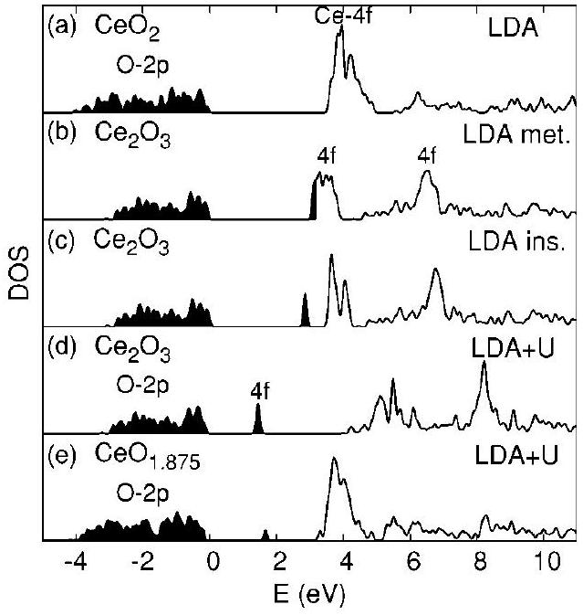

# Taming multiple valency with density functionals: A case study of defective ceria 

Stefano Fabris, ${ }^{1}$ Stefano de Gironcoli, ${ }^{1}$ Stefano Baroni, ${ }^{1}$ Gianpaolo Vicario, ${ }^{2}$ and Gabriele Balducci ${ }^{2}$ ${ }^{1}$ SISSA and INFM DEMOCRITOS National Simulation Center, Via Beirut 2-4, I-34014 Trieste, Italy ${ }^{2}$ Chemistry Department and Center of Excellence for Nanostructured Materials, Università di Trieste, Via Giorgieri 1, 34127 Trieste, Italy

(Received 15 July 2004; published 14 January 2005)

#### Abstract

Modeling multiple-valence compounds using density-functional theory has long been considered a formidable task due to the role that strong electronic correlations play in these systems. We show that, in the case of defective ceria, the main effect of these correlations is to produce a multitude of metastable low-energy states among which the one displaying the correct valence of cerium is the most stable. This ground state may be difficult to access in practice and it has in fact so far escaped a proper identification. The introduction of a Hubbard- $U$ term in the energy functional stabilizes the physical ground state and makes it easily accessible to routine calculations. When this contribution is defined in terms of maximally localized Wannier functions, the calculated energies and structural properties are independent of the value of the parameter $U$.

DOI: 10.1103/PhysRevB.71.041102
PACS number(s): 71.15.Mb, 61.72.Ji, 82.47.Ed

The properties of many technologically relevant materials are determined by the ability of their atomic constituents to display multiple oxidation states-and hence a different chemical behavior-depending on the local microscopic environment. A representative example is given by ceria-based materials which are key components of many advanced catalysts used to produce hydrogen and to reduce air pollution. Besides providing a resistant support for chemically active noble metals, ceria-based substrates take an active role in the catalytic reaction by controlling the oxygen partial pressure at the reaction sites, acting effectively as oxygen reservoirs. There is ample evidence that this property is controlled by the chemistry of oxygen vacancies which are neutralized by the valence change $\mathrm{Ce}^{4+} \rightarrow \mathrm{Ce}^{3+}$ of two cations (substitutional $\mathrm{Ce}_{\mathrm{Ce}}^{\prime}$ defects). ${ }^{1}$ Our current understanding of this phenomenon relies on the quasidegeneracy of different ionic configurations in which a highly localized $4 f$-electron state is occupied or empty. The importance of electronic correlations related with quasidegeneracy and accompanying the $f$-electron localization process has lead to the widespread belief that conventional density-functional theory (DFT) techniques based on the local-density approximation (LDA) or generalized-gradient approximation (GGA) would be unable to cope with these systems. For instance, the modeling of the $\alpha \leftrightarrow \gamma$ transition in metallic Ce requires sophisticated variants of the DFT method, such as, e.g., self-interaction-corrected-DFT (Ref. 2) and DFT-dynamical-mean-field theory. ${ }^{3}$ This belief is supported by the current literature on ceria ${ }^{4-9}$ which suggests that conventional DFT techniques fail to provide a unified description of ceria compounds ( $\mathrm{CeO}_{2}, \mathrm{CeO}_{2-x}, \mathrm{Ce}_{2} \mathrm{O}_{3}$ ). We believe that this conclusion is to some extent misleading. The purpose of this paper is twofold. We first show that the propensity of cerium to display multiple oxidation states determines the existence of a number of DFT configurations that are stable at the LDA or GGA level, and which had not been identified so far. These configurations also comprise those which display the correct oxidation state of cerium and which are in fact predicted to be the most stable. The energy differences between different
metastable configurations are so small-and the barriers separating them so important-that self-consistent field (SCF) calculations starting near an unphysical solution tend to converge to it, so that the very existence of other solutions had gone so far unnoticed. We then show that the addition of a Hubbard- $U$ term in the LDA (or GGA) energy functional substantially enhances the stability of the physical solution, thus allowing SCF calculations to proceed straight to it. Moreover, when the Hubbard- $U$ contribution is defined in terms of maximally localized Wannier functions, the energy of the stable configuration is independent of $U$ and therefore coincides with the LDA/GGA values.

Pure cerium oxide has two stable stoichiometries: the cubic fluorite-type $\mathrm{CeO}_{\underline{2}}(F m 3 m)$ and the hexagonal sesquioxide $A$-type $\mathrm{Ce}_{2} \mathrm{O}_{3}(P 3 m 1)$. These compounds represent the oxidation and reduction extremes in which all the Ce ions are nominally in the $4+$ and $3+$ oxidation states, respectively. In the former, all valence Ce states are empty, while in the latter one electron per cation occupies the Ce $4 f$-like band (which is empty in $\mathrm{CeO}_{2}$ ). In terms of the electronic structure, partially reduced ceria $\mathrm{CeO}_{2-x}$ is simply an intermediate case: ${ }^{10}$ the presence of oxygen vacancies induces the condensation of the compensating electrons into the empty $4 f$ states of neighboring Ce atoms, thus driving the $\mathrm{Ce}^{4+} \rightarrow \mathrm{Ce}^{3+}$ reduction. Electronic correlation, due to the strong localization of these states in reduced cerias, $\mathrm{Ce}_{2} \mathrm{O}_{3}$ and $\mathrm{CeO}_{2-x}$, have the effect of splitting the Ce- $4 f$ band upon occupation, resulting in a fully occupied gap state experimentally ${ }^{10-12}$ detected to be $1.2-1.5 \mathrm{eV}$ above the top of the valence band. The electron population of this state is directly correlated to the number of $\mathrm{Ce}^{3+}$ ions, and is experimentally employed as an estimator of the concentration of oxygen vacancies. ${ }^{12}$

Existing first-principles calculations ${ }^{4-9}$ adopt either one of the following two assumptions, which are individually appropriate to different oxidation states of Ce , but conflicting with one another: (i) in the core-state model (CSM) Ce- $4 f$ states are treated as part of the core, and therefore their contribution to the bonding process is totally neglected; ${ }^{4,6}$ (ii) the valence-band model (VBM), instead, treats Ce $4 f$ elec-

TABLE I. Calculated structural properties of bulk $\mathrm{CeO}_{2}$ and $\mathrm{Ce}_{2} \mathrm{O}_{3}$ compared with previous theoretical values in the valenceband and core-state models (VBM and CSM), and with experimental measurements.
|  | $\mathrm{CeO}_{2}$ |  | $\mathrm{Ce}_{2} \mathrm{O}_{3}$ |  |
| :--- | :--- | :--- | :--- | :--- |
|  | $a_{0}(\AA)$ | B (GPa) | $a_{0}(\AA)$ | $B$ (GPa) |
| LDA CSM ${ }^{\mathrm{a}}$ | 5.56 | 144.9 | 3.89 | 165.8 |
| LDA VBM ${ }^{\mathrm{a}}$ | 5.39 | 214.7 | 3.72 | 208.6 |
| LDA VBM ${ }^{\mathrm{b}}$ | 5.38 | 210.7 | 3.84 | 150.9 |
| Expt. | 5.41 | 204-236 | 3.88 | … |
| GGA CSM ${ }^{\mathrm{a}}$ | 5.69 | 128.8 | 3.97 | 145.3 |
| GGA VBM ${ }^{\mathrm{a}}$ | 5.48 | 187.7 | 3.81 | 131.8 |
| GGA VBM ${ }^{\text {b }}$ | 5.48 | 178.0 | 3.94 | 131.3 |

${ }^{\mathrm{a}}$ Reference 4.
${ }^{\mathrm{b}}$ This work.
trons explicitly as valence electrons which are therefore allowed to contribute to the chemical bond. ${ }^{4,7-9}$ The former approach provides good structural properties for $\mathrm{Ce}_{2} \mathrm{O}_{3}$ but not for $\mathrm{CeO}_{2}$ (see Table I), and it describes the oxide as an insulator by construction. Most importantly its predictive power is limited: the distribution of $\mathrm{Ce}^{4+}$ or $\mathrm{Ce}^{3+}$ ions has to be assumed as an input of the calculation. On the opposite side, the VBM leads to good structural properties for $\mathrm{CeO}_{2}$ but not for $\mathrm{Ce}_{2} \mathrm{O}_{3}$ (Table I), and describes this latter structure as a metal. In fact, the VBM does not predict the gap state experimentally observed in partially reduced ceria $\mathrm{CeO}_{2-x}$, therefore failing to correctly capture the electronic localization on the Ce- $4 f$ states, which is at the basis of the oxygenstorage mechanism.

In this work we reconsider this problem in the light of different $a b$ initio DFT calculations performed either at the LDA or at the GGA levels ${ }^{13}$ (the latter in the Perdew-BurkeErnzerhof flavor ${ }^{16}$ ).

The simulation of $\mathrm{CeO}_{2}$ is a standard and straightforward problem. The LDA density of electronic states (DOS) is displayed in Fig. 1(a). Occupied states are indicated by shaded areas, and the zero energy is set at the top of the upper valence band (with prevalent $\mathrm{O}-2 p$ character). The sharp band centered at 4 eV is formed by fairly localized atomiclike Ce- $4 f$ empty orbitals. The onset of the conduction band is 5.6 eV above the highest occupied state ( 5.7 eV in GGA), to be compared with the measured ${ }^{17}$ gap of 6.0 eV (following Ref. 17 we do not consider the Ce- $4 f$ manifold as conduction states). On the opposite, calculations involving Ce atoms in the formal valency $3+$ are much more subtle. Let us start with $\mathrm{Ce}_{2} \mathrm{O}_{3}$ : in agreement with previous analysis, we find that a metallic antiferromagnetic state is (meta) stable at the LDA level. The corresponding DOS is displayed in Fig. 1(b). Ce-4 $f$ states form a unique, partially occupied band. A projection on Ce-4 $f$ states reveals that one electron is evenly distributed among three orbitals centered on each Ce atom. A careful electronic minimization, performed by doing several SCF calculations starting from different initial conditions, reveals that this state is not the ground state. In fact, an electronic configuration resulting from the occupation of one

FIG. 1. Density of electronic states for pure $\mathrm{CeO}_{2}$ (a) and $\mathrm{Ce}_{2} \mathrm{O}_{3}$ [(b)-(d)] bulk phases, and for defective (e) ceria structures $\mathrm{CeO}_{1.875}$. Occupied states are indicated as shaded areas, and the zero energy is set to the top of the valence band.

$4 f$ state per Ce (a linear combination of the $f_{z^{3}}$ and $f_{-y\left(y^{2}-3 x^{2}\right)}$ orbitals), results to be insulating and $0.36 \mathrm{eV} / \mathrm{Ce}_{2} \mathrm{O}_{3}$ lower in energy. The corresponding DOS is shown in Fig. 1(c). This ground state displays a gap in the $4 f$ band, correctly reproducing the experimentally observed gap state and the magnetic moment of $2.29 \mu_{B}$ /mole (the experimental ${ }^{18}$ value is $2.17 \mu_{B} /$ mole ). The integrated charge of the gap state is exactly 2 (one electron per $\mathrm{Ce}^{3+}$ atom). Metallic and insulating ferromagnetic solutions are also stable, 0.13 and $0.03 \mathrm{eV} / \mathrm{Ce}_{2} \mathrm{O}_{3}$ above the insulating antiferromagnetic ground state, respectively. GGA calculations display a similar abundance of local minima, the ground state being insulating and antiferromagnetic, essentially degenerate with the insulating ferromagnetic solution. The metallic local minima are 1.1 (ferromagnetic) and 0.99 (antiferromagnetic) eV/ $\mathrm{Ce}_{2} \mathrm{O}_{3}$ higher in energy. The addition of a Hubbard- $U$ term to the LDA (or GGA) energy functional removes this quasidegeneracy and stabilizes electronic-structure calculations towards the physical solution, thus providing an effective way for coping with these systems.

The LDA $+U$ energy functional reads

$$
E_{L D A+U}=E_{L D A}+\frac{U}{2} \sum_{I} \operatorname{Tr}\left[\mathbf{n}^{I}\left(\mathbf{1}-\mathbf{n}^{I}\right)\right],
$$

where $\mathbf{n}^{I}$ 's are $M \times M$ matrices ( $M$ being the degeneracy of the localized atomic orbital, $M=14$ in the case of $f$ orbitals), and projections of the one-electron density matrix $\hat{\rho}$ over the $f$ manifold localized at lattice site $I,\left\{\phi_{m \sigma}^{I}\right\}$ :

$$
\left\langle\phi_{m \sigma}^{I}\right| \hat{\rho}\left|\phi_{m^{\prime} \sigma^{\prime}}^{I}\right\rangle=n_{m m^{\prime}}^{I \sigma} \delta_{\sigma \sigma^{\prime}} .
$$

The second term in Eq. (1), which we call $E_{U}$, is positive definite for $U>0$ because the eigenvalues of the $\mathbf{n}^{I}$ matrices-i.e., the occupation numbers of the $f$ orbitals-lay in the range $[0,1]$. Note that, as soon as $U$ is large enough to open a gap between occupied and unoccupied $f$ states, the
effect of $E_{U}$ is to favor the $f$ occupation numbers to be close to either 0 or 1 . At these extremes, $E_{U}$ strictly vanishes and the total energy is back to the LDA (or GGA) value. In any actual implementation of the LDA $+U$ energy functionals, Eq. (1), the values of the $\mathbf{n}^{I}$ matrices depend on the choice of the localized orbitals, $\left\{\phi_{m \sigma}^{I}\right\}$, which define them through Eq. (2). Suppose, for instance, that we identify the $\phi$ 's with atomic $\mathrm{Ce}-4 f$ orbitals, as it is done in any straightforward implementation of the LDA+U method. This choice would lead to an unphysical situation where Ce- $4 f$ occupancies are nonzero even in $\mathrm{CeO}_{2}$, where the nominal valence of all the Ce atoms is $4+$. This apparent paradox is simply due to the fact that $\mathrm{O}-2 p$ orbitals (which are filled in $\mathrm{CeO}_{2}$ ) are not orthogonal to neighboring Ce- $4 f$ states. We have found that this spurious occupancy of Ce- $4 f$ orbitals results in a deterioration of the overall accuracy of the DFT functional, particularly so for the structural parameters and the energies, which strongly depend on the value of the parameter $U$.

In order to remove both the indetermination in the definition of the localized $4 f$-like orbitals and their spurious (and ill-defined) occupancy, we have decided to identify the $\phi$ 's in Eq. (2) with the maximally localized Wannier functions (MLWF's) (Ref. 19) resulting from the $\mathrm{Ce}-4 f$ band. In practice, we have computed MLWF's using a simple procedure which takes into account the fact that in the present case they are very close to the known Ce- $4 f$ orbitals, and can thus be obtained by a subspace alignment procedure. ${ }^{20}$ The corresponding projector yields a vanishing Hubbard energy correction $E_{U}$ in case of completely filled or empty states, resulting in energies which are independent of $U$. The Hubbard- $U$ parameter was calculated after the formulation of Cococcioni and de Gironcoli. ${ }^{21}$ It was estimated to be in the range $2.5-3.5 \mathrm{eV}$ for LDA and $1.5-2 \mathrm{eV}$ for GGA: in the calculations we used the values $U_{\mathrm{LDA}}=3 \mathrm{eV}$ and $U_{\mathrm{GGA}} =1.5 \mathrm{eV}$.

By applying this LDA $+U$ approach, the metallic solutions are strongly disfavored with respect to the insulating antiferromagnetic electronic configuration. The resulting groundstate DOS is displayed in Fig. 1(d). Note that it is the same insulating ground state predicted by the LDA calculation. As a byproduct, the Hubbard term also shifts the gap state to lower energies resulting in a band-structure closer to the experiments (gap state at $1.2-1.5 \mathrm{eV}$ above the top of the valence band). Similarly, the GGA+ $U$ calculations result in the corresponding insulating GGA ground state.

An analysis of the structural parameters (Table I) shows that, when the most stable insulating antiferromagnetic solutions (stabilized by the Hubbard term) are considered, traditional LDA and GGA calculations do capture the structural properties of both $\mathrm{CeO}_{2}$ and $\mathrm{Ce}_{2} \mathrm{O}_{3}$. The self-consistent MLWF projector yields results that do not depend on the actual value of $U$, so the $\mathrm{LDA}+U$ and GGA $+U$ structural parameters are identical to the corresponding LDA and GGA ones. On the contrary, a standard implementation of the $\mathrm{LDA}+U$ method based on atomic orbitals leads to structural parameters which depend linearly on $U$ : for example, $a_{0}$ and $B$ of both $\mathrm{CeO}_{2}$ and $\mathrm{Ce}_{2} \mathrm{O}_{3}$ change by $0.03 \AA$ and 1 GPa , respectively, when $U$ varies from 0 to 3 eV in LDA and from 0 to 1.5 eV in GGA. For $\mathrm{CeO}_{2}$, our VBM results (GGA and LDA) are very close to the corresponding VBM ones re-
ported in Ref. 4 (Table I), but differ from the CSM ones. This is because the CSM results for $\mathrm{CeO}_{2}$ were obtained by forcing the Ce atoms to be in a trivalent state, hence far from the more physical description given by the VBM (i.e., Ce in the formal oxidation state $4+$ ). On the contrary, the CSM trivalent state for Ce is a very good approximation for $\mathrm{Ce}_{2} \mathrm{O}_{3}$, thus explaining the success of the CSM for this particular compound. For $\mathrm{Ce}_{2} \mathrm{O}_{3}$, the difference between our VBM results and those of Ref. 4 is partly due to the different electronic solutions: insulating and metallic correspondingly.

The formation energy of $\mathrm{CeO}_{2}\left[\Delta H_{f}=\mu_{\mathrm{CeO}_{2}}-\mu_{\mathrm{Ce}(s)}\right. -\mu_{\mathrm{O}_{2}(g)}=-11.14 \mathrm{eV}$ (Ref. 22)] is -11.33 eV in LDA and -9.20 eV in GGA. Similarly, for $\mathrm{Ce}_{2} \mathrm{O}_{3}\left[\Delta H_{f}=-18.56 \mathrm{eV}\right.$ (Ref. 22)] it is -18.49 eV in LDA and -16.78 eV in GGA. Thus the resulting energy of the transformation $\mathrm{CeO}_{2} \rightarrow \frac{1}{2} \mathrm{Ce}_{2} \mathrm{O}_{3}+\frac{1}{4} \mathrm{O}_{2}$ is 2.02 eV (LDA) and 0.82 eV (GGA), where the experimental value is $1.97 \mathrm{eV} .^{22}$ Note that the LDA results seem to agree considerably better with experiment than the GGA ones. This deserves serious consideration when simulating chemical reactions on reduced surfaces.

An oxygen vacancy is modeled by removing a neutral oxygen atom from a $\mathrm{CeO}_{2}$ supercell whose size is determined by the concentration of defects. As for the totally reduced $\mathrm{Ce}_{2} \mathrm{O}_{3}$ system, several metastable solutions exist at the LDA/GGA level. In the metallic solution the two excess electrons released in the reduction process result to be evenly distributed among all the four Ce neighbors of the O vacancy. These four atoms have equal $4 f$ occupancy ( $\operatorname{Tr}\left[n_{m m^{\prime}}\right]=0.15$ ), and they relax symmetrically with respect to the vacancy ( $0.18 \AA$ outward, while the six O atoms next nearest neighbors to the vacancy relax inward by $0.15 \AA$ ). The Hubbard- $U$ correction to the energy functional results in a broken-symmetry solution where the two excess electrons localize on two (rather than four) Ce atoms neighboring the vacancy (the ferromagnetic and antiferromagnetic solutions are degenerate). Again, the role of the Hubbard- $U$ term is to drive the calculation directly toward the insulating solution which would be stable also at the LDA or GGA level. The DOS of defective ceria for $x=0.125$ is shown in Fig. 1(e). It displays features which are intermediate between those of the $\mathrm{Ce}_{2} \mathrm{O}_{3}$ and $\mathrm{CeO}_{2}$ structures: the gap state at 1.5 eV (due to occupied $4 f$ states on $\mathrm{Ce}^{3+}$ atoms as in $\mathrm{Ce}_{2} \mathrm{O}_{3}$ ) and the sharp unoccupied $4 f$ band of the $\mathrm{Ce}^{4+}$ atoms at 4 eV . The release of oxygen from the crystal structure has therefore the effect of formally modifying the valency of Ce from $4+$ to $3+$ (the corresponding value of $\operatorname{Tr}\left[n_{m m^{\prime}}\right]$ changes from 0.01 to 0.98 ). This result agrees with the experimental evidence that the compensating defects are $\mathrm{Ce}_{\mathrm{Ce}}^{\prime}$ and suggest their tendency to cluster around the oxygen vacancy. An electronic configuration in which two electrons were initially localized on Ce atoms far from the vacancy led to the same SCF solution described above, with two of the Ce nearest neighbors of the vacancy being formally $\mathrm{Ce}^{3+}$. The neighbors of the vacancy show a complex relaxation pattern which is not centrosymmetric: five O atoms relax inward (four by $0.12 \AA$, one by $0.25 \AA$ ), one O atom outward by less than $0.03 \AA$, and the Ce atoms outward (the $\mathrm{Ce}^{3+}$ by $0.11 \AA$, the $\mathrm{Ce}^{4+}$ by $0.17 \AA$ ). All other atoms in the largest supercell relax by less than $0.05 \AA$. As noticed for ceria surfaces ${ }^{8}$ the relaxed structure is rela-
tively insensitive to the details of the functionals, LDA or GGA.

The calculation of the heat of reduction per oxygen vacancy depends on the choice of the reference state for the missing O atom. In line with the calculation of the oxide formation energies, we use the chemical potential of molecular oxygen: $\Delta H_{r}=\mu_{\mathrm{CeO}_{(2-x)}}+x / 2 \mu_{\mathrm{O}_{2}(g)}-\mu_{\mathrm{CeO}_{2}}$. The resulting values are $5.05 \mathrm{eV}(\mathrm{LDA}+U)$ and $2.01 \mathrm{eV}(\mathrm{GGA}+U)$. Note that, as in the case of the formation energetics of the bulk oxides, the $\mathrm{LDA}+U$ value seems to be in better agreement with the experiments ( $4.7-5.0 \mathrm{eV}$ from Table 1 in Ref. 23 and references therein) than the GGA+U result. The energetics were converged with respect to the supercell size to less than 0.3 eV . The binding energy of molecular O, contributing to the reference $\mu_{\mathrm{O}_{2}(g)}$, is known to be badly predicted by DFT both in the LDA and the GGA. Another common reference is the energy of the oxygen atom in the triplet state $\mu_{\mathrm{O}}$ compensated by half of the experimental $\mathrm{O}_{2}(g)$ binding energy [5.2 eV (Ref. 22)]. Even with this reference, that partially compensates for known errors, the LDA $+U$ result ( 6.1 eV ) is still closer to the experimental range than the GGA $+U$ one ( 2.7 eV ).

In summary, the multiple-valence character of cerium makes the first-principles simulation of ceria compounds in-
trinsically insidious because of the existence of a large number of competing local energy minima. We have shown that, contrary to the common belief based on previous research, the ground state of these systems as predicted by traditional LDA and GGA calculations does display the correct insulating character and oxidation state of the various Ce atoms. This ground state may be difficult to access in practice. The addition of a Hubbard- $U$ term to the LDA/GGA energy functional enhances the stability of the physical ground state, making it easily accessible to routine DFT calculations. Projection on self-consistent Wannier functions makes the structural parameters and the energetics independent of $U$. The calculated energetics is in overall good agreement with experiments, the LDA results being actually better than the GGA ones. This issue may have important implications when studying chemical reactions on reduced ceria surfaces.

## ACKNOWLEDGMENTS

We wish to thank J. Kaspar for fruitful discussions. The SISSA-CINECA scientific agreement, INFM Progetto Calcolo Parallelo, Regione FVG, INSTM, MIUR-PRIN 2002, and FIRB 2001 (Contract No. RBNE0155X7) are gratefully acknowledged.
${ }^{1}$ Catalysis by Ceria and Related Materials, edited by A. Trovarelli (Imperial College Press, London, 2002).
${ }^{2}$ J. Laegsgaard and A. Svane, Phys. Rev. B 59, 3450 (1999).
${ }^{3}$ K. Held, A. K. McMahan, and R. T. Scalettar, Phys. Rev. Lett. 87, 276404 (2001).
${ }^{4}$ N. V. Skorodumova, R. Ahuja, S. I. Simak, I. A. Abrikosov, B. Johansson, and B. I. Lundqvist, Phys. Rev. B 64, 115108 (2001).
${ }^{5}$ N. V. Skorodumova, S. I. Simak, B. I. Lundqvist, I. A. Abrikosov, and B. Johansson, Phys. Rev. Lett. 89, 166601 (2002).
${ }^{6}$ S. Gennard, F. Corà, and C. R. A. Catlow, J. Phys. Chem. B 103, 10158 (1999).
${ }^{7}$ J. C. Conesa, J. Phys. Chem. B 107, 8840 (2003).
${ }^{8}$ N. V. Skorodumova, M. Baudin, and K. Hermansson, Phys. Rev. B 69, 075401 (2004).
${ }^{9}$ Z. Yang, T. K. Woo, M. Baudin, and K. Hermansson, J. Chem. Phys. 120, 7741 (2004).
${ }^{10}$ D. R. Mullins, P. V. Radulovic, and S. H. Overbury, Surf. Sci. 429, 186 (1999).
${ }^{11}$ A. Pfau and K. D. Schierbaum, Surf. Sci. 321, 71 (1994).
${ }^{12}$ M. A. Henderson, C. L. Perkins, M. H. Engelhard, S. Thevuthasan, and C. H. F. Peden, Surf. Sci. 526, 1 (2003).
${ }^{13}$ All calculations were performed within the plane-wave pseudopotential approach, using ultrasoft pseudopotentials (Ref. 14)
and the PWSCF computer package (Ref. 15). Defective cerias $\mathrm{CeO}_{2-x}$ were modeled with the supercell method by considering two concentrations of vacancies, $x=0.125$ and $x=0.031$, requiring 23- and 95-atom supercells. The kinetic-energy cutoff for the plane-wave basis set was set to 30 Ry . Convergency-test calculations have been performed raising this cutoff to 40 Ry .
${ }^{14}$ D. Vanderbilt, Phys. Rev. B 41, R7892 (1990).
${ }^{15}$ S. Baroni, A. Dal Corso, S. de Gironcoli, and P. Giannozzi, http:// www.pwscf.org
${ }^{16}$ J. P. Perdew, K. Burke, and M. Ernzerhof, Phys. Rev. Lett. 77, 3865 (1996).
${ }^{17}$ E. Wuilloud, B. Delley, W. D. Schneider, and Y. Baer, Phys. Rev. Lett. 53, 202 (1984).
${ }^{18}$ H. Pinto, M. N. Mintz, M. Melamud, and H. Shaked, Phys. Lett. 88A, 81 (1982).
${ }^{19}$ N. Marzari and D. Vanderbilt, Phys. Rev. B 56, 12847 (1997).
${ }^{20}$ C. A. Mead, Rev. Mod. Phys. 64, 51 (1992).
${ }^{21}$ M. Cococcioni and S. de Gironcoli, Phys. Rev. B (to be published).
${ }^{22}$ CRC Handbook of Chemistry and Physics, edited by D. R. Lide (CRC, Boca Raton, 1993).
${ }^{23}$ Y.-M. Chiang, E. B. Lavik, and D. A. Blom, Nanostruct. Mater. 9, 663 (1997).

