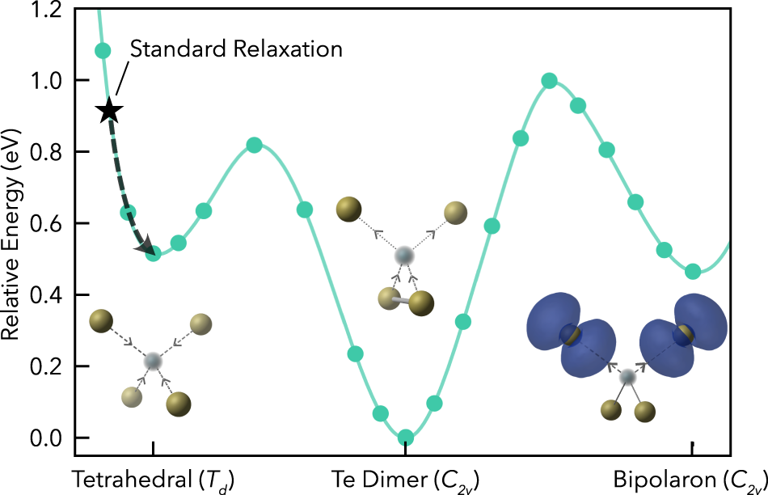
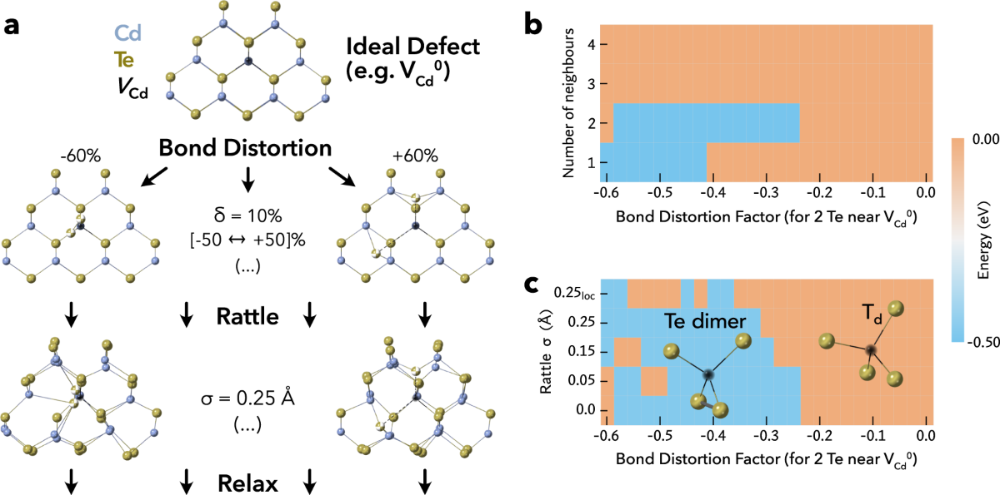
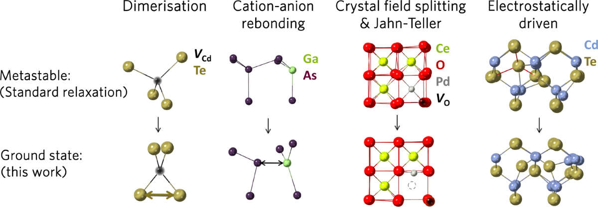
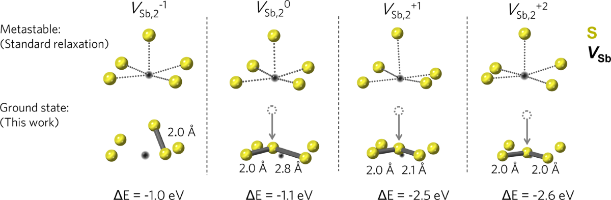
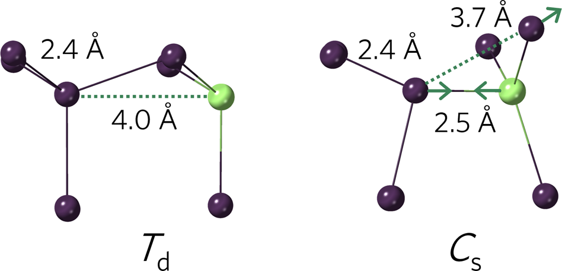
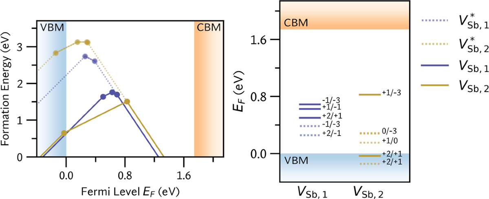
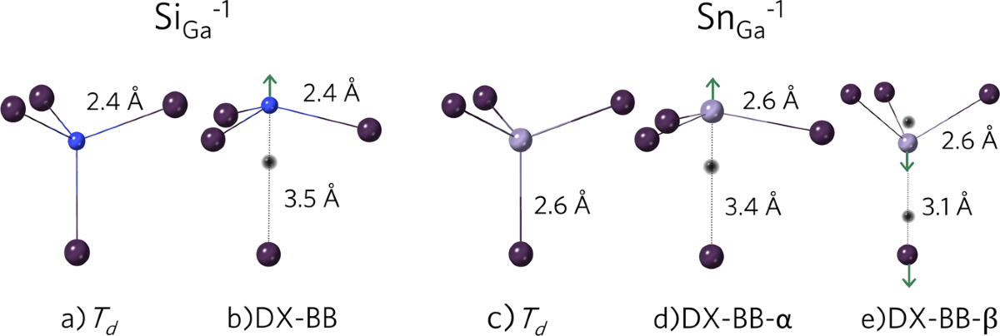
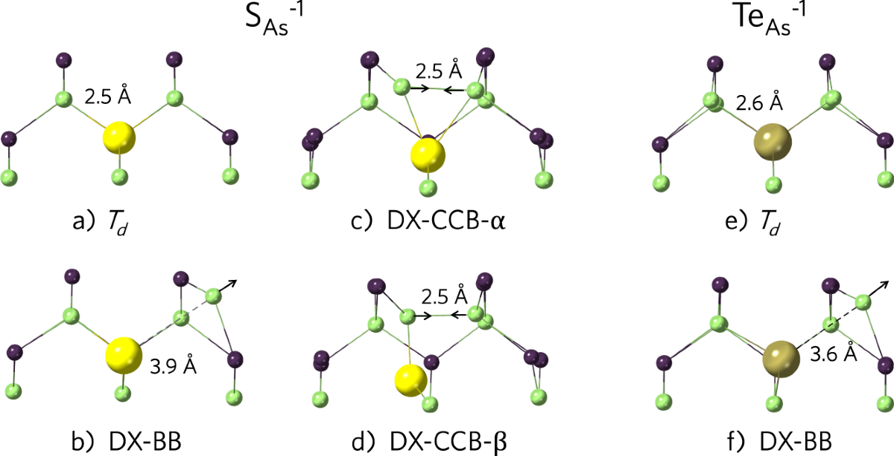

# Identifying the ground state structures of point defects in solids

Irea Mosquera-Lois, Seán R. Kavanagh, Aron Walsh, and David O. Scanlon

npj Computational Materials 9, 25 (2023). <https://doi.org/10.1038/s41524-023-00973-1>

**Supplementary information:** [[Mosquera-Lois et al 2023 - Supporting Information - Identifying the ground state structures of point defects in solids]]

1 Thomas Young Centre and Department of Chemistry, University College London, 20 Gordon Street, London WC1H 0AJ, UK. 2 Thomas Young Centre and Department of Materials, Imperial College London, Exhibition Road, London SW7 2AZ, UK. Irea Mosquera-Lois and Seán R. Kavanagh contributed equally. Correspondence: sean.kavanagh.19@ucl.ac.uk; d.scanlon@ucl.ac.uk.

## Abstract

Point defects are a universal feature of crystals. Their identification is addressed by combining experimental measurements with theoretical models. The standard modelling approach is, however, prone to missing the ground state atomic configurations associated with energy-lowering reconstructions from the idealised crystallographic environment. Missed ground states compromise the accuracy of calculated properties. To address this issue, we report an approach to navigate the defect configurational landscape using targeted bond distortions and rattling. Application of our workflow to eight materials (CdTe, GaAs, Sb2S3, Sb2Se3, CeO2, In2O3, ZnO, anatase-TiO2) reveals symmetry breaking in each host crystal that is not found via conventional local minimisation techniques. The point defect distortions are classified by the associated physico-chemical factors. We demonstrate the impact of these defect distortions on derived properties, including formation energies, concentrations and charge transition levels. Our work presents a step forward for quantitative modelling of imperfect solids.

## Introduction

Defects control the properties and performance of most functional materials and devices. Unravelling the identity and impact of these imperfections is, however, a challenging task. Their dilute concentrations hinder experimental identification, which is often tackled by combining characterisation measurements with ab-initio techniques. The standard modelling approach, based on local optimisation of a defect containing crystal, is prone to miss the true ground state atomic arrangement, however. The chosen initial configuration, which is often initiated as a vacancy/substitution/interstitial on a known crystal site (Wyckoff position) and all other atoms retaining their typical lattice positions, may lie within a local minimum or on a saddle point of the potential energy surface (PES), trapping a gradient-based optimisation algorithm in an unstable or metastable arrangement1,2,3,4,5,6,7,8,9 as illustrated in Fig. 1. By yielding incorrect geometries, the predicted defect properties, such as equilibrium concentrations, charge transition levels and recombination rates, are rendered inaccurate. This behaviour can severely impact theoretical predictions of material performance, including photovoltaic efficiency10, catalytic activity11, absorption spectra12 and carrier doping13, highlighting the pressing requirement for improved structure prediction techniques for defects in solids. Several approaches have recently been devised to navigate the defect configurational landscape. Arrigoni and Madsen1 used an evolutionary algorithm enhanced with a machine learning model to explore the defect PES and identify low energy structural configurations. While its robust performance makes it suitable for in-depth studies of specific defects, its complexity and computational cost hinders its applicability in standard defect studies, where all intrinsic defects in all plausible charge states (and relevant extrinsic defects) are modelled. On the other hand, Pickard and Needs14 employed random sampling of the PES. Essentially, they remove the defect atom and its nearest neighbours and reintroduce them at random positions within a 5 Å cube centred on the defect, thus ensuring sampling of an important region of the PES. Despite successfully identifying the ground state structures for several systems14,15,16,17,18, constrained random sampling in a high-dimensional space lowers efficiency and increases computational cost.

**Fig. 1: Potential energy surface for the neutral cadmium vacancy in CdTe, illustrating the global minimum (Te dimer) and local minima (Bipolaron and Tetrahedral configurations).** A standard optimisation from the initial, high-symmetry configuration (black star) gets trapped in the metastable Tetrahedral configuration. Adapted from *Matter*, I. Mosquera-Lois and S.R. Kavanagh, In Search of Hidden Defects (2021) with permission from Elsevier.

To improve PES sampling efficiency, domain knowledge can be employed to bias the search towards energy-lowering structural distortions. Accordingly, we exploit the localised nature of defect distortions, as well as the key role of the defect valence electrons, to guide the exploration of the PES. By combining these biases with lessons learnt from crystal structure prediction, we develop a practical and robust method to identify the defect ground and low-energy metastable states. Its application to eight host materials (CdTe, GaAs, Sb2S3, Sb2Se3, CeO2, In2O3, ZnO, TiO2) reveals a myriad of energy-lowering defect distortions, which are missed when relaxing the ideal high-symmetry defect configurations. Notably, energy-lowering distortions that are missed by standard geometry relaxation were found in each system investigated. Classifying these atomic rearrangements by distortion motif, we outline the main physico-chemical factors that underlie defect reconstructions (**Distortion** **Motifs**). Moreover, we demonstrate the strong effect on defect formation energies and their charge transition levels, illustrating the importance of exploring the defect configurational space for accurate predictions of defect properties (**Impact on defect properties**). Additionally, while defect properties are often determined by the ground state structure, there are cases when low energy metastable structures can significantly affect behaviour10,19,20. Accordingly, we tested our approach for low-energy metastable configurations by considering the DX centres in GaAs, which have been extensively studied due to their anomalous physical properties and technological importance (**Locating metastable structures**). By finding all ground states and the vast majority (>90%) of metastable configurations identified by previous investigations1,5,11,21,22,23,24,25,26,27,28,29,30,31 (further comparisons provided in Supplementary Section I, Subsection D), we demonstrate the applicability of our approach to locate both ground state and low-energy metastable defect structures, constituting an affordable and effective tool to explore the defect configurational landscape.

## Results

### Structure search strategy

#### Local bond distortion

The role of valence electrons in defect reconstructions has been demonstrated by the defect-molecule model developed by Watkins32,33,34,35,36,37 and Coulson38. It successfully explained the Jahn-Teller distortions observed for vacancy centres in silicon and diamond, and continues to be applied to rationalise defect reconstructions5,10,12,39,40,41,42,43,44,45,46. This highlights the suitability and utility of defect valence electrons as an approximate indicator of likely defect distortions. As such, our method incorporates this feature, as well as the localised nature of defect reconstructions, to generate a reasonable set of chemically-guided distortions to sample the PES. Specifically, we use the number of missing/additional valence electrons of the defect species to determine the number of nearest neighbour atoms to distort. To generate a set of trial structures, the initial defect-neighbour distances *d*0 are distorted by varying amounts, with the range set by the minimum and maximum distortion factors *k**min* and *k**max*, such that *d**min* = *k**min**d*0 and *d**max* = *k**max**d*0, and the increment parameter *δ* which determines the sampling density of the trial distortion mesh. Thus, the distorted defect-neighbour distances *d* are given by

$$
{d}_{n}={k}_{n}{d}_{0}
$$

(1)

$$
{k}_{n}={k}_{min}+n\delta \quad \,{{\mbox{with}}}\,\quad n=0,1,2,...,\left(\frac{{k}_{max}-{k}_{min}}{\delta }\right)
$$

(2)

While these parameters may be varied, in our work, we found a distortion range of ± 60% (i.e., *k**min* = 0.4 and *k**max* = 1.6) and increment of 10% (*δ* = 0.1) to be an optimal choice, with a sufficiently wide and dense distortion mesh to identify all known energy-lowering distortions (see Supplementary section I for more details). Similar bond distortions have previously been applied by Pham and Deskins47 to locate the ground state of small polarons in three metal oxides. Analogously, these initial distortions aim to escape the local energy basin in which the ideal, undistorted structure may be trapped. Further, by only distorting the defect nearest neighbours-and thus restricting to a lower-dimensional subspace, the method aims to sample the key regions of the PES that may comprise energy-lowering reconstructions, such as Jahn-Teller effects or rebonding between under-coordinated atoms.

The utility of electron count as an indicator for the number of defect-neighbour bonds to distort is demonstrated for the neutral cadmium vacancy in CdTe in Fig. 2b. Here, bond distortions were applied to differing numbers of defect neighbours. Best performance (i.e., widest range of distortions yielding the ground state) was obtained when distorting two neighbours, supporting the feature choice given that the vacancy site lacks two valence electrons relative to the original Cd atom.

**Fig. 2: Schematic representation of our approach, as described in the Methods section, using the neutral cadmium vacancy (${V}_{{{{\rm{Cd}}}}}^{0}$) in CdTe as an example.** **a** Structure generation method, with bond distortion and rattle steps. Cd in blue, Te in gold and *V*Cd in black, with the distorted Te neighbours shown in a gold/white. **b** Relative energy of relaxed structures for ${V}_{{{{\rm{Cd}}}}}^{0}$, for different numbers of distorted defect neighbours and **c** rattle standard deviations. A localised rattle (where only atoms within 5 Å to the defect are distorted) is also shown (*σ* = 0.25*loc* Å). The widest interval of bond distortions leading to the ground state is obtained by distorting two nearest neighbours. Only negative bond distortions are shown since all positive ones yield the metastable \`Tetrahedral' configuration.

#### Atomic rattle

Following the nearest neighbour distortion, random perturbations are applied to the coordinates *r* of all atoms *N* in the supercell. This aids in escaping from any metastable symmetry trapping and locate small, symmetry-breaking distortions (i.e., nearby lower energy basins). This step has proven useful in other structure-searching approaches, such as the investigation of symmetry breaking distortions in perovskites48 or point defects20,49. The magnitudes of these randomly-directed atomic displacements *d* are themselves randomly selected from a normal distribution of chosen standard deviation *σ* (Eq. (3)).

$$
{r}_{i}^{{\prime} }={r}_{i}+d\quad \,{{\mbox{with}}}\,\quad i=0,1,...,3N\quad \,{{\mbox{and}}}\,\quad d\leftarrow \frac{1}{\sigma \sqrt{2\pi }}\exp \left(-\frac{{d}^{2}}{2{\sigma }^{2}}\right)
$$

(3)

To determine the optimum magnitude of the perturbation, several standard deviations were tested for a series of defects-shown in the Supplementary Subsection I.C and exemplified in Fig. 2b for ${V}_{{{{\rm{Cd}}}}}^{0}$ in CdTe. In general, we found values between 0.05-0.25 Å to give good performance, and adopted 0.25 Å since it was the only distortion capable of finding the ground state of ${{{{\rm{S}}}}}_{{{{\rm{i}}}}}^{-1}$ in Sb2S3 (Supplementary Fig. 3).

Additionally, we also investigated a ‘localised’ rattle, where the perturbations were only applied to atoms located within 5 Å of the defect, as recently employed in other defect studies49,50,51. However, this yielded inferior performance for several defects (less bond distortions leading to the ground state) without significant reduction in the number of ionic relaxation steps (Supplementary Fig. 4). While the final structure is still only locally deformed, it appears that the external potential induced by the long-range symmetry of the surrounding host crystal biases the initial forces toward retaining the high-symmetry metastable defect structure. Therefore rattling was applied to all atoms in the simulation supercell.

The workflow for generating the trial distorted defect structures, running and parsing the calculations, and analysing the results, is implemented in the ShakeNBreak package52 with further implementation details at its documentation site53.

### Defect suite

To test our method we chose a set of eight host crystals that provide diversity in crystal symmetry, coordination environments and electronic structure. CdTe and GaAs are tetrahedral semiconductors that adopt the zincblende structure (space group $F\bar{4}3m$). Sb2Se3 and Sb2S3 are layered materials (space group *Pnma*), composed of one-dimensional \[Sb4X6\]*n* ribbons with covalent metal-chalcogen bonds within each ribbon and van der Waals interactions between ribbons54,55,56,57,58,59,60. Beyond these covalently-bonded crystals, we also studied four metal oxides (In2O3, ZnO, CeO2, TiO2). ZnO crystallises in the hexagonal wurtzite structure (space group *P*63*mc*) with tetrahedral coordination, while In2O3 adopts a bixbyite structure (space group *Ia*3). CeO2 crystallises in the fluorite structure with a face-centred cubic unit cell (space group $Fm\bar{3}m$). The anatase phase of TiO2 was considered, which adopts a tetragonal structure composed of distorted TiO6 octahedra (space group *I*41/*amd*). For the covalently-bonded systems, all intrinsic defects were studied, while for the oxides we focused on defects where reconstructions had been reported or were likely (oxygen interstitials in ZnO, In2O3 and a-TiO2 and dopant defects in CeO2). For the materials that can host defects in several symmetry inequivalent sites, the lowest energy one was selected if the energy difference with the other sites was higher than 1 eV, otherwise, all symmetry inequivalent sites were considered.

### Distortion motifs

The application of our method to a series of semiconductors revealed a range of defect reconstructions, which are missed when performing a geometry optimisation of the high symmetry configuration. We categorise these reconstructions into distinct motifs according to the chemical origins of the energy-lowering distortion, as exemplified in Fig. 3 and discussed hereafter.

**Fig. 3: Types of symmetry-breaking reconstructions at point defect sites identified by our method: dimerization, cation-anion rebonding, crystal field splitting and Jahn-Teller, and electrostatically driven.** The high-symmetry (metastable) and symmetry-broken (ground state) structures are shown.

### Rebonding

For covalently-bonded materials, defect reconstructions identified by our method often entailed a change in the bonding arrangement at the defect site (‘rebonding’), such as dimer formation or replacing cation-cation/anion-anion bonds with more favourable cation-anion ones.

#### Dimerisation

For many vacancies and interstitials, symmetry breaking was found to produce dimer bonds between under-coordinated atoms. This strong bond formation results in these distortions being highly-favourable, with energy decreases from 0.4 eV to over 2.5 eV (Table 1), between the ground state and metastable structure obtained from standard relaxations. As expected given the large energy differences, the metastable and ground state configurations also display significant structural differences, which we quantify here by summing the atomic displacements between structures which are above a 0.1 Å threshold. The large structural rearrangements for dimer reconstructions are demonstrated by displacement values ranging between 2.0 and 24.3 Å, with the distortion mainly localised to the dimer-forming atoms (Supplementary Figs. 10-12). For vacancies, the distortion typically entails two of the under-coordinated defect neighbours displacing toward each other to form a bond, while for interstitials it is the additional atom which displaces towards a nearby neighbour.

**Table 1 Dimerisation. Energy difference and summed atomic displacements (ΣDisp.) between the ground statea identified by our method and the metastable configurationb found when relaxing the ideal, undistorted defect structure (i.e., ΔE = Eground - Emetastable). The column ‘Prev. reported?’ indicates whether the identified configuration is only found with our method (‘Previously Unreported’) or had been reported previously by the referenced study.**

**Cation-cation**

| Defect | Material | Charge | ΔE (eV) | ΣDisp. (Å) | Prev. reported? |
|----|----|----|----|----|----|
| *V*Te | CdTe | 0 | -0.42 | 6.0 | 118 |
| Sb*i* | Sb2S3 | -3 | -0.46 | 12.8 | Previously Unreported |

**Anion-anion**

| Defect | Material | Charge | ΔE (eV) | ΣDisp. (Å) | Prev. reported? |
|----|----|----|----|----|----|
| *V*Cd | CdTe | 0 | -0.50 | 6.1 | 5,10 |
| *V*Sb,1 | Sb2Se3 | -1 | -0.66 | 8.2 | Previously Unreported |
|   |   | 0 | -0.78 | 8.7 |   |
|   |   | +1 | -0.84 | 8.9 |   |
|   |   | +2 | -2.02 | 12.8 |   |
| *V*Sb,2 | Sb2Se3 | -1 | -0.80 | 7.2 | Previously Unreported |
|   |   | 0 | -0.91 | 9.0 |   |
|   |   | +1 | -2.10 | 14.7 |   |
|   |   | +2 | -2.15 | 16.6 |   |
| *V*Sb,1 | Sb2S3 | -1 | -0.80 | 9.9 | Previously Unreported |
|   |   | 0 | -1.03 | 9.0 |   |
|   |   | +1 | -2.31 | 11.8 |   |
|   |   | +2 | -2.03 | 24.3 |   |
| *V*Sb,2 | Sb2S3 | -1 | -0.99 | 8.9 | Previously Unreported |
|   |   | 0 | -1.10 | 12.2 |   |
|   |   | +1 | -2.50 | 12.8 |   |
|   |   | +2 | -2.59 | 21.9 |   |
| Si | Sb2S3 | -1 | -0.54 | 9.4 | Previously Unreported |
| Oi | In2O3 | 0 | -1.47 | 1.6 | 29 |
|   |   | +1 | -2.44 | 3.4 |   |
| Oi | ZnO | 0 | -1.87 | 4.3 | 30 |
|   |   | +1 | -2.22 | 3.9 |   |
| Oi | a-TiO2 | 0 | -2.23 | 3.1 | 31 |
|   |   | +1 | -1.99 | 3.2 |   |

1.  a‘Ground state’ refers to the lowest-energy known structure throughout.
2.  bMetastable and ground state structures with bond distance labelling shown in Supplementary Figs. 10-12.

Within the cases reported in Table 1, it is instructive to further consider the antimony vacancies (*V*Sb) in the quasi-one dimensional materials Sb2(S/Se)3. In contrast to other systems, the dimer reconstruction is favourable across several charge states, with its stability increasing with the magnitude of the charge state of the defect. As indicated by Crystal Orbital Hamilton Population analysis (COHP)61,62,63, from the singly negative to the double positive state, we observe greater net bonding anion-anion interactions (Supplementary Table 3, Supplementary Fig. 11), thereby leading to stronger bonds and thus a more favourable reconstruction. Furthermore, for the neutral and positive charge states, the under-coordinated vacancy neighbours form *two* anion-anion bonds (yielding a S-S-S trimer), which is achieved by a large displacement of one of the vacancy neighbours towards the other two (Fig. 4). This remarkable ability to distort likely stems from their soft, quasi-1D structure55, with van der Waals voids between atomic chains64 (Supplementary Fig. 9). Despite the key role of anion dimerisation for *V*Sb, which significantly impacts its energy and structure, this reconstruction has not been reported by previous studies on Sb2S365 or Sb2Se366,67,68,69,70,71, due to the local minimum trapping which our method aims to tackle. While sulfur dimers were not identified in Sb2(S/Se)3, they were reported for *V*Bi and Si in the isostructural material Bi2S372, where their formation stabilises abnormal charge states for both species, rendering them *donor* defects - contradicting the typical acceptor nature of cation vacancies and anion interstitials.

**Fig. 4: Anion-anion dimer formation undergone by ${V}_{{{{\rm{Sb}}}},2}^{-1,0,+1,+2}$ in Sb2S3, where the subscript differentiates between the two symmetry inequivalent sites of Sb (shown in Supplementary Fig. 9).** Similar reconstructions were observed for the other symmetry inequivalent site and in Sb2Se3. For each charge state, on the top we show the configuration obtained by relaxing the ideal, high-symmetry geometry and on the bottom the ground state found with our method. For the singly negative charge states, the distortion is driven by the formation of one sulfur dimer while for the neutral and positively charge states a trimer is formed. *V*Sb in black and S in yellow. Pseudo-bonds from the vacancy position to neighbouring S atoms are shown for the metastable configurations to illustrate the coordination environment and the arrows illustrate the key displacement from the high-symmetry structure.

Beyond covalently-bonded materials, anion-anion bond formation is also observed for anion interstitials in systems with a stronger ionic character (In2O3, ZnO, a-TiO2). Rather than leading to hole localisation in the interstitial atom and/or neighbouring anions (metastable state), the defect can accommodate the charge deficiency by forming oxygen dimers, resulting in highly favourable reconstructions (Table 1). When only two electrons are missing (${{{{\rm{O}}}}}_{{{{\rm{i}}}}}^{0}$), the interstitial atom displaces towards a lattice oxygen forming a peroxide (${{{{\rm{O}}}}}_{2}^{-2},{{{\rm{d}}}}({{{\rm{O}}}}-{{{\rm{O}}}})=1.45$ Å, Supplementary Fig. 12), which is 1.5-2.0 eV more favourable than the metastable double polaron state. If an additional electron is removed (${{{{\rm{O}}}}}_{{{{\rm{i}}}}}^{+1}$), a hole is trapped in one of the peroxide antibonding *π*\* orbitals (e.g., ${{{{\rm{h}}}}}^{+}+{{{{\rm{O}}}}}_{2}^{-2},{{{\rm{d}}}}({{{\rm{O}}}}-{{{\rm{O}}}})=1.31$ Å, Supplementary Fig. 14). Remarkably, this peroxide hole trapping yields a stabilisation > 2 eV compared to the system with 3 holes localised on the defect region. Similar oxygen dimers have previously been reported for *bulk* lithium peroxide (Li2O2)2 and a-TiO273 and defective In2O329, ZnO30 and a-TiO231.

Overall, these anion-anion dimers lead to highly-favourable distortions and stabilise abnormal charge states for anion interstitials and cation vacancies. This unexpected behaviour highlights the key role of exploring the defect configurational space for accurate theoretical predictions of defect properties, while also demonstrating the importance of considering a wide range of charge states, as unforeseen chemical interactions (facilitated by defect reconstructions) may lead to unexpected stabilisations. Finally, we note that dimer reconstructions at defects are not uncommon, and have been previously reported for numerous vacancies and interstitials, including ${V}_{{{{\rm{Se}}}}}^{0}$ in ZnSe, CuInSe2 and CuGaSe212, ${V}_{{{{\rm{S}}}}}^{0}$ in ZnS12, ${V}_{{{{\rm{Ti}}}}}^{0,-1}$ and ${V}_{{{{\rm{Zr}}}}}^{0}$ in CaZrTi2O718, ${{{{\rm{O}}}}}_{{{{\rm{i}}}}}^{0}$ in In2O329, ZnO30, Al2O36, MgO74,75, CdO76, SnO277,78, PbO279, CeO280, BaSnO381 and In2ZnO482, ${{{{\rm{Ag}}}}}_{{{{\rm{i}}}}}^{0}$ in AgCl and AgBr83, ${V}_{{{{\rm{I}}}}}^{-}$, ${{{{\rm{I}}}}}_{{{{\rm{i}}}}}^{0}$, ${{{{\rm{Pb}}}}}_{{{{\rm{i}}}}}^{0}$, ${{{{\rm{Pb}}}}}_{{{{{\rm{CH}}}}}_{3}{{{{\rm{NH}}}}}_{3}}^{0}$ and ${{{{\rm{I}}}}}_{{{{{\rm{CH}}}}}_{3}{{{{\rm{NH}}}}}_{3}}^{0}$ in CH3NH3PbI384,85,86,87, Pbi in CsPbBr388, ${({{{{\rm{CH}}}}}_{3}{{{{\rm{NH}}}}}_{3})}_{3}{{{{\rm{Pb}}}}}_{2}{{{{\rm{I}}}}}_{7}$89, ${({{{{\rm{CH}}}}}_{3}{{{{\rm{NH}}}}}_{3})}_{2}{{{\rm{Pb}}}}{({{{\rm{SCN}}}})}_{2}{{{{\rm{I}}}}}_{2}$90 and ${{{{\rm{Sn}}}}}_{{{{\rm{i}}}}}$ in CH3NH3SnI391.

#### Cation-anion rebonding

Beyond dimerisation, rebonding between defect neighbours can also include replacing cation-cation/anion-anion (homoionic) bonds with more favourable cation-anion (heteroionic) bonds. This reconstruction motif is primarily observed for antisite defects, where the antisite may displace from its original position towards an oppositely-charged ion to form a new bond, while breaking a cation-cation/anion-anion bond. This is illustrated in Fig. 5 for ${{{{\rm{As}}}}}_{{{{\rm{Ga}}}}}^{-2}$ in GaAs and was also found for ${{{{\rm{Sb}}}}}_{{{{\rm{S}}}}}^{+3}$ and ${{{{\rm{S}}}}}_{{{{\rm{Sb}}}}}^{+3}$ in Sb2S3. In the former (${{{{\rm{As}}}}}_{{{{\rm{Ga}}}}}^{-2}$), both the cation and anion displace towards each other (Fig. 5), from an original separation of 4.00 Å to 2.49 Å (close to the bulk Ga-As bond length of 2.45 Å), breaking an As-AsGa bond in the process. Interestingly, this behaviour contrasts with that of ${{{{\rm{Te}}}}}_{{{{\rm{Cd}}}}}^{-2}$ in the isostructural compound semiconductor CdTe, which displaces to form a Te-Te dimer5 rather than the cation-anion rebonding witnessed here. The differing reconstructions exhibited by these nominally similar anion-on-cation antisite defects - both in zinc blende compound semiconductors, may be rationalised by the greater bond energy of Te-Te (260 kJ mol-1) compared to As-As (200 kJ mol-1)92, suggesting a greater proclivity toward anion dimerisation.

**Fig. 5: Cation-anion rebonding undergone by ${{{{\rm{As}}}}}_{{{{\rm{Ga}}}}}^{-2}$ in GaAs.** On the left is the metastable *T**d* structure identified by standard defect relaxation, and to the right the ground state *C**s* symmetry identified by our method. Ga in green and As in purple.

Cation-anion rebonding is also found in the antimony antisite in Sb2S3 (${{{{\rm{Sb}}}}}_{{{{\rm{S}}}}}^{+3}$), where the high-symmetry metastable structure and the ground state differ by the formation of an additional Sb-S bond (Supplementary Fig. 15). This extra cation-anion bond has a distance of 2.5 Å, again comparable to the bulk Sb-S bond length of 2.5-2.8 Å, and lowers the energy by 0.4 eV (Table 2). Beyond antisites, this behaviour is also expected for *extrinsic* substitutional defects and dopants, where the same preference for heteroionic bonds can drive reconstructions to distorted, lower-energy arrangements.

**Table 2 Cation-anion rebonding. Energy difference and summed atomic displacements (ΣDisp.) between the ground state identified by our method and the metastable configurationa found when relaxing the ideal, undistorted defect structure (i.e., ΔE = Eground - Emetastable).**

| Defect | Material | Charge | ΔE (eV) | ΣDisp. (Å) | Prev. reported? |
|----|----|----|----|----|----|
| SbS | Sb2S3 | +3 | -0.39 | 15.8 | Previously Unreported |
| SSb | Sb2S3 | +3 | -1.22 | 9.0 | Previously Unreported |
| S*i* | Sb2S3 | +3 | -0.45 | 11.5 | Previously Unreported |
| AsGa | GaAs | -2 | -0.37 | 5.2 | Previously Unreported |
| Cd*i* | CdTe | +2 | -0.46 | 5.8 | 119 |

1.  aMetastable and ground state structures with bond distance labelling shown in Supplementary Fig. 15.

This behaviour is not exclusive to substitution-type defects, however, with similar reconstructions undergone by interstitial defects. For instance, the sulfur interstitial (${{{{\rm{S}}}}}_{{{{\rm{i}}}}}^{+3}$) in Sb2S3 displaces to form a Si - Sb bond which lowers the energy by 0.45 eV (Table 2, Supplementary Fig. 15). Similar interactions drive the reconstruction for the cadmium interstitial in CdTe (${{{{\rm{Cd}}}}}_{{{{\rm{i}}}}}^{+2}$), where ${{{{\rm{Cd}}}}}_{{{{\rm{i}}}}}^{+2}$ moves to a Te (rather than Cd) tetrahedral coordination, again with bond lengths (2.85 Å) similar to the bulk cation-anion bond length (2.84 Å) and lowering the energy by 0.46 eV. Beyond the explicit formation of these heteroionic bonds, the change in the interstitial position also results in more favourable electrostatic interactions, as reflected by the lower Madelung energy of the ground state (Δ*E*Madelung = - 2.0 eV). While this configuration is also found by considering a range of potential interstitial sites without distortion, the identified reconstruction demonstrates the ability of this approach to locate major structural distortions, where both the position of the defect atom and its coordination change significantly (summed atomic displacements of 5.8 Å and ${{{{\rm{Cd}}}}}_{{{{\rm{i}}}}}^{+2}$ moving by 0.86 Å).

### Crystal field & Jahn-Teller

For defects in materials with a stronger ionic character, crystal field or Jahn-Teller effects can also drive symmetry-breaking reconstructions. In this category, we focus on the distortions introduced by a series of divalent metal dopants (Be, Ni, Pd, Pt, Cu) in ceria (CeO2). Previous studies had shown these dopants to favour the formation of a charge-compensating oxygen vacancy (${V}_{{{{\rm{O}}}}}^{+2}$) and undergo significant reconstructions, which were only found by testing a range of chemically-guided manual distortions for each dopant11.

Accordingly, we tested our method by applying it to this system, finding it to successfully reproduce all previously-reported ground state structures, as well as identifying a lower-energy reconstruction for the Ni dopant which had not been previously identified. Here, Ni and Pd are found to distort from an originally cubic coordination to a more favourable square planar arrangement (Supplementary Fig. 16). This is also the case for Pt, however unlike the other dopants this ground state configuration is also found by a standard relaxation. For Ni and Pd, crystal field effects drive the displacement of the dopant by 1/4 of a unit cell (1.2 Å) from the centre of the cube towards one of the faces (Fig. 3, Supplementary Fig. 16). By lowering the energy of the occupied *d* orbitals (as depicted in the electron energy diagram of Supplementary Fig. 17), the reconstruction leads to an overall stabilisation of 0.30 and 0.87 eV for Ni and Pd, respectively. Notably, the nickel distortion was overlooked by the previous study11, likely due to limited exploration of the PES and the shallower and narrower energy basin - stemming from reduced crystal field stabilisation energy (Table 3) due to weaker hybridisation between the anions and less diffuse 3*d* orbitals (compared to 4*d* and 5*d* for Pd and Pt).

**Table 3 Crystal field and Jahn-Teller driven distortions. Energy difference and summed atomic displacements (ΣDisp.) between the ground state identified by our method and the metastable configurationa found when relaxing the ideal, undistorted defect structure (i.e., ΔE = Eground - Emetastable).**

| Defect | Material | ΔE (eV) | ΣDisp. (Å) | Prev. reported? |
|----|----|----|----|----|
| ${{{{\rm{Ni}}}}}_{{{{\rm{Ce}}}}}^{-2}+{V}_{{{{\rm{O}}}}}^{2+}$ | CeO2 | -0.30 | 2.2 | Previously Unreported |
| ${{{{\rm{Pd}}}}}_{{{{\rm{Ce}}}}}^{-2}+{V}_{{{{\rm{O}}}}}^{2+}$ | CeO2 | -0.87 | 5.8 | 11 |
| ${{{{\rm{Cu}}}}}_{{{{\rm{Ce}}}}}^{-2}+{V}_{{{{\rm{O}}}}}^{2+}$ | CeO2 | -0.67 | 3.7 | 11 |

1.  aMetastable and ground state structures with bond distance labelling shown in Supplementary Fig. 16.

Finally, in the case of copper, a *d*9 metal, it is the Jahn-Teller effect which drives a reconstruction towards *a distorted* square-planar arrangement (Fig. 3). By splitting the partially-occupied electron levels, it lowers the energy of the occupied *d* orbitals, as shown in the orbital energy diagram of Supplementary Fig. 18, and leads to an overall stabilisation of 0.67 eV.

### Electrostatically-driven

Finally, for certain interstitials or substitutional defects, symmetry-breaking distortions can yield lower energy structures through optimising electrostatic interactions (Table 4). Compared to cation-anion rebonding, which is driven by a combination of ionic and covalent bonding interactions, here *no* explicit new bonds are formed, but rather the lattice electrostatic (Madelung) energy is lowered by defect rearrangement. This distortion motif is common for size-mismatched substitutions, which disrupt the nearby lattice framework (and thus long-range electrostatics), leading to reconstructions that reduce the lattice strain. For instance, this behaviour was observed for the beryllium dopant in CeO2, which also forms a charge-compensating oxygen vacancy, i.e., ${{{{\rm{Be}}}}}_{{{{\rm{Ce}}}}}^{-2}+{V}_{{{{\rm{O}}}}}^{+2}$ (as witnessed for other divalent dopants11,93,94). Surprisingly, instead of adopting the tetrahedral coordination of its parent oxide that was previously reported11, beryllium distorts to a trigonal environment (Supplementary Fig. 19a, b). This behaviour appears to be driven by the significant size mismatch between beryllium and cerium (with ionic radii of ${{{{\rm{r}}}}}_{{{{{\rm{Be}}}}}^{+2}}=0.59$ Å and ${{{{\rm{r}}}}}_{{{{{\rm{Ce}}}}}^{+4}}=1.01$ Å), requiring significant lattice distortion to attain the optimum Be-O distances in the tetrahedral arrangement. To adopt the tetrahedral coordination, three O atoms significantly displace from their lattice sites towards Be, straining the other Ce-O bonds by 0.2 Å. In contrast, the trigonal configuration enables optimum Be-O separation while maintaining near ideal distances for the nearby Ce-O bonds, thereby optimising the overall ionic interactions. This is reflected by the Madelung energy, which is 3.2 eV lower in the ground state configuration, and the overall energy lowering of 0.34 eV.

**Table 4 Electrostatically-driven reconstructions. Energy difference and summed atomic displacements (ΣDisp.) between the ground state identified by our method and the metastable configurationa found when relaxing the ideal, undistorted defect structure (i.e., ΔE = Eground - Emetastable).**

| Defect | Material | ΔE (eV) | ΣDisp. (Å) | Prev. reported? |
|----|----|----|----|----|
| ${{{{\rm{Te}}}}}_{{{{\rm{i}}}}}^{-2}$ | CdTe | -0.20 | 13.0 | 120 |
| ${{{{\rm{Cd}}}}}_{{{{\rm{i}}}}}^{+2}$ | CdTe | -0.46 | 5.8 | 119 |
| ${{{{\rm{Be}}}}}_{{{{\rm{Ce}}}}}^{-2}$ + ${V}_{{{{\rm{O}}}}}^{+2}$ | CeO2 | -0.34 | 19.7 | Previously Unreported |

1.  aMetastable and ground state structures with bond distance labelling shown in Supplementary Fig. 19.

Interstitials can also exhibit these electrostatically-driven reconstructions, with their higher mobility allowing for displacement to more favourable Madelung potential sites. For example, the main difference between the metastable and ground state structures of the tellurium interstitial (${{{{\rm{Te}}}}}_{{{{\rm{i}}}}}^{-2}$) in cadmium telluride (CdTe) lies in its coordination environment. While in the metastable configuration Tei is tetrahedrally coordinated by other Te anions (distances of 3.4 Å), in the ground state the Te atoms rearrange to a split configuration, both occupying a hexagonal void and minimising interactions with neighbouring Te (distances of 3.5, 3.5, 3.6, 4.0 Å) (Supplementary Fig. 19c, d). This reduction of unfavourable anion-anion interactions is again witnessed in the Madelung energy, which is 2 eV lower for the ground state, and drives an overall energy lowering of 0.20 eV. Although these examples are primarily driven by optimising electrostatic interactions, the different distortion motifs in Fig. 3 are not mutually exclusive. Often several effects can contribute to a certain distortion, as observed for ${{{{\rm{Cd}}}}}_{{{{\rm{i}}}}}^{+2}$ in CdTe, where the distortion leads to cation-anion rebonding (via explicit replacement of cation-cation bonds with cation-anion) but *also* lowering the lattice electrostatic energy (by surrounding the interstitial with oppositely charged ions).

Beyond these motifs, our approach can also be employed to identify defect bound polarons, as exemplified in the supporting information for ${V}_{{{{\rm{O}}}}}^{0}$ in CeO2, ${V}_{{{{\rm{O}}}}}^{0}$ and ${{{{\rm{Ti}}}}}_{{{{\rm{i}}}}}^{0}$ in rutile TiO2, and ${V}_{{{{\rm{In}}}}}^{-1}$ in In2O3 (Supplementary Subsection II.E). For ceria and rutile, the two electrons donated by the defect localise on lattice cations reducing them to Ce/Ti(III). This leads to many competing states depending on both the defect-polaron and polaron-polaron distances. While the different localisation arrangements are successfully identified by our approach, the complexity of the PES (hosting many competing low energy minima with small energy and structural differences) warrants further study.

### Impact on defect properties

In this section, we demonstrate how these reconstructions can affect calculated defect properties. We take the charge transition level diagram for antimony vacancies in Sb2S3 as an exemplar, and compare the formation energies and defect levels calculated for the ground (*V*Sb) and metastable states (${V}_{{{{\rm{Sb}}}}}^{* }$), for both symmetry-inequivalent vacancy positions (*V*Sb,1 and *V*Sb,2; Supplementary Fig. 9). As shown in Fig. 6, Table 1, the highly favourable dimerisation reconstructions undergone by several charge states (+2, +1, 0, -1) significantly lower the formation energy of *V*Sb, by 0.8-2.6 eV depending on charge state. As a result, the predicted concentration under typical growth conditions (T = 550 K)95 increases by $\exp (\frac{\Delta E}{{k}_{B}T})\simeq$ **21** orders of magnitude for ${V}_{{{{\rm{Sb}}}},2}^{+1}$ (Supplementary Table IV). Furthermore, the reconstructions also affect the *nature* and *position* of the charge transition levels. The neutral state of *V*Sb,2 is now predicted to be thermodynamically unfavourable at all Fermi levels, which leads to the disappearance of the (+1/0) and (0/-3) transition levels (Fig. 6). Similarly, for *V*Sb,1, the reconstructions render the singly-positive vacancy stable within the bandgap, resulting in two new transition levels ((+2/+1) and (+1/-1)) (Fig. 6, Supplementary Table V).

**Fig. 6: Defect formation energy (left) and vertical energy level (right) diagram for the antimony vacancies in Sb2S3, under sulfur rich conditions121 (*μ*S = 0, *μ*Sb = - 0.55 eV).** The two symmetry inequivalent sites are depicted in purple (*V*Sb,1) and gold (*V*Sb,2). For each site, the ground state structures are shown with solid lines (*V*Sb), while the metastable states are shown with faded dotted lines (${V}_{{{{\rm{Sb}}}}}^{* }$). The valence band maximum (VBM) and conduction band minimum (CBM) are shown in blue and orange, respectively.

More significant, however, is the change in the energetic position of the levels. The greater stabilisation of the positive charge states, leads to the levels shifting *deeper* into the bandgap (Supplementary Table V). For instance, the (-1/-3) transition of *V*Sb,1 shifts 0.3 eV higher in the bandgap, revealing it to be a highly amphoteric defect with strong self-charge-compensating character (Fig. 6) - in fact now aligning with the behaviour of the other intrinsic defects in Sb2(S/Se)365,96. This change in the position of the transition levels can have important consequences when modelling defects in photovoltaic materials, as mid-gap states often act as carrier traps that promote non-radiative electron-hole recombination and decrease performance. This deep, amphoteric character of the antimony vacancies was missed by previous theoretical studies on Sb2S3 defects65,96, due to the local minimum trapping which our approach aims to combat, giving significantly underestimated concentrations and shallower transition levels. Overall, this demonstrates the potent sensitivity of predicted concentrations and transitions levels on the underlying defect structures, highlighting the crucial importance of correct defect structure identification for quantitative and reliable defect modelling.

Beyond thermodynamic properties, these reconstructions can also affect calculated rates of non-radiative electron/hole capture. Indeed, charge capture rates depend intimately on the structural PESs of the charge states involved, as well as the position of the transition level. This effect has been recently demonstrated for the neutral cadmium vacancy in CdTe10 as well as for the neutral lead interstitial in CH3NH3PbI397 (MAPI). For the latter, the timescale of non-radiative charge recombination varies by an order of magnitude depending on whether the Pb interstitial forms a dimer (ground state structure) or remains in a non-bonded position (metastable configuration). Moreover, even when defect reconstructions do not lower the energy significantly, this can still result in completely different capture behaviour, as observed for the tellurium interstitial in CdTe20 and the sulfur substitution in silicon98. For SSi, a small structural distortion (with a negligible energy difference) significantly affects its capture behaviour, giving a capture rate now in agreement with experiment98 and once again highlighting the critical role of exploring the defect configurational landscape.

### Locating metastable structures

Thus far, we have focused on atomic reconstructions that lower the energy and lead to a new *ground state* structure, which is missed with a standard relaxation from the high symmetry geometry. While defect properties such as doping are often determined by the ground state configuration, low energy metastable structures can also be important to performance in device applications. For instance, they often represent transition states in the ion migration process99 (crucial for battery materials and semiconductor doping), and can impact non-radiative carrier recombination in solar cells and LEDs, behaving as intermediate species to the charge trapping process10,20,100. They can produce anomalous properties, such as persistent photo-conductivity and photo-induced capacitance quenching in semiconductors19. Accordingly, we investigated the ability of our approach to locate relevant low-energy metastable configurations by considering the DX centres in GaAs (${{{{\rm{Si}}}}}_{{{{\rm{Ga}}}}}^{-1},{{{{\rm{Sn}}}}}_{{{{\rm{Ga}}}}}^{-1},{{{{\rm{S}}}}}_{{{{\rm{As}}}}}^{-1},{{{{\rm{Te}}}}}_{{{{\rm{As}}}}}^{-1}$).

For Si, Sn and Te impurities, our method successfully identifies all low-energy metastable structures reported by previous studies22,23,24,25,26,27,28, while for S, it identifies two of the three structures previously found21,22. For instance, in the case of Si, we correctly identify the broken bond configuration (DX-BB)23,24,25,26,27,28, which entails a *C*3v Jahn-Teller distortion with the dopant displacing along the [111] direction thereby breaking a Si-As bond (Fig. 7b). We find it to lie 0.34 eV higher in energy than the ground state *T**d* configuration (Table 5), in agreement with earlier local DFT (LDA) calculations which found it 0.5 eV higher in energy23,27. A similar bond-breaking *C*3v distortion is also found for the other group IV dopant (Sn), though now with two possible low energy configurations (DX-BB-*α* and DX-BB-*β*). While the former corresponds to the conventional DX behaviour with major off-centring of the dopant atom, in the latter it is mainly a neighbouring As which displaces to an interstitial position (Fig. 7d, e). We find the *α* configuration to lie slightly lower in energy than *β* (0.26 eV vs 0.41 eV above the *T**d* ground state) (Table 5), agreeing with previous local DFT calculations which found DX-*α* to be 0.4 eV higher in energy than *T**d*23.

**Fig. 7: Ground state (*T**d*) and low energy metastable configurations identified for ${{{{\rm{Si}}}}}_{{{{\rm{Ga}}}}}^{-1}$ and ${{{{\rm{Sn}}}}}_{{{{\rm{Ga}}}}}^{-1}$ in GaAs.** The DX-BB (DX-BB-*α*) configuration consists of a *C*3v distortion, where Si (Sn) displaces away from the original Ga position, breaking a dopant-As bond. In the DX-BB-*β* configuration, a Sn-As bond is also broken, but in this case, As undergoes the largest displacement. Si in blue, Sn in grey and As in purple. The arrows illustrate how the atoms reconstruct from the *T**d* configuration and the black spheres depict the original position of the displaced atoms in the *T**d* structure.

**Table 5 Energy difference and summed atomic displacements (ΣDisp.) between the identified metastable configurations and the ground state *T**d* for the DX centres in GaAs. For ${{{{\rm{S}}}}}_{{{{\rm{As}}}}}^{-1}$, we include a configuration not found by our method (DX-CCB-*β*\*) but reported in a previous study22.**

| Defect                   | Ground state      | Metastable   | ΔE (eV) | ΣDisp. (Å) |
|--------------------------|-------------------|--------------|---------|------------|
| ${{{{\rm{Si}}}}}_{{{{\rm{Ga}}}}}^{-1}$ | *T**d* | DX-BB        | 0.34    | 2.0        |
| ${{{{\rm{Sn}}}}}_{{{{\rm{Ga}}}}}^{-1}$ | *T**d* | DX-BB-*α*    | 0.26    | 2.7        |
|                          |                   | DX-BB-*β*    | 0.41    | 2.0        |
| ${{{{\rm{S}}}}}_{{{{\rm{As}}}}}^{-1}$ | *T**d* | DX-BB        | 0.44    | 1.4        |
|                          |                   | DX-CCB-*α*   | 0.30    | 4.6        |
|                          |                   | DX-CCB-*β*\* | 0.30    | 5.5        |
| ${{{{\rm{Te}}}}}_{{{{\rm{As}}}}}^{-1}$ | *T**d* | DX-BB        | 0.25    | 1.9        |

Regarding the sulfur dopant, there are several metastable configurations. Similar to the other species, it can adopt a broken bond arrangement (DX-BB, Fig. 8b), where one of the dopant neighbours displaces off-site and breaks a S-Ga bond. In addition, it can adopt two configurations with cation-cation bonding (CCB) - corresponding to dimerisation reconstructions. As depicted in Fig. 8, two of the neighbouring Ga can displace towards each other and form a Ga-Ga bond (2.5 Å), with the dopant remaining either in the original position (DX-CCB-*α*) or displacing slightly off-site (DX-CCB-*β*). The dimer (DX-CCB) configurations are found to be more favourable than the broken bond (DX-BB) one, with energies of 0.30 eV (DX-CCB-*α*, DX-CCB-*β*) and 0.44 eV (DX-BB) relative to the ground state *T**d* structure. Again, these results agree with previous local DFT (LDA) calculations, which found relative energies of 0.5 eV for DX-CCB (*α* & *β*) and 0.6 eV for DX-BB, relative to *T**d*21,22. We note that our method did not locate the DX-CCB-*β* arrangement, likely due to a soft PES (with an energy barrier of only 25 meV between alpha and beta, Supplementary Subsection II.G), the close similarity of structure and energies for DX-CCB-*α*/*β*, and the bias toward *ground state* configurations. This highlights a limitation of our approach, where identifying several *metastable* defect structures on a complex PES may require a more exhaustive exploration (e.g., distorting different number of neighbours or using a denser grid of distortions).

**Fig. 8: Ground state (*T**d*) and low-energy metastable configurations (DX-BB, DX-CCB-*α* and DX-CCB-*β*) identified for ${{{{\rm{S}}}}}_{{{{\rm{As}}}}}^{-1}$ and ${{{{\rm{Te}}}}}_{{{{\rm{As}}}}}^{-1}$ in GaAs.** In the DX-BB configuration, a dopant-Ga bond is broken, while the DX-CCB configurations correspond to cation-cation bond (CCB) formation. S in yellow, Te in gold, Ga in green and As in purple.

Finally, for ${{{{\rm{Te}}}}}_{{{{\rm{As}}}}}^{-1}$, we identify DX-BB as the lowest energy metastable structure (Fig. 8f), in agreement with previous theoretical22,23 and experimental25 studies. We calculate an energy difference of 0.25 eV between the metastable *C*3v and ground state *T**d* configurations, similar to the value of 0.38 eV obtained with local DFT23. Overall, these results demonstrate the ability of the method to identify low-energy metastable configurations at negligible additional cost.

## Discussion

In summary, we present a method to explore the configurational space of point defects in solids and identify ground state and low-energy metastable structures. Based on the defects tested, if computational resources only allow limited calculations to be performed, we suggest structural perturbations of -40%, +20% (Supplementary Fig. 5) using our method provides a higher chance of finding the true ground state defect configuration over starting from the unperturbed bulk structure. Beyond its simplicity and automated application, the low computational cost and the lack of system-dependent parameters make it more practical than current alternative structure-searching methods (comparisons are provided in Supplementary Subsection I.D). The applicability to both standard and high-throughput defect investigations is demonstrated by the range of materials studied herein.

By exploring a variety of defects and materials, the key physico-chemical factors that drive defect reconstructions were also highlighted. For systems with mixed ionic-covalent bonding (such as those involving the Ge, Sn, Sb, Bi cations), we expect ‘rebonding’ reconstructions to prevail, with the defect neighbours displacing to form strong homoionic (dimer) or heteroionic (cation-anion) bonds. Furthermore, if the crystals also display low symmetry (e.g., one-dimensional connectivity in SbSeI, SbSI, and SbSBr), these reconstructions will likely be more significant and prevalent, as exemplified by the antimony chalcogenides (Sb2(S/Se)3). Here, its open and flexible structure hosts several coordination environments, with the empty spaces between the chains enabling atomic displacements without major strain on neighbouring sites, yielding many energy-lowering reconstructions away from the high-symmetry local minimum. Notably, through the introduction of new bonds, these reconstructions can stabilise unexpected charge states, highlighting the impact on the *qualitative* behaviour of defects. For crystals with stronger ionic character, distortions can either be driven by homoionic bond formation (peroxides in In2O3, ZnO and TiO2) or Jahn-Teller/crystal field stabilisation effects (CeO2). Finally, optimising ionic interactions can also result in energy lowering rearrangements, especially for cases of significant size-mismatch between dopant and host atoms, or for interstitials, which distort to minimise Coulombic repulsion with neighbouring ions.

Regarding future improvements, the approach could be enhanced with a machine learning model, which could identify subsets of likely reconstructions to improve sampling efficiency. Similarly, local symmetry analysis could be incorporated to suggest potential subgroup distortions from the initial point group symmetry (e.g., *T**d* → *C*3v, *C*2v, *D*2d ...) and then generate distorted structures based on this. This feature would likely be ill-suited for low-symmetry materials such as Sb2(S/Se)3, however, as the wide range of symmetry-inequivalent distortions could become prohibitively expensive to compute with accurate levels of theory.

Overall, our results demonstrate the prevalence of energy-lowering reconstructions for defects, that are often missed through local optimisation from a high symmetry configuration. The major structural and energetic differences highlight the crucial impact on defect properties. Beyond thermodynamic properties, the modification of the structural PES will completely change recombination, absorption and luminescence behaviour. Consequently, navigating the configurational landscape is key for accurate predictions of defect properties and their impact on materials performance, ranging from energy technologies (thermoelectric/photovoltaic efficiency, battery conductivity and catalytic activity) to defect-enabled applications such as lasing and quantum computing.

## Methods

### Computational details

The total energy and force calculations were performed with plane-wave Density Functional Theory (DFT) within VASP101,102, using the projector augmented wave method103. All calculations were spin-polarised and based on the HSE screened hybrid exchange-correlation functional104. When reported in previous studies, the bandgap-corrected Hartree-Fock exchange fraction (*α*) was used, which is common practice in the field105,106,107,108. Otherwise, HSE06 (*α* = 25%) was employed. The basis set energy cut-off and *k*-point grid were converged to 3 meV/atom in each case. The converged parameters, valence electron configurations and fractions of Hartree-Fock exchange used for each system are tabulated in Supplementary Table I.

The conventional supercell approach for modelling defects in periodic solids12,109,110 was used. To reduce periodic image interactions, supercell dimensions of at least 10 Å in each direction111 were employed (Supplementary Table I). The use of a large supercell justifies performing the PES exploration with Γ-point-only reciprocal space sampling, thus increasing speed while retaining qualitative accuracy. This makes the cost of these test geometry optimisations very small compared to the total cost of the fully-converged defect calculations. Following the Γ-point structure searching calculations, the defect ground state and metastable geometry (obtained by relaxing the high-symmetry, undistorted structure) were optimised with denser reciprocal space sampling (converged within 3 meV/atom), from which the final energy differences were obtained. For materials containing heavy-atom elements (CdTe, Sb2S3, Sb2Se3, CeO2, In2O3), relativistic effects were accounted for by including spin-orbit coupling (SOC) interactions. To calculate the defect formation energy, we followed the approach described by Ref. 109, using the charge correction developed by Kumagai and Oba112. Madelung energies were calculated using Mulliken charges with the LOBSTER package113,114,115,116,117.

## Data availability

The identified ground state and metastable structures are available from the Zenodo repository with <https://doi.org/10.5281/zenodo.6558244>.

## Code availability

The code used to generate and analyse defect distortions is available from <https://github.com/SMTG-UCL/ShakeNBreak>.

## References

1.  Arrigoni, M. & Madsen, G. K. H. Evolutionary computing and machine learning for discovering of low-energy defect configurations. *npj Comput. Mater*. **7**, 1-13 (2021).

2.  Ong, S. P., Mo, Y. & Ceder, G. Low hole polaron migration barrier in lithium peroxide. *Phys. Rev. B* **85**, 081105 (2012).

3.  Evarestov, R. A. et al. Use of site symmetry in supercell models of defective crystals: polarons in CeO2. *Phys. Chem. Chem. Phys.* **19**, 8340-8348 (2017).

4.  Lany, S. & Zunger, A. Metal-dimer atomic reconstruction leading to deep donor states of the anion vacancy in II-VI and chalcopyrite semiconductors. *Phys. Rev. Lett.* **93**, 156404 (2004).

5.  Lindström, A., Mirbt, S., Sanyal, B. & Klintenberg, M. High resistivity in undoped CdTe: carrier compensation of Te antisites and Cd vacancies. *J. Phys. D.* **49**, 035101 (2015).

6.  Sokol, A. A., Walsh, A. & Catlow, C. R. A. Oxygen interstitial structures in close-packed metal oxides. *Chem. Phys. Lett.* **492**, 44-48 (2010).

7.  Österbacka, N., Ambrosio, F. & Wiktor, J. Charge localization in defective BiVO4. *J. Phys. Chem. C.* **126**, 2960-2970 (2022).

8.  Krajewska, C. J. et al. Enhanced visible light absorption in layered Cs3Bi2Br9 through mixed-valence Sn(II)/Sn(IV) doping. *Chem. Sci.* **12**, 14686-14699 (2021).

9.  Mosquera-Lois, I. & Kavanagh, S. R. In search of hidden defects. *Matter* **4**, 2602-2605 (2021).

10. Kavanagh, S. R., Walsh, A. & Scanlon, D. O. Rapid recombination by cadmium vacancies in CdTe. *ACS Energy Lett.* **6**, 1392-1398 (2021).

11. Kehoe, A. B., Scanlon, D. O. & Watson, G. W. Role of lattice distortions in the oxygen storage capacity of divalently doped CeO2. *Chem. Mater.* **23**, 4464-4468 (2011).

12. Lany, S. & Zunger, A. Metal-dimer atomic reconstruction leading to deep donor states of the anion vacancy in II-VI and chalcopyrite semiconductors. *Phys. Rev. Lett.* **93**, 156404 (2004).

13. Goyal, A. et al. On the dopability of semiconductors and governing material properties. *Chem. Mater.* **32**, 4467-4480 (2020).

14. Pickard, C. J. & Needs, R. J. High-pressure phases of silane. *Phys. Rev. Lett.* **97**, 045504 (2006).

15. Morris, A. J., Pickard, C. J. & Needs, R. J. Hydrogen/silicon complexes in silicon from computational searches. *Phys. Rev. B* **78**, 184102 (2008).

16. Morris, A. J., Pickard, C. J. & Needs, R. J. Hydrogen/nitrogen/oxygen defect complexes in silicon from computational searches. *Phys. Rev. B* **80**, 144112 (2009).

17. Morris, A. J., Grey, C. P., Needs, R. J. & Pickard, C. J. Energetics of hydrogen/lithium complexes in silicon analyzed using the Maxwell construction. *Phys. Rev. B* **84**, 224106 (2011).

18. Mulroue, J., Morris, A. J. & Duffy, D. M. Ab initio study of intrinsic defects in zirconolite. *Phys. Rev. B* **84**, 094118 (2011).

19. Coutinho, J., Markevich, V. P. & Peaker, A. R. Characterisation of negative-U defects in semiconductors. *J. Condens. Matter Phys.* **32**, 323001 (2020).

20. Kavanagh, S. R., Scanlon, D. O., Walsh, A. & Freysoldt, C. Impact of metastable defect structures on carrier recombination in solar cells. *Faraday Discuss*. **239**, 339-356 (2022).

21. Du, M. H. & Zhang, S. B. DX centers in GaAs and GaSb. *Phys. Rev. B Condens. Matter* **72**, 075210 (2005).

22. Kundu, A. et al. Effect of local chemistry and structure on thermal transport in doped GaAs. *Phys. Rev. Mater.* **3**, 094602 (2019).

23. Du, M.-H. & Zhang, S. B. *DX* centers in GaAs and GaSb. *Phys. Rev. B* **72**, 075210 (2005).

24. Kim, S., Hood, S. N. & Walsh, A. Anharmonic lattice relaxation during nonradiative carrier capture. *Phys. Rev. B* **100**, 041202 (2019).

25. Dobaczewski, L., Kaczor, P., Missous, M., Peaker, A. R. & Zytkiewicz, Z. R. Structure of the DX state formed by donors in (Al,Ga)As and Ga(As,P). *Int. J. Appl. Phys.* **78**, 2468-2477 (1995).

26. Yamaguchi, E., Shiraishi, K. & Ohno, T. First principle calculation of the DX-center ground-states in GaAs, AlxGa1-xAs alloys and AlAs/GaAs superlattices. *J. Phys. Soc. Jpn* **60**, 3093-3107 (1991).

27. Li, J., Wei, S.-H. & Wang, L.-W. Stability of the *DX*- center in GaAs quantum dots. *Phys. Rev. Lett.* **94**, 185501 (2005).

28. Saito, M., Oshiyama, A. & Sugino, O. Validity of the broken-bond model for the DX center in GaAs. *Phys. Rev. B* **45**, 13745-13748 (1992).

29. Ágoston, P., Erhart, P., Klein, A. & Albe, K. Geometry, electronic structure and thermodynamic stability of intrinsic point defects in indium oxide. *J. Condens. Matter Phys.* **21**, 455801 (2009).

30. Erhart, P., Klein, A. & Albe, K. First-principles study of the structure and stability of oxygen defects in zinc oxide. *Phys. Rev. B* **72**, 085213 (2005).

31. Na-Phattalung, S. et al. First-principles study of native defects in anatase Tio2. *Phys. Rev. B* **73**, 125205 (2006).

32. Watkins, G. D. Deep levels in semiconductors. *Phys. B+C.* **117**, 9-15 (1983).

33. Watkins, G. D. 35 years of defects in semiconductors: what next? *Mater. Sci. Forum* **143**, 9-20 (1993).

34. Watkins, G. D. Intrinsic defects in II-VI semiconductors. *J. Cryst. Growth* **159**, 338-344 (1996).

35. Watkins, G. Native defects and their interactions with impurities in silicon. *Mater. Res. Soc. Symp. Proc.* **469**, 139-150 (1997).

36. Watkins, G. D. Intrinsic defects in silicon. *Mater. Sci. Semicond. Process.* **3**, 227-235 (2000).

37. Watkins, G. What we have learned about intrinsic defects in silicon: a help in understanding diamond? *Phys. Status Solidi A* **186**, 176 (2001).

38. Coulson, C. A. & Kearsley, M. J. Colour centres in irradiated diamonds. I. *Proc. R. Soc. Lond.* **241**, 433-454 (1957).

39. El-Maghraby, M. & Shinozuka, Y. Structural change of a tetrahedral four-site system with arbitrary electron occupancy. *J. Phys. Soc. Jpn.* **67**, 3524-3535 (1998).

40. Stoneham, A. *Theory of Defects in Solids: Electronic Structure of Defects in Insulators and Semiconductors* 1st edn, (Oxford University Press, 2007).

41. Carvalho, A., Tagantsev, A. K., Öberg, S., Briddon, P. R. & Setter, N. Cation-site intrinsic defects in Zn-doped CdTe. *Phys. Rev. B* **81**, 075215 (2010).

42. Lannoo, M. & Bourgeon, J. *Point Defects in Semiconductors I: Experimental Aspects*, vol. 22 (Springer, 1981).

43. Lany, S. & Zunger, A. Anion vacancies as a source of persistent photoconductivity in II-VI and chalcopyrite semiconductors. *Phys. Rev. B* **72**, 035215 (2005).

44. Chanier, T., Opahle, I., Sargolzaei, M., Hayn, R. & Lannoo, M. Magnetic state around cation vacancies in II-VI semiconductors. *Phys. Rev. Lett.* **100**, 026405 (2008).

45. Schultz, P. A. & von Lilienfeld, O. A. Simple intrinsic defects in gallium arsenide. *Model Simul. Mat. Sci. Eng.* **17**, 084007 (2009).

46. Feichtinger, H. *Deep Centers in Semiconductors*, chap. 4, 168-223 (Wiley, Weinheim, 2000).

47. Pham, T. D. & Deskins, N. A. Efficient method for modeling polarons using electronic structure methods. *J. Chem. Theory Comput.* **16**, 5264-5278 (2020).

48. Wang, Z., Malyi, O. I., Zhao, X. & Zunger, A. Mass enhancement in 3*d* and *s* - *p* perovskites from symmetry breaking. *Phys. Rev. B* **103**, 165110 (2021).

49. Huang, M. et al. DASP: Defect and dopant ab-initio simulation package. *J. Semicond.* **43**, 042101 (2022).

50. Gake, T., Kumagai, Y., Takahashi, A. & Oba, F. Point defects in *p*-type transparent conductive Cu*M*O2 (*M* = Al, Ga, In) from first principles. *Phys. Rev. Mater.* **5**, 104602 (2021).

51. Kumagai, Y., Tsunoda, N., Takahashi, A. & Oba, F. Insights into oxygen vacancies from high-throughput first-principles calculations. *Phys. Rev. Mater.* **5**, 123803 (2021).

52. Mosquera-Lois, I., Kavanagh, S. R., Walsh, A. & Scanlon, D. O. ShakeNBreak: Navigating the defect configurational landscape. *J. Open Source Softw.* **7**, 4817 (2022).

53. Mosquera-Lois, I., Kavanagh, S. R., Walsh, A. & Scanlon, D. O. ShakeNBreak documentation. <https://shakenbreak.readthedocs.io/en/latest/> (2022).

54. Guo, L. et al. Tunable quasi-one-dimensional ribbon enhanced light absorption in Sb2Se3 thin-film solar cells grown by close-space sublimation. *Sol. RRL* **2**, 1800128 (2018).

55. Wang, X., Li, Z., Kavanagh, S. R., Ganose, A. M. & Walsh, A. Lone pair driven anisotropy in antimony chalcogenide semiconductors. *Phys. Chem. Chem. Phys.* **24**, 7195-7202 (2022).

56. Caruso, F., Filip, M. R. & Giustino, F. Excitons in one-dimensional van der Waals materials: Sb2S3 nanoribbons. *Phys. Rev. B* **92**, 125134 (2015).

57. Song, H. et al. Highly anisotropic Sb2Se3 nanosheets: gentle exfoliation from the bulk precursors possessing 1D crystal structure. *J. Adv. Mater.* **29**, 1700441 (2017).

58. Yang, W. et al. Adjusting the anisotropy of 1D Sb2Se3 nanostructures for highly efficient photoelectrochemical water splitting. *J. Adv. Energy Mater.* **8**, 1702888 (2018).

59. Gusmão, R., Sofer, Z., Luxa, J. & Pumera, M. Antimony Chalcogenide van der Waals nanostructures for energy conversion and storage. *ACS Sustain. Chem. Eng.* **7**, 15790-15798 (2019).

60. Wang, X., Ganose, A. M., Kavanagh, S. R. & Walsh, A. Band versus Polaron: Charge Transport in Antimony Chalcogenides. *ACS Energy Letters* **7**, 2954-2960 (2022).

61. Deringer, V. L., Tchougréeff, A. L. & Dronskowski, R. Crystal orbital hamilton population (COHP) analysis as projected from plane-wave basis sets. *J. Phys. Chem. A* **115**, 5461-5466 (2011).

62. Dronskowski, R. & Bloechl, P. E. Crystal orbital Hamilton populations (COHP): energy-resolved visualization of chemical bonding in solids based on density-functional calculations. *J. Phys. Chem.* **97**, 8617-8624 (1993).

63. Maintz, S., Deringer, V. L., Tchougréeff, A. L. & Dronskowski, R. Analytic projection from plane-wave and PAW wavefunctions and application to chemical-bonding analysis in solids. *J. Comput. Chem.* **34**, 2557-2567 (2013).

64. Zhang, B. & Qian, X. Competing superior electronic structure and complex defect chemistry in quasi-one-dimensional antimony chalcogenide photovoltaic absorbers. *ACS Appl. Energy Mater.* **5**, 492-502 (2022).

65. Cai, Z., Dai, C.-M. & Chen, S. Intrinsic defect limit to the electrical conductivity and a two-step p-type doping strategy for overcoming the efficiency Bottleneck of Sb2S3-based solar cells. *Sol. RRL* **4**, 1900503 (2020).

66. Savory, C. & Scanlon, D. O. The complex defect chemistry of antimony selenide. *J. Mater. Chem. A* **7**, 10739-10744 (2019).

67. Huang, M., Xu, P., Han, D., Tang, J. & Chen, S. Complicated and unconventional defect properties of the quasi-one-dimensional photovoltaic semiconductor Sb2Se3. *ACS Appl. Mater. Interfaces* **11**, 15564-15572 (2019).

68. Liu, X. et al. Enhanced Sb2Se3 solar cell performance through theory-guided defect control. *Prog. Photovolt.* **25**, 861-870 (2017).

69. Zhao, R., Yang, X., Shi, H. & Du, M.-H. Intrinsic and complex defect engineering of quasi-one-dimensional ribbons Sb2S3 for photovoltaics performance. *Phys. Rev. Mater.* **5**, 054605 (2021).

70. Tumelero, M. A., Faccio, R. & Pasa, A. A. Unraveling the native conduction of trichalcogenides and its ideal band alignment for new photovoltaic interfaces. *J. Phys. Chem. C.* **120**, 1390-1399 (2016).

71. Stoliaroff, A. et al. Deciphering the role of key defects in Sb2Se3, a promising candidate for chalcogenide-based solar cells. *ACS Appl. Energy Mater.* **3**, 2496-2509 (2020).

72. Han, D., Du, M.-H., Dai, C.-M., Sun, D. & Chen, S. Influence of defects and dopants on the photovoltaic performance of Bi2S3: first-principles insights. *J. Mater. Chem. A* **5**, 6200-6210 (2017).

73. Chen, S. & Wang, L.-W. Double-hole-induced oxygen dimerization in transition metal oxides. *Phys. Rev. B* **89**, 014109 (2014).

74. Evarestov, R. A., Jacobs, P. W. M. & Leko, A. V. Oxygen interstitials in magnesium oxide: A band-model study. *Phys. Rev. B* **54**, 8969 (1996).

75. Kotomin, E. & Popov, A. Radiation-induced point defects in simple oxides. *Nucl. Instrum. Methods Phys. Res B* **141**, 1-15 (1998).

76. Burbano, M., Scanlon, D. O. & Watson, G. W. Sources of conductivity and doping limits in CdO from hybrid density functional theory. *J. Am. Chem. Soc.* **133**, 15065-15072 (2011).

77. Scanlon, D. O. & Watson, G. W. On the possibility of p-type SnO2. *J. Mater. Chem.* **22**, 25236-25245 (2012).

78. Godinho, K. G., Walsh, A. & Watson, G. W. Energetic and electronic structure analysis of intrinsic defects in SnO2. *J. Phys. Chem. C.* **113**, 439-448 (2009).

79. Scanlon, D. O. et al. Nature of the band gap and origin of the conductivity of pbo2 revealed by theory and experiment. *Phys. Rev. Lett.* **107**, 246402 (2011).

80. Keating, P. R. L., Scanlon, D. O., Morgan, B. J., Galea, N. M. & Watson, G. W. Analysis of Intrinsic defects in CeO2 using a Koopmans-Like GGA+U approach. *J. Phys. Chem. C.* **116**, 2443-2452 (2012).

81. Scanlon, D. O. Defect engineering of basno3 for high-performance transparent conducting oxide applications. *Phys. Rev. B* **87**, 161201 (2013).

82. Walsh, A., Da Silva, J. L. F. & Wei, S.-H. Interplay between order and disorder in the high performance of amorphous transparent conducting oxides. *Chem. Mater.* **21**, 5119-5124 (2009).

83. Wilson, D. J., Sokol, A. A., French, S. A. & Catlow, C. R. A. Defect structures in the silver halides. *Phys. Rev. B* **77**, 064115 (2008).

84. Agiorgousis, M. L., Sun, Y.-Y., Zeng, H. & Zhang, S. Strong covalency-induced recombination centers in perovskite solar cell material CH3NH3PbI3. *J. Am. Chem. Soc.* **136**, 14570-14575 (2014).

85. Whalley, L. D., Crespo-Otero, R. & Walsh, A. H-Center and V-Center defects in hybrid halide perovskites. *ACS Energy Lett.* **2**, 2713-2714 (2017).

86. Whalley, L. D. et al. Giant Huang-Rhys factor for electron capture by the iodine intersitial in perovskite solar cells. *J. Am. Chem. Soc.* **143**, 9123-9128 (2021).

87. Motti, S. G. et al. Defect activity in lead halide perovskites. *Adv. Mater.* **31**, 1901183 (2019).

88. Kang, J. & Wang, L.-W. High defect tolerance in lead halide perovskite CsPbBr3. *J. Phys. Chem.* **8**, 489-493 (2017).

89. Zhao, Y. et al. Correlations between Immobilizing Ions and Suppressing Hysteresis in Perovskite Solar Cells. *ACS Energy Lett.* **1**, 266-272 (2016).

90. Xiao, Z., Meng, W., Wang, J. & Yan, Y. Defect properties of the two-dimensional ${({{{\rm{CH}}}}3{{{\rm{NH}}}}3)}_{2}{{{\rm{Pb}}}}{({{{\rm{SCN}}}})}_{2}{{{{\rm{I}}}}}_{2}$ perovskite: a density-functional theory study. *Phys. Chem. Chem. Phys.* **18**, 25786-25790 (2016).

91. Meggiolaro, D., Ricciarelli, D., Alasmari, A. A., Alasmary, F. A. S. & De Angelis, F. Tin versus lead redox chemistry modulates charge trapping and self-doping in Tin/Lead Iodide perovskites. *J. Phys. Chem.* **11**, 3546-3556 (2020).

92. Liao, Y. Practical electron microscopy and database. *An Online Book* (2006).

93. Hiley, C. I. et al. Incorporation of square-planar Pd2+ in fluorite CeO2: hydrothermal preparation, local structure, redox properties and stability. *J. Mater. Chem. A* **3**, 13072-13079 (2015).

94. Hegde, M. & Bera, P. Noble metal ion substituted CeO2 catalysts: Electronic interaction between noble metal ions and CeO2 lattice. *Catal. Today* **253**, 40-50 (2015).

95. Huang, M. et al. More Se vacancies in Sb2Se3 under Se-Rich conditions: an abnormal behavior induced by defect-correlation in compensated compound sSemiconductors. *Small* **17**, 2102429 (2021).

96. Guo, L. et al. Scalable and efficient Sb2S3 thin-film solar cells fabricated by close space sublimation. *APL Mater.* **7**, 041105 (2019).

97. Zhang, Z., Qiao, L., Mora-Perez, C., Long, R. & Prezhdo, O. V. Pb dimerization greatly accelerates charge losses in ${{{\rm{MAPbI}}}}{({{{\rm{CH}}}}3{{{\rm{NH}}}}3)}_{2}{{{\rm{Pb}}}}{({{{\rm{SCN}}}})}_{2}{{{\rm{I}}}}{2}_{3}$: Time-domain ab initio analysis. *J. Chem. Phys.* **152**, 064707 (2020).

98. Cai, L., Wang, S., Huang, M., Wu, Y.-N. & Chen, S. First-principles identification of deep energy levels of sulfur impurities in silicon and their carrier capture cross sections. *J. Phys. D: Appl. Phys.* **54**, 335103 (2021).

99. Krasikov, D. & Sankin, I. Beyond thermodynamic defect models: A kinetic simulation of arsenic activation in CdTe. *Phys. Rev. Mater.* **2**, 103803 (2018).

100. Yang, J.-H., Shi, L., Wang, L.-W. & Wei, S.-H. Non-radiative carrier recombination enhanced by two-level process: a first-principles study. *Sci. Rep*. **6**, 21712 (2016).

101. Kresse, G. & Hafner, J. Ab initio molecular dynamics for liquid metals. *Phys. Rev. B* **47**, 558-561 (1993).

102. Kresse, G. & Hafner, J. Ab initio molecular-dynamics simulation of the liquid-metal-amorphous-semiconductor transition in germanium. *Phys. Rev. B* **49**, 14251-14269 (1994).

103. Kresse, G. & Furthmüller, J. Efficiency of ab-initio total energy calculations for metals and semiconductors using a plane-wave basis set. *Comput. Mater. Sci.* **6**, 15-50 (1996).

104. Janesko, B. G., Krukau, A. V. & Scuseria, G. E. Self-consistent generalized Kohn-Sham local hybrid functionals of screened exchange: Combining local and range-separated hybridization. *J. Chem. Phys.* **129**, 124110 (2008).

105. Alkauskas, A., Broqvist, P. & Pasquarello, A. Defect levels through hybrid density functionals: Insights and applications. *Phys. Status Solidi B* **248**, 775-789 (2011).

106. Alkauskas, A., Yan, Q. & Van de Walle, C. G. First-principles theory of nonradiative carrier capture via multiphonon emission. *Phys. Rev. B* **90**, 075202 (2014).

107. Lyons, J. L., Janotti, A. & Van de Walle, C. G. Carbon impurities and the yellow luminescence in GaN. *Appl. Phys. Lett.* **97**, 152108 (2010).

108. Deák, P., Gali, A., Sólyom, A., Buruzs, A. & Frauenheim, T. Electronic structure of boron-interstitial clusters in silicon. *J. Condens. Matter Phys.* **17**, S2141-S2153 (2005).

109. Freysoldt, C. et al. First-principles calculations for point defects in solids. *Rev. Mod. Phys.* **86**, 253-305 (2014).

110. Huang, Y.-T., Kavanagh, S. R., Scanlon, D. O., Walsh, A. & Hoye, R. L. Z. Perovskite-inspired materials for photovoltaics and beyond-from design to devices. *Nanotechnology* **32**, 132004 (2021).

111. Lany, S. & Zunger, A. Assessment of correction methods for the band-gap problem and for finite-size effects in supercell defect calculations: Case studies for ZnO and GaAs. *Phys. Rev. B* **78**, 235104 (2008).

112. Kumagai, Y. & Oba, F. Electrostatics-based finite-size corrections for first-principles point defect calculations. *Phys. Rev. B* **89**, 195205 (2014).

113. Ertural, C., Steinberg, S. & Dronskowski, R. Development of a robust tool to extract Mulliken and Löwdin charges from plane waves and its application to solid-state materials. *RSC Adv.* **9**, 29821-29830 (2019).

114. Dronskowski, R. & Bloechl, P. E. Crystal orbital Hamilton populations (COHP): energy-resolved visualization of chemical bonding in solids based on density-functional calculations. *J. Phys. Chem.* **97**, 8617-8624 (1993).

115. Deringer, V. L., Tchougréeff, A. L. & Dronskowski, R. Crystal Orbital Hamilton Population (COHP) analysis as projected from plane-wave basis sets. *J. Phys. Chem. A* **115**, 5461-5466 (2011).

116. Maintz, S., Deringer, V. L., Tchougréeff, A. L. & Dronskowski, R. Analytic projection from plane-wave and PAW wavefunctions and application to chemical-bonding analysis in solids. *J. Comput. Chem.* **34**, 2557-2567 (2013).

117. Nelson, R. et al. LOBSTER: Local orbital projections, atomic charges, and chemical-bonding analysis from projector-augmented-wave-based density-functional theory. *J. Comput. Chem.* **41**, 1931-1940 (2020).

118. Ma, J. et al. Dependence of the minority-carrier lifetime on the stoichiometry of cdte using time-resolved photoluminescence and first-principles calculations. *Phys. Rev. Lett.* **111**, 067402 (2013).

119. Roehl, J. & Khare, S. Diffusion of cd vacancy and interstitials of cd, cu, ag, au and mo in CdTe: A first principles investigation. *Sol. Energy* **101**, 245-253 (2014).

120. Du, M.-H., Takenaka, H. & Singh, D. J. Carrier compensation in semi-insulating cdte: First-principles calculations. *Phys. Rev. B* **77**, 094122 (2008).

121. Lian, W. et al. Revealing composition and structure dependent deep-level defect in antimony trisulfide photovoltaics. *Nat. Commun.* **12**, 3260 (2021).

## Acknowledgements

I.M.L. thanks La Caixa Foundation for funding a postgraduate scholarship (ID 100010434, fellowship code LCF/BQ/EU20/11810070). S.R.K. acknowledges the EPSRC Centre for Doctoral Training in the Advanced Characterisation of Materials (CDT-ACM)(EP/S023259/1) for funding a PhD studentship. DOS acknowledges support from the EPSRC (EP/N01572X/1) and from the European Research Council, ERC (Grant No. 758345). Via membership of the UK’s HEC Materials Chemistry Consortium, which is funded by the EPSRC (EP/L000202, EP/R029431, EP/T022213), this work used the UK Materials and Molecular Modelling (MMM) Hub (Thomas EP/P020194 and Young EP/T022213).

## Author information

Author notes

1.  These authors contributed equally: Irea Mosquera-Lois, Seán R. Kavanagh.

### Authors and Affiliations

1.  Thomas Young Centre and Department of Chemistry, University College London, 20 Gordon Street, London, WC1H 0AJ, UK

    Irea Mosquera-Lois, Seán R. Kavanagh & David O. Scanlon

2.  Thomas Young Centre and Department of Materials, Imperial College London, Exhibition Road, London, SW7 2AZ, UK

    Seán R. Kavanagh & Aron Walsh

### Contributions

Conceptualisation & Project Administration: S.R.K., D.O.S. Investigation and methodology: I.M.-L., S.R.K. Supervision: S.R.K., A.W., D.O.S. Writing - original draft: I.M.-L. Writing - review & editing: All authors. Resources and funding acquisition: A.W., D.O.S. These author contributions are defined according to the CRediT contributor roles taxonomy.

### Corresponding authors

Correspondence to [Seán R. Kavanagh](mailto:sean.kavanagh.19@ucl.ac.uk) or [David O. Scanlon](mailto:d.scanlon@ucl.ac.uk).

## Ethics declarations

### Competing interests

The authors declare no competing interests.

## Additional information

**Publisher’s note** Springer Nature remains neutral with regard to jurisdictional claims in published maps and institutional affiliations.

## Supplementary information

### [Supplementary Information (download PDF)](https://static-content.springer.com/esm/art%3A10.1038%2Fs41524-023-00973-1/MediaObjects/41524_2023_973_MOESM1_ESM.pdf)

## Rights and permissions

**Open Access** This article is licensed under a Creative Commons Attribution 4.0 International License, which permits use, sharing, adaptation, distribution and reproduction in any medium or format, as long as you give appropriate credit to the original author(s) and the source, provide a link to the Creative Commons license, and indicate if changes were made. The images or other third party material in this article are included in the article’s Creative Commons license, unless indicated otherwise in a credit line to the material. If material is not included in the article’s Creative Commons license and your intended use is not permitted by statutory regulation or exceeds the permitted use, you will need to obtain permission directly from the copyright holder. To view a copy of this license, visit <http://creativecommons.org/licenses/by/4.0/>.

[Reprints and permissions](https://s100.copyright.com/AppDispatchServlet?title=Identifying%20the%20ground%20state%20structures%20of%20point%20defects%20in%20solids&author=Irea%20Mosquera-Lois%20et%20al&contentID=10.1038%2Fs41524-023-00973-1&copyright=The%20Author%28s%29&publication=2057-3960&publicationDate=2023-02-17&publisherName=SpringerNature&orderBeanReset=true&oa=CC%20BY)
