# Supporting Information: Identifying the ground state structures of point defects in solids

Irea Mosquera-Lois, Seán R. Kavanagh, Aron Walsh, and David O. Scanlon

**Companion paper:** [[Mosquera-Lois et al 2023 - Identifying the ground state structures of point defects in solids]]

**Published with:** *npj Computational Materials* 9, 25 (2023). <https://doi.org/10.1038/s41524-023-00973-1>

# I. Supplementary Methods

## A. Computational details

**Supplementary Table I.** Computational parameters used for each material: basis set energy cut-off, **k**-point grid for bulk (b) structure and supercell (s) defect calculations, supercell expansions of either the primitive (p) or the conventional (c) unit cells, percentage of exact HF exchange ($\alpha$) used within the HSE hybrid DFT functional and the valence electrons considered for each element. The scheme of Grimme et al.1 (D3) was included to account for the van der Waals interactions present in $\mathrm{Sb_{2}S/Se_{3}}$.

|**Material**|**Cut-off (eV)**|**k-grid**|**Supercell**|$\alpha$ (%)|**Valence electrons** |
|---|---|---|---|---|---|
|CdTe|450|4,4,4 (b,c) 2,2,2 (s)|2,2,2 (c)|0.345|Cd: 4d105s2 Te: 5s25p4 |
|GaAs|300|7,7,7 (b,p) 2,2,2 (s)|3,3,3 (p)|0.280|Ga: 3d104s24p1 As: 3s23p3 Si: 3s23p2 Sn: 5s24d105p2 S: 3s23p4 Te: 5s25p4 |
|CeO2|550|4,4,4 (b,c) 2,2,2 (s)|2,2,2 (c)|0.250|Ce: 5s25p64f15d16s2 O: 2s22p4 Be: 2s2 Ni: 3d94s1 Pd: 4d10 Pt: 5d96s1 Cu: 3d104s1|
|Sb2Se3|300|4,2,2 (b,c) 2,2,2 (s)|3,1,1 (c)|0.250 + D3|Sb: 5s25p3 Se: 4s24p4 |
|Sb2S3|300|3,2,2 (b,c) 1,2,2 (s)|3,1,1 (c)|0.250 + D3|Sb: 5s25p3 S: 3s23p4|
|In2O3|500|3,3,3 (b,c) 3,3,3 (s)|1,1,1 (c)|0.250|In: 4d105s25p1 O: 2s22p4 |
|ZnO|500|12,12,6 (b,c) 4,4,3 (s) |3,3,2 (c)|0.250|Zn: 3d104s2 O: 2s22p4|
|Si|300|4,4,4 (b,c) 2,2,2 (s)|2,2,2 (c)|0.110|Si: 3s23p2|
|a-TiO2|500|4,4,2 (b,c) 2,2,2 (s)|3,3,1 (c)|0.250|Ti: 3p63d24s2 O: 2s22p4 |
|r-TiO2|500|4,3,3 (b,c) 2,2,2 (s)|4,2,2 (c)|0.250|Ti: 3p63d24s2 O: 2s22p4|

## B. Bulk crystals

**Supplementary Table II.** Calculated lattice parameters (in Å) of the conventional cells for the studied materials and percentage differences from the experimental lattice parameters.

|**Material**|**a**|∆**a%**|**b**|∆**b%**|**c**|∆**c%**|**Ref.**|
|---|---|---|---|---|---|---|---|
|CdTe|6.543|1|6.543|1|6.543|1|Strauuss2|
|GaAs|5.662|-0.1|5.662|-0.1|5.662|-0.1|Madelung3|
|CeO2|5.394|-0.3|5.394|-0.3|5.394|-0.3|Rossignol4|
|Sb2Se3|3.961|-0.6|11.494|-1.3|11.928|1.1|Voutsa5|
|Sb2S3|3.841|0.1|11.063|-1.5|11.362|0.4|Bayliss6|
|In2O3|10.205|0.8|10.205|0.8|10.205|0.8|González7|
|ZnO|3.25|-0.04|3.25|-0.04|5.20|-0.18|Kisi8|
|Si|5.449|0.3|5.449|0.3|5.449|0.3|Bond9|
|a-TiO2|3.774|-0.3|3.774|-0.3|9.579|0.7|Burdett10|
|r-TiO2|2.950|-0.3|4.597|0.05|4.597|0.05|Shiiba11|

## C. Defect Structure Searching (`ShakeNBreak`) approach: Parameter optimisation

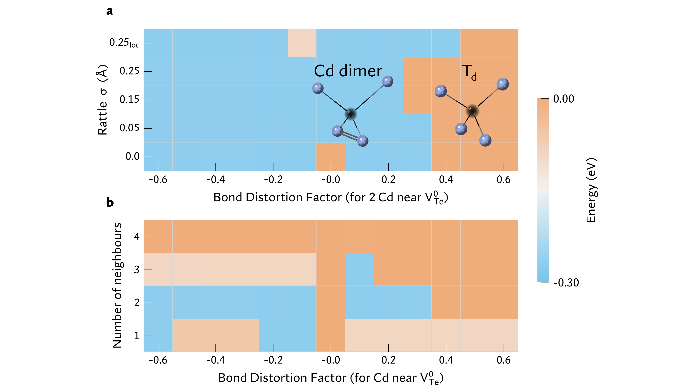

**Supplementary Figure 1.** Relative energy of final structures for $\mathit{V}_{\mathrm{Te}}^{0}$ in CdTe (either ‘Cd dimer’ (-0.3 eV), ‘Tetrahedral’ (0 eV) or a $\mathrm{C}_{3\mathrm{v}}$ reconstruction (-0.1 eV)), for different rattle standard deviations (**a**) and number of distorted defect neighbours (**b**). The wider interval of bond distortions leading to the defect ground state is obtained with a standard deviation of 0.25 Å  localised to the atoms within 5 Å  from the defect ($0.25_{\mathrm{loc}}$). Regarding the number of neighbours, best performance is obtained when distorting two cadmium atoms, as expected considering that the defect has two extra electrons in the Cd dangling bonds.

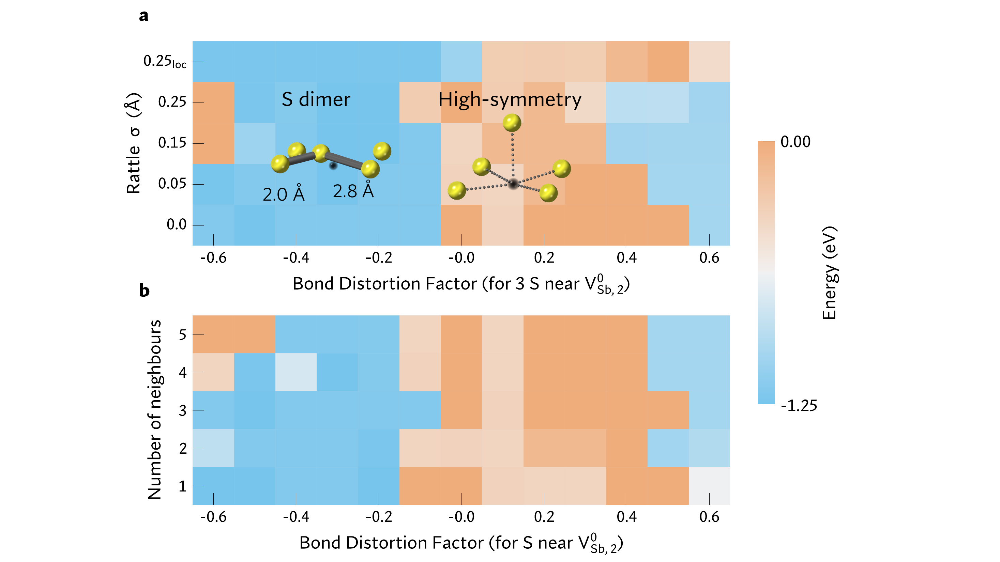

**Supplementary Figure 2.** Relative energy of final structures for $\mathit{V}_{\mathrm{Sb,2}}^{0}$ in $\mathrm{Sb_{2}S_{3}}$ (either ‘S dimer’ (-1.25 eV) or ‘High-symmetry’ configuration (0 eV)), for different rattle standard deviations (**a**) and number of distorted defect neighbours (**b**). Here, the bond distortion parameters have a minor influence (with two and three distorted neighbours performing slightly better), which suggests that any symmetry breaking is enough to escape the local minimum and find the favourable ‘S dimer’ configuration.

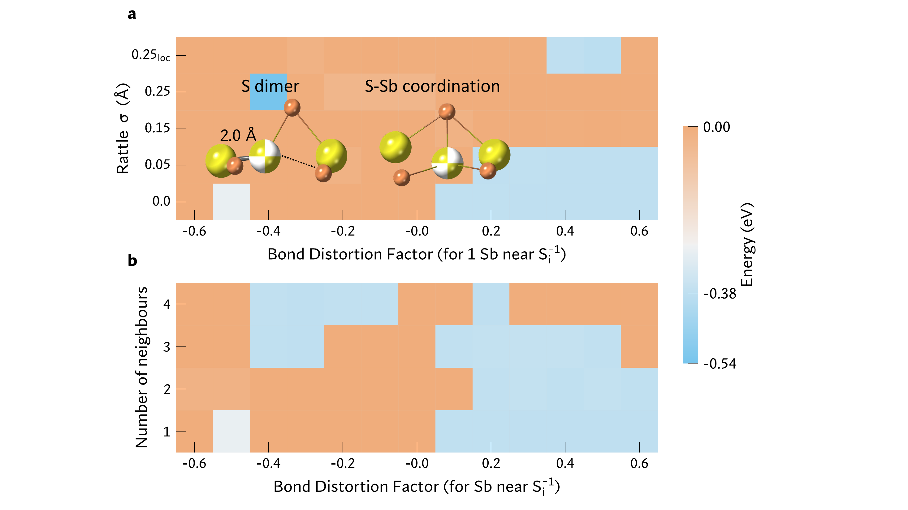

**Supplementary Figure 3.** Relative energy of final structures for $\mathrm{S}_{i}^{-1}$ in $\mathrm{Sb_{2}S_{3}}$ (either two different arrangements of ‘S dimer’ ($-0.55\,\mathrm{eV}$, $-0.38\,\mathrm{eV}$) or weak S-Sb coordination ($0\,\mathrm{eV}$)), for different rattle standard deviations (**a**) and number of distorted defect neighbours (**b**). Notably, the lowest energy structure is only obtained when applying a total rattle standard deviation of $0.25\,\mathrm{Å}$. In this case, the number of distorted neighbours seems to have a minor role – with three and one performing slightly better.

### 1. Comparison of local and total rattle

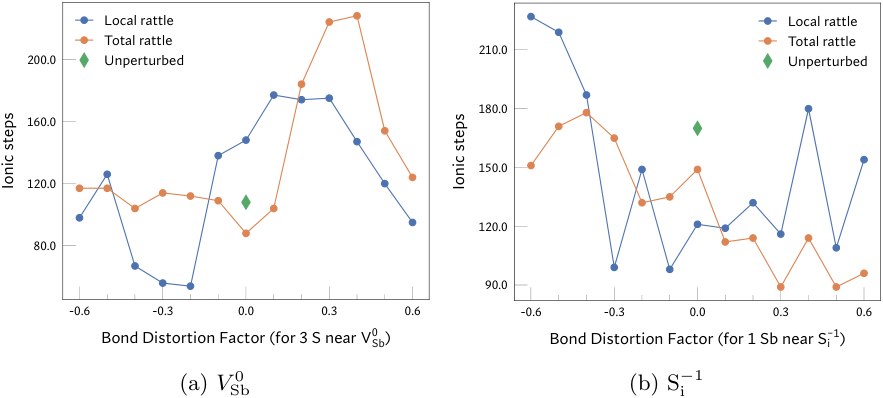

**Supplementary Figure 4.** Total number of ionic steps for each bond distortion with a local rattle (restricted to a 5 Å sphere about the defect, $\sigma = 0.25$) and a total rattle ($\sigma = 0.25$) in the relaxation of $V_{\mathrm{Sb}}^0$ (**a**) and $S_{\mathrm{i}}^{-1}$ (**b**) in $\mathrm{Sb_2S_3}$. Surprisingly, the local rattle does not lead to a significant decrease in the number of ionic steps compared with its total counterpart.

### 2. Comparison of bond distortions

To investigate if a smaller subset of distortions could identify most energy-lowering reconstructions, we compared the number of ground states found by each distortion for all systems studied (a total of 61 energy-lowering reconstructions; Supplementary Figure 5). We also investigated the cases where only one distortion finds the ground state (Supplementary Figure 6). For cases where computational limitations require a sparser grid, we recommend the following bond distortions: -60%, -40%, -30%, -20%, 0%, 20%, and 40%, or a subset selected with reference to Supplementary Figure 5. Using only a rattling distortion (random perturbations to all atoms in the cell) misses more than 70% of the identified energy-lowering distortions, which emphasises the importance of using bond distortions.

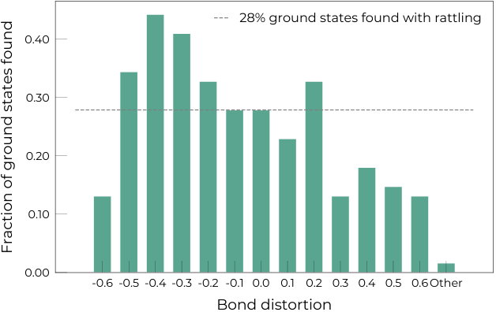

**Supplementary Figure 5.** Fraction of ground-state structures identified by each distortion for a total of 61 energy-lowering reconstructions. “Other” corresponds to using the ground-state structure identified for one charge state as a candidate configuration for other charge states of the same defect (where that configuration was not found). The dashed grey line shows the fraction of ground states identified when only applying random distortions to all atoms in the cell (bond distortion = 0.0).

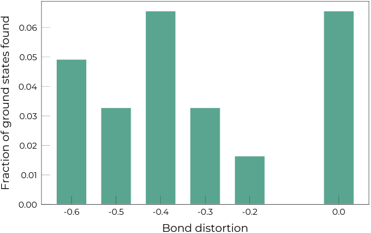

**Supplementary Figure 6.** Set of distortions that uniquely find the ground state (i.e. the only distortions in their grid to identify the lowest-energy structure), and the fraction of ground states identified by each (out of 61 energy-lowering reconstructions).

## D. Comparison with other structure searching approaches

To compare the performance of our method with existing approaches in the literature, it was applied to the neutral silicon self-interstitial and the neutral oxygen vacancy in anatase. These systems were selected as they were previously investigated using the evolutionary approach of Arrigoni and Madsen.12

### 1. Silicon self-interstitial

The high technological relevance of the silicon self-interstitial has motivated a large number of studies on its structural and migration properties. These have identified several low energy configurations: Si in an tetrahedral interstitial ($\mathrm{Si}_{T}$), Si in a hexagonal interstitial ($\mathrm{Si}_{H}$) and the split $<110>$ configuration ($\mathrm{Si}_{\langle 110\rangle}$), where two Si move from their original site and form a dumbbell configuration along the $<110>$ direction13–24. These are shown in Supplementary Figure 7. Previous studies agree that the hexagonal and split configurations are the most stable, differing by a small energy difference (order of meV), with the latter likely corresponding with the ground state13,21,22,25–27. Significantly higher in energy lies the tetrahedral structure ($\approx0.4$ eV) 18–20,25.

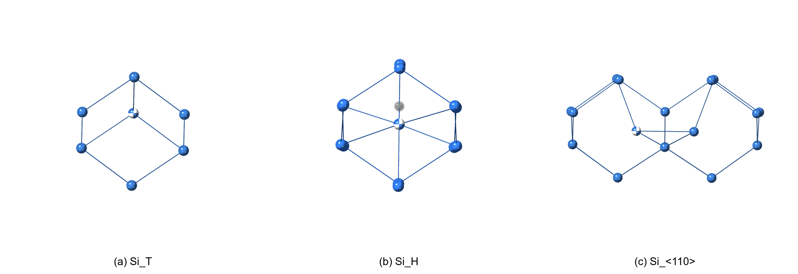

**Supplementary Figure 7.** Lowest-energy structures for the silicon self-interstitial: (**a**) $\mathrm{Si_T}$, (**b**) $\mathrm{Si_H}$, and (**c**) $\mathrm{Si_{<110>}}$. The silicon interstitial is shown with a different pattern and the original tetrahedral position is shown in grey.

By applying our method, we identified the two lowest energy structures, thereby exhibiting similar results to the evolutionary approach of Arrigoni and Madsen, yet with a simpler implementation. In agreement with their result, we identified the ground state as the hexagonal configuration. We find it to lie 7 meV lower in energy than the split arrangement, opposed to their result of 23 meV using local DFT (LDA) and
$\Gamma$-point only **k**-point sampling. As expected, the latter agrees better with our initial result (31 meV), obtained prior to optimising the final structures with a denser **k**-mesh. On this point, it is noteworthy how the approximate exploration of the PES (i.e. the
$\Gamma$-point approximation) qualitatively described the landscape despite the minute energy differences between local minima. These minor energy differences between structures explain the debate across different studies (and energy functionals) regarding the actual ground state.18,23–25,28 Semi-local functionals often favour the split configuration13,22,23,25–27, while higher levels of theory (QMC24 or $\mathrm{G_0W_0}$ corrections18) agree that the hexagonal structure lies lower in energy, by 160 and 60 meV, respectively.
Finally, we note that a tetrahedral configuration ($\mathrm{Si}_{T}$) was found to have no local stability with our hybrid DFT functional, with unperturbed relaxation of this initial geometry without symmetry constraints yielding the hexagonal arrangement ($\mathrm{Si}_{H}$), as also reported in other studies24.

### 2. Neutral oxygen vacancy in anatase

The key role of anatase in photo-catalysis29,30, solar cells31,32, spintronic devices33 and as a promising transparent conductive oxide34,35 have motivated intense study of its intrinsic defects36. In particular, significant efforts have been dedicated to the oxygen vacancy37–47, as it renders intrinsic anatase n-type48. Several studies41–43,46 have reported two possible configurations: the simple vacancy (analogous to the ideal defect structure, Fig. 8 (a)) and the split configuration, where one of the neighbouring oxygen atoms moves towards the vacancy (Fig. 8 (b)); with the latter lying 0.38 eV lower in energy (using HSE(15%))46. In terms of the electronic structure, the former is characterised by two localised electrons in the vacancy site while for the latter, one electron is localised on a neighbouring Ti while the other one is excited to a delocalised conduction band state. Notably, this lower energy configuration has been missed by previous hybrid studies45,49, as a standard relaxation from the ideal structure gets trapped on the simple vacancy basin.

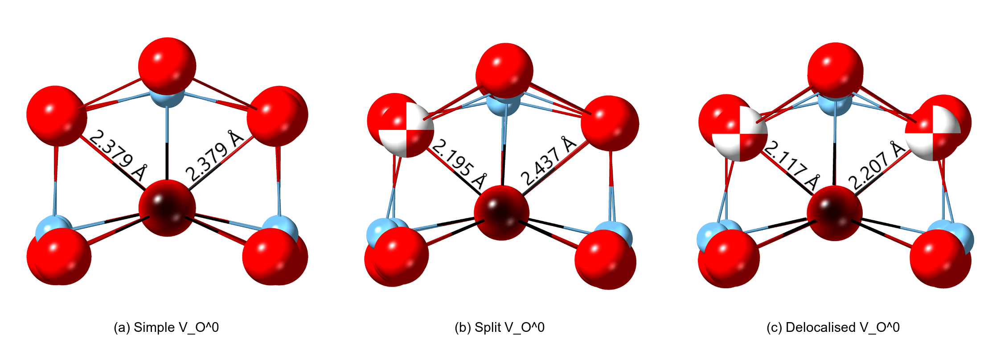

**Supplementary Figure 8.** Lowest-energy structures for the neutral oxygen vacancy in anatase $\mathrm{TiO_2}$: (**a**) simple $V_{\mathrm{O}}^0$, (**b**) split $V_{\mathrm{O}}^0$, and (**c**) delocalised $V_{\mathrm{O}}^0$. Ti atoms are blue, O atoms are red, $V_{\mathrm{O}}$ is black, and displaced O neighbours are shown with a different pattern.

By applying their evolutionary algorithm, Arrigoni and Madsen identified, besides these structures, a new metastable configuration, termed the delocalised vacancy since the two electrons are delocalised in the conduction band (Fig. 8 (c)). Lying 59 meV higher in energy than the split structure, it is characterised by two neighbouring oxygen atoms moving towards the vacancy. These reduce their bond lengths from an initial value of 2.45 Å to 2.12 and 2.21 Å. In comparison, our method also identified these structures, finding the simple vacancy and delocalised vacancy to lie 0.37 and 0.03 eV higher in energy than the split structure, respectively – in good agreement with the result of Arrigoni (0.38, 0.06 eV). Hence, both approaches rendered similar configurations and relative stabilities.

# II. Supplementary Notes

## A. Symmetry breaking reconstructions

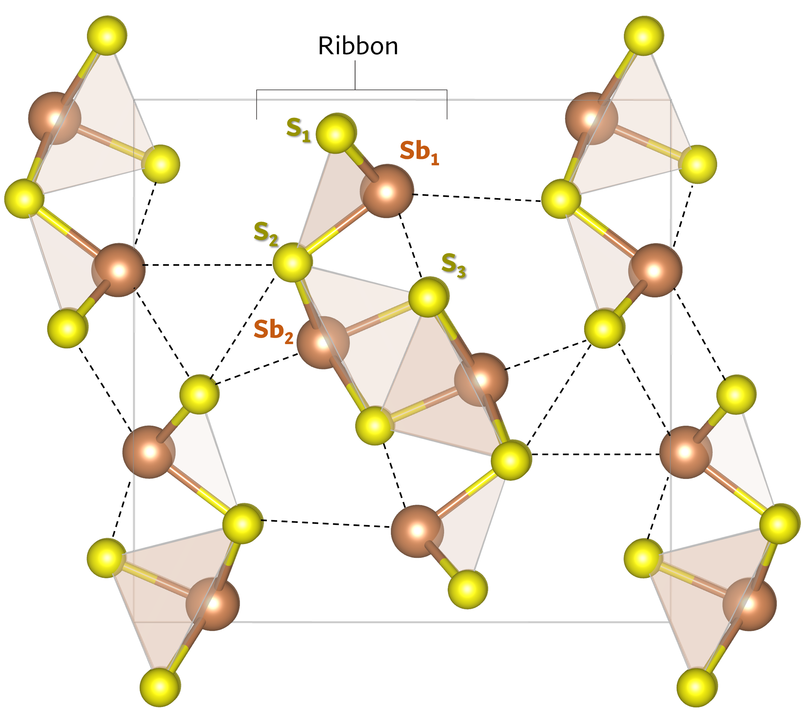

**Supplementary Figure 9.** The crystal structure of $\mathrm{Sb_2S_3}$ (and $\mathrm{Sb_2Se_3}$) comprises chains of $[\mathrm{Sb_4S_6}]_n$ ($[\mathrm{Sb_4Se_6}]_n$), termed ribbons, which are bonded by weak van der Waals forces (dashed lines). Each ribbon has two and three symmetry-inequivalent sites for antimony and sulfur, respectively, with the Sb cations occupying the centre of a pyramid formed by the closest S anions.

## B. Rebonding: dimerisation

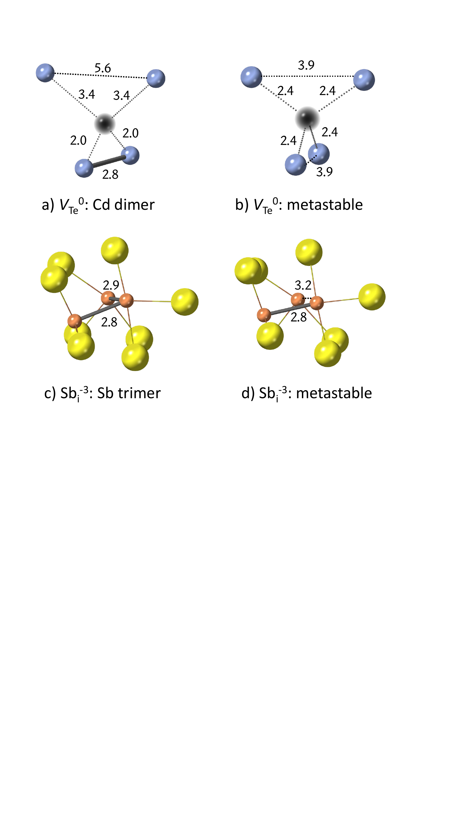

**Supplementary Figure 10.** Ground state (left: a,c) and metastable (right: b,d) structures identified by our method and by relaxing the high-symmetry configuration, respectively, for cation-cation dimerisation. (Energies and displacements reported in Table 1). Vacancy in black, Cd in blue, Sb in orange and S in yellow.

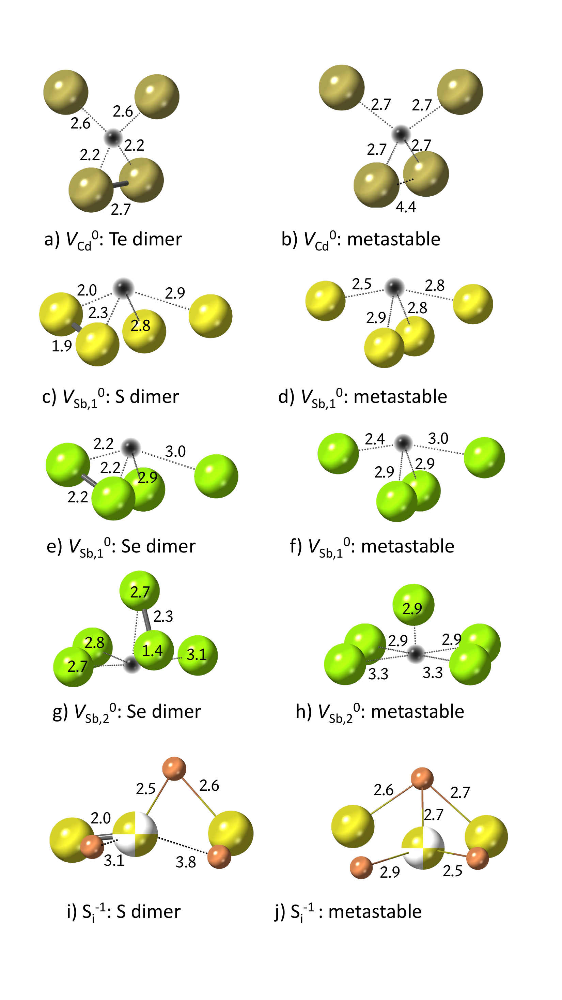

**Supplementary Figure 11.** Ground state (left: a,c,e,g,i) and metastable (right: b,d,f,h,j) structures identified by our method and by relaxing the high-symmetry configuration, respectively, for anion-anion dimerisation. (Energies and displacements reported in Table 1). Te in gold, Sb in orange, S in yellow and Se in green. Vacancy shown in shaded black and $\mathrm{S}_{i}$ displayed in a different pattern. Pseudo-bonds between a vacancy and its neighbours shown with dotted lines, and distances in Å.

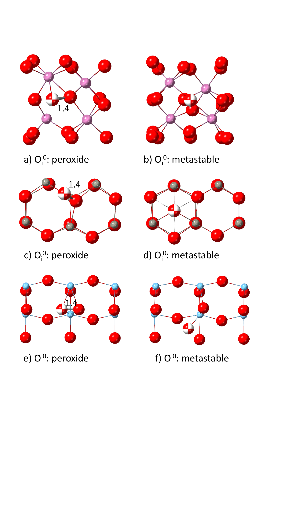

**Supplementary Figure 12.** Ground state (left: a,c,e) and metastable (right: b,d,f) structures identified by our method and by relaxing the high-symmetry configuration, respectively, for the anion-anion dimerisation in $\mathrm{In_{2}O_{3}}$, $\mathrm{ZnO}$ and anatase $\mathrm{TiO_{2}}$. (Energies and displacements reported in Table 1). In in purple, Zn in grey, Ti in blue and O in red with $\mathrm{O}_{i}$ shown in a different pattern for clarity.

**Supplementary Table III.** Integrated Crystal Orbital Hamilton Population (ICOHP) for the S-S/Se-Se bonds formed by the under-coordinated neighbours of $\mathit{V}_{\mathrm{Sb}}$ in $\mathrm{Sb_{2}S/Se_{3}}$.

| Charge | Sb₂S₃ Site 1 | Sb₂S₃ Site 2 | Sb₂Se₃ Site 1 | Sb₂Se₃ Site 2 |
|---:|---:|---:|---:|---:|
| -1 | -6.87 | -6.84 | -4.97 | -4.96 |
| 0 | -9.15 | -7.74 | -6.60 | -5.54 |
| +1 | -13.36 | -13.41 | -6.69 | -10.12 |
| +2 | -14.50 | -14.84 | -11.09 | -10.83 |

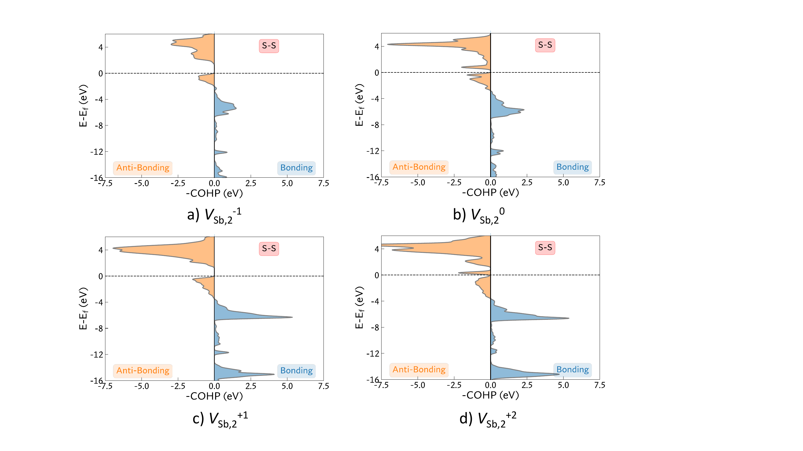

**Supplementary Figure 13.** Crystal Orbital Hamilton Population (COHP) analysis for the sulfur-sulfur bonds formed by the vacancy neighbours in the ground state structures of $\mathit{V}_{\mathrm{Sb,2}}$ in $\mathrm{Sb_{2}S_{3}}$, illustrating the stronger bonding character of the S-S dimers for the positive charge states.

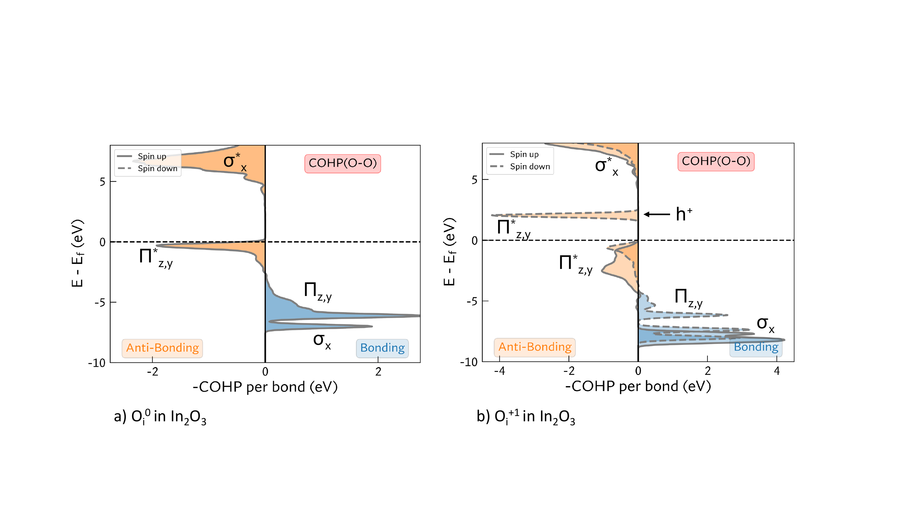

**Supplementary Figure 14.** Crystal Orbital Hamilton Population (COHP) analysis for the oxygen dimer bonds in the ground state structures of $\mathit{O}_{\mathrm{i}}$ in $\mathrm{In_{2}O_{3}}$. The orbital character of the different states is assigned by comparison with the molecular orbital diagram of a peroxide anion. For positive charge state, the hole is localised on the antibonding $\pi$\* state, which appears within the band gap.

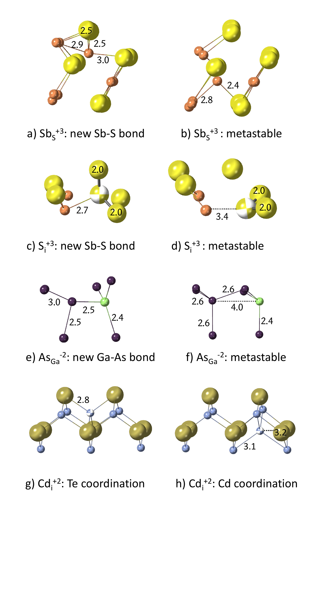

**Supplementary Figure 15.** Ground state (left: a,c,e,g) and metastable (right: b,d,f,h) structures identified by our method and by relaxing the high-symmetry configuration, respectively, for the cation-anion rebonding reconstruction. (Energies and displacements reported in Table 2). Vacancy in black, Te in gold, Cd in blue, Sb in orange, S in yellow, Ga in green and As in purple. Interstitials shown with a different pattern and distances in Å.

## C. Crystal field and Jahn-Teller effects

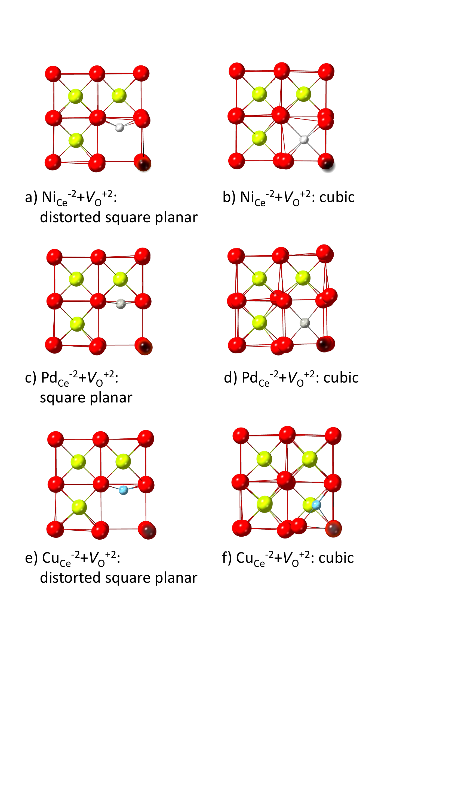

**Supplementary Figure 16.** Ground state (left: a,c,e) and metastable (right: b,d,f) structures identified by our method and by relaxing the high-symmetry configuration, respectively, for crystal field and Jahn-Teller reconstructions in ceria. (Energies and displacements reported in Table 3). $\mathit{V}_{\mathrm{O}}$ in black, Ce in green, O in red, Ni in light grey, Pd in dark grey and Cu in blue.

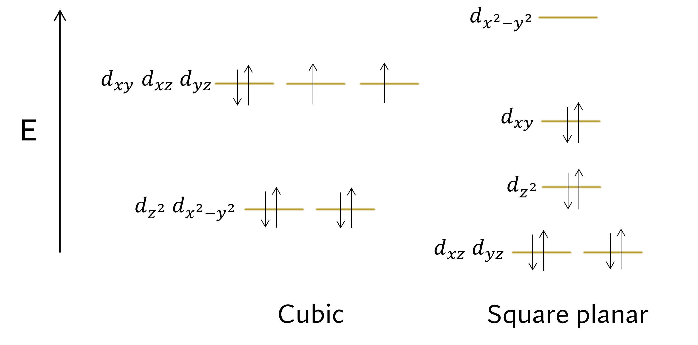

**Supplementary Figure 17.** Electron energy level diagram for $d^8$ dopants on $\mathrm{CeO_{2}}$ showing the crystal field splitting for the initial cubic coordination and the more favourable square-planar arrangement, which leads to a gain in electronic energy.

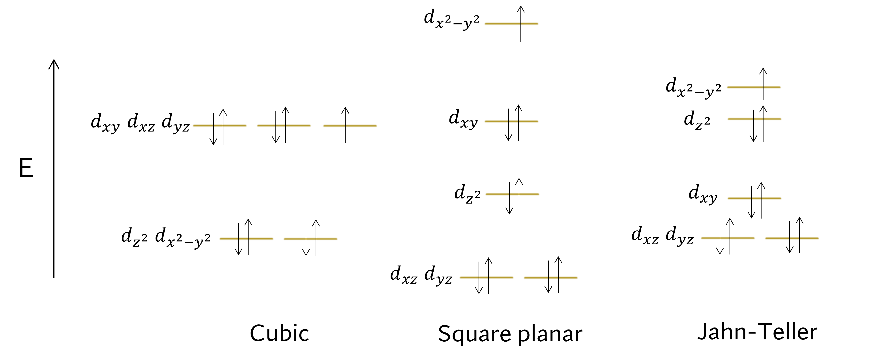

**Supplementary Figure 18.** Electron energy level diagram for a $d^9$ dopant, showing the advantage of the Jahn-Teller distortion as it lowers the energy of the partially-occupied $d_{x^2-y^2}$ orbital, in comparison with the square-planar arrangement.

## D. Electrostatically driven

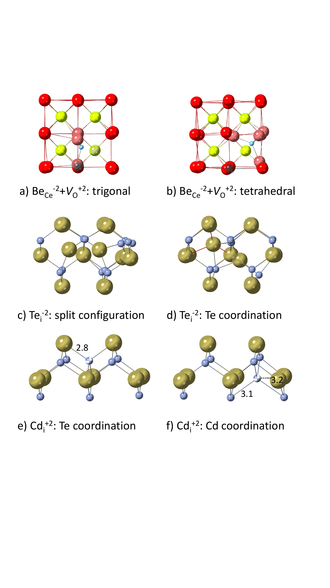

**Supplementary Figure 19.** Ground state (left: a,c,e) and metastable (right: b,d,f) structures identified by our method and by relaxing the high-symmetry configuration, respectively, for electrostatically driven reconstructions. (Energies and displacements reported in Table 4). Be in blue, Ce in green, O in red, Te in gold and Cd in blue. Vacancy shown in shaded black.

## E. Defect bound polarons

### 1. Neutral oxygen vacancy in $\mathrm{CeO_{2}}$

In order to test the ability of the method to identify defect bound polarons, we first considered the neutral oxygen vacancy in $\mathrm{CeO_{2}}$. Upon vacancy formation, two electrons localise on two Ce ions, reducing them to Ce(III). The location of the Ce(III) ions is however not clear, with some studies reporting both Ce(III) as nearest neighbours of the vacancy (NN, NN)50–53, next nearest neighbours (NNN, NNN)54,55, or even a combination of the two (NN, NNN)56. We therefore applied the method to this defect to test whether it was able to identify these configurations. In order to thoroughly sample both spin alignments, we applied it twice: setting the number of unpaired electrons to 2 (spin-aligned, $\uparrow\uparrow$) and also to 0 (anti-aligned, $\uparrow\downarrow$) (Fig. 20, 21). This results in all previously reported configurations being identified: both Ce(III) in the first coordination shell (NN, NN), both in the second coordination shell (NNN, NNN), one in the first and the other in the second (NN, NN) and also combinations of first/second and third coordination shells (NN, N(3) and NNN, N(3)). The energy differences between these states are of the order of meV, explaining the debate in the literature regarding the most stable configuration. These results demonstrate the ability of the method to identify different polaronic states, even when their energy differences are small. In such cases, where the energy differences are within the error of the $\Gamma$-point approximation, each low-energy structure obtained from the initial search should be optimised with denser reciprocal-space sampling.

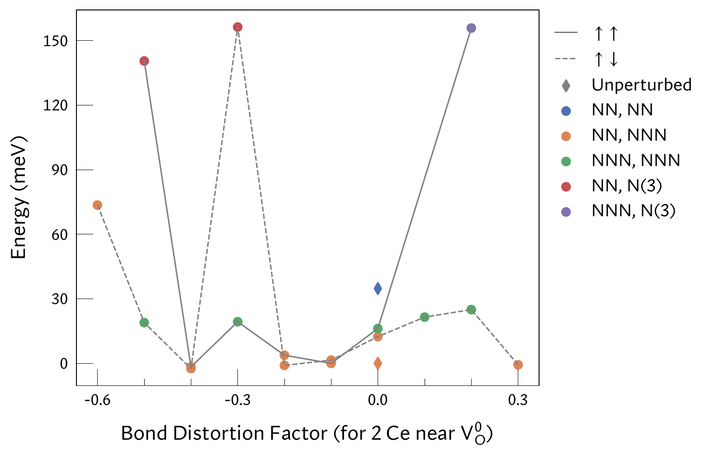

**Supplementary Figure 20.** Relative energy (in meV) of the different configurations identified for the neutral oxygen vacancy in $\mathrm{CeO_{2}}$. The method was applied both constraining the difference of the number of electrons in the up and down spin component to 2 (solid line) and also to 0 (dashed line). Standard relaxation from the high symmetry structure shown with a diamond (Unperturbed). The different colours indicate where the two Ce(III) ions are located relative to the vacancy: nearest neighbour (NN), next nearest neighbour (NNN) or in the third coordination shell (N(3)).

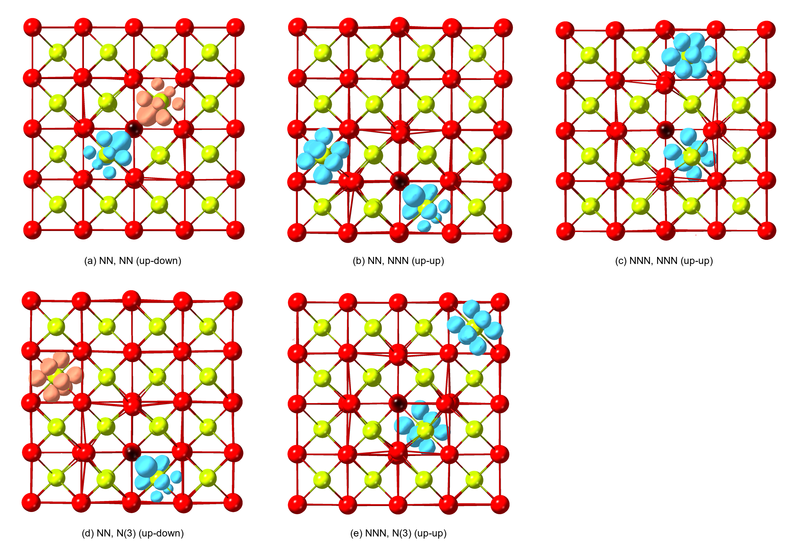

**Supplementary Figure 21.** Structures with spin-density plots for the different configurations identified with our method for $V_{\mathrm{O}}^0$ in $\mathrm{CeO_2}$. $V_{\mathrm{O}}$ is shown in black, Ce in green, and O in red. The spin density of the two channels is shown with different colours. In all cases, the isosurfaces correspond to 10.5% of the maximum charge density.

### 2. Neutral oxygen vacancy in $\mathrm{TiO_{2}}$

A similar situation occurs for the neutral oxygen vacancy in rutile $\mathrm{TiO_{2}}$. Upon vacancy formation, the two electrons donated by the vacancy can localise on different Ti ions, reducing them to Ti(III). To test whether our approach could find the different polaronic configurations and investigate the influence of enforcing magnetisation constraints, we applied the method with different setups: i) without any magnetisation constraints, ii) setting the number of unpaired electrons to 2 (spin-aligned, $\uparrow\uparrow$) and also to 0 (anti-aligned, $\uparrow\downarrow$). As shown in Figure 22, $\uparrow\uparrow$ and $\uparrow\downarrow$ show negligible energy differences, in agreement with previous studies40,45.

The most favourable configurations correspond to the Ti(III) ions located in the second or third coordination shell (Fig. 23), as reported by a previous HSE06 study44. This however differs from other computational studies which employed the Hubbard correction and found both Ti(III) to lie in the first coordination shell (N(1), N(1))40. To verify our method was not missing this state, we performed additional geometry optimisations initialising the magnetic moments of two of the vacancy nearest neighbours. These configurations relaxed to a state with both Ti(III) ions located further away from the vacancy (first and second coordination shell), demonstrating that the N(1), N(1) state is not locally stable with this functional and supercell size, as previously reported by another HSE06 study44.
Finally, we note that all lowest energy states are successfully identified by the unconstrained run in this case, with comparable performance in the case of the spin-aligned ($\uparrow\uparrow$) constraint.

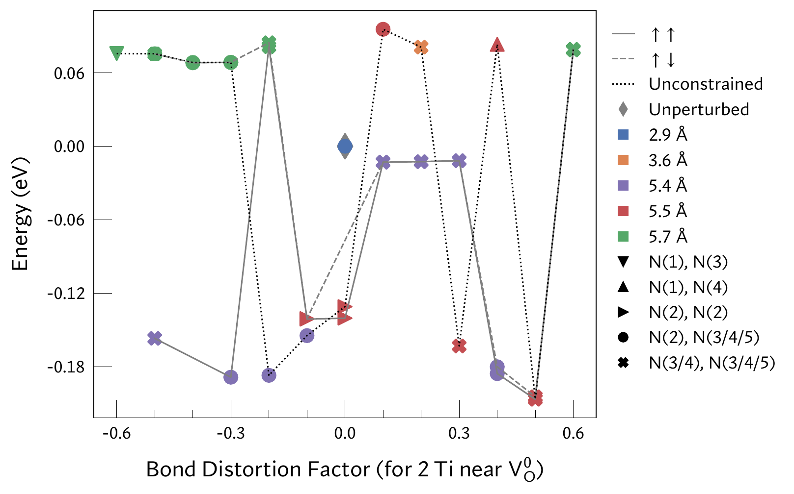

**Supplementary Figure 22.** Relative energy (in eV) of the different configurations identified for the neutral oxygen vacancy in rutile $\mathrm{TiO_{2}}$. The method was applied by either constraining the difference of the number of electrons in the up and down spin component to 2 (solid line), to 0 (dashed line) and without constraints (dotted line). The different colours indicate the distance between the two Ti(III) ions while the marker shapes correspond to where the Ti(III) are located relative to the vacancy: first coordination shell (N(1), i.e. nearest neighbour), second coordination shell (N(2), i.e. next nearest neighbour) and so on. As shown, spin-aligned and anti-aligned states have negligible energy differences.

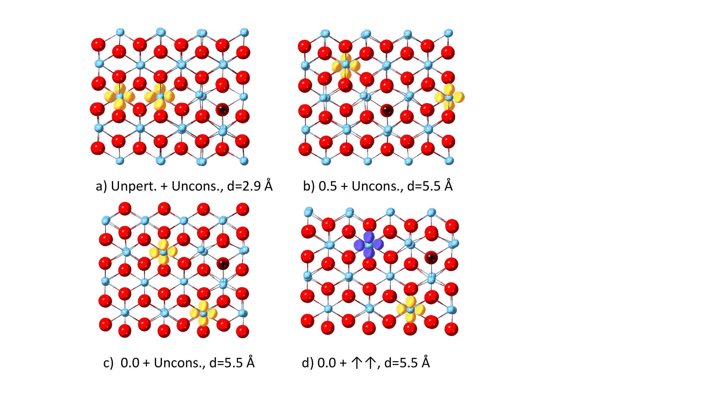

**Supplementary Figure 23.** Lowest energy configurations identified for $\mathit{V}_{\mathrm{O}}^{0}$ in anatase $\mathrm{TiO_{2}}$. The labels indicate the bond distortion leading to that state, magnetisation constraints and distance between Ti(III) sites. The spin density associated to the states introduced by $\mathit{V}_{\mathrm{O}}^{0}$ is shown, with different colours to differentiate spin channels. In all cases, the isosurfaces correspond to 25% of the maximum charge density. $\mathit{V}_{\mathrm{O}}$ in black, Ti in blue and O in red.

### 3. Neutral titanium interstitial in $\mathrm{TiO_{2}}$

As with the oxygen vacancy, the titanium interstitial can lead to different states depending on where the donated electrons localise. The identified configurations are shown in Figure 24 and 25. Performing a geometry optimisation from the high-symmetry structure results in most of the charge localised on the interstitial and its Ti neighbours (1 electron shared between $\mathrm{Ti}_{i}$ and a neighbouring Ti, 2 electrons localised on two NN and 1 electron localised further away, Fig. 25 (a)). This state is similar to the configuration reported by previous hybrid42,44 and GGA+U studies57. In contrast, our approach finds lower energy states where three of the donated electrons localise on Ti ions further away from the defect while the remaining electron is shared between the interstitial and a neighbouring Ti.

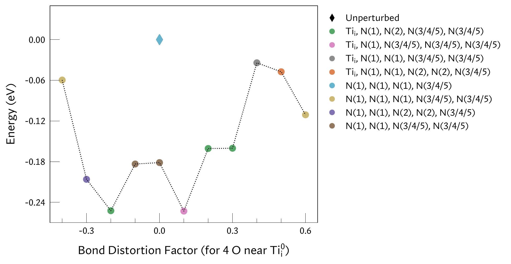

**Supplementary Figure 24.** Relative energy (in eV) of the different configurations identified for the neutral titanium interstitial in rutile $\mathrm{TiO_{2}}$. Standard relaxation from the high symmetry structure shown with a diamond (Unperturbed). The method was applied without magnetisation constraints. The different colours indicate the position of the Ti ions where the additional charge is localised, relative to $\mathrm{Ti}_{i}$: first coordination shell (N(1)), second coordination shell (N(2)) and so on. We find negligible energy difference between $\uparrow\downarrow$ and $\uparrow\uparrow$ (2 unpaired electrons) arrangements. We note that certain configurations with similar localisation patterns differ in their energy due to small structural differences and/or the degree of charge localisation.

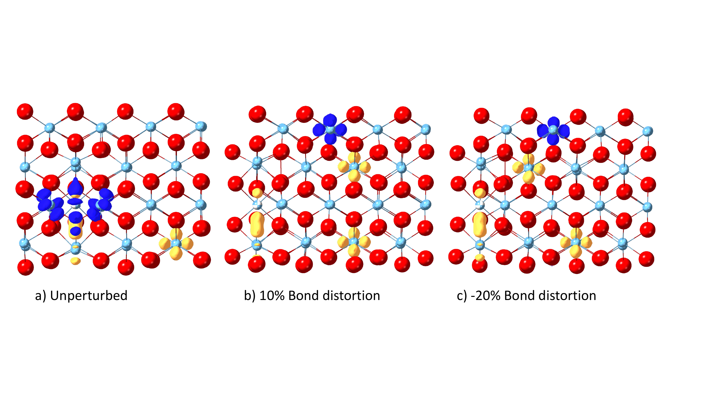

**Supplementary Figure 25.** Low energy structures identified for the neutral titanium interstitial in rutile $\mathrm{TiO_{2}}$. The spin density associated to the $\mathrm{Ti}_{i}$ states is shown, with different colors indicating different spin channels. In all cases, the isosurfaces correspond to 30% of the maximum charge density.

### 4. Singly negative indium vacancy in $\mathrm{In_{2}O_{3}}$

Finally, we also considered the singly negative charged indium vacancy in $\mathrm{In_{2}O_{3}}$, where the method was applied without magnetisation constraints. As shown in Figure 26, a standard relaxation from the ideal structure results in a spin-aligned state ($\uparrow\uparrow$), with two holes localised on two of the vacancy neighbours. In contrast, we find an $\mathrm{anti-aligned}$ state ($\uparrow\downarrow$) to be more stable (by 60 meV). Compared to spin-aligned, in the anti-aligned case the two oxygens with a hole localised are displaced further away from each other (by 0.1 Å). While for this simple PES relaxing with magnetisation constraints would also identify the $\uparrow\downarrow$ state, these results demonstrate that applying the method without magnetisation constraints can successfully identify both configurations. In general, these results exemplify the ability of the method to identify different polaronic states, even for defects with a complex PES with several low energy minima.

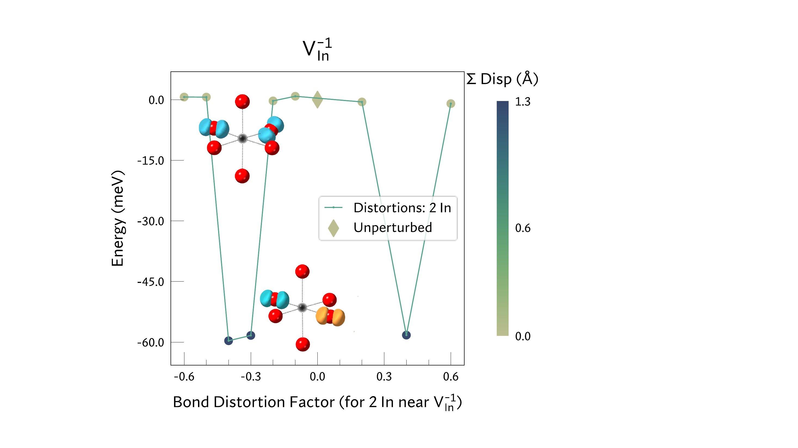

**Supplementary Figure 26.** Relative energy (in meV) and structures of the different configurations identified for the singly negative indium vacancy in $\mathrm{In_{2}O_{3}}$. Standard relaxation from the high symmetry structure shown with a diamond (Unperturbed). The colourbar represents the structural difference between each structure and the ‘Unperturbed’ one, measured as the sum of the atomic displacements between structures. $\mathit{V}_{\mathrm{In}}$ in black and O in red. The spin density of different channels is shown with different colours.

## F. Impact on defect properties

**Supplementary Table IV.** Concentrations (in $\mathrm{cm}^{-3}$) of the stable charge states for the ground and metastable structures of $\mathit{V}_{\mathrm{Sb}}$ in $\mathrm{Sb_{2}S_{3}}$, for typical growth conditions (T = 550 K) and the Fermi level 0.97 eV above the VBM, as determined experimentally58. Dashes (‘-’) signify unstable charge states.

| $V_{\mathrm{Sb,1}}$ charge | Ground state (cm⁻³) | Metastable (cm⁻³) | $V_{\mathrm{Sb,2}}$ charge | Ground state (cm⁻³) | Metastable (cm⁻³) |
|---:|---:|---:|---:|---:|---:|
| +2 | $2.1 \times 10^{-2}$ | $5.7 \times 10^{-17}$ | +2 | $4.4 \times 10^{-3}$ | $5.0 \times 10^{-22}$ |
| +1 | $4.2 \times 10^{2}$ | - | +1 | $6.3 \times 10^{6}$ | $5.9 \times 10^{-15}$ |
| 0 | - | - | 0 | - | $1.8 \times 10^{-7}$ |
| -1 | $8.4 \times 10^{8}$ | $2.3 \times 10^{3}$ | -1 | - | $3.8 \times 10^{-1}$ |
| -3 | $1.1 \times 10^{14}$ | $1.1 \times 10^{14}$ | -3 | $1.1 \times 10^{12}$ | $1.1 \times 10^{12}$ |

**Supplementary Table V.** Positions of thermodynamic charge transition levels (in eV above the VBM) for the ground and metastable structures of $\mathit{V}_{\mathrm{Sb}}$ in $\mathrm{Sb_{2}S_{3}}$. Dashes (‘-’) signify thermodynamically-unstable transition levels.

| Level | $V_{\mathrm{Sb,1}}$ ground state | Metastable | Level | $V_{\mathrm{Sb,2}}$ ground state | Metastable |
|---:|---:|---:|---:|---:|---:|
| (2/1) | 0.50 | - | (2/1) | -0.03 | -0.14 |
| (2/-1) | - | 0.26 | (1/0) | - | 0.15 |
| (1/-1) | 0.63 | - | (0/-1) | - | 0.28 |
| - | - | - | (1/-3) | 0.83 | - |
| (-1/-3) | 0.69 | 0.39 | (-1/-3) | - | 0.29 |

## G. Identifying metastable structures

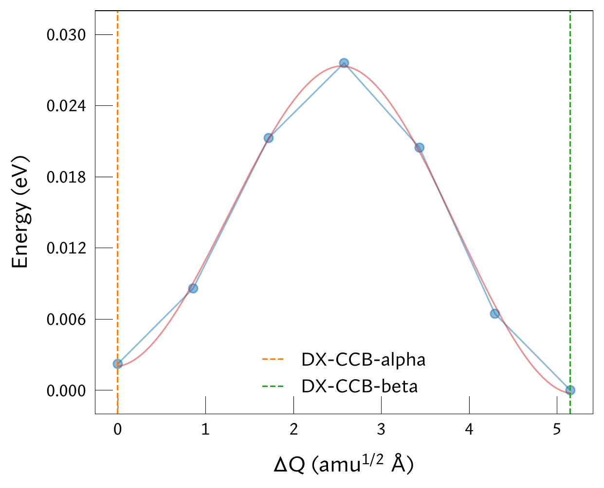

**Supplementary Figure 27.** Energy barrier (in eV) between $\mathrm{DX-CCB}-\alpha$ and $\mathrm{DX-CCB}-\beta$ for $\mathrm{S}_{\mathrm{As}}^{-1}$ in $\mathrm{GaAs}$, calculated with the nudged elastic band method (5 images).

# III. Supplementary References

1. Grimme, S., Antony, J., Ehrlich, S. & Krieg, H. A consistent and accurate ab initio parametrization of density functional dispersion correction (DFT-D) for the 94 elements H-Pu. _J. Chem. Phys._**132**, 154104 (2010).

2. Strauss, A. The physical properties of cadmium telluride. _Rev. Phys. Appl._**12**, 167–184 (1977).

3. Madelung, O. _Semiconductors Data Handbook_ (Springer, Berlin, 2004).

4. Rossignol, S., Gérard, F., Mesnard, D., Kappenstein, C. & Duprez, D. Structural changes of Ce–Pr–O oxides in hydrogen: a study by in situ X-ray diffraction and Raman spectroscopy. _J. Mater. Chem._**13**, 3017–3020 (2003).

5. Voutsas, G. P., Papazoglou, A. G., Rentzeperis, P. J. & Siapkas, D. The crystal structure of antimony selenide, Sb2Se3. _Z. Kristallogr. Cryst. Mater._**171**, 261–268 (1985).

6. P. Bayliss, Z., W. Nowacki. Refinement of the crystal structure of stibnite, Sb2S3. _Cryst. Mater_**135**, 308–315 (1972).

7. Gonz´alez, G. B. _et al._ Neutron diffraction study on the defect structure of indium–tin–oxide. _Journal of Applied Physics_**89**, 2550–2555 (2001).

8. Kisi, E. H. & Elcombe, M. M. _u_ parameters for the wurtzite structure of ZnS and ZnO using powder neutron diffraction. _Acta Crystallographica Section C_**45**, 1867–1870 (1989).

9. Bond, W. & Kaiser, W. Interstitial versus substitutional oxygen in silicon. _J. Phys. Chem. Solids_**16**, 44–45 (1960).

10. Burdett, J. K., Hughbanks, T., Miller, G. J., Richardson, J. W. & Smith, J. V. Structural-electronic relationships in inorganic solids: powder neutron diffraction studies of the rutile and anatase polymorphs of titanium dioxide at 15 and 295 K. _J. Am. Chem. Soc._**109**, 3639–3646 (1987).

11. Shiiba, H., Nakayama, M. & Nogami, M. Ionic conductivity of lithium in spinel-type Li4/3Ti5/3O4–LiMg1/2Ti3/2O4 solid-solution system. _Solid State Ion_**181**, 994–1001 (2010).

12. Arrigoni, M. & Madsen, G. K. H. Evolutionary computing and machine learning for discovering of low-energy defect configurations. _npj Comp Mater_**7** (2021).

13. Centoni, S. A. _et al._ First-principles calculation of intrinsic defect formation volumes in silicon. _Phys. Rev. B_**72**, 195206 (2005).

14. Ganchenkova, M. G. _et al._ Influence of the ab-initio calculation parameters on prediction of energy of point defects in silicon. _Mod. Electron. Mater._**1**, 103–108 (2015).

15. Lee, W.-C., Lee, S.-G. & Chang, K. J. First-principles study of the self-interstitial diffusion mechanism in silicon. _J. Condens. Matter Phys._**10**, 995–1002 (1998).

16. Needs, R. J. First-principles calculations of self-interstitial defect structures and diffusion paths in silicon. _J. Condens. Matter Phys._**11**, 10437–10450 (1999).

17. Stewart, J. A., Modine, N. A. & Dingreville, R. Re-examining the silicon self-interstitial charge states and defect levels: A density functional theory and bounds analysis study. _AIP Advances_**10**, 095004 (2020).

18. Rinke, P., Janotti, A., Scheffler, M. & Van de Walle, C. G. Defect Formation Energies without the Band-Gap Problem: Combining Density-Functional Theory and the _GW_ Approach for the Silicon Self-Interstitial. _Phys. Rev. Lett._**102**, 026402 (2009).

19. Bruneval, F. Range-Separated Approach to the RPA Correlation Applied to the van der Waals Bond and to Diffusion of Defects. _Phys. Rev. Lett._**108**, 256403 (2012).

20. Gao, W. & Tkatchenko, A. Electronic Structure and van der Waals Interactions in the Stability and Mobility of Point Defects in Semiconductors. _Phys. Rev. Lett._**111**, 045501 (2013).

21. Budde, M. _et al._ Identification of the hydrogen-saturated self-interstitials in silicon and germanium. _Phys. Rev. B_**57**, 4397–4412 (1998).

22. Al-Mushadani, O. K. & Needs, R. J. Free-energy calculations of intrinsic point defects in silicon. _Phys. Rev. B_**68**, 235205 (2003).

23. Mattsson, A. E., Wixom, R. R. & Armiento, R. Electronic surface error in the Si interstitial formation energy. _Phys. Rev. B_**77**, 155211 (2008).

24. Leung, W.-K., Needs, R. J., Rajagopal, G., Itoh, S. & Ihara, S. Calculations of Silicon Self-Interstitial Defects. _Phys. Rev. Lett._**83**, 2351–2354 (1999).

25. Morris, A. J., Pickard, C. J. & Needs, R. J. Hydrogen/silicon complexes in silicon from computational searches. _Phys. Rev. B_**78**, 184102 (2008).

26. Blöchl, P. E. _et al._ First-principles calculations of self-diffusion constants in silicon. _Phys. Rev. Lett._**70**, 2435–2438 (1993).

27. Bar-Yam, Y. & Joannopoulos, J. D. Silicon self-interstitial migration: Multiple paths and charge states. _Phys. Rev. B_**30**, 2216–2218 (1984).

28. Arrigoni, M. & Madsen, G. K. H. Evolutionary computing and machine learning for discovering of low-energy defect configurations. _npj Comput Mater_**7**, 71 (2021).

29. Schneider, J. _et al._ Understanding TiO2 Photocatalysis: Mechanisms and Materials. _Chem. Rev._**114**, 9919–9986 (2014).

30. Linsebigler, A. L., Lu, G. & Yates, J. T. Photocatalysis on TiO2 Surfaces: Principles, Mechanisms, and Selected Results. _Chem. Rev._**95**, 735–758 (1995).

31. Grätzel, M. Photoelectrochemical cells. _Nature_**414**, 338–344 (2001).

32. Bach, U. _et al._ Solid-state dye-sensitized mesoporous TiO2 solar cells with high photon-to-electron conversion efficiencies. _Nature_**395**, 583–585 (1998).

33. Janisch, R., Gopal, P. & Spaldin, N. A. Transition metal-doped TiO2 and ZnO—present status of the field. _J. Condens. Matter Phys._**17**, R657–R689 (2005).

34. Hitosugi, T. _et al._ Ta-doped Anatase TiO2 Epitaxial Film as Transparent Conducting Oxide. _Jpn. J. Appl. Phys._**44**, L1063–L1065 (2005).

35. Furubayashi, Y. _et al._ A transparent metal: Nb-doped anatase TiO2. _Appl. Phys_**86**, 252101 (2005).

36. Na-Phattalung, S. _et al._ First-principles study of native defects in anatase TiO2. _Phys. Rev. B_**73**, 125205 (2006).

37. Bouzoubaa, A., Markovits, A., Calatayud, M. & Minot, C. Comparison of the reduction of metal oxide surfaces: TiO2-anatase, TiO2-rutile and SnO2-rutile. _Surf. Sci._**583**, 107–117 (2005).

38. Shao, B., He, Y.-f., Feng, M., Lu, Y. & Zuo, X. Unexpected magnetic anisotropy induced by oxygen vacancy in anatase TiO2: A first-principles study. _J. Appl. Phys_**115**, 17A915 (2014).

39. Setvin, M. _et al._ Direct View at Excess Electrons in TiO2 Rutile and Anatase. _Phys. Rev. Lett._**113**, 086402 (2014).

40. Morgan, B. J. & Watson, G. W. Intrinsic n-type Defect Formation in TiO2: A Comparison of Rutile and Anatase from GGA+U Calculations. _J. Phys. Chem. C_**114**, 2321–2328 (2010).

41. Morgan, B. J. & Watson, G. W. Polaronic trapping of electrons and holes by native defects in anatase TiO2. _Phys. Rev. B_**80**, 233102 (2009).

42. Finazzi, E., Di Valentin, C., Pacchioni, G. & Selloni, A. Excess electron states in reduced bulk anatase TiO2: Comparison of standard GGA, GGA+U, and hybrid DFT calculations. _J. Chem. Phys._**129**, 154113 (2008).

43. Mattioli, G., Filippone, F., Alippi, P. & Amore Bonapasta, A. Ab initio study of the electronic states induced by oxygen vacancies in rutile and anatase TiO2. _Phys. Rev. B_**78**, 241201 (2008).

44. Deák, P., Aradi, B. & Frauenheim, T. Polaronic effects in TiO2 calculated by the HSE06 hybrid functional: Dopant passivation by carrier self-trapping. _Phys. Rev. B_**83**, 155207 (2011).

45. Deák, P., Aradi, B. & Frauenheim, T. Quantitative theory of the oxygen vacancy and carrier self-trapping in bulk TiO2. _Phys. Rev. B_**86**, 195206 (2012).

46. Arrigoni, M. & Madsen, G. K. H. A comparative first-principles investigation on the defect chemistry of TiO2 anatase. _J. Chem. Phys._**152**, 044110 (2020).

47. Yang, K., Dai, Y., Huang, B. & Feng, Y. P. Density-functional characterization of antiferromagnetism in oxygen-deficient anatase and rutile TiO2. _Phys. Rev. B_**81**, 033202 (2010).

48. Deák, P., Aradi, B. & Frauenheim, T. Oxygen deficiency in TiO2: Similarities and differences between the Ti self-interstitial and the O vacancy in bulk rutile and anatase. _Phys. Rev. B_**92**, 045204 (2015).

49. Boonchun, A., Reunchan, P. & Umezawa, N. Energetics of native defects in anatase TiO2: a hybrid density functional study. _Phys. Chem. Chem. Phys._**18**, 30040–30046 (2016).

50. Keating, P. R. L., Scanlon, D. O., Morgan, B. J., Galea, N. M. & Watson, G. W. Analysis of Intrinsic Defects in CeO2 Using a Koopmans-Like GGA+U Approach. _J. Phys. Chem. C_**116**, 2443–2452 (2012). Publisher: American Chemical Society.

51. Fabris, S., de Gironcoli, S., Baroni, S., Vicario, G. & Balducci, G. Taming multiple valency with density functionals: A case study of defective ceria. _Phys. Rev. B_**71**, 041102 (2005).

52. Castleton, C. W. M., Kullgren, J. & Hermansson, K. Tuning LDA+U for electron localization and structure at oxygen vacancies in ceria. _Chem. Phys._**127**, 244704 (2007). https://doi.org/10.1063/1.2800015.

53. Nakayama, M., Ohshima, H., Nogami, M. & Martin, M. A concerted migration mechanism of mixed oxide ion and electron conduction in reduced ceria studied by first-principles density functional theory. _Phys. Chem. Chem. Phys._**14**, 6079–6084 (2012).

54. Wang, H.-F., Guo, Y.-L., Lu, G.-Z. & Hu, P. Maximizing the Localized Relaxation: The Origin of the Outstanding Oxygen Storage Capacity of k-Ce2Zr2O8. _Angew. Chem._**48**, 8289–8292 (2009).

55. Shoko, E., Smith, M. F. & McKenzie, R. H. Charge distribution near bulk oxygen vacancies in cerium oxides. _J. Condens. Matter Phys._**22**, 223201 (2010).

56. Allen, J. P. & Watson, G. W. Occupation matrix control of d- and f-electron localisations using DFT + U. _Phys. Chem. Chem. Phys._**16**, 21016–21031 (2014).

57. Stausholm-Møller, J., Kristoffersen, H. H., Hinnemann, B., Madsen, G. K. H. & Hammer, B. DFT+U study of defects in bulk rutile TiO2. _The Journal of Chemical Physics_**133**, 144708 (2010).

58. Lian, W. _et al._ Revealing composition and structure dependent deep-level defect in antimony trisulfide photovoltaics. _Nat Commun_**12**, 3260 (2021).
