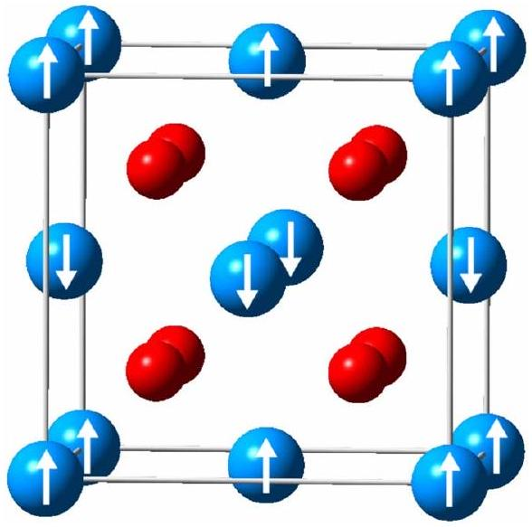
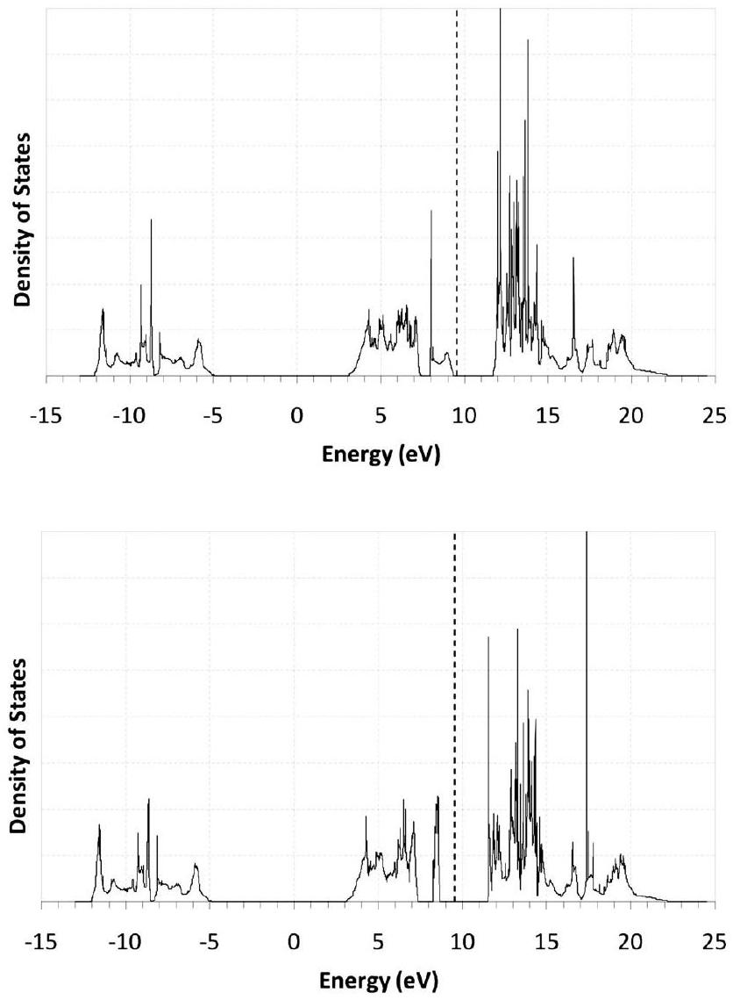
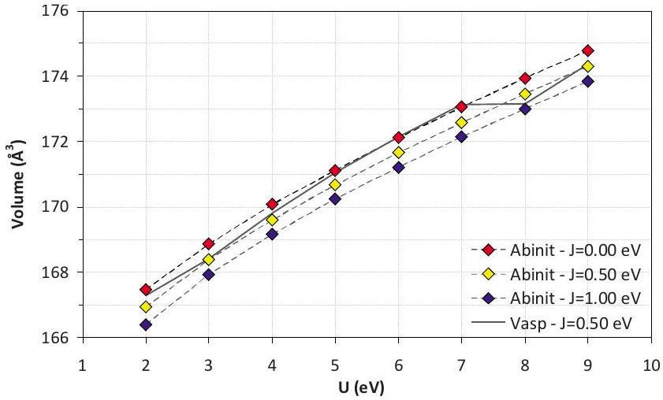

# DFT + U calculations of the ground state and metastable states of uranium dioxide 

Boris Dorado, ${ }^{1}$ Bernard Amadon, ${ }^{2}$ Michel Freyss, ${ }^{1}$ and Marjorie Bertolus ${ }^{1}$ ${ }^{1}$ CEA, DEN, DEC, Centre de Cadarache, 13108, Saint-Paul-Lez-Durance, France ${ }^{2}$ CEA, DAM, DIF, F-91297 Arpajon, France

(Received 21 January 2009; revised manuscript received 21 April 2009; published 19 June 2009)

#### Abstract

We report a study of the ground state and metastable states of uranium dioxide using ab initio DFT +U calculations. We highlight that in order to avoid metastable states and systematically reach the ground state of uranium dioxide with $\mathrm{DFT}+\mathrm{U}$, the monitoring of occupation matrices is crucial, as well as allowing the $5 f$ electrons to break the cubic symmetry. For this purpose, we use a method based on the monitoring of the occupation matrix of the correlated orbitals on which the Hubbard term is applied. We observe the presence of numerous metastable states in calculations both with and without taking into account the symmetries of the wave functions. We investigate the influence of metastable states on the total energy, as well as on the electronic and structural properties of uranium dioxide. We show that the presence of metastable states induces large differences in the total energy and explain the origin of the discrepancies observed in the results obtained by various authors on crystalline and defect-containing $\mathrm{UO}_{2}$. Finally, in order to check the consistency of the procedure, we determine the structural and electronic properties of the ground state of uranium dioxide and compare them with results obtained in previous studies using the DFT + U approximation and hybrid functionals, as well as experimental data.

DOI: 10.1103/PhysRevB.79.235125
PACS number(s): 71.15.Mb, 71.27.+a

## I. INTRODUCTION

Uranium dioxide is the standard nuclear fuel used in pressurized water reactors and has been extensively studied during the last decades, both experimentally ${ }^{1-4}$ and computationally. ${ }^{5-20}$ In order to better understand the behavior of this material under irradiation, its accurate description by first-principle methods is necessary. Such a description, however, remains challenging. Previous $a b$ initio calculations ${ }^{5,6,8,10}$ based on the density functional theory ${ }^{21,22}$ in the local-density approximation (LDA) and in the generalized gradient approximations (GGA) failed to describe correctly the strong correlations between the $5 f$ electrons of uranium. If in metallic uranium ( $\alpha$ uranium) electrons behave such as delocalized electrons in uranium dioxide on the contrary, the $5 f$ electrons are strongly localized and their correlation is greatly underestimated by LDA and GGA. Consequently, within these two approximations, uranium dioxide is found to be a metallic compound while it is actually a Mott-Hubbard insulator.

It is only with the development of approximations such as hybrid functionals for exchange and correlation, ${ }^{14}$ selfinteraction correction (SIC), ${ }^{23}$ or approximations based on the addition of a Hubbard term to the Hamiltonian-such as DFT +U (Ref. 24) and LDA +DMFT (Refs 25 and 26)-that the strong correlations between the $5 f$ electrons could be better described. Furthermore, the increase in available computing power enabled the study of large supercells and with it the investigation of the formation energies of point defects, ${ }^{11-13,17,18}$ as well as the study of point defect clusters in uranium dioxide. ${ }^{16}$ In addition to the calculations of formation energies, the incorporation of fission products in $\mathrm{UO}_{2}$ defects (mainly xenon, ${ }^{11}$ iodine, ${ }^{19}$ barium, and zirconium) ${ }^{15}$ was also investigated using GGA +U .

The authors of the recent papers ${ }^{11-13,17,18}$ on point defects in $\mathrm{UO}_{2}$ all used the same method [the projector augmented-
wave (PAW) method ${ }^{27}$ implemented in the same code, the same approximation (Dudarev's GGA+U), ${ }^{24}$ and very similar calculation parameters: the cut-off energies for the planewave basis only differ by a few tens of eV and the values of $U$ and $J$ are identical. Despite these similarities, surprising significant discrepancies are observed between the various studies. Table I presents results from references 11-13, 17, and 18. We see from this table that the differences in the formation energies can reach 2.0 eV for uranium Frenkel pairs and up to 2.7 eV for the Schottky defect. It is also observed that uranium-related defects exhibit larger discrepancies than oxygen-related defects suggesting that the strong correlation of $5 f$ electrons plays a more important role in these defects. Although the results from Table I are inconsistent, no problem in reaching the ground state of the system was mentioned in the studies of Yun, ${ }^{11}$ Iwasawa et al., ${ }^{12}$ Gupta et al. ${ }^{13}$ or Nerikar et al. ${ }^{17}$ It has already been mentioned, however, that the use of the DFT+U approximation induces an increase in the number of metastable states which makes the convergence to the ground state difficult. ${ }^{28,29} \mathrm{~A}$ recent study ${ }^{30}$ on cerium shows that the density matrix in the correlated subspace has to be monitored carefully, especially to study magnetism. Moreover, the recent work of Jomard et al. ${ }^{31}$ on plutonium oxides $\left(\mathrm{PuO}_{2}\right.$ and $\left.\mathrm{Pu}_{2} \mathrm{O}_{3}\right)$ provided a prac-

TABLE I. Formation energies (in eV ) of Frenkel Pairs and Schottky defects in uranium dioxide. All calculations were carried out within the PAW framework as implemented in the VASP package (Refs. 45-47) using the GGA+U approximation and including spin-polarization.
|  | Yun | Iwasawa | Gupta | Nerikar | Dorado |
| :--- | :---: | :---: | :---: | :---: | :---: |
| $\mathrm{FP}_{O}$ | 3.7 | 4.1 | 4.0 | 3.9 | 3.1 |
| $\mathrm{FP}_{U}$ |  | 13.2 | 14.2 | 15.1 | 13.8 |
| S | 7.0 |  | 7.2 | 7.6 | 4.5 |

tical procedure which consists in comparing the energies of all energy minima and therefore allows to unequivocally determine the ground state.

Regarding uranium dioxide, the conflicting results from Table I are therefore likely to stem from the use of the $\mathrm{DFT}+\mathrm{U}$ approximation. Unlike the LDA or GGA approximations, the DFT+U formalism creates an orbital anisotropy (See Sec. II B) which increases the number of metastable states (i.e., the number of energy minima). Consequently, the final state reached by the self-consistent algorithm and its associated total energy may be different depending on the starting point of the calculation. With a defect-free 6 -atom $\mathrm{UO}_{2}$ unit cell, the difference in the total energy can reach up to 3 eV (see Sec. III A). The existence of these metastable states therefore strongly affects the calculated formation energies of point defects and, as a consequence, any result derived from these formation energies: concentration of defects, solubility of fission products, etc. It is therefore important to ensure that the ground state of the system has indeed been reached. In this paper, we study for the first time all energy minima (ground state and metastable states) of uranium dioxide and investigate their influence on the structural and electronic properties of the material, both with and without taking into account the symmetries of the wave functions.

The paper is organized as follows: in Sec. II, we present the computational details, as well as the theoretical background for the DFT+U formalism and the orbital anisotropy it implies. In Sec. III, we introduce the occupation matrices for correlated orbitals and study all energy minima of uranium dioxide by a procedure which allows to unequivocally reach the ground state and which we explain in detail. In Sec. IV, we present our results on the calculated properties of the ground state and metastable states of the bulk uranium dioxide yielded by the procedure presented in Sec. III.

## II. COMPUTATIONAL DETAILS

## A. Calculations parameters

Calculations are carried out using the PAW (Ref. 27) formalism as implemented in the abinit ${ }^{32}$ package. This implementation is described in reference 33. The PAW formalism is more accurate than pseudopotential methods and semicore states can easily be included in the valence. The PAW data sets used for uranium and oxygen were generated using the ATOM-PAW code (http://pwpaw.wfu.edu/). $6 s, 6 d, 6 p, 7 s$, and $5 f$ states were included in the valence for the uranium data set. These atomic data do not provide any overlap between neighboring PAW spheres. We use the DFT +U formalism ${ }^{34}$ to take into account the strong correlations between neighboring PAW spheres. For the implementation of the DFT+U formalism in the PAW method, see references 30 and 35. The energy functional in DFT +U is given by

$$
E_{\mathrm{DFT}+\mathrm{U}}=E_{\mathrm{DFT}}+E_{\mathrm{Hub}}-E_{\mathrm{dc}}
$$

where $E_{\mathrm{DFT}}$ is the LDA or GGA contribution to the energy and $E_{\mathrm{Hub}}$ is the electron-electron interaction from the Hubbard term. Since part of this interaction is already taken into
account in $E_{\mathrm{DFT}}$, a double-counting correction $E_{\mathrm{dc}}$ is necessary. The last two terms depend on the occupation matrix of the correlated orbitals of uranium atoms. The rotationally invariant form of Lichtenstein et al. ${ }^{36}$ is used for $E_{\mathrm{Hub}}$. As regards the double-counting correction, we use the fully localized limit ${ }^{36}$ (FLL) form given by

$$
E_{\mathrm{dc}}^{\mathrm{FLL}}=U \frac{1}{2} N(N-1)-J \sum_{\sigma} \frac{1}{2} N^{\sigma}\left(N^{\sigma}-1\right)
$$

For the exchange and correlation energy, we use the GGA functional parametrized by Perdew, Burke and Ernzerhof. ${ }^{37}$ Numerous convergence studies have been carried out in order to determine the influence on the total energy of the $k$-point sampling, the cut-off energy, the $U$, and $J$ values, as well as the cut-off energy for the PAW double grid used in the calculations. Several Monkhorst-Pack $k$-point meshes ${ }^{38}$ have been tested: the use of a $6 \times 6 \times 6 k$-point grid is sufficient to get results converged to less than 0.1 meV per atom in the 6 -atom cell. When all 32 symmetries are considered, such a mesh leads to $18 k$-points in the irreducible part of the Brillouin zone. In addition, we tested the convergence of the total energy with respect to the cut-off energy ranging from 300 to 850 eV . A 600 eV cutoff is found to be large enough to get results converged to less than 0.3 meV per atom. Finally, a cut-off energy of 1633 eV is used for the PAW double grid and ensures results converged to less than 0.1 meV per atom. Values for the $U$ and $J$ parameters are chosen equal to $U=4.50 \mathrm{eV}$ and $J=0.51 \mathrm{eV}$. These values are close to those determined by Kotani et al. ${ }^{39}$ who made a systematic analysis of core levels x-ray photoemission spectra using the Anderson-impurity model.

## B. Orbital anisotropy within the DFT+U approximation

In uranium dioxide whose space group is $\mathrm{Fm} \overline{3} \mathrm{~m}$, the point group of uranium is $\mathrm{O}_{\mathrm{h}}$ and the crystalline field splits the seven $5 f$ orbitals of the uranium atom into two threefolddegenerate levels ( $\mathrm{T}_{1 \mathrm{u}}$ and $\mathrm{T}_{2 \mathrm{u}}$ ) and one nondegenerate level $\left(\mathrm{A}_{2 \mathrm{u}}\right)$. As regards the antiferromagnetism in $\mathrm{UO}_{2}$, experiments ${ }^{3,40,41}$ and recent $a b$ initio calculations ${ }^{42}$ show that $\mathrm{UO}_{2}$ has a $3 \mathbf{k}$ antiferromagnetic (AFM) order. However, we only describe here the $1 \mathbf{k}$ AFM order where the spins of uranium atoms change sign along the $O z$ axis (see Fig. 1). This approximate 1 k AFM order changes the point group of uranium from $\mathrm{O}_{h}$ to $\mathrm{D}_{4 \mathrm{~h}}$. In this case, the crystalline field splits the $5 f$ orbitals into two twofold-degenerate levels ( 2 $\times \mathrm{E}_{\mathrm{u}}$ ) and three nondegenerate levels ( $\mathrm{A}_{2 \mathrm{u}}, \mathrm{B}_{1 \mathrm{u}}$, and $\mathrm{B}_{2 \mathrm{u}}$ ).

Previous studies ${ }^{28-31}$ ascribed the presence of metastable states to the existence of an orbital anisotropy inherent to the $\mathrm{DFT}+\mathrm{U}$ approximation. ${ }^{36,43}$ In the DFT +U approximation (with the FLL double-counting correction), partial occupation of orbitals (and thus metallic systems) are not favored. In uranium dioxide, uranium cations are charged $4+$ with two electrons in the $5 f$ shell. Consequently, only two $f$ orbitals should be filled, each with one electron. Depending on the

FIG. 1. (Color online) $\mathrm{UO}_{2}$ fluorite structure (12-atom cell, $\mathrm{U}_{4} \mathrm{O}_{8}$ ) with 1k antiferromagnetic (AFM) order. Blue atoms are uranium atoms while red atoms are oxygen atoms.

orbitals filled, the system is sometimes trapped in a local minimum and going to another minimum would require too much energy since the path from one minimum to the other would involve partial occupancies. More importantly, it highlights the need for a procedure aimed at unequivocally reaching the ground state of the system. Such a procedure is based on the monitoring of the occupation matrices of the correlated orbitals, as presented by Jomard et al. ${ }^{31}$ Whereas Jomard et al. mainly focused on the ground-state properties of plutonium oxides, we will here focus on the study of all energy minima (ground state and all metastable states) of $\mathrm{UO}_{2}$, as well as their influence on its structural and electronic properties (see Sec. III). Moreover, we will study the effect of the symmetries of the wave functions on the number and nature of metastable states.

## III. GROUND STATE AND METASTABLE STATES OF UO ${ }_{2}$   A. Diagonal occupation matrices

In order to determine the ground state, we impose different occupation matrices at the beginning of each calculation. Each occupation matrix corresponds to a particular filling of the $5 f$ levels. As a first step, we only impose diagonal occupation matrices. There are $C_{2}^{7}=21$ different ways of filling the seven $5 f$ levels with two electrons. Each of the 21 ways is called an electronic configuration. Since there are several degenerate $f$ levels, some of the electronic configurations are identical by symmetry. However, in order to check the consistency and the accuracy of the procedure, we decided not to take into account the $f$-level degeneracies and to study all 21 electronic configurations. The imposed occupation matrices are defined by the two quantum numbers $m_{i}$ and $m_{j}$ corresponding to the orbitals which are filled. The basis of real harmonics is the same as in Ref. 46. For instance, the occupation matrix defined by $m_{-2}$ and $m_{3}$ is as follows:

TABLE II. States of uranium dioxide reached depending on the diagonal occupation matrix initially imposed (defined by $m_{i}$ and $m_{j}$ ). The energy of the lowest state obtained using this method is set to zero.
| $i$ | $j$ | Matrix | $E-E_{\text {min }}$ (eV) | Gap (eV) |
| :--- | :--- | :--- | :--- | :--- |
| -3 | -2 | [1100000] |  | No convergence |
| -3 | -1 | [1010000] | 0.00 | 2.8 |
| -3 | 0 | [1001000] | 1.87 | Metallic |
| -3 | 1 | [1000100] | 0.71 | 1.6 |
| -3 | 2 | [1000010] | 1.63 | Metallic |
| -3 | 3 | [1000001] | 3.45 | 0.1 |
| -2 | -1 | [0110000] |  | No convergence |
| -2 | 0 | [0101000] | 1.65 | 0.9 |
| -2 | 1 | [0100100] |  | No convergence |
| -2 | 2 | [0100010] | 2.62 | 0.2 |
| -2 | 3 | [0100001] |  | No convergence |
| -1 | 0 | [0011000] | 1.87 | Metallic |
| -1 | 1 | [0010100] | 0.71 | 1.6 |
| -1 | 2 | [0010010] | 1.63 | Metallic |
| -1 | 3 | [0010001] | 0.00 | 2.8 |
| 0 | 1 | [0001100] | 1.87 | Metallic |
| 0 | 2 | [0001010] | 0.10 | 2.0 |
| 0 | 3 | [0001001] | 1.87 | Metallic |
| 1 | 2 | [0000110] | 1.63 | Metallic |
| 1 | 3 | [0000101] | 0.00 | 2.8 |
| 2 | 3 | [0000011] | 2.32 | Metallic |

$$
\left(m_{-2}, m_{3}\right)=\left(\begin{array}{lllllll}
0 & 0 & 0 & 0 & 0 & 0 & 0 \\
0 & 1 & 0 & 0 & 0 & 0 & 0 \\
0 & 0 & 0 & 0 & 0 & 0 & 0 \\
0 & 0 & 0 & 0 & 0 & 0 & 0 \\
0 & 0 & 0 & 0 & 0 & 0 & 0 \\
0 & 0 & 0 & 0 & 0 & 0 & 0 \\
0 & 0 & 0 & 0 & 0 & 0 & 1
\end{array}\right) \equiv[0100001]
$$

In each calculation, we impose one particular diagonal occupation matrix during the first 10 steps of the first selfconsistent cycle. This constraint is then lifted and the calculation is left to converge on its own. According to the initial occupation matrix, several different states are reached. These states and their energies relative to the lowest-energy state are presented in Table II. This table shows that numerous final states are obtained and that the final state reached by the self-consistent procedure depends strongly on the initial occupation matrix. Out of the nine different states reached, three are metallic states (no band gap is observed) while six are insulators. We see that the difference in energy between the lowest-energy state and the highest-energy state reaches almost 4.0 eV . It should be noted that several occupation matrices obtained at the end of each calculation are nondiagonal and that $5 f$-level degeneracies are correctly repro-
duced. Since we only imposed initial diagonal occupation matrices, we did not investigate all possible initial electronic configurations. In order to check whether the lowest-energy state reported in Table II is the ground state or not, we also imposed nondiagonal occupation matrices taking into account the $5 f$-level degeneracies.

## B. Nondiagonal occupation matrices

Considering the splitting of the $f$ levels detailed in Sec. II B, initial nondiagonal occupation matrices can be written in the following form:

$$
\left(\begin{array}{ccccccc}
a & 0 & b & 0 & 0 & 0 & 0 \\
0 & 0 & 0 & 0 & 0 & 0 & 0 \\
b & 0 & 1-a & 0 & 0 & 0 & 0 \\
0 & 0 & 0 & 0 & 0 & 0 & 0 \\
0 & 0 & 0 & 0 & 1-a & 0 & -b \\
0 & 0 & 0 & 0 & 0 & 0 & 0 \\
0 & 0 & 0 & 0 & -b & 0 & a
\end{array}\right)
$$

where $a$ and $b$ are real numbers such that

$$
\begin{gathered}
0 \leq a \leq 1 \\
-1 \leq b \leq 1 \quad b \neq 0 .
\end{gathered}
$$

We imposed 40 nondiagonal occupation matrices, with $a$ and $b$ varying by steps of 0.25 . This systematic search resulted in a new lowest-energy state which is found to be 0.02 eV below the lowest-energy state presented in Table II. Given the accuracy of the procedure, we are confident that this lowest-energy state is the ground state of uranium dioxide. Consequently, out of the 21 diagonal occupation matrices presented in Table II none allowed to reach the ground state of the system even if the difference in energy is small.

Starting from nondiagonal occupation matrices with $b$ positive, the ground state is always reached. For the ground state, the occupation matrix of the correlated orbitals is given by (numbers are approximated for the sake of simplicity)

$$
\left(\begin{array}{ccccccc}
0.3 & 0.0 & 0.4 & 0.0 & 0.0 & 0.0 & 0.0 \\
0.0 & 0.1 & 0.0 & 0.0 & 0.0 & 0.0 & 0.0 \\
0.4 & 0.0 & 0.7 & 0.0 & 0.0 & 0.0 & 0.0 \\
0.0 & 0.0 & 0.0 & 0.0 & 0.0 & 0.0 & 0.0 \\
0.0 & 0.0 & 0.0 & 0.0 & 0.7 & 0.0 & -0.4 \\
0.0 & 0.0 & 0.0 & 0.0 & 0.0 & 0.0 & 0.0 \\
0.0 & 0.0 & 0.0 & 0.0 & -0.4 & 0.0 & 0.3
\end{array}\right)
$$

On the other hand, when $b$ is negative, the first metastable state is always reached, and it has some interesting characteristics. First of all, its occupation matrix is nearly the same as the one of the ground state

FIG. 2. Total density of states of the ground state (top) and the first metastable state (bottom) of uranium dioxide.

$$
\left(\begin{array}{ccccccc}
0.3 & 0.0 & -0.4 & 0.0 & 0.0 & 0.0 & 0.0 \\
0.0 & 0.1 & 0.0 & 0.0 & 0.0 & 0.0 & 0.0 \\
-0.4 & 0.0 & 0.7 & 0.0 & 0.0 & 0.0 & 0.0 \\
0.0 & 0.0 & 0.0 & 0.0 & 0.0 & 0.0 & 0.0 \\
0.0 & 0.0 & 0.0 & 0.0 & 0.7 & 0.0 & 0.4 \\
0.0 & 0.0 & 0.0 & 0.0 & 0.0 & 0.0 & 0.0 \\
0.0 & 0.0 & 0.0 & 0.0 & 0.4 & 0.0 & 0.3
\end{array}\right)
$$

The differences between the occupation matrices of the ground state and the first metastable state only lie in the signs of the coupling terms, showing that filled orbitals are not the same in the two cases. Another significant difference between these two states can be seen on the density of states as presented on Fig. 2. We first see on this figure that the ground-state density of states is in very good agreement with experimental data ${ }^{2}$ and with results obtained using hybrid functionals, in particular by Kudin et al. ${ }^{7}$ (PBE0 functional), Prodan et al. ${ }^{14,20}$ (PBE0 and HSE functionals), and Roy et al. ${ }^{44}$ (HSE06 functional). In addition, we also see that the band gap of the ground state is 2.3 eV wide whereas the band gap of the first metastable state is significantly wider ( 2.8 eV ). This band-gap behavior is not intuitive and has also been found for $\mathrm{Pu}_{2} \mathrm{O}_{3}$ in the study of Jomard et al. ${ }^{31}$ the ground state is not always the state exhibiting the widest gap.

TABLE III. Calculated values of the equilibrium volumes $V_{\text {eq }}$ and the bulk moduli $B$ of the ground state (GS) and of every metastable states (MS) of uranium dioxide. Metastable states are written by increasing relative energy (in $\mathrm{meV} / \mathrm{U}_{2} \mathrm{O}_{4}$ ) with respect to the ground state.
| State | $E-E_{\mathrm{GS}}$ (meV) | $V_{\text {eq }}$ ( $\AA^{3}$ | B (GPa) | Nature |
| :--- | :--- | :--- | :--- | :--- |
| GS | 0 | 170.29 | 187 | Insulator |
| $\mathrm{MS}_{1}$ | 23 | 170.69 | 190 | Insulator |
| $\mathrm{MS}_{2}$ | 119 | 170.50 | 188 | Insulator |
| $\mathrm{MS}_{3}$ | 735 | 170.64 | 188 | Insulator |
| $\mathrm{MS}_{4}$ | 1650 | 170.18 | 188 | Metallic |
| $\mathrm{MS}_{5}$ | 1673 | 177.82 | 190 | Insulator |
| $\mathrm{MS}_{6}$ | 1891 | 168.32 | 181 | Metallic |
| $\mathrm{MS}_{7}$ | 2342 | 167.79 | 182 | Metallic |
| $\mathrm{MS}_{8}$ | 2640 | 173.93 | 188 | Insulator |
| $\mathrm{MS}_{9}$ | 3475 | 167.57 | 180 | Insulator |

## C. Influence of the metastable states on the structural properties of uranium dioxide

In Sec. III A we showed that the presence of metastable states could lead to differences in the total energy that could reach almost 4 eV and that the electronic structure, in particular the width of the band gap, could be significantly modified. The presence of metastable states is therefore of primor importance for total energies calculations. In this section, we will focus on the structural parameters of all the metastable states of uranium dioxide. For this purpose, we have calculated the equilibrium volumes as well as the bulk moduli of every metastable states presented in Table II. Results are presented in Table III. We see that although metastable states have a significant influence on total energies, they leave structural parameters almost unchanged. Differences can only be observed in three of the metastable states, two of them being metallic and the last one being the highest state. These three particular states present very different electronic structures compared to the ground state and it is not surprising that structural parameters are modified.

## D. Calculations without symmetry

We will now show that allowing electrons to break the cubic symmetry is important if one wishes to reach the ground state. We present in Table IV the states obtained when the symmetries of the wave functions are not considered and with initial diagonal occupation matrices. Such calculations are also aimed at giving information about the possible change in the number and the nature of metastable states in the presence of a point defect, which will locally lower the number of symmetries in the system. We see from Table IV that there are now ten metastable states: the number of metastable states has slightly increased compared to the calculations with 32 symmetries. In addition, the lowestenergy state obtained without symmetry is slightly lower in energy than the ground state obtained when taking into account all the symmetries. The difference in the total energy is

TABLE IV. Same as Table II with no symmetry taken into account.
| $i$ | $j$ | Matrix | $E-E_{\text {min }}$ (eV) | Gap (eV) |
| :--- | :--- | :--- | :--- | :--- |
| -3 | -2 | [1100000] | 1.67 | 0.8 |
| -3 | -1 | [1010000] | 0.15 | 1.9 |
| -3 | 0 | [1001000] | 0.01 | 2.5 |
| -3 | 1 | [1000100] | 0.03 | 2.3 |
| -3 | 2 | [1000010] | 0.07 | 2.5 |
| -3 | 3 | [1000001] | 0.03 | 2.3 |
| -2 | -1 | [0110000] | 1.67 | 0.8 |
| -2 | 0 | [0101000] | 1.72 | 0.9 |
| -2 | 1 | [0100100] | 1.67 | 0.8 |
| -2 | 2 | [0100010] | 2.68 | 0.2 |
| -2 | 3 | [0100001] | 1.67 | 0.8 |
| -1 | 0 | [0011000] | 0.00 | 2.4 - Lowest-energy state |
| -1 | 1 | [0010100] | 0.78 | 1.6 |
| -1 | 2 | [0010010] | 0.07 | 2.5 |
| -1 | 3 | [0010001] | 0.03 | 2.3 |
| 0 | 1 | [0001100] | 0.00 | 2.4 - Lowest-energy state |
| 0 | 2 | [0001010] | 0.16 | 2.0 |
| 0 | 3 | [0001001] | 0.01 | 2.5 |
| 1 | 2 | [0000110] | 0.07 | 2.5 |
| 1 | 3 | [0000101] | 0.15 | 1.9 |
| 2 | 3 | [0000011] | 0.07 | 2.5 |

less than 10 meV . We therefore see that $f$ electrons need to break the cubic symmetry in order to reach the ground state. It is due to the fact that the orbital degeneracies are lifted as the symmetry is reduced. This has also been observed in the study of Larson et al. ${ }^{29}$ on rare-earth nitrides. Finally, we see that there are no metallic metastable states: the partial filling of degenerate orbitals (which leads to metallicity) is no longer possible.

It should be noted that the lowest-energy state obtained in Table IV might not be the ground state since we only imposed diagonal occupation matrices. However, even if the ground state is not reached in these calculations, we are now confident that the error on the total energy will not exceed a few meV due to the monitoring of the occupation matrices. We here used a 6 -atom cell and the increase in the number of metastable states is enhanced with the use of larger supercells. It is therefore very likely that the presence of a point defect in the crystal will increase the probability to reach a metastable state instead of the ground state. Therefore, formation energies of point defects might be inaccurate up to several electron volts. The discrepancies in the results obtained by Yun, ${ }^{11}$ Iwasawa et al., ${ }^{12}$ Gupta et al., ${ }^{13}$ and Nerikar et al. ${ }^{17}$ could be ascribed to the fact that the ground state of uranium dioxide has not always been reached, especially in the calculations involving defects.

## IV. BULK PROPERTIES OF $\mathrm{UO}_{2}$

Once the occupation matrix for the ground state of $\mathrm{UO}_{2}$ is known, it is possible to avoid metastable states by imposing

FIG. 3. (Color online) Variation of the 12-atom cell volume with respect to the $U$ and $J$ parameters using the Liechtenstein's Hubbard term. The black line presents data from a calculation where the occupation matrices have not been monitored (using the VASP package).

this matrix at the beginning of each calculation. Then at the end of the calculation, checking the final occupation matrix ensures that the ground state is always reached. If this monitoring of occupation matrices is not done, then the system often jumps into metastable states during calculations, as shown on Fig. 3, which presents the variation in the cell volume with respect to the $U$ and $J$ parameters of the DFT +U approximation. The dotted lines present the results obtained by monitoring the occupation matrices: as expected, the volume increases since electrons tend to localize. We also see that it increases smoothly compared to the full line where occupation matrices were not monitored. We clearly see that out of a series of calculations starting with slightly different positions for ions and cell parameters, some will reach the ground state while others will reach the first metastable state. In particular, this is observed in calculations using the VASP package ${ }^{45-47}$ in which the possibility of imposing an initial occupation matrix is not straightforwardly available.

Several bulk properties of uranium dioxide have therefore been calculated with the monitoring of occupation matrices,
such as the lattice parameters and the bulk modulus. Table V presents the results calculated in this work compared to the studies of Yun et al., ${ }^{9}$ Iwasawa et al., ${ }^{12}$ Gupta et al., ${ }^{13}$ and Nerikar et al. ${ }^{17}$ in the DFT+U approximation, as well as the study by Prodan et al. ${ }^{20}$ who calculated these structural parameters using several different density functionals, in particular hybrid functionals PBE0 and HSE06. Experimental values are also shown. We see from Table V that the cell parameters calculated with GGA+U agree well with the experimental data of $5.47 \AA$. It is also very similar to the value calculated by Prodan et al. ${ }^{20}$ with the two hybrid functionals. The slight compression along the $O_{z}$ axis, which is observed in this work but also in the work of Iwasawa et al., ${ }^{12}$ may be explained by the AFM order we consider. In this AFM order, spins of uranium atoms change sign along the $O_{z}$ axis and uranium atoms carrying opposite magnetic moments tend to get closer to one another. Indeed, the $\mathrm{T}_{2 \mathrm{u}}$ states of the $\mathrm{O}_{\mathrm{h}}$ symmetry are broken into empty $\mathrm{B}_{2 \mathrm{u}}$ and half-filled $\mathrm{E}_{\mathrm{u}}$ (in the $\mathrm{D}_{4 \mathrm{~h}}$ notation). As $\mathrm{E}_{\mathrm{u}}$ orbitals $\left[x\left(y^{2}-z^{2}\right)\right.$ and $\left.y\left(z^{2}-x^{2}\right)\right]$ are oriented along the $z$ axis, the compression occurs in this direction. Since the $1 \mathbf{k}$ collinear AFM order was also considered in the work of Yun et al., ${ }^{9}$ Gupta et al., ${ }^{13}$ and Nerikar et al. ${ }^{17}$ we think that they might have forced the cell to remain cubic in their calculations. The slight difference in our cell parameters compared to the ones of Iwasawa et al. ${ }^{12}$ is due to the difference in the cut-off energy. This has been checked by performing a calculation with a 400 eV cut-off energy using the VASP package.

As regards the bulk modulus, it is calculated by plotting the total energy with respect to the volume of the 6 -atom cell. Data are then fitted on the Murnaghan's equation of state. ${ }^{48}$ It has already been calculated with the DFT +U approximation, $9,12,13$ as well as with hybrid functionals by Prodan et al. ${ }^{20}$ By comparing these studies, we see that the value of the bulk modulus calculated with these theoretical methods roughly lies between 190 and 220 GPa . Our value also follows this trend since it equals 187 GPa . This value is slightly underestimated compared to the experimental data of $207 \mathrm{GPa},{ }^{49}$ but is still in a reasonable agreement. It is however very close to the value found by Iwasawa et al. ${ }^{12}$

TABLE V. Cell parameters and bulk modulus of uranium dioxide calculated in GGA+U using VASP, ABINIT, and two approaches for the Hubbard term of the DFT+U formalism.
|  | Yun ${ }^{\mathrm{a}}$ | Iwasawa ${ }^{\text {b }}$ | Gupta ${ }^{\text {c }}$ | Nerikar ${ }^{\mathrm{d}}$ | This work |  |  | Expt. |
| :--- | :--- | :--- | :--- | :--- | :--- | :--- | :--- | :--- |
| Code | VASP | vASP | vASP | VASP | ABINIT | VASP | VASP |  |
| GGA functional | PW91 | PBE | PW91 | N/A | PBE | PBE | PBE |  |
| GGA+U | Dudarev | Dudarev | Dudarev | Dudarev | Liechtenstein | Dudarev | Liechtenstein |  |
| Cutoff (eV) | 400 | 400 | 400 | 400 | 600 | 600 | 600 |  |
| $k$-points mesh | $6 \times 6 \times 4$ | $4 \times 4 \times 4$ | $16 \times 16 \times 16$ | $4 \times 4 \times 4$ | $6 \times 6 \times 6$ | $6 \times 6 \times 6$ | $6 \times 6 \times 6$ |  |
| $a, b(\AA)$ | 5.44 | 5.52 | 5.52 | 5.49 | 5.57 | 5.56 | 5.57 | 5.47 |
| $c(\AA)$ | 5.44 | 5.47 | 5.52 | 5.49 | 5.49 | 5.50 | 5.50 | 5.47 |
| $B$ (GPa) | 209 | 190 | 209 |  | 187 |  |  | 207 |

[^0]whereas Yun et al. ${ }^{9}$ and Gupta et al. ${ }^{13}$ found 209 GPa . This is likely due to their use of a different GGA functional (PW91). ${ }^{50}$ Regarding hybrid functionals, Prodan et al. ${ }^{20}$ found it equal to 218 and 219 GPa with respectively the PBE0 and HSE06 functionals.

## V. CONCLUSION

In the present paper, we report results obtained by DFT +U calculations concerning the investigation of the ground state and all metastable states of uranium dioxide with a 1 k antiferromagnetic ordering. In our study, we confirm that the use of the DFT+U approximation induces the presence of numerous metastable states in which the system can be trapped and that the states reached at the end of calculations depend strongly on the initial occupation matrix. We show that the ground state can be reached unequivocally by imposing nondiagonal occupation matrices. We find that a metastable state lying 0.02 eV above the ground state has a band gap wider that the one of the ground state. We also demonstrate that the presence of metastable states can lead to improper conclusions regarding the influence of point defects on the electronic structure of uranium dioxide. Finally, we show that metastable states have a significant influence on the total energy of uranium dioxide while leaving its structural parameters nearly unchanged.

The existence of metastable states is inherent to methods that create an orbital anisotropy and localize electrons, such as hybrid functionals (see the work of Prodan et al. ${ }^{20}$ who mentioned this issue). It can account for the discrepancies observed in the literature regarding the formation energies of point defects in uranium dioxide. Occupation matrices have therefore to be monitored each time the DFT +U approximation is used in calculations on actinide oxides, especially those related to the stability and migration of point defects and impurities. The scheme used in this work is currently being applied to supercells (hundreds of atoms) in order to reassess the formation energies of point defects in uranium dioxide. In such studies, if no occupation matrix is imposed at the beginning of the calculation, the system may be trapped in one of the numerous metastable states, inducing errors in the formation energies of point defects that can reach several electron volts.

## ACKNOWLEDGMENTS

This research is supported by the European Commission through the FP7 F-BRIDGE project (Contract No. 211690). Also acknowledged is the MATAV nuclear materials basic research program of the Nuclear Energy Division at CEA. We would also like to thank Doru Torumba, Gérald Jomard, François Bottin, François Jollet, Marc Torrent, and MarieBernadette Lepetit for fruitful discussions.
${ }^{1}$ J. Belle, J. Nucl. Mater. 30, 3 (1969).
${ }^{2}$ J. C. Killeen, J. Nucl. Mater. 88, 185 (1980).
${ }^{3}$ G. Amoretti, A. Blaise, R. Caciuffo, J. M. Fournier, M. T. Hutchings, R. Osborn, and A. D. Taylor, Phys. Rev. B 40, 1856 (1989).
${ }^{4}$ R. Caciuffo, G. Amoretti, P. Santini, G. H. Lander, J. Kulda, and P. de V. Du Plessis, Phys. Rev. B 59, 13892 (1999).
${ }^{5}$ T. Petit, C. Lemaignan, F. Jollet, B. Bigot, and A. Pasturel, Philos. Mag. B 77, 779 (1998).
${ }^{6}$ J. P. Crocombette, F. Jollet, T. N. Le, and T. Petit, Phys. Rev. B 64, 104107 (2001).
${ }^{7}$ K. N. Kudin, G. E. Scuseria, and R. L. Martin, Phys. Rev. Lett. 89, 266402 (2002).
${ }^{8}$ M. Freyss, T. Petit, and J. P. Crocombette, J. Nucl. Mater. 347, 44 (2005).
${ }^{9}$ Y. Yun, H. Kim, H. Kim, and K. Park, Nucl. Engin. and Tech. 37, 293 (2005).
${ }^{10}$ M. Freyss, N. Vergnet, and T. Petit, J. Nucl. Mater. 352, 144 (2006).
${ }^{11}$ Y. Yun, Ph.D. thesis, University of Kyung Hee (2006).
${ }^{12}$ M. Iwasawa, Y. Chen, Y. Kaneta, T. Ohnuma, H.-Y. Geng, and M. Kinoshita, Mater. Trans. 47, 2651 (2006).
${ }^{13}$ F. Gupta, G. Brillant, and A. Pasturel, Philos. Mag. 87, 2561 (2007).
${ }^{14}$ I. D. Prodan, G. E. Scuseria, and R. L. Martin, Phys. Rev. B 76, 033101 (2007).
${ }^{15}$ G. Brillant and A. Pasturel, Phys. Rev. B 77, 184110 (2008).
${ }^{16}$ H. Y. Geng, Y. Chen, Y. Kaneta, M. Iwasawa, T. Ohnuma, and
M. Kinoshita, Phys. Rev. B 77, 104120 (2008).
${ }^{17}$ P. Nerikar, T. Watanabe, J. S. Tulenko, S. R. Phillpot, and S. B. Sinnott, J. Nucl. Mater. 384, 61 (2009).
${ }^{18}$ B. Dorado, J. Durinck, P. Garcia, M. Freyss, and M. Bertolus, J. Nucl. Mater (to be published).
${ }^{19}$ B. Dorado, M. Freyss, and G. Martin Eur. Phys. J. B 69, 203 (2009).
${ }^{20}$ I. D. Prodan, G. E. Scuseria, and R. L. Martin, Phys. Rev. B 73, 045104 (2006).
${ }^{21}$ P. Hohenberg and W. Kohn, Phys. Rev. 136, B864 (1964).
${ }^{22}$ W. Kohn and L. J. Sham, Phys. Rev. 140, A1133 (1965).
${ }^{23}$ L. Petit, A. Svane, Z. Szotek, and W. Temmerman, Science 301, 498 (2003).
${ }^{24}$ S. L. Dudarev, G. A. Botton, S. Y. Savrasov, C. J. Humphreys, and A. P. Sutton, Phys. Rev. B 57, 1505 (1998).
${ }^{25}$ A. Georges, G. Kotliar, W. Krauth, and M. J. Rozenberg, Rev. Mod. Phys. 68, 13 (1996).
${ }^{26}$ G. Kotliar, S. Y. Savrasov, K. Haule, V. S. Oudovenko, O. Parcollet, and C. A. Marianetti, Rev. Mod. Phys. 78, 865 (2006).
${ }^{27}$ P. E. Blöchl, Phys. Rev. B 50, 17953 (1994).
${ }^{28}$ A. B. Shick, W. E. Pickett, and A. I. Liechtenstein, J. Electron Spectrosc. Relat. Phenom. 114-116, 753 (2001).
${ }^{29}$ P. Larson, W. R. L. Lambrecht, A. Chantis, and M. van Schilfgaarde, Phys. Rev. B 75, 045114 (2007).
${ }^{30}$ B. Amadon, F. Jollet, and M. Torrent, Phys. Rev. B 77, 155104 (2008).
${ }^{31}$ G. Jomard, B. Amadon, F. Bottin, and M. Torrent, Phys. Rev. B 78, 075125 (2008).
${ }^{32}$ X. Gonze, J.-M. Beuken, R. Caracas, F. Detraux, M. Fuchs, G.-M. Rignanese, L. Sindic, M. Verstraete, G. Zérah, F. Jollet, M. Torrent, A. Roy, M. Mikami, Ph. Ghosez, J. -Y. Raty, and D. C. Allan, Comput. Mater. Sci. 25, 478 (2002).
${ }^{33}$ M. Torrent, F. Jollet, F. Bottin, G. Zérah, and X. Gonze, Comput. Mater. Sci. 42, 337 (2008).
${ }^{34}$ V. I. Anisimov, J. Zaanen, and O. K. Andersen, Phys. Rev. B 44, 943 (1991).
${ }^{35}$ O. Bengone, M. Alouani, P. Blöchl, and J. Hugel, Phys. Rev. B 62, 16392 (2000).
${ }^{36}$ A. I. Liechtenstein, V. I. Anisimov, and J. Zaanen, Phys. Rev. B 52, R5467 (1995).
${ }^{37}$ J. P. Perdew, K. Burke, and M. Ernzerhof, Phys. Rev. Lett. 77, 3865 (1996).
${ }^{38}$ H. J. Monkhorst and J. D. Pack, Phys. Rev. B 13, 5188 (1976).
${ }^{39}$ A. Kotani and T. Yamazaki, Prog. Theor. Phys. 108, (Suppl.), 117 (1992).
${ }^{40}$ P. Santini, R. Lémanski, and P. Erdodblacs, Adv. Phys. 48, 537
(1999).
${ }^{41}$ S. B. Wilkins, R. Caciuffo, C. Detlefs, J. Rebizant, E. Colineau, F. Wastin, and G. H. Lander, Phys. Rev. B 73, 060406(R) (2006).
${ }^{42}$ R. Laskowski, G. K. H. Madsen, P. Blaha, and K. Schwarz, Phys. Rev. B 69, 140408(R) (2004).
${ }^{43}$ E. R. Ylvisaker, W. E. Pickett, and K. Koepernik, Phys. Rev. B 79, 035103 (2009).
${ }^{44}$ L. E. Roy, T. Durakiewicz, R. L. Martin, and J. E. Peralta, J. Comput. Chem. 29, 2288 (2008).
${ }^{45}$ G. Kresse and J. Hafner, Phys. Rev. B 47, 558 (1993).
${ }^{46}$ G. Kresse and J. Furthmüller, Comput. Mater. Sci. 6, 15 (1996).
${ }^{47}$ G. Kresse and J. Furthmüller, Phys. Rev. B 54, 11169 (1996).
${ }^{48}$ F. Birch, Phys. Rev. 71, 809 (1947).
${ }^{49}$ M. Idiri, T. LeBihan, S. Heathman, and J. Rebizant, Phys. Rev. B 70, 014113 (2004).
${ }^{50}$ J. P. Perdew and Y. Wang, Phys. Rev. B 45, 13244 (1992).

[^0]:    ${ }^{\mathrm{a}}$ Reference 11.
    ${ }^{\mathrm{b}}$ Reference 12.
    ${ }^{\mathrm{c}}$ Reference 13.
    ${ }^{\mathrm{d}}$ Reference 17.
    ${ }^{\mathrm{e}}$ Reference 18.

