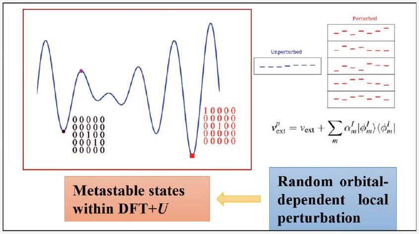
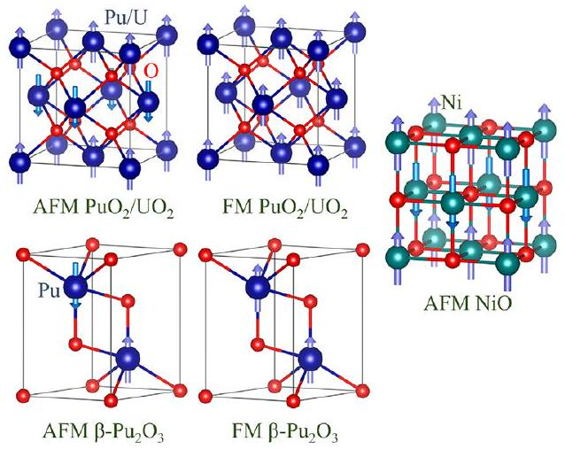
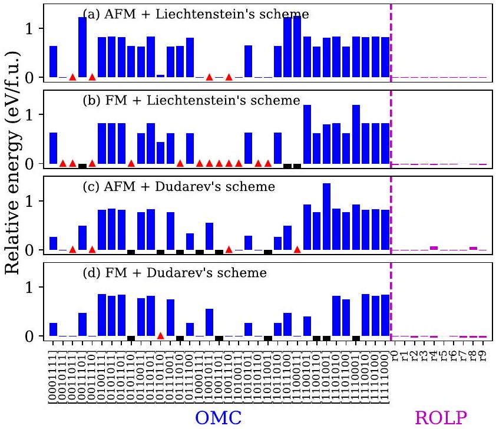
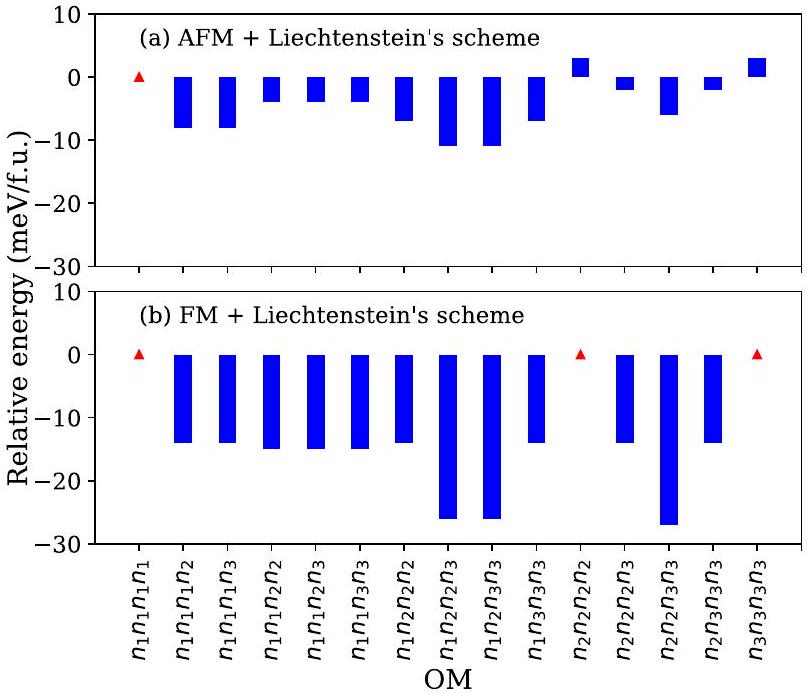
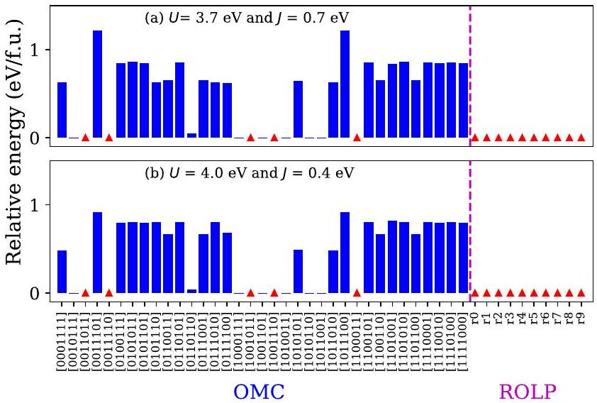
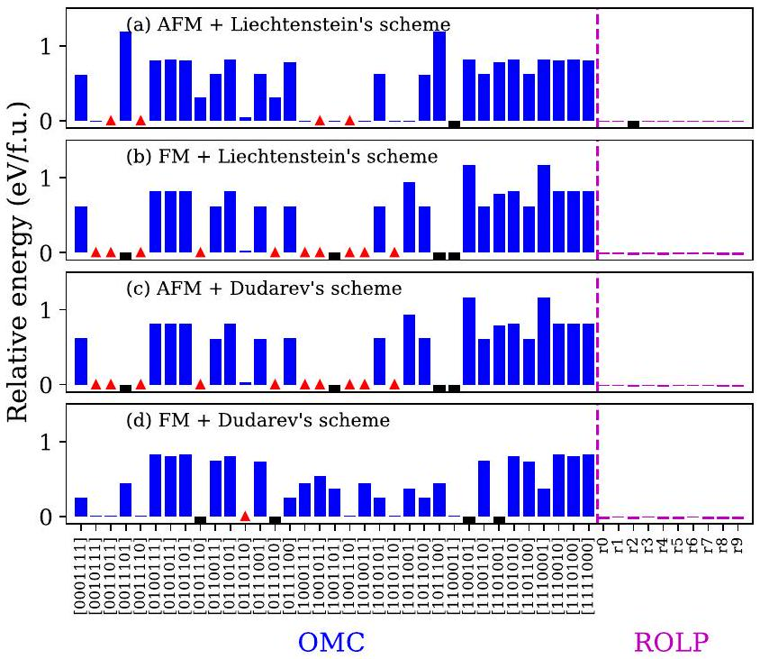
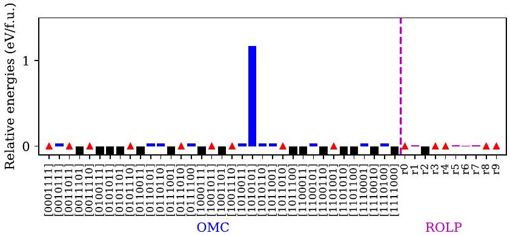
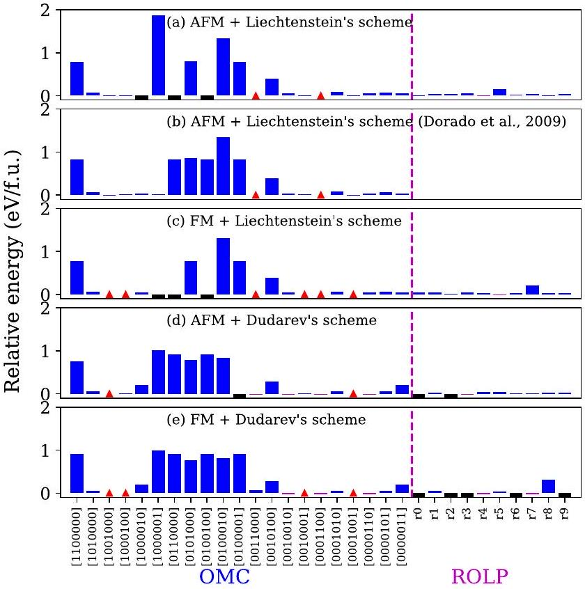
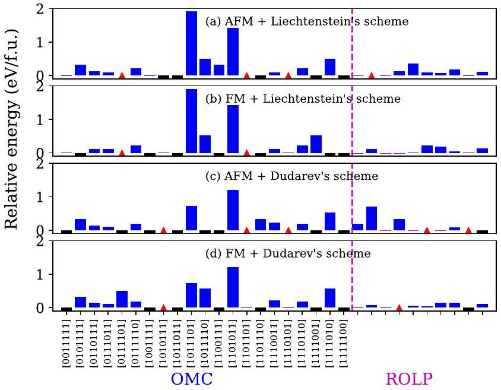
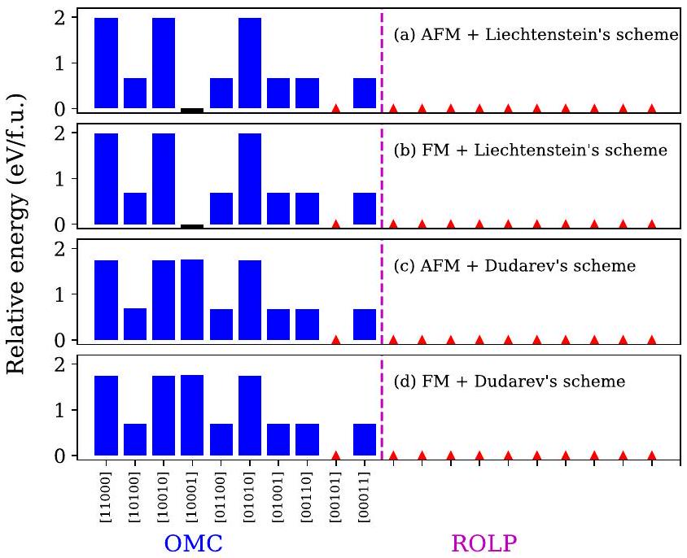

# Circumventing the Metastable States within DFT+U through Random Orbital-Dependent Local Perturbation 

Ruizhi Qiu*

Cite This: J. Chem. Theory Comput. 2025, 21, 1360-1368
Read Online
Downloaded via UNIV ILLINOIS URBANA-CHAMPAIGN on March 19, 2026 at 10:42:29 (UTC). See https://pubs.acs.org/sharingguidelines for options on how to legitimately share published articles.

#### Abstract

Hubbard-corrected density-functional theory (DFT $+U)$ is widely employed to predict the physical properties of correlated materials; however, reliable predictions can be hindered by the presence of metastable solutions in the DFT+U calculations. This issue stems from the orbital physics inherent in DFT+U. To address this, we propose a method to circumvent metastable states by applying a random orbital-dependent local perturbation to the localized orbitals. This perturbation lifts the orbital degeneracy within the corrective functional of $\mathrm{DFT}+U$, ensuring that the system converges to a low-energy state. We validate this approach by comparing it with results obtained using an occupation matrix control scheme in several test cases, including $\mathrm{PuO}_{2}, \mathrm{UO}_{2}, \beta$ -  $\mathrm{Pu}_{2} \mathrm{O}_{3}$, and NiO .

## - INTRODUCTION

One of the well-known failures of conventional densityfunctional theory (DFT) ${ }^{1,2}$ is the prediction of metallic features for Mott insulators. ${ }^{3}$ To reproduce the insulating character of these materials, it is essential to account for the strong Coulomb repulsion among electrons localized in atomic-like orbitals. The many-body wave function of these electrons adopts a multideterminant nature, leading to their classification as correlated materials. Hubbard-corrected DFT (DFT+U), ${ }^{4-6}$ which incorporates a corrective functional representing the Coulomb interaction $U$ as modeled in the Hubbard Hamiltonian, ${ }^{7}$ is one of the simplest approaches to address this issue and has successfully been applied to numerous correlated materials. ${ }^{8}$ However, the DFT $+U$ formulation introduces a new variable that depends on the localized orbitals, which have roughly the same energy within DFT. ${ }^{9}$ Consequently, $\mathrm{DFT}+U$ calculations often yield multiple self-consistent energy minima, corresponding to different occupations of localized orbitals by fewer electrons. ${ }^{9-11}$ Transitions between these local minima involve fractional occupations that are energetically unfavorable. Moreover, the total energies of some metastable states can be several electron volts per formula unit (f.u.) higher than that of the lowest-energy state. ${ }^{12,13}$ These challenges render firstprinciples $\mathrm{DFT}+U$ calculations problematic.

To the best of our knowledge, multiple $\mathrm{DFT}+U$ energy minima were first identified in $\gamma$-Ce by varying the occupations of the 4 f orbitals. ${ }^{10}$ In DFT $+U$ calculations of rare-earth nitrides, it was observed that breaking the cubic crystal symmetry of the localized orbitals is necessary to lower the total energy in accordance with Hund's rules. ${ }^{14}$ Similar DFT $+U$ calculations, which involved monitoring occupation matrices (OMs) and/or
breaking crystal symmetry, have been performed on materials such as $\mathrm{UGe}_{2}{ }^{, ~}{ }^{15} \mathrm{Cs}_{2} \mathrm{AgF}_{4},{ }^{16} \gamma$ - and $\beta$ - $\mathrm{Ce},{ }^{17} \mathrm{PuO}_{2}$ and $\beta$ - $\mathrm{Pu}_{2} \mathrm{O}_{3}$, ${ }^{18} \mathrm{PrO}_{2}{ }^{19} \mathrm{UN}^{20}$ and $\mathrm{UO}_{2} .^{12,13,21,22}$ Notably, a systematic investigation of local minima in the DFT $+U$ calculation of $\mathrm{UO}_{2}{ }^{12,13}$ highlighted the seriousness of the problem of metastable states and underscored the need for methods to approximate the ground state, such as occupation matrix control (OMC), ${ }^{12}$ quasi-annealing (QA), ${ }^{23}$ and $U$-ramping. ${ }^{11,24}$

In the OMC scheme, all possible ways to distribute $N_{\mathrm{e}}$ electrons into $N_{0}$ available localized orbitals are enumerated, constructing the corresponding initial OMs as the precondition of the DFT $+U$ calculations. By comparing the total energies from different initial OMs, the lowest-energy state is identified, and its associated OM can then serve as the reference for subsequent $\mathrm{DFT}+U$ calculations of the physical properties. The number of possible initial diagonal OMs is given by

$$
\left[\binom{N_{\mathrm{o}}}{N_{\mathrm{e}}}\right]^{N_{\mathrm{h}}}
$$

with $N_{\mathrm{h}}$ being the number of inequivalent Hubbard atoms. Although the number of nondiagonal OMs is virtually infinite, enumerating diagonal OMs was proved to be sufficient in

Received: November 8, 2024
Revised: January 8, 2025
Accepted: January 15, 2025
Published: January 24, 2025

practice. ${ }^{13}$ However, the computational cost of the OMC scheme can be significant, particularly for systems of large $N_{\mathrm{b}}$, such as those with defects. ${ }^{12,13,23}$ Additionally, the final lowestenergy solution is highly sensitive to factors such as cell geometry, imposed symmetry of the charge density, and the magnitude of $U^{11,25,26}$ Despite these challenges, the OMC scheme provides a clear depiction of the energy surface, making it a valuable benchmark against which other schemes can be compared to assess their reliability.

The QA scheme ${ }^{23}$ employs the classical QA optimization algorithm to tackle this challenge of multidimensional minimization. The heating of the electronic system is simulated by the nonconvergence of the self-consistency loop and the associated ionic relaxation. Annealing is performed by gradually decreasing the convergence threshold, and further optimization can be achieved by manually distorting the ionic structure. This scheme couples the optimization of electronic states with that of ionic structure and is claimed to be suitable for defective systems. ${ }^{23}$ However, the residual ionic drift in the final result complicates its comparisons with the OMC calculation. ${ }^{27}$ The $U$-ramping scheme ${ }^{11}$ involves gradually increasing Hubbard $U$ from zero to the desired value, iteratively applying the OMs from the previous calculation to the next. This approach assumes that the orbital ordering remains unchanged between DFT and DFT $+U,^{9}$ with very small increments ensuring an adiabatic process. This makes the $U$-ramping scheme computationally expensive, and the claimed $2-15$ iterations ${ }^{11}$ are often insufficient. In addition, a procedure that combines the $U$-ramping scheme with $f$-occupation smearing has also been proposed. ${ }^{24}$ It is worth noting that the issue of metastable states can also be addressed by modifying the DFT+U formalism into a self-interaction-free form. ${ }^{28}$ The modified DFT $+U$ successfully restores the degeneracy of the atomic orbitals in free $f^{1}$ ions, a feature not achieved by the original DFT $+U$.

Because metastable states in $\mathrm{DFT}+U$ arise from the introduction of a new variable-specifically the orbital-dependent OM-one way to circumvent this issue is to introduce an external potential that breaks the orbital degeneracy. This idea originates from the linear response approach used to calculate the effective interaction parameter $U,{ }^{25,29}$ in which an orbitalindependent local perturbation is added to induce the response of the localized orbital occupations. Recently, a similar idea of applying an additional potential to the manifold of localized orbitals has been employed in the study of metastable states for magnetic materials using a systematic global search algorithm. ${ }^{30}$ In this work, an orbital-dependent perturbed potential is applied to the Hubbard atoms, with the strength of the perturbation varying randomly among the localized orbitals. This random orbital-dependent local perturbation (ROLP) can lead to a reconstruction of the lowest-energy state OM, likely reducing the stability or consistency of the metastable states and effectively addressing the issue of metastable states. This scheme requires only a few DFT $+U$ calculations, making it computationally more efficient than other schemes. ${ }^{11,12,23}$

## - METHODS

DFT+U Formalism. In the DFT+U formalism, the effective Coulomb repulsion $U$ applies on the localized orbitals $\phi_{m}^{I}$ by projecting Kohn-Sham orbitals $\psi_{k \nu}^{\sigma}$ into these localized orbitals through the OM $\boldsymbol{n}^{I \sigma}$, whose matrix elements are given by

$$
n_{m m,}^{I \sigma}=\sum_{k \nu} f_{k \nu}^{\sigma}\left\langle\phi_{m}^{I} \mid \psi_{k \nu}^{\sigma}\right\rangle\left\langle\psi_{k \nu}^{\sigma} \mid \phi_{m,}^{I}\right\rangle
$$

Here, $I, m, \sigma, k$, and $\nu$ represent the index of the Hubbard atom, the index of localized orbital, spin, Bloch wavevector, and band index, respectively; $f_{k \nu}^{\sigma}$ is the Fermi-Dirac distribution of the Kohn-Sham states. In terms of the OM $\boldsymbol{n}^{I \sigma}$, the generalized $\mathrm{DFT}+U$ total energy density-functional can be defined as

$$
E_{\mathrm{DFT}+U}\left[\rho^{\sigma}(\boldsymbol{r}), \boldsymbol{n}^{I \sigma}\right]=E_{\mathrm{DFT}}\left[\rho^{\sigma}(\boldsymbol{r})\right]+E_{U}\left[\boldsymbol{n}^{I \sigma}\right]-E_{\mathrm{dc}}\left[n^{I \sigma}\right]
$$

in which $\rho^{\sigma}(\boldsymbol{r})$ is the charge density, $E_{\mathrm{DFT}}$ is the standard DFT functional, $E_{U}$ is the functional that contains the Coulomb interaction, $E_{\mathrm{dc}}$ is the double-counting term that models the contribution to the DFT energy from localized electrons as a mean-field approximation to $E_{U}$, and $n^{I \sigma}=\operatorname{Tr}\left[\boldsymbol{n}^{I \sigma}\right]$.

Within Liechtenstein's DFT $+U$ scheme, ${ }^{5}$ we have

$$
\begin{aligned}
E_{U}= & \frac{1}{2} \sum_{\{m\}, \sigma, I}\left[\left\langle m, m^{\prime \prime}\right| V_{e e}\left|m^{\prime}, m^{\prime \prime \prime}\right\rangle n_{m m,}^{I \sigma} n_{m \prime m \prime \prime}^{I-\sigma}\right. \\
& +\left(\left\langle m, m^{\prime \prime}\right| V_{e e}\left|m^{\prime}, m^{\prime \prime \prime}\right\rangle-\left\langle m, m^{\prime \prime}\right| V_{e e}\left|m^{\prime \prime \prime}, m^{\prime}\right\rangle\right) \\
& \left.n_{m m,}^{I \sigma} n_{m \prime m \prime \prime}^{I \sigma}\right] \\
E_{\mathrm{dc}}= & \frac{1}{2} \sum_{I}\left[U^{I} n^{I}\left(n^{I}-1\right)-J^{I} \sum_{\sigma} n^{I \sigma}\left(n^{I \sigma}-1\right)\right]
\end{aligned}
$$

Here, $U^{I}$ and $J^{I}$ are the effective Coulomb and exchange interactions, respectively, $n^{I}=\sum_{\sigma} n^{I \sigma}$. The Coulomb integrals $\left\langle m, m^{\prime \prime}\right| V_{e e}\left|m^{\prime}, m^{\prime \prime \prime}\right\rangle$ represent the electron-electron interaction $e^{2} /\left|\boldsymbol{r}-\boldsymbol{r}^{\prime}\right|$, computed on the wave functions of the localized basis set $\left\{\phi_{m}^{I}\right\}$. If the localized basis retains its atomic nature, $\phi_{m}^{I}$ can be decomposed into spherical harmonics $Y_{l m}$ and a radial function, in which the quantum number $l$ is usually fixed. The Coulomb integrals can then be evaluated from the expansion of $e^{2} /\left|r-r^{\prime}\right|$ in terms of spherical harmonics $Y_{k q}$ :

$$
\begin{aligned}
& \left\langle m, m^{\prime \prime}\right| V_{e e}\left|m^{\prime}, m^{\prime \prime \prime}\right\rangle \\
& \quad=\sum_{k=0}^{2 l} \frac{4 \pi}{2 k+1} \sum_{q=-k}^{k}\langle l m| Y_{k q}\left|l m^{\prime}\right\rangle\left\langle l m^{\prime \prime}\right| Y_{k q}^{\star}\left|l m^{\prime \prime \prime}\right\rangle F^{k}
\end{aligned}
$$

where $\langle l m| Y_{k q}\left|l m^{\prime}\right\rangle$ are Gaunt coefficients and $F^{k}$ are the radial Slater integrals. Because $E_{\mathrm{dc}}$ is defined as the mean-field approximation of $E_{U}$, we have

$$
\begin{aligned}
U= & \frac{1}{(2 l+1)^{2}} \sum_{m, m^{\prime \prime}}\left\langle m, m^{\prime \prime}\right| V_{e e}\left|m, m^{\prime \prime}\right\rangle=F^{0} \\
U-J= & \frac{1}{2 l(2 l+1)} \sum_{m, m^{\prime \prime}}\left(\left\langle m, m^{\prime \prime}\right| V_{e e}\left|m, m^{\prime \prime}\right\rangle-\left\langle m, m^{\prime \prime}\right.\right. \\
& \left.\left.\left|V_{e e}\right| m^{\prime \prime}, m\right\rangle\right)
\end{aligned}
$$

for the interaction with different spins and the same spin, respectively. ${ }^{31}$ For d electrons ( $l=2$ ), we have $J=\left(F^{2}+F^{4}\right) / 14$ and the Slater integrals $F^{2}$ and $F^{4}$ can be evaluated from $J$ by assuming that $F^{4} / F^{2}$ has the same value $0.625 .^{31,32}$ For f electrons ( $l=3$ ), we have $J=2 F^{2} / 45+F^{4} / 33+50 F^{6} / 1287$ and $F^{k}(k \geq 2)$ can be obtained by assuming that $F^{4} / F^{2}=0.668$ and $F^{6} / F^{2}=0.494$.

By setting $J=0$ in eq 4 and then $F^{k}(k \geq 2)=0$, we can obtain the functional within Dudarev's scheme ${ }^{6}$ as

$$
E_{\mathrm{DFT}+U}=E_{\mathrm{DFT}}+\sum_{I, \sigma} \frac{U^{I}}{2} \operatorname{Tr}\left[\boldsymbol{n}^{I \sigma}\left(1-\boldsymbol{n}^{I \sigma}\right)\right]
$$

The OM $\boldsymbol{n}^{I \sigma}$ is Hermitian and the eigenvalues of OM are the occupation numbers $\left\{\bar{n}_{m}^{I \sigma}\right\}$, which can be used to determine the number of localized electrons and then the oxidation state of Hubbard atoms. ${ }^{33-35}$ In terms of $\left\{\bar{n}_{m}^{I \sigma}\right\}$, the Hubbard corrective functional in eq 5 can be written as $\sum_{I, \sigma, m} U^{I} \bar{n}_{m}^{I \sigma}\left(1-\bar{n}_{m}^{I \sigma}\right) / 2$. Clearly, the fully localized electrons $\left(\bar{n}_{m}^{I \sigma} \sim 1\right)$ or zero occupation ( $\bar{n}_{m}^{I \sigma} \sim 0$ ) are energetically favorable. Through this mechanism, the Hubbard correction favors Mott localization (i.e., insulating feature) and discourages fractional occupation of localized orbitals (metallic-like hybridization).

Random Orbital-Dependent Local Perturbation. The introduction of new variables $\boldsymbol{n}^{I \sigma}$ in the DFT $+U$ formulation yields multiple self-consistent solutions, corresponding to different OMs, ${ }^{9-11}$ i.e., different occupations in localized orbitals. While the corrective energy, such as that in eq 5, depends solely on the occupation numbers and is independent of the specific OM, the charge density $\rho^{\sigma}(\boldsymbol{r})$ and the DFT energy $E_{\mathrm{DFT}}$ vary with changes in the OM. To approximate the lowestenergy solution, we apply a local perturbation to the external potential $v_{\text {ext }}$ that acts only on the localized orbitals:

$$
v_{\mathrm{ext}}^{p}=v_{\mathrm{ext}}+\sum_{m} \alpha_{m}^{I}\left|\phi_{m}^{I}\right\rangle\left\langle\phi_{m}^{I}\right|
$$

in which the superscript " $p$ " stands for "perturbed", the perturbed strength $\alpha_{m}^{I}$ are random numbers, and their variation ranges depend on $U^{I}$ and $J^{I}$. We conduct a DFT $+U$ calculation with a random set of $\left\{\alpha_{m}^{I}\right\}$, using the resulting wave function and charge density for a subsequent calculation with zero $\left\{\alpha_{m}^{I}\right\}$. This seemingly straightforward approach effectively aids in converging the calculations.

Alternatively, we modified the code to perform these two $\mathrm{DFT}+U$ calculations within a single electronic self-consistent loop. The intermediate steps involve gradually decreasing the perturbed strength to zero or abruptly decreasing $\alpha_{m}^{I}$ to zero by adding several intermediate nonself-consistent steps. However, our test calculations showed poor convergence when employing a highly accurate convergence criterion. As a result, we adopted a simpler two-step procedure for the ROLP calculations in the following and compared the results with those from the OMC calculations to evaluate the reliability of the ROLP method.

We tested the following systems: (1) antiferromagnetic (AFM) and ferromagnetic (FM) fluorite $\mathrm{PuO}_{2}$ with $a= 5.3975 \AA{ }^{18}$ (2) AFM and FM $\beta$ - $\mathrm{Pu}_{2} \mathrm{O}_{3}$ with $a=3.838 \AA, c= 5.919 \AA$, and $z=0.2408,{ }^{18}$ (3) AFM and FM fluorite $\mathrm{UO}_{2}$ with $a =5.47 \AA,^{11,13}$ and (4) AFM rocksalt NiO with $a=4.17 \AA .^{11}$ The structural models of these systems are plotted using VESTA ${ }^{36}$ in Figure 1. Both Liechtenstein's ${ }^{5}$ and Duradev's ${ }^{6}$ DFT $+U$ schemes are considered. All the electronic structure calculations are performed using version 5.4.4 of the Vienna Ab inito Simulation Package (VASP). ${ }^{37}$ The ion-electron interaction was described using the projector augmented wave (PAW) formalism, ${ }^{38,39}$ and the exchange-correlation functional adopted the generalized gradient approximation (GGA) of Perdew-BurkeErnzerhof (PBE). ${ }^{40}$ The official PAW pseudopotentials are used, with the valence electronic configurations of $\mathrm{Pu}, \mathrm{U}, \mathrm{Ni}$, and O being $6 s^{2} 6 p^{6} 6 d^{2} 7 s^{2} 5 f^{4}, 6 s^{2} 6 p^{6} 6 d^{2} 7 s^{2} 5 f^{2}, 3 d^{9} 4 s^{1}$, and $2 s^{2} s p^{4}$, respectively. For $\mathrm{PuO}_{2}$, we also test the local density approximation (LDA) ${ }^{41,42}$ of exchange-correlation functional, and the effect of spin-orbit coupling (SOC). The computational parameters including the Coulomb parameter $U$, exchange parameter $J$, cutoff energy for plane wave basis $E_{\text {cut }}$ and Monkhorst-Pack $k$ point meshes are listed in Table 1.

Figure 1. Structural models of $\mathrm{AFM} / \mathrm{FM} \mathrm{PuO}_{2}, \mathrm{UO}_{2}, \beta-\mathrm{Pu}_{2} \mathrm{O}_{3}$, and AFM NiO used in this work.

Table 1. Computational Parameters Used in Our Calculation
| compound | $U(\mathrm{eV})$ | $J(\mathrm{eV})$ | $E_{\text {cut }}(\mathrm{eV})$ | $\boldsymbol{k}$ points |
| :--- | :---: | :---: | :---: | :---: |
| $\mathrm{PuO}_{2}$ | 4.0 | 0.7 | 650 | $8 \times 8 \times 8$ |
| $\beta-\mathrm{Pu}_{2} \mathrm{O}_{3}$ | 4.0 | 0.7 | 750 | $5 \times 5 \times 5$ |
| $\mathrm{UO}_{2}$ | 4.5 | 0.51 | 600 | $8 \times 8 \times 8$ |
| NiO | 8.0 | 0.95 | 600 | $7 \times 7 \times 7$ |

These computational parameters are selected based on previous studies addressing metastable states in DFT $+U^{11-13,18}$ The values of $U$ and $J$ are the same as those used in prior work, which also employed PBE exchange-correlation functionals and PAW pseudopotentials. In addition, effective interactions are applied to the localized $\mathrm{f} / \mathrm{d}$ atomic orbitals, in agreement with previous studies. The cutoff energy $E_{\text {cut }}$ and $k$ point meshes were chosen to ensure an energy convergence of 1 meV per atom. The symmetry of the charge and wave functions are removed to allow 5f/3d electrons to break the cubic symmetry for a lower total energy. ${ }^{12,14}$ The robust blocked-Davidson iterative scheme is used for the diagonalization of the Hamiltonian matrix. For updating the charge density at each iteration, a Pulay mixing scheme is employed, using one-center PAW charge densities up to $l=3$ for the f-electron system and $l=2$ for d-electron systems. In the electronic self-consistent loop, the energy threshold and maximum number of iterations are set to $10^{-8} \mathrm{eV}$ and 300 , respectively. These parameters serve as general criteria for determining the convergence of a specific $\mathrm{DFT}+U$ calculation, although they are not entirely strict.

To evaluate the sensitivity of the ROLP method with respect to the choice of $U$ and $J$, we also consider the cases of $U=3.7 \mathrm{eV}$ and $J=0.7 \mathrm{eV}$, as well as $U=4.0 \mathrm{eV}$ and $J=0.4 \mathrm{eV}$. Here, $U=3.7$ eV is calculated using a linear response approach. ${ }^{25,29}$ In this approach, the strength of orbital-independent perturbed potential is set to $\pm 0.5, \pm 0.4, \pm 0.3, \pm 0.2$, and $\pm 0.1 \mathrm{eV}$, and the occupancies of localized orbitals are obtained from both selfconsistent and nonself-consistent calculations of perturbed Hamiltonian. The value of Hubbard $U$ is then derived from the response matrices.

The OMC calculations are carried out using the implementation described in ref 43 . We have also implemented the ROLP method in version 5.4.4 of VASP. The corresponding code and user guide are provided in the Supporting Information.

## - RESULTS AND DISCUSSION

First, we present the results of AFM and $\mathrm{FM} \mathrm{PuO}_{2}$ from the OMC calculations using Liechtenstein and Dudarev's schemes
within GGA. The relative energies and energy gaps from different initial OMs are plotted in Figure 2 and Table S1 of the Supporting Information, respectively, with the corresponding data provided in Table S1 of the Supporting Information.

Figure 2. Relative energies of $A F M$ and $\mathrm{FM} \mathrm{PuO}_{2}$ from the OMC and ROLP calculations using Liechtenstein and Dudarev's schemes within GGA. The lowest-energy state is marked by the red triangles, while the black squares represent the calculations that did not converge.

Before delving into the description and discussion of the results, we must illustrate the initial diagonal OMs used as input in the OMC calculations. All possible diagonal OMs are enumerated as prerequisites for the $\mathrm{DFT}+U$ calculations. The number of diagonal OMs, as defined by eq 1 , indicates that the number of inequivalent Hubbard atoms $N_{\mathrm{h}}$ should be 1 for the FM system and 2 for the AFM system. For simplicity, however, we set all $N_{\mathrm{h}}$ values to be 1, as it has been observed that the selfconsistent OMs for the AFM and FM ground states are equivalent for a given Hubbard atom. ${ }^{17,18}$ This allows us to start from the FM OMs ( $\boldsymbol{n}_{I \sigma}(\mathrm{FM})$ ) to derive the AFM OMs ( $\left.\boldsymbol{n}_{I \sigma}(\mathrm{AFM})\right)$ by inverting the spins:

$$
\begin{aligned}
& \boldsymbol{n}_{I \sigma}\left(\mathrm{AFM} ; M_{z}>0\right)=\boldsymbol{n}_{I \sigma}(\mathrm{FM}), \boldsymbol{n}_{I \sigma}\left(\mathrm{AFM} ; M_{z}<0\right) \\
& \quad=\boldsymbol{n}_{I-\sigma}(\mathrm{FM})
\end{aligned}
$$

Thus, the diagonal OM can be denoted by a binary number in square brackets:

$$
\left[k_{1} k_{2} k_{3} k_{4} k_{5} k_{6} k_{7}\right] \equiv\left[\begin{array}{lllllll}
k_{1} & 0 & 0 & 0 & 0 & 0 & 0 \\
0 & k_{2} & 0 & 0 & 0 & 0 & 0 \\
0 & 0 & k_{3} & 0 & 0 & 0 & 0 \\
0 & 0 & 0 & k_{4} & 0 & 0 & 0 \\
0 & 0 & 0 & 0 & k_{5} & 0 & 0 \\
0 & 0 & 0 & 0 & 0 & k_{6} & 0 \\
0 & 0 & 0 & 0 & 0 & 0 & k_{7}
\end{array}\right]
$$

where $k_{1, \cdots, 7}$ can be either 1 or 0 . For example, [0011011] indicates that the orbitals of $m=-1,0,2$, and 3 are occupied and the others remain unoccupied. These binary numbers serve as
the labels on the $x$-axis in Figures 2 and S1 of the Supporting Information.

From Figure 2, it can be seen that various final states emerge from these self-consistent DFT $+U$ calculations, and they strongly depend on the choice of initial OMs. ${ }^{10,12-14,17,18}$ The relative energies for most metastable states are around 1 eV , which is too high to guarantee the reliability of routine $\mathrm{DFT}+U$ calculations. Compared to Dudarev's scheme, the number of initial OMs that yield the lowest-energy state in DFT $+U$ calculations using Liechtenstein's scheme is larger. This is likely due to the higher degeneracy of Dudarev's simplified DFT $+U$ formulation. For the FM system, the number of initial OMs yielding the lowest-energy state using Liechtenstein's scheme is also larger than that for the AFM system. However, if we also consider the first metastable state with a relative energy of 3 $\mathrm{meV} /$ f.u., the number of initial OM becomes comparable. As discussed later, these results arise from the different selfconsistent OMs in these system. By comparing Figures 2 and S1 of the Supporting Information, it is evident that the lower the relative energy, the larger the corresponding energy gap. Notably, the lowest-energy state exhibits the largest energy gap.

To gain further insights, let us carefully examine the final OMs, most of which are nondiagonal. In previous OMC calculations of $\mathrm{PuO}_{2},^{18}$ only the electronic configuration yielding the lowest-energy state was reported, whereas a more detailed analysis is provided here. For the FM system from DFT $+U$ calculations using Liechtenstein's scheme, there are 12 initial OMs that yield the lowest-energy state. Among these, six initial OMs ([0011011], [0011110], [0101110], [0111010], [1001011], and [1001110]) result in the lowest-energy state with the same final nondiagonal OM (the matrix elements of $\boldsymbol{n}^{\downarrow}$ are negligible and not shown here),

$$
\boldsymbol{n}^{\uparrow}=\left[\begin{array}{lllllll}
0.65 & 0.00 & -0.46 & 0.00 & 0.00 & 0.00 & 0.00 \\
0.00 & 0.20 & 0.00 & 0.00 & 0.00 & 0.00 & 0.00 \\
-0.46 & 0.00 & 0.44 & 0.00 & 0.00 & 0.00 & 0.00 \\
0.00 & 0.00 & 0.00 & 1.02 & 0.00 & 0.00 & 0.00 \\
0.00 & 0.00 & 0.00 & 0.00 & 0.44 & 0.00 & 0.46 \\
0.00 & 0.00 & 0.00 & 0.00 & 0.00 & 1.02 & 0.00 \\
0.00 & 0.00 & 0.00 & 0.00 & 0.46 & 0.00 & 0.65
\end{array}\right] \equiv
$$

This state corresponds to the filling of $f^{0}, f^{2}$, and $0.62 f^{ \pm 1} \pm 0.78 f^{ \pm 3}$ orbitals, that is, a doubly degenerate state and two nondegenerate states as noted in ref 18 . For the counterpart AFM calculations, the initial OMs [0011011], [0011110], [1001011], and [1001110] yield the lowest-energy states with a final OM same as that from FM calculation, which is consistent with the previous OMC calculations ${ }^{18}$ and the statement (7). However, the calculations of the AFM system with the initial OMs being [0101110] and [0111010] lead to even higher energy states with the final OMs being approximated as [0001111].

The other six initial OM yield the lowest-energy state with final OMs differing from $\boldsymbol{n}_{1}$ (8). These two final OMs are given by

Table 2. Relative Energies $E_{\text {rel }}$ ( meV / f.u.) and Energy Gaps $E_{\mathrm{g}}$ ( eV ) of AFM and $\mathrm{FM} \mathrm{PuO}_{2}$ from Our Calculations with Local Perturbations Using Liechtenstein (4) and Dudarev's Schemes (5) within GGA ${ }^{a}$
| $E_{\text {rel }}$ | Liechtenstein's scheme |  |  |  |  | Dudarev's scheme |  |  |  |
| :--- | :--- | :--- | :--- | :--- | :--- | :--- | :--- | :--- | :--- |
|  | AFM |  |  | FM |  | AFM |  | FM |  |
|  | $E_{\mathrm{g}}$ | OM | $E_{\text {rel }}$ | $E_{\mathrm{g}}$ |  | OM | $E_{\text {rel }}$ | $E_{\mathrm{g}}$ |  | $E_{\text {rel }}$ | $E_{\mathrm{g}}$ |
| -8 | 2.1 | $\boldsymbol{n}_{1}^{\uparrow}, \boldsymbol{n}_{1}^{\uparrow}, \boldsymbol{n}_{3}^{\downarrow}, \boldsymbol{n}_{1}^{\downarrow}$ | -27 | 1.7 | $\boldsymbol{n}_{1}^{\uparrow}, \boldsymbol{n}_{3}^{\uparrow}, \boldsymbol{n}_{1}^{\uparrow}, \boldsymbol{n}_{3}^{\uparrow}$ | -4 | 1.3 | -15 | 0.9 |
| -4 | 1.7 | $\boldsymbol{n}_{3}^{\uparrow}, \boldsymbol{n}_{3}^{\uparrow}, \boldsymbol{n}_{1}^{\downarrow}, \boldsymbol{n}_{1}^{\downarrow}$ | -14 | 1.5 | $\boldsymbol{n}_{2}^{\uparrow}, \boldsymbol{n}_{3}^{\uparrow}, \boldsymbol{n}_{3}^{\uparrow}, \boldsymbol{n}_{3}^{\uparrow}$ | -10 | 1.5 | -15 | 0.9 |
| -11 | 2.1 | $\boldsymbol{n}_{1}^{\uparrow}, \boldsymbol{n}_{2}^{\uparrow}, \boldsymbol{n}_{1}^{\downarrow}, \boldsymbol{n}_{2}^{\downarrow}$ | -26 | 1.5 | $\boldsymbol{n}_{2}^{\uparrow}, \boldsymbol{n}_{1}^{\uparrow}, \boldsymbol{n}_{1}^{\uparrow}, \boldsymbol{n}_{3}^{\uparrow}$ | -4 | 1.3 | -31 | 0.9 |
| -4 | 1.7 | $\boldsymbol{n}_{3}^{\uparrow}, \boldsymbol{n}_{3}^{\uparrow}, \boldsymbol{n}_{1}^{\downarrow}, \boldsymbol{n}_{1}^{\downarrow}$ | -14 | 1.5 | $\boldsymbol{n}_{3}^{\uparrow}, \boldsymbol{n}_{3}^{\uparrow}, \boldsymbol{n}_{3}^{\uparrow}, \boldsymbol{n}_{1}^{\uparrow}$ | -17 | 1.5 | -15 | 0.9 |
| -4 | 1.7 | $\boldsymbol{n}_{1}^{\uparrow}, \boldsymbol{n}_{1}^{\uparrow}, \boldsymbol{n}_{3}^{\downarrow}, \boldsymbol{n}_{3}^{\downarrow}$ | -27 | 1.7 | $\boldsymbol{n}_{3}^{\uparrow}, \boldsymbol{n}_{1}^{\uparrow}, \boldsymbol{n}_{3}^{\uparrow}, \boldsymbol{n}_{1}^{\uparrow}$ | 69 | 1.1 | -31 | 0.9 |
| 3 | 1.7 | $\boldsymbol{n}_{3}^{\uparrow}, \boldsymbol{n}_{3}^{\uparrow}, \boldsymbol{n}_{3}^{\downarrow}, \boldsymbol{n}_{3}^{\downarrow}$ | -14 | 1.5 | $\boldsymbol{n}_{2}^{\uparrow}, \boldsymbol{n}_{2}^{\uparrow}, \boldsymbol{n}_{2}^{\uparrow}, \boldsymbol{n}_{1}^{\uparrow}$ | 1 | 1.1 | 0 | 0.6 |
| -4 | 1.7 | $\boldsymbol{n}_{3}^{\uparrow}, \boldsymbol{n}_{3}^{\uparrow}, \boldsymbol{n}_{1}^{\downarrow}, \boldsymbol{n}_{1}^{\downarrow}$ | -15 | 1.5 | $\boldsymbol{n}_{1}^{\uparrow}, \boldsymbol{n}_{1}^{\uparrow}, \boldsymbol{n}_{2}^{\uparrow}, \boldsymbol{n}_{2}^{\uparrow}$ | -10 | 1.5 | -15 | 0.9 |
| 3 | 1.7 | $\boldsymbol{n}_{2}^{\uparrow}, \boldsymbol{n}_{2}^{\uparrow}, \boldsymbol{n}_{2}^{\downarrow}, \boldsymbol{n}_{2}^{\downarrow}$ | 0 | 1.3 | $n_{3}^{\uparrow}, n_{3}^{\uparrow}, n_{3}^{\uparrow}, n_{3}^{\uparrow}$ | -3 | 1.5 | -31 | 0.9 |
| 3 | 1.9 | $\boldsymbol{n}_{2}^{\uparrow}, \boldsymbol{n}_{2}^{\uparrow}, \boldsymbol{n}_{3}^{\downarrow}, \boldsymbol{n}_{4}^{\downarrow}$ | -15 | 1.5 | $\boldsymbol{n}_{1}^{\uparrow}, \boldsymbol{n}_{1}^{\uparrow}, \boldsymbol{n}_{3}^{\uparrow}, \boldsymbol{n}_{3}^{\uparrow}$ | 55 | 1.5 | -34 | 1.1 |
| -8 | 2.1 | $\boldsymbol{n}_{1}^{\uparrow}, \boldsymbol{n}_{3}^{\uparrow}, \boldsymbol{n}_{1}^{\downarrow}, \boldsymbol{n}_{1}^{\downarrow}$ | -26 | 1.5 | $\boldsymbol{n}_{2}^{\uparrow}, \boldsymbol{n}_{2}^{\uparrow}, \boldsymbol{n}_{3}^{\uparrow}, \boldsymbol{n}_{1}^{\uparrow}$ | -4 | 1.3 | -31 | 0.9 |

${ }^{a}$ The self-consistent OMs within Liechtenstein's schemes are also presented. From left to right, the four OMs correspond to the plutonium atoms with fractional coordinates $(0,0,0),(0.5,0.5,0),(0,0.5,0.5)$, and ( $0.5,0.0,0.5$ ) in the conventional unit cell of $\mathrm{PuO}_{2}$ (Figure 1), respectively.

$$
\left[\begin{array}{lllllll}
0.23 & 0.00 & -0.35 & 0.00 & 0.00 & 0.00 & 0.00 \\
0.00 & 0.20 & 0.00 & 0.00 & 0.00 & 0.00 & 0.00 \\
-0.35 & 0.00 & 0.86 & 0.00 & 0.00 & 0.00 & 0.00 \\
0.00 & 0.00 & 0.00 & 0.13 & 0.00 & 0.22 & 0.00 \\
0.00 & 0.00 & 0.00 & 0.00 & 1.02 & 0.00 & 0.00 \\
0.00 & 0.00 & 0.00 & 0.22 & 0.00 & 0.96 & 0.00 \\
0.00 & 0.00 & 0.00 & 0.00 & 0.00 & 0.00 & 1.02
\end{array}\right] \equiv n_{2}^{\uparrow}
$$

and

$$
\left[\begin{array}{lllllll}
1.02 & 0.00 & 0.00 & 0.00 & 0.00 & 0.00 & 0.00 \\
0.00 & 0.20 & 0.00 & 0.00 & 0.00 & 0.00 & 0.00 \\
0.00 & 0.00 & 1.02 & 0.00 & 0.00 & 0.00 & 0.00 \\
0.00 & 0.00 & 0.00 & 0.13 & 0.00 & -0.22 & 0.00 \\
0.00 & 0.00 & 0.00 & 0.00 & 0.86 & 0.00 & 0.35 \\
0.00 & 0.00 & 0.00 & -0.22 & 0.00 & 0.96 & 0.00 \\
0.00 & 0.00 & 0.00 & 0.00 & 0.35 & 0.00 & 0.23
\end{array}\right] \equiv n_{3}^{\uparrow}
$$

which arise from the OMC calculations of the FM system with initial OMs being [0010111] (or [1000111], [1001101]) and [1010011] (or [1010110], [1011001]), respectively. In the counterpart AFM calculations, the corresponding initial OMs generate the first metastable state, maintaining the same final OM as the FM calculations, which is consistent with the statement (7). As mentioned above, the relative energy of this first metastable state with respect to the lowest-energy state is only $3 \mathrm{meV} /$ f.u., yet the energy gap is distinct, indicating that the first metastable state differs from the lowest-energy state. A similar pattern is observed for DFT+U calculations of the AFM and FM systems using Dudarev's scheme. It is important to note that these final OMs $\boldsymbol{n}_{1}^{\uparrow}, \boldsymbol{n}_{2}^{\uparrow}$, and $\boldsymbol{n}_{3}^{\uparrow}$, are crucial for interpreting the ROLP results.

We now turn to the results from the ROLP calculations in this work, presented on the right of Figure 2 and in Table 2. Note that the relative energies from the ROLP calculations are still evaluated with respect to the lowest-energy state from the OMC calculations. For each computational scheme, ten sets of random numbers $\alpha_{m}^{I}$ are utilized, with the maximum value of $\alpha_{m}^{I}$ set to $U /$ 10. Compared with the energy landscape from the OMC calculations, the energy landscape from the ROLP calculations is much smoother. The energy distribution is narrow with all
values centered around zero. Surprisingly, states with $E_{\text {rel }}<0$ are observed in the ROLP calculations, prompting an examination of the resulting final OMs. These self-consistent OMs from ROLP calculations within Liechtenstein's scheme are also listed in Table 2. The four OMs, from left to right, correspond to the plutonium atoms with fractional coordinates $(0,0,0),(0.5,0.5,0)$, $(0,0.5,0.5)$, and ( $0.5,0.0,0.5$ ) in the conventional unit cell of $\mathrm{PuO}_{2}$ (Figure 1), respectively. Interestingly, all of these OMs can be expressed in terms of the OMs for states with $E_{\text {rel }}=0$, i.e., $\boldsymbol{n}_{1}$ (8), $\boldsymbol{n}_{2}$ (9), and $\boldsymbol{n}_{3}$ (10). Compared with the OMC calculations, larger energy gaps are obtained from ROLP calculations for FM systems. The states with $E_{\text {rel }}<0$ reveal a hidden degree of freedom in choosing the OMs $\left(\boldsymbol{n}_{1}, \boldsymbol{n}_{2}\right.$, and $\left.\boldsymbol{n}_{3}\right)$ for each Pu atom. As no symmetry constraint is imposed, the Pu atoms are treated as inequivalent, and therefore, any combination of ( $\boldsymbol{n}_{1}, \boldsymbol{n}_{2}$, and $\boldsymbol{n}_{3}$ ) is allowed and likely to yield a state with $E_{\text {rel }}<0$.

To clarify this point further, we set the initial OM as a combination of $\left\{\boldsymbol{n}_{1}\right.$ (8), $\boldsymbol{n}_{2}$ (9), $\boldsymbol{n}_{3}$ (10) $\}$ and perform the corresponding OMC calculation with nondiagonal and inequivalent OMs. All calculations converged rapidly, and the detailed energy profiles of AFM and FM PuO2 are shown in Figure 3. The OMC calculations with four equivalent initial OMs generate the state with $E_{\text {rel }}=0$ and also $E_{\text {rel }}>0$, i.e., the first metastable state. In contrast, OMC calculations with inequivalent initial OMs also yield many states with $E_{\text {rel }}<0$. Four Hubbard atoms are considered in these OMC calculations with inequivalent OMs, including more Hubbard atoms is likely to generate new states with $E_{\text {rel }}<0$. This numerical observation may stem from the many-body correlations of correlated materials, which cannot be captured within DFT or DFT $+U$ that rely on a single determinant.

Second, let us assess the sensitivity of the ROLP method with respect to the choice of $U$ and $J$. We present the relative energies of AFM $\mathrm{PuO}_{2}$ from the OMC and ROLP calculations with $U=$ 3.7 eV and $J=0.4 \mathrm{eV}$ in Figure 4. Liechtenstein's DFT+ $U$ scheme and GGA are employed. Overall, the energy profiles from OMC for smaller $U / J$ are nearly identical to that for original $U$ and $J$ in Table 1, as shown in Figure 2a, except for the case of initial OM [1100011]. For the initial OM [11000111], the lowest energy state is achieved for smaller values of $U$ or $J$, while significantly higher energy is obtained for the original $U$ and $J$. Note that the lowest energy state can also be achieved for initial [1100011] within Dudarev's scheme, as shown in Figure 2c. Within Dudarev's scheme, the parameters $U=4.0 \mathrm{eV}$ and $J=$

Figure 3. Relative energies of AFM and $\mathrm{FM} \mathrm{PuO}_{2}$ from the OMC calculations using Liechtenstein's schemes within GGA. Here, the input OMs are the combinations of $\left\{\boldsymbol{n}_{1}\right.$ (8), $\boldsymbol{n}_{2}$ (9), $\boldsymbol{n}_{3}$ (10) $\}$. Note that exchanging OMs between different Pu atoms does not affect the relative energies. Therefore, only the results corresponding to the combination of $\boldsymbol{n}_{1,2,3}$ are shown here. The energies are evaluated with respect to the lowest-energy state of the OMC calculations with diagonal initial OMs.

Figure 4. Relative energies of $\mathrm{AFM} \mathrm{PuO}_{2}$ from the OMC and ROLP calculations using Liechtenstein's schemes within GGA for (a) $U=3.7$ eV and $J=0.7 \mathrm{eV}$ and (b) $U=4.0 \mathrm{eV}$ and $J=0.4 \mathrm{eV}$. The lowest-energy state is marked by the red triangles.

0.7 eV are equivalent to $U=3.3 \mathrm{eV}$ and $J=0.0 \mathrm{eV}$ within Liechtenstein's scheme.

To understand this discrepancy, we examine the selfconsistent OMs for the initial OM [1100011]. For smaller $U$ or $J$, the final OMs are $\boldsymbol{n}_{1}^{\uparrow}$ in eq 8 while for the original $U$ and $J$, the final OM is given by

$$
\left[\begin{array}{lllllll}
0.94 & 0.00 & 0.22 & 0.00 & 0.00 & 0.00 & 0.00 \\
0.00 & 0.29 & 0.00 & 0.00 & 0.00 & 0.00 & 0.00 \\
0.22 & 0.00 & 0.13 & 0.00 & 0.00 & 0.00 & 0.00 \\
0.00 & 0.00 & 0.00 & 1.02 & 0.00 & 0.00 & 0.00 \\
0.00 & 0.00 & 0.00 & 0.00 & 0.13 & 0.00 & -0.21 \\
0.00 & 0.00 & 0.00 & 0.00 & 0.00 & 1.01 & 0.00 \\
0.00 & 0.00 & 0.00 & 0.00 & -0.21 & 0.00 & 0.95
\end{array}\right]
$$

Clearly, the energy surface in the Hilbert space of OM is very complex, and smaller $U / J$ can lower the energy barrier for the numerical calculations using specific initial OMs. The reduced energy barrier facilitates attainment of the lowest-energy state for ROLP calculations, as depicted in Figure 4. Overall, the ROLP method proves valid for different Coulomb and exchange interaction parameters.

Third, we verify the independence of the ROLP method from the choice of the exchange-correlation functional. To do this, we employ LDA to perform the OMC and ROLP calculations for $\mathrm{PuO}_{2}$. The relative energies of AFM and FM PuO2 from these LDA calculations using Liechtenstein and Dudarev's schemes are shown in Figure 5. The energy profile is very similar to that

Figure 5. Relative energies of AFM and $\mathrm{FM} \mathrm{PuO}_{2}$ from the OMC and ROLP calculations using Liechtenstein and Dudarev's schemes within LDA. The lowest-energy state is marked by the red triangles, while the black squares represent the calculations that did not converge.

from the GGA calculations in Figure 2. For most of the ROLP calculations, the total energies are lower than the lowest energy within the OMC calculations, regardless of the magnetic order or DFT+U's scheme used. These states with $E_{\text {rel }}<0$ also arise from the combination of different self-consistent OMs across four Pu atoms in the unit cell of $\mathrm{PuO}_{2}$. Clearly, the ROLP method is also valid for different exchange-correlation functionals.

Fourth, it was noted that SOC plays a role in systematic perturbation, ${ }^{44}$ and the metastable states of DFT+U+SOC calculations are rarer than those in DFT+U. In this context, the ROLP method may not be as effective. Here, we perform the OMC and ROLP calculations of AFM PuO2 using Liechtenstein's scheme, and the relative energies are presented in Figure 6. On the one hand, the OMC calculations show that the final state is either the lowest-energy state or the first metastable state, with one exception, confirming the previous theoretical finding. ${ }^{44}$ On the other hand, the lowest-energy state can be readily achieved through the ROLP calculations.

Finally, let us examine the validity of the ROLP method in other systems. For $\mathrm{UO}_{2}, \beta-\mathrm{Pu}_{2} \mathrm{O}_{3}$, and NiO , the energy profiles of the OMC and ROLP calculations are shown in Figures 7, 8, and 9, respectively. It can be seen that the lowest-energy state in the OMC calculations or states with lower energy can be

Figure 6. Relative energies of AFM and $\mathrm{FM} \mathrm{PuO}_{2}$ from the OMC and ROLP calculations using Liechtenstein and Dudarev's schemes within GGA+U+SOC. The lowest-energy state is marked by the red triangles, while the black squares represent the calculations that did not converge.

Figure 7. Relative energies of AFM and $\mathrm{FM} \mathrm{UO}_{2}$ from the OMC and ROLP calculations using Liechtenstein and Dudarev's schemes within GGA. For the AFM system using Liechtenstein's scheme, the literature data are also plotted for comparison. The lowest-energy state is labeled by the red triangle, and the black squares represent the calculations without convergence.

obtained from several ROLP calculations. Notably, most highenergy metastable states are successfully circumvented in these systems.

In Figure 7, we also plot the relative energy of $\mathrm{AFM} \mathrm{UO}_{2}$ using OMC from ref 12 for comparison. The overall energy landscape from our calculation is in good agreement with that of the literature. In particular, the lowest energy states are contributed by the initial OMs [0011000] and [0001100], which is identical to the results reported in ref 12 . However, a noticeable discrepancy arises with the initial OM [1000001], where ref 12 reports a relative energy of $0.015 \mathrm{eV} /$ f.u. while our calculated value is as high as $1.87 \mathrm{eV} /$ f.u. Upon careful inspection of the self-consistent OMs, we find that the final OM from initial [1000001] can be approximated as [1000001], while the final OMs from [0011000] and [0001100] are nondiagonal. The nondiagonal self-consistent OM from initial [0011000] is given by

Figure 8. Relative energies of $A F M$ and $F M \beta$ - $\mathrm{Pu}_{2} \mathrm{O}_{3}$ from the OMC and ROLP calculations using Liechtenstein and Dudarev's schemes within GGA. The lowest-energy state is labeled by the red triangle, and the black squares represent the calculations without convergence.

Figure 9. Relative energies of AFM and FM NiO from the OMC and ROLP calculations using Liechtenstein and Dudarev's schemes within GGA. The lowest-energy state is labeled by the red triangle, and the black squares represent the calculations without convergence.

$$
\left[\begin{array}{lllllll}
0.65 & 0.00 & 0.46 & 0.00 & 0.00 & 0.00 & 0.00 \\
0.00 & 0.15 & 0.00 & 0.00 & 0.00 & 0.00 & 0.00 \\
0.46 & 0.00 & 0.38 & 0.00 & 0.00 & 0.00 & 0.00 \\
0.00 & 0.00 & 0.00 & 0.68 & 0.00 & -0.45 & 0.00 \\
0.00 & 0.00 & 0.00 & 0.00 & 0.03 & 0.00 & -0.01 \\
0.00 & 0.00 & 0.00 & -0.45 & 0.00 & 0.35 & 0.00 \\
0.00 & 0.00 & 0.00 & 0.00 & -0.01 & 0.00 & 0.04
\end{array}\right]
$$

where the lowest-energy occupation corresponds to the filling of $-0.81 f^{-3}-0.60 f^{-1}$ and $0.82 f^{0}-0.57 f^{2}$. Similarly, the selfconsistent OM from [0001100] is given by

$$
\left[\begin{array}{lllllll}
0.04 & 0.00 & 0.01 & 0.00 & 0.00 & 0.00 & 0.00 \\
0.00 & 0.15 & 0.00 & 0.00 & 0.00 & 0.00 & 0.00 \\
0.01 & 0.00 & 0.03 & 0.00 & 0.00 & 0.00 & 0.00 \\
0.00 & 0.00 & 0.00 & 0.68 & 0.00 & 0.45 & 0.00 \\
0.00 & 0.00 & 0.00 & 0.00 & 0.38 & 0.00 & -0.46 \\
0.00 & 0.00 & 0.00 & 0.45 & 0.00 & 0.35 & 0.00 \\
0.00 & 0.00 & 0.00 & 0.00 & -0.46 & 0.00 & 0.65
\end{array}\right]
$$

where the lowest-energy occupation corresponds to the filling of $-0.60 f^{1}-0.81 f^{3}$ and $0.82 f^{0}+0.57 f^{2}$. Notably, all of these lowest-energy occupations include contributions from $f^{3}$ or $f^{-3}$ components. In ref 12, the system crosses the energy barrier, optimizing [1000001] to a metastable state close to the lowestenergy configuration. However, this behavior was not observed in our calculation.

For $\mathrm{UO}_{2}$, the many-body correlation being similar to $\mathrm{PuO}_{2}$ also emerges and the states of $E_{\text {rel }}<0$ are obtained from the ROLP calculations. For NiO and other d-electron systems, the Hilbert space of localized electrons is small, making it easy to achieve the lowest-energy state. While we cannot guarantee that the so-called "ground state" can be achieved from the ROLP calculations, being similar from the OMC, ${ }^{12} \mathrm{QA},{ }^{23}$ and $U$ ramping ${ }^{11}$ calculations, the ROLP method provides an alternative choice of bypassing the metastable states within $\mathrm{DFT}+U$ and approximating the ground state.

## - CONCLUSIONS

As the extensively used approach in the first-principles calculation of the correlated materials, Hubbard-corrected density-functional theory (DFT+U) suffers from the problem of metastable states. These metastable states arise from the introduction of a new orbital-dependent variable, specifically the occupation matrix. To address this issue, we propose a method that avoids metastable states by introducing a ROLP. The OMC scheme is aided in evaluating the validity of our method. Different DFT+U's schemes, Coulomb and exchange interaction parameters, exchange-correlation functionals, and the inclusion of spin-orbit coupling are considered. It was found that the lowest-energy state from the OMC calculations with an equivalent initial occupation matrix or the state with lower energy can be easily achieved using ROLP calculations. We assert that the ROLP method is reliable and holds promise for first-principles $\mathrm{DFT}+U$ calculations of the energetics of correlated materials. However, it should be noted that the complex energy landscape in the Hilbert space of the occupation matrix cannot be explored using this method. For a more thorough exploration, the OMC scheme or a global search algorithm ${ }^{30}$ would be necessary.

## - ASSOCIATED CONTENT

## (I) Supporting Information

The Supporting Information is available free of charge at https://pubs.acs.org/doi/10.1021/acs.jctc.4c01520.

Calculated relative energies and energy gaps of $\mathrm{PuO}_{2}$ from the OMC calculations; specific values of random number $\alpha_{m}^{I}$; patch file "ROLP.vasp.5.4.4.patch" and user guide for the ROLP calculations (PDF)

## - AUTHOR INFORMATION

## Corresponding Author

Ruizhi Qiu - Institute of Materials, China Academy of Engineering Physics, Mianyang, Sichuan 621907, China; © orcid.org/0000-0002-4232-3452; Email: qiuruizhi@ caep.cn

Complete contact information is available at: https://pubs.acs.org/10.1021/acs.jctc.4c01520

## Notes

The author declares no competing financial interest.

## - ACKNOWLEDGMENTS

This research was supported by National Natural Science Foundation of China (Grant Nos. 22176181 and U2430211) and the Foundation of President of China Academy of Engineering Physics (Grant No. YZJJZQ2022011).

## - REFERENCES

(1) Hohenberg, P.; Kohn, W. Inhomogeneous electron gas. Phys. Rev. 1964, 136, B864-B871.
(2) Kohn, W.; Sham, L. J. Self-consistent equations including exchange and correlation effects. Phys. Rev. 1965, 140, A1133-A1138.
(3) Austin, I. G.; Mott, N. F. Metallic and nonmetallic behavior in transition metal oxides. Science 1970, 168, 71-77.
(4) Anisimov, V. I.; Zaanen, J.; Andersen, O. K. Band theory and Mott insulators: Hubbard U instead of Stoner I. Phys. Rev. B 1991, 44, 943954.
(5) Liechtenstein, A. I.; Anisimov, V. I.; Zaanen, J. Density-functional theory and strong interactions: Orbital ordering in Mott-Hubbard insulators. Phys. Rev. B 1995, 52, R5467-R5470.
(6) Dudarev, S. L.; Botton, G. A.; Savrasov, S. Y.; Humphreys, C. J.; Sutton, A. P. Electron-energy-loss spectra and the structural stability of nickel oxide: An LSDA+U study. Phys. Rev. B 1998, 57, 1505-1509.
(7) Hubbard, J. Electron correlations in narrow energy bands. Proc. R. Soc. London, Ser. A 1963, 276, 238-257.
(8) Himmetoglu, B.; Floris, A.; de Gironcoli, S.; Cococcioni, M. Hubbard-corrected DFT energy functionals: The LDA+U description of correlated systems. Int. J. Quantum Chem. 2014, 114, 14-49.
(9) Dorado, B.; Freyss, M.; Amadon, B.; Bertolus, M.; Jomard, G.; Garcia, P. Advances in first-principles modelling of point defects in $\mathrm{UO}_{2}: f$ electron correlations and the issue of local energy minima. $J$. Phys.: Condens. Matter 2013, 25, 333201.
(10) Shick, A.; Pickett, W.; Liechtenstein, A. Ground and metastable states in $\gamma$-Ce from correlated band theory. J. Electron Spectrosc. Relat. Phenom. 2001, 114-116, 753-758.
(11) Meredig, B.; Thompson, A.; Hansen, H. A.; Wolverton, C.; van de Walle, A. Method for locating low-energy solutions within $D F T+U$. Phys. Rev. B 2010, 82, No. 195128.
(12) Dorado, B.; Amadon, B.; Freyss, M.; Bertolus, M. DFT + U calculations of the ground state and metastable states of uranium dioxide. Phys. Rev. B 2009, 79, No. 235125.
(13) Dorado, B.; Jomard, G.; Freyss, M.; Bertolus, M. Stability of oxygen point defects in $U O_{2}$ by first-principles DFT + U calculations: Occupation matrix control and Jahn-Teller distortion. Phys. Rev. B 2010, 82, No. 035114.
(14) Larson, P.; Lambrecht, W. R. L.; Chantis, A.; van Schilfgaarde, M. Electronic structure of rare-earth nitrides using the LSDA + U approach: Importance of allowing $4 f$ orbitals to break the cubic crystal symmetry. Phys. Rev. B 2007, 75, No. 045114.
(15) Shick, A. B.; Janiš, V.; Drchal, V.; Pickett, W. E. Spin and orbital magnetic state of $U G e_{2}$ under pressure. Phys. Rev. B 2004, 70, No. 134506.
(16) Kasinathan, D.; Koepernik, K.; Nitzsche, U.; Rosner, H. Ferromagnetism induced by orbital order in the charge-transfer
insulator $\mathrm{Cs}_{2} \mathrm{AgF}_{4}$ : An electronic structure study. Phys. Rev. Lett. 2007, 99, No. 247210.
(17) Amadon, B.; Jollet, F.; Torrent, M. $\gamma$ and $\beta$ cerium: LDA + U calculations of ground-state parameters. Phys. Rev. B 2008, 77, No. 155104.
(18) Jomard, G.; Amadon, B.; Bottin, F.; Torrent, M. Structural, thermodynamic, and electronic properties of plutonium oxides from first principles. Phys. Rev. B 2008, 78, No. 075125.
(19) Tran, F.; Schweifer, J.; Blaha, P.; Schwarz, K.; Novák, P. PBE + U calculations of the Jahn-Teller effect in $\mathrm{PrO}_{2}$. Phys. Rev. B 2008, 77, No. 085123.
(20) Gryaznov, D.; Heifets, E.; Kotomin, E. The first-principles treatment of the electron-correlation and spin-orbital effects in uranium mononitride nuclear fuels. Phys. Chem. Chem. Phys. 2012, 14, 44824490.
(21) Qiu, R.; Tang, J.; Chen, J.; Ao, B. Metallic and anti-metallic properties of hydrogen adsorbed $\mathrm{AnO}_{2}(\mathrm{An}=\mathrm{Th}, \mathrm{U}$, and Pu$)$ surfaces. Phys. Chem. Chem. Phys. 2021, 23, 878-885.
(22) Chen, J.-L.; Kaltsoyannis, N. DFT + U study of uranium dioxide and plutonium dioxide with occupation matrix control. J. Phys. Chem. C 2022, 126, 11426-11435.
(23) Geng, H. Y.; Chen, Y.; Kaneta, Y.; Kinoshita, M.; Wu, Q. Interplay of defect cluster and the stability of xenon in uranium dioxide from density functional calculations. Phys. Rev. B 2010, 82, No. 094106.
(24) Rabone, J.; Krack, M. A procedure for bypassing metastable states in local basis set $\mathrm{DFT}+U$ calculations and its application to uranium dioxide surfaces. Comput. Mater. Sci. 2013, 71, 157-164.
(25) Qiu, R.; Ao, B.; Huang, L. Effective Coulomb interaction in actinides from linear response approach. Comput. Mater. Sci. 2020, 171, No. 109270.
(26) Qiu, R.; Xie, L.; Huang, L. Site selective 5f electronic correlations in $\beta$-uranium. Chin. Phys. B 2023, 32, No. 017101.
(27) Dorado, B.; Amadon, B.; Jomard, G.; Freyss, M.; Bertolus, M. Comment on "Interplay of defect cluster and the stability of xenon in uranium dioxide from density functional calculations. Phys. Rev. B 2011, 84, No. 096101.
(28) Zhou, F.; Ozoliņš, V. Obtaining correct orbital ground states in $f$ electron systems using a nonspherical self-interaction-corrected LDA + U method. Phys. Rev. B 2009, 80, No. 125127.
(29) Cococcioni, M.; de Gironcoli, S. Linear response approach to the calculation of the effective interaction parameters in the LDA + U method. Phys. Rev. B 2005, 71, No. 035105.
(30) Ponet, L.; Di Lucente, E.; Marzari, N. The energy landscape of magnetic materials. npj Comput. Mater. 2024, 10, 151.
(31) Anisimov, V. I.; Solovyev, I. V.; Korotin, M. A.; Czyzyk, M. T.; Sawatzky, G. A. Density-functional theory and NiO photoemission spectra. Phys. Rev. B 1993, 48, 16929-16934.
(32) de Groot, F. M. F.; Fuggle, J. C.; Thole, B. T.; Sawatzky, G. A. 2p x-ray absorption of 3d transition-metal compounds: An atomic multiplet description including the crystal field. Phys. Rev. B 1990, 42, 5459-5468.
(33) Sit, P. H.-L.; Car, R.; Cohen, M. H.; Selloni, A. Simple, unambiguous theoretical approach to oxidation state determination via first-principles calculations. Inorg. Chem. 2011, 50, 10259-10267.
(34) Ao, B.; Lu, H.; Yang, Z.; Qiu, R.; Hu, S.-X. Unraveling the highest oxidation states of actinides in solid-state compounds with a particular focus on plutonium. Phys. Chem. Chem. Phys. 2019, 21, 4732-4737.
(35) Ao, B.; Qiu, R. First-principles explorations of the universal picture of oxide layer structure over metallic plutonium. Corros. Sci.
2019, 153, 236-248.
(36) Momma, K.; Izumi, F. VESTA3 for three-dimensional visualization of crystal, volumetric and morphology data. J. Appl. Crystallogr.
2011, 44, 1272-1276.
(37) Kresse, G.; Furthmüller, J. Efficient iterative schemes for ab initio total-energy calculations using a plane-wave basis set. Phys. Rev. B 1996, 54, 11169-11186.
(38) Blöchl, P. E. Projector augmented-wave method. Phys. Rev. B 1994, 50, 17953-17979.
(39) Kresse, G.; Joubert, D. From ultrasoft pseudopotentials to the projector augmented-wave method. Phys. Rev. B 1999, 59, 1758-1775.
(40) Perdew, J. P.; Burke, K.; Ernzerhof, M. Generalized gradient approximation made simple. Phys. Rev. Lett. 1996, 77, 3865-3868.
(41) Ceperley, D. M.; Alder, B. J. Ground state of the electron gas by a stochastic method. Phys. Rev. Lett. 1980, 45, 566-569.
(42) Perdew, J. P.; Zunger, A. Self-interaction correction to densityfunctional approximations for many-electron systems. Phys. Rev. B 1981, 23, 5048-5079.
(43) Allen, J. P.; Watson, G. W. Occupation matrix control of d- and felectron localisations using DFT + U. Phys. Chem. Chem. Phys. 2014, 16, 21016-21031.
(44) Castell, M. R.; Dudarev, S. L.; Briggs, G. A. D.; Sutton, A. P. Unexpected differences in the surface electronic structure of NiO and CoO observed by STM and explained by first-principles theory. Phys. Rev. B 1999, 59, 7342-7345.

