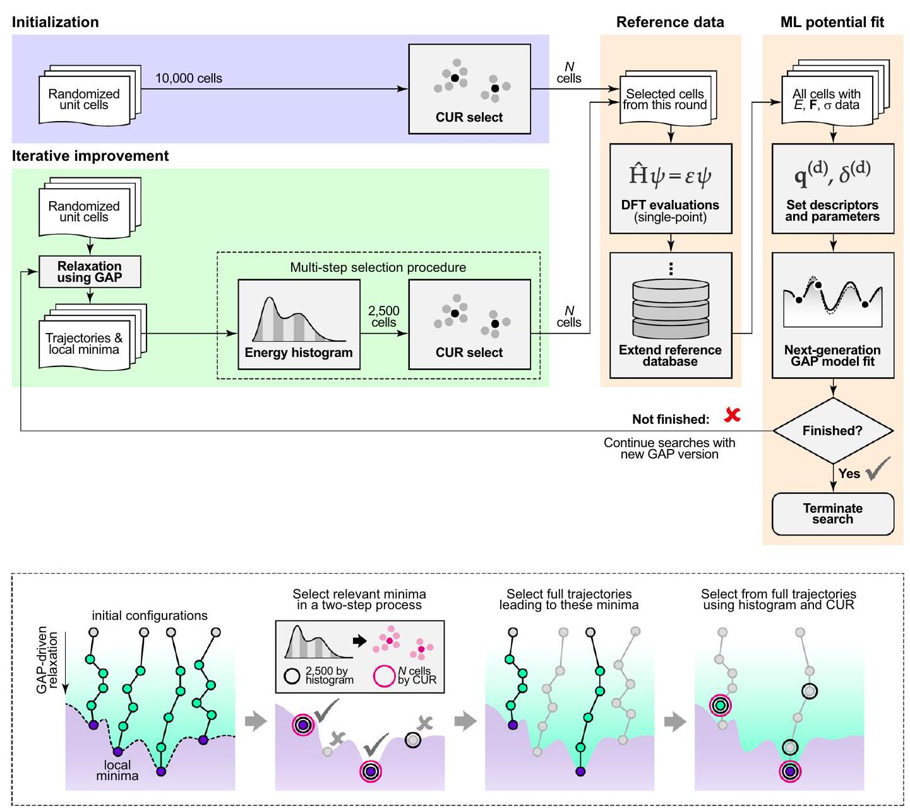
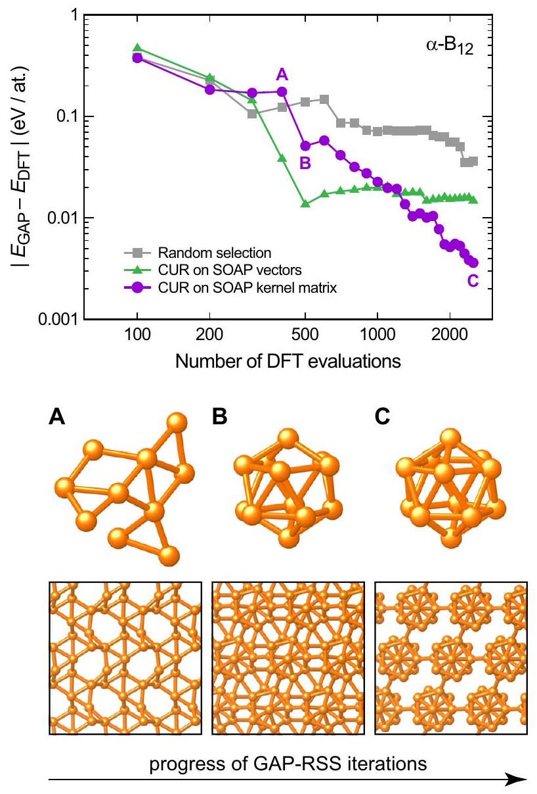
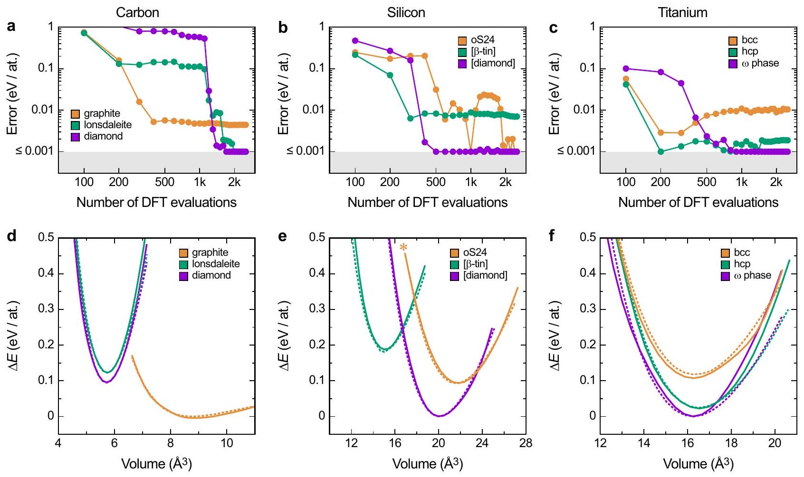
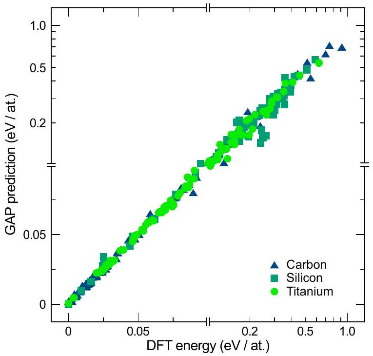
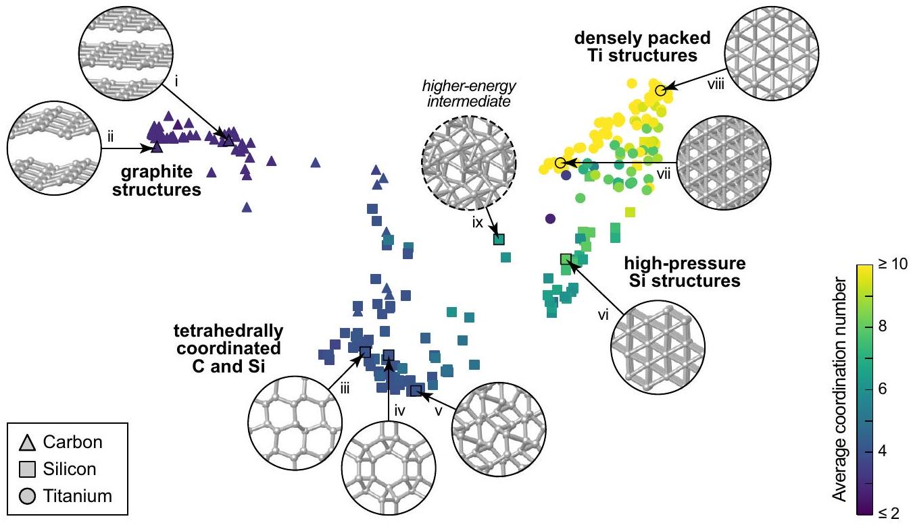

# De novo exploration and self-guided learning of potentialenergy surfaces 

Noam Bernstein ${ }^{1}$, Gábor Csányi ${ }^{2}$ and Volker L. Deringer (1) ${ }^{2,3 *}$

#### Abstract

Interatomic potential models based on machine learning (ML) are rapidly developing as tools for material simulations. However, because of their flexibility, they require large fitting databases that are normally created with substantial manual selection and tuning of reference configurations. Here, we show that ML potentials can be built in a largely automated fashion, exploring and fitting potential-energy surfaces from the beginning (de novo) within one and the same protocol. The key enabling step is the use of a configuration-averaged kernel metric that allows one to select the few most relevant and diverse structures at each step. The resulting potentials are accurate and robust for the wide range of configurations that occur during structure searching, despite only requiring a relatively small number of single-point DFT calculations on small unit cells. We apply the method to materials with diverse chemical nature and coordination environments, marking an important step toward the more routine application of ML potentials in physics, chemistry, and materials science.

npj Computational Materials (2019)5:99
; https://doi.org/10.1038/s41524-019-0236-6

## INTRODUCTION

Atomic-scale modeling has become a cornerstone of scientific research. Quantum-mechanical methods, most prominently based on density-functional theory (DFT), describe the atomistic structures and physical properties of materials with high confidence; ${ }^{1}$ increasingly, they also make it possible to discover previously unknown crystal structures and synthesis targets. ${ }^{2}$ Still, quantum-mechanical material simulations are severely limited by their high computational cost.

Machine learning (ML) has emerged as a promising approach to tackle this long-standing problem. ${ }^{3-12}$ ML-based interatomic potentials approximate the high-dimensional potential-energy surface (PES) by fitting to a reference database, which is usually computed at the DFT level. Once generated, ML potentials enable accurate simulations that are orders of magnitude faster than the reference method. They can solve challenging structural problems, as has been demonstrated for the atomic-scale deposition and growth of amorphous carbon films, ${ }^{13}$ for proton-transfer mechanisms, ${ }^{14}$ or dislocations in materials, ${ }^{15,16}$ involving thousands of atoms in the simulation. More recently, it was shown that ML potentials can be suitable tools for global structure searches targeting crystalline phases, ${ }^{17-20}$ clusters, ${ }^{21-24}$ and nanostructures. ${ }^{25}$

Assembling the reference databases to which ML potentials are fitted is currently mostly a manual and laborious process, guided by the physical problem under study. The first artificial neural network (NN)-type potential for materials ${ }^{3}$ was made by enumerating known crystal structures for silicon and used to describe high-pressure phase transitions. ${ }^{26,27}$ To incorporate vacancies, surfaces, and so on, hierarchical databases for transition metals have been built that start with simple unit cells and gradually add relevant defect structures; ${ }^{28,29}$ liquid and amorphous materials can be described by iteratively grown databases that contain relatively small-sized MD snapshots. ${ }^{30-33} \mathrm{~A}$ "generalpurpose" Gaussian approximation potential (GAP) ML model for elemental silicon was recently developed ${ }^{34}$ that can describe
crystalline phases with meV-per-atom accuracy, treat defects, cracks, and surfaces, ${ }^{35}$ and generate amorphous silicon structures in excellent agreement with experiments. ${ }^{36}$ Despite their success in achieving their stated goals, none of these potentials are expected to be even reasonable for crystal structures not included in their databases, say, hitherto undiscovered phases that only become stable at very high pressures.

In contrast, structure searching (i.e., a global exploration of the PES) can be a suitable approach for finding structures to be included in the training databases in the first place. ${ }^{18-20,37}$ The principal idea to explore configuration space with preliminary ML potentials is well established: since the first high-dimensional ML potentials have been made, it was shown how they can be refined by exploring unknown structures, ${ }^{3,26,31}$ and "on the fly" schemes were proposed to add required data while an MD simulation is being run. ${ }^{5,38-40}$ We have previously shown that the PES of boron can be iteratively sampled without prior knowledge of any crystal structure involved; we called the method "GAP-driven random structure searching" (GAP-RSS), ${ }^{18}$ reminiscent of the successful ab initio random structure-searching (AIRSS) approach. ${ }^{41,42}$ Subsequently, we demonstrated, by way of an example, that the crystal structure of black phosphorus can be discovered by GAP-RSS within a few iterations, and we identified several previously unknown hypothetical allotropes of phosphorus. ${ }^{19}$

In the context of ML potential fitting, the so-called "active learning" schemes that detect extrapolation (indicating when the potential moves away from known configurations) are currently receiving much attention. A query-by-committee active-learning approach was suggested in 2012 by Artrith and Behler: two NN potential fits are made to the same database, and if their prediction differs for a given (new) structure, this structure needs to be added to the database. ${ }^{43}$ More recently, Jinnouchi et al. demonstrated how ab initio molecular dynamics (AIMD) simulations of specific systems can be sped up by active learning of the computed forces (in a modified GAP framework), using the predicted error of the Gaussian process to select new data points

[^0]and to improve the speed of AIMD. ${ }^{38,40}$ In the context of structure exploration, Shapeev and coworkers employed moment tensor potentials ${ }^{44}$ with active learning ${ }^{45}$ to generate ML potentials, ${ }^{20,46}$ and E and coworkers described a generalized active-learning scheme for deep NN potentials. ${ }^{47}$ So far, these studies mainly focused on specific intermetallic systems, namely, $\mathrm{Al}-\mathrm{Mg}^{47}$ and $\mathrm{Cu}-\mathrm{Pd}, \mathrm{Co}-\mathrm{Nb}-\mathrm{V}$, and $\mathrm{Al}-\mathrm{Ni}-\mathrm{Ti} .^{46}$. Furthermore, Podryabinkin et al. ${ }^{20}$ showed that their approach can identify existing and hypothetical boron allotropes.

In this work, we present an efficient and unified approach for generating reference databases for fitting ML potentials, exploring structural space from the beginning (de novo) by ML-driven searching and similarity measures, all without any prior knowledge of what structures are or are not relevant. In contrast with continuous active learning, our aim is to converge to a potential that can describe a wide range of configurations without the need for additional fitting. We demonstrate the ability to cover a broad range of structures and chemistries, from graphite sheets to a densely packed transition metal. Our work provides conceptual insight into how computers can discover structural chemistry based on data and similarity measures alone, and it paves the way for a more routine application of ML potentials in material discoveries.

## RESULTS

A unified framework for exploring and fitting structural space
The overarching aim is to construct a ML potential with minimal effort, both in terms of computational resources and in terms of input required from the user. In regard to the former, we use only single-point DFT computations to generate the fitting database. ${ }^{18}$ In regard to the latter, we define general heuristics wherever possible, such that neither the protocol nor its parameters need to be manually tuned for a specific system. The ML architecture to which we couple our method is based on a hierarchical combination of two-, three-, and many-body descriptors, ${ }^{32}$ and it uses GAP as the regressor. ${ }^{4}$ The remaining two parameters that need to be set by the user are a "characteristic" distance and whether the material is primarily covalent or metallic. For the distance, we choose tabulated covalent (for C , B , and Si$)^{48}$ or metallic (for Ti) radii, depending on the nature of the system. These define the volume of the initial structures and the cutoffs for the ML descriptors (Methods section).

Our approach is based on an iterative cycle, as shown in the diagram in Fig. 1a. We generate ensembles of randomized structures as in the AIRSS framework, ${ }^{41,42}$ a structure-searching approach that is widely used in physics, chemistry, and materials science. ${ }^{49-51}$ In the first iteration, we generate 10,000 initial structures, from which we select the $N$ most diverse ones using the leverage-score CUR algorithm. ${ }^{52}$ In the context of PES models, the CUR algorithm was proposed ${ }^{53}$ and then used ${ }^{29,32,34}$ for selection of sparse (representative) points for Gaussian process regression, and also proposed for selection of training configurations. ${ }^{54}$ The distance between candidate structures is quantified by the Smooth Overlap of Atomic Positions (SOAP) descriptor, ${ }^{55}$ which has been widely used in GAP fitting ${ }^{32,34}$ and in structural analysis. ${ }^{56-58}$ While SOAP is normally used to discriminate between pairs of environments of individual atoms, we here use a configuration-averaged SOAP descriptor ${ }^{57}$ that compares entire unit cells to one another (Methods section). We find that selecting the most representative structures is critical, because we can only evaluate a small number ( $\ll 10,000$ ) with DFT. In addition, the starting configurations include dimers in vacuum at a wide range of bond lengths; this serves to capture the exchange repulsion at very short interatomic distances, and thereby to make the potentials more robust. ${ }^{32}$

With the starting configurations in hand, we perform singlepoint DFT computations and fit an initial potential to the resulting data; in subsequent iterations, we extend the database and thereby refine the potential. ${ }^{18}$ In each iteration, we start from the same number of new random initial structures, and minimize their enthalpy by using the GAP from the previous iteration. We then select the $N$ most relevant and diverse configurations from the full set of configurations seen throughout the minimization trajectories, for which we employ a combination of Boltzmannprobability biased flat histogram sampling (to focus on lowenergy structures) and leverage-score CUR (to select the most diverse structures among those), as illustrated in Fig. 1b. These selected configurations are evaluated by using single-point DFT calculations and added to the fitting database.

The iterative procedure runs until the results are satisfactory. Here, we terminate our searches after 2500 DFT data points have been collected, and our results show this to be sufficient to discover and describe all structures discussed in the present work. Other quality criteria, such as those based on the distribution of energies in the database, ${ }^{18}$ might be defined as well; the generality of our approach is not affected by this choice.

## Diversity-based selection

We demonstrate the method for boron, one of the most structurally complex elements. ${ }^{59}$ With the exception of a highpressure $\alpha$-Ga-type phase, all relevant boron allotropes contain $\mathrm{B}_{12}$ icosahedra as the defining structural unit. ${ }^{59}$ Boron has been the topic of structure searches with DFT ${ }^{60-63}$, and more recently, with ML potentials for bulk allotropes ${ }^{18,20}$ and gas-phase clusters. ${ }^{22}$ Our previous work showed how the PES for boron can be fitted in a ML framework, ${ }^{18}$ leading to an interatomic potential able to describe the different allotropes. However, at that time, we generated and fed back 250 cells per iteration (without further selection), and added the structure of $\alpha-\mathrm{B}_{12}$ manually at a later stage. ${ }^{18}$

Our new protocol "discovers" the structure of $\alpha-\mathrm{B}_{12}$ in a selfguided way, as shown in Fig. 2. The figure compares the performance of our selection procedure with alternatives: (i) random selection and (ii) using CUR but on the matrix of SOAP vectors rather than similarity kernels (see Methods section for details). The first of these, random selection, improves the database much less after the first few iterations, and ends up with the highest error (gray in Fig. 2). The second, which uses CUR but neglects the nonlinear aspects of the similarity kernel, initially performs well, but soon stops reducing the error (green). Note that this algorithm is exactly the same as the one used in potential fitting to select representative environments (in that case, even computing the complete similarity kernel matrix quickly becomes impractical). The use of CUR on the similarity kernel for selecting structures to be included in the next iteration is shown to be the most efficient (purple in Fig. 2).

The increasingly accurate description of the $\mathrm{B}_{12}$ icosahedron is reflected in a gradually lowered energy error, falling below the $10 \mathrm{meV} /$ atom threshold with fewer than 2000 DFT evaluations, and below $4 \mathrm{meV} /$ atom once the cycle is completed. This improvement is best understood by inspecting the respective lowest-energy structures that enter the database in a given iteration (Fig. 2). ${ }^{64}$ The lowest-energy structure at point $\mathbf{A}$ already contains several three-membered rings, but no $\mathrm{B}_{12}$ icosahedra yet. With one more iteration, there is a sharp drop in the GAP error (from 175 to $51 \mathrm{meV} / \mathrm{at}$ ), concomitant with the first appearance of a rather distorted $\alpha-\mathrm{B}_{12}$ structure (B). The final database has seen several instances of the correctly ordered structure (C).

## Learning diverse crystal structures

Our method is not restricted to a particular chemical system. To demonstrate this, we now apply it to three prototypical materials

Fig. 1 An automated protocol that iteratively explores structural space and fits machine learning (ML)-based interatomic potentials. a General overview of the approach. From an ensemble of randomized unit cells (blue), we select the most geometrically diverse ones by using the leverage-score CUR algorithm. Selected cells are evaluated with single-point DFT computations and used to fit an initial Gaussian approximation potential (GAP) (orange). Then, this potential is used to relax a new ensemble of randomized cells (green), selecting again the most relevant snapshots, and repeating the cycle. b Illustration of the multistep selection procedure. We first consider all trajectories in a given generation, sketched by connected points, and select local minima (using an energy criterion, the flattened histogram, and then a structural criterion, the CUR). From the trajectories leading to these minima, we then select the most representative cells; these can be intermediates (green) or end points (purple) of relaxations. The structures finally selected (magenta) are DFT-evaluated and added to the database

b
side by side: carbon, silicon, and titanium, which all exhibit multiple crystal structures.

In carbon (Fig. 3a), both the layered structure of graphite and the tetrahedral network of diamond are correctly "learned" during our iterations. For graphite, the energy error reaches a plateau after only a few hundred DFT evaluations; for diamond, the initial error is very large, and after a dozen or so iterations, we observe a rapid drop-concomitant with a drop in the error for the structurally very similar lonsdaleite ("hexagonal diamond"). The final prediction error is well below $1 \mathrm{meV} /$ atom for the $s p^{3}$ bonded allotropes, and on the order of $4 \mathrm{meV} /$ atom for graphite. We have previously shown that the forces in diamond show higher locality than those in graphite, making their description by a finite-ranged ML potential easier, ${ }^{32}$ given that sufficient training data are available. We also note that our method captures the difference between diamond and lonsdaleite very well: its value is $27 \mathrm{meV} /$ atom with the final GAP-RSS version, and $28 \mathrm{meV} /$ atom with DFT.

In silicon (Fig. 3b), the ground-state (diamond-type) structure is very quickly learned, more quickly so than diamond carbon, which we ascribe to the absence of a competing threefold-coordinated
phase in the case of Si. We further test our evolving potentials on the high-pressure form, the $\beta$-tin-type allotrope (space group $/ 4_{1} /$ amd), which is easily discovered; the larger residual error for $\beta$ - Sn type than for diamond-type Si is consistent with previous studies by using a manually tuned potential. ${ }^{34}$ We also test our method on a recently synthesized open-framework structure with 24 atoms in the unit cell (oS24), ${ }^{65}$ which consists of distorted tetrahedral building units that are linked in different ways, which the potential has not "seen". Still, a good description is achieved after a few iterations.

In titanium (Fig. 3c), a hexagonal close-packed (hcp) structure is observed at ambient conditions; however, the zero-Kelvin ground state has been under debate: depending on the DFT method, either hcp or the so-called $\omega$ phase is obtained as the minimum. Our method clearly reproduces the qualitative and quantitative difference between the two allotropes ( $22 \mathrm{meV} /$ atom with the final GAP-RSS iteration vs. $24 \mathrm{meV} /$ atom with DFT) at the computational level we use, namely PBEsol. ${ }^{66}$

Looking beyond the minimum structures, the DFT energy-volume curves are, by and large, well reproduced by GAP-RSS; see Fig. 3d-f. There is some deviation at large volumes

Fig. 2 "Learning" the crystal structure of $\alpha$-rhombohedral boron. Top: Error of iteratively generated GAP-RSS models, for the energy of the optimized ground-state structure of $\alpha-\mathrm{B}_{12}$, referenced to DFT. Three independent runs are compared: random selection of points (gray), our two-step selection procedure with CUR on SOAP vectors (green), and the same two-step procedure but with CUR on SOAP similarity kernels (purple). Bottom: Evolution of the $\mathrm{B}_{12}$ icosahedron as the defining structural fragment. For three points of the $N=100$ cycles, having completed 400 ("A"), 500 ("B"), and 2500 ("C") DFT evaluations in total, the respective lowest-energy structure (at the DFT level) from this iteration is shown, as visualized by using VESTA. ${ }^{64}$ Bonds between atoms are drawn using a cutoff of $1.9 \AA$; note that there are further connections between the $\mathrm{B}_{12}$ icosahedra with slightly larger B ⋯ B distances

for hcp and $\omega$-type Ti, but this is an acceptable issue as these regions of the PES are not as relevant, corresponding to negative external pressure. If one were interested in very accurate elastic properties, one would choose to include less dense structures by modifying the pressure parameters (Methods section, Eq. (5)). Indeed, it was recently shown that a ML potential for Ti, fitted to a database of 2700 structures built from the phases on which we test here ( $\omega$, hcp, and bcc) and other relevant structures can make an accurate prediction of energetic and elastic properties. ${ }^{67}$

## Entire potential-energy landscapes

While the most relevant crystal structures for materials are usually well known and available from databases, we show that our chemically "agnostic" approach is more general. In Fig. 4, we present an energy-energy scatter plot for the last set of GAP-RSS minimizations, evaluated with DFT and with the preceding GAP version, and again across three different chemical systems. We survey both the low- and higher-energy regions of the PES-up to

1 eV per atom, which is very roughly the upper stability limit at which crystalline carbon phases may be expected to exist. ${ }^{68}$ The higher-energy regions clearly exhibit a larger error; when generating a potential for specific crystalline phases, one might choose to exclude them at a later stage. We specifically do not exclude high-energy structures, because we aim to generate potentials that will be useful for future structure searches.

To analyze and understand the outcome of these searches in structural and chemical terms, we use a dimensionality reduction technique to draw a two-dimensional structural map. Various types of SOAP-based maps have been used with success to analyze structural and chemical relationships in different material datasets. ${ }^{56,58,69}$ Here, we use them to illustrate how different materials (including their allotropes as known from chemistry textbooks) are related in structural space.

To compare different materials with inherently different absolute bond lengths, we rescale their unit cells such that the minimum bond length in each is $r_{0}=1.0 \AA$, inspired by approaches for topological analyses of different structures. ${ }^{70}$ We then use kernel principal component analysis with a SOAP kernel to represent the structures in a 2D plane. Figure 5 shows the resulting plot, in which we have encoded the species by symbols and the average coordination number by color (coordination numbers are determined by counting the nearest neighbors up to $1.2 r_{0}$ ).

The results fall within four groups, moving from the left to the right through Fig. 5. The first group is given by graphite-like structures; they are threefold coordinated and only carbon structures (circles) are found there. Roman numerals in Fig. 5 indicate examples, and in this first group, we observe flat (i) and buckled (ii) graphite sheets. In the second group, we have fourfold coordinated ("diamond-like") networks, made up of both carbon and silicon (recall that we are using a normalized bond length, so diamond-type carbon, and diamond-type silicon will fall on the same position in the plot). The structures that are shown as insets are characteristic examples; from left to right, there is a distorted lonsdaleite-type structure (iii), the well-known unj framework (also referred to as the "chiral framework structure" in group-14 elements (iv)), ${ }^{71}$ and a more complex $s p^{3}$-bonded allotrope (v). While the axis values in our plot are arbitrary, they naturally reflect the structural evolution toward higher coordination numbers, and therefore we next observe a set of high-pressure silicon structures (squares), such as the simple-hexagonal one (vi), with an additional contribution from lower-coordinated titanium structures (circles). Finally, there is a set of densely packed structures, all clustered closely together; these are titanium structures including hcp (vii) and the $\omega$ type (viii). In the center of the plot, there is a structure that bears resemblance to none of the previously mentioned ones (ix), an energetically high-lying and strongly disordered intermediate from a relaxation trajectory that was added to the reference database, rather than a local minimum (see also Supplementary Tables 1-3). This dissimilarity is reflected in relatively large distances from other entries in the SOAP-based similarity map.

## DISCUSSION

We have shown that automated protocols can be designed for generating structural databases and fitting PESs of materials in a self-guided way. This allows for the generation of ML-based interatomic potentials with minimal effort, both in terms of computational and user time, when combined with a suitable fitting framework, of which many are presently available. Formalizing the protocols for database construction is an important step toward further methodological developments, and ultimately, toward wide applicability of these techniques in computational materials science.

Fig. 3 "Learning" diverse crystal structures without prior knowledge, including textbook examples of an insulator (carbon), a semiconductor (silicon), and a metal (titanium). a-c Energy error, defined as the difference between DFT- and GAP-computed energies for structures optimized with the respective method. GAP-RSS models that deviate from the DFT result by $<1 \mathrm{meV} /$ atom are considered to be fully converged and therefore their errors are drawn as a constant minimum value to ease visualization. d-f Energy-volume curves computed with the final GAP-RSS model (solid lines) and the DFT reference method (dashed lines). The open-framework oS24 structure, at high pressure, collapses into a more densely packed phase ("*"; see SI for details). All energies are referenced to the DFT result for the respective most stable crystal structure

Fig. 4 Scatter plots of predicted versus DFT energies for ensembles of structures added to the reference databases in the final iteration. Note that the energy scale is continuous, but it changes from linear to logarithmic scaling at $0.1 \mathrm{eV} /$ at, allowing us to visualize both lowand higher-energy regions

Our RSS-based reference databases efficiently cover structural space up to a given system size (here, 24 atoms in the unit cell). Once a core database has been constructed in this way, it may be readily improved by adding defect, surface, and liquid/amorphous
structural models in much larger simulation cells, while at the same time being sufficiently robust to avoid unphysical behavior -even when taken to the more extreme regions of configuration space that are explored early on during RSS.

We targeted here the space of three-dimensional inorganic crystal structures, but conceptually similar approaches may be useful for nanoparticles ${ }^{23,72}$ and other lower-dimensional systems. Finally, organic (molecular) materials are also beginning to be described very reliably with ML potentials, ${ }^{7,11}$ and an interesting open question is how to use the structural diversity inherent in RSS in the context of organic solids. ${ }^{73}$

## METHODS

Interatomic potential fitting
To fit interatomic potentials, we use the established GAP ML framework ${ }^{4}$ and the associated computer code, which is freely available for noncommercial research at http://www.libatoms.org. Compared with previous work, we here use suitable heuristics to automate and generalize the choice of fitting parameters where possible. We stress again, however, that the main development in the present work is in the automated generation of databases, not the descriptors or the regressor.

We use a linear combination of 2-, 3 -, and many-body terms following refs. ${ }^{32,74}$, with defining parameters given in Table 1. The 2-body (" $2 \mathrm{~b}^{\prime \prime}$ ) and 3b descriptors are scalar distances and symmetrized three-component vectors, respectively. For the many-body term, we use the SOAP kernel, ${ }^{55}$ which has been used to fit GAPs for diverse systems. ${ }^{28,32-34}$ The overall energy scale of each descriptor's contribution to the predicted energy (controlled by the parameter $\delta)^{74}$ is set automatically in our protocol. The 2b value is set from the variance of energies in the fitting database, the 3b value is set from the energy error between a 2b-only fit and the fitting database, and the SOAP value is set from the energy error for $a 2 b+3 b-$ only fit.

Fig. 5 Visualizing the highly diverse structures, both at low and relatively high energies above the global minimum, which have been explored by GAP-RSS and added to the reference database in the last iteration. A similarity map compares three systems side by side (carbon, triangles; silicon, squares; titanium, circles), as described in the text. The resulting plot (with arbitrary axis values) emphasizes relationships between the different databases. The structures, "discovered" from scratch by our protocol, range all the way from threefold-coordinated graphite, fourfold-coordinated ( $\mathrm{sp}^{3}$-like) allotropes of C and Si , onward to high-pressure Si structures and finally densely packed variants of Ti. A higher-energy structure ( $\approx 0.6 \mathrm{eV} /$ at above diamond-type silicon) from an earlier step in a minimization trajectory is included as an example, as enclosed by a dashed line

Table 1. Hyperparameters for descriptors that we use in GAP fitting
|  | $\sigma_{\text {at }}(\AA)$ | $N_{\mathrm{sp}}$ | $n_{\text {max }}$ | $I_{\text {max }}$ | $\zeta$ | $r_{\text {cut }}(\AA)$ |  |
| :--- | :--- | :--- | :--- | :--- | :--- | :--- | :--- |
|  |  |  |  |  |  | (covalent) | (metallic) |
| 2-Body | 0.5 | 30 |  |  |  | 9.0r | 8.2r |
| 3-Body | 1.0 | 100 |  |  |  | 2.925r | 2.665r |
| SOAP | 0.75 | 2000 | 8 | 8 | 4 | 4.5r | 4.1r |

For all descriptors: Gaussian width $\sigma_{\mathrm{at}}$ (squared-exponential kernel for 2and 3-body; atomic density width for SOAP); number of sparse points $N_{\mathrm{sp}}$. For SOAP only: number of radial functions $n_{\text {max }}$ and angular momenta $l_{\text {max }}$, and kernel exponent $\zeta$. Cutoffs $r_{\text {cut }}$ are expressed in terms of the characteristic radius $r$, listed for each material in the Interatomic potential fitting subsection

The cutoffs for the three types of descriptors are expressed in terms of the characteristic radius $r$ (Table 1): that for 2b is the longest range, while that for 3b is the shortest (intended to capture only the nearest neighbors), and the SOAP is intermediate in range. The resulting cutoff settings are listed in Table 1, the characteristic radii $r$ for the systems studied here being $0.84,0.76,1.11$, and $1.47 \AA \AA$ for $\mathrm{B}, \mathrm{C}, \mathrm{Si}$, and Ti , respectively. An ad hoc choice is made here between predominantly covalent ( $\mathrm{B}, \mathrm{C}$, and Si ) or metallic (Ti) materials for selecting the appropriate tabulated radii; however, settings based on the covalent radius for silicon also produce a satisfactory fit for the metallic ( $\beta$-tin type) modification (residual error $<10 \mathrm{meV} /$ at; Fig. 3b). Future work might explore more automated ways of extracting optimal atomic radii from datasets, and suitable definitions for multicomponent systems (we stress that the latter, in principle, can be routinely treated by present-day ML potentials ${ }^{14,37,46}$ ). None of this is expected to affect the conclusions of the present work.

The weights on the energies, forces, and stresses that are fit are set by diagonal noise terms in Gaussian process regression. ${ }^{4}$ We set these according to the reference energy of a given structure, to make the fit more accurate for relatively low-energy structures at each volume while providing flexibility for the higher-energy regions. The values are piecewise-linear functions in $\Delta E$, which is the per-atom reference energy
difference relative to the same volume on the convex hull bounding the set of ( $V, E$ ) points from below (in energy). For the energy, the error $\sigma_{E}$ is 1 meV /atom for $\Delta E \leq 0.1 \mathrm{eV}, 100 \mathrm{meV}$ /atom for $\Delta E \geq 1 \mathrm{eV}$, and linearly interpolated in-between. For forces, the corresponding $\sigma_{F}$ values are 31.6 and $316 \mathrm{meV} / \AA$, and for virials the $\sigma_{V}$ values are 63.2 and $632 \mathrm{meV} /$ atom .

## Comparing structures

The same mathematical tools that are used to compare atomic environments for the purpose of constructing potentials can also be used to compare atomic configurations. ${ }^{56}$ As for the regression, for these similarity kernels, we also use SOAP, although with different parameters $\left(n_{\max }=I_{\max }=12, \sigma_{\text {at }}=0.0875 \AA\right.$, and $\left.r_{\text {cut }}=10.5 \AA\right)$, to compare the similarity of environments in selecting from which data to train (in the CUR step). For the kernel PCA used to generate the map in Fig. 5, we use $n_{\max }=I_{\max }=16, \sigma=0.1 r_{0}$, and $r_{\text {cut }}=2.5 r_{0}$, where $r_{0}$ is the shortest bond length, as described in the Results section. We obtain what we call a "configuration-averaged" SOAP by averaging over all atoms in the cell. In the SOAP framework, ${ }^{55}$ the neighbor density of a given atom $i$ is expanded using a local basis set of radial basis functions $g_{n}$ and spherical harmonics $Y_{l m}$

$$
\begin{aligned}
\rho_{i}(\mathbf{r}) & =\sum_{j} \exp \left(-\left|r-r_{i j}\right|^{2} / 2 \sigma_{\mathrm{at}}^{2}\right) \\
& =\sum_{\mathrm{nlm}} c_{\mathrm{nlm}}^{(i)} g_{n}(r) Y_{\mathrm{lm}}(\widehat{\mathrm{r}}),
\end{aligned}
$$

where $j$ runs over the neighbors of atom $i$ within the specified cutoff (including $i$ itself). To obtain a similarity measure between unit cells, rather than individual atoms, we then average the expansion coefficients over all atoms $a$ in the unit cell

$$
\bar{c}_{\mathrm{nlm}}=\frac{1}{N} \sqrt{\frac{8 \pi^{2}}{2 l+1}} \sum_{i} c_{\mathrm{nlm}}^{(i)},
$$

and construct the rotationally invariant power spectrum for the entire unit cell ${ }^{57}$

$$
\bar{p}_{n n^{\prime} l}=\sum_{m}\left(\bar{c}_{\mathrm{nlm}}\right)^{*} \bar{c}_{n^{\prime} l m} .
$$

Note that this is not equal to the average of the usual atomic SOAP power spectra used to describe the atomic neighbor environments. The
final kernel to compare two cells, A and B , is then

$$
k_{\mathrm{AB}}=\left(\sum_{n n^{\prime} l} \bar{p}_{n n^{\prime} l}^{(\text {cell } \mathrm{A})} \bar{p}_{n n^{\prime} l}^{(\text {cell } \mathrm{B})}\right)^{\zeta},
$$

where $\zeta$ is a small integer number (here, $\zeta=4$ ).
For our main results, our diverse structure selection uses leverage-score $\mathrm{CUR}^{52}$ applied to the matrix of similarity kernels between atomic configurations. We also test a version of our method where the CUR algorithm is applied to the rectangular matrix of configuration-averaged SOAP vectors, rather than the square matrix of similarity kernels. This qualitatively captures the same information, but neglects the nonlinear nature of the exponentiation that transforms the (linear) dot product of SOAP vectors into the similarity kernel. The results of these methods are compared in Fig. 2 and Supplementary Fig. 1.

## Iterative generation of reference data

Randomized atomic positions are generated by using the buildcell code of the AIRSS package version 0.9, available at https://www.mtg.msm.cam.ac. uk/Codes/AIRSS. The positions are repeated by $1-8$ symmetry operations, and the cells contain 6-24 atoms. A minimum separation is also set, with a value of 1.8r. The volumes per atom of the random cells are centered on $V_{0} =14.5 r^{3}$ for covalent, and $V_{0}=5.5 r^{3}$ for metallic systems. In the initial iteration, half of the structures are generated from the buildcell-default narrow range of volumes, and half from a wider range, $\pm 25 \%$ from the heuristic value. In all later iterations, only the default narrow range is used. The wide volume-range configurations are meant to simply span a wide range of structures, ${ }^{18}$ and use only even numbers of atoms. The narrow volume-range configurations are meant to be good initial conditions for RSS, and so for $80 \%(20 \%)$ of the seed structures, we choose even (odd) numbers of atoms, respectively. This is because for most known structures, the number of atoms in the conventional unit cell is even (eight for diamond and rocksalt, for example), although for some it is odd, including the $\omega$ phase. ${ }^{75}$ Biasing initial seeds toward distributions that occur in nature is a central idea within the AIRSS formalism. ${ }^{42}$ The setup of these cells, in itself, has negligible computational cost compared with the relaxations: generating 10,000 candidate structures required $<5 \mathrm{~min}$ on 16 cores (and constructing the SOAP vectors for structural selection required on the order of 1 min ). For the computational cost of potential fitting, see Supplementary Fig. 3.

With the initial potential available, we then run structural optimizations by relaxing the candidate configurations with a preconditioned LBFGS algorithm ${ }^{76}$ to minimize the enthalpy until residual forces fall below $0.01 \mathrm{eV} / \AA{ }^{\text {A }}$. As in ref., ${ }^{19}$ we employ a random external pressure $p$ with probability density

$$
P\left(p / p_{0}\right)=\frac{1}{\beta} \exp \left(-\frac{1}{\beta} p / p_{0}\right),
$$

here with $p_{0}=1 \mathrm{GPa}$, and $\beta=0.2$. This protocol ensures that there is a small but finite external pressure, and also some smaller-volume structures are included in the fit. ${ }^{18,19}$ We choose the same pressure range for all materials, for simplicity, although this value could be adjusted depending on the pressure region of interest. ${ }^{19}$

The selection of configurations for DFT evaluation and fitting at each iteration involves a Boltzmann-biased flat histogram and leverage-score CUR, as illustrated in Fig. 1. To compute the selection probabilities for the flat-histogram stage, the distribution of enthalpies (each computed using the pressure at which the corresponding RSS minimization was done) is approximated by the numpy ${ }^{77}$ histogram function, with default parameters. The probability of selecting each configuration is inversely proportional to the density of the corresponding histogram bin, multiplied by a Boltzmann biasing factor. The biasing factor is exponential in the enthalpy per atom relative to the lowest enthalpy configuration, divided by a temperature of 0.3 eV for the first iteration, 0.2 eV for the second, and 0.1 eV for all remaining iterations. The leverage-score CUR selection is based on the singular-value decomposition of the square kernel matrix by using the SOAP descriptors (with the dot-product kernel and exponentiation by $\zeta$, Eq. (4)). Applying the same algorithm to the rectangular matrix of SOAP descriptor vectors was significantly less effective (Fig. 2).

## Computational details

Reference energies and forces were obtained by using DFT, with projectoraugmented waves ${ }^{78,79}$ as implemented in the Vienna Ab Initio Simulation

Package. ${ }^{80}$ Valence electrons were described by plane-wave basis sets with cutoff energies of $500(\mathrm{~B}), 800(\mathrm{C}), 400(\mathrm{Si})$, and $285 \mathrm{eV}(\mathrm{Ti})$, respectively. Reciprocal space was sampled and used a fixed "KSPACING" parameter in VASP, amounting to 0.25 for $\mathrm{B}, \mathrm{Si}$, and Ti , and 0.35 for C (in units of $\AA^{-1}$ along the reciprocal lattice vectors which include the $2 \pi$ factor). Exchange and correlation were treated by using the PBEsol functional ${ }^{66}$ for all materials except carbon, where the opt-B88-vdW functional ${ }^{81-83}$ was chosen to properly account for the van der Waals interactions in graphitic structures. Benchmark data for energy-volume curves were obtained by scaling selected unit cells within given volume increments and optimizing while constraining the volume and symmetry of the cell.

## DATA AVAILABILITY

Data supporting this publication are available at https://doi.org/10.17863/CAM.43407.

## CODE AVAILABILITY

A Python implementation for the protocol developed in this publication is available at https://doi.org/10.17863/CAM.43407.

Received: 24 May 2019; Accepted: 9 September 2019;
Published online: 11 October 2019

## REFERENCES

1. Lejaeghere, K. et al. Reproducibility in density functional theory calculations of solids. Science 351, aad3000 (2016).
2. Oganov, A. R., Pickard, C. J., Zhu, Q. \& Needs, R. J. Structure prediction drives materials discovery. Nat. Rev. Mater. 4, 331-348 (2019).
3. Behler, J. \& Parrinello, M. Generalized neural-network representation of highdimensional potential-energy surfaces. Phys. Rev. Lett. 98, 146401 (2007).
4. Bartók, A. P., Payne, M. C., Kondor, R. \& Csányi, G. Gaussian approximation potentials: the accuracy of quantum mechanics, without the electrons. Phys. Rev. Lett. 104, 136403 (2010).
5. Li, Z., Kermode, J. R. \& De Vita, A. Molecular dynamics with on-the-fly machine learning of quantum-mechanical forces. Phys. Rev. Lett. 114, 096405 (2015).
6. Artrith, N. \& Urban, A. An implementation of artificial neural-network potentials for atomistic materials simulations: performance for $\mathrm{TiO}_{2}$. Comput. Mater. Sci. 114, 135-150 (2016).
7. Smith, J. S., Isayev, O. \& Roitberg, A. E. ANI-1: an extensible neural network potential with DFT accuracy at force field computational cost. Chem. Sci. 8, 3192-3203 (2017).
8. Chmiela, S. et al. Machine learning of accurate energy-conserving molecular force fields. Sci. Adv. 3, e1603015 (2017).
9. Behler, J. First principles neural network potentials for reactive simulations of large molecular and condensed systems. Angew. Chem. Int. Ed. 56, 12828-12840 (2017).
10. Huan, T. D. A universal strategy for the creation of machine learning-based atomistic force fields. npj Comput. Mater. 3, 37 (2017).
11. Chmiela, S., Sauceda, H. E., Müller, K.-R. \& Tkatchenko, A. Towards exact molecular dynamics simulations with machine-learned force fields. Nat. Commun. 9, 3887 (2018).
12. Zhang, L., Han, J., Wang, H., Car, R. \& E, W. Deep potential molecular dynamics: a scalable model with the accuracy of quantum mechanics. Phys. Rev. Lett. 120, 143001 (2018).
13. Caro, M. A., Deringer, V. L., Koskinen, J., Laurila, T. \& Csányi, G. Growth mechanism and origin of high $s p^{3}$ content in tetrahedral amorphous carbon. Phys. Rev. Lett. 120, 166101 (2018).
14. Hellström, M., Quaranta, V. \& Behler, J. One-dimensional vs. two-dimensional proton transport processes at solid-liquid zinc-oxide-water interfaces. Chem. Sci. 10, 1232-1243 (2019).
15. Fellinger, M. R., Tan, A. M. Z., Hector, L. G. \& Trinkle, D. R. Geometries of edge and mixed dislocations in bcc Fe from first-principles calculations. Phys. Rev. Mater. 2, 113605 (2018).
16. Maresca, F., Dragoni, D., Csányi, G., Marzari, N. \& Curtin, W. A. Screw dislocation structure and mobility in body centered cubic Fe predicted by a gaussian approximation potential. npj Comput. Mater. 4, 69 (2018).
17. Deringer, V. L., Csányi, G. \& Proserpio, D. M. Extracting crystal chemistry from amorphous carbon structures. ChemPhysChem 18, 873-877 (2017).
18. Deringer, V. L., Pickard, C. J. \& Csányi, G. Data-driven learning of total and local energies in elemental boron. Phys. Rev. Lett. 120, 156001 (2018).
19. Deringer, V. L., Proserpio, D. M., Csányi, G. \& Pickard, C. J. Data-driven learning and prediction of inorganic crystal structures. Faraday Discuss. 211, 45-59 (2018).
20. Podryabinkin, E. V., Tikhonov, E. V., Shapeev, A. V. \& Oganov, A. R. Accelerating crystal structure prediction by machine-learning interatomic potentials with active learning. Phys. Rev. B 99, 064114 (2019).
21. Ouyang, R., Xie, Y. \& Jiang, D.-e. Global minimization of gold clusters by combining neural network potentials and the basin-hopping method. Nanoscale 7, 14817-14821 (2015).
22. Tong, Q., Xue, L., Lv, J., Wang, Y. \& Ma, Y. Accelerating CALYPSO structure prediction by data-driven learning of a potential energy surface. Faraday Discuss. 211, 31-43 (2018).
23. Kolsbjerg, E. L., Peterson, A. A. \& Hammer, B. Neural-network-enhanced evolutionary algorithm applied to supported metal nanoparticles. Phys. Rev. B 97, 195424 (2018).
24. Hajinazar, S., Sandoval, E. D., Cullo, A. J. \& Kolmogorov, A. N. Multitribe evolutionary search for stable $\mathrm{Cu}-\mathrm{Pd}-\mathrm{Ag}$ nanoparticles using neural network models. Phys. Chem. Chem. Phys. 21, 8729-8742 (2019).
25. Eivari, H. A. et al. Two-dimensional hexagonal sheet of $\mathrm{TiO}_{2}$. Chem. Mater. 29, 8594-8603 (2017).
26. Behler, J., Martoňák, R., Donadio, D. \& Parrinello, M. Metadynamics simulations of the high-pressure phases of silicon employing a high-dimensional neural network potential. Phys. Rev. Lett. 100, 185501 (2008).
27. Behler, J., Martoňák, R., Donadio, D. \& Parrinello, M. Pressure-induced phase transitions in silicon studied by neural network-based metadynamics simulations. Phys. Status Solidi B 245, 2618-2629 (2008).
28. Szlachta, W. J., Bartók, A. P. \& Csányi, G. Accuracy and transferability of Gaussian approximation potential models for tungsten. Phys. Rev. B 90, 104108 (2014).
29. Dragoni, D., Daff, T. D., Csányi, G. \& Marzari, N. Achieving DFT accuracy with a machine-learning interatomic potential: Thermomechanics and defects in bcc ferromagnetic iron. Phys. Rev. Mater. 2, 013808 (2018).
30. Eshet, H., Khaliullin, R. Z., Kühne, T. D., Behler, J. \& Parrinello, M. Ab initio quality neural-network potential for sodium. Phys. Rev. B 81, 184107 (2010).
31. Sosso, G. C., Miceli, G., Caravati, S., Behler, J. \& Bernasconi, M. Neural network interatomic potential for the phase change material GeTe. Phys. Rev. B 85, 174103 (2012).
32. Deringer, V. L. \& Csányi, G. Machine learning based interatomic potential for amorphous carbon. Phys. Rev. B 95, 094203 (2017).
33. Mocanu, F. C. et al. Modeling the phase-change memory material, $\mathrm{Ge}_{2} \mathrm{Sb}_{2} \mathrm{Te}_{5}$, with a machine-learned interatomic potential. J. Phys. Chem. B 122, 8998-9006 (2018).
34. Bartók, A. P., Kermode, J., Bernstein, N. \& Csányi, G. Machine learning a generalpurpose interatomic potential for silicon. Phys. Rev. X 8, 041048 (2018).
35. Bartók, A. P. et al. Machine learning unifies the modeling of materials and molecules. Sci. Adv. 3, e1701816 (2017).
36. Deringer, V. L. et al. Realistic atomistic structure of amorphous silicon from machine-learning-driven molecular dynamics. J. Phys. Chem. Lett. 9, 2879-2885 (2018).
37. Hajinazar, S., Shao, J. \& Kolmogorov, A. N. Stratified construction of neural network based interatomic models for multicomponent materials. Phys. Rev. B 95, 014114 (2017).
38. Jinnouchi, R., Lahnsteiner, J., Karsai, F., Kresse, G. \& Bokdam, M. Phase transitions of hybrid perovskites simulated by machine-learning force fields trained on-thefly with Bayesian inference. Phys. Rev. Lett. 122, 225701 (2019).
39. Vandermause, J., Torrisi, S. B.; Batzner, S.; Kolpak, A. M. \& Kozinsky, B. On-the-fly Bayesian active learning of interpretable force-fields for atomistic rare events. Preprint at https://arxiv.org/abs/1904.02042 (2019).
40. Jinnouchi, R., Karsai, F. \& Kresse, G. On-the-fly machine learning force field generation: application to melting points. Phys. Rev. B 100, 014105 (2019).
41. Pickard, C. J. \& Needs, R. J. High-pressure phases of silane. Phys. Rev. Lett. 97, 045504 (2006).
42. Pickard, C. J. \& Needs, R. J. Ab initio random structure searching. J. Phys. Condens. Matter 23, 053201 (2011).
43. Artrith, N. \& Behler, J. High-dimensional neural network potentials for metal surfaces: a prototype study for copper. Phys. Rev. B 85, 045439 (2012).
44. Shapeev, A. Moment tensor potentials: a class of systematically improvable interatomic potentials. Multiscale Model. Simul. 14, 1153-1173 (2016).
45. Podryabinkin, E. V. \& Shapeev, A. V. Active learning of linearly parametrized interatomic potentials. Comput. Mater. Sci. 140, 171-180 (2017).
46. Gubaev, K., Podryabinkin, E. V., Hart, G. L. W. \& Shapeev, A. V. Accelerating highthroughput searches for new alloys with active learning of interatomic potentials. Comput. Mater. Sci. 156, 148-156 (2019).
47. Zhang, L., Lin, D.-Y., Wang, H., Car, R. \& E, W. Active learning of uniformly accurate interatomic potentials for materials simulation. Phys. Rev. Mater. 3, 023804 (2019).
48. Cordero, B. et al. Covalent radii revisited. Dalton Trans. 2832-2838 (2008).
49. Pickard, C. J. \& Needs, R. Highly compressed ammonia forms an ionic crystal. Nat. Mater. 7, 775-779 (2008).
50. Marqués, M. et al. Crystal structures of dense lithium: a metal-semiconductormetal transition. Phys. Rev. Lett. 106, 095502 (2011).
51. Stratford, J. M. et al. Investigating sodium storage mechanisms in tin anodes: a combined pair distribution function analysis, density functional theory, and solidstate NMR approach. J. Am. Chem. Soc. 139, 7273-7286 (2017).
52. Mahoney, M. W. \& Drineas, P. CUR matrix decompositions for improved data analysis. Proc. Natl. Acad. Sci. USA 106, 697-702 (2009).
53. Mones, L., Bernstein, N. \& Csányi, G. Exploration, sampling, and reconstruction of free energy surfaces with Gaussian process regression. J. Chem. Theory Comput. 12, 5100-5110 (2016).
54. Imbalzano, G. et al. Automatic selection of atomic fingerprints and reference configurations for machine-learning potentials. J. Chem. Phys. 148, 241730 (2018).
55. Bartók, A. P., Kondor, R. \& Csányi, G. On representing chemical environments. Phys. Rev. B 87, 184115 (2013).
56. De, S., Bartók, A. P., Csányi, G. \& Ceriotti, M. Comparing molecules and solids across structural and alchemical space. Phys. Chem. Chem. Phys. 18, 13754-13769 (2016).
57. Mavračić, J., Mocanu, F. C., Deringer, V. L., Csányi, G. \& Elliott, S. R. Similarity between amorphous and crystalline phases: the case of $\mathrm{TiO}_{2}$. J. Phys. Chem. Lett. 9, 2985-2990 (2018).
58. Caro, M. A., Aarva, A., Deringer, V. L., Csányi, G. \& Laurila, T. Reactivity of amorphous carbon surfaces: Rationalizing the role of structural motifs in functionalization using machine learning. Chem. Mater. 30, 7446-7455 (2018).
59. Albert, B. \& Hillebrecht, H. Boron: elementary challenge for experimenters and theoreticians. Angew. Chem. Int. Ed. 48, 8640-8668 (2009).
60. Oganov, A. R. et al. lonic high-pressure form of elemental boron. Nature 457, 863-867 (2009).
61. Wu, X. et al. Two-dimensional boron monolayer sheets. ACS Nano 6, 7443-7453 (2012).
62. Mannix, A. J. et al. Synthesis of borophenes: anisotropic, two-dimensional boron polymorphs. Science 350, 1513-1516 (2015).
63. Ahnert, S. E., Grant, W. P. \& Pickard, C. J. Revealing and exploiting hierarchical material structure through complex atomic networks. npj Comput. Mater. 3, 35 (2017).
64. Momma, K. \& Izumi, F. VESTA 3 for three-dimensional visualization of crystal, volumetric and morphology data. J. Appl. Crystallogr. 44, 1272-1276 (2011).
65. Kim, D. Y., Stefanoski, S., Kurakevych, O. O. \& Strobel, T. A. Synthesis of an openframework allotrope of silicon. Nat. Mater. 14, 169-173 (2015).
66. Perdew, J. P. et al. Restoring the density-gradient expansion for exchange in solids and surfaces. Phys. Rev. Lett. 100, 136406 (2008).
67. Takahashi, A., Seko, A. \& Tanaka, I. Conceptual and practical bases for the high accuracy of machine learning interatomic potentials: application to elemental titanium. Phys. Rev. Mater. 1, 063801 (2017).
68. Aykol, M., Dwaraknath, S. S., Sun, W. \& Persson, K. A. Thermodynamic limit for synthesis of metastable inorganic materials. Sci. Adv. 4, eaaq0148 (2018).
69. Engel, E. A., Anelli, A., Ceriotti, M., Pickard, C. J. \& Needs, R. J. Mapping uncharted territory in ice from zeolite networks to ice structures. Nat. Commun. 9, 2173 (2018).
70. Delgado-Friedrichs, O. \& O'Keeffe, M. Identification of and symmetry computation for crystal nets. Acta Crystallogr. Sect. A 59, 351-360 (2003).
71. Pickard, C. J. \& Needs, R. J. Hypothetical low-energy chiral framework structure of group 14 elements. Phys. Rev. B 81, 014106 (2010).
72. Artrith, N. \& Kolpak, A. M. Understanding the composition and activity of electrocatalytic nanoalloys in aqueous solvents: a combination of DFT and accurate neural network potentials. Nano Lett. 14, 2670-2676 (2014).
73. Zilka, M. et al. Ab initio random structure searching of organic molecular solids: assessment and validation against experimental data. Phys. Chem. Chem. Phys. 19, 25949-25960 (2017).
74. Bartók, A. P. \& Csányi, G. Gaussian approximation potentials: a brief tutorial introduction. Int. J. Quantum Chem. 115, 1051-1057 (2015).
75. Sikka, S. K., Vohra, Y. K. \& Chidambaram, R. Omega phase in materials. Prog. Mater. Sci. 27, 245-310 (1982).
76. Packwood, D. et al. A universal preconditioner for simulating condensed phase materials. J. Chem. Phys. 144, 164109 (2016).
77. The numpy python library version 1.15.2, http://www.numpy.org.
78. Blöchl, P. E. Projector augmented-wave method. Phys. Rev. B 50, 17953-17979 (1994).
79. Kresse, G. \& Joubert, D. From ultrasoft pseudopotentials to the projector augmented-wave method. Phys. Rev. B 59, 1758-1775 (1999).
80. Kresse, G. \& Furthmüller, J. Efficient iterative schemes for ab initio total-energy calculations using a plane-wave basis set. Phys. Rev. B 54, 11169-11186 (1996).
81. Dion, M., Rydberg, H., Schröder, E., Langreth, D. C. \& Lundqvist, B. I. Van der Waals density functional for general geometries. Phys. Rev. Lett. 92, 246401 (2004).
82. Román-Pérez, G. \& Soler, J. M. Efficient implementation of a van der Waals density functional: Application to double-wall carbon nanotubes. Phys. Rev. Lett. 103, 096102 (2009).
83. Klimeš, J., Bowler, D. R. \& Michaelides, A. Van der Waals density functionals applied to solids. Phys. Rev. B 83, 195131 (2011).

## ACKNOWLEDGEMENTS

We thank Profs. C.J. Pickard and D.M. Proserpio for ongoing valuable discussions. N.B. acknowledges support from the Office of Naval Research through the U.S. Naval Research Laboratory's core basic research program. G.C. acknowledges EPSRC grants EP/P022596/1 and EP/L014742/1. V.L.D. acknowledges a Leverhulme Early Career Fellowship and support from the Isaac Newton Trust.

## AUTHOR CONTRIBUTIONS

N.B., G.C., and V.L.D. jointly designed the research, developed the approach, and analyzed the data. N.B. developed the computational framework and performed the computations with input from all authors. V.L.D. wrote the paper with input from all authors. All authors revised the paper and approved its final version.

## COMPETING INTERESTS

The authors declare no competing interests.

## ADDITIONAL INFORMATION

Supplementary information is available for this paper at https://doi.org/10.1038/ s41524-019-0236-6.

Correspondence and requests for materials should be addressed to V.L.D.

Reprints and permission information is available at http://www.nature.com/ reprints

Publisher's note Springer Nature remains neutral with regard to jurisdictional claims in published maps and institutional affiliations.

Open Access This article is licensed under a Creative Commons Attribution 4.0 International License, which permits use, sharing, adaptation, distribution and reproduction in any medium or format, as long as you give appropriate credit to the original author(s) and the source, provide a link to the Creative Commons license, and indicate if changes were made. The images or other third party material in this article are included in the article's Creative Commons license, unless indicated otherwise in a credit line to the material. If material is not included in the article's Creative Commons license and your intended use is not permitted by statutory regulation or exceeds the permitted use, you will need to obtain permission directly from the copyright holder. To view a copy of this license, visit http://creativecommons. org/licenses/by/4.0/.
© The Author(s) 2019

[^0]:    ¹Center for Materials Physics and Technology, U.S. Naval Research Laboratory, Washington, DC 20375, USA. ²Department of Engineering, University of Cambridge, Cambridge CB2 1PZ, UK; ${ }^{3}$ Present address: Department of Chemistry, University of Oxford, Oxford OX1 3QR, UK. *email: vld24@cam.ac.uk

