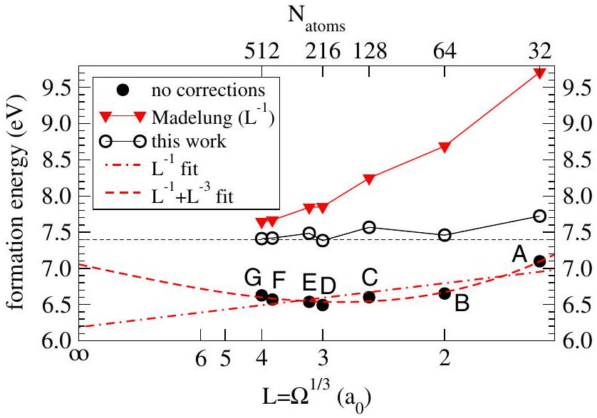
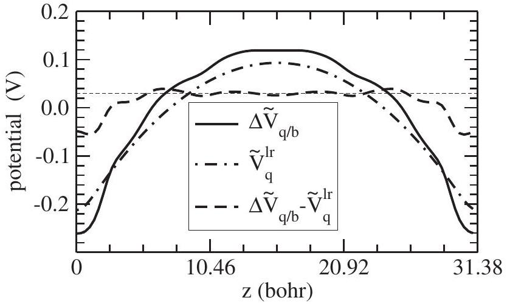
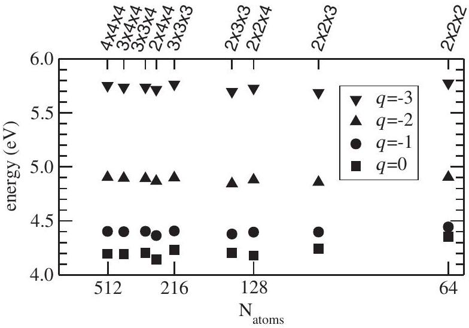

# Fully Ab Initio Finite-Size Corrections for Charged-Defect Supercell Calculations

Christoph Freysoldt and Jörg Neugebauer Max-Planck-Institut für Eisenforschung, Max-Planck-Straße 1, 40227 Düsseldorf, Germany Chris G. Van de Walle Materials Department, University of California, Santa Barbara, California 93106-5050, USA (Received 14 June 2008; published 5 January 2009)

#### Abstract

In ab initio theory, defects are routinely modeled by supercells with periodic boundary conditions. Unfortunately, the supercell approximation introduces artificial interactions between charged defects. Despite numerous attempts, a general scheme to correct for these is not yet available. We propose a new and computationally efficient method that overcomes limitations of previous schemes and is based on a rigorous analysis of electrostatics in dielectric media. Its reliability and rapid convergence with respect to cell size is demonstrated for charged vacancies in diamond and GaAs.

DOI: 10.1103/PhysRevLett.102.016402
PACS numbers: 71.15.Nc, 61.72.Bb, 71.55.-i

The performance and long-term stability of many semiconductor devices such as solar cells, light-emitting diodes, or transistors is often governed by the creation, transport, or annihilation of point defects [1]. The application of electronic structure theory, notably densityfunctional theory (DFT), has revolutionized our understanding of the formation and properties of defects such as vacancies, interstitials, dopants, and impurities.

The common computational approach is to embed the defect of interest into a periodic supercell with a neutralizing background [1-6], because it allows employing the well-tested and efficient computer codes available for periodic systems. This approach, however, is hampered by the slow convergence of the defect energy with respect to the supercell lattice constant $L$. Its origin lies in the unphysical electrostatic interaction between the defect and its periodic images. The interaction energy can be estimated from the Madelung energy of an array of point charges with neutralizing background [6]

$$
E^{\mathrm{Md}}=-\frac{\alpha q^{2}}{2 \varepsilon L},
$$

where $q$ denotes the defect charge, $\alpha$ the lattice-typedependent Madelung constant, and $\varepsilon$ the macroscopic dielectric constant. Makov and Payne proved for isolated ions that the quadrupole moment $Q$ gives rise to a further term scaling like $q Q L^{-3}$ [7]. For realistic defects in condensed systems, however, such corrections do not always improve the convergence [3-5]. Figure 1 illustrates this for the + 2 vacancy in diamond. Clearly, the Madelung correction greatly overshoots for small supercells. As a purely empirical resort, $\varepsilon$ and $Q$ have sometimes been regarded as free parameters to be obtained from fitting a series of supercell calculations [3-5]. Such "scaling laws" require large supercells and invariably include higher order terms with unclear physical significance [5]. Moreover, the $L^{-1}$ and $L^{-1}+L^{-3}$ fits in Fig. 1 (here, $L$ is defined as the cubic root of the supercell volume $\Omega$ ) highlight that the predictive power of such empirical extrapolation procedures is questionable. Alternatively, several authors have suggested to truncate or compensate the long-range tail of the bare Coulomb potential during the computation of the electrostatic potential itself in order to remove the unwanted interactions [8-10]. Unfortunately, applying these schemes to solids suffers from the neglect of polarization outside the supercell. The corresponding error in energy is roughly $\sqrt[3]{\pi / 6}\left(1-\varepsilon^{-1}\right) q^{2} L^{-1}$ [5,9]. From a comparison to Eq. (1), we conclude that this error is larger than in the standard approach for $\varepsilon>2.8$, i.e., most solids of interest.

In this Letter, we introduce a novel approach which (i) is based on a single supercell calculation, (ii) does not rely on fitted parameters, (iii) derives from an exact expression

FIG. 1 (color online). Comparison of correction or extrapolation schemes (see text) for the formation energy of the +2 vacancy in diamond (plotted vs $L^{-1}$ ) in various supercells. A: bcc $1 \times 1 \times 1$ (32 atoms); B: simple cubic (sc) $2 \times 2 \times 2$ (64); C: fcc $4 \times 4 \times 4(128)$; $\mathrm{D}:$ sc $3 \times 3 \times 3$ (216); E: bcc $2 \times 2 \times$ 2 (256); F: fcc $6 \times 6 \times 6$ (432); G: sc $4 \times 4 \times 4$ (512). The Fermi energy is set equal to the valence-band maximum. The horizontal dashed line indicates the converged result according to our new scheme.

applying well-defined approximations, and (iv) sheds light on the problems encountered in previous schemes. We demonstrate the success of the new approach for two defects that support a wide range of charge states: (1) the Ga vacancy in GaAs $(q=-3 \ldots 0)$, where the computed formation energies vary largely in the literature as supercell artifacts are not treated systematically, and (2) the vacancy in diamond ( -4 to +2 ), a prime example for the failure of existing schemes; see Fig. 1 and Ref. [4].

Our calculations are based on DFT in the local density approximation. We employ norm-conserving pseudopotentials and a plane-wave basis set (20 Ry cutoff for GaAs, 40 Ry for C) as implemented in the SPHINX package [11]. For the Brillouin zone, Monkhorst-Pack meshes equivalent to at least a 4 × 4 × 4 sampling for the 8atom GaAs cell ( $6 \times 6 \times 6$ for C) are used. The defect levels are occupied uniformly throughout the Brillouin zone to remove band-dispersion errors [2]. Since we aim at a physical understanding of the electrostatic interactions, we constrain the atoms to their ideal positions at the theoretical lattice constant (GaAs: 10.46 bohr, C: 6.65 bohr) to exclude strain effects. In general, however, local relaxation must be taken into account.

To arrive at a computationally accessible expression of defect-defect interactions, we split the creation of charged defects into three steps. Each step provides a quantity needed for the final expression. First, the charge $q$ is introduced for a single defect by adding or removing electrons from a defect state $\psi_{d}$, while all other electrons are frozen (no polarization). This step is associated with an unscreened charge density

$$
q_{d}(\mathbf{r})=q\left|\psi_{d}(\mathbf{r})\right|^{2} .
$$

Next, the electrons are allowed to screen the introduced charge. The resulting electron distribution gives rise to a change in the electrostatic potential $V_{\text {defect }}$ with respect to the neutral defect

$$
V_{q / 0}(\mathbf{r})=V_{\text {defect }, q}(\mathbf{r})-V_{\text {defect }, 0}(\mathbf{r}) .
$$

Third, we impose artificial periodicity and add a compensating homogeneous background charge $n=-q / \Omega$ ( $\Omega$ being the volume of the supercell). For this last step, we may reasonably assume a linear-response behavior. The resulting potential then is-up to an additive constant-a superposition of the potentials $V_{q / 0}(\mathbf{r}+\mathbf{R})$, where $\mathbf{R}$ is a lattice vector. We note that the validity of the superposition principle is a common prerequisite of all correction schemes. However, a direct summation of the potentials does not converge. The divergence is removed by the compensating background. This is most easily formulated after a Fourier transformation to reciprocal space

$$
V_{q / 0}^{\mathrm{rec}}(\mathbf{G})=\int d^{3} \mathbf{r}^{\prime} V_{q / 0}\left(\mathbf{r}^{\prime}\right) e^{-i \mathbf{G} \cdot \mathbf{r}^{\prime}} .
$$

Note that the integration is over all space and converges for arbitrary $\mathbf{G} \neq \mathbf{0}$. The constant background cancels the divergent $\mathbf{G}=\mathbf{0}$ Fourier component, while all others remain unchanged. The periodic defect potential is obtained from a Fourier series

$$
\tilde{V}_{q / 0}(\mathbf{r})=\frac{1}{\Omega} \sum_{\mathbf{G} \neq \mathbf{0}} V_{q / 0}^{\mathrm{rec}}(\mathbf{G}) e^{i \mathbf{G} \cdot \mathbf{r}},
$$

where $\mathbf{G}$ runs over the reciprocal (super)lattice vectors. Our main point here is that all defect-defect interactions can be expressed in terms of $q_{d}, V_{q / 0}$, and $\tilde{V}_{q / 0}$.

We now focus on the defect at $\mathbf{R}=\mathbf{0}$ and assume that the unscreened defect charge $q_{d}$ is fully contained in the $\mathbf{R}=\mathbf{0}$ supercell. The artificial potential due to periodic repetition is given by ( $\tilde{V}_{q / 0}-V_{q / 0}$ ), and the associated interaction energy is

$$
E^{\text {inter }}=\frac{1}{2} \int_{\Omega} d^{3} \mathbf{r}\left[q_{d}(\mathbf{r})+n\right]\left[\tilde{V}_{q / 0}(\mathbf{r})-V_{q / 0}(\mathbf{r})\right],
$$

where the prefactor $\frac{1}{2}$ accounts for double counting and the integral is restricted to the supercell. A further artifact, that is not taken care of by Eq. (6), arises from the interaction of the background charge with the defect inside the reference supercell. It is given by

$$
E^{\mathrm{intra}}=\int_{\Omega} d^{3} \mathbf{r} n V_{q / 0}(\mathbf{r})=-q\left(\frac{1}{\Omega} \int_{\Omega} d^{3} \mathbf{r} V_{q / 0}(\mathbf{r})\right)
$$

For practical approximations, Eqs. (6) and (7) must be rearranged. We note that the isolated defect's potential at large distances $|\mathbf{r}| \rightarrow \infty$ is dominated by the macroscopically screened Coulomb potential

$$
V_{q / 0}(\mathbf{r}) \rightarrow V_{q}^{\mathrm{lr}}(\mathbf{r})=\frac{1}{\varepsilon} \int d^{3} \mathbf{r}^{\prime} \frac{q_{d}\left(\mathbf{r}^{\prime}\right)}{\left|\mathbf{r}-\mathbf{r}^{\prime}\right|} .
$$

The corresponding periodic potential $\tilde{V}_{q}^{\mathrm{lr}}$ is obtained analogous to Eq. (5). The separation

$$
V_{q / 0}(\mathbf{r})=V_{q}^{\mathrm{lr}}(\mathbf{r})+V_{q / 0}^{\mathrm{sr}}(\mathbf{r})
$$

defines a short-range potential $V_{q / 0}^{\text {sr }}$, which accounts for the variations in the microscopic screening. For the periodic potential $\tilde{V}_{q / 0}^{\text {sr }}$, we can directly apply the superposition principle, i.e.,

$$
\begin{aligned}
\tilde{V}_{q / 0}^{\mathrm{sr}}(\mathbf{r}) & =\sum_{\mathbf{R}} V_{q / 0}^{\mathrm{sr}}(\mathbf{r}+\mathbf{R})+C \\
& \approx V_{q / 0}^{\mathrm{sr}}(\mathbf{r})+C \quad \text { for } \mathbf{r} \in \Omega .
\end{aligned}
$$

The constant $C$ is required to reproduce the absolute position of $\tilde{V}_{q / 0}$. Its value depends on the alignment convention employed for $\tilde{V}_{\text {defect }, q}$ and $\tilde{V}_{q / 0}^{\mathrm{lr}}$. The simplification in Eq. (11) applies if $V_{d / n}^{\mathrm{sr}}$ is essentially zero outside the supercell.

With these ingredients, the sum of Eqs. (6) and (7) is rearranged into two terms

$$
E^{\text {inter }}+E^{\text {intra }}=E_{q}^{\text {lat }}-q \Delta_{q / 0}
$$

which are the macroscopically screened lattice energy of $q_{d}$ with compensating background

$$
E_{q}^{\mathrm{lat}}=\int_{\Omega} d^{3} \mathbf{r}\left[\frac{1}{2}\left[q_{d}(\mathbf{r})+n\right]\left[\tilde{V}_{q}^{\mathrm{lr}}(\mathbf{r})-V_{q}^{\mathrm{lr}}(\mathbf{r})\right]+n V_{q}^{\mathrm{lr}}(\mathbf{r})\right]
$$

and an alignmentlike term, where

$$
\begin{gathered}
\Delta_{q / 0}=\frac{1}{\Omega} \int_{\Omega} d^{3} \mathbf{r} V_{q / 0}^{\mathrm{sr}}(\mathbf{r}), \\
V_{q / 0}^{\mathrm{sr}}(\mathbf{r})=\tilde{V}_{q / 0}(\mathbf{r})-\tilde{V}_{q}^{\mathrm{lr}}(\mathbf{r})-C .
\end{gathered}
$$

Equations (13)-(15) are the key equations for our approach, since they allow us to explicitly calculate the artificial interactions from $\varepsilon, q_{d}, \tilde{V}_{q / 0}$, and $C$, which can then be subtracted from the uncorrected formation energies obtained from the ab initio supercell calculations.

We will now sketch out how to obtain the required quantities in practice. For a consistent removal of supercell artifacts in the calculation, the theoretical value of $\varepsilon$ must be used. It may be computed from density-functional perturbation theory [12] or from the response to a finite sawtooth potential [13]. Following the latter approach, we obtain values of 12.4 for GaAs and 5.7 for C. The sawtooth approach also allowed us to verify that the response remains in the linear regime for magnitudes of the potential well beyond those induced by defects. For $q_{d}$, it turns out that any reasonable approximation to the defect charge distribution suffices since the sum of lattice energy and alignment correction is not sensitive to the details of $q_{d}$. The simplest approximations are a point charge or a Gaussian, and they indeed prove to be sufficient for most cases. Once a model for $q_{d}$ is chosen, the lattice energy is easily obtained via Ewald summation. For point charges, we then recover the leading term of previous correction schemes [6,7]. $\tilde{V}_{q / 0}$ is available directly from the DFT supercell calculations. Without loss of generality, we may even switch our reference from the neutral defect to the perfect bulk material

$$
\begin{gathered}
\tilde{V}_{q / b}=\tilde{V}_{\text {defect }, q}-\tilde{V}_{\text {bulk }} \\
\tilde{V}_{q / b}^{\mathrm{sr}}=\tilde{V}_{q / 0}^{\mathrm{sr}}+\tilde{V}_{\text {defect }, 0}-\tilde{V}_{\text {bulk }},
\end{gathered}
$$

exploiting that a neutral defect has no long-range Coulomb potential. $\Delta_{q / b}$ is defined analogous to Eq. (14). Changing the reference, we also change the alignment $C$.

To determine the alignment constant $C$, we require that the short-range potential $V_{d / b}^{\mathrm{sr}}$ decays to zero far from the defect. In practice, we average the potentials in the $x y$ planes and plot this average as a function of $z$. Figure 2 illustrates this for the Ga vacancy $(q=-3)$ in a $3 \times 3 \times 3$ simple cubic GaAs supercell. The vacancy is located at $z=$ 0 with a periodic image at $3 a_{0}=31.38$ bohr. $q_{d}$ is approximated by a Gaussian with a width of 1 bohr. Far from the defect, $\tilde{V}_{q / b}$ (solid line) assumes a parabolic shape.

FIG. 2. Electrostatic potentials (see text, averaged along $x, y$ ) for $\mathrm{V}_{\mathrm{Ga}}^{3-}$ in a $3 \times 3 \times 3$ simple cubic GaAs supercell. The defect is located at $z=0$ bohr with a periodic image at $z=$ 31.38 bohr.

This is well reproduced by $\tilde{V}_{d}^{\text {lr }}$ (dashed-dotted line). The parabola arises from the homogeneous background, being the solution of the one-dimensional Poisson equation for the $x y$-averaged $\bar{V}(z)$

$$
\frac{\partial^{2}}{\partial z^{2}} \bar{V}(z)=-4 \pi n
$$

The difference ( $\tilde{V}_{q / b}-\tilde{V}_{q}^{\text {lr }}$ ) (dashed line) reaches a plateau $C \approx 0.03 \mathrm{eV}$ (thin dashed line) between the defects. The appearance of the plateau demonstrates that our approach successfully separated the long-range and short-range effects. This visual control of short-rangedness is a big advantage of our procedure, since problems in modeling the long-range potential are immediately detected. We also note that the small oscillations around the plateau are not linked to the atomic structure but reflect Friedel-like oscillations of the microscopic screening. Since we do not include them in our electrostatic models, they are the main source of scatter in the corrected energies presented here. We likewise expect that a Taylor series of these oscillating electrostatic interactions in $L^{-n}$ (the "scaling law" approach) will converge only slowly with the number of terms.

To demonstrate the reliability of our new correction scheme for arbitrarily shaped supercells, we present in Fig. 3 the formation energy [2,14]

$$
\begin{aligned}
E^{f}\left(\mathrm{~V}_{\mathrm{Ga}}^{q}\right)= & E\left(\mathrm{~V}_{\mathrm{Ga}}^{q}+\text { bulk }\right)-E(\text { bulk })+E(\mathrm{Ga})+\mu_{\mathrm{Ga}} \\
& -E_{q}^{\text {lat }}+q\left(E_{\mathrm{F}}+\Delta_{q / b}\right)
\end{aligned}
$$

of the unrelaxed Ga vacancy $\mathrm{V}_{\mathrm{Ga}}^{q}$ in various charge states for a set of $N_{1} \times N_{2} \times N_{3}$ supercells of the 8-atom sc cell. The Fermi energy $E_{\mathrm{F}}$ is set equal to the valence-band maximum and the Ga chemical potential $\mu_{\mathrm{Ga}}$ to that of Ga metal. Using a point-charge model $q_{d}$ (the results are the same for a 1 bohr Gaussian), the ab initio corrected formation energies of all calculations above $2 \times 2 \times 2$ agree within 0.1 eV without any empirical fit. Interestingly, the magnitude of the scatter does not scale

FIG. 3. Defect formation energies of the Ga vacancy in GaAs including supercell corrections as a function of the inverse number of atoms. The Fermi energy is set equal to the valence-band maximum and the Ga chemical potential to that of Ga metal.

with the formal charge, suggesting that the remaining errors are not dominated by long-range electrostatic effects (which scale as $q^{2}$ ).

A point-charge model for $q_{d}$ is equivalent to MakovPayne corrections and scaling laws for sufficiently large supercells, since the lattice energy then scales like $L^{-1}$ and the alignment term like $L^{-3}$. We will now analyze a case where these previous schemes fail to provide a converged result (see Fig. 1): the +2 charged vacancy in diamond. This defect was shown to have an unusual supercell dependence up to 432 atoms [4] (much smaller or even of opposite sign compared to the point-charge expectations), a result confirmed in our calculations up to 512 atoms. The authors of Ref. [4] suggested that variations in the local screening may be responsible. In contrast, we argue that the effect results from a slow decay of the underlying defect state. Indeed, a point-charge model overcorrects the potential in the intermediate range [15], which becomes evident from the corresponding $\tilde{V}_{q / b}^{\text {sr }}$ (not shown). In order to improve the description of $V_{q}^{\mathrm{lr}}$, we employ a more elaborate model charge density $q_{d}$, which takes into account the charge distribution associated with the defect state's wave function $\psi_{d}$. For this, we decompose the $\left|\psi_{d}\right|^{2}$ into an exponentially decaying and a strictly localized contribution $q_{\text {loc }}$

$$
\left|\psi_{d}(\mathbf{r})\right|^{2} \approx x\left(8 \pi \gamma^{3}\right)^{-1} e^{-\gamma^{-1}\left|\mathbf{r}-\mathbf{r}_{0}\right|}+q_{\mathrm{loc}}(\mathbf{r}),
$$

where $x$ and the decay length $\gamma$ are obtained by fitting the tail of $\left|\psi_{d}\right|^{2} . \mathbf{r}_{0}$ denotes the center of the defect. While $x$ varies little for the different charge states $(54 \%-60 \%), \gamma$ depends on the position of the defect level in the band gap. When approaching the valence or conduction band, the decay length increases. Since the exact shape of $q_{\text {loc }}$ has negligible influence on the long-range potential, we substitute it by a Gaussian ( $\beta=1$ bohr) and use

$$
q_{d}(\mathbf{r})=q x N_{\gamma}^{-1} e^{-\left|\mathbf{r}-\mathbf{r}_{0}\right| / \gamma}+q(1-x) N_{\beta}^{-1} e^{-\left|\mathbf{r}-\mathbf{r}_{0}\right|^{2} / \beta^{2}}
$$

with $q$-specific $x$ and $\gamma\left(N_{\gamma}=8 \pi \gamma^{3}, N_{\beta}=\pi^{3 / 2} \beta^{3}\right)$. Figure 1 shows that this refined model density performs very well for supercells with 216 or more atoms. The discrepancies for smaller cells must be attributed to short-range interactions and the significant overlap of the defect wave functions. Test calculations [16] confirm that the scheme is applicable equally for $q=+2 \ldots-4$ [15].

In summary, we have analyzed electrostatic interactions between defects in the supercell approach. In contrast to previous work, an explicit expression for the $L^{-3}$ term in condensed matter is derived. We propose a new correction scheme, which is easily implemented in existing codes, is accurate, and requires no empirical parameters or fitting procedures. Moreover, the validity of the underlying assumptions can be directly assessed. We strongly believe that this simple and transparent scheme will reduce the uncertainties of calculated defect formation energies due to the use of finite supercells and approximate correction schemes. Furthermore, our three-step ansatz can be applied to similar problems in more complex systems, such as charged surfaces, interfaces, or line defects.

We thank Peter Blöchl and Mira Todorova for fruitful discussions. This work was supported in part by the German Bundesministerium für Bildung und Forschung, Project No. 03X0512G, the NSF MRSEC Program under Grant No. DMR05-20415, the IMI Program of the NSF under Grant No. DMR04-09848, and the UCSB-MPG Program for International Exchange in Materials Science.

[1] E. G. Seebauer and M. C. Kratzer, Mater. Sci. Eng., R 55, 57 (2006).
[2] C. G. Van de Walle and J. Neugebauer, J. Appl. Phys. 95, 3851 (2004).
[3] C. W. M. Castleton, A. Höglund, and S. Mirbt, Phys. Rev. B 73, 035215 (2006).
[4] J. Shim, E.-K. Lee, Y. J. Lee, and R. M. Nieminen, Phys. Rev. B 71, 035206 (2005).
[5] A. F. Wright and N. A. Modine, Phys. Rev. B 74, 235209 (2006).
[6] M. Leslie and M. J. Gillan, J. Phys. C 18, 973 (1985).
[7] G. Makov and M. C. Payne, Phys. Rev. B 51, 4014 (1995).
[8] P. Carloni, P. Blöchl, and M. Parrinello, J. Phys. Chem. 99, 1338 (1995).
[9] P. A. Schultz, Phys. Rev. Lett. 84, 1942 (2000).
[10] C. A. Rozzi, D. Varsano, A. Marini, E. K. U. Gross, and A. Rubio, Phys. Rev. B 73, 205119 (2006).
[11] http://www.sphinxlib.de.
[12] S. Baroni and R. Resta, Phys. Rev. B 33, 7017 (1986).
[13] K. Kunc and R. Resta, Phys. Rev. Lett. 51, 686 (1983).
[14] Here $E\left(\mathrm{~V}_{\mathrm{Ga}}^{q}+\right.$ bulk $)$ and $E$ (bulk) denote the total energy of the supercell with and without the defect, respectively. $E(\mathrm{Ga})$ and $\mu_{\mathrm{Ga}}$ are the total energy and chemical potential of Ga, respectively.
[15] C. Freysoldt and J. Neugebauer (to be published).
[16] Simple cubic cells from $2 \times 2 \times 2$ to $4 \times 4 \times 4$.
