# First-principles calculations for point defects in solids

Christoph Freysoldt, Blazej Grabowski, Tilmann Hickel, and Jörg Neugebauer Max-Planck-Institut für Eisenforschung GmbH, D-40237 Düsseldorf, Germany

Georg Kresse
University of Vienna, Faculty of Physics and Center for Computational Materials Science, A-1090 Wien, Austria

Anderson Janotti and Chris G. Van de Walle
Materials Department, University of California, Santa Barbara, California 93106-5050, USA
(published 28 March 2014)
Point defects and impurities strongly affect the physical properties of materials and have a decisive impact on their performance in applications. First-principles calculations have emerged as a powerful approach that complements experiments and can serve as a predictive tool in the identification and characterization of defects. The theoretical modeling of point defects in crystalline materials by means of electronic-structure calculations, with an emphasis on approaches based on density functional theory (DFT), is reviewed. A general thermodynamic formalism is laid down to investigate the physical properties of point defects independent of the materials class (semiconductors, insulators, and metals), indicating how the relevant thermodynamic quantities, such as formation energy, entropy, and excess volume, can be obtained from electronic structure calculations. Practical aspects such as the supercell approach and efficient strategies to extrapolate to the isolated-defect or dilute limit are discussed. Recent advances in tractable approximations to the exchange-correlation functional (DFT $+U$, hybrid functionals) and approaches beyond DFT are highlighted. These advances have largely removed the long-standing uncertainty of defect formation energies in semiconductors and insulators due to the failure of standard DFT to reproduce band gaps. Two case studies illustrate how such calculations provide new insight into the physics and role of point defects in real materials.

DOI: 10.1103/RevModPhys.86.253 PACS numbers: 61.72.Bb, 71.55.-i, 71.15.Nc
CONTENTS
I. Introduction ..... 254
A. Role of point defects and impurities in solids ..... 255

1. Doping ..... 255
2. Overcoming doping limits and achieving ambipolar doping ..... 255
a. Solubility ..... 256
b. Ionization energy ..... 256
c. Incorporation of impurities in other configurations ..... 256
d. Compensation by native point defects ..... 256
e. Compensation by foreign impurities ..... 256
3. Diffusion ..... 256
4. Thermodynamics and phase stability ..... 257
B. Key quantities ..... 257
5. Formation energies ..... 257
6. Complex formation and binding energies ..... 258
7. Charge-state transition levels in semiconductors and insulators ..... 259
8. Quantities amenable to comparison with experiment ..... 259
a. Defect concentrations ..... 259
b. Atomic structure ..... 260
c. Scanning tunneling microscopy and spectroscopy ..... 260
d. $g$ factors and hyperfine parameters ..... 260
e. NMR chemical shifts ..... 260
f. Mössbauer spectroscopy ..... 260
g. Vibrational frequencies ..... 260
h. Defect transition levels ..... 261
C. Requirements for theoretical and computational treatments ..... 261
9. Electronic-structure approaches ..... 261
10. Constraints on accuracy of computational results ..... 261
II. Thermodynamic Concepts ..... 262
A. Entropy of defects ..... 262
11. Configurational entropy ..... 262
12. Electronic entropy ..... 263
13. Vibrational entropy ..... 264
a. Quasiharmonic excitations ..... 264
b. Beyond the quasiharmonic approximation: Explicitly anharmonic excitations ..... 264
B. Free energy of formation and defect concentrations ..... 265
14. Point defects at finite temperatures and pressures ..... 265
15. Chemical potentials ..... 266
a. Variability and limits ..... 266
b. Chemical potential reference ..... 266
c. Chemical potential of electrons ..... 267
16. Defect concentrations ..... 267
C. Sources of discrepancies between theory and experiment ..... 268
17. Non-Arrhenius behavior of defect concentrations ..... 268
18. Effect of xc errors on defect formation energies ..... 269
D. Thermodynamic transition levels ..... 269
19. Deep levels ..... 270
20. Shallow levels ..... 270
21. Spatial localization and $U$ parameter ..... 271
E. Optical transition levels ..... 272
22. Configuration coordinate diagrams ..... 272
23. Vibrational contributions and linewidth ..... 273
III. From Supercells to the Dilute Limit ..... 273
A. The supercell approach ..... 273
B. Overlap of wave functions ..... 274
24. Dispersion of the defect band ..... 274
25. Partially occupied states ..... 274
26. Corrections for shallow levels ..... 275
C. Electrostatic interactions ..... 276
D. Elastic interactions ..... 277
E. Magnetic interactions ..... 277
F. Recommendations ..... 278
IV. Overcoming the Band-gap Problem ..... 278
A. Hartree-Fock theory ..... 279
B. Shortcomings of density functional theory ..... 279
27. Self-interaction and localization errors ..... 279
28. Exchange-correlation derivative discontinuity ..... 281
C. Extrapolation schemes ..... 281
D. $\mathrm{LDA}(\mathrm{GGA})+U$ for materials with semicore $d$ states ..... 282
29. The $\operatorname{LDA}(\mathrm{GGA})+U$ method ..... 283
30. Choice of $U$ ..... 283
31. Band alignment between LDA and LDA $+U$ ..... 284
32. Corrected defect transition levels and formation energies based on LDA $+U$ ..... 284
E. Correction schemes based on modification of pseudopotentials ..... 286
33. Self-interaction-corrected pseudopotentials ..... 286
34. Modified pseudopotentials ..... 286
F. Quasiparticle calculations ..... 287
35. Fundamental concepts ..... 287
36. Practical approximations ..... 288
37. Self-consistency and vertex corrections ..... 289
38. Constraints and limitations ..... 290
G. Hybrid functionals ..... 291
39. Screened exchange ..... 291
40. Hybrid functionals: Historical overview ..... 291
41. The incentive to use hybrid functionals and 1/4 of the exact exchange ..... 292
42. Performance of hybrid functionals ..... 293
H. Quantum Monte Carlo calculations ..... 294
V. Case Studies ..... 294
A. Overcoming doping limits ..... 294
43. Causes of unintentional $n$-type conductivity in ZnO ..... 295
a. Native point defects ..... 295
b. Impurities ..... 296
44. $p$-type doping of ZnO ..... 297
B. Impact of point defects on phase stability close to the melting temperature ..... 297
45. The debate about vacancies versus anharmonicity ..... 297
46. First-principles studies for Al ..... 298
VI. Conclusions and Outlook ..... 299
Acknowledgments ..... 300
References ..... 300

## I. INTRODUCTION

Point defects and impurities often play a decisive role in the physical properties of materials. Experimental defect identification is typically difficult and indirect, usually requiring an ingenious combination of different techniques. Firstprinciples calculations have emerged as a powerful approach that complements experiments and has become reliable enough to serve as a predictive tool. This methodology is now practiced by a large and growing number of research groups around the world. Due to the importance of this active field a number of textbooks and overview articles have been published (Leibfried and Breuer, 1978; Estreicher, 1995, 2000; Van de Walle and Neugebauer, 2004; Drabold and Estreicher, 2007; Alkauskas et al., 2011; Evarestov, 2012). Rapid methodological developments over the last few years make this a timely moment to present a comprehensive overview of the state of the art and the major achievements and insights that have been obtained. Our goals are to (1) address the fundamental physics issues that underlie the methods; (2) unify the methodology by covering semiconductors, insulators, and metals on the same footing; (3) devote particular attention to the impressive methodological progress that has been achieved within the past few years; and (4) provide a critical assessment of areas in which future research is most needed.

A formalism based on formation energies allows calculation of defect and impurity equilibrium structures and concentrations. In the case of semiconductors and insulators, it also allows the calculation of the relative stability of the different charge states of a given defect, and hence the thermodynamic and optical transition levels associated with deep and shallow centers. The formalism is entirely general and can be applied to any crystalline solid, even though some issues addressed may not be relevant for all material classes. For instance, charged defects and band gaps can occur only in nonmetals, i.e., semiconductors, wide-gap materials, and insulators. From a modeling point of view, the nonmetallic materials differ only in the size of the band gap and related quantities. For the sake of readability, we will sometimes use "semiconductor" as a synonym for materials with a band gap whenever the existence of the band gap matters. Section II provides an overview of the state-of-the-art methodology for performing first-principles ground-state calculations for defects and impurities. Finite-temperature effects, i.e., the evaluation of free energies that include effects beyond configurational entropy, will also be comprehensively treated. The electronic ground state provides a variety of additional response properties that are accessible with dedicated experiments and theory (see Sec. I.B.4). However, the calculation of response or even dynamical properties (such as local vibrational modes, phonon scattering, or localized electronic excitations) will not be discussed in detail within this review due to space limitations.

An area that has proved problematic in the past is related to the lattice geometry in which the calculations are performed. Typically, one addresses the dilute limit, in which the defect concentration is low and defect-defect interactions are negligible. When performing calculations for defects using periodic boundary conditions, in the so-called supercell
approach, interactions may affect the calculated formation energies and transition levels. Electrostatic interactions, which occur in the case of charged defects in semiconductors and insulators, decay particularly slowly with increasing supercell size. Errors may also arise due to defect wave-function overlap, magnetic interactions, and strain. Rigorous transformations and extrapolation schemes are therefore critical to describe the accurate asymptotic limit. All of this is addressed in Sec. III.

Density functional theory (DFT), often in conjunction with pseudopotentials or projector augmented wave potentials, has emerged as the most commonly used first-principles approach for defect calculations. When used with the traditional local or semilocal exchange-correlation (xc) functionals, such as the local density approximation (LDA) or generalized gradient approximation (GGA), this approach has been limited in its ability to predict properties associated with the electronic structure of materials due to the so-called "band-gap problem." Great progress has been made in overcoming this deficiency, both by going beyond DFT and by implementing advanced functionals within DFT. Section IV is devoted to these issues, including discussion and critical comparison of approaches such as the quasiparticle (QP) $G W$ method, $\mathrm{DFT}+U$, and hybrid functionals.

Defect calculations have been pushed forward by the need for a better theoretical understanding of defects in a wide range of technologies such as electronic and optoelectronic devices, solar cells, structural materials, and catalysts, just to a name a few. While a comprehensive overview of the insights gained for these applications is desirable, it would clearly exceed the limits of our review. Instead, Sec. V exemplifies the methodology in an applied context by two illustrative case studies. Section VI, finally, includes a critical outlook on those areas that will benefit from additional research.

## A. Role of point defects and impurities in solids

## 1. Doping

Various properties of materials are controlled by the presence of defects and impurities. An outstanding example occurs in the case of semiconductors, where the incorporation of impurities even in small concentrations determines the electrical conductivity. The fabrication of $p$-type and $n$-type doped layers underlies the design of virtually all electronic and optoelectronic devices. To achieve such control, comprehensive knowledge of the fundamental processes that control doping is required, and first-principles calculations have made important contributions to this knowledge.

Shallow dopants (i.e., heterovalent impurities with small ionization energies that easily release carriers to the host) render the material $n$-type or $p$-type conductive. This conductivity can be counteracted by the presence of compensating centers in the form of either native point defects or impurities. These centers can also introduce deep levels that affect recombination rates and cause optical absorption or luminescence. Even in well-established semiconductors such as Si or Ge, achieving high and well-controlled doping levels is still an active area of research (Voyles et al., 2002). Some other semiconductors have very attractive intrinsic properties, but have not been amenable to device applications because of a lack of control over their conductivity. These problems tend to be particularly severe in the case of wide-band-gap semiconductors.

Several studies have attempted to identify the underlying reasons for these difficulties (Zhang, Wei, and Zunger, 1999; Walukiewicz, 2001). A general conclusion that can be drawn from such investigations is that $n$-type doping is difficult when the energy of the conduction-band minimum (CBM) is high on an absolute energy scale (e.g., referenced to the vacuum level); and $p$-type doping is difficult when the energy of the valence-band maximum (VBM) is low. This notion is actually fairly intuitive. For instance, in the case of shallow donors, the goal is to introduce a filled electronic state with an energy level higher than the CBM, which results in an electron being donated to the conduction band (see Sec. II.D.2). The remaining positive defect in turn induces a shallow, hydrogenic effective-mass state slightly below the CBM. When the CBM of the semiconductor is high in energy, the range of impurities that can accomplish this feat is limited. In addition, any processes that can lead to a lowering of the energy of the added electron will be particularly favored if the CBM is high; such processes include spontaneous formation of defects and atomic relaxation of the impurity away from its substitutional site.

While general rules for describing doping in semiconductors are useful in elucidating the underlying physics, they turn out to be inadequate and potentially misleading when applied to specific cases. For instance, such rules typically predict that it is not possible to dope GaN $p$ type. In reality, acceptor doping of GaN is difficult but by no means impossible: roomtemperature hole concentrations on the order of $10^{18} \mathrm{~cm}^{-3}$ are now routinely achieved. One has to conclude that there is no substitute for considering every case individually. This is a formidable task experimentally, but first-principles calculations are now capable of providing detailed understanding and predictions.

## 2. Overcoming doping limits and achieving ambipolar doping

In some semiconductors, doping is in principle straightforward, but achieving the increasingly higher doping levels that are required for novel devices can be challenging. At high doping levels, self-compensation sets in, i.e., not every dopant that is incorporated yields a carrier. In many cases, compensation can be attributed to the formation of point defects.

Native point defects have also often been invoked to explain unintentional conductivity in semiconductors and insulators. There has been a long-standing belief that native defects such as vacancies or self-interstitials can act as a source of doping, particularly in wide-band-gap semiconductors. This belief is based largely on "circumstantial evidence," such as trends observed when growing or annealing in environments that are rich or poor in one particular constituent. Direct experimental verification (or refutation) has been lacking, however, mainly due to the difficulty in establishing quantitative measurements relating to the presence of point defects. ZnO is a prime example of a wide-band-gap oxide in which these issues have long been debated. First-principles calculations can provide
powerful insights, and ZnO will be the subject of one of the case studies presented in Sec. V.

Bringing unintentional doping under control is a first and essential step for achieving ambipolar doping. Gallium nitride, a semiconductor that is now the basis of the rapidly growing solid-state lighting industry, offers a striking example. Until about 1990, all GaN material that was grown was invariably $n$ type, and almost all reports attributed this to point defects (in particular, nitrogen vacancies). It gradually became clear, however, partly thanks to first-principles calculations, that the conductivity was actually due to unintentionally incorporated impurities. Improved high-purity growth techniques brought these contamination problems under control and opened the path for achieving $p$-type doping. More recently, ZnO followed a similar trajectory, although in that case achieving $p$-type doping is still a major problem, as discussed in Sec. V.A.2.

The following factors need to be considered when discussing doping of semiconductors and its limitations:

## a. Solubility

A high free-carrier concentration requires a high concentration of the dopant impurity. The solubility corresponds to the maximum concentration that the impurity can attain in the semiconductor, under conditions of thermodynamic equilibrium. This concentration depends on temperature and on the abundance of the impurity as well as the host constituents in the growth environment, as determined by chemical potentials (see Sec. II.B.2).

## b. Ionization energy

For a shallow donor or acceptor, the ionization energy determines the fraction of dopants that will be ionized and hence contribute free carriers at a given temperature. A high ionization energy limits the doping efficiency. Ionization energies of shallow dopants are predominantly determined by intrinsic properties of the semiconductor, such as the effective masses and dielectric constant.

## c. Incorporation of impurities in other configurations

Most dopant impurities must reside on substitutional sites in order to exhibit the desired electrical activity. For instance, in order for Mg in GaN to act as an acceptor, it needs to be incorporated on the gallium site. If Mg is incorporated in an interstitial position, it actually acts as a donor and hence causes compensation. Another instance of impurities incorporating in undesirable configurations consists of the so-called $D X$ centers. The prototype $D X$ center is Si in AlGaAs (Mooney, 1992). In GaAs and in AlGaAs with low Al content, Si resides on the cation site and behaves as a shallow donor, but when the Al content exceeds a critical value, Si behaves as a deep acceptor. This has been attributed to Si being displaced from the substitutional site toward an interstitial position (Chadi and Chang, 1988).

## d. Compensation by native point defects

Native defects are point defects intrinsic to the semiconductor, such as vacancies (missing atoms), self-interstitials (additional atoms incorporated on sites other than substitutional sites), and antisites (in a compound semiconductor, a cation on a nominal anion site, or vice versa). Native point defects usually counteract the prevailing conductivity of the semiconductors, acting as compensation centers.

## e. Compensation by foreign impurities

In spite of experimental attempts to maintain high purity, unintentional incorporation of impurities that are present in the growth environment is unavoidable. Obviously, when doping with acceptors in order to obtain $p$-type conductivity, incorporation of impurities that act as donors should be carefully controlled. Such control may be more difficult than is obvious at first sight. The chemical potential of the unintentional impurity is largely independent of the intended doping type, causing its formation energy to be determined by the position of the Fermi level (see Sec. I.B.1). A contaminating impurity with donor character will thus be incorporated in much larger concentrations in $p$-type material than in $n$-type material.

Each and every one of the factors listed here can be explicitly examined using the computational approach described in Secs. I.B and II, as illustrated for ZnO in Sec. V.A.

## 3. Diffusion

Diffusion is a problem of great importance in solids. In the context of doping, diffusion will determine the doping profile. Dopants incorporated during growth may diffuse inside the growing material at the high temperatures used for highquality growth. Alternatively, doping can be achieved by direct diffusion of impurities from a solid or gaseous source. Finally, implantation can be used, but this usually requires a subsequent annealing step during which diffusion of impurities determines their final location in the lattice. Diffusion can also play a role in device degradation.

The issue of doping clearly shows that diffusion is of high significance for semiconductors, but it is equally important for structural metals [e.g., hydrogen diffusion causing embrittlement (Du et al., 2011)], ceramics [e.g., impurity diffusion in thermal barrier coatings (Milas, Hinnemann, and Carter, 2011)], or in the dehydrogenation of hydrogen storage materials (Peles and Van de Walle, 2007).

Diffusion of impurities is usually assisted by point defects in both metals (Adda and Philibert, 1966; Seeger et al., 1970) and semiconductors (Fahey, Griffin, and Plummer, 1989; Nichols, Van de Walle, and Pantelides, 1989). A substitutional impurity only rarely diffuses by a direct exchange mechanism, where it exchanges places with a neighboring atom (Pandey, 1986; Windl, 2006; Janotti and Van de Walle, 2007a). It is much more common for diffusion to proceed via a vacancy mechanism, in which the impurity jumps into a vacancy on a neighboring site, or an interstitial mechanism, in which, for instance, a self-interstitial kicks the impurity out of a substitutional site and the impurity then migrates through an interstitial channel. As a general trend, interstitials move more readily than vacancies, but are less abundant in equilibrium due to their higher formation energies. All of this highlights the importance of building a thorough understanding of the formation and migration of native point defects.

Diffusion also plays a crucial role in structural materials. For instance, the diffusion of alloying elements in the low-percentage regime governs the kinetics of segregation and phase transformations. Point defects also tend to pin dislocations or even grain boundaries, which play a crucial role in plasticity. The motion of the dislocation is then directly linked to the diffusion of the pinning point defect.

Actual barriers for hopping processes can be obtained from first-principles calculations. The nudged elastic band method (Henkelman, Uberuaga, and Jónsson, 2000) has proven particularly useful for automating the search for a saddle point. Migration of defects or impurities can also be studied directly via molecular dynamics (Estreicher, Fedders, and Ordejon, 2001) or through the calculation of total-energy surfaces. Such surfaces provide direct insight into stable configurations and migration paths, and they show the location of saddle points, providing values for migration barriers (Van de Walle et al., 1989). They allow for the calculation of finite-temperature diffusion coefficients (Blöchl, Van de Walle, and Pantelides, 1990), and they are also useful for identifying spatial locations where additional local minima (metastable configurations) might occur. A guide to the construction of total-energy surfaces can be found in Sec. II.G of Van de Walle and Neugebauer (2004).

## 4. Thermodynamics and phase stability

In general, defect formation energies are assumed to be largely independent of temperature. The configurational entropy usually dominates (see Sec. II.A.1) and determines the temperature dependence of the defect concentration in thermodynamic equilibrium. Additional entropy contributions that could result in temperature-dependent defect formation energies include (1) vibrational (phonon) contributions (the creation of a defect modifies the chemical bonds and thus the bond strength in its vicinity), (2) electronic contributions (which are commonly small for semiconductors but can be sizable for metals), and (3) magnetic excitations.

These entropy contributions to the formation energy have been commonly neglected, for a number of reasons. First, for common defect concentrations that are well below $10^{-4}$, configurational entropy per defect is larger than $10 k_{B}$ and is therefore by far the most dominant entropy contribution. Second, computing vibrational and magnetic entropy increases the computational effort by several orders of magnitude compared to a static $(T=0 \mathrm{~K})$ defect calculation. We note that, because of the high cost of computing the defect-induced changes in the phonon spectra, elastic models that consider only the change of elasticity around the defect (i.e., the long-wavelength part of the phonon spectra) have been proposed (Mishin, Sorensen, and Voter, 2001). Third, for semiconductors and insulators the largest uncertainty in predicting accurate defect formation energies has been the notorious band-gap problem of semilocal DFT xc functionals, resulting in errors of several tenths of an electron volt. Compared to this error the missing entropy contributions were regarded as small. However, with the advent of new theoretical techniques (see Sec. IV) the predictive power has greatly increased, making the inclusion of entropy contributions essential. In the case of metals the spurious self-interaction that is behind the band-gap problem is largely absent due to efficient screening. Since in metals the equilibrium defect concentrations can be experimentally accessed with high precision and over a large temperature range, the inclusion of all entropy effects is essential for an accurate description of defects, as shown in Sec. II.B.3.

While the impact of point defects on electronic properties is well known, their impact on thermodynamic bulk properties (such as heat capacity, thermal expansion, etc.) that are closely related to bulk phase stability has often been assumed to be negligible. As shown in Sec. V.B point defects can have a significant impact on such properties at temperatures close to melting.

## B. Key quantities

In this review, we focus on calculations of defects in a supercell geometry. (From now on, we use the term "defect" to generically refer to both point defects and impurities.) The defect is surrounded by a finite number of atoms, and this whole structure is periodically repeated (Messmer and Watkins, 1972; Louie, Schlüter, and Chelikowsky, 1976). Provided the defects are sufficiently well separated, properties of a single isolated defect can be derived. While alternatives to the supercell approach exist [see, e.g., Deák (2000) and Pacchioni (2000)], employing supercells has the following advantages: (1) It allows the use of mathematical techniques that require translational periodicity of the system. (2) The band structure of the host crystal is well described. This contrasts with cluster approaches, where the host is modeled by a finite number of atoms terminated at a surface, which is typically hydrogenated in order to eliminate surface states in the case of semiconductors or embedded in point charges or pseudopotentials in the case of insulators (Pacchioni, 2000). Even fairly large clusters still produce sizable quantum confinement effects that significantly affect the band structure, and interactions between defect wave functions and the cluster surface are hard to avoid. (3) The results are straightforward to interpret, unlike, for instance, the Green's function approach (Car et al., 1984), which is challenging from a programming point of view, and less transparent than the supercell technique from a physics standpoint. Supercells are discussed in detail in Sec. III.

## 1. Formation energies

The formation energy of a defect $X$ in charge state $q$ is defined as (Zhang and Northrup, 1991; Van de Walle et al., 1993)

$$
E^{f}\left[X^{q}\right]=E_{\mathrm{tot}}\left[X^{q}\right]-E_{\mathrm{tot}}[\mathrm{bulk}]-\sum_{i} n_{i} \mu_{i}+q E_{F}+E_{\mathrm{corr}} .
$$

$E_{\text {tot }}\left[X^{q}\right]$ is the total energy derived from a supercell calculation containing the defect $X$, and $E_{\text {tot }}$ [bulk] is the total energy for the perfect crystal using an equivalent supercell. The integer $n_{i}$ indicates the number of atoms of type $i$ (host atoms or impurity atoms) that have been added to $\left(n_{i}>0\right)$ or removed from $\left(n_{i}<0\right)$ the supercell to form the defect, and the $\mu_{i}$ are the corresponding chemical potentials of these species. Chemical potentials represent the energy of the reservoirs
with which atoms are being exchanged; they are discussed in detail in Sec. II.B.2. The analog of the chemical potential for "charge" is given by the chemical potential of the electrons, i.e., the Fermi energy $E_{F} . E_{\text {corr }}$, finally, is a correction term that accounts for finite $\mathbf{k}$-point sampling in the case of shallow impurities, or for elastic and/or electrostatic interactions between supercells. These issues are explored in detail in Sec. III.

Thermodynamic considerations relating to free energies and entropies are discussed in Secs. II.A and II.B. A schematic diagram of the defect formation energy as a function of the Fermi-level position and for various charge states $q$ is shown in Fig. 1.

We indicate the charge state of a defect with a superscript $q$ : for a neutral defect, $q=0$; if one electron is removed, $q=+1$; if one electron is added, $q=-1$, etc. This is equivalent to the historical Kröger-Vink notation (Kröger, 1974), in which neutral charge states (0) are indicated by a × superscript, negative charge states by a $t$, and positive charge states by a • In a metal, only neutral defects can occur. In a semiconductor or insulator, the defect can typically assume various charge states, accomplished through exchanging electrons with an electron reservoir, the energy of which is the electron chemical potential, or Fermi level $E_{F}$, conventionally referenced to the VBM in the bulk. An alignment procedure is required to relate the potential in the supercell to that in the bulk material; this is discussed in Sec. III.C.

Our approach centers around defining and calculating formation energies for individual defects and as such it is distinct from the Kröger-Vink approach (Kröger, 1974), in which the physics of defects is expressed in terms of explicit reactions that involve pairs of defects, e.g., Frenkel pairs. In a more formal notation our approach corresponds to a grand canonical approach where defectdefect interaction takes place only via interaction with the electron reservoir (defined by the chemical potential of the

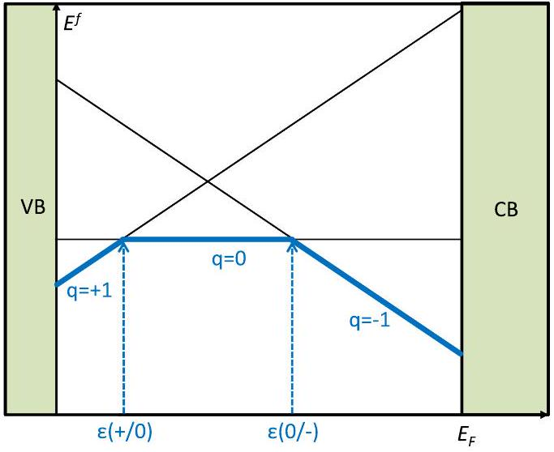
FIG. 1 (color online). Schematic illustration of formation energy $E^{f}$ vs Fermi level $E_{F}$ for an amphoteric defect that can occur in three charge states $q:+1,0$, and -1 . Solid lines correspond to the formation energy as defined by Eq. (1). The defect exhibits two charge-state transition levels (see Sec. II.D): a deep donor level $\varepsilon(+/ 0)$ and a deep acceptor level $\varepsilon(0 /-)$. The thick solid lines indicate the energetically most favorable charge state for a given Fermi level.

## 2. Complex formation and binding energies

At higher concentrations or at low temperatures defects not only occur as isolated centers but can also form defect complexes. Hydrogen complexes are a prime example. Due to the small size of the H atom and its high chemical reactivity hydrogen easily forms complexes with other impurities or with native point defects. Among the latter, complexes with vacancies are particularly stable since the inner surface of a vacancy provides highly stable binding sites for one or more H atoms. Defect reactions that result in complex formation are of high technological relevance for both semiconductors and metals.

In semiconductors, complexes are often detrimental to device performance since the electronic behavior of the complex is typically qualitatively different from that of its constituents. For example, Mg in GaN is a shallow acceptor which renders the material $p$-type conductive. Complexing with H removes the acceptor state and results in a neutral complex: the Mg in the complex no longer acts as an acceptor (Neugebauer and Van de Walle, 1996; Lyons, Janotti, and Van de Walle, 2012). This mechanism by which the formation of a complex destroys the doping character of an impurity is called passivation. Complex formation in semiconductors is often driven by the strong attractive electrostatic interaction between defects with opposite charge states. This explains the often compensating nature of defects since donor (acceptor) dopants attract point defects or impurities that behave as acceptors (donors), resulting in a charge-neutral and electrically inactive complex.

In metals, where Coulomb interaction between defects is negligible due to efficient screening, defects are nevertheless known to form centers consisting of two or more defects or impurities. The driving forces here are local elastic interactions and the formation of covalent bonds. For example, H is known to form stable complexes with vacancies. At sufficiently high concentrations the formation energy of the vacancy-hydrogen complex becomes lower than that of the vacancy resulting in concentrations that are orders
of magnitude larger than the concentration of bare vacancies (superabundant vacancies) (Nazarov, Hickel, and Neugebauer, 2012).

An advantage of the grand canonical formulation is that the formation energy of a complex (which determines its concentration) is defined in the same way as for isolated defects, i.e., by Eq. (1). Another key quantity for complexes is their binding energy, i.e., the energy difference between the complex formation energy and the sum of the formation energies of its isolated constituents. For example, for a complex consisting of two defects $A$ and $B$ the complex binding energy is

$$
E_{b}=E^{f}[A]+E^{f}[B]-E^{f}[A B] .
$$

A positive binding energy implies that the energy to create isolated defects is higher than that for forming a complex, i.e., the interaction between defects $A$ and $B$ is attractive and complex formation becomes thermodynamically advantageous. However, a positive binding energy indicates only that complexes can in principle be formed, but not that they will occur in sizable concentrations. The reason is the very different configurational entropy of a pair of isolated defects versus that of a complex. For a more detailed discussion, see Sec. II.F in Van de Walle and Neugebauer (2004). It should also be noted that complex formation does not change the number and nature of participating species. Thus, the complex binding energy is independent of the chemical potentials.

## 3. Charge-state transition levels in semiconductors and insulators

Defects in semiconductors and insulators almost always introduce levels in the band gap or near the band edges. These levels determine the electronic behavior, and they are also often used as the basis for experimental detection or identification of the defect. Accurate calculation of these levels is therefore essential for defect identification and characterization. In principle, internal excitations of the defect can occur in which the charge state of the defect remains unchanged. More commonly, however, carriers are exchanged with the semiconductor host and a transition to a different charge state occurs. These different charge states may correspond to quite different local lattice configurations. It is important to realize that the Kohn-Sham (KS) levels that result from a bandstructure calculation for the center cannot directly be identified with any levels that are relevant for experiment, even if there were no concerns about the accuracy of the KS band gap. Instead, the total energies of the defect configurations before and after the transition must be considered.

The thermodynamic transition level $\varepsilon\left(q_{1} / q_{2}\right)$ is defined as the Fermi-level position for which the formation energies of charge states $q_{1}$ and $q_{2}$ are equal:

$$
\varepsilon\left(q_{1} / q_{2}\right)=\frac{E^{f}\left(X^{q_{1}} ; E_{F}=0\right)-E^{f}\left(X^{q_{2}} ; E_{F}=0\right)}{q_{2}-q_{1}},
$$

where $E^{f}\left(X^{q} ; E_{F}=0\right)$ is the formation energy of the defect $X$ in the charge state $q$ when the Fermi level is at the VBM $\left(E_{F}=0\right)$. The experimental significance of this level is that for Fermi-level positions below $\varepsilon\left(q_{1} / q_{2}\right)$, charge state $q_{1}$ is stable, while for Fermi-level positions above $\varepsilon\left(q_{1} / q_{2}\right)$, charge state $q_{2}$ is stable. This concept is illustrated in Fig. 1 for a system with three charge states and two transition levels.

Thermodynamic transition levels can be observed in experiments where the final charge state can fully relax to its equilibrium configuration after the transition, such as in deeplevel transient spectroscopy (DLTS) (Lannoo and Bourgoin, 1981, 1983; Mooney, 1999). Transition levels correspond to thermal ionization energies. Conventionally, if a transition level is positioned such that the defect is likely to be thermally ionized at room temperature (or at device operating temperatures), this transition level is called a shallow level; if it is unlikely to be ionized at room temperature, it is called a deep level. A detailed discussion of deep versus shallow levels is given in Sec. II.D.

For purposes of defining the thermal ionization energy, it is implied that for each charge state the atomic structure is relaxed to its equilibrium configuration. The atomic positions in these equilibrium configurations are not necessarily the same for both charge states. Indeed, it is precisely this difference in relaxation that leads to the difference between thermodynamic transition levels and optical transition levels, discussed in detail in Sec. II.E.

## 4. Quantities amenable to comparison with experiment

The ability to compare with experimental results is of paramount importance. First, such comparisons are essential for validation of the computational approach. Second, the ability to help interpret and explain experimental observations is a crucial asset of the first-principles calculations. The ultimate goal is to reliably predict structures and properties that can be experimentally implemented and observed. We also note that experimental observations of defects in solids have their own limitations, which computational studies can aid in overcoming. Here we touch upon some of the key quantities that can be obtained from first-principles calculations, and how they are linked to experimental techniques; an excellent overview of such techniques is provided by McCluskey and Haller (2012).

## a. Defect concentrations

The formation energy defined in Eq. (1) can be used to calculate concentrations, as discussed in Sec. II.B. Concentrations of impurities can be experimentally determined using secondary ion mass spectrometry (SIMS) or Rutherford backscattering spectrometry. Determining the concentration of native point defects is more difficult; electron paramagnetic resonance (EPR) is one of the few techniques that can both identify the nature of a defect and accurately determine its concentration. EPR is discussed in more detail below. Positron annihilation spectroscopy (PAS) (Puska and Nieminen, 1994) can also identify and measure point defects, but is typically limited to detection of vacancies. A commonly used method in metals is dilatometry in combination with precision measurements of the lattice constant (Simmons and Balluffi, 1960). Knowing both the change in the lattice constant and the macroscopic (dilatometric) change allows separating the effect of thermal expansion from that of
vacancy creation. Less frequently used are electricalresistivity (Cotterill et al., 1965) and specific-heat measurements (Kraftmakher, 1998). Resistivity measurements probe for the additional scattering due to defects. The specific heat associated with the creation of intrinsic defects (notably vacancies) can be separated from bulk contributions via its exponential increase with rising temperature or the characteristic time scale of defect formation. Another approach measures electrical noise and uses sophisticated theoretical tools to extract dynamical defect properties such as creation and annihilation rates or equilibrium concentrations (Celasco, Fiorillo, and Mazzetti, 1976).

## b. Atomic structure

Direct measurements of atomic structure and bond lengths around an impurity can be obtained from extended x-ray absorption fine structure (EXAFS) (Lee et al., 1981) but only in the case of impurities with relatively heavy mass.

## c. Scanning tunneling microscopy and spectroscopy

Scanning tunneling microscopy (STM) and its variable-bias variant, scanning tunneling spectroscopy (STS), are powerful tools for revealing the atomic and electronic structure of surfaces. As such, STM and STS can also detect defects on or slightly below surfaces. Insight into bulklike defects can be obtained from cross-sectional STM after cleavage, provided that the investigated cleavage surface is atomically flat, exhibits no states within the bulk band gap, and has a low density of STM-observable surface defects (Feenstra, 1994; Garleff, Wijnheijmer, and Koenraad, 2011). Prominent examples are the GaAs (110) surface under ultrahigh-vacuum conditions (Feenstra, 1994; Tsuruoka et al., 2002; Mikkelsen and Lundgren, 2005; Garleff, Wijnheijmer, and Koenraad, 2011) or passivated Si surfaces (Garleff, Wijnheijmer, and Koenraad, 2011). The simulation of STM images theoretically is well established (Tersoff and Hamann, 1985). The relation of STS data to properties of the bulk defect, however, requires a careful analysis (Grandidier et al., 2000; Garleff, Wijnheijmer, and Koenraad, 2011).

## d. $g$ factors and hyperfine parameters

EPR is one of the most powerful techniques for the study and identification of defects in semiconductors and insulators (Watkins, 1999). Experimental EPR data provide information about the chemical identity of the atoms in the vicinity of the defect as well as about the symmetry. The ability to directly compare with calculated values for specific defect configurations then allows an explicit identification of the microscopic structure (Van de Walle, 1990; Van de Walle and Blöchl, 1993; Ricci et al., 2003).

EPR relies on the presence of unpaired electrons. In cases where the stable ground-state configuration of the defect is not paramagnetic, optical excitation can often be used to generate a metastable charge state with a net spin density. Optically detected magnetic resonance (ODMR) is a variant of the technique that can offer additional information about the defect-induced levels in the band gap (Kennedy and Glaser, 1999).

EPR spectra yield two types of information, namely, hyperfine parameters and $g$ tensors. Hyperfine parameters can be calculated directly from the ground-state spin density, but all-electron wave functions are required. In a pseudopotential approach these can be obtained by combining freeatom wave functions with the pseudo-wave-functions obtained in the defect calculation (Van de Walle and Blöchl, 1993). In the projector augmented wave (PAW) method, this information can be extracted directly from the all-electron spin density (Blöchl, 2000).

Computing $g$ tensors posed additional complexities, particularly the implementation of a gauge-invariant theory within a pseudopotential or PAW approach (Pickard and Mauri, 2001); this problem was successfully addressed by Pickard and Mauri (2002).

## e. NMR chemical shifts

Nuclear magnetic resonance (NMR) is used for molecules as well as solids to provide chemical and structural information. The technique has been employed, e.g., to study point defects in irradiated aluminum and copper (Minier, Andreani, and Minier, 1978). When combined with first-principles calculations of chemical shifts, the approach allows an unambiguous determination of the microscopic structure. The computation of these shifts required developments similar to those mentioned for $g$ tensors above (Pickard and Mauri, 2001).

## f. Mössbauer spectroscopy

Similarly to NMR, Mössbauer spectroscopy probes changes in the nuclear energy levels and allows detection of interactions of point defects with neighboring atoms (Czjzek and Berger, 1970).

## g. Vibrational frequencies

Defects often give rise to local vibrational modes (LVMs), whose frequencies and polarization contain information about the chemical nature of the atoms involved in the bond as well as the bonding environment (McCluskey, 2000). Light impurities, in particular, exhibit distinct LVMs that are often well above the bulk phonon spectrum. A direct comparison of signals obtained with Raman spectroscopy or Fouriertransform infrared spectroscopy with first-principles calculations can greatly aid in identifying the nature and local structure of the defect.

Vibrational frequencies can be directly extracted from the velocity-velocity autocorrelation function of molecular dynamics runs (Estreicher, 2000; Estreicher et al., 2009). Alternatively, vibrational frequencies corresponding to a stretching or wagging mode of a particular bond can be extracted from a dynamical matrix based on calculated forces. In the case of light impurities, anharmonic corrections can be sizable. These can be evaluated by focusing on the motion of the light impurity only, keeping all other atoms fixed, and mapping out the potential energy as a function of displacement (Van de Walle, 1998a; Limpijumnong, Northrup, and Van de Walle, 2003).
h. Defect transition levels

Charge-state transition levels were introduced in Sec. I.B. 3 and will be discussed in more detail in Secs. II.D and II.E. Thermodynamic transition levels can be derived from experiments such as DLTS (Lannoo and Bourgoin, 1981, 1983; Mooney, 1999) or temperature-dependent Hall measurements (Look, 1992), while optical levels can be observed in photoluminescence, absorption, or cathodoluminescence experiments (Davies, 1999). The identification of the underlying defect is greatly helped by comparison to theory, notably in complex cases (Hourahine et al., 2000).

## C. Requirements for theoretical and computational treatments

## 1. Electronic-structure approaches

Various methods are in principle available to investigate the electronic structure of solids in general and defects in particular.

Tight-binding methods use a local basis set, for which the Hamiltonian matrix elements decrease rapidly with increasing distance between the orbitals. Thus, instead of having to diagonalize the full Hamiltonian matrix, most of the matrix elements vanish and only a sparse matrix has to be diagonalized. Two main approaches are distinguished, based on how the matrix elements are determined. Within the empirical tight-binding approach, matrix elements are usually fitted to experiment, and the lack of a consistent prescription is a problem. First-principles tight-binding methods, on the other hand, use local orbitals to explicitly calculate the matrix elements. The choice of orbitals is critical: instead of the standard atomic orbitals, specifically designed highly localized orbitals (e.g., Gaussians) are used. Approximations are made in neglecting some of the multicenter integrals and charge self-consistency. The description can be improved by using a point-charge model to take charge transfer and polarizability into account (Elstner et al., 1998).

The Hartree-Fock (HF) method is described in detail in Sec. IV.A. For defect calculations this approach has been employed only in a few cases since it is computationally much more expensive than density functional theory discussed below and provides no advantages with respect to predictive power. For cluster models, correlated quantum-chemical post-Hartree-Fock methods such as configuration interaction (CI), complete active space methods [complete active space selfconsistent field (CASSCF) and complete active space secondorder perturbation theory (CASPT2)], or coupled-cluster (CC) methods promise unrivaled theoretical accuracy. However, the enormous computational effort and unfavorable scaling behavior with respect to system size restrict such methods to a few tens of atoms. While these approaches can be used for benchmarking or to answer specific questions, in general the artifacts due to inadequate cluster size may easily undo the advantages gained from the high level of theory. In contrast, hybrid approaches that are based on a combination of Hartree-Fock theory and DFT have become feasible and highly popular for defect calculations. The underlying concepts and the performance of hybrid functionals are discussed in Sec. IV.

DFT calculations have become the standard tool for firstprinciples calculations of solids. DFT (Hohenberg and Kohn, 1964; Kohn and Sham, 1965) allows a description of the many-body electronic ground state in terms of single-particle equations and an effective potential. The latter consists of the ionic potential due to the atomic cores, the Hartree potential describing the electrostatic electron-electron interaction, and the xc potential that takes into account the many-body effects. This approach has proven to describe with high accuracy such quantities as atomic geometries and charge densities.

Choices have to be made for the basis set and for the xc functional. The LDA and GGA are still the most widely used functionals within DFT, and in most cases they produce accurate and reliable structural information. It is well recognized, however, that these functionals fail to produce the correct band structure; in particular, the band gap of semiconductors and insulators is severely underestimated (Perdew and Levy, 1983; Sham and Schlüter, 1983). This also affects the position of defect-induced states in the band gap, and when these states are occupied with electrons, the formation energy can also be affected. As mentioned when discussing Hartree-Fock methods, great progress has recently been made in overcoming these limitations, and this is the subject of Sec. IV.

All-electron calculations can be carried out with techniques such as the full-potential linearized augmented plane-wave (FP-LAPW) method (Singh and Nordstrom, 2000) or atomcentered basis sets [e.g., Gaussian (Frisch et al., 2009), CRYSTAL (Dovesi et al., 2005), DMol ${ }^{3}$ (Delley, 2000), or FHI-AIMS (Blum et al., 2009)]. In most cases, however, an approximate treatment of the core electrons suffices, leading to the pseudopotential approach (Pickett, 1989) or the PAW approach (Blöchl, 1994; Kresse and Joubert, 1999). These tend to be computationally more tractable than all-electron approaches and hence have been most widely used for the large system sizes required for first-principles studies of defects. The pseudopotential or PAW approximations to deal with the core electrons are essential for rendering plane-wave basis sets efficient, but offer advantages also for pseudoatomic orbital basis sets (Sankey and Jansen, 1988; Estreicher, Fedders, and Ordejon, 2001; Soler et al., 2002) or real-space grids (Mortensen, Hansen, and Jacobsen, 2005). Most of the examples given in this review have been obtained based on plane-wave calculations; however, in principle any wellchosen basis set can be used, and the topics covered in this review do not depend on this choice.

## 2. Constraints on accuracy of computational results

Comparing defect concentrations based on calculated formation energies with experiment requires high accuracy. Based on the expressions discussed in Sec. II.B, to limit the error to less than an order of magnitude at a temperature of 1000 K requires an accuracy of 0.2 eV. More detailed comparisons, or lower temperatures, require even higher accuracy. As noted in Sec. I.A.4, electronic-structure calculations for metals are capable of achieving such accuracy, and the constraints mainly revolve around the inclusion of entropy effects (see Sec. II.B.3). For semiconductors and insulators, achieving accuracies even of a few tenths of an electron volt has been challenging, and this has also limited the ability to compare with experimental results for charge-state transition levels, let alone to accurately predict concentrations or defect
levels. The most fundamental constraint on accuracy is due to the approximations in the xc functionals. As shown in Sec. IV, new theoretical techniques allowed great progress in reducing these uncertainties.

Even if approximations in the underlying electronic-structure methods constitute a hard bound on the achievable accuracy, guaranteeing this accuracy is often a challenging task in practical defect calculations. The reason is the large number of parameters involved in performing electronicstructure calculations of defects, including the size of the supercell, completeness of the basis set, and sampling of the Brillouin zone, to name only a few. Even though all these parameters are controllable, in the sense that they can be systematically improved until convergence is reached, in practice limitations in the computational resources place severe restrictions on the extent to which such convergence can be achieved.

Consider, for example, the issue of supercell-size convergence. As discussed in Sec. III.C the electrostatic interaction between a charged defect and its periodic images scales as $1 / L$, with $L$ the dimension of the supercell. Thus, in a brute force approach, to decrease the error by a factor of 2, the necessary 3D volume and thus the number of atoms needs to increase by a factor of 8. Since most DFT implementations asymptotically scale with the third power of the number of atoms, the computational effort needed to reduce the error by a factor of 2 requires an increase by a factor of $8^{3}=512$ in computer time. Improving the accuracy by an order of magnitude requires increasing the computation time by a factor of $10^{9}$. It is therefore of extreme importance to design and employ schemes that improve convergence (see, e.g., Sec. III.C).

Besides supercell-size convergence, an efficient k-point sampling of the Brillouin zone is also critical. Brillouin-zone integration is carried out by replacing the continuous integral by a set of special points. Ideally, such sets contain a minimum number of points (to reduce computational effort), conserve the symmetry of the system, and provide an accurate estimate of the integrated quantity. In practice, such sets are generated with the Monkhorst-Pack scheme (Monkhorst and Pack, 1976), i.e., a regularly spaced mesh of $n \times n \times n$ points in the reciprocal-space unit cell. To avoid the inclusion of extrema (i.e., local maxima or minima) in the band structure, high-symmetry points such as the $\Gamma$ point should be avoided. Consequently, odd values of $n$ are used for which by construction the $\Gamma$ point is excluded. Most defect geometries conserve part of the point-group symmetry of the bulk system, and the full set of points in the Brillouin zone can be reduced to a set of points in the irreducible part of the zone. The required size of $n$ depends on the material and the considered physical quantity. In general, metals require substantially larger k-point sets than semiconductors and a careful choice of the smearing scheme. Furthermore, the consideration of vibrational contributions to the free energy of the defect calls for a particularly careful k-point convergence (Grabowski, Hickel, and Neugebauer, 2007).

Defects in semiconductors or insulators that exhibit a defect state in the band gap show an artificial dispersion of the defect-induced level in the supercell approach. A truly isolated defect (corresponding to the limit of an infinitely large supercell) leads to a flat, dispersionless defect level in the then infinitely small Brillouin zone. Thus, the magnitude of dispersion is a direct measure of the artificial interaction between the defect and its neighboring images. For finitesized supercells, minima and maxima in the defect band correspond to artificial bonding and antibonding states, respectively. Using special points provides a way of averaging over the defect band and corresponds to extracting nonbonding states that closely resemble the isolated defect in an infinite cell. These considerations imply that the $\Gamma$ point, which is sometimes used as the single k point for Brillouinzone integrations because of the numerical simplicity, provides a poor description since defect-defect interactions are strongest at this point. Further discussions of this issue, as well as guidelines for dealing with partially occupied defect levels, are included in Sec. III.B.

## II. THERMODYNAMIC CONCEPTS

The fundamental methodological approach to calculating defect formation energies has been outlined in Sec. I.B.1. As expressed in Eq. (1), defect formation energies are defined as an energy difference between supercell calculations with and without a defect. Electronic-structure calculations provide a great deal of additional information beyond the formation energy of the defect. An analysis of the energy as a function of atomic positions (potential energy surface) and defect-state occupations allows extracting many defect properties, notably the complete finite-temperature thermodynamics. The implementation of this concept in first-principles calculations involves a number of technical developments that are discussed in the next sections. First, however, we review the relevant concepts from statistical mechanics.

As noted in Sec. I.A.4, defect formation energies are generally assumed to be independent of temperature. Nevertheless, even at $T=0 \mathrm{~K}$ the proper choice of the chemical potential(s) in Eq. (1) decisively depends on phase stabilities of the considered system (cf. Sec. II.B.2). Most importantly, all experimental measurements of defect concentrations (see Sec. I.B.4) are performed at finite temperatures. While configurational entropy is the dominant contribution, other entropy contributions can also become relevant (in particular, for metals) and will therefore also be discussed in this section.

In semiconductors and insulators, defects can typically occur in different charge states. The resulting transition levels (see Sec. I.B.3) are classified into thermodynamic or optical levels, depending on the time scale of the transition. Even though the optical levels are not thermodynamic properties, they can be determined directly from the potential energy surface and will therefore be discussed here. The physical concepts related to this distinction will be addressed in Secs. II.D and II.E.

## A. Entropy of defects

## 1. Configurational entropy

Defect formation energies are always positive-otherwise the host crystal would be unstable. It is therefore the
configurational degree of freedom that allows point defects to form in the first place. The configurational part of the entropy has to counterbalance the energy cost of defect creation. A general and rigorous approach to treat the configurational entropy of point defects including their mutual interaction requires methods such as the cluster expansion technique (Sanchez, Ducastelle, and Gratias, 1984) combined with Monte Carlo simulations. As mentioned in Sec. I, this review focuses on isolated defects and ignores defect-defect interactions. This assumption is justified due to the typically low defect concentrations (dilute limit) in many physically relevant cases. Consider, for instance, vacancies in elemental metals, which are known to be the dominant defects over a wide temperature range (Kraftmakher, 1998). Yet, even close to the melting temperature their concentrations are typically $<10^{-3}$, i.e., even under conditions where defect concentrations are high the dilute limit applies.

If $n$ is the number of point defects of a specific type and $N$ is the number of lattice sites, then the number $W$ of distinct ways ( $\underline{=}$ microstates) to arrange the defects is (Keer, 1993)

$$
W=\frac{(g N)!}{(g N-n)!n!} \approx \frac{(g N)^{n}}{n!} .
$$

Here $g$ is a degeneracy factor accounting for the internal degrees of freedom of the point defect. For instance, $g=1$ for simple monovacancies but $g=6$ for a tetrahedral interstitial site in a bcc structure since there are six such interstitial positions per lattice site. Likewise $g$ can capture spin degeneracy if it is not explicitly included in the electronic entropy (see Sec. II.A.2). Further, Eq. (4) uses the fact that atoms and point defects of the same kind are indistinguishable. The first equation takes into account that creation of a defect reduces the configuration space for the next defect. However, such considerations make the derivations tedious, in particular, when dealing with more than one type of defect. In the dilute limit $(n \ll N)$, the second part of Eq. (4) is a well-justified approximation.

The configurational entropy is given by (Keer, 1993)

$$
S^{\mathrm{conf}}=k_{B} \ln W,
$$

and the corresponding term entering the free energy is $-T S^{\text {conf }}$. Since $W \geq 1$ and $T$ is always positive, $-T S^{\text {conf }}$ is always negative, thus favoring defect formation. Note that generally several kinds of defects exist simultaneously. This yields a product $W=\prod_{i} W_{i}$ in the number of configurations, and therefore a summation $S^{\text {conf }}=k_{B} \sum_{i} \ln W_{i}$ in the entropy.

The consideration of Eqs. (4) and (5) in the thermodynamic limit allows the application of the Stirling approximation, resulting in

$$
S^{\mathrm{conf}}(n, N)=k_{B}[n-n \ln (n / N)+n \ln (g)] .
$$

It is convenient to transform this into a per atom quantity that depends only on the point-defect concentration $c=n / N$,

$$
S^{\mathrm{conf}}(c)=k_{B}[c-c \ln (c)+c \ln (g)] .
$$

By including the penalty energy for creating defects, $E^{\text {conf }}=c E^{f}$, with the energy of formation $E^{f}$ from Eq. (1), we arrive at the configurational free energy:

$$
\begin{aligned}
F^{\mathrm{conf}}(c) & =E^{\mathrm{conf}}(c)-T S^{\mathrm{conf}}(c) \\
& =c E^{f}\left[X^{q}\right]-T k_{B}[c-c \ln (c)+c \ln (g)]
\end{aligned}
$$

This equation gives direct access to the equilibrium defect concentration as outlined in Sec. II.B.3. Before considering the equilibrium concentration, however, we need to take into account the fact that in a fully consistent treatment the defect energy of formation acquires a temperature and volume or pressure dependence and becomes a Gibbs energy of formation, i.e., $E^{f} \rightarrow G^{f}$. The contributions responsible for this are the electronic and vibrational entropy, which are discussed in the following sections.

## 2. Electronic entropy

We aim to compute the formation free energy of an isolated defect in a fully integrated first-principles approach. The starting point is the free-energy Born-Oppenheimer approximation (Cao and Berne, 1993), which is a thermodynamic extension of the standard Born-Oppenheimer approximation. The main result of this approximation is that the ionic movement, i.e., the motion of the point defect, is governed by the electronic free-energy surface $F^{\mathrm{el}}\left(\left\{\mathbf{R}_{I}\right\}, V, T\right)$. Here the thermodynamic averaging has been done only over a part of the microscopic configuration space (the electronic degrees of freedom), which should formally not be the case for a thermodynamic potential. Therefore, the superscript "el" as well as the indication of the dependence on the microscopic atomic coordinates $\left(\left\{\mathbf{R}_{I}\right\}\right)$ is important for distinguishing these quantities from the full free energy $F$.

The crucial step that allows for a separation into the physically relevant excitation mechanisms is a Taylor expansion of $F^{\text {el }}\left(\left\{\mathbf{R}_{I}\right\}, V, T\right)$ around the equilibrium positions $\left\{\mathbf{R}_{I}^{0}\right\}$ :

$$
F^{\mathrm{el}}\left(\left\{\mathbf{R}_{I}\right\}\right)=F_{0}^{\mathrm{el}}+\frac{1}{2} \sum_{k, l} u_{k} u_{l}\left[\frac{\partial^{2} F^{\mathrm{el}}}{\partial R_{k} \partial R_{l}}\right]_{\left\{\mathbf{R}_{I}^{0}\right\}}+O\left(u^{3}\right) .
$$

Here the zeroth-order term is abbreviated as $F_{0}^{\text {el }}(V, T):=F^{\text {el }}\left(\left\{\mathbf{R}_{I}^{0}\right\}, V, T\right), k$ and $l$ run over all nuclei of the system and additionally over the three spatial dimensions for each nucleus, and $u_{k}=R_{k}-R_{k}^{0}$ is the displacement out of equilibrium. Equilibrium positions refer to the atomic geometry that is obtained after introducing the point defect into the perfect bulk and relaxing the atoms until the corresponding forces are zero. Since forces are related to the first-order term in the expansion, this term vanishes from Eq. (9). The higher-order terms correspond to vibrational motion and are discussed in Sec. II.A.3.

The zeroth-order term in Eq. (9) is related to electronic entropy. If DFT is performed at finite temperatures, as first introduced by Mermin (1965), then the electronic free energy is given as

$$
F_{0}^{\mathrm{el}}(V, T)=E^{\mathrm{el}}\left(\left\{\mathbf{R}_{I}^{0}\right\}, V, T\right)-T S^{\mathrm{el}}\left(\left\{\mathbf{R}_{I}^{0}\right\}, V, T\right) .
$$

Here the temperature enters via the energy $E^{\mathrm{el}}(V, T)$, due to the $T$ dependence of the occupation of KS energy levels, as well as via the second term. The latter contains in $S^{\text {el }}$ the electronic entropy given by an ideal mixing as

$$
S^{\mathrm{el}}\left(\left\{\mathbf{R}_{I}^{0}\right\}, V, T\right)=-k_{B} \sum_{i}\left[\left(1-f_{i}\right) \ln \left(1-f_{i}\right)+f_{i} \ln f_{i}\right]
$$

where the sum runs over all electronic states with Fermi-Dirac occupation weights $f_{i}=f\left(T, \epsilon_{i}\right)$. Depending on the way spin polarization is considered, Eq. (11) is sometimes written with an additional factor of 2.

For an accurate treatment of temperature dependences it is often useful to separate the zero-temperature electronic energy $E_{0}^{\text {el }}$ from $F_{0}^{\text {el }}$ as

$$
F_{0}^{\mathrm{el}}(V, T)=E_{0}^{\mathrm{el}}(V)+\tilde{F}_{0}^{\mathrm{el}}(V, T) .
$$

The remainder $\tilde{F}_{0}^{\text {el }}$ describes the temperature dependence of both terms in Eq. (10). For a continuous density of states at the Fermi level it can be shown (Methfessel and Paxton, 1989) that $\tilde{F}_{0}^{\text {el }}$ varies quadratically with temperature, which leads to (Kresse and Furthmüller, 1996)

$$
\tilde{F}_{0}^{\mathrm{el}}(V, T)=-\frac{1}{2} T S^{\mathrm{el}}+O\left(T^{3}\right) .
$$

## 3. Vibrational entropy

## a. Quasiharmonic excitations

The second-order term in Eq. (9) describes quasiharmonic excitations due to noninteracting but volume-dependent phonons. To arrive at an explicit expression for the corresponding free energy we first define the dynamical matrix $D$ :

$$
D_{k, l}(V, T):=\frac{1}{\sqrt{M_{k} M_{l}}}\left[\frac{\partial^{2} F^{\mathrm{el}}\left(\left\{\mathbf{R}_{I}\right\}, V, T\right)}{\partial R_{k} \partial R_{l}}\right]_{\left\{\mathbf{R}_{I}^{0}\right\}},
$$

where $M_{k}\left(M_{l}\right)$ is the atomic mass of atom $k(l)$. The dynamical matrix $D$ depends not only on the volume $V$ but also on the temperature $T$ which is a consequence of the temperature dependence of the electronic free-energy surface $F^{\text {el }}$. Note that at this stage $T$ determines electronic excitations by the Fermi broadening rather than atomic motion. Next the dynamical matrix is diagonalized,

$$
D(V, T) \mathbf{w}_{i}=\omega_{i}^{2}(V, T) \mathbf{w}_{i},
$$

resulting in eigenvectors $\mathbf{w}_{i}$ and phonon frequencies $\omega_{i}$. The obtained phonon frequencies allow one to determine the vibrational internal energy in the quasiharmonic approximation,

$$
E^{\mathrm{qh}}=\sum_{i}\left(\frac{1}{2}+n_{i}\right) \hbar \omega_{i},
$$

which yields after the application of some statistics and transformations the quasiharmonic free energy (Wallace, 1998):

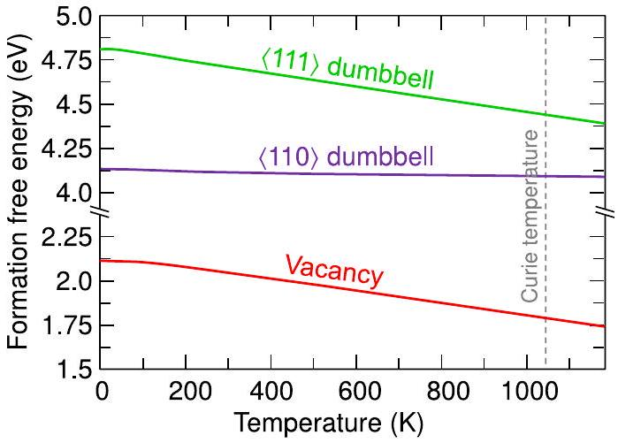
FIG. 2 (color online). Quasiharmonic formation free energy of the vacancy and the $\langle 110\rangle$ and $\langle 111\rangle$ split-interstitial dumbbell in bcc iron. Adapted from Lucas and Schäublin, 2009.

$$
F^{\mathrm{qh}}=\sum_{i}\left\{\frac{\hbar \omega_{i}}{2}+k_{B} T \ln \left[1-\exp \left(-\frac{\hbar \omega_{i}}{k_{B} T}\right)\right]\right\} .
$$

For periodic systems it is convenient to transform the real-space dynamical matrix [Eq. (14)] into its reciprocal-space representation. This allows an accurate interpolation of the phonon frequencies, which is critical for integrals or sums over the Brillouin zone, as in Eq. (17). For systems breaking translational symmetry, such as a solid containing a point defect, a Fourier transformation is not meaningful and the analysis should be performed in real space.

In practice, the supercells in first-principles calculations of point defects are of limited size (100-1000 atoms). As a result the number of phonon modes entering Eq. (17) is limited. As shown by Grabowski, Hickel, and Neugebauer (2011), a consistent treatment of the corresponding bulk reference calculation guarantees converged results. Specifically, the quasiharmonic free energy of the reference perfect bulk system needs to be calculated on the identical mesh of phonon wave vectors as used for the point defect.

Studies of the quasiharmonic contribution to the formation free energy are still rare, even though its importance has been shown (Estreicher et al., 2004; Lucas and Schäublin, 2009) For example, Lucas and Schäublin (2009) investigated vacancies and self-interstitials (the $\langle 110\rangle$ and $\langle 111\rangle$ dumbbells) in bcc iron. Figure 2 shows a major result of Lucas and Schäublin (2009): vibrations within the quasiharmonic approximation can change the formation free energy by as much as 0.5 eV over a range of 1000 K. Figure 2 also shows that the contributions can differ significantly for different point defects (compare, e.g., the almost constant free energy of formation for the 〈110〉 split-interstitial dumbbell with the strong dependence of the free energy of formation for the $\langle 111\rangle$ interstitial).

## b. Beyond the quasiharmonic approximation: Explicitly anharmonic excitations

A conceptually simple approach to include higher-order terms in Eq. (9) is first-principles-based molecular dynamics (MD), for which the free energy is obtained from an integration of the internal energy with respect to temperature (Ackland, 2002). The use of conventional MD, however,
requires computation times that are impracticable. Therefore highly efficient sampling strategies to perform the thermodynamic averages had to be developed (Grabowski et al., 2009).

The approaches can be divided into two classes: (1) Thermodynamic-integration-based techniques, which start from a reference system for which the free energy can be easily obtained either analytically or numerically. Making an adiabatic connection to the true first-principles potential energy surface, only the small differences in free energies between reference and full surface need to be sampled. (2) Free-energy perturbation techniques, which use wellapproximated phase-space samplings to compute first-order free-energy shifts.

We focus on the thermodynamic integration method first. Often the quasiharmonic potential energy surface is a suitable reference system. Note that, while the quasiharmonic calculations discussed above contain quantum effects, the thermodynamic integration is commonly performed classically, yielding a classical anharmonic correction $F^{\text {clas,ah }}$ to the classical free energy $F^{\text {clas }}$ [although extensions are possible (Ramirez et al., 2008)]. Therefore, for a consistent treatment the quasiharmonic reference needs to be considered classically, as expressed by $F^{\text {clas,qh }}$ :

$$
\begin{aligned}
F^{\text {clas,ah }}: & =F^{\text {clas }}-\left(F_{0}^{\text {el }}+F^{\text {clas,qh }}\right) \\
& =\left[F_{\lambda}^{\text {clas }}\right]_{\lambda=1}-\left[F_{\lambda}^{\text {clas }}\right]_{\lambda=0}=\int_{0}^{1} d \lambda\left\langle\frac{\partial F_{\lambda}^{\text {el }}}{\partial \lambda}\right\rangle_{t, \lambda}
\end{aligned}
$$

Here $F_{\lambda}^{\mathrm{el}}\left(\left\{\mathbf{R}_{I}\right\}, t\right)$ is the $\lambda$-dependent electronic free-energy surface determining the classical motion of the nuclei in the coupled system and $\langle\cdot\rangle_{t, \lambda}$ denotes the time average at a given $\lambda$. Provided the boundary conditions for $\lambda=0$ and $\lambda=1$ are fulfilled, any type of coupled system can be chosen. In practice, a simple linear coupling to the quasiharmonic reference,

$$
\begin{aligned}
F_{\lambda}^{\mathrm{el}}\left(\left\{\mathbf{R}_{I}\right\}, V, T\right)= & \lambda F^{\mathrm{el}}\left(\left\{\mathbf{R}_{I}\right\}, V, T\right) \\
& +(1-\lambda)\left[F_{0}^{\mathrm{el}}(V, T)\right. \\
& +\underbrace{\sum_{k, l} \frac{\sqrt{M_{k} M_{l}}}{2} u_{k} u_{l} D_{k, l}(V, T)}_{U^{\mathrm{clasqh}}\left(\left\{\mathbf{R}_{I}\right\}, V, T\right)}]
\end{aligned}
$$

( $u_{k}=R_{k}-R_{k}^{0}$ ), yields computationally efficient results. Finally, the anharmonic free energy reads

$$
\begin{aligned}
F^{\text {clas,ah }}(V, T)= & \int_{0}^{1} d \lambda\left\langle F^{\mathrm{el}}\left(\left\{\mathbf{R}_{I}\right\}, V, T\right)-F_{0}^{\mathrm{el}}(V, T)\right. \\
& \left.-U^{\text {clas,qh }}\left(\left\{\mathbf{R}_{I}\right\}, V, T\right)\right\rangle_{t, \lambda}
\end{aligned}
$$

The use of the thermodynamic integration makes the determination of anharmonic entropy contributions a few orders of magnitude more efficient than a conventional molecular dynamics simulation. The high accuracies necessary to obtain these contributions in the case of point defects render the first-principles simulation still a formidable task. Efforts are therefore under way to explore new methods to further reduce computation times. On the one hand, one can reduce the complexity of the first-principles treatment by incorporating analytical assumptions regarding the volume and temperature dependence of anharmonic contributions (Wu, 1991; Wu and Wentzcovitch, 2009). On the other hand, the numerical precision can be stepwise improved by application of free-energy-perturbation techniques.

A strategy combining both approaches is the upsampled thermodynamic integration using Langevin dynamics (UP-TILD) method (Grabowski et al., 2009). Its main idea is that DFT convergence parameters (for example, the electronic k-point sampling) that provide a low precision can be used to obtain for each thermodynamic integration step a phase-space distribution (termed $\left\{\mathbf{R}_{I}\right\}_{t}^{\text {low }}$ in the following) which closely resembles the phase-space distribution $\left\{\mathbf{R}_{I}\right\}_{t}^{\text {high }}$ that would be obtained from parameters yielding highly converged results. In this way it is possible to sample various $\lambda, V$, and $T$ values with modest computational resources. However, the resulting free-energy surface $\left\langle\partial F_{\lambda}^{\text {el }} / \partial \lambda\right\rangle_{t, \lambda}^{\text {low }}$, which is required as input for the thermodynamic integration, needs to be corrected in a second step. For this purpose freeenergy perturbation theory is employed: a small set of $N^{\mathrm{UP}}$ uncorrelated structures $\left\{\mathbf{R}_{I}\right\}_{t_{u}}^{\text {low }}$ (indexed with $t_{u}$ ) is extracted from $\left\{\mathbf{R}_{I}\right\}_{t}^{\text {low }}$ and the upsampling average $\left\langle\Delta F^{\text {el }}\right\rangle_{\lambda}^{\text {UP }}$ is calculated as

$$
\begin{aligned}
\left\langle\Delta F^{\mathrm{el}}\right\rangle_{\lambda}^{\mathrm{UP}}= & \frac{1}{N^{\mathrm{UP}}} \sum_{u}^{\mathrm{N}^{\mathrm{UP}}} F^{\mathrm{el}, \text { low }}\left(\left\{\mathbf{R}_{I}\right\}_{t_{u}}^{\text {low }}\right)-F^{\text {el,low }}\left(\left\{\mathbf{R}_{I}^{0}\right\}\right) \\
& -\left[F^{\text {el,high }}\left(\left\{\mathbf{R}_{I}\right\}_{t_{u}}^{\text {low }}\right)-F^{\text {el,high }}\left(\left\{\mathbf{R}_{I}^{0}\right\}\right)\right]
\end{aligned}
$$

Here $F^{\text {el,low }}$ ( $F^{\text {el,high }}$ ) refers to the electronic free energy calculated using DFT parameters for low (high) convergence. The $\lambda$ dependence of $\left\langle\Delta F^{\mathrm{el}}\right\rangle_{\lambda}^{\mathrm{up}}$ is hidden in the trajectory $\left\{\mathbf{R}_{I}\right\}_{t}^{\text {low }}$, which is additionally dependent on the volume and temperature. In the last step, the quantity of interest, i.e., the converged $\left\langle\partial F_{\lambda}^{\text {el }} / \partial \lambda\right\rangle_{t, \lambda}^{\text {high }}$, is obtained from

$$
\left\langle\partial F_{\lambda}^{\mathrm{el}} / \partial \lambda\right\rangle_{t, \lambda}^{\mathrm{high}}=\left\langle\partial F_{\lambda}^{\mathrm{el}} / \partial \lambda\right\rangle_{t, \lambda}^{\mathrm{low}}-\left\langle\Delta F^{\mathrm{el}}\right\rangle_{\lambda}^{\mathrm{up}},
$$

and thus the anharmonic free energy reads

$$
F^{\text {clas,ah }}=\int_{0}^{1} d \lambda\left\langle\partial F_{\lambda}^{\text {el }} / \partial \lambda\right\rangle_{t, \lambda}^{\text {high }}
$$

The efficiency of this method is exemplified by the fact that in practice fewer than 100 uncorrelated configurations have to be calculated with high convergence parameters to get statistical error bars below 1 meV, whereas a full thermodynamic integration includes many thousands of configurations (Grabowski et al., 2009).

## B. Free energy of formation and defect concentrations

## 1. Point defects at finite temperatures and pressures

By consistently taking into account the full temperature and volume dependence of the electronic and vibrational entropy
contributions (see Secs. II.A. 2 and II.A.3), the thermodynamically relevant quantity becomes the Gibbs energy of formation $G^{f}$. The central formula Eq. (1) changes in such a case to

$$
\begin{aligned}
G^{f}\left[X^{q}\right](P, T)= & F\left[X^{q}\right]\left(\Omega^{\prime}, T\right)-F[\text { bulk }](\Omega, T)+P V^{f} \\
& -\sum_{i} n_{i} \mu_{i}(P, T)+q E_{F}+E_{\text {corr }}
\end{aligned}
$$

Here $F\left[X^{q}\right]$ is the free energy of a supercell containing the defect $X^{q}$ and $F$ [bulk] is the free energy of the corresponding perfect bulk supercell. Both free energies are consistently composed of the contributions discussed in the previous sections:

$$
\begin{gathered}
F\left[X^{q}\right]=F_{0}^{\mathrm{el}}\left[X^{q}\right]+F^{\mathrm{qh}}\left[X^{q}\right]+F^{\text {clas,ah }}\left[X^{q}\right], \\
F[\text { bulk }]=F_{0}^{\text {el }}[\text { bulk }]+F^{\text {qh }}[\text { bulk }]+F^{\text {clas,ah }}[\text { bulk }] .
\end{gathered}
$$

They are calculated at volumes $\Omega^{\prime}$ and $\Omega$, respectively, which correspond to the given pressure $P$. Further, in Eq. (23), $V^{f}$ is the volume of formation $V^{f}=\Omega^{\prime}-\Omega$, and the chemical potentials $\mu_{i}$ acquire a pressure and temperature dependence. The chemical potentials need to contain the same free-energy contributions as included in $F\left[X^{q}\right]$ and $F[$ bulk $]$.

## 2. Chemical potentials

## a. Variability and limits

The chemical potentials appearing in the formation (Gibbs) energy, Eqs. (1) and (23), reflect the reservoirs for atoms that are involved in creating the defect. Chemical potentials of pure phases depend on pressure and temperature. To emphasize the strong dependence of the chemical potential of gases like $\mathrm{N}_{2}$ on temperature and partial pressure, we keep these variables in our notation for $\mu\left(\mathrm{N}_{2}, P, T\right)$ while omitting them for solid phases for the sake of readability. Ultimately, the experimental conditions under which the defects are created uniquely define the relevant reservoirs. Conversely, by varying the chemical potentials in the calculation, different experimental scenarios can be explored. In the general formalism, chemical potentials are regarded as variables. However, they are subject to specific bounds. These bounds are set by the existence or appearance of secondary phases. Consider, for instance, growth of a compound semiconductor such as GaN. The chemical potentials of Ga and N are linked by the stability of the GaN phase, i.e.,

$$
\mu_{\mathrm{Ga}}+\mu_{\mathrm{N}}=\mu(\mathrm{GaN}) .
$$

Bounds on the chemical potentials are set by the formation of metallic Ga and molecular nitrogen, respectively,

$$
\begin{aligned}
\mu_{\mathrm{Ga}} & \leq \mu_{\mathrm{Ga}}(\text { Ga metal }), \\
\mu_{\mathrm{N}} & \leq \mu_{\mathrm{N}}\left(\mathrm{~N}_{2}, P, T\right) .
\end{aligned}
$$

When combined with Eq. (26), the lower bounds on $\mu_{\mathrm{Ga}}$ and $\mu_{\mathrm{N}}$ transform into upper bounds for the corresponding other species:

$$
\begin{aligned}
& \mu(\mathrm{GaN})-\mu_{\mathrm{N}}\left(\mathrm{~N}_{2}, P, T\right) \leq \mu_{\mathrm{Ga}} \\
& \mu(\mathrm{GaN})-\mu_{\mathrm{Ga}}(\text { Ga metal }) \leq \mu_{\mathrm{N}}
\end{aligned}
$$

When impurities are present, their chemical potentials $\mu_{i}$ [Eq. (1)] are subject to similar bounds, imposed by the formation of stable phases with the elements of the host material, or among each other. For instance, when hydrogen is present as an impurity in GaN, formation of $\mathrm{NH}_{3}$ may place a stricter upper bound on $\mu_{\mathrm{H}}$ than the formation of $\mathrm{H}_{2}$ [depending on the value of $\mu_{\mathrm{N}}$ (Van de Walle and Neugebauer, 2003a)]. If two impurities are present, for instance, hydrogen and oxygen, then in addition to the formation of $\mathrm{NH}_{3}$ and $\mathrm{Ga}_{2} \mathrm{O}_{3}$ the formation of $\mathrm{H}_{2} \mathrm{O}$ needs to be considered.

When direct comparisons with experimental findings are attempted, one needs to critically assess whether equilibrium conditions apply. For instance, when a material is annealed at a high temperature under an overpressure of a certain element, it may be appropriate to relate the chemical potential of that species with the partial pressure in the gas phase. On the other hand, the nucleation of solid phases is often kinetically hindered, which may allow the thermodynamic limits to be exceeded to a certain degree (Abu-Farsakh and Neugebauer, 2009). In this context, the concept of constrained thermodynamic equilibrium (Reuter and Scheffler, 2003) can be helpful, where equilibrium is assumed only between some phases (or defects) in the system, but not all.

## b. Chemical potential reference

Numerical values of chemical potentials always depend on their implicit reference. In electronic-structure calculations, chemical potentials can be referenced to the total energy of the elementary phases at $T=0 \mathrm{~K}$. Experimental databases employ elementary phases at standard conditions ( $T=273.15$ or 298.15 K and $P=100$ or 101.325 kPa). These different approaches are equally valid and differ only by the (free) energy of formation of the standard phase in the electronicstructure reference. What is crucial, however, is that a consistent choice is made for all chemical potentials and formation energies considered.

To avoid confusion relating to the choice of reference, it is advisable to directly include it in the equations by using

$$
\begin{gathered}
\Delta \mu_{\mathrm{Ga}}=\mu_{\mathrm{Ga}}-\mu_{\mathrm{Ga}}(\text { Ga metal }), \\
\Delta \mu_{\mathrm{N}}=\mu_{\mathrm{N}}-\mu_{\mathrm{N}}\left(\mathrm{~N}_{2}, P_{0}, T_{0}\right) \\
\Delta \mu_{\mathrm{GaN}}=\mu_{\mathrm{GaN}}-\mu_{\mathrm{Ga}}(\text { Ga metal })-\mu_{\mathrm{N}}\left(\mathrm{~N}_{2}, P_{0}, T_{0}\right) \\
=\Delta_{f} G^{0}(\mathrm{GaN}) .
\end{gathered}
$$

Here we have introduced the standard Gibbs energy of formation $\Delta_{f} G^{0}$. Using these definitions, Eq. (26) becomes

$$
\Delta \mu_{\mathrm{Ga}}+\Delta \mu_{\mathrm{N}}=\Delta_{f} G^{0}(\mathrm{GaN}),
$$

independent of the underlying reference.
For a gas-phase species it is critical to take the temperature and pressure dependence into account. For solid phases, on the other hand, these dependences are usually negligible in a
first approximation. For the gas phase, the chemical potentials can be related to partial pressures $P$ by standard thermodynamic expressions. For instance, for $\mathrm{N}_{2}$

$$
2 \mu_{\mathrm{N}}=E\left(\mathrm{~N}_{2}\right)+k_{B} T \ln \frac{P V_{Q}}{k_{B} T}+\ln \frac{\sigma B_{0}}{k_{B} T}+\mu_{\mathrm{vib}},
$$

where $V_{Q}=\left(2 \pi \hbar^{2} / m k_{B} T\right)^{3 / 2}$ is the quantum volume, $B_{0}$ is the rotational constant, and $\sigma$ is the associated symmetry factor (2 in the case of homonuclear diatomic molecules). The vibrational contribution to the chemical potential $\mu_{\text {vib }}$ can be straightforwardly obtained from the vibrational free energy [Eq. (17)], but should be included only if it is also included for the bulk phases.

## c. Chemical potential of electrons

In semiconductors or insulators, defects commonly appear in charged states. Charge is exchanged with a reservoir of electrons, the energy of which is the electron chemical potential, in other words, the Fermi energy $E_{F}$. It should be emphasized that the relevant Fermi energy here is not the (artificial) Fermi energy of the DFT calculations. The latter is adjusted to maintain the total electron number in the defect supercell calculation when Kohn-Sham states are occupied according to a Fermi-Dirac distribution. The Fermi energy that is relevant in the real material, in a thermodynamic context, depends on any defects or impurities contained therein and is determined by the condition of charge neutrality

$$
\sum_{X, q} q c\left(X^{q}\right)+n_{h}-n_{e}=0
$$

for the combined set of defects $X^{q}$, free holes $\left(n_{h}\right)$, and free electrons $\left(n_{e}\right)$. The concentration of the free carriers is formally obtained by an integration of the electronic density of states $D(E)$,

$$
n_{e}-n_{h}=\int_{-\infty}^{\infty} d E \frac{D(E)}{1+\exp \left[\left(E-E_{F}\right) / k_{B} T\right]}-N_{\text {electron }}
$$

where $N_{\text {electron }}$ is the number of electrons in the neutral bulk cell. In the case of isotropic, parabolic bands with effective mass $m^{*}$, and for sufficiently low electron concentrations (nondegenerate case), this equation can be approximated by a Boltzmann expression,

$$
n_{e} \approx\left(\frac{m^{*} k_{B} T}{2 \pi \hbar^{2}}\right)^{3 / 2} e^{-\left(\epsilon_{\mathrm{CBM}}-E_{F}\right) / k_{B} T},
$$

where $\epsilon_{\text {CBM }}$ is the conduction-band energy. Since the defect concentrations $c\left(X^{q}\right)$ depend on $E_{F}$ (see Sec. II.B.3), the condition of charge neutrality [Eq. (36)] implicitly defines the Fermi energy. When the Boltzmann approximation applies, this amounts to the solution of a polynomial equation in $\exp \left(E_{F} / k_{B} T\right)$. In general, $E_{F}$ can be found by standard rootfinding algorithms.

## 3. Defect concentrations

The Gibbs energy of formation $G^{f}$ [Eq. (23)] cannot be directly compared with experiment. However, in thermodynamic equilibrium, $G^{f}$ determines the equilibrium concentration of the defects, which is a quantity that can be experimentally measured. The equilibrium concentration can be obtained by optimizing the total Gibbs energy $G$ of the system which is obtained by replacing $E^{f}$ in Eq. (8) by $G^{f}$ from Eq. (23) and by adding the Gibbs energy of the perfect bulk $G[$ bulk $]$, the Legendre transform of $F[$ bulk $]$ from Eq. (25):

$$
G=G[\text { bulk }]+c G^{f}-k_{B} T[c-c \ln (c)+c \ln (g)] .
$$

The equilibrium condition $\partial G / \partial c \equiv 0$ yields (Varotsos and Alexopoulos, 1986)

$$
G(P, T)=G[\operatorname{bulk}](P, T)-k_{B} T c^{\mathrm{eq}}(P, T),
$$

with $c^{\mathrm{eq}}(P, T)$ being the equilibrium defect concentration:

$$
c^{\mathrm{eq}}(P, T)=g \exp \left[-G^{f}(P, T) / k_{B} T\right] .
$$

Experimentally, guaranteeing thermodynamic equilibration typically requires high temperatures (roughly $>0.5 T^{m}$ ). Energies at $T=0 \mathrm{~K}$, which are needed to compare with standard DFT calculations, can thus be obtained only by extrapolation. Commonly, an Arrhenius relation

$$
c^{\mathrm{eq}}(T)=g \exp \left[-\left(H^{f}-T S^{f}\right) / k_{B} T\right]
$$

with temperature-independent values for the enthalpy of formation $H^{f}$ and entropy of formation $S^{f}$ is assumed. In an Arrhenius plot, i.e., a plot of $\log \left(c^{\mathrm{eq}}\right)$ vs $1 / T$, the condition of constant $H^{f}$ and $S^{f}$ results in a linear behavior. Deviations from linearity imply non-Arrhenius behavior. In this case $H^{f}$ and $S^{f}$ must be treated as temperature-dependent quantities.

Figure 3 shows experimental data (black symbols) for the concentration of vacancies in fcc Al as determined by positron annihilation and dilatometry. The data closely follow a linear relation and the existence and relevance of non-Arrhenius behavior is difficult to quantify. The reason is the large statistical noise at the low-temperature end (due to the extremely small vacancy concentrations at low temperatures), the absence of any data for temperatures below $0.5 T^{m}-0.6 T^{m}$, and the occurrence of defect complexes (e.g., divacancies). As a consequence, it is presently impossible to experimentally check the validity of an Arrhenius extrapolation of the hightemperature data down to $T=0 \mathrm{~K}$. We come back to this issue in Sec. II.C.

Figure 3 also shows LDA and GGA-PBE (Perdew-Burke-Ernzerhof) DFT data obtained with Eq. (41) including quasiharmonic and electronic contributions to $G^{f}$ (dashed lines) and additionally taking anharmonicity into account (solid lines) (Glensk et al., 2014). From the shown dependences, a number of conclusions can be deduced: First, in the experimentally accessible temperature window the theoretical data, at both the quasiharmonic and the full anharmonic levels, are close to an Arrhenius behavior. Second, similar to previous studies of $T$-dependent

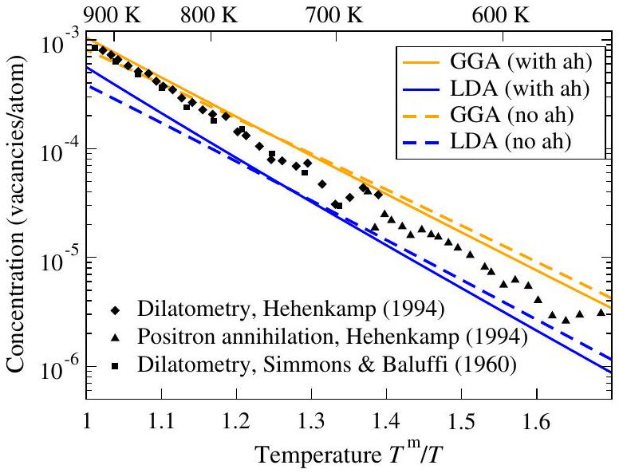
FIG. 3 (color online). Equilibrium concentration of vacancies in aluminum at zero pressure as a function of $T^{m} / T$, where $T^{m}$ is the melting temperature. The first-principles results have been obtained according to Eq. (41) with (solid lines) and without (dashed lines) the inclusion of anharmonic (ah) contributions to the free energy of formation. Both LDA and GGA functionals have been applied. Experimental results are included for comparison. Adapted from Grabowski et al., 2009.

thermodynamic quantities (Grabowski, Hickel, and Neugebauer, 2007), the LDA and GGA give approximately an upper and a lower bound to the experimental data. Finally, we note the good agreement between theory and experiment, which is particularly impressive when considering the exponential scaling with respect to the free energy of defect formation according to Eq. (41).

While the presented example of Al demonstrates that the methodological developments of the past few years now allow one to perform defect calculations including anharmonic freeenergy contributions, such calculations are still computationally highly demanding. Therefore, the majority of the defect calculations now and in the near future will be most likely performed at the $T=0 \mathrm{~K}$ level, including temperature effects only via configurational entropy or at the quasiharmonic level. Typical deviations from experiment on the order of a few tenths of an electron volt for the formation free energies (Delczeg et al., 2009; Nazarov, Hickel, and Neugebauer, 2012) and approximately an order of magnitude for defect entropies (Andersson and Simak, 2004) have been reported. Possible origins of these discrepancies between theory and experiment are analyzed in Sec. II.C.

## C. Sources of discrepancies between theory and experiment

The differences between theoretical and experimental defect formation enthalpies and entropies are related to the limited accuracy in both experiment and theory. As pointed out in Sec. II.B, experimentally a direct determination of defect formation enthalpies (e.g., by calorimetry) is not possible and only an indirect deduction from defect concentrations measured at high temperatures is used. Thus, all experimentally derived defect formation energies and entropies are strictly speaking high-temperature data. All $T=0 \mathrm{~K}$ data commonly used to compare with $T=0 \mathrm{~K}$ DFT results are only an extrapolation based on the assumption that the Arrhenius behavior applies down to zero temperature.

On the other hand, theory also has only a limited precision and accuracy. For first-principles calculations, two possible sources of error have to be distinguished: first, errors resulting from the limited precision of the defect calculations, for instance, due to incompletely converged basis sets, k-point sampling, or supercell sizes; and second, the approximate nature of the xc functionals employed in DFT and the lack of a procedure to systematically improve their accuracy. For metals, with the techniques outlined in Secs. II.A and II.B it is possible in practical DFT calculations to achieve a precision that is systematically below the intrinsic error of the DFT xc functionals. Thus, two major sources for discrepancies between theoretical and experimental data remain and need to be analyzed carefully: (i) the extrapolation of high-temperature experimental defect concentration data to $T=0 \mathrm{~K}$ defect formation energies and (ii) DFT xc functional errors. Both issues are addressed in Secs. II.C. 1 and II.C.2.

## 1. Non-Arrhenius behavior of defect concentrations

The approaches outlined in Sec. II.B. 3 allow one to compute the temperature dependence of the Gibbs energy of defect formation up to the melting temperature and thus to explicitly check the validity of the linear (Arrhenius) behavior in Eq. (42). Calculations for vacancies in metals (Grabowski et al., 2009, 2011; Glensk et al., 2014) show large deviations from a linear behavior, indicating that the underlying assumption of a temperature-independent enthalpy and entropy is not valid. The explicit dependence of the Gibbs energy of defect formation is shown in Fig. 4 for the example of an Al vacancy. Considering only the experimentally accessible range of high temperatures (> 550 K) the Gibbs energy of formation is approximately linear, i.e., the defect entropy and enthalpy are constant in this temperature range. The slope gives the entropy $\left(S^{f}=-\partial G^{f} / \partial T\right)$, and the

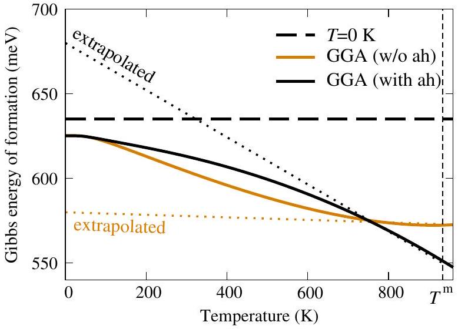
FIG. 4 (color online). DFT-computed temperature dependence of the Gibbs energy of vacancy formation in Al. The horizontal dashed line indicates the formation enthalpy at 0 K. The solid lines provide temperature-dependent values excluding and including anharmonic contributions. The dotted lines show the linear (Arrhenius) extrapolation of high-temperature formation enthalpies down to $T=0 \mathrm{~K}$ as discussed in the text.

TABLE I. First-principles enthalpy $H^{f}$ and entropy of formation $S^{f}$ for aluminum. The high-temperature $\left(T=T^{m}\right)$ values are obtained from a linear (Arrhenius) extrapolation (see text). For comparison the low-temperature data $(T=0 \mathrm{~K})$ are also given. The calculations have been performed with (w) and without (w/o) the consideration of anharmonic (ah) lattice vibrations. The LDA and GGA xc functionals have been used and the results are compared to experimental data (Simmons and Balluffi, 1960).
|  | $T$ | $H^{f}(\mathrm{eV})$ |  | $S^{f}\left(k_{B}\right)$ |  |
| :--- | :--- | :--- | :--- | :--- | :--- |
|  |  | LDA | GGA | LDA | GGA |
| DFT w/o ah | 0 K | 0.68 | 0.63 | 0.0 | 0.0 |
| DFT with ah | 0 K | 0.68 | 0.63 | 0.0 | 0.0 |
| DFT w/o ah | $T^{m}$ | 0.65 | 0.58 | 0.2 | 0.1 |
| DFT with ah | $T^{m}$ | 0.78 | 0.68 | 2.2 | 1.5 |
| Experiment | $T^{m}$ |  |  |  |  |

extrapolation to $T=0 \mathrm{~K}$ (dashed lines) the high-temperature enthalpy $H^{f}$. The corresponding values were computed by Grabowski, Hickel, and Neugebauer (2011) and are listed in Table I at the quasiharmonic and anharmonic levels. Table I shows that these values obtained from high-temperature data are significantly different from the actual $T=0 \mathrm{~K}$ values for both enthalpy and entropy. Since quantization effects are fully included, the entropy goes to its correct asymptotic limit ( $S^{f}=0 k_{B}$ ) at $T=0 \mathrm{~K}$. Furthermore, since anharmonic contributions become negligible at low temperatures, the formation enthalpies at the quasiharmonic and the anharmonic levels are identical in this limit.

Comparing the high-temperature enthalpies and entropies (which correspond to the situation in actual experiments) with the low-temperature values provides direct access to temperature-related corrections due to non-Arrhenius behavior. For the Al vacancy the correction is well below 0.1 eV (see Table I). For other vacancies deviations up to 0.3 eV have been reported (Glensk et al., 2014). Table I shows further that non-Arrhenius effects in entropy have much more dramatic consequences and can change the entropy from $0 k_{B}$ to more than $2.2 k_{B}$. Moreover, non-Arrhenius behavior is the origin of the differences in the high-temperature entropies and to a lesser extent in the enthalpies between quasiharmonic and fully anharmonic calculations. Going from the approximate quasiharmonic description to a fully anharmonic one can result in entropy changes of an order of magnitude, e.g., from $0.2 k_{B}$ to $2.2 k_{B}$ in the case of the Al vacancy. In any comparison of DFT $T=0 \mathrm{~K}$ data with experiment one should be aware of the magnitude of these deviations. As a consequence, when aiming at accuracies in the formation enthalpies on the order of 0.1 eV or when computing defect entropies, inclusion of temperature effects at the fullest level (i.e., including anharmonic contributions) is mandatory.

## 2. Effect of xc errors on defect formation energies

For point defects in semiconductors or insulators, the dominant intrinsic error is due to the band-gap problem and can be traced back to the spurious self-interaction in DFT within the traditional local density or generalized gradient approximations. In Sec. IV strategies are discussed that address and overcome this issue.

For metals, self-interaction artifacts are less significant due to the highly efficient electronic screening. As a consequence measurable quantities related to the bulk electronic structure, such as the work function, usually agree with experiment to better than 0.1 eV. The corresponding errors for nonmetals are typically up to an order of magnitude larger. Due to this fortunate situation, defect formation energies for metals are generally more accurate than for semiconductors or insulators. Still, even in metals errors due to the approximate nature of the xc functionals exist and need to be analyzed. Commonly, the dominant intrinsic defect in metals is the vacancy and we restrict the following discussion to this defect.

Systematic studies on vacancy formation energies in metals (Carling et al., 2000; Mattsson and Mattsson, 2002; Delczeg et al., 2009) indicate that the LDA gives generally more accurate energies as compared to the various GGAs such as PBE (Perdew, Burke, and Ernzerhof, 1997) or PW91 (Perdew, 1991). These differences have been explained by the different abilities of the LDA and GGA to describe surface energies. Since a vacancy can be viewed as an inner surface in an otherwise perfect bulk matrix, various approaches to correct for this shortcoming have been proposed. Carling et al. (2000) employed a postprocessing correction scheme using jellium surfaces to estimate the error. In contrast to realistic surfaces or defects, these model surfaces can be solved not only using standard DFT functionals, but also by quantum Monte Carlo (QMC) techniques, and allow one thus to quantitatively estimate the DFT error in describing surfaces. For Al (Carling et al., 2000), as well as Pt, Pd, and Mo (Mattsson and Mattsson, 2002), significantly improved formation energies as compared to experimental data were found. In subsequent studies Armiento and Mattsson proposed a new xc functional AM05 (Armiento and Mattsson, 2005; Mattsson et al., 2008) to overcome the deficiencies of other GGA functionals (PBE and PW91) in describing point defects. Delczeg et al. (2009) tested the accuracy of the AM05 functional for formation energies of vacancies in three fcc metals (Al, Cu, and Ni). They concluded that the LDA provides a better description of vacancy formation energies than the PBE or AM05 functional. A recent extension (Nazarov, Hickel, and Neugebauer, 2012) of the postprocessing approach by Carling et al. (2000) avoids making assumptions about size and shape of the inner surface and reduces the difference between the LDA and the various GGA results from a few tenths of an electron volt to typically less than 0.1 eV.

It should be noted that all the above correction schemes are limited to vacancies. In metals, we expect xc-related errors to be largest for vacancies since density gradients are strongest and chemical bonds are broken. Still, the use of higher-level methods such as the random phase approximation (RPA) (see Sec. IV.F.4) that allow going beyond DFT is highly desirable to systematically analyze xc-related errors in defect energies; such methods are expected to become affordable in the near future.

## D. Thermodynamic transition levels

As mentioned in the Introduction (see Sec. I.B.3), the different charge states of defects in semiconductors and

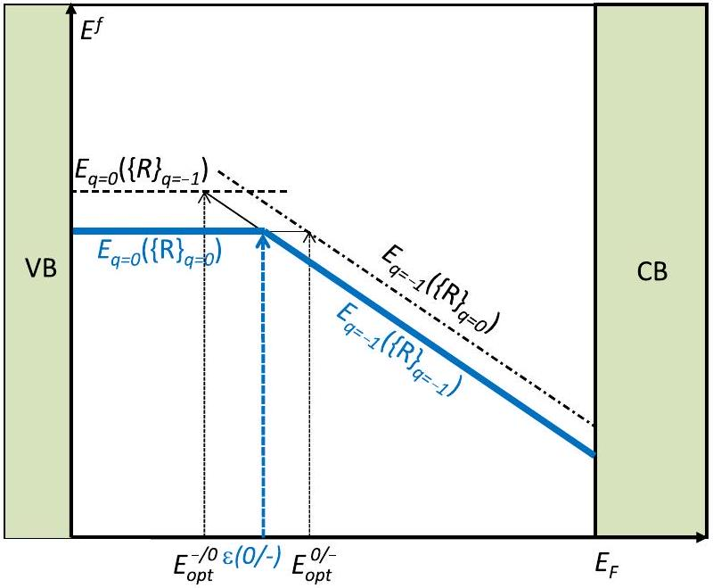
FIG. 5 (color online). Schematic illustration of formation energy vs Fermi level for an acceptor-type defect that can occur in two charge states: 0 and -1 . Solid lines correspond to formation energies for the fully relaxed atomic geometry for each charge state. Dashed lines correspond to formation energies of configurations where the defect geometry of the other charge state has been frozen in. Both thermodynamic $[\varepsilon(0 /-)]$ and optical transition levels ( $E_{\text {opt }}^{-/ 0}$ and $E_{\text {opt }}^{0 /-}$ ) are shown.

insulators are of the utmost importance for materials characterization and device applications. On changing the charge state of a defect, for instance, by optical excitation or by shifting the position of the Fermi level with an applied electric field, the local atomic structure can change and the defect assumes a new thermodynamic ground state. Depending on the time scale on which the change occurs two cases can be distinguished. In the first case, the transition occurs slowly so that the defect has sufficient time to equilibrate into its new ground state; i.e., the equilibration occurs on the phonon time scale (picoseconds). The defect goes from one equilibrated configuration with charge state $q$ to a different configuration with charge state $q^{\prime}$, and the transitions are called thermodynamic transition levels. In the second case, the transition occurs via optical excitations and the atomic geometry of the original charge state $q$ is frozen in on the time scale of the measurement. These transitions are called optical transitions and are discussed in Sec. II.E.

Figure 5 illustrates the distinction schematically for an acceptor-type defect that can exist in two charge states, namely, neutral $(q=0)$ and singly negatively charged $(q=-1)$. The figure shows that both types of transitions can be derived from standard defect calculations. To obtain the thermodynamic transition level the crossing point between the fully relaxed defect structures (solid lines) is computed. This level is independent of the direction of this transition, i.e., whether an electron is added or removed.

## 1. Deep levels

In general, transition levels are called deep levels when they are energetically "deep" in the band gap and far away from the band edges. For these defect levels the energy required to remove electrons from the valence band or to add electrons to the conduction band is much larger than the thermal energy $k_{B} T$. Such levels are usually undesirable in electronic or optoelectronic devices since they provide uncontrolled radiative or nonradiative recombination channels. These channels deteriorate device performance and may act as a source of failure mechanisms that reduce device lifetimes. In some cases, though, deep levels can be used constructively, for instance, to pin the Fermi level in an energy region far from the band edges, leading to semi-insulating material. Such layers can serve as insulating buffer layers in electronic devices. Deep levels can also be used as single spin centers for quantum computing, for which the nitrogen-vacancy (NV) center in diamond is an outstanding example (Weber et al., 2010).

Deep levels are typically associated with defects for which the local atomic geometry significantly deviates from the ideal bulk structure; examples include vacancies with broken bonds, interstitials, transition-metal impurities with localized states only weakly interacting with the host, and $D X$ centers which include large displacements of impurity or host atoms.

## 2. Shallow levels

Shallow levels are defect-induced states appearing closely above the VBM or below the CBM. Their energetic distance to the band edges is within a few $k_{B} T$, resulting in efficient ionization of electrons from the valence band into the defect level (leading to holes in the valence band) or of electrons from the defect level into the conduction band (leading to mobile electrons). Shallow levels are the origin of controlled $n$ - and $p$-type conductivity. However, not all shallow levels are technologically desirable: unintentional dopants (impurities) may also introduce shallow levels, resulting in compensation and thus reduction of doping efficiency.

Traditionally, shallow defect levels have been associated with substitutional atoms that have only a small impact on the crystal lattice and thus the bulk band structure, but which introduce extra holes or electrons into the system. Elements taken from adjacent columns in the periodic table, relative to the host atom for which they are substituting, tend to play this role.

Shallow donors largely conserve the bulk band structure, but they introduce a state in the conduction band that, in the neutral charge state, would be occupied with an extra electron. This carrier is transferred to the CBM, resulting in a Coulomb attraction between the electron and the positively charged defect center. This attraction leads to the formation of a hydrogenlike defect state, the main differences from an isolated H atom being that the electrostatic interaction is effectively reduced by efficient electronic screening in solids, and that the free-electron mass is replaced by the effective mass of electrons in the conduction band. The same arguments, mutatis mutandis, apply to shallow acceptors, which introduce holes in the valence band. This description has been formalized in Kohn and Luttinger's hydrogenic effective-mass theory (Kohn and Luttinger, 1955).

Electronic-structure calculations indeed show that the impurities that give rise to shallow defect levels also give rise to states that are resonances in either the conduction band (for donors) or the valence band (for acceptors). A schematic illustration, which also depicts a practical way of assessing the
nature of defect states, is shown in Fig. 6. The origin of a shallow donor level is a state deep in the conduction band (i.e., well above the CBM) (again, all the arguments also apply to acceptors, mutatis mutandis). The corresponding defect state is closely related to the chemistry and local geometry of the defect; i.e., linear combinations of dangling-bond states for a vacancy or atomic levels for a substitutional impurity. Due to the strong spatial localization of such defect states they are only weakly coupled to the host system, resulting in a fairly weak dependence on the bulk lattice constant that can be probed by applying external pressure. In contrast, the energy of the CBM depends strongly on pressure; for a direct-bandgap material, the CBM typically rises when pressure is applied (i.e., with decreasing lattice constant). As a consequence of this different pressure dependence, the localized defect state may emerge into the band gap when a high enough pressure (above a critical pressure $p_{\text {crit }}$ ) is applied. When this happens, it turns into a conventional deep defect level in which an electron can actually be localized on the defect itself, rather than merely bound in an effective-mass state.

The character of the defect wave function associated with this state remains largely unchanged, whether the state is located above or below the CBM. Regardless of whether a defect is shallow or deep, a corresponding localized state can be identified. In the case of a deep level, this state corresponds to the intuitive notion of a highly localized carrier trapped on the defect. In the case of a shallow level, the state is a resonance and is not actually occupied by an electron (or a hole). Nonetheless, the state exists and its identification is often useful when studying the physics of the shallow defect. Clearly this state should be distinguished from the hydrogenic effective-mass state that is often the only one that is considered in the context of shallow defects.

One reason why the localized states (resonances in the CB or VB) associated with shallow defects are not usually considered, and they have generally not been discussed in the past, is that they have no effect on defect formation energies or on the electronic behavior of the defect. However, the identification of these localized states can be effective in

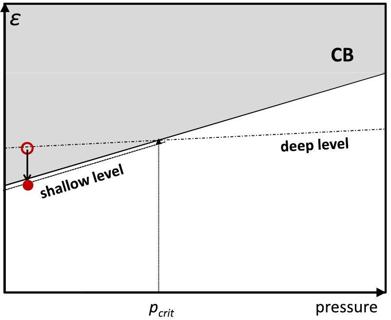
FIG. 6 (color online). Schematic illustration of pressure dependence of band edges and defect levels.

## 3. Spatial localization and $\boldsymbol{U}$ parameter

The fact that the electronic states of deep defects are spatially localized and energetically positioned within the band gap implies that they cannot be described as small perturbations of the electronic states at the band edges. In contrast to bulk states which are delocalized over the entire bulk system, wave functions related to deep defect states are spatially confined, extending typically over only a few neighboring atomic lattice sites. The localization is also directly related to the chemical nature of such defects, originating from dangling or broken bonds, or from atomic states that are largely decoupled from the host electronic structure.

These spatially localized defect states can be occupied with one or more electrons. The maximum filling is directly related to the character and the symmetry of the defect. For spincompensated systems an $s$-like state can be occupied by 0 , 1 , or 2 electrons, and a set of $p$-like states with 0 to 6 electrons. Bringing multiple electrons into such localized defect states leads to strong repulsive electrostatic interactions between the electrons. These interactions should be distinguished from the spurious electronic self-interaction that occurs in DFT; the repulsion between electrons within a given defect has a concrete physical meaning and is experimentally observable. To understand and quantify this effect in terms of defect formation energies we extend Fig. 5, where we considered only a single charge transition level, i.e., a system with two charge states only, to a system with multiple charge states.

Figure 7 schematically shows formation energies for such a case. To clearly distinguish between electronic and atomic effects we first consider the impact of charging the defect on the electronic structure alone, i.e., without including lattice relaxations. Lattice relaxation is switched off by fixing the atomic structure to that corresponding to one of the defect charge states (in Fig. 7 we have chosen the neutral state). Changes in the formation energies are then exclusively a result of changes in the electronic structure. Adding electrons to the defect shifts the charge-state transition level to higher energies. This is a direct consequence of the above-mentioned electronic repulsion and results in a positive value of the electronic $U$ parameter $U^{\mathrm{el}}$. Generally, the more localized the defect wave function and/or the smaller the electronic screening in the host system, the larger $U^{\text {el }}$ will be.

The scenario changes when charging of the defect is accompanied by large relaxations of the atomic structure. A prime example is the atomic hydrogen impurity, which depending on the charge state prefers to be in different interstitial positions [see, e.g., Neugebauer and Van de

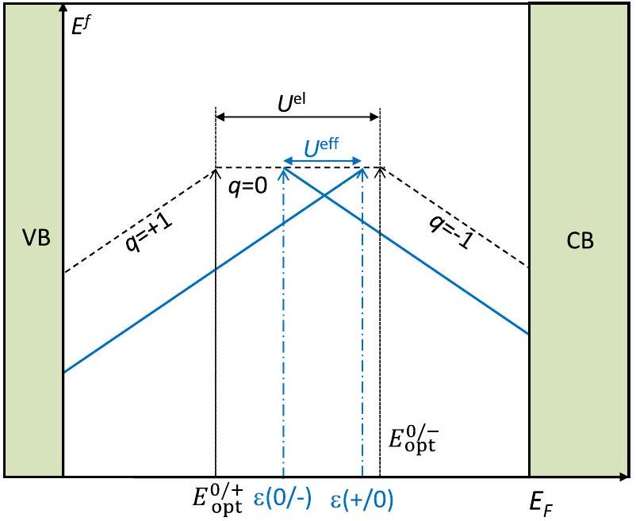
FIG. 7 (color online). Formation energy vs Fermi level for a defect that can occur in $q=+1,0$, or -1 charge states, illustrating the definition of the $U$ parameter. Solid lines correspond to formation energies for the fully relaxed atomic geometry for each charge state. Dashed lines correspond to formation energies where the defect geometry of the neutral charge state has been frozen in. Charge-state transition levels derived from the fully relaxed geometries (i.e., the thermodynamic transition levels) are marked by $\varepsilon\left(q / q^{\prime}\right)$, and the levels where the geometry has been frozen in by $E_{\text {opt }}^{q / q}$. The latter also correspond to optical transition levels (see Sec. II.E). The difference between two subsequent transition levels is called the $U$ parameter. Note that the purely electronic $U$ parameter $\left(U^{\mathrm{el}}\right)$ is positive whereas the effective $U^{\text {eff }}$ parameter in this example is negative.

Walle (1995) and Herring, Johnson, and Van de Walle (2001)]. For these systems the energy gained by atomic relaxation depends strongly on the charge state. The resulting formation energies are sketched as solid lines in Fig. 7. The ordering of the transition states is inverted: the donor level $(+/ 0)$ is now higher in energy than the acceptor level (0/-), implying that the neutral charge state becomes thermodynamically unstable against formation of positive and negative charge states. Formally, this situation where the donor level lies above the acceptor level and the charge state in between becomes unstable is described by a negative sign of the effective $U$ parameter, $U^{\text {eff }}<0$. The present discussion is not restricted to a system with +, 0, - charge states but applies to arbitrary charged defect systems. The $U$ parameter is then defined as

$$
U=E_{f}^{q+1}+E_{f}^{q-1}-2 E_{f}^{q}
$$

and can be determined from the calculated defect formation energies $E_{f}^{q}$.

## E. Optical transition levels

For thermodynamic transition levels the Fermi energy at which the transition occurs is independent of the direction of the charge transfer, i.e., it does not depend on whether an electron is added or taken away (see Fig. 5). In contrast, for optical transitions, as shown in Fig. 5, adding an electron shifts the corresponding level to higher energies compared to the thermodynamic charge transition level, while removing an electron shifts the level to lower energies. The energy difference between the higher and lower optical levels is directly related to the Stokes shift (the energy difference between optical absorption and emission peaks) and can be calculated from defect relaxation energies. When going from charge state $q$ to $q^{\prime}$, the relaxation energy is $E_{\text {rel }}=$ $E_{q^{\prime}}\left(\left\{R_{I}\right\}_{q}\right)-E_{q^{\prime}}\left(\left\{R_{I}\right\}_{q^{\prime}}\right)$, where the energy subscript $q^{\prime}$ indicates the defect charge state used in the calculation while $\left(\left\{R_{I}\right\}_{q}\right)$ indicates the frozen equilibrium structure of the defect in charge state $q$. The simplified picture outlined here ignores excitonic and vibrational coupling effects; the latter is briefly addressed in Sec. II.E.2.

## 1. Configuration coordinate diagrams

While the above discussion provides us with important information about the initial and final states of the charge transition, it does not address the actual path and process. To obtain insight into the actual dynamics of such a transition the concept of a configuration coordinate diagram has been developed. This concept, originally intended to explain transitions only qualitatively, can be treated fully quantitatively using modern electronic-structure theory.

Underlying the idea of the configuration coordinate diagram is the observation that the initial and final states can typically be connected by a one-dimensional collective reaction coordinate that closely resembles the actual transition. This reaction coordinate or generalized coordinate may, for instance, represent the magnitude of the relaxation of the atoms surrounding the defect (e.g., the displacement of the Ga atoms around a nitrogen vacancy in GaN), or the magnitude of the off-center displacement of an impurity along a specific direction [e.g., the displacement of the oxygen atom in AlGaN, which forms a $D X$ center (Van de Walle, 1998b)].

We illustrate this concept for the case of a nitrogen substitutional impurity in $\mathrm{ZnO}, \mathrm{N}_{\mathrm{O}}$, which is a deep acceptor and one of the subjects of a case study in Sec. V.A.2. The relevant charge states here are $q=0$ and $q=-1$, and the thermodynamic transition level is $\varepsilon(0 /-)=1.3 \mathrm{eV}$ (referenced to the VBM). For purposes of defining the thermodynamic transition levels, the atomic structure for each charge state is relaxed to its equilibrium configuration. These equilibrium configurations are not necessarily the same for both charge states. Indeed, it is this difference in relaxation that leads to the difference between thermodynamic transition levels and optical levels.

The optical level associated with a transition between charge states is defined similarly to the thermodynamic transition level, but now the energy of the final state is calculated using the atomic configuration of the initial state. In the example of Fig. 8, the initial state in an optical absorption experiment is the equilibrium configuration of the $q=-1$ charge state, and the final state corresponds to the same atomic configuration but with the defect in the neutral charge state (plus an electron at the CBM). Similarly, in photoluminescence the initial state is $q=0$ in its equilibrium configuration plus an electron at the CBM, and the final state corresponds to the same atomic configuration but with the defect in the negative charge state. The absorption and

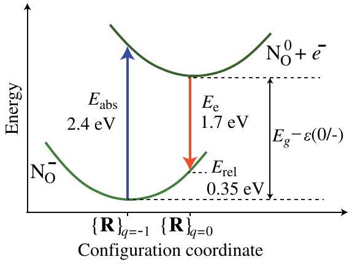
FIG. 8 (color online). Configuration coordinate diagram for a $\mathrm{N}_{\mathrm{O}}$ substitutional impurity in ZnO, illustrating the difference between thermodynamic and optical transition levels. The negative charge state is considered the ground state, and the variation of the energy as a function of atomic displacements around the stable configuration is shown. The curve for $\mathrm{N}_{\mathrm{O}}^{0}$ is vertically displaced from that for $\mathrm{N}_{\mathrm{O}}^{-}$assuming the presence of an electron at the CBM. $E_{\text {rel }}$ is the relaxation energy that can be gained, in the negative charge state, by relaxing from configuration $\{R\}_{q=0}$ (the equilibrium configuration for the neutral charge state) to configuration $\{R\}_{q=-1}$ (the equilibrium configuration for the negative charge state). This relaxation energy is sometimes called the Franck-Condon shift. The peak energies that would be observed in optical absorption or emission experiments are indicated. Adapted from Lyons, Janotti, and Van de Walle, 2009b.

emission energies $E_{\text {abs }}$ and $E_{e}$ are clearly different from the energy difference between the CBM and $\varepsilon(0 /-)$ (which corresponds to the "zero-phonon line").

Configuration coordinate diagrams such as Fig. 8 are extremely useful for analyzing optical experiments. In the original qualitative scheme, the dependence of energy on the configuration coordinate was often assumed to be parabolic, the justification being that the displacements needed to go from the geometry of one charge state to the other are within the harmonic regime. However, first-principles calculations allow us to explicitly calculate this dependence without making any approximations, although the calculations of the optically excited state and relaxation in the excited state pose a significant challenge to theoretical methods. In some cases, it is possible to manually prepare the excited state and perform standard DFT calculations. Often, however, time-dependent density-functional methods for the optically excited state or methods beyond DFT are required to treat the excited state accurately (Furche and Ahlrichs, 2002; Hutter, 2003; Gali, 2012; Rinke et al., 2012). The associated challenges merit a review in their own right and further discussion therefore is beyond the scope of this work.

## 2. Vibrational contributions and linewidth

The discussion about optical and thermodynamic transition levels summarized in Figs. 5 and 8 neglected vibrational coupling, which can lead to transitions at energies other than the ones corresponding to the "vertical transitions." These additional transitions include the zero-phonon line, which roughly corresponds to the thermodynamic transition energy. The vertical transitions, which do not involve phonons, tend to be strongest and hence generally correspond to peaks in the optical spectra. Vibrational coupling leads to broadening of lines. An illuminating discussion of these effects was provided by Davies (1999)

Other temperature-induced effects that could affect linewidths include (1) fluctuations in the defect formation energy on the phononic time scale ( $\approx 10^{-13} \mathrm{~s}$ ) due to thermally induced atomic vibrations; (2) occupation of charge states other than the ground state if their formation energies are within a few $k_{B} T$; (3) thermal fluctuations in the reaction path, which in reality is multidimensional; and (4) energy fluctuations due to Heisenberg's uncertainty principle (with the lifetime of the optical final states being very short). These additional factors can be considered to be second-order effects.

## III. FROM SUPERCELLS TO THE DILUTE LIMIT

## A. The supercell approach

In Sec. I.B we explained that the defect is usually modeled in a supercell, consisting of the defect surrounded by a few dozen to a few hundred atoms of the host material, which is then repeated periodically throughout space (Messmer and Watkins, 1972; Louie, Schlüter, and Chelikowsky, 1976). This allows one to employ the highly efficient and thoroughly tested computer codes developed for periodic solids and also guarantees an accurate description of the defect-free host material. However, it must be kept in mind that the use of supercells implies that the isolated defect is replaced by a periodic array of defects. Such a periodic array contains unrealistically large defect concentrations, resulting in artificial interactions between the defects that cannot be neglected.

Specifically, the interactions are of quantum-mechanical (overlap of the wave functions), elastic, magnetic, and electrostatic nature. These artifacts do not constitute a fundamental problem for the supercell approach-they become negligibly small when the supercell size is increased. In practice, however, the supercell sizes required to reach such absolute convergence would be too large for feasible calculations as was recognized early on (Leslie and Gillan, 1985; Makov, Shah, and Payne, 1996; Puska et al., 1998). It is therefore crucial to estimate the magnitude and decay behavior of the different effects, to employ computational schemes to minimize the impact on calculated properties, and to correct a posteriori for any remaining effects whenever possible. We focus here on the formation energy, but other properties sensitive to these interactions of course also suffer from these artifacts. For instance, corrections must be applied for the formation volumes (see Sec. II.B.1) of charged defects (Leslie and Gillan, 1985; Bruneval and Crocombette, 2012).

As mentioned in Sec. I.B, alternatives to the supercell approach exist, namely, Green's function techniques and clusters. They have in common with the supercell approach that only the defect and its immediate environment are treated explicitly (Deák, 2000). In cluster approaches, this system is then regarded as a supermolecule. In the Green's function approach, the explicit region is embedded in a perfect host material. The Green's function of the combined system can then be obtained exactly when only the defect region is subject
to self-consistency. Unfortunately, the electrostatic and elastic response beyond the explicitly treated region is typically neglected. Likewise, clusters suffer from quantum confinement effects when wave functions are delocalized. In other words, the mechanisms that give rise to defect-defect interactions in the supercell approach cannot be avoided and cause artifacts specific to the chosen boundary conditions. The supercell ansatz dominates in the solid-state physics community, and we focus on this approach next.

Supercell artifacts can be avoided only to the extent that we understand the underlying mechanisms. These mechanisms, and the extent to which they dominate, may differ from defect to defect. At present, no universal "black box" scheme is available that guarantees a complete removal of artifacts. An accuracy of better than 0.1 eV can usually be achieved only when the defect is well understood. If computational resources allow, an empirical extrapolation from a series of supercells represents an alternative, as shown for instance by Shim et al. (2005a), Wright and Modine (2006), Castleton, Höglund, and Mirbt (2006, 2009), and Nieminen (2009). Such an approach removes the need for analyzing all effects in detail and can even be employed in addition to the corrections suggested below. The functional form of the extrapolation ["scaling law" (Castleton, Höglund, and Mirbt, 2006)] is motivated by the formalism (notably including $1 / L$ and $1 / L^{3}$ terms, where $L$ is a representative supercell dimension). As an alternative, Hine et al. (2009) suggested interpolating to the dilute limit from the defect formation energy as a function of the Madelung potential for different cell sizes and cell shapes. Due to the lack of physical insight, however, the accuracy of results based purely on extrapolation cannot be assessed, even when the quality of the fit is very good.

## B. Overlap of wave functions

## 1. Dispersion of the defect band

The overlap of defect wave functions between neighboring supercells turns the single-particle state from an isolated defect into a dispersive defect band. For sufficiently localized states, e.g., deep states in an insulator or wide-gap semiconductor, or when the nearest band edge has a very high effective mass, the width of the defect band can be negligible in practice. The dispersion of this band can be analyzed in a tight-binding picture (Makov, Shah, and Payne, 1996) based on the Hamiltonian

$$
H=H_{0}+\sum_{\mathbf{R}} H_{d}(\mathbf{R}) .
$$

The sum $\mathbf{R}$ runs over the superlattice vectors. $H_{0}$ is the bulk Hamiltonian and $H_{d}(\mathbf{R})$ introduces the change in the Hamiltonian arising from the defect at $\mathbf{R}$. The isolated defect is obtained from

$$
H_{\text {iso }} \psi_{d}(\mathbf{r})=\epsilon_{d} \psi_{d}(\mathbf{r}) \quad \text { with } \quad H_{\text {iso }}=H_{0}+H_{d}(\mathbf{0}) .
$$

We consider a deep defect, associated with an electronic state that is largely (but not completely) contained within the supercell. The periodic defect band $\psi_{\mathbf{k}}$ is a linear combination of the normalized isolated states $\psi_{d}$,

$$
\psi_{\mathbf{k}}(\mathbf{r})=\sum_{\mathbf{R}} \psi_{d}(\mathrm{r}-\mathbf{R}) e^{i \mathbf{k} \cdot \mathbf{R}}=\sum_{\mathbf{R}} \psi_{d \mathbf{R}}(\mathbf{r}) e^{i \mathbf{k} \cdot \mathbf{R}} .
$$

Note that $\psi_{\mathbf{k}}$ is not normalized. The defect band dispersion can be estimated within first-order perturbation theory from this trial wave function as

$$
\epsilon(\mathbf{k})=\epsilon_{d}+\frac{\sum_{\mathbf{R}}\left\langle\psi_{d}\right| H-H_{\text {iso }}\left|\psi_{d \mathbf{R}}\right\rangle e^{i k \cdot R}}{1+\sum_{\mathbf{R} \neq 0}\left\langle\psi_{d} \mid \psi_{d \mathbf{R}}\right\rangle e^{i k \cdot R}}=\epsilon_{d}+\Delta \epsilon(k) .
$$

The most important insight from the tight-binding model is that a deep defect band disperses around the level of the isolated defect. For a localized state with a level in the band gap, the defect wave function decays exponentially away from the defect center. The intersite Hamiltonian and overlap matrix elements therefore exhibit an exponential reduction as the supercell size is increased.

The error from band dispersion can be estimated to first order from

$$
\Delta E=\sum_{\mathbf{k}} w_{\mathbf{k}} f_{\mathbf{k}} \Delta \epsilon(\mathbf{k}),
$$

where $w_{\mathbf{k}}$ are summation weights of the chosen k-point set. $f_{\mathbf{k}}$ is the occupation of the defect state in the supercell. For a given supercell and k-point independent occupations $f_{d}$, the effects of dispersion can be minimized by using special k-point sets (Makov, Shah, and Payne, 1996) or standard schemes that approximate the Brillouin-zone average (Shim et al., 2005b). The dispersion error then reduces to $f_{d} / \Omega_{\mathrm{BZ}} \int d^{3} \mathbf{k} \Delta \epsilon(\mathbf{k})$. The remaining error arises mainly from the unavoidable contribution of Hamiltonians in neighboring cells picked up by the tails of the defect state:

$$
\left\langle\psi_{d}\right| H-H_{\text {iso }}\left|\psi_{d}\right\rangle
$$

and the second-order contributions

$$
-\sum_{\mathbf{R} \neq \mathbf{0}}\left\langle\psi_{d}\right| H-\epsilon_{d}\left|\psi_{d \mathbf{R}}\right\rangle\left\langle\psi_{d \mathbf{R}} \mid \psi_{d}\right\rangle .
$$

The latter reflect the Pauli repulsion between the defect states due to the additional orthogonality constraint in the periodic array of defects compared to the isolated case. We point out that this theory notably captures defect-induced gap states below the valence band of both metals and nonmetals. For metals, the usual $\mathbf{k}$-point sampling is sufficient to ensure an efficient integration of $\Delta \epsilon(\mathbf{k})$. As our further considerations are specific for semiconductors and insulators, we conclude that errors from wave function overlap require no particular attention for metals.

## 2. Partially occupied states

Since only occupied states enter the total energy, special care must be taken in the case of partially occupied defect states, since variations in the occupation $f_{n \mathbf{k}}$ would interfere with the averaging effect of the chosen $\mathbf{k}$-point set. In a standard DFT calculation, the electrons fill the lowest-lying

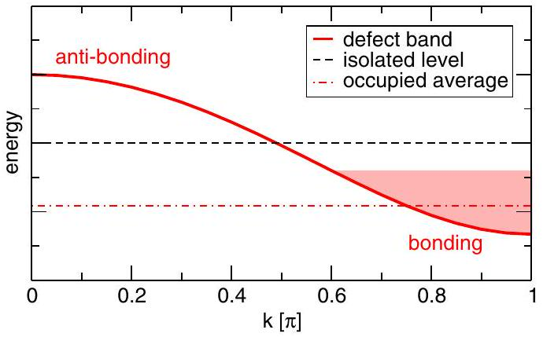
FIG. 9 (color online). Schematic illustration of defect-band dispersion for a $p$-like defect state ( $s$-like states would have a minimum at $\Gamma$ ). The shaded area indicates the effect of occupation according to a Fermi-Dirac distribution: electrons accumulate in the lower-lying, bonding parts of the defect band, shifting the occupied average away from the desired value for the isolated defect.

states according to the Fermi-Dirac (or some other) distribution. For partially occupied defect states, lower-lying parts of the defect band will be occupied preferentially (Fig. 9), giving rise to an artificial attraction between the defects.

This unphysical defect-defect interaction can easily be overcome by not performing a minimization of the energy with respect to defect-band occupations. Instead, one sets the occupations to the desired occupation of the isolated defect state throughout the Brillouin zone (Van de Walle and Neugebauer, 2004). As an alternative for nondegenerate defect states, the total occupation per k point $N_{\mathbf{k}}=\sum f_{n \mathbf{k}}$ can be set to a fixed value by employing a k-dependent Fermi energy $E_{F}(\mathbf{k})$ for the occupation numbers (Schultz, 2006).

Figure 10 illustrates this discussion with the example of the neutral vacancy in diamond, which has two electrons in a threefold-degenerate defect state. The standard Fermi occupation scheme converges much more slowly with the number of $\mathbf{k}$ points than the equal-occupation scheme. Moreover, the formation energy is significantly underestimated for small cells. The equal-occupation scheme, on the other hand,

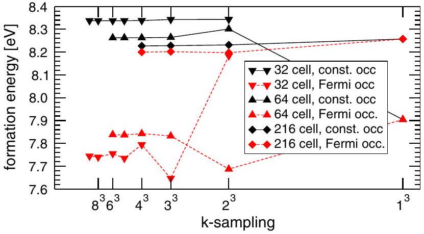
FIG. 10 (color online). Calculated formation energy of the unrelaxed, neutral vacancy in diamond as a function of $\mathbf{k}$-point sampling [Monkhorst-Pack mesh (Monkhorst and Pack, 1976) with offset $\left.\left[\frac{1}{2}, \frac{1}{2}, \frac{1}{2}\right]\right]$ for different supercells. Solid lines: constant defect-band occupations. Dashed lines: Fermi distribution $\left(k_{B} T=0.05 \mathrm{eV}\right)$.

## 3. Corrections for shallow levels

In principle, the above discussion also applies to shallow defects, but in practice the spatial extent of their wave functions significantly exceeds typical supercell sizes. Therefore a first-order perturbation theory on top of a superposition of isolated defect states is not sufficient. A better approach is to remember that shallow states are hydrogenic effective mass states (see Sec. II.D.2), or "perturbed host states" (Lany and Zunger, 2008). Their dispersion closely follows the host band from which they are derived, as depicted schematically in Fig. 11. Since the bulk valence- and conduction-band dispersions $\epsilon_{\mathrm{VB}}(\mathbf{k})$ and $\epsilon_{\mathrm{CB}}(\mathbf{k})$ are known, one can correct directly for effects of dispersion and occupation. For a given $\mathbf{k}$-point set (summation weight $w_{\mathbf{k}}$ ) and occupations $f_{\mathbf{k}}$, the band-dispersion correction for a shallow donor state is (Van de Walle and Neugebauer, 2004; Lany and Zunger, 2008)

$$
\Delta E=-\sum_{\mathbf{k}} w_{\mathbf{k}} f_{\mathbf{k}}\left[\epsilon_{\mathrm{CB}}(\mathbf{k})-\epsilon_{\mathrm{CBM}}\right]
$$

and for a shallow acceptor state

$$
\Delta E=+\sum_{\mathbf{k}} w_{\mathbf{k}}\left(1-f_{\mathbf{k}}\right)\left[\epsilon_{\mathrm{VB}}(\mathbf{k})-\epsilon_{\mathrm{VBM}}\right] .
$$

Conceptually, the correction vanishes for a $\Gamma$-only sampling of the Brillouin zone. In practice, a $\Gamma$-only sampling is usually inadequate for proper sampling of other quantities of interest, especially in modest-sized supercells. Even though the scheme deals transparently with different occupation schemes for shallow defects, we suggest combining it with the

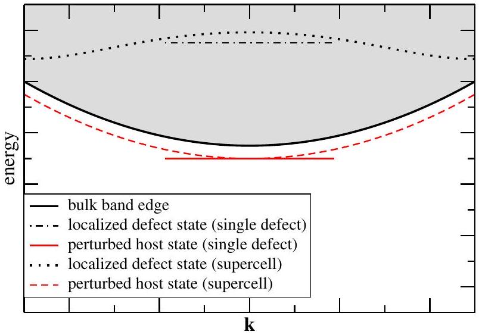
FIG. 11 (color online). Schematic illustration of origin and supercell dispersion of a shallow donor state. The defect gives rise to a localized state (resonance) within the conduction band. The electrically active level is not directly associated with this localized state, but rather arises from a perturbed host state below the CBM, offset in energy by an approximately constant amount.

constant-occupation scheme as described above for partially occupied deep defect states in order to average out k-dependent variations in the offset of the defect band from the bulk band.

## C. Electrostatic interactions

Supercell calculations for charged systems (charge $q$ ) must always include a compensating background charge, since the electrostatic energy of a system with a net charge in the unit cell diverges (Leslie and Gillan, 1985; Makov and Payne, 1995). Most commonly a homogeneous background is included, which is equivalent to setting the average electrostatic potential to zero.

The formation energy of a charged defect depends on the Fermi level [see Eq. (1)], which is referenced to the bulk VBM and hence depends on the average electrostatic potential in the bulk. The long-range nature of the Coulomb potential precludes establishing an absolute reference for the electrostatic potential (Kleinman, 1981), and hence a procedure needs to be devised to align the average electrostatic potential in the defect supercell with that in the bulk. This can in principle be done by examining the electrostatic potential in the supercell: in a large enough cell, far from the defect, the electrostatic potential should converge to its bulk value. In practice, the alignment is problematic for charged defects because of the slow $q / r$ decay of the defect's Coulomb potential; see Fig. 12.

The unphysical electrostatic interaction of the defect with its periodic images and the constant background also makes a spurious contribution to the calculated energy of the system. The magnitude of these interactions can be estimated from the Madelung energy of an array of point charges with neutralizing background (Leslie and Gillan, 1985). The interaction decays asymptotically as $q^{2} / L$ (Leslie and Gillan, 1985; Makov and Payne, 1995), where $L$ is a representative supercell dimension, e.g., the cube root of the supercell volume. Makov and Payne proved for isolated ions that the quadrupole moment of the charge distribution gives rise to a further term scaling as $L^{-3}$ (Makov and Payne, 1995). For realistic defects in condensed systems, however, such corrections, scaled by the macroscopic dielectric constant $\varepsilon$ to account for screening,

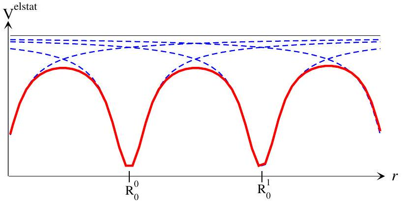
FIG. 12 (color online). Alignment problem for charged defects: Isolated defects (dashed lines) have a well-defined asymptotic limit for the $1 / r$ Coulomb potential (thin solid line), where the potential can be aligned to the bulk. From the periodic array (thick solid line)-here aligned at the defect centers-the bulk limit cannot be determined.

A modified version of the Makov-Payne corrections was proposed by Lany and Zunger (2008, 2009), providing consistent schemes to calculate the quadrupole moment and the potential alignment. The approach has been employed successfully in practice, but a potential drawback is that quadrupole and alignment terms from this scheme scale as $1 / L$, too, and therefore modify the $1 / \varepsilon L$ asymptotic limit of continuum theory.

On the analytic side, Freysoldt et al. showed how microscopic screening can be treated formally, providing a consistent scheme to calculate charge corrections and potential alignment (Freysoldt, Neugebauer, and Van de Walle, 2009). In practice, this scheme reduces to correcting for the macroscopically screened Madelung energy of a localized charge and to aligning the potential after subtracting the corresponding Madelung potential (Freysoldt, Neugebauer, and Van de Walle, 2011). This rigorous and well-defined approach circumvents most of the problems associated with previous schemes and is easy to apply. The key advantage is that the long-range $1 / r$ potential is removed from the potential before the alignment is determined for the remaining short-range potential. If the range separation is successful, the short-range potential reaches a plateau far from the defect, which yields the alignment as a well-defined quantity. Conversely, the absence of a plateau clearly indicates that the underlying assumptions (degree of charge localization, validity of bulklike macroscopic screening) are not fulfilled. In other words, the scheme automatically provides the limits of its applicability for each defect. The software to compute the corrections sxdefectalign is available online (Freysoldt, 2011). The sxdefectalign scheme has been found to give the best overall performance for localized defects in a recent comparative study of several correction schemes for a variety of defects (Komsa, Rantala, and Pasquarello, 2012).

As an alternative to the homogeneous-background approaches, several authors proposed modifying the computation of the electrostatic potential in the DFT calculation itself in order to remove the unwanted interactions (Carloni, Blöchl, and Parinello, 1995; Schultz, 2000, 2006; Rozzi et al., 2006). For isolated systems, this is an exact treatment. For condensed matter, however, the polarization of the host material outside the supercell is neglected. The magnitude of bulk polarization energy can be estimated from continuum electrostatics (Schultz, 2006) as $\sqrt[3]{\pi / 6}\left(1-\varepsilon^{-1}\right) q^{2} / L$, exhibiting the same asymptotic scaling as the standard approach. Therefore for most defect calculations the homogeneous background scheme with the currently available efficient correction approaches is the method of choice.

## D. Elastic interactions

Elastic interactions arise when the defect distorts the surrounding lattice (Eshelby, 1956). The position of each atom at position $\mathbf{R}_{I}$ in the ideal lattice becomes $\mathbf{R}_{I}+\mathbf{u}\left(\mathbf{R}_{I}\right)$ after distortion, where $\mathbf{u}$ denotes the displacement field. These distortions are produced by "Kanzaki forces" $f\left(\mathbf{R}_{I}\right)$ acting on the atoms close to the defect before we allow for relaxation. Kanzaki forces are defined as those forces that would reproduce the displacements if the force-constant matrix were not modified by the presence of the defect (Tewary, 1973).

In the harmonic limit, the displacements are given by (Tewary, 1973)

$$
\mathbf{u}(\mathbf{r})=\sum_{\mathbf{r}^{\prime}} G\left(\mathbf{r}, \mathbf{r}^{\prime}\right) \mathbf{f}\left(\mathbf{r}^{\prime}\right),
$$

where $G$ denotes the Green's function of harmonic elasticity, the pseudoinverse of the force-constant matrix

$$
\Phi\left(\mathbf{r}, \mathbf{r}^{\prime}\right)=\frac{\partial \mathbf{f}(\mathbf{r})}{\partial \mathbf{u}\left(\mathbf{r}^{\prime}\right)}=\frac{\partial^{2} E}{\partial \mathbf{u}(\mathbf{r}) \partial \mathbf{u}\left(\mathbf{r}^{\prime}\right)} .
$$

The calculation of the lattice Green's function, defined only for atom positions, and the continuum Green's function, defined as a continuous function, is best performed in reciprocal space (Cook and de Fontaine, 1969; Tewary, 2004; Trinkle, 2008). $G$ decays as $1 / r$; however, since defects do not exert a net force, the displacement field decays as $1 / r^{2}$. The whole theory can then also be expressed in terms of the strain $(\epsilon)$ and stress $(\sigma)$ fields:

$$
\epsilon_{\alpha \beta}=\frac{1}{2}\left(\frac{\partial u_{\alpha}}{\partial r_{\beta}}+\frac{\partial u_{\beta}}{\partial r_{\alpha}}\right), \quad \sigma_{\alpha \beta}=\frac{1}{2}\left(\frac{\partial f_{\alpha}}{\partial r_{\beta}}+\frac{\partial f_{\beta}}{\partial r_{\alpha}}\right) .
$$

This transition from the original fields (forces and displacements) to the gradient fields (stress and strain) can be seen in analogy to electrostatics: for vanishing net charge, the relevant quantities are electric dipoles and fields rather than charges and potentials. Indeed, the long-range strain field is characterized by the elastic dipole tensor (Tewary, 1973; Leslie and Gillan, 1985)

$$
\mathcal{G}_{\alpha \beta}=\sum_{\mathbf{r}} f_{\alpha}(\mathbf{r}) r_{\beta}=\sum_{\mathbf{r}} r_{\alpha} f_{\beta}(\mathbf{r}) .
$$

Like electric dipole-dipole interactions, elastic interactions between point defects decay as $1 / r^{3}$. The elastic energy of a periodic array likewise scales as $1 / L^{3}$. In principle, this energy can be calculated in the continuum limit from the elastic constants, the dipole tensor, and the supercell shape (i.e., simple cubic, bcc, hcp, etc.). However, we are not aware of any such approach in the context of first-principles calculations.

It has been argued that elastic interactions can be minimized by relaxing the volume of the defect-containing supercell until the macroscopic stress vanishes (Turner et al., 1997). For hydrostatic stress, this corresponds to the constant-pressure (in fact, zero-pressure) approach to defect formation, in contrast to the constant-volume approach which implies a finite, defect-induced hydrostatic pressure $P$. The difference is given by the volume relaxation of the bulk atoms: the strain energy in an unrelaxed supercell (volume $V_{0}$ ) due to the defect formation volume $V^{f}=V_{0} P / B$ can be roughly estimated from

$$
\Delta E \approx \frac{1}{2} B \frac{\left(V^{f}\right)^{2}}{V_{0}},
$$

where $B$ is the bulk modulus. This relation directly results from the definition of the bulk modulus $B=-\partial P / \partial \ln V$ and the relation of energy to pressure $P=-\partial E / \partial V$ when defectand volume-induced changes in the bulk modulus are neglected. Using characteristic values ( $B=100 \mathrm{GPa}, V^{f}=10 \AA^{3}, V_{0}=$ $1000 \AA^{3}$ ), we obtain an order-of-magnitude estimate for $\Delta E \approx 30 \mathrm{meV}$, which is a very small energy.

However, nonhydrostatic elastic interactions are equally important. Even for a spherical defect in a finite sphere (radius $L$ ) of an elastically isotropic material, the formation energy in the zero-pressure approach converges only as $1 / L^{3}$ (Mishin, Sorensen, and Voter, 2001). The prefactor $d E / d V$ is negative, but in magnitude comparable to that of the constant-volume approach. In the spherical model, the ratio of the prefactors is given by the Poisson ratio $\nu$ of the material as

$$
d E(P=0) / d E(V=\text { const })=-2 \frac{1-2 \nu}{1+\nu} .
$$

Any anisotropy in the elastic constants of the host material, the cell shape, or the defect's elastic dipole tensor will certainly modify the prefactors, but not the scaling.

We also note that the potential alignment for charged defects (see Sec. III.C) relies on the presence of a bulklike region, which can no longer be identified if volume relaxation is performed. We therefore recommend avoiding volume relaxation. If elastic effects are known to dominate the finite supercell error, the best way currently is to extrapolate convergence based on the known $1 / L^{3}$ scaling at fixed cell shape for two (or more) supercell sizes.

## E. Magnetic interactions

Although magnetic interactions are (similar to elastic interactions) also known to be long ranged in many material systems, the consequences for supercell calculations have been much less investigated. This is an issue that is relevant for magnetic interactions in semiconductors; in dilute magnetic semiconductors, for example, magnetic impurities are assumed to interact with each other via Ruderman-Kittel-Kasuya-Yoshida (RKKY) interactions (Liu, Yun, and Morkoc, 2005). This interaction is captured by an effective Heisenberg Hamiltonian

$$
H=-\sum_{i, j} J_{i, j} \mathbf{S}_{i} \cdot \mathbf{S}_{j},
$$

with exchange integrals $J_{i, j}$ that vary as $1 / r^{3}$ for large distances $r$ between the magnetic impurity spins $\mathbf{S}_{i}$. Vacancy-induced ferromagnetism in an otherwise nonmagnetic material has also been suggested for several materials,
such as $\mathrm{ZnO}, \mathrm{SrTiO}_{3}$, and graphene (Palacios and Ynduráin, 2012). In addition, magnetic ordering occurs in a variety of insulating transition-metal compounds, notably in Mott insulators (Imada, Fujimori, and Tokura, 1998). The majority of DFT calculations for magnetic systems, however, have been performed for metals. The (anti)ferromagnetic interactions need to be taken into account in supercell calculations (Körmann et al., 2010) and can again often be simulated with a Heisenberg-type Hamiltonian with long-range parameters $J_{i, j}$.

The interaction of these long-range magnetic effects with native defects (e.g., vacancies) happens in two directions: On the one hand, the magnetic state significantly modifies the defect formation energy. A major reason for this effect is a strong magnetoelastic coupling in metals, which easily yields changes in atomic distances of several percent if the magnetic state is altered, and therefore effectively results in an additional strain component for the defect formation process (Korzhavyi et al., 1999). As a consequence, if the correct magnetic state of the vacancy is not a priori clear or not captured by a single magnetic configuration (e.g., paramagnetic), calculations need to be performed for different magnetic configurations to evaluate this influence. For example, such calculations have been carried out for fcc Fe, which has its magnetic ordering temperature around 200 K but is thermodynamically stable only above 1100 K. A difference in the vacancy formation energy of 0.45 eV between nonmagnetic and antiferromagnetic structures (Nazarov, Hickel, and Neugebauer, 2010) was found (corresponding to 25\% of the formation energy), and a difference of 0.15 eV (10\%) between two different antiferromagnetic structures (Klaver, Hepburn, and Ackland, 2012).

On the other hand, the presence of a defect modifies the magnetic environment in a range corresponding to several nearest-neighbor shells. This is due to the long-range magnetic interactions, but more importantly to the strong coupling between atomic relaxation and magnetic changes.

As a consequence, careful supercell convergence tests should be performed for all defect calculations in magnetic systems. For antiferromagnetic fcc Fe, one obtains changes of the magnetic moment (referenced to the defect-free system) that are oscillating with distance and noticeable up to the fifthneighbor shell of a vacancy or an interstitial hydrogen atom (Nazarov, Hickel, and Neugebauer, 2010). These modifications are coupled to atomic displacements that are also much longer ranged than in nonmagnetic calculations, where only fluctuations of the charge density occur.

Similar observations have been made in paramagnetic calculations for various $\mathrm{Fe}-\mathrm{Cr}-\mathrm{Ni}$ alloys, for which the magnetic moments in vacancy-containing supercells did not reach their corresponding bulk value even at the fifth-neighbor shell of the defect (Delczeg, Johansson, and Vitos, 2012). In those calculations the coherent potential approximation was used to simulate the magnetic disorder, keeping the atomic positions fixed. The relaxation effects can be better investigated in supercell calculations with quasirandom disorder, where one can even compare frozen-in magnetic configurations with strong magnetic fluctuations (Körmann et al., 2012).

These examples illustrate that a systematic supercell correction scheme (of the type available for electrostatic interactions between charged defects, Sec. III.C) does not yet exist for magnetic interactions. The interplay of point defects and magnetism is still a field of active research and future work is needed before specific recommendations for particular computational strategies can be made.

## F. Recommendations

The multitude of schemes that have been proposed to overcome supercell artifacts has led to an unsatisfactory situation in which different groups apply different corrections, sometimes without specifying which scheme is being used, or without providing sufficient detail. This adds an additional source of uncertainty to any calculated results. In an attempt to restore order, we issue the following recommendations:

(1) Additive schemes focusing on a single physical effect should be preferred over seemingly universal schemes. The effects for which corrections are available should not interfere with each other and can be corrected for independently.
(2) Information extracted from the DFT calculations themselves should be used to validate the underlying assumptions of the correction schemes. Examples include monitoring the localization of wave functions (Freysoldt, Neugebauer, and Van de Walle, 2009), explicitly calculating the short-range deviations from the macroscopic electrostatic potential (Freysoldt, Neugebauer, and Van de Walle, 2011), and comparing displacement patterns to predictions from continuum elasticity theory.
(3) If affordable, energies (after correction) from different supercells should be compared.

We note that the macroscopic bulk behavior for electrostatic screening or elasticity is typically recovered to within 0.01 eV at a distance of only $5-10 \AA$ from the defect center. For shorter distances between defects, specific defect-defect interactions must be expected that cannot be captured by macroscopic theories. None of the existing schemes are capable of removing such defect-specific short-range interactions. This implies that defect calculations should aim to use supercell sizes that are large enough to describe individual defects as accurately as possible to minimize the error due to these short-range interactions. At the same time, errors due to the approximate nature of the electronic structure scheme (e.g., the choice of the xc functionals in DFT) can be minimized by increasing the level of sophistication of those calculations (using improved functionals or going beyond DFT, see Sec. IV), but usually at significant computational cost, which limits the system size. Practical calculations will therefore require choosing supercell sizes that balance these two types of errors.

## IV. OVERCOMING THE BAND-GAP PROBLEM

The DFT method within the LDA or the GGA has been extensively used to describe defects in semiconductors and insulators (Van de Walle et al., 1993; Van de Walle and

Neugebauer, 2004; Drabold and Estreicher, 2007). However, its predictive power has been limited by the severe underestimation of band gaps (Sham and Schlüter, 1983; Perdew, 1985; Godby, Schlüter, and Sham, 1986; Mori-Sánchez, Cohen, and Yang, 2008). In many cases the DFT LDA or GGA also fails to correctly predict charge localization originating from narrow bands or associated with local lattice distortions around defects. This limitation is thought to be largely due to self-interaction. The deficiency in predicting band gaps leads to large uncertainties in the calculated defect formation energies and transition levels, especially in the case of wide-band-gap materials (Zhang, Wei, and Zunger, 2001), so that conclusions about defect concentrations and about the electrical and optical activities of defects based on DFT LDA or GGA calculations have been restricted to a semiquantitative level (Zhang, Wei, and Zunger, 2001; Janotti and Van de Walle, 2005, 2007b; Pacchioni, 2008). As a purely pragmatic approach, it has been suggested to completely ignore the calculated band edges and reference charge transition levels to marker levels [in the marker method of Coutinho et al. (2003)] or to the average electrostatic potential (Alkauskas, Broqvist, and Pasquarello, 2008; Komsa, Broqvist, and Pasquarello, 2010; Alkauskas and Pasquarello, 2011). The position of these reference levels with respect to the band edges would then be obtained from high-level calculations or experiment. These schemes, however, fail if the defect state changes qualitatively due to self-interaction, e.g., if the state lies outside the theoretical gap before alignment. Moreover, self-interaction errors may modify the local lattice geometry and distortions, which in turn alter the defect level. Such effects cannot be captured by alignment.

In this section, we start from a comparison to Hartree-Fock theory (see Sec. IV.A) to discuss insights into self-interaction (see Sec. IV.B). We then review (Secs. IV.C, IV.D, and IV.E) empirical schemes that-partially based on these insights- aim at circumventing the band-gap problem based on approximate (and computationally inexpensive) methods, before returning to more accurate (and generally computationally more demanding) ways of overcoming the problem in Secs. IV.F, IV.G, and IV.H.

## A. Hartree-Fock theory

The Hartree-Fock equations, which are widely used by quantum chemists, are usually derived by using a completely antisymmetric ansatz (Slater determinant) for the manyelectron wave function $\Psi$ with $N$ orbitals (Szabó and Ostlund, 1996)

$$
\Psi=\frac{1}{\sqrt{N!}}\left|\begin{array}{cccc}
\varphi_{1}\left(\mathbf{r}_{1}\right) & \varphi_{2}\left(\mathbf{r}_{1}\right) & \cdots & \varphi_{N}\left(\mathbf{r}_{1}\right) \\
\vdots & \vdots & & \vdots \\
\varphi_{1}\left(\mathbf{r}_{N}\right) & \varphi_{2}\left(\mathbf{r}_{N}\right) & \cdots & \varphi_{N}\left(\mathbf{r}_{N}\right)
\end{array}\right|,
$$

and minimizing $\langle\Psi| \hat{H}|\Psi\rangle$, where $\hat{H}$ is the many-electron Hamiltonian. As a result of this ansatz, the usual KS DFT equations (Hohenberg and Kohn, 1964; Kohn and Sham, 1965; Parr and Yang, 1994)

$$
\left(-\frac{\hbar^{2}}{2 m_{e}} \Delta+v_{\mathrm{ext}}(\mathbf{r})+v_{\mathrm{H}}(\mathbf{r})+v_{\mathrm{xc}}(\mathbf{r})\right) \varphi_{i}(\mathbf{r})=\epsilon_{i}^{\mathrm{KS}} \varphi_{i}(\mathbf{r})
$$

that involve a local (in real space) multiplicative potential $v_{\mathrm{xc}}(\mathbf{r})$ are replaced by a slightly more complicated coupled set of integro-differential equations, the HF equations:

$$
\begin{aligned}
& \left(-\frac{\hbar^{2}}{2 m_{e}} \Delta+v_{\mathrm{ext}}(\mathbf{r})+v_{\mathrm{H}}(\mathbf{r})\right) \varphi_{i}(\mathbf{r}) \\
& \quad+\int v_{\mathrm{x}}\left(\mathbf{r}, \mathbf{r}^{\prime}\right) \varphi_{i}\left(\mathbf{r}^{\prime}\right) d^{3} r^{\prime}=\epsilon_{i}^{\mathrm{HF}} \varphi_{i}(\mathbf{r})
\end{aligned}
$$

While the Hartree potential $v_{\mathrm{H}}$ can be calculated directly from the density $n(\mathbf{r})$ alone,

$$
v_{\mathrm{H}}(\mathbf{r})=e^{2} \int \frac{n\left(\mathbf{r}^{\prime}\right)}{\left|\mathbf{r}-\mathbf{r}^{\prime}\right|} d^{3} r, \quad n(\mathbf{r})=\sum_{j} f_{j} \varphi_{j}(\mathbf{r}) \varphi_{j}^{*}(\mathbf{r}),
$$

the exact exchange potential requires knowledge of all (occupied) orbitals

$$
v_{\mathrm{x}}\left(\mathbf{r}, \mathbf{r}^{\prime}\right)=-e^{2} \frac{\sum_{j} f_{j} \varphi_{j}(\mathbf{r}) \varphi_{j}^{*}\left(\mathbf{r}^{\prime}\right)}{\left|\mathbf{r}-\mathbf{r}^{\prime}\right|},
$$

where $f_{j}$ are the occupation weights of the orbitals $\varphi_{j}$ (usually 0 or 1). Since the potential is nonlocal and orbital dependent, approaches involving nonlocal exchange go beyond conventional KS DFT and are usually referred to as generalized KS approaches (Gilbert, 1975; Seidl et al., 1996). Some of the methods discussed below, in particular, $\mathrm{LDA}+U$ (see Sec. IV.D), also fall into this category.

A major advantage of HF theory is that it is one-electron self-interaction-free, since the exchange potential exactly cancels the Hartree potential for occupied orbitals. However, the nonlocality of the exchange potential $v_{\mathrm{x}}$ renders practical calculations using Hartree-Fock theory significantly more expensive than the now almost routine DFT calculations. With plane-wave codes the computation time typically increases by a factor of 10 if the Brillouin zone is sampled by a single k point, but by a factor of 100 to 1000 if the sampling includes multiple k points; this is because the exchange term involves a double summation over the Brillouin zone. The second problem of Hartree-Fock theory is that it entirely neglects correlation effects, leading to a strong underbinding for most thermochemical reactions, as well as a huge overestimation of band gaps as discussed in Sec.IV.B.

## B. Shortcomings of density functional theory

## 1. Self-interaction and localization errors

The accurate prediction of fundamental band gaps $E_{g}$ is a prerequisite for a proper determination of defect properties in semiconductors and insulators. As illustrated in Fig. 5, the theoretically predicted transition levels are referenced to the theoretical VBM and CBM, and errors in the gap preclude accurate assessments of the positions of these levels. To better
understand the link between the fundamental gap and the KS one-electron energies, we first need to discuss the relation between them, as well as the concept of self-interaction and localization errors.

For a system of $N$ electrons, the true fundamental band gap (or integer gap) is defined as the difference between the electron ionization energy $I$ and electron affinity $A, E_{g}^{\text {int }}=$ $I-A$, where the ionization energy is the (positive) energy required to remove one electron from the system

$$
I=E_{0}^{\mathrm{el}}(N-1)-E_{0}^{\mathrm{el}}(N),
$$

and the electron affinity is the energy gained upon adding one electron

$$
A=E_{0}^{\mathrm{el}}(N)-E_{0}^{\mathrm{el}}(N+1),
$$

where $E_{0}^{\text {el }}(N)$ is the zero-temperature electronic binding energy for $N$ electrons.

When density functional theory is extended from integer to fractional electron numbers, the exact DFT ground-state energy becomes a set of straight-line segments connecting the energies for integer electron numbers $\ldots, E_{0}^{\text {el }}(N-1)$, $E_{0}^{\mathrm{el}}(N), E_{0}^{\mathrm{el}}(N+1), \ldots$ (Perdew et al., 1982; Mori-Sánchez, Cohen, and Yang, 2006):

$$
E_{0}^{\mathrm{el}}(N-\delta)=E_{0}^{\mathrm{el}}(N)+\delta I, \quad E_{0}^{\mathrm{el}}(N+\delta)=E_{0}^{\mathrm{el}}(N)-\delta A,
$$

where $\delta$ is between 0 and 1.
This generalization of DFT to noninteger electrons implies that for the exact functional the fundamental band gap can also be calculated by evaluating the derivative of the energy with respect to the number of electrons

$$
E_{g}^{\mathrm{der}}=\left.\lim _{\delta \rightarrow 0} \frac{\partial E_{0}^{\mathrm{el}}}{\partial N}\right|_{N+\delta}-\left.\lim _{\delta \rightarrow 0} \frac{\partial E_{0}^{\mathrm{el}}}{\partial N}\right|_{N-\delta},
$$

approaching the limit of $N$ electrons from either above or below.

The term "self-interaction error" nowadays usually refers to the deviation from the straight-line behavior (the so-called many-electron self-interaction error), and neither HF theory nor present density functionals are many-electron self-interaction-free.

For local and semilocal xc functionals, the total energy is a convex curve with discontinuities at integer occupancies. The discontinuities are related to the fact that upon adding an electron the conduction band becomes filled, whereas removal of an electron depletes the valence band. That is, one is probing the energy dependence on the electron filling in distinct parts of the eigenvalue spectrum separated by the band gap. For (semi)local functionals, the derivative band gap is given by one-electron KS energy differences between the highest occupied orbital (HOMO) and lowest unoccupied orbital (LUMO) (Mori-Sánchez, Cohen, and Yang, 2008)

$$
E_{g}^{\mathrm{der}}=\epsilon_{g}^{\mathrm{LDA} / \mathrm{GGA}}=\epsilon_{\mathrm{LUMO}}^{\mathrm{LDA} / \mathrm{GGA}}(N)-\epsilon_{\mathrm{HOMO}}^{\mathrm{LDA} / \mathrm{GGA}}(N),
$$

where the eigenvalues are calculated for the $N$-electron system. Likewise for Hartree-Fock calculations, the discontinuities are given by the energy difference of the one-electron eigenvalues of the Hartree-Fock Hamiltonian. To illustrate this behavior we show in Fig. 13 the energy versus electron number curves for a $\mathrm{Si}_{4}$ tetrahedron saturated with hydrogen at the corners. The exact xc functional should yield a straight-line behavior between integer electron numbers. The LDA yields curves that are too convex and favor fractional occupancies over integer occupancies: two molecules with 19.5 electrons each are more stable than two molecules with 20 and 19 electrons. For Hartree-Fock calculations, on the other hand, fractional charges are unfavorable compared to the straight-line behavior (although in this particular example the deviation from a straight line is very small in the case of electron addition).

We note that HF addition and removal energies are not expected to be accurate at integer occupancies, since HF theory entirely neglects correlation effects. In contrast, experience indicates that electron addition and removal energies calculated using integer electron numbers are fairly accurate for semilocal functionals and finite systems (Ernzerhof and Scuseria, 1999).

The origin for the convex behavior of local and semilocal functionals is a remainder of the Hartree energy. If we imagine that the density for the neutral case $n(\mathbf{r})$ does not change when an electron is added to the orbital $\varphi_{\text {LUMO }}$, then the Hartree energy is given by $\left[\delta\left|\varphi_{\text {LUMO }}(\mathbf{r})\right|^{2} \propto \delta n(\mathbf{r})\right]$

$$
\begin{aligned}
E_{\mathrm{H}}= & \frac{e^{2}}{2} \int \frac{[n(\mathbf{r})+\delta n(\mathbf{r})]\left[n\left(\mathbf{r}^{\prime}\right)+\delta n\left(\mathbf{r}^{\prime}\right)\right]}{\left|\mathbf{r}-\mathbf{r}^{\prime}\right|} d^{3} r d^{3} r^{\prime} \\
= & \frac{e^{2}}{2} \int \frac{n(\mathbf{r}) n\left(\mathbf{r}^{\prime}\right)}{\left|\mathbf{r}-\mathbf{r}^{\prime}\right|} d^{3} r d^{3} r^{\prime}+\delta\left\langle\varphi_{\mathrm{LUMO}}\right| v_{\mathrm{H}}\left|\varphi_{\mathrm{LUMO}}\right\rangle \\
& +\frac{e^{2}}{2} \int \frac{\delta n(\mathbf{r}) \delta n\left(\mathbf{r}^{\prime}\right)}{\left|\mathbf{r}-\mathbf{r}^{\prime}\right|} d^{3} r d^{3} r^{\prime}
\end{aligned}
$$

The first term is just the Hartree energy for the neutral case, the second term containing the Hartree potential for the neutral case $v_{\mathrm{H}}$ is linear in $\delta n(\mathbf{r})$ and contributes to the eigenvalue

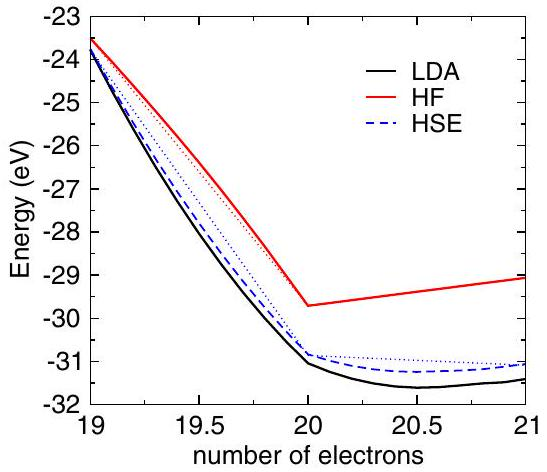
FIG. 13 (color online). Energy vs number of electrons for the LDA, Hartree-Fock theory, and a hybrid functional (HSE) for a $\mathrm{Si}_{4} \mathrm{H}_{4}$ cluster. The LDA underestimates the discontinuities at integer numbers, yielding a convex behavior below the straight line, whereas the Hartree-Fock calculation yields a concave behavior lying above the ideal straight line (dotted lines). The KS (HF) eigenvalues of the LUMO and HOMO correspond to the derivatives for $20 \pm \delta$ electrons.

$\epsilon_{\text {LUMO }}^{\text {KS }}$, and the third term is quadratic with a positive curvature yielding a convex upward-bending behavior. A similar analysis for the exact exchange energy shows that it yields a negative curvature upon electron addition, which would exactly compensate the positive curvature, if and only if the other electrons did not relax in response to the added electron; Hartree-Fock theory is one-electron self-interactionfree. In a many-electron system, however, relaxation of the other electrons invalidates this behavior, and the Hartree-Fock energy always lies above the straight line (concave behavior in Fig. 13). If exchange and correlation are approximated by a semilocal DFT functional, the positive curvature of the Hartree energy prevails, as the present functionals are not able to compensate the upward curvature of the Hartree term: the added electron experiences a residual of its own Hartree potential.

How these errors carry over to extended (infinite) systems is still a subject of active research. Studies suggest that with increasing system size the behavior for integer electron numbers (the fundamental gap) will approach the incorrect behavior of the derivative gap, which is overestimated in Hartree-Fock calculations and underestimated using semilocal functionals (Mori-Sánchez, Cohen, and Yang, 2008). A simple argument supports this conjecture. If one electron is added to or removed from an extended bandlike state in a large simulation box, the change in the local charge density $n(\mathbf{r})$ is infinitesimally small at each point in space, and the resulting change in the local approximations to the KS potential is infinitesimally small as well. In the LDA, one then recovers the behavior for an infinitesimal change of the electron number in a finite cell, i.e., the one-electron addition and removal energies become identical to the KS eigenvalues. This expectation has been confirmed by practical calculations (Lany and Zunger, 2008). Likewise, the change of the nonlocal exchange potential will be negligible upon adding or removing electrons to or from Bloch states, so that for Hartree-Fock calculations the overestimation of the derivative band gap (compared to the fundamental gap) will dictate the behavior in extended systems. These conjectures are in full agreement with the observation that semilocal functionals underestimate the band gap in virtually all extended systems, whereas Hartree-Fock theory severely overestimates the band gap.

The deviation from the straight-line behavior has other consequences. If one considers the solid to be made up of weakly interacting fragments, then local and semilocal functionals will prefer to spread out charge over the fragments instead of localizing charge at one of the fragments, since fractional occupancies are incorrectly preferred over integer occupancies. This error manifests itself in defect calculations: it is commonly accepted that semilocal functionals yield defect states that are less localized than they should be, and this is to some extent true. A more precise statement, however, is that semilocal functionals prefer to spread the charge over many defects favoring fractional occupation instead of localizing the entire charge on one defect. The opposite applies to Hartree-Fock calculations, which incorrectly prefer to localize charge on one fragment (defect) instead of delocalizing it over many fragments (defects). In practical calculations, this error is partly remedied by performing defect calculations only at integer electron numbers, but this does not remedy the severe underestimation of the band gaps.

## 2. Exchange-correlation derivative discontinuity

Over the years, a great deal of evidence has accumulated showing that the KS potentials in solids are qualitatively and often even quantitatively correct (Sham and Schlüter, 1983; Godby, Schlüter, and Sham, 1986; Grüning, Marini, and Rubio, 2006). If the potentials are correct for extended systems and energy differences reasonably accurate for integer electron numbers, what is then the origin of the incorrect band gap in solids, and how can one restore the straight-line behavior for finite systems?

For Kohn-Sham functionals, the only plausible explanation is that the derivative of the xc functional must change discontinuously when the electron number goes through an integer, from $N$ to $N+\delta$ (Perdew et al., 1982; Perdew and Levy, 1983; Sham and Schlüter, 1983). This will cause a discontinuous jump in the xc potential $v_{\mathrm{xc}}(\mathbf{r})$ upon addition of the fractional charge. As a result, the energy derivative

$$
\left.\lim _{\delta \rightarrow 0} \frac{\partial E_{0}^{\mathrm{el}}}{\partial N}\right|_{N+\delta} \neq \epsilon_{\mathrm{LUMO}}^{\mathrm{KS}}(N)
$$

will deviate from the KS eigenvalue of the lowest unoccupied orbital calculated for $N$ electrons $\epsilon_{\text {LUMO }}^{\text {KS }}(N)$.

Unfortunately, no practical means exist to estimate (even a posteriori) the magnitude of the discontinuity using the density functional applied in the ground-state calculations. Instead, a more accurate approach beyond DFT is needed to estimate the magnitude of the derivative discontinuity for extended systems, for instance, the $G W$ QP techniques discussed in Sec. IV.F (Sham and Schlüter, 1983; Godby, Schlüter, and Sham, 1986; Grüning, Marini, and Rubio, 2006). For finite-sized systems, suitable models for the derivative have been suggested only recently, restoring the straight-line behavior (Zheng et al., 2011).

Because KS functionals with accurate discontinuities presently do not exist, in practice one needs to resort to quasiparticle methods (see Sec. IV.F) or generalized KS schemes that include a fraction of the nonlocal exchange (see Sec. IV.G). While excellent results can be obtained, these methods have the disadvantage that they increase the computational demands by at least 1 to 2 orders of magnitude. Hence there is a need for computationally less expensive alternatives, which are covered in Secs. IV.C, IV.D, and IV.E.

## C. Extrapolation schemes

Several approaches to overcoming the band-gap problem without resorting to more expensive electronic-structure methods have been proposed over the years, most of them based on empirical corrections (Zhang, Wei, and Zunger, 2001). The simplest approach consists of rigidly shifting the conduction band to match the experimental band-gap value (using a so-called scissors operator), while leaving the defect levels unchanged with respect to the valence band (Baraff and Schlüter, 1984; Zhang, Wei, and Zunger, 2001). An extension
of this approach additionally shifts donor levels along with the conduction band, while leaving acceptor levels unchanged (Zhang, 2002), a correction based on the assumptions that the former are derived from conduction-band states and the latter from valence-band states, and that the band-gap correction is solely due to the error in the position of the conduction band (Gunnarsson and Schönhammer, 1986). Instead of sorting defects a priori into donors and acceptors, one can also project the defect level onto valence and conduction states of the host material, which form a complete basis. The formation energy is then corrected by assuming that the level has shifted upward by the fraction of the band-gap correction given by its conduction-band content (Bogusławski, Briggs, and Bernholc, 1995).

A more refined approach consists of performing an extrapolation of results obtained by varying certain parameters that affect the band gap. For example, by applying pressure (i.e., by changing the lattice parameters in the calculation) one can determine the rate at which the band gap of the host and the defect level change with pressure. In other words, one compares the variation of the conduction band with respect to the valence band with the variation of the defect level with respect to the valence band (Ren, Dow, and Wolford, 1982; Gorczyca, Svane, and Christensen, 1997; Janotti et al., 2002). By comparing the pressure coefficient of the bulk band gap and that of the defect level, one then extrapolates the defect level position to the case in which the gap assumes the experimental value: $\Delta \epsilon=\left(a^{\text {def }} / a^{\text {bulk }}\right) \Delta E_{g}$, where $a^{\text {bulk }}$ and $a^{\text {def }}$ are the rates at which the bulk band gap and defect level vary with pressure, and $\Delta E_{g}=E_{g}^{\text {expt }}-E_{g}^{\text {LDA }}$. The main problems with the pressure approach are that (i) the character of the defect wave function may change with pressure, and (ii) the variations of the band gap with pressure are typically much smaller than $\Delta E_{g}$, i.e., small errors in the pressure coefficient are translated into large errors in the extrapolation limit (proportional to $\Delta E_{g}$ ).

Zhang, Wei, and Zunger (2001) formalized and generalized this approach to other parameters that enter into the calculations and that affect the calculated band gap. The defect formation energy is expanded in terms of a parameter $\lambda$ that affects the band gap,

$$
\begin{aligned}
E^{f}(\lambda)= & E_{\mathrm{LDA}}^{f}\left(\lambda_{0}\right) \\
& +\left(\frac{\partial E_{\mathrm{LDA}}^{f}}{\partial E_{g}}\right)_{\lambda=\lambda_{0}}\left[E_{g}(\lambda)-E_{g}^{\mathrm{LDA}}\left(\lambda_{0}\right)\right] \\
= & E_{\mathrm{LDA}}^{f}+\delta E,
\end{aligned}
$$

where $\lambda$ is a parameter that satisfies $E_{g}\left(\lambda_{0}\right)=E_{g}^{\text {LDA }}$ and $E_{g}(\lambda)=E_{g}^{\text {expt }}$.

Zhang, Wei, and Zunger (2001) suggested several possible choices of the parameter $\lambda$ : (i) the cutoff energy in a planewave basis set; (ii) the coefficient in an exchange-correlation energy functional, such as $\lambda=\alpha$ in the $X \alpha$ method; or (iii) $p-d$ repulsion in cases where semicore $d$ states affect the band gap. An important aspect of these corrections is that the valence band is pushed down in energy (Zhang, Wei, and Zunger, 2001; Zhang, 2002), contrary to earlier assumptions that the band-gap correction would solely affect conduction-band states (Baraff and Schlüter, 1984).

The extrapolation schemes were found to be useful for obtaining more reliable results for the wide-band-gap semiconductor ZnO, in which the band-gap corrections are particularly large (Zhang, Wei, and Zunger, 2001). Still, the wide scatter in the extrapolated values indicated that the schemes have limitations. For instance, changing the cutoff energy in the plane-wave expansion [scheme (i)] restricts the short-wavelength components in the basis set and lacks direct physical meaning. In approach (ii), the band gap is corrected at the expense of inconsistently describing other bulk properties that are necessary in the calculation of defect formation energy, such as the formation enthalpy of the host compound.

Scheme (iii) is based on the observation that DFT LDA or GGA underestimates the binding energy of semicore $d$ states and therefore places them too close to the anion $p$ states that make up the VBM (Wei and Zunger, 1988). In the simplest correction scheme (Zhang, Wei, and Zunger, 2001), $\lambda_{0}$ corresponds to calculations with $d$ states treated as valence states and $\lambda$ to $d$ states in the core. The problem is that inclusion of the semicore states in the valence is often necessary for a correct description of bulk properties, and therefore simply placing the $d$ states in the core results in an inadequate description. A more sophisticated approach is based on the LDA + U method, which corrects for the underbinding of the $d$ states. Section IV.D focuses on this approach.

## D. LDA(GGA) + $\boldsymbol{U}$ for materials with semicore $\boldsymbol{d}$ states

Here we describe an approach for correcting defect transition levels and formation energies based on $\mathrm{LDA}+U$ or GGA + U calculations (Janotti and Van de Walle, 2007b; Boonchun and Lambrecht, 2011). The approach requires only minor additional computational effort beyond regular LDA or GGA computations and has the virtue that it improves not only the band gap but also the overall description of the electronic structure of the host materials.

Filled narrow bands derived from cation semicore $d$ states occur in many of the nitride and oxide semiconductors of current interest, including GaN, InN, ZnO, CdO, $\mathrm{In}_{2} \mathrm{O}_{3}$, $\mathrm{Ga}_{2} \mathrm{O}_{3}$, and $\mathrm{SnO}_{2}$. For example, in ZnO the $\mathrm{Zn} 3 d$ states occur at ~8 eV below the VBM (Blachnik et al., 1999) and strongly couple to the states at the top of the VB derived from O $2 p$ orbitals. Inclusion of the Zn $d$ states as valence states, as opposed to treating them as frozen-core states, is therefore essential for a proper description of the electronic structure of ZnO, as it affects structural parameters, band offsets, and deformation potentials (Zhang, Wei, and Zunger, 2001; Janotti, Segev, and Van de Walle, 2006). DFT LDA or GGA calculations do not properly describe these narrow bands due to their higher degree of localization and stronger electron-electron interaction, as compared to the more delocalized $s$ and $p$ bands. The $d$ states in the LDA or GGA are underbound, which places them too close in energy to the VBM. The resulting overestimation in $p-d$ repulsion affects bandwidths and band gaps, on top of the other sources of the band-gap error discussed in Sec. IV.B.

The LDA $+U$ method (Anisimov, Zaanen, and Andersen, 1991; Anisimov et al., 1993; Liechtenstein, Anisimov, and Zaanen, 1995; Anisimov, Aryasetiawan, and Lichtenstein, 1997) overcomes this problem by applying an orbitaldependent potential that adds an extra Coulomb interaction $U$ for the semicore states. The correction of the semicore state energy results in a shift of the VBM and (more surprisingly) also the CBM; an explanation for the latter effect is given in Sec. IV.D.3. This provides a partial correction to the band gap (Persson et al., 2005; Janotti, Segev, and Van de Walle, 2006; Lany and Zunger, 2007), and therefore also to the defect transition levels. Since the band gap is only partially corrected by performing LDA(GGA) $+U$, further corrections are necessary, as described in Sec. IV.D.4.

## 1. The $\boldsymbol{\operatorname { L D A }}(\mathbf{G G A})+\boldsymbol{U}$ method

The $\mathrm{LDA}(\mathrm{GGA})+U$ approach separates the valence electrons into two subsystems: (i) localized $d$ (or $f$ ) electrons for which the Coulomb repulsion $U$ is taken into account via a Hubbard-like term in an ad hoc Hamiltonian, and (ii) delocalized or itinerant $s$ and $p$ electrons that are assumed to be well described by the usual orbital-independent one-electron potential in the LDA or GGA. In the formulation of Anisimov, Aryasetiawan, and Lichtenstein (1997) and Dudarev et al. (1998), the total energy is written as

$$
\begin{aligned}
& E_{\mathrm{tot}}^{\mathrm{LDA}+U}[\rho(\mathbf{r}),\{n\}] \\
& \quad=E_{\mathrm{tot}}^{\mathrm{LDA}}[\rho(\mathbf{r})]+\sum_{t} \frac{U}{2}\left(\sum_{\alpha, \sigma} n_{\alpha, \alpha}^{t, \sigma}-\sum_{\alpha, \beta, \sigma} n_{\alpha, \beta}^{t, \sigma} n_{\beta, \alpha}^{t, \sigma}\right)
\end{aligned}
$$

where $n_{\alpha, \beta}^{t, \sigma}$ are the occupation matrices involving orbitals $\alpha$ and $\beta$ for site $t$ and spin channel $\sigma$. These matrices are obtained by projecting a given band onto the orbital functions $\alpha$ and $\beta$ within a sphere around predefined atoms for which $U$ is applied. Note that the term that has been added to the LDA or GGA total energy is self-interaction-free because terms like $n_{\alpha, \alpha}^{t, \sigma} n_{\alpha, \alpha}^{t, \sigma}$ cancel out. The corresponding KS energies are shifted according to

$$
\epsilon_{\alpha}^{\mathrm{LDA}+U}=\frac{\partial E_{\mathrm{tot}}^{\mathrm{LDA}+U}}{\partial n_{\alpha, \alpha}}=\epsilon_{\alpha}^{\mathrm{LDA}}+U\left(\frac{1}{2}-n_{\alpha, \alpha}\right) .
$$

Therefore the net effect of the added on-site Coulomb interaction is to shift the fully occupied narrow $d$ bands down in energy by $\approx U / 2$ with respect to the other bands for which the LDA or GGA provides an adequate description.

Although the LDA(GGA) $+U$ method had been developed and applied for materials with partially filled $d$ or $f$ bands (Anisimov, Aryasetiawan, and Lichtenstein, 1997), it was demonstrated that it significantly improves the description of the electronic structure of materials with completely filled $d$ bands such as GaN and InN (Janotti, Segev, and Van de Walle, 2006), $\mathrm{In}_{2} \mathrm{O}_{3}$ (Lany and Zunger, 2007; Limpijumnong et al., 2009), $\mathrm{SnO}_{2}$ (Singh et al., 2008), CdO (Janotti, Segev, and Van de Walle, 2006), and ZnO (Erhart, Albe, and Klein, 2006; Janotti, Segev, and Van de Walle, 2006; Janotti and Van de Walle, 2007b; Lany and Zunger, 2007).

## 2. Choice of $\boldsymbol{U}$

An important issue is the choice of the parameter $U$. It has often been treated as a fitting parameter, with the goal of reproducing either (i) the experimental band gap or (ii) the experimentally observed position of the $d$ states in the band structure (Persson et al., 2005; Erhart, Albe, and Klein, 2006; Paudel and Lambrecht, 2008). Neither approach can be justified, because (i) the $\mathrm{LDA}+U$ cannot be expected to correct for other shortcomings of the DFT LDA, specifically, the lack of a derivative discontinuity in the xc energy, as discussed in Sec. IV.B.2, and (ii) experimental observations of semicore states may include additional ("final-state") effects inherent in experiments such as photoemission spectroscopy. Among the different proposed approaches for determining the parameter $U$, those that do not require experimental information are preferable in the spirit of first-principles investigations.

A number of first-principles methods for obtaining the parameter $U$ have been proposed (Anisimov, Aryasetiawan, and Lichtenstein, 1997; Pickett, Erwin, and Ethridge, 1998; Cococcioni and de Gironcoli, 2005; Madsen and Novák, 2005; Janotti, Segev, and Van de Walle, 2006). Within methods based on muffin-tin spheres and atomiclike basis sets, such as the linear muffin-tin-orbital (LMTO) or the linearized augmented-plane-wave (LAPW) methods, determining $U$ by adding or subtracting an electron to or from a specific orbital confined to the muffin-tin sphere around a specific atom is more or less straightforward (Anisimov, Aryasetiawan, and Lichtenstein, 1997; Madsen and Novák, 2005). However, this method is not easily implemented if the basis set does not include localized orbitals, as in the case of the pseudopotential-plane-wave approach. Cococcioni and de Gironcoli (2005) developed an approach based on linear response theory, in which the response in the occupation of localized states to a small perturbation of the local potential is calculated, and the parameter $U$ is self-consistently determined. Comparing the different approaches for calculating $U$ is difficult because they rely on different computational techniques and have been applied to very different materials systems.

An alternative, approximate, but unbiased approach consists of calculating $U$ for the isolated atom, and then dividing by the optical dielectric constant of the solid under consideration in order to reflect the effects of screening (Janotti, Segev, and Van de Walle, 2006). Values resulting from this approach for selected oxide and nitride materials were reported by Janotti, Segev, and Van de Walle (2006). The on-site Coulomb interaction energies $U$ for $4 d$ electrons (CdO, InN) are significantly smaller than those for $3 d$ electrons (ZnO, GaN), corresponding to the smaller degree of localization and enhanced screening experienced by the 4d states. Combined with the fact that $\varepsilon^{\infty}$ is larger in CdO and InN, this leads to significantly smaller values of $U$ in these compounds.

The calculated band structures of ZnO using the LDA and LDA $+U$ are shown in Fig. 14. While in the LDA the Zn $3 d$ bands overlap with the $\mathrm{O} 2 p$ bands, in the $\mathrm{LDA}+U$ a gap opens up between these two sets of bands. The band gap of ZnO increases from 0.8 eV in the LDA to 1.5 eV in the $\mathrm{LDA}+U$, compared to the experimental value of 3.43 eV

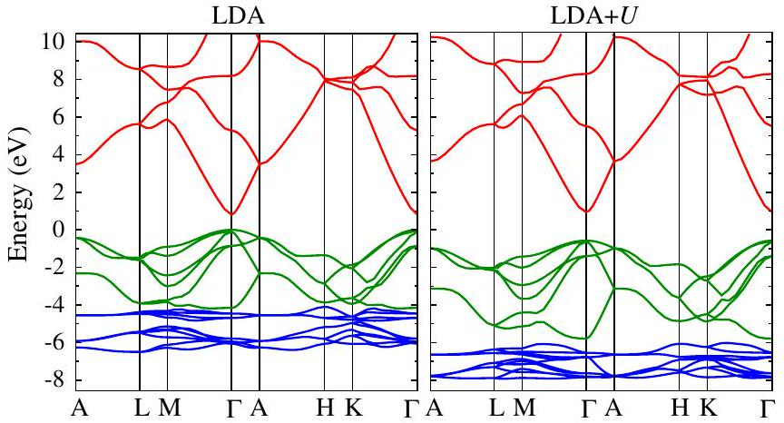
FIG. 14 (color online). Calculated electronic band structures of ZnO using the LDA (left) and the LDA + U (right). The band alignment between LDA and LDA $+U$ was taken into account (see text and Fig. 15). The lowest-energy bands between -6.5 and -4.5 eV in the LDA (-8 and -7 eV in the LDA + $U$ ) are derived from Zn 3d states; the bands between -4.5 and 0 eV in the LDA (-6.0 and -0.7 eV in the $\mathrm{LDA}+U$ ) are derived mostly from $\mathrm{O} 2 p$ states; the bands above 0.8 eV in the LDA (1.5 eV in the $\mathrm{LDA}+U$ ) are conduction-band states, with the lowest conduction-band states derived mostly from Zn $4 s$ states. The character of the bands was determined by projecting a given band on atomic-orbital states centered on the Zn and O atoms.

(Madelung, 1996). The LDA + U [with U = 4.7 eV (Janotti, Segev, and Van de Walle, 2006)] thus provides only a partial correction to the band gap, since it does not account for the inherent band-gap error in the LDA (see Sec. IV.B).

## 3. Band alignment between LDA and LDA + $\boldsymbol{U}$

It is interesting to explore how the $\mathrm{LDA}+U$ affects not just the band gap, but the individual valence- and conduction-band edges. This question cannot be answered by performing bulk calculations alone, since the long-range nature of the Coulomb potential precludes establishing an absolute reference in a calculation for an infinite solid (Kleinman, 1981). The lineup between the band structures in the LDA and LDA $+U$ can be obtained by following a procedure similar to the calculation of band alignments at semiconductor heterojunctions (Van de Walle and Martin, 1987). For the example of ZnO, it is possible to calculate the band lineup at the hypothetical $\mathrm{ZnO}{ }^{\mathrm{LDA}} / \mathrm{ZnO}{ }^{\mathrm{LDA}+U}$ interface, where on one side of the interface ZnO is described by the LDA and on the other side by the LDA + U. In practice this is accomplished by defining two types of Zn atoms in a superlattice, those for which $U$ is applied and those which are described by the standard LDA (Janotti, Segev, and Van de Walle, 2006). The results are shown in Fig. 15.

As expected, the LDA $+U$ lowers the energy of the Zn $d$ states. This weakens the $p-d$ repulsion and lowers the VBM on an absolute energy scale, resulting in a valence-band offset of 0.34 eV between the LDA and $\mathrm{LDA}+U$. The lowering of the VBM results in an increase of the band gap, but the increase in the gap (by 0.71 eV) is significantly larger than the VB offset, indicating that the $\mathrm{LDA}+U$ affects not only the VBM but also the CBM, which is raised by 0.37 eV. The change in the conduction band can be explained as follows: The introduction of $U$ causes the Zn $d$ band to become

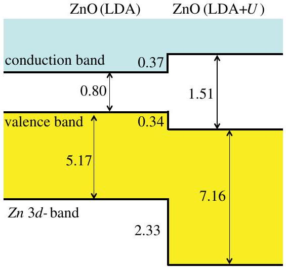
FIG. 15 (color online). Calculated band alignment at a hypothetical $\mathrm{Zn} \mathrm{O}^{\mathrm{LDA}} / \mathrm{Zn} \mathrm{O}^{\mathrm{LDA}+U}$ interface, showing the effects on individual band edges of including the on-site Coulomb interaction $U$ (with a value $U=-4.7 \mathrm{eV}$ ) for $\mathrm{Zn} 3 d$ states. All values are in electron volts.

narrower and the Zn $d$ states to become more localized around the Zn atom. This results in the valence $4 s$ state becoming more effectively screened and thus more delocalized, and therefore its energy increases. Since the states at the CBM are composed mainly of Zn $4 s$ states, an increase in the energy of the CBM is observed.

## 4. Corrected defect transition levels and formation energies based on $\mathrm{LDA}+\boldsymbol{U}$

Different groups followed different procedures for obtaining defect formation energies based on LDA and GGA + U calculations. Persson et al. (2005) used the $\mathrm{LDA}+U$ to calculate the band gap of $\mathrm{CuInSe}_{2}$ and $\mathrm{CuGaSe}_{2}$ and assumed that $\mathrm{LDA}+U$ affects only the position of the VBM through the $p-d$ coupling. In addition, the conduction band was rigidly shifted to bring the band gap in agreement with experiment. Shallow-acceptor levels were shifted with the VBM and shallow-donor levels with the CBM in an a posteriori approach. Formation energies were corrected through the shift of the VBM. While the corrections for shallow levels are intuitive and obvious, the question of whether the treatment of deep levels was correct remains.

Erhart, Albe, and Klein (2006) used the GGA + U for ZnO with a $U$ parameter chosen to reproduce the position of the Zn $d$ bands with respect to the VBM in ZnO. Results for transition levels and formation energies of native defects were interpreted within the calculated band gap in the GGA $+U$ (which was 1.83 eV, still 47\% lower than the experimental value even for the rather large chosen value of $U=7.5 \mathrm{eV}$ ). Erhart, Albe, and Klein (2006) also performed an extrapolation of the transition levels based on GGA and $\mathrm{GGA}+U$ results, as proposed by Janotti and Van de Walle (2005).

Paudel and Lambrecht (2008) studied the oxygen vacancy in ZnO by applying the LDA $+U$ to both Zn $d$ and Zn $s$ states, i.e., LDA + $U_{d}+U_{s}$ with $U_{d}=3.40 \mathrm{eV}$ and $U_{s}=43.54 \mathrm{eV}$. The large value of $U_{s}$ has the effect of pushing the unoccupied Zn- $s$-derived conduction-band states upward, resulting in a band gap of 3.3 eV, close to the experimental value of 3.4 eV. The application of the $\mathrm{LDA}+U$
to such delocalized states lacks justification, in our opinion. The electronic states of the oxygen vacancy are formed from orbitals on the surrounding Zn atoms. These combine into a symmetric $a_{1}$ state and antisymmetric $t_{2}$ states. The $a_{1}$ state lies in the gap, and because it has a significant contribution from Zn states the application of LDA $+U_{d}+U_{s}$ strongly affects its position. The large values of $U_{s}$ used by Paudel and Lambrecht (2008) lead to a downward shift of the defect levels related to the oxygen vacancy, resulting in the ( $2+/ 0$ ) transition very close to the VBM, in contrast to other published results (Janotti and Van de Walle, 2005; Erhart, Albe, and Klein, 2006).

In general, we feel that the application of the $\mathrm{LDA}+U$ to states that are more appropriately described as delocalized or itinerant bands is unwarranted and may lead to spurious results. For instance, applying the $\mathrm{LDA}+U$ to the Ti $d$ states of $\mathrm{TiO}_{2}$ and related materials, or to the $\mathrm{O} p$ states in oxides is not physically justified, since these states clearly lead to extended states in the band structure.

While the LDA $+U$ does not provide a full band-gap correction for reasonable values of $U$, it does contain valuable information on how the defect levels change as the band gap is corrected, i.e., by going from the LDA to the $\mathrm{LDA}+U$. A correction scheme can therefore be devised based on selfconsistent calculations for the same defect in the LDA and LDA $+U$ approaches, and inspection of the change in transition levels with the band gap; an extrapolation of the defect levels to the fully corrected band gap can then be performed to obtain corrected transition levels (Janotti and Van de Walle, 2005, 2007b, 2008; Singh et al., 2008). This extrapolation fits into the schemes discussed in Sec. IV.C, with the advantage that the calculations that produce different band gaps are physically motivated, ensuring that the shifts in defect states that give rise to changes in formation energies reflect the underlying physics of the system [as opposed to choices of the parameter $\lambda$ in Eq. (66) which correspond to purely numerical issues such as the plane-wave cutoff].

The shifts in defect-induced states between the LDA and LDA $+U$ reflect their relative valence- and conduction-band character, and hence an extrapolation to the experimental gap is expected to produce reliable results. The corrected transition levels $\varepsilon\left(q / q^{\prime}\right)$ are determined by

$$
\varepsilon\left(q / q^{\prime}\right)=\varepsilon\left(q / q^{\prime}\right)^{\mathrm{LDA}+U}+\frac{\Delta \varepsilon}{\Delta E_{g}}\left(E_{g}^{\mathrm{expt}}-E_{g}^{\mathrm{LDA}+U}\right)
$$

with

$$
\frac{\Delta \varepsilon}{\Delta E_{g}}=\frac{\varepsilon\left(q / q^{\prime}\right)^{\mathrm{LDA}+U}-\varepsilon\left(q / q^{\prime}\right)^{\mathrm{LDA}}}{E_{g}^{\mathrm{LDA}+U}-E_{g}^{\mathrm{LDA}}},
$$

where $E_{g}^{\mathrm{LDA}}$ and $E_{g}^{\mathrm{LDA}+U}$ are the band gaps given by LDA and $\mathrm{LDA}+U$, and $E_{g}^{\text {expt }}$ is the experimental gap. The coefficient $\Delta \varepsilon / \Delta E_{g}$ is the rate of change in the transition levels with respect to the change in the band gap. In order to correct formation energies, Janotti and Van de Walle (2007b) started from the formation energy for defects that do not have any occupied states in the band gap, calculated consistently within the LDA + U-in contrast to the approach of Persson et al. (2005) and Lany and Zunger $(2007,2008)$. Formation energies of other charge states were obtained by combining the formation energy of this lowest charge state with the extrapolated transition levels from Eq. (69) (referencing everything to the VBM position calculated with the LDA $+U$ ). For defects that have occupied states in the gap for any of the stable charge states, an additional correction was included that takes into account the effect on the formation energy of the shift of the occupied KS states (Janotti and Van de Walle, 2007b).

This extrapolation scheme has been applied to point defects in ZnO (Janotti and Van de Walle, 2007b), InN (Janotti and Van de Walle, 2008), and $\mathrm{SnO}_{2}$ (Singh et al., 2008). Figure 16 shows the results for the case of oxygen vacancy in ZnO and compares them with hybrid-functional calculations from Oba et al. (2008). The physical basis for the correction scheme is that the defect states can in principle be described as a linear combination of host states, as the latter form a complete basis.

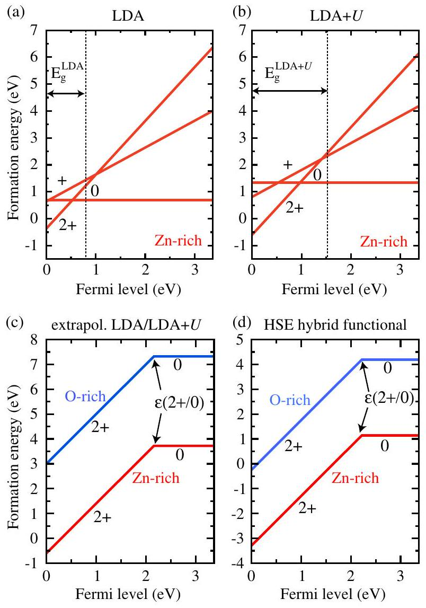
FIG. 16 (color online). Formation energy as a function of Fermi level for an oxygen vacancy $\left(V_{\mathrm{O}}\right)$ in ZnO. Energies according to the (a) LDA and (b) $\mathrm{LDA}+U$ calculations for Zn-rich conditions. The 0, 1+, and 2+ charge states are shown and the calculated band gaps are indicated. (c) Energies according to the LDA and LDA + $U$ extrapolation scheme described in Sec. IV.D. 4 (Janotti and Van de Walle, 2007b). (d) Energies obtained with the HSE hybrid functional described in Sec. IV.G. 1 (Oba et al., 2008). (c), (d) The formation energies for Zn-rich (lower curve) and O-rich conditions (upper curve) are shown for the 0 and 2+ charge states. The position of the $\varepsilon(2+/ 0)$ transition level is indicated in (c) and (d).

A defect state in the gap region will have contributions from both VB and CB states. The shift in transition levels with respect to the host band edges upon band-gap correction reflects the valence-band versus conduction-band character of the defect-induced single-particle states. A comparison of Figs. 16(c) and 16(d) shows that the position of transition states is in good agreement with the hybrid-functional results, and it was shown to also agree with experimental observations (Janotti and Van de Walle, 2005), confirming that the extrapolation scheme is reliable.

Figure 16 also shows, however, that formation energies are much higher in the extrapolated $\mathrm{LDA}+U$ approach than in the hybrid-functional calculations. This discrepancy is largely due to a shift in position of the VBM on an absolute energy scale. In the extrapolation scheme based on the LDA or LDA $+U$ (Janotti and Van de Walle, 2007b), it was assumed that the VBM is well described in the $\mathrm{LDA}+U$. Subsequent hybrid-functional calculations (Lyons, Janotti, and Van de Walle, 2009a) have shown that the VBM shifts down by about 1.7 eV compared to GGA calculations. This effect can be attributed to self-interaction corrections (SICs) to the VB states, which are not included in the $\mathrm{LDA}(\mathrm{GGA})+U$ approach. The VBM thus exhibits an additional downward shift by ~1.4 eV compared to LDA + $U$ results (Fig. 15), and therefore we expect the formation energy of the $V_{\mathrm{O}} 2+$ charge state to be lower by $2 \times 1.4=2.8 \mathrm{eV}$ in the HSE calculations compared to the LDA + $U$-very close to the difference observed in Fig. 16.

## E. Correction schemes based on modification of pseudopotentials

A number of correction schemes have been proposed that aim to capture some of the essential physics of the bandstructure correction. Instead of being self-consistently implemented within the calculations for the solid (which would be difficult or even infeasible), the corrections are included within the pseudopotential. The advantage is that once such pseudopotentials have been constructed, the computational cost is no higher than for a regular LDA or GGA calculation. The disadvantages are the neglect of self-consistency, the absence of a total-energy formalism within some of the schemes, and the ad hoc nature of most of the approaches. Nonetheless, since the computational effort of such schemes is comparable to conventional LDA and GGA calculations, they continue to be used, and they have shown a fair amount of success in explaining or even predicting experimental properties. A brief discussion of the major approaches is included here.

## 1. Self-interaction-corrected pseudopotentials

SICs attempt to correct for the unphysical self-interaction that is present in most DFT functionals (see Sec. IV.B). In finite systems, implementing such corrections is straightforward, but for an extended state in a solid, the correction vanishes since the interaction scales inversely with the size of the region in which the state is localized (Martin, 2008). Thus, in extended systems there is some arbitrariness in the definition of a SIC. A widely cited approach was proposed by Perdew and Zunger (1981), but it is difficult to implement in solids, particularly with a plane-wave basis set. The group of Pollmann developed an approach in which the selfinteraction corrections, along with relaxation corrections, were included in the pseudopotential (Vogel, Krüger, and Pollmann, 1996, 1997). Based on these self-interaction- and relaxation-corrected (SIRC) potentials, defect calculations were carried out for InN (Stampfl et al., 2000), a material which is particularly difficult to describe within the LDA or GGA since the underestimation of the gap leads to a metallic system. The study indicated that the character of the defectinduced states is very similar in SIRC calculations compared to LDA, but conduction-band-related states are shifted to higher energies. Unfortunately, the SIRC approach did not allow for the evaluation of total energies, and therefore the effects of the calculated changes in the band structure on the total energy of the defect could only be estimated, without inclusion of self-consistency.

## 2. Modified pseudopotentials

Pseudopotentials should be transferable and should generate reliable structural and energetic properties. However, this leaves considerable flexibility in the choice of parameters (which has been exploited, for instance, in making potentials "soft," i.e., amenable to the use of relatively small plane-wave basis sets). In particular, the calculated structural properties tend to be insensitive to modifications of the potential close to the nucleus. However, such modifications can have noticeable effects on the band structure, since $s$ states, in particular, are shifted when a repulsive potential is applied close to the nucleus. This concept was exploited by Christensen (1984) to generate a correction to the band gap of GaAs. Although developed in the context of LMTO calculations, the idea can readily be implemented in the pseudopotential approach (Segev, Janotti, and Van de Walle, 2007).

An atom-centered repulsive potential of Gaussian shape is applied at the all-electron stage of the pseudopotential generation, within the LDA and the norm-conserving scheme (Segev, Janotti, and Van de Walle, 2007). This potential acts primarily on the lowest-energy $1 s$ state and affects higherlying states through orthogonality of the wave functions. The potential is adjusted in order to achieve agreement with the experimental band gap. The resulting delocalization of inner atomic states results in decreased screening and hence a more attractive nuclear potential experienced by semicore states such as the $3 d$ and $4 d$, which tend to play an important role in nitride and oxide semiconductors, as discussed in Sec. IV.D. Although not explicitly designed to do so, the modified pseudopotential scheme thus also achieves a correction of the underbinding of these semicore states. It was demonstrated that carefully constructed modified pseudopotentials can produce results for atomic structure and energetics that are as accurate as those of regular pseudopotentials, but also produce band structures (and related properties such as defect levels and surface states) that can be more directly compared with experiment (Segev, Janotti, and Van de Walle, 2007). A similar approach was used by Bruska et al. (2011), but with a numerical atomic orbital basis set.

A related approach was developed by Wang (2001) and Li and Wang (2005) and subsequently applied by Wei and coworkers [see, e.g., Li and Wei (2006)]. The difference is that an existing pseudopotential is used, to which functions of the form $\beta \sin \left(r / r_{c}\right) / r$ (with $\beta$ and $r_{c}$ being adjustable parameters) are added for all angular momentum channels, and with an $r_{c}$ value that is quite large (up to 2.2 Bohr radius). This type of modified pseudopotential is not suitable for self-consistent total-energy calculations, but is employed only in a final step to obtain band structures.

In Sec. IV.G we will return to overcoming the band-gap problem within the framework of DFT, with the implementation of hybrid functionals. First, however, we discuss quasiparticle calculations as a path to correcting the DFT band structure in a first-principles way. The discussion of quasiparticle calculations will also expose the underlying manyparticle physics that is subsequently effectively approximated in hybrid functionals.

## F. Quasiparticle calculations

## 1. Fundamental concepts

The goal of quasiparticle calculations is an accurate prediction of band gaps and defect levels in semiconductors and insulators. To achieve this goal, a different starting point is taken than in conventional DFT. Most quasiparticle calculations are based on Green's function theory, which attempts to determine a two-point propagator, the one-particle Green's function $G\left(\mathbf{x} t, \mathbf{x}^{\prime} t^{\prime}\right)$, describing the propagation of a particle (or hole) from $\mathbf{x} t$ to $\mathbf{x}^{\prime} t^{\prime}$.

Although $G$ is a function of only two arguments, no matter how many electrons are considered, $G$ suffices to evaluate all one-particle operators and the total ground-state energy through the Galitskii-Migdal formula, as well as the quasiparticle excitation spectrum through the Lehmann representation (Fetter and Walecka, 2003). For present purposes, the prediction of the quasiparticle spectrum is the most relevant property. Peaks in the Fourier-transformed $\hat{G}(\omega, \mathbf{k})$ at positive and negative energies are called quasiparticle energies $\epsilon^{\mathrm{QP}}$ and correspond to electron addition and removal energies. They can be compared directly to photoemission and inverse photoemission experiments. As before, the fundamental band gap is described by the energy difference between the electron affinity $A$ (smallest electron addition energy) and the ionization energy $I$ (smallest electron removal energy). For defects, the calculated peaks correspond to transition levels for fixed atomic configurations, i.e., the intersection of the lines $E_{q}\left(\left\{R_{I}\right\}_{q}\right)=E_{q^{\prime}}\left(\left\{R_{I}\right\}_{q}\right)$ in Fig. 5. Since forces are usually not available in quasiparticle calculations, the positions and relaxation energies need to be determined by other methods.

Diagrammatic Green's function theory sounds like an ideal starting point for a powerful computational framework; the drawback, however, is that the determination of $G$ is far from obvious, and it turns out that the equation of motion for the one-particle Green's function $G=G^{(1)}$ itself depends on the two-particle Green's function $G^{(2)}$, which in turn depends on the three-particle Green's function $G^{(3)}$, etc.

Hedin (1965) was the first to explicitly state a closed set of equations for the one-particle Green's function $G\left(\mathbf{x} t, \mathbf{x}^{\prime} t^{\prime}\right)$. The standard derivation of Hedin's equations works by complicated formal functional derivatives, the calculation of which is based on the Gellmann-Low formula (Fetter and Walecka, 2003). The final set of equations is usually written as (Hedin, 1965) [for a concise rederivation see Starke and Kresse (2012)]

$$
G(1,2)=G_{0}(1,2)+\int d(3,4) G_{0}(1,3) \Sigma_{\mathrm{xc}}(3,4) G(4,2)
$$

$$
\Sigma_{\mathrm{xc}}(1,2)=i \hbar \int d(3,4) G(1,4) W(1,3) \Gamma(4,2 ; 3)
$$

$$
P(1,2)=-i \hbar \int d(5,6) G(1,6) G\left(5,1^{+}\right) \Gamma(6,5 ; 2)
$$

$$
W(1,2)=v(1,2)+\int d(3,4) v(1,3) P(3,4) W(4,2),
$$

$$
\begin{aligned}
\Gamma(1,3 ; 2)= & \delta(1,2) \delta(2,3)+i \hbar \int d(5,6,7,8) I(1,5,3,6) \\
& \times G(6,7) G(8,5) \Gamma(7,8 ; 2)
\end{aligned}
$$

where $\Sigma_{\mathrm{xc}}$ is the nonlocal part of the self-energy (the local part being the self-consistent Hartree potential $v_{\mathrm{H}}$ ) and $G_{0}$ is the inverse of the Hartree one-particle Hamiltonian $i \hbar \partial_{t}-\hat{H}_{0}-v_{\mathrm{H}}$,

$$
\left(i \hbar \partial_{t}+\frac{\hbar^{2}}{2 m_{e}} \Delta-v_{\mathrm{ext}}(1)-v_{\mathrm{H}}(1)\right) G_{0}(1,2)=\delta(1,2),
$$

the density in $v_{\mathrm{H}}$ being given by the self-consistent groundstate density $-i \hbar G\left(1,1^{+}\right)=n(1)$. Numbers here refer to combined space-time indices, i.e., $1=\left(\mathbf{r}_{1}, t_{1}\right), 2=\left(\mathbf{r}_{2}, t_{2}\right)$. Spin indices have been dropped, but may be added to the combined space-time indices. Unfortunately, not much has been gained by rewriting the equations in this way, since the irreducible scattering amplitude $I$ corresponds to infinitely many Feynman graphs irreducible in the electron-hole channel (i.e., they cannot be separated into two graphs by simultaneously cutting one forward and backward propagator $G$; the first-order graph $v$ also needs to be excluded). It is important to note that Hedin's equations are in principle exact and the set can even be formally closed by identifying

$$
i \hbar I(1,5,3,6)=\frac{\delta \Sigma_{\mathrm{xc}}(1,3)}{\delta G(5,6)} .
$$

In practice, however, one always needs to make explicit assumptions and simplifications for $I$ in order to solve the coupled system of equations. We will not discuss Hedin's equations in much detail, but rather concentrate on the underlying physics and practical applications. For concise reviews, we refer the interested reader to Aryasetiawan and Gunnarsson (1998) and Bechstedt, Fuchs, and Kresse (2009), as well as standard textbooks (Giuliani and Vignale, 2005).

## 2. Practical approximations

Two approximations need to be considered when Hedin's equations are solved in practice. (i) First, one desires to solve the set of equations fully self-consistently, i.e., starting with some initial guess for the interacting one-particle Green's function $G$, and repeating the calculation of each quantity dependent on $G$ until $G$ does not change. (ii) Second, one needs to make a specific choice for $I$ in order to explicitly close the system of equations.

In practice, none of the publicly available computer codes allow for a fully self-consistent solution (although some limited self-consistency is discussed below). The reasons are technical; in particular, the one-particle Green's function $G(1,2)$ depends on two spatial arguments $\mathbf{r}_{1}$ and $\mathbf{r}_{2}$, as well as the time difference $t_{1}-t_{2}$. The accurate discretization in time is challenging and has been addressed by only a few (Ku and Eguiluz, 2002). Virtually all implementations instead limit the Green's function $G$ to a "noninteracting" form

$$
G(\omega)=\sum_{i} \frac{\left|\varphi_{i}\right\rangle\left\langle\varphi_{i}\right|}{\omega-\epsilon_{i}^{\mathrm{QP}}+i \eta \operatorname{sgn}\left(\epsilon_{i}^{\mathrm{QP}}-E_{F}\right)},
$$

where $\eta$ is a positive infinitesimal, $E_{F}$ is the Fermi energy, and most crucially the orbitals $\varphi_{i}$ are normalized eigenfunctions of some Hermitian one-particle Hamiltonian $H\left|\varphi_{i}\right\rangle=\epsilon_{i}\left|\varphi_{i}\right\rangle$. This simplification has the advantage that the QP energies $\epsilon_{i}^{\mathrm{QP}}$ can be readily identified as poles of the Green's function, and the band gap is simply given as the energy difference between the energy of the lowest unoccupied and highest occupied quasiparticle.

As originally suggested by Hybertsen and Louie (1986), the Hamiltonian $H$ is usually the KS Hamiltonian specified in Eq. (60), although hybrid functionals or Hartree-Fock orbitals have been applied as well (Fuchs et al., 2007). Furthermore, and consistent with the restriction to noninteracting Green's functions, the first equation of Hedin (71) is replaced by the much simpler relation (Hybertsen and Louie, 1986)

$$
\epsilon_{i}^{\mathrm{QP}}=\operatorname{Re}\left[\left\langle\varphi_{i}\right| T+v_{\mathrm{ext}}+v_{\mathrm{H}}+\Sigma_{\mathrm{xc}}\left(\epsilon_{i}^{\mathrm{QP}}\right)\left|\varphi_{i}\right\rangle\right] .
$$

Since the self-energy $\Sigma_{\mathrm{xc}}(\omega)$ is energy dependent, Eq. (78) needs to be solved iteratively for $\epsilon_{i}^{\mathrm{QP}}$, for instance, by a Newton root-finding algorithm (Hybertsen and Louie, 1986; Shishkin and Kresse, 2007) starting from the KS eigenvalues $\epsilon_{i}^{\text {KS }}$ [Eq. (60)]. The approximation Eq. (78) assumes that the orbitals in the Green's function $G$ remain identical to the original DFT orbitals, and only the quasiparticle energies in the Green's function $G$, occurring in the denominator of Eq. (77), are updated.

The second point to be addressed consists of the approximations for the irreducible scattering amplitude $I$. In most cases, the system of equations is closed using the approximation $I(1,5,3,6)=0$ which implies that the vertex $\Gamma(1,3 ; 2)$ [Eq. (75)] is identical to $\delta(1,2) \delta(2,3)$. As shown below, this implies that all interactions between particles and holes are neglected. This approximation can be justified only a posteriori by comparison of the final results with experiment, and there are many cases, for instance, strongly correlated metals, where one expects this approximation to be inadequate. Still, overwhelming evidence has accumulated that the neglect of the vertex is an excellent approximation for semiconductors and insulators if DFT orbitals are used (see below).

For pedagogical reasons, we recapitulate the particularly simple case $P(1,2)=0$ corresponding to the approximation $W(1,2)=v(1,2)$ [see Eq. (74)]. With this replacement, the self-energy operator becomes exactly identical to the Fock exchange operator [Eq. (72)]:

$$
\Sigma_{\mathrm{x}}(1,2)=i \hbar G(1,2) v\left(1,2^{+}\right)=v_{\mathrm{x}}\left(\mathbf{r}_{1}, \mathbf{r}_{2}\right) \delta\left(t_{1}-t_{2}\right),
$$

and Eq. (78) [with the help of Eq. (61)] simplifies to

$$
\epsilon_{i}^{\mathrm{EXX}}=\left\langle\varphi_{i}\right| T+v_{\mathrm{ext}}+v_{\mathrm{H}}+v_{\mathrm{x}}\left|\varphi_{i}\right\rangle,
$$

where the only difference from the Hartree-Fock case is the evaluation of the Hartree potential $v_{\mathrm{H}}$ and exchange operator $v_{\mathrm{x}}$ using the orbitals in the Green's function. Furthermore, if the Green's function is updated using Eq. (71), the exact Hartree-Fock Green's function is obtained (Fetter and Walecka, 2003). In the simplest case, Hedin's equations therefore recover the well-known self-consistent Hartree-Fock equations, and one might well term this approximation $G v$ [compare Eq. (79)].

The commonly applied $G W$ approximation takes this one step further and approximates the irreducible polarizability $P$ by the simplest possible approximation, the independentparticle approximation. In this case, the bare Coulomb operator in Eq. (79) is replaced by the screened potential $W$ obtained from the third and fourth Hedin equations [Eqs. (73) and (74)]:

$$
\begin{aligned}
P(1,2) & =-i \hbar G(1,2) G(2,1), \\
W(1,2) & =v(1,2)+\int \mathrm{d}(3,4) v(1,3) P(3,4) W(4,2),
\end{aligned}
$$

and the self-energy becomes

$$
\Sigma_{x c}(1,2)=i \hbar G(1,2) W\left(1,2^{+}\right) .
$$

Interpreting each object as a matrix, we can equally well write $W$ as

$$
W=v+v P W=v+v P v+v P v P v+\cdots .
$$

On the right-hand side, we have repeatedly inserted $W$ (cf. Fig. 17). The physics underlying this approximation is that the exchange interaction is screened by the other electrons acting as an effective medium: bare exchange is screened by correlation effects resulting in an effective screened exchange. This insight is at the core of Hedin's GW approximation but applies to any level of theory and sophistication [cf. Eq. (72)].

The approximation underlying the $G W$ approach assumes the simplest physically plausible form for the irreducible polarizability $P$, the independent-particle approximation. For a Green's function of the noninteracting form Eq. (77), the corresponding independent-particle polarizability reduces to the well-known form (Adler, 1962, Aryasetiawan and Gunnarsson, 1998, Chang, Rohlfing, and Louie, 2000, and Onida, Reining, and Rubio, 2002):

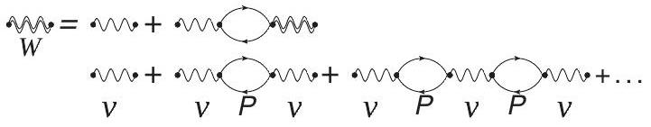
FIG. 17. Feynman diagrams for the screened interaction $W$ in the random phase approximation. In the random phase approximation, an "incoming" field $v$ can create a particle-hole pair which annihilates $(P)$ creating a new field $v$. As a response to this induced field, another particle-hole pair can be created corresponding to the third term, and this process continues ad infinitum. The closed particle-hole diagrams are usually termed "bubble" diagrams; they are summed up to infinity.

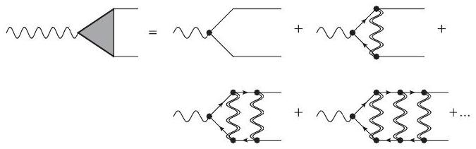
FIG. 18. Selected Feynman diagrams for the vertex connecting a Coulomb line with two propagators (vertex $\Gamma$ ). The diagrams shown are the particle-hole ladder diagrams and correspond to the diagrams typically used in the Bethe-Salpeter equation for the calculation of optical properties (Albrecht et al., 1998; Rohlfing and Louie, 1998). This is the simplest possible vertex correction and it describes the electrostatic interactions between particles and holes.

$$
\begin{aligned}
P\left(\mathbf{r}_{1}, \mathbf{r}_{2}, \omega\right)= & \frac{2}{\Omega} \sum_{n n^{\prime}}\left(f_{n^{\prime}}-f_{n}\right) \\
& \times \frac{\varphi_{n^{\prime}}^{*}\left(\mathbf{r}_{1}\right) \varphi_{n}\left(\mathbf{r}_{1}\right) \varphi_{n}^{*}\left(\mathbf{r}_{2}\right) \varphi_{n^{\prime}}\left(\mathbf{r}_{2}\right)}{\omega+\epsilon_{n^{\prime}}^{\mathrm{QP}}-\epsilon_{n}^{\mathrm{QP}}+i \eta \operatorname{sgn}\left[\epsilon_{n^{\prime}}-\epsilon_{n}\right]},
\end{aligned}
$$

which can be interpreted as the creation of a particle-hole pair at position $\mathbf{r}_{1}$ and annihilation of the pair at position $\mathbf{r}_{2}$. However, there are infinitely many other Feynman diagrams for the irreducible polarizability that are not accounted for by this approximation. The vertex [Eq. (75)] in Hedin's equations accounts in principle precisely for these missing diagrams. Its intent is to sum all $v$ irreducible Feynman diagrams between one Coulomb line $v$ and two propagators, where $v$ irreducible means that the Feynman graphs cannot be divided into two distinct graphs by cutting a single Coulomb line. A number of possible Feynman diagrams are summarized in Fig. 18. Again one has to keep in mind that the $G W$ approximation neglects all but the first term describing the direct creation of a noninteracting (independent) electron-hole pair from the ground state.

## 3. Self-consistency and vertex corrections

If local or semilocal functionals are chosen as a starting point, then (and only then) the neglect of vertex corrections $\Gamma$ seems to be an excellent approximation. This is most likely related to the underestimation of the band gap for semilocal functionals being well balanced against the neglected diagrams. The accuracy of this approach has been repeatedly demonstrated for a wide variety of systems (Aryasetiawan and Gunnarsson, 1998; Bechstedt, Fuchs, and Kresse, 2009). However, data consistently obtained with a single code and similar convergence are difficult to find in the literature.

In Fig. 19 we show results for two different approximations that are often termed $G_{0} W_{0}$ and $G W_{0}$ (Shishkin and Kresse, 2007). In the first case ( $G_{0} W_{0}$ ), the polarizability in Eq. (83) and the Green's function in Eq. (77) are calculated using DFT eigenvalues $\left(\epsilon^{\mathrm{QP}} \rightarrow \epsilon^{\mathrm{DFT}}\right) . W$ and $\Sigma_{\mathrm{xc}}$ are calculated using Eqs. (81) and (82), and Eq. (78) is solved once. In the second case $\left(G W_{0}\right)$, the one-electron energies in the Green's function are then updated in Eq. (77), $\Sigma_{\mathrm{xc}}$ is recalculated using Eq. (81), and Eq. (78) is solved again. This procedure is repeated until self-consistency in the quasiparticle energies is achieved. However, in $G W_{0}$ the original DFT eigenvalues are kept fixed in the calculation of the polarizability equation (83). The incentive to do this is based on the observation that the DFT and RPA polarizabilites seem to account well for the overall screening properties of the system (Weissker et al., 2006; Shishkin, Marsman, and Kresse, 2007). The initial oneelectron energies are, however, quite far from the experimental values, and the quasiparticle energies converge toward a stable value only after three to four iterations.

Overall, Fig. 19 clearly demonstrates that $G_{0} W_{0}$ and, in particular, $G W_{0}$ are accurate approximations for the prediction of band gaps. From a practitioner's point of view, these two fairly efficient approximations are currently the approaches of choice for the modeling of defect levels.

Van Schilfgaarde and co-workers proposed a modified $G W$ version, called the self-consistent quasiparticle $G W(\mathrm{scQP} G W)$ approximation (Faleev, van Schilfgaarde, and Kotani, 2004; van Schilfgaarde, Kotani, and Faleev, 2006). The approach replaces Eqs. (71)-(75) by the diagonalization of a Hermitian Hamiltonian

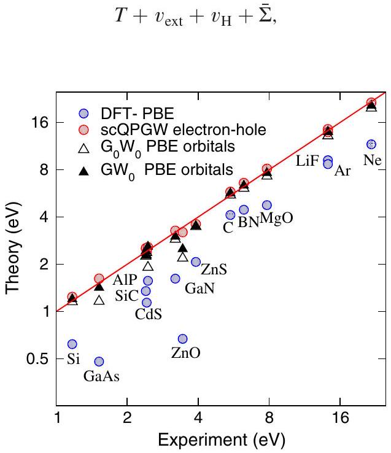
FIG. 19 (color online). Results for $G_{0} W_{0}$ and $G W_{0}$ and selfconsistent quasiparticle $G W$ (scQPGW) band gaps, along with results using the semilocal Perdew-Burke-Ernzerhof (PBE) functional (Shishkin and Kresse, 2007). Lattice constants are from low-temperature experiments, where available. Note the double logarithmic scale.

where the approximate Hermitian self-energy $\bar{\Sigma}$ is defined as

$$
\bar{\Sigma}=\operatorname{Herm} \sum_{i j}\left|\varphi_{i}\right\rangle\left\langle\varphi_{i}\right| \frac{\Sigma_{\mathrm{xc}}^{\dagger}\left(\epsilon_{i}^{\mathrm{QP}}\right)+\Sigma_{\mathrm{xc}}\left(\epsilon_{j}^{\mathrm{QP}}\right)}{2}\left|\varphi_{j}\right\rangle\left\langle\varphi_{j}\right|
$$

with the quasiparticle energies calculated using Eq. (78). The orbitals obtained by diagonalization are then used in the same way as DFT orbitals, the Green's function maintains its simple noninteracting form Eq. (77), and all quantities in Hedin's equations are updated until self-consistency is reached. Alternatives using a static screened exchange and Coulomb hole approximation have been suggested as well (Bruneval, Vast, and Reining, 2006).

This "bootstrap" procedure is found to yield results that are independent of the starting orbitals, but the method is fairly expensive and so far limited to unit cells with a few atoms. A second problem is that the predicted screening properties, such as the static dielectric constants, are significantly in error when this procedure is used (van Schilfgaarde, Kotani, and Faleev, 2006; Shishkin, Marsman, and Kresse, 2007), with the static electronic screening typically underestimated by 30\% and related band-gap overestimations of about 10\%.

To repair this deficiency, vertex corrections should be included in the self-consistency procedure (Bruneval et al., 2005). In particular, the inclusion of the electron-hole ladder diagrams shown schematically in Fig. 18 brings the dielectric properties back into excellent agreement with experiment. This correction also yields band gaps within a few percent of the experimental values as shown in Fig. 19 (Shishkin, Marsman, and Kresse, 2007). The same electron-hole ladder diagrams are usually included when optical properties are calculated using the Bethe-Salpeter equation (Albrecht et al., 1998; Rohlfing and Louie, 1998), and neglecting these diagrams results in optical spectra that are blueshifted and lack any excitonic features, related to the "too weak" screening mentioned above.

These observations suggest that the calculation of the polarizability from a Green's function with realistic quasiparticle energies is accurate only if vertex corrections are included. Unfortunately, the inclusion of vertex corrections is very demanding and scales as $N^{5}-N^{6}$ with system size $N$, so that this procedure is currently not suitable for large-scale applications. We note that the scQPGW method (without vertex corrections) was used to calculate band alignments across the silicon/silica interface, but results were found to be in worse agreement with experiment than for the standard, more routine $G_{0} W_{0}$ approximation (Shaltaf et al., 2008). The inaccurate band alignment was most likely a result of the incorrect screening properties typical for scQPGW calculations without vertex corrections, ultimately leading to inaccurate dipoles across the interface. Similar problems are expected to occur for defect levels. We conclude that until an efficient means to correct for the screening error is identified, results of scQPGW calculations should be regarded with caution.

## 4. Constraints and limitations

The most severe limitation of the $G W$ method is that the approach is currently limited to the calculation of QP energies, i.e., electron addition and electron removal energies for fixed geometries.

Total energies can be calculated using the related random phase approximation to the correlation energy (Nozières and Pines, 1958; Langreth and Perdew, 1977), which has recently gained significant attention among quantum chemists (Furche, 2008; Eshuis and Furche, 2011) as well as solid-state physicists (Harl and Kresse, 2009; Ren et al., 2011). While this is clearly a promising approach, it has not yet been explored for defect calculations.

Accurate electron addition and electron removal energies are, however, needed to make quantitative predictions of defect levels. DFT with the standard semilocal functionals is particularly unreliable for predicting electron addition and removal energies, whereas lattice relaxations and relaxation energies are usually accurately predicted using these functionals. Figure 5 suggests a procedure to combine both approaches (Rinke et al., 2009). The electron addition energies at fixed geometries $\left\{R_{I}\right\}_{q}$ and $\left\{R_{I}\right\}_{q^{\prime}}$ are calculated using the $G_{0} W_{0}$ approximation, whereas the relaxation energies are determined by DFT. Comparison with Fig. 5 suggests that this yields more information than required, allowing for straightforward cross-checks. For instance, in principle one can start from different charge states of the defect by adding or removing electrons from the defect states in the band gap, and combining with LDA or GGA lattice relaxation energies, obtain the values for transition levels by at least two different paths.

Rinke et al. (2009) applied this approach to calculations of self-interstitial defects in Si. They found results that were significantly improved over those obtained with semilocal functionals, with formation energies in good agreement with diffusion Monte Carlo calculations (Leung et al., 1999; Leung and Needs, 2003; Batista et al., 2006) and transition levels close to experimental values.

The main drawback of the approach is that in some cases DFT might not yield a correct "zeroth-order" description of the defect level. For instance, DFT may place the defect level above the CBM or below the VBM (Janotti et al., 2010), while the true quasiparticle level is located in the gap. In such cases, the perturbative $G_{0} W_{0}$ approach is unreliable, as the oneelectron orbitals are much too delocalized. scQPGW calculations might be a solution to this problem, but the caveats of this method have been noted above. Related problems may be encountered for polarons, which are characterized by a strong coupling of the lattice degrees of freedom to the electronic degrees of freedom (Franchini, Kresse, and Podloucky, 2009). If the applied density functional underestimates the degree of charge localization, the polaronic lattice distortions will be too weak or they will not occur at all. In summary, whenever local and semilocal functionals severely underestimate the localization of the defect charge, the a posteriori application of $G_{0} W_{0}$ or $G W_{0}$ corrections may be unreliable.

Ideally, one needs a method that yields a realistic band-gap description as well as reliable energetics and forces from the outset. This is one reason why hybrid functionals, described in Sec. IV.G, may be preferable for many modeling situations, although admittedly at the expense of a less rigorous description of the electronic many-body problem than can be achieved in quasiparticle calculations.

## G. Hybrid functionals

## 1. Screened exchange

The concept of screened exchange is a natural ingredient emerging from the $G W$ approximation. To illustrate this, Fig. 20 shows the diagonal part of the electronic contributions to the dielectric function $\varepsilon^{-1}(g, \omega=0)$ versus the reciprocal lattice vector $g$. This quantity is related to $W$ in the $G W$ approach through

$$
W^{\text {static }}(\mathbf{g}, \mathbf{g})=\frac{4 \pi e^{2}}{|\mathbf{g}|^{2}} \varepsilon^{-1}(|\mathbf{g}|, \omega=0),
$$

where $W^{\text {static }}$ is the screened potential at zero frequency $\omega=0$, and $4 \pi e^{2} /|\mathbf{g}|^{2}$ is the bare Coulomb kernel. Obviously, $\varepsilon^{-1}(g)$ describes to what extent the nonlocal Hartree-Fock exchange prevails in the actual $G W$ calculation. If the inverse dielectric function is 1, the nonlocal exchange is not screened, and one recovers the Hartree-Fock description, as happens for large $g$. On the other hand, if $\varepsilon^{-1}(g)$ is small, most of the nonlocal exchange is screened by the other electrons. In GaAs and MgO the experimental dielectric constants are 11.1 and 3.0, respectively, i.e., $\varepsilon^{-1}$ is equal to 0.09 and 0.33, values that are well reproduced by the DFT RPA screening at small wave vectors $g$.

This raises the question of whether it is actually necessary to perform full GW calculations, or whether a description using a static screened exchange would suffice for a correct description of the band gap. Such an approximation was already suggested by Hedin (1965) in his seminal work by combining static screened exchange with a suitable local potential that models the Coulomb hole (COH) around an electron. The only required ingredient is then a model for the dielectric function $\varepsilon^{-1}(g)$. In fact, until 2000, it was common practice to perform $G W$ calculations using either frequencydependent models for $\varepsilon^{-1}(g, \omega)$ (Surh, Louie, and Cohen, 1991; Zhu and Louie, 1991; Zakharov et al., 1994) or static models for the dielectric function combined with local models for the COH (Bechstedt et al., 1992). The results of these calculations are often on par with, if not better than, full

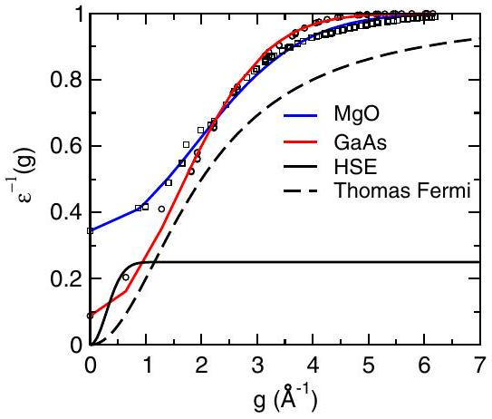
FIG. 20 (color online). Diagonal part of the electronic contribution to the inverse of the macroscopic dielectric function vs wave vector $g$. DFT RPA screening results for magnesia (MgO) (circles) and GaAs (squares) are shown. The lines are fits to the calculated data. Thomas-Fermi screening for GaAs (broken line) and the hybrid functional HSE (full line) are shown as well.

If one aims at an accurate prediction of total energies (and not quasiparticle energies) then the screened exchange needs to be supplemented by a suitable density functional that, in the spirit of DFT (Hohenberg and Kohn, 1964; Kohn and Sham, 1965), restores the total energy of the homogeneous electron gas. The idea was first adopted by Bylander and Kleinman (1990), who suggested the use of a Thomas-Fermi model for the dielectric function,

$$
\varepsilon^{-1}(g)=\frac{\left|g^{2}\right|}{|g|^{2}+\left|k_{\mathrm{TF}}\right|^{2}},
$$

where $k_{\mathrm{TF}}$ is the Thomas-Fermi wave vector. Suitable approximations for the local exchange can be constructed (Bylander and Kleinman, 1990), and for the correlation energy the usual local parametrization may be chosen. Figure 20 includes the corresponding screening for $k_{\mathrm{TF}}=2.0 \AA^{-1}$, which corresponds roughly to the density of valence electrons in GaAs. Since Thomas-Fermi screening models the screening in metals, screening is infinite at small wave vectors and approaches 1 at large wave vectors.

The main drawback of this approach is that total energies are hardly improved over the LDA values (Lee et al., 2007), and improvements for the lattice constants are not very systematic either (Clark and Robertson, 2010). This is possibly related to the lack of suitable gradient corrections for the correlation, but it is more likely that the error cancellation that occurs for exchange and correlation in purely semilocal functionals is more difficult to achieve if full exchange is applied at short distances (large wave vectors). For instance, it is well known that the combination of full nonlocal Hartree-Fock exchange with local correlation functionals yields unsatisfactory energetics (Becke, 1993b). The second problem is that the ThomasFermi wave vector is, in principle, system dependent, and it remains unclear how to perform calculations for interfaces between materials with very different screening properties. Likewise, relative energies between atoms and solids, which possess very different screening properties, are in principle not accessible in this method. While some interesting results for defects have been reported (Clark et al., 2010) more expertise needs to be acquired on how to deal with these problems before this approach can be routinely applied.

## 2. Hybrid functionals: Historical overview

Hybrid functionals were originally suggested by Becke (1993b), who based his arguments for the inclusion of nonlocal exchange on the adiabatic connection fluctuationdissipation theorem (Langreth and Perdew, 1977). The theorem suggests that in the limit of a weak Coulomb coupling between the electrons, the Hartree-Fock theory should be a good approximation, whereas in the limit of strong coupling DFT is adequate. With this consideration in mind, Becke suggested combining one-half of the Hartree-Fock exchange with one-half of the DFT exchange (Becke, 1993b), and complementing this with semilocal correlation functionals, or compactly

$$
E_{\mathrm{xc}}^{\text {hybrid }}=E_{\mathrm{xc}}^{\mathrm{DFT}}[n]+\alpha\left(E_{\mathrm{x}}^{\text {nonlocal }}-E_{\mathrm{x}}^{\mathrm{DFT}}[n]\right),
$$

with $\alpha=0.5$. Becke later introduced a more flexible form that combines exact exchange and local and gradient-corrected exchange and correlation in a form that is parametrized using three parameters (Becke, 1993a). This, or rather a slightly modified version implemented in the Gaussian program suite, became the popular B3LYP functional, which has dominated calculations in quantum chemistry over the past two decades. The B3LYP functional admixes only 20\% of the exact HF exchange with DFT exchange $(\alpha=0.2)$, which was empirically found to be an optimal choice for thermochemistry. Because of the lack of efficient implementations, hybrid functionals have hardly been applied to solid-state systems. This changed only around 2005-2010, when nonlocal exchange became available in all major program packages for solids.

Muscat, Wander, and Harrison (2001) were the first to demonstrate that band gaps in solids are dramatically improved using the B3LYP functional. But since the B3LYP functional does not reproduce the correct exchange correlation energy for the free-electron gas, it is of limited use for periodic systems. Errors are particularly large for metals and heavier elements, beyond the $3 d$ transition metal series (Paier, Marsman, and Kresse, 2007) and "nonempirical" functionals based on the popular semilocal Perdew-Burke-Ernzerhof functional (Perdew, Burke, and Ernzerhof, 1997) are more appropriate for solid-state applications. The PBEh hybrid functional was initially evaluated for small molecules, and the performance was found to be only slightly worse than for the B3LYP functional explicitly fitted to this database (Adamo and Barone, 1999; Ernzerhof and Scuseria, 1999; Paier et al., 2005).

Further widespread application in solids was hindered by the numerical difficulties in calculating the long-range part of the exchange integrals and exchange potential, leading to slow convergence with the number of k points in metals (Paier et al., 2006). Heyd, Scuseria, and Ernzerhof solved this issue by truncating the long-range part of the Coulomb kernel in the exchange, i.e., by replacing the exact exchange by a screened version (Heyd, Scuseria, and Ernzerhof, 2003, 2006):

$$
v_{\mathrm{sx}}\left(\mathbf{r}, \mathbf{r}^{\prime}\right)=-e^{2} \sum_{j} f_{j} \varphi_{j}(\mathbf{r}) \varphi_{j}^{*}\left(\mathbf{r}^{\prime}\right) \frac{\operatorname{erfc}\left(\mu\left|\mathbf{r}-\mathbf{r}^{\prime}\right|\right)}{\left|\mathbf{r}-\mathbf{r}^{\prime}\right|} .
$$

The optimal choice for $\mu$ is found to be about $\mu=0.11$ a.u. $\left(\mu \approx 0.2 \AA^{-1}\right)$ (Krukau et al., 2006), and the mixing parameter $\alpha$ is set to $\alpha=1 / 4$. This functional is now usually referred to as HSE06. Comparison with Eq. (85) then suggests that this choice of $\alpha$ corresponds to a model screening

$$
\varepsilon^{-1}(g)=\frac{1}{4}\left(1-e^{-|g|^{2} / 4 \mu^{2}}\right),
$$

which is also included in Fig. 20. A fairly extensive review of applications of the HSE06 functional can be found in Janesko, Henderson, and Scuseria (2009) and Henderson, Paier, and Scuseria (2011).

## 3. The incentive to use hybrid functionals and 1/4 of the exact exchange

Now we address the important question of the choice of $\alpha=1 / 4$, and why the truncation of the Coulomb kernel at long range is a sensible choice for solids, although this choice does not recover the correct amount of nonlocal exchange at any wave vector (see Fig. 20). From the outset, we emphasize that this choice is not serving all needs, but it works remarkably well for a broad class of systems and a broad class of properties, such as thermochemical quantities, band gaps, and optical properties.

Fitting the parameter $\alpha$ to thermochemistry data for small molecules yields values that are consistently around 0.2-0.25 for gradient-corrected functionals (Becke, 1993a; Krukau et al., 2006). Furthermore, relying on the adiabatic connection fluctuation-dissipation theorem, Perdew, Ernzerhof, and Burke (1996) found strong support for using $\alpha=1 / 4$ for global hybrid functionals. It is also clear from Sec. IV.B. 1 that admixing Hartree-Fock and semilocal functionals will improve the straight-line behavior even though, as shown in Fig. 13, the straight-line behavior is not exactly restored for HSE06. In summary, empirical evidence accumulated over the years indicates that 1/4 of the exact exchange works well for thermochemistry and band gaps, but it is also established that the optimal amount of exchange may vary from system to system.

We now comment in more detail on the band-gap issue and the truncation of the Coulomb kernel at long distances. The HSE functional uses zero exact exchange at short wave vector $g$ (large distances), which is inappropriate for insulators. We first demonstrate that this removal of exact exchange at large distances influences the results only little in semiconductors and insulators. To this end, we evaluate the exchange energy using Wannier functions $w_{n}$ instead of Bloch orbitals:

$$
-\frac{e^{2}}{2} \sum_{n m} \int d^{3} r d^{3} r^{\prime} \frac{w_{m}^{*}(\mathbf{r}) w_{n}(\mathbf{r}) w_{n}^{*}\left(\mathbf{r}^{\prime}\right) w_{m}\left(\mathbf{r}^{\prime}\right)}{\left|\mathbf{r}-\mathbf{r}^{\prime}\right|} .
$$

The exchange integral yields a finite contribution if the Wannier orbitals $n$ and $m$ exhibit an overlap and are located at nearby lattice sites [otherwise $w_{m}^{*}(\mathbf{r}) w_{n}(\mathbf{r})=0, \forall \mathbf{r}$ ]. This implies that the long-range part of the exchange is not relevant in large-gap insulators, where the Wannier functions are strongly localized. In metals, on the other hand, the removal of the long-range part at large distances is correct. The only case where the HSE06 functional yields a qualitatively incorrect behavior is in vacuum, where other electrons are not available to screen the exchange and one would, in principle, like to preserve the exact Hartree-Fock exchange. Note that a correct description of the long-range decay of the potential into the vacuum is not achieved with any semilocal functional, but fortunately this is of little relevance for the modeling of defects. In summary, cutting of the long-range part of the exchange is a well-balanced approximation in extended systems.

The cutoff at short wave vectors has another decisive beneficial side effect. In systems with heavier elements and larger lattice spacings, the orbitals will sample the exchange interaction at larger $r$ and smaller wave vectors $g$, since the

Wannier functions become less localized. In the HSE06 functional, the amount of nonlocal exchange will hence decrease with increasing interatomic distances within a group of materials, e.g., C, Si, Ge, and Sn. In the GW method, the amount of nonlocal exchange will decrease as well within a group, since screening becomes more effective for heavier atoms. Although the HSE06 functional cannot describe the change in the screening properties properly, it mimics this effect remarkably well by reducing the nonlocal exchange at larger distances. As a result, HSE06 is remarkably accurate in predicting relative band gaps within a group (Hummer, Harl, and Kresse, 2009). In summary, it does not seem to matter much at which wave vector nonlocal exchange is placed; what rather matters is that the average amount of nonlocal exchange is well represented, so that one-center and two-center integrals are well approximated [see Eq. (88)].

With these arguments in mind, it is also obvious that 1/4 of the exact exchange is not sufficient to describe wide-band-gap materials such as MgO (see Fig. 21). This can be easily explained by considering the screening in MgO (see Fig. 20): in MgO at any wavelength the amount of nonlocal exchange exceeds $1 / 4$, with the minimum value given by the inverse of the dielectric constant $1 / \varepsilon^{\infty}$. This explains why the HSE06 band gaps are not very accurate for weakly screening materials, including ZnO, MgO, LiF, Ar, and Ne. A remarkably simple way to improve the band gaps is to set the parameters in the HSE functional to $\mu=0.5 ~ \AA^{-1}$ and $\alpha=0.6$, i.e., increasing the amount of nonlocal exchange to 0.6 at long wave vectors, and making the increase to that value much slower. Although these settings significantly improve the band gaps across the series, as shown in Fig. 21, the thermochemistry results for this functional are worse than those using the conventional HSE functional.

Overall, if thermochemistry and band gaps are important, the HSE06 functional seems to be the best overall choice. We suggest using the functional as is, without further adjustment of parameters, since this will increase the available database

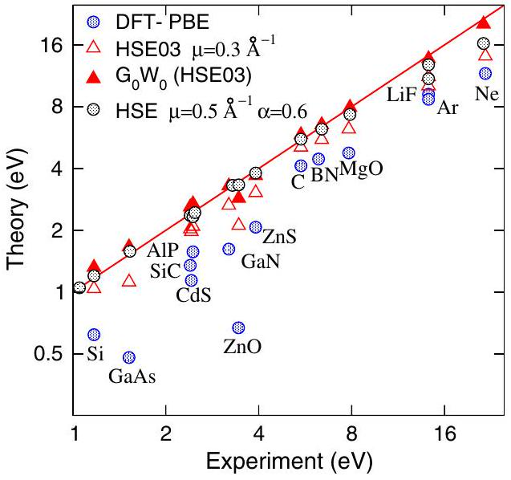
FIG. 21 (color online). Band gaps for the HSE03 (Heyd, Scuseria, and Ernzerhof, 2003) and for a modified HSE functional with $\mu=0.5 \AA^{-1}$ and $\alpha=0.6$. The latter yields consistently improved band gaps. Also shown are the band gaps for $G_{0} W_{0}$ calculations using HSE03 orbitals and one-electron energies. Note the double logarithmic scale.

Since the HSE06 functional does not restore the proper straight-line behavior (see Fig. 13), the transition levels even at fixed positions must be calculated as for conventional KS functionals by adding and removing electrons and taking total energy differences (see Sec. II.D). For extended Bloch states, however, specifically conduction- and valence-band edges, the generalized KS eigenvalues can be used and directly compared to experiment.

Finally, we point out that $G_{0} W_{0}$ calculations based on the HSE06 functional yield very good band gaps lying only slightly above the experimental values (Fuchs et al., 2007). The overestimation of the band gap is related to the random phase approximation which, combined with HSE06 oneelectron energies and orbitals, yields underestimated dielectric constants. In principle, this can be fixed by including vertex corrections in the calculation of the dielectric screening properties, but since this increases the computational demand significantly it is usually not practical (Paier, Marsman, and Kresse, 2008). In summary, although slightly overestimated band gaps must be expected, a $G_{0} W_{0}$ calculation on top of the HSE06 functional is an efficient approach to double-check band gaps and the position of defect levels (Stroppa, Kresse, and Continenza, 2011).

## 4. Performance of hybrid functionals

A number of systematic assessments of the performance of hybrid functionals in studies of point defects have appeared in the literature. These include comparisons between DFT calculations performed with different functionals, as well as cases for which reliable experimental results are available and thus serve as benchmarks. Examples of the latter include the self-interstitial in Si (Batista et al., 2006), the NV center in diamond (Deák et al., 2010), and the As antisite defect in GaAs (Komsa and Pasquarello, 2011). For the self-interstitial in Si the formation energies of different configurations calculated with HSE06 were found to be in good agreement with quantum Monte Carlo calculations (Batista et al., 2006) as well as with experiment (Bracht, Haller, and Clark-Phelps, 1998). For the $\mathrm{NV}^{-}$center in diamond, the excitation energy calculated with HSE06 for the ${ }^{3} A_{2} \rightarrow{ }^{3} E$ transition is 2.21 eV (Deák et al., 2010), compared to an experimental value of 2.18 eV (Davies and Hamer, 1976). For the As antisite in GaAs, Komsa and Pasquarello (2011) performed a comparison of different hybrid functionals and found the calculated $(+2 /+1)$ and $(+1 / 0)$ transition levels to be within 0.2 eV of the experimental values (Blakemore, 1982), the agreement being better for functionals that give band gaps closer to the experimental value. Systematic comparisons between different hybrid functionals (corresponding to different HartreeFock mixing or screening-length parameters) were also performed for defects in oxides by Ágoston et al. (2009) and by Alkauskas and Pasquarello (2011).

## H. Quantum Monte Carlo calculations

Until now our focus has been on strategies to improve the quality of density functional calculations. Indeed, DFT continues to provide the optimal compromise between accuracy and computational cost when ~100 atoms need to be considered. Still, advances in wave-function-based methods have made calculations of this size also possible. Notably, QMC methods [see, e.g., Foulkes et al. (2001) for a review] have been used to calculate point-defect energies due to their acceptable scaling with system size. QMC calculations for point defects have been reviewed by Needs (2007) and Parker, Wilkins, and Hennig (2011); here we summarize the advantages and disadvantages compared to DFT-based methods.

The key idea of the QMC method is to calculate the total energy from an integral over a trial many-electron wave function. The high-dimensional integral is then approximated by an importance-weighted sum over electron configurations in real space, which are iteratively produced by a Monte Carlo procedure. To guarantee an importance sampling with positive weights and to overcome the fermion sign problem, however, the nodal structure of the trial wave function is kept fixed (fixed-node approximation). Due to the statistical integration, QMC energies are always subject to statistical errors that grow with the system size, but these can be systematically reduced by including more electron configurations (the error decreasing as $1 / \sqrt{N_{\text {conf }}}$ ). Likewise, the variance in the local energy integrand gives a direct measure of the quality of the trial wave function.

By construction, the QMC method captures all electronelectron interactions on an equal footing and, therefore, does not suffer from any problems if the electron interactions change between different atomic configurations. Moreover, electronic states that are not well described by a single Slater determinant do not pose problems, in contrast to DFT. Such states may appear for highly symmetric point defects with partial filling of the (single-particle) levels, e.g., the vacancy in diamond (Hood et al., 2003). On the other hand, the QMC method fundamentally relies on the quality of the trial wave function, in particular, its nodal structure. Using a backflow transformation allows one to shift the nodal surfaces (López Ríos et al., 2006) and reduce the associated error, which may even be used to extrapolate the total energy without this error. Otherwise, not much is known a priori about the magnitude of the nodal error in QMC calculations, nor to what extent it cancels if energy differences are taken between large systems.

Two additional approximations must be made in QMC calculations. For heavy atoms, the core electrons come with a much larger statistical QMC error compared to the valence electrons, which would render any realistic calculation prohibitively expensive. They are replaced by a local pseudopotential. Nonlocal pseudopotentials cannot be used since they apply only to wave functions, but not to electron configurations. In practice, a standard nonlocal pseudopotential is made local with the help of the trial wave function. Second, only a single k point can be used in periodic supercell calculations since the many-body Hamiltonian is not invariant to translation of a single electron coordinate. Twist averaging (Lin, Zong, and Ceperley, 2001) remedies this for single-particle effects, but the correlation length as well as exchange is still limited by the supercell size.

Another severe restriction for practical applications is that the QMC method provides accurate total energies, but (up to now) not much more. In particular, accurate interatomic forces, electron densities, or even wave functions are not easily accessible. This hinders the interpretation of results in terms of qualitative mechanisms, notably when the QMC energetics differs from DFT predictions. The lack of forces also implies that atomic configurations have to be obtained from DFT, although this can be shown to introduce only second-order effects for energy differences (Needs, 2007).

The QMC method has been applied to three point defects so far, namely, the self-interstitial in Si (Leung et al., 1999; Leung and Needs, 2003; Batista et al., 2006; Parker, Wilkins, and Hennig, 2011), the vacancy in diamond (Hood et al., 2003), and the Schottky defect (the simultaneous formation of a $\mathrm{Mg}^{2+}$ and $\mathrm{O}^{2-}$ vacancy) in MgO (Alfe and Gillan, 2005). The Si self-interstitial has been the guinea pig for developing the QMC methodology for point defects. DFT with semilocal functionals underestimates the formation energy of the neutral self-interstitial by as much as 1.5 eV, due to the incorrect positioning of occupied defect states within the band gap. The QMC predictions for formation energies for the Si selfinterstitial are in good agreement with experiment. Later, both HSE (Batista et al., 2006) and DFT + GW (Rinke et al., 2009) methods have been shown to yield similar results. This may indicate that the removal of self-interaction, which is strongly reduced or even absent in all three approaches, is a key factor.

In summary, the QMC method provides in general more reliable formation energies than the DFT with standard semilocal functionals, but the large computational effort and the lack of additional information beyond the energy presently limit its application to special cases.

## V. CASE STUDIES

## A. Overcoming doping limits

First-principles calculations based on DFT have been instrumental in the exploration of doping in semiconductors and have revealed fundamental mechanisms responsible for doping limits in many materials (cf. Sec. I.A.2). In this section, we first mention a few illustrative examples (by no means intended to be comprehensive) and then focus on a particular case study for ZnO.

An early example of DFT calculations addressing doping problems occurred for the case of unintentional passivation of dopant impurities in silicon. Experimental studies by Sah, Sun, and Tzou (1983) and Pankove et al. (1983) indicated that hydrogen was responsible for the observed deactivation of boron acceptors, and it was inferred that hydrogen in borondoped silicon behaved as a donor. Soon thereafter, however, Johnson, Herring, and Chadi (1986) demonstrated that hydrogen could also passivate phosphorus donors in Si, indicating that hydrogen had to behave as an acceptor in $n$-type material. This behavior of hydrogen as an amphoteric impurity was elucidated in DFT calculations (Van de Walle et al., 1989),
which showed the correlation between its atomic and electronic structure.

DFT calculations have also played a major role for materials that were being newly developed. Ambipolar doping is essential for fabricating $p-n$ junctions that enable lightemitting diodes and lasers, and wide-band-gap semiconductors are needed to achieve green and blue light emission. It had often been assumed that ambipolar doping of wide-band-gap semiconductors was not possible because compensating native defects would spontaneously form as the Fermi level approaches the band edge (Reynolds, 1989; Morkoç et al., 1994). For instance, in the case of ZnSe $n$-type doping is straightforward, and the difficulty of achieving $p$-type doping was attributed to compensation by native defects. Firstprinciples calculations (Laks et al., 1992; Van de Walle et al., 1993; Zhang, Wei, and Zunger, 1998) revealed, however, that native defects are not the culprit. Instead, limited solubility of impurities, high ionization energies, and compensation by other impurities are to blame. $p$-type doping of ZnSe was indeed eventually demonstrated (Haase et al., 1990, 1991; Morkoç et al., 1994).

Degradation of ZnSe devices turned out to be a major problem, and GaN soon proved to be a far superior material for short-wavelength light emitters. Again, $p$-type doping was initially a major problem, and again this was initially blamed on point defects. There was in fact a widespread belief that nitrogen vacancies easily formed and acted as shallow donors in GaN, leading to unintentional $n$-type conductivity. If this had been true, $p$-type doping would have been impossible, since donor-type defects have even lower formation energies in $p$-type material than in $n$-type material, and hence selfcompensation would have been unavoidable. First-principles calculations demonstrated, however, that nitrogen vacancies actually have very high formation energies in $n$-type GaN and hence are not responsible for unintentional conductivity (Neugebauer and Van de Walle, 1994a). Based on calculations it was also suggested that compensation by common impurities, such as oxygen, was a more plausible explanation for unintentional doping (Neugebauer and Van de Walle, 1994b).

However, $p$-type doping of GaN had other complications. When grown in the presence of hydrogen (which is the case for most techniques used to grow GaN), the Mg acceptors turned out to be electrically inactive, and postgrowth activation by electron-beam irradiation or high-temperature annealing was required (Amano et al., 1989; Nakamura et al., 1992). The microscopic nature of the passivation mechanism was elucidated by DFT calculations, which revealed an unusual passivation mechanism in which H forms a direct bond to a neighboring N atom rather than to the Mg acceptor (Neugebauer and Van de Walle, 1995). The calculations offered a prediction for the frequency of the H-N stretching mode (Neugebauer and Van de Walle, 1995), which was subsequently identified by means of vibrational spectroscopy (Götz et al., 1996).

Another example of compensation occurs in the case of $D X$ centers, but in this case it is the dopant impurity itself that causes the compensation. As mentioned in Sec. I.A.2, DX centers are impurities that undergo a shallow-deep transition when the band gap of a semiconductor is increased, for instance, by alloying or by hydrostatic pressure. Based on DFT calculations for Si in (Al)GaAs, the prototype $D X$ center (Lang, 1992; Mooney, 1992), Chadi and Chang (1988, 1989) proposed a microscopic model that was able to account for the experimental observations. A large off-center lattice relaxation occurs, which changes the electronic character of the impurity from shallow donor to deep acceptor. $D X$ centers were also analyzed by DFT calculations in nitride semiconductors (Mattila and Nieminen, 1996; Bogusławski and Bernholc, 1997; Park and Chadi, 1997; Van de Walle, Stampfl, and Neugebauer, 1998), again explaining experimental observations (Wetzel et al., 1997; McCluskey et al., 1998).

We now turn to ZnO, a material in which controlling the $n$ type conductivity and the struggle to obtain $p$-type doping have been major issues impeding potential applications (Jagadish and Pearton, 2006; Litton, Collins, and Reynolds, 2011).

## 1. Causes of unintentional $\boldsymbol{n}$-type conductivity in $\mathbf{Z n O}$

a. Native point defects

The unintentional $n$-type conductivity in ZnO was long assumed to be caused by native point defects, in particular, oxygen vacancies and zinc interstitials, ${ }^{1}$ yet microscopic evidence of the presence of these defects in $n$-type ZnO remained elusive. Attributions to point defects have often been made on the basis of observed changes in conductivity as a function of oxygen partial pressure; for instance, a decrease in oxygen partial pressure in the annealing environment leads to an increase in the conductivity (Kröger, 1974). But changes in partial pressure can have a number of simultaneous effects. For instance, an increase in oxygen pressure could make it more likely that zinc vacancies which act as compensating acceptors are formed. It is also very difficult or even impossible to exclude the unintentional incorporation of impurities that act as donors.

DFT calculations for native defects in ZnO were performed by a number of different groups. ${ }^{2}$ Significant quantitative differences occurred between the results reported by various groups. These differences can largely be attributed to the difficulty in calculating accurate transition levels and formation energies when traditional LDA or GGA functionals are used (see Sec. IV). ZnO indeed suffers from a particularly severe underestimation of the bulk band gap [0.77 eV in the LDA (Usuda et al., 2002), 0.73 eV in the GGA (Schleife et al., 2006), versus 3.44 eV experimentally (Park et al., 1966)]. Defect-induced single-particle states and transition levels in the band gap can therefore be significantly underestimated, and formation energies will also be affected.

These problems were recognized, and attempts were made to overcome these issues, some of which were discussed in

[^0]Sec. IV. These approaches have included extrapolations based on various calculational parameters that affect the band gap (see Sec. IV.C) (Zhang, Wei, and Zunger, 2001), the LDA $($ GGA $)+U$ approach (see Sec. IV.D) (Erhart, Klein, and Albe, 2005; Erhart, Albe, and Klein, 2006; Lany and Zunger, 2007), $\mathrm{LDA}+U$ combined with extrapolation (see Sec. IV.D.4) (Janotti and Van de Walle, 2005, 2007b), and hybrid functionals (see Sec. IV.G) (Patterson, 2006; Oba et al., 2008; Clark et al., 2010).

While not all issues have been resolved and some uncertainties still exist in numerical values, important conclusions can now be extracted from the more recent calculations. Oxygen vacancies and zinc interstitials are the lowest-energy donor defects. Zinc antisites $\left(\mathrm{Zn}_{\mathrm{O}}\right)$ are also donors but were found to be high in energy. Zinc vacancies $\left(V_{\mathrm{Zn}}\right)$ are the lowest-energy acceptors in $n$-type ZnO; the other acceptors, oxygen interstitials $\left(\mathrm{O}_{i}\right)$ and $\mathrm{O}_{\mathrm{Zn}}$ antisites, are much higher in energy. The donor defects $V_{\mathrm{O}}, \mathrm{Zn}_{i}$, and $\mathrm{Zn}_{\mathrm{O}}$ are favored under Zn-rich conditions, while the acceptors $V_{\mathrm{Zn}}, \mathrm{O}_{i}$, and $\mathrm{O}_{\mathrm{Zn}}$ are favored under O-rich conditions.

Calculated formation energies for the oxygen vacancy $\left(V_{\mathrm{O}}\right)$ were shown in Fig. 16, based on extrapolated $\mathrm{LDA}+U$ results (Janotti and Van de Walle, 2007b) (see Sec. IV.D.4) and on hybrid functional results (Oba et al., 2008) (see Sec. IV.G). The latter are similar to those reported by Clark et al. (2010). The oxygen vacancy $\left(V_{\mathrm{O}}\right)$ is a deep donor, with the $(2+/ 0)$ transition level at ~1 eV below the conduction band (see Sec. II.D about calculations of transition levels). Hence, $V_{\mathrm{O}}$ cannot explain the observed $n$-type conductivity in ZnO. The oxygen vacancy is a negative- $U$ center (the 1+ charge state being metastable), due to the large difference in local lattice relaxations for the different charge states, and consistent with experimental measurements as the paramagnetic 1+ charge state can only be observed under optical excitation (Vlasenko and Watkins, 2005).

In contrast to $V_{\mathrm{O}}$, the zinc interstitial $\left(\mathrm{Zn}_{i}\right)$ is actually a shallow donor. However, it has high formation energy in $n$-type ZnO (Oba et al., 2008) and is thus unlikely to form under equilibrium conditions. Even if incorporated under nonequilibrium conditions, such as electron or ion irradiation, isolated $\mathrm{Zn}_{i}$ would quickly diffuse out of the material, restoring the concentration to its equilibrium value. Indeed, with a migration barrier of ~0.6 eV [also calculated by DFT, see Janotti and Van de Walle (2007b), in good agreement with experiment (Thomas, 1957)], $\mathrm{Zn}_{i}$ is mobile even well below room temperature.

## b. Impurities

DFT studies thus allow us to conclude that native defects cannot account for the observed unintentional $n$-type conductivity in ZnO. Therefore, the conductivity must be attributed to impurities. Among the possible impurities that act as donors in ZnO are column-III elements, such as Al, Ga, and In substituting on the Zn site. While these impurities have, in fact, been found to act as shallow donors (Hu and Gordon, 1992; Gordon, 1993; Ko et al., 2000), they are unlikely to be present in all ZnO crystals found to exhibit unintentional $n$-type conductivity (McCluskey and Jokela, 2007).

There is, however, one impurity that is ubiquitous and easily incorporated in ZnO, namely, hydrogen. A link between the presence of hydrogen and $n$-type conductivity in ZnO was established long ago (Mollwo, 1954; Thomas and Lander, 1956). The mechanisms for this behavior were not understood, however. Indeed, these observations were puzzling because in most semiconductors hydrogen was found (theoretically as well as experimentally) to act as an amphoteric impurity (Pankove and Johnson, 1991; Van de Walle and Neugebauer, 2006), i.e., in $p$-type material, hydrogen incorporates as $\mathrm{H}_{i}^{+}$, and in $n$-type material as $\mathrm{H}_{i}^{-}$, always counteracting the prevailing conductivity of the material.

The shallow-donor behavior of hydrogen impurities in ZnO was explained on the basis of DFT calculations. In 2000, it was found that interstitial H in ZnO occurs exclusively in the positive charge state, i.e., the negative charge state is never stable (Van de Walle, 2000). This implies that hydrogen behaves as a shallow donor and can act as a source of $n$-type conductivity. The reason for this behavior in ZnO, which differs greatly from that observed in most other semiconductors, was subsequently explained on the basis of the alignment of the band structures of the various materials on an absolute energy scale (Van de Walle and Neugebauer, 2003b). Interstitial H impurities form strong bonds with O atoms, giving rise to characteristic H-O stretching frequencies (Van de Walle, 2000) that were later identified by means of infrared spectroscopy (Lavrov et al., 2002; McCluskey et al., 2005; Jokela and McCluskey, 2005).

Still, interstitial hydrogen impurities could not explain all the experimental observations; in particular, their high diffusivity (Wardle, Goss, and Briddon, 2006) was not consistent with hydrogen-related conductivity being stable up to temperatures of 500 °C in annealing experiments (Shi et al., 2005). Another, more stable form of hydrogen thus had to be present, and on the basis of DFT calculations it was proposed that substitutional hydrogen (i.e., hydrogen on a substitutional oxygen site) was the main candidate (Janotti and Van de Walle, 2007a). Substitutional hydrogen $\left(\mathrm{H}_{\mathrm{O}}\right)$ also acts as a shallow donor in ZnO, occurring exclusively in the positive charge state $\mathrm{H}_{\mathrm{O}}^{+}$(Janotti and Van de Walle, 2007a). $\mathrm{H}_{\mathrm{O}}$ can also explain the observed dependence of the electrical conductivity on oxygen partial pressure.

Hydrogen is obviously not the only possible donor in ZnO , but it is an attractive candidate for an impurity that can be unintentionally incorporated and can give rise to background $n$-type conductivity. Hydrogen is either intentionally or unintentionally present in almost all growth and processing environments.

Experimental identification of substitutional hydrogen has been difficult. The predicted frequencies of the local vibrational modes are in a strongly absorbing region of ZnO close to the reststrahlen band, rendering IR absorption measurements practically impossible. MgO, which is insulating, does not suffer from this problem, and the predicted frequencies for $\mathrm{H}_{\mathrm{O}}$ in MgO agree very well with experimental observations (González et al., 2002). The presence of substitutional hydrogen in ZnO was indirectly probed by a combination of Raman scattering, infrared spectroscopy, photoconductivity, and photoluminescence measurements (Lavrov, Herklotz, and Weber, 2009). Recent experiments succeeded in extending the

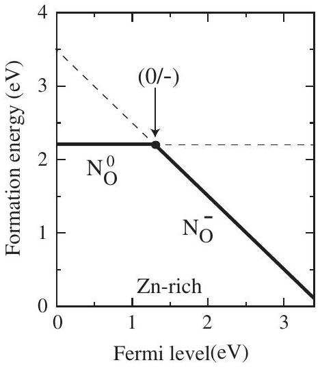
FIG. 22. Formation energy as a function of Fermi level $E_{F}$ for NO in ZnO, for Zn-rich conditions. $E_{F}$ is referenced to the VBM, and the position of the transition level (0/-) is indicated. Adapted from Lyons, Janotti, and Van de Walle, 2009b.

sensitivity of photoconductivity measurements to probe local vibrational modes even in the highly absorbing regions of the spectrum. Using this technique, Koch, Lavrov, and Weber (2012) measured frequencies of 742 and $792 \mathrm{~cm}^{-1}$ in ZnO , in good agreement with the theoretical predictions for substitutional $\mathrm{H}_{\mathrm{O}}$ in ZnO (Janotti and Van de Walle, 2007a).

## 2. $\boldsymbol{p}$-type doping of ZnO

DFT calculations have also played a key role in determining the properties of acceptor impurities and the prospects for $p$-type conductivity in ZnO. Achieving $p$-type conduction in ZnO is a long-standing problem that has been explored experimentally as well as theoretically. ${ }^{3}$ Potential $p$-type dopants are impurities that have one less valence electron than the host atoms, e.g., Li, Na, or Cu substituting on the Zn site, or N, P, or As substituting on the O site. Calculations based on hybrid functionals (see Sec. IV.G) indicate that Li and Cu are deep acceptors, in agreement with experiment, and cannot lead to $p$-type conductivity in ZnO (Carvalho et al., 2009; Du and Zhang, 2009; Gallino and Di Valentin, 2011), although some disagreement remains on the precise position of the acceptor levels. Results for column-V impurities have been more controversial. Experiments suggested that N would behave as a shallow acceptor in ZnO (Look et al., 2002; Tsukazaki et al., 2005). A lack of reproducibility of the results has, however, cast doubt on the assumption that N would render $\mathrm{ZnO} p$ type.

Hybrid-functional calculations (see Sec. IV.G) have shown that N substituting on the Zn site is actually a deep acceptor (Lyons, Janotti, and Van de Walle, 2009b; Lany and Zunger, 2010), with the (0/-) transition level at 1.3 eV above the valence band, as illustrated in Fig. 22. In the neutral charge state, $\mathrm{N}_{\mathrm{O}}$ induces local large relaxations and hole localization

[^1]on the axial Zn atom. The difference in relaxations between the neutral and negatively charged $\mathrm{N}_{\mathrm{O}}$ causes a large Stokes shift between the absorption and emission peaks associated with the impurity level. The calculated configuration coordinate diagram (see Sec. II.E.1) was shown in Fig. 8. These predictions have subsequently been verified by photoluminescence measurements in N-doped ZnO (Tarun, Iqbal, and McCluskey, 2011), providing unambiguous evidence of the deep nature of the nitrogen acceptor. The experimental onset of absorption and the peak of the (broad) luminescence line both agree with the first-principles predictions to within 0.1 eV, attesting to the accuracy that can be achieved by the use of hybrid functionals.

Now that it is established that N is a deep acceptor in ZnO , it is safe to conclude that other column-V impurities will be even less suitable: their valence $p$ orbital is higher in energy than that of N (Harrison, 1999), pushing the acceptor states of P, As, and Sb when substituting on the O site even deeper in the gap. In addition, the size mismatch is likely to cause As and Sb to prefer substituting on the Zn site, in which case they would act as donors. Moving even farther to the left of N in the periodic table, i.e., to the double acceptor C, is also fruitless, since the valence $p$ orbital energies also increase (Harrison, 1999). These considerations illustrate how first-principles calculations can provide essential insights into the technologically essential issue of doping.

## B. Impact of point defects on phase stability close to the melting temperature

## 1. The debate about vacancies versus anharmonicity

Predicting the instability of a solid with respect to the liquid phase when approaching the melting temperature is a remarkable challenge for any first-principles simulation. This is mainly due to the difficulty of reliably describing the liquid phase with an accuracy relevant for phase transitions (a few meV/atom). In this light, "one-phase" criteria which aim at predicting this phase transition by considering solely processes occurring in the bulk solid phase are particularly attractive (Sorkin, 2005). Several such approaches based on empirical findings have been proposed: The Lindemann criterion (Lindemann, 1910), for example, assumes that at the melting point lattice vibrations with displacements of more than 10\% of the lattice constant fully break the (timeaveraged) translational symmetry of the solid phase. The criterion suggested by Born (1939) explains melting by a mechanical instability based on the observation that shear moduli typically soften during thermal expansion. Furthermore, theories of positional disordering have been suggested (Ubbeldone, 1965).

The hypothesis that a strong increase of point defects at high temperatures might induce bulk melting also falls in this class of one-phase criteria. For instance, Stillinger and Weber (1984) found in their molecular dynamics simulations a cooperative formation of point defects, starting with vacancies and split-interstitial defect pairs. Granato (1992) attributed the decrease of the shear stress and the corresponding mechanical instability to an increase of self-interstitials. Such pointdefect-related phenomena have been shown to be consistent
with the assumptions of Lindemann and Born (Zhou and Jin, 2005).

First-principles calculations indicate that for simple metals the formation of vacancies is energetically more favorable than the formation of self-interstitials (Kraftmakher, 1998; Grabowski, Hickel, and Neugebauer, 2011; Moitra, Kim, and Horstemeyer, 2011). The exponential increase of concentrations with temperature, discussed in Sec. II.B, is expected to lead to very high vacancy concentrations close to the melting temperature. The resulting increase of the configurational entropy should be observable in thermodynamic response functions such as the heat capacity or the expansion coefficient. Indeed, a significant increase of the heat capacity beyond the quasiharmonic contribution is observed for many materials close to the melting temperature (Born, 1921). Anharmonic lattice vibrations were long considered to be the explanation for this effect, but an attribution to vacancy defects was proposed already in 1953 for Al and Pb (Pochapsky, 1953).

Here we focus the discussion mainly on the example of Al (Grabowski, 2009). Brooks and Bingham (1968) measured the constant-pressure heat capacity of Al using dynamic adiabatic calorimetry and transformed it to a constant-volume heat capacity (a procedure that may be error prone). From a subsequent comparison with the Debye model, they concluded that anharmonicity was responsible for the nonlinear increase in their experimental data (Brooks and Bingham, 1968). Ditmars, Plint, and Shukla (1985) and Shukla, Plint, and Ditmars (1985) later reconsidered these assessments of the aluminum heat capacity and went beyond the approach of Brooks and Bingham (1968) by employing empirical potentials rather than a simple Debye model to calculate the fixedvolume heat capacity. Their new experimental and theoretical data suggested that the vacancy contribution is more important than anharmonicity. Forsblom, Sandberg, and Grimvall (2004) further increased the theoretical level of accuracy by calculating the fixed-volume heat capacity using the embedded atom method. Their results showed that the contribution due to explicit anharmonicity can well be of a similar magnitude as the one obtained for the vacancy contribution by Shukla, Plint, and Ditmars (1985). However, the precise value depended sensitively on the potential parametrizations.

## 2. First-principles studies for AI

A more accurate theoretical treatment was needed to resolve the controversy. The approach described in Secs. II.A and II.B combined with methodological developments (Grabowski et al., 2009) made a first-principles study finally feasible (Grabowski, Hickel, and Neugebauer, 2011). All contributions to the free energy were carefully analyzed, including vacancies, and the entropy due to (quasiharmonic and anharmonic) lattice vibrations as well as electronic excitations. Here we summarize the main results. The first step is to demonstrate that the complete set of methods yields sufficiently accurate results. Response functions such as the heat capacity and expansion coefficient are first- or higher-order derivatives of the free-energy surface, and are therefore affected even by small changes in the free energy. To resolve the influence of different entropy contributions at the melting point the error bar in the free energy has to be systematically kept below 1 meV/atom. This is significantly less than typically required in defect calculations $(\approx 0.1 \mathrm{eV})$ and particularly challenging to achieve at high temperatures.

Figure 23 demonstrates the performance of the applied methods. The calculated LDA and GGA expansion coefficients (upper panel) agree well with each other and with experiment. In fact, the LDA and GGA results form approximate lower and upper bounds. The theoretical uncertainty, i.e., the difference between LDA and GGA values, is of the same order of magnitude as the experimental scatter. As demonstrated for a wide range of fcc metals, this remarkable success of the methodology extends also to other thermodynamic properties (Grabowski, Hickel, and Neugebauer, 2007): whenever the theoretical uncertainty is small, the agreement with experiment is very good. For the heat capacity of Al (lower panel of Fig. 23), however, all experimental data sets deviate visibly from the theoretical ones above 500 K. Simultaneously, the scatter in the experimental data is

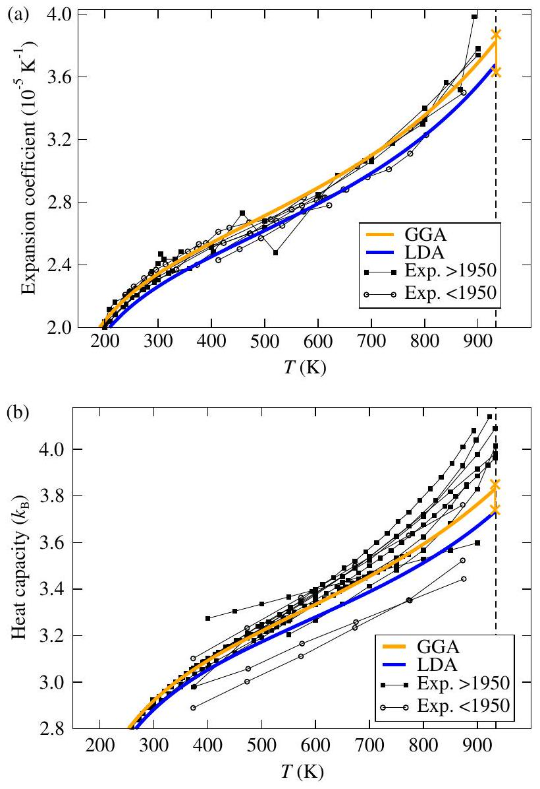
FIG. 23 (color online). (a) Thermal expansion coefficient and (b) isobaric heat capacity of aluminum including electronic, quasiharmonic, anharmonic, and vacancy contributions. Experimental values (divided into pre-1950 and post-1950 data) are included for comparison. The melting temperature $T^{m}(933 \mathrm{~K})$ is indicated by the vertical dashed line. At $T^{m}$, the crosses indicate the sum of all numerical errors (e.g., pseudopotential error, statistical inaccuracy, etc.) in all contributions for the GGA. Adapted from Grabowski, Hickel, and Neugebauer, 2011.

unusually large. From the small theoretical uncertainty, we expect no intrinsic difficulty in obtaining the Al heat capacity accurately. We therefore suggest (supported by the fact that the DFT results lie systematically below the experimental data) that the deviations are due to additional, uncontrolled contributions to the entropy in experiment, not necessarily related to the particular material being measured. Minimizing such unwanted disturbances should bring the experimental values closer to theory.

The first-principles results in Fig. 23 show a nonlinear increase in both physical quantities close to the melting temperature, which is qualitatively consistent with the experimental findings. Since all contributions are computed separately, the contribution of vacancies to the Gibbs energy, the heat capacity, and the expansion coefficient can be directly analyzed (Fig. 24). The total magnitude of the vacancy contribution to the Gibbs energy $G$ turns out to be

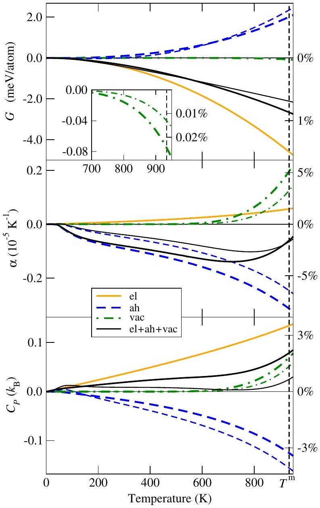
FIG. 24 (color online). Calculated contributions from vacancies (vac), electronic (el), and anharmonic (ah) excitation mechanisms to the Gibbs energy $G$, the expansion coefficient $\alpha$, and the isobaric heat capacity $C_{P}$ of aluminum (all quantities at zero pressure). Thick (thin) lines show GGA (LDA) results. The black solid lines show the sum of all excitations. The right axes are scaled with respect to the "full" GGA values at the melting temperature $T^{m}$ (indicated by the vertical dashed line). The inset enlarges the vacancy contribution to $G$ at high temperatures. Adapted from Grabowski et al., 2009.

However, what matters for the response functions is not the absolute Gibbs energy, but its relative change with temperature. Due to the exponential increase of the vacancy-related Gibbs energy with temperature, vacancies do affect both the heat capacity and the expansion coefficient, as revealed in Fig. 24 (dash-dotted lines). In particular, close to the melting temperature the vacancy contribution becomes comparable in magnitude to the anharmonic contribution-but notice the difference in sign: the anharmonic contribution (the quasiharmonic part is subtracted) is negative and cannot possibly explain the exponential increase in the response functions observed near the melting temperature. Neither can it be explained by electronic excitations, since they turn out to give rise to an almost linear effect. Hence, we conclude that it is the formation of vacancies that is mainly responsible for the behavior of the heat capacity of aluminum close to the melting temperature (Grabowski et al., 2009) and is, therefore, a precursor effect of the melting transition.

## VI. CONCLUSIONS AND OUTLOOK

We have given an overview of the state of the art of firstprinciples modeling of point defects in solid-state materials. We presented the general formalism for calculating the defect formation energy as a function of thermodynamic variables (chemical potentials, temperature, and pressure) and how it can be computed with present-day first-principles methods, most prominently DFT. We showed that artifacts of the most widely used supercell approach can (and should) be removed by carefully designed correction schemes. We also discussed how developments in DFT dramatically reduce the uncertainty in calculated results due to the band-gap problem associated with the standard LDA and GGA functionals, which had dominated the field for more than two decades. Two illustrative case studies demonstrated that the presented methodology can significantly contribute to elucidating the role of point defects in engineering materials for (opto)electronic device and structural applications.

The accuracy and reliability of modern first-principles simulations (if performed and interpreted with sufficient care) match those of many experimental measurements; i.e., the remaining uncertainties are of the same order as the error bars in many experiments, or the scatter in published experimental data. The calculations also provide independent and valuable insight into the many physical properties of defects that are not directly accessible to experiment. The power of this approach leads to continued and increasing applications in many areas; we hope that our review has highlighted the progress that has been made in recent years and will serve as a useful guide to the correct application of the methodology.

It is worth noting, however, that several aspects of the methodology can benefit from additional research. First, the contribution of vibrational effects to the free energies of
formation (see Sec. II.A.3) should be investigated more thoroughly, notably in semiconductors and insulators. For this purpose, practical approximations to reduce the associated computational cost (see Sec. II.A.3) would be of great use, e.g., analytical expressions for the temperature and volume dependence of phonon frequencies with a small number of free parameters. Moreover, finite-temperature effects (see Sec. II.C.1), supercell artifacts (see Sec. III), and deficiencies of the underlying density functional (see Secs. II.C. 2 and IV) are mutually dependent in general. Whether the available corrections suffice to account for their combined effect, which may not be additive, remains to be shown.

On the fundamental side, while hybrid functionals currently offer the best compromise between accuracy and computational cost, they clearly do not offer a universal solution, nor do they guarantee an accuracy of 0.1 eV. Additional experience needs to be gained in order to assess the predictive power and (equally importantly) the limitations of such functionals, as noted in Secs. II.C.2, IV.G, and V.A. Dispersive (van der Waals) interactions are not captured in current functionals, but are addressed in next-generation density functionals based on the random phase approximation (see Sec. IV.F.4). The large scatter in calculated surface energies from different functionals needs to be overcome to more confidently address open-volume defects (see Sec. II.C.2).

Finally, comparisons to alternative theoretical approaches such as quantum Monte Carlo (see Sec. IV.H) or quantumchemical methods will be fruitful, but also require refinements in those alternative methods. The engagement of specialists in these various fields is encouraged and will continue to widen the applicability and improve the accuracy of defect calculations in solids.

## ACKNOWLEDGMENTS

This work was supported by NSF (Grants No. DMR-1121053 and No. DMR-0906805), ARO (Grant No. W911NF-11-1-0232), and by the UCSB Solid State Lighting and Energy Center. Part of this work benefited from funding by the Deutsche Forschungsgemeinschaft within the Joint Project No. PAK 461.

## REFERENCES

Abu-Farsakh, H., and J. Neugebauer, 2009, Phys. Rev. B 79, 155311.
Ackland, G. J., 2002, J. Phys. Condens. Matter 14, 2975.
Adamo, C., and V. Barone, 1999, J. Chem. Phys. 110, 6158.
Adda, Y., and J. Philibert, 1966, La Diffusion dans les solides (Presses Universitaires de France, Paris).
Adler, S. L., 1962, Phys. Rev. 126, 413.
Ágoston, P., K. Albe, R. M. Nieminen, and M. J. Puska, 2009, Phys. Rev. Lett. 103, 245501.
Albrecht, S., L. Reining, R. Del Sole, and G. Onida, 1998, Phys. Rev. Lett. 80, 4510.
Alfe, D., and M. J. Gillan, 2005, Phys. Rev. B 71, 220101.
Alkauskas, A., P. Broqvist, and A. Pasquarello, 2008, Phys. Rev. Lett. 101, 046405.
Alkauskas, A., P. Deák, J. Neugebauer, A. Pasquarello, and C. G. Van de Walle, 2011, Eds., Advanced Calculations for Defects in Materials (Wiley, New York). The contents of this book have also been published in Vol. 248 of Phys. Status Solidi B.
Alkauskas, A., and A. Pasquarello, 2011, Phys. Rev. B 84, 125206.
Amano, H., M. Kito, K. Hiramatsu, and I. Akasaki, 1989, Jpn. J. Appl. Phys. Part 2, Lett. 28, L2112.
Andersson, D. A., and S. I. Simak, 2004, Phys. Rev. B 70, 115108.
Anisimov, V. I., F. Aryasetiawan, and A. I. Lichtenstein, 1997, J. Phys. Condens. Matter 9, 767.
Anisimov, V. I., I. V. Solovyev, M. A. Korotin, M. T. Czyzyk, and G. A. Sawatzky, 1993, Phys. Rev. B 48, 16929.
Anisimov, V. I., J. Zaanen, and O. K. Andersen, 1991, Phys. Rev. B 44, 943.
Armiento, R., and A. E. Mattsson, 2005, Phys. Rev. B 72, 085108.
Aryasetiawan, F., and O. Gunnarsson, 1998, Rep. Prog. Phys. 61, 237.
Baraff, G. A., and M. Schlüter, 1984, Phys. Rev. B 30, 3460.
Batista, E. R., J. Heyd, R. G. Hennig, B. P. Uberuaga, R. L. Martin, G. E. Scuseria, C. J. Umrigar, and J. W. Wilkins, 2006, Phys. Rev. B 74, 121102.
Bechstedt, F., F. Fuchs, and G. Kresse, 2009, Phys. Status Solidi B 246, 1877.
Bechstedt, F., R. D. Sole, G. Cappellini, and L. Reining, 1992, Solid State Commun. 84, 765.
Becke, A. D., 1993a, J. Chem. Phys. 98, 5648.
Becke, A. D., 1993b, J. Chem. Phys. 98, 1372.
Blachnik, R., et al., 1999, Landolt-Börnstein: Numerical Data and Functional Relationships in Science and Technology, New Series, Vol. III/41B (Springer, Heidelberg).
Blakemore, J. S., 1982, J. Appl. Phys. 53, R123.
Blöchl, P. E., 1994, Phys. Rev. B 50, 17953.
Blöchl, P. E., 2000, Phys. Rev. B 62, 6158.
Blöchl, P. E., C. G. Van de Walle, and S. T. Pantelides, 1990, Phys. Rev. Lett. 64, 1401.
Blum, V., R. Gehrke, F. Hanke, P. Havu, V. Havu, X. Ren, K. Reuter, and M. Scheffler, 2009, Comput. Phys. Commun. 180, 2175.
Bogusławski, P., and J. Bernholc, 1997, Phys. Rev. B 56, 9496.
Bogusławski, P., E. L. Briggs, and J. Bernholc, 1995, Phys. Rev. B 51, 17255.
Boonchun, A., and W. R. L. Lambrecht, 2011, Phys. Status Solidi B 248, 1043.
Born, M., 1921, Z. Phys. 6, 132.
Born, M., 1939, J. Chem. Phys. 7, 591.
Bracht, H., E. E. Haller, and R. Clark-Phelps, 1998, Phys. Rev. Lett. 81, 393.
Brooks, C. R., and R. E. Bingham, 1968, J. Phys. Chem. Solids 29, 1553.
Bruneval, F., and J.-P. Crocombette, 2012, Phys. Rev. B 86, 140103(R).
Bruneval, F., F. Sottile, V. Olevano, R. Del Sole, and L. Reining, 2005, Phys. Rev. Lett. 94, 186402.
Bruneval, F., N. Vast, and L. Reining, 2006, Phys. Rev. B 74, 045102.
Bruska, M. K., I. Czekaj, B. Delley, J. Mantzaras, and A. Wokaun, 2011, Phys. Chem. Chem. Phys. 13, 15947.
Bylander, D. M., and L. Kleinman, 1990, Phys. Rev. B 41, 7868.
Cao, J., and B. J. Berne, 1993, J. Chem. Phys. 99, 2902.
Car, R., P. J. Kelly, A. Oshiyama, and S. T. Pantelides, 1984, Phys. Rev. Lett. 52, 1814.
Carling, K., G. Wahnström, T. R. Mattsson, A. E. Mattsson, N. Sandberg, and G. Grimvall, 2000, Phys. Rev. Lett. 85, 3862.
Carloni, P., P. Blöchl, and M. Parinello, 1995, J. Phys. Chem. 99, 1338.
Carvalho, A., A. Alkauskas, A. Pasquarello, A. K. Tagantsev, and N. Setter, 2009, Phys. Rev. B 80, 195205.

Castleton, C. W. M., A. Höglund, and S. Mirbt, 2006, Phys. Rev. B 73, 035215.
Castleton, C. W. M., A. Höglund, and S. Mirbt, 2009, Modelling Simul. Mater. Sci. Eng. 17, 084003.
Celasco, M., F. Fiorillo, and P. Mazzetti, 1976, Phys. Rev. Lett. 36, 38.
Chadi, D. J., and K. J. Chang, 1988, Phys. Rev. Lett. 61, 873.
Chadi, D. J., and K. J. Chang, 1989, Phys. Rev. B 39, 10063.
Chang, E. K., M. Rohlfing, and S. G. Louie, 2000, Phys. Rev. Lett. 85, 2613.
Christensen, N. E., 1984, Phys. Rev. B 30, 5753.
Clark, S. J., and J. Robertson, 2010, Phys. Rev. B 82, 085208.
Clark, S. J., J. Robertson, S. Lany, and A. Zunger, 2010, Phys. Rev. B 81, 115311.
Cococcioni, M., and S. de Gironcoli, 2005, Phys. Rev. B 71, 035105.
Cook, H. E., and D. de Fontaine, 1969, Acta Metall. 17, 915.
Cotterill, R. M., M. Doyama, J. J. Jackson, and M. Meshii, 1965, Lattice Defects in Quenched Metals (Academic Press, New York).
Coutinho, J., V. J. B. Torres, R. Jones, and P. R. Briddon, 2003, Phys. Rev. B 67, 035205.
Czjzek, G., and W. Berger, 1970, Phys. Rev. B 1, 957.
Davies, G., 1999, in Identification of Defects in Semiconductors, edited by M. Stavola (Academic Press, San Diego), Semiconductors and Semimetals, Vol. 51B, p. 1.
Davies, G., and M. F. Hamer, 1976, Proc. R. Soc. A 348, 285.
Deák, P., 2000, Phys. Status Solidi B 217, 9.
Deák, P., B. Aradi, T. Frauenheim, E. Janze'n, and A. Gali, 2010, Phys. Rev. B 81, 153203.
Delczeg, L., E. K. Delczeg-Czirjak, B. Johansson, and L. Vitos, 2009, Phys. Rev. B 80, 205121.
Delczeg, L., B. Johansson, and L. Vitos, 2012, Phys. Rev. B 85, 174101.
Delley, B., 2000, J. Chem. Phys. 113, 7756.
Ditmars, D. A., C. A. Plint, and R. C. Shukla, 1985, Int. J. Thermophys. 6, 499.
Dovesi, R., R. Orlando, B. Civalleri, C. Roetti, V. R. Saunders, and C. M. Zicovich-Wilson, 2005, Z. Kristallogr. 220, 571.
Drabold, D. A., and S. K. Estreicher, 2007, Eds., Theory of Defects in Semiconductors (Springer-Verlag, Berlin).
Dudarev, S. L., G. A. Botton, S. Y. Savrasov, C. J. Humphreys, and A. P. Sutton, 1998, Phys. Rev. B 57, 1505.
Du, M. H., and S. B. Zhang, 2009, Phys. Rev. B 80, 115217.
Du, Y. A., L. Ismer, J. Rogal, T. Hickel, J. Neugebauer, and R. Drautz, 2011, Phys. Rev. B 84, 144121.
Elstner, M., D. Porezag, G. Jungnickel, J. Elsner, M. Haugk, T. Frauenheim, S. Suhai, and G. Seifert, 1998, Phys. Rev. B 58, 7260.
Erhart, P., K. Albe, and A. Klein, 2006, Phys. Rev. B 73, 205203.
Erhart, P., A. Klein, and K. Albe, 2005, Phys. Rev. B 72, 085213.
Ernzerhof, M., and G. E. Scuseria, 1999, J. Chem. Phys. 110, 5029.
Eshelby, J., 1956, Solid State Phys. 3, 79.
Eshuis, H., and F. Furche, 2011, J. Phys. Chem. Lett. 2, 983.
Estreicher, S. K., 1995, Mater. Sci. Eng. R 14, 319.
Estreicher, S. K., D. Backlund, T. M. Gibbons, and A. Doçaj, 2009, Modell. Simul. Mater. Sci. Eng. 17, 084006.
Estreicher, S. K., 2000, Phys. Status Solidi B 217, 513.
Estreicher, S. K., P. A. Fedders, and P. Ordejon, 2001, Physica (Amsterdam) 308B-310B, 1.
Estreicher, S. K., M. Sanati, D. West, and F. Ruymgaart, 2004, Phys. Rev. B 70, 125209.
Evarestov, R. A., 2012, Quantum Chemistry of Solids - LCAO Treatment of Crystals and Nanostructures, Springer Series in Solid-State Sciences Vol. 153 (Springer, New York), Chap. 10, pp. 489-540.
Fahey, P. M., P. B. Griffin, and J. D. Plummer, 1989, Rev. Mod. Phys. 61, 289.
Faleev, S. V., M. van Schilfgaarde, and T. Kotani, 2004, Phys. Rev. Lett. 93, 126406.
Feenstra, R., 1994, Semicond. Sci. Technol. 9, 2157.
Fetter, A., and J. Walecka, 2003, Quantum Theory of Many-particle Systems, Dover Books on Physics (Dover, New York).
Forsblom, M., N. Sandberg, and G. Grimvall, 2004, Phys. Rev. B 69, 165106.
Foulkes, W. M. C., L. Mitas, R. J. Needs, and G. Rajagopal, 2001, Rev. Mod. Phys. 73, 33.
Franchini, C., G. Kresse, and R. Podloucky, 2009, Phys. Rev. Lett. 102, 256402.
Freysoldt, C., 2011, sxdefectalign, http://www.sphinxlib.de/wiki/ AddOns.
Freysoldt, C., J. Neugebauer, and C. G. Van de Walle, 2009, Phys. Rev. Lett. 102, 016402.
Freysoldt, C., J. Neugebauer, and C. G. Van de Walle, 2011, Phys. Status Solidi B 248, 1067.
Frisch, M. J., et al., 2009, Gaussian 09 Revision A.1, Gaussian Inc., Wallingford, CT.
Fuchs, F., J. Furthmüller, F. Bechstedt, M. Shishkin, and G. Kresse, 2007, Phys. Rev. B 76, 115109.
Furche, F., 2008, J. Chem. Phys. 129, 114105.
Furche, F., and R. Ahlrichs, 2002, J. Chem. Phys. 117, 7433.
Gali, A., 2012, J. Mater. Res. 27, 897.
Gallino, F., and C. Di Valentin, 2011, J. Chem. Phys. 134, 144506.
Garleff, J. K., A. P. Wijnheijmer, and P. M. Koenraad, 2011, Semicond. Sci. Technol. 26, 064001.
Gilbert, T. L., 1975, Phys. Rev. B 12, 2111.
Giuliani, G., and G. Vignale, 2005, Quantum Theory of the Electron Liquid (CUP, Cambridge).
Glensk, A., B. Grabowski, T. Hickel, and J. Neugebauer, 2014, Phys. Rev. X 4, 011018.
Godby, R. W., M. Schlüter, and L. J. Sham, 1986, Phys. Rev. Lett. 56, 2415.
González, R., I. Vergara, D. Caceres, and Y. Chen, 2002, Phys. Rev. B 65, 224108.
Gorczyca, I., A. Svane, and N. E. Christensen, 1997, Solid State Commun. 101, 747.
Gordon, R. G., 1993, Mater. Res. Soc. Symp. Proc. 283, 891.
Götz, W., N. M. Johnson, D. P. Bour, M. D. McCluskey, and E. E. Haller, 1996, Appl. Phys. Lett. 69, 3725.
Grabowski, B., 2009, Towards ab initio assisted materials design: DFT based thermodynamics up to the melting point, Ph.D. thesis, Universität Paderborn, Paderborn.
Grabowski, B., T. Hickel, and J. Neugebauer, 2007, Phys. Rev. B 76, 024309.
Grabowski, B., T. Hickel, and J. Neugebauer, 2011, Phys. Status Solidi B 248, 1295.
Grabowski, B., L. Ismer, T. Hickel, and J. Neugebauer, 2009, Phys. Rev. B 79, 134106.
Grabowski, B., P. Söderlind, T. Hickel, and J. Neugebauer, 2011, Phys. Rev. B 84, 214107.
Granato, A. V., 1992, Phys. Rev. Lett. 68, 974.
Grandidier, B., X. de la Broise, D. Stievenard, C. Delerue, M. Lannoo, M. Stellmacher, and J. Bourgoin, 2000, Appl. Phys. Lett. 76, 3142.
Grüning, M., A. Marini, and A. Rubio, 2006, Phys. Rev. B 74, 161103.
Gunnarsson, O., and K. Schönhammer, 1986, Phys. Rev. Lett. 56, 1968.

Haase, M. A., H. Cheng, J. M. DePuydt, and J. E. Potts, 1990, J. Appl. Phys. 67, 448.
Haase, M. A., J. Qiu, J. M. DePuydt, and H. Cheng, 1991, Appl. Phys. Lett. 59, 1272.
Hagemark, K. I., 1976, J. Solid State Chem. 16, 293.
Harl, J., and G. Kresse, 2009, Phys. Rev. Lett. 103, 056401.
Harrison, S. E., 1954, Phys. Rev. 93, 52.
Harrison, W., 1999, Elementary Electronic Structure (World Scientific Co., Singapore).
Hedin, L., 1965, Phys. Rev. 139, A796.
Henderson, T. M., J. Paier, and G. E. Scuseria, 2011, Phys. Status Solidi B 248, 767.
Henkelman, G., B. P. Uberuaga, and H. Jónsson, 2000, J. Chem. Phys. 113, 9901.
Herring, C., N. M. Johnson, and C. G. Van de Walle, 2001, Phys. Rev. B 64, 125209.
Heyd, J., G. E. Scuseria, and M. Ernzerhof, 2003, J. Chem. Phys. 118, 8207.
Heyd, J., G. E. Scuseria, and M. Ernzerhof, 2006, J. Chem. Phys. 124, 219906.
Hine, N. D. M., K. Frensch, W. M. C. Foulkes, and M. W. Finnis, 2009, Phys. Rev. B 79, 024112.
Hohenberg, P., and W. Kohn, 1964, Phys. Rev. 136, B864.
Hood, R. Q., P. R. C. Kent, R. J. Needs, and P. R. Briddon, 2003, Phys. Rev. Lett. 91, 076403.
Hourahine, B., R. Jones, A. N. Safonov, S. Öberg, P. R. Briddon, and S. K. Estreicher, 2000, Phys. Rev. B 61, 12594.
Hu, J., and R. G. Gordon, 1992, J. Appl. Phys. 71, 880.
Hummer, K., J. Harl, and G. Kresse, 2009, Phys. Rev. B 80, 115205.
Hutson, A., 1957, Phys. Rev. 108, 222.
Hutter, J., 2003, J. Chem. Phys. 118, 3928.
Hybertsen, M. S., and S. G. Louie, 1986, Phys. Rev. B 34, 5390.
Imada, M., A. Fujimori, and Y. Tokura, 1998, Rev. Mod. Phys. 70, 1039.
Jagadish, C., and S. J. Pearton, 2006, Eds., Zinc Oxide Bulk, Thin Films and Nanostructures: Processing, Properties, and Applications (Elsevier Science, New York).
Janesko, B. G., T. M. Henderson, and G. E. Scuseria, 2009, Phys. Chem. Chem. Phys. 11, 443.
Janotti, A., D. Segev, and C. G. Van de Walle, 2006, Phys. Rev. B 74, 045202.
Janotti, A., and C. G. Van de Walle, 2005, Appl. Phys. Lett. 87, 122102.
Janotti, A., and C. G. Van de Walle, 2007a, Nature Mater. 6, 44.
Janotti, A., and C. G. Van de Walle, 2007b, Phys. Rev. B 76, 165202.
Janotti, A., and C. G. Van de Walle, 2008, Appl. Phys. Lett. 92, 032104.
Janotti, A., J. B. Varley, P. Rinke, N. Umezawa, G. Kresse, and C. G. Van de Walle, 2010, Phys. Rev. B 81, 085212.
Janotti, A., S. B. Zhang, S. H. Wei, and C. G. Van de Walle, 2002, Phys. Rev. Lett. 89, 086403.
Johnson, N. M., C. Herring, and D. J. Chadi, 1986, Phys. Rev. Lett. 56, 769.
Jokela, S. J., and M. D. McCluskey, 2005, Phys. Rev. B 72, 113201.
Keer, H. V., 1993, Principles of the Solid State (Wiley, New York).
Kennedy, T. A., and E. R. Glaser, 1999, in Identification of Defects in Semiconductors, edited by M. Stavola, Semiconductors and Semimetals Vol. 51A (Academic Press, San Diego), p. 1.
Klaver, T. P. C., D. J. Hepburn, and G. J. Ackland, 2012, Phys. Rev. B 85, 174111.
Kleinman, L., 1981, Phys. Rev. B 24, 7412.
Ko, H. J., Y. F. Chen, S. K. Hong, H. Wenisch, T. Yao, and D. C. Look, 2000, Appl. Phys. Lett. 77, 3761.
Koch, S. G., E. V. Lavrov, and J. Weber, 2012, Phys. Rev. Lett. 108, 165501.
Kohan, A. F., G. Ceder, D. Morgan, and C. G. Van de Walle, 2000, Phys. Rev. B 61, 15019.
Kohn, W., and J. M. Luttinger, 1955, Phys. Rev. 98, 915.
Kohn, W., and L. J. Sham, 1965, Phys. Rev. 140, A1133.
Komsa, H.-P., P. Broqvist, and A. Pasquarello, 2010, Phys. Rev. B 81, 205118.
Komsa, H.-P., and A. Pasquarello, 2011, Phys. Rev. B 84, 075207.
Komsa, H.-P., T. T. Rantala, and A. Pasquarello, 2012, Phys. Rev. B 86, 045112.
Körmann, F., A. Dick, B. Grabowski, T. Hickel, and J. Neugebauer, 2012, Phys. Rev. B 85, 125104.
Körmann, F., A. Dick, T. Hickel, and J. Neugebauer, 2010, Phys. Rev. B 81, 134425.
Korzhavyi, P. A., I. A. Abrikosov, B. Johansson, A. V. Ruban, and H. L. Skriver, 1999, Phys. Rev. B 59, 11693.
Kraftmakher, Y., 1998, Phys. Rep. 299, 79.
Kresse, G., and J. Furthmüller, 1996, Comput. Mater. Sci. 6, 15.
Kresse, G., and D. Joubert, 1999, Phys. Rev. B 59, 1758.
Kröger, F. A., 1974, The Chemistry of Imperfect Crystals (North-Holland, Amsterdam).
Krukau, A. V., O. A. Vydrov, A. F. Izmaylov, and G. E. Scuseria, 2006, J. Chem. Phys. 125, 224106.
Ku, W., and A. G. Eguiluz, 2002, Phys. Rev. Lett. 89, 126401.
Laks, D. B., C. G. Van de Walle, G. F. Neumark, P. E. Blöchl, and S. T. Pantelides, 1992, Phys. Rev. B 45, 10965.
Lang, D. V., 1992, in Deep Centers in Semiconductors, edited by S. Pantelides (Gordon and Breach, New York), pp. 489-539.
Langreth, D. C., and J. P. Perdew, 1977, Phys. Rev. B 15, 2884.
Lannoo, M., and J. Bourgoin, 1981, Point Defects in Semiconductors I: Theoretical Aspects, Springer Series in Solid-State Sciences (Springer-Verlag, Berlin).
Lannoo, M., and J. Bourgoin, 1983, Point Defects in Semiconductors II: Experimental Aspects, Springer Series in Solid-State Sciences (Springer-Verlag, Berlin).
Lany, S., and A. Zunger, 2005, Phys. Rev. B 72, 035215.
Lany, S., and A. Zunger, 2007, Phys. Rev. Lett. 98, 045501.
Lany, S., and A. Zunger, 2008, Phys. Rev. B 78, 235104.
Lany, S., and A. Zunger, 2009, Modelling Simul. Mater. Sci. Eng. 17, 084002.
Lany, S., and A. Zunger, 2010, Phys. Rev. B 81, 205209.
Lavrov, E. V., F. Herklotz, and J. Weber, 2009, Phys. Rev. B 79, 165210.
Lavrov, E. V., J. Weber, F. Börrnert, C. G. Van de Walle, and R. Helbig, 2002, Phys. Rev. B 66, 165205.
Lee, B., L.-W. Wang, C. D. Spataru, and S. G. Louie, 2007, Phys. Rev. B 76, 245114.
Lee, E. C., and K. J. Chang, 2004, Phys. Rev. B 70, 115210.
Lee, E. C., Y. S. Kim, Y. G. Jin, and K. J. Chang, 2001, Phys. Rev. B 64, 085120.
Lee, P. A., P. H. Citrin, P. Eisenberger, and B. M. Kincaid, 1981, Rev. Mod. Phys. 53, 769.
Leibfried, G., and N. Breuer, 1978, Point Defects in Metals I: Introduction to the Theory, Springer Tracts in Modern Physics (Springer-Verlag, New York).
Lento, J., J.-L. Mozos, and R. M. Nieminen, 2002, J. Phys.: Condens. Matter 14, 2637.
Leslie, M., and M. J. Gillan, 1985, J. Phys. C 18, 973.
Leung, W., and R. Needs, 2003, in Comp. Meth. Eng. Sci., Proceedings, edited by V. P Iu, L. N. Lamas, Y. P. Li, and K. M.

Mok (A. A. Balkema Publishers, Leiden, Netherlands), pp. 823-827.
Leung, W. K., R. J. Needs, G. Rajagopal, S. Itoh, and S. Ihara, 1999, Phys. Rev. Lett. 83, 2351.
Li, J., and L.-W. Wang, 2005, Phys. Rev. B 72, 125325.
Li, J., and S.-H. Wei, 2006, Phys. Rev. B 73, 041201.
Liechtenstein, A. I., V. I. Anisimov, and J. Zaanen, 1995, Phys. Rev. B 52, R5467.
Limpijumnong, S., J. E. Northrup, and C. G. Van de Walle, 2003, Phys. Rev. B 68, 075206.
Limpijumnong, S., P. Reunchan, A. Janotti, and C. G. Van de Walle, 2009, Phys. Rev. B 80, 193202.
Limpijumnong, S., S. B. Zhang, S. H. Wei, and C. H. Park, 2004, Phys. Rev. Lett. 92, 155504.
Lin, C., F. H. Zong, and D. M. Ceperley, 2001, Phys. Rev. E 64, 016702.
Lindemann, F., 1910, Phys. Z. 11, 609.
Litton, C. W., T. C. Collins, and D. C. Reynolds, 2011, Eds., Zinc Oxide Materials for Electronic and Optoelectronic Device Applications, Wiley Series in Materials for Electronic \& Optoelectronic Applications (Wiley, New York).
Liu, C., F. Yun, and H. Morkoc, 2005, J. Mater. Sci. Mater. Electron. 16, 555.
Look, D. C., 1992, Electrical Characterization of GaAs Materials and Devices, Design and Measurement in Electronic Engineering (Wiley, New York).
Look, D. C., D. C. Reynolds, C. W. Litton, R. L. Jones, D. B. Eason, and G. Cantwell, 2002, Appl. Phys. Lett. 81, 1830.
López Ríos, P., A. Ma, N. D. Drummond, M. D. Towler, and R. J. Needs, 2006, Phys. Rev. E 74, 066701.
Louie, S. G., M. Schlüter, and J. R. Chelikowsky, 1976, Phys. Rev. B 13, 1654.
Lucas, G., and R. Schäublin, 2009, Nucl. Instrum. Methods Phys. Res., Sect. B 267, 3009.
Lyons, J. L., A. Janotti, and C. G. Van de Walle, 2009a, Phys. Rev. B 80, 205113.
Lyons, J. L., A. Janotti, and C. G. Van de Walle, 2009b, Appl. Phys. Lett. 95, 252105.
Lyons, J. L., A. Janotti, and C. G. Van de Walle, 2012, Phys. Rev. Lett. 108, 156403.
Madelung, O., 1996, Ed., Semiconductors - Basic Data (Springer, Berlin), 2nd revised edition.
Madsen, G. K. H., and P. Novák, 2005, Europhys. Lett. 69, 777.
Makov, G., and M. C. Payne, 1995, Phys. Rev. B 51, 4014.
Makov, G., R. Shah, and M. C. Payne, 1996, Phys. Rev. B 53, 15513.
Martin, R. M., 2008, Electronic Structure: Basic Theory and Practical Methods (Cambridge University Press, Cambridge, England).
Mattila, T., and R. M. Nieminen, 1996, Phys. Rev. B 54, 16676.
Mattsson, A. E., R. Armiento, J. Paier, G. Kresse, J. M. Wills, and T. R. Mattsson, 2008, J. Chem. Phys. 128, 084714.
Mattsson, T. R., and A. E. Mattsson, 2002, Phys. Rev. B 66, 214110.
McCluskey, M. D., 2000, J. Appl. Phys. 87, 3593.
McCluskey, M. D., and E. E. Haller, 2012, Dopants and Defects in Semiconductors (CRC Press, Boca Raton).
McCluskey, M. D., N. M. Johnson, C. G. Van de Walle, D. P. Bour, M. Kneissl, and W. Walukiewicz, 1998, Phys. Rev. Lett. 80, 4008.
McCluskey, M. D., and S. J. Jokela, 2007, Physica (Amsterdam) 401B-402B, 355.
McCluskey, M. D., S. J. Jokela, K. K. Zhuravlev, P. J. Simpson, and K. G. Lynn, 2002, Appl. Phys. Lett. 81, 3807.
Mermin, N., 1965, Phys. Rev. 137, A1441.
Messmer, R. P., and G. D. Watkins, 1972, in Radiation Damage and Defects in Semiconductors (Institute of Physics, London), Vol. 16, p. 255.
Methfessel, M., and A. T. Paxton, 1989, Phys. Rev. B 40, 3616.
Mikkelsen, A., and E. Lundgren, 2005, Prog. Surf. Sci. 80, 1.
Milas, I., B. Hinnemann, and E. A. Carter, 2011, J. Mater. Chem. 21, 1447.
Minier, M., R. Andreani, and C. Minier, 1978, Phys. Rev. B 18, 102.
Mishin, Y., M. Sorensen, and A. Voter, 2001, Philos. Mag. A 81, 2591.
Mohanty, G. P., and L. V. Azaroff, 1961, J. Chem. Phys. 35, 1268.
Moitra, A., S. G. Kim, and M. F. Horstemeyer, 2011, CALPHAD: Comput. Coupling Phase Diagrams Thermochem. 35, 262.
Mollwo, E., 1954, Z. Phys. A 138, 478.
Monkhorst, H. J., and J. D. Pack, 1976, Phys. Rev. B 13, 5188.
Mooney, P. M., 1992, in Deep Centers in Semiconductors, edited by S. Pantelides (Gordon and Breach, New York), p. 643.
Mooney, P. M., 1999, in Identification of Defects in Semiconductors, edited by M. Stavola, Semiconductors and Semimetals Vol. 51B (Academic Press, San Diego), p. 93.
Mori-Sánchez, P., A. J. Cohen, and W. Yang, 2006, J. Chem. Phys. 125, 201102.
Mori-Sánchez, P., A. J. Cohen, and W. Yang, 2008, Phys. Rev. Lett. 100, 146401.
Morkoç, H., S. Strite, G. B. Gao, M. E. Lin, B. Sverdlov, and M. Burns, 1994, J. Appl. Phys. 76, 1363.
Mortensen, J. J., L. B. Hansen, and K. W. Jacobsen, 2005, Phys. Rev. B 71, 035109.
Muscat, J., A. Wander, and N. Harrison, 2001, Chem. Phys. Lett. 342, 397.
Nakamura, S., N. Iwasa, M. Senoh, and T. Mukai, 1992, Jpn. J. Appl. Phys. Pt. 1, 31, 1258.
Nazarov, R., T. Hickel, and J. Neugebauer, 2010, Phys. Rev. B 82, 224104.
Nazarov, R., T. Hickel, and J. Neugebauer, 2012, Phys. Rev. B 85, 144118.
Needs, R. J., 2007, in Theory of Defects in Semiconductors, Topics in Applied Physics Vol. 104, edited by D. A. Drabold and S. K. Estreicher (Springer, New York), pp. 141-164.
Neugebauer, J., and C. G. Van de Walle, 1994a, Phys. Rev. B 50, 8067.
Neugebauer, J., and C. G. Van de Walle, 1994b, in Proceedings of the 22nd International Conference on the Physics of Semiconductors, Vancouver, 1994, edited by D. J. Lockwood (World Scientific Publishing Co. Pte Ltd., Singapore), p. 2327.
Neugebauer, J., and C. G. Van de Walle, 1995, Phys. Rev. Lett. 75, 4452.
Neugebauer, J., and C. G. Van de Walle, 1996, Appl. Phys. Lett. 68, 1829.
Neumann, G., 1981, in Current Topics in Materials Science, edited by E. Kaldis (North-Holland Publishing Co., Amsterdam), Vol. 7, p. 152.
Nichols, C. S., C. G. Van de Walle, and S. T. Pantelides, 1989, Phys. Rev. Lett. 62, 1049.
Nieminen, R., 2009, Modelling Simul. Mater. Sci. Eng. 17, 084001.
Nozières, P., and D. Pines, 1958, Phys. Rev. 111, 442.
Oba, F., S. R. Nishitani, H. Adachi, I. Tanaka, M. Kohyama, and S. Tanaka, 2001, Phys. Rev. B 63, 045410.
Oba, F., A. Togo, I. Tanaka, J. Paier, and G. Kresse, 2008, Phys. Rev. B 77, 245202.
Onida, G., L. Reining, and A. Rubio, 2002, Rev. Mod. Phys. 74, 601.
Pacchioni, G., 2000, Solid State Sci. 2, 161.
Pacchioni, G., 2008, J. Chem. Phys. 128, 182505.
Paier, J., R. Hirschl, M. Marsman, and G. Kresse, 2005, J. Chem. Phys. 122, 234102.

Paier, J., M. Marsman, K. Hummer, G. Kresse, I. C. Gerber, and J. G. Ángyán, 2006, J. Chem. Phys. 124, 154709.
Paier, J., M. Marsman, and G. Kresse, 2007, J. Chem. Phys. 127, 024103.
Paier, J., M. Marsman, and G. Kresse, 2008, Phys. Rev. B 78, 121201.
Palacios, J. J., and F. Ynduráin, 2012, Phys. Rev. B 85, 245443.
Pandey, K. C., 1986, Phys. Rev. Lett. 57, 2287.
Pankove, J. I., D. E. Carlson, J. E. Berkeyheiser, and R. O. Wance, 1983, Phys. Rev. Lett. 51, 2224.
Pankove, J. I., and N. M. Johnson, 1991, Eds., Semiconductors and Semimetals, Vol. 34 (Academic Press, San Diego).
Park, C. H., and D. J. Chadi, 1997, Phys. Rev. B 55, 12995.
Park, C. H., S. B. Zhang, and S. H. Wei, 2002, Phys. Rev. B 66, 073202.
Parker, W. D., J. W. Wilkins, and R. G. Hennig, 2011, Phys. Status Solidi B 248, 267.
Park, Y. S., C. W. Litton, T. C. Collins, and D. C. Reynolds, 1966, Phys. Rev. 143, 512.
Parr, R., and W. Yang, 1994, Density-Functional Theory of Atoms and Molecules (Oxford University Press, New York).
Patterson, C. H., 2006, Phys. Rev. B 74, 144432.
Paudel, T. R., and W. R. L. Lambrecht, 2008, Phys. Rev. B 77, 205202.
Peles, A., and C. G. Van de Walle, 2007, Phys. Rev. B 76, 214101.
Perdew, J. P., 1985, Int. J. Quantum Chem. 28, 497.
Perdew, J. P., 1991, Electronic Structure of Solids (Akademie Verlag, Berlin).
Perdew, J. P., K. Burke, and M. Ernzerhof, 1997, Phys. Rev. Lett. 78, 1396.
Perdew, J. P., M. Ernzerhof, and K. Burke, 1996, J. Chem. Phys. 105, 9982.
Perdew, J. P., and M. Levy, 1983, Phys. Rev. Lett. 51, 1884.
Perdew, J. P., R. G. Parr, M. Levy, and J. L. Balduz, 1982, Phys. Rev. Lett. 49, 1691.
Perdew, J. P., and A. Zunger, 1981, Phys. Rev. B 23, 5048.
Persson, C., Y. J. Zhao, S. Lany, and A. Zunger, 2005, Phys. Rev. B 72, 035211.
Pickard, C. J., and F. Mauri, 2001, Phys. Rev. B 63, 245101.
Pickard, C. J., and F. Mauri, 2002, Phys. Rev. Lett. 88, 086403.
Pickett, W. E., 1989, Comput. Phys. Rep. 9, 115.
Pickett, W. E., S. C. Erwin, and E. C. Ethridge, 1998, Phys. Rev. B 58, 1201.
Pochapsky, T. E., 1953, Acta Metall. 1, 747.
Puska, M. J., and R. M. Nieminen, 1994, Rev. Mod. Phys. 66, 841.
Puska, M. J., S. Pöykkö, M. Pesola, and R. M. Nieminen, 1998, Phys. Rev. B 58, 1318.
Ramirez, R., C. P. Herrero, A. Antonelli, and E. R. Hernández, 2008, J. Chem. Phys. 129, 064110.
Ren, S. Y., J. D. Dow, and D. J. Wolford, 1982, Phys. Rev. B 25, 7661.
Ren, X., A. Tkatchenko, P. Rinke, and M. Scheffler, 2011, Phys. Rev. Lett. 106, 153003.
Reuter, K., and M. Scheffler, 2003, Phys. Rev. Lett. 90, 046103.
Reynolds, R. A., 1989, J. Vac. Sci. Technol. A 7, 269.
Ricci, D., C. Di Valentin, G. Pacchioni, P. V. Sushko, A. L. Shluger, and E. Giamello, 2003, J. Am. Chem. Soc. 125, 738.
Rinke, P., A. Janotti, M. Scheffler, and C. G. Van de Walle, 2009, Phys. Rev. Lett. 102, 026402.
Rinke, P., A. Schleife, E. Kioupakis, A. Janotti, C. Rödl, F. Bechstedt, M. Scheffler, and C. G. Van de Walle, 2012, Phys. Rev. Lett. 108, 126404.
Rohlfing, M., and S. G. Louie, 1998, Phys. Rev. Lett. 81, 2312.
Rozzi, C. A., D. Varsano, A. Marini, E. K. U. Gross, and A. Rubio, 2006, Phys. Rev. B 73, 205119.
Sah, C. T., J. Y. Sun, and J. J. Tzou, 1983, Appl. Phys. Lett. 43, 204.
Sanchez, J. M., F. Ducastelle, and D. Gratias, 1984, Physica (Amsterdam) 128A, 334.
Sankey, O. F., and R. W. Jansen, 1988, J. Vac. Sci. Technol. B 6, 1240.
Schleife, A., F. Fuchs, J. Furthmüller, and F. Bechstedt, 2006, Phys. Rev. B 73, 245212.
Schultz, P. A., 2000, Phys. Rev. Lett. 84, 1942.
Schultz, P. A., 2006, Phys. Rev. Lett. 96, 246401.
Seeger, A., D. Schumacher, J. Diehl, and W. Schilling, 1970, Eds., Vacancies and Interstitials in Metals (North-Holland, Amsterdam).
Segev, D., A. Janotti, and C. G. Van de Walle, 2007, Phys. Rev. B 75, 035201.
Seidl, A., A. Görling, P. Vogl, J. A. Majewski, and M. Levy, 1996, Phys. Rev. B 53, 3764.
Shaltaf, R., G.-M. Rignanese, X. Gonze, F. Giustino, and A. Pasquarello, 2008, Phys. Rev. Lett. 100, 186401.
Sham, L. J., and M. Schlüter, 1983, Phys. Rev. Lett. 51, 1888.
Shi, G. A., M. Stavola, S. J. Pearton, M. Thieme, E. V. Lavrov, and J. Weber, 2005, Phys. Rev. B 72, 195211.
Shim, J., E.-K. Lee, Y. J. Lee, and R. M. Nieminen, 2005a, Phys. Rev. B 71, 035206.
Shim, J., E.-K. Lee, Y. J. Lee, and R. M. Nieminen, 2005b, Phys. Rev. B 71, 245204.
Shishkin, M., and G. Kresse, 2007, Phys. Rev. B 75, 235102.
Shishkin, M., M. Marsman, and G. Kresse, 2007, Phys. Rev. Lett. 99, 246403.
Shukla, R. C., C. A. Plint, and D. A. Ditmars, 1985, Int. J. Thermophys. 6, 517.
Simmons, R. O., and R. W. Balluffi, 1960, Phys. Rev. 117, 52.
Singh, A. K., A. Janotti, M. Scheffler, and C. G. Van de Walle, 2008, Phys. Rev. Lett. 101, 055502.
Singh, D. J., and L. Nordstrom, 2000, Eds., Planewaves, Pseudopotentials, and the LAPW Method (Springer, New York).
Soler, J. M., E. Artacho, J. D. Gale, A. García, J. Junquera, P. Ordejón, and D. Sánchez-Portal, 2002, J. Phys. Condens. Matter 14, 2745.
Sorkin, S., 2005, Point defects, lattice structure and melting, Master's thesis, Israel Institute of Technology, Haifa.
Stampfl, C., C. G. Van de Walle, D. Vogel, P. Krüger, and J. Pollmann, 2000, Phys. Rev. B 61, 7846(R).
Starke, R., and G. Kresse, 2012, Phys. Rev. B 85, 075119.
Stillinger, F. H., and T. A. Weber, 1984, J. Chem. Phys. 81, 5095.
Stroppa, A., G. Kresse, and A. Continenza, 2011, Phys. Rev. B 83, 085201.
Surh, M. P., S. G. Louie, and M. L. Cohen, 1991, Phys. Rev. B 43, 9126.
Szabó, A., and N. Ostlund, 1996, Modern Quantum Chemistry: Introduction to Advanced Electronic Structure Theory (Dover Publications, New York).
Tarun, M. C., M. Z. Iqbal, and M. D. McCluskey, 2011, AIP Adv. 1, 022105.
Tersoff, J., and D. R. Hamann, 1985, Phys. Rev. B 31, 805.
Tewary, V. K., 1973, Adv. Phys. 22, 757.
Tewary, V. K., 2004, Phys. Rev. B 69, 094109.
Thomas, D. G., 1957, J. Phys. Chem. Solids 3, 229.
Thomas, D. G., and J. J. Lander, 1956, J. Chem. Phys. 25, 1136.
Trinkle, D. R., 2008, Phys. Rev. B 78, 014110.
Tsukazaki, A., et al., 2005, Nat. Mater. 4, 42.
Tsuruoka, T., R. Tanimoto, N. Tachikawa, S. Ushioda, F. Matsukura, and H. Ohno, 2002, Solid State Commun. 121, 79.

Turner, D. E., Z. Z. Zhu, C. T. Chan, and K. M. Ho, 1997, Phys. Rev. B 55, 13842.
Ubbeldone, A. R., 1965, Melting and Crystal Structure (Clarendon Press, Oxford).
Usuda, M., N. Hamada, T. Kotani, and M. van Schilfgaarde, 2002, Phys. Rev. B 66, 125101.
Van de Walle, C. G., 1990, Phys. Rev. Lett. 64, 669.
Van de Walle, C. G., 1998a, Phys. Rev. Lett. 80, 2177.
Van de Walle, C. G., 1998b, Phys. Rev. B 57, 2033(R).
Van de Walle, C. G., 2000, Phys. Rev. Lett. 85, 1012.
Van de Walle, C. G., 2001, Physica (Amsterdam) 308B-310B, 899.
Van de Walle, C. G., and P. E. Blöchl, 1993, Phys. Rev. B 47, 4244.
Van de Walle, C. G., P. J. H. Denteneer, Y. Bar-Yam, and S.T. Pantelides, 1989, Phys. Rev. B 39, 10791.
Van de Walle, C. G., D. B. Laks, G. F. Neumark, and S. T. Pantelides, 1993, Phys. Rev. B 47, 9425.
Van de Walle, C. G., and R. M. Martin, 1987, Phys. Rev. B 35, 8154.
Van de Walle, C. G., and J. Neugebauer, 2003a, J. Cryst. Growth 248, 8.
Van de Walle, C. G., and J. Neugebauer, 2003b, Nature (London) 423, 626.
Van de Walle, C. G., and J. Neugebauer, 2004, J. Appl. Phys. 95, 3851.
Van de Walle, C. G., and J. Neugebauer, 2006, Annu. Rev. Mater. Res. 36, 179.
Van de Walle, C. G., C. Stampfl, and J. Neugebauer, 1998, J. Cryst. Growth 189-190, 505.
van Schilfgaarde, M., T. Kotani, and S. Faleev, 2006, Phys. Rev. Lett. 96, 226402.
Varotsos, P. A., and K. D. Alexopoulos, 1986, Thermodynamics of Point Defects and Their Relation with Bulk Properties, Defects in Solids Vol. 14 (North-Holland, Amsterdam).
Vlasenko, L. S., and G. D. Watkins, 2005, Phys. Rev. B 71, 125210.
Vogel, D., P. Krüger, and J. Pollmann, 1996, Phys. Rev. B 54, 5495.
Vogel, D., P. Krüger, and J. Pollmann, 1997, Phys. Rev. B 55, 12836.
Voyles, P. M., D. A. Muller, J. L. Grazul, P. H. Citrin, and H. J. L. Gossmann, 2002, Nature (London) 416, 826.
Wallace, D. C., 1998, Thermodynamics of Crystals (Dover, New York).
Walukiewicz, W., 2001, Physica (Amsterdam) 302B-303B, 123.
Wang, L.-W., 2001, Appl. Phys. Lett. 78, 1565.
Wardle, M. G., J. P. Goss, and P. R. Briddon, 2005, Phys. Rev. B 71, 155205.
Wardle, M. G., J. P. Goss, and P. R. Briddon, 2006, Phys. Rev. Lett. 96, 205504.
Watkins, G. D., 1999, in Identification of Defects in Semiconductors, Semiconductors and Semimetals Vol. 51A, edited by M. Stavola (Academic Press, San Diego), p. 1.
Weber, J. R., W. F. Koehl, J. B. Varley, A. Janotti, B. B. Buckley, C. G. Van de Walle, and D. D. Awschalom, 2010, Proc. Natl. Acad. Sci. U.S.A. 107, 8513.
Wei, S. H., and A. Zunger, 1988, Phys. Rev. B 37, 8958.
Weissker, H.-C., J. Serrano, S. Huotari, F. Bruneval, F. Sottile, G. Monaco, M. Krisch, V. Olevano, and L. Reining, 2006, Phys. Rev. Lett. 97, 237602.
Wetzel, C., T. Suski, J. W. Ager, E. R. Weber, E. E. Haller, S. Fischer, B. K. Meyer, R. J. Molnar, and P. Perlin, 1997, Phys. Rev. Lett. 78, 3923.
Windl, W., 2006, ECS Trans. 3, 171.
Wright, A. F., and N. A. Modine, 2006, Phys. Rev. B 74, 235209.
Wu, Z., 1991, J. Phys. Condens. Matter 3, 8777.
Wu, Z., and R. M. Wentzcovitch, 2009, Phys. Rev. B 79, 104304.
Zakharov, O., A. Rubio, X. Blase, M. L. Cohen, and S. G. Louie, 1994, Phys. Rev. B 50, 10780.
Zhang, S. B., 2002, J. Phys. Condens. Matter 14, R881.
Zhang, S. B., and J. E. Northrup, 1991, Phys. Rev. Lett. 67, 2339.
Zhang, S. B., S. H. Wei, and A. Zunger, 1998, J. Appl. Phys. 83, 3192.
Zhang, S. B., S. H. Wei, and A. Zunger, 1999, Physica (Amsterdam) 273B-274B, 976.
Zhang, S. B., S. H. Wei, and A. Zunger, 2001, Phys. Rev. B 63, 075205.
Zheng, X., A. J. Cohen, P. Mori-Sánchez, X. Hu, and W. Yang, 2011, Phys. Rev. Lett. 107, 026403.
Zhou, Y., and X. Jin, 2005, Phys. Rev. B 71, 224113.
Zhu, X., and S. G. Louie, 1991, Phys. Rev. B 43, 14142.

[^0]:    ${ }^{1}$ See, e.g., Harrison (1954), Hutson (1957), Thomas (1957), Mohanty and Azaroff (1961), Kröger (1974), Hagemark (1976), and Neumann (1981).
    ${ }^{2}$ See, e.g., Kohan et al. (2000), Lee et al. (2001), Oba et al. (2001, 2008), Van de Walle (2001), Zhang, Wei, and Zunger (2001), Erhart, Klein, and Albe (2005), Janotti and Van de Walle (2005, 2007b), Lany and Zunger (2005, 2007), Erhart, Albe, and Klein (2006), Patterson (2006), Paudel and Lambrecht (2008), and Clark et al. (2010).

[^1]:    ${ }^{3}$ For an overview of experimental work, see the reviews by Jagadish and Pearton (2006) and Litton, Collins, and Reynolds (2011). Theoretical studies include those by Lee and Chung (2004), Limpijumnong et al. (2004), Lyons, Janotti, and Van de Walle (2009b), Park, Zhang, and Wei (2002), Wardle, Goss, and Briddon (2005), and Lany and Zunger (2010).
