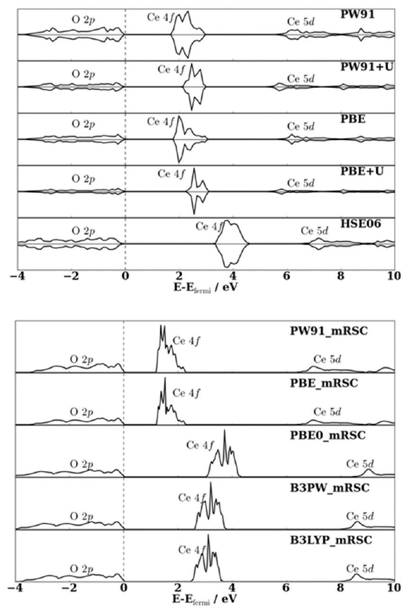
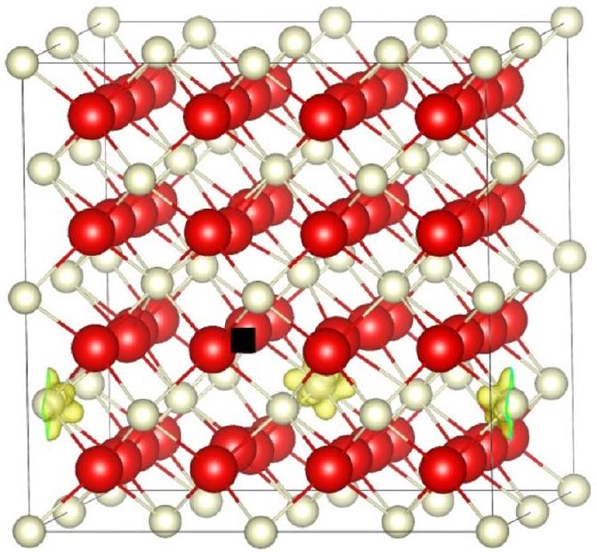
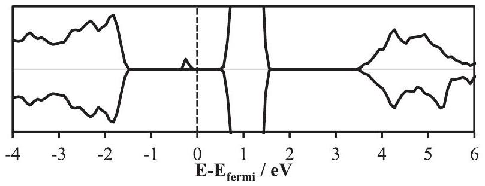
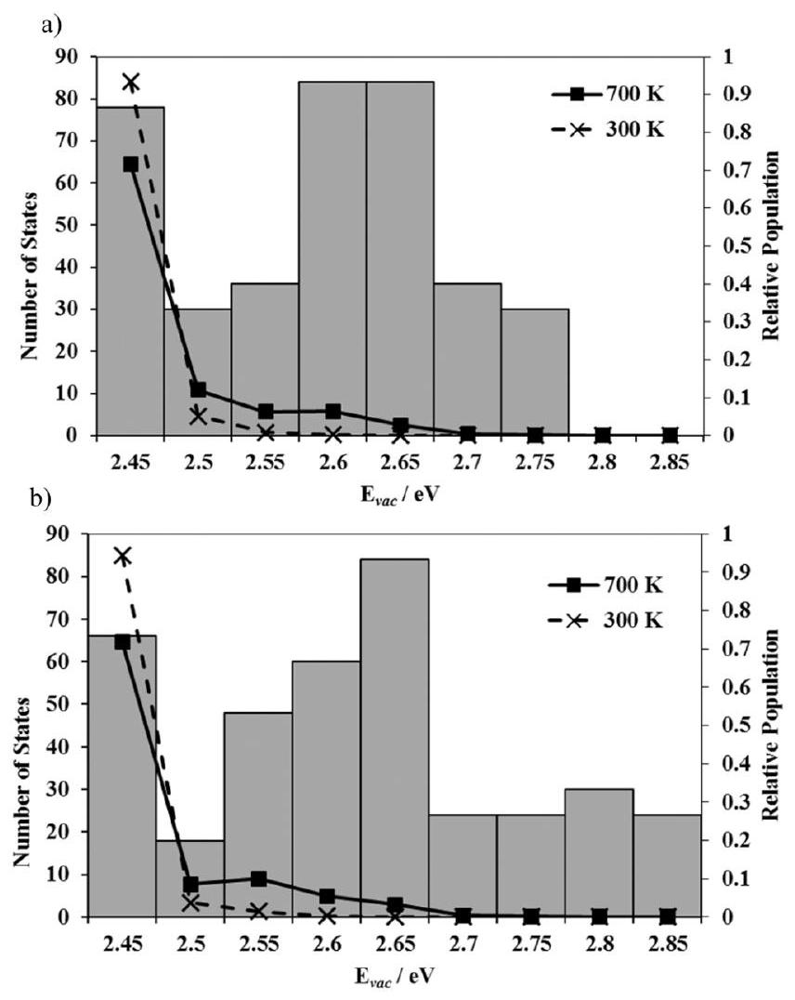
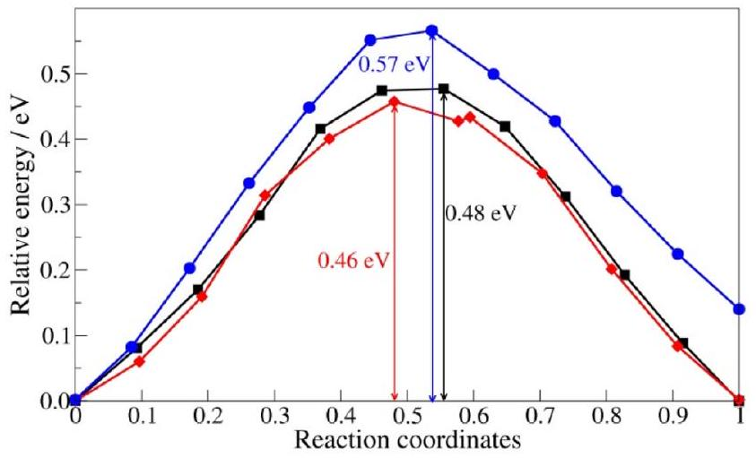
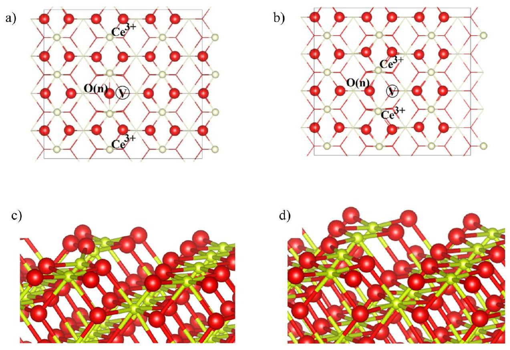
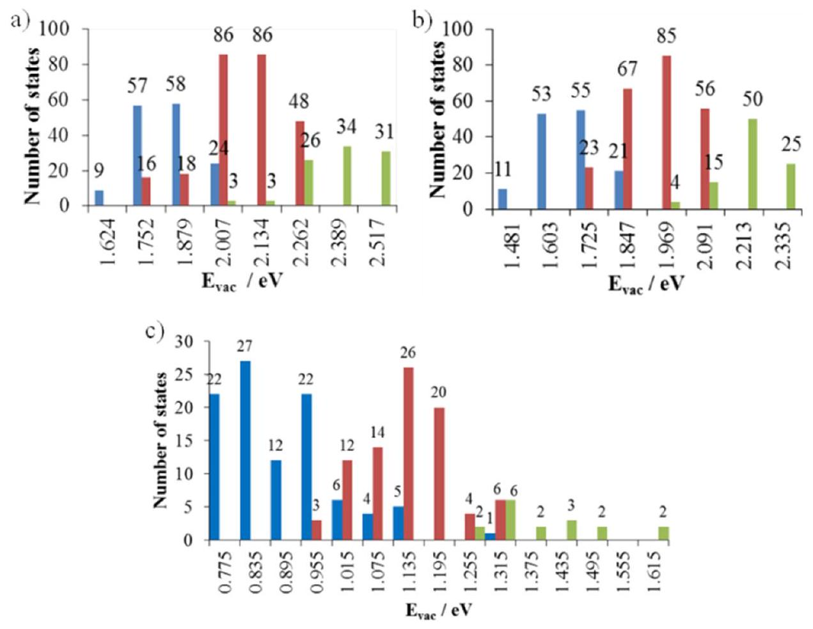
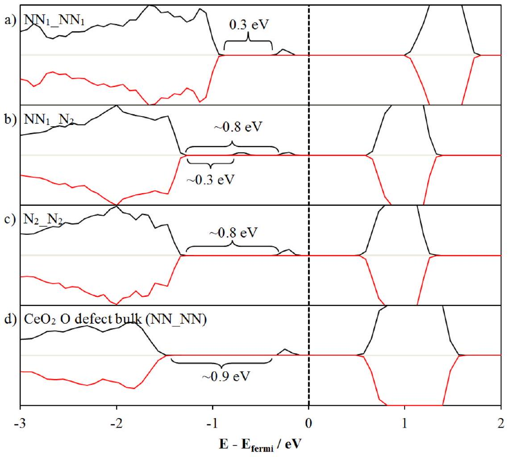

# A computational study of the structure of anion vacancy defects in the bulk and on the surfaces of ceria 

Soon W. Hoh ${ }^{\mathrm{a}, *}$, Glenn Jones ${ }^{\mathrm{b}}$, David J. Willock ${ }^{\mathrm{c}, *}$ ${ }^{\mathrm{a}}$ York Structural Biology Laboratory, Department of Chemistry, University of York, York YO10 5DD, UK ${ }^{\mathrm{b}}$ Johnson Matthey Technology Centre, CSIR, Pretoria, South Africa ${ }^{\mathrm{c}}$ MaxPlanck-Cardiff Centre on the Fundamentals of Heterogeneous Catalysis FUNCAT, Cardiff Catalysis Institute, School of Chemistry, Cardiff University, Cardiff CF24 4HQ, UK

## ARTICLE INFO

## Keywords:

Ceria
Anion vacancies
$\mathrm{DFT}+\mathrm{U}$
Configurations
Distributions
Surfaces

#### Abstract

Ceria is an important technological material that finds wide application as an oxygen storage component in heterogeneous oxidation catalysis. In these applications the removal of lattice oxygen results in two reduced $\mathrm{Ce}^{3+}$ centres whose location relative to the vacancy site has a profound influence on the vacancy formation energy. Here we present DFT calculations on the bulk and surface oxygen defect formation highlighting the distribution of structures that are thermally accessible in such a situation. We also demonstrate that the $\mathrm{Ce}^{3+}$ locations influence the barrier to oxygen anion migration.

## 1. Introduction

An important factor in heterogenous catalysis involving metal oxides is the oxygen storage capability of the oxide. This can be controlled by the ability of the metal to change in oxidation state during the reversible storage and release of oxygen for catalytic reactions. For example, in a catalytic converter, the oxygen storage capability provides a way to moderate oxygen availability as the air-to-fuel ratio in the exhaust varies. Optimum stoichiometry is maintained by easily releasing or removing oxygen from the oxide under "rich" and "lean" mixture conditions, respectively [1]. Among various metal oxides, cerium (IV) oxide is one of the preferred materials for its oxygen storage capacity (OSC) in a range of applications [2] including the three way catalysts (TWCs) employed in pollution control for petrol engines. Similarly, $\mathrm{Cu} / \mathrm{CeO}_{2}$ has been suggested as a promising $\mathrm{CO}_{2}$ hydrogenation catalyst with the anion vacancy sites associated with partial reduction of the $\mathrm{CeO}_{2}$ surface being found to stabilise the adsorption of $\mathrm{CO}_{2}[3,4]$.

The relative partial pressures of oxygen and reductants in the catalyst feed stream shift the equilibrium of the redox reaction:

$$
\mathrm{CeO}_{2} \rightleftharpoons \mathrm{CeO}_{2-\mathrm{x}}+\frac{1}{2} \mathrm{xO}_{2}
$$

This depends on the ability of the oxide cation to switch between the two stable oxidation states $\mathrm{Ce}^{4+}$ and $\mathrm{Ce}^{3+}$. The reduction of $\mathrm{Ce}^{4+}$ to $\mathrm{Ce}^{3+}$
proceeds by the release of a lattice oxygen anion as an oxygen atom in $\frac{1}{2} \mathrm{O}_{2}$ with the two electrons left behind in the $4 f$ states of two cerium cations [5,6]. This can be shown using the Kröger-Vink notation;

$$
\mathrm{O}_{\mathrm{O}}^{\mathrm{x}}+2 \mathrm{Ce}_{\mathrm{Ce}}^{\mathrm{x}} \rightarrow \frac{1}{2} \mathrm{O}_{2(\mathrm{~g})}+\mathrm{V}_{\mathrm{O}}^{\bullet \bullet}+2 \mathrm{Ce}_{\mathrm{Ce}}^{\prime}
$$

where $\mathrm{O}_{\mathrm{O}}^{\mathrm{x}}$ and $\mathrm{Ce}_{\mathrm{Ce}}^{\mathrm{x}}$ are O and Ce ions on their respective lattice sites with the expected formal charges, $\mathrm{V}_{\mathrm{O}}^{\bullet \bullet}$ is the vacancy on an oxygen site, since electrons have been lost from the site the associated charge has changed by $+2 . \mathrm{Ce}_{\mathrm{Ce}}^{\prime}$ denotes Ce on a Ce site which has been reduced with a change in formal charge of -1 . This notation emphasises the importance of lattice oxygen vacancies in the reduction process.

The development of synthetic approaches able to direct the crystal habit of $\mathrm{CeO}_{2}$ has also made possible the production of ceria nanocubes having largely $\{100\}$ faces nano, polyhedra with predominantly $\{111\}$ facets and rods expressing $\{110\}$ and $\{100\}$ [7]. Experiments using these polymorphic forms in catalytic studies have shown that the $\{100\}$ faces of nanocubes are active for CO oxidation, while the $\{111\}$ surfaces of nanopolyhedral give better activity in hydrogenation [8]. In the same study, aging of the nanocube samples was shown to introduce $\{110\}$ features that improved the CO oxidation activity further. It was suggested that this implies that oxygen storage capacity of (100) and (110) surfaces is higher than that of (111). This would be expected if anion vacancy formation via reaction (2) occurs more easily on (100) and

[^0](110). Hydrogenation requires surfaces with low levels of oxygen defects, suggesting that $\{111\}$ facets have relatively high oxygen vacancy formation energies.

The description of vacancy formation in reducible oxides has been a challenge to computational approaches over the last several decades. Particularly the application of density functional theory (DFT) to correctly describe the electron distribution in the reduced state. The reduced cations have strongly localised electrons and as DFT relies on the potential of the electron density to represent electron-electron interactions there is an inherent error due to "self-interaction" which becomes particularly apparent when such localisation takes place.

For ceria in particular the localisation of electrons in $f$ states occurs with the $\mathrm{Ce}^{4+} \rightarrow \mathrm{Ce}^{3+}$ reduction. Stoichiometric ceria is an insulator with an unoccupied $\mathrm{Ce} 4 f$ band. When the material is reduced, the $\mathrm{Ce} 4 f$ band becomes partially occupied and splits, with localised electrons corresponding to the $\mathrm{Ce}^{3+}$ ions in a narrow, filled band. These spatially localised Ce $4 f$ filled states mean that ceria remains an insulator on reduction. In the literature various computational methods have been applied to attempt to reproduce this behaviour for bulk $\mathrm{CeO}_{2}$ and its surfaces. Hartree-Fock (HF) calculations do not suffer from the selfinteraction present in DFT but also do not account for electron correlation effects. The omission of electron correlation leads to an overestimation of the $\mathrm{O} 2 p$ - Ce $5 d$ band gap [9] compared to experiment [10] $(\sim 6 \mathrm{eV})$ which can only partially be corrected by post-optimisation correlation corrections [11].

Early DFT calculations in the framework of the local-density approximation (LDA) and the generalised gradient approximation (GGA) have also been applied to ceria by Skorodumova et al. who found that inclusion of the $\mathrm{Ce} 4 f$ states in the calculations was essential, even for the stoichiometric oxide [12]. Many density functional theory (DFT) based calculations on ceria have appeared since and results are summarised in Table S1 [13-21]. In general, although structural parameters are in near agreement with experimental data, LDA and GGA-DFT approaches underestimate band gaps due to the self-interaction error [22-25].

Different approaches have been taken to apply a self-interaction correction (SIC) to standard DFT. The use of hybrid methods reduces the self-interaction by introducing a percentage of non-local HF exchange in the exchange-correlation functionals. Hybrid DFT calculations produce structural properties which agree well with experimental values (Table S1, [15,26,27]). The description of the Ce $4 f$ states is also improved compared to GGA functionals due to the HF contribution. However, the $\mathrm{O} 2 p$-Ce $5 d$ band gap is again overestimated with reference to the experimental value of 6 eV [10].

Hybrid methods are still computationally expensive, particularly for the large supercell calculations required to study defect and surface structures. Another approach is to use on-site Coulomb interaction correction terms (DFT + U) reliant on the choice of a U parameter to correctly account for SIC effects. This approach has been widely applied to study the bulk [6,14,16-18,28,29] and surfaces of $\mathrm{CeO}_{2}[16,28,30$, 31], including studies of oxidation and reduction reactions on $\mathrm{CeO}_{2}$ surfaces [20,21,32,33], and the adsorption of water [34]. The DFT + U approach has produced good structural properties and accurately describes the electronic band structure of bulk ceria. Nevertheless, the use of a proper $\mathrm{U}_{\text {eff }}$ value ( $\mathrm{U}_{\text {eff }}=$ U-J, explained further in Computational Methods section) is subjective as it is parameterised to a specific property under study [35]. Loschen et al. [17] have shown that the choice of $\mathrm{U}_{\text {eff }}$ affects the structural properties, as well as the $\mathrm{O} 2 p$-Ce $4 f$ and O $2 p$ - $\mathrm{Ce} 5 d$ band gaps for bulk $\mathrm{CeO}_{2}$. They suggested that the $\mathrm{U}_{\text {eff }}$ values of 7.5-9.5 eV for LDA+U calculations and $3.5-5 \mathrm{eV}$ for GGA $+U$ calculations, give the best overall match with the structural and experimental electronic data. Sevik and Cagin [14] found $\mathrm{U}_{\text {eff }}=6 \mathrm{eV}$ for LDA +U calculation produced data in good agreement with experimental data and previous theoretical work [6,17,27]. Studies have also been carried out with additional U terms used for oxygen $2 p$ electrons [16,18]. Plata et al. [18] showed that by systematically increasing the $\mathrm{U}_{\text {eff }}$ value for
oxygen $2 p$ orbital ( $\mathrm{U}_{e f f_{-} p}$ ) with a given $\mathrm{U}_{e f f}$ value for $\mathrm{Ce} 4 f$ leads to a decrease in the optimised lattice parameter and increases the band gap for $\mathrm{CeO}_{2}$, which is beneficial since the inclusion of $\mathrm{U}_{\text {eff }}$ for $\mathrm{Ce} 4 f$ orbitals alone produces a larger lattice parameter and slightly smaller band gap when compared to experiment [17,36]. They also found that the combination of $\mathrm{U}_{\text {eff }}(5+5)$ and ( $5+6$ ) applied to $p$ and $f$ orbitals gave $\mathrm{CeO}_{2}$ formation and reduction energies reasonably close to experimental values. Very recently DFT + U approaches have been benchmarked using many-body perturbation theory [37] and compared to a meta-GGA approach [38].

Aside from the electronic structure, the introduction of anion vacancies into the ceria lattice brings the challenge of selecting which of the ceria cations to reduce to $\mathrm{Ce}^{3+}$. Ceria takes on the fluorite lattice structure with the space group $F m \overline{3} m$. A single unit cell contains four cerium and eight oxygen ions. The structure consists of a face centered cubic (fcc) arrangement of $\mathrm{Ce}^{4+}$ with oxygen filling all tetrahedral holes so that each cerium ion is co-ordinated to eight oxygen ions in a cubic arrangement. Usually, calculations will be performed on supercells of the structure so that the periodic spacing of anion defects can be made as large as possible. Very recently, the development of quantum mechanics embedded in molecular mechanics (QM/MM) models have also allowed the simulation of defects in the infinite dilution limit using the MottLittleton approach [39] using shell model potentials that had previously been used to describe ceria at the forcefield level [40]. In stoichiometric $\mathrm{CeO}_{2}$ all ceria sites are equivalent. However, $\mathrm{Ce}^{3+}$ has a larger cation radius than $\mathrm{Ce}^{4+}$ and so reduction introduces lattice strain associated with the change of cation radius so that defect formation is accompanied by the introduction of polarons [35]. The vacancy formation energy then depends on which pair of ceria cations are selected to convert from $\mathrm{Ce}^{4+} \rightarrow \mathrm{Ce}^{3+}$. Fabris et al. [30] reported that the excess electrons always localised on two Ce atoms neighbouring the oxygen vacancy. However, later work of Hu and co-workers suggested that locating the $\mathrm{Ce}^{3+}$ ions at second nearest neighbour sites to the anion vacancy resulted in a lower vacancy formation energy [41]. A systematic study by Allen and Watson used an occupation matrix approach to create pairs of $\mathrm{Ce}^{3+}$ ions at all symmetry unique sets of sites around an oxygen vacancy and considered the difference between the $f$-orbitals at each site [42]. This confirmed that location of $\mathrm{Ce}^{3+}$ at next nearest sites relative to a bulk anion defect gives the lowest defect formation energy, but also pointed out that a defect structure with one nearest neighbour and one next nearest neighbour $\mathrm{Ce}^{3+}$ has a defect energy only 0.04 eV higher. Indeed, defect energies for the entire set of structures considered fell within 0.35 eV of the lowest energy structure.

The localisation of electrons on various combinations of Ce cation pairs on $\mathrm{CeO}_{2}$ surfaces has also been reported [30,43-45]. In this case, the location of the anion vacancy relative to the surface layer must also be considered. Fabris et al. [30] reported that introducing oxygen defects sub-surface is more favourable than locating oxygen defects on surface anion sites when the LDA + U method was applied but this conclusion reversed when a GGA $+U$ functional was used. Hu [43] and Sauer [44] have each investigated a $p(2 \times 2)$ (111) surface unit and reported that the sub-surface oxygen defect is a more stable system using PBE + U, LDA + U and the hybrid method, HSE06. Based on calculations using a $p(3 \times 4)$ surface slab model, Hu's group showed that $\mathrm{Ce}^{3+}$ are best placed on the next nearest neighbours from the vacancy site for both sub-surface and surface defects. Later Hu also examined the oxygen diffusion mechanism on the (111) surface of $\mathrm{CeO}_{2}$ [46]. Two possibilities were compares: Firstly, a two-step exchange mechanism which involves diffusion of sub-surface oxygen anion to the top surface vacancy site ( $\mathrm{E}_{a}=0.44 \mathrm{eV}$ ) followed by filling of the sub-surface vacancy by the nearest top surface oxygen anion ( $\mathrm{E}_{a}=0.61 \mathrm{eV}$ ). Secondly, a hopping mechanism involving the movement of oxygen across the surface mediated by vacancies, this produced a higher diffusion barrier ( $\mathrm{E}_{a} =1.60 \mathrm{eV}$ ). They explained the high barrier found for the hopping mechanism is caused by the breaking of two $\mathrm{Ce}-\mathrm{O}$ bonds whereas the
exchange mechanism requires only one $\mathrm{Ce}-\mathrm{O}$ bond to be cleaved at each stage of the process.

In this work we have developed the idea that the oxygen anion vacancy formation is dependent on the location of the associated $\mathrm{Ce}^{3+}$ cations for both bulk and surface defects in ceria. The narrow range of energies obtained in Watson's study suggests that the identification of the lowest energy arrangement of the reduced cations is less important than in understanding the defect energy than using the whole set of configurations to provide an estimate of the relative thermodynamic importance of each. Here we will first compare the difference between the DFT + U and hybrid functional approaches in describing the electronic structure of ceria. We will then calculate the energies of bulk defects with all unique arrangements taken into account to build a partition function describing the relative importance of the structures. We also extend this approach to the common surfaces of ceria and consider the defect formation energies on $\mathrm{CeO}_{2}(110)$ and $\mathrm{CeO}_{2}(111)$ which is relevant to understanding their respective activity on CO and other oxidation reactions.

## 2. Computational methods

### 2.1. General approach

Periodic calculations were performed using Vienna ab initio simulation package (VASP) [47-50] and CRYSTAL09 [51,52]. In VASP, the core states were represented using the projected augmented wave (PAW) method [53,54]. The cerium $5 s, 5 p, 5 d, 4 f, 6 s$ and oxygen $2 s, 2 p$ electrons were treated as valence electrons with a plane wave cutoff of 500 eV . The exchange-correlation interaction is treated using the generalised gradient approximation (GGA) applying the Perdew and Wang (PW91) [55,56] and Perdew-Burke-Ernzerhof (PBE) [57,58] functionals. Calculations will also be presented using the hybrid functional method, Heyd-Scuseria-Erznerhof (HSE06) [59-61]. HSE06 is implemented with the mixing of $25 \%$ of non-local Fock exchange and $75 \%$ of PBE exchange, along with PBE correlation. A range separation parameter of $0.20 \AA^{-1}$ is used in HSE06 functional which splits the exchange energy term into short-range and long-range components. In the plane-wave approach hybrid calculations are extremely computationally intensive and so we have also performed DFT + U calculations using the GGA functionals with the supplement of Dudarev +U term [62]. The $\mathrm{U}_{\text {eff }}$ value for $\mathrm{Ce} f$ orbital was set to $5.0 \mathrm{eV}(\mathrm{U}=5.0 \mathrm{eV}, J=0.0 \mathrm{eV})$. $\mathrm{U}_{\text {eff }}$ is the combination of two parameters, $U_{\text {eff }}=U-J$, where $U$ reflects the strength of the on-site Coulomb interaction, and $J$ is the strength of exchange interaction, only the difference enters the Dudarev equations for the Hubbard term. Optimisations were performed using $7 \times 7 \times 7$ Monkhorst-Pack grid for single unit cell and $3 \times 3 \times 3$ for the bulk $2 \times 2 \times 2$ supercell. Bulk calculations were set to converge when the forces on all atoms are less than $0.01 \mathrm{eV} \AA^{-1}$. For calculations involving two $\mathrm{Ce}^{3+}$ ions generated when an oxygen defect is introduced the spin state of the system can be either ferromagnetic or anti-ferromagnetic. It has previously been reported that the energy difference between these spin states is less than 5 meV [44,63] and so, in common with other authors, we only consider the ferromagnetic spin arrangement.

Calculations using CRYSTAL09 [51,52] are based on the expansion of the single particle wave functions as a linear combination of atomic orbitals (LCAO). These are described by a contraction of Gaussian type functions (GTF). DFT calculations were performed using several different functionals based on the GGA and hybrid functionals such as B3LYP [64,65], B3PW [64,66-68] and PBE0 [69] were also used. B3LYP combines Becke's three parameter exchange and the non-local Lee-Yang-Parr correlation while in the B3PW the PW91 functional is used for the correlation.

For O ions we have applied the reconfigured $8-411 \mathrm{G}^{*}$ basis set with its most diffuse functions re-optimised by Désaunay et al. [15] For Ce we have used effective core pseudopotentials (ECPs) to represent the fully occupied core orbitals. Results are compared using large core (LC) and
small core (SC) ECPs. For LC the occupied shells $1 s$ - $4 d$ are replaced leaving 12 valence electrons. This approach is similar to the PAW pseudopotentials of Ce implemented in VASP which employs the same number of valence electrons. The SC ECP considers only shells $1 s-3 d$ to be core states leaving 30 explicit valence electrons. These two types of ECP lead to several different approaches in tailoring the basis set for the Ce atoms [15]. The first uses the LC pseudopotentials and neglects the $4 f$ electrons completely [11]. Secondly, the $4 f$ electrons can be described implicitly in a LC calculation following the CSM idea [12] but this implies that more than 46 electrons are taken into the core. A third method is to describe the $4 f$ electron states explicitly, using either SC or LC pseudopotentials. We have performed calculations using the first and third methods.

The SC and LC ECPs were both taken from the parameterisations carried out by the Stuttgart/Cologne group [70,71]. These are quasi-relativistic core potentials generated using the neutral atom as reference system. The LC and SC pseudopotentials used are termed ECP46MWB [71] and ECP28MWB [70], respectively. A modified double zeta (AVDZ) basis set [70] for the Ce atom has been used with the ECP28MWB. This is adapted from Désaunay et al. [15] who have reconstructed the basis set by removing the $8 s, 7 p$, and $7 d$ diffuse functions and reoptimising the $7 s, 6 p, 5 d$, and $5 f$ polarization functions [15]. The original $4 \mathrm{~s}, 4 p, 4 d$, and $4 f$ contractions were taken from the RSC1997 basis set [72,73] to explicitly treat the electrons with principal quantum number of 4 . For the ECP46WB, the original AVDZ basis [70] was used.

Full optimisation has been performed on bulk calculations allowing the atom coordinates and cell parameters to be fully relaxed. The threshold on energy change between optimisation steps was set to $10^{-8}$ Ha. Convergence criterion on the root mean square (RMS) of the gradient and displacement were set to $6 \times 10^{-5} \mathrm{Ha}$ bohr $^{-1}$ and $1.2 \times 10^{-4}$ bohr, respectively. A check on optimised structures was carried out by performing a single point energy and gradient calculation on structures produced by the optimiser. Optimisation is restarted if the convergence criteria on gradients are not satisfied and this process is repeated until a fully stable optimised structure is obtained. Eigenvalue level shifting of 0.4 Ha is applied in the CRYSTAL09 calculations. This adds a negative energy shift to the diagonal Fock/KS matrix elements of the occupied orbitals and thus reduces their coupling to the unoccupied set. The shift is maintained after diagonalization and a $40 \%$ Fock/KS mixing is used throughout the bulk calculations. The truncation criteria for bielectronic integrals for the Coulomb and HF exchange interactions were configured so that the overlap and penetration thresholds were no greater than $10^{-7}$. The bulk ceria is sampled using a $9 \times 9 \times 9$ Monkhorst-Pack $k$-point mesh. A second shrinking factor of 9 is used, which defines the grid sampling the $k$-points also termed "Gilat net" [74, 75].

The bulk modulus of $\mathrm{CeO}_{2}$ using was computed from VASP calculations using a set of structures with expansion factors of $\pm 3 \%$ around the experimental lattice parameter of $5.411 \AA$ [76]. Results using a quadratic fit and from the Murnaghan equation [77] of state are compared in Fig. S1. For CRYSTAL09 calculations, the $E$ vs $V$ curves were computed automatically via a series of constant volume geometry optimisations with the results fitted to the Murnaghan equation of state.

Surfaces are modelled using the slab approach with a vacuum gap of $15 \AA$ perpendicular to the surface to ensure no interactions between periodic images of slabs in the z-direction. We have used a $p(4 \times 4)$ and $p (3 \times 2)$ expansion of the $\mathrm{CeO}_{2}(111)$ and $\mathrm{CeO}_{2}(110)$ surfaces, respectively. Fig. S2 shows images of the slab models and Table S2 gives the calculated surface energies which are in good agreement with earlier work. For the $\mathrm{CeO}_{2}(111)$ surface the atomic layering perpendicular to the surface plane consists of sheets of anions and sheets of cations. Two anion and one cation sheet form a stoichiometric tri-layer sheet so that the slab has a stacking sequence, ..(O..Ce..O)..(O..Ce..O)... This means that stoichiometry can be maintained by taking an integer number of trilayers to give an equivalent oxygen terminated faces at the top and
bottom of the slab. We have used 3 tri-layers for modelling $\mathrm{CeO}_{2}(111)$, giving a defect free slab composition of $\mathrm{Ce}_{48} \mathrm{O}_{96}$. The $\mathrm{CeO}_{2}(110)$ slab consists of atomic layers which have a stoichiometric composition in this work we use 7 at. layers in the direction perpendicular to the (110) plane, giving a defect free slab composition of $\mathrm{Ce}_{84} \mathrm{O}_{168}$. All surface calculations were sampled at the $\Gamma$-point.

In geometry optimisation calculations convergence is met when forces on all atoms are less than $0.03 \mathrm{eV} \AA^{-1}$. For calculations of surface energies and surface defect structures we allow the top six atomic layers for the $\mathrm{CeO}_{2}(111)$ surface and the top four atomic layers for the $\mathrm{CeO}_{2}(110)$ surface to move during optimisation. The lower parts of the slab models are fixed at their bulk optimised co-ordinates. For the defect free surfaces, the calculated surface energies are for the relaxed surfaces are in close agreement with and without the imposition of these constraints.

### 2.2. Oxygen vacancy formation

We have studied oxygen vacancy formation in the bulk and low energy surfaces of $\mathrm{CeO}_{2}$. For the bulk system we use a $2 \times 2 \times 2$ supercell (Fig. S3). The oxygen vacancy formation energy, $E_{\text {vac }}$, is computed using;
$E_{\text {vac }}=E\left(\mathrm{CeO}_{2-x}\right)-E\left(\mathrm{CeO}_{2}\right)+\frac{1}{2} E\left(\mathrm{O}_{2}\right)$
where $E\left(\mathrm{CeO}_{2-\mathrm{x}}\right)$ is calculated energy for the structurally optimised system with an oxygen defect, the exact value of " $x$ " is dependent on the simulation cell size. $E\left(\mathrm{CeO}_{2}\right)$ is the calculated energy for the stoichiometric oxide and $E\left(\mathrm{O}_{2}\right)$ is that for gas phase dioxygen in its triplet ground state, respectively. All three calculations are carried out with consistent periodic boundary conditions and electronic structure parameters. Eq. (3) yields the energy required to form the defect and gas phase oxygen.

On formation of an oxygen vacancy two cerium cations will be reduced. There are a number of ways to place the $\mathrm{Ce}^{3+}$ centres relative to the vacancy and as part of this work we have attempted to consider the full range of possibilities by carrying out calculations on all unique arrangements of $\mathrm{Ce}^{3+}$ sites within the first two neighbour shells of the vacancy. The required starting structures were generated using an automated procedure and characterised by the $\mathrm{Ce}^{3+}$ site to vacancy distances and the $\mathrm{Ce}^{3+}$ site separation calculated using the co-ordinates of the cerium ions and the vacancy site prior to structural relaxation. Structures were taken to be symmetry equivalent if these three distances were found to be the same, with the number of symmetry equivalent configurations were calculated from the number of matches found to each unique set of three distances. The set of representative unique structures was then used for vacancy relaxation calculations. We can then obtain the partition function, $Z$, for the set of configurations following:
$Z=\sum_{i} g_{i} e^{-\beta\left(E_{\text {vac }, i}-E_{\text {vac }, 0}\right)}$

The relative population, $P_{i}$, of a given configuration can then be obtained using:
$P_{i}=\frac{1}{Z} g_{i} e^{-\beta\left(E_{v a c, i}-E_{v a c, 0}\right)}$
where the sum is over all symmetry unique configurations. The term $g_{i}$ is the number of equivalents to configuration $i, E_{v a c, i}$ is the calculated vacancy formation energy for configuration $i$ using Eq. (3), and $E_{\text {vac }, 0}$ is the lowest energy calculated for the set of configurations. This is a complementary approach to a formal application of crystal symmetry to obtain the degeneracy of configurations [78]. The factor, $\beta$, in Eq. (4) introduces the thermal energy as $\beta=1 /\left(k_{B} T\right)$, with $k_{B}$ the Boltzmann constant and $T$ is the temperature of the system. We will present results for room temperature, $T=300 \mathrm{~K}$ and for $T=700 \mathrm{~K}$, as many of the applications of ceria for oxidation reactions occur at high temperature.

For defect calculations the magnetic moment of each atom was set at
the start of each optimisation to steer the convergence of the system to a desired electronic ground state with a particular arrangement of $\mathrm{Ce}^{3+}$ ions. Slight initial geometry modifications of O ions near $\mathrm{Ce}^{3+}$ sites were found to be essential in order to produce particular electron localisation arrangements as has been reported by Hu et al. [43]. A straightforward and unbiased way to achieve this is to first replace the $\mathrm{Ce}^{3+}$ ions with $\mathrm{La}^{3+}$ and carry out a structural optimisation prior to re-introducing the cerium ion and re-optimising.

### 2.3. Energy barrier to oxygen diffusion

The ease of diffusion of oxygen anions to neighbouring vacancy sites is quantified using nudged elastic band (NEB) calculations to obtain the energy barrier to this process. NEB calculations were performed by interpolating a chain of 10 images between two optimised end points. The initial chain of structures was obtained via linear interpolation using an in-house code for pre- and post-processing of VASP calculations [79]. The highest energy structure from the converged NEB calculation was confirmed as a transition state by carrying out a frequency calculation and confirming that only one imaginary mode was present.

## 3. Results and discussion

### 3.1. Structural and electronic properties of $\mathrm{CeO}_{2}$

The experimental lattice parameter for ceria is $5.411 \AA$ [80]. A variety of experimental bulk modulus values have been obtained from 204 to 236 GPa , depending on the methodology employed [76,80-82]. These are shown in Table S1 of the ESI together with the DFT calculated lattice parameters, bulk modulus, and band gaps using various GGA, GGA $+U$ and hybrid functionals with both plane wave (VASP) and localised basis set (CRYSTAL) approaches. All of the methods slightly overestimate the lattice constant, most giving a value within $2 \%$ of experimental value [76,80,81] in-line with earlier calculations [15,17, 18,29]. The only exceptions are the localised basis set results with the LC taking $4 f$ orbitals into the core and using GGA functionals. In those cases, the lattice parameter obtained is around $2.1 \%$ greater than experiment. The GGA functionals PW91 and PBE are common to the two codes used in this work and so allow a comparison of the effect of basis set on the results obtained. For both functionals the localised basis set approach (SC) appears to give a larger lattice parameter and a lower estimate of the bulk modulus. The closest agreement is found for the SC localised basis set using the hybrid functionals PBE0 and B3PW which give values within $1 \%$ of experiment. This agrees well with the earlier theoretical work of Desaunay et al. [15].

Based on fitting to the Murnaghan equation [77] all methods underestimate the bulk modulus compared to experimentally reported values. Both PW91 and PBE functionals with plane wave basis sets give estimates of the bulk modulus $15 \%$ lower than the lowest experimental value of 204 GPa (from Brillouin scattering [82]). The Hubbard U correction hardens the unit cell response to distortion bringing the underestimate in bulk modulus to between $10 \%$ and $12 \%$ of this experiment. Localised basis set calculations also show large disagreement with the experimental bulk modulus when using GGA functionals are employed, except for the case of LC calculations. Generally, SC calculations would be expected to yield results which are better converged according to the level theory than LC as more electrons are explicitly included in the calculation, and it is notable that the LC approach gives the largest error in lattice constant. The closest agreement to the experimental bulk modulus obtained from the reference Brillouin scattering experiment is found for localised basis SC calculations when used with hybrid functionals. The bulk modulus from PBEO is within $8 \%$ of the reference value.

Fig. 1 shows density of states (DOS) plots for bulk $\mathrm{CeO}_{2}$ calculated using the various methodologies used in this work and the band gap

Fig. 1. Total density of states plots of $\mathrm{CeO}_{2}$ from various methodologies. The vertical dashed lines indicate the top of the valence band shifted to 0 eV . Band gap values are given in Table S1.

values from these calculations are given in Table S1. In the DOS plots, the energy scale has been referenced to the top of the valence band so that all states with negative energy will be occupied at 0 K and those with positive energies will be unoccupied. For DOS plots generated using spin-polarised calculations with a plane wave basis set (VASP), spin up states are shown as positive and spin down states as negative DOS contributions. For $\mathrm{CeO}_{2}$, the $\mathrm{O} 2 p-\mathrm{Ce} 4 f$ band gap has been measured using a combination of X-ray photoelectron spectroscopy (XPS), bremsstrahlung isochromatic spectroscopy (BIS) and electron energy loss spectroscopy (EELS) giving a value of 3 eV [10,83]. Optical measurements place the $\mathrm{O} 2 p-\mathrm{Ce} 5 d$ gap in the region of $6-7 \mathrm{eV}$ and also confirm that the material has a considerable degree of covalency so that a degree of metal orbital character will be found in the nominally O $2 p$ valence band [83]. As expected, gradient corrected DFT underestimates the $\mathrm{O} 2 p$ - Ce $4 f$ band gap although localised basis set and planewave basis set calculations behave somewhat differently. For the small core calculations in CRYSTAL the O $2 p$ - Ce $4 f$ band gap is smaller than that seen with the VASP planewave basis set approach, by 0.5 eV . While the $\mathrm{O} 2 p$ - $\mathrm{Ce} 5 d$ gap is 1.3 eV larger when using localised basis sets (CRYSTAL) compared to planewaves (VASP) with the same GGA functional. PW91 + U, PBE + U, and HSE06 using the plane wave basis, and PBE0, B3LYP, and B3PW with localised basis functions do give comparable results to the electronic structure reported in experiment [10,83]. PBE0, B3LYP, and B3PW yield estimates for the O $2 p-\mathrm{Ce} 4 f$ band gap of $3.1 \mathrm{eV}, 2.6 \mathrm{eV}$, and 2.7 eV , respectively. However, the $\mathrm{O} 2 p$ - Ce $5 d$ band gap is overestimated in the hybrid calculations. Three of
the functionals give this gap in the range of $8-9 \mathrm{eV}$, which overestimates the experimental values by about 2 eV .

In the remainder of the calculations we have chosen to use the DFT + U methods based on their ability to reproduce both the O $2 p-\mathrm{Ce} 4 f$ and O $2 p$ - Ce $5 d$ band gaps with reasonable accuracy.

### 3.2. Oxygen vacancy in bulk $\mathrm{CeO}_{2}$

We have investigated the oxygen vacancy defect for bulk $\mathrm{CeO}_{2}$ using a $2 \times 2 \times 2$ supercell. A series of structures with different pairs of $\mathrm{Ce}^{3+}$ sites used to accommodate the two electrons from the defect were considered. In the Supplementary data section (Fig. S3), we highlight the Ce sites that are nearest neighbours ( N ) and next nearest neighbours (NN) with respect to an oxygen vacancy. The structure of the lattice gives rise to two distinct NN positions, at $4.57 \AA$ and $6.01 \AA$ from the vacancy site in the unrelaxed system and so we use NN* to indicate the more distant next nearest neighbour. For pairs of $\mathrm{Ce}^{3+}$ ion positions we use the notation $\mathrm{N} \_\mathrm{N}$ when both $\mathrm{Ce}^{3+}$ cations are at nearest neighbour positions, NN_NN when both are at NN sites and NN_NN* when two distinct nearest neighbour sites are used. There are 378 possibilities for placing the two $\mathrm{Ce}^{3+}$ sites at N, NN or NN* sites, but of these only 17 are symmetrically unique.

Localising the electrons in the $f$-orbitals of two NN Ce atoms (NN_NN) gives the lowest oxygen vacancy formation energy, with $E_{\text {vac }}$ of 2.45 eV and 2.43 eV , using PW91 + U and PBE + U, respectively. This compares to the previously reported values from Keating et al. [63] of 2.11 eV and very recent linear scaling calculations that show vacancy formation energies between 2.10 eV to 2.49 eV dependent on system size [84].

A spin density plot can be used to identify the $\mathrm{Ce}^{3+}$ sites. Fig. 2 shows an example for the lowest $\mathrm{E}_{\text {vac }}$ structure optimised using the PW91 + U method with spin density plotted using the VESTA program [85]. The $\mathrm{Ce}^{3+}$ sites are about 7.78 Å apart after optimisation. This structure has the $\mathrm{Ce}^{3+}$ in an NN_NN configuration and the spin density on two of the cerium atoms shows the $f$ orbital character of the states occupied on the reduced ceria centres. The distances of the $\mathrm{Ce}^{3+}$ sites from the vacancy site (using the coordinates of the oxygen ion prior to removal) are both $4.56 \AA$. In this structure, the oxygen ions neighbouring the vacancy site have relaxed inwards toward the vacancy site with $\mathrm{O}-\mathrm{O}$ distances across the vacancy ranging from $2.48 \AA$ to $2.58 \AA$, shorter than the distance ( $2.76 \AA$ ) in the optimised stoichiometric bulk. Additionally, the four neighbouring $\mathrm{Ce}^{4+}$ ions are pushed further away giving an increase of

Fig. 2. Isosurface of spin density for defective bulk $\mathrm{CeO}_{2}$ produced from PW91+U calculation with $\mathrm{Ce}^{3+}$ NN_NN arrangement A. Note that, in this image, one of the $\mathrm{Ce}^{3+}$ ions is at the cell boundary so that the isosurface is split by the periodic boundary of the simulation. Isosurface level is 0.04 electrons $\AA^{-3}$. O is red, Ce is white. The location of the vacancy site is shown as a black square.

the Ce—O bond length from $2.39 \AA$ to $2.55 \AA$ for these oxygen anions.
The DOS for the defect structure shown in Fig. 2 is given in Fig. 3. The defect has introduced an occupied gap state in between the $\mathrm{O} 2 p$ and Ce $4 f$ bands. This state is positioned 0.9 eV above the top of the valence band and contains only up-spin electrons. The spin density plot of Fig. 2 confirms that this gap state corresponds to the occupied $\mathrm{Ce} 4 f$ states of the $\mathrm{Ce}^{3+}$ centres.

Although the arrangement of $\mathrm{Ce}^{3+}$ sites shown in Fig. 2 gives the lowest $E_{\text {vac }}$ value we have calculated there are many other possibilities for positioning the reduced sites. Each of these structures that differ in $\mathrm{Ce}^{3+}$ placement represent a different state of the system, with some of these alternative states close in energy to that of Fig. 2. The vacancy creation energy following Eq. (3) for each of the symmetry unique structures is reported in Table S2 where they are given in order of increasing energy and labelled A-Q. The oxygen vacancy formation energies have been calculated using both PW91 + U and PBE + U approaches. Table S2 shows that the $E_{\text {vac }}$ values follow roughly the order NN_NN $<$ NN_N $\approx$ N_N $<$ NN*_NN/NN*_NN*. The difference in the calculated $E_{\text {vac }}$ energy between the lowest and second lowest configurations is only 0.01 eV as these are alternative arrangements for the NN_NN reduced cation pair. However, the lowest lying NN_N structure is also isoenergetic according to PBE+U and only 0.05 eV higher with the PW91+U functional, in good agreement with the work of Allen and Watson [42]. This suggests that there are actually a number of possible arrangements for the positioning of the reduced pairs of Ce sites that accompany an oxygen vacancy which are accessible even at low temperature.

Fig. 4 shows histograms of the number of structures at different ranges of $E_{\text {vac }}$, for $\mathrm{PBE}+\mathrm{U}$ and $\mathrm{PW} 91+\mathrm{U}$ functionals. This data is obtained by grouping together numbers of configurations within energy bins of width 0.05 eV for the number of structures in this range. To estimate the relative populations are calculated by grouping together the relative populations of the symmetry unique configurations calculated from Eq. (5) in that energy range at the given temperatures. These show that a large number of structures fall in the $E_{\text {vac }}$ range of $2.45-2.70 \mathrm{eV}$ (204 structures for PBE + U and 192 for PW91 + U). These configurations are all within 0.25 eV of the lowest calculated arrangement of $\mathrm{Ce}^{3+}$ around a bulk oxygen vacancy.

At 300 K the distribution of relative populations suggests that the defect structure will largely contain NN_NN arrangements of $\mathrm{Ce}^{3+}$ centres. However, at 700 K the population of these types of defect falls to around $65 \%$ of the total as higher energy arrangements, including those containing $\mathrm{Ce}^{3+}$ on N sites, become thermally accessible.

### 3.3. Effect of $\mathrm{Ce}^{3+}$ location on the barrier to anion migration

We have performed NEB calculations for the diffusion of one of the nearest oxygen ions to the vacancy site in a bulk $\mathrm{CeO}_{2} 2 \times 2 \times 2$ supercell in order to obtain the activation barrier for oxygen/vacancy diffusion through the bulk lattice. This type of process must occur to fully exploit the OSC of ceria when used as a catalyst support. The

Fig. 3. Total density of states (DOS) for defective $\mathrm{CeO}_{2}$ from PW91 + U calculation with two $\mathrm{Ce}^{3+}$ cations located at next nearest neighbours form the vacancy site. The vertical dashed line indicates the Fermi energy corrected to 0 eV .

Fig. 4. Histograms showing the distribution of number of states for different arrangements of $\mathrm{Ce}^{3+}$ ion pairs as a function of calculated vacancy formation energy, $\mathrm{E}_{\mathrm{vac}}$, following Eq. (3). a) PBE +U and $\left.b\right)$ PW91 +U functionals. Relative populations at 300 K (crosses) and 700 K (squares) are shown as lines referred to the right-hand axis.

localisation of electrons at $\mathrm{Ce}^{3+}$ sites at specific distances from the vacancy implies that, during migration of oxygen, there must also be associated electron redistribution. We have considered three different scenarios for the migration of the oxygen in tandem with this electron movement between ceria ions. Firstly, under the assumption that the oxygen ion migration is faster than the electron rearrangement we use the lowest energy positions for the $\mathrm{Ce}^{3+}$ sites that are taken from the start point geometry and remain the same throughout the barrier calculation. Secondly, if electron migration is fast enough to follow the oxygen ion migration the $\mathrm{Ce}^{3+}$ sites can rearrange at all points along the pathway. So, in these calculations the translational symmetry of the cell is exploited so that the distribution of the reduced ceria sites is the lowest energy NN_NN configuration for both start and end point. In the third approach we assume that limited electron migration occurs during the oxygen anion migration and that electrons occupy compromise positions forming the $\mathrm{Ce}^{3+}$ ion pair that are low energy for both the start and end points of the oxygen ion pathway. In this case we allow rearrangement of the $\mathrm{Ce}^{3+}$ sites during the NEB calculation.

Fig. 5 shows the energy barrier obtained for the migration of an oxygen ion into the vacancy from a neighbouring lattice site using each of the approaches listed above. The pathways are constructed using 10 NEB images. In the first scenario the optimal arrangement of the $\mathrm{Ce}^{3+}$ for the start point is some 0.16 eV higher in energy when used for the end point position of the oxygen vacancy because the NN_NN arrangement for the start point is NN_NN* with respect to the final location of the vacancy site. This leads to an asymmetric barrier with a barrier height of 0.57 eV . In the second approach, with electrons placed at Ce ion sites which are equivalent arrangements for start and end positions, a barrier of 0.48 eV is found. When electron rearrangement is allowed to follow the oxygen ion position, a barrier of only 0.46 eV is obtained. A single re-

Fig. 5. Oxygen migration energy barriers obtained from three different NEB calculations using PW91 + U following scenarios 1 (circles), 2 (squares) and 3 (diamonds). Energies presented are relative to lowest energy configuration. The start and end structures used for each NEB calculation are shown in the Supplementary information (Fig. S4).

arrangement of the $\mathrm{Ce}^{3+}$ centres is observed just after the top of the migration barrier. The barrier also becomes symmetric in the latter two cases since the final position of the vacancy is equivalent to the start point in each case.

It is clear that the organisation of the $\mathrm{Ce}^{3+}$ centres not only affects the static vacancy creation energy but also the kinetics of oxygen migration in the bulk of the material with fast electronic re-arrangements significantly lowering the energy barrier to anion migration.

### 3.4. Oxygen vacancy on $\mathrm{CeO}_{2}$ (111) and $\mathrm{CeO}_{2}$ (110) surfaces

Surface oxygen vacancy sites were also considered as part of this work with the aim of gauging the range of $\mathrm{Ce}^{3+}$ reduced sites that are possible for oxygen vacancies created on the two most important surfaces of ceria; $\mathrm{CeO}_{2}(111)$ and $\mathrm{CeO}_{2}(110)$. The fcc arrangement of cations in the fluorite unit cell means that the $\mathrm{CeO}_{2}(111)$ has is hexagonal with each $\mathrm{Ce}^{4+}$ cation retaining seven of the eight oxygen neighbours found in the bulk. The first atomic layer in this structure contains only $\mathrm{O}^{2-}$ anions with $\mathrm{Ce}^{4+}$ in the second atomic layer. In this case we considered oxygen defects created in the surface oxygen layer and in the sub-surface layer as anions are also accessible to adsorbates in these positions (Fig. S2a).

The $\mathrm{CeO}_{2}(110)$ surface is more complex with surface six co-ordinate $\mathrm{Ce}^{4+}$ ions and co-planar (in the bulk termination) $\mathrm{O}^{2-}$ anions forming rows. These rows place the surface three co-ordinate $\mathrm{O}^{2-}$ anions in adjacent rows around $2.70 \AA$ from one another.

For the defect free surface, using the PW91+U approach we find the surface energy of the relaxed $\mathrm{CeO}_{2}(111)$ surface to be $0.76 \mathrm{~J} \mathrm{~m}^{-2}$ and that for the (110) surface as $1.10 \mathrm{~J} \mathrm{~m}^{-2}$ which compare well with values previously reported (Table S2) [19]. In our calculations the effect of the bulk termination for the lower surface of the slab is accounted for using a reference calculation on the unrelaxed slabs when calculating surface energies (Eq. (S6)) [86].

Following the approach used for the defect in bulk ceria, a series of structures with an oxygen vacancy accompanied by different localisation sites for the two excess electrons were generated. In the slab models of the surfaces, the excess electrons can localise at nearest neighbour (N), next nearest neighbour (NN), and third-fifth order neighbour sites ( $3-5 \mathrm{~N}$ ) with respect to the vacancy site. For surface calculations it is also important to record the layer in which the reduced cation occurs and so we introduce subscripts such that $\mathrm{NN}_{1 \_} 3 \mathrm{~N}_{2}$ would refer to a next nearest neighbour in the top-most cation layer and a third order neighbour in the second cation layer, i.e. below the surface. The resulting structures showing spin densities, vacancy creation energies and $\mathrm{Ce}^{3+}$ magnetic moments are given in Fig. S5 for a surface oxygen
vacancy on $\mathrm{CeO}_{2}(111)$ and in Fig. S 6 for the same surface with the oxygen vacancy placed sub-surface.

Table 1 compares the vacancy formation energies for the lowest energy structures from each surface alongside the value reported above for bulk ceria. For the $\mathrm{CeO}_{2}(111)$ surface oxygen vacancy system, the lowest energy structure ( $E_{\text {vac }}=1.56 \mathrm{eV}$ for PW91 +U ) is obtained when both $\mathrm{Ce}^{3+}$ ions are located as next nearest neighbours to the oxygen vacancy site in an $\mathrm{NN}_{1 \_} \mathrm{NN}_{1}$ configuration (Fig. S5a). The vacancy energy for an $\mathrm{NN}_{1 \_} \mathrm{NN}_{1}$ sub-surface defect ( $\mathrm{O}^{2-}$ removed from the third atomic layer, Fig. S6a) is actually lower at 1.42 eV at the PW91+U level of theory. Even though the vacancy itself is sub-surface the reduced $\mathrm{Ce}^{3+}$ sites are optimally located on the surface atomic layer, probably as this gives the greatest degree of structural flexibility for the accompanying ion expansion [87,88]. Indeed, for the lowest energy $\mathrm{CeO}_{2}(111)$ vacancy, the six oxygen atoms around each of the $\mathrm{Ce}^{3+}$ cations move slightly away from the cations on relaxation to give an average $\mathrm{Ce}-\mathrm{O}$ bond length of $2.53 \AA$ compared to $2.39 \AA$ for the clean stoichiometric surface, reflecting the larger ionic radius of $\mathrm{Ce}^{3+}(1.283 \AA)$ compared to $\mathrm{Ce}^{4+}$ (1.110 Å).

The lowest value of $E_{\text {vac }}$ found in this study is calculated for the (110) surface, at 0.75 eV . Removal of a surface layer oxygen anion is, again, compensated by an $\mathrm{NN}_{1 \_} \mathrm{NN}_{1}$ arrangement of reduced $\mathrm{Ce}^{3+}$ cations. We also observe more surface re-construction in this case with the surface oxygen anion nearest to the vacancy moving from a three co-ordinate to a bridging two co-ordinate position on relaxation of the structure (Fig. $6 a, c$ ). In this structure the bridging oxygen is notably higher above the surface plane than other oxygen anions. This effect is not seen for alternative arrangements of the $\mathrm{Ce}^{3+}$ cations at $\mathrm{N}_{1 \_} \mathrm{N}_{1}$ positions, the oxygen anion closest to the defect makes a small movement toward the bridge site but does not move out of the surface plane (Fig. 6b,d). All of the surface defect creation energies are significantly lower than the vacancy creation energy for the bulk, suggesting that the surface oxygen anions will be depleted before oxygen is taken from the bulk during oxidation catalysis.

The arrangement of the $\mathrm{Ce}^{3+}$ cations has a strong influence on the calculated vacancy energy, but as was seen for the case of the bulk defect, there is actually quite a small energy difference between the lowest energy arrangements and other close-lying structures. The distributions are summarised in Fig. 7. As mentioned, for the $\mathrm{CeO}_{2}(111)$ surface both the surface and sub-surface $O$ vacancies have lowest energy structures that are accompanied by first layer $\mathrm{Ce}^{3+}$ cations. However, for the surface O vacancy case (Fig. 7a) there are some 124 possible structures with surface $\mathrm{Ce}^{3+}$ sites having energies within 0.4 eV relative to the lowest energy structure. The lowest lying structure with one subsurface $\mathrm{Ce}^{3+}$ cation ( $\mathrm{NN}_{1-} \mathrm{N}_{2}$, Fig. S5i) also has a defect creation energy only 0.20 eV above the lowest energy structure. The distribution in Fig. 7a does show that there is a significant preference for structures with surface $\mathrm{Ce}^{3+}$ since putting both sites sub-surface raises the defect energy relative to the lowest value calculated by at least 0.5 eV (See also Fig. S5k). For a sub-surface O vacancy on $\mathrm{CeO}_{2}(111)$ Fig. $7 b$ shows that a similar picture emerges; there is a clear preference for placing the reduced ceria centres in the first cation layer. This is probably due to the ease of accommodating the larger $\mathrm{Ce}^{3+}$ cation in a surface $\mathrm{Ce}^{4+}$ cation site which would be expected to be able to take up the associated lattice strain than a sub-surface site. The lowest energy instance of an oxygen

Table 1
Vacancy formation energies for the lowest energy $\mathrm{Ce}^{3+}$ configuration using DFT +U calculated for $\mathrm{CeO}_{2}$ bulk and surfaces.
|  | $\mathrm{E}_{\text {vac }} / \mathrm{eV}$ |  |
| :--- | :--- | :--- |
|  | PW91 + U | PBE + U |
| Bulk | 2.45 | 2.43 |
| (111) surface oxygen | 1.56 | 1.55 |
| (111) sub-surface oxygen | 1.42 | 1.43 |
| (110) surface oxygen | 0.75 |  |

Fig. 6. Optimised $\mathrm{CeO}_{2}(110)$ surface with a sub-surface $\mathrm{O}^{2-}$ defect where a) the $\mathrm{Ce}^{3+}$ sites have an $\mathrm{NN}_{1 \_} \mathrm{NN}_{1}$ configuration with respect to the vacancy site and b) the $\mathrm{Ce}^{3+}$ sites are next nearest neighbours at $\mathrm{N}_{1 \_} \mathrm{N}_{1}$. In a) and b) the surface oxygen ion neighbouring the vacancy labelled with $\mathrm{O}(\mathbf{n})$. $\mathbf{V}$ indicates vacancy site. Images c) and d) are side views of a) and b), respectively, showing local structure around defect site.

Fig. 7. Distribution of number of states as a function of $E_{\text {vac }}$ for different $\mathrm{Ce}^{3+}$ localisation sites on a) $\mathrm{CeO}_{2}(111)$ with a surface oxygen vacancy, b) $\mathrm{CeO}_{2}(111)$ with a sub-surface oxygen vacancy and c) the $\mathrm{CeO}_{2}(110)$ surface with a surface vacancy site, each obtained from PW91+U calculations. Blue (two surface $\mathrm{Ce}^{3+}$ ), red (one surface and one sub-surface $\mathrm{Ce}^{3+}$ ), and green (two sub-surface $\mathrm{Ce}^{3+}$ ).

defect with one sub-surface $\mathrm{Ce}^{3+}$ site has an $E_{\text {vac }}$ value 0.24 eV higher in energy than the lowest energy defect which is accompanied by two surface $\mathrm{Ce}^{3+}$ cations.

The distribution for surface oxygen anion defect energies as a function of $\mathrm{Ce}^{3+}$ location for $\mathrm{CeO}_{2}(110)$ is shown in Fig. 7c. Once again, the
lowest energy structures have reduced Ce centres at the surface of the material with the first structure involving a sub-surface $\mathrm{Ce}^{3+}$ some 0.18 eV higher than the lowest energy structure. There is also a large energy penalty for placing both $\mathrm{Ce}^{3+}$ centres in sub-surface locations. Several of these arrangements failed to optimise or did so only after an
electronic redistribution had occurred during the calculation which placed at least one of the $\mathrm{Ce}^{3+}$ at the surface, these results are not included in the distribution.

The distinct grouping of defect structures according to the position of the $\mathrm{Ce}^{3+}$ reduced ceria sites is also reflected in the calculated density of states. Fig. 8 shows the calculated DOS for three example oxygen defective structures on the $\mathrm{CeO}_{2}(111)$ compared to that calculated for the lowest energy bulk defect. For the $\mathrm{NN}_{1 \_} \mathrm{NN}_{1}$ arrangement that gives the lowest defect energy for this surface (Fig. 8a) a peak corresponding to reduced ceria sites appears 0.3 eV above the top of the valence band. In Fig. 8b we see two gap states at 0.3 eV and 0.8 eV above the valence band for an example $\mathrm{NN}_{1 \_} \mathrm{N}_{2}$ structure. The higher lying gap state is for the second layer $\mathrm{Ce}^{3+}$ cation. When both $\mathrm{Ce}^{3+}$ species are placed subsurface (Fig. 8c) the DOS shows a single peak at 0.8 eV above the valence band as the two reduced cations have similar energies for the occupied $f$-states. All of the gap states seen in the surface calculations are closer in energy to the valence band than was found for the most favourable bulk defect (Fig. 8d). It seems that the geometric and electronic effects in defect formation are intimately linked for the reduced cations. The more flexible environment of the surface sites allows the cation expansion n reduction from $\mathrm{Ce}^{4+}$ to $\mathrm{Ce}^{3+}$ to take place more easily and results in a lower electronic energy for the occupied $f$-states of the reduced cations.

## 4. Conclusions

The energy required for the creation of an oxygen vacancy for $\mathrm{CeO}_{2}$ both in the bulk lattice and on the low energy surfaces shows a significant dependence on the location of the accompanying reduced $\mathrm{Ce}^{3+}$ centres. This has been known for some time [43,89] but in this work we have highlighted that the energy differences between alternative arrangements can be on the same order as the available thermal energy, particularly for high temperature catalytic applications. This means that
a number of defect configurational states can contribute to surface catalysed reactions, and we should expect to observe a distribution of structures rather than a single lowest energy geometry. The simulation of the effects of introducing divalent dopants into the ceria structure has shown the importance of local structural changes around the dopant on the vacancy creation energy [90]. It would be interesting to revisit these systems to see if the divalent dopants also change the range of $\mathrm{Ce}^{3+}$ configurations that are thermodynamically accessible.

We have also shown that the $\mathrm{Ce}^{3+}$ arrangement will have a significant effect on the barrier to anion diffusion in the bulk material. This may result in a temperature dependant barrier to diffusion as the $\mathrm{Ce}^{3+}$ positions will fluctuate and more readily adjust for the anion migration. To discuss this more fully would require more detailed calculations of likely electron hopping rates between ceria cations.

Lower defect energies are found on the ceria surface considered here than were seen for the bulk structure and again distributions of $\mathrm{Ce}^{3+}$ locations need be considered. In all cases we find that there is a preference for placing both $\mathrm{Ce}^{3+}$ sites on the surface of the simulation slabs with a significant energy penalty for lower layer positions. The defect formation energy for the $\mathrm{CeO}_{2}(110)$ surface is around half that of the $\mathrm{CeO}_{2}(111)$, (Table 1) which supports the idea that high activity in CO oxidation reactions reported for catalysts containing $\{110\}$ facets is due to the ease with which oxygen can be extracted from the surface [8]. We also note that the surface defect energy for either surface is considerably smaller than the energy required to form a bulk defect. This means that defects formed during oxidation reactions on a surface are unlikely to be healed by migration of anions from the bulk, certainly at the low defect densities simulated here.

## CRediT authorship contribution statement

David James Willock: Writing - review \& editing, Writing - original draft, Supervision, Software, Project administration, Methodology,

Fig. 8. Total density of states (DOS) plot for oxygen defective $\mathrm{CeO}_{2}(111)$ surface with $\mathrm{Ce}^{3+}$ at a) $\mathrm{NN}_{1 \_} \mathrm{NN}_{1}$ (Fig. S3a), b) $\mathrm{NN}_{1 \_} \mathrm{N}_{2}$ (Fig. S3i), and c) $\mathrm{N}_{2 \_} \mathrm{N}_{2}$ (Fig. S3k). d) DOS for oxygen defective bulk $\mathrm{CeO}_{2}$ with $\mathrm{Ce}^{3+}$ at next nearest neighbour positions. Up and down spins are represented by black and red solid lines, respectively. The vertical dashed line indicates the Fermi energy corrected to 0 eV . Gaussian smearing width of 0.01 eV is applied.

Investigation, Funding acquisition, Formal analysis, Conceptualization. Soon W. Hoh: Writing - original draft, Software, Methodology, Investigation, Formal analysis, Data curation, Conceptualization. Glenn Jones: Writing - review \& editing, Supervision, Project administration, Conceptualization.

## Declaration of Competing Interest

The authors declare that they have no known competing financial interests or personal relationships that could have appeared to influence the work reported in this paper.

## Data availability

Data will be made available on request.

## Acknowledgements

Computational facilities supplied by Wales' national supercomputing service provider, High Performance Computing, HPC-Wales, are gratefully acknowledged. Via our membership of the UK's HEC Materials Chemistry Consortium, which is funded by EPSRC (EP/ X035859), this work used the ARCHER2 UK National Supercomputing Service (http://www.archer2.ac.uk) and the UK Materials and Molecular Modelling Hub, MMM Hub, which is partially funded by EPSRC (EP/ T022213). The authors would like to thank Johnson Matthey for their funding support.

Electronic Supplementary Information (ESI) available: Additional tabulated data, figures and co-ordinates of structures.

## Appendix A. Supporting information

Supplementary data associated with this article can be found in the online version at doi:10.1016/j.cattod.2024.114946.

## References

[1] G. Kim, Ceria-promoted 3-way catalysts for auto exhaust emission control, Ind. Eng. Chem. Prod. Res. Dev. 21 (2) (1982) 267-274.
[2] T. Montini, et al., Fundamentals and catalytic applications of CeO 2 -based materials, Chem. Rev. 116 (10) (2016) 5987-6041.
[3] L. Lin, et al., In situ characterization of $\mathrm{Cu} / \mathrm{CeO}_{2}$ nanocatalysts for $\mathrm{CO}_{2}$ hydrogenation: morphological effects of nanostructured ceria on the catalytic activity, J. Phys. Chem. C 122 (24) (2018) 12934-12943.
[4] T. Tang, et al., Diving into the interface-mediated Mars-van Krevelen (M-vK) characteristic of $\mathrm{CuO}_{\mathrm{x}}$-supported $\mathrm{CeO}_{2}$ catalysts. Appl. Catal. B: Environ. 342 (2024).
[5] N.V. Skorodumova, et al., Quantum origin of the oxygen storage capability of ceria, Phys. Rev. Lett. 89 (16) (2002) 166601-166604.
[6] S. Fabris, et al., Taming multiple valency with density functionals: a case study of defective ceria, Phys. Rev. B 71 (4) (2005) 041102.
[7] H.X. Mai, et al., Shape-selective synthesis and oxygen storage behavior of ceria nanopolyhedra, nanorods, and nanocubes, J. Phys. Chem. B 109 (51) (2005) 24380-24385.
[8] G. Vile, et al., Opposite face sensitivity of $\mathrm{CeO}(2)$ in hydrogenation and oxidation catalysis, Angew. Chem. Int. Ed. Engl. 53 (45) (2014) 12069-12072.
[9] S. Hill, C. Catlow, A Hartree-Fock periodic study of bulk ceria, J. Phys. Chem. Solids 54 (4) (1993) 411-419.
[10] E. Wuilloud, et al., Spectroscopic evidence for localized and extended f-symmetry states in $\mathrm{CeO}_{2}$, Phys. Rev. Lett. 53 (2) (1984) 202.
[11] S. Gennard, F. Corà, C.R.A. Catlow, Comparison of the bulk and surface properties of ceria and zirconia by ab initio investigations, J. Phys. Chem. B 103 (46) (1999) 10158-10170.
[12] N.V. Skorodumova, et al., Electronic, bonding, and optical properties of $\mathrm{CeO}_{2}$ and $\mathrm{Ce}_{2} \mathrm{O}_{3}$ from first principles, Phys. Rev. B 64 (11) (2001) 115108.
[13] T. Gürel, R. Eryiğit, Ab initio pressure-dependent vibrational and dielectric properties of $\mathrm{CeO}_{2}$, Phys. Rev. B 74 (1) (2006).
[14] C. Sevik, T. Cagin, Mechanical and electronic properties of $\mathrm{CeO}_{2}, \mathrm{ThO}_{2}$, and ( Ce , Th) $\mathrm{O}_{2}$ alloys, Phys. Rev. B 80 (1) (2009) 7.
[15] T. Desaunay, et al., Modeling basic components of solid oxide fuel cells using density functional theory: bulk and surface properties of $\mathrm{CeO}_{2}$, Surf. Sci. 606 (3-4) (2012) 305-311.
[16] A. Peles, GGA $+U$ method from first principles: application to reduction-oxidation properties in ceria-based oxides, J. Mater. Sci. 47 (21) (2012) 7542-7548.
[17] C. Loschen, et al., First-principles LDA plus U and GGA plus U study of cerium oxides: dependence on the effective U parameter, Phys. Rev. B 75 (3) (2007) 8.
[18] J.J. Plata, A.M. Marquez, J.F. Sanz, Communication: improving the density functional theory +U description of $\mathrm{CeO}_{2}$ by including the contribution of the O 2p electrons, J. Chem. Phys. 136 (4) (2012) 041101.
[19] N.V. Skorodumova, M. Baudin, K. Hermansson, Surface properties of $\mathrm{CeO}_{2}$ from first principles, Phys. Rev. B 69 (7) (2004) 075401.
[20] M. Huang, S. Fabris, CO adsorption and oxidation on ceria surfaces from DFT + U calculations, J. Phys. Chem. C 112 (23) (2008) 8643-8648.
[21] M. Nolan, G.W. Watson, The surface dependence of CO adsorption on ceria, J. Phys. Chem. B 110 (33) (2006) 16600-16606.
[22] J.F. Janak, Proof that $\partial \mathrm{E} / \partial \mathrm{n}_{-}\{\mathrm{i}\}=\varepsilon$ in density-functional theory, Phys. Rev. B 18 (12) (1978) 7165-7168.
[23] J.P. Perdew, et al., Density-functional theory for fractional particle number: derivative discontinuities of the energy, Phys. Rev. Lett. 49 (23) (1982) 1691-1694.
[24] J.P. Perdew, M. Levy, Physical content of the exact Kohn-Sham orbital energies: band gaps and derivative discontinuities, Phys. Rev. Lett. 51 (20) (1983) 1884-1887.
[25] L.J. Sham, M. Schlüter, Density-functional theory of the energy gap, Phys. Rev. Lett. 51 (20) (1983) 1888-1891.
[26] Js Graciani, et al., Comparative study on the performance of hybrid DFT functionals in highly correlated oxides: the case of CeO 2 and Ce 2 O 3 , J. Chem. Theory Comput. 7 (1) (2010) 56-65.
[27] J.L.F. Da Silva, et al., Hybrid functionals applied to rare-earth oxides: the example of ceria, Phys. Rev. B 75 (4) (2007) 045121.
[28] M. Nolan, J.E. Fearon, G.W. Watson, Oxygen vacancy formation and migration in ceria, Solid State Ion. 177 (35-36) (2006) 3069-3074.
[29] D.O. Scanlon, B.J. Morgan, G.W. Watson, The origin of the enhanced oxygen storage capacity of $\mathrm{Ce}(1-\mathrm{x})(\mathrm{Pd} / \mathrm{Pt})(\mathrm{x}) \mathrm{O} 2$, Phys. Chem. Chem. Phys. 13 (10) (2011) 4279-4284.
[30] S. Fabris, et al., Electronic and atomistic structures of clean and reduced ceria surfaces, J. Phys. Chem. B 109 (48) (2005) 22860-22867.
[31] M. Nolan, et al., Density functional theory studies of the structure and electronic structure of pure and defective low index surfaces of ceria, Surf. Sci. 576 (1-3) (2005) 217-229.
[32] M. Nolan, S.C. Parker, G.W. Watson, Reduction of NO2 on ceria surfaces, J. Phys. Chem. B 110 (5) (2006) 2256-2262.
[33] M. Nolan, S.C. Parker, G.W. Watson, CeO 2 catalysed conversion of CO , NO2 and NO from first principles energetics, Phys. Chem. Chem. Phys.: PCCP 8 (2) (2006) 216-218.
[34] M. Molinari, et al., Water adsorption and its effect on the stability of low index stoichiometric and reduced surfaces of ceria, J. Phys. Chem. C 116 (12) (2012) 7073-7082.
[35] C.W.M. Castleton, J. Kullgren, K. Hermansson, Tuning LDA + U for electron localization and structure at oxygen vacancies in ceria, J. Chem. Phys. 127 (24) (2007) 11.
[36] D.A. Andersson, et al., Modeling of $\mathrm{CeO}_{2}, \mathrm{Ce}_{2} \mathrm{O}_{3}$, and $\mathrm{CeO}_{2-\mathrm{x}}$ in the $\mathrm{LDA}+\mathrm{U}$ formalism, Phys. Rev. B 75 (3) (2007) 035109.
[37] Z. Wei, G. Yan, P. Sautet, Toward more accurate surface properties of ceria using many-body perturbation theory, J. Chem. Phys. 159 (5) (2023).
[38] J. He, B. Baldassarri, C. Wolverton, Assessment of exchange-correlation functionals on oxygen vacancy formation energies of metal oxides, Phys. Rev. B 108 (10) (2023).
[39] X. Zhang, et al., Toward a consistent prediction of defect chemistry in $\mathrm{CeO}(2)$, Chem. Mater. 35 (1) (2023) 207-227.
[40] T.X.T. Sayle, S.C. Parker, C.R.A. Catlow, The role of oxygen vacancies on ceria surfaces in the oxidation of carbon monoxide, Surf. Sci. 316 (3) (1994) 329-336.
[41] H.F. Wang, et al., Maximizing the localized relaxation: the origin of the outstanding oxygen storage capacity of kappa- $\mathrm{Ce}_{2} \mathrm{Zr}_{2} \mathrm{O}_{8}$, Angew. Chem. Int. Ed. Engl. 48 (44) (2009) 8289-8292.
[42] J.P. Allen, G.W. Watson, Occupation matrix control of d- and f-electron localisations using DFT + U, Phys. Chem. Chem. Phys. 16 (39) (2014) 21016-21031.
[43] H.-Y. Li, et al., Multiple configurations of the two excess 4f electrons on defective $\mathrm{CeO}_{2}$ (111): origin and implications, Phys. Rev. B 79 (19) (2009) 193401.
[44] M.V. Ganduglia-Pirovano, J.L.F. Da Silva, J. Sauer, Density-functional calculations of the structure of near-surface oxygen vacancies and electron localization on $\mathrm{CeO}_{2}$ (111), Phys. Rev. Lett. 102 (2) (2009) (p. 026101(1-4)).
[45] J.F. Jerratsch, et al., Electron localization in defective ceria films: a study with scanning-tunneling microscopy and density-functional theory, Phys. Rev. Lett. 106 (24) (2011) 4.
[46] H.Y. Li, et al., Exchange between sub-surface and surface oxygen vacancies on CeO2(111): a new surface diffusion mechanism, Chem. Commun. 47 (21) (2011) 6105-6107.
[47] G. Kresse, J. Hafner, Ab initio molecular dynamics for liquid metals, Phys. Rev. B 47 (1) (1993) 558-561.
[48] G. Kresse, J. Hafner, Ab initio molecular-dynamics simulation of the liquid-metal-amorphous-semiconductor transition in germanium, Phys. Rev. B 49 (20) (1994) 14251-14269.
[49] G. Kresse, J. Furthmüller, Efficiency of ab-initio total energy calculations for metals and semiconductors using a plane-wave basis set, Comput. Mater. Sci. 6 (1) (1996) 15-50.
[50] G. Kresse, J. Furthmüller, Efficient iterative schemes for ab initio total-energy calculations using a plane-wave basis set, Phys. Rev. B 54 (16) (1996) 11169-11186.
[51] R. Dovesi, et al., CRYSTAL: a computational tool for the ab initio study of the electronic properties of crystals, Z. für Krist. - Cryst. Mater. 220 (5-6-2005) (2005) 571-573.
[52] R. Dovesi, et al., CRYSTAL09 User's Manual, University Torino, Torino, 2009.
[53] P.E. Blochl, Projector augmented-wave method, Phys. Rev. B 50 (24) (1994) 17953-17979.
[54] G. Kresse, D. Joubert, From ultrasoft pseudopotentials to the projector augmentedwave method, Phys. Rev. B 59 (3) (1999) 1758-1775.
[55] J.P. Perdew, et al., Atoms, molecules, solids, and surfaces: applications of the generalized gradient approximation for exchange and correlation, Phys. Rev. B 46 (11) (1992) 6671-6687.
[56] J.P. Perdew, et al., Erratum: atoms, molecules, solids, and surfaces: applications of the generalized gradient approximation for exchange and correlation, Phys. Rev. B 48 (7) (1993) (p. 4978-4978).
[57] J.P. Perdew, K. Burke, M. Ernzerhof, Generalized gradient approximation made simple, Phys. Rev. Lett. 77 (18) (1996) 3865.
[58] J.P. Perdew, K. Burke, M. Ernzerhof, Generalized gradient approximation made simple [Phys. Rev. Lett. 77, 3865 (1996)], Phys. Rev. Lett. 78 (7) (1997) (13961396).
[59] J. Heyd, G.E. Scuseria, M. Ernzerhof, Hybrid functionals based on a screened Coulomb potential, J. Chem. Phys. 118 (18) (2003) (p. 8207-8207).
[60] J. Heyd, G.E. Scuseria, Efficient hybrid density functional calculations in solids: assessment of the Heyd-Scuseria-Ernzerhof screened Coulomb hybrid functional, J. Chem. Phys. 121 (3) (2004) 1187-1192.
[61] J. Heyd, G.E. Scuseria, M. Ernzerhof, Erratum: ˋ'hybrid functionals based on a screened Coulomb potential" [J. Chem. Phys. [bold 118], 8207 (2003)], J. Chem. Phys. 124 (21) (2006) (p. 219906-1).
[62] S.L. Dudarev, et al., Electron-energy-loss spectra and the structural stability of nickel oxide: an LSDA + U study, Phys. Rev. B 57 (3) (1998) 1505-1509.
[63] P.R.L. Keating, D.O. Scanlon, G.W. Watson, Intrinsic ferromagnetism in $\mathrm{CeO}_{2}$ : dispelling the myth of vacancy site localization mediated superexchange, J. Phys.: Condens. Matter 21 (40) (2009) 405502.
[64] A.D. Becke, Density-functional thermochemistry. III. The role of exact exchange, J. Chem. Phys. 98 (7) (1993) 5648-5652.
[65] C. Lee, W. Yang, R.G. Parr, Development of the Colle-Salvetti correlation-energy formula into a functional of the electron density, Phys. Rev. B 37 (2) (1988) 785.
[66] J.P. Perdew, W. Yue, Accurate and simple density functional for the electronic exchange energy: generalized gradient approximation, Phys. Rev. B 33 (12) (1986) 8800-8802.
[67] J.P. Perdew, W. Yue, Erratum: accurate and simple density functional for the electronic exchange energy: generalized gradient approximation, Phys. Rev. B 40 (5) (1989) (p. 3399-3399).
[68] J.P. Perdew, Y. Wang, Accurate and simple analytic representation of the electrongas correlation energy, Phys. Rev. B 45 (23) (1992) 13244-13249.
[69] C. Adamo, V. Barone, Toward reliable density functional methods without adjustable parameters: the PBE0 model, J. Chem. Phys. 110 (13) (1999) 6158-6170.
[70] M. Dolg, H. Stoll, H. Preuss, Energy-adjusted abinitio pseudopotentials for the rareearth elements, J. Chem. Phys. 90 (3) (1989) 1730-1734.
[71] M. Hulsen, A. Weigand, M. Dolg, Quasirelativistic energy-consistent 4f-in-core pseudopotentials for tetravalent lanthanide elements, Theor. Chem. Acc. 122 (1-2) (2009) 23-29.
[72] D. Feller, The role of databases in support of computational chemistry calculations, J. Comput. Chem. 17 (13) (1996) 1571-1586.
[73] K.L. Schuchardt, et al., Basis set exchange: a community database for computational sciences, J. Chem. Inf. Model. 47 (3) (2007) 1045-1052.
[74] G. Gilat, L.J. Raubenheimer, Accurate numerical method for calculating frequencydistribution functions in solids, Phys. Rev. 144 (2) (1966) 390-395.
[75] G. Gilat, Analysis of methods for calculating spectral properties in solids, J. Comput. Phys. 10 (3) (1972) 432-465.
[76] L. Gerward, et al., Bulk modulus of CeO 2 and PrO 2 - an experimental and theoretical study, J. Alloy. Compd. 400 (1-2) (2005) 56-61.
[77] F.D. Murnaghan, The compressibility of media under extreme pressures, Proc. Natl. Acad. Sci. USA 30 (9) (1944) 244-247.
[78] R. Grau-Crespo, et al., Symmetry-adapted configurational modelling of fractional site occupancy in solids, J. Phys.: Condens. Matter 19 (25) (2007).
[79] A. Thetford, et al., The decomposition of H 2 O 2 over the components of $\mathrm{Au} / \mathrm{TiO} 2$ catalysts, Proc. R. Soc. A-Math. Phys. Eng. Sci. 467 (2131) (2011) 1885-1899.
[80] L. Gerward, J.S. Olsen, Powder diffraction analysis of cerium dioxide at high pressure, Powder Diffr. 8 (02) (1993) 127-129.
[81] S.J. Duclos, et al., High-pressure x-ray diffraction study of $\mathrm{CeO}_{2}$ to 70 GPa and pressure-induced phase transformation from the fluorite structure, Phys. Rev. B 38 (11) (1988) 7755.
[82] A. Nakajima, A. Yoshihara, M. Ishigame, Defect-induced Raman spectra in doped CeO_\{2\}, Phys. Rev. B 50 (18) (1994) 13297-13307.
[83] F. Marabelli, P. Wachter, Covalent insulator $\mathrm{CeO}_{2}$ : optical reflectivity measurements, Phys. Rev. B 36 (2) (1987) 1238.
[84] N. Anwar, et al., Linear-scaling density functional theory (DFT) simulations of point, Frenkel and Schottky defects in CeO 2 , Comput. Mater. Sci. 229 (2023).
[85] K. Momma, F. Izumi, VESTA 3 for three-dimensional visualization of crystal, volumetric and morphology data, J. Appl. Crystallogr. 44 (6) (2011) 1272-1276.
[86] A.F. Carley, et al., CO bond cleavage on supported nano-gold during low temperature oxidation, Phys. Chem. Chem. Phys. 13 (7) (2011) 2528-2538.
[87] D. Marrocchelli, et al., Charge localization increases chemical expansion in ceriumbased oxides, Phys. Chem. Chem. Phys. 14 (35) (2012) 12070-12074.
[88] D. Marrocchelli, et al., Understanding chemical expansion in non-stoichiometric oxides: ceria and zirconia case studies, Adv. Funct. Mater. 22 (9) (2012) 1958-1965.
[89] A. Migani, et al., Greatly facilitated oxygen vacancy formation in ceria nanocrystallites, Chem. Commun. 46 (32) (2010) 5936-5938.
[90] A.B. Kehoe, D.O. Scanlon, G.W. Watson, Role of lattice distortions in the oxygen storage capacity of divalently doped CeO 2 , Chem. Mater. 23 (20) (2011) 4464-4468.

[^0]:    * Corresponding authors.

    E-mail addresses: soonwen.hoh@york.ac.uk (S.W. Hoh), willockdj@cardiff.ac.uk (D.J. Willock).

