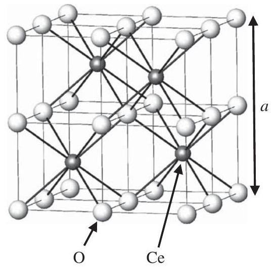
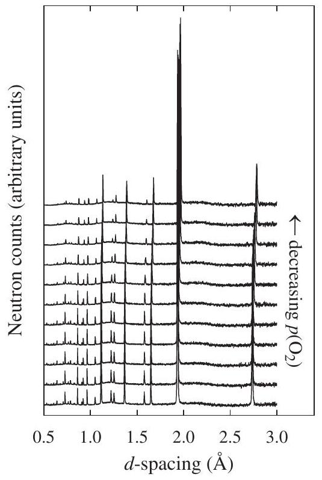
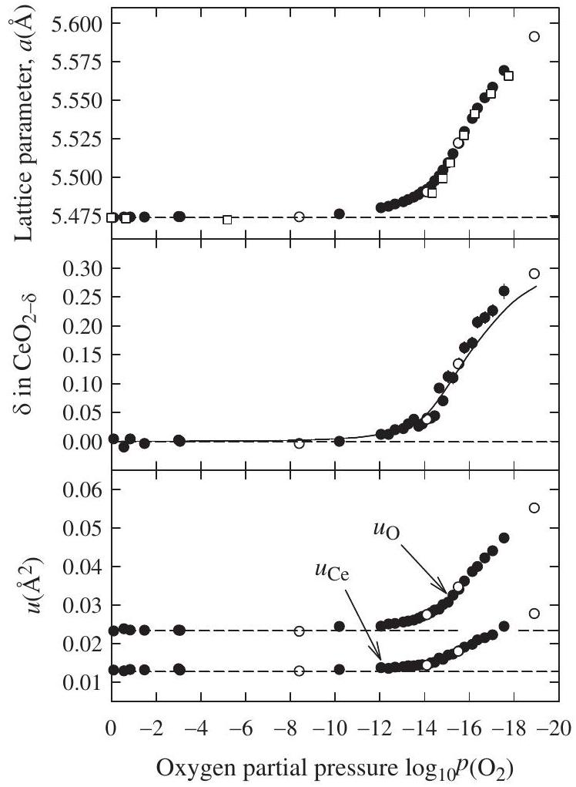
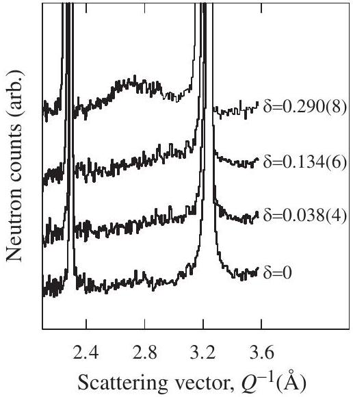
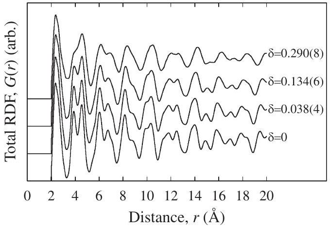
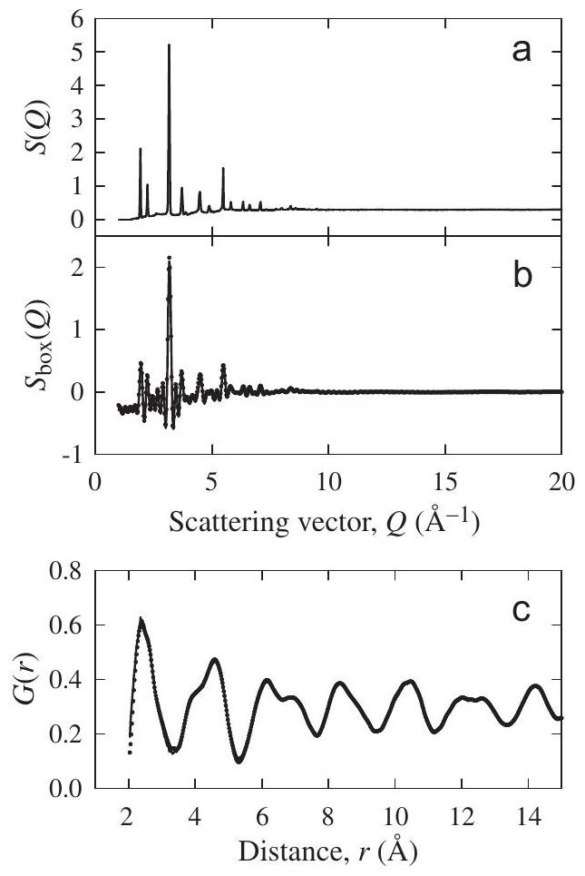
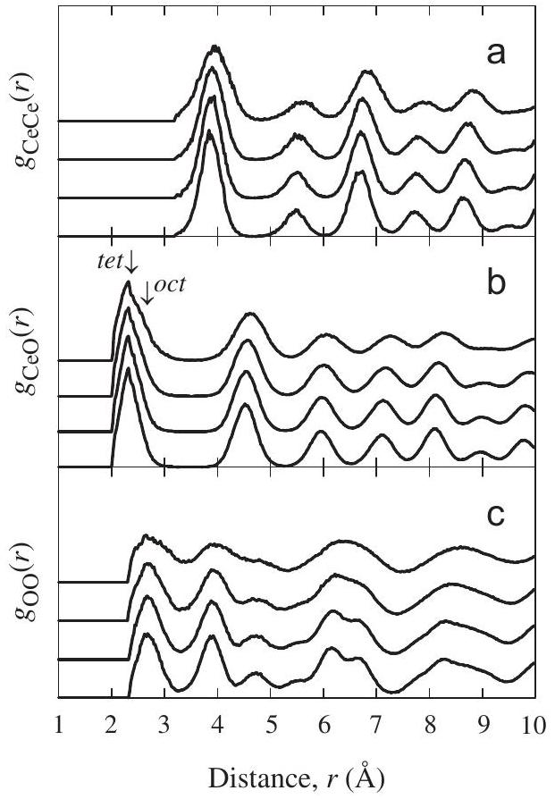
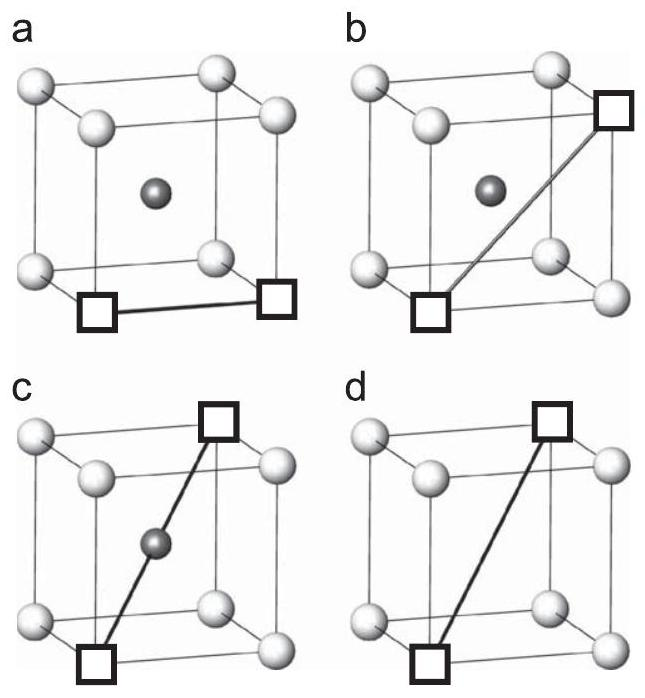
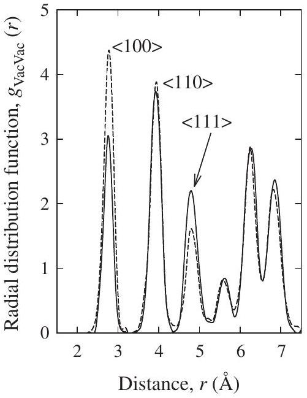
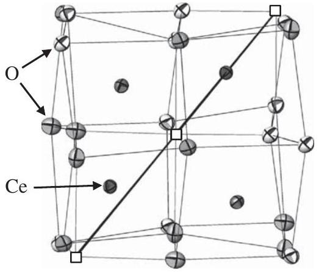

# Oxygen vacancy ordering within anion-deficient Ceria 

S. Hull ${ }^{\mathrm{a}, *}$, S.T. Norberg ${ }^{\mathrm{a}, \mathrm{b}}$, I. Ahmed ${ }^{\mathrm{a}, \mathrm{b}}$, S.G. Eriksson ${ }^{\mathrm{b}}$, D. Marrocchelli ${ }^{\mathrm{c}}$, P.A. Madden ${ }^{\mathrm{c}, \mathrm{d}}$ ${ }^{\mathrm{a}}$ The ISIS Facility, Rutherford Appleton Laboratory, Chilton, Didcot, Oxfordshire OX11 0QX, UK ${ }^{\mathrm{b}}$ Department of Chemical and Biological Engineering, Chalmers University of Technology, SE-412 96 Gothenburg, Sweden ${ }^{\mathrm{c}}$ School of Chemistry, Edinburgh University, The King's Building, West Mains Road, Edinburgh EH9 3JJ, UK ${ }^{\mathrm{d}}$ Department of Materials, University of Oxford, Parks Road, Oxford OX1 3PH, UK

## ARTICLE INFO

## Article history:

Received 18 June 2009
Received in revised form
22 July 2009
Accepted 24 July 2009
Available online 3 August 2009

## Keywords:

Crystal defects
Neutron diffraction
Diffuse scattering
Ionic conduction
Oxygen vacancies

#### Abstract

The structural properties of anion deficient ceria, $\mathrm{CeO}_{2-\delta}$, have been studied as a function of oxygen partial pressure, $p\left(\mathrm{O}_{2}\right)$, over the range $0 \geq \log _{10} p\left(\mathrm{O}_{2}\right) \geq-18.9$ at $1273(2) \mathrm{K}$ using the neutron powder diffraction technique. Rietveld refinement of the diffraction data collected on decreasing $p\left(\mathrm{O}_{2}\right)$ showed increases in the cubic lattice parameter, $a$, the oxygen nonstoichiometry, $\delta$, and the isotropic thermal vibration parameters, $u_{\mathrm{Ce}}$ and $u_{\mathrm{O}}$, starting at $\log _{10} p\left(\mathrm{O}_{2}\right) \sim-11$. The increases are continuous, but show a distinct kink at $\log _{10} p\left(\mathrm{O}_{2}\right) \sim-14.5$. Analysis of the total scattering (Bragg plus diffuse components) using reverse Monte Carlo (RMC) modelling indicates that the $\mathrm{O}^{2-}$ vacancies preferentially align as pairs in the <111> cubic directions as the degree of nonstoichiometry increases. This behaviour is discussed with reference to the chemical crystallography of the $\mathrm{CeO}_{2}-\mathrm{Ce}_{2} \mathrm{O}_{3}$ system at ambient temperature and, in particular, to the nature of the long-range ordering of $\mathrm{O}^{2-}$ vacancies within the crystal structure of $\mathrm{Ce}_{7} \mathrm{O}_{12}$.

© 2009 Elsevier Inc. All rights reserved.

## 1. Introduction

Solid oxide fuel cells (SOFCs) are a key technology in the strategy to develop more environmentally benign power sources. A critical component within an SOFC device is the solid electrolyte, which transfers $\mathrm{O}^{2-}$ ions from the air side (cathode) to the fuel side (anode) of the device, with charge balance maintained by the motion of electrons in the reverse direction through an external circuit, which is exploited as electrical power. Two major requirements of the solid electrolyte are, therefore, a high oxide-ion conductivity, $\sigma_{i}$, and a low electronic conductivity, $\sigma_{e}$, with the latter essential to avoid internal short-circuits. Currently, the material most widely used for the role of solid electrolyte in SOFCs is yttria stabilised zirconia (YSZ, of formula $\mathrm{Zr}_{1-x} \mathrm{Y}_{x} \mathrm{O}_{2-x / 2}$ with $x \sim 0.15$ ) [1]. However, SOFCs must generally be operated at temperatures of $\sim 1200 \mathrm{~K}$ to achieve the required level of ionic conductivity within the YSZ electrolyte and the potential advantages of operation at lower temperatures of around $600-900 \mathrm{~K}$, which include reduced problems of corrosion, sealing and start-up times, have motivated considerable research effort to identify materials with higher values of $\sigma_{i}$ than YSZ. These include $\mathrm{ZrO}_{2}$ doped with other trivalent species (such as $\mathrm{Sc}^{3+}$ [2]), isovalently doped $\mathrm{Bi}_{2} \mathrm{O}_{3}$ (including $\mathrm{Bi}_{1-x} \mathrm{Y}_{x} \mathrm{O}_{3 / 2}$ with $x \sim 0.25$ [3]) and aliovalently doped $\mathrm{CeO}_{2}$ (such as $\mathrm{Ce}_{1-x} \mathrm{Sm}_{x} \mathrm{O}_{2-x / 2}$ with $x \sim 0.2$

[^0][4]). All these compounds, including YSZ, possess the cubic fluorite crystal structure (space group $F m \overline{3} m$ ), which can be described as cations occupying alternate cube centres within a simple cubic array of anions (see Fig. 1) or as anions occupying all the tetrahedral interstices within a face centred cubic (f.c.c.) array of cations. Significantly, these compounds are also anion deficient, with a high concentration of oxygen vacancies which play a central role in promoting the macroscopically observed ionic conductivity.

Many of the candidate materials mentioned above have a potential drawback, owing to the onset of electronic conduction under the strongly reducing atmospheres experienced on the fuel side of the SOFC. This is particularly true of the $\mathrm{CeO}_{2}$ based systems [4-7]. Nonstoichiometric $\mathrm{CeO}_{2-\delta}$ is predominantly an electronic n-type semiconductor at elevated temperatures [8-10], with the ionic contribution to the total conductivity reported to be only a few percent [11]. The replacement of some of the $\mathrm{Ce}^{4+}$ with $\mathrm{Ce}^{3+}$ is compensated by the inclusion of anion vacancies [12], with X-ray diffraction studies showing that the alternative mechanism involving cation interstitials accounts for $<0.1 \%$ of the total defect concentration [13]. Ionic conduction is then a consequence of anion motion via a vacancy diffusion mechanism between nearest neighbour sites in < 100 > directions [14].

The phase diagram of the $\mathrm{CeO}_{2-\delta}$ system has been extensively studied and a number of crystalline phases are formed at temperatures less than around 700 K in which the anion vacancies are long-range ordered within the lattice (see, for example, [15-24]). Compounds of stoichiometry $\mathrm{Ce}_{32} \mathrm{O}_{58}, \mathrm{Ce}_{32} \mathrm{O}_{56}$ and

Fig. 1. The cubic fluorite structure of stoichiometric $\mathrm{CeO}_{2}$. The space group is $F m \overline{3} m$, with cations at the 4(a) sites at $0,0,0$, etc. and the oxygen atoms at the 8 (c) sites at $1 / 4,1 / 4,1 / 4$, etc.

$\mathrm{Ce}_{32} \mathrm{O}_{55}$ were originally reported, but their compositions were subsequently corrected to $\mathrm{Ce}_{11} \mathrm{O}_{20}, \mathrm{Ce}_{9} \mathrm{O}_{16}$ and $\mathrm{Ce}_{7} \mathrm{O}_{12}$, respectively (see [21,22] and references therein). The observation of superlattice lines in neutron diffraction patterns supported the presence of these phases, plus another of stoichiometry $\mathrm{Ce}_{10} \mathrm{O}_{18}$, with the four compounds suggested to be the $n=7,9,10$ and 11 members of a homologous series of composition $\mathrm{Ce}_{n} \mathrm{O}_{2 n-2}$ [20]. The $n=7$ and 11 compounds have also been observed in specific heat and electron microscopy studies, with evidence for additional phases with compositions close to $\mathrm{Ce}_{19} \mathrm{O}_{34}$ and $\mathrm{Ce}_{62} \mathrm{O}_{112}$ [17,18]. The crystal structures of the $n=4,7$ and 11 members ( $\mathrm{Ce}_{2} \mathrm{O}_{3}, \mathrm{Ce}_{7} \mathrm{O}_{12}$ and $\mathrm{Ce}_{11} \mathrm{O}_{20}$, respectively) have been determined and the nature of the $\mathrm{O}^{2-}$ vacancy ordering schemes discussed [19,25]. At higher temperatures, long-range ordering of the vacancies is lost and an anion-deficient cubic fluorite structured phase is stable down to a nonstoichiometry of $\delta \sim 0.29$ at 1273 K [23]. A number of studies of the lattice expansion of $\mathrm{CeO}_{2-\delta}$ as a function of oxygen partial pressure, $p\left(\mathrm{O}_{2}\right)$, have been published using X-ray diffraction and dilatometry techniques [12,26-29]. At temperatures in the region of 1273 K , significant expansion of the lattice is observed at $\log _{10} p\left(\mathrm{O}_{2}\right)$ values $\lesssim-11$, though there are some differences between the various results reported. The most recent study showed a marked change in the lattice expansivity at $\delta \sim 0.06$ and 1273 K , which was suggested to arise from short-range ordering of the anion vacancies within the cubic fluorite lattice as their concentration increases [29].

This paper describes a neutron powder diffraction study of the structural behaviour of $\mathrm{CeO}_{2-\delta}$ as a function of nonstoichiometry, with Rietveld refinement of the Bragg scattering used to investigate the time-averaged crystal structure and reverse Monte Carlo (RMC) analysis of the total scattering (Bragg plus diffuse scattering) used to probe the short-range correlations between the $\mathrm{O}^{2-}$ vacancies.

## 2. Experimental details

Powdered, stoichiometric $\mathrm{CeO}_{2}$ of stated purity $99.995 \%$ was supplied by the Aldrich Chemical Company and formed into 20 pellets, each of 6 mm diameter and $2-3 \mathrm{~mm}$ thickness. These discs were stacked vertically on top of a porous silica glass frit within a silica glass tube of wall thickness 0.5 mm . This tube passes vertically through the hot zone of a resistive heating furnace designed for neutron powder diffraction experiments, constructed using vanadium foil heating element and heat shields. All measurements were performed at a temperature of $1273(2) \mathrm{K}$, with gas flowing through the silica tube at a rate of 80 sccm . Gas mixtures of $\mathrm{O}_{2}, \mathrm{Ar}, \mathrm{CO}_{2}$ and CO
were used to provide variable oxidising/reducing atmosphere around the sample pellets, with the gas flow and composition controlled by a gas panel (Hastings 300 series mass flow controllers) interfaced to the control PC of the diffractometer. The temperature and partial pressure of oxygen within the silica tube was monitored using a type DS zirconia sensor supplied by Australian Oxytrol Systems. Measurements were started under an atmosphere of pure $\mathrm{O}_{2}$ gas ( $\log _{10} p\left(\mathrm{O}_{2}\right) \sim 0$ ), with the sample gradually reduced to $\log _{10} p\left(\mathrm{O}_{2}\right)$ of -18.9 (obtained with pure CO gas). A more detailed description of the sample cell, gas panel and control system can be found elsewhere [30].

The diffraction experiments were performed using the Polaris powder diffractometer at the ISIS Facility, Rutherford Appleton Laboratory, UK [31]. Diffraction data were collected using the backscattering detector bank which covers the scattering angles $130^{\circ}<2 \theta<160^{\circ}$ (providing data over the $d$-spacing range $0.2<d(\AA)<3.2$ with a resolution $\Delta d / d \sim 5 \times 10^{-3}$ ) and the lowangle detector bank situated at $28^{\circ}<2 \theta<42^{\circ}$ (providing data over the $d$-spacing range $0.5<d(\AA)<8.3$ with a resolution of $\Delta d / d \sim 10^{-2}$ ). Two data collection runs were performed as a function of oxygen partial pressure. In the first, diffraction data were collected for approximately 15 min at 45 different $p\left(\mathrm{O}_{2}\right)$ values, with data collection started 5 min after changing the gas composition to allow equilibration. This provided data of sufficient statistical quality to allow Rietveld profile refinement of the data to be performed using the GSAS software [32], to extract the variation of the cubic lattice parameter, $a$, the oxygen nonstoichiometry, $\delta$ in $\mathrm{CeO}_{2-\delta}$, and the isotropic thermal vibration parameters of the two species, $u_{\mathrm{Ce}}$ and $u_{\mathrm{O}}$. Additional fitted parameters for each detector bank comprised a scale factor, peak width parameters describing Gaussian and Lorentzian contributions to the Bragg profile and the coefficients of a 15th order shifted Chebyshev polynomial function to describe the background scattering, which predominantly arises from the silica glass tube.

The measured scattering between the Bragg peaks also contains weak diffuse scattering, which contains information concerning short-range ion-ion correlations within the sample. This aspect was studied in a second run (starting with newly prepared pellets) with significantly longer data collections $(10-12 \mathrm{~h})$ performed at $\log _{10} p\left(\mathrm{O}_{2}\right)$ values of $-8.4(2),-14.1(2)$, $-15.5(2)$ and $-18.9(2)$. The data were corrected for the effects of beam attenuation and background scattering from the silica tube and furnace using the program Gudrun [33], to give the total scattering function, $S(Q)$ (where the scattering vector $Q$ is related to the interplanar spacing ( $d$-spacing) by $Q=2 \pi / d$ ). Fourier transform of $S(Q)$ gives the total radial distribution function, $G(r)$, which is the sum of the individual radial distribution functions, $g_{i j}(r)$, for each pair of ionic species, weighted by a factor $c_{i} c_{j} b_{i} b_{j}$ (where $c_{i}$ and $b_{i}$ are the concentration and neutron scattering length of species $i$, respectively). Reverse Monte Carlo (RMC) simulations were performed using the RMCProfile software [34] with configuration boxes of $10 \times 10 \times 10$ unit cells. The positions of the ions are then adjusted randomly, one at a time and subject to periodic boundary conditions, to obtain the best fit to both the real space data (fitting to $G(r)$ ) and the reciprocal space data (fitting to $S(Q)$ ), whilst also using the Bragg profile to provide the constraint of long-range crystallinity. Since the $S(Q)$ is calculated within the RMCProfile code by Fourier transformation of the $G(r)$ determined from the (finite) simulation box, it will be broadened in $Q$ due to the limited range of $r$. As a result, it is necessary to convolve the experimental $S(Q)$ with a box function to obtain $S_{\text {box }}(Q)$ using the expression
$S_{\text {box }}(Q)=\frac{1}{\pi} \int_{-\infty}^{\infty} S\left(Q^{\prime}\right) \frac{\sin L\left(Q-Q^{\prime}\right) / 2}{Q-Q^{\prime}} \mathrm{d} Q^{\prime}$,
where $L$ is the size of the simulation box.

Fig. 2. The evolution of the neutron powder diffraction pattern of $\mathrm{CeO}_{2-\delta}$ measured at $1273(2) \mathrm{K}$ on decreasing oxygen partial pressure, $p\left(\mathrm{O}_{2}\right)$. From bottom to top, the spectra were obtained at $\log _{10} p\left(\mathrm{O}_{2}\right)$ values of $-0.1,-3.3,-8.3,-10.2$, $-12.1,-14.1,-14.8,-15.5,-16.4,-17.0$ and -17.6 .

## 3. Results

The evolution of the neutron powder diffraction pattern of $\mathrm{CeO}_{2-\delta}$ as a function of oxygen partial pressure, $p\left(\mathrm{O}_{2}\right)$, at $1273(2) \mathrm{K}$ is illustrated in Fig. 2. No significant changes in the diffraction pattern are observed on decreasing $\log _{10} p\left(\mathrm{O}_{2}\right)$ to $\sim-14.5$, but further reduction results in a gradual expansion of the lattice and changes in the relative intensities of certain Bragg peaks (such as the (222) and (113) reflections seen at $d$-spacings of $\sim 1.58$ and $\sim 1.65 \AA$, respectively, or the (133) and (024) reflections at around $1.25 \AA$ ). This behaviour is also accompanied by a reduction in the relative intensities of the Bragg peaks at low $d$-spacings, which is consistent with an increase in one or both of the thermal vibration parameters of the ions. Clearly, a more detailed analysis of the diffraction data is required to investigate these issues further.

### 3.1. Rietveld refinements

The structural behaviour of $\mathrm{CeO}_{2-\delta}$ over the oxygen partial pressure range $-18.9 \leq \log _{10} p\left(\mathrm{O}_{2}\right) \leq 0$ at $1273(2) \mathrm{K}$ is illustrated in Fig. 3 using the results obtained by the Rietveld refinement of the neutron powder diffraction data. The results obtained for the four long data collections are summarised in Table 1. With the four gases available and the minimum gas flows possible with the gas mixing panel, it was only possible to perform diffraction studies at a few different oxygen partial pressures within the range $\sim-11 \leq \log _{10} p\left(\mathrm{O}_{2}\right) \leq \sim-3$. However, inspection of the fitted values of the cubic lattice parameter, $a$, the oxygen nonstoichiometry, $\delta$, and the isotropic thermal vibration parameters, $u_{\mathrm{Ce}}$ and $u_{\mathrm{O}}$, shown in Figs. 3a-c, respectively, show no evidence of any significant change in the structural properties of $\mathrm{CeO}_{2-\delta}$ over this range of $\log _{10} p\left(\mathrm{O}_{2}\right)$.

As illustrated in Fig. 3a, a gradual increase in the lattice parameter, $a$, of $\mathrm{CeO}_{2-\delta}$ is observed with decreasing oxygen partial pressure for $\log _{10} p\left(\mathrm{O}_{2}\right)<\sim-11$, which is consistent with the gradual reduction of some $\mathrm{Ce}^{4+}$ to $\mathrm{Ce}^{3+}$ since the latter species is somewhat larger ( $r_{\mathrm{Ce}}^{4+}=0.97 \AA$ and $r_{\mathrm{Ce}}^{3+}=1.143 \AA$, both for 8 -fold co-ordination [35]). This interpretation is consistent with the

Fig. 3. The variation of (a) the cubic lattice parameter, $a$ (b) the oxygen nonstoichiometry, $\delta$, in $\mathrm{CeO}_{2-\delta}$ and (c) the isotropic thermal vibration parameters, $u_{\mathrm{Ce}}$ and $u_{\mathrm{O}}$, as a function of oxygen partial pressure, $\log _{10} p\left(\mathrm{O}_{2}\right)$, at $1273(2) \mathrm{K}$. The closed and open circles denote short and long neutron data collection times, respectively. The square symbols in (a) show the data obtained by X-ray diffraction methods by Wang et al. [29], whilst the solid line in (b) represents a compilation of previously reported gravimetric data [38].

observed increase in the nonstoichiometry $\delta$ over the same range of oxygen partial pressure (Fig. 3b), as the concentration of charge compensating vacancies within the anion sublattice increases. The maximum value of $\delta=0.290$ (8) reached at $\log _{10} p\left(\mathrm{O}_{2}\right)=-18.9$ represents the lowest value of oxygen partial pressure that can be obtained with our current experimental setup and is close to the limit of the anion deficient fluorite structured phase within the $\mathrm{CeO}_{2-\delta}$ system at the experimental temperature of 1273(2)K [23]. Indeed, the phase diagram reported by Bevan and Kordis [22] suggests that a vacancy ordered phase of composition $\mathrm{Ce}_{7} \mathrm{O}_{12}$ (i.e., $\delta=0.286$ ) is stable under these conditions. However, a subsequent single crystal diffraction study showed that $\mathrm{Ce}_{7} \mathrm{O}_{12}$ undergoes a transition to a disordered fluorite structured phase at $\sim 1072 \mathrm{~K}$ [25], which is consistent with our data and suggests that the phase behaviour in this region of the phase diagram needs to be clarified.

The behaviour of $a$ and $\delta$ as a function of $\log _{10} p\left(\mathrm{O}_{2}\right)$ has been studied previously (see, for example, [29] and [22,36-38], respectively) and, as illustrated in Fig. 3a and b, the results presented here are in good agreement with the reported data. The $\delta$ values obtained at the lowest oxygen partial pressures in this neutron diffraction study are slightly higher than that given by a compilation of previous gravimetric measurements [38] and probably reflects the very different nature of the two techniques used. Of particular interest for this work are the structural properties of $\mathrm{CeO}_{2-\delta}$ under reducing conditions, which have not been studied in any detail to date. The behaviour of the isotropic thermal vibration parameters for the cations and anions, $u_{\mathrm{Ce}}$ and $u_{\mathrm{O}}$, on decreasing oxygen partial pressure is shown in Fig. 3c and mirrors that of $a$ and $\delta$. However, since the temperature is held

Table 1
Summary of the results obtained by Rietveld refinement of the neutron powder diffraction data collected for long times (10-12 h) at T=1273(2)K and with the gas mixtures indicated.
| Gas mixture | 100\%Ar | $50 \% \mathrm{CO}_{2}-50 \% \mathrm{CO}$ | $15 \% \mathrm{CO}_{2}-85 \% \mathrm{CO}$ | 100\%CO |
| :--- | :--- | :--- | :--- | :--- |
| Partial pressure, $\log _{10} p\left(\mathrm{O}_{2}\right)$ | -8.4(2) | -14.1(2) | -15.5(2) | -18.9(2) |
| Lattice parameter, $a(\AA)$ | 5.47441(1) | 5.49054(1) | 5.52235(2) | 5.59130(2) |
| Thermal parameters $u_{\mathrm{Ce}}\left(\AA^{2}\right)$ | 0.0129(1) | 0.0144(1) | 0.0180(2) | 0.0278(3) |
| Thermal parameters $u_{\mathrm{O}}\left(\AA^{2}\right)$ | 0.0232(1) | 0.0265(1) | 0.0347(2) | 0.0552(3) |
| O site occupancy, $m_{\mathrm{O}}$ | 1.002(3) | 0.981(2) | 0.933(3) | 0.855(4) |
| $\delta$ in $\mathrm{CeO}_{2-\delta}\left(=2\left(1-m_{\mathrm{O}}\right)\right)$ | -0.004(6) | 0.038(4) | 0.134(6) | 0.290(8) |
| Weighted $R$-factor, $R_{\mathrm{WP}}$ | 0.0090 | 0.0076 | 0.0080 | 0.0075 |
| Expected $R$-factor, $R_{\text {EXP }}$ | 0.0033 | 0.0029 | 0.0030 | 0.0032 |
| Number of data points | 4502 | 4502 | 4502 | 4502 |
| Number of variables | 14 | 14 | 14 | 14 |
| Number of Bragg peaks | 174 | 181 | 183 | 190 |

Fig. 4. A portion of the neutron diffraction patterns of $\mathrm{CeO}_{2-\delta}$ collected at $T=1273(2) \mathrm{K}$ and nonstoichiometries of $\delta=0,0.038(4), 0.134(6)$ and $0.290(8)$, showing the appearance of weak diffuse scattering in the latter case at scattering vectors of $Q \sim 2.7 \AA^{-1}$.

constant at $1273(2) \mathrm{K}$, these trends are probably reflecting an increase in the extent of disorder within the crystalline lattice, with a higher fraction of both ionic species significantly displaced away from their regular (fluorite) lattice sites as the $\mathrm{O}^{2-}$ vacancy concentration increases.

### 3.2. Total scattering analysis

Analysis of the total neutron scattering data considers both the Bragg scattering and the diffuse scattering components. The latter arises from short-range instantaneous correlations between the positions of ions and is observed as broad undulations in the total scattering function $S(Q)$ at $Q$ values between the Bragg peaks (see Fig. 4). As discussed in Section 2, Fourier transform of $S(Q)$ gives the total radial distribution function, $G(r)$, shown in Fig. 5 for the four stoichiometries. The weighting factor $c_{i} c_{j} b_{i} b_{j}$ has approximate values of $0.026,0.062$ and 0.150 for each of the partial radial distribution functions $g_{\mathrm{CeCe}}(r), g_{\mathrm{CeO}}(r)$ and $g_{\mathrm{OO}}(r)$, respectively (for stoichiometric $\mathrm{CeO}_{2}$, with slight variations as a function of $\delta$ ). As a consequence, the total $G(r)$ will be relatively insensitive to the cation-cation partial radial distribution function, with the other two functions more clearly visible.

The peak in the $G(r)$ 's observed at the shortest distance in Fig. 5 corresponds to the first coordination shell of $\mathrm{O}^{2-}$ around the cation, with a smaller contribution from the closest contacts between pairs of anions. The latter is ignored for the purposes of the current discussion, but will be discussed in the following

Fig. 5. The total radial distribution functions, $G(r)$, of $\mathrm{CeO}_{2-\delta}$ at $T=1273(2) \mathrm{K}$ and at nonstoichiometries of $\delta=0,0.038(4), 0.134(6)$ and $0.290(8)$.

section. The peak maximum in $G(r)$ occurs at $\sim 2.37 \AA$ in the $\delta=0$ case, increasing to $\sim 2.41 \AA$ at $\delta=0.290$ (8). These values are consistent with those expected on the basis of the Rietveld analysis, which gives Ce-O contact distances ( $\sqrt{3} a / 4$, see Fig.1) of 2.370 and $2.421 \AA$, respectively, and indicates that a structural model based on cations sitting at the centre of a cube of anions (some of which may be vacant) gives a good description of both the long-range (averaged) structure and short-range environment. This contrasts with the case in some other anion-deficient cubic fluorite phases, such as $\mathrm{Y}_{3} \mathrm{NbO}_{7}$ [39] and $\delta-\mathrm{Bi}_{2} \mathrm{O}_{3}$ [40]. In the latter case, the local co-ordination around the $\mathrm{Bi}^{3+}$ (a $\mathrm{Bi}-\mathrm{O}$ distance of $\sim 2.18 \AA$ from the $G(r)$ ) is significantly shorter than the values of 2.451 and $2.331 \AA$ given by the averaged structure and is associated with the specific electronic configuration of this cation species [40].

### 3.3. Reverse Monte Carlo modelling

Reverse Monte Carlo analysis of the total neutron scattering data used simulation boxes of $10 \times 10 \times 10$ unit cells, which comprise 4000 cations, plus $8000,7848,7464$ and 6840 anions for the data collected at stoichiometries of $\delta=0.0,0.038(4), 0.134(6)$ and 0.290 (8), respectively. The required number of anion vacancies in the latter three cases were determined by the nonstoichiometry values (given by the Rietveld analysis, see Table 1) and their distribution generated by randomly removing the required number of anions from the $8(c)$ sites.

The quality of the final fits to the data for the total scattering factor, $S(Q)$, and the total radial distribution function, $G(r)$, is illustrated in Fig. 6 for the $\delta=0.290$ (8) case, whilst the partial radial distribution functions, $g_{i j}(r)$, extracted from the final ionic configurations at $\delta=0,0.038(4), 0.134(6)$ and $0.290(8)$ are shown

Fig. 6. Plots of (a) the total scattering factor, $S(Q)$, (b) the fitted total scattering factor, $S_{\text {box }}(Q)$, and (c) the fitted total radial distribution function, $G(r)$ of $\mathrm{CeO}_{2-\delta}$ with $\delta=0.290$ (8) at $T=1273$ (2) K. In the latter two cases, the dots are the experimental data points and the solid line is the calculated profile.

in Fig. 7. As expected, the positions and relative intensities of the peaks in the $g_{\text {CeCe }}(r)$ profile are consistent with an f.c.c. lattice of cations, with the slight broadening and shift to longer $r$ distances observed at $\delta=0.290$ (8) in accord with the results of the Rietveld analysis (Fig. 3) and the appearance of a significant concentration of larger $\mathrm{Ce}^{3+}$ ions within the lattice (note that, since the neutrons are scattered by the Ce nucleus, the technique does not distinguish between $\mathrm{Ce}^{4+}$ and $\mathrm{Ce}^{3+}$ ). In the case of $g_{\mathrm{CeO}}(r)$ (Fig. 7b), the behaviour of the peak at shortest $r$ distance has been discussed above. The coordination number obtained by integrating this peak up to the $r$ value at which $g_{\mathrm{CeO}}(r)$ first returns to zero gives values of $8.00,7.84,7.48$ and 6.82 for $\delta=0,0.038(4)$, $0.134(6)$ and $0.290(8)$, respectively, which are consistent with the change in anion content. A similar analysis for $g_{\text {oce }}(r)$ (not shown) gives values very close to 4 at all stoichiometries, indicating that the $\mathrm{O}^{2-}$ always occupy tetrahedral cavities and there is no evidence of, for example, anions located near the octahedral 4(b) sites. The $g_{\text {oo }}(r)$ 's show the most significant changes as a function of increasing $\delta$ (Fig. 7c), with an increased broadening in the $\delta=0.290(8)$ case which is indicative of an increased disorder within the anion sublattice.

### 3.4. Oxygen vacancy ordering

Initially the fits to the total scattering data allowed the ions within the simulation box to move a maximum distance of $0.08 \AA$ in each step and imposed minimum contact distances of 3.20, 2.04 and $2.34 \AA$ for $\mathrm{Ce}-\mathrm{Ce}, \mathrm{Ce}-\mathrm{O}$ and $\mathrm{O}-\mathrm{O}$ pairs, respectively. This process produced good fits to the $S(Q), G(r)$ and Bragg profile $\left(\chi^{2}=15.7,13.7\right.$ and 6.2 , respectively, for the $\delta=0.290$ (8) data, see Fig. 6). The effect of these constraints is, however, to restrict the motion of each anion to remain within its tetrahedron of surrounding cations. Additional fits were performed using a much larger maximum step length of $3.0 \AA$ for the anion moves, to allow the simulation process to explore

Fig. 7. The partial radial distribution functions (a) $g_{\mathrm{CeCe}}(r)$, (b) $g_{\mathrm{CeO}}(r)$ and (c) $g_{\mathrm{oo}}(r)$ of $\mathrm{CeO}_{2-\delta}$ obtained by RMC analysis of the total scattering data collected at $T=1273$ (2) K. In each case the data illustrate the variation with nonstoichiometry, with the spectra corresponding to $\delta=0$ (bottom), $0.038(4), 0.134(6)$ and $0.290(8)$ (top). In (b), the characteristic $\mathrm{Ce}-\mathrm{O}$ distances corresponding to anions within the tetrahedral (tet) and octahedral (oct) interstices within the face centred cubic cation sublattice are shown.

Fig. 8. Possible anion vacancy ordering schemes within the cubic fluorite lattice, with vacancies (shown as □ ) aligned to form (a) $\langle 100\rangle$, (b) $\langle 110\rangle$, (c) $\langle 111\rangle C$ and (d) $\langle 111\rangle E$ pairs.

the possibility of improving the quality of fit by including some preferential short-range ordering of the anion vacancies (such as those illustrated in Fig. 8) ${ }^{1}$. In the case of stoichiometry $\delta=0.038(4)$, no significant improvement in the quality of the fit was obtained and

[^1]
Fig. 9. The partial radial distribution function $g_{\mathrm{VacVac}}(r)$ extracted from the RMC configuration of $\mathrm{CeO}_{2-\delta}$ with $\delta=0.290$ (8) at $T=1273$ (2) K. The dashed line represents the case of randomly distributed anion vacancies, whilst the solid line shows that obtained by allowing short-range ordering of the vacancies within the RMC fitting procedure.

there is no evidence of any nonrandom arrangement of vacancies. A small improvement to the quality of the fit was observed for the $\delta=0.134(6)$ dataset, though this is of marginal statistical significance. More conclusive evidence for a rearrangement of the anion sublattice was observed for the $\delta=0.290$ (8) data, with final $\chi^{2}$ values of 14.7, 12.9 and 6.1 obtained for the $S(Q), G(r)$ and Bragg data, respectively. As expected, the reductions in $\chi^{2}$ are most significant for $S(Q)$ and $G(r)$, since the Bragg scattering probes the averaged structure and is insensitive to any short-range order of vacancies within the anion sublattice.

As discussed at the end of Section 3.2, the cation sublattice within $\mathrm{CeO}_{2-\delta}$ remains close to an ideal f.c.c. arrangement, even in its most reduced form. As a consequence, a further insight into the nature of the preferred arrangement of the anion vacancies within the $\delta=0.290(8)$ sample can be obtained by dividing the simulation box into $\mathrm{Ce}_{4}$ tetrahedra (centred at the 8 (c) $1 / 4,1 / 4$, $1 / 4$ positions) and $\mathrm{Ce}_{6}$ octahedra (centred at the 4 (b) $1 / 2,1 / 2,1 / 2$ positions). These tetrahedra and octahedra occupy all of the space and, in an ideal (stoichiometric) fluorite lattice, each tetrahedron would have an anion at its centre. In the case of a configuration given by the RMC analysis, the anions are allocated to their nearest tetrahedral cavity (no anions were found within the octahedral holes), so that the location of the vacancies can be taken to be the centres of the unoccupied $\mathrm{Ce}_{4}$ tetrahedra. These positions can then be used to generate a partial radial distribution function, $g_{\text {vacvac }}(r)$, in a manner analogous to that for the ion-ion pairs. Fig. 9 illustrates the nature of the preferred anion vacancy ordering in $\mathrm{CeO}_{2-\delta}$ at 1273 K by comparing the resultant $g_{\text {VacVac }}(r)$ with that obtained by the RMC fit without allowing anions to move between tetrahedra (i.e., retaining the random distribution of vacancies generated in the initial configuration). The first three peaks correspond to pairs of vacancies in the $\langle 100\rangle,\langle 110\rangle$ and $\langle 111\rangle$ directions and it is clear that the latter are favoured at the expense of the former. At longer $r$ distances the two $g_{\mathrm{VacVac}}(r) \mathrm{s}$ are very similar, as expected since no long range ordering of vacancies is likely within such a disordered system at this temperature.

## 4. Discussion

Within the fluorite lattice (Fig. 1) it is possible to identify two different kinds of $\langle 111\rangle$ vacancy pair, distinguished by whether
or not the cube contains a cation at its centre. These two possibilities are not differentiated in the $g_{\text {vacVac }}(r)$ shown in Fig. 9, but can be identified by performing a direct analysis of the arrangement of anion vacancies within the RMC configuration which simply counts the number of $\langle 100\rangle,\langle 110\rangle,\langle 111\rangle C$ and $\langle 111\rangle E$ vacancy pairs (where $\langle 111\rangle C$ and $\langle 111\rangle E$ denote $\langle 111\rangle$ vacancy pairs with and without a central cation, respectively, see Fig. 8). For a purely random arrangement of vacancies the proportion of each type of vacancy pair is given by the relative multiplicity of each of the directions ( $0.231: 0.461: 0.308$ ), with the latter comprising equal numbers of $\langle 111\rangle C$ and $\langle 111\rangle E$ pairs. As shown in Table 2, and discussed in Section 3.4, at a stoichiometry of $\delta=0.038(4)$ the vacancy arrangement remains essentially random, whilst there is some (marginally significant) preference for $\langle 111\rangle$ pairs at $\delta=0.134$ (6). In the case of $\delta=0.290$ (8) the number of $\langle 100\rangle$ pairs is markedly smaller than that expected for a random distribution of vacancies and is compensated by the increase in the number of <111> pairs, but there is no evidence for one particular type of $\langle 111\rangle$ vacancy pair over the other.

At the highest level of nonstoichiometry in this study ( $\delta=0.290(8)$ ) the composition of the sample ( $\mathrm{CeO}_{1.710(8)}$ ) is close to that of the phase $\mathrm{Ce}_{7} \mathrm{O}_{12}\left(\mathrm{CeO}_{1.714}\right)$. $\mathrm{Ce}_{7} \mathrm{O}_{12}$ is stable at ambient temperature and transforms to the anion-deficient, cubic fluorite structured phase at $\sim 1072 \mathrm{~K}$ [25]. The structure of $\mathrm{Ce}_{7} \mathrm{O}_{12}$ is fluorite related (space group $R \overline{3}$, with $a=6.785(1) \AA$ and $\alpha=99.42^{\circ}$ [25]) and the shortest distance between anion vacancies within its ordered structure is in $\langle 111\rangle$ directions. However, as shown in Fig. 10, the $\langle 111\rangle$ anion vacancy pairs are themselves aligned in pairs, so that there are equal numbers of $\langle 111\rangle C$ and $\langle 111\rangle E$ pairs. Thus, the presence of these $\langle 111\rangle$ vacancy pairs appears to be a common feature of both $\mathrm{Ce}_{7} \mathrm{O}_{12}$ and the anion-deficient cubic fluorite phase observed at elevated temperatures and supports the observation that $\langle 111\rangle$ anion vacancy pairs are a common structural motif within aniondeficient fluorite-related lanthanide oxides, including $\mathrm{PrO}_{2-\delta}$ [41] and $\mathrm{TbO}_{2-\delta}$ [42]. The correspondence between the short-range

Table 2
The relative population of anion vacancy pairs of type $\langle 100\rangle,\langle 110\rangle,\langle 111\rangle C$ and $\langle 111\rangle E$ expected for a random distribution of vacancies within a cubic fluorite lattice, compared with those extracted from the RMC configurations obtained at nonstoichiometries of $\delta=0.038(4)$, 0.134(6) and $0.290(8)$.
|  | $\langle 100\rangle$ | $\langle 110\rangle$ | $\langle 111\rangle C$ | $\langle 111\rangle E$ |
| :--- | :--- | :--- | :--- | :--- |
| Random | 0.231 | 0.461 | 0.154 | 0.154 |
| $\delta=0.038(4)$ | $0.24(2)$ | $0.49(4)$ | $0.14(2)$ | $0.13(2)$ |
| $\delta=0.134(6)$ | $0.20(1)$ | $0.46(2)$ | $0.17(1)$ | $0.17(1)$ |
| $\delta=0.290(8)$ | $0.143(6)$ | $0.430(16)$ | $0.218(9)$ | $0.209(9)$ |

Fig. 10. A portion of the crystal structure of $\mathrm{Ce}_{7} \mathrm{O}_{12}$, illustrating the linked $\langle 111\rangle C$ and $\langle 111\rangle E$ anion vacancy pairs [25].

order of anion vacancies within cubic solid solutions and (lower symmetry) long range ordered phases also occurs within anion deficient fluorite structured compounds in which the anion vacancy concentration is controlled by aliovalent cation doping, including the $\mathrm{Zr}_{1-x} \mathrm{Y}_{x} \mathrm{O}_{2-x / 2}$ system in which the $\mathrm{O}^{2-}$ vacancies form pairs in $\langle 111\rangle$ directions and aggregate into clusters resembling the (long-range ordered) structure of the phase $\mathrm{Zr}_{3} \mathrm{Y}_{4} \mathrm{O}_{12}$ [43,44].

The most recent X-ray diffraction study of the lattice parameter of $\mathrm{CeO}_{2-\delta}$ under reducing conditions showed a marked change in the lattice expansivity at a nonstoichiometry of $\delta \sim 0.06$ at 1273 K [29], which is consistent with the apparent 'kink' in the oxygen partial pressure dependence of $a, \delta, u_{\mathrm{Ce}}$ and $u_{\mathrm{O}}$ at $\log _{10} p\left(\mathrm{O}_{2}\right) \sim-14.5$ illustrated in Fig. 3. The results presented in Table 2 imply that this feature is associated with the onset of the observed $\langle 111\rangle$ vacancy ordering as the anion deficiency increases, confirming an earlier suggestion by Wang et al. [29]. However, a more detailed investigation in the $\log _{10} p\left(\mathrm{O}_{2}\right)$ range from -12 to -16 is required in order to make a more definitive assignment. Unfortunately, the experimental approach used here is unlikely to have sufficient sensitivity at such low vacancy concentrations and other methods, including computer simulation techniques, are required. In this context, it is encouraging that some progress is currently being made in describing the interionic interactions within $\mathrm{Ce}^{4+}$ and $\mathrm{Ce}^{3+}$ oxides [45-48].

## 5. Conclusions

Analysis of neutron powder diffraction data for $\mathrm{CeO}_{2-\delta}$ as a function of oxygen partial pressure at a temperature of 1273(2)K shows that significant structural changes occur below $\log _{10} p\left(\mathrm{O}_{2}\right) \sim-11$, with increases in the lattice parameter, $a$, the nonstoichiometry, $\delta$, and the two isotropic thermal vibration parameters, $u_{\mathrm{Ce}}$ and $u_{\mathrm{O}}$, associated with the increased presence of oxygen vacancies which preferentially align as pairs in $\langle 111\rangle$ directions. From an applications point-of-view, the reducing atmosphere on the anode (fuel) side of a solid oxide fuel cell (SOFC) typically reaches $\log _{10} p\left(\mathrm{O}_{2}\right) \sim-20$ [1]. Clearly, the onset of significant nonstoichiometry would have serious consequences for the application of $\mathrm{CeO}_{2-\delta}$ within SOFCs at temperatures around 1200 K , owing to the appearance of significant electronic conduction and the associated lattice expansion (Fig. 3) which would adversely affect the bonding between the electrolyte and its electrode layers. However, the principle interest in $\mathrm{CeO}_{2}$ based ceramics stems from their improved ionic conductivities at somewhat lower temperatures, especially if the material is doped with trivalent cations to introduce extrinsic anion vacancies to promote oxide-ion conduction. The system $\mathrm{Ce}_{1-x} \mathrm{Y}_{x} \mathrm{O}_{2-x / 2-\delta}$ will form the focus of a future study, to compare the nature of the structural disorder within the fluorite lattice generated by aliovalent doping with $\mathrm{Y}^{3+}$ with that formed by reduction of $\mathrm{Ce}^{4+}$ to $\mathrm{Ce}^{3+}$.

## Acknowledgments

D.M. wishes to thank the UK Engineering and Physical Sciences Research Council (EPSRC) and the Science and Technology Facilities Council (STFC) for his PhD funding. S.T.N. wishes to thank the European Union Research and Technology Development Framework Programme for financial support. The authors are grateful to Richard Haynes, Chris Goodway, Oleg Kirichek, Mo

Chowdhury and Gareth Howells for the design and commissioning of the gas cell and control panel, which was constructed with financial support from the Swedish research council, Vetenskapsrådet.

## References

[1] T. Ishihara, N.M. Sammes, O. Yamamoto, in: S.C. Singhal, K. Kendall (Eds.), High Temperature Solid Oxide Fuel Cells-Fundamentals, Design and Applications, Elsevier, Oxford, 2003.
[2] T.H. Etsell, S.N. Flengas, Chem. Rev. 70 (1970) 339-376.
[3] N.M. Sammes, G.A. Tompsett, H. Näfe, F. Aldinger, J. Eur. Ceram. Soc. 19 (1999) 1801-1826.
[4] H. Inaba, H. Tagawa, Solid State Ionics 83 (1996) 1-16.
[5] M. Gödickemeier, L.J. Gauckler, J. Electrochem. Soc. 145 (1998) 414-421.
[6] M. Mogensen, N.M. Sammes, G.A. Tompsett, Solid State Ionics 129 (2000) 63-94.
[7] H. Yahiro, K. Eguchi, H. Arai, Solid State Ionics 36 (1989) 71-75.
[8] R.N. Blumenthal, R.K. Sharma, J. Solid State Chem. 13 (1975) 360-364.
[9] M.A. Panhans, R.N. Blumenthal, Solid State Ionics 60 (1993) 279-298.
[10] H.L. Tuller, A.S. Nowick, J. Electrochem. Soc. 126 (1979) 209-217.
[11] M. Mogensen, T. Lindegaard, U.R. Hansen, G. Mogensen, J. Electrochem. Soc. 141 (1994) 2122-2128.
[12] H.W. Chang, R.N. Blumenthal, R.A. Fournelle, Solid State Ionics 66 (1993) 85-95.
[13] J. Faber Jr., M.A. Seitz, M.H. Mueller, J. Phys. Chem. Solids 37 (1976) 903-907.
[14] A. Gotte, D. Spångberg, K. Hermansson, M. Baudin, Solid State Ionics 178 (2007) 1421-1427.
[15] V. Perrichon, A. Laachir, G. Bergeret, R. Fréty, L. Tournayan, O. Touret, J. Chem. Soc. Faraday Trans. 90 (1994) 773-781.
[16] F. Vasiliu, V. Pârvulescu, C. Sârbu, J. Mater. Sci. 29 (1994) 2095-2101.
[17] P. Knappe, L. Eyring, J. Solid State Chem. 58 (1985) 312-324.
[18] M. Ricken, J. Nolting, I. Riess, J. Solid State Chem. 54 (1984) 89-99.
[19] S.P. Ray, D.E. Cox, J. Solid State Chem. 15 (1975) 333-343.
[20] S.P. Ray, A.S. Nowick, D.E. Cox, J. Solid State Chem. 15 (1975) 344-351.
[21] D.J.M. Bevan, J. Inorg. Nucl. Chem. 1 (1955) 49-56.
[22] D.J.M. Bevan, J. Kordis, J. Inorg. Nucl. Chem. 26 (1964) 1509-1523.
[23] I. Riess, M. Ricken, J. Nölting, J. Solid State Chem. 57 (1985) 314-322.
[24] M. Zinkevich, D. Djurovic, F. Aldinger, Solid State Ionics 177 (2006) 989-1001.
[25] E.A. Kümmerle, G. Heger, J. Solid State Chem. 147 (1999) 484-500.
[26] J.R. Sims, R.N. Blumenthal, High Temp. Sci. 8 (1976) 99-110.
[27] J.R. Sims, R.N. Blumenthal, High Temp. Sci. 8 (1976) 111-119.
[28] J.R. Sims, R.N. Blumenthal, High Temp. Sci. 8 (1976) 121-128.
[29] S. Wang, M. Katsuki, T. Hashimoto, M. Dokiya, J. Electrochem. Soc. 150 (2003) A952-A958.
[30] R. Haynes, S.T. Norberg, S.G. Eriksson, M.A.H. Chowdhury, C.M. Goodway, G.D. Howells, O. Kirichek, S. Hull, J. Phys.: Conference Series, submitted for publication.
[31] S. Hull, R.I. Smith, W.I.F. David, A.C. Hannon, J. Mayers, R. Cywinski, Physica B 180-181 (1992) 1000-1002.
[32] A.C. Larson, R.B. von Dreele, Los Alamos National Laboratory Report, LAUR 86748, 1994.
[33] A.K. Soper, Gudrun - A Computer Program Developed for Analysis of Neutron Diffraction Data, <http://www.isis.rl.ac.uk/disordered/dmgroup_home.htm >.
[34] M.G. Tucker, D.A. Keen, M.T. Dove, A.L. Goodwin, Q. Hui, J. Phys. Condens. Matter 19 (2007) 335218.
[35] R.D. Shannon, Acta Cryst. A 32 (1976) 751-767.
[36] J. Campserveux, P. Gerdanian, J. Solid State Chem. 23 (1978) 73-92.
[37] R.J. Panlener, R.N. Blumenthal, J.E. Garnier, J. Phys. Chem. Solids 36 (1975) 1213-1222.
[38] S. Wang, H. Inaba, H. Tagawa, T. Hashimoto, J. Electrochem. Soc. 144 (1997) 4076-4080.
[39] S.T. Norberg, I. Ahmed, S. Hull, D. Marrocchelli, P.A. Madden, J. Phys. Condens. Matter 21 (2009) 215401.
[40] C.E. Mohn, S. Stølen, S.T. Norberg, S. Hull, Phys. Rev. Lett. 102 (2009) 155502.
[41] E. Schweda, D.J.M. Bevan, L. Eyring, J. Solid State Chem. 90 (1991) 109-125.
[42] N.C. Baenziger, H.A. Eick, H.S. Schuldt, L. Eyring, J. Am. Chem. Soc. 83 (1961) 2219-2223.
[43] M. Fèvre, A. Finel, R. Caudron, Phys. Rev. B 72 (2005) 104117.
[44] J.P. Goff, W. Hayes, S. Hull, M.T. Hutchings, K.N. Clausen, Phys. Rev. B 59 (1999) 14202-14219.
[45] D.A. Andersson, S.I. Simak, B. Johansson, I.A. Abrikosov, N.V. Skorodumova, Phys. Rev. B 75 (2007) 035109.
[46] J.L.F. Da Silva, M.V. Ganduglia-Pirovano, J. Sauer, Phys. Rev. B 75 (2007) 045121.
[47] X. Han, J. Lee, H.I. Yoo, Phys. Rev. B 79 (2009) 100403.
[48] C. Loschen, J. Carrasco, K.M. Neyman, F. Illas, Phys. Rev. B 75 (2007) 035115.

[^0]:    * Corresponding author. Fax: +441235445720.

    E-mail address: stephen.hull@stfc.ac.uk (S. Hull).

[^1]:    ${ }^{1}$ A number of alternative approaches to allow preferential ordering of the vacancies to occur within the fitting procedure were explored, including explicitly including anion vacancies (of the same size as the $\mathrm{O}^{2-}$, but with zero neutron scattering length) and randomly swapping the vacancies and anions (for details, see [34]). However, all provided essentially the same results, though sometimes at the cost of additional computing time.

