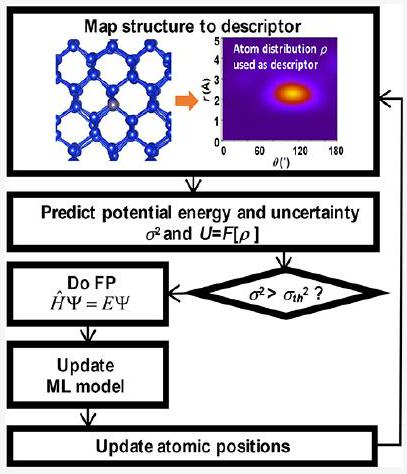
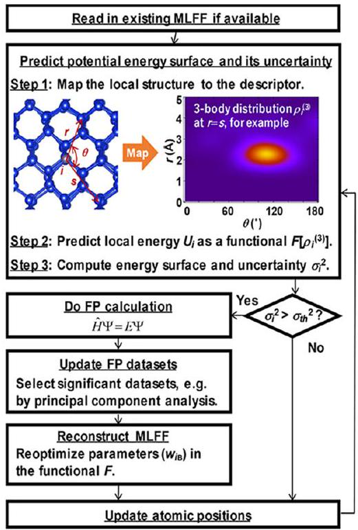
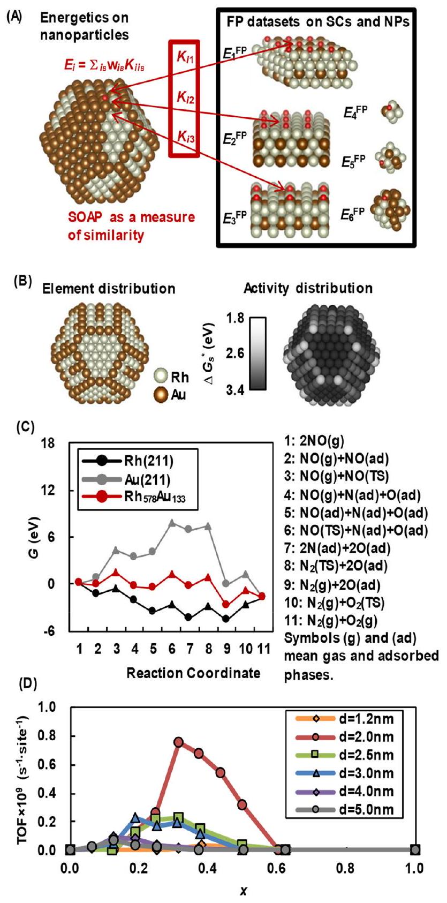
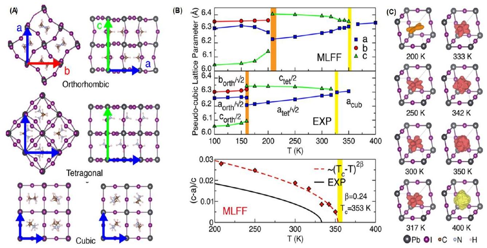
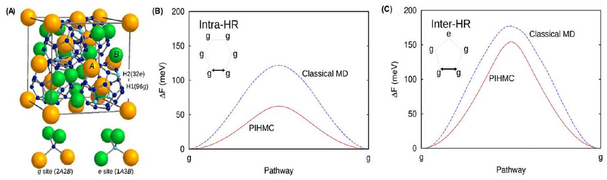

# On-the-Fly Active Learning of Interatomic Potentials for Large-Scale Atomistic Simulations 

Ryosuke Jinnouchi, Kazutoshi Miwa, Ferenc Karsai, Georg Kresse, and Ryoji Asahi*

Cite This: J. Phys. Chem. Lett. 2020, 11, 6946-6955
Read Online
Downloaded via UNIV ILLINOIS URBANA-CHAMPAIGN on March 19, 2026 at 10:42:36 (UTC). See https://pubs.acs.org/sharingguidelines for options on how to legitimately share published articles.

#### Abstract

The on-the-fly generation of machine-learning force fields by active-learning schemes attracts a great deal of attention in the community of atomistic simulations. The algorithms allow the machine to self-learn an interatomic potential and construct machine-learned models on the fly during simulations. State-of-the-art query strategies allow the machine to judge whether new structures are out of the training data set or not. Only when the machine judges the necessity of updating the data set with the new structures are first-principles calculations carried out. Otherwise, the yet available machine-learned model is used to update the atomic positions. In this manner, most of the first-principles calculations are bypassed during training, and overall, simulations are accelerated by several orders of magnitude while retaining almost first-principles accuracy. In this Perspective, after describing essential components of the active-learning algorithms, we demonstrate the power of the schemes by presenting recent applications.

Machine learning (ML) is a rapidly evolving method that allows to extract useful information from a pool of scientific data. The ML-approach combined with big data is sometimes referred to as the "fourth paradigm of science" following empirical laws, physical and chemical laws, and computer simulations. ${ }^{1}$ A variety of methods and algorithms have been developed and applied to predict materials properties and to discover new functional materials. ${ }^{2-16}$ Machine-learning force fields (MLFFs) are an emerging tool to realize efficient and fast materials simulations. ${ }^{7,17-26}$ In this approach, the potential energy of atoms is described by a highly flexible function of descriptors, which themselves represent the atomistic structure of the material. Parameters in the function are optimized to reproduce first-principles (FP) data sets comprising energies, forces, and/or stress tensor components on relevant structures. A flexible functional form allows the machine to accurately reconstruct the FP potential energy landscape even if it involves complex chemical bond scissions and formations. These are not captured by conventional force fields using physics-based functions, such as Coulomb, Lennard-Jones potentials, bond-order potential, and so on. ${ }^{27-33}$ The generated machine-learned force fields allow for orders of magnitude faster predictions of energies, forces, and stress tensor components than the FP methods they are based on. Thus, MLFF methods have been used as promising schemes to significantly extend the applicability of molecular dynamics (MD) and Monte Carlo (MC) simulations. However, actual applications of MLFFs were often limited to simple materials. What prevented MLFFs from being widely used in the materials science community was the need to construct the reference FP data sets spanning the relevant
structural space. Because there are no simple a priori rules as to which structures are relevant, FP calculations need to be done for a huge number of structures selected relying on the researcher's physical and chemical intuition. This approach is always biased, and intuition-based approaches are practically untraceable for multielemental complex materials.
Recently, active-learning schemes started to attract a great deal of attention. ${ }^{26,34-43}$ The schemes allow the machine to automatically detect whether the considered structures are outside the reference data sets. FP calculations are carried out only on the detected structures. The obtained new FP data sets are added to the reference data sets and used to update the MLFF. In this manner, the relevant structures are systematically selected, and the number of the time-consuming FP calculations is significantly reduced. An on-the-fly activelearning algorithm was adopted to optimize a Stillinger-Weber potential in a hybrid quantum mechanics (QM)/molecular mechanics (MM) method to simulate a crack evolution in solid Si. ${ }^{44}$ Later, a query-by-committee active-learning approach on the basis of neural network potentials (NNP) was proposed by Artith and Behler. ${ }^{34}$ Recently, on-the-fly active-learning schemes with linear regressions ${ }^{26,36,37,45-49}$ have been developed, and the methods have been applied to

Received: April 4, 2020
Accepted: July 31, 2020
Published: July 31, 2020

a variety of problems, such as exploration of stable new ternary alloys, ${ }^{50}$ phase transitions of multielement materials, ${ }^{36,51}$ nuclear quantum effects on diffusion and chemical reactions, ${ }^{47,49}$ solvated ions in aqueous electrolytes, ${ }^{52}$ and reactions on heterogeneous catalysts. ${ }^{38,53}$ An active-learning algorithm based on an artificial neural network was also proposed and applied to automatically generate highly accurate interatomic potentials of aluminum. ${ }^{43}$ All these applications indicated that training and production runs can be accelerated by several orders of magnitude. Active-learning algorithms without learning on the fly have been also developed and applied to construct uniformly accurate MLFFs in wide phase spaces. ${ }^{40,41}$

In this Perspective, we briefly review key components of active-learning algorithms: structural descriptors, potential energy functional, regression method, error estimation, and data set selections. Here, we particularly focus on essential similarities in theories, algorithms, and performance rather than on detailed differences among a variety of machinelearning methodologies; in this way we intend to highlight significant extension of capability in physical and chemical simulations with them. For more details on the methodologies, one can refer to excellent articles. ${ }^{34,54-56}$ After the brief description, we show three applications: catalytic activity of alloyed nanoparticles (NPs), ${ }^{53,57}$ entropy-driven phase transitions of hybrid perovskites, ${ }^{51,58}$ and nuclear quantum effects on thermodynamics and kinetics of an $\mathrm{AB}_{2}$-type Laves hydride. ${ }^{49}$ These three topics are selected from broad materials science issues in catalysis, solar cells, and hydrogen storage, which could not have been assessed with conventional simulation methods. These examples will provide generalizable information on how the automated self-learning algorithms enable realistic simulations of multielemental complex materials.

> The examples presented herein provide generalizable information on how the automated selflearning algorithms enable realistic simulations of multielemental complex materials.

Figure 1 illustrates a schematic of an active-learning algorithm, where an MLFF is generated on the fly during an MD simulation. The heart of the algorithm is in the prediction of the energy, forces, stress tensor components, and their uncertainty on a given structure using the yet available MLFF. Given the predicted uncertainty, the machine decides whether to execute a FP calculation or not. If the machine decides not to carry out the FP calculation, the predicted energy, forces, and stress tensor components are used to update the atomic positions and velocities. When the FP calculation is carried out, the obtained structure data set is added to the reference data sets.

A single structure data set contains the Bravais lattice, atomic positions, energy, forces, and stress tensor components for a specific structure as calculated by the FP method. The reference data sets are used to train the MLFF, and the atomic positions and velocities are updated.

Obviously, efficiency and accuracy of the training and production runs using the MLFF strongly depend on how to predict the potential energy landscape and the uncertainty. In

Figure 1. Schematic of a machine-learning force field generation by active learning on the fly during an MD simulation.

many MLFF methods, ${ }^{17,18,20-22,24,26}$ the potential energy $U$ is described as a sum of local energies $U_{i}\left(i=1, \ldots, N_{\mathrm{a}}\right)$ of atoms

$$
U=\sum_{i=1}^{N_{\mathrm{a}}} U_{i}
$$

The local energy is assumed to be fully determined by a set of descriptors representing the local structural environment surrounding the atom $i$. In several popular MLFF methods, ${ }^{17,18,22,25,26,54,59}$ the descriptors are constructed by projecting translationally and rotationally invariant atom distribution functions around the atom $i$ onto suitable basis functions. Invariant distributions adopted in practical simulations are the two- and three-body distribution functions. The two-body distribution function $\rho_{i}{ }^{(2)}(r)$ is defined as the probability to find an atom $j(j \neq i)$ at a distance $r$ from the atom $i$. It is defined as

$$
\rho_{i}^{(2)}(r)=\frac{1}{4 \pi} \int \rho_{i}(r \hat{\mathbf{r}}) \mathrm{d} \hat{\mathbf{r}}
$$

where $\rho_{i}(\mathbf{r})(\mathbf{r}=r \hat{\mathbf{r}})$ is the three-dimensional atom distribution function around the atom $i$ defined as

$$
\begin{aligned}
& \rho_{i}(\mathbf{r})=\sum_{j \neq i}^{N_{\mathrm{a}}} \tilde{\rho}_{i j}(\mathbf{r}) \\
& \tilde{\rho}_{i j}(\mathbf{r})=f_{\text {cut }}\left(\left|\mathbf{r}_{j}-\mathbf{r}_{i}\right|\right) g\left(\mathbf{r}-\left(\mathbf{r}_{j}-\mathbf{r}_{i}\right)\right)
\end{aligned}
$$

Here, $\tilde{\rho}_{i j}$ describes the likelihood to find atom $j$ at position $\mathbf{r}$ from atom $i ; g$ is a distribution function of the single atom $j$, and $f_{\text {cut }}$ is a cutoff function that smoothly eliminates the contribution from atoms outside a given cutoff radius $R_{\text {cut }}$. The three-body distribution function $\rho_{i}{ }^{(3)}(r, s, \theta)$ is defined as the probability to find an atom $j(j \neq i)$ at a distance $r$ from the atom $i$ and another atom $k(k \neq j, i)$ at a distance $s$ from the atom $i$ spanning the angle $\angle k i j=\theta$ between them. It is defined as

$$
\begin{aligned}
& \rho_{i}^{(3)}(r, s, \theta)=\iint \mathrm{d} \hat{\mathbf{r}} \mathrm{~d} \hat{\mathbf{s}} \delta(\hat{\mathbf{r}} \cdot \hat{\mathbf{s}}-\cos \theta) \sum_{j \neq i}^{N_{a}} \sum_{k \neq i, j}^{N_{a}} \tilde{\rho}_{i j}(r \hat{\mathbf{r}}) \tilde{\rho}_{i k}(s \hat{\mathbf{s}}) \\
& \quad=\iint \mathrm{d} \hat{\mathbf{r}} \mathrm{~d} \hat{\mathbf{s}} \delta(\hat{\mathbf{r}} \cdot \hat{\mathbf{s}}-\cos \theta)\left[\rho_{i}(r \hat{\mathbf{r}}) \rho_{i}(s \hat{\mathbf{s}})-\sum_{j \neq i}^{N_{a}} \tilde{\rho}_{i j}(r \hat{\mathbf{r}}) \tilde{\rho}_{i j}(s \hat{\mathbf{s}})\right]
\end{aligned}
$$

For example, the descriptors used in neural network potentials (NNP) proposed by Behler and Parrinello ${ }^{17}$ are constructed by projecting $\rho_{i}{ }^{(2)}(r)$ and $\rho_{i}{ }^{(3)}(r, s, \theta)$ onto two- and three-body symmetry functions, yielding a descriptor vector $\mathbf{x}_{i}$ containing all coefficients $x_{i}{ }^{(2)}$ and $x_{i}{ }^{(3)}$, respectively. ${ }^{54}$ Similarly, the power spectrum used in the Gaussian approximation potential (GAP) proposed by Bartók and co-workers ${ }^{18}$ is constructed by projecting $\rho_{i}{ }^{(3)}(r, s, \theta)$ onto radial and angular basis functions. ${ }^{26,54,60}$ It should be noted, however, that unlike the three-body distribution in eq 5 , the distribution in the original GAP involves the self-terms $k=j$ as follows

$$
\rho_{i}^{(3)}(r, s, \theta)=\iint \mathrm{d} \hat{\mathbf{r}} \mathrm{~d} \hat{\mathbf{s}} \delta(\hat{\mathbf{r}} \cdot \hat{\mathbf{s}}-\cos \theta) \rho_{i}(r \hat{\mathbf{r}}) \rho_{i}(s \hat{\mathbf{s}})
$$

More recently, several new basis functions have been proposed to represent higher-order density distributions. ${ }^{21,61}$

The descriptors are used as input of the function representing the local energy $U_{i}$. This means that before discretization of the distribution functions, the local energy $U_{i}$ is described as a functional of the distribution functions

$$
U_{i}=F\left[\rho_{i}^{(2)}, \rho_{i}^{(3)}\right]
$$

After expressing the distribution functions in a suitable basis, the functional $F$ becomes a function of the coefficients of the basis set used to describe the two- and three-body distribution functions. For example, the NNP ${ }^{17}$ approximates the energy functional as a nonlinear function of the two- and three-body descriptors:

$$
U_{i}=f_{\mathrm{a}}^{2}\left[w_{01}^{2}+\sum_{j=1}^{3} w_{j 1}^{2} f_{\mathrm{a}}^{1}\left(w_{0 j}^{1}+\sum_{\mu=2}^{3} w_{\mu j}^{2} x_{i}^{(\mu)}\right)\right]
$$

Here, the equation assumes a neural network comprising one hidden layer with three nodes. The parameter $w_{i j}{ }^{k}$ is a weight connecting the node $j$ in the layer $k$ with node $i$ in the layer $k-$ 1 , and $w_{0 j}{ }^{k}$ is a bias weight that is used to adjust the offset of the activation function $f_{\mathrm{a}}^{k}$. Empirically it is found that a fairly small set of descriptors can be used, if the functional form is nonlinear and sufficiently flexible, as is the case for neural networks.

Simpler linear functions of descriptors are adopted in the spectral neighbor analysis potential (SNAP), ${ }^{62}$ the moment tensor potential (MTP), ${ }^{21}$ and permutationally invariant polynomial (PIP). ${ }^{61}$ To make up for the use of a simple linear form in the descriptors, the descriptors need to be more "expressive" compared to those used in neural networks. For instance, the moment tensor potential not only covers twoand three-body distribution functions, but the descriptors can potentially also describe four-, five-, or any $n$-body distribution function around each central atom. A recent performance assessment of several MLFFs indicated a general trade-off between the accuracy and computational cost. ${ }^{55}$ It seems to be understood that nonlinear functional forms require fewer descriptors than simple linear forms to achieve the same accuracy. For both neural networks and linear regression, the
parameters in the function are optimized to reproduce the energies and potentially forces and stress tensor components in the reference structure data sets.

Instead of a fixed functional form, the GAP ${ }^{18}$ and other kernel-based methods ${ }^{22,26}$ adopt an approach, where the functional form is adaptively determined during the training. Hence, they belong to the class of so-called nonparametric methods. ${ }^{63}$ In these methods, $N_{\mathrm{B}}$ atoms are selected from the reference structure data sets. The atomic distributions surrounding the selected atoms are mapped onto the descriptors $\mathbf{x}_{i_{\mathrm{B}}}\left(i_{\mathrm{B}}=1, \ldots, N_{\mathrm{B}}\right)$. The potential energy is approximated by the following linear equation of coefficients $w_{i \mathrm{~B}}\left(i_{\mathrm{B}}=1, \ldots, N_{\mathrm{B}}\right)$ :

$$
U_{i}=\sum_{i_{\mathrm{B}}=1}^{N_{\mathrm{B}}} w_{i_{\mathrm{B}}} \varphi\left(\mathbf{x}_{i}, \mathbf{x}_{i_{\mathrm{B}}}\right)
$$

The function $\varphi$ is supposed to measure the similarity between the local configuration $\mathbf{x}_{i}$ of interest and the reference configuration $\mathbf{x}_{i \mathrm{~B}}$. Gaussian ${ }^{22}$ or polynomial functions ${ }^{26,64}$ are usually used for $\varphi$. From the linear eq 9, the total energy, forces, and stress tensor components are obtained as linear equations of the coefficients $w_{i B}$, too. The linear equations can be summarized as a matrix-vector multiplication as

$$
y=\varphi w
$$

where $\mathbf{y}$ is a vector collecting the FP energy, forces, and stress tensor components for the given structure; $\boldsymbol{\varphi}$ is a matrix comprising the components $\varphi\left(\mathbf{x}_{i}, \mathbf{x}_{i \mathrm{~B}}\right)\left(i=1, \ldots, N_{\mathrm{a}} ; i_{\mathrm{B}}=1, \ldots\right.$, $N_{\mathrm{B}}$ ) and their derivatives with respect to atomic coordinates (see details in ref 26), and $\mathbf{w}$ is a vector collecting all coefficients $w_{i \mathrm{~B}}\left(i_{\mathrm{B}}=1, \ldots, N_{\mathrm{B}}\right)$. In the linear ridge regression, ${ }^{25}$ the coefficients are determined as

$$
\mathbf{w}=\left(\boldsymbol{\Phi}^{\mathrm{T}} \boldsymbol{\Phi}+\lambda \mathbf{I}\right)^{-1} \boldsymbol{\Phi}^{\mathrm{T}} \mathbf{Y}
$$

where $\boldsymbol{\Phi}$ is a so-called design matrix composed of matrices $\boldsymbol{\varphi}$ for all reference structures; $\lambda$ is a Tikhonov regularization parameter; $\mathbf{Y}$ is a vector containing the FP energies, forces, and stress tensor components for all reference structures, and the symbol " T " denotes the transpose of a vector or matrix. The linear eq 10 can be converted to another linear equation by introducing $\mathbf{w}=\boldsymbol{\Phi}^{\mathrm{T}} \boldsymbol{\alpha}$ and the Gram matrix $\mathbf{K}=\boldsymbol{\Phi} \boldsymbol{\Phi}^{\mathrm{T}}$ as ${ }^{63}$

$$
\mathbf{y}=\mathbf{K} \alpha
$$

In the kernel ridge regression, the Gram matrix $\mathbf{K}$ instead of the matrix $\boldsymbol{\Phi}$ is constructed by using a Gaussian or polynomial kernel function, and the coefficient $\boldsymbol{\alpha}$ is determined as

$$
\boldsymbol{\alpha}=(\mathbf{K}+\lambda \mathbf{I})^{-1} \mathbf{Y}
$$

An intricate issue is how to estimate the reliability of the predicted machine learned energy and forces for a structure previously not considered in the FP calculations. Several types of uncertainty estimations have been proposed. Artith and Behler ${ }^{34}$ suggested using the difference of the predictions on a new structure given by two NNPs as the uncertainty in the prediction. Recently, more advanced query-by-committee algorithms were proposed and combined with the GAP ${ }^{65}$ and deep neural network (DNN) potential. ${ }^{41}$ Although these algorithms can provide reasonable predictions of the uncertainty, on-the-fly generations of multimodels can be computationally demanding. A simple analytical equation can be derived within the framework of Bayesian inference. ${ }^{63}$ In this framework, the prior distribution of the target data, which
is the potential energy in the case of the MLFF, is assumed to be a multidimensional Gaussian distribution. By that assumption and the Bayesian theorem, the posterior distribution after observing the reference data sets is a Gaussian distribution as well. We suggested that the uncertainty in the prediction can be estimated as the variance of the posterior distribution. ${ }^{26,51}$ In the linear regression, the posterior distribution is obtained as a Gaussian function centered at eq 11 with a covariance matrix obtained as

$$
\boldsymbol{\sigma}=\sigma_{\mathrm{v}}^{2} \mathbf{I}+\sigma_{\mathrm{v}}^{2} \boldsymbol{\varphi}\left[\boldsymbol{\Phi}^{\mathrm{T}} \boldsymbol{\Phi}+\sigma_{\mathrm{v}}^{2} / \sigma_{\mathrm{w}}^{2} \mathbf{I}\right]^{-1} \boldsymbol{\varphi}^{\mathrm{T}}
$$

where $\sigma_{\mathrm{v}}^{2}$ is the variance of the uncertainty caused by noise in the data sets and $\sigma_{\mathrm{w}}{ }^{2}$ is the variance of the prior distribution. The regularization parameter $\lambda$ in the linear ridge regression turns to $\sigma_{\mathrm{v}}{ }^{2} / \sigma_{\mathrm{w}}{ }^{2}$ in the Bayesian linear regression. The covariance matrix for the kernel method can be found elsewhere. ${ }^{18,66}$ The Bayesian inference provides the posterior distribution on the basis of the observed FP data sets. This means that the uncertainty determined by the Bayesian inference considers not only the sampling density in the descriptor space but also the actual shape of the potential energy landscape. For example, a steeper potential energy surface obviously requires denser sampling than a shallow energy surface. The Bayesian inference is expected to automatically detect the necessity of additional data points taking into account the curvature of the potential energy surface. It should be noted, however, that Bayesian interference needs to make assumptions for the prior, that are not always easily justified. To avoid these assumptions, several statistical methods, such as the spilling factor, ${ }^{22}$ maxvol method, ${ }^{37}$ and CUR decomposition, ${ }^{40}$ were proposed. All these methods select additional local configurations by maximizing linear independences among feature vectors, such as $\varphi\left(\mathbf{x}_{i}, \mathbf{x}_{i \mathrm{~B}}\right)\left(i_{\mathrm{B}}=\right. 1, \ldots, N_{\mathrm{B}}$ ), representing the collected local configurations (see details of the algorithms and feature vectors in the original literature). ${ }^{22,37,40}$ Hence, these methods avoid the Gaussian assumption. However, they cannot account for the corrugation of the potential energy surface in the descriptor space unlike the Bayesian inference, because they determine the uncertainty only from the descriptor $\mathbf{x}$. Accordingly, each analytical uncertainty estimator possesses advantages and disadvantages, and quantitative uncertainty estimation is still challenging. Nevertheless, in our experience, after proper calibration, the analytical Bayesian variance estimation resembles the real error remarkably well and provides a reliable measure of the uncertainty. ${ }^{26,51}$

Armed with a reliable error prediction, our on-the-fly activelearning simulations indicated that more than $99 \%$ of the FP calculations can be bypassed during training runs, and the generated MLFFs retain an FP accuracy similarly to conventional MLFFs trained using FP data sets collected on the basis of human intuition. Furthermore, the generated MLFFs accelerate production runs, which evaluate thermodynamic and kinetic properties, by several orders of magnitude. Similarly, other groups ${ }^{42,43,50}$ reported remarkable efficiency and accuracy realized by methods based on other machinelearning algorithms.

In order to demonstrate the power of the active-learning algorithms, we present three applications here. The first example is on the catalytic activities of direct NO decomposition ( $2 \mathrm{NO} \rightarrow \mathrm{N}_{2}+\mathrm{O}_{2}$ ) on alloyed NPs. ${ }^{53,57}$ Catalytic NPs are widely used in various energy conversion devices because of their high surface-area-to-volume ratio
saving costly catalytic metals such as rhodium and platinum. Their catalytic activities are often dominated by a few specific active sites, and identification of those surface sites is essential to designing heterogeneous catalysts. ${ }^{67-69}$ Modern experimental techniques eventually realize direct observations of detailed surface structures of practically available NPs and model catalysts, such as single-crystal (SC) surfaces. ${ }^{70-72}$ However, the obtainable information is still insufficient for understanding the whole picture of reaction mechanisms, especially on highly heterogeneous alloyed NPs, which possess a variety of surface sites that cannot be described by SC surfaces. FP methods are a powerful tool to investigate reaction mechanisms, ${ }^{73}$ but applications to NPs composed of thousands of atomic surface sites result in a tremendous amount of computational cost. To solve this problem, the MLFF algorithm was applied to evaluate quantitative reactivity in direct NO decomposition on $\mathrm{Rh}_{(1-x)} \mathrm{Au}_{x}$ NPs. ${ }^{53}$ Figure 2A shows a schematic of the algorithm. MLFFs describing adsorbate-surface interactions and metal-metal interactions were constructed by active learning on alloyed SC-surfaces and small clusters. During the training, atomic configurations in the SC-surfaces and clusters were randomly changed, and configurations out of the reference structure data sets were selected by using the spilling factor. FP calculations were carried out on the selected configurations, and the collected FP data sets were used to generate the MLFFs. After the training, the MLFF for the metal-metal interactions was used to determine stable element distributions in NPs by using an MC method. On the NPs with the determined distributions, energies of reaction intermediates, such as NO, N, and O adsorbates, were calculated by the MLFF describing the adsorbate-metal interactions. With the aid of Brønsted-Evans-Polanyi relationships, ${ }^{74,75}$ which linearly correlate the reaction energies with the activation barriers, the predicted energies of adsorbates are converted to the reaction rates at local surface sites. In the MLFF generation, a linear regression using the smooth overlap of atomic positions (SOAP) ${ }^{64}$ as basis sets was adopted. Figure 2B illustrates the distribution of the activation free energy ( $\Delta G_{\mathrm{s}}{ }^{*}$ ) for the rate-determining step on a $\mathrm{Rh}_{0.81} \mathrm{Au}_{0.19} \mathrm{NP}$ with a diameter of 3 nm . As clearly shown by this distribution, the alloyed corner of the NP is predicted to be active. MC simulations indicate that Au atoms are preferentially segregated at edges and corners of the NP so that the surface energy of the NP is minimized. The alloyed corner formed in this way shows the desired free-energy diagram, where the reaction rates of the formation and removal of reaction intermediates are balanced as shown in Figure 2C. Obviously, both the size and composition of the NP strongly affect the surface density of the alloyed corner site. Because of the fast predictions realized by the MLFF, the optimal size and composition, which are significant pieces of information for designing active NP catalysts, are quickly predicted as 2 nm and $x=0.3$, respectively, as shown in Figure 2D.

The second example is on the entropy-driven phase transitions of hybrid organic-inorganic perovskites. ${ }^{51,58}$ Methylammonium (MA) $\mathrm{PbI}_{3}$ is a promising solar cell material with a band gap close to the optimal range, ${ }^{76-79}$ a high absorption coefficient, ${ }^{76,78,79}$ and a high charge-carrier mobility. ${ }^{80}$ Many experimental ${ }^{76-79,81,82}$ and theoretical studies ${ }^{83-87}$ have been carried out on its atomic structure and dynamical properties, and these studies revealed that this material exhibits two entropy-driven phase transitions from an orthorhombic to a tetragonal phase at 160 K and from a

Figure 2. Summary of the application of the active-learning scheme to the catalytic activity of the direct NO decomposition on $\mathrm{Rh}_{(1-x)} \mathrm{Au}_{x}$ nanoparticles taken from ref 53 . (A) A scheme to predict energies of reaction intermediates; (B) element distribution versus activity distribution; (C) free-energy diagram at 500 K and ambient pressure predicted by the MLFF; (D) turn over frequencies of the direct decomposition of NO on nanoparticles with a diameter of 1.2-5.0 nm as functions of the composition $x . \Delta G_{\mathrm{s}}{ }^{*}$ shown in panel B is the activation free energy of the rate-limiting step. Copyright 2017 American Chemical Society.

tetragonal to cubic phase at 330 K . Schematic representations of these relevant phases are shown in Figure 3A. However, the microscopic mechanisms near the transition temperatures cannot be determined by experiment alone, and existing classical force fields did not have the required accuracy because of limited flexibility in their functional forms as well as insufficient training. ${ }^{84}$ In addition, required system sizes and simulation times are not attainable by the FP methods. ${ }^{85,87}$

Therefore, the on-the-fly active-learning MLFF generation scheme shown in Figure 1 was applied, and the applications allowed us to fully understand all experimentally observed phase transitions in silico using very modest computational resources. Figure 3 summarizes the results. The structures of all three phases were accurately reproduced by the MLFF as shown in Figure 3B. MD simulations using the MLFF predicted the tetragonal to cubic phase transition temperature at 353 K . The critical exponent of 0.24 (see Figure 3B) agrees well with the reported experimental results of $0.22-0.285^{81}$ and a theoretically expected value of $1 / 4$ for a tricritical point on the basis of Landau theory. A free-energy "umbrella sampling" analysis ${ }^{88}$ predicted the orthorhombic-to-tetragonal phase transition as $215 \pm 15 \mathrm{~K}$. Furthermore, the change of the entropy at this phase transition was predicted as $1.3 \pm 0.6 k_{\mathrm{B}}$ per MA molecule, agreeing reasonably with the experimental value of $2.3 k_{\mathrm{B}} .^{82}$ The realistic MD simulations provided atomic-scale insight into the phase transitions near the transition temperatures. Figure 3C shows the three-dimensional polar plots of the probability distribution of the MA molecular orientation in the $\mathrm{PbI}_{3}$ framework. The molecules are predominantly oriented within the plane made by $\mathbf{a}$ and $\mathbf{b}$ lattice vectors (see Figure 3A), and four lobes are clearly visible in the orthorhombic phase below 200 K . The orientation abruptly changes at the orthorhombic to tetragonal phase transition, and the molecules are also canting along the $\mathbf{c}$ vector, so that the eight lobes are visible. In contrast, at the tetragonal-to-cubic phase transition, the eight lobes gradually diminish, and a spherical distribution appears. In total, the simulations suggested that the orthorhombic-to-tetragonal transition is a first-order phase transition and that the tetragonal-to-cubic transition is continuous.

The final example is shown on nuclear quantum effects in the C15-type Laves hydride, $\mathrm{TiCr}_{2} \mathrm{H}_{1.3}$. This metal hydride is a

> Two major challenges still require attention and further development. These challenges are accuracy and computational cost.

promising hydrogen storage material that shows a high volumetric hydrogen capacity, fast kinetics for absorption and release of hydrogens, and moderate working conditions. ${ }^{89}$ As depicted in Figure 4A, it is known that the C15 Laves hydride $\mathrm{AB}_{2}$ possesses two possible hydrogen occupation sites: $g$ - and $e$-sites. They constitute $\mathrm{H}_{28}$ cages with 4 hexagonal and 12 pentagonal faces around A atoms. Two adjacent cages share the hexagonal faces, forming a three-dimensional hydrogen network. This network likely realizes high diffusivity of hydrogen atoms, but this also makes it difficult to capture structures and dynamics of hydrogen atoms by using static FP calculations because hydrogen atoms dynamically diffuse through the network, and all hydrogen sites are partially occupied in average. In addition, because of the light mass of hydrogen, both the thermodynamics and kinetics are strongly influenced by the nuclear quantum effect. Therefore, a MD or MC simulation including the nuclear quantum effect is required for complete understanding of the finite-temperature properties. However, FP simulations with nuclear quantum effects are computationally demanding. The problem was recently solved by the on-the-fly active-learning scheme. ${ }^{49}$ In this study, the quantum effect was taken into account by using

Figure 3. Phase transitions of $\mathrm{MAPbI}_{3}$ predicted by MD simulations using an MLFF generated by the on-the-fly scheme taken from ref 51 . (A) Schematic representation of the three phases obtained by the MLFF; (B) simulated lattice constants compared to experiments and a power law, ( $T_{\mathrm{c}} -T)^{2 \beta}$, fitted to the simulated and experimental tetragonal distortion, $(c-a) / c$, where $T_{\mathrm{c}}$ and $\beta$ are the transition temperature and the critical exponent; (C) three-dimensional polar plots of the probability distributions of the MA molecular orientation at various temperatures, ranging from 200 to 400 K. Copyright 2019 American Physical Society.

Figure 4. Path integral simulations on Laves hydride, $\mathrm{TiCr}_{2} \mathrm{H}_{1.3}$. Schematic representation of C 15 -type Laves hydride, $\mathrm{AB}_{2}(\mathrm{~A})$, and activation barriers for hydrogen diffusions between $g$-sites within hexagonal and pentagonal faces ( B and C , respectively).

a discretized path integral method, ${ }^{90}$ where the canonical partition function of the quantum mechanical nuclear system is represented in a partition function of the classical system composed of cyclic polymers on the basis of the classical isomorphism. Each polymer consists of $P$ pseudoparticles, which are connected by spring potentials. The corresponding fictitious Hamiltonian is described as

$$
H_{\mathrm{eff}}=\sum_{t=1}^{P} \sum_{i=1}^{N_{\mathrm{a}}} \frac{\left|\mathbf{p}_{i}^{(t)}\right|^{2}}{2 m_{i}^{\prime}}+\sum_{t=1}^{P}\left[\sum_{i=1}^{N_{\mathrm{a}}} \frac{1}{2} m_{i} \omega_{P}^{2}\left(\mathbf{r}_{i}^{(t)}-\mathbf{r}_{i}^{(t+1)}\right)^{2}+\frac{1}{P} U\right]
$$

where $\mathbf{p}_{i}{ }^{(t)}$ denotes a fictitious momentum with mass $m_{i}^{\prime} ; m_{i}$ denotes the atomic mass; $\omega_{P}=\sqrt{ } P / \beta \hbar ; \beta$ is the inverse temperature; $\hbar$ is the Plank constant; and $\mathbf{r}_{i}^{(P+1)}$ equals $\mathbf{r}_{i}^{(1)}$. The number of the pseudoparticles $P$ was set to $4 \hbar \omega_{\text {max }} \beta \approx 32$ ( $\omega_{\text {max }}$ is the highest vibrational frequency) for the metal hydride system. A dynamical simulation on this effective Hamiltonian provides a canonical ensemble of the quantum system. However, the computational effort becomes $P$ times greater than the classical simulation, meaning that the FP simulation would be prohibitively expensive. By employing the MLFF instead of the FP potential for $U$ in eq 15, the simulation is significantly accelerated, and sufficient statistics become attainable. In actual computations, an efficient hybrid Monte Carlo method ${ }^{91,92}$ was adopted to sample canonical
ensembles. The enthalpy of the hydrogenation reaction of a $\mathrm{TiCr}_{2}$ hydride was calculated to be $-19 \mathrm{~kJ} / \mathrm{mol} \mathrm{H}_{2}$, which excellently agrees with the experimental results of -20 to -17 $\mathrm{kJ} / \mathrm{mol} \mathrm{H}_{2}{ }^{93}$ The agreement is obtainable only with the quantum simulation that can precisely incorporate quantum zero-point vibrational energy contributions. The path integral simulation exhibited significant tunneling effects on hydrogen diffusions, too. Panels B and C of Figure 4 show free-energy profiles of two hydrogen diffusion pathways between $g$-sites in the hexagonal and pentagonal faces. In both pathways, the activation barriers are significantly lowered by tunneling effects, indicating that the nuclear quantum effects are essential for accurately predicting the hydrogen diffusivity in metal hydrides.

Before ending this Perspective, we note that two major challenges still require attention and further development. These challenges are accuracy and computational cost. As described previously, a recent study indicates that most machine-learning algorithms exhibit a certain trade-off between accuracy and performance; generally, whenever the accuracy is increased, the performance decreases. ${ }^{55}$ Furthermore, even very carefully constructed MLFFs ${ }^{49,51,52,55,60,94-96}$ involve errors of the order of 1 meV atom ${ }^{-1}, 0.01 \mathrm{eV} \AA^{-1}$, and 0.1 GPa for energies, forces, and stress tensor components, respectively. A better accuracy will be required crucially to
learn local energetic changes in highly heterogeneous interfacial or biological systems. Concretely, when one requires a prediction of energetic change caused by the bonding of a small molecule to a macromolecule composed of 1000 atoms, the error in the binding energy, which is calculated as a total energy difference, might well be of the order of 1 eV even though the 1 meV atom ${ }^{-1}$ error is realized by a highly accurate MLFF. The MLFF formalism presented in this Perspective possesses two major sources of errors: the decomposition of the potential energy into local energies and the representation of the structural configuration. The FP potential energy can involve long-range electrostatics as well as long-range van der Waals interactions, which cannot be exactly decomposed into local energies depending on the environment in a few angstrom-sized region. Therefore, the decomposition by eq 1 generates errors. A solution to this problem is to avoid the decomposition and to represent the total energy using longrange descriptors. ${ }^{23}$ However, these new formalisms require more reference FP data sets on large systems in order for the machine to disentangle the long-range contributions. The second issue is the insufficiently accurate representation of the short-range interactions. As explained in this Perspective, several popular MLFF methods represent short-range manybody interactions as a nonlinear function of two- and threebody descriptors. Although those representations can partially incorporate many-body interactions, they are not bijective to the original many-body distribution around the central atom. In fact, two completely different structures can yield the same set of two- and three-body descriptors and thus by construction necessarily the same energy. ${ }^{24,97}$ To resolve these issues, several descriptors that can uniquely represent many-body configurations have been proposed. ${ }^{21,24,61}$ However, in the proposed methods, incorporating many-body terms always increases the computational cost and requires more training data. Furthermore, the yet suggested many-body descriptors seemingly do not provide a substantially improved accuracy compared to two- and three-body descriptors. Another approach is to incorporate many-body interactions by using two- and three-body descriptors as inputs of a deep neural network. ${ }^{16}$ The method realized a remarkable accuracy for total energies of peptides and medium sized macrocycles without significant computational overhead.

In summary, the combination of well-chosen descriptors, robust regression methods and uncertainty estimations allows

> The combination of well-chosen descriptors, robust regression methods, and uncertainty estimations allows for an efficient and robust on-the-fly activelearning MLFF generation.

for an efficient and robust on-the-fly active-learning MLFF generation. The developed algorithms have accelerated both training and production runs by orders of magnitude. Realistic simulations that are computationally demanding using conventional methods are becoming routinely possible, while retaining almost FP accuracy. The applications are already spread over a wide range of materials. While further effort is required for better accuracy with less computational time, machine-learned force fields have a huge potential and will
certainly become a standard computational tool to predict finite-temperature properties of complex physical, chemical, and biological systems.

## - AUTHOR INFORMATION

## Corresponding Author

Ryoji Asahi - Toyota Central R\&D Laboratories., Inc., Aichi 480-1192, Japan; © orcid.org/0000-0002-2658-6260; Email: rasahi@mosk.tytlabs.co.jp

## Authors

Ryosuke Jinnouchi - Toyota Central R\&D Laboratories., Inc., Aichi 480-1192, Japan; © orcid.org/0000-0002-0822-1161
Kazutoshi Miwa - Toyota Central R\&D Laboratories., Inc., Aichi 480-1192, Japan
Ferenc Karsai - VASP Software GmbH, 1090 Vienna, Austria
Georg Kresse - Computational Materials Physics, Faculty of Physics, University of Vienna, 1090 Vienna, Austria
Complete contact information is available at:
https://pubs.acs.org/10.1021/acs.jpclett.0c01061

## Notes

The authors declare no competing financial interest.

## Biographies

Ryosuke Jinnouchi is a senior researcher at Toyota Central R\&D Laboratories., Inc. He received his Ph.D. degree from Tokyo Institute of Technology and worked with Dr. Kazutoshi Miwa and Dr. Ryoji Asahi in the same laboratory. From 2017 to 2019, he stayed at the University of Vienna as a senior research fellow and worked with Dr. Ferenc Karsai and Dr. Georg Kresse. His research interests focus on developments of computational physics methods involving machinelearning interatomic potentials and their applications to materials design.
Kazutoshi Miwa is a senior researcher at Toyota Central R\&D Laboratories., Inc. He received his Ph.D. degree from Institute for Materials Research, Tohoku University. He is engaged in computational materials science, in particular, first-principles simulations based on density functional theory. He also has worked toward the development of machine-learning potentials since 2016.

Ferenc Karsai is a researcher and software developer at the VASP Software GmbH. He received his Ph.D. degree from Institute of Chemistry, Technical University of Vienna. He is mainly engaged in the development of the commercial ab initio code VASP. Since 2017 his interests have focused on developments of machine-learning interatomic potentials.

Georg Kresse is chair for Computational Quantum Mechanics at the University of Vienna since 2007. His main scientific focus lies in the fields of Theoretical Solid-State Physics, Surface Sciences, and Computational Materials Physics. His work on $a b$ initio density functional theory has contributed significantly to basic and applied research and has shaped the application of density functional theory worldwide. Kresse is the main author of the computer code "VASP" (Vienna ab initio simulation package), the author of about 400 research articles, and has an h-index of over 100 . He is the recipient of several awards, including the 2003 "START Grant" of the Austrian Science Fund (FWF), the "Hellmann Preis" of the Internationale Working group for Theoretical Chemistry, and the 2016 Kardinal-Innitzer-Preis. Since 2011 Kresse has been a full member of the Austrian Academy of Sciences.

Ryoji Asahi received a Ph.D. in Physics from Northwestern University in 1999. He has been working in Toyota Central R\&D

Laboratories, Inc., Japan, since 1987, where he joined projects for the development of energy and environmental materials such as photocatalysts, thermoelectrics, photovoltaics, and Li-ion batteries. Since 2017, he has also been a professor at Toyota Technological Institute, Japan. His current research interests include materials design using first-principles calculations combined with machine-learning algorithms and data-driven informatics.

## ACKNOWLEDGMENTS

All authors thank Martijn Marsman for providing much helpful advice on programming in VASP.

## REFERENCES

(1) Butler, K. T.; Davies, D. W.; Cartwright, H.; Isayev, O.; Walsh, A. Machine Learning for Molecular and Materials Science. Nature 2018, 559, 547-555.
(2) Fischer, C. C.; Tibbetts, K. J.; Morgan, D.; Ceder, G. Predicting Crystal Structure by Merging Data Mining with Quantum Mechanics. Nat. Mater. 2006, 5, 641-646.
(3) Jain, A.; Ong, S. P.; Hautier, G.; Chen, W.; Richards, W. D.; Dacek, S.; Cholia, S.; Gunter, D.; Skinner, D.; Ceder, G.; Persson, K. A. Commentary: The Materials Project: A Materials Genome Approach to Accelerating Materials Innovation. APL Mater. 2013, 1, 011002.
(4) Pizzi, G.; Cepellotti, A.; Sabatini, R.; Marzari, N.; Kozinsky, B. Aiida: Automated Interactive Infrastructure and Database for Computational Science. Comput. Mater. Sci. 2016, 111, 218-230.
(5) Raccuglia, P.; Elbert, K. C.; Adler, P. D. F.; Falk, C.; Wenny, M. B.; Mollo, A.; Zeller, M.; Friedler, S. A.; Schrier, J.; Norquist, A. J. Machine-Learning-Assisted Materials Discovery Using Failed Experiments. Nature 2016, 533, 73-76.
(6) Ramprasad, R.; Batra, R.; Pilania, G.; Mannodi-Kanakkithodi, A.; Kim, C. Machine Learning in Materials Informatics: Recent Applications and Prospects. npj Comput. Mater. 2017, 3, 54.
(7) Bartók, A. P.; De, S.; Poelking, C.; Bernstein, N.; Kermode, J. R.; Csányi, G.; Ceriotti, M. Machine Learning Unifies the Modeling of Materials and Molecules. Sci. Adv. 2017, 3, No. e1701816.
(8) Ulissi, Z. W.; Medford, A. J.; Bligaard, T.; Nørskov, J. K. To Address Surface Reaction Network Complexity Using Scaling Relations Machine Learning and DFT Calculations. Nat. Commun. 2017, 8, 14621.
(9) Draxl, C.; Scheffler, M. Nomad: The Fair Concept for Big DataDriven Materials Science. MRS Bull. 2018, 43, 676-682.
(10) Segler, M. H. S.; Preuss, M.; Waller, M. P. Planning Chemical Syntheses with Deep Neural Networks and Symbolic Ai. Nature 2018, 555, 604-610.
(11) Tran, K.; Ulissi, Z. W. Active Learning across Intermetallics to Guide Discovery of Electrocatalysts for $\mathrm{CO}_{2}$ Reduction and $\mathrm{H}_{2}$ Evolution. Nat. Catal. 2018, 1, 696-703.
(12) Tshitoyan, V.; Dagdelen, J.; Weston, L.; Dunn, A.; Rong, Z.; Kononova, O.; Persson, K. A.; Ceder, G.; Jain, A. Unsupervised Word Embeddings Capture Latent Knowledge from Materials Science Literature. Nature 2019, 571, 95-98.
(13) Winther, K. T.; Hoffmann, M. J.; Boes, J. R.; Mamun, O.; Bajdich, M.; Bligaard, T. Catalysis-Hub.org, An Open Electronic Structure Database for Surface Reactions. Sci. Data 2019, 6, 75.
(14) Matsubara, M.; Suzumura, A.; Ohba, N.; Asahi, R. Identifying Superionic Conductors by Materials Informatics and High-Throughput Synthesis. Commun. Mater. 2020, 1, 5.
(15) Kajita, S.; Ohba, N.; Suzumura, A.; Tajima, S.; Asahi, R. Discovery of Superionic Conductors by Ensemble-Scope Descriptor. NPG Asia Mater. 2020, 12, 31.
(16) Zubatyuk, R.; Smith, J. S.; Leszczynski, J.; Isayev, O. Accurate and Transferable Multitask Prediction of Chemical Properties with an Atoms-in-Molecules Neural Network. Sci. Adv. 2019, 5, No. eaav6490.
(17) Behler, J.; Parrinello, M. Generalized Neural-Network Representation of High-Dimensional Potential-Energy Surfaces. Phys. Rev. Lett. 2007, 98, 146401.
(18) Bartók, A. P.; Payne, M. C.; Kondor, R.; Csányi, G. Gaussian Approximation Potentials: The Accuracy of Quantum Mechanics, without the Electrons. Phys. Rev. Lett. 2010, 104, 136403.
(19) Rupp, M.; Tkatchenko, A.; Müller, K.-R.; von Lilienfeld, O. A. Fast and Accurate Modeling of Molecular Atomization Energies with Machine Learning. Phys. Rev. Lett. 2012, 108, 058301.
(20) Seko, A.; Takahashi, A.; Tanaka, I. Sparse Representation for a Potential Energy Surface. Phys. Rev. B: Condens. Matter Mater. Phys. 2014, 90, 024101.
(21) Shapeev, A. V. Moment Tensor Potentials: A Class of Systematically Improvable Interatomic Potentials. Multiscale Model. Simul. 2016, 14, 1153-1173.
(22) Miwa, K.; Ohno, H. Molecular Dynamics Study on Beta-Phase Vanadium Monohydride with Machine Learning Potential. Phys. Rev. B: Condens. Matter Mater. Phys. 2016, 94, 184109.
(23) Chmiela, S.; Tkatchenko, A.; Sauceda, H. E.; Poltavsky, I.; Schütt, K. T.; Müller, K.-R. Machine Learning of Accurate EnergyConserving Molecular Force Fields. Sci. Adv. 2017, 3, No. e1603015.
(24) Glielmo, A.; Zeni, C.; De Vita, A. Efficient Nonparametric NBody Force Fields from Machine Learning. Phys. Rev. B: Condens. Matter Mater. Phys. 2018, 97, 184307.
(25) Faber, F. A.; Christensen, A. S.; Huang, B.; von Lilienfeld, O. A. Alchemical and Structural Distribution Based Representation for Universal Quantum Machine Learning. J. Chem. Phys. 2018, 148, 241717.
(26) Jinnouchi, R.; Karsai, F.; Kresse, G. On-the-Fly Machine Learning Force Field Generation: Application to Melting Points. Phys. Rev. B: Condens. Matter Mater. Phys. 2019, 100, 014105.
(27) Brooks, B. R.; Bruccoleri, R. E.; Olafson, B. D.; States, D. J.; Swaminathan, S.; Karplus, M. Charmm: A Program for Macromolecular Energy, Minimization, and Dynamics Calculations. J. Comput. Chem. 1983, 4, 187-217.
(28) Daw, M. S.; Baskes, M. I. Embedded-Atom Method: Derivation and Application to Impurities, Surfaces, and Other Defects in Metals. Phys. Rev. B: Condens. Matter Mater. Phys. 1984, 29, 6443-6453.
(29) Stillinger, F. H.; Weber, T. A. Computer Simulation of Local Order in Condensed Phases of Silicon. Phys. Rev. B: Condens. Matter Mater. Phys. 1985, 31, 5262-5271.
(30) Tersoff, J. New Empirical Approach for the Structure and Energy of Covalent Systems. Phys. Rev. B: Condens. Matter Mater. Phys. 1988, 37, 6991-7000.
(31) Pearlman, D. A.; Case, D. A.; Caldwell, J. W.; Ross, W. S.; Cheatham, T. E.; DeBolt, S.; Ferguson, D.; Seibel, G.; Kollman, P. AMBER, a Package of Computer Programs for Applying Molecular Mechanics, Normal Mode Analysis, Molecular Dynamics and Free Energy Calculations to Simulate the Structural and Energetic Properties of Molecules. Comput. Phys. Commun. 1995, 91, 1-41.
(32) Sun, H. Compass: An Ab Initio Force-Field Optimized for Condensed-Phase Applicationsoverview with Details on Alkane and Benzene Compounds. J. Phys. Chem. B 1998, 102, 7338-7364.
(33) van Duin, A. C. T.; Dasgupta, S.; Lorant, F.; Goddard, W. A. Reaxff: A Reactive Force Field for Hydrocarbons. J. Phys. Chem. A 2001, 105, 9396-9409.
(34) Artrith, N.; Behler, J. High-Dimensional Neural Network Potentials for Metal Surfaces: A Prototype Study for Copper. Phys. Rev. B: Condens. Matter Mater. Phys. 2012, 85, 045439.
(35) Li, Z.; Kermode, J. R.; De Vita, A. Molecular Dynamics with on-the-Fly Machine Learning of Quantum-Mechanical Forces. Phys. Rev. Lett. 2015, 114, 096405.
(36) Miwa, K.; Ohno, H. Interatomic Potential Construction with Self-Learning and Adaptive Database. Phys. Rev. Mater. 2017, 1, 053801.
(37) Podryabinkin, E. V.; Shapeev, A. V. Active Learning of Linearly Parametrized Interatomic Potentials. Comput. Mater. Sci. 2017, 140, 171-180.
(38) Jacobsen, T. L.; Jørgensen, M. S.; Hammer, B. On-the-Fly Machine Learning of Atomic Potential in Density Functional Theory Structure Optimization. Phys. Rev. Lett. 2018, 120, 026102.
(39) Smith, J. S.; Nebgen, B.; Lubbers, N.; Isayev, O.; Roitberg, A. E. Less Is More: Sampling Chemical Space with Active Learning. J. Chem. Phys. 2018, 148, 241733.
(40) Bernstein, N.; Csányi, G.; Deringer, V. L. De Novo Exploration and Self-Guided Learning of Potential-Energy Surfaces. npj Comput. Mater. 2019, 5, 99.
(41) Zhang, L.; Lin, D.-Y.; Wang, H.; Car, R.; E, W. Active Learning of Uniformly Accurate Interatomic Potentials for Materials Simulation. Phys. Rev. Mater. 2019, 3, 023804.
(42) Vandermause, J.; Torrisi, S. B.; Batzner, S.; Xie, Y.; Sun, L.; Kolpak, A. M.; Kozinsky, B. On-the-Fly Active Learning of Interpretable Bayesian Force Fields for Atomistic Rare Events. npj Comput. Mater. 2020, 6, 20.
(43) Smith, J. S.; Nebgen, B.; Mathew, N.; Chen, J.; Lubbers, N.; Burakovsky, L.; Tretiak, S.; Nam, H. A.; Germann, T.; Fensin, S.; Barros, K. Automated Discovery of a Robust Interatomic Potential for Aluminum. arXiv 2020, 2003.04934.
(44) Csányi, G.; Albaret, T.; Payne, M. C.; De Vita, A. Learn on the Fly": A Hybrid Classical and Quantum-Mechanical Molecular Dynamics Simulation. Phys. Rev. Lett. 2004, 93, 175503.
(45) Novikov, I. S.; Suleimanov, Y. V.; Shapeev, A. V. Automated Calculation of Thermal Rate Coefficients Using Ring Polymer Molecular Dynamics and Machine-Learning Interatomic Potentials with Active Learning. Phys. Chem. Chem. Phys. 2018, 20, 2950329512.
(46) Miwa, K.; Asahi, R. Molecular Dynamics Simulations with Machine Learning Potential for Nb -Doped Lithium Garnet-Type Oxide $\mathrm{Li}_{(7-\mathrm{X})} \mathrm{La}_{3} \mathrm{Zr}_{(2-\mathrm{X})} \mathrm{Nb}_{\mathrm{x}} \mathrm{O}_{12}$. Phys. Rev. Mater. 2018, 2, 105404.
(47) Novikov, I. S.; Shapeev, A. V.; Suleimanov, Y. V. Ring Polymer Molecular Dynamics and Active Learning of Moment Tensor Potential for Gas-Phase Barrierless Reactions: Application to S + $\mathrm{H}_{2}$. J. Chem. Phys. 2019, 151, 224105.
(48) Podryabinkin, E. V.; Tikhonov, E. V.; Shapeev, A. V.; Oganov, A. R. Accelerating Crystal Structure Prediction by Machine-Learning Interatomic Potentials with Active Learning. Phys. Rev. B: Condens. Matter Mater. Phys. 2019, 99, 064114.
(49) Miwa, K.; Asahi, R. Path Integral Study on C15-Type Laves $\mathrm{TiCr}_{2}$ Hydride. Int. J. Hydrogen Energy 2019, 44, 23708-23715.
(50) Gubaev, K.; Podryabinkin, E. V.; Hart, G. L. W.; Shapeev, A. V. Accelerating High-Throughput Searches for New Alloys with Active Learning of Interatomic Potentials. Comput. Mater. Sci. 2019, 156, 148-156.
(51) Jinnouchi, R.; Lahnsteiner, J.; Karsai, F.; Kresse, G.; Bokdam, M. Phase Transitions of Hybrid Perovskites Simulated by MachineLearning Force Fields Trained on the Fly with Bayesian Inference. Phys. Rev. Lett. 2019, 122, 225701.
(52) Jinnouchi, R.; Karsai, F.; Kresse, G. Making Free-Energy Calculations Routine: Combining First Principles with Machine Learning. Phys. Rev. B: Condens. Matter Mater. Phys. 2020, 101, 060201.
(53) Jinnouchi, R.; Asahi, R. Predicting Catalytic Activity of Nanoparticles by a DFT-Aided Machine-Learning Algorithm. J. Phys. Chem. Lett. 2017, 8, 4279-4283.
(54) Willatt, M. J.; Musil, F.; Ceriotti, M. Atom-Density Representations for Machine Learning. J. Chem. Phys. 2019, 150, 154110.
(55) Zuo, Y.; Chen, C.; Li, X.; Deng, Z.; Chen, Y.; Behler, J.; Csányi, G.; Shapeev, A. V.; Thompson, A. P.; Wood, M. A.; Ong, S. P. Performance and Cost Assessment of Machine Learning Interatomic Potentials. J. Phys. Chem. A 2020, 124, 731-745.
(56) Nguyen, T. T.; Székely, E.; Imbalzano, G.; Behler, J.; Csányi, G.; Ceriotti, M.; Götz, A. W.; Paesani, F. Comparison of Permutationally Invariant Polynomials, Neural Networks, and Gaussian Approximation Potentials in Representing Water Interactions through Many-Body Expansions. J. Chem. Phys. 2018, 148, 241725.
(57) Jinnouchi, R.; Hirata, H.; Asahi, R. Extrapolating Energetics on Clusters and Single-Crystal Surfaces to Nanoparticles by MachineLearning Scheme. J. Phys. Chem. C 2017, 121, 26397-26405.
(58) Lahnsteiner, J.; Jinnouchi, R.; Bokdam, M. Long-Range Order Imposed by Short-Range Interactions in Methylammonium Lead Iodide: Comparing Point-Dipole Models to Machine-Learning Force Fields. Phys. Rev. B: Condens. Matter Mater. Phys. 2019, 100, 094106.
(59) Smith, J. S.; Isayev, O.; Roitberg, A. E. Ani-1: An Extensible Neural Network Potential with Dft Accuracy at Force Field Computational Cost. Chem. Sci. 2017, 8, 3192-3203.
(60) Jinnouchi, R.; Karsai, F.; Verdi, C.; Asahi, R.; Kresse, G. Descriptors Representing Two- and Three-Body Atomic Distributions and Their Effects on the Accuracy of Machine-Learned Inter-Atomic Potentials. J. Chem. Phys. 2020, 152, 234102.
(61) Oord, C. v. d.; Dusson, G.; Csányi, G.; Ortner, C. Regularised Atomic Body-Ordered Permutation-Invariant Polynomials for the Construction of Interatomic Potentials. Machine Learning: Science and Technology 2020, 1, 015004.
(62) Thompson, A. P.; Swiler, L. P.; Trott, C. R.; Foiles, S. M.; Tucker, G. J. Spectral Neighbor Analysis Method for Automated Generation of Quantum-Accurate Interatomic Potentials. J. Comput. Phys. 2015, 285, 316-330.
(63) Bishop, C. Pattern Recognition and Machine Learning (Information Science and Statistics). Springer-Verlag: Berlin, 2007.
(64) Bartók, A. P.; Kondor, R.; Csányi, G. On Representing Chemical Environments. Phys. Rev. B: Condens. Matter Mater. Phys. 2013, 87, 184115.
(65) Musil, F.; Willatt, M. J.; Langovoy, M. A.; Ceriotti, M. Fast and Accurate Uncertainty Estimation in Chemical Machine Learning. J. Chem. Theory Comput. 2019, 15, 906-915.
(66) Vandermause, J.; Torrisi, S. B.; Batzner, S.; Xie, Y.; Sun, L.; Kolpak, A. M.; Kozinsky, B. On-the-Fly Active Learning of Interpretable Bayesian Force Fields for Atomistic Rare Events arXiv 2019, 1904.02042
(67) Taylor, H. S.; Armstrong, E. F. A Theory of the Catalytic Surface. Proc. R. Soc. London A 1925, 108, 105-111.
(68) Nørskov, J. K.; Bligaard, T.; Hvolbæk, B.; Abild-Pedersen, F.; Chorkendorff, I.; Christensen, C. H. The Nature of the Active Site in Heterogeneous Metal Catalysis. Chem. Soc. Rev. 2008, 37, 21632171.
(69) Van Santen, R. A. Complementary Structure Sensitive and Insensitive Catalytic Relationships. Acc. Chem. Res. 2009, 42, 57-66.
(70) Behrens, M.; Studt, F.; Kasatkin, I.; Kühl, S.; Hävecker, M.; Abild-Pedersen, F.; Zander, S.; Girgsdies, F.; Kurr, P.; Kniep, B.-L.; et al. The Active Site of Methanol Synthesis over $\mathrm{Cu} / \mathrm{ZnO} / \mathrm{Al}_{2} \mathrm{O}_{3}$ Industrial Catalysts. Science 2012, 336, 893-897.
(71) Pfisterer, J. H. K.; Liang, Y.; Schneider, O.; Bandarenka, A. S. Direct Instrumental Identification of Catalytically Active Surface Sites. Nature 2017, 549, 74-77.
(72) Jaramillo, T. F.; Jørgensen, K. P.; Bonde, J.; Nielsen, J. H.; Horch, S.; Chorkendorff, I. Identification of Active Edge Sites for Electrochemical $\mathrm{H}_{2}$ Evolution from $\mathrm{MoS}_{2}$ Nanocatalysts. Science 2007, 317, 100-102.
(73) Nørskov, J. K.; Bligaard, T.; Rossmeisl, J.; Christensen, C. H. Towards the Computational Design of Solid Catalysts. Nat. Chem. 2009, 1, 37-46.
(74) Bligaard, T.; Nørskov, J. K.; Dahl, S.; Matthiesen, J.; Christensen, C. H.; Sehested, J. The Brønsted-Evans-Polanyi Relation and the Volcano Curve in Heterogeneous Catalysis. J. Catal. 2004, 224, 206-217.
(75) Falsig, H.; Shen, J.; Khan, T. S.; Guo, W.; Jones, G.; Dahl, S.; Bligaard, T. On the Structure Sensitivity of Direct No Decomposition over Low-Index Transition Metal Facets. Top. Catal. 2014, 57, 8088.
(76) Hirasawa, M.; Ishihara, T.; Goto, T. Exciton Features in 0-, 2-, and 3-Dimensional Networks of [Pbi6]4- Octahedra. J. Phys. Soc. Jpn. 1994, 63, 3870-3879.
(77) Tanaka, K.; Takahashi, T.; Ban, T.; Kondo, T.; Uchida, K.; Miura, N. Comparative Study on the Excitons in Lead-Halide-Based

Perovskite-Type Crystals $\mathrm{CH}_{3} \mathrm{NH}_{3} \mathrm{PbBr}_{3} \mathrm{CH}_{3} \mathrm{NH}_{3} \mathrm{PbI}_{3}$. Solid State Commun. 2003, 127, 619-623.
(78) Lee, M. M.; Teuscher, J.; Miyasaka, T.; Murakami, T. N.; Snaith, H. J. Efficient Hybrid Solar Cells Based on Meso-Superstructured Organometal Halide Perovskites. Science 2012, 338, 643647.
(79) Stoumpos, C. C.; Malliakas, C. D.; Kanatzidis, M. G. Semiconducting Tin and Lead Iodide Perovskites with Organic Cations: Phase Transitions, High Mobilities, and near-Infrared Photoluminescent Properties. Inorg. Chem. 2013, 52, 9019-9038.
(80) Stranks, S. D.; Eperon, G. E.; Grancini, G.; Menelaou, C.; Alcocer, M. J. P.; Leijtens, T.; Herz, L. M.; Petrozza, A.; Snaith, H. J. Electron-Hole Diffusion Lengths Exceeding 1 Micrometer in an Organometal Trihalide Perovskite Absorber. Science 2013, 342, 341344.
(81) Whitfield, P. S.; Herron, N.; Guise, W. E.; Page, K.; Cheng, Y. Q.; Milas, I.; Crawford, M. K. Structures, Phase Transitions and Tricritical Behavior of the Hybrid Perovskite Methyl Ammonium Lead Iodide. Sci. Rep. 2016, 6, 35685.
(82) Onoda-Yamamuro, N.; Matsuo, T.; Suga, H. Calorimetric and Ir Spectroscopic Studies of Phase Transitions in Methylammonium Trihalogenoplumbates (Ii) †. J. Phys. Chem. Solids 1990, 51, 13831395.
(83) Filippetti, A.; Mattoni, A. Hybrid Perovskites for Photovoltaics: Insights from First Principles. Phys. Rev. B: Condens. Matter Mater. Phys. 2014, 89, 125203.
(84) Mattoni, A.; Filippetti, A.; Saba, M. I.; Delugas, P. Methylammonium Rotational Dynamics in Lead Halide Perovskite by Classical Molecular Dynamics: The Role of Temperature. J. Phys. Chem. C 2015, 119, 17421-17428.
(85) Lahnsteiner, J.; Kresse, G.; Kumar, A.; Sarma, D. D.; Franchini, C.; Bokdam, M. Room-Temperature Dynamic Correlation between Methylammonium Molecules in Lead-Iodine Based Perovskites: An Ab Initio Molecular Dynamics Perspective. Phys. Rev. B: Condens. Matter Mater. Phys. 2016, 94, 214114.
(86) Bokdam, M.; Lahnsteiner, J.; Ramberger, B.; Schäfer, T.; Kresse, G. Assessing Density Functionals Using Many Body Theory for Hybrid Perovskites. Phys. Rev. Lett. 2017, 119, 145501.
(87) Lahnsteiner, J.; Kresse, G.; Heinen, J.; Bokdam, M. FiniteTemperature Structure of the Mapbi3 Perovskite: Comparing Density Functional Approximations and Force Fields to Experiment. Phys. Rev. Mater. 2018, 2, 073604.
(88) Kästner, J. Umbrella Sampling. WIREs Comput. Mol. Sci. 2011, 1, 932-942.
(89) Kandavel, M.; Bhat, V. V.; Rougier, A.; Aymard, L.; Nazri, G. A.; Tarascon, J. M. Improvement of Hydrogen Storage Properties of the $\mathrm{AB}_{2}$ Laves Phase Alloys for Automotive Application. Int. J. Hydrogen Energy 2008, 33, 3754-3761.
(90) Chandler, D.; Wolynes, P. G. Exploiting the Isomorphism between Quantum Theory and Classical Statistical Mechanics of Polyatomic Fluids. J. Chem. Phys. 1981, 74, 4078-4095.
(91) Mehlig, B.; Heermann, D. W.; Forrest, B. M. Hybrid Monte Carlo Method for Condensed-Matter Systems. Phys. Rev. B: Condens. Matter Mater. Phys. 1992, 45, 679-685.
(92) Tuckerman, M. E.; Berne, B. J.; Martyna, G. J.; Klein, M. L. Efficient Molecular Dynamics and Hybrid Monte Carlo Algorithms for Path Integrals. J. Chem. Phys. 1993, 99, 2796-2808.
(93) Johnson, J. R.; Reilly, J. J. Reaction of Hydrogen with the LowTemperature Form ( C 15 ) of Titanium-Chromium ( $\mathrm{TiCr}_{2}$ ). Inorg. Chem. 1978, 17, 3103-3108.
(94) Morawietz, T.; Singraber, A.; Dellago, C.; Behler, J. How Van Der Waals Interactions Determine the Unique Properties of Water. Proc. Natl. Acad. Sci. U. S. A. 2016, 113, 8368.
(95) Bartók, A. P.; Kermode, J.; Bernstein, N.; Csányi, G. Machine Learning a General-Purpose Interatomic Potential for Silicon. Phys. Rev. X 2018, 8, 041048.
(96) Novoselov, I. I.; Yanilkin, A. V.; Shapeev, A. V.; Podryabinkin, E. V. Moment Tensor Potentials as a Promising Tool to Study Diffusion Processes. Comput. Mater. Sci. 2019, 164, 46-56.
(97) Pozdnyakov, S. N.; Willatt, M. J.; Bartók, A. P.; Ortner, C.; Csányi, G.; Ceriotti, M. On the Completeness of Atomic Structure Representations. arXiv 2020, 2001.11696.

