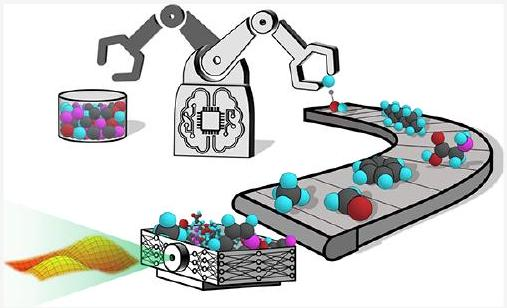
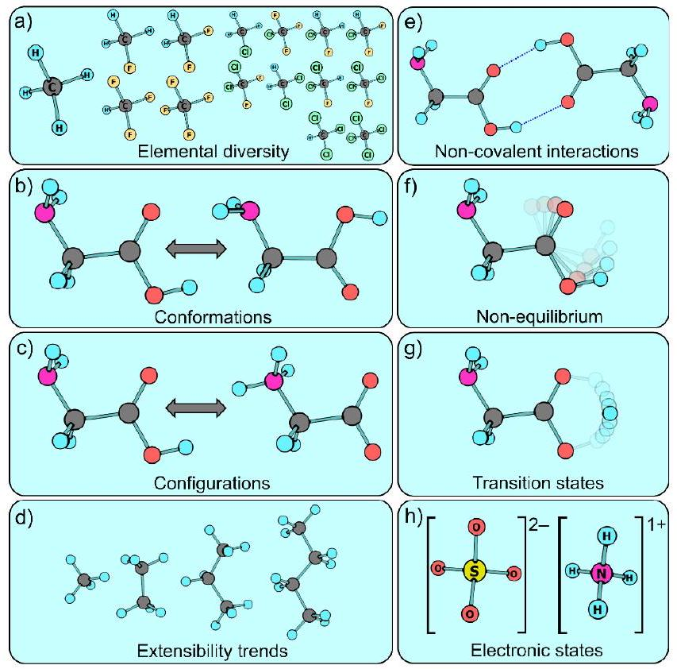
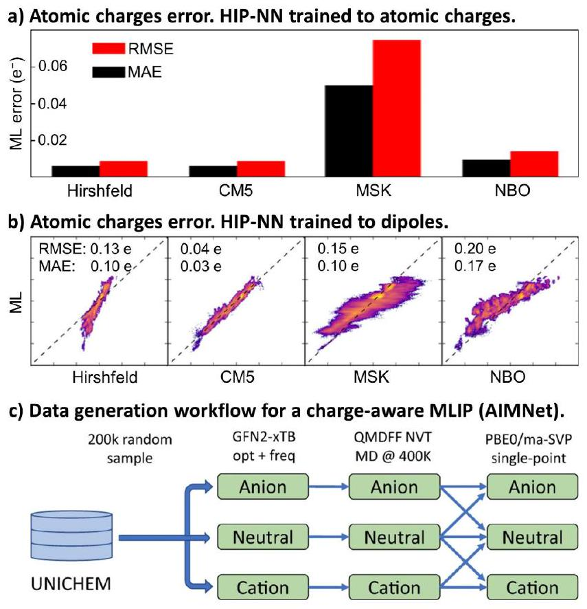
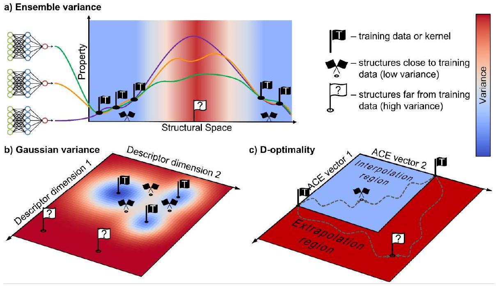
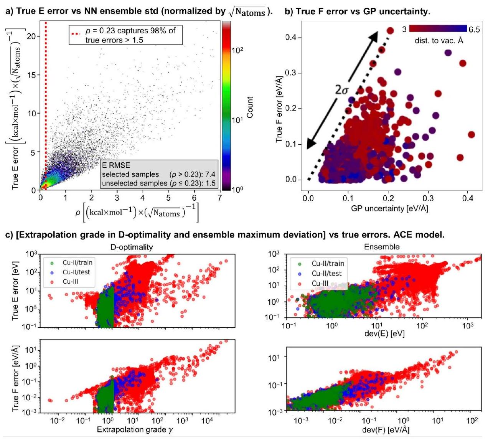
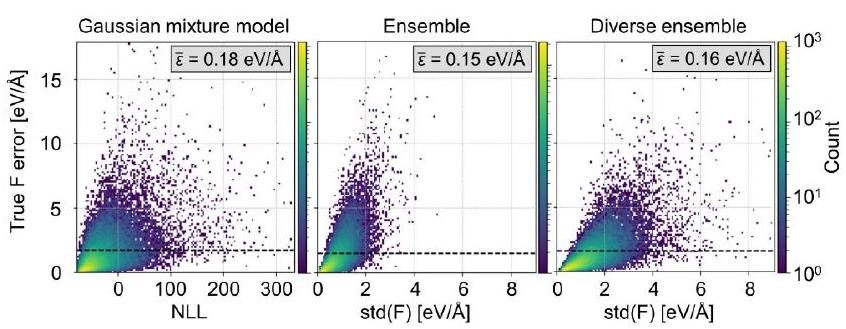
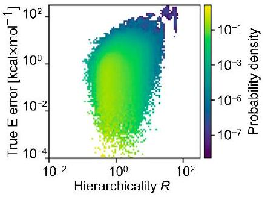
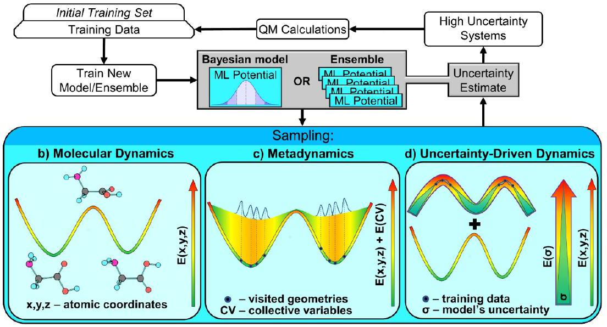
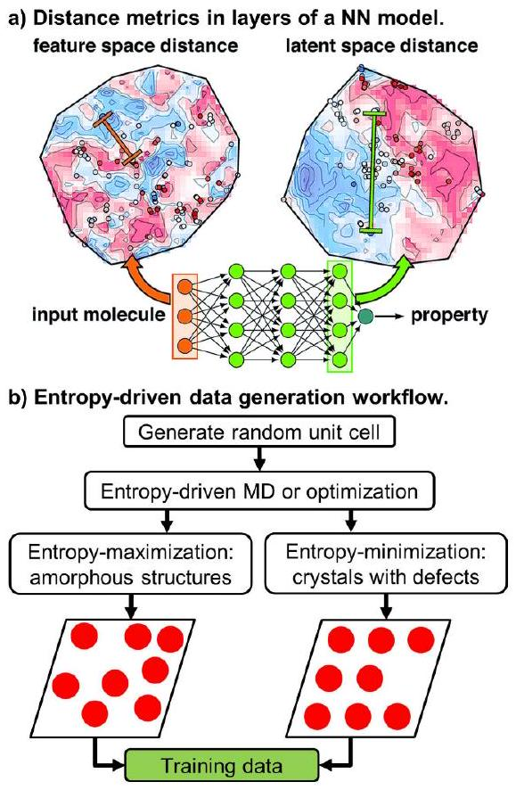

# Data Generation for Machine Learning Interatomic Potentials and Beyond 

Kulichenko, Maksim; Nebgen, Benjamin Tyler; Lubbers, Nicholas Edward; Smith, Justin S.; Barros, Kipton Marcos; Allen, Alice Elisabeth Anastasia; Habib, Adela; Shinkle, Emily Suzanne; Fedik, Nikita; Li, Ying Wai; Messerly, Richard Alma; Tretiak, Sergei

Provided by the author(s) and the Los Alamos National Laboratory (2025-12-23).
To be published in: Chemical Reviews
DOI to publisher's version: 10.1021/acs.chemrev.4c00572
Permalink to record:
https://permalink.lanl.gov/object/view?what=info:lanl-repo/lareport/LA-UR-24-28192

# Data Generation for Machine Learning Interatomic Potentials and Beyond 

Maksim Kulichenko,* Benjamin Nebgen, Nicholas Lubbers, Justin S. Smith, Kipton Barros, Alice E. A. Allen, Adela Habib, Emily Shinkle, Nikita Fedik, Ying Wai Li, Richard A. Messerly, and Sergei Tretiak*

Cite This: https://doi.org/10.1021/acs.chemrev.4c00572
Read Online
Downloaded via LOS ALAMOS NATL LABORATORY on December 2, 2024 at 16:57:45 (UTC). See https://pubs.acs.org/sharingguidelines for options on how to legitimately share published articles.

#### Abstract

The field of data-driven chemistry is undergoing an evolution, driven by innovations in machine learning models for predicting molecular properties and behavior. Recent strides in ML-based interatomic potentials have paved the way for accurate modeling of diverse chemical and structural properties at the atomic level. The key determinant defining MLIP reliability remains the quality of the training data. A paramount challenge lies in constructing training sets that capture specific domains in the vast chemical and structural space. This Review navigates the intricate landscape of essential components and integrity of training data that ensure the extensibility and transferability of the resulting models. We  delve into the details of active learning, discussing its various facets and implementations. We outline different types of uncertainty quantification applied to atomistic data acquisition and the correlations between estimated uncertainty and true error. The role of atomistic data samplers in generating diverse and informative structures is highlighted. Furthermore, we discuss data acquisition via modified and surrogate potential energy surfaces as an innovative approach to diversify training data. The Review also provides a list of publicly available data sets that cover essential domains of chemical space.

## CONTENTS

1. Introduction ..... A2. Data Components, Data Integrity, and PubliclyAvailable Data Sets
2.1. Elemental Space ..... C
2.2. Equilibrium Diversity ..... D
2.3. Nonequilibrium and Reactive Data ..... H
2.4. Electronic States Data ..... I
2.5. Community-Led Systematic Collections ..... K
2.6. Combining Data ..... K
2.7. Data Integrity ..... K
2. Active Learning and Uncertainty Quantification ..... M
3.1. Ensemble-Based Active Learning ..... M
3.2. Single-Model Active Learning and Uncer- tainty Metrics ..... N
Gaussian Approximation Potentials and Var- iance ..... O
D-Optimality ..... O
Gaussian Mixture Model ..... P
3.3. Uncertainty and Error Correlation ..... Q
Ensembles ..... Q
Gaussian Processes ..... Q
D-Optimality ..... Q
Gaussian Mixture Model ..... R
Hierarchical Uncertainty ..... R
3. Structural Sampling via Active Learning and Dynamical Simulations ..... R
4.1. Initial Data and Normal Mode Sampling ..... S
4.2. Molecular Dynamics ..... T
4.3. Metadynamics ..... T
4.4. Uncertainty Driven Dynamics ..... T
4.5. Transition Path Sampling ..... U
4. Feature-Based Atomistic Sampling ..... U
5. Conclusion and Outlook ..... V
Associated Content ..... X
Author Information ..... X
Corresponding Authors ..... X
Authors ..... X
Author Contributions ..... X
Notes ..... X
Biographies ..... X
Acknowledgments ..... Y
References ..... Y
[^0]
## 1. INTRODUCTION

Computational modeling has evolved into an essential tool for delving into the fundamental characteristics of matter at the atomic level. The pursuit of modeling dynamic processes, encompassing scenarios like chemical reactions, phase transitions in materials, and protein folding, has given rise to large-scale atomistic simulations. In molecular dynamics (MD), trajectories are generated by sampling potential energy surfaces (PESs) that describe the system's energy as a function of nuclear coordinates or geometry. MD trajectories are produced by calculating forces (the negative gradients of energy) "on the fly". When high accuracy is the goal, $a b$ initio ${ }^{1,2}$ molecular dynamics (AIMD) is usually the method of choice which relies on forces computed from electronic structure calculations. However, AIMD is computationally expensive, limiting its application to small systems and short time scales. For example, the computational cost of a "gold standard" $\operatorname{CCSD}(\mathrm{T})^{2}$ (Coupled Cluster theory with single, double and perturbative triple excitations) calculation can scale up to $O\left(N^{7}\right)$ in the number of electrons $N$, effectively limiting the applicability of the method to small molecules only. Density functional theory ${ }^{3}$ (DFT) offers a more practical scaling, $O(N) -O\left(N^{3}\right)$. However, in contrast to explicitly correlated coupled cluster methods, DFT employs approximate exchangecorrelation functionals to capture electron correlation which compromises its accuracy in specific cases. The computational costs of DFT still substantially limit its applicability for large systems over long time scales due to a large prefactor even for $O(N)$ scaling methods. ${ }^{4}$

A more computationally efficient approach is the use of classical force fields, ${ }^{5-10}$ which completely omit quantum mechanics (QM) and approximate chemical systems via a classical "beads and springs" model, often with additional terms for Coulomb and dispersion interactions. These classical force fields exhibit linear scaling ( $O(N)$ ) with a low prefactor, enabling MD simulations of systems with hundreds of millions or billions of atoms. ${ }^{11-13}$ Simulations of this scale are particularly critical for modeling emergent materials properties such as strength or ductility, and complex structures such as proteins in biological systems or polymers. Classical force fields, however, rely on predefined, physically motivated functional forms dependent on bond lengths, bond angles, and dihedral angles, each with empirical parameters. Despite their excellent scalability, force fields have limited fitting flexibility in part due to incorrect physical assumptions (harmonicity, independence of interactions, low body order, etc.) which cause them to suffer from poor accuracy when applied outside of the target chemical domain. Substantial human time and effort is required to customize the parameters to suit the specific system under study before conducting simulations involving novel chemicals and materials.

The emergence of machine learning (ML) has ushered in a new era of predictive modeling in atomistic simulations. The promise of ML lies in its ability to accelerate computations while maintaining high levels of accuracy, thereby transforming the landscape of materials discovery, molecular dynamics, and quantum chemistry. Modern ML models go beyond energy/ forces ${ }^{14-16}$ predictions and successfully deal with physical and chemical properties of molecules ${ }^{17,18}$ such as vibrational spectra, ${ }^{19,20}$ atomic charges, ${ }^{21,22}$ ionization potentials, ${ }^{22}$ and chemical potentials. ${ }^{23}$ Moreover, ML models have started to show promise for studying excited state chemistry and
dynamics. ${ }^{24-26}$ Recent advances of ML in chemical reactivity, ${ }^{27,28}$ catalysis, ${ }^{29}$ drug discovery, ${ }^{30-32}$ protein structure prediction, ${ }^{33}$ and materials design ${ }^{34,35}$ highlight the rapid expansion of ML models ${ }^{36-43}$ and ML-assisted ${ }^{44-50}$ quantum methods throughout chemistry fields. ${ }^{51}$ Recent work on the thermal transport demonstrated how ML can bypass the limit of the accuracy defined by the underlying level of reference theory. ${ }^{52}$ Extended size and time scales achieved in ML dynamics already allow for more accurate modeling of complex material properties such as thermal conductivity (see Figure 3 in ref 52).

A key factor of ML's success in atomistic simulations lies in its capacity to learn from atomic-scale data. This ability underpins the development of potent ML interatomic potentials (MLIPs), sometimes referred to as ML force fields, capable of mimicking complex QM behaviors in molecular and solid materials over a remarkable range of configurational space. The development of MLIPs has attracted significant attention and is arguably the most mature area in ML applications to atomistic simulations. Accordingly, this Review predominantly discusses the data generation aspects relevant to MLIPs development. However, the observed trends and formulated strategies are generally pertinent to other ML applications as well. The complexity of molecular systems, the diversity of chemical interactions, and the intricate balance between accuracy and computational efficiency necessitate thoughtful considerations when designing data sampling strategies for MLIPs. In the realm of atomistic simulations, a comprehensive training set must capture the richness of structural and chemical spaces. Glycine-the simplest amino acid-illustrates how complex chemical PESs are, even within the domain of small molecules. This ten-atom molecule has eight stable conformers ${ }^{53,54}$ and 17 transition states ${ }^{55}$ due to three torsional degrees of freedom in the gas phase. In ref 56, it required 1.4 k DFT data points to sample the PES of glycine's four low-lying isomers, so the trained system-specific MLIP (ANI ${ }^{57}$ neural network) would accurately describe torsional isomerizations. ${ }^{56}$ Note that this does not account for zwitterion forms where the amino-group is protonated and the $-\mathrm{CO}_{2}{ }^{-}$group carries a negative charge (no hydrogen attached to the O atom). ${ }^{58}$ The zwitterion form also highlights the chemical diversity that bond-breaking isomerization and atomic charge states bring to the chemical space. Elemental aluminum, a seemingly simple homoatomic system, can serve as a solid-state example of the richness of structural space. Despite the trivial elemental composition, it has at least 8 lowlying crystal structures. ${ }^{59}$ To properly describe relative energies and energy barriers between crystal structures, ANI potential was trained to 6.3 k DFT calculations ${ }^{59}$ of large cells exceeding 100 atoms.

We would like to stress that glycine and aluminum examples are provided to highlight the complexity of chemical PESs rather than the amount of training data needed. Perhaps, training a MLIP of a different kind, e.g., an Atomic Cluster Expansion model, ${ }^{60}$ or equivariant neural network ${ }^{61}$ would require fewer data points. Moreover, MLIPs successfully transfer the knowledge of energy profiles of molecular fragments between different molecules. Thus, given a properly sampled PES of glycine, it would require much less additional data to generalize the model to larger amino acids of the same elemental composition. Indeed, the extraordinary learning capacity of ML models enables them to generalize effectively, providing accurate predictions across a wide spectrum of
chemical environments. ${ }^{62-64}$ However, while gathering diverse and accurate data is the key, it is equally important to strike a balance between data quality/amount and computational efficiency. The substantial computational cost of advanced $a b$ initio methods often limits the construction of general-purpose data sets. In this regard, transfer learning is a promising technique. ${ }^{63-65}$ In this approach, an initial model is trained using abundant and computationally affordable data, such as DFT calculations, which are expected to produce a model with qualitatively reasonable behaviors over the target chemical space. Subsequently, the model is fine-tuned on a smaller portion of the data obtained via more sophisticated methods, e.g. $\operatorname{CCSD}(\mathrm{T})$.

Experimental measurements may serve as an alternative source of data. ${ }^{66-68}$ This provides a significant advantage over computational data since experimental data can be viewed as a ground truth that is independent of the various approximations employed by quantum chemical simulations. However, it is important to note that training on experimental data presents its own set of challenges. It is subject to limitations such as apparatus resolution and error, resources available, purity of samples, and potential human factors. Generating experimental data is a laborious and resource-intensive process, and there may not always be enough readily available data. Even when a substantial amount of experimental data is collected, it may not be consistent in terms of experimental settings or diverse enough to cover nonequilibrium geometries and conditions. For example, NIST Chemistry WebBook ${ }^{69}$ provides access to a comprehensive compilation of experimental data, including spectral and thermochemical information for over 40 k organic compounds. These data are sourced from various independent references but may have been obtained using different experimental settings. Consequently, there is an inherent noise in the data, which can pose challenges when training ML models. Moreover, experimental data usually correspond to near-equilibrium or statistically averaged data, as dictated by thermodynamics. Therefore, training ML potentials directly on experimental data can be problematic and poorly expandable to nonequilibrium conditions, although not impossible. ${ }^{66-68,70}$ Nevertheless, it is essential to note that the primary source of training data for MLIPs is high-quality QM calculations due to the aforementioned challenges, so the rest of the discussion is devoted to computational data. In the ML community, this type of data is often referred to as synthetic data since it is artificially generated rather than produced by real-world events. ${ }^{71}$

The field of data-driven chemistry features various excellent reviews discussing core concepts, methodological aspects, and advances of MLIPs. A review ${ }^{72}$ by A. von Lilienfeld and B. Huang provides a comprehensive discussion on recent progress in using machine learning (ML) models to predict quantum properties. A. Tkatchenko and colleagues ${ }^{73}$ offer concise tutorials of computational chemistry and ML methods, showing how insights involving both can be achieved. G. Csányi et al. give a detailed overview ${ }^{74}$ of Gaussian process regression ML methods in computational materials science and chemistry. J. Behler's review ${ }^{15}$ focuses on the evolution and architectures of neural network-based MLIPs. M. Ceriotti and colleagues ${ }^{75}$ present a comprehensive overview of various types of molecular and material descriptors for atomistic ML. Review ${ }^{76}$ by K. R. Müller et al. describes in detail the core concepts of kernel- and NN-based MLIPs and provides an overview of their applications. G. W. Wei and colleagues ${ }^{77}$
summarize and analyze emerging small data challenges in molecular science for various ML approaches. Additionally, various detailed reviews are focused on specific problems associated with MLIPs, such as incorporating long-range interactions in MLIPs ${ }^{78}$ by D. M. Anstine and O. Isayev and MLIPs validation ${ }^{79}$ by V. L. Deringer and colleagues. Furthermore, comprehensive works discussing specific applications of MLIPs are available in literature, such as reactivity, ${ }^{80,81}$ electrocatalysis and photocatalysis, ${ }^{82,83}$ and mechanical properties. ${ }^{84}$

As the scientific community strives to explore the capabilities of MLIPs in driving breakthroughs across chemistry, ${ }^{14,18,50,76,85-89}$ it is imperative to understand the nuances of atomistic data sampling. This Review aims to summarize some of the methodologies, challenges, and opportunities that underpin critical aspects of ML-driven sampling and data collection. Our narrative encompasses various challenges and strategies that researchers confront when producing training data to construct accurate and reliable ML potentials. We explore the role of different types of nonequilibrium atomistic data essential for a proper modeling of dynamical processes and simulating reactive events. We also discuss the role of electronic states data in enhancing models' generalizability and predictive power. A substantial portion of our discussion centers around active learning (AL) for atomistic data sampling, a technique designed for autonomous data generation. Our discussion includes the strategies employed in ensemble-based and single-model AL. We discuss different approaches for sampling, including standard molecular dynamics and modified dynamic sampling techniques. We also examine novel approaches that exploit feature-based atomistic sampling, capitalizing on the latent space of neural networks and atomic environment features. By elaborating various strategies developed in the field, we aim to showcase approaches that leverage the ML model to amplify data diversity and model performance.

The Review is organized as follows. In the next section (section 2), we present an idealized view on components and attributes of an ultimate general purpose atomistic data set that include conformational and configurational diversity, size extensibility trends, equilibrium and nonequilibrium structures, noncovalent interactions, elemental diversity, reactive events, and electronic states. We also discuss the critical aspects of data combination and data integrity. Additionally, we list some publicly available databases and briefly discuss practices employed in their preparation. Section 3 is devoted to the recent advances in atomistic AL applied within a context of different MLIPs and uncertainty metrics. In section 4, we review AL based on dynamical simulations and biased MD. In section 5, we discuss feature-based data generation, an approach where new data collection is based on the degree of structural novelty rather than on the uncertainty of the model's predictions. Conclusions and outlook are given in section 6. While this Review is skewed toward molecular systems, most of the data generation aspects discussed are applicable to bulk materials systems as well.

## 2. DATA COMPONENTS, DATA INTEGRITY, AND PUBLICLY AVAILABLE DATA SETS

### 2.1. Elemental Space

Many MLIPs are developed as task-specific tools, when the researcher might already know the elemental composition of
target simulations. However, some chemical discovery areas, such as high-throughput screening, require flexible, generalpurpose models that can handle different classes of chemicals without time-consuming data regeneration and retraining for each specific subtask. To achieve sufficient transferability, it is crucial to include enough elemental diversity in the training set (Figure 1a). As illustrated in Figure 1a, it is evident that the

Figure 1. Graphical illustration of components required for a generalpurpose atomistic data set. (a) Elemental diversity is necessary for transferability. (b) Conformational space needs to be well-sampled, so the ML model can accurately predict the relative stability of different conformers of the same molecule. This, for example, affects relative populations of different isomers in large scale MD simulations. (c) Reasonable sampling of configurational space provides the ML model with the information about different bonding patterns. (d) To achieve the extensibility of ML model, the ability to make accurate predictions for systems much larger than those in the training data, training data must contain a range of system sizes. For models relying on the spatial locality assumption, the training data should include a range of system sizes at least up to the model's spatial locality cutoff. (e) Structures involving noncovalent interactions, e.g., hydrogen bonds, are important for accurate description of electrostatic contributions into the energetics of a simulation. (f) Nonequilibrium geometries are especially important for accurate dynamical simulations. Transitions proceed through structures typically higher in energy than equilibrium ones. This data is essential for models to learn boundaries of energetically accessible space. (g) Although transition states are thermodynamically rare events and are challenging to sample, they are crucial for accurate reactive simulations. (h) Incorporating electronic state information into the training set and utilizing charge-aware ML models enable models' transferability to different charge and spin states, proper modeling of electrostatic interactions and charge transfer, and polarization effects.

data set size grows rapidly as the elemental space expands, even when dealing with small molecules. Therefore, the elemental space of target simulations needs to be thoroughly thought out to prevent an unnecessarily large size of the training set and an excessive number of time-consuming QM calculations during the data generation process. Moreover, training sets covering larger elemental space might require ML models of a larger
learning capacity to account for more diverse atomic environments. Several publicly available data sets are highlighted below that include minimal organic elemental space $\{\mathrm{H}, \mathrm{C}, \mathrm{N}, \mathrm{O}\}$ and beyond. A summary is provided in Table 1.

Among publicly available atomistic databases, the SPICE database ${ }^{90}$ stands out for both its elemental and conformational diversity. Additionally, it features both charged and neutral molecules. The primary purpose of this data set is capturing the energetics of molecular environments relevant to drug-like small molecules interacting with proteins. Thus, it comprises a collection of subsets (see original paper ${ }^{90}$ for details), each designed to add particular information, such as covalent, noncovalent, and protein-water interactions. The elemental space covering $\{\mathrm{H}, \mathrm{Li}, \mathrm{C}, \mathrm{N}, \mathrm{O}, \mathrm{F}, \mathrm{Na}, \mathrm{Mg}, \mathrm{P}, \mathrm{S}, \mathrm{Cl}$, $\mathrm{Ca}, \mathrm{K}, \mathrm{Br}, \mathrm{I}\}$ is represented by 1.1 M conformations of small molecules, dimers, dipeptides, and solvated amino acids.

The database by Stuke et. al also spans a wide range of elements $\{\mathrm{H}, \mathrm{Li}, \mathrm{B}, \mathrm{C}, \mathrm{N}, \mathrm{O}, \mathrm{F}, \mathrm{Si}, \mathrm{P}, \mathrm{S}, \mathrm{Cl}, \mathrm{As}, \mathrm{Se}, \mathrm{Br}, \mathrm{Te}, \mathrm{I}\}$ and is represented by 61 k crystal-forming organic molecules. ${ }^{91}$ Another elementally diverse atomistic database is BSE4992 by DiLabio et. al, a data set of homolytic bond separation energies. It covers $\{\mathrm{H}, \mathrm{C}, \mathrm{N}, \mathrm{O}, \mathrm{F}, \mathrm{Si}, \mathrm{P}, \mathrm{S}, \mathrm{Cl}\}$ elemental space and contains 4.5 k samples with 49 unique single-bond separations. Other examples of organic data sets that go beyond $\{\mathrm{H}, \mathrm{C}, \mathrm{N}, \mathrm{O}]$ are QM7-X, ${ }^{93}$ QMugs, ${ }^{94}$ GEOM, ${ }^{95}$ and AQM. ${ }^{96}$

ANI-2x ${ }^{97,98}$ is a successor of the ANI-1x ${ }^{36}$ potential extended to include new $\{\mathrm{F}, \mathrm{S}, \mathrm{Cl}\}$ elements in addition to $\{\mathrm{H}, \mathrm{C}, \mathrm{N}, \mathrm{O}\}$ in ANI-1x. It serves as an example of building a data set of extended elemental space upon existing data. The sampling techniques mirrored ANI-1x protocol except for the following key differences. (1) Since ANI-2x is built upon ANIlx , the AL procedure was performed for $\mathrm{F}-, \mathrm{Cl}-$, and $\mathrm{S}-$ containing species only. (2) From the GDB-11 database, ${ }^{99-101}$ the authors combinatorically replaced the chemical symbols O with S and F with Cl for all molecules containing up to eight non-hydrogen atoms. (3) From the ChEMBL database, ${ }^{102}$ molecules containing S, F, and Cl were sampled. (4) Conformers of amino acids and dipeptides containing S were randomly generated using the Rdkit ${ }^{103}$ cheminformatics package. The resulting data set contains 8.9 M samples in $\{\mathrm{H}, \mathrm{C}, \mathrm{N}, \mathrm{O}, \mathrm{F}, \mathrm{Cl}, \mathrm{S}\}$ elemental space against 5 M in the original $\{\mathrm{H}, \mathrm{C}, \mathrm{N}, \mathrm{O}\}$ set.

### 2.2. Equilibrium Diversity

Equilibrium structural space includes both conformational (interconversion through rotations around bonds, Figure 1b) and configurational (isomerization involves bond breaking, Figure 1c) subspaces. Additionally, the data set should include data for varying system sizes to capture size-dependent trends which enables extensibility to larger structures (Figure 1d). For models relying on the spatial locality assumption, the training data should include a range of system sizes at least up to the model's spatial locality cutoff.

Predefined valency rules in organic chemistry enable sampling conformational and configurational equilibrium structures using combinatorial and graph-based techniques, given an upper limit for the number of atoms in the molecule. This, however, does not make sampling of equilibrium structures an easy problem since the chemical space of even small molecules is effectively limitless. In this regard, various databases were created to capture features of equilibrium diversity. Table 2 highlights various publicly available data sets

Table 1. Structurally Diverse Databases of Organic Molecules
| data set | description | size | entry content | Elements |
| :--- | :--- | :--- | :--- | :--- |
| SPICE ${ }^{90}$ | drug-like small molecules interacting with proteins | 1.1M | formation and total energies, forces, charges, dipoles, quadrupoles, octupoles | H, Li, C-F, Na, Mg, P, S, Cl, Ca, K, Br, I |
| OE62 ${ }^{91}$ | equilibrium crystal-forming organic molecules | 61k | total and orbital energies | H, Li, B-F, Si-Cl, As, Se, Br, Te, I |
| BSE49 ${ }^{92}$ | homolytic bond separation energies | 4.5k | bond separation energies | H, C-F, Si-Cl |
| QM7-X ${ }^{93}$ | equilibrium and nonequilibrium structures of small organic molecules | 4.2 M | atomization energies, dipole moments, polarizability tensors, dispersion coefficients, and more | H, C, N, O, S, Cl |
| QMugs ${ }^{94}$ | equilibrium structures of large bioactive molecules | 665k | thermodynamic data (GFN2-xTB, DFT) | H, C-F, P, S, Cl, Br, I |
| GEOM ${ }^{95}$ | small and midsized organic molecules | 37M | stereochemistry, experimental properties | H, C-F |
| AQM ${ }^{96}$ | organic drug-like molecules in gas phase of solvated in water | 59k | total energies, forces, dipole moments, quadrupole moments, atomic charges | H, C-F, P, S, Cl |
| ANI-1x ${ }^{36}$ | nonequilibrium small and midsized organic molecules | 5M | total energies, forces, dipoles, quadrupoles | H, C, N, O |
| ANI-2x ${ }^{97,98}$ | nonequilibrium small and midsized organic molecules | 8.9M | total energies, forces, dipoles, quadrupoles | H, C-F, S, Cl |

and databases containing equilibrium geometries. For example, the family of GDB ${ }^{99-101}$ (Generated Databases) covers the vast space of small organic molecules, namely GDB-11/13/17 with up to 11/13/17 non-hydrogen atoms and containing $\{\mathrm{H}$, C, N, O, F $\} /\{\mathrm{H}, \mathrm{C}, \mathrm{N}, \mathrm{O}, \mathrm{S}, \mathrm{Cl}\} /\{\mathrm{H}, \mathrm{C}, \mathrm{N}, \mathrm{O}, \mathrm{S}, \mathrm{F}, \mathrm{Cl}, \mathrm{Br}, \mathrm{I}\}$ elements, respectively. The largest of them, GDB-17, contains as many as 166 billion data entries. Molecules were generated using graph and combinatorial approaches, following valency and bond order rules and are stored in SMILES (Simplified Molecular Input Line Entry System) format. Subsets of GDB with QM properties have found wide application in the field of atomistic ML. ${ }^{90,104,105}$ For example, QM9 ${ }^{106}$ contains all neutral species with up to nine non-hydrogen atoms $\{\mathrm{H}, \mathrm{C}, \mathrm{N}$, $\mathrm{O}, \mathrm{F}$ \} from GDB-17 that sum to 134 k equilibrium molecules (DFT optimized) with corresponding QM harmonic frequencies, dipole moments, polarizabilities, energies, enthalpies, and free energies of atomization calculated using B3LYP/6$31 \mathrm{G}(2 \mathrm{df}, \mathrm{p})$ model chemistry. The same data set is also reported by Kim et al. where the underlying QM method is Gaussian-4 reduced order perturbation theory (G4MP2), presumably more accurate than DFT model. ${ }^{107}$

Another useful resource of equilibrium organics geometries is PubChem ${ }^{108}$ which offers 116 M molecules and their activities against biological assays. Similarly, ChemSpider ${ }^{109}$ is a freely accessible online database of structures and properties of more than 100 M molecules. In the field of drug discovery and bioactivity, CheMBL ${ }^{102}$ stands out as another widely recognized repository of equilibrium geometries of organic species. This manually curated database contains 2.4 M bioactive molecules with drug-like properties. The structural content is stored in SMILES format which requires the use of third-party software such as RDKit ${ }^{103}$ to convert it to 3D geometries. Likewise, DrugBank ${ }^{110}$ is a web-tool repository of over 15k drug molecule structures and comprehensive data on their drug/chemical and target/protein properties. Atom3D database ${ }^{111}$ offers access to 3D structures of larger biological systems such as RNAs and proteins. Importantly, comprehensive databases for molecules interacting with biological interfaces are also emerging as exemplified by MolMeDB , an open web-based database collecting entries on moleculemembrane interactions. ${ }^{112}$

Data generation for relaxed bulk materials and solid surfaces poses a challenge due to the diverse composition and spatial arrangements, leading to intricate electronic structures. Usually, DFT methods are employed to generate data sets
for these systems. The commonly utilized methods are GGA (PBE) or GGA+U with PAW (projected augmented wave) potentials. Hybrid DFT models common for molecular space are rarely utilized for high throughput simulations of periodic structures of solids owing to their noticeably higher computational cost. The Cambridge Structural Database (CSD) ${ }^{113}$ serves as a useful resource, offering 3D experimental structural data of organic and metal-organic crystals. With a compilation of over 1.25 M entries, the CSD continually expands its repository by incorporating more than 50 k new structures each year. The Inorganic Crystal Structure Database (ICSD) ${ }^{114}$ is acclaimed as the largest database globally for entirely identified inorganic crystal structures. Featuring 280 k experimental crystal structures in its database, the ICSD incorporates approximately 12 k new structures annually. These databases, by virtue of their extensive and continually growing content, play pivotal roles in advancing materials science and facilitating research in various domains, including ML. Note, however, that CSD and ICSD feature structural information only, without any QM labels attached, serving as seeding geometries for building training sets from scratch. For those seeking QMprocessed data on equilibrium materials, several notable resources stand out. The Materials Project, ${ }^{115}$ the Open Quantum Materials Database (OQMD), ${ }^{116}$ the Aflowlib, ${ }^{117}$ the Materials Cloud ${ }^{118}$ platform, the Novel Materials Discovery (NoMaD) ${ }^{119}$ and the Open Materials Database (https://openmaterialsdb.se) altogether provide access to tens of millions of materials featuring DFT-optimized structures and computed properties, encompassing both known and predicted compositions. Note that different DFT settings were used in each of these databases, so they are not necessarily directly compatible with each other.

Transition metal complexes (TMC), ligands arranged around $d$-block atoms, are a challenging class of molecules due to the complex electronic structure (often featuring degeneracy, multireference character, and spin-orbit coupling) and the associated higher computational costs compared to main group organic chemistry. Current endeavors in sampling this subspace include tmQM, ${ }^{120} \mathrm{tmQMg}$, and tmQMg-L by Balcells et al., $\mathrm{TMC}^{121,122}$ data sets by Kulick and co-workers, and QMOF ${ }^{123}$ by Rosen and co-workers. tmQM comprises the geometries (density functional tight binding, DFTB, optimized) and common electronic properties (DFT-computed) for 86 k mononuclear complexes sourced from the CSD. This data set encompasses organometallic, bioinorganic, and

Table 2. Databases of Equilibrium Geometries for Organic and Inorganic Compounds and Materials

| data set | description | size | entry content | elements |
| :--- | :--- | :--- | :--- | :--- |
| GDB-17 ${ }^{99-101}$ | small organic molecules | 166b | SMILES strings | H, C-F, S, Cl, Br, I |
| QM9 ${ }^{106}$ QM9-G4MP2 ${ }^{107}$ | small organic molecules | 134k | harmonic frequencies, dipole moments, polarizabilities, total energies, enthalpies, free energies of atomization | H,C-F |
| $\mathrm{CSD}^{113}$ | 3D experimental structural data of organic and metal-organic crystals | 1.25M | 3D coordinates | no elemental restrictions |
| ICSD ${ }^{114}$ | inorganic crystal structures | 280 k | 3D coordinates | no elemental restrictions |
| OQMD ${ }^{116}$ | structures from ICSD and decorations of commonly occurring structures | 1.2 M | DFT calculated thermodynamic and structural properties | all elements and some of their hypothetical compositions |
| Aflowlib ${ }^{117}$ | binary alloys, inorganic compounds | 3.5M | DFT calculated thermodynamic and structural properties | no elemental restrictions |
| $\mathrm{tmQM}^{120}$ | organometallic, bioinorganic, and Werner complexes from CSD | 86k | 3D coordinates, QM properties | H, B-F, Si-Cl, As, Se, Br, I, metals ${ }^{138}$ |
| $\mathrm{tmQMg}^{138}$ | subset of tmQM (<85 atoms) augmented with graph representation based on NBO analysis | 60k | 3D coordinates, graph representation, QM properties | H, B-F, Si-Cl, As, Se, Br, I metals ${ }^{124}$ |
| $\mathrm{tmQMg}-\mathrm{L}^{124}$ | TMC-forming organic ligands sampled from tmQM | 30K | 3D coordinates, metal connectivity, bond orders, denticity and hapticity, graph information, natural charge, HOMO and LUMO energies, dipole moment, RDKit descriptors | H, B-F, Si-Cl, As, Se, Br, I |
| TMC ${ }^{121,122}$ | combinations of various transition metal centers and main group ligands | 2.6M | total energies, spin gap energies, redox potentials, solubility | H, C, N, O, Cr, Mn, Fe, $\mathrm{Co}, \mathrm{Ni}$ |
| QMOF ${ }^{123}$ | experimentally synthesized MOFs | 20k | DFT-optimized geometries, energies, band gaps, charge and spin densities, and more | nearly the entire periodic table |
| NCIAtlas ${ }^{133-135}$ | noncovalent complexes | 19k | QM (CCSD(T)) interaction energies | $\mathrm{H}, \mathrm{He}, \mathrm{B}-\mathrm{Ne}, \mathrm{P}-\mathrm{Ar}$, As-Kr, I, Xe |
| DES370 and DES5M ${ }^{137}$ | typical organic species, of common p-block elements and alkali metal ions | 370k, 5M | noncovalent interaction energies | H, He, Li,C-Mg, P, S, Cl, Ar, K, Ca, Br, Kr, I, Xe |
| BEGDB ${ }^{136}$ | dimers, clusters, and noncovalent complexes | small size cluster | chemical structures, QM (CCSD(T), MP2) interaction energies | H, C-F, I, Br, Cl |
| PubChem ${ }^{108}$ | mostly small molecules, but also larger molecules such as nucleotides, carbohydrates, lipids, peptides, and chemically modified macromolecules | 116M | chemical structures, identifiers, chemical and physical properties, biological activities, patents, health, safety, toxicity data, and many others | all of the periodic table |
| ChemSpider ${ }^{109}$ | various molecules | 100M | biochemical activity properties | all of the periodic table |
| CheMBL ${ }^{102}$ | bioactive molecules with drug-like properties | 2.4 M | bioactivity measurements in various assays | no elemental restrictions |
| DrugBank ${ }^{110}$ | drug molecules such as those approved by FDA | 15 k | drug/chemical and target/protein properties e.g. drug metabolism, toxicity, absorption | no elemental restrictions |
| Atom3D ${ }^{111}$ | eight data sets containing biomolecules, small molecules, and nucleic acids, and sourced from other databases such as QM9, DIPS, etc | N/A | QM properties such as energies, forces and protein properties such as binding strength, ligand binding affinity, etc | main group elements |
| NoMaD | synthesized and hypothetical crystal structures | 13M | DFT computed thermal and electronic properties such as band structures and density of states | all of the periodic table |
| Materials Project ${ }^{115}$ | experimentally synthesized and hypothetical crystal structures | 172k | computed and experimental geometries, electronic structure, and thermodynamic properties | all of the periodic table |
| Open Materials Database (https://openmaterialsdb.se) | 3D configurations from Crystallography Open Database ${ }^{139}$ and chemical properties such as bond orders, delocalization, charges | N/A | unit cell geometry information such as lattice type, lattice constants, atom coordinates | all of the periodic table |

Table 3. Compilation (Not Exhaustive) of Reactive Atomistic Datasets ${ }^{\boldsymbol{a}}$
| data set | description | number of reactions/data points | entry content | elements |
| :--- | :--- | :--- | :--- | :--- |
| transitionlx ${ }^{162}$ | reactions of different types | $10 \mathrm{k} / 9.6 \mathrm{M}$ | R, TS, P, N-E | H, C, N, O |
| green ${ }^{172}$ /RDB7 ${ }^{173}$ | reactions of different types | 16k/49k | R, TS, P | H, C, N, O |
| RGD1 ${ }^{165}$ | reactions of different types | 177k/NA | R, TS, P | H, C, N, O |
| ANI-1xnr ${ }^{144}$ | reactive MD snapshots from active learning | NA/26k | R, P, reactive events, N-E | H, C, N, O |
| methane combustion ${ }^{143}$ | methane combustion reactions | 798/579k | R, P, reactive events, N-E | H, C, O |
| OC20 | relaxations of molecular adsorptions onto surfaces | 1.3M/265M | relaxation and MD trajectories, randomly perturbed structures | H, C, N, O, catalytic surfaces |
| QMrxn ${ }^{160}$ | competing E 2 and $\mathrm{S}_{\mathrm{N}} 2$ reactions | $4.5 \mathrm{k} / 200 \mathrm{k}$ | R, TS, P, reactant complexes | H, C-F, Cl, Br |
| $\mathrm{BH9}{ }^{163}$ | reactions of different types | 449/1775 | R, TS, P | H, B-F, Si-Cl |
| BSE49 ${ }^{92}$ | bond dissociation energies | $4.5 \mathrm{k} / 13 \mathrm{k}$ | R, P | H,B-F, Si-Cl |
| BDE261 ${ }^{174}$ | bond dissociation enthalpies | 261/294 | R, P | H,C-F, Si-Cl |
| hydrogen combustion ${ }^{159}$ | hydrogen combustion reaction channels | 19/290k | R, TS, P, N-E | H, O |
| Rad-6-RE ${ }^{175}$ | organic dissociation and rearrangement reactions | $30 \mathrm{k} / 10 \mathrm{k}$ | R, P | H, C, O |
| Li et al. ${ }^{176}$ | radical $\mathrm{C}-\mathrm{H}$ functionalization of heterocycles | 6k | TS + separated rings and radicals | H, C-F, S |
| $\mathrm{S}_{\mathrm{N}} \mathrm{Ar}^{177}$ | nucleophilic aromatic substitution ( $\mathrm{S}_{\mathrm{N}} \mathrm{Ar}$ ) | 475/1400 | R, TS, P | H, C-F, S, Cl, Br, I |
| $\mathrm{S}_{\mathrm{N}} 2-\mathrm{TS}^{178}$ | nucleophilic substitution | 72/360 | R, TS, P | H, C-F, Cl, Br |
| BH76 ${ }^{179}$ | forward and reverse BHs for different hydrogen-transfer, heavy-atom transfer, nucleophilic-substitution, unimolecular and association reactions | 38/85 | R, TS, P | H, C-F, P, S, Cl |
| BHPERI ${ }^{179}$ | BHs of pericyclic reactions | 26/61 | R, TS, P | H, B-O, Si, P, Cl |
| BHDIV10 ${ }^{179}$ | BHs of larger and more diverse reactions | 10/20 | R, TS, P | H, B-O, Si, P, Cl |
| INV24 ${ }^{179,180}$ | BHs for inversion reactions | 24/48 | R, TS, P | H, B-O, P, S, Cl |
| BHROT27 ${ }^{179}$ | BHs for rotation around single bonds | 27/40 | R, TS, P | H, C, N, O, S |
| PX13 ${ }^{179,181}$ | BHs for proton transfer in water, ammonia and hydrogen-fluoride clusters | 13/29 | R, TS, P | H, N, O, F |
| WCPT18 ${ }^{179,182}$ | proton-transfer tautomerization reactions including carbonyls, imines, propene, and thiocarbonyls | 18/28 | R, TS, P | H, C, N, O, S |
| Hydroform-22-TS ${ }^{183}$ | structures and energies of intermediates before and after the alkene insertion transition state in the catalytic cycle of olefin hydroformylation; up to 67 non- H atoms | 2350/4700 | R, P | H, C, O, F, P, Cl, Co, Ir, Rh |
| Proparg-21-TS ${ }^{183}$ | structures of intermediates before and after the enantioselective transition state of the propargylation of benzaldehyde, DFT-computed BHs; up to 52 non-H atoms | NA/753 | R, P | H, C-F, Cl |
| Cyclo-23-TS ${ }^{184,185}$ | [3+2] uncatalyzed cycloaddition reactions between various homo/heterocycles and biologically important scaffolds including ethylene and acetylene. Up to 50 non-hydrogen atoms and 95 total atoms | 5k/15k | R, TS, P | H, C, N, O, Cl, Br |

${ }^{a} \mathrm{BH}$ stands for barrier height. Entry content key: R, reactants; TS, transition states; P, products; N-E, non-equilibrium geometries.

Werner complexes, featuring a diverse range of organic ligands and 30 transition metals. Pursuing ideas of a high-throughput generative approach to create vast chemical space of TMCs, Balcells et al. recently released tmQMg-L data set, ${ }^{124}$ "extensive, diverse, and synthesizable set of 30 k TMC ligands extracted from the CSD". Ultimately, data set was leveraged to efficiently produce 1.37 M TMCs and paves the road for a robust TMC generation

TMC data sets by Kulik et al. encompass combinations of various metal centers $\{\mathrm{Cr}, \mathrm{Mn}, \mathrm{Fe}, \mathrm{Co}, \mathrm{Ni}\}$ and an extensive array of main group ligands. The properties calculated at the DFT level include total energies, spin gap energies, redox potentials, and solubility in candidate M(II)/M(III) redox couples. The total size of these data sets extends to several millions. molSimplify ${ }^{125}$ toolkit was used to assemble initial structures of TMCs from predefined lists of metal centers and ligands. Another useful tool for building 3D complexes across periodic table is recently introduced Architector ${ }^{126}$ by Taylor et al. which is designed for assembling $s$-, $p$-, $d$-, and $f$-block mononuclear organometallic complexes.

The quantum metal-organic frameworks (QMOF) data set ${ }^{123}$ encompasses $20 \mathrm{k}+$ experimentally synthesized MOFs, incorporating chemical elements that span nearly the entire periodic table. The computed properties include energies, band gaps, charge densities, and densities of states, evaluated at the DFT level of theory.

Proper sampling of noncovalently bonded systems (Figure 1e) holds prominent significance, particularly, for biochemical simulations, where noncovalent interactions (e.g., hydrogen bonds, cation $-\pi$ interactions, $\pi-\pi$ interactions, $\mathrm{CH}-\pi$ interactions, and ionic bonds) ${ }^{127-129}$ play a vital role in protein folding and binding affinity. ${ }^{130-132}$ Non-Covalent Interaction Atlas ${ }^{133-135}$ is a valuable resource with 3 k equilibrium (DFT optimized) noncovalent complexes and corresponding QM (CCSD(T)) interaction energies. Together with dissociation curves, this database comprises 19 k geometries, spanning a wide elemental range $\{\mathrm{H}, \mathrm{He}, \mathrm{B}-\mathrm{Ne}, \mathrm{P}-$ Ar , As -Kr , I, Xe . Benchmark Energy and Geometry Database ${ }^{136}$ is another useful collection of data sets of dimers, clusters, and complexes with noncovalent interactions.

The largest publicly available noncovalent data sets are DES370 and DES5M by D. E. Shaw Research that involve 3.7k different types of interacting molecule pairs. ${ }^{137}$ The involved molecules consist of typical organic species, featuring common $p$-block elements and alkali metal ions, with most containing no more than seven heavy atoms. DES370 contains noncovalent interaction energies for over 370k dimer geometries, computed at the CCSD(T) level. DES5M comprises noncovalent interaction energies for nearly 5 M dimer geometries, calculated at the SNS-MP2 level.

### 2.3. Nonequilibrium and Reactive Data

Despite the wide range of available databases, achieving chemical diversity that extends beyond equilibrium structures is a challenge. In the molecular realm, equilibrium structures only represent a small fraction of the PES. However, collecting important nonequilibrium structures is far from trivial, and publicly available databases with diverse nonequilibrium geometries are less common compared to those with equilibrium structures. To achieve accurate dynamical simulations, MLIPs must also be trained on nonequilibrium structures (Figure 1f). With the emergence of new generations of NNs for inferring reactive properties, such as Equireact, ${ }^{140}$ the demand for designing nonequilibrium data sets is increasingly urgent. To date, the protocol for acquisition of nonequilibrium atomistic data is relatively well established and usually involves molecular dynamics (MD), meta-dynamics, normal mode sampling (NMS), and/or Monte Carlo ${ }^{141,142}$ simulations. For example, ANI-1x, a data set of 5 M organic systems spanning $\{\mathrm{H}, \mathrm{C}, \mathrm{N}, \mathrm{O}\}$ elemental space (Table 1), was generated via an AL scheme involving four types of sampling: MD, NMS, dimer sampling, and ML-driven torsion sampling (cf. section 3). ${ }^{36}$ In order to acquire a bootstrap set of starting geometries for further nonequilibrium sampling, $\{\mathrm{H}, \mathrm{C}, \mathrm{N}, \mathrm{O}\}$ molecules with a system size threshold were mined from various databases of molecules such as GDB-11 and ChEMBL. Additionally, amino acids and 2 -amino acid peptides were generated with the RDKit ${ }^{103}$ cheminformatics python package.

One of the most challenging aspects of atomistic data mining is generating data on transition states (TS), particularly those involving bond breaking or formation-essential data for training reactive MLIPs. TS data could, in principle, be acquired through MD. ${ }^{143,144}$ This unguided approach, however, may require impractical time scales (up to nanoseconds) for sampling of general-purpose reactive data since TSs are thermodynamically rare events. Therefore, advanced sampling techniques are usually used to generate data on TS and reaction pathways. Those include nudge elastic band (NEB), ${ }^{145,146}$ intrinsic reaction coordinate (IRC), ${ }^{147,148}$ eigenmode following, ${ }^{149}$ growing string search, ${ }^{150,151}$ synchronous transit method, ${ }^{152}$ Berny TS optimization, ${ }^{153}$ transition path sampling (TPS), ${ }^{154-157}$ and Monte Carlo ${ }^{154,158}$ sampling. Despite the number of available methods for TS search, most of them require prior knowledge of reactant/product geometries or require a reasonable initial guess of TS structure. A noticeable exception is the single-ended growing string method, which only requires reactants and does not need a guess of the TS search. ${ }^{151}$

While the number of reactive databases publicly available is limited, the few that exist are mainly designed for specific tasks, such as simulating hydrogen combustion, ${ }^{159} \mathrm{~S}_{\mathrm{N}} 2$ reactions, ${ }^{160}$ or provide a detailed PES of a single reaction (e.g., $\mathrm{HO}+\mathrm{CO} \rightarrow \mathrm{H}+\mathrm{CO}_{2}$ ). ${ }^{161}$ Table 3 highlights some of the publicly
available atomistic reactive data sets. Transition $1 \mathrm{x}^{162}$ is a noticeable example of a general-purpose reactive data set that includes 9.6 M DFT calculations of molecular configurations around reaction pathways. This data set is built by Green et al. upon the data set of reactants, products, and TSs where reactants were collected from the GDB7 database and then the single-ended growing string method was used to automatically find the products and TS. Subsequently, regions around TS and reaction pathways were sampled using the NEB method to compile Transition1x. This data set is compatible with ANI1x in terms of the reference DFT level and spans a $\{\mathrm{H}, \mathrm{C}, \mathrm{N}, \mathrm{O}\}$ elemental space.
$\mathrm{BH} 9^{163}$ is another noticeable example of a reactive data set including relatively large molecular species (up to 71 atoms). This manually curated database contains 449 reactions common in organic and bio-organic chemistry adopted from the Mechanism and Catalytic Site Atlas (M-CSA) database ${ }^{164}$ and some other resources (see the original paper). ${ }^{163} \mathrm{BH9}$ contains 1,775 structural data points in total and spans a wide $\{\mathrm{H}, \mathrm{B}, \mathrm{C}, \mathrm{N}, \mathrm{O}, \mathrm{F}, \mathrm{Si}, \mathrm{P}, \mathrm{S}, \mathrm{Cl}\}$ elemental space. This renders BH 9 an outstanding benchmark set and a valuable collection of seeding structures for expanded sampling purposes.

A recently released Reaction Graph Depth 1 (RGD1) ${ }^{165}$ database contains TSs, reactants, and products for 177 k reactions. To date, RGD1 is the largest publicly available database comprising reactive atomistic data within $\{\mathrm{H}, \mathrm{C}, \mathrm{N}$, O \} elemental space. The generation of RGD1 involved a sequence of five steps. (1) A set of $400 \mathrm{k}\{\mathrm{H}, \mathrm{C}, \mathrm{N}, \mathrm{O}\}$ containing neutral closed-shell molecules, each comprising less than ten non-hydrogen atoms, was sourced from PubChem. ${ }^{108}$ (2) A graphically defined elementary reaction step (ERS) was applied to this set to enumerate potential reactions. For every enumerated reaction, a graphically defined model reaction was constructed, containing truncated versions of the reactants and products while preserving the hybridization of the reaction centers. This procedure led to $\sim 708 \mathrm{k}$ distinct model reactions. (3) Conformational sampling was conducted on all reactantproduct pairs, producing 3D geometries for use in doubleended (reagents/products) TS searches. This step yielded a varying number of conformations for every reactant-product pair based on the degrees of freedom and ranking by a classifier, ${ }^{166}$ resulting in 1.3 M reaction conformations. (4) Yet Another Reaction Program (YARP) ${ }^{167}$ was employed to localize TSs for all 1.3 M reaction conformers using DFT. YARP step involves growing string search, ${ }^{150,168,169}$ IRC, ${ }^{147,148}$ and Berny TS optimization. ${ }^{153}$ (5) The localized TSs were filtered to retain those corresponding to reactions connecting the intended reactants and products. It is worth noting that step 5, although needed for preparing RGD1 database, is not necessarily recommended when training a MLIP because even the structures from higher energy paths, could be useful for training. After several rounds of filtering steps to remove duplicated conformations, the final data set encompassed one or more validated transition states for 127 k unique reactions. Among these, 33k reactions had two or more TSs, contributing to a total of 177k reactions. Comprehensive details regarding each step can be found in the original paper. ${ }^{165}$

The reactive ANI-1xnr data set ${ }^{144}$ was developed by AL through a distribution of high-T nonequilibrium MD simulations for boxes of organic molecules and $\{\mathrm{H}, \mathrm{C}, \mathrm{N}, \mathrm{O}\}$ chemistry in condensed phase. While the initial boxes for each contained small, simple molecules, the AL process uncovered a wide distribution of molecules, including up to 145 atoms.

Similarly, over 1200 molecules with 10 or fewer non-hydrogen atoms were matched with known chemicals from PubChem. The data set captures reactions implicitly; the data was accrued by selecting frames using the ensemble disagreement method. As the AL procedure continued, the data set came to contain adequate descriptions of simple reactions, and more complex reactions and molecules were encountered, computed using DFT.

The Open Catalyst 2020 (OC20) Data set ${ }^{170}$ stands as the most extensive repository of adsorption states of saturated or unsaturated molecular fragments on a diverse range of surfaces. This data set represents a valuable structural asset for training MLIPs in the simulation of atomic-scale heterogeneous catalytic processes, featuring 1.3 M DFT relaxations spanning various materials, surfaces, and adsorbates. Along with relaxation trajectories, this data set contains high-temperature AIMD trajectories and randomly perturbed structures. Adsorbates are represented by $82\{\mathrm{H}, \mathrm{C}, \mathrm{N}, \mathrm{O}\}$ molecules and radicals up to 12 atoms. Relaxations are performed on randomly sampled low-Miller-index facets of stable materials from the Materials Project, ${ }^{115}$ resulting in surfaces from 55 different elements and mixtures thereof. For each adsorbate, up to 166k different catalyst compositions were considered, with up to dozens of adsorption energy calculations per adsorbatecomposition pairing. OC20, however, does not include metal oxide materials, vital data for modeling oxide electrocatalysis. This was addressed by a complementary OC22 data set. ${ }^{171}$ In this data set, a set of 9 adsorbates $\{\mathrm{H}, \mathrm{O}, \mathrm{N}, \mathrm{C}, \mathrm{OOH}, \mathrm{OH}$, $\left.\mathrm{H}_{2} \mathrm{O}, \mathrm{O}_{2}, \mathrm{CO}\right\}$ are deposited on slabs of metal oxides. Relaxation and MD trajectories along with random perturbations sum up to 9.9 M single-point calculations.

### 2.4. Electronic States Data

Generally, a single structure can be a neutral closed shell system, open shell system (radical), a cation, or an anion depending on the total charge and spin state. This, consequently, affects its geometry, stability, and reactivity. While charge-unaware models have achieved notable success, there has been a growing emphasis on charge-aware MLIPs in recent years. One of the goals of charge-aware models is to integrate long-range interactions, spin/electronic charge states, and partially address the inherent locality of models. These models have been labeled as third- and fourth-generation neural network potentials, as articulated by Behler and coauthors. ${ }^{87,186}$ Charge-aware models exhibit enhanced extensibility and transferability for charged chemical systems. Charges define electrostatic interactions, influence the stability, bonding, and reactivity of molecules and materials. By including charge information, MLIPs can capture electrostatic interactions in the physically correct way, which overcomes the primary limitation of the spatial locality approximation. Additionally, charges are essential for accurately representing the dynamics of systems, including charge transfer processes and polarization effects. These dynamics play a crucial role in numerous phenomena, such as chemical reactions, solvation, energy harvesting, charge transport, and intermolecular interactions. The simplest example highlighting the importance of charge information is inability of charge-unaware models to differentiate between a hydrogen atom and a proton.

There are different flavors of atomic charge-assignment in the field of ML interatomic potentials. The charge-assignment model can act as a separate scheme that works in parallel with the underlying model for forces and energies and has no effect
on the system's dynamics. ${ }^{19,21}$ Alternatively, predicted charges can be used by a classical electrostatic framework to provide additive electrostatic contributions to energies and forces predicted by the ML model. ${ }^{186,187}$ Furthermore, the output of a charge-responsible model or a model's charge layer can merge into an energy/force model as a part of an atomic descriptor vector. ${ }^{22,87,186}$ Enforcing a total charge conservation is an important step in building a charge-aware model. This is usually done via charge equilibration schemes applied to a model's charge-related output. ${ }^{22,87,188,189}$

Training the ML model to predict atomic charges requires a special consideration of a reference charge partitioning scheme because placement of an atomic charge (or its fraction) in a molecule does not have a rigorous quantum mechanical definition. Since the majority of MLIPs still remain local in a sense of partitioning the total property into atomic contributions, local-by-design charge partitioning schemes such as Hirshfeld ${ }^{190}$ and CM5 ${ }^{191}$ are expected to provide a better model fitting. As an illustration, in Figure 2a, the chart depicts the error between atomic charges predicted by a HIP$\mathrm{NN}^{37}$ model and the actual charges obtained using the

Figure 2. (a) Test set MAE and RMSE for the HIP-NN potential trained to the ANI-1x database using different charge schemes. HIPNN is able to learn almost all charge schemes to equal precision, except for the MSK scheme. Adapted with permission from ref 19. Copyright 2018 American Chemical Society. (b) 2D histograms showing correlations between dipole-inferred charges predicted by HIP-NN and charge partitioning schemes. The color scheme for each histogram is normalized by its maximum bin count. Adapted with permission from ref 21. Copyright 2018 American Chemical Society. (c) The workflow for data set generation for the neutral and charged molecular species used to train the AIMNet-NSE model. The molecules to construct the training data set were sampled from the UNICHEM database. Potential energy surface was sampled with GFN2-XTB and QMDFF molecular dynamics. Reference QM energies and charges obtained at PBE0/ma-def2-SVP level. The lines represent data flow during data generation. Adapted with permission from ref 22. Copyright 2021 Springer Nature under [CC BY 4.0 DEED] [https://creativecommons.org/licenses/by/4.0/].

corresponding partitioning scheme that the model was trained on. ${ }^{19}$ The output layer of the original HIP-NN interatomic potential was modified to predict environment-based atomic charges in neutral organic molecules. The model was trained to ANI-1x data set with the atomic charges error in the loss function. As we can see, the Hirshfeld scheme and its modification CM5 enable training models with lowest errors, followed by the natural bond orbital (NBO) ${ }^{192,193}$ scheme while the Merz-Singh-Kollman (MSK) ${ }^{194}$ scheme has significantly higher errors. The MSK charges are restrained to exactly reproduce the molecular dipole calculated from the continuous charge distribution. Thus, the global constraint to reproduce the dipole moment introduces nonlocality into the charge partitioning which contradicts the local nature of ML interatomic potentials.

A dipole moment, on the other hand, is an observable described by a QM operator and its value is derived from the wave function information. Therefore, training a model to replicate molecular dipoles is an alternative approach where the model effectively learns its own partitioning scheme. Figure 2b illustrates results of this approach using a HIP-NN architecture. Here, HIP-NN was used to discover a new charge assignment model, Affordable Charge Assignment (ACA), by learning to replicate dipole moments of neutral molecules. ${ }^{21}$ Dipole-inferred charges closely mirror the CM5 scheme which is, again, local-by-design. When training to dipoles, correlation of predicted charges with Hirshfield is noticeably worse than with CM5. Perhaps it could be attributed to the CM5 parametrization scheme which was also conditioned to reproduce reference dipoles ( $a b$ initio and experimental).

The incorporation of total charge information into a data set may seem as a relatively straightforward task. Given a structural data set with a reasonably sampled PES, one can expand it by varying the charges on species within the data set. However, sampling a charged PES may require an extended bootstrap set since a neutral PES may not be representative enough of charged PES and vice versa. To illustrate the importance of total charge information, let us consider textbook solvated ions: a tetrahedral $\mathrm{SO}_{4}{ }^{2-}$ and a trigonal $\mathrm{CO}_{3}{ }^{2-}$. These two systems merely do not have corresponding geometries in neutral states. Therefore, given hypothetical dimers of $\mathrm{SO}_{2}$ and $\mathrm{O}_{2}$ or CO and $\mathrm{O}_{2}$, energy minima of neutral stoichiometries, as seeding MD structures, it would take either an unfeasibly long MD simulation to acquire neutral $\mathrm{SO}_{4}$ and $\mathrm{CO}_{3}$ or would not happen at all due to unfavorable thermodynamics and complex electron redistribution.

Information about spin states is also important for a proper description of various chemical processes. For instance, the ground state of an oxygen molecule is a triplet, making it an unusual and commonly encountered stable diradical. Likewise, the ground state of a $\mathrm{CH}_{2}$ :carbene is a triplet while a singlet state is $9 \mathrm{kcal} / \mathrm{mol}$ higher, ${ }^{195}$ and this disparity greatly affects carbenes' reactivity. ${ }^{195,196}$ Aiming for beyond singlet-state chemistry, Schwilk et al. introduced QMspin data set, ${ }^{197}$ featuring 5k singlet and 8k triplet state carbenes derived from 4 k randomly selected QM9 molecules. To construct the QMspin data set, two hydrogen atoms were abstracted from all applicable saturated carbon centers in the original molecules. The triplet state carbene geometry was optimized using openshell restricted DFT. The carbene singlet state geometries were optimized with the complete active space self-consistent field (CASSCF) multireference method with two electrons in two
orbitals [(2e,2o)] active space, starting from triplet geometries. It is important to verify that the structural optimization upon the spin change causes moderate conformational changes (bond lengths and angles), as expected for a carbene, rather than altering the configurational picture of the molecule. Therefore, the authors filtered out the molecules that showed bond breaking during the geometry optimizations and computed a root-mean-square deviation (RMSD) between relaxed triplet and singlet geometries. This filtration step, however, might be not necessary for building general-purpose data sets with varying multiplicities of the samples. QMspin also contains singlet-triplet vertical spin gaps computed at a multireference level of theory (MRCISD+Q-F12/cc-pVDZF12).

The decision of whether to include multiple spin/charge states of molecules depends on the capabilities of the model. For models which do not differentiate between electronic states, such as HIP-NN ${ }^{198}$ and ANI, ${ }^{57}$ the inclusion of multiple electronic states for the same molecule will only confuse the model. Other models, such as AIMNet, ${ }^{18,22,199}$ are able to distinguish between spin and charge states, and therefore can be trained to multiple states.

Figure 2c depicts the workflow of data generation for training the AIMNet-NSE ${ }^{22}$ potential-a message-passing NN model that stands out for handling molecules of arbitrary spin and charge combinations. In this model, atomic charge is a part of an atomic descriptor vector and initialized as a quantity averaged over a training set. During a message-passing SCFlike cycle, the atomic descriptor vector (which includes atomic charges as a subset) is iteratively updated with respect to the atomic environment and a total molecular charge. The training procedure is is a multitask optimization with energies and atomic charges errors in the loss function. More details on AIMNet architecture can be found in the original papers. ${ }^{18,22,199}$ For the training data set, 200 k neutral molecules were randomly selected from the UNICHEM database ${ }^{200}$ with molecule size up to 16 non-hydrogen atoms and set of elements $\{\mathrm{H}, \mathrm{C}, \mathrm{N}, \mathrm{O}, \mathrm{F}, \mathrm{Si}, \mathrm{P}, \mathrm{S}$, and Cl$\}$. SMILES representations were converted to 3D conformations using the RDKit. The near-equilibrium PES was sampled using snapshots from MD simulations. To accelerate MD sampling of different charge states, the simulation was performed using a quantum mechanically derived force field (QMDFF). ${ }^{201}$ QMDFF enables constructing system-specific and chargespecific mechanistic potentials for molecules but requires force constants, charges, and bond orders for reparameterization. Thus, the molecule in each of three charge states (neutral, cation and anion) was optimized using the GFN2-xTB ${ }^{202}$ method, followed by a calculation of force constants, charges, and bonds orders to fit molecule-specific QMDFF parameters. This custom force field was used to perform a 500 ps NVT MD run, with snapshots collected every 50 ps for the subsequent DFT calculations. For each snapshot, the authors performed several single-point DFT calculations with molecular charge matching MD simulation, as well as its neighboring charge states. Specifically, they used charges of -1 and 0 for anions, $-1,0$, and +1 for neutrals, and 0 and +1 for cations (Figure 2.c). This resulted in up to 70 single-point DFT calculations per molecule. Here, the NBO scheme was used as reference atomic spin-polarized charges. The model achieves RMSE of $\sim 0.02$ and MAE of $\sim 0.01$ lel for atomic charges in anions, cations, and neutral species. Note that this approach linearly increases the size of the training set with the number of

Table 4. Datasets with Varying Spin and Charge Information
| data set | description | size | entry content | element types |
| :--- | :--- | :--- | :--- | :--- |
| QMspin ${ }^{197}$ | randomly selected carbenes from QM9 | 13k | singlet and triplet spin states, spin gap energies | H, C, N, O, F |
| AIMNET-NSE | neutral organic molecules selected from UNICHEM and MD generated near-equilibrium conformers | 200k | energies, NBO atomic charges | H, C, N, O, F, Si, P, S, Cl |
| GEMS ${ }^{208}$ | fragments of peptides, proteins and water generated by MD and NMS | 2.89 M | energies, forces, dipole moment, total charges | H, C, N, O, S |

charge states, as each additional charge state contributes a new data point per molecule. A summary of the features of the AIMNet-NSE data set and the previously discussed QMspin data set is provided in Table 4.

A recently released AIMNet2 expands the previous model to include 14 chemical elements $\{\mathrm{H}, \mathrm{B}, \mathrm{C}, \mathrm{N}, \mathrm{O}, \mathrm{F}, \mathrm{Si}, \mathrm{P}, \mathrm{S}, \mathrm{Cl}$, As, $\mathrm{Se}, \mathrm{Br}, \mathrm{I}$ \} and explicit treatment of long-range electrostatic and dispersion interactions. ${ }^{203}$ To cover such an extensive chemical space, the training set required 20 M structures, including charged and neutral molecules of different spin states. With a good performance on GMNTK55, ${ }^{179}$ NonCovalent Interaction Atlas, and TorsionNet $500^{204}$ benchmark sets, AIMNet2 positions itself as the most generalized model to date.

Another prominent example of a model that can effectively handle arbitrary charge/spin combinations is SpookyNet. ${ }^{205}$ This NN-based MLIP treats electronic degrees of freedom and nonlocality explicitly via self-attention in a transformer architecture. ${ }^{206,207}$ Tests on $\mathrm{Ag}_{3}{ }^{+} / \mathrm{Ag}_{3}{ }^{-}$clusters, singlet/triplet carbenes, and small organic molecules proved that the inclusion of electronic degrees of freedom enables SpookyNet to delineate between PESs of different electronic states and significantly improves SpookyNet accuracy compared to its charge/spin-unaware peers. Using this architecture, Unke et al. have recently released the MLIP for large-scale molecular simulations (GEMS) trained on "bottom up" and "top down" molecular fragments, capturing long-range interactions in biomolecules. ${ }^{208}$ The top-down sampling of the fragments is carried out by first choosing a spherical region in a system of interest (e.g., a classical force-field based MD snapshot of poly alanine) and then saturating all dangling bonds by hydrogen. The bottom-up part of the fragments sampling follows the standard procedure of first generating chemical graphs by choosing non-hydrogen atoms and then embedding these graphs in 3D space with added hydrogens. Normal mode sampling and MD are used to get nonequilibrium geometries of these fragments. The reference QM calculations are done at the PBE0+MBD level.

We refer the reader to the study by Jacobson et al., ${ }^{209}$ which is an example of a sophisticated data generation workflow for training charge-aware MLIPs, involving multiround active learning (see following sections), molecular fragmentation, and filtration of high-energy samples. In this work, the charge assignment is performed via a classical charge equilibration model (Qeq) ${ }^{188}$ where effective atomic electronegativities are predicted by a NN and depend on the atomic environment.

### 2.5. Community-Led Systematic Collections

While most of the data sets outlined above are decentralized and stored on various platforms, we would like to point to a few community-led resources collecting data sets in a centralized fashion. ColabFit Exchange ${ }^{210}$ (materials.colabfit. org) stands out as a new and promising platform to collect user-submitted data for MLIPs. As of July 2024, ColabFit

Exchange already hosts $370+$ diverse data sets which span 180 million molecular configurations, and there is a continuous flow of submissions. Another resource is an Awesome Chemistry Data sets page (github.com/kjappelbaum/ awesome-chemistry-datasets) which outlines a broad range of data sets for chemical applications. Another noteworthy centralized effort is the creation of Open Reaction Database (github.com/open-reaction-database/ord-data) to collect and systematize a broad variety of reactive data. Quantum Machine (quantum-machine.org), established around 2012, was one of the pioneering web portals to provide centralized storage of labeled quantum mechanical data and related publications.

### 2.6. Combining Data

The growing number of publicly available data sets has given rise to a new challenge - how can we combine the information from multiple data sets together? Combining data sets together is difficult due to the varying QM approximations employed. Different basis functions, software, DFT exchange-correlation functionals, and wave function-based methods can be used for QM calculations and this prevents ML models from being fit to multiple data sets at once. ${ }^{36,93,95}$

Combining information from different data sets can be useful as it reduces the number of high-fidelity quantum calculations required. "Gold standard" calculations at CCSD(T) level are very expensive and scale poorly with system size. However, it has been shown that if a ML model is first trained to cheaper, low-fidelity data then reduced amount of highfidelity data is required to match the accuracy of the latter one. ${ }^{63,64,211}$ This technique is known as transfer learning, and in ref 63 was used to train an accurate interatomic potential for organic molecules.

Alternatively, if multiple data sets need to be fit together additional techniques can be used. For example, meta-learning changes the optimization process for a ML model to account for different learning tasks. ${ }^{212-214}$ More specifically, metalearning techniques can be harnessed to accommodate multiple levels of QM theory within the same training process. This approach leverages existing data sets, even if they were generated using different quantum mechanical levels of theory. Meta-learning models excel at quickly adapting to new data sets. ${ }^{212}$ This approach has been used to fit MLIPs to multiple large organic molecule data sets and resulted in lower error and smoother potentials than naively fitting different levels of theory together. ${ }^{212}$ Another way to combine multiple data sets relies on multiheaded models. A multiheaded model simultaneously trains many levels of theory together with a specialized final layer determining the level of theory output. ${ }^{215}$ Both approaches widen the training data available to ML models and better utilize existing, publicly available data.

### 2.7. Data Integrity

An early example highlighting the critical importance of data integrity involved fitting reduced semiempirical quantummechanical Hamiltonian models to experimental and $a b$ initio
data. The origins of errors in the neglect of diatomic differential overlap (NDDO) methods were found to stem from inadequate and inaccurate reference data. ${ }^{216}$ These issues included data scarcity, erroneous experimental data caused by incorrect measurements or typographical errors in publications, reference data for discrete species that were incompatible with the known properties of solids, and the use of unsuitable $a b$ initio levels of theory.

While all the data sets mentioned in this section are publicly available, determining their integrity is not a trivial task. However, researchers should do their due diligence by assessing the quality of these data sets within two contexts: (1) robustness of the practices maintained within the database to ensure accurate data entry and maintenance; (2) accuracy of the underlying theoretical or experimental methods used for data generation. Many prominent databases listed in this section use a set of rules for new data entry that automatically detect any threat to data integrity of the database. Yet room for error is very hard to eliminate entirely, and, for example, duplicate entries may be present. Therefore, it is crucial to scan the train and test data sets for duplicate points or severe outliers.

While databases can ensure data are well documented, they may still supply unphysical 3D structures, with overlapping atoms or valence rules violations. Inclusion of such structures into a training data set should be determined by the scope of the model. Models that target equilibrium properties of a system should avoid such structures as to not confuse the model into nonequilibrium regimes. On the contrary, in the nonequilibrium regime, these unphysical configurations can contribute to the data set diversity, capturing rare events on the edge of the physically relevant regions. ${ }^{217}$ The inclusion of unphysical geometries in training data also allows models to recognize high-energy configurations. However, they can pose challenges to the training process, requiring special attention. To effectively navigate this terrain, two primary considerations come into play. First, it is important to ensure that QM accurately describes these configurations since traditional closed-shell DFT is geared toward systems with unbroken bonds only. For many materials problems, unphysical configurations converge well using plane-wave DFT, but for finite systems (like organic molecules) in atomic-orbital based DFT, unphysical nuclear geometry can lead to unstable convergence and incorrect spin states. Therefore, the choice of underlying QM method including any approximations for exchange-correlation functionals and basis sets, should be carefully reviewed before choosing/constructing a data set. Second, the ML model architecture must have enough flexibility to learn from such data without sacrificing accuracy in physically relevant regions. This is particularly relevant and observed within the domain of active learning methods discussed in the next section.

Similarly, models that are aware of electronic states such as electronic charges, spins and their multiplicities, require attention to convergence of these quantities with respect to parameters within the reference QM method employed in the database. For example, the choice of appropriate exchangecorrelation functional in DFT is important for accurate spin states in molecules or correct structure. Notorious example is cyclo[18]carbon, whose experimentally proven alternating structure ${ }^{218}$ is described correctly only by functionals with a large fraction of Hartree-Fock exchange. ${ }^{219}$ Likewise, band
gaps in materials can be poorly estimated with the wrong choice of exchange-correlation functionals.

The target QM level of theory (i.e., the level of reference method for the training set) typically predetermines the upper limit of the model's accuracy for the same label. Note, when more complex properties are simulated, ML results based on extended time and size scales, can align more closely with experiment than DFT restricted to smaller simulation cells and shorter trajectories. ${ }^{52}$ When aiming for a higher accuracy, $\operatorname{CCSD}(\mathrm{T})$ is usually the method of choice. It is worth noting, however, that while $\operatorname{CCSD}(\mathrm{T})$ is often regarded as a gold standard in quantum chemistry, it does not necessarily guarantee the best available approximation to a wave function, especially in cases involving multireference nature. In such situations, $\operatorname{CCSD}(\mathrm{T})$ may provide only marginal improvements over DFT, and multireference methods are required [e.g., Complete Active Space Self-Consistent Field (CASSCF)]. These methods, in turn, require manual selection of particular electronic reference configurations, the active space, to be included in the system's wave function. The task of active space selection is difficult to automate since it depends on the intrinsic electronic structure of each system and the chemical process under consideration. Gagliardi et al. ${ }^{220}$ recently introduced an ML-assisted protocol for active space selection in bond dissociation simulations, which is an important step toward applications of multireference methods for automated data generation. Nevertheless, CASSCF scales factorially with the size of active space, which further hinders the construction of sufficiently large training sets at this level of theory. To overcome the issue of data availability, Goodpaster et al. employed a transfer learning strategy where a NN potential pretrained on abundant DFT data was further finetuned on a smaller CASPT2 (complete active space secondorder perturbation theory) training set. ${ }^{221}$ Training ML models to multireference data also provides a PES discontinuity challenge. Different electronic states can switch their character (identity) during the simulation, which brings an additional noise to training data. This problem is especially pronounced when dealing with excited states, particularly in regions where the density of states is high. ${ }^{222}$ In certain scenarios, the broken-symmetry DFT formalism ${ }^{223}$ can be employed to roughly mimic the multireference behavior, offering at least a qualitative agreement with properties derived from multireference wave functions, particularly when targeting energies and forces data. ${ }^{175}$ However, this approach introduces spin contamination, ${ }^{224}$ compromising the reliability of calculations for magnetic properties. ${ }^{229}$ The MLIP community would greatly benefit from fast and reliable methods for detecting multireference behavior. As observed by Kulik et al., DFT- and coupled cluster-based diagnostics have limited transferability across chemical systems. ${ }^{226}$ CASSCF-based diagnostics are transferable by definition but computationally demanding. In an endeavor to address this problem, Kulik et al. developed an ML technique to predict these computationally demanding but transferable diagnostics from less costly DFT-based diagnostics. Overall, running QM calculations in a self-consistent manner for training MLIPs poses challenges even for single-determinant systems. For example, proper multiplicity settings, consideration of longrange interactions, and a zoo of DFT functionals require domain expert knowledge and affect the integrity of a resulting data set significantly.

## 3. ACTIVE LEARNING AND UNCERTAINTY QUANTIFICATION

Regardless of the sophistication of the model architecture, the training sets for MLIPs must encompass a broad enough range of chemical space to ensure the capability of conducting meaningful simulations. However, this poses the challenge of managing the size of the training set. For example, attempting to train an ML potential on all $166 \times 10^{9}$ structural data points from the GDB-17 database would be impractical in terms of both $a b$ initio calculations and training time. Furthermore, training on an excessively large data set generated without some intelligent filtration/selection step is often redundant, as many species share similar bonding patterns and fragments that may not significantly contribute to the overall data set diversity.

Importantly, ML models of all forms can be susceptible to overfitting, a condition in which the model learns to fit the training data well but does not make similarly accurate predictions on new data. Consider the scenario of training on a long MD trajectory. Typically, most time steps represent oscillations around equilibrium geometries, while crucial nonequilibrium data, such as TS, occur over short time periods. Subsequently, ML models trained to randomly selected MD trajectories are often insufficiently stable to perform MD. ML models will frequently fail to generalize to conditions that are far beyond the training data. Therefore, the diversity of the training data is crucial, and should reflect the phase space of target applications.

The vastness of nonequilibrium chemical space makes random sampling and blind sample selection computationally inefficient and dangerous. Manual data selection/curation based on domain expertise requires considerable human efforts and intricate knowledge of the system beforehand. Therefore, automated techniques must be employed to generate atomistic data sets that exhibit sufficient diversity for model transferability and extensibility while maintaining computational feasibility.

One well-established method for autonomous mining highfidelity atomistic data and minimizing human bias in data selection is active learning ( AL ), which is a broad ML term. ${ }^{59,62,227-233}$ AL aims to iteratively collect diverse training data sets that address any weaknesses identified in the ML model's prediction. It serves as an accuracy "oracle", i.e., a method of measuring how well a model performs on a given sample and whether this sample should be included in the training set. Here, we discuss AL in the context of data set generation for training MLIPs.

Kästner et al. suggested three informal criteria for AL to guide the selection of a batch of data points: (1) informativeness, (2) diversity, and (3) representativeness of the data. ${ }^{234}$ (1) The informativeness criterion requires the AL algorithm to prioritize selecting structures that would provide new information, i.e., structures that would significantly improve the selected error measure. (2) The diversity criterion requires that the selected samples are not too similar to each other. (3) The representativeness criterion implies that regions with higher initial data density are better represented in the resulting batch.

When constructing data from scratch, AL begins with an initial (bootstrap) data set, often of limited size, and a ML model trained on it. Next, an underlying sampler starts generating new data. The AL algorithm estimates the model's
performance on newly generated samples to decide if the model would benefit from the inclusion of these samples into the training set. However, ground truth labels for proposed samples are rarely available. In the context of MLIPs, running QM calculations for all structures proposed by a sampler and measuring the deviation from model's predictions would require considerable computational time. In practice, strategies such as uncertainty quantification (UQ) are used to measure the informativeness of new samples and assess the model's prediction uncertainty. Systems that meet an UQ criterion, are sent to a QM calculator and subsequently added to the training set. Next, the model is retrained on the extended data set, and the cycle repeats. AL iteratively improves the training set, adding more underrepresented atomistic systems with each iteration and ignoring well-sampled regions of chemical space. In the context of atomistic data generation, AL allows for a substantial reduction in the number of QM calculations required while maintaining data set diversity. $230,232,235-238$

AL is applicable not only to data augmentation but also to data reduction, selecting the most representative and diverse samples from an existing data set. This approach is especially useful when the original data set is too large to be computed by high-fidelity QM methods. Particularly, this situation arises in the context of transfer learning for MLIPs, where a subset of the training set needs to be carefully selected for calculations at a higher level of theory and subsequent model fine-tuning. ${ }^{63,64}$ For instance, ANI-1x contains 5 M organic molecules computed with DFT and built using AL (Table 1). ${ }^{36}$ Handling such a vast number of samples with methods like $\operatorname{CCSD}(\mathrm{T})$ can be challenging. In ref 36, AL-based data filtering was applied to the 5 M samples from ANI-1x. A random subset of ANI-1x served as the initial training data, and the remaining ANI-1x data was used as a source for proposed data during AL iterations. This process led to the selection of 500k samples computed at the CCSD(T) level that form the ANI-1ccx data set.

AL for MLIPs generation encounters two main challenges. First, it involves the selection of a sampler that will span the desired chemical space sufficiently for all downstream applications. Second, it requires a reliable selection/filtering method for determining which structures to include/retain in the data set. Various aspects of AL, including different approaches to data sampling and UQ methods, are discussed in the following sections. Additionally, fully automating the QM calculator for any newly generated structure can be challenging. Even if the AL protocol can effectively sample and filter structures, inconsistencies in the QM procedure or inputfile generation can contaminate the data set with incorrect data points, thereby undermining the efficiency of AL. The task is relatively straightforward when sampling is initiated with a predetermined set of molecules with predefined spin states, such as near-equilibrium sampling of conformers or dimers. However, when the sampling allows arbitrary spin states or involves more complex processes like fragmentation (bond breaking), special care must be exercised regarding the magnetic moments, charges, and potential multireference behavior. Some of the pitfalls associated with the underlying QM level of theory are discussed in the Data Integrity section.

### 3.1. Ensemble-Based Active Learning

Ensemble-based $\mathrm{AL}^{232,36}$ has received special attention in the atomistic ML community due to its robustness and ease of implementation. Nonlinear models often exhibit loss functions

Figure 3. Graphical illustration of uncertainty metrics in single-model active learning. (a) Ensemble variance. Members of an ensemble agree on predictions for structures similar to those in the training data but disagree when predicting properties of significantly novel structures. (b) Variance. This metric is suitable for Bayesian models, e.g., Gaussian approximation potentials. Gaussians are centered around training data points and naturally provide an uncertainty metric-variance. (c) The D-optimality. A subset of atomic descriptor vectors, active space, is selected to span the largest volume. The subfigure uses an example of the Atomic cluster expansion model. When the sample is found beyond the volume spanned by active space, it is considered to be in the extrapolation region.

characterized by multiple competing minima of a loss function. Furthermore, the variations in reference data and weighting may lead to the models of similar accuracy but with distinct characteristics when extrapolating to unseen samples. "Query by committee" (QBC) ${ }^{239}$ is a practical UQ strategy for AL with an ensemble of MLIPs, where the estimate of uncertainty is the disagreement between a collection of models within the ensemble (Figure 3a). If the ensemble variance is observed to be large, then the training set will be augmented with new QM data. From the practical viewpoint, an ensemble of models can be generated by training multiple models while introducing randomness in their parameters. This can be achieved through techniques such as random initialization of parameters, random subsampling or k-fold cross validation split of the reference training data set, and/or varying model hyperparameters such as number of features or number of interaction sensitivities. Typically, an ensemble of up to ten neural networks (NNs) is used, all featuring the same architecture and hyperparameters. These NNs differ in their random initializations of model parameters and/or data splits. The ensemble UQ is determined through mean and standard deviations, ${ }^{240}$ or assessing the maximum deviation, for example, in forces, ${ }^{241}$ among all the models for the same input. It is worth noting that in some studies UQ is applied to predicted energies or predicted forces, or both. The selection of the metric is often dictated by the specifics of the system under study. For instance, assessment of the relative phase stability in crystals would prompt incorporation of UQ for energies as it is crucial for capturing energy variations in the data set.

Primary advantages of ensemble learning are conceptual simplicity and ease of implementation. It is especially effective when dealing with multiminima loss functions that naturally arise in nonlinear models, such as neural networks. Ensembles for linear models can also be produced by varying the reference data splits and weighting strategies. While the evaluation time generally scales linearly with the size of the ensemble, practical speed enhancements are feasible, such as precomputing atomic descriptors. However, it is important to acknowledge that
ensembles of neural network potentials sometimes exhibit overconfidence, underestimating the model's uncertainty. ${ }^{242}$

One of the key advantages of ensemble-based AL is the computational efficiency of UQ calculations. There is no need to calculate the distance metrics between a new sample and each point in a training set like it is usually done in singlemodel AL with probabilistic models, e.g., Gaussian approximation potentials (see Single-Model Active Learning section). Therefore, the UQ can be rapidly calculated at each MD step. Moreover, to reduce computational expenses, practitioners of AL can opt not to compute UQ on forces or skip some timesteps as AL progresses without significantly compromising the accuracy of sampling. One potentially expensive aspect of ensemble-based AL methods is the need to run multiple models simultaneously. This increases the time required per MD step linearly with respect to the number of ensemble members. One way to reduce this cost can be by distributing MD calculation across multiple processing units (GPUs or CPUs). However, distribution on multiple processing units is only beneficial if ML model inferences are slow or the systems are large. It is important to note that in AL, large system sizes contribute additional cost to the performance, specifically from QM calculations at the QM labeling step. This additional computational burden sometimes outweighs the overall efficiency of AL. Consequently, in the majority of AL practices, system sizes are deliberately kept relatively small to mitigate these challenges.

### 3.2. Single-Model Active Learning and Uncertainty Metrics

Neural network (NN) models are not inherently Bayesian models and require ensembles or feature-based UQ (see Feature-Based Atomic Sampling section) to estimate uncertainty. Ensembles are widely used as robust tools for estimating uncertainty in ML models but can be computationally demanding since multiple models need to be executed for each sample and are not entirely infallible, i.e., can underor overestimate the uncertainty. As an alternative, other
popular ML approaches can rely on a single model to assess the reliability of predictions.

Gaussian Approximation Potentials and Variance. Gaussian approximation potential (GAP), pioneered by Bartók and co-workers, ${ }^{38,74,243}$ is a probabilistic model that naturally provides internal variance, which can be used to estimate the extrapolation grade of new atomistic samples (Figure 3b).

Kozinsky et al. developed Fast Learning of Atomistic Rare Events (FLARE), an AL framework with MD-based sampling. FLARE builds upon a Gaussian process (GP) model, a wellestablished Bayesian approach for characterizing probability distributions over unknown functions. The GP model was designed to bypass the need for a high-dimensional descriptor by constraining the model to $n$-body interactions, with high accuracy observed in practice with 2- and 3-body models. This assumption stems from the idea that only small clusters of atoms in the local environment of a central atom $i$ contribute to the local energy $E_{i}$ ( 2 - and 3 -atomic clusters were used in the original work, respectively). In brief, the $n$-body local environment $\rho_{i}^{(n)}$ of atom $i$ is defined as the set of atoms within a cutoff radius from atom $i$. A cluster of $n$ atoms is characterized by the central atom $i$ and $n-1$ atoms inside $\rho_{i}^{(n)}$. The energy $\varepsilon_{s_{i, i_{1}, \ldots, i_{n-1}}}\left(d_{i, i_{1}, \cdots, i_{n-1}}\right)$ of each cluster depends on the types of the atoms in the cluster, $s_{i, i_{1}, \cdots, i_{n-1}}$, and on a corresponding vector of interatomic distances, $d_{i, i_{1}, \cdots, i_{n-1}}$. For example, for diatomic and triatomic clusters, these vectors are $d_{i, i_{1}}=\left(r_{i, i_{1}}\right)$ and $d_{i, i_{1}, i_{2}}=\left(r_{i, i_{1}}, r_{i, i_{2},} r_{i_{1}, i_{2}}\right)$, respectively. In this context, the localized energy of atom $i$ is expressed as follows:

$$
E_{i}=\sum_{n=2}^{N} \sum_{i_{n-1}>\ldots>i_{1} \in \rho_{i}^{(n)}} \varepsilon_{s_{i, i_{1}, \ldots, i_{n-1}}}\left(d_{i, i_{1}, \ldots, i_{n-1}}\right)
$$

The outer sum spans across each $n$-body contribution to the energy up to a predefined maximum order $N$. The inner sum ranges over all $n$-atomic clusters within the $n$-body environment $\rho_{i}^{(n)}$. The regression task at hand is to learn the functions $\varepsilon_{s_{i, i_{1}, \ldots, i_{n-1}}}\left(d_{i, i_{1}, \cdots, i_{n-1}}\right)$ that for small $n$ have lower dimensionality than the full PES.

To infer the cluster contributions $\varepsilon_{s_{i_{1}, \ldots, i_{n-1}}}$ ab initio forces were used to generate GP models. In GP regression, the covariance between two outputs of the unknown function is tied to the similarity degree of the inputs as assessed by a kernel function. In the context of this GP force fields, the covariance between $n$-body energy contributions $\varepsilon_{s_{i, i_{1}, \ldots, i_{n-1}}}$ is equated to a kernel function $k_{n}$ which directly compares the interatomic distance vectors. More details on the model and its training can be found in the original publication. ${ }^{244}$

Because of the low-dimensional descriptor space, these models can be trained with a small amount of training data. Applied to aluminum, FLARE required fewer than 100 QM calls during the AL procedure to learn solid and liquid phases. Tested on two independent $10 \mathrm{ps} a b$ initio MD simulations of the solid and liquid phases of aluminum, this force field trained on AL data achieved the force error of $<0.05 \mathrm{eV} / \AA$ which is an accuracy comparable with the NN-based ANI potential trained to 6.3 k AL-sampled data points. ${ }^{59}$

The internal uncertainty of a GP regression model is leveraged to decide whether to augment the training set with new atomic environments. The uncertainty of this GP model can be split into two parts: (1) the epistemic uncertainty $\sigma_{i \alpha}$,
which is ascribed to each force component $\alpha$ of atom $i$ and is calculated through the distance from the training set, (2) and the noise uncertainty $\sigma_{n}$, which characterizes inherent variability in the training data beyond the model's grasp. The noise uncertainty $\sigma_{n}$, is optimized each time a local environment and its force components are introduced into the training set, allowing the error threshold to adapt to new environments found in the simulation. Thus, a local environment is added to the model's training set when the epistemic uncertainty $\sigma_{i \alpha}$ on a force component exceeds a chosen multiple of the noise uncertainty $\sigma_{n}$ ( $1 \sigma_{n}$ and $2 \sigma_{n}$ were used as threshold in the original work). ${ }^{244}$

D-Optimality. A class of linear regression models with atomic environment projected onto basis functions, such as spherical harmonics ${ }^{39}$ or tensors of inertia, ${ }^{245}$ enable the Doptimality criterion as an uncertainty metric. The objective of D-optimality is to identify an optimal subset from an overdetermined linear problem ${ }^{228}$ and to assess the extrapolation grade of a new sample. ${ }^{246,247}$ This is achieved through the MaxVol algorithm, ${ }^{247}$ which was applied for the first time in the context of AL for MLIPs by Podryabinkin and Shapeev. ${ }^{40,230}$ Below we briefly summarize implementation of D-optimality for Atomic Cluster Expansion (ACE), ${ }^{248-250}$ another popular ML technique introduced by Drautz et al. for fitting potential energy surfaces. ACE, as well as NNs and GPs, employs the concept of splitting the total property into atomic contributions. An atomic property $\varphi_{i}^{(p)}$, dependent on the atomic environment of atom $i$, follows the expression

$$
\varphi_{i}^{(p)}=\sum_{v}^{n_{v}} c_{v}^{(p)} B_{i v}
$$

Here, $c_{v}^{(p)}$ are the expansion coefficients, and $n_{v}$ basis functions $B_{i v}$ are present with multi-indices $v \equiv(z n l m)$ where $z$ denotes the element type of an atom in the environment of atom $i$, and $n, l, m$ represent the parameters for the radial components and spherical harmonics in the basis functions.

In the most straightforward scenario involving a single atomic property, the energy of atom $i$ is evaluated linearly as

$$
E_{i}=\varphi_{i}^{(1)}
$$

To date, the majority of ACE parametrizations have utilized either a single atomic property or a combination of two atomic properties employing a Finnis-Sinclair square-root embedding: ${ }^{251}$

$$
E_{i}=\varphi_{i}^{(1)}+\sqrt{\varphi_{i}^{(2)}}
$$

To establish the D-optimality metric for the ACE model, the authors started the process from a reference data set encompassing an atom of chemical species $\mu$ within $N_{\mu}$ atomic environments. For every atom $i$ along with its respective environment, a vector consisting of $n_{v}$ ACE basis functions, denoted as $\boldsymbol{B}_{i}=\left(\boldsymbol{B}_{i \boldsymbol{1}}, \boldsymbol{B}_{i \boldsymbol{2}}, \cdots, \boldsymbol{B}_{i n_{v}}\right)$ was created. The index $i$ ranges from 1 to $N_{\mu}$. The vectors can be represented in a matrix form as follows:

$$
\hat{B}_{\mu}=\left[\begin{array}{lll}
B_{11} & \cdots & B_{1 n_{v}} \\
\vdots & \ddots & \vdots \\
B_{N_{\mu} 1} & \cdots & B_{N_{\mu} n_{v}}
\end{array}\right]
$$

Figure 4. (a) Ensemble uncertainty vs ensemble prediction error. The initial (before using active learning) ANI-1x model ensemble is used on the GDB07to09 benchmark set. Adapted with permission from ref 232. Copyright 2018 AIP Publishing LLC. (b) Comparison of GP uncertainties and true model errors for individual force components predicted on 10 randomly perturbed aluminum vacancy structures, with most true errors falling within two standard deviations $\sigma=\sqrt{\sigma_{n}^{2}+\sigma_{i \alpha}^{2}}$ (noise and epistemic uncertainty contributions) of the predictive posterior distribution of the GP (dotted). Adapted with permission from ref 244. Copyright 2020 Springer Nature under [CC BY 4.0 DEED] [https://creativecommons.org/ licenses/by/4.0/]. (c) Absolute energy and maximum force errors vs the extrapolation indicators for the extrapolation grade in D-optimality and the maximal deviation in ensemble learning for the Copper data sets, ACE model. Adapted with permission from ref 43 . Copyright 2023 American Physical Society.

Utilizing the MaxVol algorithm, a subset of vectors is chosen from ( $\widehat{B_{\mu}}$ in a manner that they encompass the most extensive volume, specifically having the highest absolute determinant value. These chosen vectors collectively constitute what is referred to as the active set matrix.

$$
\hat{A}_{\mu}=\left[\begin{array}{lll}
B_{11}^{A} & \cdots & B_{1 n_{v}}^{A} \\
\vdots & \ddots & \vdots \\
B_{n_{v} 1}^{A} & \cdots & B_{n_{v} n_{v}}^{A}
\end{array}\right]
$$

Normally, the number of atomic environments is much larger than the number of basis functions, $N_{\mu} \gg n_{v}$. Among the $N_{\mu}$ vectors in $\hat{B}_{\mu}$, only a maximum of $n_{v}$ are linearly independent. This means all vectors $\boldsymbol{B}_{i}\left(i=1, \cdots, N_{\mu}\right)$ can be expressed as linear combinations of the vectors in the active set

$$
\boldsymbol{B}_{i}=\sum_{k=1}^{n_{v}} \gamma_{k}^{(i)} \boldsymbol{B}_{k}^{\boldsymbol{A}} \quad \text { with } \gamma_{k}^{(i)} \mid \leq 1
$$

The maximum of the absolute values $\left|\gamma_{k}^{(i)}\right|$ for a particular atom $i$ of type $\mu$ determines the extrapolation grade

$$
\gamma_{i}=\max \left(\left|\gamma_{k}^{(i)}\right|\right)=\max \left|\boldsymbol{B}_{i} \cdot{\widehat{A_{\mu}}}^{-1}\right|
$$

Thus, samples found beyond the volume spanned by the active space are considered to be in the extrapolation region (Figure 3c).

In practical implementation, the initial active set $\widehat{A_{\mu}}$ is constructed from a large number of atomic environments present in the initial training set. Subsequently, as new atomic environments $i^{*}$ with $\gamma_{i^{*}}>1$ are identified during simulations, the active set is iteratively updated to include new environments. The MaxVol algorithm ${ }^{246,247,252}$ makes the process computationally efficient, since only simple vector-matrix multiplications are required, which scale quadratically with the number of basis function.

Gaussian Mixture Model. Successful attempts have been made to combine NN-based potentials with probabilistic models to evaluate NN prediction uncertainty without the need for ensembles. ${ }^{253,254}$ For example, Kozinsky et al. trained a Gaussian Mixture Model (GMM) to latent space feature vectors of NN potential to model their distributions. ${ }^{253}$

A GMM models a data distribution as a weighted sum of M Gaussians,

$$
p(x \mid \theta)=\sum_{m=1}^{M} w_{m} N\left(x \mid \mu_{m}, \Sigma_{m}\right)
$$

where $x$ is a D-dimensional, continuous-valued vector, $w_{m}$ is the weight of the $m^{\text {th }}$ Gaussian with the constraint $\sum_{m=1}^{M} w_{m}=$ 1 , and $N\left(x \mid \mu_{m}, \Sigma_{m}\right)$ are the D-variate Gaussian densities,

$$
N\left(x \mid \mu_{m}, \Sigma_{m}\right)=\frac{1}{(2 \pi)^{D / 2}\left|\Sigma_{m}\right|^{1 / 2}} e^{-1 / 2\left(x-\mu_{m}\right)^{T} \Sigma_{m}^{-1}\left(x-\mu_{m}\right)}
$$

with D-dimensional mean vector $\mu_{m} \in R^{D}$ and $D \times D$ dimensional covariance matrix $\Sigma_{m}$. ${ }^{255}$ The parameters of the complete GMM are collected into $\theta=\left\{w_{m} \mu_{m} \Sigma_{m}\right\}$.

The construction of the GMM involved several steps. Initially, a NequIP ${ }^{61}$ model was trained to access the final scalar features associated with each atom. These features were extracted prior to the linear projection used to predict the peratom energy. Subsequently, a GMM was trained to capture the distribution of these feature vectors. To evaluate the fitted GMM, the feature vector $x$ corresponding to each test atom was used. The negative log-likelihood ( $N N L(x \backslash X)$ ) of the feature quantifies the uncertainty:

$$
N N L(x \mid X)=-\log \left(\sum_{m=1}^{M} w_{m} N\left(x \mid \mu_{m}, \Sigma_{m}\right)\right)
$$

Higher values of $N N L(x \backslash X)$ correspond to higher uncertainty. Noteworthy, a single NequIP model is used for fitting the GMM as opposed to ensemble methods

It is important to emphasize that different UQ metrics and ML potentials cannot be simply mixed and matched. The UQ metric needs to be inherently connected with the ML model. For example, FLARE cannot be used to determine the data points needed to train ANI model and vice versa because they do not represent each other's degree of uncertainty.

### 3.3. Uncertainty and Error Correlation

One question that naturally comes to mind is if high uncertainty always corresponds to high error and if low uncertainty always corresponds to low error. When using UQ as a selection/filtration technique in AL, the worst-case scenario is when the model or the ensemble of models are certain but wrong, which means that AL misses important data. On the other hand, an "overly cautious" AL with high uncertainties for relatively low errors selects more structures than needed which can render the data generation process inefficient and, potentially, prohibitively slow. This section presents a compilation of results of different AL algorithms applied to organic molecules and materials.

Ensembles. AL often utilizes an uncertainty metric to filter out redundant data. Specifically, AL only includes in the data set those structures with an uncertainty higher than a given threshold. Figure 4a illustrates the process of the selection of the uncertainty threshold. It depicts the relation between true error and the uncertainty metric in ensemble-based AL. ${ }^{232}$ In this density plot, the $y$-axis is the true error defined as

$$
\varepsilon_{i}=\operatorname{MAX}\left(\left\{E^{M L}\right\}_{i}^{e n s}-E_{i}^{R E F}\right) / \sqrt{N_{i}}
$$

where $N_{i}$ is the number of atoms in the $i$ th molecule. Therefore, $\varepsilon_{i}$ is the largest per atom prediction error between any models in the ensemble and the reference QM data for a test molecule $i$. The $x$-axis represents the ensemble uncertainty metric

$$
\rho_{i}=\frac{\sigma_{i}}{\sqrt{N_{i}}}
$$

which is the standard deviation of atomic energy predictions $\sigma_{i}$ from an ensemble normalized by a square root of the number of atoms in the given molecule. The ANI-type NN ensemble in this example was used to initialize the AL process for training the ANI-1x model, ${ }^{36}$ i.e., the model was pretrained on $2 \%$ of the original ANI-1 data set. ${ }^{57}$ The test data used in this example is the GDB07to09 test set. ${ }^{232}$

The uncertainty threshold is set by defining a maximum acceptable value for $\varepsilon$ and specifying the percentage of cases exceeding this value that should be classified as failures. $\hat{\rho}=0.23 \mathrm{kcal} \times \mathrm{mol}^{-1} \times\left(\sqrt{N_{a}}\right)^{-1}$ was empirically selected to allow selection of $98 \%$ of all $\varepsilon>1.5 \mathrm{kcal} / \mathrm{mol}$. The RMSE of the selected group (to the right from the red bar) is $7.4 \mathrm{kcal} /$ mol, while the RMSE of the unselected group (to the left from the red bar) is $1.5 \mathrm{kcal} / \mathrm{mol}$. This is strong quantitative evidence that ensemble selection works well, albeit, statistically in batches.

The true error $\varepsilon_{i}$ could be defined using the average ensemble error rather than the maximum. Typically, the maximum error results in more stable ensembles, which is often desired when studying dynamics. However, there may be unconsidered or unknown advantages to defining the true error using the average error. More work is needed to fully understand the implications of this choice.

Gaussian Processes. Figure 4 b depicts the comparison of GP uncertainty $\sigma=\sqrt{\sigma_{n}^{2}+\sigma_{i \alpha}^{2}}$ (noise and epistemic uncertainty contributions, see previous subsection) and the true model's error in FLARE framework. ${ }^{244}$ Here, individual atomic force components of 10 randomly perturbed aluminum vacancies are used. The GP was trained on bulk local environments only. Evidently, atoms closer to a vacancy (vacancy data was absent in the training set) tend to have higher uncertainties. Most importantly, majority of true errors are less than $2 \sigma$, indicating that the internal uncertainty of a Bayesian model is rarely underestimated but may be overly conservative.

Figure 4 c compares the performance of the D-optimality extrapolation grade $\gamma$ of ACE potential against an ensemble of ACE models. ${ }^{43}$ The model is trained to Cu -II data set and tested on $\mathrm{Cu}-\mathrm{II}$ held-out set and on a more diverse $\mathrm{Cu}-\mathrm{III}$ data set. ${ }^{60}$ Here, the maximal deviation in ensemble predictions is used as an uncertainty metric defined as

$$
\begin{aligned}
& \operatorname{dev}(E)=\max _{\mathrm{ens}}\left|E^{M L}-\left\langle E^{M L}\right\rangle\right| \\
& \operatorname{dev}(F)=\max _{\mathrm{ens}}\left|F_{\mathrm{atom}}^{M L}-\left\langle F_{\mathrm{atom}}^{M L}\right\rangle\right|
\end{aligned}
$$

where $E^{M L}$ and $E_{M L}^{\text {atom }}$ are energy and atomic force predictions of individual ensemble members, and $\left\langle F_{\text {atom }}^{M L}\right\rangle$ and $\left\langle F^{M L}\right\rangle$ are average energies and forces.

D-Optimality. For both D-optimality extrapolation grade $\gamma$ and maximal ensemble deviation, a correlation exists between the uncertainty metrics and the true errors. For the $\mathrm{Cu}-\mathrm{II} /$ train data set, $\gamma$ remains below one by construction (see the original paper). ${ }^{43}$ Meanwhile, for the $\mathrm{Cu}-\mathrm{II} /$ test data set, the majority of configurations have relatively low energy and force errors and the extrapolation indicators $\gamma$. The more diverse Cu -III data set yields notably higher values of both extrapolation indicators and the associated errors. Notably, there are no instances of substantial errors in structures
accompanied by small extrapolation indicators. This underscores the reliability of both indicators for structural extrapolation. It is important to note that employing extrapolation indicators for estimating absolute energy or force values might still be misleading, given that very different structures can show comparable energies or forces. As a result, certain configurations with minimal errors might exhibit substantial extrapolation indicators, representing cases of false positive predictions.

Gaussian Mixture Model. The authors of GMM compared its performance with traditional ensembles and diverse ensembles. For the training and testing of this model, the 3-(benzyloxy)pyridin-2-amine (3BPA) transferability benchmark ${ }^{256}$ was used. Here, a diverse ensemble contains three networks from the traditional ensemble and seven additional networks each with different hyperparameters. In the model's evaluation, the average of the ensemble's predictions is used as the model's output. In Figure 5, the

Figure 5. NN ensemble variance vs Gaussian model negative loglikelihood. The horizontal dashed line in each plot marks the average force RMSE over all atoms. Adapted with permission from ref 253. Copyright 2023 AIP Publishing LLC.

traditional ensemble yields the lowest RMSE $\varepsilon 5$ (central panel) while the single model employed for fitting the GMM exhibits the highest $\varepsilon 5$ (left panel). This outcome is in line with prior observations that the average ensemble prediction tends to be more accurate than that of a single model, as previously reported. ${ }^{257}$ The traditional ensemble outperforms the diverse ensemble, primarily because the diverse ensemble comprises, on average, simpler models. Notably, the distribution of the standard deviation of $F(\operatorname{std}(F))$ in the diverse ensemble skews toward higher values compared to the traditional ensemble. This shift is likely attributed to variations in network architecture, leading to a wider range of predictions within the diverse ensemble. Overall, the GMM's correlation pattern closely resembles those of the ensembles. Most importantly, when a GMM is evaluated on a single network, it exhibits similar predictive capabilities for uncertainty as an ensemble consisting of ten networks. This presents an avenue to reduce the computational cost associated with uncertainty quantification by an order of magnitude, while maintaining the state-of-the-art performance offered by ensemble-based uncertainty approaches.

Hierarchical Uncertainty. Hierarchically Interacting Particle Neural Network (HIP-NN) is a message passing model which employs hierarchical ansatz to the energy contributions. ${ }^{37,198}$ HIP-NN assumption follows common intuition of locality of chemical interactions and assigns the greatest contribution to pure atoms and lesser terms to atom-neighbors interaction decaying with further layers. The loss function includes a hierarchical regularization quantity $R$,

$$
R=\sum_{i=1}^{N_{\text {atom }}} \sum_{n=1}^{N_{\text {hier }}} \frac{\left(\hat{E}_{i}^{(n)}\right)^{2}}{\left(\hat{E}_{i}^{(n)}\right)^{2}+\left(\hat{E}_{i}^{(n-1)}\right)^{2}}
$$

enforcing smaller contributions from later hierarchical levels. Here, $\hat{E}_{i}^{(n)}$ is an energy contribution of an atom $i$ from a hierarchical level n. Empirically, the hierarchical regularization allows for identifying uncertainty via identifying predictions that do not follow the $\hat{E}_{i}^{(n-1)}>\hat{E}_{i}^{(n)}$ relation. Figure 6 depicts the

Figure 6. Hierarchical parameter $R$ (nondimensional) from HIP-NN model compared to total energy error represented as a 2D histogram (probability density), on the predictions of the COMP6 test set. Adapted with permission from ref 198. Copyright 2023 of AIP Publishing LLC.

energy error against the hierarchical quantity $R$. The hierarchical quantity $R$ provides a reasonable qualitative agreement with the actual error, which may thus serve as an alternative or complementary single-model uncertainty measure.

Overall, Figures 4-6 provide evidence that error and MLderived uncertainty correlate reasonably well. Although the correlation is far from being linear, Figures $4-6$ clearly show that "certain but wrong" is a rare situation when approximating uncertainties based on ensemble approach, GP, ACE, GMM or HIP-NN. A more detailed discussion on the performance of different uncertainty metrics can be found elsewhere. ${ }^{242,258-261}$

## 4. STRUCTURAL SAMPLING VIA ACTIVE LEARNING AND DYNAMICAL SIMULATIONS

This section focuses on a sampling via dynamical simulations, i.e. MD, metadynamics, and Uncertainty Driven Dynamics. However, structural sampling may also include all abovementioned techniques such as NMS, random distortions, and fragmentation; any sampling procedure which selects structures suitable for ground-truth evaluation can be used. Figure 7.a depicts a schematic workflow of a widely used AL procedure for generating atomistic data from scratch. It is initialized with a small bootstrap data set and a MLIP/ ensemble trained on it. Subsequently, an underlying sampler initiates the generation of new data. The AL estimates the model's uncertainty on newly generated samples via UQ metrics. Samples exceeding the UQ threshold undergo evaluation by a QM calculator and are then added to the training set. Following this, the model is retrained on the extended data set, and the iterative cycle repeats.

Retraining MLIP after collecting each new data point is computationally impractical. Instead, usually MLIP is retrained after collecting a batch of new data points. The batch size between AL iterations is an important hyperparameter and can vary from tens ${ }^{56}$ to hundreds ${ }^{209}$ of samples. It needs to balance between the time to retrain MLIP and the incentive to keep the data set size as small as possible. As the AL progresses, the

a) Diagram of active learning based on dynamical sampling

Figure 7. Dynamics-based active learning workflow. (a) The data acquisition process begins with an initial training set used to train the initial MLIP or the ensemble of MLIPs. These MLIP(s) are then employed to perform a sampling task, where at each sampling step or interval, the uncertainty, e.g., root-mean-square deviation (RMSD) of the ensemble or standard deviation of the posterior-predictive distribution, is estimated. Geometries that exceed the uncertainty threshold are subjected to QM calculations and subsequently added to the training set. A new MLIP or ensemble is then trained using the updated data, and this iterative cycle continues until a convergence criterion is met. (b) MD-based active learning. (c) Metadynamics-based active learning. Collective variables are user-defined structural parameters being scanned by external Gaussian potentials. During simulations, more Gaussians are added, thus discouraging the system to go back to its previous steps. (d) Active learning based on uncertainty driven dynamics. The biasing energy term $E(\sigma)$, a function of model's or ensemble's uncertainty, is introduced into the simulation encouraging simulations to move toward chemical regions underrepresented in the training set.

MLIP training time increases, due to the expansion of the data set, and hence, the optimal batch size may be increased as well.

### 4.1. Initial Data and Normal Mode Sampling

At the first AL iteration, the MLIP(s) is trained on an initial data set. When generating new data from scratch, initial data sets are frequently generated using random atomic displacements or obtained from MD snapshots. Since there is no MLIP to drive the MD before the first AL iteration is complete, the MD for the initial data set might be based on QM-MD or MD with a classical force field (or even with some other preexisting MLIP). Alternatively, a pre-existing database or its portion can serve as the initial data set. ${ }^{36,97}$ The size of the initial data set is a user-selected parameter and may range from tens to thousands of structures, depending on the model and a target structural domain. ${ }^{56,59,144,262}$ However, if a sufficient number of AL iterations is performed, the size and diversity of the starting data set should have a minimal effect on the final trained MLIP. For instance, in the work by Jacobson et al., ${ }^{209}$ the authors used fragmentation and methyl/hydrogen-capping of molecules from ChEMBL ${ }^{102}$ and ZINC ${ }^{263}$ databases, followed by a generation of tautomers with different charge states and torsional/NMS sampling to generate an initial set for AL of a charge-aware MLIP.

The most straightforward method to obtain physical offequilibrium geometries for data sets is through normal mode sampling (NMS). For example, the generation of the whole training data for ANI-1 ${ }^{57}$ MLIP relied on NMS. The method was based on the following steps: (1) calculation of normal mode coordinates $Q=\left\{q_{1}, q_{2}, \ldots, q_{N_{\mathrm{f}}}\right\}$ and the corresponding harmonic force constants $K=\left\{K_{1}, K_{2}, \ldots, K_{N_{f}}\right\}$ at a QM level of theory, where $N_{f}=S N_{a}-6, S$ is empirically chosen based on the number of non-hydrogen atoms, and $N_{a}$ is the total number of atoms; (2) generation of displacement vectors $R_{i}= \pm \sqrt{\frac{3 c_{i} N_{a} k_{\mathrm{B}} T}{K}}$ by setting the harmonic potential energy equal to the stochastically scaled average energy of atoms at
some temperature $T$ where $\sum_{i}^{N_{f}} c_{i}=[0,1]$; and (3) generation of new conformations through displacements to the energyminimized molecule coordinates by the superposition of vectors in $Q=\left\{R_{1} q_{1}, R_{2} q_{2}, \ldots, R_{N f} q_{N_{f}}\right\}$.

Not only as a well-informed data generation method, the NMS algorithm can also be used as a sampler in an active learning loop. However, the algorithm is prone to adding redundant data as it can get stuck at a small energy window near the equilibrium geometry of a molecule, thereby failing to add diverse nonequilibrium structures as is crucial for a robust MLIP. Therefore, in ANI-1x MLIP, Smith et al. ${ }^{36}$ employed a variation of NMS, named as diverse normal mode sampling (DNMS), to reduce the redundancy and improve diversity. In DNMS, a set of $K$ conformations from $M$ conformations of a molecule was declared diverse first by calculating a square of the Euclidean distance matrices between Atomic Environment Vectors (AEVs) of $\mathrm{C}, \mathrm{N}, \mathrm{O}$, atoms in all $N$ conformations; and then by employing the min-max diversity selector algorithm from RDKit. ${ }^{103}$ Here, AEVs are numerical descriptor vectors calculated using symmetry functions in ANI-1.

However, errors from ANI-1x potential revealed that even DNMS was not sufficient to capture all of the diverse conformations, particularly torsion barrier energies that need sampling of conformations farther from the near-equilibrium regime. So, an entirely ML-driven torsion sampling method was adopted in ANI-1xcc ${ }^{36}$ by means of the following steps: (1) random selection of N SMILES strings from databases such as ChEMBL ${ }^{102}$ and embedding them in a 3D space, (2) random selection of a rotatable bond and a rotation direction followed by a relaxed scan every 10 degrees using ANI potential, making 36 points over the torsion profile, and (3) uncertainty calculations of 36 xN conformations using an ensemble of ANI models and storing structures that have uncertainties larger than a predetermined threshold. To add more samples of the torsions, normal mode sampling was
further employed on the newly added torsion-based samples in ANI-1xcc.

Comparison of ANI-1 and ANI-1x underscores the critical role of data samplers and diversity estimators in generating effective training data: the AL-generated 5 m ANI-1x data set covers a more diverse chemical space than the 20 m ANI-1 generated through random conformational sampling.

### 4.2. Molecular Dynamics

The underlying structural sampler used to generate the data is of the key importance. Molecular dynamics is a wellestablished and widely used method for sampling nonequilibrium data in and around chemically meaningful regions (schematically depicted in Figure 7b). ${ }^{230,232,235-238,59}$ However, without a filtration method, simply running MD and randomly selecting frames could result in a significant amount of redundant QM data, even at high temperature. Boltzmann distribution dictates MD trajectories to spend most of the time near equilibrium, therefore, random selection is unlikely to provide a diverse sampling.

In the context of AL, UQ is utilized to estimate the uncertainty associated with MD steps. The simulation-driving model can be the ML model/ensemble itself. Another option is to use classical force fields for structural sampling, ML-derived uncertainty metrics for data selection, and QM for data labeling. However, classical force fields for sampling may not represent the correct distribution of samples needed to fit a MLIP for a specific problem. For example, force fields employing harmonic bond approximation will not sample anharmonic regions and PES near transition states properly, which could be crucial for training a stable and accurate MLIP. An advantage of classical force fields for sampling is their computational efficiency (usually faster than NN-based MLIPs) but they may introduce less physical data (compared to QM trajectories). ${ }^{264}$ Although it is theoretically possible to use QM-MD (e.g., DFT) for sampling, it is computationally impractical.

During the initial AL iterations, the MLIP is likely to be inaccurate due to data scarcity, which can result in a MD trajectory that is less physically relevant compared to one obtained through QM-MD. However, as discussed in the Data Integrity section, unphysical data can still be useful in training MLIPs for dynamical simulations as was shown in the study of AL applied to bulk aluminum MLIP. The initial model was trained to a data set of 400 randomly disordered configurations, making the starting MLIP rather unphysical. ${ }^{59}$ This resulted in first several AL iterations adding more unphysical samples. After the completion of the AL procedure, the active learned data was compared to the one containing only physically meaningful configurations (samples from the FCC and liquid phases MD). Cross tests revealed that the model trained on only physical data performed poorly on AL data containing a portion of unphysical configurations. However, the model trained on AL data performed well when applied to physical MD data, highlighting better transferability. ${ }^{217}$

MD is susceptible to trapping in conformations around local energy minima and may require MD simulations on the order of microseconds to sample thermodynamically rare events such as transition states, which are key data for reactive simulations. Certain reaction pathways cannot be currently sampled on the time scales of standard MD. ${ }^{265}$ In general, capturing thermodynamically rare events is a challenging task for any sampler. One technique specifically targeted at sampling
chemical reactions is the nanoreactor, where MD is performed at extreme conditions to induce chemical reactions. ${ }^{144}$ However, high-temperature and high-pressure MD can result in different reaction pathways than are exhibited at lower temperatures. Thus, many applications (e.g., biological) require understanding reactive chemistry in less extreme conditions.

### 4.3. Metadynamics

Metadynamics ${ }^{266-269}$ (schematically depicted in Figure 7c) is an effective method of PES exploration, and relies on the identification of a robust set of collective variables (CVs). CVs are user-defined structural parameters. For example, these may include reaction coordinates. Metadynamics samples within the space of CVs approximately uniformly via dynamical bias potential:

$$
\begin{aligned}
E_{\text {Metadynamics }}(t)= & \sum_{k \tau<t} W(k \tau) \\
& \exp \left[-\sum_{i=1}^{N_{C V}} \frac{1}{2 b_{i}^{2}}\left(s_{i}(t)-s_{i}(k \tau)\right)^{2}\right]
\end{aligned}
$$

Here, a sum of Gaussians effectively repels the dynamical trajectory from previous parameters $s_{i}(k \tau)$ of the CVs, which are calculated from the atomic coordinates at time $k \tau$ for integer $k=1,2, \ldots$. The parameter $\tau$ therefore controls the deposition rate of repulsive Gaussians. The Gaussians for the $i_{t h}$ collective variable have width $b_{i}$. The magnitude of repulsion $W(k \tau)$ is constant in the case of standard metadynamics, although other variants allow for decaying weights. This bias potential discourages the system from revisiting its previous steps (Figure 7c). Metadynamics has been shown to be an effective method of data generation for training NN-based potentials. ${ }^{270}$ Moreover, metadynamics can be applied to the descriptor of the local atomic environment as a CV instead of conventional atomic coordinates. ${ }^{271}$ Metadynamics has been also successfully applied within AL context to generate training data for diverse systems ${ }^{270}$ including solvated molecules, ${ }^{272}$ surface interfaces, ${ }^{273}$ and molten salts. ${ }^{274}$ However, CVs must be defined manually, and their number is limited in practice. Choosing reasonable degrees of freedom to represent a reaction requires chemical intuition that is prone to human errors. Furthermore, by choosing specific degrees of freedom, the user inevitably biases the types of structures to be sampled, potentially removing unknown critical pathways from the sampling space.

### 4.4. Uncertainty Driven Dynamics

An alternative lineup of approaches to high-temperature MD and metadynamics for exploring thermodynamically rare events of PES accounts for uncertainty-driven dynamics (UDD) ${ }^{56}$ and hyperactive learning (HAL). ${ }^{275}$ In essence, both UDD and HAL algorithms modify the MD-based AL sampling, biasing simulations toward the regions of higher uncertainty (Figure 7d). ${ }^{56}$ The difference between the two approaches is that UDD was developed for ensemble-based UQ and sampling via NN-based potentials while HAL was designed for Bayesian models and single-model UQ.

In UDD, due to random initializations of NNs and the stochastic nature of training, regions with low ensemble uncertainty will typically arise when similar regions are prevalent in the current training data set, such that every member of the ensemble is making an accurate inference. In
the case of HAL, due to a Bayesian formulation of the underlying MLIP, the standard deviation of the posteriorpredictive distribution is used as an uncertainty estimate. Thus, UDD and HAL encourage exploration of new configurations to improve the diversity of the training set via the additive energy term $E_{\text {bias }}\left(\sigma^{2}\right)$ where $\sigma^{2}$ is proportional so the standard deviation of predictions.

The effective biasing energy term can have any differentiable form, for example a simple linear function of $\sigma^{2}$ with a magnitude $A$,

$$
E_{\mathrm{bias}}\left(\sigma^{2}\right)=-A \sigma^{2}
$$

or a Gaussian form, in a metadynamics-like manner,

$$
E_{\mathrm{bias}}\left(\sigma^{2}\right)=A\left[\exp \left(-\frac{\sigma^{2}}{B^{2}}\right)\right]
$$

where $B$ is a Gaussian width.
The UDD/HAL algorithms substantially reduce the time required for MD simulations to enter high-uncertainty regions through MD-based AL data generation. The key advantage of UDD/HAL over regular high-temperature sampling is that UDD/HAL effectively sample under-represented chemical data (this is distinct from sampling at high-temperature equilibrium conditions, which samples structural distortions more randomly). This feature can be useful for sampling conformational and configurational space of systems sensitive to temperature fluctuations or those in metastable states. UDD/HAL also facilitate sampling of high-energy chemical space, without compromising the exploration of low-energy configurations. This ensures that both methods produce robust data sets applicable to both low- and high-energy domains, encompassing critical structural data points such as transition states and intermediates.

The uncertainty-based bias potential employed in UDD/ HAL can be seen as analogous to metadynamics, as it steers the sampling simulations toward less-explored regions. Unlike metadynamics, however, UDD/HAL eliminate the need for manual selection of CVs which requires a deep domain expertise and laborious trial and error approach. UDD/HAL implicitly facilitate selection of reasonable CVs for AL. However, UDD and HAL require a careful selection of the bias magnitude $A$ (and any other parameters in analytical functions, e.g., Gaussian width $B$ ). For example, if the uncertainty bias is too great and outweighs the base model's energy contribution, it starts preferentially targeting high uncertainty regions regardless of their relevance, leading to overlapping atoms and disordered bond breaking. A detailed discussion on bias magnitude selection can be found in the following studies. ${ }^{56,275,276}$

The strategy of biasing toward regions of high model uncertainty is also employed in Bayesian optimization, ${ }^{277,278}$ which has proven successful in global optimization of atomic structures. ${ }^{279,280}$ However, primary objective of UDD and HAL is to generate a diverse training set of quantum simulation data, in contrast to Bayesian optimization.

### 4.5. Transition Path Sampling

Another way to direct molecular dynamics simulations toward nonequilibrium structures is by using transition path sampling (TPS). ${ }^{154,156}$ TPS overcomes the problems of CV choice by creating an ensemble of unbiased dynamical trajectories between the reactant and products states, through performing
a random walk in trajectory space via a Metropolis Monte Carlo procedure. Typically, only one MD trajectory connecting states is required. Additional trajectories can then be generated by "shooting moves," which are random perturbations. These shooting moves, stochastic in nature and initiated from reference reactive trajectory, are likely to land in nonequilibrium regions, ensuring nonequilibrium sampling. The ultimate goal of TPS is to "escape" these regions and reach stable configurations on both sides of the trajectory. While TPS appears promising for generating training data, it is important to note that MLIPs of different architecture but trained on same data can produce significantly different transition channels, as emphasized in a recent study. ${ }^{281}$ Currently, there is no consensus on how to select one MLIP over another. However, even minimal augmentation with data from TPS trajectories can help repurpose a general data set for TPS simulations and aid in collecting relevant nonequilibrium structures. ${ }^{281}$

## 5. FEATURE-BASED ATOMISTIC SAMPLING

The methods discussed in section 4 involve data sampling/ selection through uncertainty in a model's output, but there are also opportunities for data diversification based on atomic environment features and latent space in NN layers.

Fallani et al. utilized latent space structure to predict transition states between conformational isomers. ${ }^{282}$ Authors developed a Variational Auto-Encoder scheme for molecules in the QM7-X data set. This architecture includes an encoder network that maps molecular structures to a distribution in a lower-dimensional latent space, and a decoder network which maps latent space coordinates to corresponding molecular structures. Using a geodesic interpolation algorithm, ${ }^{283}$ the points are sampled in the latent space along a path between the encodings of a pair of conformal isomers. The decoded geometries were then used as initial guesses for a nudged elastic band (NEB) calculation. The non-hydrogen atoms in final NEB structures exhibited RMSD between 0.14 and $0.35 \AA$ relative to the initial guesses. These results suggest that the latent space encodes chemically meaningful information which can be successfully used to unravel atomistic reactive events.

Kulik et al. successfully used feature space distances to reduce prediction errors of ML model applied to QM properties of equilibrium inorganic and transition metal compounds (Figure 8a, left). ${ }^{284,285}$ Note that this approach was used in the equilibrium property prediction domain and not for training nonequilibrium MLIPs. Nevertheless, feature/ latent space distances sampling seems a promising (or at least a complementary) tool for generating atomistic data for MLIPs. The authors of this study used revised autocorrelation descriptors defined in terms of the molecular graph, with vertices for atoms, unweighted (no bond length or order information) edges for bonds, and a metal coordination shell number to account for relative locality (see the original paper for more details). ${ }^{284}$ Specifically, the distance of a test point to the closest point in the training set was used as the uncertainty estimate. Authors later discovered that distances in NN latent space, the distance of a test point to the closest training set point or points in the NN final layer latent space (Figure 8a, right), provide a more robust uncertainty metric. ${ }^{286}$ The latent space distance showed a stronger correlation with the actual error when predicting spin-splitting energies for equilibrium transition metal complexes, while ensembles exhibited overconfidence. ${ }^{286}$ Because the distance measure does not provide

Figure 8. Feature-based atomistic sampling. (a) Schematic of a NN annotated with similarity distance metrics in descriptor space (left) and NN latent space (right). Two points are compared in terms of their feature space distance (i.e., the difference between two points in the molecular representation) on a t -distributed stochastic neighbor embedding map (t-SNE) of data in the input layer (left, annotations in orange) and the latent space distance (i.e., the difference between two points in the final layer latent space) on a t-SNE of the data in the last layer (right, annotations in green). Reproduced with permission from ref 286. Copyright 2019 Royal Society of Chemistry. (b) Schematic workflow of descriptor entropy-driven atomistic data generation. Entropy minimized structures correspond to crystalline structures with defects, while entropy maximized structures are largely amorphous and/or show nonclosed packed structure types.

an error estimate in units of inferred property, the error estimate should be calibrated by fitting the predictive variance to a conditional Gaussian distribution. The apparent advantages of this sampling method are that it requires only one model and inherently disregards distances related to features that do not affect the model's predictions. However, these metrics are less interpretable and may be sensitive to the model's architecture. Additionally, a distance from a test data point to every point in the training set needs to be calculated which is time-consuming for large nonequilibrium training sets used in training MLIPs.

Perez and Karabin recently proposed a method for diversifying atomistic data by maximizing the entropy of a descriptor space, schematically depicted in Figure 8b. ${ }^{62,233}$ They used the entropy of the $m$-dimensional distribution of atomic descriptors $S(\{q\})$ in atomic configurations as a measure of diversity. The entropy is maximized for a uniform distribution of descriptors. This quantity is minimized for configurations where all atomic environments are identical. Therefore, maximizing the entropy of the feature distribution promotes diversity. The effective energy function takes the following form:

$$
V_{\text {entropy }}=V_{\text {repulsive }}-K S(\{q\})
$$

where $V_{\text {repulsive }}$ is a short-range repulsive term that penalizes very short interatomic distances, and $K$ is an entropy scaling coefficient. The authors used a descriptor entropy estimator $S$ of the form

$$
S(\{q\})=\frac{1}{n} \sum_{j=1}^{n} \ln \left(n \min _{l} \Delta q_{j, l}\right)
$$

where $\Delta q_{j, l}$ is Euclidean distance between the descriptors of atoms $j$ and $l$ (in descriptor space) and $n$ is the number of atoms in the cell. Here, atomic environments were represented via the bispectrum components descriptors, invariants of an expansion of the density of neighboring atoms around a central atom in terms of hyperspherical harmonics. ${ }^{243}$ The training set was built incrementally by adding local minima of the effective energy (eq 20). An annealing procedure with temperature reduction and a proportional $K$ increase was used to navigate the effective potential. Both high-entropy (disordered) and low-entropy (crystalline) configurations were included in the data set. The scaling coefficient $K$ is a critical hyperparameter. The authors limited the maximal value of $K$ empirically to avoid overwhelming $V_{\text {repulsive }}$ while still providing a strong driving force for the maximization of the entropy. Note that the collected configurations are material-agnostic, with exceptions made for the exclusion radius of the repulsive potential and the explored range of densities. Furthermore, $V_{\text {entropy }}$ in eq 20 is the only driving force of the sampling process unlike ML-driven sampling approaches discussed in section 3. In ML- or QM-driven simulations, high energy barriers may slow down training data generation. It renders choice of the initial configurations for MD simulations crucial or necessitates more extreme conditions. In contrast, entropydriven material-agnostic sampling naturally overcomes this problem.

Through this approach, the authors demonstrated that entropy-biasing sampling yields a training set that covers a broader descriptor space compared to unbiased and manually curated sets. An important finding emerged from cross tests applied to tungsten: a model trained on entropy-biased data exhibits improved transferability and is much more transferable back to unbiased and manually curated sets. This, however, moderately compromised accuracy when applied to specific, narrow structural domains. ${ }^{233}$ Meanwhile, the model trained on unbiased and manually curated data does not generalize to entropy-biased data. The authors remark that this approach could be applied to mixtures or molecules with some modifications.

## 6. CONCLUSION AND OUTLOOK

Across the plethora of recent advancements in the architectures of MLIPs, training data remains the cornerstone of data-driven chemistry. The multifaceted nature of structural and chemical spaces - elemental composition, equilibrium conformations and configurations, size trends, intermolecular interactions, nonequilibrium geometries, reactive events, and electronic states - necessitates meticulous consideration of data generation approaches, the leveraging of domain expertise, and reasonable selection of model architecture.

Currently, various AL implementations and UQ metrics demonstrated robustness and practicality for generating atomistic data. Advanced sampling techniques that employ surrogate energy terms to guide data samplers toward higher diversity (Metadynamics, Uncertainty-Driven Dynamics, ${ }^{56}$

Table 5. Summary of Uncertainty Metrics for Different MLIP Types
| MLIP type | neural networks | gaussian approximation potentials | atomic cluster expansion |
| :--- | :--- | :--- | :--- |
| notes | require ensembles to estimate uncertainty or perform uncertainty-biased sampling | straightforward uncertainty estimation and uncertainty-biased sampling due to Bayesian nature of the model | D-optimality for uncertainty estimation |
|  | fast evaluation | evaluation speed decreases as training data size grows; generally slower than other methods ${ }^{287}$ | fastest evaluation ${ }^{256,288}$ |
|  |  | may outperform other methods on small data sets ${ }^{287}$ |  |

Table 6. Summary of Sampling Techniques and Their Pros/Cons
| sampling method | normal mode sampling | molecular dynamics | metadynamics | uncertainty-driven dynamics |
| :--- | :--- | :--- | :--- | :--- |
| notes | good for bootstrap data generation and can be used in an AL loop | samples physically meaningful conformational space | discourages the simulation system from revisiting its previous steps, accelerating the data sampling | encourages the simulation to visit regions missing in data set, accelerating and diversifying the data sampling |
|  | samples only near-equilibrium data | straightforward implementation | CVs must be defined manually, and their number is limited | requires Bayesian MLIPs or ensembles of NNbased MLIPs |
|  |  | prone to trapping around local energy minima |  | requires a selection of the bias potential magnitude |

Hyperactive Learning, ${ }^{275}$ Entropy-Maximization ${ }^{233}$ ) hold great promise in automating data generation for general-purpose MLIPs. Furthermore, the diverse array of ML architectures has brought forth a variety of UQ techniques. UQ metrics aid in data generation and provide valuable insights to end-users regarding the level of trust they can place in the model's predictions. Recent advances in multitask learning of MLIPs ${ }^{22,199,215}$ have enhanced model generalizability, and also hold significant promise for leveraging the UQ for properties beyond energies and forces. Tables 5 and 6 provide a concise overview how the discussed MLIP types and sampling techniques can be used to enhance data acquisition.

To date, the development of ML applied to chemistry has led to numerous atomistic data sets, generated independently by various research groups. These data sets span various aspects of chemical and structural spaces and are tailored for modeling diverse processes at different scales and levels of theory. Community-driven effort laid a foundation of ColabFit Exchange ${ }^{210}$ (materials.colabfit.org), a fast growing database which accounts for more than 180 M entries, as of July 2024. In this context, the relatively uncommon practice of metalearning ${ }^{213,214,289,290}$ stands out as a promising approach to amalgamate existing atomistic data. ${ }^{212}$ Meta-learning enables learning a versatile representation that can be readily adapted to new tasks with limited data. It paves the way for the development of pretrained foundational models for interatomic potentials. ${ }^{291}$ However, the variability in data generation practices and the inherent differences in data quality across these data sets necessitate a rigorous assessment of data integrity. Inconsistencies, such as duplicate entries or incorrect measurements/calculations, can lead to significant errors in model predictions and reduce their overall reliability. Lack of uniformity in data formatting also substantially increases the work required to compare data sets or integrate multiple data sets into a workflow. Efforts such as MLatom, ${ }^{292}$ pymatgen, ${ }^{293}$ and ASE ${ }^{294}$ are being developed which can assist with managing variously formatted data sets. As the ML field progresses, establishing standardized protocols for data curation and validation will be essential to maintain the reliability and reproducibility of ML models in chemistry and materials science.

The continual learning ${ }^{295-297}$ technique holds promise for transforming common practices of training new MLIPs by fine-
tuning them in a rolling fashion through a continuous stream of new data. While existing MLIPs excel at interpolating atomic interactions within their training domain, their extrapolation ability beyond this space remains limited. For example, a MLIP trained on water molecules, is expected to fail to predict the behavior of homonuclear compounds, e.g., hydrogen and oxygen molecules. Traditional MLIPs learn in isolation, i.e., a model is trained on predefined data and is subsequently applied in simulations without exploiting the knowledge already learned for future MLIPs. In contrast, a continual learning ML continually acquires and fine-tunes knowledge with each addition of new chemical structures. This approach, similar to human incremental learning, aims to efficiently build on prior knowledge, potentially reducing the required amount of training data and enabling more effective learning of complex tasks. Lifelong ML models, with the focus on single-incremental-task scenarios, encounter challenges of catastrophic forgetting and interference when fine-tuned on new data in absence of prior data in the training set. ${ }^{298,299}$ Innovations in algorithms, such as ExStream, ${ }^{300}$ gradient episodic memory, ${ }^{301}$ synaptic intelligence, ${ }^{302}$ AR1, ${ }^{303}$ progressive neural networks, ${ }^{304}$ and growing dual-memory, ${ }^{305}$ aim to strike a balance between stability (retaining the prior knowledge) and plasticity (adaptability to new data) in MLIP parameters. These advancements offer a glimpse into a future where MLIPs efficiently integrate new atomistic knowledge, reduce training data size, and handle diverse tasks across the broad chemical landscape. ${ }^{297}$

Given the difficulties associated with generating extensive data sets at advanced levels of theory, we expect that reduced quantum models, such as semiempirical effective Hamiltonian models such as tight binding frameworks, will attract increasing attention. The integration of these models with ML can notably enhance their accuracy, while requiring fewer training data in comparison to pure ML models. ${ }^{50,306,307}$

Combining data sets, including those generated at different levels of theory, shows promise for generating robust and smooth potentials. ${ }^{212}$ This allows one to incorporate already existing data into the training of a new MLIP or bolster high fidelity data with cheaper, lower fidelity data. More work is needed to understand the interplay between differing data sets and optimal techniques for training a model using multiple data sources.

Another workaround could be leveraging the generative AI (GenAI) models to sample chemical spaces with desired properties. ${ }^{308}$ Early GenAI models were able to predict 1D string representations such as SMILES ${ }^{309-311}$ or SELFIES ${ }^{312}$ and molecular 2D graphs ${ }^{313-315}$ that lacked 3D structure information. However, recent advances demonstrate GenAI models can directly predict 3D coordinates of molecules and material crystal structures. ${ }^{33,316-320}$ We point curious readers to some excellent review articles discussing the current state of generative models for molecular and material discovery. ${ }^{321-324}$ Recently, there has been a growing focus on developing models capable of generating 3D coordinates while being conditioned on quantum mechanical properties. These properties include atomization energies, polarizabilities, and HOMO-LUMO gaps, among others. ${ }^{282,325}$ Conditional generative models can facilitate rapid sampling of chemical space, for example, sampling reaction pathways, thereby bypassing expensive QM calculations. It is worth noting that while these models excel at sampling chemical space, their ability to explore truly novel or uncharted regions within the reference data set may have inherent limitations given various training conditions and metrics that score novelty.

Through a deep dive into the various aspects of atomistic data sampling, this Review aimed at equipping researchers with a comprehensive understanding of the methodologies that shape data generation for MLIPs. With this knowledge, we envision a future where ML-driven atomistic simulations accelerate and assist scientific discovery at an ever-growing pace, guiding us toward the synthesis of novel materials and elucidating complex chemical processes with fidelity and at the time- and size-scales unreachable by conventional computational chemistry and molecular dynamics means. To achieve these goals, we underscore the paramount importance of data reproducibility, transparency, publicity, and collaborative exchange.

## ASSOCIATED CONTENT

## Data Availability Statement

Data sharing is not applicable to this article as no new data were created or analyzed in this study.

## AUTHOR INFORMATION

## Corresponding Authors

Sergei Tretiak - Theoretical Division, Los Alamos National Laboratory, Los Alamos, New Mexico 87545, United States; Center for Nonlinear Studies and Center for Integrated Nanotechnologies, Los Alamos National Laboratory, Los Alamos, New Mexico 87545, United States; © orcid.org/ 0000-0001-5547-3647; Email: serg@lanl.gov
Maksim Kulichenko - Theoretical Division, Los Alamos National Laboratory, Los Alamos, New Mexico 87545, United States; © orcid.org/0000-0002-6194-3008;
Email: maxim@lanl.gov

## Authors

Benjamin Nebgen - Theoretical Division, Los Alamos National Laboratory, Los Alamos, New Mexico 87545, United States; © orcid.org/0000-0001-5310-3263
Nicholas Lubbers - Computer, Computational, and Statistical Sciences Division, Los Alamos National Laboratory, Los Alamos, New Mexico 87545, United States

Justin S. Smith - NVIDIA Corporation, Santa Clara, California 95051, United States
Kipton Barros - Theoretical Division, Los Alamos National Laboratory, Los Alamos, New Mexico 87545, United States; Center for Nonlinear Studies, Los Alamos National Laboratory, Los Alamos, New Mexico 87545, United States
Alice E. A. Allen - Theoretical Division, Los Alamos National Laboratory, Los Alamos, New Mexico 87545, United States; Center for Nonlinear Studies, Los Alamos National Laboratory, Los Alamos, New Mexico 87545, United States
Adela Habib - Theoretical Division, Los Alamos National Laboratory, Los Alamos, New Mexico 87545, United States
Emily Shinkle - Computer, Computational, and Statistical Sciences Division, Los Alamos National Laboratory, Los Alamos, New Mexico 87545, United States; © orcid.org/ 0000-0003-2255-0540
Nikita Fedik - Theoretical Division, Los Alamos National Laboratory, Los Alamos, New Mexico 87545, United States; © orcid.org/0000-0002-6869-7268
Ying Wai Li - Computer, Computational, and Statistical Sciences Division, Los Alamos National Laboratory, Los Alamos, New Mexico 87545, United States
Richard A. Messerly - Theoretical Division, Los Alamos National Laboratory, Los Alamos, New Mexico 87545, United States; © orcid.org/0000-0003-1321-4246
Complete contact information is available at:
https://pubs.acs.org/10.1021/acs.chemrev.4c00572

## Author Contributions

Maksim Kulichenko: Conceptualization; Visualization; Writ-ing-original draft; Writing-review and editing. Benjamin Nebgen: Conceptualization; Writing-review and editing. Nicholas Lubbers: Conceptualization; Writing-review and editing. Justin S. Smith: Conceptualization; Writing-review and editing. Kipton Barros: Conceptualization; Writingreview and editing. Alice E. A. Allen: Conceptualization; Writing-review and editing. Adela Habib: Conceptualization; Writing-review and editing. Emily Shinkle: Conceptualization; Writing-review and editing. Nikita Fedik: Conceptualization; Writing-review and editing. Ying Wai Li: Conceptualization; Writing-review and editing. Richard Messerly: Conceptualization; Writing-review and editing. Sergei Tretiak: Conceptualization; Funding acquisition; Project administration; Resources; Supervision; Writing-review and editing.

## Notes

The authors declare no competing financial interest.

## Biographies

Maksim Kulichenko is a staff scientist in the Physics and Chemistry of Materials group at LANL. He received his Ph.D. in Chemistry from Utah State University in 2022. His research focuses on applying machine learning to atomistic modeling, development of electronic structure methods for large-scale simulations, and excited-state calculations.

Benjamin Nebgen is a staff scientist at LANL. He received his bachelor's degree in Chemistry from Cornell University in 2010 and went on to obtain a Ph.D. in Theoretical Chemistry from Purdue University. In 2014, he worked as a postdoctoral researcher at the University of Southern California. In 2016, he started at LANL and has since transition to full time staff scientist in the "Physics and

Chemistry of Materials" group. His primary research interests are in leveraging advanced electronic structure methods for rapidly machine learned interatomic potentials to calculate physical properties from first principles. He utilizes this capability to solve a variety of materials and chemistry problems associated with open science and LANL mission challenges.
Nicholas Lubbers is a staff scientist at LANL. He obtained his Ph.D. from Boston University in 2016 under the supervision of Professor William Klein. He conducted postdoctoral research at LANL's Center for Nonlinear Studies, and subsequently joined LANL's Information Sciences group. His research has focused on the interplay between physical laws, approximations, and algorithms with and the structure, training, and data collection for machine learning models in application areas such as materials, seismology, fluids, and chemistry.

Justin S. Smith is a computational chemist who earned his Ph.D. from the University of Florida in 2018, where he worked on machine learning (ML) for molecular simulation. He then went on to become a staff scientist at LANL, where he focused on ML applications to reactive chemistry and materials. He currently works at NVIDIA Corp., where he is integrating machine learning with materials science and molecular simulation through collaborations with academia and industry.
Kipton Barros is a staff scientist in the Physics and Chemistry of Materials group at LANL. He received his Ph.D. in Physics from the Boston University in 2009. His research focuses on numerical and machine learning methodologies to enhance physical simulation across a broad range of applications.
Alice E. A. Allen is a postdoctoral researcher at LANL, where she develops machine learning models for chemical and material simulations. She earned her Ph.D. in Physics from the University of Cambridge, focusing on quantum mechanically derived biomolecular force fields. Subsequently, she worked as a postdoctoral at the University of Cambridge with Gábor Csányi and with Alexandre Tkatchenko at the University of Luxembourg.
Adela Habib is a postdoctoral researcher in the Bioscience Division at LANL. She earned her Ph.D. in Physics from Rensselaer Polytechnic Institute in 2021. Her research focuses on developing computational models using machine learning and artificial intelligence to explore the physics and chemistry of various systems, including metals, polymers, and biomolecules.

Emily Shinkle is a postdoctoral research associate at LANL in the Computer, Computational, and Statistical Sciences division. She received a Ph.D. in Mathematics from the University of Illinois Urbana-Champaign in 2023. Her current research focuses on development and application of machine learning methods for a variety of scientific disciplines.

Nikita Fedik is a staff scientist at LANL, specializing in computational chemistry, machine learning, scientific visualization, and highperformance computing. He earned his Ph.D. in Physical Chemistry from Utah State University in 2022, where he focused on chemical bonding in atomic and molecular systems and enhancing computational infrastructure. Since 2024, Nikita has been a leading organizer of the Machine Learning in Chemical and Material Sciences (MLCM) conference series.

Ying Wai Li is a staff scientist and team leader of the AI and Scientific Computing Team at LANL. She obtained her Ph.D. in Physics from the University of Georgia, Athens, Georgia, in 2012. She was a postdoctoral researcher (2012-2014) and an R\&D Computational Scientist (2014-2019) at the National Center for Computational Sciences of Oak Ridge National Laboratory, Tennessee. Li serves on
the editorial board of Computer Physics Communications, and as Adjunct Associate Professor at the University of Georgia. Her research interests span computational statistical physics, condensed matter physics, algorithm design, high-performance computing, and machine learning for computer simulations and data analytics.
Richard A. Messerly is a staff scientist in the Physics and Chemistry of Materials group in the Theoretical Division at LANL. Richard received his doctorate degree in Chemical Engineering from Brigham Young University in 2017. Following his Ph.D., Richard was selected by the National Research Council for a distinguished associateship, which he performed at the National Institute of Standards and Technology. Richard also completed a postdoctoral appointment at the National Renewable Energy Laboratory before joining LANL as a postdoc. His current research interests include diverse applications of machine learning that advance traditional computational chemistry and atomistic simulation approaches, with particular emphasis in reactive modeling and nonadiabatic dynamics.
Sergei Tretiak is a Laboratory Fellow of LANL. He received his Chemistry doctorate from the University of Rochester. He was then a postdoctoral fellow and subsequently became a staff scientist at LANL and a member of the DOE-funded Center for Integrated Nanotechnologies. His research interests include development of electronic structure methods for molecular optical properties, nonadiabatic dynamics of electronically excited states, optical response of excitons in conjugated polymers, carbon nanotubes, semiconductor nanoparticles, mixed halide perovskites and molecular aggregates, and the use of machine learning for chemistry and materials.

## ACKNOWLEDGMENTS

The work at Los Alamos National Laboratory (LANL) was supported by the LANL Directed Research and Development Funds (LDRD), the U.S. Department of Energy Office of Basic Energy Sciences (FWP: LANLE8B3) and performed in part at the Center for Nonlinear Studies (CNLS) and the Center for Integrated Nanotechnologies (CINT), a US Department of Energy (DOE) Office of Science user facility at LANL. M. K. and N. F. acknowledge the financial support from the Director's Postdoctoral Fellowship at LANL funded by LDRD. N. F. and A. E. A. A acknowledge support from Center for Nonlinear Studies (CNLS). K. B., R. A. M., B. N., A. E. A. A., and S.T. acknowledge support from the US DOE, Office of Science, Basic Energy Sciences, Chemical Sciences, Geosciences, and Biosciences Division under Triad National Security, LLC ("Triad") Contract No. 89233218CNA000001 (FWP: LANLE3F2). This research used resources provided by the Los Alamos National Laboratory Institutional Computing Program, which is supported by the U.S. Department of Energy National Nuclear Security Administration under Contract No. 89233218CNA000001. We also acknowledge the CCS-7 Darwin cluster at LANL for additional computing resources. LANL is managed by Triad National Security, LLC, for the US DOE's NNSA, under Contract No. 89233218 CNA000001.

## REFERENCES

(1) Head-Gordon, M.; Pople, J. A.; Frisch, M. J. MP2 Energy Evaluation by Direct Methods. Chem. Phys. Lett. 1988, 153, 503-506.
(2) Purvis, G. D.; Bartlett, R. J. A Full Coupled-cluster Singles and Doubles Model: The Inclusion of Disconnected Triples. J. Chem. Phys. 1982, 76, 1910-1918.
(3) Kohn, W.; Sham, L. J. Self-Consistent Equations Including Exchange and Correlation Effects. Phys. Rev. 1965, 140, A1133A1138.
(4) Mohr, S.; Ratcliff, L. E.; Genovese, L.; Caliste, D.; Boulanger, P.; Goedecker, S.; Deutsch, T. Accurate and Efficient Linear Scaling DFT Calculations with Universal Applicability. Phys. Chem. Chem. Phys. 2015, 17, 31360-31370.
(5) Jorgensen, W. L.; Maxwell, D. S.; Tirado-Rives, J. Development and Testing of the OPLS All-Atom Force Field on Conformational Energetics and Properties of Organic Liquids. J. Am. Chem. Soc. 1996, 118, 11225-11236.
(6) Wang, J.; Wolf, R. M.; Caldwell, J. W.; Kollman, P. A.; Case, D. A. Development and Testing of a General Amber Force Field. J. Comput. Chem. 2004, 25, 1157-1174.
(7) Jorgensen, W. L.; Swenson, C. J. Optimized Intermolecular Potential Functions for Amides and Peptides. Structure and Properties of Liquid Amides. J. Am. Chem. Soc. 1985, 107, 569-578.
(8) Bai, P.; Tsapatsis, M.; Siepmann, J. I. TraPPE-Zeo: Transferable Potentials for Phase Equilibria Force Field for All-Silica Zeolites. J. Phys. Chem. C 2013, 117, 24375-24387.
(9) Pérez de la Luz, A.; Aguilar-Pineda, J. A.; Méndez-Bermúdez, J. G.; Alejandre, J. Force Field Parametrization from the Hirshfeld Molecular Electronic Density. J. Chem. Theory Comput. 2018, 14, 5949-5958.
(10) van Duin, A. C. T.; Dasgupta, S.; Lorant, F.; Goddard, W. A. ReaxFF: A Reactive Force Field for Hydrocarbons. J. Phys. Chem. A 2001, 105, 9396-9409.
(11) Bringa, E. M.; Rosolankova, K.; Rudd, R. E.; Remington, B. A.; Wark, J. S.; Duchaineau, M.; Kalantar, D. H.; Hawreliak, J.; Belak, J. Shock Deformation of Face-Centred-Cubic Metals on Subnanosecond Timescales. Nat. Mater. 2006, 5, 805-809.
(12) Jung, J.; Kobayashi, C.; Kasahara, K.; Tan, C.; Kuroda, A.; Minami, K.; Ishiduki, S.; Nishiki, T.; Inoue, H.; Ishikawa, Y.; Feig, M.; Sugita, Y. New Parallel Computing Algorithm of Molecular Dynamics for Extremely Huge Scale Biological Systems. J. Comput. Chem. 2021, 42, 231-241.
(13) Willman, J. T.; Nguyen-Cong, K.; Williams, A. S.; Belonoshko, A. B.; Moore, S. G.; Thompson, A. P.; Wood, M. A.; Oleynik, I. I. Machine Learning Interatomic Potential for Simulations of Carbon at Extreme Conditions. Phys. Rev. B 2022, 106, L180101.
(14) Kulichenko, M.; Smith, J. S.; Nebgen, B.; Li, Y. W.; Fedik, N.; Boldyrev, A. I.; Lubbers, N.; Barros, K.; Tretiak, S. The Rise of Neural Networks for Materials and Chemical Dynamics. J. Phys. Chem. Lett. 2021, 12, 6227-6243.
(15) Behler, J. Four Generations of High-Dimensional Neural Network Potentials. Chem. Rev. 2021, 121, 10037-10072.
(16) Gokcan, H.; Isayev, O. Learning Molecular Potentials with Neural Networks. WIREs Comput. Mol. Sci. 2022, 12, No. e1564.
(17) von Lilienfeld, O. A.; Müller, K.-R.; Tkatchenko, A. Exploring Chemical Compound Space with Quantum-Based Machine Learning. Nat. Rev. Chem. 2020, 4, 347-358.
(18) Fedik, N.; Zubatyuk, R.; Kulichenko, M.; Lubbers, N.; Smith, J. S.; Nebgen, B.; Messerly, R.; Li, Y. W.; Boldyrev, A. I.; Barros, K.; Isayev, O.; Tretiak, S. Extending Machine Learning beyond Interatomic Potentials for Predicting Molecular Properties. Nat. Rev. Chem. 2022, 6, 653-672.
(19) Nebgen, B.; Lubbers, N.; Smith, J. S.; Sifain, A. E.; Lokhov, A.; Isayev, O.; Roitberg, A. E.; Barros, K.; Tretiak, S. Transferable Dynamic Molecular Charge Assignment Using Deep Neural Networks. J. Chem. Theory Comput. 2018, 14, 4687-4698.
(20) Chmiela, S.; Sauceda, H. E.; Müller, K.-R.; Tkatchenko, A. Towards Exact Molecular Dynamics Simulations with MachineLearned Force Fields. Nat. Commun. 2018, 9, 3887.
(21) Sifain, A. E.; Lubbers, N.; Nebgen, B. T.; Smith, J. S.; Lokhov, A. Y.; Isayev, O.; Roitberg, A. E.; Barros, K.; Tretiak, S. Discovering a Transferable Charge Assignment Model Using Machine Learning. J. Phys. Chem. Lett. 2018, 9, 4495-4501.
(22) Zubatyuk, R.; Smith, J. S.; Nebgen, B. T.; Tretiak, S.; Isayev, O. Teaching a Neural Network to Attach and Detach Electrons from Molecules. Nat. Commun. 2021, 12, 4870.
(23) Schütt, K. T.; Arbabzadah, F.; Chmiela, S.; Müller, K. R.; Tkatchenko, A. Quantum-Chemical Insights from Deep Tensor Neural Networks. Nat. Commun. 2017, 8, 13890.
(24) Sifain, A. E.; Lystrom, L.; Messerly, R. A.; Smith, J. S.; Nebgen, B.; Barros, K.; Tretiak, S.; Lubbers, N.; Gifford, B. J. Predicting Phosphorescence Energies and Inferring Wavefunction Localization with Machine Learning. Chem. Sci. 2021, 12, 10207-10217.
(25) Dral, P. O.; Barbatti, M. Molecular Excited States through a Machine Learning Lens. Nat. Rev. Chem. 2021, 5, 388-405.
(26) Westermayr, J.; Marquetand, P. Machine Learning for Electronically Excited States of Molecules. Chem. Rev. 2021, 121, 9873-9926.
(27) Jorner, K.; Tomberg, A.; Bauer, C.; Sköld, C.; Norrby, P.-O. Organic Reactivity from Mechanism to Machine Learning. Nat. Rev. Chem. 2021, 5, 240-255.
(28) Gallegos, L. C.; Luchini, G.; St John, P. C.; Kim, S.; Paton, R. S. Importance of Engineered and Learned Molecular Representations in Predicting Organic Reactivity, Selectivity, and Chemical Properties. Acc. Chem. Res. 2021, 54, 827-836.
(29) Toyao, T.; Maeno, Z.; Takakusagi, S.; Kamachi, T.; Takigawa, I.; Shimizu, K. Machine Learning for Catalysis Informatics: Recent Applications and Prospects. ACS Catal. 2020, 10, 2260-2297.
(30) Vamathevan, J.; Clark, D.; Czodrowski, P.; Dunham, I.; Ferran, E.; Lee, G.; Li, B.; Madabhushi, A.; Shah, P.; Spitzer, M.; Zhao, S. Applications of Machine Learning in Drug Discovery and Development. Nat. Rev. Drug Discovery 2019, 18, 463-477.
(31) David, L.; Thakkar, A.; Mercado, R.; Engkvist, O. Molecular Representations in AI-Driven Drug Discovery: A Review and Practical Guide. J. Cheminformatics 2020, 12, 56.
(32) Yang, X.; Wang, Y.; Byrne, R.; Schneider, G.; Yang, S. Concepts of Artificial Intelligence for Computer-Assisted Drug Discovery. Chem. Rev. 2019, 119, 10520-10594.
(33) Jumper, J.; Evans, R.; Pritzel, A.; Green, T.; Figurnov, M.; Ronneberger, O.; Tunyasuvunakool, K.; Bates, R.; Zídek, A.; Potapenko, A.; Bridgland, A.; Meyer, C.; Kohl, S. A. A.; Ballard, A. J.; Cowie, A.; Romera-Paredes, B.; Nikolov, S.; Jain, R.; Adler, J.; Back, T.; Petersen, S.; Reiman, D.; Clancy, E.; Zielinski, M.; Steinegger, M.; Pacholska, M.; Berghammer, T.; Bodenstein, S.; Silver, D.; Vinyals, O.; Senior, A. W.; Kavukcuoglu, K.; Kohli, P.; Hassabis, D. Highly Accurate Protein Structure Prediction with AlphaFold. Nature 2021, 596, 583-589.
(34) Guo, H.; Wang, Q.; Stuke, A.; Urban, A.; Artrith, N. Accelerated Atomistic Modeling of Solid-State Battery Materials With Machine Learning. Front. Energy Res. 2021, 9, 695902.
(35) Pollice, R.; dos Passos Gomes, G.; Aldeghi, M.; Hickman, R. J.; Krenn, M.; Lavigne, C.; Lindner-D'Addario, M.; Nigam, A.; Ser, C. T.; Yao, Z.; Aspuru-Guzik, A. Data-Driven Strategies for Accelerated Materials Design. Acc. Chem. Res. 2021, 54, 849-860.
(36) Smith, J. S.; Zubatyuk, R.; Nebgen, B.; Lubbers, N.; Barros, K.; Roitberg, A. E.; Isayev, O.; Tretiak, S. The ANI-1ccx and ANI-1x Data Sets, Coupled-Cluster and Density Functional Theory Properties for Molecules. Sci. Data 2020, 7, 134.
(37) Lubbers, N.; Smith, J. S.; Barros, K. Hierarchical Modeling of Molecular Energies Using a Deep Neural Network. J. Chem. Phys. 2018, 148, 241715.
(38) Bartók, A. P.; Csányi, G. Gaussian Approximation Potentials: A Brief Tutorial Introduction. Int. J. Quantum Chem. 2015, 115, 10511057.
(39) Thompson, A. P.; Swiler, L. P.; Trott, C. R.; Foiles, S. M.; Tucker, G. J. Spectral Neighbor Analysis Method for Automated Generation of Quantum-Accurate Interatomic Potentials. J. Comput. Phys. 2015, 285, 316-330.
(40) Podryabinkin, E. V.; Tikhonov, E. V.; Shapeev, A. V.; Oganov, A. R. Accelerating Crystal Structure Prediction by Machine-Learning Interatomic Potentials with Active Learning. Phys. Rev. B 2019, 99, 064114.
(41) Novikov, I. S.; Gubaev, K.; Podryabinkin, E. V.; Shapeev, A. V. The MLIP Package: Moment Tensor Potentials with MPI and Active Learning. Mach. Learn. Sci. Technol. 2021, 2, 025002.
(42) Chmiela, S.; Sauceda, H. E.; Poltavsky, I.; Müller, K.-R.; Tkatchenko, A. sGDML: Constructing Accurate and Data Efficient Molecular Force Fields Using Machine Learning. Comput. Phys. Commun. 2019, 240, 38-45.
(43) Lysogorskiy, Y.; Bochkarev, A.; Mrovec, M.; Drautz, R. Active Learning Strategies for Atomic Cluster Expansion Models. Phys. Rev. Mater. 2023, 7, 043801.
(44) Chen, Y.; Ou, Y.; Zheng, P.; Huang, Y.; Ge, F.; Dral, P. O. Benchmark of General-Purpose Machine Learning-Based Quantum Mechanical Method AIQM1 on Reaction Barrier Heights. J. Chem. Phys. 2023, 158, 074103.
(45) Zubatiuk, T.; Nebgen, B.; Lubbers, N.; Smith, J. S.; Zubatyuk, R.; Zhou, G.; Koh, C.; Barros, K.; Isayev, O.; Tretiak, S. Machine Learned Hückel Theory: Interfacing Physics and Deep Neural Networks. J. Chem. Phys. 2021, 154, 244108.
(46) Li, H.; Collins, C.; Tanha, M.; Gordon, G. J.; Yaron, D. J. A Density Functional Tight Binding Layer for Deep Learning of Chemical Hamiltonians. J. Chem. Theory Comput. 2018, 14, 57645776.
(47) Schütt, K. T.; Gastegger, M.; Tkatchenko, A.; Müller, K.-R.; Maurer, R. J. Unifying Machine Learning and Quantum Chemistry with a Deep Neural Network for Molecular Wavefunctions. Nat. Commun. 2019, 10, 5024.
(48) Wang, Z.; Ye, S.; Wang, H.; He, J.; Huang, Q.; Chang, S. Machine Learning Method for Tight-Binding Hamiltonian Parameterization from Ab-Initio Band Structure. Npj Comput. Mater. 2021, 7, 1-10.
(49) Panosetti, C.; Engelmann, A.; Nemec, L.; Reuter, K.; Margraf, J. T. Learning to Use the Force: Fitting Repulsive Potentials in DensityFunctional Tight-Binding with Gaussian Process Regression. J. Chem. Theory Comput. 2020, 16, 2181-2191.
(50) Fedik, N.; Nebgen, B.; Lubbers, N.; Barros, K.; Kulichenko, M.; Li, Y. W.; Zubatyuk, R.; Messerly, R.; Isayev, O.; Tretiak, S. Synergy of Semiempirical Models and Machine Learning in Computational Chemistry. J. Chem. Phys. 2023, 159, 110901.
(51) Shi, Y.-F.; Yang, Z.-X.; Ma, S.; Kang, P.-L.; Shang, C.; Hu, P.; Liu, Z.-P. Machine Learning for Chemistry: Basics and Applications. Engineering 2023, 27, 70-83.
(52) Langer, M. F.; Knoop, F.; Carbogno, C.; Scheffler, M.; Rupp, M. Heat Flux for Semilocal Machine-Learning Potentials. Phys. Rev. B 2023, 108, L100302.
(53) Balabin, R. M. Conformational Equilibrium in Glycine: FocalPoint Analysis and Ab Initio Limit. Chem. Phys. Lett. 2009, 479, 195200.
(54) Bowman, J. M.; Qu, C.; Conte, R.; Nandi, A.; Houston, P. L.; Yu, Q. The MD17 Datasets from the Perspective of Datasets for GasPhase "Small" Molecule Potentials. J. Chem. Phys. 2022, 156, 240901.
(55) Shu, C.; Jiang, Z.; Biczysko, M. Toward Accurate Prediction of Amino Acid Derivatives Structure and Energetics from DFT: Glycine Conformers and Their Interconversions. J. Mol. Model. 2020, 26, 129.
(56) Kulichenko, M.; Barros, K.; Lubbers, N.; Li, Y. W.; Messerly, R.; Tretiak, S.; Smith, J. S.; Nebgen, B. Uncertainty-Driven Dynamics for Active Learning of Interatomic Potentials. Nat. Comput. Sci. 2023, 3, 230-239.
(57) Smith, J. S.; Isayev, O.; Roitberg, A. E. ANI-1: An Extensible Neural Network Potential with DFT Accuracy at Force Field Computational Cost. Chem. Sci. 2017, 8, 3192-3203.
(58) Jensen, J. H.; Gordon, M. S. On the Number of Water Molecules Necessary To Stabilize the Glycine Zwitterion. J. Am. Chem. Soc. 1995, 117, 8159-8170.
(59) Smith, J. S.; Nebgen, B.; Mathew, N.; Chen, J.; Lubbers, N.; Burakovsky, L.; Tretiak, S.; Nam, H. A.; Germann, T.; Fensin, S.; Barros, K. Automated Discovery of a Robust Interatomic Potential for Aluminum. Nat. Commun. 2021, 12, 1257.
(60) Bochkarev, A.; Lysogorskiy, Y.; Menon, S.; Qamar, M.; Mrovec, M.; Drautz, R. Efficient Parametrization of the Atomic Cluster Expansion. Phys. Rev. Mater. 2022, 6, 013804.
(61) Batzner, S.; Musaelian, A.; Sun, L.; Geiger, M.; Mailoa, J. P.; Kornbluth, M.; Molinari, N.; Smidt, T. E.; Kozinsky, B. E(3)Equivariant Graph Neural Networks for Data-Efficient and Accurate Interatomic Potentials. Nat. Commun. 2022, 13, 2453.
(62) Montes de Oca Zapiain, D.; Wood, M. A.; Lubbers, N.; Pereyra, C. Z.; Thompson, A. P.; Perez, D. Training Data Selection for Accuracy and Transferability of Interatomic Potentials. Npj Comput. Mater. 2022, 8, 1-9.
(63) Smith, J. S.; Nebgen, B. T.; Zubatyuk, R.; Lubbers, N.; Devereux, C.; Barros, K.; Tretiak, S.; Isayev, O.; Roitberg, A. E. Approaching Coupled Cluster Accuracy with a General-Purpose Neural Network Potential through Transfer Learning. Nat. Commun. 2019, 10, 2903.
(64) Zaverkin, V.; Holzmüller, D.; Bonfirraro, L.; Kästner, J. Transfer Learning for Chemically Accurate Interatomic Neural Network Potentials. Phys. Chem. Chem. Phys. 2023, 25, 5383-5396.
(65) Pan, S. J.; Yang, Q. A Survey on Transfer Learning. IEEE Trans. Knowl. Data Eng. 2010, 22, 1345-1359.
(66) Thaler, S.; Zavadlav, J. Learning Neural Network Potentials from Experimental Data via Differentiable Trajectory Reweighting. Nat. Commun. 2021, 12, 6884.
(67) Röcken, S.; Zavadlav, J. Accurate Machine Learning Force Fields via Experimental and Simulation Data Fusion. Npj Comput. Mater. 2024, 10, 1-10.
(68) Matin, S.; Allen, A. E. A.; Smith, J.; Lubbers, N.; Jadrich, R. B.; Messerly, R.; Nebgen, B.; Li, Y. W.; Tretiak, S.; Barros, K. Machine Learning Potentials with the Iterative Boltzmann Inversion: Training to Experiment. J. Chem. Theory Comput. 2024, 20, 1274-1281.
(69) Linstrom, P. J.; Mallard, W. G. NIST Chemistry WebBook, NIST Standard Reference Database Number 69; National Institute of Standards and Technology: Gaithersburg MD, 2023.
(70) Wieder, M.; Fass, J.; Chodera, J. D. Fitting Quantum Machine Learning Potentials to Experimental Free Energy Data: Predicting Tautomer Ratios in Solution. Chem. Sci. 2021, 12, 11364-11381.
(71) Nikolenko, S. I. Synthetic Data for Deep Learning; Springer Optimization and Its Applications; Springer International Publishing: Cham, 2021; Vol. 174. DOI: 10.1007/978-3-030-75178-4.
(72) Huang, B.; von Lilienfeld, O. A. Ab Initio Machine Learning in Chemical Compound Space. Chem. Rev. 2021, 121, 10001-10036.
(73) Keith, J. A.; Vassilev-Galindo, V.; Cheng, B.; Chmiela, S.; Gastegger, M.; Müller, K.-R.; Tkatchenko, A. Combining Machine Learning and Computational Chemistry for Predictive Insights Into Chemical Systems. Chem. Rev. 2021, 121, 9816-9872.
(74) Deringer, V. L.; Bartók, A. P.; Bernstein, N.; Wilkins, D. M.; Ceriotti, M.; Csányi, G. Gaussian Process Regression for Materials and Molecules. Chem. Rev. 2021, 121, 10073-10141.
(75) Musil, F.; Grisafi, A.; Bartók, A. P.; Ortner, C.; Csányi, G.; Ceriotti, M. Physics-Inspired Structural Representations for Molecules and Materials. Chem. Rev. 2021, 121, 9759-9815.
(76) Unke, O. T.; Chmiela, S.; Sauceda, H. E.; Gastegger, M.; Poltavsky, I.; Schütt, K. T.; Tkatchenko, A.; Müller, K.-R. Machine Learning Force Fields. Chem. Rev. 2021, 121, 10142-10186.
(77) Dou, B.; Zhu, Z.; Merkurjev, E.; Ke, L.; Chen, L.; Jiang, J.; Zhu, Y.; Liu, J.; Zhang, B.; Wei, G.-W. Machine Learning Methods for Small Data Challenges in Molecular Science. Chem. Rev. 2023, 123, 8736-8780.
(78) Anstine, D. M.; Isayev, O. Machine Learning Interatomic Potentials and Long-Range Physics. J. Phys. Chem. A 2023, 127, 2417-2431.
(79) Morrow, J. D.; Gardner, J. L. A.; Deringer, V. L. How to Validate Machine-Learned Interatomic Potentials. J. Chem. Phys. 2023, 158, 121501.
(80) Meuwly, M. Machine Learning for Chemical Reactions. Chem. Rev. 2021, 121, 10218-10239.
(81) Manzhos, S.; Carrington, T., Jr Neural Network Potential Energy Surfaces for Small Molecules and Reactions. Chem. Rev. 2021, 121, 10187-10217.
(82) Mai, H.; Le, T. C.; Chen, D.; Winkler, D. A.; Caruso, R. A. Machine Learning for Electrocatalyst and Photocatalyst Design and Discovery. Chem. Rev. 2022, 122, 13478-13515.
(83) Marquetand, P. Recent Progress in Electro- and Photocatalyst Discovery with Machine Learning. Chem. Rev. 2022, 122, 1599615997.
(84) Mortazavi, B.; Zhuang, X.; Rabczuk, T.; Shapeev, A. V. Atomistic Modeling of the Mechanical Properties: The Rise of Machine Learning Interatomic Potentials. Mater. Horiz. 2023, 10, 1956-1968.
(85) Deringer, V. L.; Caro, M. A.; Csányi, G. Machine Learning Interatomic Potentials as Emerging Tools for Materials Science. Adv. Mater. 2019, 31, 1902765.
(86) Westermayr, J.; Gastegger, M.; Schütt, K. T.; Maurer, R. J. Perspective on Integrating Machine Learning into Computational Chemistry and Materials Science. J. Chem. Phys. 2021, 154, 230903.
(87) Ko, T. W.; Finkler, J. A.; Goedecker, S.; Behler, J. A FourthGeneration High-Dimensional Neural Network Potential with Accurate Electrostatics Including Non-Local Charge Transfer. Nat. Commun. 2021, 12, 398.
(88) Kocer, E.; Ko, T. W.; Behler, J. Neural Network Potentials: A Concise Overview of Methods. Annu. Rev. Phys. Chem. 2022, 73, 163-186.
(89) Ko, T. W.; Finkler, J. A.; Goedecker, S.; Behler, J. Accurate Fourth-Generation Machine Learning Potentials by Electrostatic Embedding. J. Chem. Theory Comput. 2023, 19, 3567-3579.
(90) Eastman, P.; Behara, P. K.; Dotson, D. L.; Galvelis, R.; Herr, J. E.; Horton, J. T.; Mao, Y.; Chodera, J. D.; Pritchard, B. P.; Wang, Y.; De Fabritiis, G.; Markland, T. E. SPICE, A Dataset of Drug-like Molecules and Peptides for Training Machine Learning Potentials. Sci. Data 2023, 10, 11.
(91) Stuke, A.; Kunkel, C.; Golze, D.; Todorović, M.; Margraf, J. T.; Reuter, K.; Rinke, P.; Oberhofer, H. Atomic Structures and Orbital Energies of 61,489 Crystal-Forming Organic Molecules. Sci. Data 2020, 7, 58.
(92) Prasad, V. K.; Khalilian, M. H.; Otero-de-la-Roza, A.; DiLabio, G. A. BSE49, a Diverse, High-Quality Benchmark Dataset of Separation Energies of Chemical Bonds. Sci. Data 2021, 8, 300.
(93) Hoja, J.; Medrano Sandonas, L.; Ernst, B. G.; VazquezMayagoitia, A.; DiStasio, R. A., Jr; Tkatchenko, A. QM7-X, a Comprehensive Dataset of Quantum-Mechanical Properties Spanning the Chemical Space of Small Organic Molecules. Sci. Data 2021, 8, 43.
(94) Isert, C.; Atz, K.; Jiménez-Luna, J.; Schneider, G. QMugs, Quantum Mechanical Properties of Drug-like Molecules. Sci. Data 2022, 9, 273.
(95) Axelrod, S.; Gómez-Bombarelli, R. GEOM, Energy-Annotated Molecular Conformations for Property Prediction and Molecular Generation. Sci. Data 2022, 9, 185.
(96) Medrano Sandonas, L.; Van Rompaey, D.; Fallani, A.; Hilfiker, M.; Hahn, D.; Perez-Benito, L.; Verhoeven, J.; Tresadern, G.; Kurt Wegner, J.; Ceulemans, H.; Tkatchenko, A. Dataset for QuantumMechanical Exploration of Conformers and Solvent Effects in Large Drug-like Molecules. Sci. Data 2024, 11, 742.
(97) Devereux, C.; Smith, J. S.; Huddleston, K. K.; Barros, K.; Zubatyuk, R.; Isayev, O.; Roitberg, A. E. Extending the Applicability of the ANI Deep Learning Molecular Potential to Sulfur and Halogens. J. Chem. Theory Comput. 2020, 16, 4192-4202.
(98) Huddleston, K.; Zubatyuk, R.; Smith, J.; Roitberg, A.; Isayev, O.; Pickering, I.; Devereux, C.; Barros, K. ANI-2x Release; Zenodo, 2023; .
(99) Fink, T.; Reymond, J.-L. Virtual Exploration of the Chemical Universe up to 11 Atoms of C, N, O, F: Assembly of 26.4 Million Structures (110.9 Million Stereoisomers) and Analysis for New Ring Systems, Stereochemistry, Physicochemical Properties, Compound Classes, and Drug Discovery. J. Chem. Inf. Model. 2007, 47, 342-353.
(100) Blum, L. C.; Reymond, J.-L. 970 Million Druglike Small Molecules for Virtual Screening in the Chemical Universe Database GDB-13. J. Am. Chem. Soc. 2009, 131, 8732-8733.
(101) Ruddigkeit, L.; van Deursen, R.; Blum, L. C.; Reymond, J.-L. Enumeration of 166 Billion Organic Small Molecules in the Chemical Universe Database GDB-17. J. Chem. Inf. Model. 2012, 52, 28642875.
(102) Bento, A. P.; Gaulton, A.; Hersey, A.; Bellis, L. J.; Chambers, J.; Davies, M.; Krüger, F. A.; Light, Y.; Mak, L.; McGlinchey, S.; Nowotka, M.; Papadatos, G.; Santos, R.; Overington, J. P. The ChEMBL Bioactivity Database: An Update. Nucleic Acids Res. 2014, 42, D1083-D1090.
(103) Landrum, G. RDKit: Open-Source Cheminformatics; RDKit, 2022; http://www.rdkit.org.
(104) Schütt, K. T.; Sauceda, H. E.; Kindermans, P.-J.; Tkatchenko, A.; Müller, K.-R. SchNet - A Deep Learning Architecture for Molecules and Materials. J. Chem. Phys. 2018, 148, 241722.
(105) Smith, J. S.; Isayev, O.; Roitberg, A. E. ANI-1, A Data Set of 20 Million Calculated off-Equilibrium Conformations for Organic Molecules. Sci. Data 2017, 4, 170193.
(106) Ramakrishnan, R.; Dral, P. O.; Rupp, M.; von Lilienfeld, O. A. Quantum Chemistry Structures and Properties of 134 Kilo Molecules. Sci. Data 2014, 1, 140022.
(107) Kim, H.; Park, J. Y.; Choi, S. Energy Refinement and Analysis of Structures in the QM9 Database via a Highly Accurate Quantum Chemical Method. Sci. Data 2019, 6, 109.
(108) Kim, S.; Chen, J.; Cheng, T.; Gindulyte, A.; He, J.; He, S.; Li, Q.; Shoemaker, B. A.; Thiessen, P. A.; Yu, B.; Zaslavsky, L.; Zhang, J.; Bolton, E. E. PubChem in 2021: New Data Content and Improved Web Interfaces. Nucleic Acids Res. 2021, 49, D1388-D1395.
(109) Ayers, M. ChemSpider: The Free Chemical Database. Ref. Rev. 2012, 26, 45-46.
(110) Wishart, D. S.; Knox, C.; Guo, A. C.; Cheng, D.; Shrivastava, S.; Tzur, D.; Gautam, B.; Hassanali, M. DrugBank: A Knowledgebase for Drugs, Drug Actions and Drug Targets. Nucleic Acids Res. 2008, 36, D901-D906.
(111) Townshend, R.; Vögele, M.; Suriana, P.; Derry, A.; Powers, A.; Laloudakis, Y.; Balachandar, S.; Jing, B.; Anderson, B.; Eismann, S.; Kondor, R.; Altman, R.; Dror, R. ATOM3D: Tasks on Molecules in Three Dimensions. In Proceedings of the Neural Information Processing Systems Track on Datasets and Benchmarks; Vanschoren, J., Yeung, S., Eds.; 2021; Vol. 1.
(112) Juračka, J.; Srejber, M.; Melíková, M.; Bazgier, V.; Berka, K. MolMeDB: Molecules on Membranes Database. Database 2019, 2019, baz078.
(113) Groom, C. R.; Bruno, I. J.; Lightfoot, M. P.; Ward, S. C. The Cambridge Structural Database. Acta Crystallogr. Sect. B Struct. Sci. Cryst. Eng. Mater. 2016, 72, 171-179.
(114) Zagorac, D.; Müller, H.; Ruehl, S.; Zagorac, J.; Rehme, S. Recent Developments in the Inorganic Crystal Structure Database: Theoretical Crystal Structure Data and Related Features. J. Appl. Crystallogr. 2019, 52, 918-925.
(115) Jain, A.; Ong, S. P.; Hautier, G.; Chen, W.; Richards, W. D.; Dacek, S.; Cholia, S.; Gunter, D.; Skinner, D.; Ceder, G.; Persson, K. A. Commentary: The Materials Project: A Materials Genome Approach to Accelerating Materials Innovation. APL Mater. 2013, 1, 011002.
(116) Kirklin, S.; Saal, J. E.; Meredig, B.; Thompson, A.; Doak, J. W.; Aykol, M.; Rühl, S.; Wolverton, C. The Open Quantum Materials Database (OQMD): Assessing the Accuracy of DFT Formation Energies. Npj Comput. Mater. 2015, 1, 1-15.
(117) Curtarolo, S.; Setyawan, W.; Hart, G. L. W.; Jahnatek, M.; Chepulskii, R. V.; Taylor, R. H.; Wang, S.; Xue, J.; Yang, K.; Levy, O.; Mehl, M. J.; Stokes, H. T.; Demchenko, D. O.; Morgan, D. AFLOW: An Automatic Framework for High-Throughput Materials Discovery. Comput. Mater. Sci. 2012, 58, 218-226.
(118) Talirz, L.; Kumbhar, S.; Passaro, E.; Yakutovich, A. V.; Granata, V.; Gargiulo, F.; Borelli, M.; Uhrin, M.; Huber, S. P.; Zoupanos, S.; Adorf, C. S.; Andersen, C. W.; Schütt, O.; Pignedoli, C.
A.; Passerone, D.; VandeVondele, J.; Schulthess, T. C.; Smit, B.; Pizzi, G.; Marzari, N. Materials Cloud, a Platform for Open Computational Science. Sci. Data 2020, 7, 299.
(119) Scheidgen, M.; Himanen, L.; Ladines, A. N.; Sikter, D.; Nakhaee, M.; Fekete, A.; Chang, T.; Golparvar, A.; Márquez, J. A.; Brockhauser, S.; Brückner, S.; Ghiringhelli, L. M.; Dietrich, F.; Lehmberg, D.; Denell, T.; Albino, A.; Näsström, H.; Shabih, S.; Dobener, F.; Kühbach, M.; Mozumder, R.; Rudzinski, J. F.; Daelman, N.; Pizarro, J. M.; Kuban, M.; Salazar, C.; Ondračka, P.; Bungartz, H.J.; Draxl, C. NOMAD: A Distributed Web-Based Platform for Managing Materials Science Research Data. J. Open Source Softw. 2023, 8, 5388.
(120) Balcells, D.; Skjelstad, B. B. tmQM Dataset-Quantum Geometries and Properties of 86k Transition Metal Complexes. J. Chem. Inf. Model. 2020, 60, 6135-6146.
(121) Janet, J. P.; Kulik, H. J. Predicting Electronic Structure Properties of Transition Metal Complexes with Neural Networks. Chem. Sci. 2017, 8, 5137-5152.
(122) Janet, J. P.; Ramesh, S.; Duan, C.; Kulik, H. J. Accurate Multiobjective Design in a Space of Millions of Transition Metal Complexes with Neural-Network-Driven Efficient Global Optimization. ACS Cent. Sci. 2020, 6, 513-524.
(123) Rosen, A. S.; Iyer, S. M.; Ray, D.; Yao, Z.; Aspuru-Guzik, A.; Gagliardi, L.; Notestein, J. M.; Snurr, R. Q. Machine Learning the Quantum-Chemical Properties of Metal-Organic Frameworks for Accelerated Materials Discovery. Matter 2021, 4, 1578-1597.
(124) Kneiding, H.; Nova, A.; Balcells, D. Directional Multiobjective Optimization of Metal Complexes at the Billion-System Scale. Nat. Comput. Sci. 2024, 4, 263-273.
(125) Ioannidis, E. I.; Gani, T. Z. H.; Kulik, H. J. molSimplify: A Toolkit for Automating Discovery in Inorganic Chemistry. J. Comput. Chem. 2016, 37, 2106-2117.
(126) Taylor, M. G.; Burrill, D. J.; Janssen, J.; Batista, E. R.; Perez, D.; Yang, P. Architector for High-Throughput Cross-Periodic Table 3D Complex Building. Nat. Commun. 2023, 14, 2786.
(127) Nishio, M.; Umezawa, Y.; Fantini, J.; Weiss, M. S.; Chakrabarti, P. CH- $\pi$ Hydrogen Bonds in Biological Macromolecules. Phys. Chem. Chem. Phys. 2014, 16, 12648-12683.
(128) Yang, C.-Y.; Phillips, J. G.; Stuckey, J. A.; Bai, L.; Sun, H.; Delproposto, J.; Brown, W. C.; Chinnaswamy, K. Buried Hydrogen Bond Interactions Contribute to the High Potency of Complement Factor D Inhibitors. ACS Med. Chem. Lett. 2016, 7, 1092-1096.
(129) Nittinger, E.; Inhester, T.; Bietz, S.; Meyder, A.; Schomburg, K. T.; Lange, G.; Klein, R.; Rarey, M. Large-Scale Analysis of Hydrogen Bond Interaction Patterns in Protein-Ligand Interfaces. J. Med. Chem. 2017, 60, 4245-4257.
(130) Mundlapati, V. R.; Sahoo, D. K.; Bhaumik, S.; Jena, S.; Chandrakar, A.; Biswal, H. S. Noncovalent Carbon-Bonding Interactions in Proteins. Angew. Chem., Int. Ed. 2018, 57, 1649616500.
(131) Jena, S.; Dutta, J.; Tulsiyan, K. D.; Sahu, A. K.; Choudhury, S. S.; Biswal, H. S. Noncovalent Interactions in Proteins and Nucleic Acids: Beyond Hydrogen Bonding and $\pi$-Stacking. Chem. Soc. Rev. 2022, 51, 4261-4286.
(132) Xu, Z.; Zhang, Q.; Shi, J.; Zhu, W. Underestimated Noncovalent Interactions in Protein Data Bank. J. Chem. Inf. Model. 2019, 59, 3389-3399.
(133) Rezáč, J. Non-Covalent Interactions Atlas Benchmark Data Sets: Hydrogen Bonding. J. Chem. Theory Comput. 2020, 16, 23552368.
(134) Rezáč, J. Non-Covalent Interactions Atlas Benchmark Data Sets 2: Hydrogen Bonding in an Extended Chemical Space. J. Chem. Theory Comput. 2020, 16, 6305-6316.
(135) Rezáč, J. Non-Covalent Interactions Atlas Benchmark Data Sets 5: London Dispersion in an Extended Chemical Space. Phys. Chem. Chem. Phys. 2022, 24, 14780-14793.
(136) Řezáč, J.; Jurečka, P.; Riley, K. E.; Černý, J.; Valdes, H.; Pluháčková, K.; Berka, K.; Rezáč, T.; Pitoňák, M.; Vondrášek, J.; Hobza, P. Quantum Chemical Benchmark Energy and Geometry

Database for Molecular Clusters and Complex Molecular Systems (www.Begdb.Com): A Users Manual and Examples. Collect. Czechoslov. Chem. Commun. 2008, 73, 1261-1270.
(137) Donchev, A. G.; Taube, A. G.; Decolvenaere, E.; Hargus, C.; McGibbon, R. T.; Law, K.-H.; Gregersen, B. A.; Li, J.-L.; Palmo, K.; Siva, K.; Bergdorf, M.; Klepeis, J. L.; Shaw, D. E. Quantum Chemical Benchmark Databases of Gold-Standard Dimer Interaction Energies. Sci. Data 2021, 8, 55.
(138) Kneiding, H.; Lukin, R.; Lang, L.; Reine, S.; Pedersen, T. B.; Bin, R. D.; Balcells, D. Deep Learning Metal Complex Properties with Natural Quantum Graphs. Digit. Discovery 2023, 2, 618-633.
(139) Vaitkus, A.; Merkys, A.; Sander, T.; Quirós, M.; Thiessen, P. A.; Bolton, E. E.; Gražulis, S. A Workflow for Deriving Chemical Entities from Crystallographic Data and Its Application to the Crystallography Open Database. J. Cheminformatics 2023, 15, 123.
(140) van Gerwen, P.; Briling, K. R.; Bunne, C.; Somnath, V. R.; Laplaza, R.; Krause, A.; Corminboeuf, C. 3DReact: Geometric Deep Learning for Chemical Reactions. J. Chem. Inf. Model. 2024, 64, 5771-5785.
(141) Metropolis, N.; Ulam, S. The Monte Carlo Method. J. Am. Stat. Assoc. 1949, 44, 335-341.
(142) Hastings, W. K. Monte Carlo Sampling Methods Using Markov Chains and Their Applications. Biometrika 1970, 57, 97-109.
(143) Zeng, J.; Cao, L.; Xu, M.; Zhu, T.; Zhang, J. Z. H. Complex Reaction Processes in Combustion Unraveled by Neural NetworkBased Molecular Dynamics Simulation. Nat. Commun. 2020, 11, 5713.
(144) Zhang, S.; Makoś, M. Z.; Jadrich, R. B.; Kraka, E.; Barros, K.; Nebgen, B. T.; Tretiak, S.; Isayev, O.; Lubbers, N.; Messerly, R. A.; Smith, J. S. Exploring the Frontiers of Condensed-Phase Chemistry with a General Reactive Machine Learning Potential. Nat. Chem. 2024, 16, 727-734.
(145) Henkelman, G.; Uberuaga, B. P.; Jónsson, H. A Climbing Image Nudged Elastic Band Method for Finding Saddle Points and Minimum Energy Paths. J. Chem. Phys. 2000, 113, 9901-9904.
(146) Henkelman, G.; Jónsson, H. Improved Tangent Estimate in the Nudged Elastic Band Method for Finding Minimum Energy Paths and Saddle Points. J. Chem. Phys. 2000, 113, 9978-9985.
(147) Deng, L.; Ziegler, T.; Fan, L. A Combined Density Functional and Intrinsic Reaction Coordinate Study on the Ground State Energy Surface of H2CO. J. Chem. Phys. 1993, 99, 3823-3835.
(148) Deng, L.; Ziegler, T. The Determination of Intrinsic Reaction Coordinates by Density Functional Theory. Int. J. Quantum Chem. 1994, 52, 731-765.
(149) Cerjan, C. J.; Miller, W. H. On Finding Transition States. J. Chem. Phys. 1981, 75, 2800-2806.
(150) Peters, B.; Heyden, A.; Bell, A. T.; Chakraborty, A. A Growing String Method for Determining Transition States: Comparison to the Nudged Elastic Band and String Methods. J. Chem. Phys. 2004, 120, 7877-7886.
(151) Zimmerman, P. M. Single-Ended Transition State Finding with the Growing String Method. J. Comput. Chem. 2015, 36, 601611.
(152) Govind, N.; Petersen, M.; Fitzgerald, G.; King-Smith, D.; Andzelm, J. A Generalized Synchronous Transit Method for Transition State Location. Comput. Mater. Sci. 2003, 28, 250-258.
(153) Schlegel, H. B. Optimization of Equilibrium Geometries and Transition Structures. J. Comput. Chem. 1982, 3, 214-218.
(154) Bolhuis, P. G.; Swenson, D. W. H. Transition Path Sampling as Markov Chain Monte Carlo of Trajectories: Recent Algorithms, Software, Applications, and Future Outlook. Adv. Theory Simul. 2021, 4, 2000237.
(155) Pratt, L. R. A Statistical Method for Identifying Transition States in High Dimensional Problems. J. Chem. Phys. 1986, 85, 50455048.
(156) Bolhuis, P. G.; Chandler, D.; Dellago, C.; Geissler, P. L. TRANSITION PATH SAMPLING: Throwing Ropes Over Rough Mountain Passes, in the Dark. Annu. Rev. Phys. Chem. 2002, 53, 291318.
(157) Dellago, C.; Bolhuis, P. G.; Csajka, F. S.; Chandler, D. Transition Path Sampling and the Calculation of Rate Constants. J. Chem. Phys. 1998, 108, 1964-1977.
(158) Dellago, C.; Bolhuis, P. G.; Chandler, D. On the Calculation of Reaction Rate Constants in the Transition Path Ensemble. J. Chem. Phys. 1999, 110, 6617-6625.
(159) Guan, X.; Das, A.; Stein, C. J.; Heidar-Zadeh, F.; Bertels, L.; Liu, M.; Haghighatlari, M.; Li, J.; Zhang, O.; Hao, H.; Leven, I.; Head-Gordon, M.; Head-Gordon, T. A Benchmark Dataset for Hydrogen Combustion. Sci. Data 2022, 9, 215.
(160) Rudorff, G. F. von; Heinen, S. N.; Bragato, M.; Lilienfeld, O. A. von. Thousands of Reactants and Transition States for Competing E2 and S2 Reactions. Mach. Learn. Sci. Technol. 2020, 1, 045026.
(161) Li, J.; Xie, C.; Ma, J.; Wang, Y.; Dawes, R.; Xie, D.; Bowman, J. M.; Guo, H. Quasi-Classical Trajectory Study of the $\mathrm{HO}+\mathrm{CO} \rightarrow \mathrm{H}$ + CO2 Reaction on a New Ab Initio Based Potential Energy Surface. J. Phys. Chem. A 2012, 116, 5057-5067.
(162) Schreiner, M.; Bhowmik, A.; Vegge, T.; Busk, J.; Winther, O. Transition1x - a Dataset for Building Generalizable Reactive Machine Learning Potentials. Sci. Data 2022, 9, 779.
(163) Prasad, V. K.; Pei, Z.; Edelmann, S.; Otero-de-la-Roza, A.; DiLabio, G. A. BH9, a New Comprehensive Benchmark Data Set for Barrier Heights and Reaction Energies: Assessment of Density Functional Approximations and Basis Set Incompleteness Potentials. J. Chem. Theory Comput. 2022, 18, 151-166.
(164) Ribeiro, A. J. M.; Holliday, G. L.; Furnham, N.; Tyzack, J. D.; Ferris, K.; Thornton, J. M. Mechanism and Catalytic Site Atlas (MCSA): A Database of Enzyme Reaction Mechanisms and Active Sites. Nucleic Acids Res. 2018, 46, D618-D623.
(165) Zhao, Q.; Vaddadi, S. M.; Woulfe, M.; Ogunfowora, L. A.; Garimella, S. S.; Isayev, O.; Savoie, B. M. Comprehensive Exploration of Graphically Defined Reaction Spaces. Sci. Data 2023, 10, 145.
(166) Zhao, Q.; Hsu, H.-H.; Savoie, B. M. Conformational Sampling for Transition State Searches on a Computational Budget. J. Chem. Theory Comput. 2022, 18, 3006-3016.
(167) Zhao, Q.; Savoie, B. M. Simultaneously Improving Reaction Coverage and Computational Cost in Automated Reaction Prediction Tasks. Nat. Comput. Sci. 2021, 1, 479-490.
(168) Zimmerman, P. M. Growing String Method with Interpolation and Optimization in Internal Coordinates: Method and Examples. J. Chem. Phys. 2013, 138, 184102.
(169) Zimmerman, P. Reliable Transition State Searches Integrated with the Growing String Method. J. Chem. Theory Comput. 2013, 9, 3043-3050.
(170) Chanussot, L.; Das, A.; Goyal, S.; Lavril, T.; Shuaibi, M.; Riviere, M.; Tran, K.; Heras-Domingo, J.; Ho, C.; Hu, W.; Palizhati, A.; Sriram, A.; Wood, B.; Yoon, J.; Parikh, D.; Zitnick, C. L.; Ulissi, Z. The Open Catalyst 2020 (OC20) Dataset and Community Challenges. ACS Catal. 2021, 11, 6059-6072.
(171) Tran, R.; Lan, J.; Shuaibi, M.; Wood, B. M.; Goyal, S.; Das, A.; Heras-Domingo, J.; Kolluru, A.; Rizvi, A.; Shoghi, N.; Sriram, A.; Therrien, F.; Abed, J.; Voznyy, O.; Sargent, E. H.; Ulissi, Z.; Zitnick, C. L. The Open Catalyst 2022 (OC22) Dataset and Challenges for Oxide Electrocatalysts. ACS Catal. 2023, 13, 3066-3084.
(172) Grambow, C. A.; Pattanaik, L.; Green, W. H. Reactants, Products, and Transition States of Elementary Chemical Reactions Based on Quantum Chemistry. Sci. Data 2020, 7, 137.
(173) Spiekermann, K.; Pattanaik, L.; Green, W. H. High Accuracy Barrier Heights, Enthalpies, and Rate Coefficients for Chemical Reactions. Sci. Data 2022, 9, 417.
(174) Chan, B.; Radom, L. BDE261: A Comprehensive Set of HighLevel Theoretical Bond Dissociation Enthalpies. J. Phys. Chem. A 2012, 116, 4975-4986.
(175) Stocker, S.; Csányi, G.; Reuter, K.; Margraf, J. T. Machine Learning in Chemical Reaction Space. Nat. Commun. 2020, 11, 5505.
(176) Li, X.; Zhang, S.-Q.; Xu, L.-C.; Hong, X. Predicting Regioselectivity in Radical C-H Functionalization of Heterocycles through Machine Learning. Angew. Chem. 2020, 132, 13355-13361.
(177) Jorner, K.; Brinck, T.; Norrby, P.-O.; Buttar, D. Machine Learning Meets Mechanistic Modelling for Accurate Prediction of Experimental Activation Energies. Chem. Sci. 2021, 12, 1163-1175.
(178) Jackson, R.; Zhang, W.; Pearson, J. TSNet: Predicting Transition State Structures with Tensor Field Networks and Transfer Learning. Chem. Sci. 2021, 12, 10022-10040.
(179) Goerigk, L.; Hansen, A.; Bauer, C.; Ehrlich, S.; Najibi, A.; Grimme, S. A Look at the Density Functional Theory Zoo with the Advanced GMTKN55 Database for General Main Group Thermochemistry, Kinetics and Noncovalent Interactions. Phys. Chem. Chem. Phys. 2017, 19, 32184-32215.
(180) Goerigk, L.; Sharma, R. The INV24 Test Set: How Well Do Quantum-Chemical Methods Describe Inversion and Racemization Barriers? Can. J. Chem. 2016, 94, 1133-1143.
(181) Karton, A.; O'Reilly, R. J.; Chan, B.; Radom, L. Determination of Barrier Heights for Proton Exchange in Small Water, Ammonia, and Hydrogen Fluoride Clusters with G4(MP2)-Type, MPn, and SCS-MPn Procedures-A Caveat. J. Chem. Theory Comput. 2012, 8, 3128-3136.
(182) Karton, A.; O'Reilly, R. J.; Radom, L. Assessment of Theoretical Procedures for Calculating Barrier Heights for a Diverse Set of Water-Catalyzed Proton-Transfer Reactions. J. Phys. Chem. A 2012, 116, 4211-4221.
(183) Gerwen, P. van; Fabrizio, A.; Wodrich, M. D.; Corminboeuf, C. Physics-Based Representations for Machine Learning Properties of Chemical Reactions. Mach. Learn. Sci. Technol. 2022, 3, 045005.
(184) Stuyver, T.; Jorner, K.; Coley, C. W. Reaction Profiles for Quantum Chemistry-Computed [3 + 2] Cycloaddition Reactions. Sci. Data 2023, 10, 66.
(185) Gerwen, P. van; Briling, K. R.; Alonso, Y. C.; Franke, M.; Corminboeuf, C. Benchmarking Machine-Readable Vectors of Chemical Reactions on Computed Activation Barriers. Digit. Discovery 2024, 3, 932-943.
(186) Ko, T. W.; Finkler, J. A.; Goedecker, S.; Behler, J. GeneralPurpose Machine Learning Potentials Capturing Nonlocal Charge Transfer. Acc. Chem. Res. 2021, 54, 808-817.
(187) Morawietz, T.; Sharma, V.; Behler, J. A Neural Network Potential-Energy Surface for the Water Dimer Based on EnvironmentDependent Atomic Energies and Charges. J. Chem. Phys. 2012, 136, 064103.
(188) Rappe, A. K.; Goddard, W. A. I. Charge Equilibration for Molecular Dynamics Simulations. J. Phys. Chem. 1991, 95, 33583363.
(189) Zinovjev, K. Electrostatic Embedding of Machine Learning Potentials. J. Chem. Theory Comput. 2023, 19, 1888-1897.
(190) Hirshfeld, F. L. Bonded-Atom Fragments for Describing Molecular Charge Densities. Theor. Chim. Acta 1977, 44, 129-138.
(191) Marenich, A. V.; Jerome, S. V.; Cramer, C. J.; Truhlar, D. G. Charge Model 5: An Extension of Hirshfeld Population Analysis for the Accurate Description of Molecular Interactions in Gaseous and Condensed Phases. J. Chem. Theory Comput. 2012, 8, 527-541.
(192) Reed, A. E.; Weinstock, R. B.; Weinhold, F. Natural Population Analysis. J. Chem. Phys. 1985, 83, 735-746.
(193) Glendening, E. D.; Landis, C. R.; Weinhold, F. NBO 6.0: Natural Bond Orbital Analysis Program. J. Comput. Chem. 2013, 34, 1429-1437.
(194) Singh, U. C.; Kollman, P. A. An Approach to Computing Electrostatic Charges for Molecules. J. Comput. Chem. 1984, 5, 129145.
(195) Hirai, K.; Itoh, T.; Tomioka, H. Persistent Triplet Carbenes. Chem. Rev. 2009, 109, 3275-3332.
(196) Mieusset, J.-L.; Brinker, U. H. The Carbene Reactivity Surface: A Classification. J. Org. Chem. 2008, 73, 1553-1558.
(197) Schwilk, M.; Tahchieva, D. N.; von Lilienfeld, O. A. Large yet Bounded: Spin Gap Ranges in Carbenes. arXiv 2020; arXiv:2004.10600 (accessed 2023-12-20)..
(198) Chigaev, M.; Smith, J. S.; Anaya, S.; Nebgen, B.; Bettencourt, M.; Barros, K.; Lubbers, N. Lightweight and Effective Tensor

Sensitivity for Atomistic Neural Networks. J. Chem. Phys. 2023, 158, 184108.
(199) Zubatyuk, R.; Smith, J. S.; Leszczynski, J.; Isayev, O. Accurate and Transferable Multitask Prediction of Chemical Properties with an Atoms-in-Molecules Neural Network. Sci. Adv. 2019, 5, No. eaav6490.
(200) Chambers, J.; Davies, M.; Gaulton, A.; Hersey, A.; Velankar, S.; Petryszak, R.; Hastings, J.; Bellis, L.; McGlinchey, S.; Overington, J. P. UniChem: A Unified Chemical Structure Cross-Referencing and Identifier Tracking System. J. Cheminformatics 2013, 5, 3.
(201) Grimme, S. A General Quantum Mechanically Derived Force Field (QMDFF) for Molecules and Condensed Phase Simulations. J. Chem. Theory Comput. 2014, 10, 4497-4514.
(202) Bannwarth, C.; Ehlert, S.; Grimme, S. GFN2-xTB-An Accurate and Broadly Parametrized Self-Consistent Tight-Binding Quantum Chemical Method with Multipole Electrostatics and Density-Dependent Dispersion Contributions. J. Chem. Theory Comput. 2019, 15, 1652-1671.
(203) Anstine, D.; Zubatyuk, R.; Isayev, O. AIMNet2: A Neural Network Potential to Meet Your Neutral, Charged, Organic, and Elemental-Organic Needs. ChemRxiv 2023; chemrxiv-2023-296ch (accessed 2023-10-23)..
(204) Rai, B. K.; Sresht, V.; Yang, Q.; Unwalla, R.; Tu, M.; Mathiowetz, A. M.; Bakken, G. A. TorsionNet: A Deep Neural Network to Rapidly Predict Small-Molecule Torsional Energy Profiles with the Accuracy of Quantum Mechanics. J. Chem. Inf. Model. 2022, 62, 785-800.
(205) Unke, O. T.; Chmiela, S.; Gastegger, M.; Schütt, K. T.; Sauceda, H. E.; Müller, K.-R. SpookyNet: Learning Force Fields with Electronic Degrees of Freedom and Nonlocal Effects. Nat. Commun. 2021, 12, 7273.
(206) Vaswani, A.; Shazeer, N.; Parmar, N.; Uszkoreit, J.; Jones, L.; Gomez, A. N.; Kaiser, Ł.; Polosukhin, I. Attention Is All You Need. In Advances in Neural Information Processing Systems; Curran Associates, 2017; Vol. 30.
(207) Choromanski, K. M.; Likhosherstov, V.; Dohan, D.; Song, X.; Gane, A.; Sarlos, T.; Hawkins, P.; Davis, J. Q.; Mohiuddin, A.; Kaiser, L.; Belanger, D. B.; Colwell, L. J.; Weller, A. Rethinking Attention with Performers. arXiv 2020; arXiv:2009.14794.
(208) Unke, O. T.; Stöhr, M.; Ganscha, S.; Unterthiner, T.; Maennel, H.; Kashubin, S.; Ahlin, D.; Gastegger, M.; Medrano Sandonas, L.; Berryman, J. T.; Tkatchenko, A.; Müller, K.-R. Biomolecular Dynamics with Machine-Learned Quantum-Mechanical Force Fields Trained on Diverse Chemical Fragments. Sci. Adv. 2024, 10, No. eadn4397.
(209) Jacobson, L. D.; Stevenson, J. M.; Ramezanghorbani, F.; Ghoreishi, D.; Leswing, K.; Harder, E. D.; Abel, R. Transferable Neural Network Potential Energy Surfaces for Closed-Shell Organic Molecules: Extension to Ions. J. Chem. Theory Comput. 2022, 18, 2354-2366.
(210) Vita, J. A.; Fuemmeler, E. G.; Gupta, A.; Wolfe, G. P.; Tao, A. Q.; Elliott, R. S.; Martiniani, S.; Tadmor, E. B. ColabFit Exchange: Open-Access Datasets for Data-Driven Interatomic Potentials. J. Chem. Phys. 2023, 159, 154802.
(211) Chen, M. S.; Lee, J.; Ye, H.-Z.; Berkelbach, T. C.; Reichman, D. R.; Markland, T. E. Data-Efficient Machine Learning Potentials from Transfer Learning of Periodic Correlated Electronic Structure Methods: Liquid Water at AFQMC, CCSD, and CCSD(T) Accuracy. J. Chem. Theory Comput. 2023, 19, 4510-4519.
(212) Allen, A. E. A.; Lubbers, N.; Matin, S.; Smith, J.; Messerly, R.; Tretiak, S.; Barros, K. Learning Together: Towards Foundation Models for Machine Learning Interatomic Potentials with MetaLearning. Npj Comput. Mater. 2024, 10, 1-9.
(213) Nichol, A.; Achiam, J.; Schulman, J. On First-Order MetaLearning Algorithms. arXiv 2018; arXiv:1803.02999v3 (accessed 2023-09-18). DOI: 10.48550/arXiv.1803.02999
(214) Finn, C.; Abbeel, P.; Levine, S. Model-Agnostic MetaLearning for Fast Adaptation of Deep Networks. In Proceedings of the 34th International Conference on Machine Learning; PMLR, 2017; pp 1126-1135.
(215) Jacobson, L.; Stevenson, J.; Ramezanghorbani, F.; Dajnowicz, S.; Leswing, K. Leveraging Multitask Learning to Improve the Transferability of Machine Learned Force Fields. ChemRxiv 2023; (accessed 2024-10-20).
(216) Stewart, J. J. P. Optimization of Parameters for Semiempirical Methods VI: More Modifications to the NDDO Approximations and Re-Optimization of Parameters. J. Mol. Model. 2013, 19, 1-32.
(217) Suwa, H.; Smith, J. S.; Lubbers, N.; Batista, C. D.; Chern, G.W.; Barros, K. Machine Learning for Molecular Dynamics with Strongly Correlated Electrons. Phys. Rev. B 2019, 99, 161107.
(218) Kaiser, K.; Scriven, L. M.; Schulz, F.; Gawel, P.; Gross, L.; Anderson, H. L. An Sp-Hybridized Molecular Carbon Allotrope, Cyclo[18]Carbon. Science 2019, 365, 1299-1301.
(219) Baryshnikov, G. V.; Valiev, R. R.; Kuklin, A. V.; Sundholm, D.; Ågren, H. Cyclo[18]Carbon: Insight into Electronic Structure, Aromaticity, and Surface Coupling. J. Phys. Chem. Lett. 2019, 10, 6701-6705.
(220) Jeong, W.; Stoneburner, S. J.; King, D.; Li, R.; Walker, A.; Lindh, R.; Gagliardi, L. Automation of Active Space Selection for Multireference Methods via Machine Learning on Chemical Bond Dissociation. J. Chem. Theory Comput. 2020, 16, 2389-2399.
(221) Hu, Q. H.; Johannesen, A. M.; Graham, D. S.; Goodpaster, J. D. Neural Network Potentials for Reactive Chemistry: CASPT2 Quality Potential Energy Surfaces for Bond Breaking. Digit. Discovery 2023, 2, 1058-1069.
(222) Westermayr, J.; Gastegger, M.; Menger, M. F. S. J.; Mai, S.; González, L.; Marquetand, P. Machine Learning Enables Long Time Scale Molecular Photodynamics Simulations. Chem. Sci. 2019, 10, 8100-8107.
(223) Mouesca, J.-M. Density Functional Theory-Broken Symmetry (DFT-BS) Methodology Applied to Electronic and Magnetic Properties of Bioinorganic Prosthetic Groups. In Metalloproteins: Methods and Protocols; Methods in Molecular Biology; FontecillaCamps, J. C., Nicolet, Y., Eds.; Humana Press: Totowa, NJ, 2014; pp 269-296.
(224) Kitagawa, Y.; Saito, T.; Nakanishi, Y.; Kataoka, Y.; Matsui, T.; Kawakami, T.; Okumura, M.; Yamaguchi, K. Spin Contamination Error in Optimized Geometry of Singlet Carbene (1A1) by BrokenSymmetry Method. J. Phys. Chem. A 2009, 113, 15041-15046.
(225) Ferré, N.; Guihéry, N.; Malrieu, J.-P. Spin Decontamination of Broken-Symmetry Density Functional Theory Calculations: Deeper Insight and New Formulations. Phys. Chem. Chem. Phys. 2015, 17, 14375-14382.
(226) Duan, C.; Chu, D. B. K.; Nandy, A.; Kulik, H. J. Detection of Multi-Reference Character Imbalances Enables a Transfer Learning Approach for Virtual High Throughput Screening with Coupled Cluster Accuracy at DFT Cost. Chem. Sci. 2022, 13, 4962-4971.
(227) Angluin, D. Queries and Concept Learning. Mach. Learn. 1988, 2, 319-342.
(228) Settles, B. Active Learning Literature Survey; Technical Report; University of Wisconsin-Madison Department of Computer Sciences, 2009; https://minds.wisconsin.edu/handle/1793/60660 (accessed 2023-08-30).
(229) Tong, S.; Koller, D. Support Vector Machine Active Learning with Application Sto Text Classification. In Proceedings of the Seventeenth International Conference on Machine Learning (ICML 2000), Stanford University, Stanford, CA, USA, June 29-July 2, 2000; Langley, P., Ed.; Morgan Kaufmann, 2000; pp 999-1006.
(230) Podryabinkin, E. V.; Shapeev, A. V. Active Learning of Linearly Parametrized Interatomic Potentials. Comput. Mater. Sci. 2017, 140, 171-180.
(231) Peterson, A. A.; Christensen, R.; Khorshidi, A. Addressing Uncertainty in Atomistic Machine Learning. Phys. Chem. Chem. Phys. 2017, 19, 10978-10985.
(232) Smith, J. S.; Nebgen, B.; Lubbers, N.; Isayev, O.; Roitberg, A. E. Less Is More: Sampling Chemical Space with Active Learning. J. Chem. Phys. 2018, 148, 241733.
(233) Karabin, M.; Perez, D. An Entropy-Maximization Approach to Automated Training Set Generation for Interatomic Potentials. J. Chem. Phys. 2020, 153, 094110.
(234) Zaverkin, V.; Holzmüller, D.; Steinwart, I.; Kästner, J. Exploring Chemical and Conformational Spaces by Batch Mode Deep Active Learning. Digit. Discovery 2022, 1, 605-620.
(235) Jinnouchi, R.; Miwa, K.; Karsai, F.; Kresse, G.; Asahi, R. On-the-Fly Active Learning of Interatomic Potentials for Large-Scale Atomistic Simulations. J. Phys. Chem. Lett. 2020, 11, 6946-6955.
(236) Jinnouchi, R.; Karsai, F.; Kresse, G. On-the-Fly Machine Learning Force Field Generation: Application to Melting Points. Phys. Rev. B 2019, 100, 014105.
(237) Bernstein, N.; Csányi, G.; Deringer, V. L. De Novo Exploration and Self-Guided Learning of Potential-Energy Surfaces. Npj Comput. Mater. 2019, 5, 1-9.
(238) Zhang, L.; Lin, D.-Y.; Wang, H.; Car, R.; E, W. Active Learning of Uniformly Accurate Interatomic Potentials for Materials Simulation. Phys. Rev. Mater. 2019, 3, 023804.
(239) Seung, H. S.; Opper, M.; Sompolinsky, H. Query by Committee. In Proceedings of the Fifth Annual Workshop on Computational Learning Theory; COLT '92; Association for Computing Machinery: New York, 1992; pp 287-294.
(240) Behler, J. Constructing High-Dimensional Neural Network Potentials: A Tutorial Review. Int. J. Quantum Chem. 2015, 115, 1032-1050.
(241) Zhang, Y.; Wang, H.; Chen, W.; Zeng, J.; Zhang, L.; Wang, H.; E, W. DP-GEN: A Concurrent Learning Platform for the Generation of Reliable Deep Learning Based Potential Energy Models. Comput. Phys. Commun. 2020, 253, 107206.
(242) Kahle, L.; Zipoli, F. Quality of Uncertainty Estimates from Neural Network Potential Ensembles. Phys. Rev. E 2022, 105, 015311.
(243) Bartók, A. P.; Payne, M. C.; Kondor, R.; Csányi, G. Gaussian Approximation Potentials: The Accuracy of Quantum Mechanics, without the Electrons. Phys. Rev. Lett. 2010, 104, 136403.
(244) Vandermause, J.; Torrisi, S. B.; Batzner, S.; Xie, Y.; Sun, L.; Kolpak, A. M.; Kozinsky, B. On-the-Fly Active Learning of Interpretable Bayesian Force Fields for Atomistic Rare Events. Npj Comput. Mater. 2020, 6, 1-11.
(245) Shapeev, A. V. Moment Tensor Potentials: A Class of Systematically Improvable Interatomic Potentials. Multiscale Model. Simul. 2016, 14, 1153-1173.
(246) Olshevsky, V.; Tyrtyshnikov, E. Matrix Methods: Theory, Algorithms and Applications: Dedicated to the Memory of Gene Golub; World Scientific, 2010.
(247) Fonarev, A.; Mikhalev, A.; Serdyukov, P.; Gusev, G.; Oseledets, I. Efficient Rectangular Maximal-Volume Algorithm for Rating Elicitation in Collaborative Filtering. In 2016 IEEE 16th International Conference on Data Mining (ICDM), 2016; pp 141-150.
(248) Drautz, R. Atomic Cluster Expansion for Accurate and Transferable Interatomic Potentials. Phys. Rev. B 2019, 99, 014104.
(249) Drautz, R. Atomic Cluster Expansion of Scalar, Vectorial, and Tensorial Properties Including Magnetism and Charge Transfer. Phys. Rev. B 2020, 102, 024104.
(250) Dusson, G.; Bachmayr, M.; Csányi, G.; Drautz, R.; Etter, S.; van der Oord, C.; Ortner, C. Atomic Cluster Expansion: Completeness, Efficiency and Stability. J. Comput. Phys. 2022, 454, 110946.
(251) Finnis, M. W.; Sinclair, J. E. A Simple Empirical N-Body Potential for Transition Metals. Philos. Mag. A 1984, 50, 45-55.
(252) Mikhalev, A. Maxvolpy, 2016https://bitbucket.org/muxas/ maxvolpy/src/master/ (accessed 2023-08-30).
(253) Zhu, A.; Batzner, S.; Musaelian, A.; Kozinsky, B. Fast Uncertainty Estimates in Deep Learning Interatomic Potentials. J. Chem. Phys. 2023, 158, 164111.
(254) Thaler, S.; Doehner, G.; Zavadlav, J. Scalable Bayesian Uncertainty Quantification for Neural Network Potentials: Promise and Pitfalls. J. Chem. Theory Comput. 2023, 19, 4520-4532.
(255) Reynolds, D. Gaussian Mixture Models. In Encyclopedia of Biometrics; Li, S. Z., Jain, A., Eds.; Springer US: Boston, 2009; pp 659-663. .
(256) Kovács, D. P.; van der Oord, C.; Kucera, J.; Allen, A. E. A.; Cole, D. J.; Ortner, C.; Csányi, G. Linear Atomic Cluster Expansion Force Fields for Organic Molecules: Beyond RMSE. J. Chem. Theory Comput. 2021, 17, 7696-7711.
(257) Dietterich, T. G. Ensemble Methods in Machine Learning. In Multiple Classifier Systems; Lecture Notes in Computer Science; Springer: Berlin, Heidelberg, 2000; pp 1-15.
(258) Heid, E.; McGill, C. J.; Vermeire, F. H.; Green, W. H. Characterizing Uncertainty in Machine Learning for Chemistry. J. Chem. Inf. Model. 2023, 63, 4012-4029.
(259) Rasmussen, M. H.; Duan, C.; Kulik, H. J.; Jensen, J. H. Uncertain of Uncertainties? A Comparison of Uncertainty Quantification Metrics for Chemical Data Sets. J. Cheminformatics 2023, 15, 121.
(260) Vishwakarma, G.; Sonpal, A.; Hachmann, J. Metrics for Benchmarking and Uncertainty Quantification: Quality, Applicability, and Best Practices for Machine Learning in Chemistry. Trends Chem. 2021, 3, 146-156.
(261) Tran, K.; Neiswanger, W.; Yoon, J.; Zhang, Q.; Xing, E.; Ulissi, Z. W. Methods for Comparing Uncertainty Quantifications for Material Property Predictions. Mach. Learn. Sci. Technol. 2020, 1, 025006.
(262) Xie, Y.; Vandermause, J.; Ramakers, S.; Protik, N. H.; Johansson, A.; Kozinsky, B. Uncertainty-Aware Molecular Dynamics from Bayesian Active Learning for Phase Transformations and Thermal Transport in SiC. Npj Comput. Mater. 2023, 9, 1-8.
(263) Sterling, T.; Irwin, J. J. ZINC 15 - Ligand Discovery for Everyone. J. Chem. Inf. Model. 2015, 55, 2324-2337.
(264) Yoo, P.; Sakano, M.; Desai, S.; Islam, M. M.; Liao, P.; Strachan, A. Neural Network Reactive Force Field for C, H, N, and O Systems. Npj Comput. Mater. 2021, 7, 1-10.
(265) Wolf, S.; Lickert, B.; Bray, S.; Stock, G. Multisecond Ligand Dissociation Dynamics from Atomistic Simulations. Nat. Commun. 2020, 11, 2918.
(266) Laio, A.; Parrinello, M. Escaping Free-Energy Minima. Proc. Natl. Acad. Sci. U. S. A. 2002, 99, 12562-12566.
(267) Laio, A.; Gervasio, F. L. Metadynamics: A Method to Simulate Rare Events and Reconstruct the Free Energy in Biophysics, Chemistry and Material Science. Rep. Prog. Phys. 2008, 71, 126601.
(268) Sutto, L.; Marsili, S.; Gervasio, F. L. New Advances in Metadynamics. WIREs Comput. Mol. Sci. 2012, 2, 771-779.
(269) Bonati, L.; Parrinello, M. Silicon Liquid Structure and Crystal Nucleation from Ab Initio Deep Metadynamics. Phys. Rev. Lett. 2018, 121, 265701.
(270) Herr, J. E.; Yao, K.; McIntyre, R.; Toth, D. W.; Parkhill, J. Metadynamics for Training Neural Network Model Chemistries: A Competitive Assessment. J. Chem. Phys. 2018, 148, 241710.
(271) Yoo, D.; Jung, J.; Jeong, W.; Han, S. Metadynamics Sampling in Atomic Environment Space for Collecting Training Data for Machine Learning Potentials. Npj Comput. Mater. 2021, 7, 1-9.
(272) Yang, M.; Bonati, L.; Polino, D.; Parrinello, M. Using Metadynamics to Build Neural Network Potentials for Reactive Events: The Case of Urea Decomposition in Water. Catal. Today 2022, 387, 143-149.
(273) Yang, X.; Bhowmik, A.; Vegge, T.; Hansen, H. A. Neural Network Potentials for Accelerated Metadynamics of Oxygen Reduction Kinetics at Au-Water Interfaces. Chem. Sci. 2023, 14, 3913-3922.
(274) Guo, J.; Woo, V.; Andersson, D. A.; Hoyt, N.; Williamson, M.; Foster, I.; Benmore, C.; Jackson, N. E.; Sivaraman, G. Al4GAP: Active Learning Workflow for Generating DFT-SCAN Accurate Machine-Learning Potentials for Combinatorial Molten Salt Mixtures. J. Chem. Phys. 2023, 159, 024802.
(275) van der Oord, C.; Sachs, M.; Kovács, D. P.; Ortner, C.; Csányi, G. Hyperactive Learning for Data-Driven Interatomic Potentials. Npj Comput. Mater. 2023, 9, 1-14.
(276) Schwalbe-Koda, D.; Tan, A. R.; Gómez-Bombarelli, R. Differentiable Sampling of Molecular Geometries with UncertaintyBased Adversarial Attacks. Nat. Commun. 2021, 12, 5104.
(277) Močkus, J. On Bayesian Methods for Seeking the Extremum. In Optimization Techniques IFIP Technical Conference Novosibirsk, July 1-7, 1974; Lecture Notes in Computer Science; Marchuk, G. I., Ed.; Springer: Berlin, Heidelberg, 1975; pp 400-404.
(278) Mockus, J. Bayesian Approach to Global Optimization: Theory and Applications; Mathematics and Its Applications; Hazewinkel, M., Series Ed.; ; Springer Netherlands: Dordrecht, 1989; Vol. 37.
(279) Jørgensen, M. S.; Larsen, U. F.; Jacobsen, K. W.; Hammer, B. Exploration versus Exploitation in Global Atomistic Structure Optimization. J. Phys. Chem. A 2018, 122, 1504-1509.
(280) Christiansen, M.-P. V.; Rønne, N.; Hammer, B. Atomistic Global Optimization X: A Python Package for Optimization of Atomistic Structures. J. Chem. Phys. 2022, 157, 054701.
(281) Fedik, N.; Li, W.; Lubbers, N.; Nebgen, B.; Tretiak, S.; Li, Y. W. Challenges and Opportunities for Machine Learning Potentials in Transition Path Sampling: Alanine Dipeptide and Azobenzene Studies. ChemRxiv 2024; (accessed 2024-07-29)..
(282) Fallani, A.; Medrano Sandonas, L.; Tkatchenko, A. Inverse Mapping of Quantum Properties to Structures for Chemical Space of Small Organic Molecules. Nat. Commun. 2024, 15, 6061.
(283) Shao, H.; Kumar, A.; Fletcher, P. T. The Riemannian Geometry of Deep Generative Models. arXiv 2017; arXiv:1711.08014 (accessed 2024-10-20)..
(284) Janet, J. P.; Kulik, H. J. Resolving Transition Metal Chemical Space: Feature Selection for Machine Learning and StructureProperty Relationships. J. Phys. Chem. A 2017, 121, 8939-8954.
(285) Nandy, A.; Duan, C.; Janet, J. P.; Gugler, S.; Kulik, H. J. Strategies and Software for Machine Learning Accelerated Discovery in Transition Metal Chemistry. Ind. Eng. Chem. Res. 2018, 57, 1397313986.
(286) Janet, J. P.; Duan, C.; Yang, T.; Nandy, A.; Kulik, H. J. A Quantitative Uncertainty Metric Controls Error in Neural NetworkDriven Chemical Discovery. Chem. Sci. 2019, 10, 7913-7922.
(287) Kamath, A.; Vargas-Hernández, R. A.; Krems, R. V.; Carrington, T., Jr; Manzhos, S. Neural Networks vs Gaussian Process Regression for Representing Potential Energy Surfaces: A Comparative Study of Fit Quality and Vibrational Spectrum Accuracy. J. Chem. Phys. 2018, 148, 241702.
(288) Lysogorskiy, Y.; van der Oord, C.; Bochkarev, A.; Menon, S.; Rinaldi, M.; Hammerschmidt, T.; Mrovec, M.; Thompson, A.; Csányi, G.; Ortner, C.; Drautz, R. Performant Implementation of the Atomic Cluster Expansion (PACE) and Application to Copper and Silicon. Npj Comput. Mater. 2021, 7, 1-12.
(289) Hospedales, T.; Antoniou, A.; Micaelli, P.; Storkey, A. MetaLearning in Neural Networks: A Survey. IEEE Trans. Pattern Anal. Mach. Intell. 2022, 44, 5149-5169.
(290) Huisman, M.; van Rijn, J. N.; Plaat, A. A Survey of Deep Meta-Learning. Artif. Intell. Rev. 2021, 54, 4483-4541.
(291) Batatia, I.; Benner, P.; Chiang, Y.; Elena, A. M.; Kovács, D. P.; Riebesell, J.; Advincula, X. R.; Asta, M.; Avaylon, M.; Baldwin, W. J.; Berger, F.; Bernstein, N.; Bhowmik, A.; Blau, S. M.; Cǎrare, V.; Darby, J. P.; De, S.; Della Pia, F.; Deringer, V. L.; Elijošius, R.; El-Machachi, Z.; Falcioni, F.; Fako, E.; Ferrari, A. C.; Genreith-Schriever, A.; George, J.; Goodall, R. E. A.; Grey, C. P.; Grigorev, P.; Han, S.; Handley, W.; Heenen, H. H.; Hermansson, K.; Holm, C.; Jaafar, J.; Hofmann, S.; Jakob, K. S.; Jung, H.; Kapil, V.; Kaplan, A. D.; Karimitari, N.; Kermode, J. R.; Kroupa, N.; Kullgren, J.; Kuner, M. C.; Kuryla, D.; Liepuoniute, G.; Margraf, J. T.; Magdǎu, I.-B.; Michaelides, A.; Moore, J. H.; Naik, A. A.; Niblett, S. P.; Norwood, S. W.; O’Neill, N.; Ortner, C.; Persson, K. A.; Reuter, K.; Rosen, A. S.; Schaaf, L. L.; Schran, C.; Shi, B. X.; Sivonxay, E.; Stenczel, T. K.; Svahn, V.; Sutton, C.; Swinburne, T. D.; Tilly, J.; van der Oord, C.; Varga-Umbrich, E.; Vegge, T.; Vondrák, M.; Wang, Y.; Witt, W. C.; Zills, F.; Csányi, G. A Foundation Model for Atomistic Materials Chemistry. arXiv 2024; arXiv:2401.00096 (accessed 2024-05-11).
(292) Dral, P. O.; Ge, F.; Hou, Y.-F.; Zheng, P.; Chen, Y.; Barbatti, M.; Isayev, O.; Wang, C.; Xue, B.-X.; Pinheiro, M., Jr; Su, Y.; Dai, Y.; Chen, Y.; Zhang, L.; Zhang, S.; Ullah, A.; Zhang, Q.; Ou, Y. MLatom 3: A Platform for Machine Learning-Enhanced Computational Chemistry Simulations and Workflows. J. Chem. Theory Comput. 2024, 20, 1193-1213.
(293) Ong, S. P.; Richards, W. D.; Jain, A.; Hautier, G.; Kocher, M.; Cholia, S.; Gunter, D.; Chevrier, V. L.; Persson, K. A.; Ceder, G. Python Materials Genomics (Pymatgen): A Robust, Open-Source Python Library for Materials Analysis. Comput. Mater. Sci. 2013, 68, 314-319.
(294) Larsen, A. H.; Mortensen, J. J.; Blomqvist, J.; Castelli, I. E.; Christensen, R.; Dułak, M.; Friis, J.; Groves, M. N.; Hammer, B.; Hargus, C.; Hermes, E. D.; Jennings, P. C.; Jensen, P. B.; Kermode, J.; Kitchin, J. R.; Kolsbjerg, E. L.; Kubal, J.; Kaasbjerg, K.; Lysgaard, S.; Maronsson, J. B.; Maxson, T.; Olsen, T.; Pastewka, L.; Peterson, A.; Rostgaard, C.; Schiøtz, J.; Schütt, O.; Strange, M.; Thygesen, K. S.; Vegge, T.; Vilhelmsen, L.; Walter, M.; Zeng, Z.; Jacobsen, K. W. The Atomic Simulation Environment-a Python Library for Working with Atoms. J. Phys.: Condens. Matter 2017, 29, 273002.
(295) Chen, Z.; Liu, B. Lifelong Machine Learning; Synthesis Lectures on Artificial Intelligence and Machine Learning; Springer International Publishing: Cham, 2018..
(296) Parisi, G. I.; Kemker, R.; Part, J. L.; Kanan, C.; Wermter, S. Continual Lifelong Learning with Neural Networks: A Review. Neural Netw. 2019, 113, 54-71.
(297) Eckhoff, M.; Reiher, M. Lifelong Machine Learning Potentials. J. Chem. Theory Comput. 2023, 19, 3509-3525.
(298) Grossberg, S. Adaptive Resonance Theory: How a Brain Learns to Consciously Attend, Learn, and Recognize a Changing World. Neural Netw. 2013, 37, 1-47.
(299) Goodfellow, I. J.; Mirza, M.; Xiao, D.; Courville, A.; Bengio, Y. An Empirical Investigation of Catastrophic Forgetting in GradientBased Neural Networks. arXiv 2015; arXiv:1312.6211 (accessed 2023-12-13)..
(300) Hayes, T. L.; Cahill, N. D.; Kanan, C. Memory Efficient Experience Replay for Streaming Learning. In 2019 International Conference on Robotics and Automation (ICRA); IEEE, 2019; pp 9769-9776..
(301) Lopez-Paz, D.; Ranzato, M. A. Gradient Episodic Memory for Continual Learning. In Advances in Neural Information Processing Systems; Curran Associates, 2017; Vol. 30.
(302) Zenke, F.; Poole, B.; Ganguli, S. Continual Learning Through Synaptic Intelligence. In Proceedings of the 34th International Conference on Machine Learning; PMLR, 2017; pp 3987-3995.
(303) Maltoni, D.; Lomonaco, V. Continuous Learning in Single-Incremental-Task Scenarios. Neural Netw. 2019, 116, 56-73.
(304) Rusu, A. A.; Rabinowitz, N. C.; Desjardins, G.; Soyer, H.; Kirkpatrick, J.; Kavukcuoglu, K.; Pascanu, R.; Hadsell, R. Progressive Neural Networks. arXiv 2022; arXiv:1606.04671 (accessed 2023-1213)..
(305) Parisi, G. I.; Tani, J.; Weber, C.; Wermter, S. Lifelong Learning of Spatiotemporal Representations With Dual-Memory Recurrent Self-Organization. Front. Neurorobotics 2018, 12, 78.
(306) Zhou, G.; Lubbers, N.; Barros, K.; Tretiak, S.; Nebgen, B. Deep Learning of Dynamically Responsive Chemical Hamiltonians with Semiempirical Quantum Mechanics. Proc. Natl. Acad. Sci. U. S. A. 2022, 119, No. e2120333119.
(307) Hu, F.; He, F.; Yaron, D. J. Treating Semiempirical Hamiltonians as Flexible Machine Learning Models Yields Accurate and Interpretable Results. J. Chem. Theory Comput. 2023, 19, 61856196.
(308) Anstine, D. M.; Isayev, O. Generative Models as an Emerging Paradigm in the Chemical Sciences. J. Am. Chem. Soc. 2023, 145, 8736-8750.
(309) Yu, L.; Zhang, W.; Wang, J.; Yu, Y. SeqGAN: Sequence Generative Adversarial Nets with Policy Gradient. In Proceedings of the Thirty-First AAAI Conference on Artificial Intelligence; AAAI Press: San Francisco, CA, 2017; pp 2852-2858.
(310) Gómez-Bombarelli, R.; Wei, J. N.; Duvenaud, D.; HernándezLobato, J. M.; Sánchez-Lengeling, B.; Sheberla, D.; AguileraIparraguirre, J.; Hirzel, T. D.; Adams, R. P.; Aspuru-Guzik, A. Automatic Chemical Design Using a Data-Driven Continuous Representation of Molecules. ACS Cent. Sci. 2018, 4, 268-276.
(311) Segler, M. H. S.; Kogej, T.; Tyrchan, C.; Waller, M. P. Generating Focused Molecule Libraries for Drug Discovery with Recurrent Neural Networks. ACS Cent. Sci. 2018, 4, 120-131.
(312) Krenn, M.; Häse, F.; Nigam, A.; Friederich, P.; Aspuru-Guzik, A. Self-Referencing Embedded Strings (SELFIES): A $100 \%$ Robust Molecular String Representation. Mach. Learn. Sci. Technol. 2020, 1, 045024.
(313) De Cao, N.; Kipf, T. MolGAN: An Implicit Generative Model for Small Molecular Graphs. arXiv 2022; arXiv:1805.11973 (accessed 2024-05-11).
(314) You, J.; Liu, B.; Ying, R.; Pande, V.; Leskovec, J. Graph Convolutional Policy Network for Goal-Directed Molecular Graph Generation. In Proceedings of the 32nd International Conference on Neural Information Processing Systems, NIPS'18; ; Curran Associates: Red Hook, NY, 2018; pp 6412-6422.
(315) Li, Y.; Vinyals, O.; Dyer, C.; Pascanu, R.; Battaglia, P. Learning Deep Generative Models of Graphs. arXiv 2018; arXiv:1803.03324 (accessed 2024-05-11).
(316) Gebauer, N.; Gastegger, M.; Schütt, K. Symmetry-Adapted Generation of 3d Point Sets for the Targeted Discovery of Molecules. In Advances in Neural Information Processing Systems; Curran Associates, 2019; Vol. 32.
(317) Simm, G. N. C.; Pinsler, R.; Hernández-Lobato, J. M. Reinforcement Learning for Molecular Design Guided by Quantum Mechanics. In Proceedings of the 37th International Conference on Machine Learning ICML'20; JMLR, 2020; Vol. 119, pp 8959-8969.
(318) Ahdritz, G.; Bouatta, N.; Floristean, C.; Kadyan, S.; Xia, Q.; Gerecke, W.; O’Donnell, T. J.; Berenberg, D.; Fisk, I.; Zanichelli, N.; Zhang, B.; Nowaczynski, A.; Wang, B.; Stepniewska-Dziubinska, M. M.; Zhang, S.; Ojewole, A.; Guney, M. E.; Biderman, S.; Watkins, A. M.; Ra, S.; Lorenzo, P. R.; Nivon, L.; Weitzner, B.; Ban, Y.-E. A.; Chen, S.; Zhang, M.; Li, C.; Song, S. L.; He, Y.; Sorger, P. K.; Mostaque, E.; Zhang, Z.; Bonneau, R.; AlQuraishi, M. OpenFold: Retraining AlphaFold2 Yields New Insights into Its Learning Mechanisms and Capacity for Generalization. Nat. Methods 2024, 21, 1514-1524.
(319) Kim, B.; Lee, S.; Kim, J. Inverse Design of Porous Materials Using Artificial Neural Networks. Sci. Adv. 2020, 6, No. eaax9324.
(320) Noé, F.; Olsson, S.; Köhler, J.; Wu, H. Boltzmann Generators: Sampling Equilibrium States of Many-Body Systems with Deep Learning. Science 2019, 365, No. eaaw1147.
(321) Sanchez-Lengeling, B.; Aspuru-Guzik, A. Inverse Molecular Design Using Machine Learning: Generative Models for Matter Engineering. Science 2018, 361, 360-365.
(322) Xie, W.; Wang, F.; Li, Y.; Lai, L.; Pei, J. Advances and Challenges in De Novo Drug Design Using Three-Dimensional Deep Generative Models. J. Chem. Inf. Model. 2022, 62, 2269-2279.
(323) Baillif, B.; Cole, J.; McCabe, P.; Bender, A. Deep Generative Models for 3D Molecular Structure. Curr. Opin. Struct. Biol. 2023, 80, 102566.
(324) Fuhr, A. S.; Sumpter, B. G. Deep Generative Models for Materials Discovery and Machine Learning-Accelerated Innovation. Front. Mater. 2022, 9, 865270.
(325) Gebauer, N. W. A.; Gastegger, M.; Hessmann, S. S. P.; Müller, K.-R.; Schütt, K. T. Inverse Design of 3d Molecular Structures with Conditional Generative Neural Networks. Nat. Commun. 2022, 13, 973.

[^0]:    Received: July 31, 2024
    Revised: November 6, 2024
    Accepted: November 12, 2024

