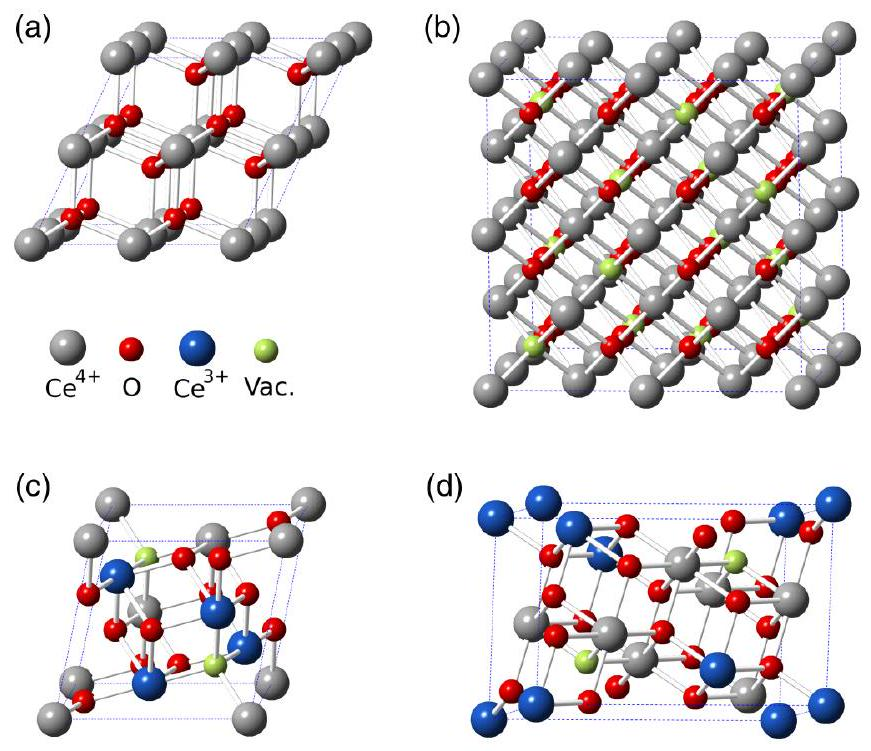
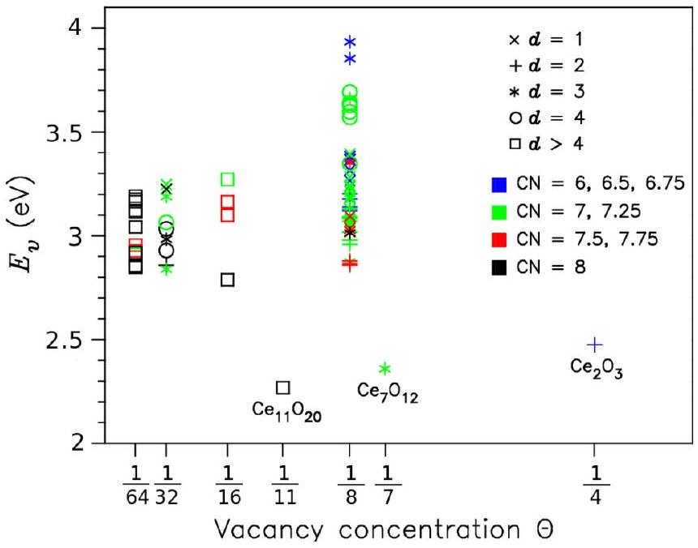
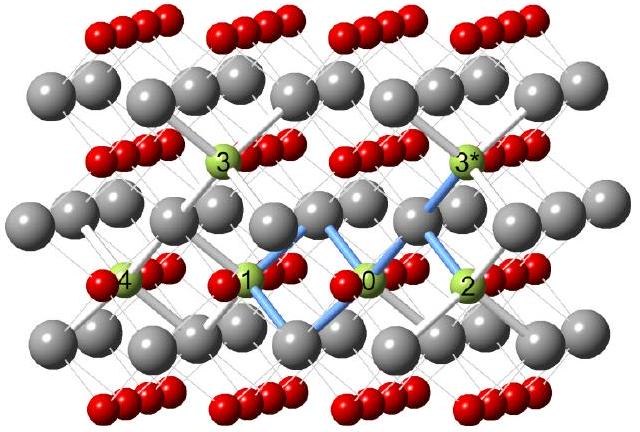
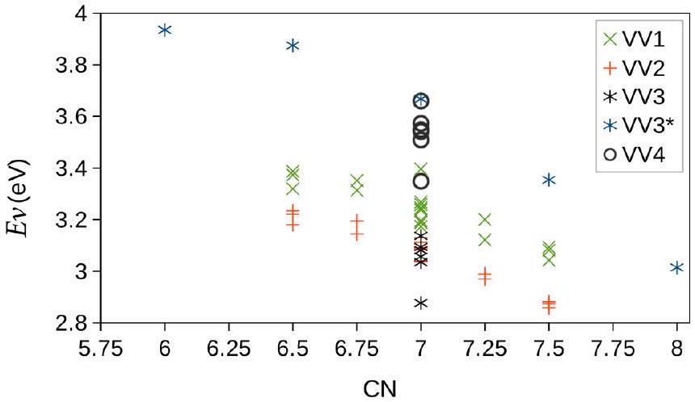
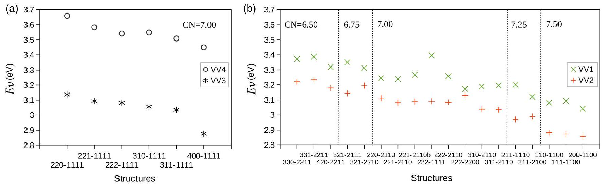
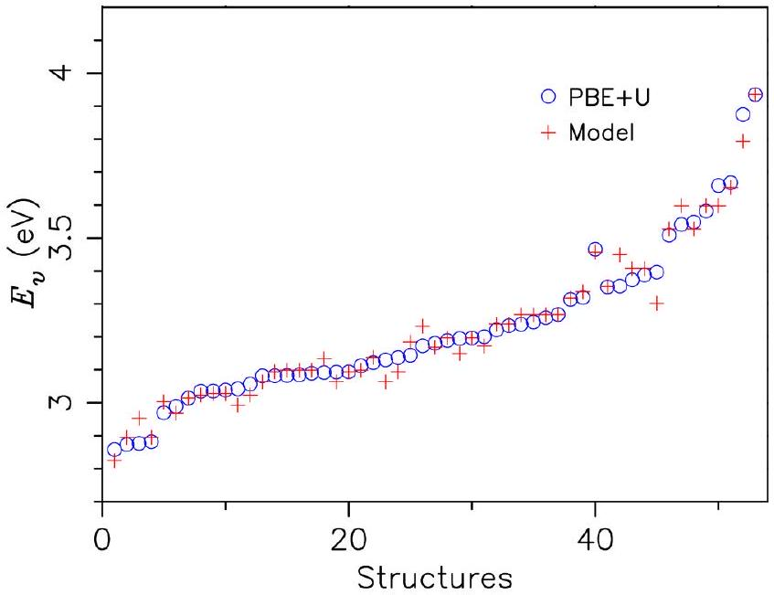
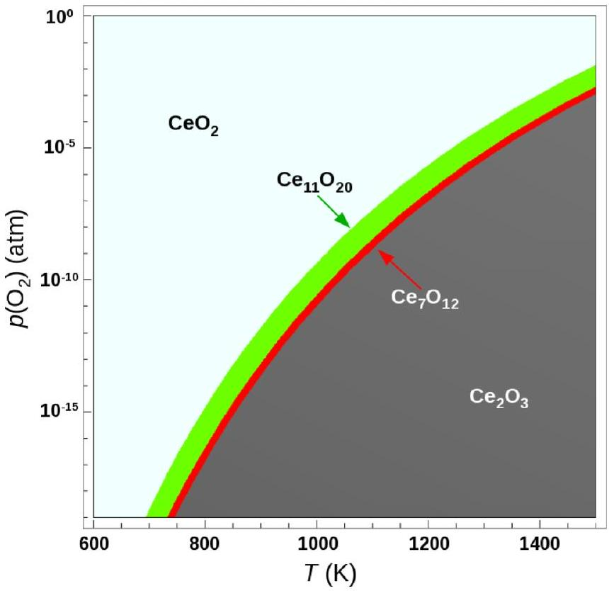

# Ordering of oxygen vacancies and excess charge localization in bulk ceria: A DFT $+\boldsymbol{U}$ study 

G. E. Murgida, ${ }^{1}$ V. Ferrari, ${ }^{1}$ M. Verónica Ganduglia-Pirovano, ${ }^{2, *}$ and A. M. Llois ${ }^{1}$ ${ }^{1}$ Centro Atómico Constituyentes, GIyA, CNEA, San Martín, Buenos Aires, Argentina and Consejo Nacional de Investigaciones Científicas y Técnicas, C1033AAJ, Buenos Aires, Argentina ${ }^{2}$ Instituto de Catálisis y Petroleoquímica of the Consejo Superior de Investigaciones Científicas, 28049 Madrid, Spain

(Received 23 July 2014; revised manuscript received 26 August 2014; published 9 September 2014)

#### Abstract

The importance of ceria ( $\mathrm{CeO}_{2}$ ) in many applications originates from the ease of oxygen vacancy formation and healing. The ordering of vacancies and the whereabouts of the excess charge in bulk $\mathrm{CeO}_{2}$ are of no less significance than at ceria surfaces, but they have not received the same attention. In this work, the formation of neutral oxygen vacancies in bulk $\mathrm{CeO}_{2}$ is investigated using density-functional theory (DFT) in the DFT $+U(U$ is an effective onsite Coulomb interaction parameter) approach for a broad range of vacancy concentrations $\Theta$ ( $\frac{1}{64} \leqslant \Theta \leqslant \frac{1}{4}$ ). We find that the excess charge prefers to be localized in cation sites such that the mean $\mathrm{Ce}^{3+}$ coordination number is maximized, and if nearest-neighbor cation sites are reduced, they rather be nonuniformly distributed. Furthermore, we show that a vacancy repels other vacancies from its nearest-neighbor shell and that the [110] and [111] directions are possible directions for clustering of second- and third-neighbor vacancies, respectively. Vacancies prefer not to share cations. The results are discussed in a simple physical picture which enables the separation of the different contributions to the averaged vacancy formation energy. We also consider cells with fluorite structure and same stoichiometries as in existing bulk phases, i.e., $\mathrm{Ce}_{11} \mathrm{O}_{20}\left(\Theta=\frac{1}{11}\right), \mathrm{Ce}_{7} \mathrm{O}_{12} \left(\Theta=\frac{1}{7}\right)$, and $\mathrm{Ce}_{2} \mathrm{O}_{3}\left(\Theta=\frac{1}{4}\right)$, as well as the corresponding real structures. We find that the vacancy ordering and the location of the excess electrons are consistent with the results for single-phase reduced $\mathrm{CeO}_{2}$, but the $\mathrm{Ce}_{11} \mathrm{O}_{20}$, $\mathrm{Ce}_{7} \mathrm{O}_{12}$, and $\mathrm{Ce}_{2} \mathrm{O}_{3}$ structures are substantially more stable. The stability of these phases as a function of pressure and temperature is discussed. Vacancy-induced lattice relaxation effects are crucial for the interpretation of the results.

DOI: 10.1103/PhysRevB.90.115120
PACS number(s): 71.15.Mb, 71.23.An, 71.20.Eh, 71.55.-i

## I. INTRODUCTION

Materials based on ceria ( $\mathrm{CeO}_{2}$ ) are important in catalysts [1-4] as well as in many other applications, such as materials for nonvolatile resistive random access memories, gate oxides in microelectronic devices, and oxide-ion conductors in solid-oxide fuel cells [5], with the reducibility of the system being essential to its functionality in such applications. The motivation of numerous studies of oxygen vacancy formation in ceria is the expectation that a fundamental understanding and control of the type, density, and distribution of such vacancies will provide a means to influence the electronic structure and to tailor the systems' functionality. A great number of experimental and theoretical studies of isolated oxygen vacancies and vacancy aggregates on low-index ceria surfaces have appeared in the literature [6-16]. As yet, studies of bulk vacancies are mainly limited to isolated vacancies [13,17-34], and those of vacancy aggregates in single-phase reduced $\mathrm{CeO}_{2}$ are relatively scarce [35-37].

When a neutral oxygen vacancy is created in ceria, the two electrons left behind give rise to a pair of $\mathrm{Ce}^{3+}$ ions, which can be first (nearest) neighbors ( 1 N ), second (nextnearest) neighbors ( 2 N ), third neighbors ( 3 N ), or in general ( $m$ )th neighbor ( $m \mathrm{~N}$ ) of the vacancy in the cationic shells. For near-surface oxygen vacancies, there is general consensus that the excess charge would preferably localize in the 2 N cationic neighboring shell to a defect ( $2 \mathrm{~N}-2 \mathrm{~N}$ ), and, whenever possible, in the outermost Ce layer [9,13,16,38-42]. For bulk vacancies, Wang et al. [23] early suggested that the excess

[^0]electrons localize on two 2 N Ce cations. Notwithstanding, until very recently, calculations have resulted in, or assumed, a $1 \mathrm{~N}-1 \mathrm{~N}$ localization of the excess charge [13,17-22,24-26,2831]. Kullgren et al. [32] and Allen and Watson [33] have newly investigated different configurations of the $\mathrm{Ce}^{3+}$ ions and reported a $2 \mathrm{~N}-2 \mathrm{~N}$ lowest-energy configuration. Despite these efforts, to date, the theoretical understanding of oxygen vacancies in the bulk is very shallow. This is in part due to the existence of multiple local minima with respect to the sites on which the excess electrons, driving the $\mathrm{Ce}^{4+} \rightarrow \mathrm{Ce}^{3+}$ reduction, localize.

Concerning the interaction of oxygen vacancies in ceria, particularly near surfaces, discussions are ongoing. For instance, for subsurface vacancies at the most stable (111) surface, the interaction of first-nearest-neighbor vacancies in the oxygen layer is markedly repulsive, becoming negligible for the third-nearest-neighbor distance [7,8,16]. However, for neighboring vacancies in the surface layer, whether they attract [6,15] or repel [40] is still a matter of debate. In bulk ceria, the repulsion of first-neighboring vacancies and the possibility of short-range ordering of second- and thirdneighbor vacancies along the [110] and [111] directions, respectively, have been suggested [35-37].

In this work, in view of the importance of understanding the distribution and electronic properties of oxygen vacancies in bulk ceria as a function of their density, we study isolated and evenly distributed vacancies at $\Theta=\frac{1}{64}$ and $\frac{1}{16}$ with periodic density-functional theory (DFT) in the DFT+ $U$ (where $U$ is a Hubbard-type term describing the onsite Coulomb interactions) approach to investigate afresh the localization of the excess electrons. We extend the study by considering higher vacancy concentrations, i.e., $\Theta=\frac{1}{32}$ and $\frac{1}{8}$, with varying
closest intervacancy distance, from first to fourth neighbors in the oxygen sublattice. For $\Theta=\frac{1}{8}$, we consider all possible configurations for the reduced $\mathrm{Ce}^{3+}$ ions at each intervacancy separation. We find that the averaged vacancy formation energy depends on (i) the location and (ii) distribution of the excess electrons, (iii) the intervacancy distance, and (iv) the number and type of cations shared by closest vacancies. Hence, we propose to model the formation energy as a sum of four independent contributions related to these effects and use a large pool of defective structures at $\Theta=\frac{1}{8}$ to fit the model. This approach enables us to rationalize the findings and to establish guidelines for possible (short-range) ordering and the localization of the excess electrons.

It is well known that the phase diagram of the $\mathrm{CeO}_{2-x}$ system is complex [43-47], including members of the homologous $\mathrm{Ce}_{n} \mathrm{O}_{2 n-2 m}$ series of fluorite-related phases. The $n=11$, 7, and $4(m=1)$ structures, i.e., $\mathrm{Ce}_{11} \mathrm{O}_{20}$, iota $\mathrm{Ce}_{7} \mathrm{O}_{12}$, and C-type bixbyite $\mathrm{Ce}_{2} \mathrm{O}_{3}$, have been determined [48,49] and the nature of the vacancy ordering discussed [47-52]. Specifically, the ordering is consistent with the predicted repulsive interaction between first-neighboring vacancies [36,37]. Yet, there is a notable lack of agreement on the distribution of the excess electrons in the $\mathrm{Ce}_{11} \mathrm{O}_{20}$ and $\mathrm{Ce}_{7} \mathrm{O}_{12}$ phases, with one scenario where localized excess electrons are partly randomly distributed [49] and another one where the excess charge is partly delocalized [53]. We consider cells with fluorite structure and stoichiometries equal to those in the real reduced bulk phases, i.e., $\Theta=\frac{1}{11}, \frac{1}{7}$, and $\frac{1}{4}$, and with the corresponding real structures too, and investigate their electronic structure. We interpret the results in light of our identified guidelines. The essential role of atomic relaxations upon reduction in the stabilization of the $\mathrm{Ce}_{11} \mathrm{O}_{20}, \mathrm{Ce}_{7} \mathrm{O}_{12}$, and $\mathrm{Ce}_{2} \mathrm{O}_{3}$ structures is emphasized. Finally, we combine $\mathrm{DFT}+U$ and statistical thermodynamics in order to qualitatively discuss the stability of these phases as a function of pressure and temperature.

## II. MODELS AND COMPUTATIONAL DETAILS

Bulk $\mathrm{CeO}_{2}$ has fluorite-type structure ( $F m \overline{3} m$ space group) with one formula unit per primitive unit cell. To model a varying vacancy concentration ( $\Theta=\frac{1}{64}, \frac{1}{32}, \frac{1}{16}, \frac{1}{11}, \frac{1}{8}, \frac{1}{7}$, $\frac{1}{4}$ ), different supercells were used. We considered ( $2 \times 2 \times 2$ ) supercells of the primitive face-centered-cubic cell ( $3.879 \AA$ ) and of the conventional cubic cell ( $5.485 \AA$ ), with $\mathrm{Ce}_{8} \mathrm{O}_{16}$ and $\mathrm{Ce}_{32} \mathrm{O}_{64}$ composition, respectively (Fig. 1). We created one and two oxygen vacancies in both unit cells, corresponding to $\Theta=\frac{1}{64}$ and $\frac{1}{32}\left[\mathrm{Ce}_{32} \mathrm{O}_{64}\right]$ and $\Theta=\frac{1}{16}$ and $\frac{1}{8}\left[\mathrm{Ce}_{8} \mathrm{O}_{16}\right]$, and considered different possible combinations of the locations of both the vacancies and the associated $\mathrm{Ce}^{3+}$ ions. The closest intervacancy distance varied from first to fourth neighbors in the anion sublattice. In addition, unit cells with $\mathrm{Ce}_{11} \mathrm{O}_{20}$, $\mathrm{Ce}_{7} \mathrm{O}_{12}$, and and $\mathrm{Ce}_{2} \mathrm{O}_{3}$ composition were considered. These stoichiometries correspond to those of stable phases of reduced ceria with ordered vacancy distributions [48]. $\mathrm{Ce}_{11} \mathrm{O}_{22}$ and $\mathrm{Ce}_{7} \mathrm{O}_{14}$ unit cells with the fluorite structure were built (Fig. 1), and two vacancies were created according to their location in the stable structures (Sec. III C) [48], hereafter named $\mathrm{Ce}_{11} \mathrm{O}_{20}$-like $\left(\Theta=\frac{1}{11}\right)$ and $\mathrm{Ce}_{7} \mathrm{O}_{12}$-like $\left(\Theta=\frac{1}{7}\right)$ structures. The $\mathrm{Ce}_{2} \mathrm{O}_{3}$-like structure is derived from the fluorite lattice

FIG. 1. (Color online) Structural models of the clean $\mathrm{CeO}_{2}$ bulk. Top panel: ( $2 \times 2 \times 2$ ) periodicity based on (a) the primitive face-centered-cubic cell and (b) the conventional cubic cell, with $\mathrm{Ce}_{32} \mathrm{O}_{64}$ and $\mathrm{Ce}_{8} \mathrm{O}_{16}$ composition, respectively. Bottom panel: unit cells with (c) $\mathrm{Ce}_{7} \mathrm{O}_{14}$ and (d) $\mathrm{Ce}_{11} \mathrm{O}_{22}$ composition. O (Ce) atoms are represented by small (red) and large (gray) balls. Small lighter (green) balls denote the 16 vacancies created in the $\mathrm{Ce}_{32} \mathrm{O}_{64}$ and also the 2 in the $\mathrm{Ce}_{7} \mathrm{O}_{14}$ and $\mathrm{Ce}_{11} \mathrm{O}_{22}$ structures resulting in the $\mathrm{Ce}_{2} \mathrm{O}_{3}$-like, $\mathrm{Ce}_{7} \mathrm{O}_{12}$-like, and $\mathrm{Ce}_{11} \mathrm{O}_{20}$-like structures (see text). For the two latter, the resulting $\mathrm{Ce}^{3+}$ ions upon reduction are represented by large darker (blue) balls.

by doubling the lattice parameter of the conventional cubic cell and by leaving one-fourth of the anion sites vacant ( $\Theta= \frac{1}{4}$ ) [51]. Schematically, using the $\mathrm{Ce}_{11} \mathrm{O}_{22}$ unit cell with the fluorite structure as an example, $\mathrm{Ce}_{11} \mathrm{O}_{22} \xrightarrow[-\mathrm{O}_{2}]{\substack{\text { ionic } \\ \text { relax }}} \mathrm{Ce}_{11} \mathrm{O}_{20}$-like . Furthermore, the true distorted $\mathrm{Ce}_{11} \mathrm{O}_{20}$ ( $P \overline{1}$ space group), iota phase $\mathrm{Ce}_{7} \mathrm{O}_{12}$ ( $R \overline{3}$ space group), and cubic C-type (bixbyite) $\mathrm{Ce}_{2} \mathrm{O}_{3}$ (Ia $\overline{3}$ space group) structures were optimized. For the lower oxide $\mathrm{Ce}_{11} \mathrm{O}_{20}$ and $\mathrm{Ce}_{7} \mathrm{O}_{12}$ phases, different combinations of the four $\mathrm{Ce}^{3+}$ ions were examined, whereas for $\mathrm{Ce}_{2} \mathrm{O}_{3}$, all cations are reduced. In the nonreduced fluorite $\mathrm{CeO}_{2}$ structure, the coordination number of the cation is eight and of the anion is four. In the fully reduced bixbyite $\mathrm{Ce}_{2} \mathrm{O}_{3}$ structure, the coordination numbers are six and four, respectively. Hence, the averaged CN of the $\mathrm{Ce}^{3+}$ ions in all the reduced structures considered can vary between 8 and 6 . Note that one encounters three distinct structure types in the rare-earth sesquioxide series as temperature increases [50], the cubic C-type, monoclinic B-type ( $C 2 / m$ space group), at least for some rare-earth metal atoms, but not Ce , and hexagonal A-type ( $P \overline{3} m 1$ space group).

We applied the spin-polarized DFT in the DFT+U approach with the gradient-corrected approximation (GGA) PBE (Perdew-Burke-Ernzerhof) [54], as implemented in the Vienna ab initio simulation package (VASP) [55]. The $U_{\text {eff }}$ value [56] of 4.50 eV was used for the $\mathrm{Ce} 4 f$ states [17,57]. The Kohn-Sham equations were solved using the projected augmented wave (PAW) method. For Ce and O atoms, the ( $5 s, 5 p, 6 s, 4 f, 5 d$ )
and ( $2 s, 2 p$ ) states, respectively, were treated as valence with a plane-wave cutoff energy of 400 eV . The Brilloiun zone was sampled using a ( $2 \times 2 \times 2$ ) Monkhorst-Pack grid for the $\mathrm{Ce}_{11} \mathrm{O}_{22}, \mathrm{Ce}_{8} \mathrm{O}_{16}$ unit cell, and $\mathrm{Ce}_{7} \mathrm{O}_{14}$ unit cells, and a $(1 \times 1 \times 1)$ grid for the $\mathrm{Ce}_{32} \mathrm{O}_{64}$ cell.

In order to inspect different configurations of the reduced $\mathrm{Ce}^{3+}$ sites, a two-step relaxation procedure was applied, except for the fully reduced $\mathrm{Ce}_{2} \mathrm{O}_{3}$ phase. In the first step, we replaced two selected $\mathrm{Ce}^{4+}$ by $\mathrm{La}^{3+}$ ions, with a larger ionic radii, per O vacancy and performed non-spin-polarized calculations. The so-obtained relaxed structure was further optimized using the regular $\mathrm{Ce}^{4+}$ PAW potentials. We limit the discussion to high-spin states because the difference between these states and any other spin state is less than 0.01 eV [24].

Finally, one should be aware of the existence of multiple self-consistent solutions in DFT $+U$, corresponding to different occupations of the $m$ projections associated with the subshell $l$ to which the $U$ parameter is applied. Which solution a particular calculation reaches depends on the $U$ value, the initial orbital occupation, lattice geometry, enforced symmetry, and also, the minimization algorithms used to calculate the electronic ground state and the charge-density mixing scheme $[33,58,59]$. These solutions may differ in total energy by up to $\sim 0.3-0.4 \mathrm{eV}$ for $\mathrm{CeO}_{2}$ bulk or surface containing an oxygen vacancy [ 33,58 ]. We did not enforce symmetry and used a Davidson-block iteration scheme with random initialization of the orbitals, for which most extensive tests have been performed and it is considerably robust [55].

The averaged vacancy formation energy $E_{v}$ was calculated as

$$
E_{v}=\frac{1}{m}\left[E\left(\mathrm{Ce}_{n} \mathrm{O}_{2 n-m}\right)+\frac{m}{2} E\left(\mathrm{O}_{2}\right)-E\left(\mathrm{Ce}_{n} \mathrm{O}_{2 n}\right)\right],
$$

where $E\left(\mathrm{Ce}_{n} \mathrm{O}_{2 n-m}\right)$ and $E\left(\mathrm{Ce}_{n} \mathrm{O}_{2 n}\right)$ are the total energies of the reduced and unreduced unit cells, $m$ and $n$ are the number of Ce atoms and O vacancies in the cell, respectively, and $E\left(\mathrm{O}_{2}\right)$ is the total energy of the isolated $\mathrm{O}_{2}$ molecule.

## III. RESULTS AND DISCUSSION

Figure 2 summarizes the calculated averaged vacancy formation energy $E_{v}$ [Eq. (1)] for all reduced structures with fluorite geometry considered at $\Theta=\frac{1}{64}, \frac{1}{32}, \frac{1}{16}, \frac{1}{11}, \frac{1}{8}, \frac{1}{7}$, and $\frac{1}{4}$ that will be discussed in detail in the following.

## A. Isolated evenly distributed vacancies

The first step to understand the distribution of neutral oxygen vacancies in reduced bulk ceria is to consider the formation of isolated defects and address the fundamental question about the excess charge localization. To model such point defects, 96-atom ( $\mathrm{Ce}_{32} \mathrm{O}_{64}$ ) and 24-atom ( $\mathrm{Ce}_{8} \mathrm{O}_{16}$ ) supercells were used. These supercells result in uniformly distributed vacancies at $\Theta=\frac{1}{64}$ and $\frac{1}{16}$, which correspond to a distance between vacancies of 10.97 and $7.76 \AA$, respectively.

Hereafter, we first provide a brief overview of theoretical studies that have considered the formation of (isolated) oxygen defects in the bulk using DFT $+U$ with the local density (LDA) or GGA approximations [13,17-33] and hybrid DFT with periodic [13] or cluster [34] models. As mentioned

FIG. 2. (Color online) Averaged vacancy formation energies as a function of vacancy concentration. The values for $\mathrm{Ce}_{11} \mathrm{O}_{20}, \mathrm{Ce}_{7} \mathrm{O}_{12}$, and $\mathrm{Ce}_{2} \mathrm{O}_{3}$ correspond to unit cells with fluorite structure and $\Theta=\frac{1}{11}$, $\frac{1}{7}$, and $\frac{1}{4}$, respectively (i.e., $\mathrm{Ce}_{x} \mathrm{O}_{y}$-like) (see text). The range of the mean coordination number $(\mathrm{CN})$ of $\mathrm{Ce}^{3+}$ ions and the closest distance between vacancies ( $d=n$ corresponds to $n$ th-neighboring vacancies in the oxygen sublattice of the fluorite structure) are indicated using color and symbols, respectively, as shown in the figure legends.

above (Sec. I), Wang et al. [23] performed $\mathrm{PW} 91+U(5.0)$ calculations with a 96 -atom cell and suggested that the excess electrons localize on two 2 N Ce cations, in accord with similar predictions for isolated vacancies at ceria surfaces [ 38,39 ]. Yet, most reported studies have either found or presumed a $1 \mathrm{~N}-1 \mathrm{~N}$ localization of the excess electrons (Table I). Kullgren et al. [32] recently considered different $2 \mathrm{~N}-2 \mathrm{~N}$ configurations of the $\mathrm{Ce}^{3+}$ ions and reported that the energies of the $1 \mathrm{~N}-1 \mathrm{~N}$ and $2 \mathrm{~N}-2 \mathrm{~N}$ configurations lie within approximately 0.1 eV range $\left[\mathrm{PBE}+U(5.0), \mathrm{Ce}_{32} \mathrm{O}_{64}\right.$ model], with the smallest value ( 3.22 eV ) corresponding to a $2 \mathrm{~N}-2 \mathrm{~N}$ localization (Table I). Moreover, Allen and Watson [33] have investigated all possible $\mathrm{Ce}^{3+}-\mathrm{Ce}^{3+}$ configurations within the 96 -atom cell model $\left[\mathrm{PBE}+U\left(5.0_{f} / 5.5_{p}\right)\right.$, a $U$ term is applied to $\mathrm{Ce} 4 f$ and O $2 p$ states], fixing the occupied $4 f$ orbital to $4 f_{z\left(x^{2}-y^{2}\right)}$, and reported $E_{v}$ values within a 0.40 eV range of energy. Their lowest-energy structure has a $2 \mathrm{~N}-2 \mathrm{~N}$ arrangement with a $1 \mathrm{~N}-2 \mathrm{~N}$ and the $1 \mathrm{~N}-1 \mathrm{~N}$ configurations being higher in energy by 0.04 and 0.13 eV , respectively. However, the energy differences between these three configurations flatten out upon restart from the structural information but not the wave function, allowing the $f$ orbitals to distort and rotate. Localization apart from the vacancy ( $1 \mathrm{~N}-3 \mathrm{~N}$ ) was obtained using hybrid(PBE0)-DFT and an embedded cluster model [34].

Having surveyed the current state-of-the-art calculations, it appears that there is still not general agreement on the electronic structure of isolated bulk vacancies. Hence, we reconsider the excess charge localization without any constraint in both the $f$-orbital occupation and the symmetry during geometry optimization (fixed lattice constant) at $\Theta= \frac{1}{64}$ and $\frac{1}{16}$. The formation energies obtained for the $1 \mathrm{~N}-1 \mathrm{~N}$, all of the $2 \mathrm{~N}-2 \mathrm{~N}, 1 \mathrm{~N}-2 \mathrm{~N}$ and $3 \mathrm{~N}-3 \mathrm{~N}$, and the $4 \mathrm{~N}-4 \mathrm{NCe}^{3+}$

TABLE I. Vacancy formation energy ( $E_{v}$ ) (in $\mathrm{eV} /$ atom ) for isolated vacancies in bulk ceria obtained by different methods and vacancy concentrations $(\Theta) . n \mathrm{~N}-m \mathrm{~N}$ indicates a pair of $\mathrm{Ce}^{3+}$ ions in the $n$th and $m$ th cationic neighboring shells to the defect.
| Method ${ }^{\mathrm{a}}$ | Cell | $\Theta$ | $E_{v}$ | $\mathrm{Ce}^{3+}$ | Ref. |
| :--- | :--- | :--- | :--- | :--- | :--- |
| $\mathrm{PBE}+U(4.5)^{\mathrm{b}}$ | $\mathrm{Ce}_{8} \mathrm{O}_{16}$ | $\frac{1}{16}$ | 5.55 | 1N-1N | Fabris et al. [17] |
| PBE $+U(4.5)$ |  |  | 2.58 |  |  |
| LDA $+U(5.3)^{\mathrm{b}}$ |  |  | 6.74 |  |  |
| $\mathrm{LDA}+U(5.3)$ |  |  | 3.45 |  |  |
| $\mathrm{PW91}+U(5.0)$ | $\mathrm{Ce}_{32} \mathrm{O}_{64}$ | $\frac{1}{64}$ | 3.39 | $1 \mathrm{~N}-1 \mathrm{~N}$ | Nolan et al. [18] |
| PBE $+U(6.0)$ | $\mathrm{Ce}_{32} \mathrm{O}_{64}$ | $\frac{1}{64}$ | 3.03 | 1N-1N | Yang et al. [21] |
| $\mathrm{PW} 91+U(5.0)$ | $\mathrm{Ce}_{32} \mathrm{O}_{64}$ | $\frac{1}{64}$ | 3.86 | $1 \mathrm{~N}-1 \mathrm{~N}$ | Mayernick et al. [22] |
| $\mathrm{PBE}+U(5.0)$ | $\mathrm{Ce}_{32} \mathrm{O}_{64}$ | $\frac{1}{64}$ | 2.11 | $1 \mathrm{~N}-1 \mathrm{~N}$ | Keating et al. [24] |
|  | $\mathrm{Ce}_{16} \mathrm{O}_{32}$ | $\frac{1}{32}$ | 2.65 |  |  |
|  | $\mathrm{Ce}_{8} \mathrm{O}_{16}$ | $\frac{1}{16}$ | 2.99 |  |  |
|  | $\mathrm{Ce}_{4} \mathrm{O}_{8}$ | $\frac{1}{8}$ | 3.51 |  |  |
| $\mathrm{PBE}+U(5.0)^{\mathrm{c}}$ | $\mathrm{Ce}_{32} \mathrm{O}_{64}$ | $\frac{1}{64}$ | 2.13 | $1 \mathrm{~N}-1 \mathrm{~N}$ | Kehoe et al. [26] |
| PBE $+U(5.0)$ | $\mathrm{Ce}_{32} \mathrm{O}_{64}$ | $\frac{1}{64}$ | 2.63 |  | Molinari et al. [31] |
| $\mathrm{PW} 91+U(5.0)^{\mathrm{c}}$ | $\mathrm{Ce}_{32} \mathrm{O}_{64}$ | $\frac{1}{64}$ | 2.64 | $1 \mathrm{~N}-1 \mathrm{~N}$ | Plata et al. [30] |
| PBE $+U(5.0)$ | $\mathrm{Ce}_{32} \mathrm{O}_{64}$ | $\frac{1}{64}$ | 3.22 | $2 \mathrm{~N}-2 \mathrm{~N}$ | Kullgren et al. [32] |
|  |  |  | 3.31 | $1 \mathrm{~N}-1 \mathrm{~N}$ |  |
| PBE $+U(4.5)$ | $\mathrm{Ce}_{64} \mathrm{O}_{128}$ | $\frac{1}{128}$ | 2.84 | $1 \mathrm{~N}-1 \mathrm{~N}$ | Paier et al. [13,60] |
| HSE06 | $\mathrm{Ce}_{32} \mathrm{O}_{64}$ | $\frac{1}{64}$ | 3.78 | $1 \mathrm{~N}-1 \mathrm{~N}$ |  |
| HSE06 | $\mathrm{Ce}_{64} \mathrm{O}_{128}$ | $\frac{1}{128}$ | 3.74 | $1 \mathrm{~N}-1 \mathrm{~N}$ |  |
| PBE0 | Cluster |  | 3.00 | 1N-3N ${ }^{\mathrm{d}}$ | Burow et al. [34] |
| PBE $+U(4.5)$ | $\mathrm{Ce}_{32} \mathrm{O}_{64}$ | $\frac{1}{64}$ | 2.85 | $2 \mathrm{~N}-2 \mathrm{~N}$ | This work |
|  | $\mathrm{Ce}_{8} \mathrm{O}_{16}$ | $\frac{1}{16}$ | 2.79 |  |  |

${ }^{\text {a }}$ Projectors based on atomiclike orbitals within the $\mathrm{DFT}+U$ method.
${ }^{\mathrm{b}}$ Projectors based on localized Wannier orbitals.
${ }^{\mathrm{c}} \mathrm{A} U$ term ( $\left.5.5[26], 5.0[30]\right)$ was also added to the $\mathrm{O} p$ states.
${ }^{\mathrm{d}}$ The spin density is localized on four Ce atoms, two in the first, and two in the third Ce shell.
configurations are summarized in Table II (cf. Fig. 2). In agreement with the most recent work by Allen and Watson [33], the $1 \mathrm{~N}-1 \mathrm{~N}, 1 \mathrm{~N}-2 \mathrm{~N}$, and $2 \mathrm{~N}-2 \mathrm{~N}, 1 \mathrm{~N}-2 \mathrm{~N}$ structures lie in $\sim 0.1 \mathrm{eV}$ range with a $2 \mathrm{~N}-2 \mathrm{~N}$ lowest-energy structure. The configurations with $\mathrm{Ce}^{3+}$ ions further away from the vacant site clearly exhibit higher formation energies; an increase of at least $\sim 0.1 \mathrm{eV}$ w.r.t. the highest $1 \mathrm{~N}-2 \mathrm{~N}$ configuration is observed. Upon increasing the vacancy concentration from $\frac{1}{64}$ to $\frac{1}{16}$, the preference for the $2 \mathrm{~N}-2 \mathrm{~N}$ configuration becomes significantly accentuated (Table III, cf. Fig. 2). In the $\mathrm{Ce}_{8} \mathrm{O}_{16}$ unit cell, there are only four nonequivalent $\mathrm{Ce}^{3+}$ configurations, namely, one $1 \mathrm{~N}-1 \mathrm{~N}$, two $1 \mathrm{~N}-2 \mathrm{~N}$, and one $2 \mathrm{~N}-2 \mathrm{~N}$. The corresponding $E_{v}$ values lie in $\sim 0.5 \mathrm{eV}$ range with a $2 \mathrm{~N}-2 \mathrm{~N}$ lowest-energy structure; the $1 \mathrm{~N}-2 \mathrm{~N}$ and $2 \mathrm{~N}-2 \mathrm{~N}$ structures are less stable by about $0.3-0.4$ and 0.5 eV , respectively.

For near-surface oxygen vacancies, the above-mentioned (Sec. I) $\mathrm{Ce}^{3+} 2 \mathrm{~N}-2 \mathrm{~N}$ occupation preference has been explained in terms of a larger gain in structural relaxation energy, the energy gained from the fixed geometry in the presence of an O vacancy to the relaxed structure, compared to that for other occupations such as $1 \mathrm{~N}-1 \mathrm{~N}$ [9,38]. The same explanation applies to bulk vacancies. In the most stable configuration, the system is better able to relax the lattice strain induced by the
vacant site and the more spacious $\mathrm{Ce}^{3+}$ ions compared to their $\mathrm{Ce}^{4+}$ counterparts. Note that the vacancy formation energies for the unrelaxed structures at $\Theta=\frac{1}{64}$ and $\frac{1}{16}$ are very similar (cf. 4.38 and 4.36 eV in Table IV). For $1 \mathrm{~N}-1 \mathrm{~N}$ configurations, as the vacancy concentration increases by $\sim 4.7 \%$, from $\Theta=\frac{1}{64}$ to $\frac{1}{16}$, the relaxation energy gain becomes smaller by $\sim 0.4 \mathrm{eV}$ [cf. $2.91\left(\frac{1}{64}\right)$ and $3.27 \mathrm{eV}\left(\frac{1}{16}\right)$ in Tables II and III, respectively], resulting into a $E_{v}$ behavior which is qualitatively consistent with the previous calculations by Keating et al. [24] (Table I). However, for the lowest-energy $2 \mathrm{~N}-2 \mathrm{~N}$ structures, the concentration effect on $E_{v}$ is not found (within $\sim 0.05 \mathrm{eV}$, cf. Tables II and III).

Vacancy formation energies are commonly computed referring to one-half of the energy of the $\mathrm{O}_{2}$ molecule [Eq. (1)], which are grossly overestimated ( $\sim 0.5 \mathrm{eV} /$ atom ) with PW91 or PBE [54]. The use of hybrid functionals such as HSE and PBE0 substantially reduces this overbinding ( $\sim 0.1 \mathrm{eV} /$ atom ) [61]. This indicates that accurate oxygen binding and oxygen defect formation energies can only be expected when hybrid functionals are used. Inspection of Table I reveals deviations in the calculated DFT(GGA) $+U E_{v}$ values that can to some extent be ascribed to the different computational methods, $\mathrm{DFT}+U$ implementations (i.e.,

TABLE II. Vacancy formation energy ( $E_{v}$ ) (in $\mathrm{eV} /$ atom) for isolated evenly distributed vacancies in bulk ceria at $\Theta=\frac{1}{64}\left(\mathrm{Ce}_{32} \mathrm{O}_{64}\right)$ for different $\mathrm{Ce}^{3+}$ configurations. $n \mathrm{~N}-m \mathrm{~N}$ indicates a pair of $\mathrm{Ce}^{3+}$ ions in the $n$th and $m$ th cationic neighboring shells to the defect. The closest distance between $\mathrm{Ce}^{3+}$ ions $\left(\mathrm{Ce}^{3+}-\mathrm{Ce}^{3+}\right)$ is given as $n$th neighbors ( $n \mathrm{~N}$ ) in the Ce sublattice.
| $\mathrm{Ce}^{3+}$ position | $\mathrm{Ce}^{3+}-\mathrm{Ce}^{3+}$ | $E_{v}$ |
| :--- | :--- | :--- |
| 1N-1N | 1N | 2.91 |
| $1 \mathrm{~N}-2 \mathrm{~N}$ | 1N | 2.93 |
| 1N-2N | 2 N | 2.95 |
| 1N-2N | 3N | 2.85 |
| 2N-2N ${ }^{\mathrm{a}}$ | 1N | 2.85 |
| $2 \mathrm{~N}-2 \mathrm{~N}^{\mathrm{a}}$ | 1N | 2.92 |
| $2 \mathrm{~N}-2 \mathrm{~N}$ | 3N | 2.86 |
| 2N-2N | 4N | 2.85 |
| $2 \mathrm{~N}-2 \mathrm{~N}$ | 5N | 2.92 |
| 3N-3N | 1N | 3.04 |
| 3N-3N | 4N | 3.12 |
| 3N-3N | 5N | 3.19 |
| 3N-3N | 7N | 3.12 |
| 3N-3N | 9N | 3.16 |
| 4N-4N | 9N | 3.18 |

${ }^{\mathrm{a}}$ Nonequivalent structures.

TABLE III. Vacancy formation energy ( $E_{v}$ ) (in $\mathrm{eV} /$ atom) for isolated evenly distributed vacancies in bulk ceria at $\Theta=\frac{1}{16}\left(\mathrm{Ce}_{8} \mathrm{O}_{16}\right)$ for different $\mathrm{Ce}^{3+}$ configurations. $\mathrm{Ce}^{3+}$ positions and closest distance between two $\mathrm{Ce}^{3+}$ ions as in Table II.
| $\mathrm{Ce}^{3+}$ position | $\mathrm{Ce}^{3+}-\mathrm{Ce}^{3+}$ | $E_{v}$ |
| :--- | :--- | ---: |
| $1 \mathrm{~N}-1 \mathrm{~N}$ | 1 N | 3.27 |
| $1 \mathrm{~N}-2 \mathrm{~N}$ | 2 N | 3.17 |
| $1 \mathrm{~N}-2 \mathrm{~N}$ | 1 N | 3.10 |
| $2 \mathrm{~N}-2 \mathrm{~N}$ | 1 N | 2.79 |

TABLE IV. Vacancy formation energy ( $E_{v}$ ) (in $\mathrm{eV} /$ atom) for unrelaxed defect structures. VV1, VV2, VV3, VV3*, and VV4 correspond to different vacancy pairs (cf. Fig. 3 and see text).
| Cell | $\frac{1}{64}$ | $\frac{1}{32}$ | $\frac{1}{16}$ | $\Theta \frac{1}{11}$ | $\frac{1}{8}$ | $\frac{1}{7}$ | $\frac{1}{4}$ |
| :--- | :--- | :--- | :--- | :--- | :--- | :--- | :--- |
| $\mathrm{Ce}_{32} \mathrm{O}_{64}$ | 4.38 | 4.28 VV 1 |  |  |  |  | 3.70 |
|  |  | 4.24 VV2 |  |  |  |  |  |
|  |  | 4.37 VV3 |  |  |  |  |  |
|  |  | 4.27 VV3* |  |  |  |  |  |
|  |  | 4.38 VV4 |  |  |  |  |  |
| $\mathrm{Ce}_{8} \mathrm{O}_{16}$ |  |  | 4.36 |  | 4.26 VV1 |  |  |
|  |  |  |  |  | 4.07 VV2 |  |  |
|  |  |  |  |  | 4.28 VV3 |  |  |
|  |  |  |  |  | 4.04 VV3* |  |  |
|  |  |  |  |  | 4.37 VV4 |  |  |
| $\mathrm{Ce}_{11} \mathrm{O}_{22}$ |  |  |  | 4.37 |  |  |  |
| $\mathrm{Ce}_{7} \mathrm{O}_{14}$ |  |  |  |  |  | 4.35 |  |

underlying exchange-correlation functional, $U$ value, and the nature of the atomiclike $f$ orbitals), technical parameters (e.g., kinetic energy cutoff, core-electron treatment), and models (supercell size, cluster) used. Comparing DFT(GGA) $+U$ calculated defect formation energies with the expectedly more accurate hybrid (HSE06) DFT results, one finds that the latter are several tenths of an eV larger than the former ones (cf. Table I). Adding a dispersion term accounting for van der Waals interactions adds $\sim 0.1 \mathrm{eV}$ to both sets of results [13]. Experimental values of the heat of reduction per oxygen vacancy in bulk $\mathrm{CeO}_{2}$ determined by thermogravimetry, electrical conductivity, and calorimetry are in the $4.12-4.67 \mathrm{eV}$ range [62] and those derived by coulometric titration between 3.89 and 4.15 eV [63]. The comparison of the calculated bulk values with experiment indicates that both approaches underestimate defect formation energies, but the hybrid approach to a much lesser extent. However, both methods are likely to provide similar energy differences and thus perform likewise for relative stabilities [16,38].

## B. Higher vacancy concentration

We discuss here the case of two vacancies in the $\mathrm{Ce}_{32} \mathrm{O}_{64}$ and $\mathrm{Ce}_{8} \mathrm{O}_{16}$ unit cells at varying separation and for different configurations of the four $\mathrm{Ce}^{3+}$ ions created. Vacancies are either first, second, third, or fourth neighbors in the oxygen sublattice with a separation of $2.74,3.88,4.75$, and $5.49 \AA$, respectively. For the smaller vacancy concentration ( $\Theta=\frac{1}{8}$ ) where the largest possible intervacancy separation equals that of fourth neighbors, all nonequivalent $\mathrm{Ce}^{3+}$ configurations and intervacancy distances have been considered ( 53 structures). For each separation, configurations are hereafter labeled as $a b c-w x y z$, where $a$ and $b$ are the numbers of $\mathrm{Ce}^{3+}$ ions first neighbors to each vacancy, $c$ is the number of distinct secondneighbor $\mathrm{Ce}^{3+}$ pairs in the cationic sublattice, and $w, x, y$, and $z$ are the numbers of first-neighbor vacancies to each $\mathrm{Ce}^{3+}$ ion.

The first cationic neighboring shells of the oxygen vacancies may overlap, forming Vac-Ce-Vac ( $\square \mathrm{Ce} \square$ ) bridges. First(VV1) and second- (VV2) neighbor vacancies are aligned along the [100] and [110] directions, respectively, and correspondingly share two and one Ce ions (Fig. 3). There are two distinct types of third-neighbor vacancy pairs oriented along the [111] direction, one with no Ce ion shared (VV3) and another one with one common Ce ion (VV3*). Fourth-neighbor vacancy pairs (VV4) have no overlapping first cationic shells. Naturally, at high concentration of such pairs, the number of $\square \mathrm{Ce} \square$ bridges would increase. Note that at $\Theta=\frac{1}{32}$ a given vacancy has only one first-neighboring vacancy. The same is true for second- and third-neighboring vacancies, whereas there are two fourth-neighboring vacancies. Likewise, at $\Theta= \frac{1}{8}$ there are one, two, four, and six pairs of first-, second-, third-, and fourth-neighboring vacancies, respectively. In the following, we examine interactions between vacancies and $\mathrm{Ce}^{3+}$ ions and between the vacancies themselves and discussed the results in a simple physical picture.

## 1. Vacancies and $\mathbf{C e}^{\mathbf{3}+}$ interactions

In accord with the narrow energy interval within which $\mathrm{Ce}^{3+}$ configurations involving 1 N and 2 N neighboring cationic sites to the evenly distributed isolated defects ( $\Theta=\frac{1}{64}$ ) lie, we

FIG. 3. (Color online) Different vacancy pairs in the fluorite lattice. For simplicity, only the vacancies and their first coordination shell are displayed. The pair of first- (VV1), second- (VV2), third(VV3 and VV3*) and fourth- (VV4) neighboring vacancies (see text) correspond to $(0 ; 1),(0 ; 2),(0 ; 3),\left(0,3^{*}\right)$, and $(0 ; 4)$, respectively. The highlighted (blue) bonds show the two (VV1), one (VV2 and VV3*), and zero (VV4) □ Ce $\square$ bridges formed. The color scheme for atoms and vacancies corresponds with that used in Fig. 1.

have considered symmetrically distributed $4 \times 1 \mathrm{~N}(\mathrm{CN}=7)$ and $4 \times 2 \mathrm{~N} \mathrm{Ce}^{3+}(\mathrm{CN}=8)$ configurations for the vacancy pairs of varying interdefect distance $\left(\Theta=\frac{1}{32}\right)$. For each separation, the results w.r.t. the excess charge localization also lie in a narrow energy interval of less than 0.2 eV , with a small preference for the second cationic shell, i.e., the $\mathrm{Ce}^{3+}$ eightfold coordination (Table V). As the concentration increases from $\Theta=\frac{1}{32}$ to $\frac{1}{8}$, the preference for $\mathrm{Ce}^{3+}$ configurations with the largest possible mean $\mathrm{Ce}^{3+}$ coordination number is enhanced. The averaged defect formation energy $E_{v}$ at $\Theta=\frac{1}{8}$ shows a clear decreasing behavior with increasing CN value for a given distance between vacancies (Fig. 4). At this concentration, all possible $\mathrm{Ce}^{3+}$ configurations have been considered and the lowest-energy structures for VV1 ( $\mathrm{CN}=7.5$ ), VV2 ( $\mathrm{CN}=$ 7.5), $\mathrm{VV} 3(\mathrm{CN}=7), \mathrm{VV}^{*}(\mathrm{CN}=8)$, and VV4 $(\mathrm{CN}=7)$ pairs do have the largest attainable CN value; the corresponding $E_{v}$ values are $3.04,2.86,2,88,3.01$, and 3.47 eV , respectively. To rationalize the energetically advantage of structures with the largest obtainable CN, we compare the unrelaxed and relaxed geometries and observe that the smaller the coordination number of a $\mathrm{Ce}^{3+}$ is, the more "compressed" the reduced ion is.

TABLE V. Averaged vacancy formation energy ( $E_{v}$ ) (in $\mathrm{eV} /$ atom ) for first- and up to fourth- (VV1-VV4) neighboring oxygen vacancies forming pairs in bulk ceria at $\Theta=\frac{1}{32}$ (Fig. 3). The four $\mathrm{Ce}^{3+}$ ions are symmetrically placed and are all either first ( 1 N ) or second $(2 \mathrm{~N})$ neighbors to the defects in the cationic shells. The mean $\mathrm{Ce}^{3+}$ coordination number CN is indicated.
| Pair | $E_{v}$ |  |
| :--- | :--- | :--- |
|  | $4 \times 1 \mathrm{~N}(\mathrm{CN}=7)$ | $4 \times 2 \mathrm{~N}(\mathrm{CN}=8)$ |
| VV1 | 3.31 | 3.23 |
| VV2 | 2.92 | 2.86 |
| VV3 | 2.91 | 2.93 |
| VV3* | 3.16 | 2.98 |
| VV4 | 3.07 | 3.03 |

FIG. 4. (Color online) Averaged vacancy formation energy ( $E_{v}$ ) (in $\mathrm{eV} /$ atom ) for first and up to fourth- (VV1-VV4) neighboring oxygen vacancies forming pairs in bulk ceria at $\Theta=\frac{1}{8}$ as a function of the mean $\mathrm{Ce}^{3+}$ coordination number CN .

Further inspection of Table V reveals that VV3* pairs with the highest mean $\mathrm{Ce}^{3+}$ coordination number ( $\mathrm{CN}=8$ ) at $\Theta=\frac{1}{32}$ are less stable than corresponding VV3 ones (by 0.05 eV ): the former forms one $\square \mathrm{Ce}^{4+} \square$ bridge and the latter does not. At $\Theta=\frac{1}{8}$, effects repeatedly accentuate (cf. Fig. 4). The $E_{v}$ values for the six possible VV3 structures at $\Theta=\frac{1}{8}$ (all with $\mathrm{CN}=7$ ) lie within the (2.88-3.14) eV energy interval, whereas that for the VV3* pair ( $\mathrm{CN}=7$ ) is higher ( 3.66 eV ) by $\sim 0.5 \mathrm{eV}$; at $\Theta=\frac{1}{8}$, VV3* pairs form four $\square \mathrm{Ce} \square$ bridges: two involve $\mathrm{Ce}^{4+}$ and two $\mathrm{Ce}^{3+}$ ions, and VV3 none. The fact that third-neighbor pairs are the only ones that exist in two types, i.e., with (VV3*) and without $\square \mathrm{Ce} \square$ bridges (VV3), and that we can consider both types for a given CN value, i.e., separating the effect of the $\mathrm{Ce}^{3+}$ coordination, enables the disentanglement of the unfavorable effect of □ Ce $\square$ bridge formation on $E_{v}$. As already mentioned, VV1 and VV2 pairs do inevitably form such bridges which are likely to be one factor having a detrimental effect on their stability (cf. Sec. III B 2).

As the vacancy concentration increases, $\mathrm{Ce}^{3+}$ ions necessarily occupy 1 N sites to the defects. In that case, for a given CN, a modest preference of localized excess electrons not uniformly distributed in the first coordination shells around the vacancies is observed, i.e., there is a small tendency for excess electrons to gather around vacancies. This is seen, for example, comparing the $E_{v}$ values for VV3 and VV4 structures that have $\mathrm{CN}=7$ and do not form $\square \mathrm{Ce} \square$ bridges [cf. Fig. 5(a)]. The $(22 c-1111)>(31 c-1111)>(400-1111)$ trend of the $a b c-w x y z$ structures at a given separation means that the energy decreases as the number of $1 \mathrm{~N} \mathrm{Ce}^{3+}$ ions to one defect (i.e., label $a$ ) increases from two to four with the corresponding decrease from two to zero for the other defect (i.e., label $b$ ). For the VV1 and VV2 pairs at a given CN [Fig. 5(b)], similar effects can be observed, however, the existence of □ Ce $\square$ bridges makes them less distinct. At a given intervacancy distance and CN value, the preference for $a b c-w x y z$ structures with an inhomogeneous distribution of the neighboring $\mathrm{Ce}^{3+}$ to vacancies, as measured by the $a-b$ difference, is likely due to favorable cooperative effects upon lattice distortions that accompany the distinct charge localization.

FIG. 5. (Color online) Averaged vacancy formation energy ( $E_{v}$ ) (in $\mathrm{eV} /$ atom ) for similar vacancy pair structures at $\Theta=\frac{1}{8}$. (a) VV3 and VV4, and (b) VV1 and VV2. Structures are labeled in an $a b c-w x y z$ notation where $a$ and $b$ are the numbers of $1 \mathrm{~N} \mathrm{Ce}^{3+}$ ions to each defect, $c$ is the number of distinct second-neighbor $\mathrm{Ce}^{3+}$ pairs in the cationic sublattice, and $w, x, y$, and $z$ denote the number of first-neighbor vacancies to each $\mathrm{Ce}^{3+}$ ion. CN is the mean $\mathrm{Ce}^{3+}$ coordination number (see text for details).

From the discussion in this section, it becomes clear that the excess charge would rather localize in 2 N sites as much as possible, and in a relatively inhomogeneous way if the defect concentration forces the occupation of 1 N sites. Moreover, a disadvantageous effect of shared ( $\mathrm{Ce}^{3+}$ or $\mathrm{Ce}^{4+}$ ) cations has been mentioned. The interaction between vacancies will be further discussed in the following.

## 2. Vacancy-vacancy interaction

Comparing the energetics for the favored pair defect structures at a given inter-defect separation at low vacancy concentration ( $4 \times 2 \mathrm{~N}$ structures in Table V), we find a marked repulsion of vacancies at nearest-neighbor sites in the oxygen sublattice (VV1, $2.74 \AA$ ) along the [100] direction. The second-neighbor (VV2, $3.88 \AA$ ) and third-neighbor (VV3, 4.75 Å) pairs along the [110] and [111] directions, respectively, have a similar (within $\sim 0.08 \mathrm{eV}$ ) averaged defect formation energy that lies $\sim 0.3 \mathrm{eV}$ below that of VV1 pairs. Further separating the vacancies forming fourth-neighbor pairs along the [100] direction (VV4, $5.49 \AA$ ) results in a formation energy increase of about 0.1 eV .

At higher defect concentration ( $\Theta=\frac{1}{8}$ ) effects are amplified. Figure 5(a) compares $E_{v}$ of similar VV3 and VV4 structures, i.e., with the same $a b c-w x y z$ label (VV3 and VV4 do not form $\square \mathrm{Ce} \square$ bridges); the numbers of $\mathrm{Ce}^{3+}$ ions first neighbors to each vacancy ( $a$ and $b$ ) and of first-neighbor vacancies to each $\mathrm{Ce}^{3+}$ ion ( $w, x, y$, and $z$ ), as well as the number of distinct second-neighbor $\mathrm{Ce}^{3+}$ pairs in the cationic sublattice (c), are the same in similar structures. Thus, the comparison enables us to reveal the effect of the vacancy separation: VV3 structures are more stable than the corresponding VV4 ones by $\sim 0.5 \mathrm{eV}$. Then, as well, similar VV1 and VV2 structures at a given CN value can be compared (VV1 and VV2 form two □ Ce $\square$ bridges). In this case, the energy difference between similar VV1 and VV2 structures is $\sim 0.2 \mathrm{eV}$; the VV2 structures always have lower formation energies [Fig. 5(b)]. The vacancy pair formation energies for VV2 ( $3.23-2.86 \mathrm{eV}$ ) and VV3 ( $3.14-2.87 \mathrm{eV}$ ) pairs are comparable, and they are normally lower than those for VV1 $(3.40-3.08 \mathrm{eV})$ and VV4 ( $3.47-3.69 \mathrm{eV}$ ) pairs, as was the
case at lower defect concentration. Therefore, one can expect the formation of VV2 and VV3 vacancy pairs in single-phase reduced bulk ceria.

We have identified several trends in the $E_{v}$ data, namely, the tendency of vacancies to align along the [110] and [111] directions, the disadvantageous effect of $\square \mathrm{Ce} \square$ bridges, the tendency of the excess charge to localize in second-neighbor cationic sites, and at high vacancy density, the tendency to maximize the number of $\mathrm{Ce}^{3+}$ in the first coordination shell around vacancies. All these effects will be discussed in the following section by means of a simple model for the defect formation energy.

## 3. Model for defect formation energy at high concentration

Here, we consider the special case of $\Theta=\frac{1}{8}$ and model the averaged defect formation energy of a defective structure $E_{v}$ as a sum of independent contributions, namely,

$$
E_{v} \approx \tilde{E}_{v}=E_{\mathrm{CN}}(\mathrm{CN})+E_{\mathrm{B}}\left(\mathrm{~B}_{3}, \mathrm{~B}_{4}\right)+E_{\mathrm{H}}(\mathrm{H})+E_{\mathrm{VV}}(\mathrm{VV}),
$$

where $E_{\mathrm{CN}}(\mathrm{CN})=\gamma_{i}, i=1, \ldots, 7$, can take one from seven different values according to the existence of seven possible CN values $(\mathrm{CN}=6,6.5,6.75,7,7.25,7.5$, and 8 , cf. Fig. 4). $E_{\mathrm{B}}\left(\mathrm{B}_{3}, \mathrm{~B}_{4}\right)=\alpha \mathrm{B}_{3}+\beta \mathrm{B}_{4}$, where $\mathrm{B}_{3}$ and $\mathrm{B}_{4}$ are the number of $\square \mathrm{Ce}^{3+} \square$ and $\square \mathrm{Ce}^{4+} \square$ bridges, respectively. $E_{\mathrm{H}}(\mathrm{H})=\epsilon \mathrm{H}$, where $\mathrm{H}=a-b$ is equal to the difference between the number of $\mathrm{Ce}^{3+}$ ions in the first coordination shell around each defect in $a b c-w x y z$ structures. Thus, the term $E_{\mathrm{H}}(\mathrm{H})$ is associated with how homogeneous the distribution of neighboring $\mathrm{Ce}^{3+}$ ions is. $E_{\mathrm{VV}}(\mathrm{VV})=\delta_{i}, i=1, \ldots, 4$, can take one from four different values, coincident with the four intervacancy distances. Using the least-squares method and the calculated set of 53 defective structures, the $\gamma_{i}, \alpha, \beta, \epsilon$, and $\delta_{i}$ parameters of the best-fitting $\tilde{E}_{v}\left(\gamma_{i}, \alpha, \beta, \epsilon, \delta_{i}\right)$ function [Eq. (2)] have been determined.

Figure 6 shows that the model $\tilde{E}_{v}$ function adequately describes the reduced system (standard deviation $\sigma=0.035 \mathrm{eV}$ ). The values for the fitted parameters are listed in Table VI. The approximately linear decreasing $E_{\mathrm{CN}}(\mathrm{CN})$ values with

FIG. 6. (Color online) Estimated [ $\tilde{E}_{v}$, Eq. (2), cross symbols] and $\mathrm{DFT}+U$ calculated $\left[E_{v}\right.$, Eq. (1), circle symbols] averaged vacancy formation energies (in eV/atom) for oxygen vacancies forming pairs in bulk ceria at $\Theta=\frac{1}{8}$. The set of 53 defective structures is sorted in ascending $E_{v}$ energy values.

increasing CN reflects the already discussed preference for $\mathrm{Ce}^{3+}$ configurations with the largest possible mean $\mathrm{Ce}^{3+}$ coordination number (cf. Fig. 4). The positive term $E_{\mathrm{B}}\left(\mathrm{B}_{3}, \mathrm{~B}_{4}\right)$ shows that the existence of $\square \mathrm{Ce}^{3+} \square$ and $\square \mathrm{Ce}^{4+} \square$ bridges has a detrimental effect on the averaged defect formation energy (0.12/0.16 eV per $\square \mathrm{Ce}^{3+} \square / \square \mathrm{Ce}^{4+} \square$ bridge). In addition, $E_{\mathrm{H}}(\mathrm{H})$ reproduces the favorable effect of an inhomogeneus distribution of $\mathrm{Ce}^{3+}$ ions for a given CN (cf. Fig. 5). Finally, the $E_{\mathrm{VV}}(\mathrm{VV})$ term yields a pronounced preference for secondneighbor defects along the [110] direction in the oxygen sublattice. Hence, according to the model, it is the sum of the separate effects of the intervacancy distance ( $E_{\mathrm{VV}}$ ), the existence of $\square \mathrm{Ce} \square$ bridges ( $E_{\mathrm{B}}$ ), and the location ( $E_{\mathrm{CN}}$ ) and distribution ( $E_{\mathrm{H}}$ ) of the excess charge, that determines the defect formation energy. For instance, for the lowest energy VV1 (200-1100, $\mathrm{CN}=7.5,2 \times \square \mathrm{Ce}^{4+} \square, \mathrm{H}=0$ ), VV2 (200-1100, $\mathrm{CN}=7.5,2 \times \square \mathrm{Ce}^{4+} \square, \mathrm{H}=2$ ), VV3 (400-1111, $\mathrm{CN}=7$, no $\square \mathrm{Ce} \square, \mathrm{H}=4$ ), and VV4 (400-1111, $\mathrm{CN}=7$, no $\square \mathrm{Ce} \square, \mathrm{H}=4$ ) structures, the $\tilde{E}_{v}$ values are 2.99, 2.82, 2.95, and 3.46, respectively, which compare very well with the corresponding PBE $+U E_{v}$ values $3.04,2.86,2,88$, and 3.47 eV , respectively. We argue that despite the simplicity of the model, since it separates the various contributions to the defect formation energy, it gives valuable information for the understanding of reduced fluorite single-phase bulk ceria.

Previous studies of the ordering of vacancies in bulk ceria by Skorodumova et al. [35] and Gopal and van de Walle [37] performed Monte Carlo simulations based on effective cluster interactions (ECI) determined by first-principles total energy calculations. Skorodumova et al. [35] considered the ordering of $25 \%$ of oxygen vacancies with all Ce ions in the +3 oxidation state. The ECI parameters described the interaction between vacancy pairs separated by a given number of coordination shells, which was found markedly repulsive for the first shell; for the second and third shells, the strength was reduced by $75 \%$ and $87.5 \%$, respectively. Gopal and van de Walle [37] configurational states included the presence of oxygen vacancies and the location of the $\mathrm{Ce}^{3+}$ ions and also found that two vacancies are not thermodynamically favored at nearest-neighbor sites as well as a strong preference for vacancies to align along the [110] direction followed by the [111] direction. With regard to the most favorable position of $\mathrm{Ce}^{3+}$ ions upon vacancy formation, Skorodumova et al. [35] reported it to be next to an oxygen vacancy, whereas Gopal and van de Walle [37] did not provide information.

## C. Stable structures of $\mathbf{C e}_{\mathbf{1 1}} \mathbf{O}_{\mathbf{2 0}}, \mathbf{C e}_{7} \mathbf{O}_{\mathbf{1 2}}$, and $\mathbf{C e}_{\mathbf{2}} \mathbf{O}_{\mathbf{3}}$

As already mentioned, the $\mathrm{Ce}_{11} \mathrm{O}_{20}$, iota $\mathrm{Ce}_{7} \mathrm{O}_{12}$, and bixbyite $\mathrm{Ce}_{2} \mathrm{O}_{3}$ reduced phases have fluorite-related structures [47-49,51,52]. Hence, we first considered corresponding $\mathrm{Ce}_{x} \mathrm{O}_{y}$-like structures (Sec. II) by creating 2 vacancies in $\mathrm{Ce}_{11} \mathrm{O}_{22}\left(\Theta=\frac{1}{11}\right)$ and $\mathrm{Ce}_{7} \mathrm{O}_{14}\left(\Theta=\frac{1}{7}\right)$ unit cells with the fluorite structure (Fig. 1), and 16 in the corresponding $\mathrm{Ce}_{32} \mathrm{O}_{64} \left(\Theta=\frac{1}{4}\right)$ unit cell, and optimizing the ionic positions. The positions of the vacant sites in $\mathrm{Ce}_{11} \mathrm{O}_{20}$-like are $\frac{1}{2} \frac{1}{4} \frac{3}{4} ; \frac{1}{2} \frac{3}{4} \frac{1}{4}$, in $\mathrm{Ce}_{7} \mathrm{O}_{12}$-like: $\frac{1}{4} \frac{1}{4} \frac{1}{4} ; 3 \frac{3}{4} \frac{3}{4}$, and in $\mathrm{Ce}_{2} \mathrm{O}_{3}$-like: $\frac{1}{8} \frac{1}{8} \frac{1}{8} ; \frac{3}{8} \frac{3}{8} \frac{3}{8} ; \frac{5}{8} \frac{5}{8} \frac{5}{8}$; $\frac{7}{8} \frac{7}{8} \frac{7}{8}$, together with $\frac{1}{8} \frac{3}{8} \frac{5}{8} ; \frac{1}{8} \frac{5}{8} \frac{7}{8} ; \frac{1}{8} \frac{7}{8} \frac{5}{8} ; 3 \frac{7}{8} \frac{5}{8}$ and their cyclic permutations. For the real $\mathrm{Ce}_{x} \mathrm{O}_{y}$ structures, we performed first a full optimization with the space group of highest symmetry found as a constraint ( $P \overline{1}, R \overline{3}$, and $I a \overline{3}$ for $\mathrm{Ce}_{11} \mathrm{O}_{20}$, $\mathrm{Ce}_{7} \mathrm{O}_{12}$, and $\mathrm{Ce}_{2} \mathrm{O}_{3}$, respectively), to then further relax the ionic positions without any symmetry constraints and with the lattice parameters first obtained. The optimized lattice parameters are listed in Table VII.

In all (like and real) $\mathrm{Ce}_{x} \mathrm{O}_{y}$ structures, anions are fourfold coordinated. In $\mathrm{Ce}_{11} \mathrm{O}_{20}$, there are three eightfold and eight sevenfold coordinated cations whereas in $\mathrm{Ce}_{7} \mathrm{O}_{12}$ there is one sixfold and six sevenfold. In $\mathrm{Ce}_{2} \mathrm{O}_{3}$, all cations are sixfold coordinated. The closest intervacancy distance corresponds to that of fifth, third, and second neighbors in the oxygen sublattice for $\mathrm{Ce}_{11} \mathrm{O}_{20}, \mathrm{Ce}_{7} \mathrm{O}_{12}$, and $\mathrm{Ce}_{2} \mathrm{O}_{3}$, respectively, which means that first-neighboring vacancies do not appear

TABLE VI. Optimized parameters of the model $\tilde{E}_{v}$ function [Eq. (2)].
| $E_{\mathrm{CN}}(\mathrm{CN})=\gamma_{i}$ | 6 1.060 | 6.5 0.883 | 6.75 0.829 | CN | 7.25 0.614 | 7.5 0.470 | 8 0 |
| :--- | :--- | :--- | :--- | :--- | :--- | :--- | :--- |
|  |  |  |  | 7 0.708 |  |  |  |
|  |  |  |  |  |  |  |  |
| $E_{\mathrm{B}}\left(\mathrm{B}_{3}, \mathrm{~B}_{4}\right)=\alpha \mathrm{B}_{3}+\beta \mathrm{B}_{4}$ |  | $0.122 \mathrm{~B}_{3}+0.157 \mathrm{~B}_{4}$ |  |  |  |  |  |
| $E_{\mathrm{H}}(\mathrm{H})=\epsilon \mathrm{H}$ |  | $-0.035 \mathrm{H}$ |  |  |  |  |  |
|  | $\mathrm{VV}_{1}$ |  | $\mathrm{VV}_{2}$ |  | $\mathrm{VV}_{3}$ |  | $\mathrm{VV}_{4}$ |
| $E_{\mathrm{VV}}(\mathrm{VV})=\delta_{i}$ | 2.279 |  | 2.110 |  | 2.386 |  | 2.890 |

TABLE VII. Lattice parameters and averaged vacancy formation energy ( $E_{v}$ ) (in eV/atom) for $\mathrm{Ce}_{11} \mathrm{O}_{20}, \mathrm{Ce}_{7} \mathrm{O}_{12}$, and $\mathrm{Ce}_{2} \mathrm{O}_{3}$. The $\mathrm{Ce}_{x} \mathrm{O}_{y}$-like structures have the undistorted values resulting from the fluorite structure (see text).
| Lattice parameters |  |  |  |  |  |  | $E_{v}$ |
| :--- | :--- | :--- | :--- | :--- | :--- | :--- | :--- |
| $\mathrm{Ce}_{11} \mathrm{O}_{20}$ |  |  |  |  |  |  |  |
|  | $a(\AA)$ | $b(\AA)$ | $c(\AA)$ | $\alpha\left({ }^{\circ}\right)$ | $\beta\left({ }^{\circ}\right)$ | $\gamma\left({ }^{\circ}\right)$ |  |
| $\mathrm{Ce}_{11} \mathrm{O}_{20}$-like | 6.718 | 10.262 | 6.718 | 90 | 99.594 | 96.264 | 2.27 |
| $\mathrm{Ce}_{11} \mathrm{O}_{20}$ | 6.849 | 10.409 | 6.799 | 89.974 | 99.936 | 96.318 | 2.03 |
| Expt. ${ }^{\text {a }}$ | 6.757 | 10.260 | 6.732 | 90.04 | 99.80 | 96.22 |  |
|  |  |  |  | $\mathrm{Ce}_{7} \mathrm{O}_{12}{ }^{\text {b }}$ |  |  |  |
|  |  | $a$ (Å) |  |  | $\alpha\left({ }^{\circ}\right)$ |  |  |
| $\mathrm{Ce}_{7} \mathrm{O}_{12}$-like |  | 6.718 |  |  | 99.594 |  | 2.36 |
| $\mathrm{Ce}_{7} \mathrm{O}_{12}$ |  | 6.848 |  |  | 99.420 |  | 2.07 |
| Expt. ${ }^{\text {c }}$ |  | 6.785 |  |  | 99.42 |  |  |
| Expt. ${ }^{\mathrm{d}}$ |  | 6.778 |  |  | 99.42 |  |  |
| Cubic $\mathrm{Ce}_{2} \mathrm{O}_{3} a$ (Å) |  |  |  |  |  |  |  |
| $\mathrm{Ce}_{2} \mathrm{O}_{3}$-like |  |  |  | 10.97 |  |  | 2.48 |
| $\mathrm{Ce}_{2} \mathrm{O}_{3}{ }^{\text {e }}$ |  |  |  | 11.34 |  |  | 2.12 |
| Expt. ${ }^{\mathrm{f}}$ |  |  |  | 11.16 |  |  |  |

${ }^{\text {a }}$ Reference [48]. Experimental sample $\mathrm{CeO}_{1.832}$.
${ }^{\mathrm{b}}$ Rhombohedral setting.
${ }^{\mathrm{c}}$ Reference [48]. Experimental sample $\mathrm{CeO}_{1.698}$.
${ }^{\mathrm{d}}$ Reference [48]. Experimental sample $\mathrm{CeO}_{1.735}$.
${ }^{\mathrm{e}}$ In agreement with Ref. [64].
${ }^{\mathrm{f}}$ Reference [47]. Experimental sample $\mathrm{CeO}_{1.53}$.
in the $\mathrm{Ce}_{x} \mathrm{O}_{y}$ structures, in accord with the already discussed repulsion between them.

In the least reduced $\mathrm{Ce}_{11} \mathrm{O}_{20}$ phase, vacancies are more or less uniformly distributed within the crystal structure with no evidence of vacancy pairing. The vacant sites are distributed in such a way that the separation between the defects is maximized; each vacancy has four fifth-neighbor vacancies ( $6.13 \AA, \mathrm{Ce}_{11} \mathrm{O}_{20}$-like). In the more reduced $\mathrm{Ce}_{7} \mathrm{O}_{12}$, vacancies form ... $\square \mathrm{Ce} \square \square \mathrm{Ce} \square \ldots$ strings of third-neighbor defects along the [111] directions of the fluorite lattice ( $4.75 \AA$, $\mathrm{Ce}_{7} \mathrm{O}_{20}$-like); an alternative description [49] is that of ordered third-neighbor □ Ce $\square$ vacancy pairs. The vacancy structure in the cubic $\mathrm{Ce}_{2} \mathrm{O}_{3}$ phase can be viewed as two interpenetrating three-dimensional (3D) networks of second-neighbor vacancies [51]; each vacancy has three second-neighbor vacancies ( $3.88 \AA, \mathrm{Ce}_{2} \mathrm{O}_{3}$-like).

The question about the localization of the excess charge in the $\mathrm{Ce}_{11} \mathrm{O}_{20}, \mathrm{Ce}_{7} \mathrm{O}_{12}$ structures requires some attention. For instance, the $\mathrm{Ce}_{7} \mathrm{O}_{12}$ experimentally determined bond lengths by neutron diffraction strongly indicates that $\mathrm{Ce}^{4+}$ ions are located in the defective ... □ Ce $\square \ldots$. strings [49]; in addition, it was suggested that the four $\mathrm{Ce}^{3+}$ ions are randomly distributed among the six sevenfold coordinated cation positions. Furthermore, using the bond valence (BV) method, Shoko et al. [53] also predicted the (sixfold) Ce ions in the strings to be $\mathrm{Ce}^{4+}$, but the excess charge to be evenly distributed among the remaining (sevenfold) cation sites. The BV method applied to $\mathrm{Ce}_{11} \mathrm{O}_{20}$ resulted in $\sim 70 \%$ of the excess charge localized on the three (eightfold) Ce ions in the second coordination shell of the vacancies, and the remainder excess charge homogeneously shared among the eight Ce ions closest to the vacancies. The localization of the excess charge in
the three cations with the highest (eightfold) coordination in $\mathrm{Ce}_{11} \mathrm{O}_{20}$, and the nonlocalization in the one cation with the lowest (sixfold) coordination in $\mathrm{Ce}_{7} \mathrm{O}_{12}$, are consistent with the highest $\mathrm{Ce}^{3+}$ coordination number tendency, discussed above in single-phase reduced ceria. Notwithstanding, there is a notable lack of consistency on the whereabouts of the remaining one and four excess electrons in $\mathrm{Ce}_{11} \mathrm{O}_{20}$ and $\mathrm{Ce}_{7} \mathrm{O}_{12}$, respectively.

In this work, we have considered different locations for the four $\mathrm{Ce}^{3+}$ ions and obtained that in the lowest-energy $\mathrm{Ce}_{x} \mathrm{O}_{y}$ (like and real) structures, the mean $\mathrm{Ce}^{3+}$ coordination number is as high as it can be, namely, $\mathrm{CN}=7.75$ and 7 for $\mathrm{Ce}_{11} \mathrm{O}_{20}$ and $\mathrm{Ce}_{7} \mathrm{O}_{12}$, respectively. In $\mathrm{Ce}_{11} \mathrm{O}_{20}$, the three eightfold and just one sevenfold Ce ions are reduced (Fig. 1). For the case of $\mathrm{Ce}_{11} \mathrm{O}_{20}$-like structures, a configuration with $\mathrm{CN}=7.5$ (two eightfold and two sevenfold $\mathrm{Ce}^{3+}$ with the latter in the first coordination shell of one defect) is less stable by $\sim 0.27 \mathrm{eV}$. In the more reduced $\mathrm{Ce}_{7} \mathrm{O}_{12}$, four sevenfold Ce ions are reduced (Fig. 1); the sixfold Ce ion is not reduced as previously suggested (... $\square \mathrm{Ce}^{4+} \square \ldots$. [49,53]. The four first-neighbor $\mathrm{Ce}^{3+}$ ions are nonrandomly distributed, i.e., three $\mathrm{Ce}^{3+}$ are in the first coordination shell of one defect, and one in that of the other [ $\mathrm{H}=2$, cf. Eq. (2)]. For the case of $\mathrm{Ce}_{7} \mathrm{O}_{12}$-like structures, a configuration with two $\mathrm{Ce}^{3+}$ neighboring each defect ( $\mathrm{H}=0$ ), is less stable by $\sim 0.06 \mathrm{eV}$. We note that the excess charge localization in the stable $\mathrm{Ce}_{x} \mathrm{O}_{y}$ phases is consistent with the aforementioned energetically advantageous highest mean $\mathrm{Ce}^{3+}$ coordination number and preference for an inhomogeneous distribution of $\mathrm{Ce}^{3+}$ ions in the first coordination shells of vacancies in single-phase reduced $\mathrm{CeO}_{2}$.

Furthermore, the two-step geometry optimization used to obtain the real $\mathrm{Ce}_{x} \mathrm{O}_{y}$ structures mentioned above is useful
to evaluate the energy gained from a geometry with partly delocalized electrons, as obtained with the BV method [53], to one with fully localized excess charge. The symmetryconstrained geometry optimization indeed resulted in partly delocalized electrons, i.e., $\left[3 \times \mathrm{Ce}^{3+}+8 \times \mathrm{Ce}^{3.875+}\right]$ and $\left[6 \times \mathrm{Ce}^{3.333+}\right]$ for $\mathrm{Ce}_{11} \mathrm{O}_{20}$ and $\mathrm{Ce}_{7} \mathrm{O}_{12}$, respectively, in accord with the BV-method prediction. Fixing the so-obtained lattice parameters and further relaxing the ionic positions without any symmetry constraints resulted in fully localized electrons, i.e., $\left[4 \times \mathrm{Ce}^{3+}\right]$, for both structures. The related energy gained amounts to 0.24 and 0.58 eV for $\mathrm{Ce}_{11} \mathrm{O}_{20}$ and $\mathrm{Ce}_{7} \mathrm{O}_{12}$, respectively. Hence, we conclude that the excess electrons are neither evenly nor randomly distributed as previously suggested [49,53].

Significantly, we find that the averaged defect formation energy $E_{v}$ for the $\mathrm{Ce}_{x} \mathrm{O}_{y}$-like structures is lower than those for the most stable structures with a stoichiometry not corresponding to a stable reduced bulk phase by about 0.4 to 0.6 eV (cf. Fig. 2). The lattice distortions resulting in the real $\mathrm{Ce}_{x} \mathrm{O}_{y}$ structures make these differences even larger ( $0.7-0.8 \mathrm{eV}$, cf. Table VII). The increased stability of the stable reduced bulk phases is likely due to cooperative lattice relaxation effects that accompany the formation of the distinct vacancy ordered $\mathrm{Ce}_{x} \mathrm{O}_{y}$ structures and the identified localization of the excess charge. For instance, inspection of Table IV reveals that the unrelaxed vacancy formation energies for isolated evenly distributed vacancies in $\mathrm{CeO}_{2}$ at $\Theta=\frac{1}{64}(10.97 \AA, 4.38 \mathrm{eV})$ and $\frac{1}{16}(7.76 \AA, 4.36 \mathrm{eV})$ are very similar to that for unrelaxed $\mathrm{Ce}_{11} \mathrm{O}_{20}$-like with roughly homogeneously distributed fifth-neighbor vacancies at $\Theta=\frac{1}{11}$ ( $6.13 \AA, 4.37 \mathrm{eV}$ ). The energy gained from the defective fixed geometries to the relaxed structures is 1.53 and 1.57 eV for reduced $\mathrm{CeO}_{2}$ at $\Theta=\frac{1}{64}$ and $\frac{1}{16}$, respectively (cf. 2.85 and 2.79 eV in Tables II and III, respectively), whereas it is 2.10 eV for $\mathrm{Ce}_{11} \mathrm{O}_{20}$-like (cf. 2.27 eV in Table VII). For the $\mathrm{Ce}_{7} \mathrm{O}_{12}$-like structure with strings of third-neighbor vacancy at $\Theta=\frac{1}{7}(4.75 \AA)$, a comparable energy gain of about 2.0 eV has been obtained (cf. 4.35 and 2.36 eV in Tables IV and VII, respectively), which is larger than the corresponding gain for the most stable reduced $\mathrm{CeO}_{2}$ at $\Theta=\frac{1}{8}$ with third-neighbor vacancies by up to 0.6 eV (cf. 4.28 and 2.88 eV for VV3 and likewise 4.14 and 3.01 eV for VV3* in Table IV and Fig. 4, respectively).

For obtaining a theoretical prediction of the thermodynamically stable reduced ceria bulk phase at a given temperature and pressure, we combine the $\mathrm{DFT}+U$ total energy calculations with statistical thermodynamics and calculate the change in the Gibbs free energy $\Delta \gamma$ as $\Delta \gamma(T, p, \Theta)=N_{v} / V\left[E_{v}(\Theta)+\right. \left.\Delta \mu_{\mathrm{O}}(T, p)\right] . N_{v}, V$, and $\Delta \mu_{\mathrm{O}}(T, p)=1 / 2\left[\mu_{\mathrm{O}_{2}}(T, p)-E_{\mathrm{O}_{2}}\right]$ are, respectively, the number of vacancies, the volume of the unit cell, and the oxygen chemical potential where the total energy of an isolated molecule at $T=0 \mathrm{~K}$ is taken as the reference state. We rely on experimental values [65] for enthalpy and entropy changes of $\Delta \mu_{\mathrm{O}}(T, p)$ for a given temperature $T$ and pressure $p$, according to $\Delta \mu_{\mathrm{O}}(T, p)=1 / 2\left[H\left(T, p^{\circ}\right)-\right. \left.\left.H\left(0 \mathrm{~K}, p^{\circ}\right)\right]-T S\left(T, p^{\circ}\right)+R T \ln \left(p / p^{\circ}\right)\right]\left(p^{\circ}=1 \mathrm{~atm}\right.$ is the pressure of a reference state). Figure 7 shows the phaseseparating equilibrium conditions as a function of $\mathrm{O}_{2}$ partial pressure and temperature for the pristine $\mathrm{CeO}_{2}$ and

FIG. 7. (Color online) $p\left(\mathrm{O}_{2}\right)(\mathrm{atm})$ vs $T(\mathrm{~K})$ phase diagram showing the stability regions for bulk $\mathrm{CeO}_{2}$ and the reduced $\mathrm{Ce}_{11} \mathrm{O}_{20}$, $\mathrm{Ce}_{7} \mathrm{O}_{12}$, and (C-type) $\mathrm{Ce}_{2} \mathrm{O}_{3}$ bulk phases.

the $\mathrm{Ce}_{11} \mathrm{O}_{20}, \mathrm{Ce}_{7} \mathrm{O}_{12}$, and C-type (bixbyite) $\mathrm{Ce}_{2} \mathrm{O}_{3}$ reduced phases. As previously mentioned (Sec. I), the $\mathrm{Ce}-\mathrm{O}$ experimental phase diagram is significantly complex [43-47], including members of the homologous $\mathrm{Ce}_{n} \mathrm{O}_{2 n-2 m}$ series of fluoriterelated phases as well as nonstoichiometric phases. Hence, a direct comparison can here not be attempted. Notwithstanding, the qualitative predictions of the equilibrium boundaries of the stable $\mathrm{Ce}_{7} \mathrm{O}_{12}\left(\mathrm{CeO}_{1.714}\right)$ phase, between $T=900-1300 \mathrm{~K}$ and $p=10^{-10}-10^{-15} \mathrm{~atm}$, are well reproduced [44], namely, on one side with a fluorite derived $\mathrm{CeO}_{1.72+x}$ phase, and on the other side with a C -type $\mathrm{CeO}_{1.70-x}$ phase. Here, it is meaningful to comment that the PBE gradient approximation tendency to overestimate binding energies (cf. Sec. III A) means that the oxygen chemical potential could be shifted by up to 0.5 eV [54]. Hence, the absolute pressures might be in error by 2 to 3 orders of magnitude. Nonetheless, the general stability trend is valid.

## IV. SUMMARY AND CONCLUSIONS

We have investigated oxygen vacancies in bulk $\mathrm{CeO}_{2}$ at $\Theta=\frac{1}{64}, \frac{1}{32}, \frac{1}{16}, \frac{1}{11}, \frac{1}{8}, \frac{1}{7}, \frac{1}{4}$, and the stable reduced $\mathrm{Ce}_{11} \mathrm{O}_{20}$, iota $\mathrm{Ce}_{7} \mathrm{O}_{12}$, and bixbyite $\mathrm{Ce}_{2} \mathrm{O}_{3}$ bulk phases. For all of the concentrations and distributions of vacancies considered, we find that the excess charge prefers to be localized in cation sites such that the mean $\mathrm{Ce}^{3+}$ coordination number is maximized. For the highest mean coordination number (i.e., 8), next-nearest-neighbor cation sites to the defects are preferred. At the same time, for the vacancy structures where the reduction of nearest-neighbor cation sites cannot be avoided, we find that the more inhomogeneous the distribution of the neighboring localized excess electrons (compatible with the largest mean $\mathrm{Ce}^{3+}$ coordination number) is, the more energetically favored the corresponding $\mathrm{Ce}^{3+}$ configuration
is. In addition, the formation energies for third-neighbor oxygen vacancies in the two structurally distinct arrangements along the [111] directions of the fluorite lattice, i.e., with or without $\square \mathrm{Ce}^{4+} / \mathrm{Ce}^{3+} \square$ bridges, revealed the detrimental effect of $\square \mathrm{Ce} \square$ bridges. Furthermore, we find that a bulk vacancy repels other vacancies from its nearest-neighbor shell in the oxygen sublattice, and that the [110] and [111] directions are possible directions for clustering of second- and third-neighbor vacancies, respectively. The preferences for vacancy clustering and localization of the excess electrons become more apparent as the vacancy concentration increases. Therefore, we proposed a model of four independent contributions to the oxygen vacancy formation energy that explicitly accounts for the effects of separately varying (i) the mean $\mathrm{Ce}^{3+}$ coordination number, (ii) the distribution of neighboring $\mathrm{Ce}^{3+}$, (iii) the sharing of Ce cations, and (iv) the intervacancy distance, and then used the DFT $+U$ database of structures at $\Theta=\frac{1}{8}$ to fit it. The model allows us to disentangle the role of each contribution. Specifically, the intervacancy distance and the mean $\mathrm{Ce}^{3+}$ coordination are the most relevant factors governing the formation of oxygen vacancies in bulk $\mathrm{CeO}_{2}$.

The distinct ordering of oxygen vacancies in the stable reduced $\mathrm{Ce}_{11} \mathrm{O}_{20}$, iota $\mathrm{Ce}_{7} \mathrm{O}_{12}$, and bixbyite $\mathrm{Ce}_{2} \mathrm{O}_{3}$ bulk phases, and the localization of the excess charge found for the two former ones, are consistent with the "rules" derived for vacancies in reduced single-phase $\mathrm{CeO}_{2}$. The excess electrons are nonrandomly distributed and fully localized in these stable reduced cerium oxide phases. The patterns predicted here for the localization of the excess charge is likely to apply to other anion-deficient rare-earth oxides with fluorite-related structures, namely, $\mathrm{Tb}_{11} \mathrm{O}_{20}$ and $\mathrm{Tb}_{7} \mathrm{O}_{12}$ [66].

The calculated averaged vacancy formation energies show that vacancies created in the fluorite structure at $\Theta=\frac{1}{11}, \frac{1}{7}$, and $\frac{1}{4}$, with atomic and electronic structures resembling those
in the stable $\mathrm{Ce}_{11} \mathrm{O}_{20}$, iota $\mathrm{Ce}_{7} \mathrm{O}_{12}$, and C-type $\mathrm{Ce}_{2} \mathrm{O}_{3}$ phases ( $\mathrm{Ce}_{x} \mathrm{O}_{y}$-like structures), respectively, are notoriously more stable ( $0.4-0.6 \mathrm{eV}$ ) than the most stable defective structures with stoichiometries not corresponding to a stable bulk phase. In the oxygen-deficient $\mathrm{Ce}_{x} \mathrm{O}_{y}$-like structures, structural relaxations, in order to gain a more favorable thermodynamic equilibrium upon vacancy creation, are cooperative and likely to be behind the increased stability. This is due to the the specific ordered arrangement of the oxygen vacancies and the resulting preferred location of the associated $\mathrm{Ce}^{3+}$ ions. Further reduction of the lattice strain induced by the vacancy formation and excess charge localization is obtained by allowing changes in the shapes and volumes of the unit cells, resulting in the real geometries of oxygen-deficient bulk phases.

The above findings can play an important role in understanding the bulk-related superstructures present at reduced ceria surfaces [10,11], which is of continued interest in surface science and of great importance for applications.

## ACKNOWLEDGMENTS

We thank MINECO (Grant No. CTQ2012-32928), ANPCyT (Grants No. PICT-1857 and No. PICT-1187), and CONICET (Grants No. PIP-0038 and No. PIP-00273) for financial support. G.M. acknowledges support by the CONICET for a travel grant for a short stay abroad at the ICP-CSIC. Computer time provided by the CAC-CNEA, SGAI-CSIC, CESGA, BSC, University of Cantabria-IFCA, and BIFI-ZCAM is thankfully acknowledged. We are indebted to V. Vildosola who has greatly helped us with many discussions. We thank G. Watson and J. Paier for details on their published results, and M. Nolan for a careful reading of the manuscript. The COST Action CM1104 is gratefully acknowledged.
[1] M. S. Dresselhaus and I. L. Thomas, Nature (London) 414, 332 (2001).
[2] Q. Fu, H. Saltsburg, and M. Flytzani-Stephanopoulos, Science 301, 935 (2003).
[3] G. A. Deluga, J. R. Salge, L. D. Schmidt, and X. E. Verykios, Science 303, 993 (2004).
[4] J. A. Rodriguez, S. Ma, P. Liu, J. Hrbek, J. Evans, and M. Pérez, Science 318, 1757 (2007).
[5] S. Park, J. M. Vohs, and R. J. Gorte, Nature (London) 404, 265 (2000).
[6] F. Esch, S. Fabris, L. Zhou, T. Montini, C. Africh, P. Fornasiero, G. Comelli, and R. Rosei, Science 309, 752 (2005).
[7] S. Torbrügge, M. Reichling, A. Ishiyama, S. Morita, and O. Custance, Phys. Rev. Lett. 99, 056101 (2007).
[8] D. C. Grinter, R. Ithnin, C. L. Pang, and G. Thorton, J. Phys. Chem. C 114, 17036 (2010).
[9] J.-F. Jerratsch, X. Shao, N. Nilius, H.-J. Freund, C. Popa, M. V. Ganduglia-Pirovano, A. M. Burow, and J. Sauer, Phys. Rev. Lett. 106, 246801 (2011).
[10] H. Wilkens, O. Schuckmann, R. Oelke, S. Gevers, A. Schaefer, M. Bäumer, M. H. Zoellner, T. Schroeder, and J. Wollschläger, Appl. Phys. Lett. 102, 111602 (2013).
[11] T. Duchoň, F. Dvořák, M. Aulická, V. Stetsovych, M. Vorokhta, D. Mazur, K. Veltruská, T. Skála, J. Mysliveček, I. Matolínová, and V. Matolín, J. Phys. Chem. C 118, 357 (2014); 118, 5058 (2014).
[12] M. V. Ganduglia-Pirovano, A. Hofmann, and J. Sauer, Surf. Sci. Rep. 62, 219 (2007), and references therein.
[13] J. Paier, C. Penschke, and J. Sauer, Chem. Rev. 113, 3949 (2013), and references therein.
[14] C. Zhang, A. Michaelides, D. A. King, and S. J. Jenkins, Phys. Rev. B 79, 075433 (2009).
[15] A. P. Amrute, C. Mondelli, M. Moser, G. Novell-Leruth, N. López, D. Rosenthal, R. Farra, M. E. Schuster, D. Teschner, T. Schmidt et al., J. Catal. 286, 287 (2012).
[16] G. E. Murgida and M. V. Ganduglia-Pirovano, Phys. Rev. Lett. 110, 246101 (2013).
[17] S. Fabris, G. Vicario, G. Balducci, S. de Gironcoli, and S. Baroni, J. Phys. Chem. B 109, 22860 (2005).
[18] M. Nolan, J. E. Fearon, and G. W. Watson, Solid State Ionics 177, 3069 (2006).
[19] C. W. M. Castleton, J. Kullgren, and K. Hermansson, J. Chem. Phys. 127, 244704 (2007).
[20] D. A. Andersson, S. I. Simak, B. Johansson, I. A. Abrikosov, and N. V. Skorodumova, Phys. Rev. B 75, 035109 (2007).
[21] Z. Yang, T. K. Woo, and K. Hermansson, J. Chem. Phys. 124, 224704 (2006).
[22] A. D. Mayernick and M. J. Janik, J. Phys. Chem. C 112, 14955 (2008).
[23] H.-F. Wang, Y.-L. Guoa, G.-Z. Lu, and P. Hu, Angew. Chem. Int. Ed. 48, 8289 (2009).
[24] P. R. L. Keating, D. O. Scanlon, and G. W. Watson, J. Phys.: Condens. Matter 21, 405502 (2009).
[25] P. P. Dholabhai, J. B. Adams, P. Crozier, and R. Sharma, J. Chem. Phys. 132, 094104 (2010).
[26] A. B. Kehoe, D. O. Scanlon, and G. W. Watson, Chem. Mater. 23, 4464 (2011).
[27] A. Peles, J. Mater. Sci. 47, 7542 (2012).
[28] O. Hellman, N. V. Skorodumova, and S. I. Simak, Phys. Rev. Lett. 108, 135504 (2012).
[29] P. R. L. Keating, D. O. Scanlon, B. J. Morgan, N. M. Galea, and G. W. Watson, J. Phys. Chem. C 116, 2443 (2012).
[30] J. J. Plata, A. M. Márquez, and J. Fdez. Sanz, J. Chem. Phys. 136, 041101 (2012).
[31] M. Molinari, S. C. Parker, D. C. Sayle, and M. S. Islam, J. Phys. Chem. C 116, 7073 (2012).
[32] J. Kullgren, K. Hermansson, and C. Castleton, J. Chem. Phys. 137, 044705 (2012).
[33] J. P. Allen and G. W. Watson, Phys. Chem. Chem. Phys., doi:10.1039/C4CP01083C.
[34] A. M. Burow, M. Sierka, J. Döbler, and J. Sauer, J. Chem. Phys. 130, 174710 (2009).
[35] N. V. Skorodumova, S. I. Simak, B. I. Lundqvist, I. A. Abrikosov, and B. Johansson, Phys. Rev. Lett. 89, 166601 (2002).
[36] S. Hull, S. T. Norberg, I. Ahmed, S. G. Eriksson, D. Marrocchelli, and P. A. Madden, J. Solid State Chem. 182, 2815 (2009).
[37] C. B. Gopal and A. van de Walle, Phys. Rev. B 86, 134117 (2012).
[38] M. V. Ganduglia-Pirovano, J. L. F. DaSilva, and J. Sauer, Phys. Rev. Lett. 102, 026101 (2009).
[39] H. Li, H. Wang, X. Gong, Y. Guo, Y. Guo, G. Lu, and P. Hu, Phys. Rev. B 79, 193401 (2009).
[40] J. C. Conesa, Catal. Today 143, 315 (2009).
[41] Y. Pan, N. Nilius, H.-J. Freund, J. Paier, C. Penschke, and J. Sauer, Phys. Rev. Lett. 111, 206101 (2013).
[42] J. J. Plata, A. M. Márquez, and J. Fdez. Sanz, J. Phys. Chem. C 117, 25497 (2013).
[43] D. J. M. Bevan, J. Inorg. Nucl. Chem. 1, 49 (1955).
[44] D. J. M. Bevan and J. Kordis, J. Inorg. Nucl. Chem. 26, 1509 (1964).
[45] R. Körner, M. Ricken, J. Nölting, and I. Riess, J. Solid State Chem. 78, 136 (1989).
[46] J. Zhang, Z. C. Kang, and L. Eyring, J. Alloys Compd. 192, 57 (1993).
[47] G.-Y. Adachi and N. Imanaka, Chem. Rev. 98, 1479 (1998).
[48] E. A. Kümmerle and G. Heger, J. Solid State Chem. 147, 485 (1999).
[49] S. P. Ray and D. E. Cox, J. Solid State Chem. 15, 333 (1975).
[50] E. D. Schweda and K. Kang, Binary Rare Earth Oxides (Springer, Netherlands, 2005), pp. 57-93.
[51] D. J. M. Bevan and R. L. Martin, J. Solid State Chem. 181, 2250 (2008).
[52] D. J. M. Bevan, L. L. Martin, and R. L. Martin, Acta Crystallogr., Sect. B 69, 17 (2013).
[53] E. Shoko, M. F. Smith, and R. H. McKenzie, J. Phys.: Condens. Matter 22, 223201 (2010).
[54] J. P. Perdew, K. Burke, and M. Ernzerhof, Phys. Rev. Lett. 77, 3865 (1996).
[55] VASP 5.2.12, http://www.vasp.at/
[56] S. L. Dudarev, G. A. Botton, S. Y. Savrasov, C. J. Humphreys, and A. P. Sutton, Phys. Rev. B 57, 1505 (1998).
[57] M. Cococcioni and S. de Gironcoli, Phys. Rev. B 71, 035105 (2005).
[58] B. Meredig, A. Thompson, H. A. Hansen, C. Wolverton, and A. van de Walle, Phys. Rev. B 82, 195128 (2010).
[59] B. Dorado, M. Freyss, B. Amadon, M. Bertolus, G. Jomard, and P. Garcia, J. Phys.: Condens. Matter 25, 333201 (2013).
[60] J. Paier (private communication).
[61] J. L. F. Da Silva, M. V. Ganduglia-Pirovano, J. Sauer, V. Bayer, and G. Kresse, Phys. Rev. B 75, 045121 (2007).
[62] Y. M. Chiang, E. B. Lavik, and D. A. Blom, Nanostruct. Mater. 9, 633 (1997).
[63] R. J. Gorte, AIChE J. 56, 1126 (2010).
[64] J. L. F. Da Silva, Phys. Rev. B 76, 193108 (2007).
[65] CRC Handbook of Chemistry and Physics, 76th ed., edited by D. R. Lide (CRC, Boca Raton, 1995).
[66] J. Zhang, R. B. von Dreele, and L. Eyring, J. Solid State Chem. 104, 21 (1993).

[^0]:    *Corresponding author: vgp@icp.csic.es

