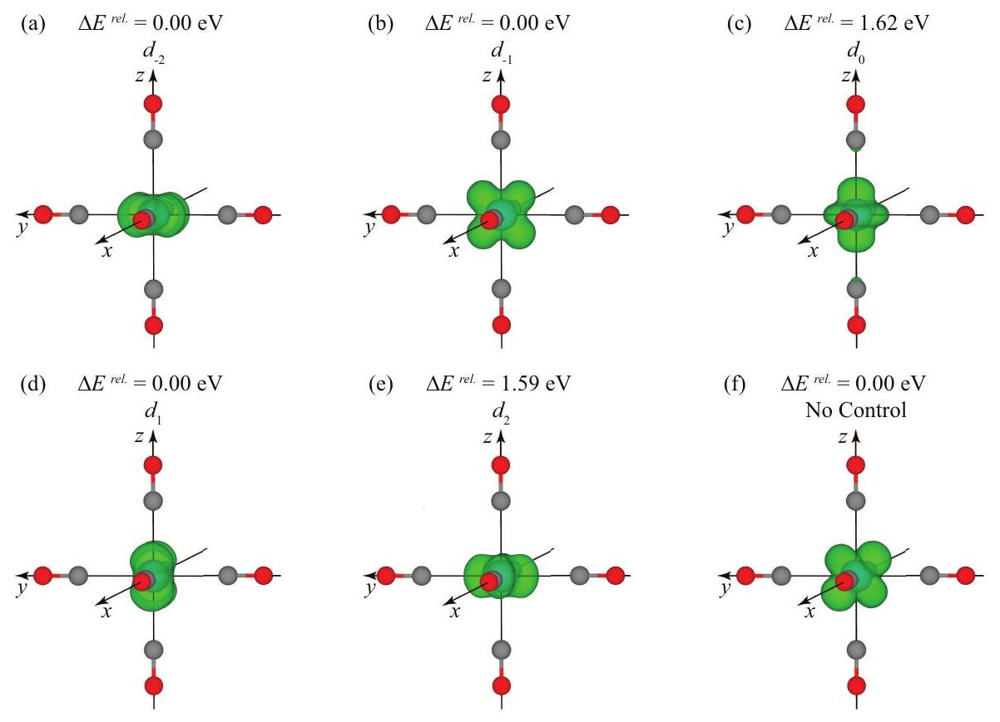
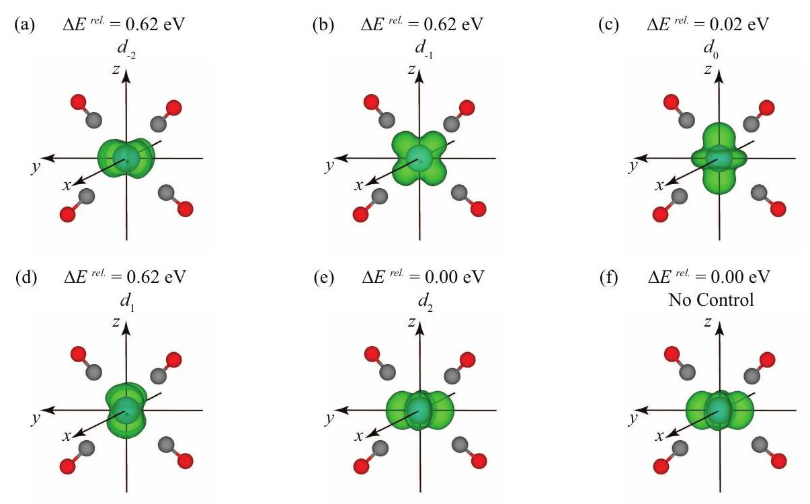
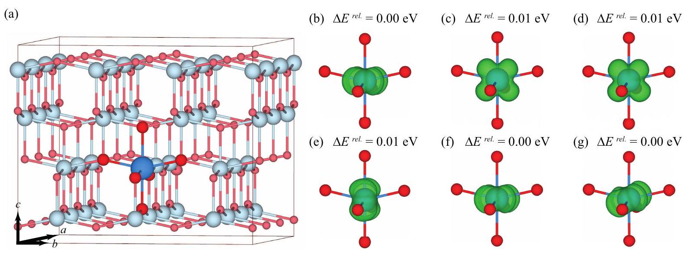
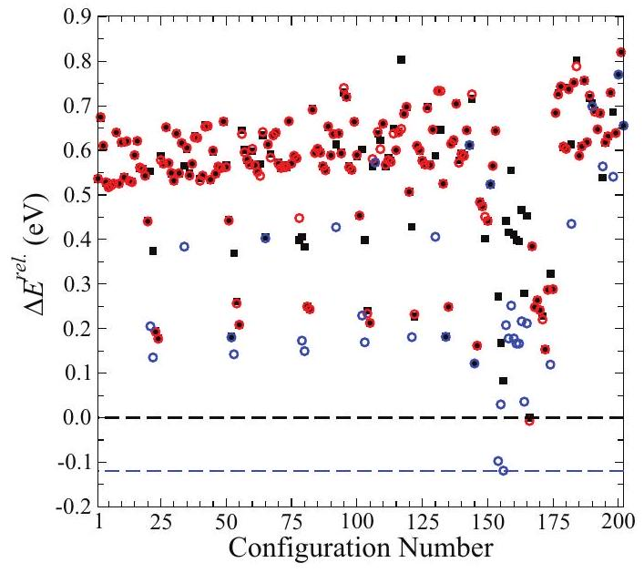
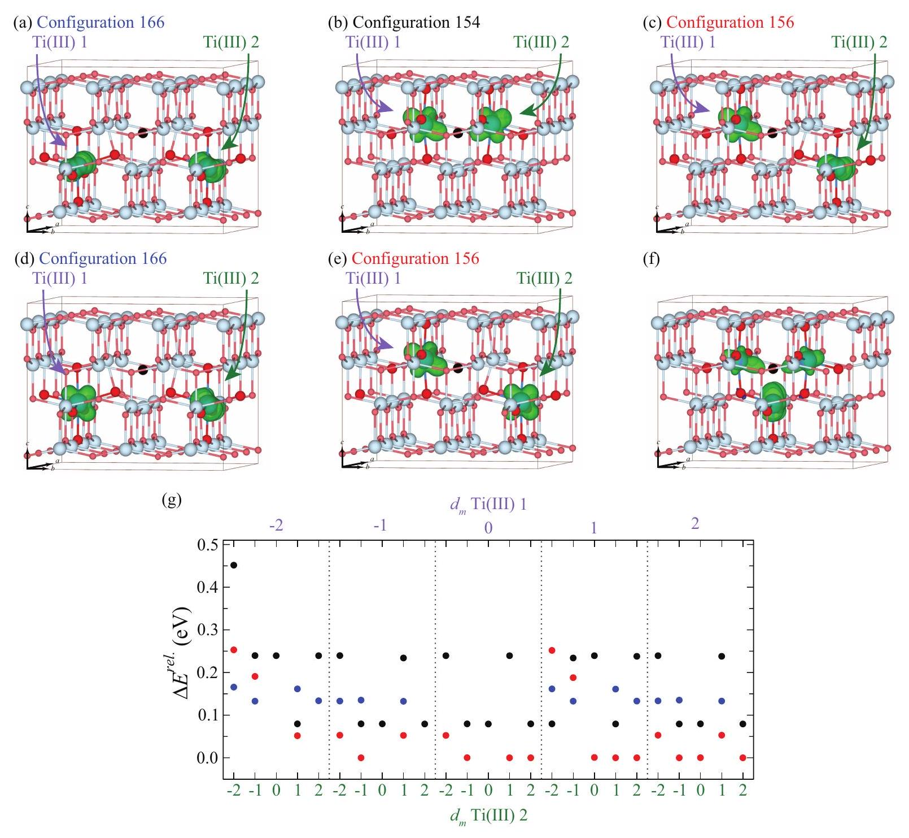
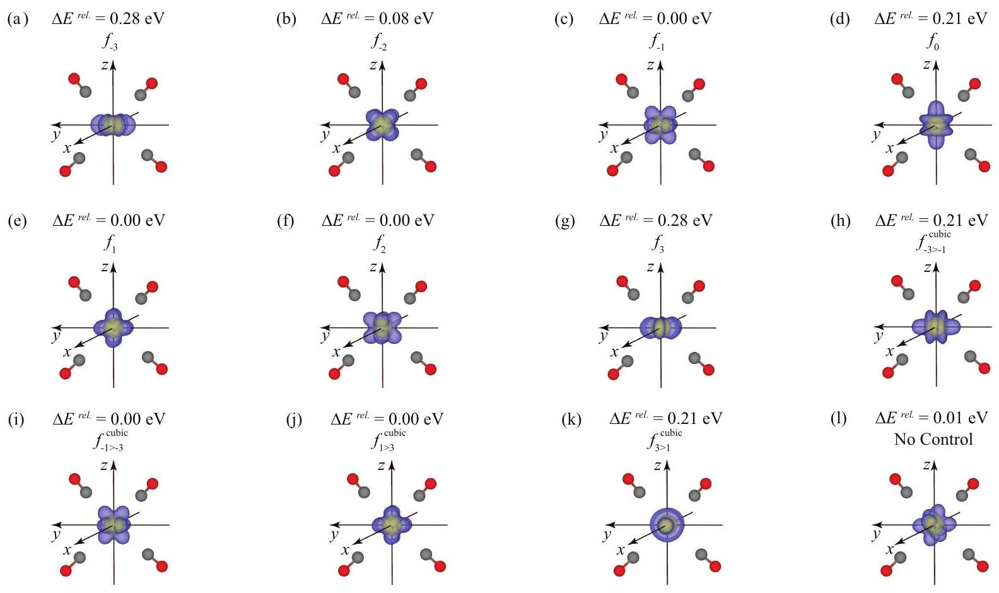
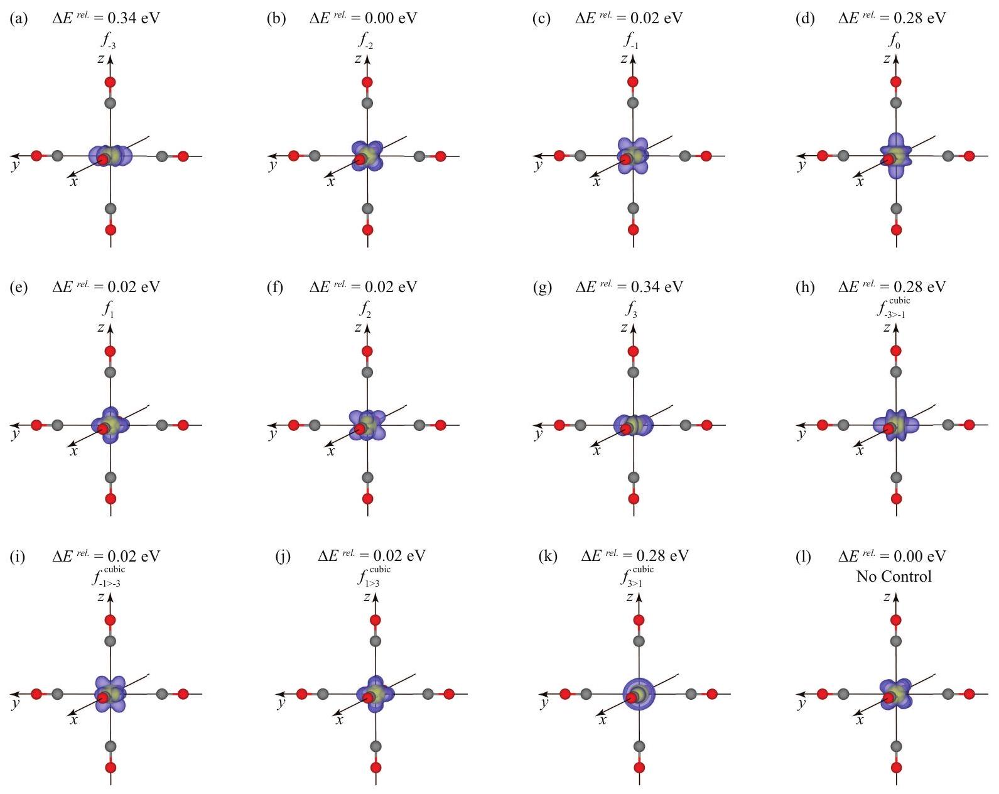
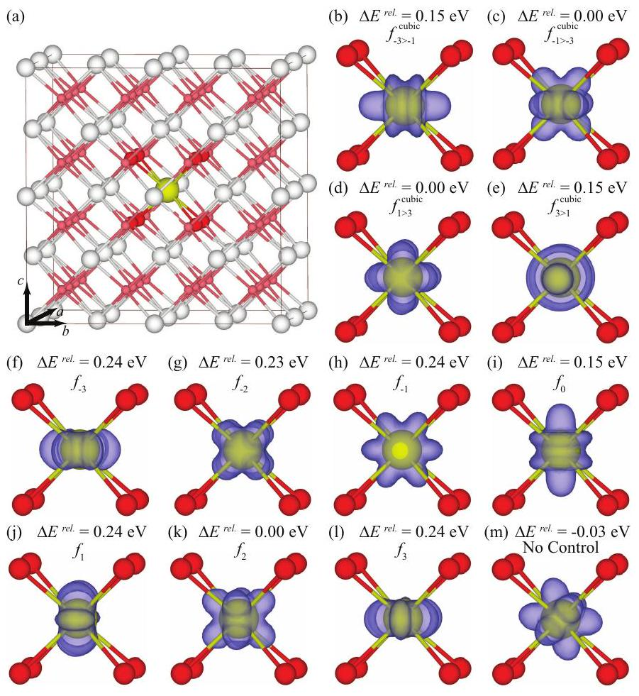
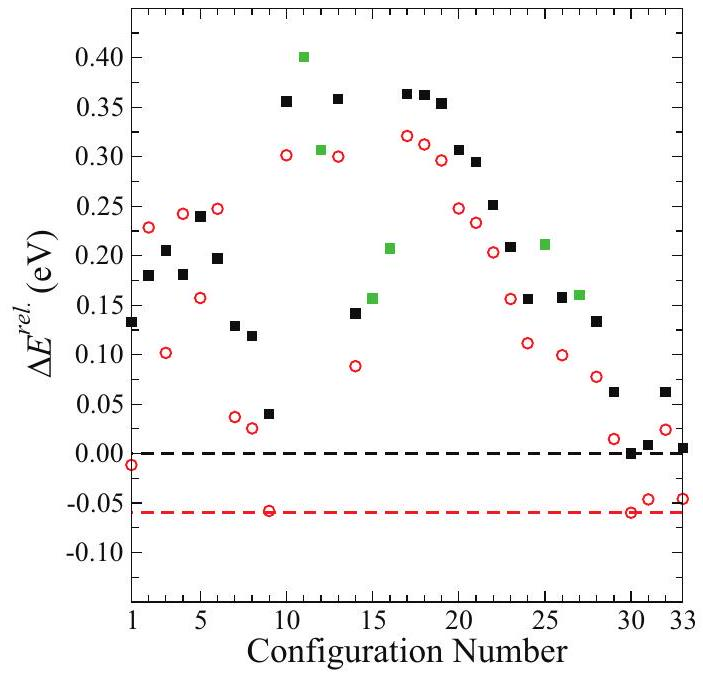
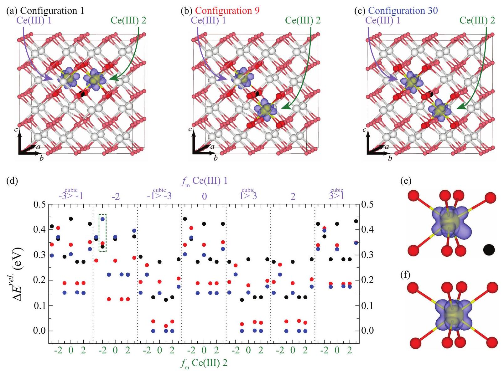

## РССР

## Accepted Manuscript

This is an Accepted Manuscript, which has been through the Royal Society of Chemistry peer review process and has been accepted for publication.

Accepted Manuscripts are published online shortly after acceptance, before technical editing, formatting and proof reading. Using this free service, authors can make their results available to the community, in citable form, before we publish the edited article. We will replace this Accepted Manuscript with the edited and formatted Advance Article as soon as it is available.

## You can find more information about Accepted Manuscripts in the Information for Authors.

Please note that technical editing may introduce minor changes to the text and/or graphics, which may alter content. The journal's standard Terms \& Conditions and the Ethical guidelines still apply. In no event shall the Royal Society of Chemistry be held responsible for any errors or omissions in this Accepted Manuscript or any consequences arising from the use of any information it contains.

# Occupation Matrix Control of $\boldsymbol{d}$ - and $\boldsymbol{f}$-electron Localisations using $\mathbf{D F T}+\boldsymbol{U}^{\dagger}$ 

Jeremy P. Allen and Graeme W. Watson* Received Xth XXXXXXXXXX 20XX, Accepted Xth XXXXXXXXX 20XX

First published on the web Xth XXXXXXXXXX 200X
DOI: 10.1039/b000000x

The use of a density functional theory methodology with on-site corrections (DFT $+U$ ) has been repeatedly shown to give an improved description of localised $d$ and $f$ states over those predicted with a standard DFT approach. However, the localisation of electrons also carries with it the problem of metastability, due to the possible occupation of different orbitals and different locations. This study details the use of an occupation matrix control methodology for simulating localised $d$ and $f$ states with a plane-wave DFT $+U$ approach which allows the user to control both the site and orbital localisation. This approach is tested for orbital occupation using octahedral and tetrahedral Ti(III) and Ce (III) carbonyl clusters and for orbital and site location using the periodic systems anatase- $\mathrm{TiO}_{2}$ and $\mathrm{CeO}_{2}$. The periodic cells are tested by the addition of an electron and through the formation of a neutral oxygen vacancy (leaving two electrons to localise). These test systems allow the successful study of orbital degeneracies, the presence of metastable states and the importance of controlling the site of localisation within the cell, and it highlights the use an occupation matrix control methodology can have in electronic structure calculations.

## 1 Introduction

The self-interaction error (SIE) of standard density functional theory (DFT) methodologies is a well-known problem in electronic structure simulations. Originally, this failure was highlighted through the modelling of Mott insulators, with NiO being the archetypal material. ${ }^{1-5}$ Band theory predicts NiO to be conducting, while experimental evidence indicates an antiferromagnetic insulating state. The strong Coulomb interaction between 3d states gives rise to an energy separation between occupied and unoccupied states leading to the insulating nature. To help understand the electronic structure of such materials, DFT was employed. However, instead of corroborating the experimental observation, the simulations either failed to predict an insulating state or, when antiferromagnetic ordering was explicitly considered, predicted a band gap that was an order of magnitude smaller than experiment. ${ }^{4-6}$ This was primarily due to the SIE inherent within DFT, which is a direct result of the approximations used to determine the exchange and correlation with both the local density (LDA) and the generalised gradient approximations (GGA). These approximations result in the exchange not cancelling the self Coulomb term, as would be the case in Hatree-Fock theory. The consequence of this is that an electron essentially sees itself, creating an erroneous repulsion which artificially favours electron delocali-

[^0]sation. This is of particular issue for $d$ - and $f$-block systems with strongly localised electrons. ${ }^{7,8}$

The manifestation of the SIE can be seen by considering a hypothetical situation where a non-integer amount of an electron in an external reservoir is either added to or removed from an isolated atom. During this process, the change in energy should be linear. ${ }^{9}$ A true DFT functional would accurately reproduce this behaviour; however, as the true functional is unknown, the approximations of the exchange and correlation are required to make computation possible. The SIE results in a failure to reproduce this linear behaviour, with the change in energy being non-linear with partial occupancy. Furthermore, the energy of the partially occupied state is artificially lowered, relative to that of the true DFT functional. In practice, this results in a single electron being delocalised over a number of atomic sites, rather on a single ion. For example, in reduced- $\mathrm{CeO}_{2}$, the reduction generates excess electrons which occupy the $f$ orbitals. The SIE results in these electrons being delocalised across the entire simulation, rather than being localised on specific sites forming Ce(III) ions. ${ }^{8}$

To counter the SIE and improve the simulation of such materials researchers often employ either on-site correction terms to aid localisation or hybrid functionals which mix in a portion of exact Fock exchange. The DFT $+U$ approach, which adds a Hubbard-type correction ( $U$ ) to restore the discontinuity in energy at integer occupations, is one of the more popular approaches in plane-wave DFT and often represents a good balance between accuracy and computational efficiency. The $+U$ is essentially chosen to act as an on-site correction to repro-
duce the Coulomb interaction, thus acting as a penalty to delocalisation. Two popular methods are those derived by Liechtenstein ${ }^{10}$ and Dudarev. ${ }^{4}$ Of these, the latter is the more widely used due to its simplicity. It is described by the following equation:

$$
E_{\mathrm{DFT}+U}^{\mathrm{Dudarev}}=E_{\mathrm{DFT}}+\frac{U_{\mathrm{eff}}}{2} \sum_{I, \sigma} \sum_{i} \lambda_{i}^{I \sigma}\left(1-\lambda_{i}^{I \sigma}\right)
$$

where $\lambda_{i}^{I \sigma}$ is the occupation number for an orthogonal set of localised orbitals $i$ on atom $I$ with angular momentum $\sigma$. $U_{\text {eff }}$ is the effective $U$ parameter, determined as the on-site Coulomb interaction parameter $U$ minus the on-site exchange interaction parameter $J$. The Dudarev approach is simplified to only consider the difference between $U$ and $J$, whilst the Liechtenstein method uses the two parameters independently. More recently, Zhou and Ozoliņš ${ }^{11,12}$ presented a reformulation of the DFT $+U$ approach, which includes an additional parameter to correct for orbital-dependent SIE.

One of the drawbacks of using the DFT+ $U$ approach, however, is that when the partial occupation of orbitals is being penalised relative to integer occupation, metastable states can become problematic due to the initial orbital occupations. The occupation of different orbital configurations may lead to metastable configurations which possess a sufficient energy barrier such that they act as local minima, trapping a structure rather than allowing accurate prediction of the true ground state of the system. This effect can thus be problematic regardless of whether the correct orbital ordering, degeneracy and ground states are predicted. This may indeed be the cause of the variety of $f$ orbital shapes and orientations seen in recent studies of oxygen vacancies on $\mathrm{CeO}_{2}$ (111) surfaces. ${ }^{13-15}$

Although the majority of studies generally neglect the presence and effect of metastable states, Dorado and co-workers carried out a number of studies on $\mathrm{UO}_{2}$, ${ }^{16-19}$ with metastable states being a key focus. Their work suggests that metastability may be the cause of discrepancies in the literature for $f$-block materials. For example, the defect chemistry of $\mathrm{UO}_{2}$ has been widely studied with DFT+U due to the observed nonstoichiometry of the material. However, despite the use of similar computational methodologies, defect formation energies can vary widely. For a neutral oxygen interstitial defect, calculated formation energies range from -0.44 to -2.17 eV with no apparent cause for the differences in the methodologies employed. ${ }^{20-24}$ To investigate this problem, Dorado et al. considered the occupation of $f$ orbitals in bulk $\mathrm{UO}_{2}$ using both the Liechtenstein and Dudarev DFT $+U$ approaches. ${ }^{16,17}$ To further examine this effect, they implemented a methodology to allow them to control which $f$ orbitals were occupied, allowing a search of different orbital occupations. These studies found that not only did the two methods give different configurations for the ground states, but also that higher energy configurations were metastable, with the simulations becoming
trapped in these local minima with relative ease. For example, implementation of this approach in the ABINIT code found that for the 21 orbital configurations (considering only general f-orbital combinations) with a Liechtenstein $\mathrm{DFT}+U$ methodology, the relative energy per $\mathrm{U}_{2} \mathrm{O}_{4}$ cell ranged from 0.00 to 3.45 eV depending on $f$ orbital occupation. ${ }^{16}$ Furthermore, not only did the cell energy vary with orbital occupation, significant differences were found in the electronic structure, with the band gap ranging from metallic ( 0.0 eV ) to 2.8 eV , thus highlighting the need to predict the orbital occupations of the ground state correctly.

The methodology that Dorado and co-workers applied to their calculations of bulk $\mathrm{UO}_{2}$ was that of occupation matrices. The occupation matrix is used with $\mathrm{DFT}+U$ to define the occupation of a given set of orbitals, in this case the $f$ orbitals, for a given ion. The approach of Dorado works by specifying the orbital occupation at the start of the calculation, which is then used to specify a given orbital configuration, $\lambda_{i}^{I \sigma}$. This orbital configuration is fixed for the first ten electronic minimisation steps of the calculations, to encourage the occupation of the specified orbitals, avoiding the occupation of unwanted local minima. The range of different orbital configurations can then be scanned over and the ground state configuration located.

Dorado and co-workers applied this method successfully to $\mathrm{UO}_{2}$, spawning a number of research articles and highlighting some important effects and considerations in the modelling of $f$-element systems. However, despite this volume of work, a number of areas exist which need further exploration. The work of Dorado et al. was solely focussed on $\mathrm{UO}_{2}$ and did not consider any other $f$-element systems, nor did it extend to $d$-element systems, which are also routinely studied with a DFT $+U$ methodology. The differences between the occupation of general and cubic $f$ orbitals were not explicitly considered. Furthermore, the methodology was restricted to only being applied only during the first ten steps of the selfconsistent cycle. The aim of this work is to continue the study of metastable states in periodic systems using a general application of the occupation matrix control methodology with a plane-wave DFT $+U$ approach. To this end hypothetical $d^{1}$ and $f^{1}$ clusters and crystalline systems will be assessed as a proof of concept, highlighting the applicability of this approach for investigating orbital occupations and ground states for these systems, as well as examining the use of the approach as a screening tool to aid in surveys of different positions of electron localisation in defective systems.

## 2 Computational Methods

All calculations in this study were carried out using the periodic DFT code VASP. ${ }^{25,26}$ This uses a plane-wave basis set to describe the valence electronic states and the projector-
augmented wave (PAW) method ${ }^{27,28}$ to describe interactions between the core ( $\mathrm{C} / \mathrm{O}:[\mathrm{He}], \mathrm{Ti}:[\mathrm{Ar}]$ and $\mathrm{Ce}:[\mathrm{Xe}]$ ) and valence electrons. The exchange and correlation is treated with the GGA via the Perdew-Burke-Ernzerhof ${ }^{29}$ (PBE) functional. The DFT $+U$ approach is utilised for all calculations, using the Dudarev approach, with all $+U$ parameters originating from previous studies which have used this method. ${ }^{8,30,31}$ The aim of this work was as a proof of concept of applying an occupation matrix control methodology rather than an assessment of competing DFT $+U$ approaches. However, it should be noted that this implementation of occupation matrix control can be utilised for both Liechtenstein and Dudarev methodologies within the VASP code.

All systems were simulated with a plane wave cutoff of 400 eV , spin polarisation and no symmetry constraints. Structural convergence was deemed achieved when the forces on all atoms were less than $0.01 \mathrm{eV} \AA^{-1}$. For the Ti-based systems, a $U$ value of 4.2 eV was applied to the $3 d$ states of Ti atoms. This value originates from the study of oxygen vacancies on the rutile- $\mathrm{TiO}_{2}$ (110) surface. ${ }^{30}$ It was found that this $U$ value correctly predicted the localisation of two excess electrons on two Ti sites when an oxygen vacancy was introduced to the surface. Furthermore, analysis of the electronic structure showed that the resultant Ti(III) gap states were both qualitatively and quantitatively well described in comparison to experimental results. This methodology has been previously used to model defects in pure anatase- $\mathrm{TiO}_{2}$ as well as Nb - and Ta-doped anatase- $\mathrm{TiO}_{2}{ }^{32-35}$ and rutile- $\mathrm{TiO}_{2} \cdot{ }^{34,36}$ The Ti clusters were simulated in $25 \AA \times 25 \AA \times 25 \AA$ boxes with a single $k$-point at $\Gamma$. The clusters were simulated with a fixed geometry to ensure that orbital degeneracies would not be affected by any structural variations. All simulations of anatase$\mathrm{TiO}_{2}$ were achieved using a $3 \times 3 \times 1108$-atom supercell with a $2 \times 2 \times 2$ Monkhorst-Pack-centred ${ }^{37} k$-point mesh.

For the Ce-based systems, a $U$ value of 5.0 eV was applied to the $\mathrm{Ce} 4 f$ states. This value was derived by Nolan et al. for modelling pure and defective surfaces of $\mathrm{CeO}_{2} .{ }^{8}$ It has subsequently been used to accurately describe pure, defective and doped $\mathrm{CeO}_{2}$ systems. ${ }^{31,38-50}$ Furthermore, recent work by Keating et al. has shown the additional need to apply a $U$ of 5.5 eV to the $2 p$ states of oxygen when modelling $p$-type defects in $\mathrm{CeO}_{2}$, due to the formation of O hole states. ${ }^{31}$ The $U$ value for the oxygen atoms was derived using an $a b$ initio fitting procedure with a Koopman's-like approach. ${ }^{32,51}$ This additional term is only applied to bulk $\mathrm{CeO}_{2}$ calculations and not the clusters. As with the Ti clusters, all Ce-based clusters were simulated in $25 \AA \times 25 \AA \times 25 \AA$ boxes with a single $k$ point at $\Gamma$ and the structures were held fixed to ensure orbital degeneracies would not be affected by structural variations. Bulk $\mathrm{CeO}_{2}$ was modelled using a $2 \times 2 \times 2$ 96-atom supercell with a $2 \times 2 \times 2$ Monkhorst-Pack-centred $k$-point mesh.

To influence orbital filling, occupation matrices are utilised,
where each matrix is used to obtain $\lambda_{i}^{I \sigma}$ explicitly. For the $d$ orbitals, the occupation for a given ion (assuming collinear magnetism) can be specified by two $5 \times 5$ matrices, one representing up spin and the other down spin. The integer occupation of the $d_{m}$ orbitals are defined along the leading diagonal of the matrix, from $d_{-2}$ in the top left-hand corner to $d_{2}$ in the bottom right-hand corner. These are defined within the VASP code by spherical harmonics within the given simulation cell. Therefore, it is important to ensure either bond/orbital geometries are aligned to this reference frame correctly, or the occupation matrix is rotated to give the correct orbital filling. The matrix can be rotated (or orbitals distorted) through filling of the relevant off-diagonal terms. The orbital occupation $\lambda_{i}^{I \sigma}$ is obtained from diagonalisation of the matrix and can be fed into the DFT $+U$ calculation (Equation 1). The occupation of $f$ orbitals can be specified using the same approach, albeit with two $7 \times 7$ matrices. In principle, the approach can also be applied to $s$ and $p$ orbitals.

To 'constrain' the occupation of the system, the occupations are reset at the start of the simulation according to that specified by the user for each given atom. This is only implemented within the calculation of the DFT $+U$ energy and potential correction term, via Equation 1, thereby influencing the occupation of a specified orbital $\lambda_{i}^{I \sigma}$, rather than explicitly fixing the wavefunction or charge density. During the self-consistent field cycle, the additional potential encourages the true charge density towards the occupation matrix input. By this virtue, the system is not technically constrained as the system is still able to relax to an alternative occupation; however, for simplicity the term constraint will be used to refer to this form of occupation matrix control. It should be noted that for the systems studied here, occupation of specified orbitals was routinely achieved using this approach without resorting to other approaches (such as artificially increasing the $U$ value on specific atom to encourage localisation). With this implemented methodology, the orbital occupation for the specified atoms is reset to the user-defined values at the start of each electronic relaxation step. The structure is relaxed in this manner until the convergence criteria is met. However, the energy of this calculation cannot be utilised due to the artificial manipulation of the DFT $+U$ calculation. Following this, the occupation constraint is lifted and the structure is further relaxed using the previous structural and wavefunction information until the convergence criteria is again met. This allows for further relaxation of the electronic structure, and any consequential structural relaxation until a minima in energy is found. Then, if necessary, the cell can be further relaxed without the wavefunction information.

The approach implemented is similar to that utilised by Dorado and co-workers ${ }^{16,17,19}$ (VASP and ABINIT) and Torrent and co-workers ${ }^{52,53}$ (ABINIT) but goes beyond it in a number of ways. It is not solely restricted to the defini-
tion of $f$ orbitals and allows $d$ orbital occupations (as well as $s$ and $p$ ) to be defined. Furthermore, previous reports of occupation matrix control have only applied the constraint to the first ten steps of the self-consistent cycle; while the approach used herein allows full geometry relaxation (or a user specified number of electronic/ionic steps) with the constraint in place. The advantage of this is that it allows polaronic distortion to form in response to the set occupation. This study is concerned with applying our occupation matrix approach for controlling simple $d^{1}$ and $f^{1}$ systems. Additional information on the approach and coding can be found at http://www.chemistry.tcd.ie/staff/ people/gww/gw_new/research/methodology.

All structural figures were generated using the visualization package VESTA. ${ }^{54}$

## 3 Results

### 3.1 Ti-based Systems

3.1.1 Ti(III) Clusters. To assess the use of occupation matrix control for modelling $d$-electrons, the first system of study were based around $d^{1}$ clusters. The cluster simulations were principally used to investigate the predicted degeneracy of orbitals within a crystal field and the integer occupation of $d_{m}$ orbitals in a symmetric environment. Two hypothetical Ti(III) clusters were simulated, each using the neutral CO ligand, namely octahedral $\left[\mathrm{Ti}(\mathrm{CO})_{6}\right]^{3+}$ and tetrahedral $\left[\mathrm{Ti}(\mathrm{CO})_{4}\right]^{3+}$. Occupation matrix control was applied, in turn, to favour the occupation of the $d_{-2}, d_{-1}, d_{0}, d_{1}$ and $d_{2}$ orbitals, where the subscript number is the $m$ quantum number. In a 3 -dimensional Cartesian axis system where $x, y$ and $z$ are considered to be equivalent to $a, b$ and $c$, these can be relabelled as the $d_{x y}, d_{y z}, d_{z^{2}}, d_{x z}$ and $d_{x^{2}-y^{2}}$ orbitals, respectively.

For a perfect octahedral crystal field of point charges, the $d$ orbitals should split into two levels: the $t_{2 g}$ set (containing the $d_{-2}, d_{-1}$ and $d_{1}$ orbitals) and the $e_{g}$ set (containing the $d_{0}$ and $d_{2}$ orbitals), with the former being the lowest in energy. The energy separation between the $t_{2 g}$ and $e_{g}$ levels is characterized by the quantity $\Delta_{\text {oct }}$. For a cubic/tetrahedral field, these energy levels are reversed and the $g$ label is removed for tetrahedral systems due to the loss of the inversion centre, thus placing the $e$ set lower in energy than the triply-degenerate $t_{2}$ set. The magnitude of splitting is also reduced for tetrahedral (tet) and cubic (cub) systems, with $\Delta_{\text {tet }} \approx \frac{4}{9} \Delta_{\text {oct }}$ and $\Delta_{\text {cub }} \approx \frac{8}{9} \Delta_{\text {oct }}$.

The resultant minimized localisations and relative energies of the $\left[\operatorname{Ti}(\mathrm{CO})_{6}\right]^{3+}$ and $\left[\operatorname{Ti}(\mathrm{CO})_{4}\right]^{3+}$ clusters are detailed in Fig. 1 and Fig. 2, respectively. The relative energies of the calculated $d$ orbitals for the $\left[\operatorname{Ti}(\mathrm{CO})_{6}\right]^{3+}$ cluster indicate that a typical octahedral splitting is observed, with a triply degenerate set of orbitals being $\sim 1.6 \mathrm{eV}$ lower in energy than the dou-
bly degenerate set. Similarly, for the $\left[\mathrm{Ti}(\mathrm{CO})_{4}\right]^{3+}$ cluster two distinct orbital sets are observed, the $e$ set (comprised of $d_{0}$ and $d_{2}$ ) lowest in energy, with $d_{-2}, d_{-1}$, and $d_{1}$ forming the $t_{2}$ set 0.62 eV above. The clusters were also simulated with no occupation matrix control. For $\left[\mathrm{Ti}(\mathrm{CO})_{6}\right]^{3+}$, the predicted orbital occupation is an amalgamation of the $t_{2 g}$ orbitals. It is predominantly of $d_{-1}$ character, with some $d_{-2}$ and $d_{0}$ components. It does, however, have an equivalent energy to the $t_{2 g}$ orbitals. For the $\left[\mathrm{Ti}(\mathrm{CO})_{4}\right]^{3+}$ cluster, the $d_{2}$ orbital is seen to be occupied.

Overall, these results indicate that occupation matrix control of $d$ orbitals is successful and that the correct splitting of energy levels is reproduced using the DFT+U methodology.
3.1.2 Anatase-TiO ${ }_{2}$ : An Excess Electron. The next step was to apply the occupation matrix control to a periodic material. For this purpose, anatase- $\mathrm{TiO}_{2}$ was used. The bulk anatase structure is shown in Fig. 3(a) and is orthorhombic in nature (space group I4 ${ }_{1} /$ amd ). It possess six-coordinate $d^{0}$ Ti(IV) ions in a distorted octahedral environment and threecoordinate oxygen ions in a trigonal planar arrangement. The advantage of using the anatase polymorph over the more stable rutile form is that no rotation of the cell (or rotation of the occupation matrix) is required to ensure that the Ti-O bonds lie in the same planes as the principal axes, which is not the case for rutile.

The selective occupation of $d$ orbitals in anatase was first assessed through the formation of a single $d^{1} \mathrm{Ti}$ (III) ion, achieved via the addition of an electron and its localisation at a single Ti site. As with the clusters, the occupations of all five $d$ orbitals were attempted and, for reference, a system with no occupation matrix control was also simulated. The resultant localisations and energies are detailed in Fig. 3.

For all localisations, a distortion in the lattice was seen due to the size change from a $\operatorname{Ti}(\mathrm{IV})$ to a $\operatorname{Ti}(\mathrm{III})$ ion. However, as the resultant structures were similar for all localisations studied, the degree of distortion has not been quantified. A number of observations can be drawn from these results. Firstly, the successful occupation of the $d_{-2}, d_{-1}$ and $d_{1}$ orbitals was achieved, Figs. 3(b), (c) and (e), respectively. These orbitals were found to be the lowest in energy and each minimized system showed integer occupation of the desired orbital. Slight variations in energy are likely a result of the distorted octahedral geometry. Secondly, once the occupation matrix constraint was removed and the system restarted using the structure and wavefunction data, localisation in the $d_{0}$ and $d_{2}$ orbitals was unsuccessful, with the excess $d$-electron relaxing into a lower energy orbital, Figs. 3(d) and (f), respectively. For the $d_{0}$ orbital, relaxation to the $d_{-1}$ occurred, albeit with a slight skew in the $b c$ plane. Whereas for the $d_{2}$ orbital, the electron relaxed to the $d_{-2}$ orbital. Therefore, the energies of these two localisations were seen to be equivalent to those

Fig. 1 Spin density plots for $\left[\mathrm{Ti}(\mathrm{CO})_{6}\right]^{3+}$ clusters following occupation matrix control of the (a) $d_{-2}$, (b) $d_{-1}$, (c) $d_{0}$, (d) $d_{1}$ and (e) $d_{2}$ orbitals. Energies ( $\Delta E^{\text {rel }}$.) shown are relative to the lowest energy occupation matrix-controlled orbital. The $\left[\operatorname{Ti}(\mathrm{CO})_{6}\right]^{3+}$ cluster with no occupation matrix control is given in (f). The spin density isosurfaces (green) are plotted at a level of 0.05 electrons $\AA^{-3}$. Blue, grey, red and orange spheres represent titanium, carbon and oxygen atoms, respectively.

Fig. 2 Spin density plots for $\left[\mathrm{Ti}(\mathrm{CO})_{4}\right]^{3+}$ clusters following occupation matrix control of the (a) $d_{-2}$, (b) $d_{-1}$, (c) $d_{0}$, (d) $d_{1}$ and (e) $d_{2}$ orbitals. Energies ( $\Delta E^{\text {rel }}$.) shown are relative to the lowest energy occupation matrix-controlled orbital. The $\left[\operatorname{Ti}(\mathrm{CO})_{4}\right]^{3+}$ cluster with no occupation matrix control is given in (f). The spin density isosurfaces (green) are plotted at a level of 0.05 electrons $\AA^{-3}$. Blue, grey, red and orange spheres represent titanium, carbon and oxygen atoms, respectively.

Fig. 3 (a) Bulk anatase- $\mathrm{TiO}_{2}$ supercell used for the formation of a Ti (III) ion, where the site of the Ti (III) is highlighted by the darker colours/larger spheres. Minimised spin density plots of the Ti(III) ion after occupation matrix control of the (b) $d_{-2}$, (c) $d_{-1}$, (d) $d_{0}$, (e) $d_{1}$ and (f) $d_{2}$ orbitals. It should be noted that the occupation of the $d_{0}$ and $d_{2}$ orbitals was unsuccessful, with relaxation to lower energy $d$ orbitals. The calculated spin density with no occupation matrix control is given in (g). Energies ( $\Delta E^{\text {rel }}$.) shown are relative to the lowest energy configuration. The spin density isosurfaces (green) are plotted at a level of 0.05 electrons $\AA^{-3}$. Blue and red spheres represent titanium and oxygen atoms, respectively.

predicted for the $t_{2 g}$ orbitals. Finally, starting from an idealised structure with an initial magnetic moment set on a single Ti site but with no occupation matrix control, the $\mathrm{DFT}+U$ method successfully predicted a localisation which possessed an equivalent energy to the lowest found with occupation matrix control, Fig. 3 (g). However, the orientation of the localised orbital was seen to differ. Although closest in appearance to the $d_{-2}$ orbital, a small rotation about the $a$ axis was observed and the resultant orbital is similar in appearance to that observed for the cluster calculations within an octahedral environment, Fig. 1(f).

Overall, the results suggest that the orbitals that would be expected to be the lowest in energy from the point of view of crystal field theory, are successfully simulated and found to be the ground state. The occupation of higher energy $d$ orbitals, however, was unsuccessful, with the system relaxing to the minimum energy orbitals. This suggests that the use of this methodology for accessing high energy states in periodic $d$ element systems may be unfeasible.
3.1.3 Anatase- $\mathbf{T i O}_{\mathbf{2}}$ : An Oxygen Vacancy. The final $d$ system that the occupation matrix control methodology was tested in was that of a defective system, namely bulk anatase$\mathrm{TiO}_{2}$ with an oxygen vacancy introduced. The formation of a neutral oxygen vacancy results in two excess electrons in the system, giving rise to the formation of two Ti(III) ions. Although the optimal positions of the Ti (III) ions relative to the oxygen vacancy have been studied in some detail before, ${ }^{34,55-57}$ to fully assess the ability of the occupation matrix approach a full assessment of the cell was conducted. Initial tests indicated that the differences in energy between fer-
romagnetic and antiferromagnetic configurations of the two Ti(III) ions was insignificant, therefore only ferromagnetic couplings were trialled.

The Site Occupancy Disorder (SOD) code ${ }^{58}$ was used to identify all the symmetry inequivalent combinations of arranging the two ions in the oxygen-deficient cell. This gave 202 different structures to be minimized. To ease the total number of calculations required, all orbital occupations were set to the $d_{-2}$ orbital as this would be expected to be one of the low energy configurations based on the results of adding an electron to the bulk cell and chemical theory. The structures were initially minimized with the occupation matrix control constraint to allow the structure to distort based on that specific occupation and to generate a wavefunction. Once minimization was achieved, the occupation matrix constraint was removed and the structure was allowed to relax further, using the structure and wavefunction as a starting point. The relaxed energies of these 202 configurations are given by the closed black squares in Fig. 4. Following this, the wavefunction was removed and the calculation was restarted from the distorted structure alone, thus allowing more freedom for rotation/distortion of the occupied $d$ orbital. The results of these 202 simulations are included in Fig. 4 as open circles (both blue and red). Full details of the different configurations are given in the supplementary information, i.e. which Ti atoms have had extra electrons added to them.

The occupation matrix constrained configurations show a wide energy range with Ti(III) site occupation, with 0.84 eV covering the most to least stable configurations. The most stable system following occupation matrix control is configura-

Fig. 4 Plot showing the minimised energies following the localisation of two electrons in an anatase- $\mathrm{TiO}_{2}$ cell containing an oxygen vacancy, trialling over all possible Ti sites in the cell. The configuration numbers are arbitrary, detailed in full in the supplementary information. The closed black squares indicate calculations which have used a starting structure and wavefunction from the constrained occupation matrix calculation, and all energies ( $\Delta E^{\text {rel. }}$ ) in the plot are given relative to the lowest energy arrangement from this set of calculations (configuration 166). The open circles are the resultant energies once the wavefunction has been removed and the cell is relaxed from the distorted structure alone. Blue circles indicate configurations that had at least one Ti(III) ion nearest neighbour to the oxygen vacancy, all other configurations have red circles.

tion number 166, which has the Ti(III) ions nearest neighbour (NN) to each other but $4.34 \AA$ away from the vacancy position. All energies in Fig. 4 are set relative to this structure. The location of the Ti(III) ions relative to the vacancy site can be seen in Fig. 5(a).

Upon relaxation with no starting wavefunction, the trends in data can be broadly separated into configurations with at least one Ti(III) ion NN to the vacancy site and where both Ti(III) ions are beyond a NN position. These are represented in Fig. 4 by the blue and red open circles, respectively. Overall, the latter set of structures show little variation in energy when the wavefunction information is removed. This implies that the $d$ orbital arrangement and structural distortion resulting from the constraint is already at, or close to, a minimum in energy. When a Ti(III) ion is NN to the vacant site, a significant reduction in energy is typically observed from that determined using the $d_{-2}$ occupation. In fact, configurations 154 and 156 are actually found to possess lower energies than configuration 166. This increases the range covering least to most stable to 0.94 eV . The $d$ orbital shapes and Ti(III) positions for configurations 166, 154 and 156 are given in Fig. 5(a), (b) and (c), respectively. For configuration 166, the orbital occu-
pations can be approximated as $d_{-2}$ orbitals rotated slightly about the $a$ axis. Configuration 154 shows that both Ti(III) sites are NN to the vacancy position with the charge density showing a significant distortion in the occupied $d$ orbital, with one lobe enlarged and directed into the vacancy position. This distortion is responsible for the large stabilisation in energy when the simulations were restarted without the wavefunction data. The up- and down-spin occupation matrices (Equations 2 and 3, respectively) for the Ti(III) 1 site of configuration 154 are:

$$
\begin{aligned}
& \left(\begin{array}{ccccc}
0.10 & 0.00 & 0.00 & -0.01 & 0.00 \\
0.00 & 0.66 & -0.19 & 0.00 & -0.27 \\
0.00 & -0.19 & 0.34 & 0.00 & 0.06 \\
-0.01 & 0.00 & 0.00 & 0.10 & 0.00 \\
0.00 & -0.27 & 0.06 & 0.00 & 0.43
\end{array}\right) \\
& \left(\begin{array}{ccccc}
0.09 & 0.00 & 0.00 & -0.01 & 0.00 \\
0.00 & 0.08 & 0.03 & 0.00 & 0.04 \\
0.00 & -0.03 & 0.25 & 0.00 & -0.06 \\
-0.01 & 0.00 & 0.00 & 0.10 & 0.00 \\
0.00 & -0.04 & -0.06 & 0.00 & 0.23
\end{array}\right)
\end{aligned}
$$

For configuration 156, the Ti (III) ion NN to the vacancy is again distorted, giving rise to the reduction in energy, while the second $\operatorname{Ti}($ III $)$ ion shows the occupation of the $d_{-2}$ orbital.

To investigate the effect of occupying different $d$ orbital combinations, and to further test the occupation matrix control methodology, configurations 166, 154 and 156 were further studied. For each configuration, all $d$ orbital combinations were simulated by optimising the structure with the occupation matrix controlled wavefunction, and then restarting from this data with the constraint lifted. The results of these simulations are shown in $5(\mathrm{~g})$, with the blue, black and red coloured data refering to configurations 166, 154 and 156, respectively. Missing data indicates that the location of the Ti(III) ions changed on relaxation (for example, configuration 166 when the excess electrons were both placed in $d_{2}$ orbitals).

For configuration 166, regardless of the initial constraint, the resulting $d$ orbitals were arranged in one of three arrangements, or failed to remain on the correct Ti sites. The localisation depicted in Fig. 5(a), where the $d$ orbitals can be approximated to $d_{-2}$ orbitals rotated about $a$ axis, was actually found to be the highest in energy of these configurations. The remaining two arrangements, 0.03 eV lower in energy, were found to be approximately degenerate ( $<0.01 \mathrm{eV}$ difference). The configuration that was lowest in energy is depicted by the structure in Fig. 5(d). This configuration was found to have one electron in the $a$-rotated $d_{-2}$ orbital and the other in the $d_{-1}$ orbital. The arrangement where both excess electrons were in $d_{-1}$ orbitals was equivalent in energy. The reason that the combination with both $a$-rotated $d_{-2}$ orbitals occupied is slightly higher in energy is likely due to greater orbital-orbital repulsion across the periodic boundary.

For configuration 154, regardless of the constraint, all $d$ orbital combinations were found to relax to one of three structures. The structure previously determined, where both orbitals are distorted towards the vacancy site, Fig. 5(b), was found to be the lowest energy structure. When both electrons reside in $d_{-2}$ orbitals the structure was at its highest energy ( 0.37 eV above the minimum). The other orbital combination, 0.16 higher in energy than the minimum, is when one orbital is distorted towards the vacancy and the other is in a $d_{-2}$ orbital.

Configuration 156 showed that it was possible to obtain four different orbital combinations, with five combinations failing to minimise on the correct Ti sites. The two combinations that were lowest in energy both showed a distorted $d$ orbital on the Ti(III) ion NN to the vacancy. However, occupation of the second Ti site resulted in a slight variation in energy. The structure shown previously in Fig. 5(c), with the second Ti(III) site having an electron in a $d_{-2}$ orbital is actually 0.05 eV higher in energy than having it in a $d_{-1}$ orbital, Fig. 5(e), which is therefore the ground state. The two highest energy configurations both have the $d_{-2}$ orbital occupied for the Ti(III) NN site, with the energy being 0.25 and 0.19 eV higher in energy than the minimum when either the $d_{-2}$ or $d_{-1}$ orbitals on the second site are occupied, respectively.

Morgan and Watson ${ }^{34}$ reported that a configuration equivalent to 156, with the same orbital combination seen in Fig. 5(e), as the lowest energy arrangement. They found this orbital arrangement to be 0.05 eV lower in energy than when both Ti(III) ions were NN to the vacant site (with the orbitals distorted towards it). This study found the difference in energy between these localisations to be 0.08 eV and therefore is in good agreement.

When the structure was minimised with no control of the electron localisation, other than constraining the over spin of the system to +2 , one electron was found to delocalise. The charge density, shown in Fig. 5(f), indicated one electron to be fully localised on the next-nearest neighbour position and the other electron to be split across the two NN Ti(III) ions. Furthermore, this configuration was 0.42 eV higher in energy than the lowest energy structure for configuration 156. This demonstrates the importance of controlling the localisation of electrons in such systems, and the coupling between the localised electron and local atomic distortion.

### 3.2 Ce-based Systems

3.2.1 Ce(III) Clusters. Understanding the expected crystal field splitting of $f$-block materials is more complicated than $d$-block elements. ${ }^{59}$ This is in part due to the $f$-shell being more contracted than the $d$-shell, causing the magnitude of the $f$ orbital splitting to be less pronounced. ${ }^{60}$ In addition, there is no universal set of $f$ orbitals which is applicable to all materials. ${ }^{61}$ The general set, determined in the normal manner by
the product of the angular factors of the orbital, for example, does not contain any sets of orbitals which are triply degenerate, as predicted by group theory for materials in a cubic field. ${ }^{62}$ Therefore, in addition to the general set of $f$ orbitals, a cubic set can be generated which are more appropriate for $f$-elements in a cubic field, such as tetrahedral, cubic and octahedral geometries. The general set of orbitals in their $f_{m}$ form, where $m$ refers to the magnetic quantum number, are the $f_{-3}, f_{-2}, f_{-1}, f_{0}, f_{1}, f_{2}$ and $f_{3}$ orbitals. In simplified polynomial form (in a 3 -dimensional Cartesian axis system where $x, y$ and $z$ are considered to be equivalent to $a, b$ and $c$, respectively) these are the $f_{y\left(3 x^{2}-y^{2}\right)}, f_{x y z}, f_{y z^{2}}, f_{z^{3}}, f_{x z^{2}}, f_{z\left(x^{2}-y^{2}\right)}$ and $f_{x\left(x^{2}-3 y^{2}\right)}$ orbitals, respectively. While the $f_{-2}, f_{0}$ and $f_{2}$ are common to both the general and cubic sets, the other four are not. Instead, the additional four cubic orbitals, defined as $f_{y^{3}}$, $f_{y\left(z^{2}-x^{2}\right)}, f_{x\left(z^{2}-y^{2}\right)}$ and $f_{x^{3}}$, are formed through linear combinations of the unique general $f$ orbitals:

$$
\begin{gathered}
f_{y^{3}}=-\frac{1}{4}\left[(6)^{\frac{1}{2}} f_{y z^{2}}+(10)^{\frac{1}{2}} f_{y\left(3 x^{2}-y^{2}\right)}\right]=f_{-3>-1}^{\text {cubic }} \\
f_{y\left(z^{2}-x^{2}\right)}=\frac{1}{4}\left[(10)^{\frac{1}{2}} f_{y z^{2}}-(6)^{\frac{1}{2}} f_{y\left(3 x^{2}-y^{2}\right)}\right]=f_{-1>-3}^{\text {cubic }} \\
f_{x\left(z^{2}-y^{2}\right)}=\frac{1}{4}\left[(10)^{\frac{1}{2}} f_{x z^{2}}+(6)^{\frac{1}{2}} f_{y\left(x^{2}-3 y^{2}\right)}\right]=f_{1>3}^{\text {cubic }} \\
f_{x^{3}}=-\frac{1}{4}\left[(6)^{\frac{1}{2}} f_{x z^{2}}-(10)^{\frac{1}{2}} f_{x\left(x^{2}-3 y^{2}\right)}\right]=f_{1>3}^{\text {cubic }}
\end{gathered}
$$

For simplicity, the cubic $f_{y^{3}}, f_{y\left(z^{2}-x^{2}\right)}, f_{x\left(z^{2}-y^{2}\right)}$ and $f_{x^{3}}$ orbitals will be referred to using the notation $f_{-3>-1}^{\text {cubic }}, f_{-1>-3}^{\text {cubic }}, f_{1>3}^{\text {cubic }}$ and $f_{3>1}^{\text {cubic }}$, respectively. The $f_{-3>-1}^{\text {cubic }}$, for example, indicates that the $f$ orbital is unique to the cubic set and comprised of a linear transformation of the $f_{-3}$ and $f_{-1}$ orbitals, with the cubic orbital possessing a greater contribution from the $f_{-3}$ orbital than the $f_{-1}$ orbital.

Within a perfect tetrahedral field, the cubic set of $f$ orbitals split into three degenerate levels. ${ }^{59,61,63}$ The lowest energy of these is the typically either the $t_{2}$ set ( $f_{-3>-1}^{\text {cubic }}, f_{0}$ and $f_{3>1}^{\text {cubic }}$ ) or the $t_{1}$ set ( $f_{-1>-3}^{\text {cubic }}, f_{1>3}^{\text {cubic }}$ and $f_{2}$ ), depending on the relative strength of $\sigma$ and $\pi$ interactions in the bonds. When the $\sigma$ character is dominant, the $t_{1}$ set is the lowest, and vice versa for when $\pi$ dominates. The highest energy level is the singly degenerate $a_{1}\left(f_{-2}\right)$. An identical splitting is observed in a cubic field, albeit with an increased crystal field stabilization energy, and the $t_{2}, t_{1}$ and $a_{1}$ symmetry labels change to $t_{1 u}, t_{2 u}$ and $a_{2 u}$, respectively. In a perfect octahedral field, the levels are reversed in energy, in the same way as for $d$ orbitals, with the $a_{2 u}$ orbital becoming the lowest in energy. The symmetry labels in the octahedral environment are identical to those in a cubic environment.

The occupation of a general $f$ orbital is defined by the integer occupation of the leading diagonal in the occupation matrix. Therefore, as the $f$ orbitals which are unique to the cubic

Fig. 5 Structure and charge density of the minimised structures for configurations (a) 166, (b) 154 and (c) 156, following relaxation with $d$-electrons constrained to the $d_{-2}$ orbitals, then restarted using the distorted structure alone and no wavefunction data. The minimum energy $d$-electron arrangements for configurations (d) 166 and (e) 156 after trialling over all possible combinations. The charge density and structure of the oxygen-deficient anatase- $\mathrm{TiO}_{2}$ cell with no constraint over $d$ orbital or Ti site is shown in (f). Full data for trialling across $d$ orbital combinations is shown in (g) for the 166 (blue), 154 (black) and 156 (red) configurations, where the energies ( $\Delta E^{\text {rel }}$.) are relative to the lowest energy combination/configuration located (corresponding to the structure given in (e)). The spin density isosurfaces (green) are plotted at a level of 0.05 electrons $\AA^{-3}$, and the blue and red spheres represent titanium and oxygen atoms, respectively. The vacancy position is indicated by the black sphere.

set are formed through combination of the general orbitals, it is not possible to define their occupation through an integer value in the leading diagonal. Instead, the occupation matrices used to specify occupation of the unique cubic $f$ orbitals are:

$$
\begin{aligned}
& f_{-3>-1}^{\text {cubic }}=\left(\begin{array}{ccccccc}
0.60 & 0.00 & 0.45 & 0.00 & 0.00 & 0.00 & 0.00 \\
0.00 & 0.00 & 0.00 & 0.00 & 0.00 & 0.00 & 0.00 \\
0.45 & 0.00 & 0.40 & 0.00 & 0.00 & 0.00 & 0.00 \\
0.00 & 0.00 & 0.00 & 0.00 & 0.00 & 0.00 & 0.00 \\
0.00 & 0.00 & 0.00 & 0.00 & 0.00 & 0.00 & 0.00 \\
0.00 & 0.00 & 0.00 & 0.00 & 0.00 & 0.00 & 0.00 \\
0.00 & 0.00 & 0.00 & 0.00 & 0.00 & 0.00 & 0.00
\end{array}\right) \\
& f_{-1>-3}^{\text {cubic }}=\left(\begin{array}{ccccccc}
0.40 & 0.00 & -0.45 & 0.00 & 0.00 & 0.00 & 0.00 \\
0.00 & 0.00 & 0.00 & 0.00 & 0.00 & 0.00 & 0.00 \\
-0.45 & 0.00 & 0.60 & 0.00 & 0.00 & 0.00 & 0.00 \\
0.00 & 0.00 & 0.00 & 0.00 & 0.00 & 0.00 & 0.00 \\
0.00 & 0.00 & 0.00 & 0.00 & 0.00 & 0.00 & 0.00 \\
0.00 & 0.00 & 0.00 & 0.00 & 0.00 & 0.00 & 0.00 \\
0.00 & 0.00 & 0.00 & 0.00 & 0.00 & 0.00 & 0.00
\end{array}\right) \\
& f_{1>3}^{\text {cubic }}=\left(\begin{array}{lllllll}
0.00 & 0.00 & 0.00 & 0.00 & 0.00 & 0.00 & 0.00 \\
0.00 & 0.00 & 0.00 & 0.00 & 0.00 & 0.00 & 0.00 \\
0.00 & 0.00 & 0.00 & 0.00 & 0.00 & 0.00 & 0.00 \\
0.00 & 0.00 & 0.00 & 0.00 & 0.00 & 0.00 & 0.00 \\
0.00 & 0.00 & 0.00 & 0.00 & 0.60 & 0.00 & 0.45 \\
0.00 & 0.00 & 0.00 & 0.00 & 0.00 & 0.00 & 0.00 \\
0.00 & 0.00 & 0.00 & 0.00 & 0.45 & 0.00 & 0.40
\end{array}\right) \\
& f_{3>1}^{\text {cubic }}=\left(\begin{array}{lllllll}
0.00 & 0.00 & 0.00 & 0.00 & 0.00 & 0.00 & 0.00 \\
0.00 & 0.00 & 0.00 & 0.00 & 0.00 & 0.00 & 0.00 \\
0.00 & 0.00 & 0.00 & 0.00 & 0.00 & 0.00 & 0.00 \\
0.00 & 0.00 & 0.00 & 0.00 & 0.00 & 0.00 & 0.00 \\
0.00 & 0.00 & 0.00 & 0.00 & 0.40 & 0.00 & -0.45 \\
0.00 & 0.00 & 0.00 & 0.00 & 0.00 & 0.00 & 0.00 \\
0.00 & 0.00 & 0.00 & 0.00 & -0.45 & 0.00 & 0.60
\end{array}\right)
\end{aligned}
$$

These occupation matrices represent a reasonable approximation of the cubic orbitals and are found to typically result in the correct occupation of the specified orbital upon relaxation.

As done previously for the $d$ orbitals, the initial investigation of the occupation of $f$ orbitals was achieved using simple cluster models, namely the tetrahedral and octahedral $f^{1}$ species $\left[\mathrm{Ce}(\mathrm{CO})_{4}\right]^{3+}$ and $\left[\mathrm{Ce}(\mathrm{CO})_{6}\right]^{3+}$. The spin density plots and relative energies of the tetrahedral and octahedral clusters are given in Fig. 6 and Fig. 7. For $\left[\mathrm{Ce}(\mathrm{CO})_{4}\right]^{3+}$, all $f$ orbital occupations were successfully achieved with the exception of the general $f_{-1}$ and $f_{1}$ configurations, which relaxed to the $f_{-1>-3}^{\text {cubic }}$ and $f_{1>3}^{\text {cubic }}$ arrangements, respectively. The other two unique general $f$ orbitals, $f_{-3}$ and $f_{3}$, however, were observed to be higher in energy than all other $f$ orbitals ( 0.28 eV higher in energy than the ground state). Of the cubic set, the
$f$ orbitals can be grouped by energy into three different sets, two of which are triply degenerate with relative energies of 0.00 eV and 0.21 eV and the remaining orbital ( $f_{-2}$ ) having a relative energy of 0.08 eV . Of the triply degenerate levels, the lowest in energy, and hence the ground state, is comprised of the $f_{-1>-3}^{\text {cubic }}, f_{1>3}^{\text {cubic }}$ and $f_{2}$ orbitals and can thus be identified as the $t_{1}$ set. When the cluster is relaxed with no occupation matrix constraint, the orbital is seen to be of similar energy to the $t_{1}$ set ( 0.01 eV higher) but its appearance is rotated. This rotation is likely due to the degeneracy of the $t_{1}$ orbitals, with the resultant occupation being some form of averaged orbital. The up-spin occupation matrix for this $f$ orbital is:

$$
\left(\begin{array}{ccccccc}
0.35 & 0.03 & 0.25 & -0.30 & 0.19 & 0.14 & -0.10 \\
0.03 & 0.02 & 0.02 & -0.02 & 0.02 & 0.01 & -0.01 \\
0.25 & 0.02 & 0.18 & -0.21 & 0.13 & 0.10 & -0.07 \\
-0.30 & -0.02 & -0.21 & 0.27 & -0.16 & -0.12 & 0.08 \\
0.19 & 0.02 & 0.13 & -0.16 & 0.10 & 0.08 & -0.06 \\
0.14 & 0.01 & 0.10 & -0.12 & 0.08 & 0.06 & -0.04 \\
-0.10 & 0.01 & -0.07 & 0.09 & -0.06 & -0.04 & 0.03
\end{array}\right)
$$

When diagonalised, this matrix gives a single occupied orbital (occupation equal to 0.98 ), composed of the following general $f$-orbital contributions (from $f_{-3}$ to $f_{3}$ ):

$$
\left(\begin{array}{lllllll}
0.60 & 0.05 & 0.42 & -0.52 & 0.32 & 0.24 & -0.17
\end{array}\right)
$$

For the octahedral complexes, all trialled $f$ orbitals successfully localised with the exception of the the general $f_{-1}$ and $f_{1}$ configurations, which again relaxed to the $f_{-1>-3}^{\text {cubic }}$ and $f_{1>3}^{\text {cubic }}$ arrangements, respectively. As with the tetrahedral clusters, the energies of the cubic $f$ orbitals are found to form three energies ranges. The lowest in energy is the single $f_{-2}$ orbital. The next in energy, by just 0.02 eV , is the $t_{2 u}$ set $\left(f_{-1>-3}^{\text {cubic }}, f_{1>3}^{\text {cubic }}\right.$ and $f_{2}$ ). Finally, the $t_{1 u}$ set is observed 0.28 eV higher in energy than the ground state. With no occupation matrix control, the correct ground state is predicted with the electron occupying an $f_{-2}$ orbital.

Overall, both clusters are in broad agreement with crystal field theory. In both cases, two triply degenerate levels are predicted, with the remaining $f$ orbital forming a singly degenerate level. In addition, for both clusters, the two triply degenerate levels are comprised of the expected $f$ orbitals, while the unique general $f$ orbitals that could be localised were observed to be substantially higher in energy than the other modelled $f$ orbitals. The ordering of levels were generally seen to be reversed from the tetrahedral to octahedral configurations. The only caveat of this is the ordering of $f_{-2}$ and triply degenerate state comprised of $f_{-1>-3}^{\text {cubic }}, f_{1>3}^{\text {cubic }}$ and $f_{2}$ orbitals. In terms of the ligand field splitting, the octahedral complexes show the expected splitting, albeit with a very small separation between the $a_{2 u}$ and $t_{2 u}$ levels. However, discrepancies exist for the tetrahedral complex. Rather than being highest in energy, the

Fig. 6 Spin density plots for $\left[\mathrm{Ce}(\mathrm{CO})_{4}\right]^{3+}$ clusters following occupation matrix control of the general (a) $f_{-3}$, (b) $f_{-2}$, (c) $f_{-1}$, (d) $f_{0}$, (e) $f_{1}$, (f) $f_{2}$ and (g) $f_{3}$ orbitals. The unique cubic orbitals are also detailed, given by (h) $f_{-3>-1}^{\text {cubic }}$, (i) $f_{-1>-3}^{\text {cubic }}$, (j) $f_{1>3}^{\text {cubic }}$ and (k) $f_{3>1}^{\text {cubic }}$, as defined in the text. The $\left[\mathrm{Ce}(\mathrm{CO})_{4}\right]^{3+}$ cluster with no occupation matrix control is given in (l). It should be noted that the occupation of the $f_{3}$ and $f_{5}$ orbitals was unsuccessful, with relaxation to lower energy cubic $f$ orbitals. Energies ( $\Delta E^{\text {rel }}$.) shown are relative to the lowest energy orbital. The spin density isosurfaces (purple) are plotted at a level of 0.05 electrons Å $^{-3}$. Yellow, grey and red spheres represent cerium, carbon and oxygen atoms, respectively.

Fig. 7 Spin density plots for $\left[\mathrm{Ce}(\mathrm{CO})_{6}\right]^{3+}$ clusters following occupation matrix control of the general (a) $f_{-3}$, (b) $f_{-2}$, (c) $f_{-1}$, (d) $f_{0}$, (e) $f_{1}$, (f) $f_{2}$ and (g) $f_{3}$ orbitals. The unique cubic orbitals are also detailed, given by (h) $f_{-3>-1}^{\text {cubic }}$, (i) $f_{-1>-3}^{\text {cubic }}$, (j) $f_{1>3}^{\text {cubic }}$ and (k) $f_{3>1}^{\text {cubic }}$, as defined in the text. The $\left[\mathrm{Ce}(\mathrm{CO})_{6}\right]^{3+}$ cluster with no occupation matrix control is given in (l). It should be noted that the occupation of the $f_{3}$ and $f_{5}$ orbitals was unsuccessful, with relaxation to lower energy cubic $f$ orbitals. Energies ( $\Delta E^{\text {rel }}$.) shown are relative to the lowest energy orbital. The spin density isosurfaces (purple) are plotted at a level of 0.05 electrons $\AA^{-3}$. Yellow, grey and red spheres represent cerium, carbon and oxygen atoms, respectively.

$a_{1}$ level is seen to be between the two triply degenerate states, with an energy separation of just 0.08 eV to the ground state.
3.2.2 $\mathbf{C e O}_{\mathbf{2}}$ : An Excess Electron. The application of the occupation matrix control methodology to a crystalline $f$ element system was tested through the localisation of a single electron into bulk $\mathrm{CeO}_{2}$. $\mathrm{CeO}_{2}$ has a cubic flourite structure (space group $F m 3 m$ ) with each Ce (IV) ion being surrounded by eight O ions in a cubic arrangement. Ce (IV) ions are formally $f^{0}$ and thus the addition of an electron generates a single $f^{1}$ species in a cubic crystalline environment. Localisation was attempted in all cubic and general $f$ orbitals. The results of which, both qualitatively and quantitatively, are detailed in Fig. 8 alongside that found with no control of $f_{m}$.

Firstly, localisation was possible in all $f$ orbitals, with none relaxing to alternative configurations. Secondly, as with the clusters, the energies of the different orbitals can be grouped into three degenerate sets, based on the crystal field splitting in a cubic environment, with the unique general $f$ orbitals forming an additional degenerate set. The lowest in energy comprises of the $f_{-1>-3}^{\text {cubic }}, f_{1>3}^{\text {cubic }}$ and $f_{2}$ orbitals (the $t_{2 u}$ set). The $t_{1 u}$ set ( $f_{-3>-1}^{\text {cubic }}, f_{0}$ and $f_{3>1}^{\text {cubic }}$ ) is then observed 0.15 eV higher in energy, followed by the singly degenerate $a_{2 u}$ orbital ( $f_{-2}$ ) which has a relative energy of 0.23 eV . The unique general orbitals are once again seen to be the highest in energy, albeit only marginally less stable than the $f_{-2}$ configuration. Finally, when the system is relaxed with an initial magnetic moment but no occupation matrix control, a slightly lower energy configuration is found ( 0.03 eV lower than the $t_{2 u}$ orbitals). The spin density plot of this configuration shows a rotated orbital, similar to that found with no occupation matrix control with the clusters. The origin of this is likely the same, in that the predicted $f$ orbital is an averaged low energy orbital, similar to that observed previously (Equation 13). It may gain additional stability through the presence of the surrounding positively charged Ce (IV) ions, as the lobes are now directed more towards them than to the oxygen cage. The occupation matrix for this rotated orbital is also similar to that given for the cluster in Equation 12.
3.2.3 $\mathbf{C e O}_{\mathbf{2}}$ : An Oxygen Vacancy. The final $f$-element system to be considered was a defective crystalline environment, simulated through the formation of an oxygen vacancy in the $\mathrm{CeO}_{2}$ lattice. The reduction of $\mathrm{CeO}_{2}$ has been widely studied due to its importance for catalysis and oxygen diffusion applications, ${ }^{64-66}$ and thus the two excess electrons that remain are known to localise at two different Ce sites, forming two Ce(III) species. The two electrons are typically modelled as being localised at NN sites to the vacancy, ${ }^{50,67-70}$ although recent studies have reported them to be located at nextnearest neighbour (NNN) sites. ${ }^{71,72}$ To assess the application of the occupation matrix control methodology to this kind of defective $f$-element system, the SOD code ${ }^{58}$ was again used
to identify all symmetry inequivalent combinations of arranging the two Ce(III) ions within the O-deficient cell. Due to the high symmetry of the fluorite lattice, the number of possible arrangements was only 33 , full details of which are provided in the supplementary information. Initial tests found a negligible difference between antiferromagnetic and ferromagnetic arrangements, in agreement with past work, ${ }^{31}$ and thus all simulations were simulated as ferromagnetic. To ease the total number of calculations, in a similar way as done for $\mathrm{TiO}_{2}$, all $\mathrm{Ce}(\mathrm{III})$ species were trialled with the $f$-electron being placed in the $f_{2}$ orbital. Based on both idealised crystal field theory and the above results, the $f_{2}$ orbital should be one of the lowest in energy and it is common to both the general and cubic sets. As done previously for $\mathrm{TiO}_{2}$, each of the 33 different combinations were initially minimized with the occupation matrix constrained. Once relaxed, the constraint was lifted and the calculation was further relaxed keeping the structure and wavefunction information from the constrained calculation. The relaxed energies of these are given by the closed black/green squares in Fig. 9. Of these arrangements, configuration 30 was the lowest in energy, which had the Ce (III) ions in NNN positions to the vacancy, and all energies in Fig. 9 are given relative to this configuration. Configurations 31 and 33 also had a similar energy and NNN arrangement. Configuration 9 showed an energy only marginally higher ( 0.04 eV ) and possessed a configuration with one Ce (III) ion NN to the vacancy and the other NNN. Configuration $1,0.13 \mathrm{eV}$ higher in energy than configuration 30, represents the commonly studied structure with both Ce (III) ions NN to the vacancy. Overall, it can be seen that location of the Ce (III) ions in the cell (with the $f$-electrons in the $f_{2}$ orbitals) gives rise to a 0.40 eV range of energies.

Each of the 33 configurations were then restarted from the structural information but with the electronic wavefunction data removed. Upon relaxation, six configurations failed to retain the correct localisation, indicated by the closed green squares in Fig. 9. For each case, at least one of the excess electrons were seen to move from the intended Ce site to an alternative. For all other configurations the Ce (III) ions were observed to remain in the correct location, showing that local distortion alone can direct the localisation, but a certain amount of distortion/rotation of the $f$ orbital was observed. This resulted in a reduction of the energy, similar to that observed for the introduction of an excess electron into bulk $\mathrm{CeO}_{2}$ (Fig. 8). These relaxed energies are shown in Fig. 9 by the open red circles. The range of energies that the different configurations are spread over is similar to that seen for the constrained systems, with a range of 0.38 eV . Configuration 30 was still found to exhibit the lowest energy, however a slightly larger reduction in the energy of configuration 9 meant that it possessed a very similar energy to configuration 30. Configuration 1 showed a larger reduction in energy than configuration

Fig. 8 (a) Bulk $\mathrm{CeO}_{2}$ supercell used for the formation of a Ce (III) ion, where the site of the Ce (III) is highlighted by the darker colours/larger spheres. Minimised spin density plots of the Ce (III) ion after occupation matrix control of the unique cubic $f$ orbitals (b) $f_{-3>-1}^{\text {cubic }}$, (c) $f_{-1>-3}^{\text {cubic }}$, (d) $f_{1>3}^{\text {cubic }}$ and (e) $f_{3>1}^{\text {cubic }}$. Spin density plots for the general set of $f$ orbitals are given by (f) $f_{-3}$, (g) $f_{-2}$, (h) $f_{-1}$, (i) $f_{0}$, (j) $f_{1}$, (k) $f_{2}$ and (l) $f_{3}$. The calculated spin density with no occupation matrix control is given in (m). The spin density isosurfaces (purple) are plotted at a level of 0.05 electrons $\AA^{-3}$. White/yellow and pink/red spheres represent cerium and oxygen atoms, respectively.

9, likely due to the additional freedom of the orbital distorting towards the vacancy position, although it was still higher in energy than configurations 9, 30, 31 and 33. This suggest that of stabilisation gained is related to the position of the Ce (III) ion, with distortion/rotation of the orbital leading to a greater stabilisation when in a NN position. The structure and orbital shapes of configurations 1,9 and 30 are shown in Fig. 10(a) to (c), respectively. When the system was relaxed with the overall spin of the system constrained to +2 but no direction to the site of localisation or use of the occupation matrix control methodology, the two electrons were found to delocalise over the system.

To investigate the effect of occupying different $f$ orbital combinations, and to further test the occupation matrix control methodology, additional simulations were run for configurations 1,9 and 30 . For each configuration, all cubic $f$ orbital combinations were simulated by optimising the structure with the occupation matrix controlled wavefunction, and then restarting from this data with the constraint lifted. The energy of each simulation is given in Fig. 10(d), with the energies set relative to the lowest energy orbital combination from this set of calculations. The black, red and blue coloured data in 10(g) refer to configurations 1,9 and 30 , respectively.

The plot shows that all of the different $f$ orbital configurations could be localised, and a relaxed energy obtained. With the exception of combinations containing the $f_{-2}$ orbital, all combinations follow the expected stability from filling of the previously observed energy levels. The lowest energy for each configuration is found when orbitals from the $t_{2 u}$ orbital set are occupied ( $f_{-1>-3}^{\text {cubic }}, f_{1>3}^{\text {cubic }}$ and $f_{2}$ ). When one Ce ion has an $f$-electron in the $t_{2 u}$ orbital set and the other ion has one in the $t_{1 u}$ orbital set ( $f_{-3>-1}^{\text {cubic }}, f_{0}$ and $f_{3>1}^{\text {cubic }}$ ), the energy increases by between 0.15 to 0.19 eV ; while an increase in energy of $0.29-0.32 \mathrm{eV}$ is observed when both $f$-electrons are in the $t_{1 u}$ orbital set. Regardless of the occupied orbitals, the energy of the different configurations typically follows from the least to highest energy $30<9<1$, as observed in initial tests using only the $f_{2}$ orbital for occupation.

The unexpected results of configurations containing the $f_{-2}$ orbital can be traced to the local coordination and explained through examination of the configurations where both $f$-electrons reside in $f_{-2}$ orbitals, highlighted by the dashed green box in 10(d). The stability of this orbital changes depending on whether it is on a Ce ion NN to the vacancy or NNN, the isosurfaces of which are shown in 10(e) and (f), respectively. When the orbital is occupied NN to the vacancy a distortion occurs allowing one of the lobes to extend towards the vacancy position, stabilising the configuration. When the ion is surrounded by eight oxide ions then the regular $f_{-2}$ orbital shape is observed, as seen previously when an electron is added to pure bulk $\mathrm{CeO}_{2}$. The result of this stabilisation means that different trends are observed, depending on the configu-
ration. For configuration 30, with both Ce (III) ions NNN to the vacancy, the ordering is the same as expected from crystal field theory. Thus, the combination where $f_{-2}$ orbitals are occupied on both Ce (III) ions is the least stable, with the energy being 0.44 eV greater than occupying a $t_{2 u}$ orbital on each Ce(III) ion. However, for configuration 1, where both Ce(III) ions are NN to the vacancy, the distortion stabilises the orbital combination giving it a energy 0.21 eV higher than when both electrons are in $t_{2 u}$ orbitals. This is therefore contrary to that expected from crystal field theory, being lower in energy than when the $f$-electrons are in $t_{1 u}$ orbitals. For configuration 9 , where one electron is on a Ce which is NN to the vacancy and the other is on one which is NNN, the energy is 0.33 eV higher than when both electrons are in $t_{2 u}$ orbitals, in between the energies of configurations 1 and 30 . Combinations where only one electron is in an $f_{-2}$ orbital are similarly affected.

Fig. 9 Plot showing the minimised energies following the localisation of two electrons in a $\mathrm{CeO}_{2}$ cell containing an oxygen vacancy, trialling over all possible Ce sites in the cell. The configuration numbers are arbitrary, detailed in full in the supplementary information. The closed squares indicate calculations which have used a starting structure and wavefunction from the constrained orbital occupation calculation, and all energies ( $\Delta E^{\text {rel }}$.) in the plot are given relative to the lowest energy arrangement from this set of calculations (configuration 30). The open red circles are the resultant energies once the wavefunction has been released and the cell is relaxed from the distorted structure alone. Green squares indicate that the location of the Ce (III) ions in the cell changed when the wavefunction was released, and as such there is no corresponding red circle.

Fig. 10 Structure and charge density of the minimised structures for configurations (a) 1, (b) 9 and (c) 30, following relaxation with $f$-electrons constrained to the $f_{2}$ orbitals, then restarted using the distorted structure alone and no wavefunction data. Full data for trialling across $f$ orbital combinations is shown in (d) for the 1 (black), 9 (red) and 30 (blue) configurations, where the energies ( $\Delta E^{\text {rel. }}$ ) are relative to the lowest energy combination/configuration located. The green box highlights combinations where $f_{-2}$ orbitals are occupied on both Ce (III) atoms. The spin density of an $f_{-2}$ orbital when the Ce (III) ion is (e) nearest-neighbour to the vacancy and (f) fully coordinated. The spin density isosurfaces (purple) are plotted at a level of 0.05 electrons $\AA^{-3}$, and the yellow/white and red spheres represent cerium and oxygen atoms, respectively. The vacancy position is indicated by the black sphere.

## 4 Discussion

Overall, this study has demonstrated the use of an occupation matrix control methodology for simulating localised $d$ and $f$ states with a plane-wave $\mathrm{DFT}+U$ approach. This has been tested with simple $d^{1}$ and $f^{1}$ cluster species as well as the formation of localised states within periodic systems. The approach has been shown to allow a range of different orbital configurations to be simulated for all systems, highlighting the problem of metastable states in such systems. Furthermore, the methodology is found to be a viable method for directing the position of localisation, as well as the orbital configuration.

For the $d^{1}$ clusters, all $d$ orbitals could be located by controlling the occupation, regardless of orbital energy. The expected orbital degeneracy was also reproduced for both simple octahedral and tetrahedral geometries. For the addition of an electron into bulk anatase- $\mathrm{TiO}_{2}$, however, the accessibility of metastable states was not possible. When either the $d_{0}$ or $d_{2}$ orbitals were occupied, they were found to relax to lower energy orbital configurations when the constraint was lifted. When no occupation matrix control was applied, for both the octahedral cluster and the pure supercell, an averaged $d$ orbital configuration was found, which was comparable in energy to the lowest energy individual orbitals from the $t_{2 g}$ set.

The use of the occupation matrix control methodology for controlling both the sites of localisation and the orbital configurations of more than one $d$-electron was assessed using a bulk anatase- $\mathrm{TiO}_{2}$ cell containing a neutral oxygen vacancy, leaving two electrons to localise at different Ti sites. For assessing the site of localisation, all 202 configurations of arranging the two $d$-electrons (initiated in $d_{-2}$ orbitals) could be successfully localised. The vacancy itself was found to cause a large distortion in the charge density when the electron was localised on a NN site, with the distorted orbital being significantly more stable than a $d_{-2}$ orbital. Although this distortion was not always found when starting from wavefunction data pertaining to the $d_{-2}$ orbitals, when the calculation proceeded from structural data alone, the distortion was obtained. When no occupation matrix control was applied to the system, one electron was found to delocalise, giving a configuration which was significantly higher in energy than found using an occupation matrix control approach.

For assessing the accessibility of different orbital combinations, three different Ti(III) ion configurations were used, with all $d$ orbital combinations trialled. Similarly to the pure bulk material and clusters, localisation in high energy orbitals was not possible, with the electrons relaxing to lower energy states when the occupation matrix constraint was lifted.

Overall these results suggest that an occupation matrix control methodology can be of use for directing orbital occupation within $d$-element systems. Although higher energy states may
not be accessible in all cases, localisation into low energy configurations is possible. The approach has also been shown to be of use for directing localisation onto specific atomic sites, as well as a screening tool for trialling over different configurations within a system. It should be noted that for the anatase$\mathrm{TiO}_{2}$ cell studied here, the lowest energy configuration was not located without controlling both the site of localisation and the orbital occupations.

For the $f^{1}$ cluster systems, the majority of orbital configurations for simple octahedral and tetrahedral systems could be located and the wavefunction minimised. Exceptions to this were the general $f_{-1}$ and $f_{1}$ orbitals which could not be localised for these cubic-based geometries. Expected orbital degeneracies were reproduced, although there was some discrepancies between the simulations and theory for orbital ordering in the tetrahedral complex, specifically with the singly degenerate state being lower in energy than expected. Simulations of the tetrahedral complex, which possesses a triply degenerate ground state, with no occupation matrix control predicted an orbital geometry that appeared to be an averaged $f$ orbital, rather than localisation in a single cubic orbital. A similar averaged orbital was predicted for an excess electron in bulk $\mathrm{CeO}_{2}$ when no occupation matrix control was applied, although due to the orbital lobes being directed towards the positively charged Ce sub-lattice, a slight reduction in energy from those of the individual $t_{2 u}$ cubic orbitals was observed. All cubic and general $f$ orbitals could be successfully accessed for this bulk system, with expected orbital degeneracies and relative energies. Of particular note for these systems was the ease of accessibility of higher energy $f$ orbitals, which, unlike the high energy energy $d$ orbitals, acted as local minima.

To assess the ability of the methodology for controlling both localisation site and orbital configurations for a system with more than one $f$-electron, a bulk $\mathrm{CeO}_{2}$ cell containing a neutral oxygen vacancy (leaving two excess electrons to localise on two Ce sites) was used. For assessing the site of localisation, all electrons were initiated in $f_{2}$ orbitals and all 33 configurations of arranging them in the cell were successful. Upon removal of the wavefunction information, averaged $f$ orbitals were predicted, similar to those observed with the pure material and the tetrahedral cluster. Again, a reduction in energy was observed to accompany this averaged orbital, a likely result of the lobes being directed towards the Ce sub-lattice. The results also suggested that the the excess electrons were most stable when localised on sites either NN or NNN to the vacancy, with the configurations having similar energy (covered by a range of 0.05 eV ). When simulating the system with no occupation control or direction to localisation, both electrons were found to delocalise over the cell.

For assessing the occupation of different cubic $f$ orbital combinations, three different configurations were again used, trialling over all combinations. All attempted orbital combi-
nations were successfully located, with no relaxation to lower energy configurations. The relative energies of the different combinations followed expected trends from crystal field theory, with the exception of combinations involving the occupation of the $f_{-2}$ orbital, where local structure influenced results.

Overall these results indicate the applicability of the methodology for controlling $f$ orbital occupation, in terms of both the site and explicit orbital, with the majority of cubic and general $f$ orbitals being successfully located for the different systems. This means that metastability is likely to be a more significant problem for $f$-element systems than for $d$ systems. This indicates that care must be taken when modelling $f$-element systems as the local minima could have an impact on predicted energies and, potentially, the electronic properties. This also raises the possibility of metastability being the origin of the range of orbital shapes seen in studies of oxygen vacancies on $\mathrm{CeO}_{2}$ (111) surfaces. ${ }^{13-15}$

The presence of metastable states in both $d$ - and $f$-block materials is likely to be more complex, and indeed more problematic, for systems containing more than one electron on the same site. In these cases, the number of possible electron configurations increases, for example, $\mathrm{Mn}(\mathrm{IV})$ and U(IV) ions which are $d^{3}$ and $f^{2}$, respectively. Metastability is also likely to be of issue for materials which can contain variable oxidation states of the same species, such as the range of oxidation states available for Mn and U ions.

## 5 Conclusion

In summary, this study has outlined and demonstrated the use of a methodology for controlling the occupation of $d$ and $f$ orbitals, and in principle $s$ and $p$ orbitals, when using a planewave $\mathrm{DFT}+U$ approach. Not only does it allow the occupation of specific orbital configurations to be assessed but it also provides a tool for trialling different atomic positions for localised electronic states. The presence of metastable states is shown for both $d$ - and $f$-element systems, which are of significant concern for $f$-element systems, as there appears to be a greater barrier to relaxation to the ground state. The site of localisation is also important, as different configurations can act as local minima. For the anatase- $\mathrm{TiO}_{2}$ and $\mathrm{CeO}_{2}$ systems containing an oxygen vacancy that were included herein, the site of localisation gave rise to an energy deviation of up to 0.94 and 0.40 eV , respectively. Therefore care must be taken to trial different combinations to ensure the lowest energy system is located.

## 6 Acknowledgements

This work was supported by Science Foundation Ireland through the Research Frontiers Programme (grant num-
ber 09/RFP/MTR2274). Calculations were performed on the Lonsdale and Kelvin supercomputers as maintained by TCHPC, and the Stokes supercomputer as maintained by ICHEC. Via our membership of the UK's HPC Materials Chemistry Consortium, which is funded by EPSRC (EP/L000202), this work also made use of the facilities of HECToR, the UK's national high-performance computing service, which is funded by the Office of Science and Technology through EPSRC's High End Computing Programme. Support from the COST Action CM1104 is gratefully acknowledged.

## References

1 Z.-X. Shen, R. S. List, D. S. Dessau, O. Wells, B. O. Jepsen, A. J. Arko, R. Berttlet, C. K. Shih, F. Parmigiani, J. C. Huang and P. A. P. Lindberg, Phys. Rev. B, 1991, 44, 3604-3626.
2 I. V. Anisimov, J. Zaanen and O. K. Andersen, Phys. Rev. B, 1991, 44, 943-954.
3 V. I. Anisimov, I. V. Solvyev, M. A. Korotin, M. T. Czyżyk and G. A. Sawatzky, Phys. Rev. B, 1993, 48, 16929-16934.
4 S. L. Dudarev, G. A. Botton, S. Y. Savrasov, C. J. Humphreys and A. P. Sutton, Phys. Rev. B, 1998, 57, 1505.
5 S. L. Dudarev, G. A. Botton, S. Y. Savrasov, Z. Szotek, W. M. Temmerman and A. P. Sutton, Phys. Stat. Sol. (a), 1998, 429, 429-443.
6 K. Terakura, T. Oguchi, A. R. Williams and J. Kübler, Phys. Rev. B, 1984, 30, 4734-4747.
7 G. W. Watson, Radiat. Eff. Defects Solids, 2002, 157, 773-781.
8 M. Nolan, S. Grigoleit, D. C. Sayle, S. C. Parker and G. W. Watson, Surf. Sci., 2005, 576, 217-229.
9 J. P. Perdew, R. G. Parr, M. Levy and B. J. L., Phys. Rev. Lett., 1982, 49, 1691-1694.
10 A. I. Liechtenstein, I. V. Anisimov and J. Zaanen, Phys. Rev. B, 1995, 52, 5467-5470(R).
11 F. Zhou and V. Ozoliņš, Phys. Rev. B, 2009, 80, 125127.
12 F. Zhou and V. Ozoliņš, Phys. Rev. B, 2011, 83, 085106.
13 M. V. Ganduglia-Piravano, J. L. F. Da Silva and J. Sauer, Phys. Rev. Lett., 2009, 102, 026101.
14 H.-F. Wang, H.-Y. Li, X.-Q. Gong, G.-Z. Guo, Y.-L. Lu and P. Hu, Phys. Chem. Chem. Phys., 2012, 14, 16521-16535.
15 G. E. Murgida and M. V. Ganduglia-Pirovano, Phys. Rev. Lett., 2013, 110, 246101.

16 B. Dorado, B. Amadon, M. Freyss and M. Bertolus, Phys. Rev. B, 2009, 79, 235125.
17 B. Dorado, G. Jomard, M. Freyss and M. Bertolus, Phys. Rev. B, 2010, 82, 035114.
18 B. Dorado, P. Garcia, G. Carlot, C. Davoisne, M. Fraczkiewicz, B. Pasquet, M. Freyss, C. Valot, G. Baldinozzi, D. Siméone and M. Bertolus, Phys. Rev. B, 2011, 83, 035126.
19 B. Dorado, M. Freyss, B. Amadon, M. Bertolus, G. Jomard and P. Garcia, J. Phys.: Condens. Matter, 2013, 25, 333201.

20 M. Iwasawa, Y. Chen, Y. Kaneta, T. Ohnuma, H.-Y. Geneg and M. Kinoshita, Mater. Trans., 2006, 47, 2651-2657.
21 F. Gupta, G. Brillant and A. Pasturel, Philos. Mag., 2007, 87, 2561-2569.
22 P. Nerikar, T. Watanabe, J. S. Tulenko, S. R. Phillpot and S. B. Sinnott, J. Nucl. Mater., 2009, 384, 61-69.
23 J. Yu, R. Devanathan and W. J. Weber, J. Phys.: Condens. Matter, 2009, 21, 435401.
24 H. Y. Geng, Y. Chen, Y. Kaneta, M. Kinoshita and Q. Wu, Phys. Rev. B, 2010, 82, 094106.
25 G. Kresse and J. Hafner, Phys. Rev. B, 1994, 49, 14251-14271.

26 G. Kresse and J. Furthmüller, Phys. Rev. B, 1996, 54, 11169-11186.
27 P. E. Blöchl, Phys. Rev. B, 1994, 50, 17953-17979.
28 G. Kresse and D. Joubert, Phys. Rev. B, 1999, 59, 1758-1775.
29 J. P. Perdew, K. Burke and M. Ernzerhof, Phys. Rev. Lett., 1996, 77, 38653868.

30 B. J. Morgan and G. W. Watson, Surf. Sci., 2007, 601, 5034-5041.
31 P. R. L. Keating, D. O. Scanlon, B. J. Morgan, N. M. Galea and G. W. Watson, J. Phys. Chem. C, 2012, 116, 2443-2452.
32 B. J. Morgan and G. W. Watson, Phys. Rev. B, 2009, 80, 233102.
33 B. J. Morgan, D. O. Scanlon and G. W. Watson, J. Mater. Chem., 2009, 19, 5175-5178.
34 B. J. Morgan and G. W. Watson, J. Phys. Chem. C, 2010, 114, 2321-2328.
35 B. J. Morgan and G. W. Watson, J. Phys. Chem. Lett., 2011, 2, 16571661.

36 B. J. Morgan and G. W. Watson, J. Phys. Chem. C, 2009, 113, 7322-7328.
37 H. J. Monkhorst and J. D. Pack, Phys. Rev. B, 1976, 13, 5188-5192.
38 M. Nolan, S. C. Parker and G. W. Watson, Surf. Sci., 2005, 595, 223-232.
39 M. Nolan, S. C. Parker and G. W. Watson, J. Phys. Chem. B, 2006, 110, 2256-2262.
40 M. Nolan, S. C. Parker and G. W. Watson, Surf. Sci., 2006, 600, L175L178.
41 M. Nolan and G. W. Watson, J. Phys. Chem. B, 2006, 110, 16600-16606.
42 M. Nolan, J. E. Fearon and G. W. Watson, Sol. Stat. Ionics, 2006, 177, 3069-3074.
43 M. Nolan, S. C. Parker and G. W. Watson, Phys. Chem. Chem. Phys., 2006, 8, 216.
44 D. O. Scanlon, N. M. Galea, B. J. Morgan and G. W. Watson, J. Phys. Chem. C, 2009, 113, 11095-11103.
45 N. M. Galea, D. O. Scanlon, B. J. Morgan and G. W. Watson, Mol. Sim., 2009, 35, 577-583.
46 B. J. Morgan, D. O. Scanlon and G. W. Watson, e J. Surf. Sci. Nano Tech., 2009, 7, 395-404.
47 C. Zhang, A. Michaelides, D. A. King and S. J. Jenkins, Phys. Rev. B, 2009, 79, 075433.
48 A. B. Kehoe, D. O. Scanlon and G. W. Watson, Chem. Mater., 2011, 23, 4464-4468.
49 M. Molinari, S. C. Parker, D. C. Sayle and M. S. Islam, J. Phys. Chem. C, 2012, 116, 7073-7082.

50 P. R. L. Keating, D. O. Scanlon and G. W. Watson, J. Mater. Chem. C, 2013, 1, 1093-1098.
51 S. Lany and A. Zunger, Phys. Rev. B, 2009, 80, 085202.
52 B. Amadon, F. Jollet and M. Torrent, Phys. Rev. B, 2008, 77, 155104.
53 G. Jomard, B. Amadon, F. Bottin and M. Torrent, Phys. Rev. B, 2008, 78, 075125.

54 K. Momma and F. Izumi, J. Appl. Crystallogr., 2011, 44, 1272-1276.
55 G. Mattioli, F. Filippone, P. Alippi and A. Amore Bonapasta, Phys. Rev. B, 2008, 78, 241201(R).
56 E. Finazzi, C. Di Valentin, G. Pacchioni and A. Selloni, J. Chem. Phys., 2008, 129, 154113.
57 G. Mattioli, P. Alippi, F. Filippone, R. Caminiti and A. Amore Bonapasta, J. Phys. Chem. C, 2010, 114, 21694-21704.

58 R. Grau-Crespo, S. Hamad, C. R. A. Catlow and N. H. de Leeuw, J. Phys.: Condens. Matter, 2007, 19, 256201.
59 W.-K. Li, G.-D. Zhou and T. C. W. Mak, Advanced Structural Inorganic Chemistry, Oxford Univeristy Press, Oxford, UK, 2008.
60 C. K. Jørgensen, R. Pappalardo and H.-H. Schmidtke, J. Chem. Phys., 1963, 39, 1422-1430.
61 H. G. Friedman, Jr., G. R. Choppin and D. G. Feuerbacher, J. Chem. Educ., 1964, 41, 354-358.
62 J. C. Eisenstein, J. Chem. Phys., 1956, 25, 142-146.
63 K. D. Warren, Inorg. Chem., 1977, 16, 2008-2011.
64 M. V. Ganduglia-Pirovano, A. Hofmann and J. Sauer, Surf. Sci. Rep., 2007, 62, 219-270.
65 R. J. Gorte, AlChE, 2010, 56, 1126-1135.
66 J. Paier, C. Penschke and J. Sauer, Chem. Rev., 2013, 113, 3949-3985.
67 S. Fabris, S. de Gironcoli, S. Baroni, G. Vicario and B. Gabriele, Phys. Rev. B, 2005, 71, 041102(R).
68 C. W. M. Castleton, J. Kullgren and K. Hermansson, J. Chem. Phys., 2007, 127, 244704.
69 M. Nakayama, H. Ohshima, M. Nogami and M. Martin, Phys. Chem. Chem. Phys., 2012, 14, 6079-6084.
70 T. Zacherle, A. Schriever, R. A. De Souza and M. Martin, Phys. Rev. B, 2013, 87, 134104.
71 H.-F. Wang, Y.-L. Guo, G.-Z. Lu and P. Hu, Angew. Chem. Int. Ed., 2009, 48, 8289-8292.
72 E. Shoko, M. F. Smith and R. H. McKenzie, J. Phys.: Condens. Matter, 2010, 22, 223201.

[^0]:    † Electronic Supplementary Information (ESI) available: details of localisation sites for oxygen deficient cells. See DOI: 10.1039/b000000x/
    ${ }^{a}$ School of Chemistry and CRANN, Trinity College Dublin, Dublin 2, Ireland; E-mail: watsong@tcd.ie

