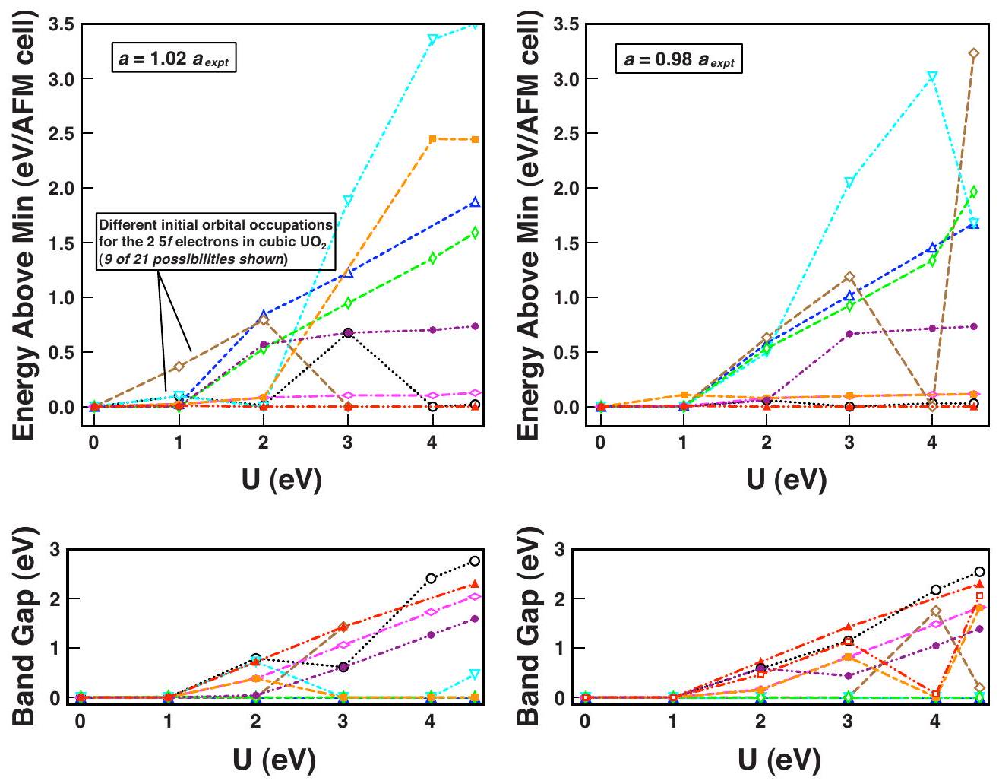
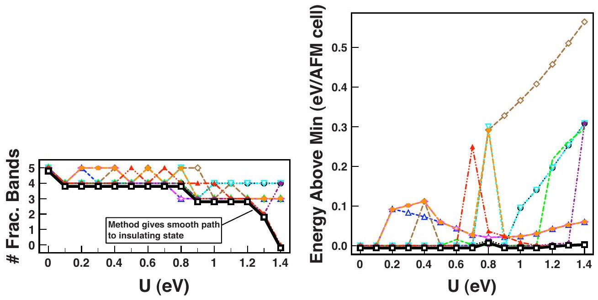
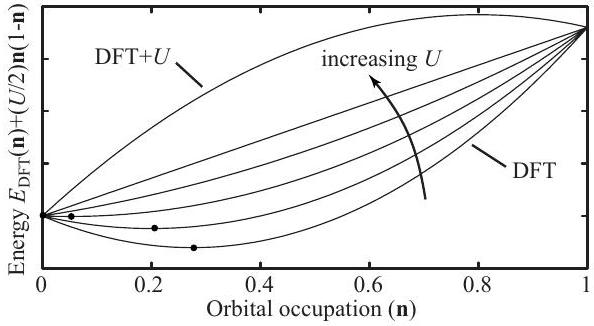
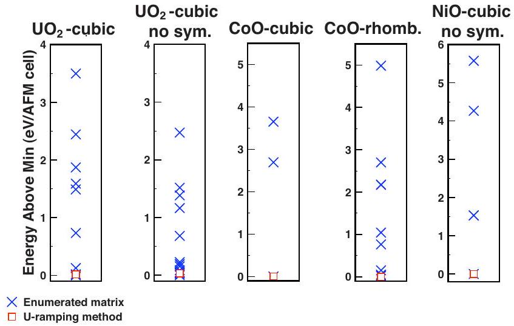
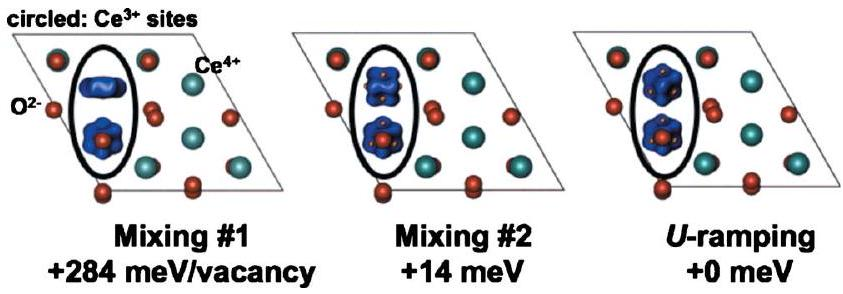

# Method for locating low-energy solutions within DFT $\boldsymbol{+} \boldsymbol{U}$ 

B. Meredig, A. Thompson, H. A. Hansen, and C. Wolverton* Department of Materials Science and Engineering, Northwestern University, Evanston, Illinois 60208, USA A. van de Walle Department of Materials Science, California Institute of Technology, Pasadena, California 91125, USA

(Received 15 August 2010; revised manuscript received 3 November 2010; published 22 November 2010)

#### Abstract

The widely employed DFT $+U$ formalism is known to give rise to many self-consistent yet energetically distinct solutions in correlated systems, which can be highly problematic for reliably predicting the thermodynamic and physical properties of such materials. Here we study this phenomenon in the bulk materials $\mathrm{UO}_{2}$, CoO , and NiO , and in a $\mathrm{CeO}_{2}$ surface. We show that the following factors affect which self-consistent solution a DFT $+U$ calculation reaches: (i) the magnitude of $U$; (ii) initial correlated orbital occupations; (iii) lattice geometry; (iv) whether lattice symmetry is enforced on the charge density; and (v) even electronic mixing parameters. These various solutions may differ in total energy by hundreds of meV per atom, so identifying or approximating the ground state is critical in the DFT $+U$ scheme. We propose an efficient $U$-ramping method for locating low-energy solutions, which we validate in a range of test cases. We also suggest that this method may be applicable to hybrid functional calculations.

DOI: 10.1103/PhysRevB.82.195128
PACS number(s): 71.15.Mb, 71.15.Dx, 71.20.Be, 71.27.+a

Since its introduction two decades ago, the densityfunctional theory $+U$ formalism (DFT $+U$ ) (Refs. 1 and 2) has achieved a wide array of successes in resolving shortcomings of conventional DFT. The inclusion of an onsite Hubbard-type $U$ term in the DFT Hamiltonian enables a more accurate treatment of correlated electron phenomena. For example, one classic failure of DFT is the prediction of a metallic band structure for the Mott-Hubbard insulators; the $U$ parameter of $\mathrm{DFT}+U$ addresses this failure by localizing the $d$ or $f$ electrons erroneously found to be itinerant within DFT. ${ }^{1}$ However, DFT $+U$ 's special treatment of these correlated $d$ or $f$ electrons means that the DFT $+U$ Hamiltonian is explicitly orbital-dependent. As a result, $\mathrm{DFT}+U$ calculations possess orbital degrees of freedom that are absent from conventional DFT. These orbital degrees of freedom manifest themselves in typical DFT $+U$ calculations as multiple self-consistent solutions corresponding to different occupations of the $m$ projections associated with the subshell $l$ to which the $U$ parameter is applied. These multiple solutions can vary in energy by several electron volts per formula unit but may not be easily distinguished from the ground state by inspection of predicted physical properties such as total energy and band gap. Thus, the seemingly subtle orbital physics inherent in the DFT $+U$ scheme can have enormous practical consequences for first-principles energetics calculations.

Some groups have carefully probed these important orbital effects; especially worthy of note is the work of Amadon, ${ }^{3-6}$ Koepernik ${ }^{7-9}$ (see, in particular, the illuminating discussion in Ref. 9), Ozoliņš, ${ }^{10}$ Pickett, ${ }^{11,12}$ and their respective co-workers. Other work has highlighted the great relevance of orbital physics to DFT $+U$ calculations of rareearth nitrides, ${ }^{13} \mathrm{Fe}_{3} \mathrm{O}_{4}$, ${ }^{14}$ and FeO . ${ }^{15,16}$ However, the great majority of $\mathrm{DFT}+U$ calculations in the literature are performed with no mention of correlated orbital occupations. As a result, we argue that such calculations may not have reached the ground state. In this paper, we first investigate the large energetic spread of multiple solutions in $\mathrm{DFT}+U$ in the bulk system $\mathrm{UO}_{2}$. The nature of these multiple solutions
is sensitive to the value of $U$, the lattice geometry, and whether or not lattice symmetry is enforced on the charge density. We then study how these solutions appear at low values of $U$, noting that the solutions arise as electrons begin to localize under the influence of $U$. Since widely used DFT codes such as VASP, ${ }^{17,18}$ PWSCF, ${ }^{19}$ and ABINIT (Ref. 20) do not employ any methods to rigorously locate the lowest energy $\mathrm{DFT}+U$ solution, we propose a heuristic $U$-ramping method for locating or approximating the ground state. While the works noted above generally rely on symmetry arguments and/or manual enumeration to investigate different orbital occupations, our method requires no symmetry analysis and is less costly than enumeration. We first validate our method in $\mathrm{UO}_{2}, \mathrm{CoO}$, and NiO in a variety of different symmetries. To emphasize the practical impact of our method, we then demonstrate that a typical "naive" calculation of a $\mathrm{CeO}_{2}$ (111) surface containing a vacancy can converge to a solution $+284 \mathrm{meV} /$ vacancy higher in energy than a calculation using our $U$-ramping scheme. An error of this magnitude could qualitatively invalidate predictions made from routine calculations.

We first demonstrate the energy scale and differences in physical properties of the multiple solutions inherent in $\mathrm{DFT}+U$, taking as an example antiferromagnetic (AFM) $\mathrm{UO}_{2}$ in the fluorite structure (a six atom cell). All bulk calculations in this work (except those for $\mathrm{CeO}_{2}$ ) were performed with the abinit code using Perdew-Burke-Ernzerhof (PBE) projector augmented wave potentials, a 700 eV kinetic-energy cutoff for the wave functions, and a $6 \times 6 \times 6 k$-point mesh. Following Dorado et al., ${ }^{6}$ we enumerate all $\binom{7}{2}=21$ ways of distributing the two U $5 f$ electrons into the seven available $f$ orbitals. We then use these 21 possibilities as initial correlated orbital occupation matrices for our $\mathrm{DFT}+U$ calculations of $\mathrm{UO}_{2}$. Some of these possibilities are degenerate by symmetry and others only slightly differ in energy from one another. For clarity, therefore, only nine representative results of the 21 are depicted in Fig. 1, where

FIG. 1. (Color online) The relative energies, as a function of $U$, of multiple solutions in DFT $+U$ for fluorite $\mathrm{UO}_{2}$. The curves represent different initial correlated orbital occupation matrices that were applied to the calculations. These curves are plotted at two different unit-cell volumes: (a) corresponds to $a=1.02 a_{\text {expt }}$ and (b) corresponds to $a=0.98 a_{\text {expt }}$. The band gaps for the multiple solutions at the larger and smaller volumes are given in (c) and (d), respectively.

we show the relative energies of these various solutions as a function of $U$. We include results at volumes both larger than the experimental value ( $a=1.02 a_{\text {expt }}$ ) and smaller ( $a =0.98 a_{\text {expt }}$ ), in order to span a realistic range of initial volumes for typical relaxation calculations. Band gaps of the solutions are also given.

Figures 1(a) and 1(b) demonstrate that, at a nominal $U =4.5 \mathrm{eV}$, total energies for the AFM cell can vary by up to 3.5 eV depending on the initial guess for the correlated orbital occupations. A particular initial guess may also hop between different final converged states depending on the value of $U$; beginning from the same initial guess at a variety of $U$ values may thus produce unexpected discontinuities in calculated properties as a function of $U$. Dorado et al. ${ }^{6}$ made this observation for unit-cell volume in $\mathrm{UO}_{2}$. Furthermore, while most of the high-energy solutions remain metallic even at $U=4.5 \mathrm{eV}$, one troublesome solution has a reasonable band gap of 1.6 eV in Fig. 1(c) but is more than 0.5 eV /cell higher in total energy than the ground state in Fig. 1(a). Such a solution could pass a"reality check" based on an examination of physical properties but would lead to highly erroneous energetic predictions.

Geometry considerations also affect the solution obtained from a particular calculation. Comparing the results at different volumes, we note that, at $U=4 \mathrm{eV}$, the ground-state solution at the smaller lattice parameter does not even converge to self-consistency within 150 electronic iterations at the larger lattice parameter. Likewise, across all values of $U$, the
relative energies of the different solutions are significantly rearranged depending on the volume used for the calculations. Thus, we conclude that, unless two calculations begin from the same initial geometry and the same initial occupation matrices, there is no guarantee that the two calculations will converge to the same final result. As we later show, even seemingly innocuous changes, such as adjusting electronic mixing parameters, can push DFT $+U$ calculations toward different self-consistent solutions.

We now turn our attention to the emergence of $\mathrm{DFT}+U$ 's multiple solutions as the $U$ parameter is gradually applied and describe a method to locate low-energy solutions. Figure 2(a) depicts the number of fractionally occupied bands in the same $\mathrm{UO}_{2}$ calculations as Fig. 1, for small values of $U$. Of course, zero fractionally occupied bands correspond to an insulating state, which is the motivation behind applying DFT $+U$ to Mott-Hubbard insulators. Figure 2(a) shows that, even at extremely small values of $U$ (in this case, around 0.2 eV ), solutions begin to depart from one another in their electronic localization behavior. As $U$ increases, the various initial guesses hop unpredictably between different degrees of localization. Evidently, the path to an insulating state is delicate and the energetic barriers that the $U$ parameter creates between different states can trap calculations in local energetic minima in electronic orbital configuration space.

The complex electronic configuration space created by the Hubbard $U$ term motivates the usefulness of our method for locating low-energy solutions. To understand how and why it

FIG. 2. (Color online) The behavior of our $U$-ramping method at small values of $U$ in fluorite $\mathrm{UO}_{2}$. (a) The number of fractionally occupied bands in calculations using the same enumerated occupation matrices as in Fig. 1, as compared to the iterative $U$-ramping scheme. (b) The relative energies of the calculations in (a); our method finds a low-energy solution at all $U$.

works, let us introduce some convenient notation. Let $\mathbf{n}$ denote the joint occupation matrix of all localized orbitals in the system and define the constrained ground-state energy $E_{\mathrm{DFT}}(\mathbf{n})$ obtained by minimizing the DFT energy over the set of all wave functions consistent with the occupation matrix n. [Here "DFT" could stand for any semilocal functional, such as a local-density approximation (LDA) or a generalized gradient approximation (GGA)].

Popular DFT functionals typically yield a well-behaved energy optimization problem with a unique global energy minimum (at least for a given spin configuration). This is an indication that the function $E_{\mathrm{DFT}}(\mathbf{n})$ tends to be convex (see Fig. 3, bottom curve). However, it is difficult to prove convexity formally. The Coulombic energy and the LDA exchange-correlation energy terms are indeed convex in the charge density but this is not clear for the kinetic energy term or the GGA exchange-correlation term.

Unfortunately, in a system exhibiting a strong electron localization, the global minimum of $E_{\mathrm{DFT}}(\mathbf{n})$ often exhibits an unphysical fractional orbital occupation. The "Hubbard $U$ " correction term penalizes fractional occupations to restore the actual ground state with integral orbital occupation. However, this correction term is concave and therefore typically causes the energy surface to become concave as well, yielding a multitude of local minima (see Fig. 3, top curve). Finding the global minimum, therefore, apparently involves a computationally intensive combinatorial search over all potential orbital occupations for each atom in the system. Our approach to avoid this problem is to adiabatically "turn on" the Hubbard $U$ correction term so that the incorrect fractional orbital occupations are allowed to gradually converge to the true integral orbital occupations (see Fig. 3).

This approach is generally successful because the correction targets the incorrect curvature of the energy surface as a function of orbital occupation while leaving the energy of integral occupation states essentially unchanged. Hence, at some intermediate value of the $U$ parameter, the energy surface is close to linear and a global minima can easily be found. The same correct minima then persists as the $U$ parameter reaches its full correct value.

While we were not able to find any case where our method failed to find a very low-energy solution, there is no mathematical guarantee that our method will always work, because all convex portions of the energy surface may not become concave at the exact same value of $U$. In fact, if the method always worked, we would have accidentally found a polynomial solution to a well known and unresolved nondeterministic polynomial-time (NP) hard problem, ${ }^{21}$ an unlikely possibility.

In practice, we begin at $U=0$ with a diagonal occupation matrix and ramp $U$ by 0.1 eV at a time, iteratively applying the occupation matrix from the previous calculation to the next value of $U$. Intuitively speaking, this method is intended to guide the calculation to a deep total-energy well as $U$ gradually reshapes electronic configuration space. The method produces the bold curve in Fig. 2(a) and gives a

FIG. 3. Schematic illustration of the principle underlying the proposed method. For simplicity, the horizontal axis denotes the occupation of a single localized orbital (out of the numerous localized orbitals present in the system). As the Hubbard $U$ parameter is gradually turned on, the energy surface (as a function of orbital occupation) goes from being convex (bottom curve, corresponding to conventional DFT) to being concave (top curve, corresponding to $\mathrm{DFT}+U)$. For small values of $U$, the $\mathrm{DFT}+U$ global energy minimum is easy to find and gradually converges to the true DFT $+U$ global energy minimum (filled circles) as $U$ increases to its full correct value. The concavity of the $\mathrm{DFT}+U$ curve (at the nominal value of $U)$ would have otherwise necessitated a combinatorial search among the possible local minima (the true energy surface is a high-dimensional object with considerably more local minima).

FIG. 4. (Color online) Results of our $U$-ramping scheme, as compared to manual enumeration of possible correlated orbital occupation matrices, for a variety of test cases using nominal values of $U$ and $J$ from the literature: (a) fluorite $\mathrm{AFM} \mathrm{UO}_{2}$; (b) fluorite AFM $\mathrm{UO}_{2}$ with symmetry disabled; (c) rocksalt AFM CoO; (d) rhombohedrally distorted CoO ; and (e) rocksalt AFM NiO with symmetry disabled.

smooth path to an insulating state, without the hopping that a static initial guess produces. The energetics of these calculations are shown in Fig. 2(b), where we observe that our method converges to a low-energy solution (although not always the ground state) across all studied values of $U$.

While our method appears successful for small values of $U$ (Fig. 2), our objective is to propose a means for obtaining a low-energy solution in any DFT $+U$ calculation at nominal higher values of $U$. We now validate our method for typical $\mathrm{DFT}+U$ calculations in five distinct test cases: (1) fluorite $\mathrm{AFM} \mathrm{UO}_{2}\left[U=4.5 \mathrm{eV}, J=0.51 \mathrm{eV},{ }^{6}\right.$ and $a=5.47 \AA$ (Ref. 22)], (2) fluorite $\mathrm{AFM} \mathrm{UO}_{2}$ with symmetry disabled in the calculation, (3) rocksalt AFM CoO [ $U=7.1 \mathrm{eV}, J =1.0 \mathrm{eV},{ }^{23}$ and $a=4.27 \AA$ (Ref. 22)], (4) slightly rhombohedrally distorted AFM CoO (using the cubic value of $a$ ), and (5) rocksalt AFM NiO with symmetry disabled $[U =8.0 \mathrm{eV}, J=0.95 \mathrm{eV},{ }^{1}$ and $a=4.17 \AA$ (Ref. 22)]. We repeat that the method consists of ramping $U$ by a small increment ( 0.1 eV in these cases) and iteratively applying previous occupation matrices (or, in DFT codes that do not supply such functionality, simply the previous wave functions and charge density) until all bands are integrally occupied, then proceeding to the nominal higher value of $U$ using the first obtained insulating occupation matrix. For NiO, which is already a small-gap insulator in GGA, we need only calculate $U=0$ and $U=8.0 \mathrm{eV}$. A comparison of our method to the combinatorial enumeration of occupation matrices, ${ }^{24}$ discussed above, is shown in Fig. 4.

Figure 4 demonstrates that our method provides excellent results both for $f$ and $d$ systems, at a variety of lattice geometries and symmetry constraints. We point out that, as expected, lower symmetry calculations have a higher number of permitted orbital occupation states, and hence more energetically distinct solutions. In the case of nonsymmetrized fluorite $\mathrm{UO}_{2}$ [Fig. 4(b)], the $U$-ramping scheme gives a solution only about $5 \mathrm{meV} /$ atom above the lowest energy enumeration solution. This +5 meV /atom result is the highest energy solution located by our method relative to enumera-
tion. However, in rhombohedrally distorted CoO [Fig. 4(d)], the method finds a solution 5 meV /atom below the best enumerated matrix result. In our simple enumeration, we considered only the diagonal elements of the occupation matrix. A more exhaustive enumeration would need to include the offdiagonal matrix elements, which dramatically increases the computational cost of the enumeration and thus illustrates the relative attractiveness of our approach.

We now comment in more detail on our method's efficiency, especially as compared to enumeration of occupation matrices. Our $U$-ramping method requires typically $2-15 \mathrm{DFT}+U$ calculations, depending upon the $U$ increment chosen and the value of $U$ at which an insulating state is reached, although the wave functions and charge densities may be reused during ramping to accelerate progress. One might argue that the combinatorial enumeration scheme is similarly costly but it has two major caveats: first, the occupation matrices may only be enumerated in codes such as ABINIT that offer this functionality. Second, and most importantly, in our combinatorial search we only considered the diagonal elements of the occupation matrix, which failed to find the lowest energy solution for rhombohedrally distorted CoO . When Dorado et al. ${ }^{6}$ performed a more extensive search of electronic configuration space and included offdiagonal matrix elements, they performed over $60 \mathrm{DFT}+U$ calculations in all. Thus while our method is obviously more expensive than a single $\mathrm{DFT}+U$ calculation, we assert that the insurance it provides against reaching a high-energy metastable solution justifies its cost and that its cost is in fact much lower than that of exhaustive enumeration. Our approach avoids a combinatorial search whose complexity increases exponentially with the number of localized orbitals under consideration.

To emphasize the significant impact $\mathrm{DFT}+U$ 's multiple solutions may be having on routine calculations, we now consider a thin oxygen vacancy-containing $\mathrm{CeO}_{2}$ (111) slab consisting of 23 atoms using the popular VASP code. The O vacancy leaves behind two electrons and in general one would like to know where and how these electrons localize. The first question involves enumeration and total-energy calculations of possible combinations of $\mathrm{Ce}^{3+}$ sites, ${ }^{25}$ which we do not present here. The second question is of great relevance to the present work: the two electrons have orbital degrees of freedom when they localize. The different orbitals they may occupy will have very different energies, as we now show, yet most $\mathrm{DFT}+U$ calculations in the literature make no mention of explicitly searching electron orbital configuration space in such situations.

We compare three surface calculation results in Fig. 5, each of which has a visibly distinct orbital configuration. The first two calculations were performed without any attention to $f$ orbital occupations but employed different electronic mixing parameters. Strikingly, we see that such a change in input parameters, which should ordinarily not affect the results of calculations, may actually substantially affect the $\mathrm{DFT}+U$ total energy since calculations can converge to one of many orbital-dependent solutions inherent in the DFT $+U$ approach. The third calculation is the result of our $U$-ramping method, for which we increased $U_{e f f}=U-J$ by 0.5 eV from 0 to 4.5 eV , ${ }^{25}$ and it exhibits a different orbital

FIG. 5. (Color online) DFT $+U$ solutions for a $\mathrm{CeO}_{2}$ (111) surface containing an O vacancy, obtained by two choices of electronic mixing parameters and by our $U$-ramping method. The difference between spin-up and spin-down charge densities is shown for the two present $\mathrm{Ce}^{3+}$ ions. Internal degrees of freedom were relaxed.

polarization and a lower energy than either "standard" DFT $+U$ calculation. Based on these findings, we conclude that exploration of electron orbital configuration space is essential in the DFT $+U$ framework in order to avoid high-energy metastable solutions. Our $\mathrm{CeO}_{2}$ surface result calls into question any $\mathrm{DFT}+U$ calculation performed without consideration of orbital occupations.

In this work, we showed that the multiple orbitaldependent solutions present in $\mathrm{DFT}+U$ can vary drastically in energy while their other physical properties may or may not be clearly distinguishable. Which of the multiple solutions a particular calculation reaches is a sensitive function
of the $U$ parameter, initial orbital occupations, lattice geometry, enforced symmetry, and even electronic mixing values. Lower symmetry calculations tend to have more permitted solutions. We introduced a simple $U$-ramping method intended to negotiate the complex electronic configuration space of DFT $+U$ by slowly increasing $U$ and iteratively reapplying the occupation matrices of previous calculations. This scheme achieved success in finding low-energy solutions in $d$ and $f$ electron systems under a wide variety of conditions. Finally, we suggest that our ramping method may also be suitable for hybrid functional calculations, in which the adjustable degree of Fock exchange takes the place of the $U$ parameter.

The authors gratefully acknowledge funding provided by the Sunshine to Petrol Grand Challenge at Sandia National Laboratories; the Department of Energy under NERI-C Grant No. DE-FG07-07ID14893; and the NSF under Grant No. DMR-0907669. This invention was made with Government support under and awarded by DoD, Army Research Office, 32 CFR 168a. Some of the calculations in this work were performed on the Quest high-performance computing cluster at Northwestern University. Teragrid resources provided by NCSA under Grant No. DMR050013N. The authors wish to thank M. Asta, V. Ozolinšš, and F. Zhou for helpful discussions and feedback on this manuscript.

[^0]${ }^{13}$ P. Larson, W. R. L. Lambrecht, A. Chantis, and M. van Schilfgaarde, Phys. Rev. B 75, 045114 (2007).
${ }^{14}$ H. Pinto and S. Elliott, J. Phys.: Condens. Matter 18, 10427 (2006).
${ }^{15}$ S. Gramsch, R. Cohen, and S. Savrasov, Am. Mineral. 88, 257 (2003).
${ }^{16}$ M. Cococcioni and S. de Gironcoli, Phys. Rev. B 71, 035105 (2005).
${ }^{17}$ G. Kresse and J. Hafner, Phys. Rev. B 47, 558 (1993).
${ }^{18}$ G. Kresse and J. Furthmüller, Phys. Rev. B 54, 11169 (1996).
${ }^{19}$ P. Giannozzi et al., J. Phys.: Condens. Matter 21, 395502 (2009).
${ }^{20}$ X. Gonze et al., Comput. Mater. Sci. 25, 478 (2002).
${ }^{21}$ P. M. Pardalos and S. A. Vavasis, J. Global Optim. 1, 15 (1991).
${ }^{22}$ A. Kelly, G. Groves, and P. Kidd, Crystallography and Crystal Defects (Wiley, New York, 2000).
${ }^{23}$ U. D. Wdowik and K. Parlinski, Phys. Rev. B 75, 104306 (2007).
${ }^{24}$ In the cases of the transition-metal oxides, we did not assume $a$ priori a +2 charge state on the cations for the purposes of enumeration.
${ }^{25}$ M. V. Ganduglia-Pirovano, J. L. F. Da Silva, and J. Sauer, Phys. Rev. Lett. 102, 026101 (2009).

[^0]:    *c-wolverton@northwestern.edu
    ${ }^{1}$ V. I. Anisimov, J. Zaanen, and O. K. Andersen, Phys. Rev. B 44, 943 (1991).
    ${ }^{2}$ A. I. Liechtenstein, V. I. Anisimov, and J. Zaanen, Phys. Rev. B 52, R5467 (1995).
    ${ }^{3}$ B. Amadon, F. Jollet, and M. Torrent, Phys. Rev. B 77, 155104 (2008).
    ${ }^{4}$ G. Jomard, B. Amadon, F. Bottin, and M. Torrent, Phys. Rev. B 78, 075125 (2008).
    ${ }^{5}$ F. Jollet, G. Jomard, B. Amadon, J. P. Crocombette, and D. Torumba, Phys. Rev. B 80, 235109 (2009).
    ${ }^{6}$ B. Dorado, B. Amadon, M. Freyss, and M. Bertolus, Phys. Rev. B 79, 235125 (2009).
    ${ }^{7}$ D. Kasinathan, K. Koepernik, U. Nitzsche, and H. Rosner, Phys. Rev. Lett. 99, 247210 (2007).
    ${ }^{8}$ W. Zhang, K. Koepernik, M. Richter, and H. Eschrig, Phys. Rev. B 79, 155123 (2009).
    ${ }^{9}$ E. R. Ylvisaker, W. E. Pickett, and K. Koepernik, Phys. Rev. B 79, 035103 (2009).
    ${ }^{10}$ F. Zhou and V. Ozoliņš, Phys. Rev. B 80, 125127 (2009).
    ${ }^{11}$ A. Shick, W. Pickett, and A. Liechtenstein, J. Electron Spectrosc. Relat. Phenom. 114-116, 753 (2001).
    ${ }^{12}$ A. B. Shick, V. Janiš, V. Drchal, and W. E. Pickett, Phys. Rev. B 70, 134506 (2004).

