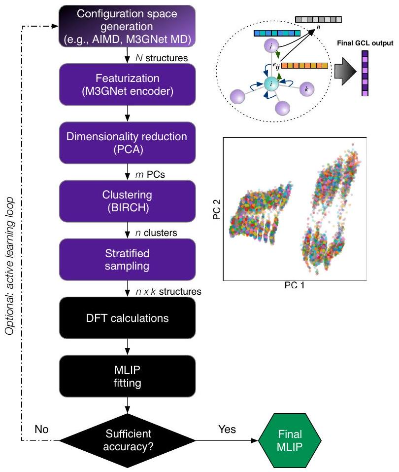
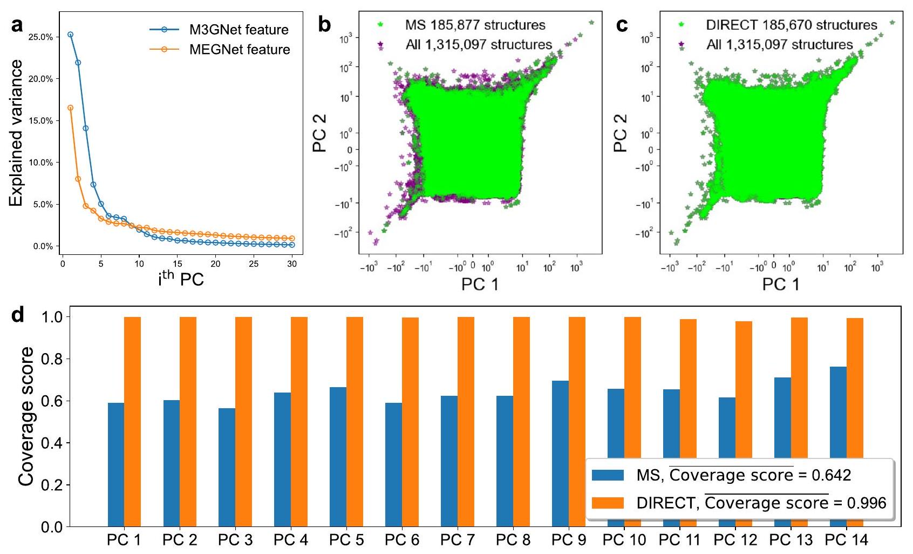
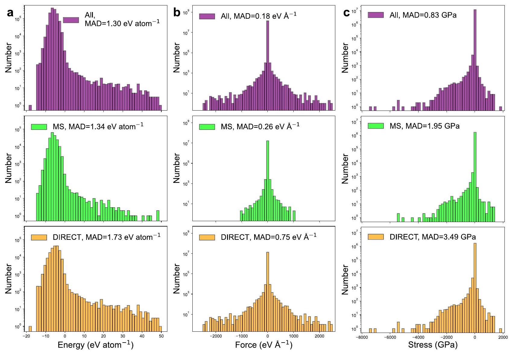
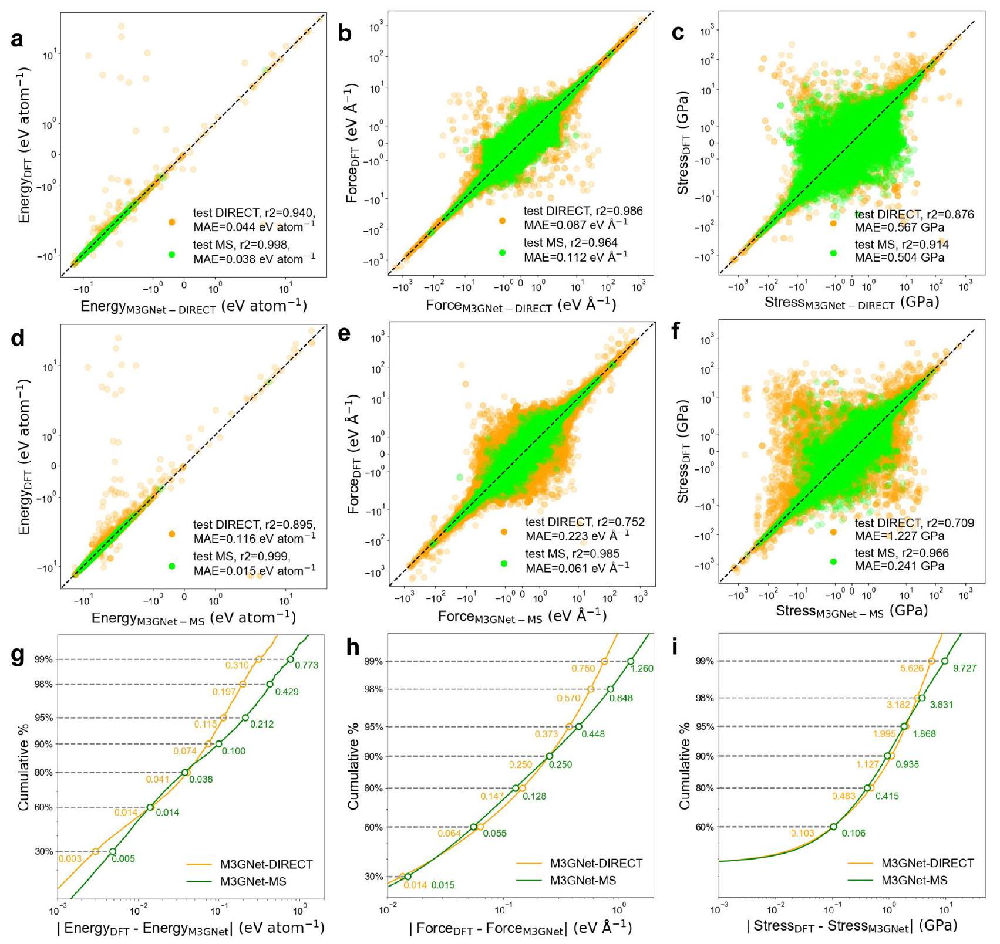
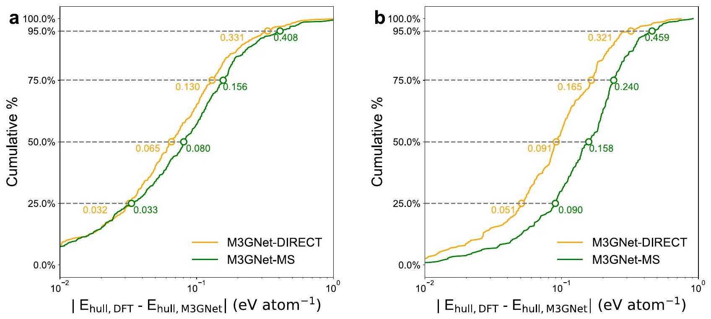
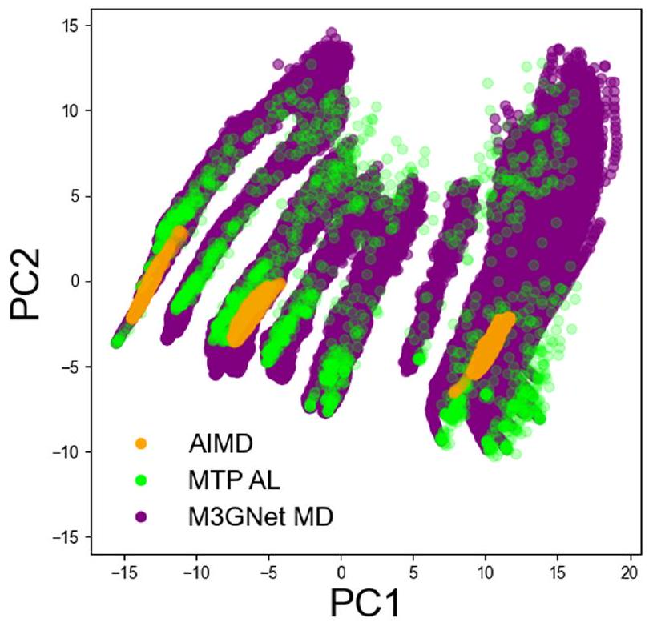
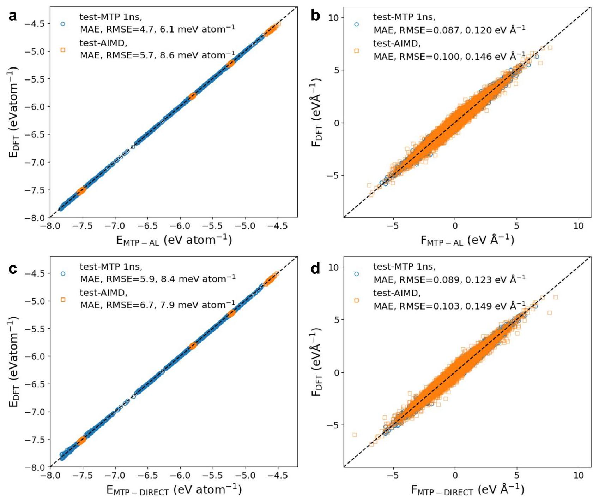
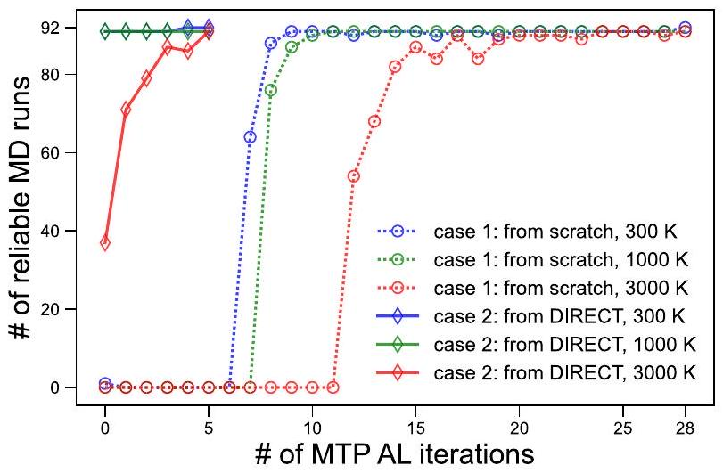
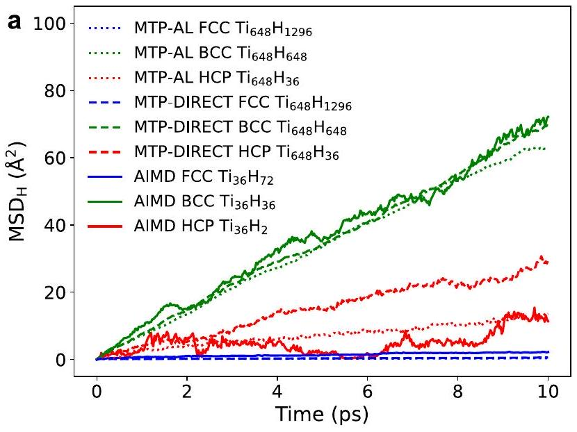
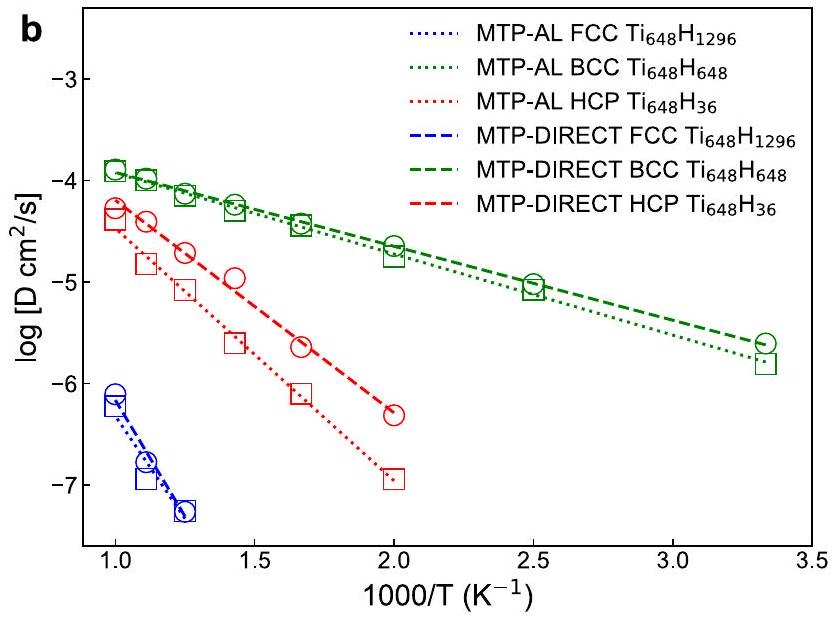

# Robust training of machine learning interatomic potentials with dimensionality reduction and stratified sampling 

#### Abstract

Machine learning interatomic potentials (MLIPs) enable accurate simulations of materials at scales beyond that accessible by ab initio methods and play an increasingly important role in the study and design of materials. However, MLIPs are only as accurate and robust as the data on which they are trained. Here, we present DImensionality-Reduced Encoded Clusters with sTratified (DIRECT) sampling as an approach to select a robust training set of structures from a large and complex configuration space. By applying DIRECT sampling on the Materials Project relaxation trajectories dataset with over one million structures and 89 elements, we develop an improved materials 3-body graph network (M3GNet) universal potential that extrapolates more reliably to unseen structures. We further show that molecular dynamics (MD) simulations with the M3GNet universal potential can be used instead of expensive ab initio MD to rapidly create a large configuration space for target systems. We combined this scheme with DIRECT sampling to develop a reliable moment tensor potential for titanium hydrides without the need for iterative augmentation of training structures. This work paves the way for robust high-throughput development of MLIPs across any compositional complexity.

Machine learning interatomic potentials (MLIPs) have become an indispensable staple in the computational materials toolkit. MLIPs parameterize the potential energy surface (PES) of an atomic system as a function of local environment descriptors using ML techniques ${ }^{1-10}$. While MLIPs generally exhibit much better accuracies in energies and forces compared to traditional IPs ${ }^{11,12}$, their key advantage is that they can be systematically fitted and improved in a semiautomated fashion for diverse structural and chemical spaces. By enabling accurate simulations over length and time scales that are much larger than those accessible by ab initio methods, MLIPs have deepened the understanding of a wide range of physicochemical processes. These include lithium diffusion in lithium superionic conductors and their interfaces ${ }^{13-17}$, dislocation behavior and ordering in multiple principal element alloys ${ }^{18,19}$, liquid-amorphous and amorphous-amorphous transitions in silicon ${ }^{20}$, and reaction mechanisms of molecule-molecule and moleculesurface scattering ${ }^{21,22}$, to name a few ${ }^{12}$.

An exciting recent innovation in MLIPs is graph deep learning architectures $^{6-8,10}$. Graph deep learning models encode the elemental character of each atom using features with a fixed dimensionality, avoiding the combinatorial explosion in model complexity associated with the number of
elements in typical MLIPs. Of particular relevance to this work is the Materials 3-body Graph Network (M3GNet) architecture, which combines many-body features of traditional IPs with those of flexible material graph representations. By training on the massive database of structural relaxations in the Materials Project, Chen et al. ${ }^{6}$ have developed a M3GNet universal potential (M3GNet-UP) for 89 elements of the periodic table and demonstrated its application in predicting structural and dynamical properties for diverse materials.

The critical challenge in developing a robust MLIP is generating a training dataset that can provide a good coverage of the structural/chemical space of the materials of interest (henceforth, referred to as the 'configuration space'). Typically, the configuration space is generated through domain expertise, comprising ground-state structures, relaxation trajectory snapshots, strained structures, ab initio molecular dynamics (AIMD) structures, defect structures, etc. Ab initio calculations such as those based on density functional theory (DFT) are then performed on structures sampled from the configuration space to obtain accurate energies and forces as training data for MLIPs.

[^0]To ensure sufficient coverage of the configuration space, state-of-theart training protocols often incorporate some form of active learning $(\mathrm{AL})^{23-28}$. In this way, an MLIP is used to simulate the materials of interest, and generated structures that require extrapolation are added to refit the MLIP in an iterative fashion. The key advancement in AL is the efficient evaluation of the uncertainty of the MLIP on new structures without referring to the DFT PES, which greatly expands the search space and minimizes the cost of training structure augmentation. While AL has been undeniably effective in the construction of robust MLIPs, it can be inefficient for highly complex configuration spaces. For instance, a recent work by the authors to fit a moment tensor potential for the 7-element $\left(\mathrm{Li}_{7 / 18} \mathrm{Sr}_{17 / 36}\right) \left(\mathrm{Ta}_{1 / 3} \mathrm{Nb}_{1 / 3} \mathrm{Zr}_{2 / 9} \mathrm{Sn}_{1 / 9}\right) \mathrm{O}_{3}$ complex concentrated perovskite required over 100 AL iterations ${ }^{16}$. To sample rare configurations more efficiently, the latest AL strategies, e.g., hyperactive learning ${ }^{29}$ and uncertainty driven dynamics ${ }^{30}$, bias the MD simulations to ensure that structures in low- and high-energy regions are both sufficiently sampled, reducing the number of AL iterations.

An ideal strategy should enable efficient generation and sampling of the configuration space prior to any DFT computations. One proposed approach is to bias MD simulations to sample ordered and disordered structures as an entropy maximization (EM) strategy ${ }^{31,32}$ to sample a diverse feature space. For example, Montes de Oca Zapiain et al. ${ }^{32}$ showed that an MLIP for tungsten trained with an EM set has much more consistent accuracies in energies for structures present in both the EM set and the domain expertise (DE) training set, while the MLIP trained with the DE set performs significantly worse for the EM set than for the DE set. Another recently proposed high-throughput scheme generated four training sets for $\mathrm{Mg}, \mathrm{Si}, \mathrm{W}$, and Al by applying normally distributed random atom displacements together with isotropic and anisotropic lattice scaling to the respective non-diagonal supercells ${ }^{33,34}$. The fitted MLIPs can accurately reproduce the force constant matrix of those crystalline systems.

In this work, we present a DImensionality-Reduced Encoded Clusters with sTratified (DIRECT) sampling strategy to generate robust training data for MLIPs for any chemical systems. We will first demonstrate the effectiveness of DIRECT sampling of 1.3 million structures in the Materials Project structural relaxation dataset ${ }^{6,35,36}$ to fit an improved M3GNet universal potential (UP). Next, we will demonstrate how the M3GNet UP can be used to efficiently generate configuration spaces for DIRECT sampling using the Ti-H model system, which is known to be highly challenging for reliable MD simulations. This work paves the way towards robust highthroughput development of MLIPs across any compositional complexity.

## Results   DIRECT workflow

Figure 1 provides a workflow of the proposed DImensionality-Reduced Encoded Clusters with sTratified (DIRECT) sampling approach, which comprises five main steps:

Step 1: Configuration space generation. A comprehensive configuration space of $N$ structures for the system of interest is generated. This can be performed using commonly employed approaches, such as sampling of trajectories from AIMD simulations and generating structures by applying random atom displacements and lattice strains, or alternatively, by sampling MD trajectories with universal MLIPs, such as M3GNet as demonstrated in later sections.

Step 2: Featurization/encoding. Next, the configuration space is featurized into fixed length vectors for each structure. While there are many well-established descriptors used in MLIPs, most describe only the local atomic environments and do not efficiently handle arbitrary chemical complexity. Taking inspiration from the AtomSets framework ${ }^{37}$, we propose to use the concatenated output of the final graph convolutional layer (GCL) from pre-trained graph deep learning formation energy models that cover diverse chemistries. The rationale for this choice is that the final output layer of such models already encodes a fixed-length structure/chemistry representation for predicting energy. Furthermore, the formation energy is one of the most readily available large datasets in materials databases such as the Materials Project. In this work, we will use the 128 -element vector outputs
from the M3GNet model trained on the formation energies of materials in Materials Project ${ }^{6}$, though similar results are obtained with the 96-element vector outputs from the MEGNet formation energy model ${ }^{37,38}$.

Step 3: Dimensionality reduction. A further dimensionality reduction step is carried out. Here, we apply principal component analysis (PCA) on the normalized fixed-length features from the encoding step. Following Kaiser's rule, the first $m$ PCs with eigenvalues over 1, i.e., explaining more variance than any single variable, are kept to represent the feature space. For ease of visualization, we have plotted only the first two PCs in Fig. 1, even though more than two PCs are usually used in this work.

Step 4: Clustering. Next, clustering is carried out to group structures with shared characteristics. In this work, the balanced iterative reducing and clustering using hierarchies (BIRCH) algorithm ${ }^{39}$, a highly efficient centroid-based clustering method, is used to divide all features into clusters based on their locations in the $m$-D feature space. PCs are weighted by their respective explained variance before clustering. The choice of the number of clusters $(1 \leq n \leq N)$ can be determined based on the desired accuracy and computational budget. Figure 1 shows the clustering of $50,050 \mathrm{Ti}-\mathrm{H}$ M3GNet MD snapshots into 3000 clusters.

Step 5: Stratified sampling. Finally, stratified sampling of $k$ structures from each cluster is then performed to construct a robust training set. If $k=1$, the features with the shortest Euclidean distance to the centroid of each cluster will be selected. If $k$ is greater than 1 , features in each cluster will be sorted according to their Euclidean distances to the respective centroid, and then $k$ features will be selected at constant index intervals. When $k$ is greater than the size of certain clusters, all data in those clusters will be selected, and the user can choose whether or not to allow duplicate selection. Similarly, the choice of $k$ depends on the desired coverage and computational budget.

The remaining steps are similar to standard MLIP development procedures in the literature. Static DFT calculations are performed on the $M \leq n \times k$ structures from the DIRECT sampling procedure. While the

Fig. 1 | Workflow of DImensionality-Reduced Encoded Clusters with sTratified (DIRECT) sampling. The standard steps in MLIP development are in black boxes, while the key conceptual improvements proposed in this work are highlighted in purple boxes. The methods in the brackets are those used in the present work, though they can be substituted with other similar approaches.

Fig. 2 | Comparison of DIRECT versus manual sampling (MS). a Explained variance of the first 30 principal components of the encoded features using the M3GNet and MEGNet formation energy models. Visualization of the coverage of
the first two PCs of the M3GNet-encoded structure features by $\mathbf{b}$ MS and $\mathbf{c}$ DIRECT sets. d Feature coverage scores for the first 14 PCs of the M3GNet-encoded structure features by the MS set and DIRECT set.

DIRECT sampling approach can be integrated into an active learning loop, it is designed to obtain comprehensive coverage of the configuration space of interest prior to DFT calculations and minimize/eliminate the need for active learning iterations. It should also be noted that most of the steps in the conceptual DIRECT sampling workflow can be replaced by alternative methods, e.g., the choice of the structure featurizer, the dimensionality reduction technique, and the clustering algorithm.

## Generating a more diverse Materials Project training set

We will first demonstrate the utility of the DIRECT sampling approach using one of the largest datasets that have been used in MLIP fitting - the MPF.2021.2.8.All dataset. The MPF.2021.2.8.All dataset includes all ionic steps from both the first and second relaxation calculations in Materials Project ${ }^{36}$ (see Methods section for details).

Figure 2 compares the coverage of feature space by manual sampling (MS) and DIRECT sampling approaches on the MPF.2021.2.8.All dataset. The MS set, which contains 185,877 structures, is constructed following the approach outlined by Chen et al. ${ }^{6}$, which selects the first and middle ionic steps of the first relaxation and the last step of the second relaxation. Using DIRECT sampling with $n=20,044$ and $k=20$, i.e., sampling at most 20 structures from each of the 20,044 clusters, a dataset of 185,670 structures is constructed, approximately the same size as the MS set.

Figure 2a compares the explained variance vs the PCs of the encoded features using the M3GNet and MEGNet formation energy models. It can be seen that the M3GNet-encoded features are significantly more efficient, with a cumulative explained variance of $49 \%$ and $93 \%$ for the first 2 and 14 PCs, respectively. In contrast, the cumulative explained variance for the first 2 and 14 PCs for the MEGNet-encoded features are $25 \%$ and $57 \%$, respectively. This indicates that the incorporation of the 3-body interactions in M3GNet leads to a more robust encoding of the diverse structures and chemistries in the MPF.2021.2.8.All dataset. From the plots of the first two PCs of the M3GNet-encoded features of the MS set (Figure 2b) and

DIRECT set (Figure 2c), it can be clearly observed that the MS set undersamples structures located at the boundaries of the feature space, while the DIRECT set provides more comprehensive coverage. The coverage score for the first 14 PCs was calculated as $\sum_{i=1}^{n_{b}} c_{i} / n_{b}$, where the entire range of values for each PC is divided into $n_{b}$ bins, and $c_{i}$ equals 1 if data in the $i^{\text {th }}$ bin is successfully sampled, and 0 otherwise. The coverage score of the entire MPF.2021.2.8.All set is 1 by definition. Using $n_{b}=50,000$, we find that the coverage scores of the DIRECT set across the first 14 PCs are all close to 1 , with an average of 0.996 , while the coverage scores of the MS set are all below 0.8 with an average of 0.642 . Similar trends are observed for the 128-element M3GNet feature space (see Supplementary Fig. 1).

Figure 3 compares the distribution of the energies, forces, and stresses in the MS set and DIRECT set relative to the entire MPF.2021.2.8.All ('All') dataset. Despite having a comparable total number of structures, the DIRECT set provides a better coverage of the entire configuration space, with a much larger MAD in energies, forces, and stresses compared to the MS set. This can be attributed to the better sampling of uncommon local environments in feature space by DIRECT sampling compared to MS. It is worth noting that this MS scheme is designed with domain expertise and outperforms random sampling (RS) for coverage of both structure features and PES properties (see Supplementary Fig. 2).

## Training a more reliable M3GNet universal potential

Figure 4 compares the performance of the M3GNet UPs trained on the DIRECT and MS sets (referred to as M3GNet-DIRECT and M3GNet-MS, respectively) relative to the ground truth DFT. The training protocols are largely similar to the ones used in the original M3GNet UP, with minor modifications as outlined in the Methods section. Two test sets were constructed from a random sample of $5 \%$ of the DIRECT set and MS set, excluding any structures showed up in the training and validation processes of both M3GNet-DIRECT and M3GNet-MS. These two test sets are labeled

Fig. 3 | Coverage of PES data by different sampling methods. Distribution of $\mathbf{a}$ energies, $\mathbf{b}$ forces and $\mathbf{c}$ stresses in MPF.2021.2.8.All (referred as 'All'), MS set, and DIRECT set are colored purple, green, and orange, respectively. Mean absolute deviation (MAD) of each data set is annotated.

as 'test DIRECT' and 'test MS', containing 7635 and 7684 structures, respectively.

As expected, both M3GNet UPs provide the best performance on their respective datasets, i.e., the M3GNet-DIRECT outperforms M3GNet-MS on the DIRECT test set, while the reverse is true on the MS test set (Figure 4a-f). However, the M3GNet-MS UP performs significantly worse on the DIRECT test set than on the MS test set, with MAEs in energies and forces that are about an order of magnitude larger than those for the MS test set. In contrast, the M3GNetDIRECT UP has comparable MAEs across both the DIRECT and MS test sets. It should be stressed that the DIRECT test set is the more challenging of the two, with a greater number of data points with large energies, forces, and stresses as well as large MADs. The average MAEs in energies, forces, and stresses of the M3GNet-DIRECT UP across both the DIRECT and MS test sets $\left(0.041 \mathrm{eV}\right.$ atom ${ }^{-1}, 0.101 \mathrm{eV} \AA^{-1}$, and 0.54 GPa , respectively) are only slightly higher than the test errors reported for the original M3GNet UP ( 0.035 eV atom ${ }^{-1}$, $0.072 \mathrm{eV} \AA^{-1}$, and 0.41 GPa , respectively ${ }^{6}$. Figure $4 \mathrm{~g}-\mathrm{i}$ shows the cumulative error distribution for the M3GNet UPs on the combined data in 'test DIRECT' and 'test MS'. While M3GNet-MS and M3GNet-DIRECT have relatively similar errors for $\sim 90 \%$ of the test structures, M3GNet-DIRECT significantly outperforms M3GNetMS (lower energy, force and stress errors) for the remaining $\sim 10 \%$ of test structures that are most challenging. Therefore, M3GNetDIRECT exhibits less overfitting and is more reliable across a larger portion of the PES compared to M3GNet-MS, which is tuned towards accurate simulation of common configurations. These results also illustrate the limitations of using simple held-out test sets to compare the performance of ML models.

To better assess the performance of the M3GNet UPs, we have calculated the energies above hull ( $E_{\text {hull }}$ ) for a dataset of 506 O-containing compounds and 291 S-containing hypothetical materials unseen by both M3GNet UPs. This dataset was randomly selected from the $\sim 30$ million hypothetical materials generated by Chen et al. ${ }^{6}$ (see Methods for details).

From Fig. 5, the M3GNet-DIRECT UP provides an improved prediction of $E_{\text {hull }}$ for hypothetical materials compared to the M3GNet-MS UP. While the performance improvement is relatively small for the O-containing compounds, a significant reduction in error is observed for the S-containing compounds. For instance, the error in $E_{\text {hull }}$ by M3GNetDIRECT and M3GNet-MS is less than 0.091 and 0.158 eV atom ${ }^{-1}$, respectively for $50 \%$ of the S-containing hypothetical materials. The distribution of errors for the M3GNet-DIRECT is comparable between the O -containing and S-containing hypothetical materials. In contrast, the M3GNet-MS UP performs much worse for the S-containing materials relative to the O -containing materials. These observations can be attributed to the fact that the original Materials Project dataset contains a preponderance of O-containing materials $(34,556)$ and significantly fewer S-containing materials (5333) among the 62,783 compounds.

## Developing an accurate MLIP for titanium hydrides

As illustrated in Fig. 1, the two most computationally intensive steps in the development of MLIPs are the generation of the configuration space and DFT calculations of energies and forces. Often-used strategies to sample configuration space include highly expensive AIMD simulations and iterative efforts in active learning (AL) workflows. The advent of UPs such as M3GNet can provide the means to bypass ab initio methods and minimize or even eliminate AL iterations for the generation of a diverse configuration space.

Fig. 4 | Performance of M3GNet universal potentials (UPs) trained using the DIRECT and MS training sets. Parity plots for $\mathbf{a}$ energies, $\mathbf{b}$ forces, and $\mathbf{c}$ stresses for the M3GNet UP trained on the DIRECT set. The equivalent plots for the M3GNet

UP trained on the MS set are shown in plots ( $\mathbf{d}-\mathbf{f}$ ). The cumulative errors of $\mathbf{g}$ energies, $\mathbf{h}$ forces, and $\mathbf{i}$ stresses in the two test sets by the two UPs are also plotted.

In this section, we demonstrate the capability of the DIRECT sampling approach combined with the M3GNet UP to construct reliable MLIPs. Here we have chosen the moment tensor potential (MTP) to study titanium hydrides $\left(\mathrm{TiH}_{n}\right)$. Titanium and its alloys are attractive for a wide variety of functional applications due to their excellent mechanical properties and corrosion resistance ${ }^{40}$. However, if exposed to hydrogen sources, these alloys are susceptible to hydride formation in the form of $\mathrm{TiH}_{n}$, leading to crack initiation and potential mechanical failure ${ }^{41}$. The kinetics of the hydriding process depends on several factors, including the rates of hydrogen transport, motivating us to develop MLIPs for predicting hydrogen diffusion in $\mathrm{TiH}_{n}$. Hydrogen is well-known to be highly diffusive in these systems, even at ambient temperatures, and a relatively short time step, e.g., $\sim 0.5 \mathrm{fs}$, is required for stable MD simulations. Therefore, this system provides a robust test for our proposed workflow. Moreover, we note that these descriptor-based MLIPs are more computationally efficient for studies of simpler chemistries due to their lower model complexity.

To generate a comprehensive configuration space for $\mathrm{TiH}_{n}$, multitemperature MD simulations using the M3GNet-DIRECT UP were carried out on a comprehensive set of hydrogen compositions (see Methods section). For comparison, two other sets of structures were constructed by AIMD and MTP AL, including: (i) 75,000 snapshots of AIMD simulations of HCP $\mathrm{Ti}_{36} \mathrm{H}_{2}$, BCC $\mathrm{Ti}_{36} \mathrm{H}_{36}$, and FCC $\mathrm{Ti}_{36} \mathrm{H}_{72}$ at 1000 K ; and (ii) 2077 structures collected by MTP AL for the same 274 MD scenarios applied by M3GNet MD. Figure 6 reports the first two principal components (PCs) of M3GNet-encoded features for each structure generation method. It is shown that AIMD simulations only sample a small part of the configuration space due to the short simulation time scales and limited structure diversity. In contrast, MD simulations using the M3GNet-DIRECT UP sample the largest configuration space, encompassing most of the configuration space visited by the MTP AL and AIMD simulations. Coverage of the few structures visited by the AL process that lie outside of the M3GNet-DIRECT set may require additional MD conditions and/or the coupling of AL with our proposed DIRECT sampling strategy.

Fig. 5 | Comparison of M3GNet-DIRECT and M3GNet-MS UPs for extrapolation on hypothetical structures. Cumulative absolute errors for energy above hull ( $E_{\text {hull }}$ ) prediction for $\mathbf{a}$ O- and $\mathbf{b}$ S-containing hypothetical materials by M3GNet-DIRECT and M3GNet-MS UPs.

Fig. 6 | Plot of the first two principal components of the feature space of $\mathrm{TiH}_{n} (\mathbf{0} \leq \boldsymbol{n} \leq \mathbf{2})$. It is sampled by structures from three different sources, i.e., 75,000 AIMD snapshots for HCP $\mathrm{Ti}_{36} \mathrm{H}_{2}$, BCC $\mathrm{Ti}_{36} \mathrm{H}_{36}$, and FCC $\mathrm{Ti}_{36} \mathrm{H}_{72}$ at $1000 \mathrm{~K}, 2063$ configurations from MTP AL, and 273,000 MD NpT snapshots from M3GNetDIRECT. $\mathrm{H}_{2}$ structures are excluded in this analysis to ensure better resolution for Ti-containing structures.

DIRECT sampling is applied to select 1 structure each from 954 clusters of the 274,000 M3GNet MD snapshots. The first 7 PCs provide a total explained variance of $98.58 \%$ of the M3GNet structure features are chosen to construct the $\mathrm{Ti}-\mathrm{H}$ feature space according to Kaiser's rule. DFT static calculations of 947 successfully converged and were used as the training set for MTP-DIRECT (see details in Methods). To compare the accuracy of energy and force predictions by 'MTP-DIRECT' and 'MTP-AL', two test sets were constructed:

- The 'test-AIMD' set comprises 400 AIMD snapshots selected from four 10-ps AIMD trajectories (3 NVT runs for HCP $\mathrm{Ti}_{36} \mathrm{H}_{2}$, BCC $\mathrm{Ti}_{36} \mathrm{H}_{36}$, and $\mathrm{FCCTi}_{36} \mathrm{H}_{72}$ at 1000 K , and 1 NpT run for $\mathrm{FCCTi}_{36} \mathrm{H}_{72}$ at
$3000 \mathrm{~K}) .100$ snapshots were selected from each AIMD trajectory at 0.1 ps intervals.
- The 'test-MTP 1ns' set comprises 1092 structures extracted from the final snapshots from NpT MD simulations conducted at 300,650 , $1000,1350,1700$, and 2050 K for the $91 \mathrm{TiH}_{n}$ supercells with MTPDIRECT and MTP-AL.

DFT static calculations were then performed to obtain energies and forces for both test sets. As shown in Fig. 7, both MTPs provide comparable test MAE below 7 meV atom ${ }^{-1}$ and $0.1 \mathrm{eV} \AA^{-1}$ for energies and forces, respectively. More importantly, predictions by both MTPs lie closely to the diagonal line, indicating their high reliability for the predictions of Ti-H energies and forces. The MAE in energy of MTP-DIRECT is only slightly higher by $\sim 1 \mathrm{meV}$ atom ${ }^{-1}$ than that of MTP-AL for both test sets. This slightly larger error is probably related to the fact that the MTP-DIRECT is trained with 947 structures, half of that generated by the MTP-AL process (2077). Another potential explanation is that AL samples the training structures directly from MTP trajectories, and the test structures are thus less extrapolative for MTP-AL. Nevertheless, MTP-DIRECT achieves more than satisfactory accuracies for energy and force predictions in ns-scale MD/ NpT simulations across a wide range of temperatures without a cumbersome active learning process.

To further evaluate the MD reliability of MTP-DIRECT, the same AL process used to train MTP-AL is applied to MTP-DIRECT. One MD run is considered reliable if no snapshots throughout the 10 ps have extrapolation grade $y \geq 3$, which is a fairly strict threshold ${ }^{25}$. As shown in Fig. 8, all MD runs by MTP-DIRECT at 300 and 1000 K for the 91 Ti -containing Ti-H structures successfully completed at the $0^{\text {th }} \mathrm{AL}$ iteration without emergence of any structures with $y$ over 3 , indicating that the MTP-DIRECT is already reliable without AL optimization for those MD scenarios. After just 5 AL iterations, MTP-DIRECT can reliably complete the 91 MD runs for Ti-H at 3000 K and the MD run for $\mathrm{H}_{72}$ at 300 K . In comparison, AL from scratch, i.e., using the 92 MD starting structures as initial training set, took $\sim 10$ and $\sim 20 \mathrm{AL}$ iterations to reach full reliability of MD runs for Ti-H structures at 300 K and at 3000 K , respectively. It took 28 iterations to reliably complete the MD simulation of $\mathrm{H}_{72}$ at 300 K . Hence, the application of DIRECT sampling to construct the initial MTP-DIRECT reduces the number of AL iterations to reach MD reliability by $75 \%$ and the number of static DFT calculations by $50 \%$ compared to the simple AL scheme.

An accurate prediction of hydrogen diffusion in titanium hydrides is challenging because of the nature of H atoms and the complex phase

Fig. 7 | Test energy and force errors of MTP-AL and MTP-DIRECT. Parity plots of $\mathbf{a}$ energies and $\mathbf{b}$ forces predicted by MTP-AL with respect to DFT energies and forces in two test sets. The equivalent plots for MTP-DIRECT are shown in (c,d).

diagram of the systems, comprising HCP, BCC, and FCC phases at different hydrogen atomic percentages. To further compare the two MTPs, MD simulations were carried out to investigate hydrogen diffusion in HCP $\mathrm{Ti}_{36} \mathrm{H}_{2}$, BCC $\mathrm{Ti}_{36} \mathrm{H}_{36}$, and FCC $\mathrm{Ti}_{36} \mathrm{H}_{72}$. As reported in Fig. 9a, both MTPs reproduce the trends of hydrogen MSD at 1000 K predicted by AIMD NVT simulations, i.e., the mean square displacement (MSD) of H is highest in the BCC phase and lowest in the FCC phase. The larger fluctuation of hydrogen MSD in the $\mathrm{HCP} \mathrm{Ti}_{36} \mathrm{H}_{2}$ phase in AIMD simulations can be attributed to the limited number of hydrogen atoms in the AIMD cell. This is largely ameliorated with the use of $3 \times 3 \times 2$ supercells in MTP simulations, thanks to the computational efficiency of the MLIPs.

We then carried out $1-\mathrm{ns}$ MD/NpT simulations with MTP-AL and MTP-DIRECT to study hydrogen diffusivity throughout a temperature range of $300-1000 \mathrm{~K}$ with a 100 K interval. As shown in the Arrhenius plot in Fig. 9b and Table 1, both MTPs exhibit good agreement on the predicted activation energy ( $E_{a}$ ) and diffusivity. The simulated $E_{a}$ of hydrogen diffusion by MTP-DIRECT and MTP-AL are 0.42 and 0.49 eV in the HCP $\mathrm{Ti}_{36} \mathrm{H}_{2}$ phase, 0.14 and 0.16 eV in the BCC Ti${ }_{36} \mathrm{H}_{36}$ phase, and 0.91 and 0.80 eV in FCC $\mathrm{Ti}_{36} \mathrm{H}_{72}$ phase, respectively. These results are in excellent agreement with experimentally measured $E_{a}$ of 0.45 eV in HCP Ti from 873 to $1298 \mathrm{~K}^{42}, 0.15 \mathrm{eV}$ in BCC Ti from 555 to $625 \mathrm{~K}^{43}$, and 0.92 eV in FCC Ti from 670 to $880 \mathrm{~K}^{44}$. Meanwhile, the experimentally measured hydrogen diffusivities are $3 \times 10^{-5}, 8 \times 10^{-5}$, and $6 \times 10^{-8} \mathrm{~cm}^{2} / \mathrm{s}$ for HCP, BCC, and

FCC at $1000 \mathrm{~K}, 800 \mathrm{~K}$, and 800 K , respectively, which are in line with the predictions from both MTPs.

## Discussion

In summary, we have demonstrated a robust DImensionality-Reduced Encoded Clusters with sTratified (DIRECT) sampling approach to generate training structures for MLIP development. We also demonstrated that MD simulations using the M3GNet universal potential can be used to generate an initial large configuration space for DIRECT sampling. In many cases, a satisfactory, stable MLIP can be obtained with DIRECT sampling without AL. Even when AL is necessary to further fine-tune the MLIP, DIRECT sampling significantly reduces the number of AL cycles and the total number of DFT static calculations required - the most computationally expensive step in MLIP development.

In this work, we have used the final GCL output vector from a pretrained M3GNet formation energy model as the structure encoder. We believe this to be a reasonable choice given that the M3GNet formation energy model has been trained on a diverse range of structures and chemistries. The final GCL output, therefore, encodes all relevant chemical information for energy prediction. To our knowledge, there are few other structure encoders that currently satisfy this requirement.

The training cost of the MLIP is controlled by two parameters - the number of clusters $n$ and the number of samples per cluster $k$. For a given
computational budget of $M$ DFT static calculations, there can be several choices of $n$ and $k$ for a total configuration space of $N$ structures. As a rule of thumb, one should bias towards having a large number of clusters $n$, i.e., $n \approx M$, to ensure coverage of the extrema of the configuration space. However, $k>1$ can be used to reduce the CPU and memory requirements for clustering when $n=M$ is not feasible for large $N$ and $M$. This sampling approach also enables an 'interlacing' approach to building MLIPs. For instance, one can build an initial MLIP using $k=1$, and increasing $k$ if a higher resolution coverage of the configuration space is deemed necessary for an accurate MLIP. We further note that an appropriate value of $M$

Fig. 8 | The evolution of MTP MD stability by AL starting from two initial training sets. Case 1: 947 training structures for MTP-DIRECT serves as the initial training set. Case 2: 92 initial structures for the 274 AL scenarios. Evolution at the three different AL temperatures are plotted separately.

Fig. 9 | MD simulations of H diffusion in $\mathrm{HCP} \mathrm{Ti}_{36} \mathrm{H}_{2}, \mathrm{BCC} \mathrm{Ti}_{36} \mathrm{H}_{36}$, and FCC $\mathbf{T i}_{\mathbf{3 6}} \mathbf{H}_{\mathbf{7 2}}$. a Mean squared displacement (MSD) of H atoms throughout 10 -ps AIMD NVT and MTP MD/NVT simulations at 1000 K . b Arrhenius plot based on 1-ns MD/NpT simulations by the two MTPs from 300 to 1000 K with 100 K intervals.

depends on both the nature of the simulated system and the MLIP architecture. For instance, Zuo et al. ${ }^{11}$ previously showed that even for the same system (e.g., bcc Mo), the number of training structures necessary to achieve a desired energy and force accuracy is different for the Gaussian approximation potential (GAP) ${ }^{2}$, moment tensor potential (MTP) ${ }^{4}$, neural network potential (NNP) ${ }^{1}$, and spectral neighbor analysis potential (SNAP) ${ }^{3}$. One possible way to estimate a reasonable value for $M$ is based on previous MLIPs fitted with the same architecture for systems with similar bonding (e.g., ionic vs covalent vs metallic bonding, coordination, etc.). Alternatively, one can converge the MLIP with respect to $n$ and $k$.

Finally, we note that DIRECT sampling is agnostic to the chosen MLIP architecture. Here, we have demonstrated its application via the training of an M3GNet universal potential with improved extrapolability and a reliable moment tensor potential for Ti-H. DIRECT sampling can also be used to create datasets with improved structure and chemical diversity to benchmark different MLIP architectures. This work paves the way towards robust development and assessment of MLIPs across any compositional complexity.

## Methods

## Materials project MPF.2021.2.8.All dataset

The Materials Project dataset used in this work is similar to the MPF.2021.2.8 dataset used by Chen et al. ${ }^{6}$ in the fitting of the M3GNet UP ${ }^{6,35}$. The MPF.2021.2.8 dataset comprises 187,687 ionic steps of 62,783 compounds in the MP database as of Feb 8, $2021{ }^{6,35}$. However, while the MPF.2021.2.8 dataset samples the first and middle ionic steps of the first relaxation and the last step of the second relaxation for calculations in the Materials Project, our initial, unsampled dataset includes all ionic steps from both the first and second relaxation calculations in Materials Project ${ }^{36}$. In addition to the existing filters applied in MPF.2021.2.8, i.e., excluding any snapshots with a final energy per atom greater than 50 meV atom ${ }^{-1}$ or atom distance less than $0.5 \AA$, we have further fine-tuned the dataset by excluding ionic steps where: (1) electronic

Diffusivities plotted only above temperatures where sufficient diffusion events are observed for a rigorous analysis. For MTP MDs, much larger $3 \times 3 \times 2$ supercells of the AIMD cells were used.

Table 1 | Comparison of computed hydrogen diffusivities and activation energies with experimental values in relevant lattice systems and temperature ranges
| Lattice | Computational composition | H diffusivity ( $10^{-5} \mathrm{~cm}^{2} / \mathrm{s}$ ) |  |  | Activation energy (eV) |  |  |
| :--- | :--- | :--- | :--- | :--- | :--- | :--- | :--- |
|  |  | MTP-AL | MTP-DIRECT | Experiment | MTP-AL | MTP-DIRECT | Experiment |
| FCC | $\mathrm{Ti}_{648} \mathrm{H}_{1296}$ | $0.006(800 \mathrm{~K})$ | $0.006(800 \mathrm{~K})$ | $0.006(800 \mathrm{~K})$ | $0.80(800-1000 \mathrm{~K})$ | 0.91 ( $800-1000 \mathrm{~K}$ ) | $0.92(670-880 \mathrm{~K})$ |
| BCC | $\mathrm{Ti}_{648} \mathrm{H}_{648}$ | $3.6(600 \mathrm{~K})$ | $3.8(600 \mathrm{~K})$ | $4(600 \mathrm{~K})$ | $0.16(300-1000 \mathrm{~K})$ | $0.14(300-1000 \mathrm{~K})$ | $0.15(555-625 \mathrm{~K})$ |
| HCP | $\mathrm{Ti}_{648} \mathrm{H}_{36}$ | $4.1(1000 \mathrm{~K})$ | $5.4(1000 \mathrm{~K})$ | $3(1000 \mathrm{~K})$ | $0.49(500-1000 \mathrm{~K})$ | $0.42(500-1000 \mathrm{~K})$ | $0.45(873-1123 \mathrm{~K})$ |

relaxation has not been reached and (2) at least one atom have no neighbors within the cutoff radius $(5 \AA)$. Last but not least, data of all structures with forces over $10 \mathrm{eV} \AA^{-1}$ were removed or substituted with better converged PES information. (see detailed discussion in below paragraphs of DFT calculations) This cleaned-up dataset contains a total of 1,315,097 structures, and henceforth will be known as the MPF.2021.2.8.All dataset.

## Ti-H MTP-DIRECT training set

To generate a comprehensive configuration space for the $\mathrm{Ti}-\mathrm{H}$ chemistry ${ }^{45,46}$, NpT MD simulations using the using the refitted M3GNetDIRECT UP were carried out on 91 supercells of crystalline and grain boundary $\mathrm{TiH}_{n}(0 \leq n \leq 2)$ structures at 300,1000 , and 3000 K , and a $3 \times 3 \times 2$ supercell of the most stable $\mathrm{H}_{2}$ structure in MP ( $\mathrm{P6}_{3} / \mathrm{mmc}, \mathrm{mp}$ 24504) at 300 K . The 91 supercells of $\mathrm{TiH}_{n}$ include the following:

- 36 crystalline $\mathrm{Ti}_{36} \mathrm{H}_{36 n}$ supercells with H interstitial defects $(0 \leq n \leq 2)$. Four phases of Ti are considered, which are hexagonal ( $\mathrm{P} 6 / \mathrm{mmm}$, mp72), hexagonal close pack (hcp, $\mathrm{P6}_{3} / \mathrm{mmc}, \mathrm{mp}-46$ ), body-centered cubic (bcc, $\operatorname{Im} \overline{3} \mathrm{~m}, \mathrm{mp}-73$ ) and face-centered cubic (fcc, Fm $\overline{3} \mathrm{~m}, \mathrm{mp}-$ 6985). The latter three are known $\mathrm{TiH}_{n}$ phases in experiment ${ }^{45}$, while the $\mathrm{P} 6 / \mathrm{mmm} \mathrm{Ti}$ is a polymorph with comparable formation energy as that of the known HCP Ti according to the Materials Project ${ }^{36}$. For each phase, 9 compositions are spanned from $n=0$ to $n=2$, and H atoms are randomly inserted to tetrahedral and octahedral interstitial sites, following experimental observations ${ }^{45}$.
- A $3 \times 3 \times 4$ supercell of the face-centered tetragonal (fct) $\varepsilon$ - $\mathrm{TiH}_{2}$ (I4/ $\mathrm{mmm}, \mathrm{mp}-24726$ ), which has the maximum known hydrogen storage in $\mathrm{Ti}(n=2)$ at any temperature or pressure ${ }^{45}$.
- 54 grain boundary (GB) Ti structures with $n \mathrm{H}$ interstitial defects $(0 \leq n \leq 2)$. For each of the three known competing $\mathrm{TiH}_{n}$ phases in experiment ${ }^{45}$, two GB orientations were considered, including one twist GB and one symmetric-tilt GB . Following the same procedure of inserting H atoms into crystalline $\mathrm{Ti}, 9$ stoichiometries of $\mathrm{TiH}_{n} (0 \leq n \leq 2)$ were generated for each GB orientation. In every GB model, the distance between the two boundaries is at least $10 \AA$.All 274 MD runs were performed to 10 ps with a time step of 0.5 fs , in line with previous AIMD works for hydrogen diffusion ${ }^{47,48}$. Therefore, each MD trajectory contains 20,001 snapshots, where DIRECT sampling was applied to select one snapshot from each of one thousand clusters, constructing a configuration space of $274,000 \mathrm{MD}$ snapshots.

## Structure encoders

The MatErials Graph Network (MEGNet) and Materials 3-body Graph Network (M3GNet) formation energy models trained on the 2019.4.1 Materials Project crystals data set were used as structure encoders. Both the MEGNet and M3GNet models have been described extensively in previous works ${ }^{6,37,38,49}$, and interested readers are referred to those publications for details. For MEGNet, the atomic features and bond features after graph convolutions are aggregated in the set2set operation and then concatenated with state features to a 96-element output vector. For M3GNet, the atomic features after graph convolutions are updated and weighted-summed to a 64-element vector, which is then concatenated with the state features to obtain a 128 -element output vector. These operations preserve permutation invariance. The final concatenated vectors from these models therefore encode the relevant structure/chemistry for the prediction of the formation energy. In this work, the concatenated 96-D vector of MEGNet and the concatenated 128-D vector of M3GNet were utilized as structure features.

## M3GNet universal potential

To refit the M3GNet UP, we have adopted the same settings as that used in the training of the original M3GNet UP ${ }^{6}$, including a 90:5:5 train:validation:test random split, a 1:1:0.1 weight ratio for energy ( eV atom ${ }^{-1}$ ), force ( $\mathrm{eV} \AA^{-1}$ ), and stress (GPa) in a Huber loss function with $\delta=0.01$, an Adam optimizer with initial rate of $10^{-3}$ and a cosine decay to $10^{-5}$ in 100 epochs. One significant modification from the original M3GNet UP is that the model complexity is expanded by doubling the dimension of both atom
embeddings and multi-layer perceptrons from 64 to 128 . The performance of the M3GNet UPs trained with the original model complexity is provided in Supplementary Fig. 3 for comparison. Further, the isolated atoms of all 89 elements in MPF.2021.2.8. All were added into M3GNet training set to improve the extrapolability of the final potential. All other structures with isolated atoms were removed from the training set. Finally, for faster convergence, training was stopped if the validation metric did not improve for 40 epochs, instead of 200 epochs.

## Moment tensor potential for Ti-H

Two moment tensor potentials (MTPs) ${ }^{4,25}$, i.e., MTP-Al and MTP-DIRECT, were fitted for the Ti-H system with two training sets, i.e., AL set and DIRECT set, respectively. The MTP cutoff radius $r_{\mathrm{c}}$ and maximum level $l e v_{\text {max }}$ were fixed at $5 \AA$ and 20 , respectively. In line with previous works, the weights of energies, forces, and stresses were set at $1,0.01$ and 0 , respectively $^{11,13,18}$. For MTP-DIRECT, training was conducted with the 947 training structures sampled by M3GNet-DIRECT UP and DIRECT sampling in 274 MD scenarios. For MTP-AL, AL was performed under exactly the same 274 MD scenarios explored by M3GNet-DIRECT UP, and the initial training set contains $1 \mathrm{H}_{2}$ and $91 \mathrm{TiH}_{n}$ supercells. To quantify the extent to which an MTP extrapolates for a configuration (cfg) with respect to the training set, Gubaev et al. ${ }^{25}$ defines an extrapolation grade $(y)$ as:

$$
\gamma(\mathrm{cfg})=\max _{1 \leq j \leq m}\left|\left(b_{1}(\mathrm{cfg}) \ldots b_{m}(\mathrm{cfg})\right) \mathbf{A}^{-1}\right|
$$

Where $b$ is the sum of MTP basis functions describing atomic local environments of cfg, $m$ is the number of trainable parameters correlating $b$ to the training energies, and $\mathbf{A}$ is an $m \times m$ matrix composing of the $m$ most distinct structures in the training set. For a given cfg, $y>1$ means that replacing another cfg in $\mathbf{A}$ with it can increase $|\operatorname{det}(\mathbf{A})|$, i.e., the MTP extrapolates when $\gamma(\mathrm{cfg})>1$ and interpolates otherwise. Reasonable extrapolation is usually defined as $1<y<2$, while risky extrapolation is defined as $y>10$ (requiring addition of these structures to the training set via active learning). Interested readers are referred to previous works ${ }^{14-16,24}$ for more details. To avoid the selection of similar structures and ensure efficiency of AL process, the threshold extrapolation grades for breaking the simulation and selection of structures were set at 3 , i.e., $\gamma_{\text {break }}=\gamma_{\text {select }}=3$. After 28 AL iterations, the training set of MTP-AL comprises 2077 training structures, and all 274 MD runs can reliably run for $>10 \mathrm{ps}$. All training, evaluation, and simulation with MTP were performed using MLIP ${ }^{4,25}$, LAMMPS ${ }^{50}$, and the Materials Machine Learning (maml) Python package ${ }^{51}$.

## DFT calculations

DFT calculations were performed using the Vienna ab initio simulation package (VASP ${ }^{52,53}$ ). The Perdew-Burke-Ernzerhof (PBE ${ }^{54}$ ) generalized gradient approximation (GGA) functional was used for MPF.2021.2.8.All and $\mathrm{Ti}-\mathrm{H}$ systems.

Spin-polarized self-consistent calculations were carried out to all the 13,614 structures in MPF.2021.2.8.All with forces over $10 \mathrm{eV} \AA^{-1}$ to obtain more accurate PES information than that of the loosely converged electronic relaxations by geometry optimizations in the Materials Project ${ }^{36}$. The electronic convergence criterion (EDIFF) was set at $10^{-5} \mathrm{eV}$, and the smallest allowed spacing between $k$ points (KSPACING) was set at $0.35 \AA^{-1}$. All other settings were consistent with those used for static calculations in the Materials Project. The maximum number of electronic steps was set at 100 . Over $83 \%$ were successfully converged. Due to these efforts, significant improvements in simulation reliability of M3GNet-MS and M3GNetDIRECT were observed for Ti-H system. As shown in Supplementary Fig. 4, both M3GNet-MS and M3GNet-DIRECT can stably run MD NpT at 3000 K for $\mathrm{FCC} \mathrm{Ti}_{36} \mathrm{H}_{72}$ and achieve satisfactory agreement with the kinetic energy and potential energy of AIMD under same simulation scenarios. In contrast, the M3GNet-v0.1, which is trained on original data in MPF.2021.2.8 without the above discussed noise deduction steps, is not reliable for MD NpT simulation at 3000 K for $\mathrm{FCC} \mathrm{Ti}_{36} \mathrm{H}_{72}$ even with a very
small step interval of 0.1 fs . This comparison highlights the importance of noise deduction for training data of MLIPs. We are working on such an effort for the MPF.2021.2.8.All dataset but it is beyond the scope of this manuscript.

This dataset contains 506 and 291 O- and S-containing hypothetical materials, which were randomly selected from the $\sim 30$ million hypothetical materials generated by Chen et al. ${ }^{6}$. One thousand hypothetical materials were initially selected for each group. DFT geometry optimizations were performed to those 2000 structures using the settings for structure relaxations in the Materials Project. Only converged results were collected to be test sets for these two groups of hypothetical compounds. Subsequently, geometry optimizations were performed using M3GNet UPs with the same force convergence criterion of $0.1 \mathrm{eV} \AA^{-1}$, and the energy above hull ( $E_{\text {hull }}$ ) was calculated relative to the DFT-calculated structures in the Materials Project.

Spin-polarized DFT calculations for $\mathrm{TiH}_{n}$ were performed with an energy cutoff of 500 eV . Three AIMD NVT simulations were performed for three $\mathrm{TiH}_{n}$ supercells, including HCP $\mathrm{Ti}_{36} \mathrm{H}_{2}$, BCC $\mathrm{Ti}_{36} \mathrm{H}_{36}$, and FCC $\mathrm{Ti}_{36} \mathrm{H}_{72}$ at 1000 K , and one AIMD NpT simulation was conducted at 3000 K for FCC $\mathrm{Ti}_{36} \mathrm{H}_{72}$. All AIMD simulations were conducted for 25,000 steps with a time step of 0.5 fs , in accordance with previous AIMD works for hydrogen diffusion ${ }^{47,48}$. A single $\Gamma \mathrm{k}$ point was used to sample the Brillouin zone. Self-consistent calculations were performed with an electronic relaxation convergence threshold of $10^{-4} \mathrm{eV}$, while the density of the k grid in the reciprocal space was at least $100 / \AA^{-3}$. The maximum number of electronic steps was set at 100 .

## Reporting summary

Further information on research design is available in the Nature Research Reporting Summary linked to this article.

## Data availability

All data required to reproduce the DIRECT sampling results are available to download at: https://figshare.com/articles/dataset/20230723_figshare_ DIRECT_zip/23734134. It contains training, validation, and test data as well as model parameters of M3GNet-MS and M3GNet-DIRECT UPs, training and test data as well as model parameters of MTP-AL and MTPDIRECT for $\mathrm{Ti}-\mathrm{H}$, and pre-processed M3GNet structural features of the 1.3 million structures in MPF.2021.2.8.All and the 274,000 M3GNet MD structures of Ti-H. Example input files for DFT calculations performed in this work are provided as Supplementary Materials.

## Code availability

The DIRECT sampling is implemented as a scikit-learn pipeline in the MAterials Machine Learning (maml) public Github repository (https:// github.com/materialsvirtuallab/maml). Example notebooks are provided in the repository to reproduce the sampling for MPF.2021.2.8.All and M3GNet MD structures of Ti-H.

Received: 29 July 2023; Accepted: 9 February 2024;
Published online: 26 February 2024

## References

1. Behler, J. \& Parrinello, M. Generalized Neural-Network Representation of High-Dimensional Potential-Energy Surfaces. Phys. Rev. Lett. 98, 146401 (2007).
2. Bartók, A. P., Payne, M. C., Kondor, R. \& Csányi, G. Gaussian Approximation Potentials: The Accuracy of Quantum Mechanics, without the Electrons. Phys. Rev. Lett. 104, 136403 (2010).
3. Thompson, A., Swiler, L., Trott, C., Foiles, S. \& Tucker, G. Spectral neighbor analysis method for automated generation of quantumaccurate interatomic potentials. J. Comput. Phys. 285, 316-330 (2015).
4. Shapeev, A. V. Moment Tensor Potentials: A Class of Systematically Improvable Interatomic Potentials. Multiscale Model. Simul. 14, 1153-1173 (2016).
5. Wang, H., Zhang, L., Han, J. \& E, W. DeePMD-kit: A deep learning package for many-body potential energy representation and molecular dynamics. Comput. Phys. Commun. 228, 178-184 (2018).
6. Chen, C. \& Ong, S. P. A universal graph deep learning interatomic potential for the periodic table. Nat. Comput. Sci. 2, 718-728 (2022).
7. Batzner, S. et al. E(3)-equivariant graph neural networks for dataefficient and accurate interatomic potentials. Nat. Commun. 13, 2453 (2022).
8. Batatia, I., Kovacs, D. P., Simm, G., Ortner, C. \& Csanyi, G. MACE: Higher order equivariant message passing neural networks for fast and accurate force fields. Adv. Neural Inf. Process. Syst. 35, 11423-11436 (2022).
9. Gasteiger, J., Becker, F. \& Günnemann, S. GemNet: Universal directional graph neural networks for molecules. Adv. Neural Inf. Process. Syst. 34, 6790-6802 (2021).
10. Deng, B. et al. CHGNet as a pretrained universal neural network potential for charge-informed atomistic modelling. Nat. Mach. Intell. 5, 1031-1041 (2023).
11. Zuo, Y. et al. Performance and Cost Assessment of Machine Learning Interatomic Potentials. J. Phys. Chem. A 124, 731-745 (2020).
12. Unke, O. T. et al. Machine Learning Force Fields. Chem. Rev. 121, 10142-10186 (2021).
13. Qi, J. et al. Bridging the gap between simulated and experimental ionic conductivities in lithium superionic conductors. Mater. Today Phys. 21, 100463 (2021).
14. Lee, T. et al. Atomic-scale origin of the low grain-boundary resistance in perovskite solid electrolyte Li 0.375 Sr 0.4375 Ta 0.75 Zr 0.25 O 3 . Nat. Commun. 14, 1940 (2023).
15. Holekevi Chandrappa, M. L., Qi, J., Chen, C., Banerjee, S. \& Ong, S. P. Thermodynamics and Kinetics of the Cathode-Electrolyte Interface in All-Solid-State Li-S Batteries. J. Am. Chem. Soc. 144, 18009-18022 (2022).
16. Ko, S.-T. et al. Compositionally complex perovskite oxides: Discovering a new class of solid electrolytes with interface-enabled conductivity improvements. Matter 6, 2395-2418 (2023).
17. Wang, S., Liu, Y. \& Mo, Y. Frustration in Super-Ionic Conductors Unraveled by the Density of Atomistic States. Angew. Chem. 135, e202215544 (2023).
18. Li, X.-G., Chen, C., Zheng, H., Zuo, Y. \& Ong, S. P. Complex strengthening mechanisms in the NbMoTaW multi-principal element alloy. npj Comput Mater. 6, 70 (2020).
19. Yin, S. et al. Atomistic simulations of dislocation mobility in refractory high-entropy alloys and the effect of chemical short-range order. Nat. Commun. 12, 4873 (2021).
20. Deringer, V. L. et al. Origins of structural and electronic transitions in disordered silicon. Nature 589, 59-64 (2021).
21. Rivero, U., Unke, O. T., Meuwly, M. \& Willitsch, S. Reactive atomistic simulations of Diels-Alder reactions: The importance of molecular rotations. J. Chem. Phys. 151, 104301 (2019).
22. Liu, Q. et al. Constructing High-Dimensional Neural Network Potential Energy Surfaces for Gas-Surface Scattering and Reactions. J. Phys. Chem. C. 122, 1761-1769 (2018).
23. Artrith, N. \& Behler, J. High-dimensional neural network potentials for metal surfaces: A prototype study for copper. Phys. Rev. B 85, 045439 (2012).
24. Podryabinkin, E. V. \& Shapeev, A. V. Active learning of linearly parametrized interatomic potentials. Comput. Mater. Sci. 140, 171-180 (2017).
25. Gubaev, K., Podryabinkin, E. V., Hart, G. L. \& Shapeev, A. V. Accelerating high-throughput searches for new alloys with active learning of interatomic potentials. Comput. Mater. Sci. 156, 148-156 (2019).
26. Zhang, L., Lin, D.-Y., Wang, H., Car, R. \& E, W. Active learning of uniformly accurate interatomic potentials for materials simulation. Phys. Rev. Mater. 3, 023804 (2019).
27. Vandermause, J. et al. On-the-fly active learning of interpretable Bayesian force fields for atomistic rare events. npj Comput. Mater. 6, 20 (2020).
28. Sivaraman, G. et al. Machine-learned interatomic potentials by active learning: Amorphous and liquid hafnium dioxide. npj Comput. Mater. 6, 104 (2020).
29. Van Der Oord, C., Sachs, M., Kovács, D. P., Ortner, C. \& Csányi, G. Hyperactive learning for data-driven interatomic potentials. npj Comput. Mater. 9, 168 (2023).
30. Kulichenko, M. et al. Uncertainty-driven dynamics for active learning of interatomic potentials. Nat. Comput. Sci. 3, 230-239 (2023).
31. Karabin, M. \& Perez, D. An entropy-maximization approach to automated training set generation for interatomic potentials. J. Chem. Phys. 153, 094110 (2020).
32. Montes De Oca Zapiain, D. et al. Training data selection for accuracy and transferability of interatomic potentials. npj Comput. Mater. 8, 189 (2022).
33. Lloyd-Williams, J. H. \& Monserrat, B. Lattice dynamics and electronphonon coupling calculations using nondiagonal supercells. Phys. Rev. B 92, 184301 (2015).
34. Allen, C. \& Bartók, A. P. Optimal data generation for machine learned interatomic potentials. Mach. Learn. Sci. Technol. 3, 045031 (2022).
35. Chen, C. \& Ong, S. P. MPF.2021.2.8. figshare.https://doi.org/10. 6084/m9.figshare.19470599.v3 (2022).
36. Jain, A. et al. Commentary: The Materials Project: A materials genome approach to accelerating materials innovation. APL Mater. 1, 011002 (2013).
37. Chen, C. \& Ong, S. P. AtomSets as a hierarchical transfer learning framework for small and large materials datasets.npj Comput. Mater. 7, 173 (2021).
38. Chen, C., Ye, W., Zuo, Y., Zheng, C. \& Ong, S. P. Graph Networks as a Universal Machine Learning Framework for Molecules and Crystals. Chem. Mater. 31, 3564-3572 (2019).
39. Zhang, T., Ramakrishnan, R. \& Livny, M. BIRCH: An efficient data clustering method for very large databases. SIGMOD Rec. 25, 103-114 (1996).
40. Banerjee, D. \& Williams, J. Perspectives on Titanium Science and Technology. Acta Mater. 61, 844-879 (2013).
41. Zhu, Y. et al. Hydriding of titanium: Recent trends and perspectives in advanced characterization and multiscale modeling. Curr. Opin. Solid State Mater. Sci. 26, 101020 (2022).
42. Miyoshi, T., Naito, S., Yamamoto, M., Doi, M. \& Kimura, M. Diffusion of hydrogen in titanium, Ti88Al12 and Ti3Al. Faraday Trans. 92, 483 (1996).
43. Sevilla, E. H. \& Cotts, R. M. Hydrogen diffusion in bcc TiHx and $\mathrm{Ti}_{1-y} \mathrm{~V}_{y} \mathrm{H}_{x}$. Phys. Rev. B 37, 6813-6820 (1988).
44. Kaess, U., Majer, G., Stoll, M., Peterson, D. \& Barnes, R. Hydrogen and deuterium diffusion in titanium dihydrides/dideuterides. J. Alloy. Compd. 259, 74-82 (1997).
45. San-Martin, A. \& Manchester, F. D. The H-Ti (Hydrogen-Titanium) system. Bull. Alloy Phase Diagr. 8, 30-42 (1987).
46. Wipf, H. Solubility and Diffusion of Hydrogen in Pure Metals and Alloys. Phys. Scr. T94, 43 (2001).
47. Tang, J., Qiu, R., Chen, J., Liu, P. \& Ao, B. Hydrogen diffusion in plutonium hydrides from first principles. J. Nucl. Mater. 557, 153247 (2021).
48. Tse, Y.-L. S., Knight, C. \& Voth, G. A. An analysis of hydrated proton diffusion in ab initio molecular dynamics. J. Chem. Phys. 142, 014104 (2015).
49. Chen, C., Zuo, Y., Ye, W., Li, X. \& Ong, S. P. Learning properties of ordered and disordered materials from multi-fidelity data. Nat. Comput. Sci. 1, 46-53 (2021).
50. Thompson, A. P. et al. LAMMPS - a flexible simulation tool for particlebased materials modeling at the atomic, meso, and continuum scales. Comput. Phys. Commun. 271, 108171 (2022).
51. Chen, C., Zuo, Y., Ye, W., Ji, Q. \& Ong, S. P. Maml - materials machine learning package. https://github.com/materialsvirtuallab/maml (2020).
52. Kresse, G. \& Furthmüller, J. Efficiency of ab-initio total energy calculations for metals and semiconductors using a plane-wave basis set. Comput. Mater. Sci. 6, 15-50 (1996).
53. Kresse, G. \& Furthmüller, J. Efficient iterative schemes for ab initio total-energy calculations using a plane-wave basis set. Phys. Rev. B 54, 11169-11186 (1996).
54. Perdew, J. P., Burke, K. \& Ernzerhof, M. Generalized Gradient Approximation Made Simple. Phys. Rev. Lett. 77, 3865-3868 (1996).

## Acknowledgements

The authors acknowledge support from Shell International Exploration and Production Inc. (Contract No. CW649697). The authors also acknowledge data and software infrastructure supported by the Materials Project, funded by the US Department of Energy, Office of Science, Office of Basic Energy Sciences, Materials Sciences and Engineering Division. Part of this work was carried out under the auspices of the US Department of Energy by Lawrence Livermore National Laboratory (LLNL) under contract Nos. DE-AC5207NA27344. B.C.W. and T.A.P. acknowledge support from LLNL Laboratory Directed Research and Development (LDRD) Program Grant Nos. 20-SI-004 and 22-ERD-014. Computational work was performed using the Expanse at the San Diego Supercomputer Center (SDSC) from the Advanced Cyberinfrastructure Coordination Ecosystem: Services and Support (ACCESS) program supported by National Science Foundation grants Nos. 2138259, 2138286, 2138307, 2137603, and 2138296, in addition to the Triton Super Computer Center (TSCC) at the University of California, San Diego and the National Energy Research Scientific Computing Center (NERSC).

## Author contributions

J.Q. generated the idea and conducted all the simulations. T.W.K. helped with M3GNet model training and evaluations. S.P.O. supervised the whole project. B.C.W. and T.A.P. supervised the Ti-H section. J.Q. and S.P.O. drafted the manuscript. All authors revised the manuscript.

## Competing interests

The authors declare no competing interests.

## Additional information

Supplementary information The online version contains
supplementary material available at
https://doi.org/10.1038/s41524-024-01227-4.

Correspondence and requests for materials should be addressed to Ji Qi, Tuan Anh Pham or Shyue Ping Ong.

Reprints and permissions information is available at
http://www.nature.com/reprints

Publisher's note Springer Nature remains neutral with regard to jurisdictional claims in published maps and institutional affiliations.

Open Access This article is licensed under a Creative Commons Attribution 4.0 International License, which permits use, sharing, adaptation, distribution and reproduction in any medium or format, as long as you give appropriate credit to the original author(s) and the source, provide a link to the Creative Commons licence, and indicate if changes were made. The images or other third party material in this article are included in the article's Creative Commons licence, unless indicated otherwise in a credit line to the material. If material is not included in the article's Creative Commons licence and your intended use is not permitted by statutory regulation or exceeds the permitted use, you will need to obtain permission directly from the copyright holder. To view a copy of this licence, visit http://creativecommons.org/licenses/by/4.0/.
© The Author(s) 2024

[^0]:    ¹Materials Science and Engineering Program, University of California San Diego, 9500 Gilman Dr, La Jolla, CA 92093-0448, USA. ²Quantum Simulations Group, Lawrence Livermore National Laboratory, Livermore, CA 94550, USA. ${ }^{3}$ Department of NanoEngineering, University of California San Diego, 9500 Gilman Dr, La Jolla, CA 92093-0448, USA. ${ }^{4}$ Laboratory for Energy Applications for the Future (LEAF), Lawrence Livermore National Laboratory, Livermore, CA 94550, USA.
    ⟶e-mail: j1qi@ucsd.edu; pham16@llnl.gov; ongsp@ucsd.edu

