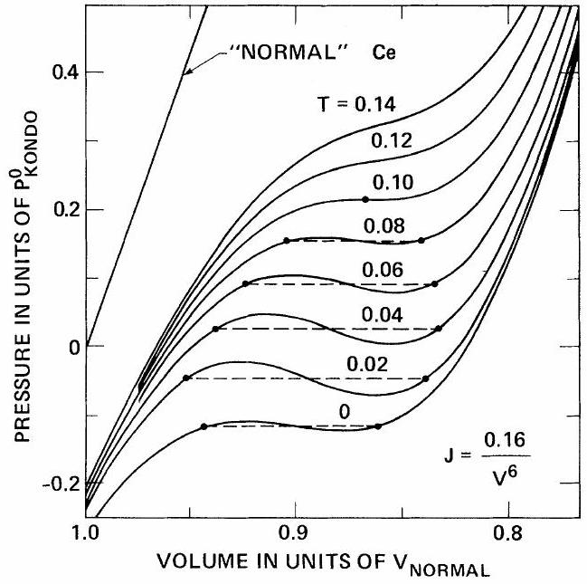

# Kondo Volume Collapse and the $\boldsymbol{\gamma} \rightarrow \boldsymbol{\alpha}$ Transition in Cerium 

J. W. Allen and Richard M. Martin Xerox Palo Alto Research Centers, Palo Alto, California 94304

(Received 6 April 1982)

#### Abstract

The free energy stabilizing the Kondo singlet state is shown to be important in the total-energy and stability conditions for cerium and related solids. Explicit calculations are given for the simplest spin- $\frac{1}{2}$ Kondo model, using the relation to the Anderson Hamiltonian, which leads to a semiquantitative description of the $\gamma \rightarrow \alpha$ phase transition in cerium. The temperature dependence of the free energy has a universal form which can lead to a phase boundary terminating in two critical points.

PACS numbers: 75.20.Hr, 64.70.Kb

Cerium is an archetypal narrow-band metal. With temperature and pressure, its electronic and magnetic properties manifest extreme variations that are especially pronounced because of the existence of the first-order isostructural $\gamma$ $\rightarrow \alpha$ phase transition ending in a critical point, unique among elemental solids. ${ }^{1}$ Extensive studies near the phase boundary, combined with work on $\gamma$-like and $\alpha$-like Ce impurities, alloys, and compounds, have established the causes of these phenomena to be electronic correlations resulting from coupling of localized $4 f$ to delocalized band states. ${ }^{1-3}$ The difficulty of the resulting manybody problem has led to many proposals based upon different interpretations of experimental data. ${ }^{1-13}$ However, because of the magnitude of the volume change (~15\%), all explanations of the $\gamma \rightarrow \alpha$ transition have required a gross change in the $4 f$ electrons: promotion to band states reducing the $4 f$ occupation, ${ }^{4,5}$ a Mott transition in which the $4 f$ states change from localized to bandlike, ${ }^{6}$ or transfer of the $4 f$ wave function from the inner to the outer well of the doublewell atomic potential. ${ }^{7}$ On the other hand, experimental probes ${ }^{6,7,10-14}$ of the $4 f$ electrons have consistently found only small differences between $\gamma$ - and "collapsed" $\alpha$-like Ce materials and have indicated near-integral occupation ${ }^{6,7,10,11,14}$ and atomiclike form factors ${ }^{14}$ and correlation energies ${ }^{13}$ in all cases. The many-body problem presented by this information is closely related to the Kondo effect, and it has been shown that the extensive body of theoretical work ${ }^{15-19}$ on these problems leads to a semiquantitative understanding of the magnetic and electronic properties ${ }^{2,3,8011}$ and a qualitative extension to periodic Kondo-like
systems. ${ }^{9}$
In this Letter we address the issues of the volume and the phase transition by calculating the equation of state of Ce including the free energy of the Kondo effect and using the well-known empirical fact ${ }^{20}$ that the Kondo temperature $T_{\mathrm{K}}$ varies rapidly with volume in Ce materials. We first present a simple analysis which shows that the stabilization energy of the Kondo singlet is sufficient to cause volume changes ~ 15\% in Ce, and that the magnitudes of the effects are supported by other experimental data for Ce. This is followed by a complete calculation of the phase boundary for a volume transition with use of recent theoretical results ${ }^{16 \times 19}$ for the spin- $\frac{1}{2}$ Kondo problem'and its relation to the Anderson Hamiltonian. We propose that this contains the essence of the more complex Ce problem and is a prototype for a phase transition caused by nonlinear, collective effects such as the Kondo problem.
The equation of state is determined by the total Gibbs free energy ${ }^{21} G=F+P V=U-T S+P V$, where where $F, U, S$, and $V$ are, respectively, the free energy, internal energy, entropy, and volume per Ce atom. The change in each term at the $\gamma \rightarrow \alpha$ transition is known ${ }^{1}$; e.g., at $T=300 \mathrm{~K}$, $P=7 \mathrm{kbar}$, we have $\Delta V=V_{\gamma}-V_{\alpha}=0.15 V_{\gamma}, \Delta S$ $=1.54 k, P \Delta V=28 \mathrm{meV}, T \Delta S=38 \mathrm{meV}$, and $\Delta U$ $=10 \mathrm{meV}$. We take $F$ to be a sum of a normal part, typical for rare earths, plus an anomalous part for Ce , so that $G$ can be written

$$
G=\frac{1}{2}\left(B_{N} V_{N}\right)(\bar{V}-1)^{2}+F_{\mathrm{K}}+P V .
$$

All normal contributions are included in the first term, with the normal bulk modulus and volume chosen as the average of La and $\mathrm{Pr},{ }^{22} B_{N}=280$ kbar and $V_{N}=36 \AA^{3}$, and $\bar{V}=V / V_{N}$. The second term $F_{\mathrm{K}}$ is the additional free energy of coupling of the $4 f$ and conduction electrons which differentiates Ce from La or Pr. At the transition, the normal term leads to an increase in energy of the compressed solid, so that $\Delta U_{N}=-51 \mathrm{meV}$ for $\Delta \bar{V}=0.15$. It follows that the anomalous term $F_{\mathrm{K}}$ must supply $\Delta U \sim 60 \mathrm{meV}$ and $\Delta S \sim 1.54 k$. The binding energy of the singlet Kondo state may be estimated from the well-known result ${ }^{23}$ that there is an anomalous contribution to the ground-state energy $U_{\mathrm{K}} \sim-T_{\mathrm{K}}$. It is known from neutron scattering that the width $\Gamma$ of the quasielastic magnetic scattering (roughly $\sim T_{\mathrm{K}}$ ) increases from ~6-16 meV in the $\gamma$ phase to >70 meV in the $\alpha$ phase. ${ }^{24}$ Thus the change in Kondo energy ~60 meV is exactly of the correct magnitude to cause the transition. Furthermore the entropy for $J$ $=\frac{5}{2}$, appropriate for Ce , is $S=k \ln 6 \sim 1.8 k$, and the critical temperature $T_{c}$ is $\sim T_{\mathrm{K}}$, as pointed out by Edelstein, ${ }^{8}$ suggesting that the thermodynamics of the transition are closely related to the Kondo energies.
In order to establish further the relevance of the Kondo effect we consider other information on Ce . From resonant photoemission ${ }^{10-12}$ and inverse photoemission ${ }^{13}$ studies it is known that the spectral weight for adding and removing $4 f$ electrons is well separated by a large Coulomb interaction $U \sim 6-7 \mathrm{eV},{ }^{13}$ showing that the $4 f$ electrons do not occupy simple bands. Furthermore these and other ${ }^{6,7,14}$ results imply that the $4 f$ occupation $n_{f}$ exceeds $\sim 0.75$ even in cases where the volume has been taken to imply $n_{f} \sim 0$. The essential features of this many-body problem are described by the well-known Anderson model, ${ }^{15}$ which has both charge and spin degrees of freedom. The simplest version of this model, an impurity with an $f$ state nondegenerate except for spin, and the $f$ spectra approximated by Lorentzians of width $\Delta$ centered at $\epsilon_{f}$ and $\epsilon_{f}+U$, has been studied in the recent detailed numerical work of Krishna-Murthy, Wilkins, and Wilson. ${ }^{16}$ They show that the susceptibility is equivalent to a $\operatorname{spin}-\frac{1}{2}$ Kondo problem with the collective scale of energy $T_{\mathrm{K}}$ well represented by the form

$$
T_{\mathrm{K}}=0.364 \epsilon_{f} J^{1 / 2} \exp (-1 / J),
$$

for all $J \leqslant 0.5$, where $J$ is the effective Kondo coupling constant (termed $\rho J_{\text {eff }}$ in Ref. 16, with $\rho$ the density of states at the Fermi energy)

$$
J=2 \Delta / \pi \epsilon_{f}+2 \Delta / \pi\left(\epsilon_{f}+U\right) .
$$

The values of $T_{\mathrm{K}}$ for the $\alpha$ and $\gamma$ phases are reproduced by Eq. (2) for $J_{\gamma} \sim 0.25$ and $J_{\alpha} \sim 0.5$, with $\epsilon_{f}=2 \mathrm{eV} .{ }^{10}$ From the areas of the Lorentzian lines below the Fermi level, it is straightforward to show that the values of $n_{f}$ are in the range cited above. Taken together with the various experimental findings, these results strongly suggest that both $\alpha$-like and $\gamma$-like Ce materials are in the range where Kondo effects give a new energy scale $T_{\mathrm{K}} \ll \Delta$, and that it is the spin degrees of freedom which play an essential role in the $\alpha$ $\gamma$ transition.
We therefore proceed to derive a representative phase diagram using results for the spin- $\frac{1}{2}$ Kondo model. Then the temperature dependence of the free energy $F_{\mathrm{K}}$ is a universal function of $T / T_{\mathrm{K}}$, which has been calculated numerically ${ }^{19}$ and shown to be close to the simple resonant-level
expression ${ }^{25}$

$$
F_{K}(T, J)=E_{G}(J)-k T\{2 \ln [\Gamma(1+1 / \pi t) / \Gamma(1+1 / 2 \pi t)]+(1 / \pi t)[1-\ln (2 / \pi t)]-\ln 2\},
$$

where $t=(W / 2)\left(T / T_{\mathrm{K}}\right)$, with $W=4 \pi \times 0.102676$. The ground-state energy $E_{G}$ is not a universal function of $T_{\mathrm{K}}$, so that it depends upon the underlying electronic Hamiltonian. We have taken the spin contribution to $E_{G}$ to be given by the analytic Bethe-Ansatz solutions of the Kondo Hamiltonian, ${ }^{17,18}$ with the scale of energy $E^{0}=0.364 \epsilon_{f}$ and coupling constant chosen consistent with Eq. (2) for $T_{\mathrm{K}}$. The result is ${ }^{17}$

$$
\left.E_{G}(J)=-E^{0}(2 / W)\left[\operatorname{Im} \ln \left\{\Gamma\left(\frac{3}{2}\right)-i / 2 c\right) / \Gamma^{\prime}(1-i / 2 c)\right\}-\tan ^{-1}(c)-\frac{1}{4} \pi-\tan ^{-1}\left(c^{\prime} / 2\right)\right],
$$

where $c=\pi\left(J^{-1}-\frac{1}{2} \ln J\right)^{-1}=2 c^{\prime}\left(1-3 c^{\prime 2} / 4\right)$. The essential point is not the uniqueness of this form, but rather the nonlinear dependence upon $J$, which is intrinsic to the collective nature of the Kondo effect, and persists more generally. For example, in the solution for $E_{G}$ in the symmetric Anderson model ${ }^{26}$ we have isolated and evaluated a contribution which arises from many-body effects at the Fermi energy and is a nonlinear function only of $J$, very similar to Eq. (5). There are also other terms in $E_{G}$ of the type treated ${ }^{5}$ in promotional models; these depend upon the details of the band electrons and are not small. However, it appears from the experimental results cited above that in Ce the nonlinear volume dependence of these terms is not large, and we take Eq. (5) as a semiquantitative representation of the important nonlinear dependence on $J$.
Minimization of $G$ with respect to $V$ leads to the PVT relation ${ }^{21}$

$$
P=-B_{N}(\bar{V}-1)-P_{\mathrm{K}}{ }^{0} \tilde{F}_{\mathrm{K}}{ }^{\prime}(T, J)(J / \bar{V}) \alpha,
$$

where $\tilde{F}_{\mathrm{K}}{ }^{\prime}=\left(d F_{\mathrm{K}} / d J\right) / E^{0}, \alpha=d(\ln J) / d(\ln V)$, and $P_{K}{ }^{0}=E^{0} / V_{N}$ is the characteristic "Kondo pressure" [34 kbar in Ce with $\epsilon_{f}=2 \mathrm{eV}$ (Ref. 10)]. The dependence of $T_{\mathrm{K}}$ (and thus $J$ and $F_{\mathrm{K}}$ ) on volume is well established ${ }^{11,20}$ and, with use of Eq. (2), leads to values $\alpha$ from ~-4 for CeLaTh alloys to >- 8 for dilute Ce in La under pressure. ${ }^{20}$ We have taken $J=0.16 / \bar{V}^{6}$, chosen to give approximately the spin-flip energies in $\gamma$ - and $\alpha$ $\mathrm{Ce} .^{24}$ In Fig. 1 we show the resulting isotherms. First-order transitions occur wherever $d P / d V$ <0, in which case the equal-area construction ${ }^{21}$ gives the transition pressure and volume discontinuity. This defines a line $P(T)$ ending in a critical point at $T_{c}=0.10 E^{0} \sim 850 \mathrm{~K}, P_{c}=0.22 P_{\mathrm{K}}{ }^{0} \sim 7$ kbar, $\bar{V}_{c}=0.87$. At room $T\left(\sim 0.04 E^{0}\right)$ the calculation gives a transition from $\bar{V}_{\gamma}=0.94$ to $\bar{V}_{\alpha}=0.83$, compared to empirical values ${ }^{1} \bar{V}_{\gamma}=0.96, \bar{V}_{\alpha}$ $=0.82$. This corresponds to $J_{\gamma}=0.23, T_{\mathrm{K} \gamma}=4.7$ meV , and $J_{\alpha}=0.49, T_{\mathrm{K} \alpha}=66 \mathrm{meV}$, to be compared with quasielastic neutron-scattering measurements of $\Gamma\left(\sim T_{\mathrm{K}}\right) \sim 6-16 \mathrm{meV}$ and $>70 \mathrm{meV}$
in $\gamma$ - and $\alpha$-Ce. ${ }^{24}$
Because the temperature dependence of the phase diagram is a universal function of $T / T_{\mathrm{K}}$, it has properties which result directly from the fact that $T_{\mathrm{K}}$ is a rapidly decreasing function of volume. In particular, the maximum negative pressure always occurs at finite $T$, as may be seen in Fig. 1. This has the remarkable consequence that for reduced values of the ratio $P_{\mathrm{K}}{ }^{0} /$ $B_{N}=E^{0} /\left(B_{N} V_{N}\right)$, the phase diagram has two critical points. For appropriate choices of the parameters the lower critical point can be chosen to be at arbitarily low temperature. As the ratio is further decreased, the phase transition disappears by the coalescence of the two critical points at finite $T$. For yet smaller values the consequence is an anomalous thermal expansion at low $T$, which is well known in Ce systems. ${ }^{27}$

FIG. 1. Calculated phase diagram for Ce from Eq. (6), with "normal" volume and modulus taken from La and Pr. The pressure due to stabilization of the Kondo state causes the volume collapse and first-order transition indicated by broken lines. The unit of pressure is $P_{\mathrm{K}}{ }^{0} \sim 34 \mathrm{kbar}$, and $T=0.04$ corresponds to room temperature.

In these considerations the only role of the ground-state energy is that it determines whether or not the critical points occur in the experimentally accessible region with $P>0$. This has direct implications for alloys, where the volume $V_{N}$ per Ce atom increases with dilution. The present results suggest that the interesting region is for < 20\% dilution (where the first-order transition disappears), in rough agreement with observations ${ }^{3}$ for many alloys at $P=0$ and for alloys containing La, where the effective negative internal pressure is expected to move both critical points to positive external pressure.
It is important to note the differences between the idealized model and real Ce. (1) The fact that Ce is a crystal instead of an aggregation of impurities, leads to new features ${ }^{9}$ not present in the the impurity Kondo problem. (2) The ground state of Ce has degeneracy 6 rather than 2, giving increased latent heat and slope of the phase boundary. A complete analysis will require the relation of $T_{\mathrm{K}}, F_{\mathrm{K}}, J$, and the electronic energies for higher spin cases. (3) As discussed below Eq. (5), pressure due to changes of the $4 f$ occupation ${ }^{5}$ may be numerically important, and even dominant in systems like SmS. (4) Finally, it remains to understand how to deduce the Kondo energies and the occupation of the $f$ states from actual $4 f$ spectra of Ce materials. This will require at least the inclusion of the full 14-fold degeneracy of the $f$ shell.
In summary, we have shown that the phase diagram in Fig. 1 follows from properties of the interacting electron problem posed by Anderson. ${ }^{15}$ The derivation depends upon recent theoretical results ${ }^{16-19}$ for this problem in the Kondo regime together with the experimentally established volume dependence of the Kondo coupling constant. ${ }^{20}$ The representative phase diagram provides a semiquantitative description of the $\gamma \rightarrow \alpha$ phase transition in Ce and predicts new features, such as the existence of a phase boundary ending in two critical points. As envisaged by Johansson, ${ }^{6}$ there is increased $4 f$ "bonding" in the $\alpha$ phase, but rather than a Mott transition the mechanism is the Kondo binding energy, the collective nature of which results in a sensitive dependence upon volume. The prototypical status of cerium suggests that this mechanism is important in other narrow-band systems such as the actinides.
We gratefully acknowledge the guidance of E. Resayi in the derivation of the ground-state energy.
${ }^{1}$ Handbook on the Physics and Chemistry of the Rare Earths, edited by K. A. Gschneidner and L. Eyring (North-Holland, Amsterdam, 1978), Vol. 1. See D. C. Koskenmaki and K. A. Geschneidner, Chap. 4.
${ }^{2}$ Valence Fluctuations in Solids, edited by L. M. Falicov, W. Hanke, and M. P. Maple (North-Holland, Amsterdam, 1981).
${ }^{3}$ J. M. Lawrence, P. S. Riseborough, and R. D. Parks, Rep. Prog. Phys. 44, 1 (1981).
${ }^{4}$ W. H. Zachariasen, Phys. Rev. 76, 301 (1949); L. Pauling, J. Chem. Phys. 18, 145 (1950).
${ }^{5}$ B. Coqblin and A. Blandin, Adv. Phys. 17, 281 (1968); R. Ramirez and L. M. Falicov, Phys. Rev. B 3, 2485 (1971); L. L. Hirst, Phys. Rev. B 15, 1 (1977).
${ }^{6}$ B. Johansson, Philos. Mag. 30, 469 (1974).
${ }^{7}$ K. R. Bauschspiess, W. Kboksch, E. Holland-Moritz, H. Launois, R. Pott, and D. K. Wohlleben, Ref. 2, p. 417.
${ }^{8}$ A. S. Edelstein, Phys. Rev. Lett. 20, 1348 (1968).
${ }^{9}$ R. M. Martin, Phys. Rev. Lett. 48, 362 (1982).
${ }^{10}$ J. W. Allen, S.-J. Oh, I. Lindau, J. M. Lawrence, L. I. Johansson, and S. B. Hagstrom, Phys. Rev. Lett. 46, 1100 (1981); J. W. Allen, S.-J. Oh, I. Lindau, M. B. Maple, J. F. Suassuna, and S. B. Hagstrom, Phys. Rev. B 26, 445 (1982).
${ }^{11}$ M. Croft, J. H. Weaver, D. J. Peterman, and A. Franciosi, Phys. Rev. Lett. 46, 1104 (1981).
${ }^{12}$ N. Martensson, B. Rheil, and R. D. Parks, Solid State Commun. 41, 573 (1982); D. Wieliczka (unpublished).
${ }^{13}$ Y. Baer, H. R. Ott, J. C. Fuggle, and L. E. DeLong, Phys. Rev. B 24, 5384 (1981).
${ }^{14}$ U. Kornstadt, R. Lasser, and B. Lengeler, Phys. Rev. B 21, 1898 (1980).
${ }^{15}$ P. W. Anderson, Phys. Rev. 124, 41 (1961).
${ }^{16}$ H. R. Krishna-Murthy, K. G. Wilson, and J. W. Wilkins, Phys. Rev. B 21, 1044 (1980).
${ }^{17}$ N. Andrei, Phys. Rev. Lett. 45, 379 (1980); N. Andrei and J. H. Lowenstein, Phys. Rev. Lett. 46, 356 (1981). The final term in Eq. (5) was omitted in these references. It was derived by E. Resayi (private communication), and is similar to results of E. Resayi and J. Sak, to be published.
${ }^{18}$ P. B. Vigman, Pis'ma Zh. Eksp. Teor. Fiz. 31, 392 (1980) [JETP Lett. 31, 364 (1980)].
${ }^{19}$ L. N. Oliveira and J. W. Wilkins, Phys. Rev. Lett. 47, 1553 (1981); V. T. Rajan, J. H. Lowenstein, and N. Andrei, Bull. Am. Phys. Soc. 27, 305 (1982).
${ }^{20}$ J. S. Schilling, Adv. Phys. 28, 657 (1979); M. B. Maple, Appl. Phys. 9, 179 (1976); B. H. Grier, S. M. Shapiro, C. F. Majkrzak, and R. D. Parks, Phys. Rev. Lett. 45, 666 (1980).
${ }^{21}$ L. D. Landau and E. M. Lifshitz, Statistical Physics (Pergamon, London, 1958).
${ }^{22}$ T. E. Scott, Ref. 1, p. 701.
${ }^{23}$ K. Yosida and A. Yoshimori, in Magnetism, edited by H. Suhl (Academic, New York, 1973), p. 263.
${ }^{24}$ S. M. Shapiro, J. D. Axe, R. J. Birgeneau, J. M. Lawrence, and R. D. Parks, Phys. Rev. B 16, 2225 (1977); B. D. Rainford, B. Buras, and B. Lebech,

Physica (Utrecht) 86-88B, 41 (1977); C. Stassis, T. Gould, O. D. McMasters, K. A. Geschneidner, Jr., and R. M. Nicklow, Phys. Rev. B 19, 5746 (1979).
${ }^{25}$ K. D. Shotte and U. Shotte, Phys. Lett. 55A, 38 (1975).
${ }^{26}$ N. Kawakami and A. Okiji, Phys. Lett. 86A, 483 (1981).
${ }^{27}$ D. K. Wohlleben, Ref. 2, p. 1.
${ }^{28}$ C. H. de Novion, M. Konczykowski, and M. Haessler, J. Phys. C 15, 1251 (1982).
