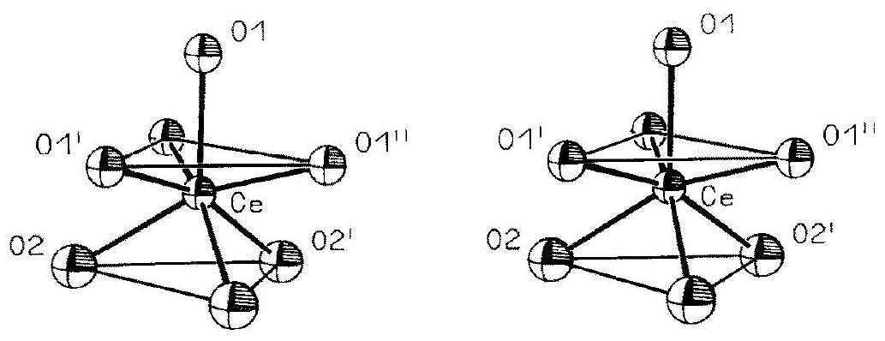
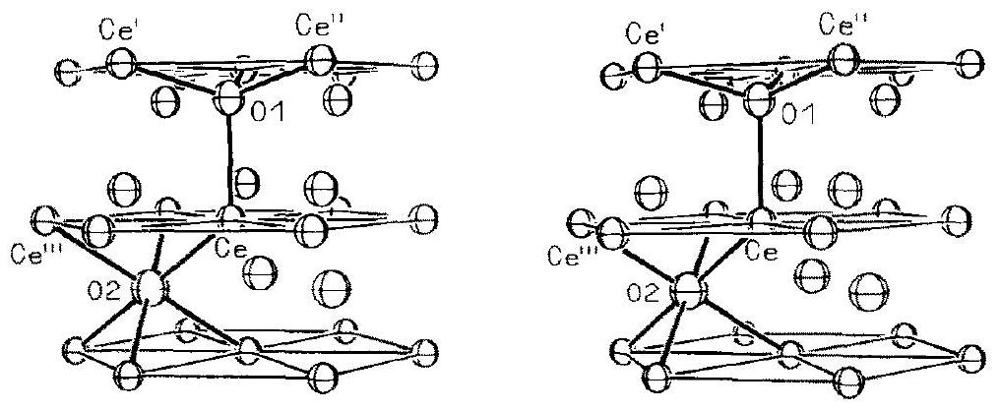

# THE CRYSTAL STRUCTURE OF A- $\mathrm{Ce}_{2} \mathrm{O}_{3}{ }^{*}$ 

H. BÄRNIGHAUSEN and G. SCHILLER Institut für Anorganische Chemie der Universität Karlsruhe (TH), Engesserstrasse, D-7500 Karlsruhe (F.R.G.)

(Received March 20, 1985)

## Summary

A single-crystal structure determination of $\mathrm{Ce}_{2} \mathrm{O}_{3}$ has been carried out (two-circle diffractometer, Mo K $\alpha$ radiation, $R$ value $2.9 \%$ for 614 unique reflections). The results are in perfect agreement with Pauling's model of the A-type sesquioxides and with the neutron powder diffraction data known for $\mathrm{La}_{2} \mathrm{O}_{3}$ and $\mathrm{Nd}_{2} \mathrm{O}_{3}$. There is no indication of the so-called micro-twinning which was found 20 years ago by means of single crystals of $\mathrm{La}_{2} \mathrm{O}_{3}$ and $\mathrm{Nd}_{2} \mathrm{O}_{3}$.

## 1. Introduction

The crystal structure of the A-modification of the rare earth sesquioxides has been well-known since 1929 following Pauling's famous paper [1] and has often been confirmed by X-ray and neutron powder diffraction studies (see, for instance, refs. 2, 3), but there is still an unresolved problem. In 1965, Müller-Buschbaum and von Schnering carried out a single-crystal X-ray diffraction study for $\mathrm{La}_{2} \mathrm{O}_{3}$ [4] using crystals grown from the melt. Pauling's model (space group $P \overline{3} 2 / m 1$ ) was basically challenged by them on observing symmetry elements and systematic extinctions on their X-ray films, hitherto undescribed and disagreeing with the existing structural model. Nevertheless, their new description of the structure type (space group $P 6_{3} / m m c$ ) remained, to some degree, unsatisfactory, because a statistical distribution of the atoms, interpreted as so-called micro-twinning, had to be assumed.

Having obtained well-developed single crystals of $\mathrm{Ce}_{2} \mathrm{O}_{3}$ by preparation at comparatively low temperatures it is now possible to confirm Pauling's model for the first time with an X-ray single-crystal structure determination.

[^0]
## 2. Experimental details

### 2.1. Preparation of crystals

During the course of our studies on mixed-valence ternary cerium oxides an attempt was made to obtain single crystals of these compounds from LiCl melts (flux technique). Among other experiments, a mixture consisting of $\mathrm{LiCeO}_{2}, \mathrm{CeO}_{2}$ and anhydrous LiCl was heated in a closed steel crucible (superior-alloy steel) at temperatures between 700 and $800^{\circ} \mathrm{C}$ for several weeks. Obviously, the reaction hoped for did not take place but, surprisingly, well-shaped single crystals of $\mathrm{Ce}_{2} \mathrm{O}_{3}$ were obtained at this comparatively low temperature. We assume that $\mathrm{LiCeO}_{2}$ decomposes slowly under the influence of the LiCl melt, perhaps by extraction of $\mathrm{Li}_{2} \mathrm{O}$ from the starting material.

The amber-coloured crystals of $\mathrm{Ce}_{2} \mathrm{O}_{3}$ are plate-like with $\{001\}$ as the main faces. The six smaller faces are also well-developed, and these, $\{011\}$, can be taken as direct proof of the crystal class $\overline{3} 2 / \mathrm{m}$. Thus, the hexagonal space group $P 6_{3} / m m c$ assumed by Müller-Buschbaum and von Schnering [4] can already be excluded from the morphology of the crystals.

### 2.2. Crystal data of $\mathrm{Ce}_{2} \mathrm{O}_{3}$

Accurate lattice parameters were determined using single crystals and a Gandolfi-camera [5]. Using the extrapolation method after Nelson and Riley [6], the lattice constants $a=389.1(1) \mathrm{pm}$ and $c=605.9(1) \mathrm{pm}$ were obtained. These values are in perfect agreement with the best values known from the literature [7].

The structural model of Müller-Buschbaum and von Schnering [4] was primarily based on systematic extinctions, namely, reflections $h k l$ with $h-k=3 n$ and $l=2 n+1$ were not observed. A Buerger photograph of the hhl reflections of $\mathrm{Ce}_{2} \mathrm{O}_{3}$, exposed by monochromated $\mathrm{Mo} \mathrm{K} \alpha$ radiation for 72 h , showed that many of the reflections in question were definitely present. This is another argument against the structural model based on space group $P 6_{3} / m m c$. Table 1 may be taken as the best proof of the very nature of the weak reflections $h k l$, with $h-k=3 n$ and $l=2 n+1$.

### 2.3. Intensity measurement and refinement of the structure

The intensity data of a crystal, adjusted along [100], were collected using an automated two-circle diffractometer (Weissenberg geometry, Mo K $\alpha$ radiation, graphite monochromator). Within the range $2 \theta<140^{\circ}$ ( $\omega$-scan: $2 \theta<60^{\circ}, \omega-2 \theta$-scan: $60^{\circ}<2 \theta<140^{\circ}$ ) a total of 3282 reflections were measured; 630 unique reflections remained by averaging the equivalent reflections. Corrections for the Lorentz and polarization effects were applied. Considering the shape of the crystal (size: $0.14 \mathrm{~mm} \times 0.12 \mathrm{~mm} \times 0.05 \mathrm{~mm}$ ) and the linear absorption coefficient $\mu=285.6 \mathrm{~cm}^{-1}$, a numerical absorption correction (program SHELX-76 [8]) was essential. Neutral scattering factors and the real and imaginary coefficients of the anomalous dispersion were taken from the International Tables for X-ray Crystallography [9]. The full-matrix

TABLE 1
Experimental and calculated structure factors of the very weak hkl reflections of A $\mathrm{Ce}_{2} \mathrm{O}_{3}{ }^{\text {a }}$
| $h$ | $k l$ | $F_{0}$ | $F_{\mathrm{c}}$ | hkl | $F_{\mathrm{o}}$ | $F_{\text {c }}$ | $h k l$ | $F_{\mathrm{o}}$ | $F_{\mathrm{c}}$ |
| :--- | :--- | :--- | :--- | :--- | :--- | :--- | :--- | :--- | :--- |
| 1 | 21 | 1.5 | 1.3 | 275 | 3.3 | 3.4 | $\overline{6} 69$ | 4.9 | 4.5 |
| $\overline{3}$ | 31 | 0.9 | 1.0 | 785 | 2.4 | 2.3 | 369 | 6.1 | 5.5 |
| 0 | 31 | 2.0 | 1.0 | 485 | 4.2 | 2.8 | 069 | 5.0 | 4.5 |
| 4 | 51 | 0.9 | 0.6 | 185 | 1.7 | 2.3 | 579 | 4.4 | 4.3 |
| $\overline{3}$ | 61 | 0.4 | 0.5 | 695 | 2.8 | 2.1 | 279 | 4.6 | 4.3 |
| 0 | 61 | 0.6 | 0.3 | 395 | 2.0 | 2.1 | 489 | 4.0 | 3.6 |
| 4 | 81 | 0.4 | 0.2 | 007 | 10.7 | -10.8 | 0011 | 6.3 | -6.0 |
| $\underline{1}$ | 81 | 0.4 | 0.1 | 127 | 10.4 | -9.8 | 1211 | 6.1 | -5.6 |
| 6 | 91 | 0.4 | 0.1 | 337 | 8.3 | -8.2 | 3311 | 5.5 | -4.9 |
| 3 | 91 | 0.4 | 0.1 | 037 | 8.1 | -8.2 | 0311 | 5.3 | -4.9 |
| 5 | 101 | 0.4 | 0.1 | 247 | 8.1 | -7.5 | 2411 | 5.5 | -4.6 |
| 0 | 03 | 6.6 | 6.1 | 457 | 6.6 | -6.0 | 4511 | 4.7 | -3.9 |
| $\overline{1}$ | 23 | 4.0 | 3.0 | 157 | 6.2 | -6.0 | 1511 | 4.5 | -3.9 |
| 0 | 33 | 1.0 | 0.9 | 667 | 4.2 | -4.4 | 6611 | 3.2 | -3.0 |
| 3 | 63 | 0.4 | 0.3 | 367 | 5.9 | -5.3 | 3611 | 4.2 | -3.5 |
| 0 | 63 | 0.5 | 0.3 | 067 | 4.5 | -4.4 | 0611 | 3.3 | -3.0 |
| $\underline{2}$ | 73 | 0.5 | -0.3 | 577 | 4.6 | -4.2 | 5711 | 2.9 | -2.9 |
| 4 | 83 | 0.5 | -0.2 | 277 | 5.1 | -4.2 | 2711 | 2.8 | -2.9 |
| 6 | 93 | 0.4 | -0.2 | 787 | 3.4 | -3.0 | 0013 | 5.9 | 6.1 |
| 3 | 93 | 0.5 | -0.2 | 487 | 3.8 | -3.5 | 1213 | 6.4 | 5.7 |
| 0 | 05 | 11.3 | 11.7 | 187 | 2.5 | -3.0 | 3313 | 5.8 | 5.1 |
| 1 | 25 | 10.5 | 10.0 | $\overline{6} 97$ | 2.4 | -2.7 | 0313 | 5.5 | 5.1 |
| 3 | 35 | 7.5 | 7.8 | 397 | 2.7 | -2.6 | 2413 | 5.6 | 4.8 |
| 0 | 35 | 8.0 | 7.8 | 009 | 10.8 | 10.5 | 4513 | 4.4 | 4.0 |
| 2 | 45 | 7.2 | 7.0 | 129 | 9.8 | 9.7 | 1513 | 4.5 | 4.0 |
| 4 | 55 | 5.9 | 5.3 | 339 | 8.8 | 8.2 | 3613 | 3.7 | 3.6 |
| 1 | 55 | 6.1 | 5.3 | 039 | 8.5 | 8.2 | 0015 | 5.2 | -5.4 |
| $\frac{6}{3}$ | 65 | 3.9 | 3.7 | 249 | 7.7 | 7.6 | 1215 | 5.2 | -5.1 |
| 3 | 65 | 5.4 | 4.6 | 45 | 6.3 | 6.2 | 3315 | 4.4 | -4.6 |
| 0 | 65 | 4.4 | 3.7 | 1 | 6.6 | 6.2 | 0315 | 4.5 | -4.6 |
| 5 | 75 | 3.6 | 3.4 |  | $120^{\mathrm{b}}$ | 89.3 | 89.9 |  |  |

${ }^{\mathrm{a}}$ These reflections are the subset with $h-k=3 n$ and $l=2 n+1$.
${ }^{\mathrm{b}}$ This reflection is the strongest one and is only given for comparison purposes.
least-squares refinement (program SHELX-76 [8]) with isotropic temperature factors was started from the published structural parameters [2], leading to an $R$ value of $3.3 \%$ ( $R=\Sigma\left|F_{\mathrm{o}}-F_{\mathrm{c}}\right| / \Sigma F_{\mathrm{o}}$, standard deviations of the structure factors from counting statistics, see ref. 10). Using anisotropic temperature factors and an extinction parameter the refinement ended in an $R$ value of $2.9 \%$. The results of the final refinement by means of 614 unique reflections and 10 free parameters are given in Table 2. Note that 16 weak reflections, presumably in error by multiple diffraction, had been deleted. A table of the structure factors is given in ref. 11.

TABLE 2
Positional and thermal parameters for $\mathrm{A}-\mathrm{Ce}_{2} \mathrm{O}_{3}{ }^{\text {a }}$
| Atom | Wyckoff position | Site symmetry | $x$ | $y$ | $z$ | $U_{11}$ | $U_{33}$ | $U$ |
| :--- | :--- | :--- | :--- | :--- | :--- | :--- | :--- | :--- |
| Ce | 2d | $3 m$ | $\frac{1}{3}$ | $\frac{2}{3}$ | 0.24543(3) | 74.6(6) | 73.4(6) | 74.2(6) |
| $O(1)$ | 2d | $3 m$ | $\frac{1}{3}$ | $\frac{2}{3}$ | 0.6471(5) | 90(6) | 101(8) | 94(7) |
| O(2) | 1a | $\overline{3} m$ | 0 | 0 | 0 | 142(11) | 133(15) | 139(12) |

${ }^{\mathrm{a}} \mathrm{A}-\mathrm{Ce}_{2} \mathrm{O}_{3}$ crystallizes with space group $P \overline{3} 2 / m 1$ (No. 164), $Z=1$. The positional parameters are fractions of the given lattice constants. The anisotropic temperature factor is given by $\exp \left\{-2 \pi^{2}\left[U_{11} a^{* 2}\left(h^{2}+k^{2}+h k\right)+U_{33} c^{* 2} l^{2}\right]\right\}$ with $U_{i i}$ in pm ${ }^{2}$; the isotropic temperature factor is given by $\exp \left\{-8 \pi^{2} U \sin ^{2} \theta / \lambda^{2}\right\}$ with $U=\frac{1}{3}\left(2 U_{11}+U_{33}\right)$.

## 3. Discussion

Pauling's model of the crystal structure of the A-type rare earth sesquioxides [1] is completely confirmed by this structure determination. The structure type has been discussed in the literature from different viewpoints.

The description given by Pauling in his fundamental work [1] is based on the cation coordination. The cation is sevenfold coordinated by oxygen atoms; the polyhedron can be derived from a distorted octahedron with a seventh oxygen atom above one triangular face (Fig. 1).

Using another approach the structure can be described as an hexagonalclose packing of the cations, the oxygen atoms, $O(1)$ and $O(2)$ respectively, occupying half of the tetrahedral and half of the octahedral holes (Fig. 2). The different coordination around oxygen is also evident from the values of the thermal parameters: the higher thermal vibrations of the $O(2)$ atoms correspond quite well to the longer $\mathrm{O}(2)-\mathrm{Ce}$ distances. Important interatomic distances and angles are given in Table 3. With the average $\mathrm{Ce}-\mathrm{O}$ dis-

Fig. 1. A- $\mathrm{Ce}_{2} \mathrm{O}_{3}$ : coordination polyhedron of cerium with $3 m$ point symmetry (thermal ellipsoids at the $99 \%$ level [15]).

Fig. 2. The crystal structure of $\mathrm{A}-\mathrm{Ce}_{2} \mathrm{O}_{3}$. The connecting lines between the cerium atoms are drawn in order to illustrate the AB layer stacking of the hexagonal close-packed cation arrangement. In addition, the different coordination of the two oxygen positions is displayed (thermal ellipsoids at the $99 \%$ level [15]).

## TABLE 3

Interatomic distances (pm) and some selected angles ( ${ }^{\circ}$ ) in $\mathrm{A}-\mathrm{Ce}_{2} \mathrm{O}_{3}$

Ce coordination polyhedron

| $\mathrm{Ce}-\mathrm{O}\left(1^{\prime}\right)$ | $(3)^{\mathrm{a}}$ | $233.9(2)^{\mathrm{b}}$ | Mean value: 250.5 |  |  |
| :--- | :--- | :--- | :--- | :--- | :--- |
| Ce-O(1) | (1) | 243.4(4) |  |  |  |
| $\mathrm{Ce}-\mathrm{O}(2)$ | (3) | 269.4(1) |  |  |  |
| $\mathrm{O}(1)-\mathrm{O}\left(1^{\prime}\right)$ | (3) | 286.8(4) | $\mathrm{O}(1)-\mathrm{Ce}-\mathrm{O}\left(1^{\prime}\right)$ | $(3)^{\mathrm{a}}$ | 73.84(8) |
| $\mathrm{O}\left(1^{\prime}\right)-\mathrm{O}(2)$ | (6) | 310.1(3) | $\mathrm{O}\left(1^{\prime}\right)-\mathrm{Ce}-\mathrm{O}(2)$ | (6) | 75.71(6) |
| $\mathrm{O}\left(1^{\prime}\right)-\mathrm{O}\left(1^{\prime \prime}\right)$ | (3) | 389.1(1) | $\mathrm{O}\left(1^{\prime}\right)-\mathrm{Ce}-\mathrm{O}\left(1^{\prime \prime}\right)$ | (3) | 112.57(5) |
| $\mathrm{O}(2)-\mathrm{O}\left(2^{\prime}\right)$ | (3) | 389.1(1) | $\mathrm{O}(2)-\mathrm{Ce}-\mathrm{O}\left(2^{\prime}\right)$ | (3) | 92.46(1) |

$O(1)$ coordination polyhedron

| $\mathrm{O}(1) \mathrm{Ce}$ | $(3)$ | $233.9(2)$ |
| :--- | :--- | :--- |
| $\mathrm{O}(1) \mathrm{Ce}$ | $(1)$ | $243.4(4)$ |
| $\mathrm{Ce}-\mathrm{Ce}^{\prime}$ | $(3)$ | $381.6(1)$ |
| $\mathrm{Ce}^{\prime}-\mathrm{Ce}^{\prime \prime}$ | $(3)$ | $389.1(1)$ |

$\mathrm{Ce}-\mathrm{O}(1)-\mathrm{Ce}^{\prime}$
$\mathrm{Ce}^{\prime}-\mathrm{O}(1)-\mathrm{Ce}^{\prime \prime}$
$O(2)$ coordination polyhedron

| $\mathrm{O}(2)-\mathrm{Ce}$ | $(6)$ | $269.4(1)$ |  |  |  |
| :--- | :--- | :--- | :--- | :--- | ---: |
| $\mathrm{Ce}-\mathrm{Ce}{ }^{\prime \prime \prime}$ | $(6)$ | $389.1(1)$ | $\mathrm{Ce}-\mathrm{O}(2)-\mathrm{Ce}^{\prime \prime \prime}$ | $(6)$ | $92.46(1)$ |

${ }^{\mathrm{a}}$ Multiplicity of the respective value in the coordination polyhedron.
${ }^{\mathrm{b}}$ Estimated standard deviations given with respect to the last digit. Note that the standard deviations of the lattice parameters are included.
tance ( 250.5 pm ) and the effective ionic radii for oxygen ( 138 pm for CN4, 140 pm for CN6) [12], an effective ionic radius for the $\mathrm{Ce}^{3+}$ ion with sevenfold coordination can be calculated: 111.6 pm .

Caro [13] has compared the structure of the A-type rare earth sesquioxides with other rare earth oxide and oxysalt structures. He considered the tetrahedral coordination of the oxygen atoms as a common structural principle. All structures were regarded as three-dimensional or two-dimensional packing of such $\mathrm{OM}_{4}$ tetrahedra sharing edges. In the case of $\mathrm{A}-\mathrm{Ln}_{2} \mathrm{O}_{3}$ the
structure was described in terms of sheets of $\mathrm{OM}_{4}$ tetrahedra linked by three edges, with oxygen atoms $O(2)$ between the sheets.

Based on Caro's work, Aldebert and Traverse [3] suggested a modified description. They used sheets of edge-sharing hexagons in chair configuration, consisting of alternating Ln and $\mathrm{O}(1)$ atoms as basic structural units. The total structure is built up by the sequence of two such puckered ( LnO ) sheets and one plane layer of $\mathrm{O}(2)$ atoms.

Considering the structural results of Müller-Buschbaum and von Schnering [4], we are now sure that their crystals were, in fact, not single crystals but merohedral twins. Details concerning this aspect will be given in another paper [14].

## Acknowledgments

Financial support by the Fonds der Chemie is gratefully acknowledged. All calculations were carried out at the computer center of the University of Karlsruhe.

## References

1 L. Pauling, Z. Kristallogr., 69 (1929) 415.
2 J. X. Boucherle and J. Schweizer, Acta Crystallogr., Sect. B, 31 (1975) 2745.
3 P. Aldebert and J. P. Traverse, Mater. Res. Bull., 14 (1979) 303.
4 H. Müller-Buschbaum and H. G. von Schnering, Z. Anorg. Allg. Chem., 340 (1965) 232.

5 G. Gandolfi, Miner. Petrogr. Acta, 13 (1967) 67.
6 J. B. Nelson and D. P. Riley, Proc. Phys. Soc., 57 (1945) 160.
7 D. J. M. Bevan and T. M. Height, in K. A. Gschneidner, Jr. and L. Eyring (eds.), Handbook on the Physics and Chemistry of Rare Earths, Vol. 3, North-Holland, Amsterdam, 1979, p. 342.
8 G. M. Sheldrick, SHELX-76, A Program for Crystal Structure Determination, University of Cambridge, 1976.
9 International Tables for X-ray Crystallography, Vol. IV, Kynoch Press, Birmingham, 1976.

10 H. G. Stout and L. H. Jensen, X-ray Structure Determination, McMillan, New York, 1968, p. 456.
11 G. Schiller, Dissertation, Universität Karlsruhe, 1985.
12 R. D. Shannon, Acta Crystallogr., Sect. A, 32 (1976) 751.
13 P. E. Caro, J. Less-Common Met., 16 (1968) 367.
14 H. Bärnighausen, to be published.
15 C. K. Johnson, Ortep-II, Rep. ORNL-3794, revised version, Oak Ridge National Laboratory, Oak Ridge, TN, 1971.

[^0]:    *Paper presented at the International Rare Earth Conference, ETH Zurich, Switzerland, March 4-8, 1985.

