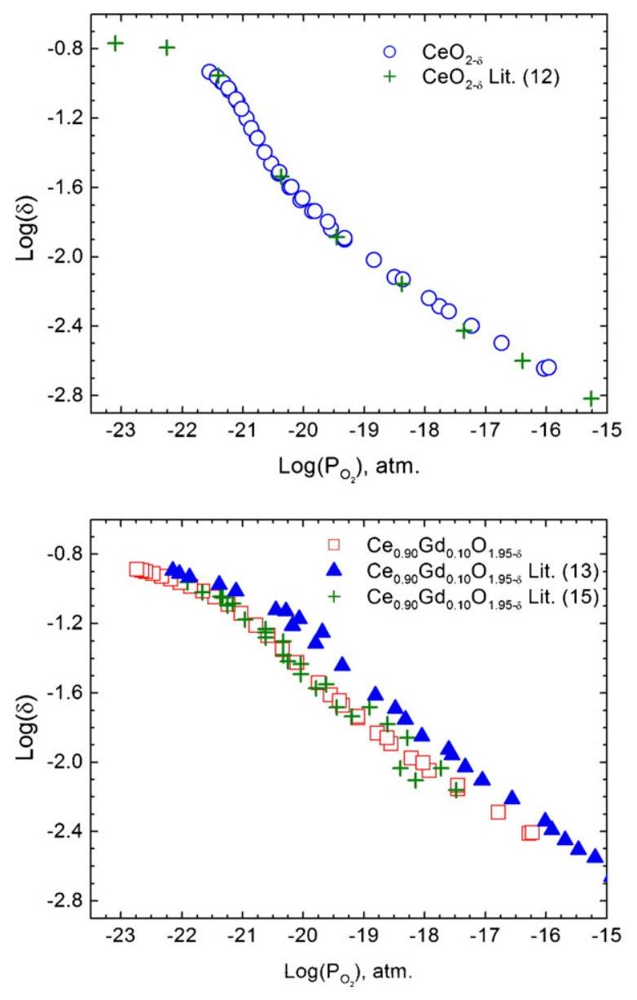
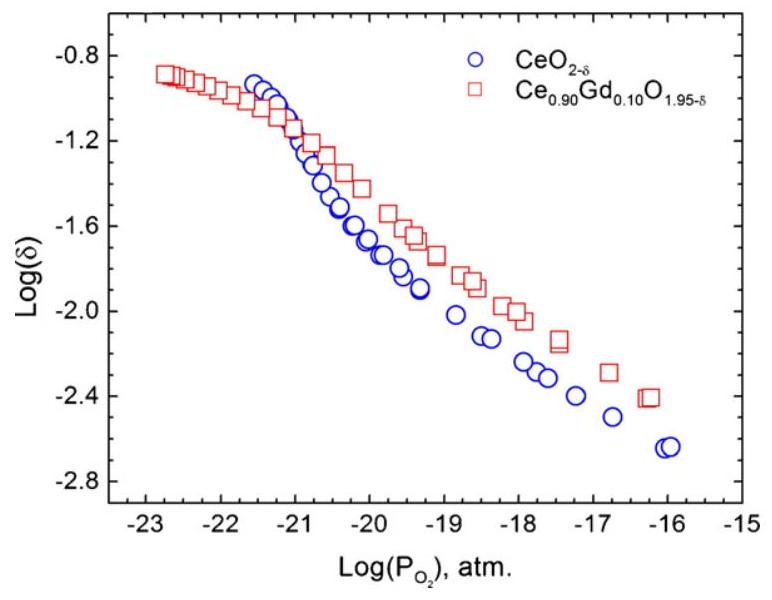
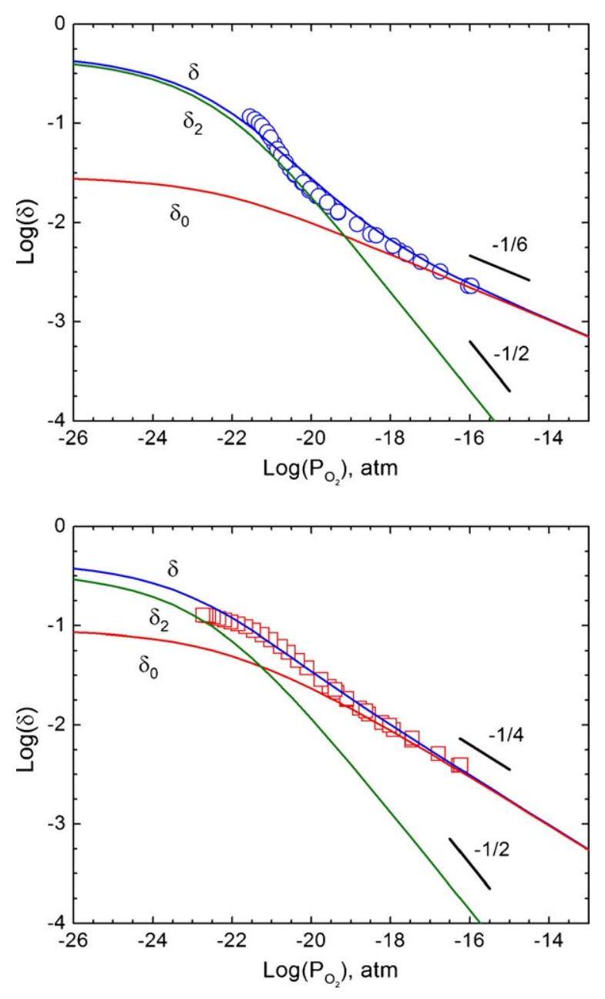
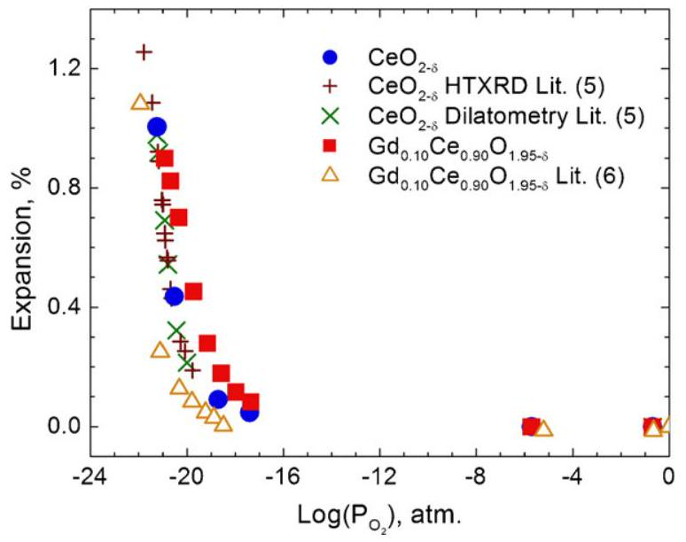
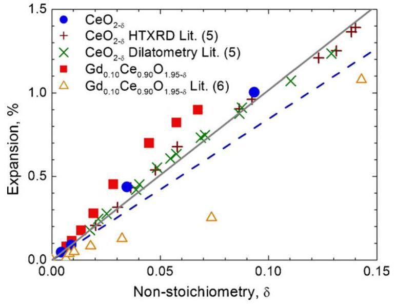
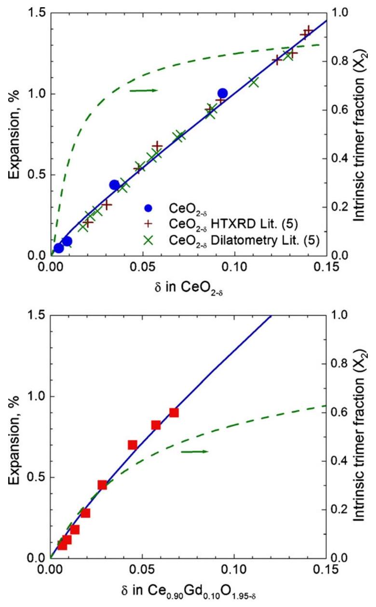

# Defect equilibria and chemical expansion in non-stoichiometric undoped and gadolinium-doped cerium oxide 

S.R. Bishop, K.L. Duncan, E.D. Wachsman* Department of Materials Science and Engineering, University of Florida, Gainesville, FL 32611, USA

## ARTICLE INFO

## Article history:

Received 1 August 2008
Accepted 8 September 2008
Available online 20 September 2008

## Keywords:

Ceria
Defect equilibria
Chemical expansion
Thermogravimetry
Defect association

#### Abstract

Chemical expansion and oxygen non-stoichiometry of undoped and Gd-doped cerium oxide exposed to different partial pressures of oxygen was studied at $800^{\circ} \mathrm{C}$ by dilatometry and thermo-gravimetry, respectively. The results were modeled in terms of isolated defects and defect complexes to successfully predict non-stoichiometry and chemical expansion behavior. A chemical expansion coefficient for isolated defects was determined using the model. A separate chemical expansion coefficient for defect complexes was found to match an empirically predicted value for lattice parameter versus dopant concentration from the literature showing that at room temperature, a considerable fraction of defects are in complexes. The chemical expansion coefficients used were the same for both the undoped and Gd-doped cerium oxide displaying consistency in the model. The results of the model are not only useful in interpreting strain behavior upon reduction in ceria based oxides, but are also useful in explaining conductivity behavior.

© 2008 Elsevier Masson SAS. All rights reserved.

## 1. Introduction

The mechanical and electrical properties of oxide ion conductors depend on defect concentrations and interactions. Increasing oxygen vacancy concentration leads to higher oxygen ion conductivity until strong defect interactions occur and changes in oxygen vacancy concentration can lead to dimensional changes in the material [1,2]. These materials are typically used in solid oxide fuel cells (SOFCs) and ceramic oxygen generators (COGs) where they generate electricity by oxidation of fuel or produce pure oxygen by electrochemical pumping, respectively. These devices are typically comprised of several different materials that are exposed to a wide range in partial pressure of oxygen ( $P_{\mathrm{O}_{2}}$ ) that can result in changes in oxygen stoichiometry. In order to be functional, SOFCs and COGs must remain mechanically stable under these conditions. One of several factors that may lead to mechanical instability is expansion mismatches between individual components. Discussed in this paper is the isothermal strain of bulk undoped cerium oxide and gadolinium doped cerium oxide (GDC) as well as the defects that comprise it as a function of oxygen non-stoichiometry (chemical expansion).

GDC is an intermediate temperature material used in SOFCs and COGs [3,1]. It has great potential for replacing the more common yttrium-stabilized zirconia as the electrolyte and also operating

[^0]at lower temperatures due to its much higher ionic conductivity. Undoped ceria has potential use in SOFC anodes, since in low $P_{\mathrm{O}_{2}}$ it displays mixed ionic electronic conductivity and acts as a catalyst for fuel oxidation [4]. However, ceria based materials exhibit mechanical stresses from chemical expansion in low $P_{\mathrm{O}_{2}}[2,5,6]$. In order to fully exploit these materials for SOFC and COG use, a thorough understanding of their low $P_{\mathrm{O}_{2}}$ chemical expansion behavior is necessary. Our group has performed significant research in the area of measuring and modeling mechanical and electrical properties in fluorite oxides in reducing conditions [7-11]. The present article builds upon this research.

Doped and undoped cerium oxides become oxygen deficient through oxygen vacancy formation at high temperatures in low $P_{\mathrm{O}_{2}}$ while maintaining the fluorite structure [2,12-15]. The oxygen deficiency readily occurs because $\mathrm{Ce}^{4+}$ cations are easily reduced to $\mathrm{Ce}^{3+}$ cations which thereby charge compensate for oxygen vacancies. The defect formation results in a chemical expansion because of electrostatic repulsion between defects and their surrounding atoms as well as the larger crystal radius of reduced cerium ( $\mathrm{Ce}^{3+}$ ) compared to the unreduced cerium ( $\mathrm{Ce}^{4+}$ ). In addition, cation acceptor doping of ceria results in a chemical expansion. Due to the different dopant radius and the formation of charge compensating oxygen vacancies, the lattice parameter changes. Models accounting for the difference in radius and charge of the dopant from the cerium cation as well as the formation of oxygen vacancies have been used to explain these results [16,17].

However, in the literature there does not exist a fundamental model adequately describing the chemical expansion behavior
of ceria upon reduction. Mogensen extended the dopant related chemical expansion modeling to the formation of $\mathrm{Ce}^{3+}$ in lieu of dopant as an attempt to predict chemical expansion of ceria upon isothermal reduction using data from the literature [2,5,18]. However, the predicted chemical expansion is significantly less than what has been measured for undoped ceria. In addition, Wang et al. measured reduction chemical expansion for ceria based oxides and applied linear fits to an observed two step chemical expansion [19]. The need for a two step expansion was suggested to be a result of interaction between oxygen vacancies, but no further analysis was performed. In this work these deficits are overcome by employing a fundamental defect model that accurately describes the chemical expansion behavior of ceria by incorporating defect complexes.

Along with the literature, our group has shown that the total defect concentration appears to be a mixture of isolated (i.e. free) defects and defect complexes [7,20,14]. Recently, the formation of defect complexes was used to explain stress relaxation in $20 \mathrm{~mol} \%$ GDC [21]. Defect complexes reduced the strain in the material thereby relaxing a thermally induced stress. The volume of defect complexes in the crystal lattice should be smaller than isolated defects and therefore have a smaller chemical expansion coefficient than isolated defects [22]. It is the goal of this study to model and explain the expansion behavior of GDC and undoped ceria in terms of a mixture of isolated defects and defect complexes and also to show that the relations of Kim as well as Hong and Virkar used to model chemical expansion of ceria in fact predicts chemical expansion due to defect complexes and not isolated defects [16,17].

There exists some previous work in the literature regarding chemical expansion caused by oxygen deficiency in ceria based oxides. Chiang et al. measured the chemical expansion of undoped ceria as a function of $P_{\mathrm{O}_{2}}$ at 800 and $900^{\circ} \mathrm{C}$ using dilatometry and high temperature X-ray diffraction (HTXRD) and found the two measurements to produce identical results [5]. In addition, Wang et al. measured the chemical expansion and non-stoichiometry of undoped ceria as well as 10 and $20 \mathrm{~mol} \%$ GDC using HTXRD and thermo-gravimetry (TG), respectively [6,13]. Wang's measured chemical expansion for undoped ceria was less than Chiang's. There is also a discrepancy between the measured chemical expansion for $20 \mathrm{~mol} \%$ GDC of Gorelov et al. and Wang's measurement [23]. Finally, there is a difference in the measured non-stoichiometry of $10 \mathrm{~mol} \%$ GDC measured by Wang and Yashiro et al. [15]. Rather than rely on measurements made in different laboratories, the nonstoichiometry and chemical expansion of undoped ceria and GDC will be measured in the present work and compared with the literature values.

## 2. Theory

### 2.1. Defect equilibria

Upon reduction, isolated defects in ceria are formed by the following equation written in Kröger-Vink notation.
$2 \mathrm{Ce}_{\mathrm{Ce}}^{\times}+\mathrm{O}_{\mathrm{O}}^{\times}=\mathrm{V}_{\mathrm{O}}^{\bullet \bullet}+2 \mathrm{Ce}_{\mathrm{Ce}}^{\prime}+\frac{1}{2} \mathrm{O}_{2}(\mathrm{~g})$

The corresponding mass action equation is,
$K_{0}=\frac{c_{v} c_{e}^{2}}{c_{o} c_{m}^{2}} P_{\mathrm{O}_{2}}^{1 / 2}$
where $c_{v}, c_{e}, c_{o}$, and $c_{m}$ are the concentrations of isolated oxygen vacancies, isolated reduced cerium cations, oxygen anions, and quadrivalent cerium cations, respectively. In order to maintain charge neutrality in the crystal, the charge balance equation is
$2 c_{v}=c_{a}+c_{e}$

Table 1
Possible defect complexes in undoped ceria and/or GDC.
| Nomenclature |  | Defect complex |
| :--- | :--- | :--- |
| Intrinsic | Dimer | $\left(\mathrm{V}_{\mathrm{O}} \bullet{ }^{\bullet} \mathrm{Ce}_{\mathrm{Ce}}^{\prime}\right)^{\bullet}$ |
|  | Trimer | $\left(\mathrm{Ce}_{\mathrm{Ce}}^{\prime} \mathrm{V}_{\mathrm{O}} \bullet \cdot \mathrm{Ce}_{\mathrm{Ce}}^{\prime}\right)^{\times}$ |
| Extrinsic | Dimer | $\left(\mathrm{Gd}_{\mathrm{Ce}}^{\prime} \mathrm{V}_{\mathrm{O}} \cdot \bullet \cdot\right)^{\bullet}$ |
|  | Trimer | $\left(\mathrm{Gd}_{\mathrm{Ce}}^{\prime} \mathrm{V}_{\mathrm{O}} \cdot \mathrm{Gd}_{\mathrm{Ce}}^{\prime}\right)^{\times}$ |
| Mixed | Trimer | $\left(\mathrm{Gd}_{\mathrm{Ce}}^{\prime} \mathrm{V}_{\mathrm{O}} \cdot{ }^{\circ} \mathrm{Ce}_{\mathrm{Ce}}^{\prime}\right)^{\times}$ |

where $c_{a}$ is the trivalent dopant concentration. In the case of undoped ceria, $2 c_{v}=c_{e}$. Substituting this in Eq. (2) for $c_{e}$ and treating the system as dilute, the slope $d \log c_{v} / d \log P_{\mathrm{O}_{2}}=-1 / 6$. In the case of doped ceria in the extrinsic regime, $2 c_{v} \approx c_{a}$. However, $c_{e}$ still changes with $P_{\mathrm{O}_{2}}\left(c_{e}=2 c_{v}\right)$, therefore substituting these relations into Eq. (2) and assuming a dilute solution, $d \log c_{v} / d \log P_{\mathrm{O}_{2}}=-1 / 4$. These slopes are critical for differentiating defect species using the defect equilibria model.

In addition to isolated defects, our previous work has shown that defect complexes are important when modeling mechanical and electrical properties in fluorite oxides [7]. Possible defect complexes along with their nomenclature used in this article are shown in Table 1. In undoped ceria, only the intrinsic complexes are possible. Schneider et al. studied all but mixed trimers in Sm-, Ca-, and Gd-doped ceria and found that extrinsic dimers and trimers had a small effect on fitting and were treated as equal to intrinsic dimers [20]. Otake et al. showed that the inclusion of intrinsic dimers in fitting non-stoichiometry data of Y-doped ceria did not significantly improve the model, but intrinsic trimers did [14]. Duncan et al. modeled undoped ceria with intrinsic dimers and trimers and displayed high relative concentrations of the trimers, but at least an order of magnitude lower concentration of dimers than the majority defect (isolated oxygen vacancies or intrinsic trimers) [7]. In addition, Duncan et al. showed that $d \log c_{1} / d \log P_{O_{2}}=-1 / 4$ in undoped ceria, where $c_{1}$ is the concentration of intrinsic dimers. Intrinsic dimers will exhibit the same slope in doped ceria because dopant is not part of the defect. Since extrinsic dimers and trimers have been shown to behave similarly to intrinsic dimers in the mass action based model and intrinsic dimers have the same slope as isolated oxygen vacancies they may be confounded with isolated oxygen vacancies. However, intrinsic dimers have been predicted to be of relatively low concentration, therefore, isolated oxygen vacancies are considered the dominant defect here and thus extrinsic dimers and trimers as well as intrinsic dimers are not explicitly included in the present model. That leaves only intrinsic trimers and mixed trimers of the defect complexes.

The formation of mixed trimers from isolated defects is written as
$\mathrm{Gd}_{\mathrm{Ce}}^{\prime}+\mathrm{V}_{\mathrm{O}}^{\bullet \bullet}+\mathrm{Ce}_{\mathrm{Ce}}^{\prime}=\left(\mathrm{Gd}_{\mathrm{Ce}}^{\prime} \mathrm{V}_{\mathrm{O}}^{\bullet \bullet} \mathrm{Ce}_{\mathrm{Ce}}^{\prime}\right)^{\times}$

The corresponding mass action equation is
$K_{3}=\frac{c_{3}}{c_{a} c_{v} c_{e}}$
where $c_{3}$ is the concentration of mixed trimers (denoted by the subscript 3). Substituting this result in Eq. (2) for $c_{v}$ yields
$K_{0} K_{3}=\frac{c_{e} c_{3}}{c_{o} c_{m}^{2} c_{a}} P_{\mathrm{O}_{2}}^{1 / 2}$

Solving Eq. (5) for $c_{v}$ and substituting this into Eq. (3) yields
$c_{3}=\frac{K_{3} c_{a}}{2}\left(c_{a} c_{e}+c_{e}^{2}\right)$

For small oxygen non-stoichiometry, $c_{a} \gg c_{e}$ and therefore in Eq. (7) $c_{3} \propto c_{e}$. Thus, substituting $c_{3}$ for $c_{e}$ in Eq. (6) for a dilute system, $d \log c_{3} / d \log P_{\mathrm{O}_{2}}=-1 / 4$. This slope is the same as that for
$c_{v}$ in doped ceria and thus the two different defects can not be distinguished using TG derived non-stoichiometry data. For consistency, isolated oxygen vacancies are included in both undoped and doped ceria models, but since the mixed trimer concentration can not be separated from isolated oxygen vacancy concentration, it is not explicitly included in the doped ceria model.

The equation for the formation of an intrinsic trimer in ceria is
$2 \mathrm{Ce}_{\mathrm{Ce}}^{\times}+\mathrm{O}_{\mathrm{O}}^{\times}=\left(\mathrm{Ce}_{\mathrm{Ce}}^{\prime} \mathrm{V}_{\mathrm{O}}^{\bullet \bullet} \mathrm{Ce}_{\mathrm{Ce}}^{\prime}\right)^{\times}+\frac{1}{2} \mathrm{O}_{2}(\mathrm{~g})$

The corresponding mass action equation is,
$K_{2}=\frac{c_{2}}{c_{o} c_{m}^{2}} P_{\mathrm{O}_{2}}^{1 / 2}$
where $c_{2}$ is the concentration of intrinsic trimers. In a dilute system, $d \log c_{2} / d \log P_{\mathrm{O}_{2}}=-1 / 2$. This slope is distinguishable from the slope for isolated oxygen vacancies meaning intrinsic trimers can be effectively modeled. In order to model isolated oxygen vacancies and intrinsic trimers, the site balance equations for cation and anion sublattices are needed.
$c_{M}=c_{m}+c_{e}+2 c_{2}+c_{a}$
$c_{A}=c_{o}+c_{v}+c_{2}$
where $c_{M}$ and $c_{A}$ are the total number of sites available on the cation and anion sublattices, respectively. Substituting Eq. (2) for the denominator of Eq. (9) and using Eq. (3), $c_{2}$ is presented in terms of $c_{v}$ shown below.
$c_{2}=\frac{K_{2}}{K_{0}} c_{v}\left(2 c_{v}-c_{a}\right)^{2}$

Finally, Eqs. (3), (10) and (11) are substituted in Eq. (2).
$K_{0}=\frac{c_{v}\left(2 c_{v}-c_{a}\right)^{2}}{\left(c_{A}-c_{v}-c_{2}\right)\left(c_{M}-2 c_{v}-2 c_{2}\right)^{2}} P_{O_{2}}^{1 / 2}$

Using Eq. (12), the above equation can be defined in terms of only isothermal constants, $c_{v}$, and $P_{\mathrm{O}_{2}}$. Therefore, the equation can be solved by either inputting values for $c_{v}$ to determine unique $P_{\mathrm{O}_{2}}$ values, or by using numerical methods (bisection method was used here). This equation applies to both undoped and doped cerium oxide, though in the case of undoped ceria $c_{a}=0$.

The total non-stoichiometry, $\delta$ in $\mathrm{CeO}_{2-\delta}$ and $\mathrm{Gd}_{0.10} \mathrm{Ce}_{0.90} \mathrm{O}_{1.95-\delta}$ is thus given by
$\delta=\frac{c_{v}-1 / 2 c_{a}}{c_{M}}+\frac{c_{2}}{c_{M}}=\delta_{0}+\delta_{2}$
where $\delta_{0}$ and $\delta_{2}$ are the oxygen non-stoichiometries of isolated oxygen vacancies and intrinsic trimers, respectively. The dopant concentration is included in the previous equation because, as part of the model, extrinsic vacancies are considered isolated, or not in complexes, and therefore a part of $c_{v}$. However, the extrinsic vacancies are not experimentally observed in reduction induced non-stoichiometry $(\delta)$ so they are subtracted from $c_{v}$ for modeling the data.

### 2.2. Chemical expansion

The formation of oxygen vacancies and reduced cerium cations causes the lattice parameter of undoped and doped cerium oxide to change. Analogous to thermal expansion, the volume chemical expansion as a function of defect concentration is defined as
$\frac{d V}{V}=\frac{1}{V} \frac{\partial V}{\partial c} d c=\theta d c$
where $V$ is the unit cell volume, $c$ the concentration of defects, and $\theta$ is the volumetric chemical expansion coefficient.

Chemical expansion results from the repulsion of defects and their atomic neighbors. The reduced (trivalent) cerium cation has a larger crystal radius than its unreduced (quadrivalent) state and so mechanically increases the cell volume. In addition, the defects have electrostatic charges that repel their nearest neighbors. The reduced cerium cation has an effective negative charge in the lattice that repels surrounding oxygen atoms and the oxygen vacancy has an effective positive charge that repels surrounding cerium cations. In the case of the isolated defects, these repulsions are at their maximum. However, in a defect complex, where an oxygen vacancy is in close proximity to two reduced cerium or dopant cations, the effective electrostatic charges of individual defects is locally reduced (extrinsic and intrinsic dimers, charged defect complexes) or neutralized (extrinsic, intrinsic, and mixed trimers, neutral defect complexes) and hence defect volume is reduced accordingly.

Minervini et al. modeled the effect on the lattice parameter of cerium oxide doped with trivalent cations, taking into account the formation of isolated defects and defect complexes [22]. Their findings showed that defect complexes resulted in a smaller change in lattice parameter with dopant concentration than isolated defects. Stephens and Kilner showed that increased doping of ceria with Nd resulted in a non-linear expansion [24]. They fitted the data with the following equation from Bevan et al. [25].
$a_{0}=a+b N_{X}-c N_{X}^{2}$
where $a_{0}$ and $a$ are the lattice parameters for the doped and undoped case, respectively. $b$ and $c$ are constants and $N_{X}$ is the molar fraction of dopant $X$. The first-order term accounts for expansion due to the dopant size difference with cerium and the second-order term accounts for attractive defect associations. Though not shown in Stephens and Kilner's paper, using parameters given in the paper, Eq. (16) fits the Nd-doped ceria data well up to $10 \mathrm{~mol} \%$ dopant. However, with more dopant there is a steep decline in predicted lattice parameter due to the second-order term in Eq. (16). Though the equation accounts for the smaller change in lattice parameter for defect complexes, it does not adequately describe the observed chemical expansion behavior.

The present work expands on research in the literature by using explicit expansion coefficients for isolated defects and defect complexes. In low dopant concentrations the expansion is dominated by isolated defects, but with increasing concentration, defect complexes reduce the effect of doping on expansion. These results show that defect complexes have a smaller volume than isolated defects. Treating the reduced cerium cation as a dopant, it becomes apparent that when considering free defects and defect complexes in the same material, there exists chemical expansion coefficients for each defect type that can be different from one another and that defect complexes have a smaller chemical expansion coefficient than isolated defects.

Assuming that the unit cell volume can be calculated as
$V_{\text {unit cell }}=\sum V_{i} c_{i}+V_{\text {perfect unit cell }}$
where $V_{i}$ is the lattice relaxation volume of defect $i$ and $c_{i}$ is its concentration. This relation ignores any long range defect-defect interactions that would only become important in high defect concentrations [22,26]. Treating the volume chemical expansion coefficient as independent of defect concentration, the chemical expansion for isolated oxygen vacancies and intrinsic trimers is written as,
$\frac{\Delta V}{V_{0}}=\theta_{0} \Delta c_{v}+\theta_{2} \Delta c_{2}$
where $V_{\mathrm{o}}$ is the initial cell volume, $\theta_{0}$ and $\theta_{2}$ are the volume chemical expansion coefficients, and $\Delta c_{v}$ and $\Delta c_{2}$ are the change in defect concentrations for isolated oxygen vacancies and intrinsic trimers, respectively. Since fluorites are cubic and therefore isotropic for first rank tensors, for small expansions ( $\lesssim 1 \%$ ), $\Delta V$ is approximately equal to $3 a_{0}^{2} \Delta a$, where $a$ and $a_{0}$ are the final and initial lattice parameters, respectively. This means the volume chemical expansion coefficient is approximated as three times the linear expansion coefficient. In addition, non-stoichiometry, $\delta$, can be substituted for the concentration term using Eq. (14). Thus, Eq. (18) can be converted to an equation for linear expansion as follows,

$$
\frac{\Delta a}{a_{0}}=\left[\beta_{0}\left(1-X_{2}\right)+\beta_{2} X_{2}\right] \Delta \delta
$$

where $X_{2}$ is the fraction of defect complexes and $\beta$ is the linear chemical expansion coefficient as a function of non-stoichiometry. Written in terms of $\delta, \beta$ is unitless.

Using the defect equilibria equations along with Eq. (19), the chemical expansion can be modeled. The defect concentrations as a function of $P_{\mathrm{O}_{2}}$ can be determined from non-stoichiometry data (TG) and then applied to chemical expansion data (dilatometry) to fundamentally model the chemical expansion of ceria.

## 3. Experimental

Powders of undoped ceria (Alfa Aesar \#44758) and $10 \mathrm{~mol} \% \mathrm{Gd}$ doped ceria (NexTech GDC10-TC) were used as starting materials in the experiment.

### 3.1. Thermo-gravimetry (TG)

A Cahn D-200 microbalance was used for mass change measurements at elevated temperature in controlled atmospheres. TG samples were made by uniaxially pressing the sample powder in a rectangular die, lightly sanding the resulting pellet with SiC paper, and finally sintering the samples at $1100^{\circ} \mathrm{C}$ for 4 h to approximately $75 \%$ theoretical density. The porous samples were cut with a diamond saw into 1 g pieces and notched for tying of Pt wire. The samples were ultrasonicated in ethanol to remove any loose pieces and dried in an oven prior to weighing. The samples were suspended into a furnace from the microbalance using Pt wire.

The sample temperature was measured using a thermocouple located next to the sample. A YSZ tube was used as the gas tight enclosure for the sample as well as an oxygen sensor. The $P_{\mathrm{O}_{2}}$ was calculated in situ using the Nernst equation using Pt electrodes located on the YSZ tube next to the sample and thermocouple.

For the TG measurement, samples were heated in air to $800^{\circ} \mathrm{C}$. Soon after reaching thermal equilibrium, the gas flow over the sample was changed to water bubbled $\mathrm{N}_{2}$. From there, mixtures of $\mathrm{H}_{2}$ and $\mathrm{N}_{2}$ bubbled through either room temperature or ice cold water were used for $P_{\mathrm{O}_{2}}$ control. High resolution $P_{\mathrm{O}_{2}}$ 's were obtained over extended periods of time by using electronic mass flow controllers and a bubbler in a constant temperature bath (ice water). During the experiment, $P_{\mathrm{O}_{2}}$ was first stepped down and then stepped back up to check reversibility of the sample non-stoichiometry. Equilibration times on the order of $2-3 \mathrm{~h}$ were found to be sufficient. TG measurements were corrected for buoyancy, convection, and thermo-molecular flow by measuring the mass change of an aluminum oxide sample of the same dimensions and volume as the other TG samples.

### 3.2. Dilatometry

Dilatometry measurements were obtained by using a Theta Dilatronic dilatometer with a fused silica push rod, sample holder, and
atmosphere enclosure. Samples were prepared by isopressing the powders and then sintering 5 h at $1600^{\circ} \mathrm{C}$ for undoped ceria and 8 h at $1400^{\circ} \mathrm{C}$ for GDC. The resulting densities were $92 \%$ of theoretical for undoped ceria and $96 \%$ of theoretical for GDC.

For the dilatometer measurement, the samples were heated to $800^{\circ} \mathrm{C}$, then the $P_{\mathrm{O}_{2}}$ was isothermally decreased in steps using mixtures of $\mathrm{N}_{2}$ and $\mathrm{H}_{2}$ bubbled through room temperature or iced water. Day long equilibration times were used for each step. The sample temperature was measured by a thermocouple located next to the sample. Corrections were performed on the data using a reference sample of sapphire. The $P_{\mathrm{O}_{2}}$ of the gas atmosphere was measured ex situ by measuring the potential across a YSZ tube at the same temperature as the sample.

### 3.3. Estimation of error

The error in the measurement was estimated from isothermal and iso- $P_{\mathrm{O}_{2}}$ mass or length measurements over extended periods of time ( $>10 \mathrm{~h}$ ). Experimental conditions were not repeated for multiple samples, therefore the error estimates reported here only account for stochastic errors during the measurement and not sample to sample variations. The estimated error for the expansion measurement is $\pm 0.005 \%$. The estimated error for the mass measurement is $\pm 4 \mu \mathrm{~g}$. In subsequent plots the errors are not shown because they are smaller than the data points.

## 4. Results and discussion

The grain size of TG samples was estimated by SEM and measured by a linear intercept method for the denser dilatometry samples. The grain size estimates for TG samples are 2.4 and $0.3 \mu \mathrm{~m}$ for undoped ceria and GDC, respectively. The measured grain sizes for dilatometry samples are $19 \mu \mathrm{~m}$ for undoped ceria and $0.78 \mu \mathrm{~m}$ for GDC. For the smallest grain size (GDC TG), the grain boundary volume is approximately $10 \%$ of the total material volume (assuming an effective grain boundary width of 5 nm [27]). This means that the non-stoichiometry and chemical expansion measured can be assumed to be due to the bulk material and not grain boundaries.

### 4.1. Non-stoichiometry

Non-stoichiometry as a function of $P_{\mathrm{O}_{2}}$ is plotted for undoped ceria and GDC in Fig. 1a and b, respectively. The data for undoped ceria closely matches the often cited literature values of Panlener et al. [12]. The present data for GDC agrees well with data from Yashiro et al., however, the data reported by Wang et al. displays increased non-stoichiometry [13,15]. The discrepancy can possibly be attributed to inaccuracy in the $P_{\mathrm{O}_{2}}$ measurement. Wang's $P_{\mathrm{O}_{2}}$ was measured ex situ, whereas the present work measured $P_{\mathrm{O}_{2}}$ in situ.

The data of Fig. 1a and b is replotted in Fig. 2 in order to compare undoped ceria to doped ceria. In the figure, GDC displays larger deviations from stoichiometry in high $P_{\mathrm{O}_{2}}$ than undoped ceria indicating a higher reducibility. The same behavior was observed by Schneider et al. [20]. However, at low $P_{\mathrm{O}_{2}}$ (high non-stoichiometry), the trend is reversed. This is probably due to the additional extrinsic defect concentration in doped ceria that leads to decreased cation site availability for reduction.

Previously, our group modeled non-stoichiometry in undoped ceria and GDC [8,7]. In the present work, the model including defect complex formation has been used (neglecting intrinsic dimer formation). Model fits for undoped ceria and GDC are plotted in Fig. 3a and $b$, respectively. The equilibrium constants used for the fit of undoped ceria and GDC are shown in Table 2. The values are unitless because they are based on site fractions of each constituent and

Fig. 1. Plots of non-stoichiometry ( $\delta$ ) as a function of $P_{\mathrm{O}_{2}}$ for (a) undoped ceria and (b) $10 \mathrm{~mol} \%$ GDC. Values from the literature are also plotted and show good agreement with the experimental values presented here, except for those of Wang et al. Error bars are smaller than the plotted data points.

a reference $P_{\mathrm{O}_{2}}$ of 1 atmosphere. These values are slightly higher than the values reported for undoped ceria by Duncan et al. [7]. The difference is due to Duncan's use of intrinsic dimers which have been ignored here. $K_{0}$ is larger for GDC than pure ceria, indicating the easier reducibility of doped ceria. $K_{2}$ for GDC is only slightly

Fig. 2. Comparison of undoped ceria and GDC oxygen non-stoichiometry ( $\delta$ ) as a function of $P_{\mathrm{O}_{2}}$. GDC displays better reducibility at high $P_{\mathrm{O}_{2}}$ but possibly more defect interactions at low $P_{\mathrm{O}_{2}}$ due to additional extrinsic defect concentration. Error bars are smaller than the plotted data points.

Fig. 3. Model fits of (a) $\mathrm{CeO}_{2-\delta}$ and (b) $\mathrm{Ce}_{0.90} \mathrm{Gd}_{0.10} \mathrm{O}_{1.95-\delta}$ showing the contributions of isolated oxygen vacancies ( $\delta_{0}$ ) and intrinsic trimers ( $\delta_{2}$ ) to the total non-stoichiometry ( $\delta$ ) derived from TG data. The slopes that allow differentiation between the isolated defects and defect complexes are also depicted.

lower than undoped ceria. This means they form similar concentrations of intrinsic trimers and so the dopant does not appear to affect the formation of intrinsic trimers, though it enhances the formation of isolated oxygen vacancies. However, in GDC isolated oxygen vacancies are potentially confounded with several dopant complexes (extrinsic and intrinsic dimers and mixed trimers) which may be the reason for the increased reducibility with dopant. The dopant may reduce the energy for oxygen vacancy formation by allowing it to form lower energy defect complexes of extrinsic dimers and/or mixed trimers. As a result, the apparent ratio of $\delta_{0}$ to $\delta$ is significantly larger for GDC.

In both figures, $\delta$ is shown as well as the individual contributions from $\delta_{2}$ and $\delta_{0} . \delta_{0}$ displays the characteristic $-1 / 6$ slope for undoped ceria and $-1 / 4$ slope for GDC in high $P_{\mathrm{O}_{2}} . \delta_{2}$ shows the $-1 / 2$ slope in high $P_{\mathrm{O}_{2}}$. The slopes deviate from these values as the number of available unreduced cation sites are depleted. In

Table 2
Equilibrium constants for formation of isolated oxygen vacancies ( $K_{0}$ ) and intrinsic trimers $\left(K_{2}\right)$ at $800^{\circ} \mathrm{C}$.
|  | $\mathrm{CeO}_{2-\delta}$ |  | $\mathrm{Gd}_{0.10} \mathrm{Ce}_{0.90} \mathrm{O}_{1.95-\delta}$ |
| :--- | :--- | :--- | :---: |
|  | Reference [7] |  | Present work |
| $K_{0}$ | $1.0 \times 10^{-16}$ | $2.2 \times 10^{-16}$ | $1.2 \times 10^{-14}$ |
| $K_{2}$ | $2.0 \times 10^{-15}$ | $4.0 \times 10^{-15}$ | $3.4 \times 10^{-15}$ |

Fig. 4. Chemical expansion of $\mathrm{CeO}_{2-\delta}$ and $\mathrm{Ce}_{0.90} \mathrm{Gd}_{0.10} \mathrm{O}_{1.95-\delta}$ as a function of $P_{\mathrm{O}_{2}}$ at $800^{\circ} \mathrm{C}$. GDC displays greater expansion due to the increased $\delta$ but also defect complex formation. Undoped ceria agrees well with the literature whereas GDC data does not.

the middle $P_{\mathrm{O}_{2}}$ range, both sets of experimental data (total nonstoichiometry) show a change in slope from either the $-1 / 6$ or $-1 / 4$, to $-1 / 2$. This is evidence of the formation of intrinsic trimers. As $P_{\mathrm{O}_{2}}$ is decreased in the lower $P_{\mathrm{O}_{2}}$ range, the experimental defect concentration begins to plateau on the log scale because the total number of available defect sites becomes depleted. In the lowest $P_{\mathrm{O}_{2}}$ area where there is experimental data, the fit predicts a much higher non-stoichiometry. This may occur because of the assumption of complete reduction of $\mathrm{CeO}_{2}$ to $\mathrm{Ce}_{2} \mathrm{O}_{3}$. However, if there is an intermediate phase, the oxygen vacancy concentration at very low $P_{\mathrm{O}_{2}}$ is different and therefore a deviation from the model occurs.

### 4.2. Chemical expansion

The results of $800^{\circ} \mathrm{C}$ chemical expansion as a function of $P_{\mathrm{O}_{2}}$ are shown in Fig. 4. In undoped ceria, the literature values of chemical expansion for undoped ceria determined by dilatometry and HTXRD agree well with the present work. However, the literature values for $10 \mathrm{~mol} \%$ GDC measured by HTXRD do not match the present values for chemical expansion. This disparity may be due to difficulties in accurately measuring the lattice parameter using XRD methods.

In Fig. 4 there is no measured chemical expansion in pure $\mathrm{N}_{2}\left(P_{\mathrm{O}_{2}} \approx 10^{-6} \mathrm{~atm}\right)$ due to the extremely low oxygen nonstoichiometry in that region. Significant chemical expansion occurs for $P_{\mathrm{O}_{2}} \lesssim 10^{-15} \mathrm{~atm} \mathrm{O}_{2}$. As a result, ceria based SOFCs using hydrogen or hydrocarbon fuels, in which case the $P_{\mathrm{O}_{2}}$ is much less than $10^{-15} \mathrm{~atm} \mathrm{O}_{2}$, will experience significant chemical expansion on the anode side.

The observed chemical expansion as a function of $P_{\mathrm{O}_{2}}$ is larger for GDC than undoped ceria. In relatively high $P_{\mathrm{O}_{2}}$, this can be attributed to a larger number of non-stoichiometric defects in the doped ceria as observed in Fig. 2. Though not as evident in Fig. 4, the trend continues to low $P_{\mathrm{O}_{2}}$ where undoped ceria exhibits a greater oxygen non-stoichiometry and therefore should display greater chemical expansion. Since GDC continues to display a greater chemical expansion, this behavior (shown in Fig. 5) is explained by an increased tendency of undoped ceria to form defect complexes that reduce the overall chemical expansion coefficient, $\beta$.

Chemical expansion as a function of oxygen non-stoichiometry is plotted in Fig. 5. The plot was determined by combining nonstoichiometry data from TG with chemical expansion data from dilatometry. The chemical expansion of undoped ceria appears to

Fig. 5. Chemical expansion of $\mathrm{CeO}_{2-\delta}$ and $\mathrm{Ce}_{0.90} \mathrm{Gd}_{0.10} \mathrm{O}_{1.95-\delta}$ as a function of nonstoichiometry ( $\delta$ ) at $800^{\circ} \mathrm{C}$. The dashed and solid lines represent the expansion predicted by the formulas of Kim as well as Hong and Virkar, respectively [16,17]. The measured expansion for GDC deviates significantly from both relations.

be fairly linear with non-stoichiometry. However, chemical expansion of GDC from both the present work and literature displays significant curvature. The data of Wang et al. deviates negatively from the models and undoped ceria chemical expansion shown in Fig. 5, while the present work shows positive deviation. As shown in Fig. 4, chemical expansion of GDC measured by Wang et al. is less than the present work. In addition, in Fig. 1 Wang's data shows a much higher non-stoichiometry for a given $P_{\mathrm{O}_{2}}$ than both the present work and literature values. These differences were previously explained as being due to incorrect $P_{\mathrm{O}_{2}}$ measurements and the use of lattice parameter estimation in measuring expansion. Since Fig. 5 is a combination of data from Figs. 1 and 4, the result is a large underestimate of chemical expansion as a function of non-stoichiometry.

In both undoped ceria and GDC (present work), the chemical expansion deviates positively from the expansion predicted using Kim's empirical equation. Expansion predicted using Hong and Virkar's work matches undoped ceria well, however, it does not fit chemical expansion of GDC. Both of these models rely on a single chemical expansion coefficient or, in other words, no change in the ratio of defect complexes to isolated defects. The result is a fit that works well for undoped ceria (significant defect complex formation throughout $P_{\mathrm{O}_{2}}$ range) but not GDC (variation in ratio of isolated defects to defect complexes with $P_{\mathrm{O}_{2}}$ ). It is proposed here that these deviations can be modeled by taking into account the ratio of defect complexes to isolated defects.

The empirical formula Kim uses to determine lattice expansion as a function of dopant charge, radius, and concentration was derived using room temperature XRD measurements and the majority of data fit is for large dopant concentrations. Hong and Virkar also used room temperature XRD but only considered dopant radius in their formula. The low temperature measurements and high dopant concentrations lead to higher ratios of defect complexes to isolated defects. Defect complexes should have a lower formation energy compared to isolated defects because of local charge neutrality in the defect complex. Therefore, low temperature will result in a high fraction of defect complexes because there is insufficient thermal energy to break them apart. Also, a large extrinsic defect concentration increases the probability of normally isolated defects to be in close proximity, thereby forming defect complexes. As a result, the data modeled by Kim as well as Hong and Virkar contain a significant fraction of defect complexes. Thus, the models proposed for chemical expansion in the literature are

Fig. 6. Chemical expansion of (a) $\mathrm{CeO}_{2-\delta}$ and (b) $\mathrm{Ce}_{0.90} \mathrm{Gd}_{0.10} \mathrm{O}_{1.95-\delta}$ as a function of non-stoichiometry $(\delta)$ at $800^{\circ} \mathrm{C}$. The solid line represents the predicted chemical expansion modeled here and the dashed line displays the fraction of defect complexes. The undoped ceria displays a lower chemical expansion due to the larger fraction of intrinsic trimers.

greatly influenced by defect complexes. The differences in their predicted expansions can be attributed to Hong and Virkar neglecting dopant charge in their model, fitting different ranges of dopant concentration, and errors in lattice parameter estimation. Since Kim's model displays the least chemical expansion, it is considered to model the highest fraction of defect complexes.

Kim's model was used to predict chemical expansion of intrinsic trimers, substituting $\mathrm{Ce}_{\mathrm{Ce}}^{\prime}$ as the dopant in the relation. The Gd dopant is not used in Kim's model because it is constant and so does not contribute to chemical expansion as a function of $P_{\mathrm{O}_{2}}$. The chemical expansion coefficient will most likely be a function of temperature. Analogous to the thermal expansion coefficient, the chemical expansion coefficient should increase with temperature due to the asymmetric potential energy well. In the case of GDC and undoped ceria, the variation in thermal expansion coefficient is approximately $30 \%$ in the temperature range studied [28]. A similar variation may be expected for the chemical expansion coefficient, but since the change is not known, it is neglected here.

Using the predicted chemical expansion coefficient for intrinsic dimers ( $\beta_{2}$ ) and a fitted expansion coefficient for isolated oxygen vacancies ( $\beta_{0}$ ) with the model for defect equilibria (Eqs. (13), (14) and (19)), the chemical expansion is modeled as a function of fraction of intrinsic trimers $\left(X_{2}\right)$. Fig. 6a and $b$ show the result of modeling the chemical expansion.

Table 3
Chemical coefficients of expansion used in the model for isolated oxygen vacancies ( $\beta_{0}$ ) and intrinsic trimers ( $\beta_{2}$ ) in undoped and doped ceria at $800^{\circ} \mathrm{C}$. Also shown are chemical expansion coefficients calculated from the literature.
| $\beta_{0}$ | $1.8 \times 10^{-1}$ |
| :--- | :--- |
| $\beta_{2}$ | $8.5 \times 10^{-2}$ |
| $\beta_{\text {Kim }}$ | $8.5 \times 10^{-2}[2,16]$ |
| $\beta_{\text {Hong }}$ | $1.1 \times 10^{-1}[17]$ |

Previously, our group modeled the chemical expansion in undoped ceria and GDC using non-stoichiometry data from the literature and found good fits for the available data using a single chemical expansion coefficient for all oxygen vacancy specie [8,7]. However, in light of the non-stoichiometry data obtained here for GDC, the single expansion coefficient no longer adequately describes the chemical expansion behavior.

Table 3 lists the chemical coefficients of expansion ( $\beta$ ) used in the modeling. As mentioned before, the value used for $\beta_{2}$ is derived from Kim's empirical relation. The coefficient for length change as a function of stoichiometry from Kim's relation listed for ceria is $4.612 \times 10^{-2} \mathrm{~nm}$ [2]. In this work Kim's value is divided by the lattice parameter of ceria ( $a_{\mathrm{o}}$ ) to yield the value shown in Table 3 and used in Eq. 19. $\beta_{0}$ is much larger than $\beta_{2}$ showing that isolated oxygen vacancies have a significantly larger volume than intrinsic trimers. This agrees with the concept that defects comprising a defect complex have their effective charges neutralized locally and thus do not repel surrounding atoms as much as the isolated defects. However, as mentioned previously for GDC isolated oxygen vacancies are potentially confounded with intrinsic and extrinsic dimers and mixed trimers in the model. Intrinsic and extrinsic dimers are charged complexes that should have larger defect volumes than intrinsic trimers, thereby contributing to a larger $\beta$ than $\beta_{2}$. Mixed trimers are uncharged and should have a similar $\beta$ as intrinsic trimers. It is these defects complexes that make it impossible to attribute $\beta_{0}$, determined here, wholly to isolated oxygen vacancies. However, the relative magnitude of $\beta_{0}$ to $\beta_{2}$ points to a significant fraction of isolated oxygen vacancies and possibly intrinsic and extrinsic dimers. Since mixed trimers should have a similar volume to intrinsic trimers, they are most likely in too low of a concentration to affect $\beta_{0}$. This means that in the higher $P_{O_{2}}$ regions of Fig. 1a and b, there may be a significant fraction of charged defect complexes. However, uncharged defect complexes are not shown to be important in relatively high $P_{\mathrm{O}_{2}}$.

For undoped ceria, $\beta_{0}$ is primarily due to isolated oxygen vacancies. Other than intrinsic trimers, intrinsic dimers are the only defect complexes that can affect the expansion in undoped ceria. From the literature, intrinsic dimers have a low concentration relative to isolated oxygen vacancies and intrinsic trimers and are therefore neglected [7]. However, the fraction of intrinsic trimers $\left(X_{2}\right)$ throughout the measured $P_{\mathrm{O}_{2}}$ range is large for undoped ceria, meaning that the chemical expansion is mostly determined by intrinsic trimers, thereby limiting the data for prediction of $\beta_{0}$. Since $\beta_{0}$ for GDC is potentially confounded with other defect complexes and the amount of data available for modeling it from undoped ceria is relatively small, it is reasonable to think that the $\beta_{0}$ used in the model for undoped ceria may be different from GDC. Although, as seen in Fig. 6a and b treating them as the same resulted in good chemical expansion predictions.

Using Kim's empirical relation for $\beta_{2}$ worked well. Since intrinsic trimers are distinguishable from the other defect complexes and isolated oxygen vacancies from TG data, the modeled fraction of intrinsic trimers should be close to their actual value for both undoped ceria and GDC. As a result, the predicted $\beta_{2}$ should also be a good measure of its actual value for both materials. Since the $\beta_{2}$ used is from Kim's empirical relation, it is confidently stated
that Kim's empirical relation predicts the chemical expansion due to intrinsic trimers. Though Hong and Virkar's chemical expansion was not used here, it also most likely predicts chemical expansion due to defect complexes. The disparity between the two being a result of different formalisms of the model and experimental data sets used. Therefore, in systems that obey Kim's empirical relation or Hong and Virkar's model for lattice parameter as a function of dopant concentration there is most likely significant defect complex formation.

With doping, ceria has a larger chemical expansion coefficient. For SOFC and COG materials, doping is performed to increase ionic conductivity via increased carrier concentration. As observed here, the addition of dopant increases the chemical expansion coefficient by increasing the fraction of isolated defects. The chemical expansion induces mechanical stresses that that can cause failure in the material during fuel cell operation. As a result, there is a balance between ionic conductivity and non-stoichiometric stresses that needs to be considered when adding dopant. Further work needs to be performed to determine the chemical expansion coefficient as a function of dopant concentration, non-stoichiometry, and temperature.

The quantification of defect complex formation in ceria based oxides is not only important in strain behavior, but also in understanding ionic conductivity behavior. For the most part, measurements of ionic conductivity in ceria have neglected defect complex formation. However, there exists phenomena that is unexplainable by this assumption, such as the change in activation energy as a function of dopant concentration [29]. The methods presented here of quantifying defect complex concentration can be used to help explain this behavior. It is left for future work to model these effects.

## 5. Conclusions

Chemical expansion and oxygen non-stoichiometry behavior of $10 \mathrm{~mol} \%$ GDC and undoped ceria were studied as a function of $P_{\mathrm{O}_{2}}$ at $800^{\circ} \mathrm{C}$ by dilatometry and thermo-gravimetry, respectively. The non-stoichiometry data was modeled to determine the concentration of isolated defects and defect complexes as a function of non-stoichiometry. It was found that a significant amount of defect complex formation occurs in low $P_{\mathrm{O}_{2}}$. Also, GDC displays larger nonstoichiometry that appears primarily to be due to isolated defect formation.

The chemical expansion behavior of $10 \mathrm{~mol} \% \mathrm{GDC}$ and undoped ceria were successfully modeled using separate chemical expansion coefficients for isolated defects and defect complexes. The deviation of non-stoichiometry induced chemical expansion from predicted chemical expansion values from the literature was addressed by the consideration of defect complexes. The defect complex chemical expansion coefficient used was the predicted expansion coefficient from Kim's empirical formula in the literature. This showed that Kim's relation (as well as Hong and Virkar's) predicts expansion due to defect complexes and not isolated defects [16,17]. The chemical expansion of isolated defects was significant for GDC in high $P_{\mathrm{O}_{2}}$ where defect complexes exist in low concentration. For undoped
ceria, the chemical expansion was primarily due to defect complexes because of a larger fraction of defect complexes across the $P_{\mathrm{O}_{2}}$ range studied.

In addition to showing the importance of considering defect complexes in expansion behavior, the results show that ceria based oxides display considerable chemical expansions that must be considered when manufacturing and testing SOFCs and COGs. Also, the model not only elucidates understanding of strain behavior upon reduction of ceria based oxides, but also is influential in explaining conductivity behavior. Being able to predict the concentration of defect complexes formed through reduction or dopant addition can provide a better understanding of conductivity phenomena, such as the observed change in activation energy as a function of dopant concentration.

## Acknowledgements

The work is supported by DOE, Contract No. DE-FC2602NT41562 and the Major Analytical Instrumentation Center (MAIC) at the University of Florida.

## References

[1] H. Inaba, H. Tagawa, Solid State Ionics 83 (1996) 1.
[2] M. Mogensen, N.M. Sammes, G.A. Tompsett, Solid State Ionics 129 (2000) 63.
[3] B.C.H. Steele, Solid State Ionics 129 (2000) 95.
[4] T. Kim, K. Ahn, J.M. Vohs, R.J. Gorte, J. Power Sources 164 (2007) 42.
[5] H.-W. Chiang, R.N. Blumenthal, R.A. Fournelle, Solid State Ionics 66 (1993) 85.
[6] S. Wang, M. Katsuki, T. Hashimoto, M. Dokiya, J. Electrochem. Soc. 150 (2003) 952.
[7] K.L. Duncan, Y. Wang, S.R. Bishop, F. Ebrahimi, E.D. Wachsman, J. Appl. Phys. 101 (2007) 044906.
[8] K.L. Duncan, Y. Wang, S.R. Bishop, F. Ebrahimi, E.D. Wachsman, J. Am. Ceram. Soc. 89 (2006) 3162.
[9] Y. Wang, K.L. Duncan, E.D. Wachsman, F. Ebrahimi, J. Am. Ceram. Soc. 90 (2007) 3908.
[10] Y. Wang, K.L. Duncan, E.D. Wachsman, F. Ebrahimi, Solid State Ionics 178 (2007) 53.
[11] K.L. Duncan, E.D. Wachsman, Ionics 13 (2007) 127.
[12] R.J. Panlener, R.N. Blumenthal, J.E. Garnier, J. Phys. Chem. Solids 36 (1975) 1213.
[13] S. Wang, H. Inaba, H. Tagawa, M. Dokiya, T. Hashimoto, Solid State Ionics 107 (1998) 73.
[14] T. Otake, H. Yugami, K. Yashiro, Y. Nigara, T. Kawada, J. Mizusaki, Solid State Ionics 161 (2003) 181.
[15] K. Yashiro, S. Onuma, A. Kaimai, Y. Nigara, T. Kawada, J. Mizusaki, K. Kawamura, T. Horita, H. Yokokawa, Solid State Ionics 152-153 (2002) 469.
[16] D.-J. Kim, J. Am. Cer. Soc. 72 (1989) 1415.
[17] S.J. Hong, A.V. Virkar, J. Am. Ceram. Soc. 78 (1995) 433.
[18] G. Mogensen, M. Mogensen, Thermochim. Acta 214 (1993) 47.
[19] S. Wang, E. Oikawa, T. Hashimoto, J. Electrochem. Soc. 151 (2004) 46.
[20] D. Schneider, M. Godickemeier, L.J. Gauckler, J. Electroceram. 1 (1997) 165.
[21] A. Kossoy, Y. Feldman, E. Wachtel, I. Lubomirsky, J. Maier. Adv. Funct. Mater. 17 (2007) 2393.
[22] L. Minervini, M.O. Zacate, R.W. Grimes, Solid State Ionics 116 (1999) 339.
[23] V.P. Gorelov, V.B. Balakireva, I.Y. Yaroslavtsev, V.A. Kazantsev, E.G. Vaganov, Russ. J. Electrochem. 43 (2007) 888.
[24] I.E.L. Stephens, J.A. Kilner, Solid State Ionics 177 (2006) 669.
[25] J.M. Bevan, W.W. Barker, T.C. Parks, L. Eyring (Eds.), Proc. 4th Conf. Rare Earth Research, New York, 1965, p. 441.
[26] S. Vyas, R.W. Grimes, D.J. Binks, F. Rey, J. Phys. Chem. Solids 58 (1997) 1619.
[27] X. Guo, S. Mi, R. Waser, Electrochem. Solid State 8 (2005) 1.
[28] H. Hayashi, M. Kanoh, C.J. Quan, H. Inaba, S. Wang, M. Dokiya, H. Tagawa, Solid State Ionics 132 (2000) 227.
[29] J.A. Kilner, Solid State Ionics 129 (2000) 13.

[^0]:    * Corresponding author. Tel.: +1 352846 2991; fax: +1 3528460326.

    E-mail address: ewach@mse.ufl.edu (E.D. Wachsman).

