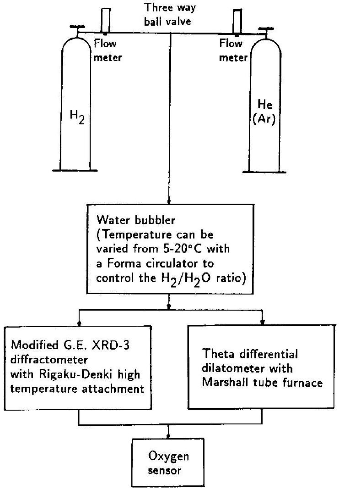
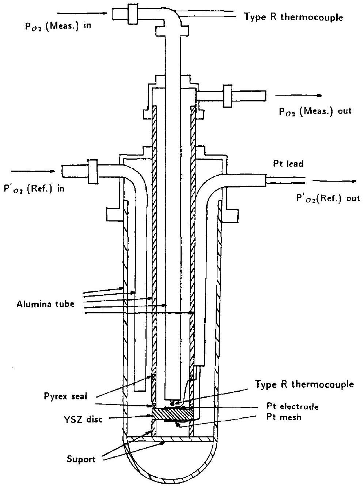
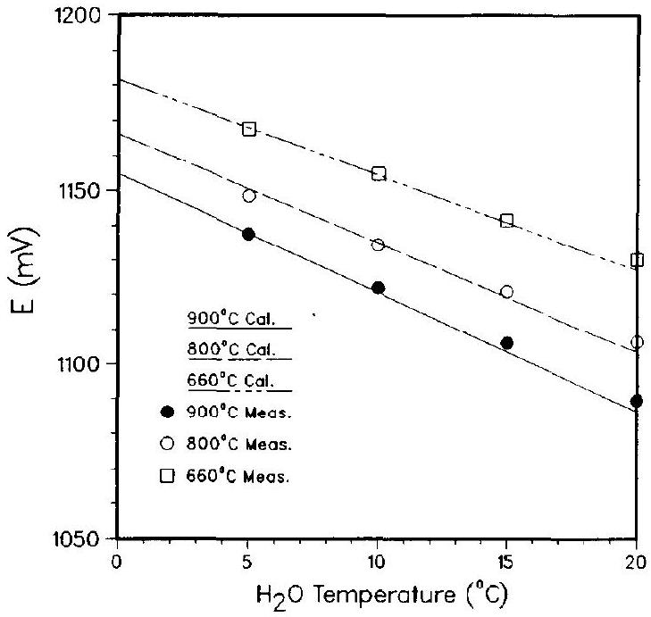
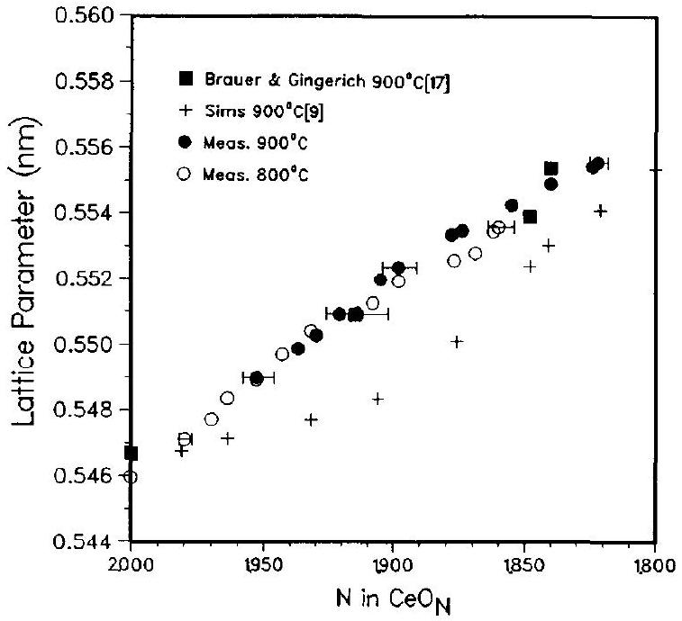
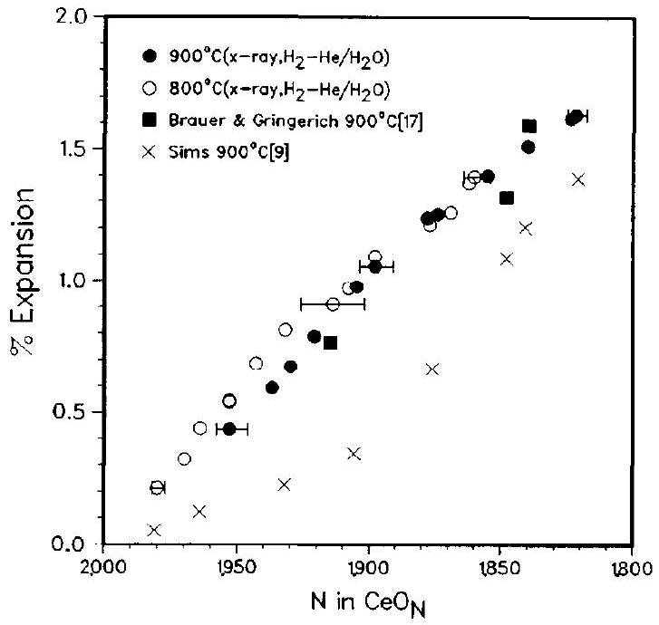
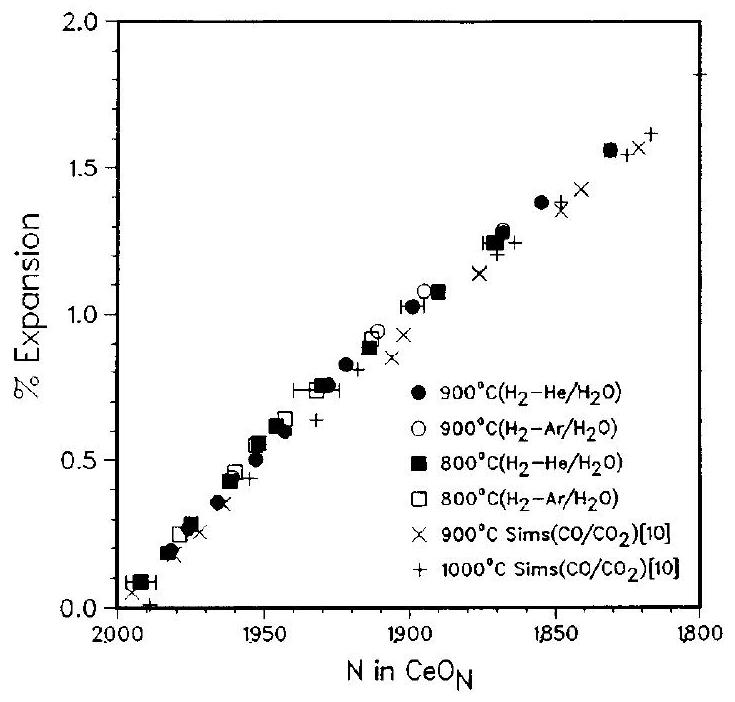
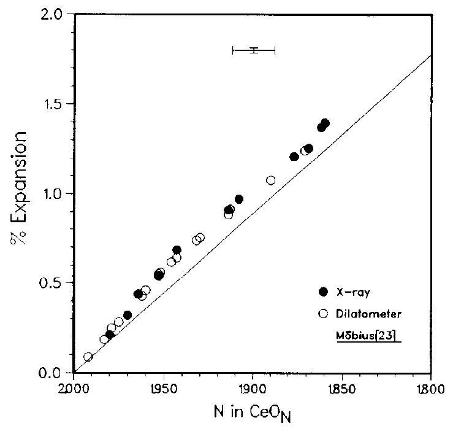
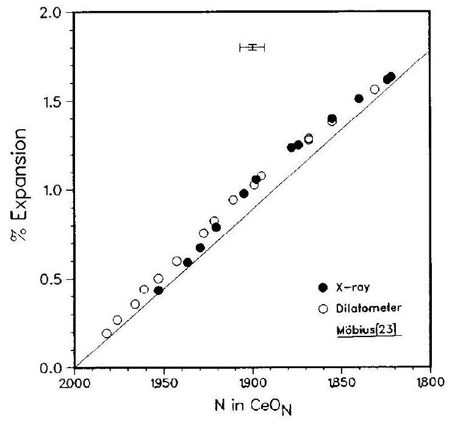

# A high temperature lattice parameter and dilatometer study of the defect structure of nonstoichiometric cerium dioxide 

Huann-Wu Chiang, Robert N. Blumenthal and Raymond A. Fournelle Department of Mechanical and Industrial Engineering, Marquette University, Milwaukee, WI 53233, USA

Received 22 February 1993; accepted for publication 11 May 1993

#### Abstract

The defect structure of $\mathrm{CeO}_{2-x}$ has been investigated over the composition range from $\mathrm{CeO}_{2}$ to $\mathrm{CeO}_{1.8}$ at 800 and $900^{\circ} \mathrm{C}$ using the combined techniques of high temperature dilatometric length change and X-ray lattice parameter measurements. The oxygen partial pressure associated with the nonstoichiometric composition was controlled by passing different ratios of $\mathrm{H}_{2} / \mathrm{He}$ mixtures through a constant temperature water bubbler and was monitored constantly with a YSZ oxygen sensor. The difference between the percent expansion for the dilatometric and X-ray lattice parameter measurements was zero, which indicated that the predominant defects of the $\mathrm{CeO}_{2-x}$ are oxygen vacancies.

## 1. Introduction

Several investigations indicate that nonstoichiometric cerium dioxide, $\mathrm{CeO}_{2-x}$, may be classified as a metal excess $n$-type semiconductor [1-3]. Early investigations led to the construction of the general form of the phase diagram in 1964 by Bevan and Kordis [4]. Among the phases identified by these investigators, a cubic fluorite structure $\alpha$ phase was found above the miscibility gap, which possessed a large range of nonstoichiometry.

The defect structure responsible for the nonstoichiometric behavior at high temperature in the single $\alpha$ phase region has been investigated by a number of different techniques including X-ray and neutron diffraction [5-7], dilatometry and X-ray measurements [8-11], electrical conductivity measurements [2,12-15], thermogravimetric measurements [15,16], oxygen self-diffusion studies [3] and oxygen dissociation measurements [17].Except for the combined use of dilatometry and X-ray diffraction to study the expansion behavior as a function of nonstoichiometric composition, all of the techniques require extensive modeling of the defect structure in order to relate the temperature dependence of the measured quantities to the nature of the defect structure. It has generally been agreed that the predominant defect in nonstoichiometric cerium dioxide is
the doubly ionized oxygen vacancy, unfortunately, an extensive dilatometry-X-ray study [9-11] using $\mathrm{CO} / \mathrm{CO}_{2}$ mixtures to control the oxygen partial pressure has shown that this may not be the case. However, in that study there was some uncertainty as to the exact oxygen content of the nonstoichiometric cerium dioxide. This uncertainty was related to the fact that measurements of the oxygen partial pressure surrounding the specimens were not made. Therefore, the objective of the present investigation was to determine the nature of the defect structure of nonstoichiometric cerium dioxide using the combined techniques of dilatometry and X-ray diffraction in such a way that the oxygen partial pressure was constantly monitored. To vary the oxygen partial pressure different ratios of hydrogen and helium gases were passed through a constant temperature water bubbler (water temperature was varied between 0 to $20^{\circ} \mathrm{C}$ ). Using this technique, a wide range of oxygen partial pressures corresponding to different nonstoichiometric compositions of cerium dioxide, $\mathrm{CeO}_{2-x}$, ranging from $x$ equal to 0 to about 0.2 could be obtained. An yttria-stabilized zirconia (YSZ) solid electrolyte was used as an oxygen sensor to monitor the oxygen partial pressure of the gas mixture after it excited the measurement chamber.

[^0]
## 2. Theory

The defect structure of pure metals was first characterized by the direct equilibrium measurement of the dilatometric length change and X-ray lattice parameter change resulting from a temperature change [18-20]. The theoretical basis for the technique is that length change with increasing temperature reflects an increase in length from both thermal expansion and the formation of equilibrium defects such as vacancies or interstitials. Changes in lattice parameter with increasing temperature detected by X-ray diffraction, on the other hand, reflect only thermal expansion effects. Thus, by comparing the results of the two measurements something can be said about the defect structure of a material.

For cubic materials the fractional change $\Delta N / N_{i}$ in the number of point defects is found to be given by

$$
\frac{\Delta N}{N_{i}}=2\left(\frac{\Delta L}{L_{i}}-\frac{\Delta a}{a_{i}}\right),
$$

where $N_{i}$ is the number of atoms, $\Delta N$ is the change in the number of point defects, $\Delta L / L_{i}$ is the fractional length change, and $\Delta a / a_{i}$ is the fractional lattice parameter change.

In the case of a metal, its length $L$ increases with increasing temperature. This results partly from an increase in the distance between lattice planes and partly from the creation of additional vacant sites inside the crystal. The lattice parameter as determined by X-ray diffraction is, however, a measure of only the increase in the average distance between lattice planes. On heating, thermal vacancies may form by the removal of atoms from the interior and to the surface of the crystal. This results in a creation of atomic sites and an increase in length. Thus, a positive $\Delta N / N_{i}$ is observed.

In nonstoichiometric oxides, in addition to thermally generated defects, defects can also result from changes in the stoichiometric composition of the material. For example, in an oxide of the type $\mathrm{CeO}_{2-x}$ possible nonstoichiometric defects include anion vacancies and cation interstitials. Anion vacancies are formed by the transfer of an anion from a normal lattice site to the gas phase, while the cation sublattice remains intact. Thus $\Delta N / N_{i}$ should be equal to zero because the number of atomic lattice sites does
not change with the nonstoichiometric composition.Cation interstitials, on the other hand, may be formed by the transfer of cations on the surface to interstitial positions and the removal of two anions to the gas phase for each cation interstitial formed. In this case, atomic sites on the surface would be destroyed to provide the cation interstitials. For this case the nonstoichiometric composition $\mathrm{Ce}_{1+y} \mathrm{O}_{2}$ is related to the change in the number of unit cells by

$$
y=\frac{\Delta N}{N_{i}}=3\left(\frac{\Delta L}{L_{i}}-\frac{\Delta a}{a_{i}}\right),
$$

where $y$ is the site fraction of cerium interstitials.
Considering the above it is evident that experimental macroscopic length and lattice parameter measurements, which can be employed to determine the change in the number of unit cells in a specimen as a function of nonstoichiometric composition at a given temperature, can be used to determine the predominant nonstoichiometric defect structure, so long as the composition can be controlled. In this respect the nonstoichiometric composition of cerium dioxide at a given temperature can be controlled by controlling the oxygen partial pressure which, in turn, can be controlled by controlling the $\mathrm{H}_{2} / \mathrm{H}_{2} \mathrm{O}$ or $\mathrm{CO} / \mathrm{CO}_{2}$ gas mixtures surrounding it. In this study $\mathrm{H}_{2}$ / $\mathrm{H}_{2} \mathrm{O}$ mixtures were used.

The oxygen partial pressure $P_{\mathrm{O}_{2}}$ of a $\mathrm{H}_{2} / \mathrm{H}_{2} \mathrm{O}$ gas mixture at a given temperature is obtained from the standard free energy change $\Delta G^{0}$ for the dissociation of $\mathrm{H}_{2} \mathrm{O}$ according to the reaction

$$
\mathrm{H}_{2} \mathrm{O}=\mathrm{H}_{2}+\frac{1}{2} \mathrm{O}_{2} .
$$

$\Delta G^{0}$ for the reaction is related to the equilibrium constant $K_{\text {eq }}$ by

$$
K_{\mathrm{eq}}=\operatorname{cxp}\left(-\Delta G^{0} / R T\right),
$$

which, in turn, is related to the partial pressures $P_{\mathrm{H}_{2} \mathrm{O}}, P_{\mathrm{O}_{2}}$ and $P_{\mathrm{H}_{2}}$ in the gas mixture by

$$
K_{\mathrm{eq}}=\frac{P_{\mathrm{O}_{2}}^{1 / 2} P_{\mathrm{H}_{2}}}{P_{\mathrm{H}_{2} \mathrm{O}}} .
$$

Considering the above and assuming that $r=P_{\mathrm{H}_{2} \mathrm{O}} / P_{\mathrm{H}_{2}}$ and that $X$ is the mole fraction of $\mathrm{H}_{2} \mathrm{O}$ dissociated it can be shown [21] that

$$
P_{\mathrm{O}_{2}}=\frac{X P_{\mathrm{T}}}{2 r+2+X}
$$

and that
$K_{\text {eq }}=\frac{(r+X)\left(X P_{\mathbf{T}}\right)^{1 / 2}}{(1-X)(2 r+2+X)^{1 / 2}}$,
where $P_{\mathrm{T}}=P_{\mathrm{H}_{2} \mathrm{O}}+P_{\mathrm{H}_{2}}+P_{\mathrm{O}_{2}}$. Thus, knowing $r$ and $K_{\text {eq }}$ or, equivalently, $\Delta G^{0}$ one can calculate $P_{\mathrm{O}_{2}}$.

Considering the above, the oxygen partial pressure can be varied by varying $r$, the $\mathrm{H}_{2} \mathrm{O} / \mathrm{H}_{2}$ ratio. This, in turn, can be varied by diluting $\mathrm{H}_{2}$ with inert gas and bubbling it through $\mathrm{H}_{2} \mathrm{O}$ at a given temperature. The $\mathrm{H}_{2} \mathrm{O}$ temperature then determines the dew point of $\mathrm{H}_{2} \mathrm{O}$ in the gas mixture and, hence, the values of $X$ and $r$. Thus, the desired oxygen partial pressure can then be obtained.

To monitor the oxygen partial pressure of a system, high temperature galvanic cells of the type
$\mathrm{Pt}, \mathrm{O}_{2}\left(P_{\mathrm{O}_{2}}\right) /$ solid oxide electrolyte $/ \mathrm{O}_{2}\left(P_{\mathrm{O}_{2}}^{\prime}\right), \mathrm{Pt}$
were connected to the system. The voltage difference between electrodes of the cell is given by the Nernst equation,
$E=\frac{R T}{4 F} \ln \frac{P_{\mathrm{O}_{2}}^{\prime}}{P_{\mathrm{O}_{2}}}$,
where $R$ is the gas constant, $F$ is the Faraday constant, $P_{\mathrm{O}_{2}}$ is the oxygen partial pressure to be measured, and $P_{\mathrm{O}_{2}}^{\prime}$ is the oxygen partial pressure of the reference gas.

By knowing the oxygen partial pressure of the reference gas, $P_{\mathrm{O}_{2}}^{\prime}$, and measuring the EMF value across the electrolyte, the oxygen partial pressure of the system at temperature $T$ can be calculated from eq. (8). In this study air was used as the reference gas. Thus, $P_{\mathrm{O}_{2}}^{\prime}$ was taken to be 0.21 atm .

## 3. Experimental

X-ray lattice parameter measurements were performed on a modified General Electric XRD-3 diffractometer equipped with a Rigaku-Denki high temperature attachment using $\mathrm{Cu} \mathrm{K} \alpha$ radiation. The lattice parameter of the cerium dioxide was determined from measurements of the $\{620\}$ peak position with the position being corrected for systematic instrumental errors using a correction based on the \{420\} peak position of a platinum powder internal standard. Cerium dioxide powder specimens with a
purity of $99.99 \%$ with respect to rare earths mixed with platinum powder were packed into a platinum specimen holder, and the surface of the specimen was made smooth with a glass slide. The specimen holder was then inserted into its position in the high temperature attachment and a type R thermocouple was inserted half way into it. The high temperature attachment consisted of a platinum-10\% rhodium wire wound furnace with two nickel foil radiation shields surrounding it. An aluminum foil served as an air tight window which permitted the X-ray beam to pass through. The temperature of the furnace was controlled by an Omega CN-9000 temperature controller. The diffractometer was aligned according to the XRD-3 and Rigaku-Denki instructions prior to each measurement. The operating conditions of the diffractometer were as follows: $\mathrm{Cu} \mathrm{K} \alpha$ radiation, 40 kV , $20 \mathrm{~mA}, 4^{\circ}$ take-off angle, $3^{\circ}$ beam slit, medium resolution Soller slit, $0.1^{\circ}$ detector slit, $0.2^{\circ} 2 \theta / \mathrm{min}$ scaling speed, and a 1.0 s time constant.

The macroscopic length change measurements were made using a Theta differential dilatometer utilizing a $2 \%$ Dilaflex measuring head. The Dilaflex measuring head consisted of a linear variable differential transformer in which the core and the coil of the transformer were displaced by the specimen and alumina reference standard, respectively, by means of pushrods. The sintered alumina pushrods, the specimen holder, and the reference standard system were used in the dilatometer to transmit the expansions to the transducer. A 5.433 mm long cerium dioxide bar with a purity of $99.99 \%$ with respect to rare earths from the study of Sims [10] was used as a specimen, while a McDanial alumina rod of the same length was used as a reference standard. A Marshall tube furnace with a Honeywell UDC 401 controller was used to control the temperature of the specimen, while a type R thermocouple was used to measure the specimen temperature. It was located approximately 1 mm from the specimen and the reference standard. The head plate temperature of the dilatometer was kept at a constant temperature of $40 \pm 0.5^{\circ} \mathrm{C}$ by circulating water through a passage in the head plate with a HAAKE Model FE constant temperature circulator. The transducer output voltage was found to be a function of gas flow rate and gas mixture for a given temperature. Thus, transducer output voltage due to the expansion of the
specimen was taken to be the total output minus the output due to the effect of the gas flow. All measurements were made when the specimen length did not change with time. More detailed description of apparatus and procedures of the X-ray and dilatometer units can be found in [21].

To control the oxygen partial pressure of gas mixtures over specimens different ratios of pure hydrogen and pure helium (or pure argon) gases were passed through a glass water bubbler. For X-ray measurements, argon gas decreased the intensity of the X-ray diffraction lines so dramatically that only helium gas was used. For dilatometer measurements, both helium and argon were used to double check the results of the expansion as a function of nonstoichiometric composition. The gas flow rates were controlled with Nupro valves and monitored with Matheson 602 flowmeters. To control the $\mathrm{H}_{2} \mathrm{O}$ dew point the temperature of the water in the water bubbler was varied from 5 to $20^{\circ} \mathrm{C}$ using a Forma circulator. The controlled atmosphere gas was then passed through either the X-ray unit or the dilatometer unit. An yttria-stabilized zirconia oxygen sensor was connected to the exhaust end of the X-ray unit or dilatometer unit to measure the oxygen content of the gas mixture. Fig. 1 shows a schematic diagram of the whole experimental setup.

The oxygen sensor unit consists of an yttria-stabilized zirconia (YSZ) solid electrolyte disk with platinum electrodes on both sides attached to the end of an alumina tube as shown in fig. 2. On one side of the YSZ disk was the gas whose oxygen partial pressure was to be determined. On the other side was a reference gas with a constant oxygen partial pressure. In this study air was used as the reference gas. The oxygen sensor was operated in a Marshall tube furnace at the same temperature as the X-ray or dilatometer unit. The temperature of the oxygen sensor was controlled using an Omega CN 2000 temperature controller and measured with an $R$ type thermocouple.

Both X-ray diffraction and dilatometric expansion measurements were obtained for cerium dioxide as a function of nonstoichiometric composition by varying the oxygen partial pressure of the specimen at 800 and $900^{\circ} \mathrm{C}$. The nonstoichiometric compositions of the specimens corresponding to the various oxygen partial pressures were obtained from the

Fig. 1. Schematic diagram of the atmosphere control system.

results of published thermogravimetric measurements [16].

## 4. Results and discussion

### 4.1. Oxygen sensor measurements

To evaluate the accuracy of the atmosphere control system it was checked by passing $\mathrm{H}_{2}-\mathrm{H}_{2} \mathrm{O}$ gas mixtures of known oxygen partial pressures through it. The oxygen partial pressure was controlled by passing pure hydrogen through a water bubbler at constant temperatures ranging from 5 to $20^{\circ} \mathrm{C}$. The oxygen partial pressures were then measured with the YSZ oxygen sensor at the temperatures 900,800 and $660^{\circ} \mathrm{C}$ for each water vapor content. Electromotive force values $E$ were measured both before and after passing the gas mixture through the X-ray unit or the

Fig. 2. Schematic diagram of the oxygen sensor.

dilatometer unit. Both values agreed with each other within experimental error insuring that no leakage occurred in either the X-ray unit or the dilatometer unit. Experimental $E$ values obtained from the sensor and theoretical values calculated from the available free energy change $\Delta G^{\circ}$ values [22] and eqs. (4)-(8) are given in table 1 and fig. 3. As can be seen in fig. 3, the discrepancy between the measured values and the calculated values increases with increasing water temperature. This is because it becomes more difficult for the gas mixture to be saturated with water vapor as water temperature increases. Hence, the discrepancy between the mea-
sured values and the calculated values may be even less than the observed 3.5 mV .3 .5 mV corresponds to an uncertainty of about 160 cal in $\Delta G^{0}$.

### 4.2. X-ray measurements

Lattice parameter measurements were obtained for cerium dioxide as a function of nonstoichiometric composition by varying the oxygen partial pressure of the specimen at constant temperature. The percent expansion was calculated using the following equation

Table 1
Comparison of the measured and calculated $E$ and $P_{\mathrm{O}_{2}}$ values from the oxygen sensor for the pure hydrogen passing through a constant temperature water bubbler.
| Sensor temp. $\left({ }^{\circ} \mathrm{C}\right)$ | $\mathrm{H}_{2} \mathrm{O}$ temp. $\left({ }^{\circ} \mathrm{C}\right)$ | $P_{\mathrm{O}_{2}}$ (atm) | Meas. $E$ (mV) | cal. $P_{\mathrm{O}_{2}}$ (atm) | Cal. $E$ (mV) | $\Delta E$ (mV) |
| :--- | :--- | :--- | :--- | :--- | :--- | :--- |
| 900 | 5 | $5.9 \times 10^{-21}$ | 1137.6 | $6.1 \times 10^{-21}$ | 1136.8 | +1.0 |
| 900 | 10 | $1.1 \times 10^{-21}$ | 1121.9 | $1.2 \times 10^{-21}$ | 1119.4 | +2.5 |
| 900 | 15 | $2.1 \times 10^{-20}$ | 1106.1 | $2.4 \times 10^{-20}$ | 1102.6 | +3.5 |
| 900 | 20 | $4.0 \times 10^{-20}$ | 1089.5 | $4.5 \times 10^{-20}$ | 1086.3 | +3.2 |
| 800 | 5 | $5.6 \times 10^{-23}$ | 1148.5 | $5.3 \times 10^{-23}$ | 1149.5 | -1.0 |
| 800 | 10 | $1.0 \times 10^{-22}$ | 1134.3 | $1.1 \times 10^{-22}$ | 1133.8 | +0.5 |
| 800 | 15 | $1.8 \times 10^{-22}$ | 1120.9 | $2.0 \times 10^{-22}$ | 1118.4 | +2.5 |
| 800 | 20 | $3.4 \times 10^{-22}$ | 1106.5 | $3.9 \times 10^{-22}$ | 1103.5 | +3.0 |
| 660 | 5 | $1.2 \times 10^{-26}$ | 1167.8 | $1.3 \times 10^{-26}$ | 1167.3 | +0.5 |
| 660 | 10 | $2.4 \times 10^{-26}$ | 1154.7 | $2.5 \times 10^{-26}$ | 1153.4 | +1.3 |
| 660 | 15 | $4.6 \times 10^{-26}$ | 1141.5 | $4.9 \times 10^{-26}$ | 1140.0 | +1.5 |
| 660 | 20 | $8.1 \times 10^{-26}$ | 1130.1 | $9.3 \times 10^{-26}$ | 1127.1 | +3.0 |

Fig. 3. Comparison of the measured and calculated $E$ values from the oxygen sensor for pure hydrogen passing through a constant temperature water bubbler.

$$
\operatorname{Expansion}(\%)=\frac{a^{\mathrm{sp}, \mathrm{n}}-a^{\mathrm{sp}}}{a^{\mathrm{sp}}} \times 100,
$$

where $a^{\text {sp,n }}$ is the lattice parameter of the specimen at the nonstoichiometric composition, $\mathrm{CeO}_{2-x}$, and the temperature $T$ and $a^{\text {sp }}$ is the lattice parameter of the specimen at the near stoichiometric composition (in air), $\approx \mathrm{CeO}_{2}$ [16] and the temperature $T$.

The results of the lattice parameter measurements
and the corresponding percent expansions for the various oxygen partial pressures and nonstoichiometric compositions for the temperatures 800 and $900^{\circ} \mathrm{C}$ are given in tables 2 and 3, respectively. The data was obtained in the order presented for several reduction and oxidation runs through the specimen composition range. Fig. 4 shows the results of the lattice parameter measurements as a function of nonstoichiometric composition. The nonstoichiometric compositions of the specimens corresponding to the various oxygen partial pressures were obtained from the results of published thermogravimetric measurements [16] as mentioned previously. The lattice parameter values obtained by Brauer and Gingerich [17] and by Sims [9] at $900^{\circ} \mathrm{C}$ are also presented for comparison. As can be seen the values are higher than those obtained by Sims but in good agreement with those of Brauer and Gingerich. A plot of the percent expansion as a function of the nonstoichiometric composition of the cerium dioxide is shown in fig. 5 . As can be seen there is a slight discrepancy in the expansion behavior between 800 and $900^{\circ} \mathrm{C}$ in the region from $\mathrm{CeO}_{1.92}$ to $\mathrm{CeO}_{1.96}$. In the region from $\mathrm{CeO}_{1.8}$ to $\mathrm{CeO}_{1.9}$, the expansion values for both 800 and $900^{\circ} \mathrm{C}$ agree within the experimental error. It can also be seen in fig. 5 that the measured percent expansion values fall between values calculated from the data of Brauer and Gingerich [17].

The methods of calculating the uncertainties as-

Table 2
X-ray lattice parameter $a$ and percent expansion $\Delta a / a$ values for cerium dioxide as a function of nonstoichiometric composition at $800^{\circ} \mathrm{C}$.
| E (mV) | $P_{\mathrm{O}_{2}}$ (atm) | $-\log P_{\mathrm{O}_{2}}$ | $N$ in $\mathrm{CeO}_{N}$ | $2 \theta$ (620) $\left({ }^{\circ}\right)$ | $a$ (nm) | $\Delta a / a$ (\%) |
| :--- | :--- | :--- | :--- | :--- | :--- | :--- |
| - | in air $\left(25^{\circ} \mathrm{C}\right)$ | - | 2.000 | 128.39 | 0.54111 | - |
| - | in air $\left(800^{\circ} \mathrm{C}\right)$ | - | 2.000 | 126.32 | 0.54597 | - |
| 1028.0 | $1.0 \times 10^{-20}$ | 20.00 | 1.980 | 125.84 | 0.54713 | 0.212 |
| 1051.8 | $3.6 \times 10^{-21}$ | 20.44 | 1.970 | 125.60 | 0.54772 | 0.321 |
| 1071.3 | $1.6 \times 10^{-21}$ | 20.79 | 1.953 | 125.12 | 0.54891 | 0.538 |
| 1094.0 | $5.9 \times 10^{-22}$ | 21.23 | 1.908 | 124.18 | 0.55127 | 0.971 |
| 1076.8 | $1.2 \times 10^{-21}$ | 20.92 | 1.943 | 124.80 | 0.54971 | 0.685 |
| 1090.5 | $6.8 \times 10^{-22}$ | 21.17 | 1.914 | 124.31 | 0.55094 | 0.910 |
| 1117.0 | $2.2 \times 10^{-22}$ | 21.66 | 1.877 | 123.67 | 0.55258 | 1.211 |
| 1138.8 | $8.5 \times 10^{-23}$ | 22.07 | 1.860 | 123.28 | 0.55359 | 1.396 |
| - | in air $\left(26^{\circ} \mathrm{C}\right)$ | - | 2.000 | 128.38 | 0.54113 | - |
| - | in air $\left(800^{\circ} \mathrm{C}\right)$ | - | 2.000 | 126.33 | 0.54594 | - |
| 1126.0 | $1.5 \times 10^{-22}$ | 21.82 | 1.869 | 123.58 | 0.55281 | 1.258 |
| 1071.0 | $1.6 \times 10^{24}$ | 20.79 | 1.953 | 125.12 | 0.54891 | 0.544 |
| - | in air ( $26^{\circ} \mathrm{C}$ ) | - | 2.000 | 128.38 | 0.54113 | - |
| - | in air ( $800^{\circ} \mathrm{C}$ ) | - | 2.000 | 126.32 | 0.54597 | - |
| 1060.0 | $2.6 \times 10^{-21}$ | 20.58 | 1.964 | 125.34 | 0.54836 | 0.438 |
| 1082.0 | $9.9 \times 10^{-22}$ | 21.00 | 1.932 | 124.52 | 0.55041 | 0.813 |
| 1135.0 | $1.0 \times 10^{-22}$ | 22.00 | 1.862 | 123.33 | 0.55346 | 1.372 |
| 1100.0 | $4.5 \times 10^{-22}$ | 21.35 | 1.898 | 123.92 | 0.55194 | 1.093 |

sociated with the determination of the lattice parameter and percent expansion and the uncertainties in the nonstoichiometric composition shown in figs. 4 and 5 can be found in [21]. As can be seen the uncertainties in the lattice parameter and percent expansion are smaller than the data points themselves. The uncertainties in nonstoichiometric composition, on the other hand, are result mainly from the uncertainty in the temperature measurements. The temperature uncertainties in the X-ray measurements were estimated to be $\pm 5.8$ and $\pm 6.2^{\circ} \mathrm{C}$ at 800 and $900^{\circ} \mathrm{C}$ respectively.

### 4.3. Dilatometric measurements

Thermal expansion measurements were made for cerium dioxide as a function of nonstoichiometric composition at 800 and $900^{\circ} \mathrm{C}$. The percent expansion at constant temperature was calculated using the following equation

Expansion $(\%)=\frac{L^{\mathbf{s p}, \mathbf{n}}-L^{\mathbf{s p}}}{L^{\mathbf{s p}}} \times 100$,
where $L^{\mathrm{sp}, \mathrm{n}}$ is the length of the specimen at the nonstoichiometric composition, $\mathrm{CeO}_{2-x}$, and temperature $T$ and $L^{\mathrm{sp}}$ is the length of the specimen at the near stoichiometric composition (in air), $\approx \mathrm{CeO}_{2}$, and temperature $T . L^{\mathrm{sp}, \mathrm{n}}$ and $L^{\mathrm{sp}}$ can be calculated using the following equation
$L^{\mathrm{sp}}=L_{0}^{\mathrm{ref}}(1+\alpha \Delta T) \frac{\text { transducer output (mV) }}{\text { calibration factor (mV/in) }}$,
where $L_{0}^{\text {ref }}$ is the initial reference standard length at temperature $T_{0}, \alpha$ is the thermal expansion coefficient of the reference standard, and $\Delta T=T-T_{0}$ is the change in temperature. Here the calibration factor of the amplifier was $10000 \mathrm{mV} / \mathrm{in}$.

The results of the dilatometric measurements at 800 and $900^{\circ} \mathrm{C}$ are given in tables 4 and 5 and fig. 6. The data include measurements obtained from atmospheres controlled by using hydrogen water mixtures mixed with both helium and argon gases. As can be seen the uncertainty in the determination of the percent expansion of nonstoichiometric cerium

Table 3
X-ray lattice parameter $a$ and percent expansion $\Delta a / a$ values for cerium dioxide as a function of nonstoichiometric composition at $900^{\circ} \mathrm{C}$.
| E (mV) | $P_{\mathrm{O}_{2}}$ (atm) | $-\log P_{\mathrm{O}_{2}}$ | $N$ in $\mathrm{CeO}_{N}$ | $2 \theta$ (620) ( ${ }^{\circ}$ ) | $a$ (nm) | $\Delta a / a$ (\%) |
| :--- | :--- | :--- | :--- | :--- | :--- | :--- |
| - | in air $\left(25^{\circ} \mathrm{C}\right)$ | - | 2.000 | 128.39 | 0.54111 | - |
| - | in air $\left(900^{\circ} \mathrm{C}\right)$ | - | 2.000 | 126.04 | 0.54665 | - |
| 980.0 | $3.0 \times 10^{-18}$ | 17.52 | 1.937 | 124.73 | 0.54988 | 0.591 |
| 1124.6 | $9.9 \times 10^{-21}$ | 20.00 | 1.822 | 122.53 | 0.55557 | 1.632 |
| 1091.5 | $3.7 \times 10^{-20}$ | 19.43 | 1.840 | 122.78 | 0.55491 | 1.511 |
| 1042.5 | $2.5 \times 10^{-19}$ | 18.60 | 1.874 | 123.32 | 0.55349 | 1.251 |
| 1009.9 | $9.3 \times 10^{-19}$ | 18.03 | 1.905 | 123.90 | 0.55199 | 0.977 |
| - | in air $\left(25^{\circ} \mathrm{C}\right)$ | - | 2.000 | 128.39 | 0.54111 | - |
| - | in air $\left(900^{\circ} \mathrm{C}\right)$ | - | 2.000 | 126.06 | 0.54660 | - |
| 986.5 | $2.3 \times 10^{-18}$ | 17.64 | 1.930 | 124.57 | 0.55028 | 0.673 |
| 1069.0 | $8.9 \times 10^{-20}$ | 19.05 | 1.855 | 123.03 | 0.55425 | 1.399 |
| 1038.0 | $3.0 \times 10^{-19}$ | 18.52 | 1.878 | 123.37 | 0.55336 | 1.237 |
| 1016.5 | $7.1 \times 10^{-19}$ | 18.15 | 1.898 | 123.75 | 0.55237 | 1.056 |
| - | in air $\left(25^{\circ} \mathrm{C}\right)$ | - | 2.000 | 128.39 | 0.54111 | - |
| - | in air $\left(900^{\circ} \mathrm{C}\right)$ | - | 2.000 | 126.06 | 0.54660 | - |
| 964.5 | $5.6 \times 10^{-18}$ | 17.25 | 1.953 | 125.09 | 0.54898 | 0.435 |
| 996.0 | $1.6 \times 10^{-18}$ | 17.79 | 1.921 | 124.32 | 0.55092 | 0.790 |
| 1121.0 | $1.1 \times 10^{-20}$ | 19.96 | 1.824 | 122.58 | 0.55544 | 1.617 |

Fig. 4. Lattice parameter $\mathbf{a}$ of a cerium dioxide versus nonstoichiometric composition.

dioxide is so small that it is less than the size of the data points. As can be seen in fig. 6, no significant difference between the 800 and $900^{\circ} \mathrm{C}$ isotherms is observed. Also included in fig. 6 are the measure-

Fig. 5. Percent expansion of cerium dioxide versus nonstoichiometric composition from the X-ray lattice parameter measurements.

ments obtained by Sims [10] at 800 and $900^{\circ} \mathrm{C}$ using $\mathrm{CO} / \mathrm{CO}_{2}$ mixtures to control the oxygen partial pressure. The measured data exhibit slightly higher

Table 4
Dilatometric length $L^{\text {sp, } n}$ and percent expansion $\Delta L / L$ values for cerium dioxide as a function of nonstoichiometric composition at $800^{\circ} \mathrm{C}$.
| E (mV) | $P_{\mathrm{O}_{2}}$ (atm) | $-\log P_{\mathrm{O}_{2}}$ | $N$ in $\mathrm{CeO}_{N}$ | $L^{\mathrm{sp}, \mathrm{n}}$ (mm) | $\Delta L / L$ (\%) |
| :--- | :--- | :--- | :--- | :--- | :--- |
| - | in air $\left(32.2^{\circ} \mathrm{C}\right)$ | - | 2.000 | 5.4229 | - |
| - | in air ( $800^{\circ} \mathrm{C}$ ) | - | 2.000 | 5.4714 | - |
| 953.8 | $2.5 \times 10^{-19}$ | 18.60 | 1.992 | 5.4762 | 0.088 |
| 1015.8 | $1.7 \times 10^{-20}$ | 19.77 | 1.983 | 5.4816 | 0.186 |
| 1072.1 | $1.5 \times 10^{-21}$ | 20.82 | 1.952 | 5.5021 | 0.561 |
| 1090.1 | $7.0 \times 10^{-22}$ | 21.15 | 1.914 | 5.5197 | 0.883 |
| 1123.3 | $1.7 \times 10^{-22}$ | 21.77 | 0.871 | 5.5395 | 1.245 |
| 1104.9 | $3.7 \times 10^{-22}$ | 21.43 | 1.890 | 5.5303 | 1.076 |
| 1082.8 | $9.6 \times 10^{-22}$ | 21.02 | 1.930 | 5.5126 | 0.753 |
| 1075.5 | $1.3 \times 10^{-21}$ | 20.89 | 1.946 | 5.5052 | 0.618 |
| 1062.5 | $2.3 \times 10^{-21}$ | 20.64 | 1.962 | 5.4948 | 0.428 |
| 1042.8 | $5.4 \times 10^{-21}$ | 20.27 | 1.975 | 5.4869 | 0.283 |
| 1064.4 | $2.1 \times 10^{-21}$ | 20.68 | 1.960 | 5.4965 | 0.459 |
| 1091.5 | $6.5 \times 10^{-22}$ | 21.19 | 1.913 | 5.5214 | 0.914 |
| 1081.7 | $1.0 \times 10^{-21}$ | 21.00 | 1.932 | 5.5118 | 0.738 |
| 1076.9 | $1.2 \times 10^{-21}$ | 20.92 | 1.943 | 5.5065 | 0.642 |
| 1071.4 | $1.6 \times 10^{-21}$ | 20.79 | 1.953 | 5.5016 | 0.552 |
| 1032.7 | $8.3 \times 10^{-21}$ | 20.08 | 1.979 | 5.4851 | 0.250 |

Table 5
Dilatometric length $L^{\text {sp.n }}$ and percent expansion $\Delta L / L$ values for cerium dioxide as a function of nonstoichiometric composition at $900^{\circ} \mathrm{C}$.
| $E$ (mV) | $P_{\mathrm{O}_{2}}$ (atm) | $-\log P_{\mathrm{O}_{2}}$ | $N \mathrm{in} \mathrm{CeO}_{N}$ | $L^{\mathrm{ep} . \mathrm{n}}$ (mm) | $\Delta L / L$ (\%) |
| :--- | :--- | :--- | :--- | :--- | :--- |
| - | in air $\left(32.3^{\circ} \mathrm{C}\right)$ | - | 2.000 | 5.4229 | - |
| - | in air $\left(900^{\circ} \mathrm{C}\right)$ | - | 2.000 | 5.4795 | - |
| 920.5 | $3.2 \times 10^{-17}$ | 16.49 | 1.976 | 5.4943 | 0.270 |
| 963.6 | $5.8 \times 10^{-18}$ | 17.24 | 1.953 | 5.5070 | 0.502 |
| 994.7 | $1.7 \times 10^{-18}$ | 17.77 | 1.922 | 5.5247 | 0.825 |
| 1107.5 | $1.9 \times 10^{-20}$ | 19.72 | 1.831 | 5.5651 | 1.562 |
| 1068.7 | $9.0 \times 10^{-20}$ | 19.05 | 1.855 | 5.5552 | 1.382 |
| 1015.4 | $1.8 \times 10^{-19}$ | 18.74 | 1.868 | 5.5496 | 1.279 |
| 1050.6 | $7.5 \times 10^{-19}$ | 18.12 | 1.899 | 5.5357 | 1.026 |
| 989.1 | $2.1 \times 10^{-18}$ | 17.68 | 1.928 | 5.5209 | 0.755 |
| 974.5 | $3.8 \times 10^{-18}$ | 17.42 | 1.943 | 5.5123 | 0.599 |
| 943.3 | $1.3 \times 10^{-17}$ | 16.89 | 1.966 | 5.4991 | 0.358 |
| 896.9 | $8.1 \times 10^{-17}$ | 16.09 | 1.982 | 5.4902 | 0.195 |
| 1050.0 | $1.9 \times 10^{-19}$ | 18.72 | 1.868 | 5.5501 | 1.288 |
| 1019.4 | $6.4 \times 10^{-19}$ | 18.19 | 1.895 | 5.5385 | 1.077 |
| 1004.6 | $1.1 \times 10^{-18}$ | 17.96 | 1.911 | 5.5311 | 0.942 |
| 954.3 | $8.4 \times 10^{-18}$ | 17.08 | 1.961 | 5.5037 | 0.442 |

values than those of Sims. A change in the slope of the percent expansion versus nonstoichiometric composition curve was found at approximately
$\mathrm{CeO}_{1.91}$. This was also observed by Sims, although he found that the change in the slope was between $\mathrm{CeO}_{1.87}$ to $\mathrm{CeO}_{1.90}$.

Fig. 6. Percent expansion of cerium dioxide versus nonstoichiometric composition from dilatometric measurements.

The uncertainty in the determination of the percent expansion of nonstoichiometric cerium dioxide shown in fig. 6 is so small that it is less than the size of the data points. The uncertainties in nonstoichiometric composition shown result mainly from the uncertainty in the temperature measurements as described in section 4.3. The temperature uncertainties in the dilatometric measurements were estimated to be $\pm 2.6$ and $\pm 2.8^{\circ} \mathrm{C}$ at 800 and $900^{\circ} \mathrm{C}$, respectively.

### 4.4. Defect structure analysis

To determine the nature of the defect structure of nonstoichiometric cerium dioxide at large departures from stoichiometry in the single $\alpha$ phase region, the results of the X-ray lattice parameter measurements were compared with the results of the dilatometric length change measurements at both 800 and $900^{\circ} \mathrm{C}$ (figs. 7 and 8). The error bars shown reflect the uncertainties in the X-ray lattice parameter measurements $\left( \pm 0.015 \%\right.$ for $800^{\circ} \mathrm{C}$ and $\pm 0.016 \%$ for $900^{\circ} \mathrm{C}$ ) and the uncertainties in nonstoichiometric composition $\left( \pm 0.012\right.$ for $800^{\circ} \mathrm{C}$ and $\pm 0.007$ for $900^{\circ} \mathrm{C}$ ) at $\mathrm{CeO}_{1.9}$.

The uncertainties in the dilatometric length percent expansion are $\pm 0.006 \%$ for both 800 and

Fig. 7. Percent expansion of cerium dioxide versus nonstoichiometric composition at $800^{\circ} \mathrm{C}$.

Fig. 8. Percent expansion of cerium dioxide versus nonstoichiometric composition at $900^{\circ} \mathrm{C}$.

$900^{\circ} \mathrm{C}$, while the uncertainties associated with the nonstoichiometric compositions are $\pm 0.008$ for $800^{\circ} \mathrm{C}$ and $\pm 0.004$ for $900^{\circ} \mathrm{C}$ at $\mathrm{CeO}_{1.9}$.

As can be seen in figs. 7 and 8, the difference between the expansion obtained from the X-ray lattice parameter measurements and that obtained from the dilatometric measurements is almost zero except for a slight discrepancy between $\mathrm{CeO}_{1.93}$ and $\mathrm{CeO}_{1.96}$ at
$900^{\circ} \mathrm{C}$. However, considering the uncertainty in the nonstoichiometric composition of cerium dioxide in this region, there is a question as to whether this discrepancy exists at all. Thus, the percent expansion obtained from the dilatometric measurements was found to be essentially the same as the percent expansion obtained from the X-ray lattice parameter measurements. This satisfies the requirement of the anion vacancy being the predominant defect, that is, $\Delta N / N_{i}=0$. As such, the predominant defect in nonstoichiometric cerium dioxide is concluded to be the oxygen vacancy.

The earlier similar study by Sims [10-12] using $\mathrm{CO} / \mathrm{CO}_{2}$ mixtures to control the oxygen partial pressure indicated that $\Delta N / N_{i}$ is positive. This does not support an argument for either cerium interstitials or oxygen vacancies as the predominant defect. The problem in this study was thought to be due to either thermal separation in the high temperature X-ray attachment or to a leakage in the X-ray camera. However, using different gas flow rates to control the oxygen partial pressure as well as the nonstoichiometric composition does not show a significant thermal separation effect in the high temperature X-ray attachment.Also, thermal separation may result in a negative $\Delta N / N_{i}$ value rather than a positive value. Hence, air leaks into the X-ray camera, which would increase the oxygen partial pressure, was thought to be the most likely cause of the positive $\Delta N / N_{i}$ value.

Comparison of the measured percent expansions with the percent expansions calculated from Möbius [23] shows that the measured values are slightly higher (figs. 7 and 8). The calculated curve is based on data obtained at $1400^{\circ} \mathrm{C}$ and the assumption that the lattice parameter increases linearly by the factor $0.00024 \mathrm{~nm} / \mathrm{mol} \% \mathrm{Ce}_{2} \mathrm{O}_{3}$ with $\mathrm{Ce}_{2} \mathrm{O}_{3}$ additions. The fact that the slopes of the measured percent expansion curves are different from the calculated curve suggests that a more complicated process than the simple mixing of $\mathrm{CeO}_{2}$ with $\mathrm{Ce}_{2} \mathrm{O}_{3}$ may occur in the nonstoichiometric cerium dioxide.

## 5. Summary and conclusions

The nature of the defect structure of nonstoichiometric cerium dioxide at large departures from stoichiometry has been investigated using the combined techniques of high temperature dilatometric length change and X-ray lattice parameter measure-
ments. The results show that the difference between the percent expansion for the dilatometric and X-ray lattice parameter measurements was zero within the experimental error, which confirms that the predominant defects of the nonstoichiometric cerium dioxide are oxygen vacancies.

## References

[1] J. Rudoph, Z. Naturforsch. 14a (1959) 727.
[2] C.J. Kevane, E.L. Holverson and R.D. Watson, J. Appl. Phys. 34 (1963) 2083.
[3] B.C.H. Steele and J.M. Floyd, Proc. Brit. Ceram. Soc. 19 (1971) 55.
[4]D.J.M. Bevan and J. Kordis, J. Inorg. Nucl. Chem. 16 (1964) 87.
[5] J.J. Faber, M.A. Seitz and M.H. Mueller, J. Phys. Chem. Solids 37 (1976) 903.
[6] J.J. Faber, M.A. Seitz and M.H. Mueller, J. Phys. Chem. Solids 37 (1976) 909.
[7] S.P. Ray, A.S. Nowick and D.E. Cox, J. Solid State Chem. 15 (1975) 344.
[8] Y. Ban and A.S. Nowick, in: Proc. Sth Materials Research Symp., eds. R.S. Roth and S.J. Schneider Jr. (N.B.S. Special Publication No. 364, 1971) p. 352.
[9] J.R. Sims and R.N. Blumenthal, High Temp. Sci. 8 (1976) 99.
[10] J.R. Sims and R.N. Blumenthal, High Temp. Sci. 8 (1976) 111.
[11] J.R. Sims and R.N. Blumenthal, High Temp. Sci. 8 (1976) 121.
[12] E.H. Greener, J.M. Wimmer and W.H. Hirthe, in: Rare Earth Research II, ed. K.S. Vorres (Gordon and Breach, New York, 1964) p. 539.
[13] R.N. Blumenthal and J.E. Lauback, in: Anisotropy in SingleCrystal Refractory Compounds, eds. M.S. Seltze and S.A. Mersol (Plenum Press, New York, 1968) p. 137.
[14]R.N. Blumenthal, P.W. Lee and R.J. Panlener, J. Electrochem. Soc. 118 (1971) 123.
[15]R.W.G. Wyckoff, in: Crystal Structure, Vol. 1 (Wiley Interscience, New York, 1963) p. 239.
[16] R.J. Panlener, R.N. Blumenthal and J.E. Garnier, J. Phys. Chem. Solids 36 (1975) 1213.
[17] G. Brauer and K.A. Gingerich, J. Inorg. Nucl. Chem. 16 (1960) 87.
[18] R.O. Simmons and R.W. Balluffi, Phys. Rev. 117 (1960) 52.
[19] R.O. Simmons and R.W. Balluffi, Phys. Rev. 119 (1960) 600.
[20] R.O. Simmons and R.W. Balluffi, Phys. Rev. 125 (1962) 862.
[21] H.W. Chiang, Ph.D. Dissertation (Marquette University, Milwaukee, WI, 1992).
[22] C.E. Wick and F.E. Block, Thermodynamical Properties of 65 Elements - Their Oxide, Halide, Carbides and Nitrides, Bureau of Mines Bull. 605 (1965) 54.
[23] H.H. Möbius, Z. Chem. 4 (1964) 81.

[^0]:    Elsevier Science Publishers B.V.

