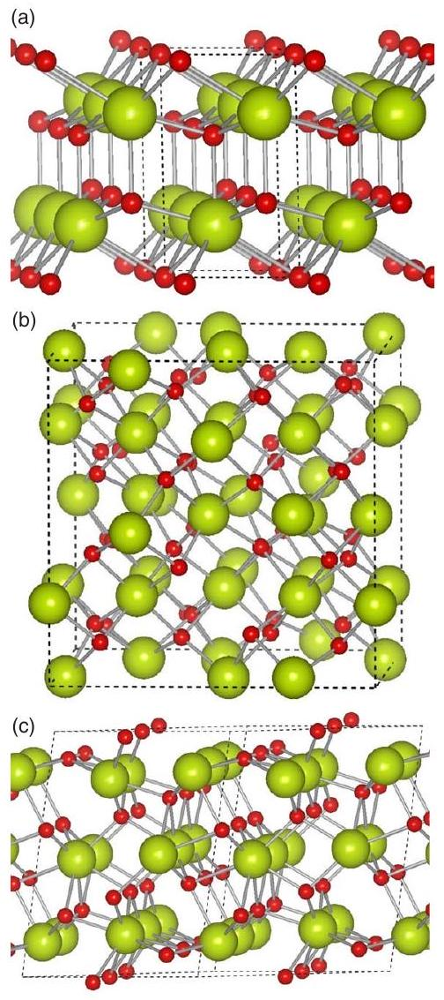

# Stability of the $\mathrm{Ce}_{2} \mathrm{O}_{3}$ phases: A DFT $+\boldsymbol{U}$ investigation 

Juarez L. F. Da Silva* Institut für Chemie, Humboldt-Universität zu Berlin, Unter den Linden 6, D-10099 Berlin, Germany

(Received 26 July 2007; published 30 November 2007)

#### Abstract

We report a first-principles investigation of the energetics and structure properties of $\mathrm{CeO}_{1.50}$ in the hexagonal ( $\mathrm{La}_{2} \mathrm{O}_{3}$ ), cubic (bixbyite), and monoclinic structures. Our calculations are based on density functional theory within the local density approximation (LDA), generalized gradient approximation (GGA), LDA $+U$, and GGA $+U$ functionals. The hexagonal (cubic) structure is $53 \mathrm{meV} / \mathrm{CeO}_{1.50}\left(57 \mathrm{meV} / \mathrm{CeO}_{1.50}\right)$ lower in energy than the cubic (hexagonal) structure using $\mathrm{LDA}+U(\mathrm{GGA}+U)$, which is consistent (in disagreement) with experimental observations. Thus, these results might indicate a superior description of cerium oxides by the $\mathrm{LDA}+U$ functional. We found that $V_{0}^{\mathrm{CeO} \mathrm{O}_{1.50} \text {,hexagonal }} \approx V_{0}^{\mathrm{CeO} 2 \text {,fluorite }}$, while $V_{0}^{\mathrm{CeO} \mathrm{O}_{1.50} \text {, cubic }}$ is $4 \%-9 \%$ larger than $V_{0}^{\mathrm{CeO}}{ }_{2}$,fluorite , where $V_{0}$ is the equilibrium volume per f.u. Therefore, only the results for $\mathrm{CeO}_{1.50}$ in the cubic structure can explain the volume expansion of $\mathrm{CeO}_{2}$ upon reduction conditions, which supports experimental observations of a cubiclike structure for partially reduced $\mathrm{CeO}_{2}$. The volume expansion is due to the change in the oxidation state of the Ce atoms from $\mathrm{Ce}^{\mathrm{IV}+}$ in $\mathrm{CeO}_{2}$ to $\mathrm{Ce}^{\mathrm{III}++}$ in $\mathrm{CeO}_{1.50}$ without changes in the lattice structure.

DOI: 10.1103/PhysRevB.76.193108
PACS number(s): 71.15.Mb, 71.15.Ap, 71.20.Eh

Cerium oxides $\left(\mathrm{CeO}_{2-x}, 0 \leqslant x \leqslant \frac{1}{2}\right)$ and related compounds such as $\mathrm{Ce}_{1-x} \mathrm{Zr}_{x} \mathrm{O}_{2}$ play an important role in catalysis. ${ }^{1} \mathrm{CeO}_{2-x}$ is a key component in automotive three-way catalyst used to decrease pollutants from combustion exhaust. ${ }^{2,3}$ Catalysts based on $\mathrm{Pt}-\mathrm{CeO}_{2-x}$ and $\mathrm{Au}-\mathrm{CeO}_{2-x}$ have been investigated for the water-gas-shift reaction ${ }^{4,5}\left(\mathrm{CO}+\mathrm{H}_{2} \mathrm{O}\right. \left.\rightarrow \mathrm{CO}_{2}+\mathrm{H}_{2}\right)$ and $\mathrm{Rh}-\mathrm{CeO}_{2-x}$ for the steam-reforming reaction ${ }^{6}\left(\mathrm{C}_{2} \mathrm{H}_{5} \mathrm{OH}+\mathrm{H}_{2} \mathrm{O} \rightarrow 2 \mathrm{CO}+4 \mathrm{H}_{2}\right)$, which are key steps in fuel processing technology to generate $\mathrm{H}_{2}$. Furthermore, cerium oxides have been extensively investigated as a support for vanadium catalysts. ${ }^{7}$

The main role of cerium oxides in catalysis has been attributed to the ability to easily take up and release oxygen under oxidizing and reducing conditions, respectively, which is known as oxygen storage capacity (OSC). ${ }^{1}$ Thus, the reduction of $\mathrm{CeO}_{2}$ in the fluorite structure into $\mathrm{CeO}_{1.50}$ in the hexagonal $\mathrm{LaO}_{1.50}$ structure $\left(\mathrm{CeO}_{2} \rightarrow \mathrm{CeO}_{1.50}+\frac{1}{4} \mathrm{O}_{2}\right)$ plays an important role in OSC. ${ }^{1,8}$ It has been reported that partially reduced $\mathrm{CeO}_{2}$ is stable in the cubic structure up to $x \sim 0.40$, which can be reoxidized to $\mathrm{CeO}_{2}$ by exposure to an oxidizing environment. ${ }^{1}$ For example, $\mathrm{CeO}_{1.66}$ and $\mathrm{CeO}_{1.68}$ have a cubic superstructure with the lattice parameter twice as large as for the fluorite $\mathrm{CeO}_{2}$ structure. ${ }^{9}$ Thus, the phase transformation of partially reduced $\mathrm{CeO}_{2-x}$ (cubic structure) into $\mathrm{CeO}_{1.50}$ (hexagonal structure) occurs only for oxygen compositions close to 1.50 . Therefore, it is important to undertand the stability of the different phases of $\mathrm{CeO}_{1.50}$, in particular, the stability of the hexagonal structure compared to the cubic phase of $\mathrm{CeO}_{1.50}$.

The theoretical description of Ce-based compounds has been a challenge for theoretical calculations based on density functional theory (DFT) employing local or semilocal exchange-correlation (XC) functionals due to the localized and extended behavior of the Ce $4 f$ states in Ce-based compounds. ${ }^{10}$ Recent calculations employing DFT $+U,{ }^{11-14}$ in which a Hubbard $U$ term is added to the local density approximation (LDA) or generalized gradient approximation (GGA), ${ }^{15}$ yielded the correct ground state solution (insulator) of cerium oxides, in particular, for $\mathrm{CeO}_{1.50}$, which cannot be
obtained by plain DFT calculations; e.g., DFT-LDA/GGA yields a metallic solution for $\mathrm{CeO}_{1.50} .^{11,13}$ Furthermore, $\mathrm{LDA}+U$ and GGA $+U$ results are in excellent agreement with hybrid functional calculations, ${ }^{13}$ in which a percentage of the exact Fock exchange is added to the XC functional. Thus, $\mathrm{DFT}+U$ yields a superior description of the cerium oxide properties than plain DFT; however, as for plain DFT calculations, $\mathrm{DFT}+U$ rely on the choice of a particular XC functional to which the Hubbard $U$ is added, e.g., LDA $+U$ or GGA $+U$, as well as on the value of the effective Hubbard $U$ term.

In this work, we addressed the following problems employing DFT $+U$ calculations: (i) Stability of $\mathrm{CeO}_{1.50}$ in the hexagonal, cubic, and monoclinic structures. (ii) Volume expansion effect of $\mathrm{CeO}_{2-x}$ upon reduction conditions. (iii) Performance of the $\mathrm{LDA}+U$ and GGA $+U$ functionals in the study of cerium oxides, in particular, the stability of the bulk $\mathrm{CeO}_{1.50}$.

The spin-polarized calculations are based on $\mathrm{DFT}+U$ and employ the projected augmented wave (PAW) method, ${ }^{16-18}$ as implemented in the Vienna $a b$ initio simulation package (vasp). ${ }^{19,20}$ In DFT $+U$, a Hubbard $U$ term corresponding to the mean-field approximation of the on-site Coulomb interaction is added to the LDA or GGA functionals. We employed the rotationally invariant approach, ${ }^{15}$ in which the Coulomb, $U$, and exchange, $J$, parameters do not enter separately, but only the difference is meaningful ( $U_{\text {eff }}=U-J$ ). An effective Hubbard parameter of $5.30 \mathrm{eV}(\mathrm{LDA}+U)$ and $4.50 \mathrm{eV}(\mathrm{GGA}+U)$ was added only for the $\mathrm{Ce} 4 f$ states, which was used in previous first-principles calculations for cerium oxides. ${ }^{13,21}$ For comparison, LDA and GGA calculations were also performed. The $\mathrm{Ce} 4 f$ states were considered in the valence for all calculations. Furthermore, we also performed GGA calculations in which the Ce $4 f$ states were considered as part of the core, which was previously used in the study of the OSC in cerium oxides. ${ }^{8}$ The frozen core states are treated fully relativistically, while the valence states are treated by the scalar relativistic approximation; i.e., spin-orbit coupling is not taken into account for the valence
states. A plane-wave cutoff energy of 400 and 800 eV were chosen for the total energy and stress tensor calculations, respectively. The Brillouin-zone integrations were performed using a k mesh of ( $10 \times 10 \times 5$ ), ( $4 \times 4 \times 4$ ), and ( $4 \times 4 \times 3$ ) for the hexagonal, cubic, and monoclinic structures, respectively. All forces are optimized up to be smaller than $0.01 \mathrm{eV} / \AA{ }^{\circ}$.

All the rare-earth sesquioxides, under a temperature of $\sim 2000^{\circ} \mathrm{C}$, crystallize in one or three crystal structures, ${ }^{22,23}$ namely, hexagonal, ${ }^{24}$ monoclinic, ${ }^{25}$ and body-centered cubic (bcc) structure. ${ }^{26}$ The hexagonal structure ( $A$ type, space group $P \overline{3} 2 / m 1$, No. 164) has 2 f.u. $\left(\mathrm{CeO}_{1.50}\right)$ per unit cell, in which there are two internal parameters ( $u_{\mathrm{Ce}}, u_{\mathrm{O}}$ ) to be determined in addition to the two lattice parameters $\left(a_{0}, c_{0}\right) .^{24}$ The monoclinic structure ( $B$ type, space group $C 2 / m$ ) has 6 f.u./unit cell. There are three and five nonequivalent Ce and O atoms, respectively. ${ }^{25}$ The bcc structure ( $C$ type, space group $I a \overline{3}$, No. 206), which is also known as a bixbyite structure, has 16 f.u./unit cell. ${ }^{26}$ There are four internal parameters and one lattice parameter to be determined, i.e., $\left(u_{\mathrm{Ce}}\right.$, $x_{\mathrm{O}}, y_{\mathrm{O}}, z_{\mathrm{O}}$, and $a_{0}$ ). There is a close relation between the bixbyite $\mathrm{CeO}_{1.50}$ structure and the fluorite $\mathrm{CeO}_{2}$ structure; i.e., the bixbyite structure can be derived by removing $25 \%$ of the oxygen atoms and then by rearranging the remaning atoms somewhat. The structures are shown in Fig. 1, while the results for the lattice parameters are summarized in Table I.

The cubic structure has the largest equilibrium volume per f.u., $V_{0}$, among the calculated structures, while the monoclinic structure has the smallest one, i.e., ( $V_{0}^{\text {monoclinic }} \left.<V_{0}^{\text {hexagonal }}<V_{0}^{\text {cubic }}\right)$. This trend was obtained by all XC functionals. For the hexagonal structure, $\mathrm{LDA}+U$ underestimates $V_{0}$ by $3.2 \%$, while GGA $+U$ overestimates by $3.3 \%$ compared with experimental results, ${ }^{24}$ i.e., similar magnitudes, but opposite directions. For the cubic phase, there are experimental results only for $x=1.53$ and $1.68 .^{9,23}$ For $x=1.53$, which is the closest oxygen composition to $x=1.50$, LDA $+U$ yields almost the experimental equilibrium volume, i.e., a difference smaller than $0.2 \%$; however, GGA $+U$ overestimates $V_{0}$ by $4.6 \%$. In contrast to the results obtained for the hexagonal phase, the $\mathrm{LDA}+U$ and GGA $+U$ functionals yield unexpected small and large deviations for $V_{0}^{\text {cubic }}$, which might indicate a large uncertainty in the equilibrium lattice constants of $\mathrm{CeO}_{1.50}$ in the cubic phase. The monoclinic structure has not been experimentally observed for $\mathrm{CeO}_{1.50} .^{23}$

Experimental studies have obtained that the equilibrium volume of $\mathrm{CeO}_{2}$ increases upon reduction of $\mathrm{CeO}_{2}$ under $\mathrm{H}_{2}$ atmosphere; e.g., $V_{0}^{\mathrm{CeO}_{2}}$ increases up to $\sim 7 \%$ at partial reduction conditions. ${ }^{27,28}$ Using the equilibrium volumes of $\mathrm{CeO}_{2}$ in the fluorite structure per f.u. [39.36 (LDA $+U$ ), 41.37 $(\mathrm{GGA}+U), 38.71(\mathrm{LDA})$, and $\left.40.92 \AA^{3}(\mathrm{GGA})\right]^{13}$ and our results obtained in this work for the reduced $\mathrm{CeO}_{1.50}$ in the cubic phase, we found that $V_{0}^{\mathrm{CeO}} \mathrm{O}_{1.50}$,cubic increases by $4 \%-9 \%$ compared to the equilibrium volume of $\mathrm{CeO}_{2}$. Furthermore, we found that $V_{0}^{\mathrm{CeO}_{2}} \approx V_{0}^{\mathrm{CeO}_{1.50} \text {,hexagonal }}$. Therefore, only the results obtained for $\mathrm{CeO}_{1.50}$ in the cubic structure can explain the volume expansion of $\mathrm{CeO}_{2}$ upon reduction conditions, which provides further evidences for a cubiclike structure for partially reduced $\mathrm{CeO}_{2}$. We explain the lattice expansion ef-

FIG. 1. (Color online) Bulk structures of $\mathrm{CeO}_{1.50}$. (a) Hexagonal $\mathrm{La}_{2} \mathrm{O}_{3}$ structure. (b) Cubic bixbyite structure. (c) Monoclinic structure. The large and small balls indicate Ce and O atoms, respectively. The cells indicated by dashed lines are the primitive ones for the hexagonal and monoclinic structures and the conventional one for the cubic bixbyite structure.

fect of $\mathrm{CeO}_{2}$ upon reduction conditions as a consequence of the changes in the oxidation state of the Ce atoms upon reduction conditions and of the high stability of the cubiclike structure of $\mathrm{CeO}_{2}$ upon reduction conditions. For example, Ce atoms change the oxidation state from $\mathrm{Ce}^{\mathrm{IV}+}$ in $\mathrm{CeO}_{2}$ to $\mathrm{Ce}^{\mathrm{III}+}$ in $\mathrm{CeO}_{1.50}$, which implies a change in the size of the Ce atoms from 0.97 to $1.14 \AA,^{29,30}$ respectively, and hence induces an expansion of the equilibrium volume. Thus, our results suggest that the high stability of the cubiclike structures of $\mathrm{CeO}_{2}$ upon reduced conditions play an important role in the volume expansion effect.

The relative total energies per f.u., $\Delta E_{\text {tot }}$, with respect to the hexagonal structure are summarized in Table II. $\Delta E_{\text {tot }}^{\text {structure }}=E_{\text {tot }}^{\text {structure }}-E_{\text {tot }}^{\text {hexagonal }}$. We found that the monoclinic structure has the highest energy among the three studied structures, which was expected; i.e., there is no reported observation of the monoclinic structure for $\mathrm{CeO}_{1.50}$. The LDA $+U$, GGA $+U$, and GGA ( $4 f$ state in the core) functionals obtained $\Delta E_{\text {tot }}^{\text {monoclinic }} \approx 125 \mathrm{meV}$, while the LDA and GGA functionals yielded about 50 meV . Thus, the localization of the $\mathrm{Ce} 4 f$ states increases the stability of the hexagonal structure compared with the monoclinic phase.

The hexagonal structure has the lowest total energy

TABLE I. Structural parameters of $\mathrm{CeO}_{1.50}$ in the hexagonal, monoclinic, and cubic structures. Equilibrium volume $V_{0}$ per f.u., equilibrium lattice constants $\left(a_{0}, b_{0}, c_{0}\right)$, internal parameters, and angle between the lattice vectors, $\beta$, for the monoclinic structure.
| Hexagonal structure (A type) |  |  |  |  |  |  |
| :--- | :--- | :--- | :--- | :--- | :--- | :--- |
|  | $V_{0}\left(\AA^{3}\right)$ | $a_{0}(\AA)$ | $c_{0}(\AA)$ | $u_{\text {Ce }}$ | $u_{\mathrm{O}}$ |  |
| $\mathrm{LDA}+U^{\mathrm{a}}$ | 38.46 | 3.87 | 5.93 | 0.2441 | 0.6463 |  |
| GGA $+U^{\mathrm{a}}$ | 41.03 | 3.92 | 6.18 | 0.2471 | 0.6448 |  |
| LDA ${ }^{\text {a }}$ | 36.11 | 3.77 | 5.88 | 0.2429 | 0.6413 |  |
| GGA ${ }^{\text {a }}$ | 38.67 | 3.83 | 6.08 | 0.2459 | 0.6430 |  |
| GGA ${ }^{\text {b }}$ | 41.75 | 3.94 | 6.20 | 0.2485 | 0.6445 |  |
| Expt. ${ }^{\text {c }}$ | 39.72 | 3.89 | 6.06 | 0.2454 | 0.6471 |  |
| Monoclinic structure ( $B$ type) |  |  |  |  |  |  |
|  | $V_{0}\left(\AA^{3}\right)$ | $a_{0}(\AA)$ | $b_{0}(\AA)$ | $c_{0}(\AA)$ | $\beta$ |  |
| $\mathrm{LDA}+U^{\mathrm{a}}$ | 37.88 | 13.92 | 3.58 | 9.23 | 99.14 |  |
| $\mathrm{GGA}+U^{\mathrm{a}}$ | 40.38 | 14.24 | 3.65 | 9.44 | 99.28 |  |
| LDA ${ }^{\text {a }}$ | 35.04 | 13.53 | 3.47 | 9.07 | 99.20 |  |
| GGA ${ }^{\text {a }}$ | 37.85 | 13.94 | 3.57 | 9.27 | 99.57 |  |
| GGA ${ }^{\text {b }}$ | 41.01 | 14.30 | 3.67 | 9.50 | 99.18 |  |
| Cubic structure ( $C$ type) |  |  |  |  |  |  |
|  | $V_{0}\left(\AA^{3}\right)$ | $a_{0}(\AA)$ | $u_{\text {Ce }}$ | $x_{\mathrm{O}}$ | $y_{\mathrm{O}}$ | $z_{\mathrm{O}}$ |
| $\mathrm{LDA}+U^{\mathrm{a}}$ | 43.39 | 11.16 | 0.4701 | 0.3893 | 0.1481 | 0.3782 |
| $\mathrm{GGA}+U^{\mathrm{a}}$ | 45.45 | 11.33 | 0.4716 | 0.3887 | 0.1482 | 0.3792 |
| LDA ${ }^{\text {a }}$ | 40.35 | 10.89 | 0.4793 | 0.3860 | 0.1440 | 0.3773 |
| GGA ${ }^{\text {a }}$ | 42.99 | 11.12 | 0.4789 | 0.3874 | 0.1452 | 0.3775 |
| GGA ${ }^{\text {b }}$ | 46.54 | 11.42 | 0.4699 | 0.3904 | 0.1489 | 0.3783 |
| Expt. ${ }^{\mathrm{d}}$ | 43.44 | 11.16 |  |  |  |  |
| Expt. ${ }^{\text {e }}$ | 42.85 | 11.11 |  |  |  |  |

abAW calculations with the $\mathrm{Ce} 4 f^{1}$ state in the valence
${ }^{\mathrm{b}}$ PAW calculations with the $\mathrm{Ce} 4 f^{1}$ state in the core.
${ }^{\mathrm{c}}$ Experimental results, Ref. 24.
${ }^{\mathrm{d}}$ Reference 23; result for $\mathrm{CeO}_{1.53}$.
${ }^{\mathrm{e}}$ Reference 9; result for $\mathrm{CeO}_{1.68}$.
among the three studied structures employing the LDA $+U$ and LDA functionals, which is consistent with experimental observations. ${ }^{24}$ However, in contrast with experimental results, the cubic structure has the lowest total energy using the GGA $+U$ and GGA (Ce $4 f$ states in the valence and in the core) functionals. To cross-check this particular discrepancy between the XC functionals, which may depend on the performance of the PAW potentials to describe Ce-based compounds, we performed calculations employing the allelectron full-potential linearized augmented plane-wave (FPLAPW) method, as implemented in the WIEN2K package. ${ }^{31}$ For the FP-LAPW calculations, the core states were treated fully relativistically, while the semicore and valence states are treated by the scalar relativistic approximation. We found that $\Delta E_{\text {tot }}^{\text {cubic }}=-47(\mathrm{GGA}+U),-96(\mathrm{GGA}),+64(\mathrm{LDA}+U)$, and 43 meV (LDA), which are consistent with the PAW results. Hence, these results are not an artifact from the PAW potentials. Hence, the present results might indicate that the $\mathrm{LDA}+U$ functional provides a superior description of the stability of the $\mathrm{CeO}_{1.50}$ compounds compared with the GGA $+U$ functional. For the FP-LAPW calculations, the optimized PAW LDA $+U$ and GGA $+U$ structures were used,
while for LDA and GGA the structures were fully optimized using the FP-LAPW method. Atomic forfces are not implemented in the WIEN2K package within the DFT $+U$ framework.

As mentioned in the Introduction, the reduction energy to reduce $\mathrm{CeO}_{2}$ into $\mathrm{CeO}_{1.50}\left(\mathrm{CeO}_{2} \rightarrow \mathrm{CeO}_{1.50}+\frac{1}{4} \mathrm{O}_{2}\right)$ is an important quantity, and it has been the subject of several recent studies. ${ }^{12-14,32}$ We found that the relative total energy differ-

TABLE II. Relative total energy $\Delta E_{\text {tot }}$ of $\mathrm{CeO}_{1.5}$ given in $\mathrm{meV} /$ f.u. in the hexagonal, monoclinic, and bcc structures. $\Delta E_{\text {tot }}^{\text {structure }} =E_{\text {tot }}^{\text {structure }}-E_{\text {tot }}^{\text {hexagonal }}$.
|  | Hexagonal | Cubic | Monoclinic |
| :--- | :---: | :---: | :---: |
| $\mathrm{LDA}+U^{\mathrm{a}}$ | 0.00 | +53 | +128 |
| $\mathrm{GGA}+U^{\mathrm{a}}$ | 0.00 | -57 | +123 |
| $\mathrm{LDA}^{\mathrm{a}}$ | 0.00 | +31 | +52 |
| $\mathrm{GGA}^{\mathrm{a}}$ | 0.00 | -111 | +56 |
| $\mathrm{GGA}^{\mathrm{b}}$ | 0.00 | -105 | +122 |

[^0]ence between the hexagonal and cubic structures is only few tenths of meV/f.u., hence, the choice of the $\mathrm{CeO}_{1.50}$ structure does not play a critical role in the calculation of the reduction energy. This finding is in contrast to the relative reduction energy difference of 0.82 eV between cubic and hexagonal structures reported in Ref. 32. This large difference is due to the approximation of the complex cubic bixbyite structure by the fluoritelike structure with $25 \%$ of oxygen vacancies, as reported in Ref. 32. Therefore, conclusions based on that particular approximation should be taken with caution.

As mentioned above, $\mathrm{LDA}+U$ yields a superior description of the stability of $\mathrm{CeO}_{1.50}$, and hence, bulk modulus calculations were performed using only the $\mathrm{LDA}+U$ functional. The bulk modulus $B_{0}$ for the different phases were obtained by fitting the relaxed potential energy surface ( 13 regularly space volumes) to the Murnaghan's equation of state. We obtained $1.30,1.53$, and 1.24 Mbar for the hexagonal, cubic, and monoclinic structures, respectively, while $B_{0}=2.10 \mathrm{Mbar}$ for $\mathrm{CeO}_{2}$ using LDA $+U .^{13}$ Thus, the formation of oxygen vacancies in the fluorite $\mathrm{CeO}_{2}$ structure and changes in the oxidation state of the Ce atoms decreases the bulk modulus from 2.10 to 1.53 Mbar . Furthermore, $B_{0}$ decreases from 1.53 to 1.30 Mbar due to the phase transition from the cubic to the hexagonal structure.

In summary, we reported DFT $+U$ and DFT calculations
for the $\mathrm{CeO}_{1.50}$ system in the hexagonal, cubic, and monoclinic structures. We found that the $\mathrm{LDA}+U$ and LDA functionals yielded the lowest total energy for the hexagonal structure, which is consistent with experimental observations; however, GGA+ $U$ and GGA (Ce $4 f$ states in the valence or in the core) calculations are in contrast with the experimental results. Therefore, our results might indicate that $\mathrm{LDA}+U$ provides a superior description of the cerium oxides than the GGA+U functional. Plain DFT calculations yield a metallic solution for $\mathrm{CeO}_{1.50}$. However, the stability of $\mathrm{CeO}_{1.50}$ and structure properties are consistent with DFT $+U$ calculations. Furthermore, we explain the volume expansion effect of the $\mathrm{CeO}_{2}$ upon reduction conditions, as a consequence of the changes in the oxidation state of Ce atoms from $\mathrm{Ce}^{\mathrm{IV}+}$ in $\mathrm{CeO}_{2}$ to $\mathrm{Ce}^{\mathrm{III}+}$ in $\mathrm{CeO}_{1.50}$ and due to the high stability of the partially reduced $\mathrm{CeO}_{2}$ in the cubiclike structure.

This work was supported by the Deutsche Forschungsgemeinschaft (Sonderforschungsbereich 546). The calculations were carried out on the IBM pSeries 690 system of the Norddeutscher Verbund für Hoch- und Höchstleistungsrechnen (HLRN). I would like to thank Joachim Sauer and M. Veronica Ganduglia-Pirovano for fruitful discussions.
*Present address: National Renewable Energy Laboratory, 1617 Cole Blyd., Golden, CO 80401; juarez_dasilva@nrel.gov
${ }^{1}$ A. Trovarelli, Catal. Rev. - Sci. Eng. 38, 439 (1996).
${ }^{2}$ A. Trovarelli, C. de Leitenburg, M. Boaro, and G. Dolcetti, Catal. Today 50, 353 (1999).
${ }^{3}$ J. Kašpar, P. Fornasiero, and N. Hickey, Catal. Today 77, 419 (2003).
${ }^{4}$ J. M. Zalc, V. Sokolovskii, and D. G. Löffler, J. Catal. 206, 169 (2002).
${ }^{5}$ Q. Fu, H. Saltsburg, and M. Flytzani-Stephanopoulos, Science 301, 935 (2003).
${ }^{6}$ G. A. Deluga, J. R. Salge, L. D. Schmidt, and X. E. Verykios, Science 303, 993 (2004).
${ }^{7}$ I. E. Wachs, Catal. Today 100, 79 (2005).
${ }^{8}$ N. V. Skorodumova, S. I. Simak, B. I. Lundqvist, I. A. Abrikosov, and B. Johansson, Phys. Rev. Lett. 89, 166601 (2002).
${ }^{9}$ E. A. Kümmerle and G. Heger, J. Solid State Chem. 147, 485 (1999).
${ }^{10}$ E. Wuilloud, B. Delley, W.-D. Schneider, and Y. Baer, Phys. Rev. Lett. 53, 202 (1984).
${ }^{11}$ G. Kresse, P. Blaha, J. L. F. Da Silva, and M. V. GandugliaPirovano, Phys. Rev. B 72, 237101 (2005).
${ }^{12}$ D. A. Andersson, S. I. Simak, B. Johansson, I. A. Abrikosov, and N. V. Skorodumova, Phys. Rev. B 75, 035109 (2007).
${ }^{13}$ J. L. F. Da Silva, M. V. Ganduglia-Pirovano, J. Sauer, V. Bayer, and G. Kresse, Phys. Rev. B 75, 045121 (2007).
${ }^{14}$ C. Loschen, J. Carrasco, K. M. Neyman, and F. Illas, Phys. Rev. B 75, 035115 (2007).
${ }^{15}$ S. L. Dudarev, G. A. Botton, S. Y. Savrasov, C. J. Humphreys, and A. P. Sutton, Phys. Rev. B 57, 1505 (1998).
${ }^{16}$ P. E. Blöchl, Phys. Rev. B 50, 17953 (1994).
${ }^{17}$ G. Kresse and D. Joubert, Phys. Rev. B 59, 1758 (1999).
${ }^{18}$ O. Bengone, M. Alouani, P. Blöchl, and J. Hugel, Phys. Rev. B 62, 16392 (2000).
${ }^{19}$ G. Kresse and J. Hafner, Phys. Rev. B 48, 13115 (1993).
${ }^{20}$ G. Kresse and J. Furthmüller, Phys. Rev. B 54, 11169 (1996).
${ }^{21}$ S. Fabris, S. de Gironcoli, S. Baroni, G. Vicario, and G. Balducci, Phys. Rev. B 72, 237102 (2005).
${ }^{22}$ L. Eyring, Handbook on the Pysics and Chemistry of Rare Earths, edited by K. A. Gschneider, Jr. and L. Erying (North-Holland, Amsterdam, 1979).
${ }^{23}$ G.-Y. Adachi and N. Imanaka, Chem. Rev. (Washington, D.C.) 98, 1479 (1998).
${ }^{24}$ H. Bärnighausen and G. Schiller, J. Less-Common Met. 110, 385 (1985).
${ }^{25}$ D. T. Cromer, J. Phys. Chem. 61, 753 (1957).
${ }^{26}$ A. Bartos, K. P. Lieb, M. Uhrmacher, and D. Wiarda, Acta Crystallogr., Sect. B: Struct. Sci. 49, 165 (1993).
${ }^{27}$ V. Perrichon, A. Laachir, G. Bergeret, R. Fréty, L. Tournayan, and O. Touret, J. Chem. Soc., Faraday Trans. 90, 773 (1994).
${ }^{28}$ C. Lamonier, G. Wrobel, and J. P. Bonnelle, J. Mater. Chem. 4, 1927 (1994).
${ }^{29}$ R. D. Shannon and C. T. Prewitt, Acta Crystallogr., Sect. B: Struct. Crystallogr. Cryst. Chem. 25, 925 (1969).
${ }^{30}$ R. D. Shannon, Acta Crystallogr., Sect. A: Cryst. Phys., Diffr., Theor. Gen. Crystallogr. 32, 751 (1976).
${ }^{31}$ P. Blaha, K. Schwarz, P. Sorantin, and S. B. Trickey, Comput. Phys. Commun. 59, 399 (1990).
${ }^{32}$ L. Petit, A. Svane, Z. Szotek, and W. M. Temmerman, Phys. Rev. B 72, 205118 (2005).

[^0]:    ${ }^{\text {a }}$ Present study: Ce $4 f$ states in the valence.
    ${ }^{\mathrm{b}}$ Present study: Ce $4 f$ states in the core.

