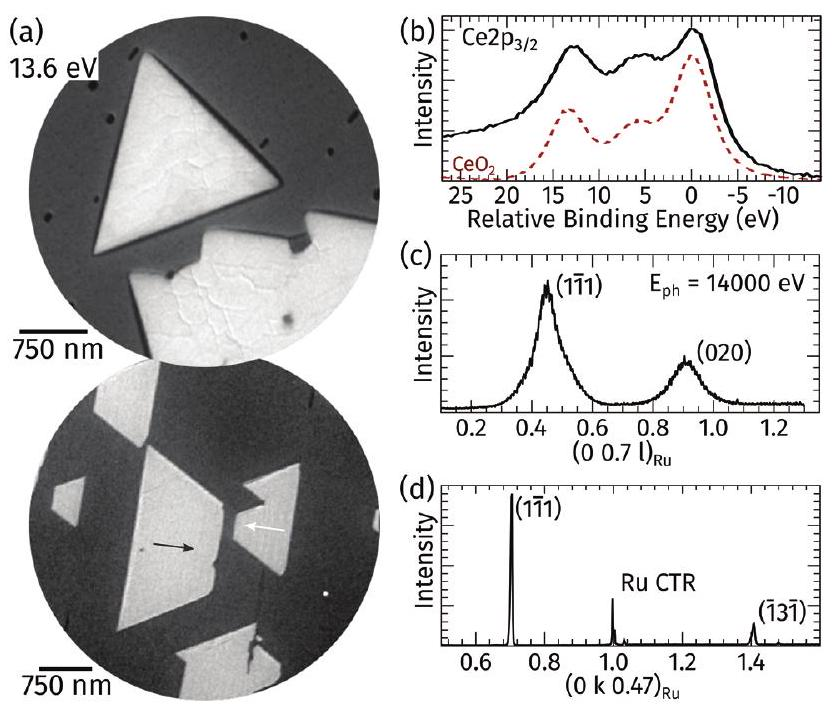
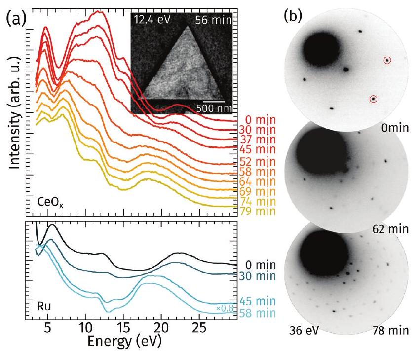
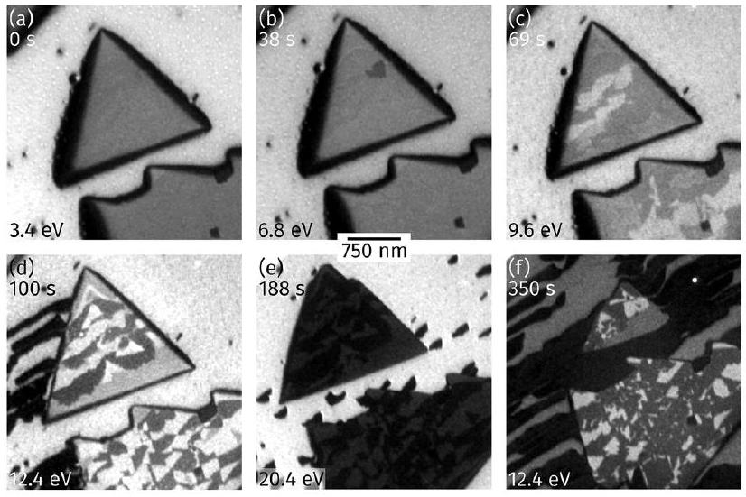
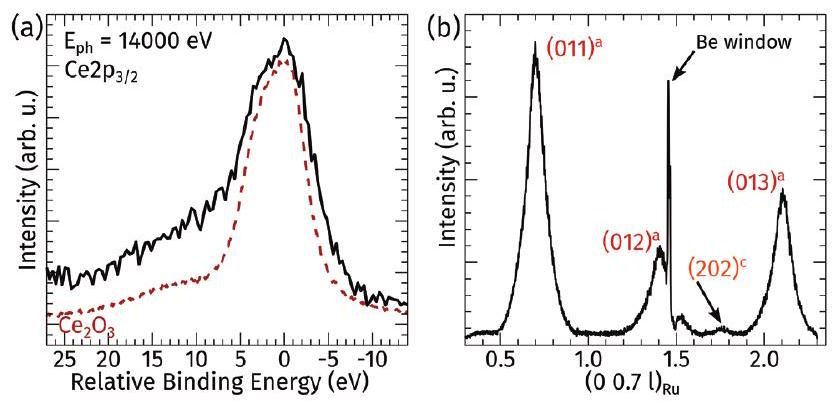
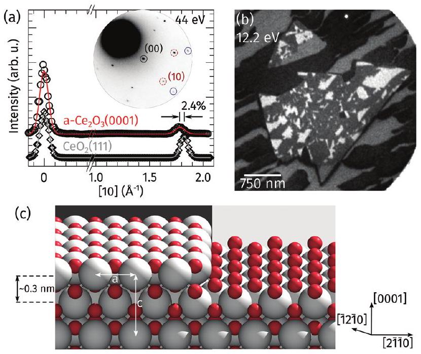
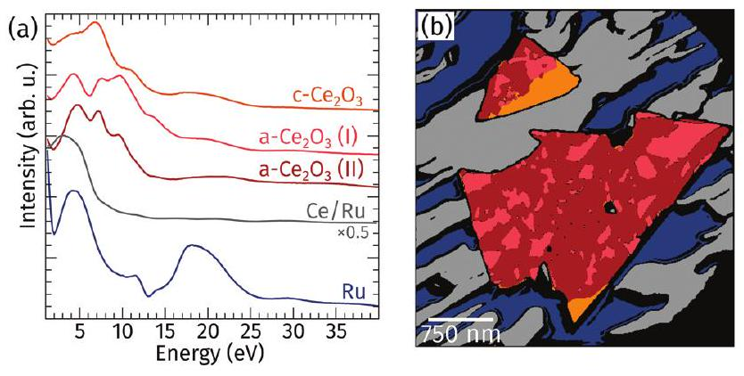

Cite this: Nanoscale, 2017, 9, 9352

Received 19th December 2016, Accepted 6th May 2017
DOI: 10.1039/c6nr09760j
rsc.li/nanoscale

# The cubic-to-hexagonal phase transition of cerium oxide particles: dynamics and structure † 

Jan Höcker, ${ }^{\mathrm{a}}$ Jon-Olaf Krisponeit, ${ }^{\mathrm{a}, \mathrm{b}}$ Thomas Schmidt, ${ }^{\mathrm{a}}$ Jens Falta (ID) ${ }^{\mathrm{a}, \mathrm{b}}$ and Jan Ingo Flege (D) $* a, b$

#### Abstract

Cerium oxide is often applied in today's catalysts due to its remarkable oxygen storage capacity. The changes in stoichiometry during reaction are linked to structural modifications, which in turn affect its catalytic activity. We present a real-time in situ study of the structural transformations of cerium oxide particles on ruthenium(0001) at high temperatures of $700^{\circ} \mathrm{C}$ in ultra-high vacuum. Our results demonstrate that the reduction from $\mathrm{CeO}_{2}$ to cubic $\mathrm{Ce}_{2} \mathrm{O}_{3}$ proceeds via ordered intermediary phases. The final reduction step from cubic to hexagonal $\mathrm{Ce}_{2} \mathrm{O}_{3}$ is accompanied by a lattice expansion, the formation of two new surface terminations, a partial dissolution of the cerium oxide particles, and a massive mass transport of cerium from the particles to the substrate. The conclusions allow for new insights into the structure, stability, and dynamics of cerium oxide nanoparticles in strongly reducing environments.

Cerium oxide is one of the most versatile metal oxides in today's catalysts. On the one hand it can serve as a functional support for other catalytically active transition metals or their oxides due to its excellent oxygen storage capacity linked with its high oxygen mobility, ${ }^{1}$ on the other hand cerium oxide may directly participate in the catalytic reaction by providing active sites related to oxygen vacancies that usually reside near the oxide-metal interface. ${ }^{2}$ However, the activity of ceria in chemical reactions strongly depends on the composition, the surface orientation, and the surface termination. ${ }^{3,4}$ Consequently, socalled inverse model catalysts ${ }^{2,5,6}$ were devised and successfully employed in the past decade to study the properties of cerium oxide and the oxide-metal interaction. To this end, well ordered and ideally homogeneous surfaces of cerium oxide have been grown on metal single crystals by various methods, usually yielding highly crystalline $\mathrm{CeO}_{2}$ films or particles. ${ }^{7}$

To gain insights into the exceptional oxygen mobility and the catalytic activity of cerium oxide, theoretical as well as experimental work was carried out to study the process of oxygen vacancy formation ${ }^{8-14}$ and the evolution of the stable stoichiometric and substoichiometric phases. ${ }^{15-20}$ In contrast to bulk ceria samples, for which a phase transition from the cubic ( $\mathrm{c}-\mathrm{Ce}_{2} \mathrm{O}_{3}$ ) to the hexagonal ( $\mathrm{a}-\mathrm{Ce}_{2} \mathrm{O}_{3}$ ) phase has been

[^0]observed, ${ }^{21}$ most of the thin film studies showed that so-called fully reduced $\mathrm{Ce}_{2} \mathrm{O}_{3}$ films still exhibit a cubic structure. So far, experimental hints for the formation of $\mathrm{a}-\mathrm{Ce}_{2} \mathrm{O}_{3}(0001)$ have only been reported after reduction of cerium oxide films grown on $\operatorname{Pt}(111)^{22,23}$ and on $\operatorname{Re}(0001) .^{24}$

There are several routes to reduce ultrathin ceria films or particles. E.g., oxygen can be removed from the ceria lattice by heating, ${ }^{17,22-26}$ ceria can be reduced by exposure to reductants, ${ }^{16,18,27-31}$ by $\mathrm{Ar}^{+}$sputtering, ${ }^{32}$ or by soft X-ray radiation. ${ }^{33}$ Since the (111) oriented surface of ceria is the most stable one from a thermodynamical point of view ${ }^{34}$ and frequently exhibited by polycrystalline ceria nanoparticles ${ }^{35}$ the structure of its substoichiometric phases are of utmost importance: in between the stoichiometric cubic fluorite $\mathrm{CeO}_{2}$ (111) with an in-plane lattice constant of $a=3.83 \AA$ (ref. 36) and c- $\mathrm{Ce}_{2} \mathrm{O}_{3}(111)$, which is characterized by an inplane lattice parameter of $4 a=15.30 \AA{ }^{16}$ one finds a complex phase diagram. Beyond local oxygen vacancies in $\mathrm{CeO}_{2}(111)$, which locally form a $(2 \times 2)$-like configuration, ${ }^{11}$ the 1 -phase of $\mathrm{Ce}_{7} \mathrm{O}_{12}$ adopts a $(\sqrt{7} \times \sqrt{7})-\mathrm{R} 19.1^{\circ}$ reconstruction, whereas the $\mathrm{CeO}_{1.67}$ phase exhibits a ( $3 \times 3$ ) superstructure with respect to $\mathrm{CeO}_{2}(111) .^{18,20}$ The dynamics of the phase transitions as probed by real-time low-energy electron microscopy (LEEM) measurements revealed that the reduction of ultra-thin cerium oxide particles on $\mathrm{Ru}(0001)$ by exposure to dihydrogen at $430^{\circ} \mathrm{C}$ proceeds by the formation of coexisting substoichiometric phases, which are characterized by $(2 \times 2),(3 \times 3)$ and $(4 \times 4)$ superstructures with respect to $\mathrm{CeO}_{2}(111) .^{31}$ Nevertheless, it is up to now not understood if and under which conditions a- $\mathrm{Ce}_{2} \mathrm{O}_{3}(0001)$ particles would appear and what characteristics these may exhibit, although these particles might play
an important role in ceria catalysis taking place in strongly reducing environments.

To address the central question of ultimate ceria(111) reducibility at high temperature, we investigated the isothermal reduction of ultrathin ceria microparticles on $\operatorname{Ru}(0001)$ using a combination of in situ grazing-incidence X-ray diffraction (GIXRD) and hard X-ray photoelectron spectroscopy (HAXPES) to determine as precisely as possible the cerium oxide structure and stoichiometry. In addition, real-time low-energy electron microscopy (LEEM) imaging provides valuable insights into morphological and structural changes at the surface. Taking full advantage of the real-time capabilities of the $I(V)$ LEEM technique ${ }^{37}$ we are able to show that at a temperature of $700{ }^{\circ} \mathrm{C}$ the isothermal reduction of ultrathin $\mathrm{CeO}_{2}(111)$ particles to $\mathrm{Ce}_{2} \mathrm{O}_{3}(111)$ is accompanied by the continuous transformation of ordered substoichiometric phases. Moreover, we demonstrate that in contrast to experiments at lower temperature the cubic bixbyite phase is not stable at $700^{\circ} \mathrm{C}$ but is sequentially transformed into a- $\mathrm{Ce}_{2} \mathrm{O}_{3}(0001)$. This phase transition is concomitant with a substantial mass transport of most likely cerium metal from the ceria islands to the ruthenium substrate.

## Experimental details

The presented reduction experiments were performed at the Spanish beamline SpLine at the ESRF (Grenoble) using in situ grazing-incidence X-ray diffraction (GIXRD) and hard X-ray photoelectron spectroscopy (HAXPES) as well as at the commercial ELMITEC LEEM III installed at the University of Bremen. In both instruments the samples were treated in the same way assuring direct comparability of the results.

The Spanish SpLine beamline branch B at the ESRF is equipped with a cylindrical sector analyzer working at kinetic electron energies of up to 15 keV . Moreover, the complete UHV chamber is mounted on a robust diffractometer to perform X-ray diffraction under an incident angle of $0.5^{\circ}$ with respect to the sample surface as well as X-ray photoelectron spectroscopy measurements at the same time. ${ }^{38}$ This setup allows in situ preparation and characterization as well as reduction experiments without any exposure to atmosphere. For convenience, in the presentation of the GIXRD data we use three Miller indices to denote the directions in ruthenium reciprocal space in contrast to the alternative 4 -index Miller-Bravais notation for hexagonal lattices. Therefore, in the following the crystal truncation rods shown are labeled relative to the $\operatorname{Ru(001)}$ substrate, which was used for the calibration of the reciprocal space. To simplify the identification of the ceria reflections these are labeled according to their bulk coordinates. To determine the lattice parameters of the cerium oxide particles as precisely as possible $k$ - as well as $l$-scans were carried out. The reflection intensities were measured using a 2D detector. Subsequently, an undistorted three-dimensional dataset in cartesian coordinates in reciprocal space was calculated from the acquired data. ${ }^{39}$ A profile along the scan direction was
obtained by integrating in scan direction with a diameter of $0.006 \AA^{-1}$. Finally, lattice parameters were determined by fitting the peak positions in the profiles.

The ELMITEC LEEM III enables in situ LEEM measurements in a wide temperature range and with a lateral resolution of about 10 nm . Furthermore, microspot-illumination low-energy electron diffraction ( $\mu$ LEED) experiments are possible, in which the area illuminated by the incident electron beam can be reduced to $5 \mu \mathrm{~m}, 1 \mu \mathrm{~m}$, or 250 nm in diameter. The LEED patterns presented here were all recorded using a spot size of $1 \mu \mathrm{~m}$. The temperatures were measured using a standard W-Re thermocouple welded to the sample support in immediate vicinity of the sample.

The $\operatorname{Ru}(0001)$ single crystal (Mateck, miscut less than $0.1^{\circ}$ ) was cleaned by several cycles of flash-annealing up to $1600^{\circ} \mathrm{C}$ and oxidizing at temperatures lower than $300^{\circ} \mathrm{C}$ in $1 \times 10^{-7}$ Torr oxygen partial pressures. The samples were then prepared by evaporating cerium from a molybdenum crucible in $5 \times 10^{-7}$ Torr oxygen partial pressure on the $900^{\circ} \mathrm{C}$ hot ruthenium substrate yielding micrometer-sized $\mathrm{CeO}_{2}$ particles with an average height of about 4 to $5 \mathrm{~nm} .^{40}$ After initial characterization at room temperature the samples were heated up to $700{ }^{\circ} \mathrm{C}$ in an oxygen partial pressure of $5 \times 10^{-7}$ Torr. For thermal reduction the oxygen flow was stopped and the gas pumped out of the chamber to a base pressure of $1 \times 10^{-9}$ Torr while keeping the sample hot at $700{ }^{\circ} \mathrm{C}$. Thus all measurements except the characterization of the initially grown $\mathrm{CeO}_{2}$ were done at the fixed annealing temperature of $700^{\circ} \mathrm{C}$.

## Results

The following section is divided into four subsections. Initially the structural properties of the grown $\mathrm{CeO}_{2}$ particles will be discussed as determined by HAXPES and GIXRD. Subsequent structural changes of the transition of $\mathrm{CeO}_{2}(111)$ to $\mathrm{Ce}_{2} \mathrm{O}_{3}(111)$ during isothermal reduction are highlighted by dynamic $I(V)$ LEEM characterization. Furthermore, the phase transition of c- $\mathrm{Ce}_{2} \mathrm{O}_{3}$ (111) to a- $\mathrm{Ce}_{2} \mathrm{O}_{3}$ (0001) is presented by a time-lapse LEEM image sequence. Finally, the structural and morphological properties of a- $\mathrm{Ce}_{2} \mathrm{O}_{3}(0001)$ are quantitatively and comprehensively analyzed using the combination of integral GIXRD and HAXPES measurements as well as locally resolved LEEM and $I(V)$-LEEM characterization.

## Characterization of the as-grown particles

A typical LEEM image of the ceria particles prepared at $900{ }^{\circ} \mathrm{C}$ is shown in Fig. 1a. As expected from previous studies at these preparation conditions ceria forms large triangular shaped particles with side lengths of one to several micrometers. ${ }^{43}$ The top facet of most of the ceria particles is (111) oriented exhibiting a (1.4 $\times 1.4$ ) LEED pattern with respect to the underlying $\operatorname{Ru}(0001)$ substrate, and the main axes of the ceria unit mesh align to the main axes of the $\operatorname{Ru(0001)}$ unit mesh. ${ }^{43-45}$ The faint dark lines observable on the $\mathrm{CeO}_{2}$ particles are known to delineate step edges on the particle. ${ }^{40}$ These step

Fig. 1 Chemical and structural characterization of the as-grown $\mathrm{CeO}_{2}$ particles. In the LEEM images (a) the $\mathrm{CeO}_{2}(111)$ microparticles appear bright. On the top facet of the particles atomic steps are visible. Two rotational domains of $\mathrm{CeO}_{2}$ (rotation angle: $180^{\circ}$ ) on the $\mathrm{Ru}(0001)$ surface are highlighted by arrows pointing in opposite directions. (b) $\mathrm{Ce} 2 \mathrm{p}_{3 / 2}$ spectrum of the particles (full line) and background subtracted $\mathrm{CeO}_{2}$ reference spectrum. ${ }^{41}$ (c), (d) Crystal truncation rod and in-plane GIXRD profile exhibiting cubic fluorite reflections of $\mathrm{CeO}_{2}$. Due to the two rotational domains of the $\mathrm{CeO}_{2}$ particles (cf. LEEM image in (a)), the (1ī1) reflection is observed in the $(00.7 \mathrm{l}) \mathrm{CTR}$ as well as in the in-plane profile (so called B-stacking). 40,42

edges are usually about $3 \AA$ high, which corresponds to the height of one O-Ce-O trilayer. Additionally, small dark appearing particles - partially incorporated into the $\mathrm{CeO}_{2}(111)$ particles - can be found and identified as $\mathrm{CeO}_{2}(100) .{ }^{46}$ From the Ce $2 \mathrm{p}_{3 / 2}$ HAXPES data displayed in Fig. 1b, the oxidation state of the as-grown particles is determined to $\mathrm{CeO}_{2}$, which is evident from comparing with a Ce $2 \mathrm{p}_{3 / 2}$ reference spectrum of $\mathrm{CeO}_{2}$ from literature. ${ }^{41}$

GIXRD enables a precise determination of the lattice parameters of the $\mathrm{CeO}_{2}$ particles. Due to intrinsic defects of the $\mathrm{Ru}(0001)$ substrate, i.e., twist and tilt mosaicity common to metal single crystals as well as final size effects the reflections of the cerium oxide particles are quite broad in the out-of-plane direction, as can be seen in the ( $00.7 l$ ) crystal truncation rod presented in Fig. 1c. Consistently, the in-plane reflections appear much sharper due to the much larger lateral extent of the ceria particles as compared to their height. The out-ofplane as well as the in-plane GIXRD measurements shown in Fig. 1c and d allow us to determine the average surface lattice parameters of the $\mathrm{CeO}_{2}(111)$ particles to $a_{\|}=3.80 \AA$ and $a_{\perp}= 3.14 \AA$. Thus the lattice of the ceria particle is in-plane compressed by $0.6 \%$ and rhombohedrally distorted by $0.6 \%$ in the out-of-plane direction. As proposed by earlier studies the ceria mesh is expected to form a $5 / 7$ coincidence lattice with the unit mesh of the ruthenium substrate. ${ }^{32,43}$ Recent transmission electron microscopy measurements have challenged this interpretation and suggest a 7/10 coincidence between the
ceria and the ruthenium lattice. ${ }^{40}$ In our case, the calculated in-plane lattice constant yields a ratio of $a_{\|}^{\mathrm{CeO}_{2}} / a_{\|}^{\mathrm{Ru}}=0.712$ favoring a 5/7 coincidence lattice.

## Isothermal reduction of $\mathbf{C e O}_{\mathbf{2}}(\mathbf{1 1 1})$ to $\mathbf{C e}_{\mathbf{2}} \mathbf{O}_{\mathbf{3}}(\mathbf{1 1 1})$

The thermal reduction of the grown ceria particles was monitored by dynamic $I(V)$-LEEM measurements. $I(V)$ curves are collected continuously by recording the intensity of the backscattered electrons in the very-low energy range from 0 eV to 30 eV . The shape of the curves is determined by the unoccupied band structure and thus is unique for each material and composition. ${ }^{37}$ Hence, whenever the composition or structure of the cerium oxide changes, also the corresponding $I(V)$ curve changes. Since the $I(V)$ curves of $\mathrm{CeO}_{2}(111)$ as well as for $\mathrm{CeO}_{1.67}$ and c- $\mathrm{Ce}_{2} \mathrm{O}_{3}$ (111) are known, they can directly be used as fingerprints for the local oxidation state. ${ }^{30,31}$

The time-lapse sequence of the $I(V)$ curves obtained from a single cerium oxide particle as well as of the ruthenium substrate during isothermal reduction is shown in Fig. 2a. As can be inferred from the identical $I(V)$ curves of the cerium oxide particle the composition ‡ does not change within the first 30 min of the reduction. Simultaneously, the ( $2 \times 1$ ) oxygen adlayer on the ruthenium substrate, which is known to form after initial oxide growth at the chosen preparation parameters, becomes slightly reduced in this time frame, as can be concluded from subtle changes in the $I(V)$ curves. ${ }^{47}$ The

Fig. 2 (a) $I(V)$ curve sequence acquired during thermal reduction. The inset shows the $\mathrm{CeO}_{x}$ particle after 56 min of isothermal reduction. The contrast is indicative of coexisting domains with varying local oxidation state. (b) $\mu \mathrm{LEED}$ images recorded during isothermal reduction showing the transition from $\mathrm{CeO}_{2}(111)(1 \times 1)$ over ( $3.3 \times 3.3$ ) after 62 min to a $(4 \times 4)$ superstructure exhibited by $\mathrm{c}-\mathrm{Ce}_{2} \mathrm{O}_{3}(111)$. The integer diffraction spots of $\mathrm{CeO}_{2}(111)$ are highlighted by red circles.

[^1]oxygen chemisorbed on the ruthenium surface has completely desorbed after 58 min at $700{ }^{\circ} \mathrm{C}$. Subsequently, the $I(V)$ curve known from the clean $\operatorname{Ru(0001)}$ is recorded from the substrate. The $I(V)$ curve recorded from the ceria particle changes continuously from 30 min to 52 min . After 52 min the ( $3 \times 3$ ) superstructure, which is associated with a stoichiometry of $\mathrm{CeO}_{1.67}$, has largely developed, but some inhomogeneous reduction is visible (see inset in Fig. 2a). Further reductioninduced changes of the $I(V)$ curve appear until the typical $\mathrm{c}-\mathrm{Ce}_{2} \mathrm{O}_{3}(111)$ curve is readily identified after 69 min .

Recent findings for cerium oxide nanoparticles on $\mathrm{Rh}(111)$ suggest that the oxygen adlayer stabilizes the cerium oxide upon reduction by oxygen spillover. ${ }^{33}$ However, from our in situ observation of the simultaneous reduction of the oxygen adlayer on the $\operatorname{Ru}(0001)$ and the ceria particles it can be deduced that on $\operatorname{Ru}(0001)$ significant oxygen spillover from the substrate to the ceria particles is very unlikely.

The continuous structural transition from $\mathrm{CeO}_{2}(111)$ to c- $\mathrm{Ce}_{2} \mathrm{O}_{3}(111)$, as concluded from the $I(V)$ curves, is corroborated by inspection of the LEED images recorded before isothermal reduction, after 62 min , and after 78 min as depicted in Fig. 2b. The LEED patterns as well as the variation of the $I(V)$ curves demonstrate a continuous reduction of the cerium oxide particle by the formation of domains of ordered substoichiometric phases. The same process was identified during reduction by exposure to dihydrogen at $430{ }^{\circ} \mathrm{C} .^{31}$ Similarly, coexisting domains of ceria exhibiting a ( $3 \times 3$ ) superstructure as well as $\mathrm{c}-\mathrm{Ce}_{2} \mathrm{O}_{3}(111)$ domains characterized by the four times larger lattice constant are observed on the ceria particle after 56 min of thermal reduction (Fig. 2a, inset). Consistent with our results from similar in situ measurements on different substrates (not shown) at elevated temperatures of $300^{\circ} \mathrm{C}$ and higher, the so-called i-phase of $\mathrm{Ce}_{7} \mathrm{O}_{12}$ is not observed.

## Phase transition of reduced ceria particles

As monitored by the $I(V)$ curve changes in Fig. 2a the thermal reduction from $\mathrm{CeO}_{2}(111)$ to $\mathrm{c}-\mathrm{Ce}_{2} \mathrm{O}_{3}(111)$ proceeds quite slowly, i.e., on a time frame of about 80 min . In the subsequent 6 min , a faster phase transition of the ceria particles occurs as shown in Fig. 3. 69 s after the beginning of the phase transition, a further change, i.e., a second and third intensity level, can clearly be observed on the formerly homogeneous cerium oxide particles (Fig. 3c). This contrast change concurs with an apparent mass flow from the ceria islands to the ruthenium substrate, as can be seen from the black patches forming along the steps of the ruthenium substrate while simultaneously the contrast on the ceria particles becomes very pronounced (cf. Fig. 3d and movie in the ESI †). Substantial mass flow is further evidenced by the observation that the cerium oxide particles begin to shrink visibly about 180 s after the first signs of a phase transition were observed. This can clearly be seen in Fig. 3d-f, which show the wetting of the Ru substrate while the former regular triangular shaped ceria particle starts to dissolve from the top corner. Whereas sizeable parts of the cerium oxide islands dissolve completely,

Fig. 3 LEEM time-lapse sequence of the phase transition from $\mathrm{c}-\mathrm{Ce}_{2} \mathrm{O}_{3}(111)$ to hexagonal $\mathrm{a}-\mathrm{Ce}_{2} \mathrm{O}_{3}(0001)$. The time printed in the figures does not include the initial 78 min to reduce $\mathrm{CeO}_{2}(111)$ to $\mathrm{c}-\mathrm{Ce}_{2} \mathrm{O}_{3}(111)$. Initially, a contrast change is observable in the ceria particles, which is sequentially succeeded by substantial mass transport from the particles to the ruthenium substrate, concomitant with partial dissolution of the ceria particles. The images (a) to (e) were obtained while recording an $I(V)$ curve, thus the electron energy is rising monotonically. The electron energy of 12.4 eV in (f) was chosen to maximize the contrast within the ceria particles.

the contrast on the stable parts remains. After 300 s to 350 s the phase transition appears to have been completed. No further changes are visible even though the sample remained at $700^{\circ} \mathrm{C}$ during subsequent characterization.

## Characterization of the transformed ceria particles

Although there are several different phases present on the surface requiring a local investigation, HAXPES and GIXRD can provide precise information on the average oxidation state and structure-specific lattice parameters. The HAXPES Ce $2 \mathrm{p}_{3 / 2}$ spectrum shown in Fig. 4a reveals a stoichiometry of $\mathrm{Ce}_{2} \mathrm{O}_{3}$, in perfect agreement with reference data from the literature. ${ }^{41}$ This change in stoichiometry from $\mathrm{CeO}_{2}$ (see Fig. 1) to $\mathrm{Ce}_{2} \mathrm{O}_{3}$

Fig. 4 Spatially averaged characterization by HAXPES and GIXRD measured simultaneously after thermal reduction. (a) Ce $2 \mathrm{p}_{3 / 2}$ HAXPES data (full line) and $\mathrm{Ce}_{2} \mathrm{O}_{3}$ reference spectrum (dashed line) taken from literature. ${ }^{41}$ (b) The coordinates of the rod are given in surface coordinates of the Ru substrate, whereas the reflections are labeled in bulk coordinates of the respective cerium oxide crystal structure, i.e., of a- $\mathrm{Ce}_{2} \mathrm{O}_{3}$ (superscript a) or $\mathrm{c}-\mathrm{Ce}_{2} \mathrm{O}_{3}$ (superscript c ).

should be reflected in a change of the bulk crystal structure. But, in contrast to the expected reflections exhibited by c- $\mathrm{Ce}_{2} \mathrm{O}_{3}(111)$, § strong reflections of a- $\mathrm{Ce}_{2} \mathrm{O}_{3}(0001)$ are observed on the ( $00.7 l$ ) rod shown in Fig. 4b. Also still a small contribution of B-stacked c-CeO ${ }_{x}$ at $l=1.75$ is noticed, ${ }^{48}$ whereas the apparent absence of a diffraction peak at about $l=0.9$ indicates that the concentration of A-stacked c-CeOx is negligible. Already at this point it has to be concluded that the phase transition (cf. Fig. 3) observed after the reduction from $\mathrm{CeO}_{2}$ to $\mathrm{Ce}_{2} \mathrm{O}_{3}$ is a transition from cubic- $\mathrm{Ce}_{2} \mathrm{O}_{3}(111)$ to hexagonal$\mathrm{Ce}_{2} \mathrm{O}_{3}(0001)$. In addition to the crystal structure, the GIXRD data allow to determine the average lattice parameters of the cerium oxide particles in the hexagonal phase to $a=3.90 \AA$ and $c=6.10 \AA$, which deviate from the established literature values for relaxed, bulk a- $\mathrm{Ce}_{2} \mathrm{O}_{3}$ by $0.6 \% .^{1}$

The change of the bulk structure of the cerium oxide particles from c- $\mathrm{Ce}_{2} \mathrm{O}_{3}$ to a- $\mathrm{Ce}_{2} \mathrm{O}_{3}$ coincides with a change of the surface structure. The $\mu \mathrm{LEED}$ image depicted in Fig. 5a, which was recorded from an illuminated area of $1 \mu \mathrm{~m}$ on the large particle presented in Fig. 5b, clearly shows that the former ( $4 \times 4$ ) superstructure with respect to the $\mathrm{CeO}_{2}(111)$ reflections of the $\mathrm{c}-\mathrm{Ce}_{2} \mathrm{O}_{3}$ has vanished after the phase transition and only a $(1 \times 1)$ pattern is observed. In perfect agreement with the GIXRD and HAXPES data in Fig. 4, the LEED pattern can be

Fig. 5 (a) $\mu \mathrm{LEED}$ pattern exhibited by the large ceria particle depicted in (b) and line profile along the (10) direction. The background subtracted profile was fitted by a model consisting of two gaussians (full line). In the LEED pattern the reflections from the $\mathrm{Ru}(0001)$ substrate are highlighted with blue circles and the $\mathrm{Ce}_{2} \mathrm{O}_{3}(0001)$ reflections by red dashed circles. (b) LEEM image of two ceria particles after reduction. (c) Model of the bulk terminated a- $\mathrm{Ce}_{2} \mathrm{O}_{3}$ (0001) surface including a step about c/2 high, leading to two different oxygen-terminated terraces. In LEEM (b), these different terminations lead to the two intensity levels observed on the a- $\mathrm{Ce}_{2} \mathrm{O}_{3}$ particles, as indicated by the darker and lighter background. White spheres represent cerium atoms, red spheres oxygen atoms.

[^2]attributed to the (0001) surface of $\mathrm{a}-\mathrm{Ce}_{2} \mathrm{O}_{3}$. However, in contrast to a former study of a 6 nm thin film on $\operatorname{Re}(0001)^{24}$ we note that a rotation of $30^{\circ}$ is not observed and that the main axes of the $\mathrm{Ce}_{2} \mathrm{O}_{3}(0001)$ are aligned to the $\mathrm{Ru}(0001)$ main axes, just like in the initial case of $\mathrm{CeO}_{2}(111)$ before reduction. Comparing the LEED profiles (Fig. 5a) along the (10) directions for $\mathrm{CeO}_{2}(111)$ and $\mathrm{a}-\mathrm{Ce}_{2} \mathrm{O}_{3}(0001)$ shows that the in-plane lattice constant expands by $2.4 \%$ during reduction, consistent with a change of crystal structure to almost fully relaxed a- $\mathrm{Ce}_{2} \mathrm{O}_{3}(0001)$ and our GIXRD results.

In contrast to integral methods like conventional LEED, XPS, and GIXRD, $I(V)$-LEEM provides access to the local composition and structure of the cerium oxide particles. The LEEM image acquired after the phase transition from $\mathrm{c}-\mathrm{Ce}_{2} \mathrm{O}_{3}$ to a- $\mathrm{Ce}_{2} \mathrm{O}_{3}$ in Fig. 5b at 12.2 eV electron energy exhibits five different levels of intensity: two different levels from the initially ceria-free substrate areas (cf. Fig. 1a) and three from the cerium oxide particles.

The five $I(V)$ curves extracted from these areas are shown in Fig. 6a. Two curves can directly be used to identify the uncovered $\mathrm{Ru}(0001)$ substrate as well as areas which did not transform into a- $\mathrm{Ce}_{2} \mathrm{O}_{3}(0001)$, but still adhere to the known ${ }^{31}$ c- $\mathrm{Ce}_{2} \mathrm{O}_{3}(111)$ structure. The $I(V)$ curve obtained from the covered areas on the Ru substrate is almost featureless, which indicates that the covering material might be amorphously dispersed cerium. Even though one might expect that cerium forms ordered structures on a Ru(0001) surface one has to take into account the elevated temperature of $700{ }^{\circ} \mathrm{C}$ during reduction, which is only about $100^{\circ} \mathrm{C}$ below the melting point of bulk cerium metal, compatible with the interpretation of a disordered Ce adlayer. The two yet unknown $I(V)$ curves obtained from the cerium oxide particle are attributed to the hexagonal phase. Although it is perhaps surprising at first glance that a- $\mathrm{Ce}_{2} \mathrm{O}_{3}(0001)$ should exhibit two distinct $I(V)$ curves, this can be related to the presence of different surface terminations as reported recently for $\mathrm{a}-\mathrm{Pr}_{2} \mathrm{O}_{3}(0001) .{ }^{49}$ In close analogy to the results from the praseodymia growth experiments on $\operatorname{Ru(0001)}$ it follows we infer that atomic steps on the $\mathrm{Ce}_{2} \mathrm{O}_{3}(0001)$ surface are 0.3 nm high (half a unit cell) and not

Fig. 6 Local characterization of the $\mathrm{Ce}_{2} \mathrm{O}_{3}$ particle. (a) $I(V)$ fingerprints of the different phases or terminations. (b) Correlation map calculated by comparing pixel wise extracted $I(V)$ fingerprints highlighting the local inhomogeneities as well as the distribution of the different terminations of the reduced particle.

0.6 nm (full unit cell). This leads to two different oxygen surface terminations (in the following named (I) and (II)) as illustrated in Fig. 5c, readily explaining the contrast between neighboring terraces even though the crystal structure is identical.

Comparing the $I(V)$ curves extracted from the $I(V)$-LEEM image stack for every pixel with the reference $I(V)$ curves in Fig. 6a allows identifying the different phases in the LEEM image with pixel resolution and determining the respective surface coverages. The resulting color-coded image is displayed in Fig. 6b. It reveals that $24 \%$ of the cerium oxide particle adopt termination (I) and $70 \%$ termination (II). $6 \%$ of the cerium oxide remained in the cubic bixbyite structure. This is in good agreement with the GIXRD results, which, after extended reduction, only show a very small contribution of cubic cerium oxide to the laterally averaged diffraction signal. Hence, our LEEM analysis clearly shows that the formerly homogeneous sample consisting of only two well ordered components, i.e., $\mathrm{c}-\mathrm{Ce}_{2} \mathrm{O}_{3}(111)$ and the bare $\mathrm{Ru}(0001)$ substrate, becomes very inhomogeneous after reduction with five structurally distinct constituents.

## Conclusion

We have presented a detailed study of the structural and morphological dynamics during reduction of ultrathin, micrometer-sized ceria particles on $\operatorname{Ru}(0001)$ in ultra-high vacuum as well as the structural properties of the emerging hexagonal $\mathrm{Ce}_{2} \mathrm{O}_{3}(0001)$ surface. Our results show that initially thermal reduction of cerium oxide proceeds by the gradual transition through different, coexisting ordered substoichiometric phases until the cerium oxide particles homogeneously adopt the c- $\mathrm{Ce}_{2} \mathrm{O}_{3}$ (bixbyite) structure. Further heating leads to a transition from the cubic to the hexagonal phase of $\mathrm{Ce}_{2} \mathrm{O}_{3}$, concomitant with an expansion of the lattice of about $2.4 \%$. During the phase transition substantial mass transport of cerium from the particles along the substrate steps is observed, resulting in a partial dissolution of the particles. The remaining particles are predominantly composed of a- $\mathrm{Ce}_{2} \mathrm{O}_{3}(0001)$, but small parts remain in the $\mathrm{c}-\mathrm{Ce}_{2} \mathrm{O}_{3}(111)$ phase. Importantly, two distinct terminations emerge on the (0001) oriented a- $\mathrm{Ce}_{2} \mathrm{O}_{3}$ particles.

The results allow for a deeper understanding of the behavior of ceria (nano)particles in reducing environments. The precise determination of the oxidation state and the lattice parameters yield profound knowledge for theoretical as well as further experimental studies. Moreover, the dynamic aspects clearly demonstrate the manifold effects that ceria (nano) particles exhibit in reducing environments and in close contact with transition metals as, e.g., the instability of a- $\mathrm{Ce}_{2} \mathrm{O}_{3}(0001)$ particles and the dispersion of cerium on the ruthenium support. Furthermore, the different surface terminations of hexagonal $\mathrm{Ce}_{2} \mathrm{O}_{3}$ found after reduction showcase the rich physics and chemistry of cerium oxide and the necessity for further spatial and temporal resolving studies of these
systems. Lastly, our results provide a dynamical perspective on ageing processes in ceria-based catalysts and suggest that the structural heterogeneity observed needs to be considered closely in future descriptions.

## Acknowledgements

The authors would like to thank Germán R. Castro and Juan Rubio-Zuazo for technical support at the SpLine as well as the ESRF staff for general support. Further technical support at the University of Bremen by Torben Rohbeck and Martin Hoppe is gratefully acknowledged. This research has been supported by the Institutional Strategy of the University of Bremen, funded by the German Excellence Initiative.

## References

1 Catalysis by Ceria and Related Materials, ed. P. F. Alessandro Trovarelli, Imperial College Press, 2nd edn, 2013.
2 J. A. Rodriguez, P. Liu, J. Graciani, S. D. Senanayake, D. C. Grinter, D. Stacchiola, J. Hrbek and J. FernándezSanz, J. Phys. Chem. Lett., 2016, 7, 2627-2639.
3 G. Vilé, S. Colussi, F. Krumeich, A. Trovarelli and J. PérezRamírez, Angew. Chem., Int. Ed., 2014, 12069-12072.
4 D. R. Mullins, Surf. Sci. Rep., 2015, 70, 42-85.
5 F. P. Leisenberger, S. Surnev, G. Koller, M. G. Ramsey and F. P. Netzer, Surf. Sci., 2000, 444, 211-220.

6 J. A. Rodríguez and J. Hrbek, Surf. Sci., 2010, 604, 241-244.
7 P. Luches and S. Valeri, Materials, 2015, 8, 5818-5833.
8 F. Esch, S. Fabris, L. Zhou, T. Montini, C. Africh, P. Fornasiero, G. Comelli and R. Rosei, Science, 2005, 309, 752-755.
9 N. V. Skorodumova, S. I. Simak, B. I. Lundqvist, I. A. Abrikosov and B. Johansson, Phys. Rev. Lett., 2002, 89, 166601.

10 M. Nolan, S. Grigoleit, D. C. Sayle, S. C. Parker and G. W. Watson, Surf. Sci., 2005, 576, 217-229.

11 S. Torbrügge, M. Reichling, A. Ishiyama, S. Morita and O. Custance, Phys. Rev. Lett., 2007, 99, 056101.

12 M. V. Ganduglia-Pirovano, J. L. F. Da Silva and J. Sauer, Phys. Rev. Lett., 2009, 102, 026101.
13 D. C. Grinter, R. Ithnin, C. L. Pang and G. Thornton, J. Phys. Chem. C, 2010, 114, 17036-17041.

14 G. E. Murgida and M. V. Ganduglia-Pirovano, Phys. Rev. Lett., 2013, 110, 246101.
15 J. Da Silva, Phys. Rev. B: Condens. Matter, 2007, 76, 193108.
16 V. Stetsovych, F. Pagliuca, F. Dvořák, T. Duchoň, M. Vorokhta, M. Aulická, J. Lachnitt, S. Schernich, I. Matolínová, K. Veltruská, T. Skála, D. Mazur, J. Mysliveček, J. Libuda and V. Matolín, J. Phys. Chem. Lett., 2013, 4, 866-871.
17 H. Wilkens, O. Schuckmann, R. Oelke, S. Gevers, M. Reichling, A. Schaefer, M. Bäumer, M. H. Zoellner,
G. Niu, T. Schroeder and J. Wollschläger, Phys. Chem. Chem. Phys., 2013, 15, 18589-18599.
18 T. Duchoň, F. Dvořák, M. Aulická, V. Stetsovych, M. Vorokhta, D. Mazur, K. Veltruská, T. Skála, J. Mysliveček, I. Matolínová and V. Matolín, J. Phys. Chem. $C$, 2013, 118, 357-365.
19 A. Bruix and K. M. Neyman, Catal. Lett., 2016, 146, 20532080.

20 R. Olbrich, G. E. Murgida, V. Ferrari, C. Barth, A. M. Llois, M. Reichling and M. V. Ganduglia-Pirovano, J. Phys. Chem. C, 2017, 121, 6844-6851.
21 G. Adachi and N. Imanaka, Chem. Rev., 1998, 98, 1479-1514.
22 C. Hardacre, G. M. Roe and R. M. Lambert, Surf. Sci., 1995, 326, 1-10.
23 U. Berner and K.-D. Schierbaum, Phys. Rev. B: Condens. Matter, 2002, 65, 235404.
24 W. Xiao, Q. Guo and E. G. Wang, Chem. Phys. Lett., 2003, 368, 527-531.
25 S. Eck, C. Castellarin-Cudia, S. Surnev, M. G. Ramsey and F. P. Netzer, Surf. Sci., 2002, 520, 173-185.

26 P. Luches, F. Pagliuca and S. Valeri, Phys. Chem. Chem. Phys., 2014, 16, 18848-18857.
27 A. Pfau and K.-D. Schierbaum, Surf. Sci., 1994, 321, 71-80.
28 D. R. Mullins, M. D. Robbins and J. Zhou, Surf. Sci., 2006, 600, 1547-1558.
29 J. Höcker, T. Duchoň, K. Veltruská, V. Matolín, J. Falta, S. D. Senanayake and J. I. Flege, J. Phys. Chem. C, 2016, 120, 4895-4901.
30 J. I. Flege, B. Kaemena, A. Meyer, J. Falta, S. D. Senanayake, J. T. Sadowski, R. D. Eithiraj and E. E. Krasovskii, Phys. Rev. B: Condens. Matter, 2013, 88, 235428.
31 J. Höcker, T. O. Menteş, A. Sala, A. Locatelli, T. Schmidt, J. Falta, S. D. Senanayake and J. I. Flege, Adv. Mater. Interfaces, 2015, 2, 1500314.
32 D. R. Mullins, S. H. Overbury and D. R. Huntley, Surf. Sci., 1998, 409, 307-319.
33 D. C. Grinter, C. Muryn, A. Sala, C. M. Yim, C. L. Pang, T. O. Menteş, A. Locatelli and G. Thornton, J. Phys. Chem. C, 2016, 120, 11037-11044.

34 J. C. Conesa, Surf. Sci., 1995, 339, 337-352.
35 L. Soler, A. Casanovas, A. Urrich, I. Angurell and J. Llorca, Appl. Catal., B, 2016, 197, 47-55.
36 E. A. Kümmerle and G. Heger, J. Solid State Chem., 1999, 147, 485-500.
37 J. I. Flege and E. E. Krasovskii, Phys. Status Solidi RRL, 2014, 8, 463-477.
38 J. Rubio-Zuazo and G. R. Castro, Rev. Adv. Mater. Sci., 2007, 15, 79-86.
39 M. Lohmeier and E. Vlieg, J. Appl. Crystallogr., 1993, 26, 706-716.
40 M. Sauerbrey, J. Höcker, M. Wellbrock, M. Schowalter, J.-O. Krisponeit, K. Müler-Caspary, A. Rosenauer, G. Wei, L. Colombi Ciacchi, J. Falta and J. I. Flege, Cryst. Growth Des., 2016, 16, 4216-4224.
41 A. Allahgholi, J. I. Flege, S. Thieß, W. Drube and J. Falta, ChemPhysChem, 2015, 16, 1083-1091.
42 J. I. Flege, B. Kaemena, S. D. Senanayake, J. Höcker, J. T. Sadowski and J. Falta, Ultramicroscopy, 2013, 130, 8793.

43 B. Kaemena, S. D. Senanayake, A. Meyer, J. T. Sadowski, J. Falta and J. I. Flege, J. Phys. Chem. C, 2013, 117, 221-232.

44 J.-L. Lu, H.-J. Gao, S. Shaikhutdinov and H.-J. Freund, Surf. Sci., 2006, 600, 5004-5010.
45 T. Hasegawa, S. M. F. Shahed, Y. Sainoo, A. Beniya, N. Isomura, Y. Watanabe and T. Komeda, J. Chem. Phys., 2014, 140, 044711.
46 J. I. Flege, J. Höcker, B. Kaemena, T. O. Menteş, A. Sala, A. Locatelli, S. Gangopadhyay, J. T. Sadowski, S. D. Senanayake and J. Falta, Nanoscale, 2016, 8, 1084910856.

47 E. E. Krasovskii, J. Höcker, J. Falta and J. I. Flege, J. Phys.: Condens. Matter, 2015, 27, 035501.
48 J. I. Flege, B. Kaemena, J. Höcker, F. Bertram, J. Wollschläger, T. Schmidt and J. Falta, Appl. Phys. Lett., 2014, 104, 131604.
49 J. Höcker, J.-O. Krisponeit, J. Cambeis, A. Zakharov, Y. Niu, G. Wei, L. C. Ciacchi, J. Falta, A. Schaefer and J. I. Flege, Phys. Chem. Chem. Phys., 2017, 19, 3480.

[^0]:    ${ }^{a}$ Institute of Solid State Physics, University of Bremen, Otto-Hahn-Allee 1, D-28359 Bremen, Germany. E-mail: flege@ifp.uni-bremen.de
    ${ }^{b}$ MAPEX Institute for Materials and Processes, University of Bremen, D-28359 Bremen, Germany
    † Electronic supplementary information (ESI) available. See DOI: 10.1039/ C6NR09760J

[^1]:    ‡ Within a simplified model assuming the nanoscale coexistence of $\mathrm{CeO}_{2}(111)$ and $\mathrm{Ce}_{2} \mathrm{O}_{3}$ (111), the stoichiometry may be estimated (cf. Fig. S2 in the ESI † for details).

[^2]:    § The calculated reciprocal lattice map in the ESI. †

