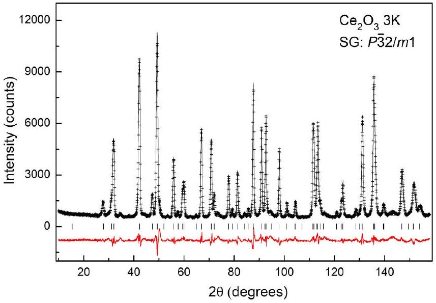
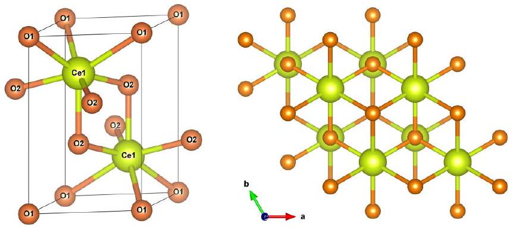
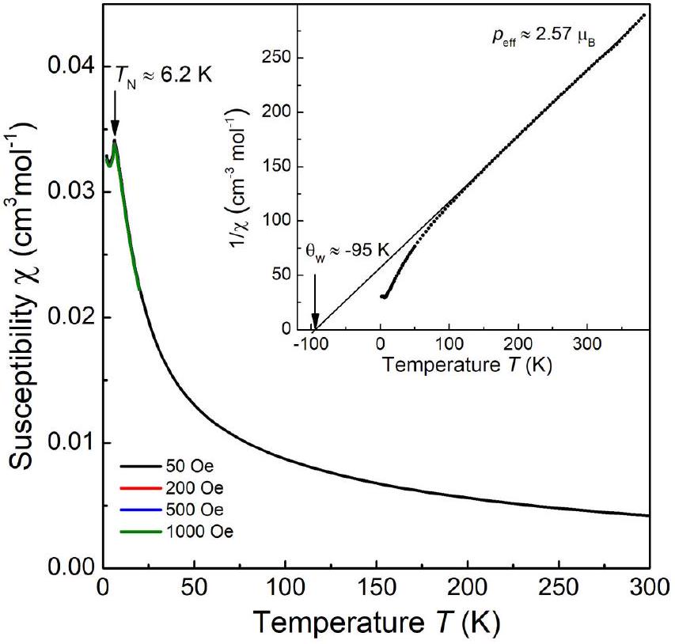
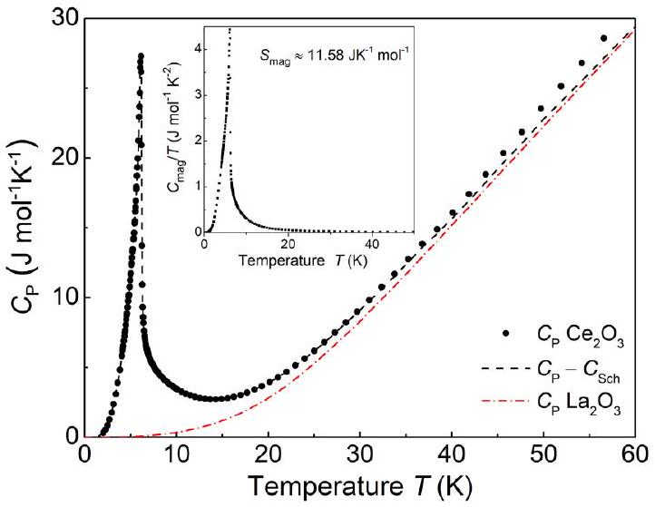
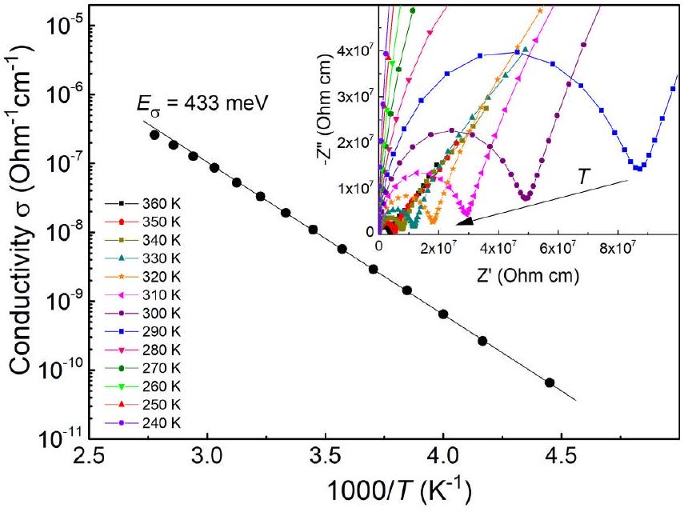
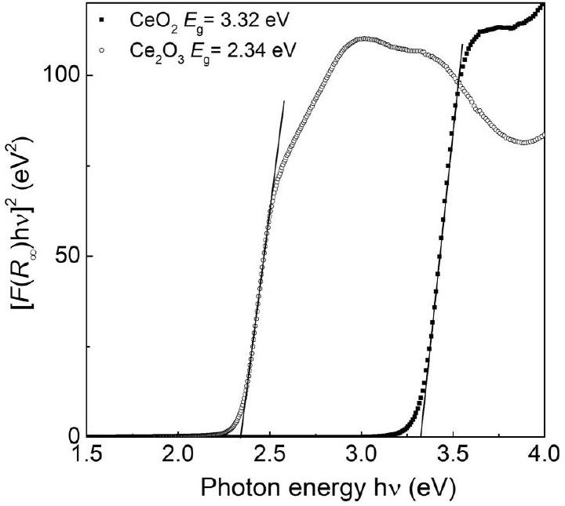
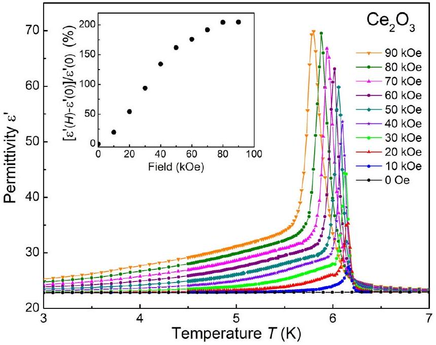
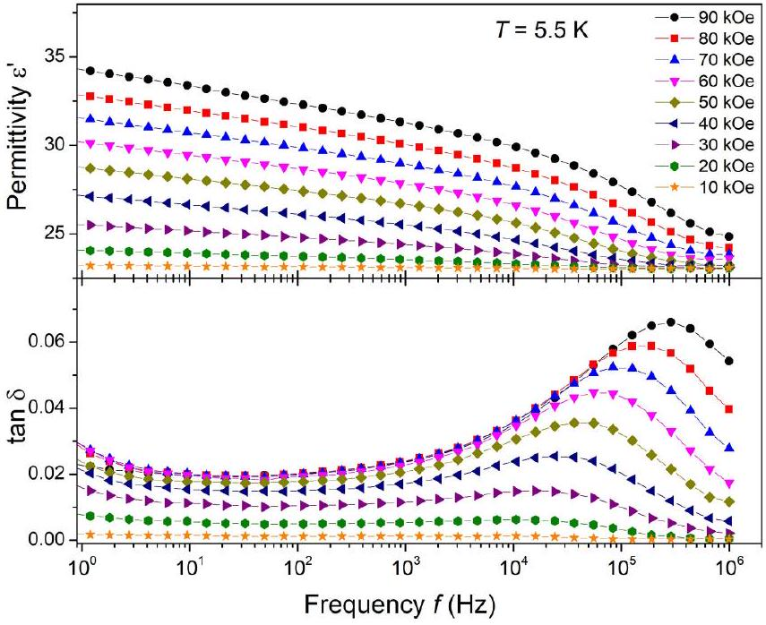
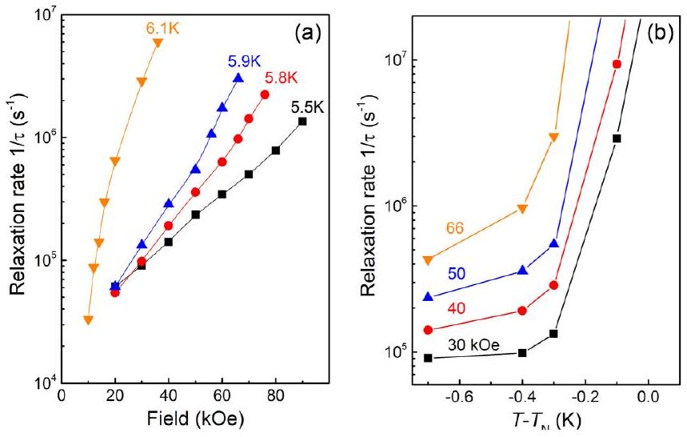
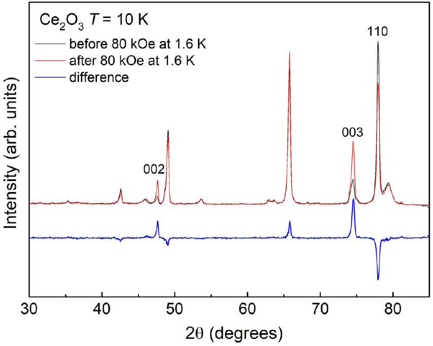

# Giant magnetocapacitance in cerium sesquioxide 

T. Kolodiazhnyi, ${ }^{1, *}$ H. Sakurai, ${ }^{1}$ M. Avdeev, ${ }^{2}$ T. Charoonsuk, ${ }^{3}$ K. V. Lamonova, ${ }^{4}$ Yu. G. Pashkevich, ${ }^{4}$ and B. J. Kennedy ${ }^{5}$ ${ }^{1}$ National Institute for Materials Science, 1-1 Namiki, Tsukuba, Ibaraki, 305-0044, Japan ${ }^{2}$ Australian Nuclear Science and Technology Organisation, Lucas Heights, New South Wales, 2234, Australia ${ }^{3}$ Electroceramic Research Laboratory, College of Nanotechnology, King Mongkut's Institute of Technology Ladkrabang, Bangkok 10520, Thailand ${ }^{4}$ O. O. Galkin Donetsk Institute for Physics and Engineering, National Academy of Sciences of Ukraine, Kyiv, Ukraine ${ }^{5}$ School of Chemistry, The University of Sydney, Sydney, NSW 2006, Australia

(Received 27 March 2018; revised manuscript received 12 July 2018; published 22 August 2018)

#### Abstract

We report structural, magnetic, magnetodielectric, and specific heat properties of hexagonal polymorph of $\mathrm{Ce}_{2} \mathrm{O}_{3}$. The $A$-type hexagonal $\mathrm{Ce}_{2} \mathrm{O}_{3}$ crystallizes in the $P \overline{3} 2 / m 1$ space group and shows antiferromagnetic ordering at $T_{\mathrm{N}} \approx 6.2 \mathrm{~K}$ as detected by magnetic susceptibility measurements. The magnetic ordering is accompanied by a $\lambda$-shape specific heat anomaly with a peak maximum at $T \approx 6.1 \mathrm{~K}$. An isotropic dielectric constant demonstrates a large magnetocapacitance effect at $T=T_{\mathrm{N}}$, which saturates at ~80 kOe. In the magnetically ordered phase the relaxation rate of the dielectric polarization increases with the magnetic field and shows divergence as the temperature approaches $T_{\mathrm{N}}$. The magnetic calculations indicate that $\mathrm{Ce}_{2} \mathrm{O}_{3}$ undergoes "easy plane" AFM ordering, which is also supported by the neutron diffraction data.

DOI: 10.1103/PhysRevB.98.054423

## I. INTRODUCTION

Along with the high- $T_{C}$ superconductors and colossal magnetoresistors (CMR), magnetoelectrics (ME) have become an important family of correlated electron materials. It goes without saying that transition metals (TM) are indispensable ingredients of these materials [1]. The Cu-O planar network is central to the high- $T_{C}$ superconducting oxides and the $\mathrm{MnO}_{6}$ octahedron is a main building block of the CMR perovskites. Magnetoelectrics accommodate a wider variety of TM ions including V, Cr, Mn, Fe, Co, Ni, and Cu in their crystal network. Two prominent examples of magnetoelectrics are $\mathrm{BiFeO}_{3}$ and $\mathrm{REMnO}_{3}(\mathrm{RE}=$ rare earth) perovskites both containing TM ions [2,3]. In this paper we report on cerium sesquioxide- an example of TM-free magnetoelectric exhibiting a giant magnetocapacitance effect that rivals that of the $\mathrm{REMnO}_{3}$ compounds [3].

The interactions of the multipole moments of the $f$ electrons with the lattice degrees of freedom has been known for decades [4,5]. These interactions manifest themselves in the cooperative or dynamic Jahn-Teller effects [5-7], Davydov splitting of the crystal-field excitations [8], and formation of the coupled electron-phonon modes [9]. Splitting of the degenerate phonons and formation of additional "vibronic" states in external magnetic field has been reported in the paramagnetic phases of $\mathrm{CeCl}_{3}$ and $\mathrm{CeF}_{3}$ tysonites where the crystal field states come close to resonance with optical phonons [8,10,11].

These findings have motivated us to examine $\mathrm{Ce}_{2} \mathrm{O}_{3}$ where the crystal field splits the lowest lying $J=5 / 2 f$-electron multiplet into three Kramers doublets, as in the case of the tysonites [12]. We find that in zero magnetic field the

[^0] dielectric constant of $\mathrm{Ce}_{2} \mathrm{O}_{3}$ remains invariant to the onset of the magnetic order at $T_{\mathrm{N}} \approx 6.2 \mathrm{~K}$. In contrast, a nonlinear response was detected at $T_{\mathrm{N}}$ in external magnetic field resulting in a rather strong, i.e., ~200\%, magnetocapacitance (MC) that saturates above 80 kOe.

## II. EXPERIMENT

$\mathrm{Ce}_{2} \mathrm{O}_{3}$ was prepared from 99.99\% pure $\mathrm{CeO}_{2}$ sourced from Tokai-Chemy, Japan. The raw powder was pressed into disks and sintered at 1500 °C for 6 h in pure hydrogen at a flow rate of $200 \mathrm{~cm}^{3} / \mathrm{min}$. The furnace was connected to a glove box. All sample handling and postsinter preparation was done under Ar atmosphere with oxygen concentration of 0.4 ppm and water vapor dew point of -77 °C. The sintered ceramics had a relative density of ~94\%. After crushing, the powder had an orange color. Phase purity was confirmed by powder x-ray diffraction (PXRD) (Rigaku Miniflex 600 X-ray diffractometer, Japan). Variable temperature neutron powder diffraction (NPD) data were measured using the high resolution powder diffractometer Echidna at ANSTO's OPAL reactor, using neutrons of wavelength 1.622 and $2.44 \AA$ [13]. The structures were refined by the Rietveld method as implemented in the program GSAS [14,15]. Magnetic susceptibility in the $2-300 \mathrm{~K}$ range was measured using a superconducting quantum interference devise (Quantum Design, MPMS, USA). For dielectric and complex impedance studies, silver ink electrodes were applied and dried in a glove box. Dielectric properties were measured with an Alpha impedance analyzer (Novocontrol, Germany) in the temperature range of 2-300 K and magnetic field of 0-80 kOe. Diffuse reflectance spectra were recorded in the spectral range of 220-2000 nm using JASCO V-570 spectrophotometer equipped with an integrating sphere detector.

FIG. 1. Neutron powder diffraction pattern of $\mathrm{Ce}_{2} \mathrm{O}_{3}(+)$ at $T=3 \mathrm{~K}(\lambda=1.622 \AA)$. Calculated diffraction pattern from Rietveld refinement of $\mathrm{Ce}_{2} \mathrm{O}_{3}$ (solid line). The vertical bars indicate the positions of expected Bragg peaks. The red line is a difference between the observed and calculated data.

## III. RESULTS AND DISCUSSION

Powder x-ray diffraction measurements showed the sample of $\mathrm{Ce}_{2} \mathrm{O}_{3}$ to be single phase and that any secondary phases (if present) were below the detection limit of the diffractometer. The structure was then refined using high resolution powder neutron diffraction data measured at 3 K, illustrated in Fig. 1. The light rare earth sesquioxides, such as $\mathrm{La}_{2} \mathrm{O}_{3}, \mathrm{Ce}_{2} \mathrm{O}_{3}$, $\mathrm{Pr}_{2} \mathrm{O}_{3}$, and $\mathrm{Nd}_{2} \mathrm{O}_{3}$, typically crystallize in the $A$-type hexagonal structure ( $P \overline{3} 2 / m 1$ space group) shown schematically in Fig. 2. The lattice parameters of $\mathrm{Ce}_{2} \mathrm{O}_{3}$ determined from the Rietveld refinement against neutron diffraction data measured at 3 K are $a=b=3.88165(5)$ and $c=6.04731(10) \AA$, which are in agreement with the literature data [16]. In $A$-type $\mathrm{Ce}_{2} \mathrm{O}_{3}$, the rare earth atom is coordinated by seven oxygens forming a distorted monocapped octahedron. The three (O2) oxygens are located at the apex of the equilateral triangle 2.333(5) Å away from the Ce; the "capping" oxygen (O2) is located on the ternary axis at a slightly larger distance of $2.435(2) \AA$. The other three interlayer oxygens (O1) are located on the other side with respect to the ternary axis $2.6865(5) \AA$ away from the Ce (Fig. 2).

FIG. 2. Left panel: schematics of the unit cell of $A$-type $\mathrm{Ce}_{2} \mathrm{O}_{3}$. Each Ce atom is coordinated by seven oxygens. Right panel: $\mathrm{Ce}_{2} \mathrm{O}_{3}$ viewed along the $c$ axis with the Ce ions (green spheres) forming geometrically triangular lattice [17].

FIG. 3. Temperature dependence of zero field cooled magnetic susceptibility, $\chi$, and $\chi^{-1}$ of $\mathrm{Ce}_{2} \mathrm{O}_{3}$ measured at various magnetic fields. The AFM transition at $T_{\mathrm{N}} \approx 6.2 \mathrm{~K}$ is detected from the $\chi(T)$. The inset shows inverse magnetic susceptibility with a Curie-Weiss fit at high temperatures.

Temperature dependence of magnetic susceptibility, $\chi$, measured at $H=50,200,500$, and 1000 Oe and shown in Fig. 3 indicates an antiferromagnetic (AFM) phase transition at $T_{\mathrm{N}} \approx 6.2 \mathrm{~K}$. No difference was detected between the zero-field-cooled and field-cooled measurements (not shown). Also, no $M-H$ hysteresis was found indicating that there is no detectable ferromagnetic contribution. The fit of the high-temperature magnetic susceptibility to the Curie-Weiss law shown in the inset of Fig. 3 produced Weiss constant $\Theta_{W} \approx-95 \mathrm{~K}$, and effective magnetic moment of $\mathrm{Ce}^{3+}$ ion of $p_{\text {eff }} \sim 2.57$ Bohr magnetons, which is comparable to the free ion value of $2.54 \mu_{B}$. An upturn in the $\chi(T)$ curve below 3.5 K is probably associated with the presence of paramagnetic $\mathrm{CeO}_{2-\delta}$ impurity undetected by PXRD. The NPD data showed evidence for broad peaks consistent with this. A larger concentration of this second phase can obscure the AFM transition, as was probably the case in the recent high-pressure studies of $\mathrm{Ce}_{2} \mathrm{O}_{3}$ [18]. There is no evidence in the neutron diffraction data for reflections indicative of magnetic ordering in agreement with the earlier low resolution study of Pinto et al. [19]. These may be below the sensitivity of the diffractometer used. Likewise there is no experimental evidence for any change in symmetry below the magnetic transition. From previous experience of collecting NPD data on Echidna beamline for weakly magnetically ordered materials, the data collected for $\mathrm{Ce}_{2} \mathrm{O}_{3}$ places an upper limit of $\sim 0.5 \mu_{B}$ on the value of magnetic moment.

The low-temperature specific heat, $C_{\mathrm{P}}$, of $A-\mathrm{Ce}_{2} \mathrm{O}_{3}$ is shown in Fig. 4 together with $C_{\mathrm{P}}$ of $\mathrm{La}_{2} \mathrm{O}_{3}$ adapted from Ref. [20]. The $\lambda$-type $C_{\mathrm{P}}$ anomaly associated with the magnetic ordering is detected at low $T$ with a $C_{\mathrm{P}}$ peak maximum at $T_{\text {max }}=6.13 \mathrm{~K}$ in good agreement with $T_{\text {max }}=6.16 \mathrm{~K}$

FIG. 4. Specific heat of $\mathrm{Ce}_{2} \mathrm{O}_{3}$ (dots), with $C_{\text {Sch }}$ subtracted (dash line), and $C_{\mathrm{P}}$ of $\mathrm{La}_{2} \mathrm{O}_{3}$ (dash-dot line) adapted from Ref. [20]. Inset shows magnetic contribution to specific heat $C_{\text {mag }} / T$.

reported by Gruber et al. [21] and in reasonable agreement with the $T_{\mathrm{N}} \approx 6.2 \mathrm{~K}$ determined from the magnetic measurements (Fig. 3). It is obvious that the AFM order in $A-\mathrm{Ce}_{2} \mathrm{O}_{3}$ sets in at temperature significantly lower than the 8.5 K originally reported in Ref. [22].

The $4 f^{1}$ electron configuration of the free $\mathrm{Ce}^{3+}$ ion has a 14-times degenerate (including spin) ${ }^{2} F$ term. The spin-orbit interaction will split it into the $J=5 / 2$ ground triplet and excited $J=7 / 2$ quartet. The crystal field will lift the sixfold degeneracy of the $J=5 / 2$ multiplet producing three Kramers doublets. The crystal field energy splittings of the $J=5 / 2$ and the $J=7 / 2$ multiplets were calculated in Ref. [21] based on the point charge model and the Stevens' operator-equivalent method.

To evaluate the magnetic contribution, $C_{\text {mag }}$, we first subtracted the Schottky specific heat, $C_{\text {Sch }}$, originating from the electronic excitations within the three doublets of the $J=$ $5 / 2$ and four doublets of the $J=7 / 2$ multiplets of the $4 f$ electron using the procedure described by Gruber et al. [21]. To model the pure lattice contribution, in the absence of magnetic and Schottky effects, we used the $C_{\mathrm{P}}$ data of isostructural nonmagnetic $\mathrm{La}_{2} \mathrm{O}_{3}$ [20]. Below 5 K we extrapolated the lattice $C_{\mathrm{P}}$ of $\mathrm{La}_{2} \mathrm{O}_{3}$ with a standard polynomial function of $C_{\text {latt }}(T)=$ $B_{3} T^{3}+B_{5} T^{5}+B_{7} T^{7}$, where $B_{i}$ are fitting parameters [23]. Using the same procedure we extrapolated the $C_{\mathrm{P}}$ of $\mathrm{Ce}_{2} \mathrm{O}_{3}$ below 2 K. As a result, the magnetic contribution to specific heat of $\mathrm{Ce}_{2} \mathrm{O}_{3}, C_{\text {mag }} / T$, is shown in the inset of Fig. 4. The entropy of the lowest Kramers doublet, lifted by the magnetic ordering, is $S_{\text {mag }}=2 R \ln 2=11.53 \mathrm{~J} \mathrm{~K}^{-1} \mathrm{~mol}^{-1}$, where $R$ is the molar gas constant. The experimental magnetic entropy is determined by the area under the $C_{\text {mag }} / T$ curve: $S_{\text {mag }}=\int\left(C_{\text {mag }} / T\right) d T=11.58 \mathrm{~J} \mathrm{~K}^{-1} \mathrm{~mol}^{-1}$. Both calculated and measured $S_{\text {mag }}$ values are in excellent agreement indicating that the low- $T C_{\mathrm{P}}$ anomaly comes from the magnetic ordering of the $\mathrm{Ce}^{3+}$ ions.

The electrical conductivity (Fig. 5) extracted from the complex impedance measurements (inset in Fig. 5) demonstrate that $\mathrm{Ce}_{2} \mathrm{O}_{3}$ is a semiconductor with an activation energy of conductivity $E_{\sigma} \sim 0.433 \mathrm{eV}$. Below $T \approx 220 \mathrm{~K}$, the resistivity reaches the detection limit of $2 \times 10^{10} \mathrm{Ohm} \mathrm{cm}$; itinerant

FIG. 5. Arrhenius plot of conductivity of $\mathrm{Ce}_{2} \mathrm{O}_{3}$ with an activation energy of $E_{\sigma}=433 \mathrm{meV}$. The inset shows a Nyquist plot of the complex impedance for several temperatures in the range of 240-360 K.

charge carriers are frozen out and Maxwell-Wagner contribution to a real part of the dielectric constant, $\varepsilon^{\prime}$, becomes negligible.

To elucidate whether the $E_{\sigma} \sim 0.433 \mathrm{eV}$ obtained from the conductivity measurements is associated with the band-gap electronic excitations we have estimated the optical band gap from the diffused reflectance measurements. Following Kubelka-Munk theory [24], the diffuse reflectance data were converted to absorbance coefficient $F\left(R_{\infty}\right)$ :

$$
F\left(R_{\infty}\right)=\frac{(1-R)^{2}}{2 R}=\frac{\alpha}{s},
$$

where $R$ is the reflectance and $\alpha$ and $s$ are the absorption and scattering coefficients, respectively. The direct band gap was estimated by the linear extrapolation of the steepest slope of the $\left[F\left(R_{\infty}\right) h \nu\right]^{2}$ value to zero as shown in Fig. 6. For

FIG. 6. Value of $\left[F\left(R_{\infty}\right) h v\right]^{2}$ for $\mathrm{Ce}_{2} \mathrm{O}_{3}$ and $\mathrm{CeO}_{2}$ as a function of the photon energy, $h v$. The lines are the linear extrapolation of the steepest slope of $\left[F\left(R_{\infty}\right) h \nu\right]^{2}$ curve to zero.

FIG. 7. Temperature dependence of dielectric constant $\varepsilon^{\prime}$ of $\mathrm{Ce}_{2} \mathrm{O}_{3}$ in various magnetic fields measured at a frequency of $f=$ 1 Hz. The lines are the guides for the eye. The inset shows MC effect as a function of magnetic field measured at $T=T_{\mathrm{N}}(H)$.

comparison we have also included the results for pure $\mathrm{CeO}_{2}$ cubic fluorite with an empty $4 f$ electron band. According to Fig. 6, experimentally determined band gaps are $E_{g}=2.34$ and 3.32 eV for $\mathrm{Ce}_{2} \mathrm{O}_{3}$ and $\mathrm{CeO}_{2}$, respectively. The first principles calculations based on the HSE06 hybrid functional seems to reproduce the experimental $E_{g}$ of $\mathrm{CeO}_{2}$ quite well with the calculated $E_{g}=3.3 \mathrm{eV}$ [25]. On the other hand, the calculations significantly overestimate the $E_{g}$ for $\mathrm{Ce}_{2} \mathrm{O}_{3}$ with the calculated $E_{g}=3.2 \mathrm{eV}$ [25]. A large difference between the experimental $E_{\sigma}$ and $E_{g}$ values points to an extrinsic origin of the electrical conductivity in $\mathrm{Ce}_{2} \mathrm{O}_{3}$. The low activation energy of conductivity, $E_{\sigma} \sim 0.433 \mathrm{eV}$, may be attributed to the presence of acceptor defects and concomitant $4 f$ electron hopping between the $\mathrm{Ce}^{3+}$ and $\mathrm{Ce}^{4+}$ ions.

Figure 7 shows the low-temperature dependence of the $\varepsilon^{\prime}(T)$ measured at various magnetic fields. At $H=0$ the dielectric constant of $\mathrm{Ce}_{2} \mathrm{O}_{3}$ is unaffected by the breakdown of the time reversal symmetry at the AFM transition and remains nearly constant $\left(\varepsilon^{\prime} \approx 22.9\right)$ in the 3-7 K range. In contrast, at $H \neq 0$ the dielectric permittivity develops a sharp peak at $T=T_{\mathrm{N}}$. The peak maximum follows the shift of the $T_{\mathrm{N}}(H)$ with increasing magnetic field. Based on these observations one can conclude that no electric polarization arises under magnetic ordering in $\mathrm{Ce}_{2} \mathrm{O}_{3}$. The MC effect in magnetic field indicates the absence of inversion symmetry in the ordered state of $\mathrm{Ce}_{2} \mathrm{O}_{3}$ because magnetic field by itself cannot break the inversion [26]. This behavior resembles the $\varepsilon^{\prime}(T)$ anomaly observed in the so-called linear magnetoelectrics (ME), such as $\mathrm{Cr}_{2} \mathrm{O}_{3}, \mathrm{MnTiO}_{3}$, and $\mathrm{Co}_{4} \mathrm{Nb}_{2} \mathrm{O}_{9}$, where a peak in the $\varepsilon^{\prime}(T)$ appears at $T \approx T_{\mathrm{N}}$ only in external magnetic field [27-29]. Thus the $\mathrm{Ce}_{2} \mathrm{O}_{3}$ can be classified as type-II multiferroic with linear magnetoelectric effect [26,30].

At $H \leqslant 10 \mathrm{kOe}$, the $\varepsilon^{\prime}(T)$ dependence in the vicinity of $T_{\mathrm{N}}$ resembles the $\lambda$-shaped anomaly. The magnitude of the MC effect defined as $\left[\varepsilon^{\prime}(H)-\varepsilon^{\prime}(0)\right] / \varepsilon^{\prime}(0)$ measured at the temperature of $T=T_{\mathrm{N}}(H)$ increases almost linearly in

FIG. 8. Frequency dependence of dielectric constant, $\varepsilon^{\prime}$, and dielectric loss, $\tan \delta$, of $\mathrm{Ce}_{2} \mathrm{O}_{3}$ measured at $T=5.5 \mathrm{~K}$ in various magnetic fields. The lines are the guides for the eye.

the range of $0<H<50 \mathrm{kOe}$ and then saturates at ~200\% for $H \geqslant 80 \mathrm{kOe}$ (inset in Fig. 7).

Frequency dependence of the $\varepsilon^{\prime}$ and dielectric loss, $\tan \delta$, at $T=5.5 \mathrm{~K}$ (i.e., in the ordered magnetic phase) for several $H$ values are shown in Fig. 8. The $\varepsilon^{\prime}(f)$ decreases with increasing $f$ which can be attributed to the polarization relaxation process. The field evolution of the dielectric relaxation in the AFM phase can be traced by the $\tan \delta(f)$ peak which shifts to the higher frequencies with increasing $H$ (Fig. 8). One possible explanation of this dielectric relaxation may be associated with the dynamics of the freezing domain wall motion [31,32]. To clarify this hypothesis we have studied the field and temperature dependence of the relaxation rate. Figure 9 shows field and temperature dependence of the polarization relaxation rate, $1 / \tau$, defined as $1 / \tau(H, T)=2 \pi f_{\text {peak }}(H, T)$, where $f_{\text {peak }}$ is the frequency of the peak of the imaginary part of the permittivity, $\varepsilon^{\prime \prime}$. It is noteworthy that the temperature dependence of the

FIG. 9. (a) Magnetic field dependence of the relaxation rate at several selected temperatures slightly below the AFM phase transition. (b) Relaxation rate as a function of $T-T_{\mathrm{N}}$ measured at various magnetic fields. The lines are the guides for the eye.

FIG. 10. Portions of the observed neutron powder diffraction profiles measured at $10 \mathrm{~K}(\lambda=2.44 \AA)$ before and after magnetic field of 80 kOe was applied at 1.6 K. The intensity change by the realignment of the particles is consistent with the easy-plane parallel to the field as expected from the calculations.

$1 / \tau$ in the AFM phase shows neither Vogel-Fulcher relation, characteristic of the freezing domain wall dynamics found in classical ferroelectrics [31], nor power law dependence found in Heisenberg-like thick multiferroic domain walls [32]. Instead, in $\mathrm{Ce}_{2} \mathrm{O}_{3}$, as the temperature approaches $T_{\mathrm{N}}$, the $1 / \tau$ rapidly diverges beyond our experimental measurement limit of $1 / \tau \sim 2 \times 10^{7} \mathrm{~s}^{-1}$. It is obvious that this behavior is at variance with the slowing down of the polarization relaxation dynamics usually found in ferroelectrics when the temperature approaches the phase transition [33]. In paramagnetic phase at temperatures $T>T_{\mathrm{N}}$, the $\varepsilon^{\prime}$ shows a modest increase with magnetic field without any obvious indication of the dielectric relaxation behavior (not shown). Therefore, we cannot rule out bosonic-type excitations (i.e., soft-mode phonons or electromagnons [34]) in $\mathrm{Ce}_{2} \mathrm{O}_{3}$ at $H \neq 0$.

Additional neutron data were collected at 10 K before and after magnetic field of 80 kOe was applied at $T=1.6 \mathrm{~K}$. As illustrated in Fig. 10 the change in relative intensities is a consequence of realignment of the crystallites in the applied field with $c$ axis aligned perpendicular to the field. This is in agreement with the magnetic calculations shown below that predict an "easy plane" AFM structure with magnetic moments aligned in the $a b$ plane of $\mathrm{Ce}_{2} \mathrm{O}_{3}$.

To analyze the magnetic properties of $\mathrm{Ce}^{3+}$ ion in $\mathrm{Ce}_{2} \mathrm{O}_{3}$ we have used the modified crystal field theory (MCFT) [35,36]. The MCFT is a semiempirical numerical method that makes it possible to calculate the energy levels of a paramagnetic ion in an arbitrary coordination complex with accounting for all relativistic interactions [35]. The theory parameters are the charges and positions of the ligands and the effective nucleus charge $\mathrm{Z}_{\text {eff }}$ of rare earth ion. The ligands positions are taken from crystallographic data and for rare earth ions the $\mathrm{Z}_{\text {eff }}$ remains the same as in the free ions [35,37]. The only unknown parameters are the ligands charges that are highly screened compared to nominal valence of ligands [38]. We obtained

TABLE I. Parameters and results of the MCFT calculations.
| Parameters | Values |
| :--- | :--- |
| Nuclear charge, $Z$ | $Z=58$ |
| Effective nuclear charge, |  |
| $Z_{\text {eff }}$ | $Z_{\text {eff }}=11.88$ |
| Correction factor, $Z^{-\beta}$ (see Eq. 9 in Ref. [37]) | $\beta=0.119$ |
| Effective oxygen charges, |  |
| $q_{\text {eff }}$ | $\begin{aligned} & q_{\mathrm{eff}}^{O(1)}=-0.60, \\ & q_{\mathrm{eff}}^{O(2)}=-0.64 \end{aligned}$ |
| Energy levels for $\mathrm{Ce}^{3+}$ at $3 \mathrm{~K}\left(\mathrm{~cm}^{-1}\right)$ | ${ }^{2} F_{5 / 2}$ : 0 (2), 221 (2), 824 (2) ${ }^{2} F_{7 / 2}$ : 2190 (2), 2358 (2), 2675 (2), 3329 (2) |

the ligands charges by comparison of the theoretical and experimental values of the magnetic susceptibility. To describe the $\left[\mathrm{CeO}_{7}\right]^{11-}$ crystal environment with $C_{3 v}$ site symmetry we use the crystallographic data obtained at 3 K, 150 K, and 300 K. The set of parameters we used and the crystal field splitting of $\mathrm{Ce}^{3+}$ ion are summarized in Table I. The calculated $\mathrm{Ce}^{3+}$ energy levels in the $\left[\mathrm{CeO}_{7}\right]^{11-}$ crystal field are in good agreement with the $\mathrm{Ce}^{3+}$ energy levels given in Ref. [21].

The energy separation between the first two Kramers doublets at 3 K is around $220 \mathrm{~cm}^{-1}$ so that at low temperatures magnetic properties of $\mathrm{Ce}_{2} \mathrm{O}_{3}$ are fully determined by the lowest Kramers doublet. We found that $g$ tensor of this doublet is highly anisotropic with components $g_{\perp}=2.2962$ along the $(1, \overline{1}, 0)$ direction and $g_{z z}=0.4595$ along the (0,0,1) trigonal axis at 3 K. From this result we conclude that magnetic ordering in $\mathrm{Ce}_{2} \mathrm{O}_{3}$ should be easy plane type with $\mathrm{Ce}^{3+}$ magnetic moments directed perpendicular to the crystal $z$ axis.

The neutron diffraction data reveal the absence of additional Bragg peaks below Néel temperature and therefore the absence of primitive cell multiplication under magnetic ordering in $\mathrm{Ce}_{2} \mathrm{O}_{3}$. This observation is consistent with the linear magnetocapacitance response that is symmetry forbidden in magnets with multiplied primitive cell. Further we proceed with symmetry analysis of magnetic degrees of freedom to describe the possible magnetic structures with magnetic propagation vector $\mathbf{k}=0$ (e.g., in the absence of the cell multiplication). The distribution of $\mathrm{Ce}^{3+}$ magnetic moments, located at the $2 d$ positions, among irreducible representations (IRs) of the space group $P \overline{3} 2 / m 1$ (No. 164) are shown in Table II.

As it is seen from Table II, magnetic ordering in the $\mathrm{Ce}_{2} \mathrm{O}_{3}$ must be pure ferromagnetic or pure antiferromagnetic. In the latter case, no weak ferromagnetic moment is possible due to the absence of Dzyaloshiskii-Moriya interaction. Here we rely on the Landau concept, according to which order parameters from the only one irreducible representation must be nonzero under second order phase transition. Taking into account the coincidence of the ZFC and FC susceptibility (e.g., no detectable ferromagnetic moment at $T=T_{\mathrm{N}}$ ) and our results on the $g$-factor anisotropy, we conclude that the antiferromagnetic order of the easy plane type develops in $\mathrm{Ce}_{2} \mathrm{O}_{3}$ below $T_{\mathrm{N}}$. Note that both the space-inversion and time-reversal symmetries are broken under any type of "easy axis" or easy plane AFM order in the $\mathrm{Ce}_{2} \mathrm{O}_{3}$. Thus the magnetic symmetry of the AFM order implies the existence of linear magnetoelectric effect

TABLE II. Magnetic modes of the magnetic propagation vector $k=0$ (basis functions of the irreducible representations). The indexes indicate the nonzero Cartesian components of the vectors $\mathbf{m}=m_{1}+$ $m_{2}$ and $\mathbf{l}=m_{1}-m_{2}$, where $m_{1}$ and $m_{2}$ are the magnetic moments of $\mathrm{Ce}^{3+}$ ions at (1/3, 2/3, 0.247) and (2/3, 1/3, 0.753) positions, respectively. The OY axis is parallel to the hexagonal axis $b$. In the right column, the symmetry of the Cartesian components of magnetic moment $\mathbf{M}$ and electric dipole moment $\mathbf{P}$ is presented. We use notation $M^{ \pm}=M_{x} \pm i M_{y}$.
| IRs |  |  |
| :--- | :--- | :--- |
| $A_{1 g}$ |  |  |
| $A_{1 u}$ | $l_{z}$ |  |
| $A_{2 g}$ | $m_{z}$ | $M_{z}$ |
| $A_{2 u}$ |  | $P_{z}$ |
| $E_{g}$ | $\left\{\begin{array}{l}m^{-} \\ -m^{+}\end{array}\right.$ | $\left\{\begin{array}{l}M^{-} \\ -M^{+}\end{array}\right.$ |
| $E_{u}$ | $\left\{\begin{array}{l}l^{-} \\ l^{+}\end{array}\right.$ | $\left\{\begin{array}{l}P^{-} \\ -P^{+}\end{array}\right.$ |

which can be induced by external electric and magnetic fields. Respective magnetoelectric contribution into thermodynamic potential in Cartesian components of the fields and magnetic order parameters has the form

$$
\begin{array}{r}
\Delta \Phi_{\mathrm{mel}}=\alpha E_{z} H_{z} l_{z}+\beta\left(E_{x} H_{x}+E_{y} H_{y}\right) l_{z} \\
+\gamma E_{z}\left(H_{x} l_{x}+E_{y} l_{y}\right) \\
+\delta\left[\left(E_{x} H_{y}+E_{y} H_{x}\right) l_{x}+\left(E_{x} H_{x}-E_{y} H_{y}\right) l_{y}\right] .
\end{array}
$$

Here we choose the Cartesian axes $\mathrm{O} X \| a+b$ and $\mathrm{O} Y \|$ $-a+b$, where $a$ and $b$ are the hexagonal axes. The first two terms describe linear magnetoelectric effect in the case of easy axis AFM order similar to that realized in the $\mathrm{Cr}_{2} \mathrm{O}_{3}$ magnetoelectric with the $D_{3 d}^{6}$ space group symmetry [26]. The last two terms describe linear magnetoelectric effect in the case of easy plane AFM order in the $\mathrm{Ce}_{2} \mathrm{O}_{3}$. Notice some unusual magnetoelectric anisotropy in this case, when $H_{z}$ component of magnetic field cannot induce electric polarization and when $z$ component of the sample magnetization cannot be induced by the electric field of any direction. In polycrystalline samples, however, these phenomena will be smeared out.

The above symmetry of the AFM order in $\mathrm{Ce}_{2} \mathrm{O}_{3}$ implies the existence of two magnon branches. In both types of the AFM order (e.g., easy axis or easy plane types) both magnon branches can be excited by ac magnetic field as well by ac electric field in the presence of the static magnetic field. The respective mechanism of this excitation (e.g., formation of magnon electric dipole moment) is exactly the same as the mechanism of the linear magnetoelectric effect. Particular interest is represented by the easy plane order in which one of the magnon branches is gapless with a gap linearly dependent on the value of magnetic field. We speculate that such a "soft mode electromagnon" can be induced by magnetic field even for $T>T_{\mathrm{N}}$ and may contribute to the static dielectric constant $\varepsilon^{\prime}$ as in the case of $\mathrm{DyMnO}_{3}$ [39]. This hypothesis may be clarified by the optical conductivity measurements of $\mathrm{Ce}_{2} \mathrm{O}_{3}$ in the THz range. Therefore, we suggest that the experimentally detected magnetic field dependence of $\varepsilon^{\prime}$ serves as an evidence of the easy plane AFM order in $\mathrm{Ce}_{2} \mathrm{O}_{3}$.

The easy plane ordering in the hexagonal compound must be accompanied by formation of the three antiferromagnetic domains in which the antiferromagnetic vector $l$ rotates by 120° from one domain to another. This should be multiplied by two to account for so-called thermodynamic domains with alternate direction of $l$. Therefore, the presence of a large number of antiferromagnetic domain walls is the characteristic feature of the easy plane order compared to the easy axis one, where only $l_{z}$ and $-l_{z}$ domains are present. We attribute the above observed anomalies in the dielectric relaxation rate to the freezing of the motion of a large number of domain walls typical for easy plane order.

## IV. CONCLUSIONS

In conclusion, application of external magnetic field generates a large MC effect in $A$-type hexagonal $\mathrm{Ce}_{2} \mathrm{O}_{3}$ in the vicinity of the AFM phase transition whose features are qualitatively similar to that reported for linear magnetoelectrics such as $\mathrm{Cr}_{2} \mathrm{O}_{3}, \mathrm{MnTiO}_{3}$, and $\mathrm{Co}_{4} \mathrm{Nb}_{2} \mathrm{O}_{9}$. Although we cannot resolve the magnetic structure of $\mathrm{Ce}_{2} \mathrm{O}_{3}$ by neutron diffraction experiments, the combined features of the MC effect and the $g$-factor anisotropy allow us to conclude that the AFM order of easy plane type in this hexagonal compound occurs with a space-inversion breaking and without multiplication of the primitive cell. While a giant MC effect is well known for the manganites, such as $\mathrm{TbMnO}_{3}$ and $\mathrm{DyMnO}_{3}$ [40], here it is found in a TM-free compound.

## ACKNOWLEDGMENTS

This work was supported by internal NIMS Grants No. PA4020 and No. PA5160. B.J.K. acknowledges the support of the Australian Research Council. K.V.L. and Y.G.P. acknowledge the support from the project No. 53/18-H of the NAS of Ukraine Program "Fundamental issues of creation of new nanomaterials and nanotechnologies".

[1] Herein by "transition metal" we consider any element in the d-block of the Periodic Table, which includes groups 3 to 12.
[2] J. Wang et al., Science 299, 1719 (2003).
[3] T. Kimura, T. Goto, H. Shintani, K. Ishizaka, T. Arima, and Y. Tokura, Nature (London) 426, 55 (2003).
[4] A. H. Cooke, C. J. Ellis, K. A. Gehring, M. J. M. Leask, D. M. Martin, B. M. Wanklyn, M. R. Wells, and R. L. White, Solid State Commun. 8, 689 (1970).
[5] R. J. Elliott, R. T. Harley, W. Hayes, and S. R. P. Smith, Proc. R. Soc. London, Ser. A 328, 217 (1972).
[6] K. Kirschbaum, A. Martin, D. A. Parrish, and A. A. Pinkerton, J. Phys.: Condens. Matter 11, 4483 (1999).
[7] K. Kishimoto, T. Ishikura, H. Nakamura, Y. Wakabayashi, and T. Kimura, Phys. Rev. B 82, 012103 (2010).
[8] M. Dahl and G. Schaack, Phys. Rev. Lett. 56, 232 (1986).

[9] J. K. Kjems, W. Hayes, and S. H. Smith, Phys. Rev. Lett. 35, 1089 (1975).
[10] H. Gerlinger and G. Schaack, Phys. Rev. B 33, 7438 (1986).
[11] K. Ahrens and G. Schaack, Phys. Rev. Lett. 42, 1488 (1979).
[12] P. Thalmeier and P. Fulde, Z. Phys. B 26, 323 (1979).
[13] K.-D. Liss, B. Hunter, M. Hagen, T. Noakes, and S. Kennedy, Physica B 385-86, 1010 (2006).
[14] A. C. Larson and R. B. Von Dreele, General Structure Analysis System (GSAS), Los Alamos National Laboratory Report No. LAUR 86-748, 2000 (unpublished).
[15] B. H. Toby, J. Appl. Crystallogr. 34, 210 (2001).
[16] H. Bärnighausen and G. Schiller, J. Less-Common Met. 110, 385 (1985).
[17] K. Momma and F. Izumi, J. Appl. Crystallogr. 44, 1272 (2011).
[18] M. J. Lipp, J. R. Jeffries, H. Cynn, J.-H. Park Klepeis, W. J. Evans, D. R. Mortensen, G. T. Seidler, Y. Xiao, and P. Chow, Phys. Rev. B 93, 064106 (2016).
[19] H. Pinto, M. H. Mintz, M. Melamud, and H. Shaked, Phys. Lett. A 88, 81 (1982).
[20] B. H. Justise and E. F. Westrum, Jr., J. Phys. Chem. 67, 339 (1963).
[21] J. B. Gruber, B. H. Justice, E. F. Westrum, Jr., and B. Zandi, J. Chem. Thermodyn. 34, 457 (2002).
[22] B. H. Justise and E. F. Westrum, Jr., J. Phys. Chem. 73, 1959 (1969).
[23] J. E. Gordon, R. A. Fisher, Y. X. Jia, N. E. Phillips, S. F. Reklis, D. A. Wright, and A. Zettl, Phys. Rev. B 59, 127 (1999).
[24] P. Kubelka and F. Munk, Z. Tech. Phys. 12, 593 (1931).
[25] P. J. Hay, R. L. Martin, J. Uddin, and G. E. Scuseria, J. Chem. Phys. 125, 034712 (2006).
[26] L. D. Landau and E. M. Lifshitz, Electrodynamics of Continuous Media (Pergamon, Oxford, 1984).
[27] A. Iyama and T. Kimura, Phys. Rev. B 87, 180408(R) (2013).
[28] N. Mufti, G. R. Blake, M. Mostovoy, S. Riyadi, A. A. Nugroho, and T. T. M. Palstra, Phys. Rev. B 83, 104416 (2011).
[29] I. V. Solovyev and T. V. Kolodiazhnyi, Phys. Rev. B 94, 094427 (2016).
[30] D. Khomskii, Physics 2, 20 (2009).
[31] Y. N. Huang, X. Li, Y. Ding, Y. N. Wang, H. M. Shen, Z. F. Zhang, C. S. Fang, S. H. Zhuo, and P. C. W. Fung, Phys. Rev. B 55, 16159 (1997).
[32] F. Kagawa, M. Mochizuki, Y. Onose, H. Murakawa, Y. Kaneko, N. Furukawa, and Y. Tokura, Phys. Rev. Lett. 102, 057604 (2009).
[33] T. Ozaki, J. Phys. Soc. Jpn. 49, 234 (1980).
[34] A. Pimenov, A. M. Shuvaev, A. A. Mukhin, and A. Loidl, J. Phys.: Condens. Matter 20, 434209 (2008).
[35] O. V. Gornostaeva, K. V. Lamonova, S. M. Orel, and Yu. G. Pashkevich, Low Temp. Phys. 39, 343 (2013).
[36] K. V. Lamonova, E. S. Zhitlukhina, R. Yu. Babkin, S. M. Orel, S. G. Ovchinnikov, and Yu. G. Pashkevich, J. Phys. Chem. A 115, 13596 (2011).
[37] O. V. Gornostaeva, R. Y. Babkin, K. V. Lamonova, S. M. Orel, and Yu. G. Pashkevich, Spectrosc. Lett. 50, 482 (2017).
[38] O. V. Gornostaeva, K. V. Lamonova, S. M. Orel, and Yu. G. Pashkevich, Low Temp. Phys. 44, 50 (2018); H. Maeter, H. Luetkens, Yu. G. Pashkevich, A. Kwadrin, R. Khasanov, A. Amato, A. A. Gusev, K. V. Lamonova, D. A. Chervinskii, R. Klingeler, C. Hess, G. Behr, B. Buchner, and H. H. Klauss, Phys. Rev. B 80, 094524 (2009).
[39] A. M. Shuvaev, J. Hemberger, D. Niermann, F. Schrettle, A. Loidl, V. Yu. Ivanov, V. D. Travkin, A. A. Mukhin, and A. Pimenov, Phys. Rev. B 82, 174417 (2010).
[40] T. Goto, T. Kimura, G. Lawes, A. P. Ramirez, and Y. Tokura, Phys. Rev. Lett. 92, 257201 (2004).

[^0]:    *kolodiazhnyi.taras@nims.go.jp

