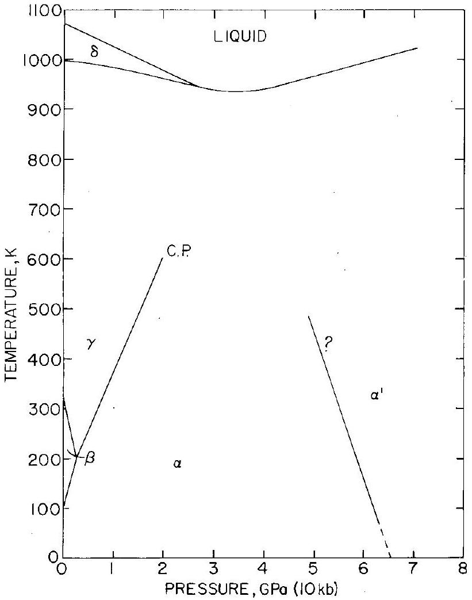
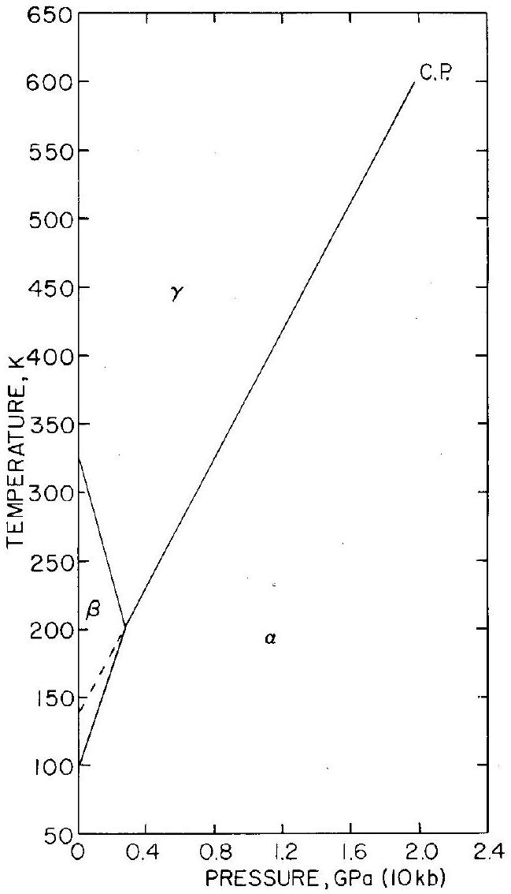
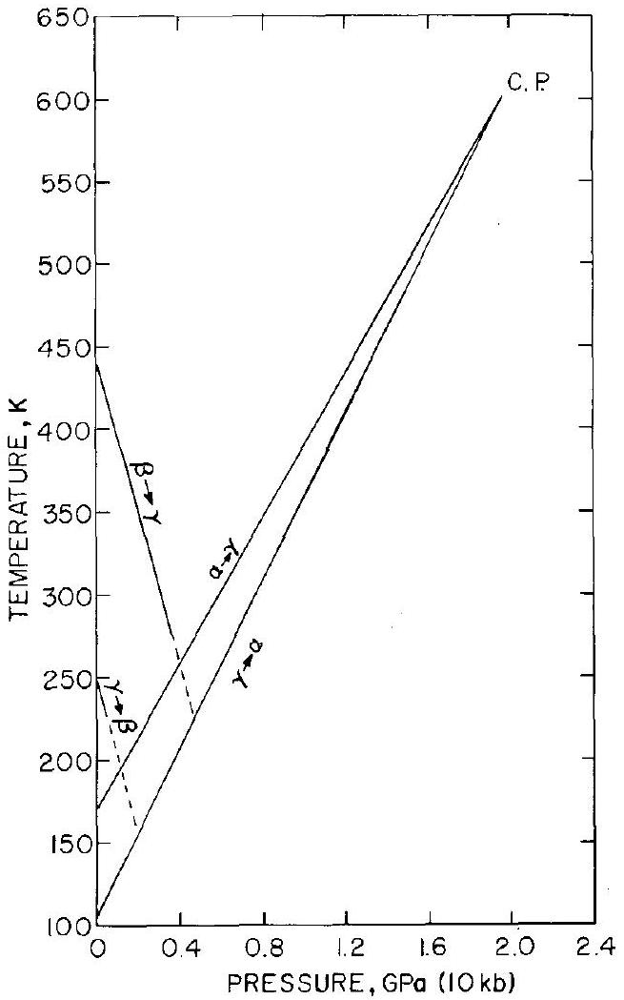
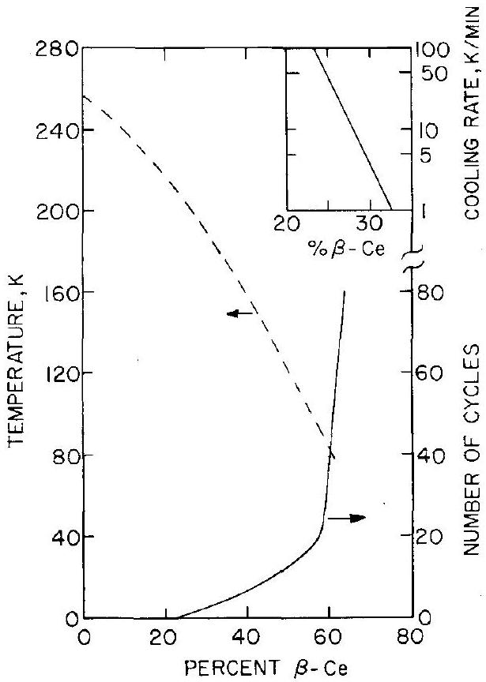
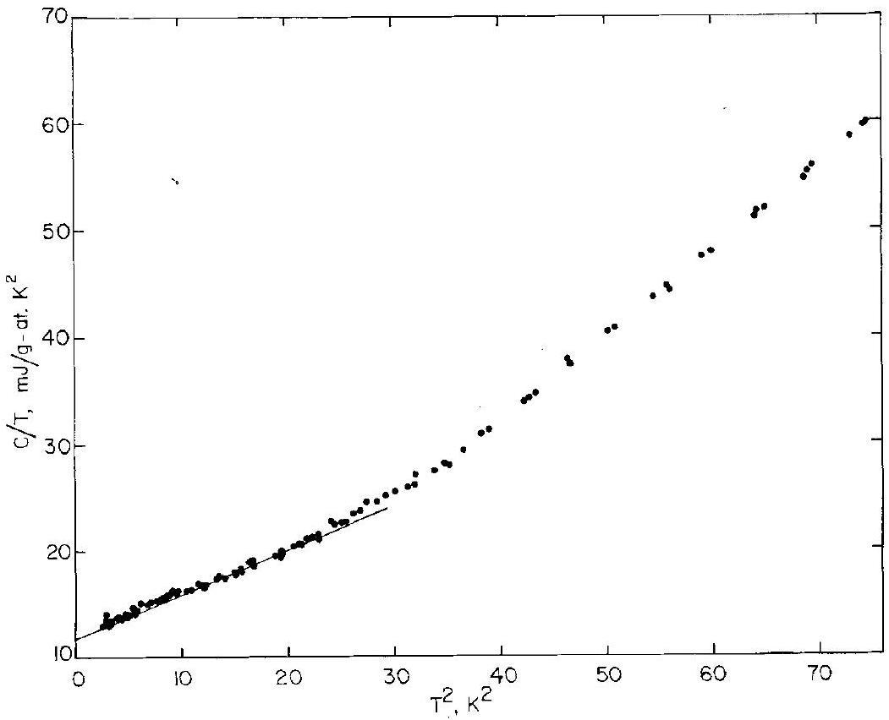
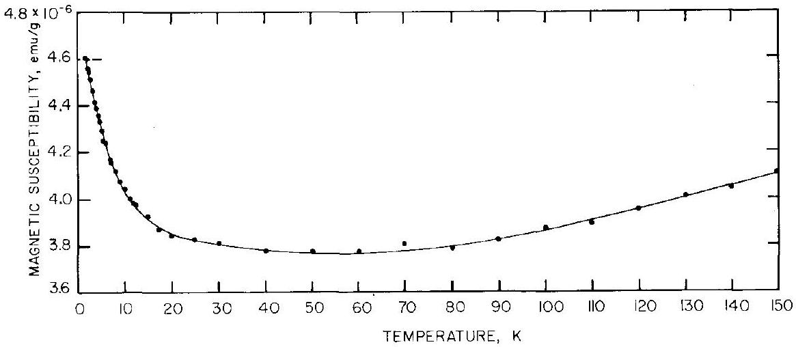
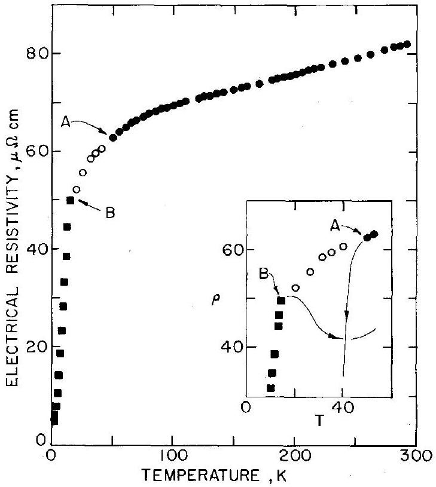
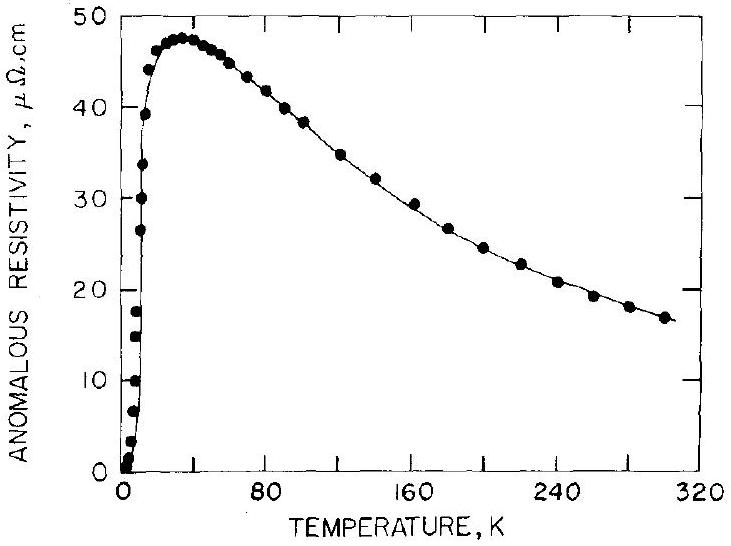
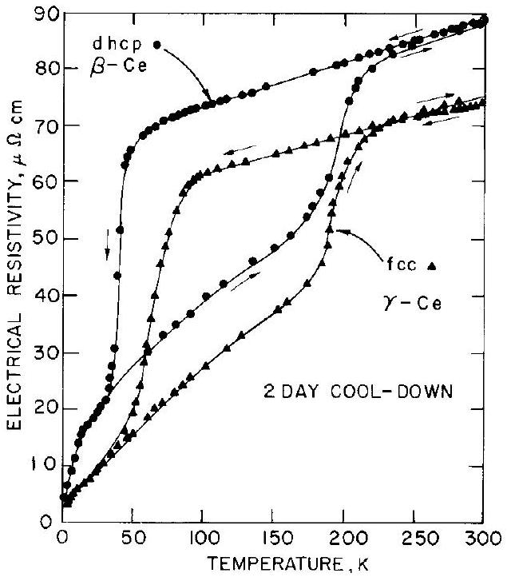

## Chapter 4

CERIUM*
David C. KOSKENMAKI ‡
Armco Steel Corporation, Armco Research Center, Middletown, Ohio 45042, USA

Karl A. GSCHNEIDNER, Jr.
Ames Laboratory-DOE and Department of Materials Science and Engineering, Iowa State University, Ames, Iowa 50011, USA
Contents

1. Introduction ..... 338
2. General description and allotropy ..... 339
2.1. Equilibrium phase diagram ..... 339
2.2. Crystal structures ..... 343
2.3. Valences ..... 344
2.4. Non-equilibrium and hysteresis effects ..... 346
2.5. Other phases - metastable or impurity stabilized or erroneous identifications ..... 352
3. Preparation and handling ..... 353
3.1. Problems in handling ..... 353
3.2. Preparation of single phase $\alpha$ - cerium ..... 354
3.3. Preparation of single phase $\beta$ - cerium ..... 355
3.4. Phase identification ..... 355
4. Physical properties ..... 356
4.1. Heat capacity ..... 356
4.2. Magnetic susceptibility ..... 358
4.3. Electrical resistivity ..... 360
4.4. Neutron scattering ..... 363
4.5. Positron annihilation and angular correlation ..... 364
4.6. Hall effect ..... 364
4.7. Thermoelectric power ..... 364
4.8. Elastic properties ..... 365
4.9. Spectroscopic studies ..... 365
4.10. Miscellaneous
4.10. Miscellaneous ..... 366 ..... 366
5. Theoretical models for the $\gamma \rightleftarrows \alpha$ transformation ..... 367
5.1. Zachariasen-Pauling theory ..... 367
5.2. Coqblin-Blandin model ..... 368
5.3. Ramirez-Falicov model ..... 369
5.4. Hirst model ..... 370
5.5 Comparisons with experiment ..... 371
5.6. Mott transition of f states ..... 371
5.7. Hybridization of f states ..... 373
5.8. Conclusion ..... 374
6. Recent developments ..... 374
References ..... 374
Symbols
$A_{\mathrm{f}}=$ end of transformation on heating
$A_{\mathrm{s}}=$ start of transformation on heating
$C_{\mathrm{M}}=$ magnetic contribution to the heat capacity
$C_{p}=$ heat capacity at constant pressure
$C_{0}=$ heat capacity at constant volume
$E_{\text {exc }}=$ energy necessary to make an inter- configurational excitation
$G=$ magnitude of the electron-electron or electron-hole interaction
$\hbar=$ Planck's constant $/ 2 \pi$

[^0]$M_{\mathrm{d}}=$ temperature at which a deformed sample begins to transform
$M_{\mathrm{f}}=$ end of transformation on cooling
$M_{\mathrm{s}}=$ start of transformation on cooling
$n_{\mathrm{c}}=$ number of conduction electrons
$N=$ number of atoms
$p_{\text {eff }}=$ effective magnetic moment
$P=$ pressure
$R=$ gas constant
$R_{\mathrm{H}}=$ Hall coefficient
$T=$ temperature in kelvin
$U=$ intra-atomic Coulomb repulsion energy
$\gamma=$ electronic specific heat constant
$\Delta=$ band width
$\theta=$ paramagnetic ordering temperature
$\mu_{\mathrm{B}}=$ Bohr magneton
$\rho=$ electrical resistivity
$\chi=$ magnetic susceptibility

## 1. Introduction

In its elemental form cerium is the most fascinating member of the periodic table. Cerium, under various conditions of temperature and pressure, is an antiferromagnet, a superconductor, and the only pure element to exhibit Kondo scattering and a solid-solid critical point. These phenomena occur because the energy of the inner 4f level is nearly the same as that of the outer or valence 5d and 6s levels, and thus only small amounts of energy are necessary to change the relative occupancy of these electronic levels giving rise to a variable electronic structure. Although metallic cerium has been known for 150 years (Mosander, 1827) the discovery of the above phenomena are of recent origin - antiferromagnetism in $\beta$-Ce was suggested by Lock in 1957 on the basis of magnetic susceptibility measurements and confirmed by neutron diffraction in 1961 by Wilkinson et al.; the existence of the critical point between $\alpha$ - and $\gamma$-Ce was observed by Ponyatovskii in 1958; superconductivity in $\alpha^{\prime}$-Ce was discovered by Wittig in 1968; and most recently the Kondo effect in $\beta$-Ce was revealed by Gschneidner et al. in 1976.

Probably of the greatest interest to both experimentalists and theorists is the polymorphic transformation between two face-centered cubic phases, $\gamma-\mathrm{Ce}$ (the room temperature-ambient pressure phase) and $\alpha-\mathrm{Ce}$ (the collapsed phase), which at high pressure and temperature become indistinguishable from one another at the solid-solid critical point. Although the structures of the various phases and the cerium pressure-temperature diagram below $5 \mathrm{GPa}(50 \mathrm{~kb})$ have been well established for over 10 years, the electronic and magnetic natures of the cerium allotropes have been a matter of much controversy due partly to the fact that until recently all physical property measurements below 0.5 GPa pressure and below room temperature were measured on samples containing two or three cerium allotropic phases. Experimentally, the problem is that as $\gamma-\mathrm{Ce}$ is cooled below 273 K it is unstable and begins to transform incompletely to $\beta-\mathrm{Ce}$ (a double-hexagonal close-packed phase); upon further cooling to $\sim 100 \mathrm{~K}, \gamma-\mathrm{Ce}$ transforms to $\alpha$-Ce (but only partially). Thus it was difficult if not impossible, to extract meaningful values from the physical property measurements. Naturally, because of this, many of the theories proposed for the $\alpha \rightleftarrows \gamma$ transformation could not be verified or disproven. But in the early 1970's two important techniques were developed to prepare allotropically pure $\alpha-\mathrm{Ce}$ (Panousis and

Gschneidner, 1970) and $\beta$-Ce (Koskimaki et al., 1974). Already several unexpected results have been realized from the first few experimental measurements, e.g. as noted above $\beta$-Ce exhibits Kondo scattering. The next few years should yield a wealth of reliable experimental information about the nature of the cerium allotropes. From this knowledge and understanding a great deal more will be known about the electronic nature of many of the other elements in the periodic table - cerium is the keystone element. What we learn from cerium can be extended to the actinide elements and to metals which exhibit electronic transitions at high pressure.

## 2. General description and allotropy

There are five established allotropic forms of cerium and some evidence for two or three others which actually may be metastable or impurity stabilized. The pressure-temperature relationships of the stable phases, their crystal structures and valences are discussed first under equilibrium conditions. Then non-equilibrium and hysteresis effects relative to the five established phases are reviewed. Finally the known information on the less reliably established phases is examined.

### 2.1. Equilibrium phase diagram

The pseudo-equilibrium pressure-temperature diagram of cerium is shown in fig. 4.1 and the low pressure-low temperature portion on an expanded scale is shown in fig. 4.2. The pressure-temperature diagram shown in the two figures is based on the results reported in some 25 independent investigations dealing with various aspects of the phase relationships among the five solid and liquid phases of cerium. Eleven important points in the cerium phase diagram are listed in table 4.1; most values are average values taken from the various investigations.

The accepted melting point and $\gamma \rightleftarrows \delta$ transformation point at one atmosphere are taken from the review by Gschneidner (1966). The pressure dependence of melting and the $\gamma / \delta$ phase boundary, the $\gamma \rightleftarrows \delta \rightleftarrows \mathrm{L}$ triple point and liquidus minimum are taken from the results of Jayaraman (1965).

The pressure-temperature dependence of the $\alpha \rightleftarrows \gamma$ phase boundary is based on results reported by Likhter et al. (1957), Herman and Swenson (1958), Ponyatovskii (1958), Beecroft and Swenson (1960), Livshits et al. (1960), Gschneidner et al. (1962), Itskevick (1962), Livshits et al. (1962), Davis and Adams (1964), Jayaraman (1965) and Kutsar (1974). In addition James et al. (1952), McHargue and Yakel (1960), Smith and Morrice (1964), Rashid and Altstetter (1966), Elliott and Miner (1967) and Pavlov and Rybal'chenko (1970) have reported temperature values for the $\gamma \rightleftarrows \alpha$ transformation at atmospheric pressure, while Bridgman (1951), Voronov et al. (1960), MacPherson et al. (1971), and King and Harris (1972) give pressure values for the $\gamma \rightleftarrows \alpha$ transformation pressure at room temperature. The $\alpha / \gamma$ phase boundary ends at a critical point

Fig. 4.1. Pseudo-equilibrium pressure-temperature phase diagram of cerium. The phase boundaries involving $\delta-\mathrm{Ce}$ and liquid are true equilibrium boundaries. The letters C.P. mean critical point. The question mark for the $\alpha / \alpha^{\prime}$ phase boundary indicates that there is considerable doubt about the slope of this boundary, see text for further discussion.

where the two fcc phases are indistinguishable. Thermal analysis data (Ponyatovskii, 1958), volumetric data (Beecroft and Swenson, 1960 and Kutsar, 1974), resistivity data (Livshits et al., 1962 and Jayaraman, 1965) and X-ray data (Davis and Adams, 1964) all show that the quantity measured for the $\alpha \rightleftarrows \gamma$ transformation becomes smaller and smaller until it is no longer measurable as the temperature and pressure are increased. There is, however, considerable scatter for the values reported for the critical point (table 4.1). Except for one investigation, the results fall into two groups. The results of Ponyatovskii and of Jayaraman indicate a critical point at the lower limits (i.e., ~550 K and $\sim 1.8 \mathrm{GPa}$ ) while the results of Beecroft and Swenson and of Davis and Adams indicate a critical point at $\sim 640 \mathrm{~K}$ and $\sim 2.05 \mathrm{GPa}$. Livshits et al. believe the critical point exists above 623 K and 2.1 GPa, which tends to favor the latter two investigations. The $480 \mathrm{~K}-1.45 \mathrm{GPa}$ value for the critical point reported by Kutsar (1974) varies considerably from the above results, although this point falls close to the $\alpha / \gamma$ phase boundary line shown in figs. 4.1 and 4.2. Unless verified

Fig. 4.2. Low pressure-low temperature region of pseudo-equilibrium phase diagram of cerium. The dashed line in the $\beta-\mathrm{Ce}$ phase region is the extension of the $\alpha / \gamma$ phase boundary to lower temperatures and pressures. The letters C.P. mean critical point.

we believe the value obtained by Kutsar for the critical point is erroneous. Furthermore, results of Beecroft and Swenson and of Livshits et al. suggest that the $\alpha / \gamma$ phase boundary curves slightly towards the temperature axis above $\sim 400 \mathrm{~K}$ and $\sim 1.2 \mathrm{GPa}$, while the other three investigations showed a linear boundary. Interestingly, a straight line is obtained by drawing it through the average values given in table 4.1 for the $\alpha \rightleftarrows \gamma$ transformation temperature at one atmosphere, the $\alpha \rightleftarrows \gamma$ transformation pressure at 298 K and the critical point. This reinforces our confidence in the critical point value in spite of the scatter and it also suggests that there is no curvature in the $\alpha / \gamma$ boundary above 1.2 GPa .

The pressure dependence of the $\beta / \gamma$ boundary was determined by Gschneidner et al. (1962). These data were combined with the results for the $\beta \rightleftarrows \gamma$ transformation temperature at one atmosphere reported by McHargue and Yakel

Table 4.1.
Important points in the cerium pressure-temperature diagram
| Transformation | Temperature |  | Pressure |  |
| :--- | :--- | :--- | :--- | :--- |
|  | (K) | (°C) | $(\mathrm{GPa})^{\mathrm{a}}$ | Remarks |
| $\alpha \rightleftarrows \beta$ | $96 \pm 6$ | -177 | 0 | pseudo-equilibrium |
| $\beta \rightleftarrows \gamma$ | $326 \pm 14$ | 53 | 0 | pseudo-equilibrium |
| $\gamma \rightleftarrows \delta$ | $999 \pm 5$ | 726 | 0 | equilibrium |
| $\delta \rightleftarrows L$ | $1071 \pm 3$ | 798 | 0 | equilibrium |
| $\alpha \rightleftarrows \gamma$ | $141 \pm 10$ | -132 | 0 | metastable, pseudoequilibrium |
| $\alpha \rightleftarrows \beta \rightleftarrows \gamma$ | $201 \pm 12$ | -72 | $0.28 \pm 0.05$ | pseudo-equilibrium triple point |
| $\alpha \equiv \gamma$ | $600 \pm 50$ | 327 | $1.96 \pm 0.20$ | critical point |
| $\gamma \rightleftarrows \delta \rightleftarrows L$ | 947 | 674 | 2.6 | equilibrium triple point |
| $\alpha \rightleftarrows \gamma$ | 298 | 25 | $0.7 \pm 0.06$ | pseudo-equilibrium |
| $\alpha \rightleftarrows \alpha^{\prime}$ | 297 | 24 | $5.4 \pm 0.5$ | pseudo-equilibrium |
| $\gamma \rightleftarrows L(\mathrm{~min} .)^{\mathrm{b}}$ | 935 | 662 | 3.3 | equilibrium |

${ }^{\mathrm{a}} 1 \mathrm{GPa}=10 \mathrm{~kb}$. ${ }^{\mathrm{b}}$ The minimum in the liquids curve may actually be a triple point between $\gamma$, liquid and $\alpha^{\prime}$ but further research needs to be done in this region of the phase diagram to determine the exact nature of this point.
(1960) and Rashid and Altstetter (1966) to give the $\beta / \gamma$ boundary line shown in figs. 4.1 and 4.2. The intersection of the $\beta / \gamma$ and $\alpha / \gamma$ boundary lines established the pseudo-equilibrium triple point $\alpha \rightleftarrows \beta \rightleftarrows \gamma$. The $\alpha / \beta$ phase boundary line was obtained by connecting the $\alpha \rightleftarrows \beta$ transformation temperature at atmospheric pressures (McHargue and Yakel, 1960 and Pavlov and Rybal'chenko, 1970) with the $\alpha \rightleftarrows \beta \rightleftarrows \gamma$ triple point.

The $\alpha / \alpha^{\prime}$ boundary line was determined by Livshits et al. (1962) from 200 to 800 K, by Stager and Drickamer (1964) at 77 and 296 K, and by King et al. (1970) from 77 to 480 K . Apparently the latter two groups of investigators were unaware of the earlier work by Livshits et al. who report that the $\alpha / \alpha^{\prime}$ boundary has a positive slope as opposed to the negative slope found by Stager and Drickamer and by King et al. In addition the magnitudes of the slope found by the latter two groups differ significantly. An extrapolation of the Stager-Drickamer $\alpha / \alpha^{\prime}$ boundary to high temperatures appears to intersect at the critical point, while the extrapolated boundary of King et al. intersects at the minimum in the liquidus as suggested by Jayaraman (1965). We believe the data of King et al. to be the most representative of the $\alpha / \alpha^{\prime}$ boundary, because it is the most recent and because it falls between the other two results. But because of the wide divergence, more careful research needs to be carried out before we can have a high degree of confidence in this portion of the cerium pressure diagram. Other researchers (Bridgman, 1952; Vereshchagin et al., 1961; Wittig, 1968; and King and Harris, 1972) have reported this transformation occurs at various pressures ranging from 5.0 to 9.1 GPa at room temperature. In addition X-ray studies (see section 2.2 below) show a crystal structure change above 5 to 6 GPa .

Stager and Drickamer (1964) also report the existence of another first order transformation at ~16 GPa and 296 K and at ~20 GPa and 77 K, suggesting the existence of a sixth polymorphic phase for cerium.

Evidence for phase transformations in cerium has been reported by many other investigators and as early as 1912 (see for example Gschneidner et al., 1962, for earlier citations). But since the purity of the cerium available before ~1950 is significantly lower than that available after 1950 the results reported by these earlier authors have not been included in the data shown in figs. 4.1 and 4.2 and in table 4.1. However, we should like to note that Trombe and Foex (1944 and 1947) discovered the existence of $\beta$-Ce and the influence the presence of this phase had on the volume of transformation observed in a sample when $\gamma-\mathrm{Ce}$ transformed to $\alpha$-Ce. Indeed the nomenclature generally used today to identify these three cerium phases is the same as proposed by Trombe and Foex.

### 2.2. Crystal structures

The earliest investigations of the crystal structure of cerium (Hull, 1921) indicated that cerium had both a face centered cubic (fcc) and a hexagonal close-packed (hcp with $c / a=1.62$ ) structure at room temperature and one atmosphere. Subsequent studies revealed only the fcc phase with $a \simeq 5.15 \AA$, which today is identified as $\gamma-\mathrm{Ce}$ (see table 4.2 for additional crystallographic data). About 25 years ago the $\alpha$-Ce phase was identified by X-ray methods at both high pressure and room temperature (Lawson and Tang, 1949) and at low temperature and atmospheric pressure (Schuck and Sturdivant, 1950) to have a fcc structure but with $a \simeq 4.83 \AA$. The $\alpha$ phase, with a volume about $17 \%$ less than that of $\gamma-\mathrm{Ce}$, is also known as the "collapsed" fcc phase. This large volume difference is also observed in dilatometric and volumetric studies of the $\alpha \rightleftarrows \gamma$ transformation.

The next phase to be identified was $\beta$-Ce, which forms from $\gamma$-Ce as a sample

Table 4.2.
Crystal structures, lattice parameters, metallic radii and atomic volumes of five cerium allotropes
| Phase | Crystal Structure | Lattice Parameters (A) |  |  | Conditions |  | Metallic Radius | Atomic Volume ( $\AA^{3} /$ atom ) | Ref. |
| :--- | :--- | :--- | :--- | :--- | :--- | :--- | :--- | :--- | :--- |
|  |  |  |  |  |  |  |  |  |  |
|  |  | $a$ | $b$ | $c$ |  |  |  |  |  |
| $\boldsymbol{\alpha}^{\prime}$ | C-centered |  |  |  |  |  |  |  |  |
|  | orthorhombic | 3.049 | 5.998 | 5.215 | 298 | 5.8 | 1.615 | 23.84 | b |
|  |  |  | - | - | 298 | 0.81 | 1.706 | 28.06 | c |
| $\boldsymbol{\alpha}$ | fcc | $\left\{\begin{array}{l}4.824 \\ 4.85\end{array}\right.$ | - | - | 77 | 0 | 1.71 | 28.5 | d |
| $\beta$ | dhcp | 3.6810 | 11.857 | - | 298 | 0 | 1.8321 | 34.784 | e |
| $\gamma$ | fcc | 5.1610 | - | - | 298 | 0 | 1.8245 | 34.367 | e |
| $\delta$ | bcc | 4.11 | - | - | 1041 | 0 | 1.83 | 34.7 | f |

[^1]of cerium is cooled below about 260 K (~-15°C). McHargue and co-workers (1957) found $\beta$-Ce to have a double hexagonal close-packed (dhcp) structure, with $a \simeq 3.68 \AA, c \simeq 11.92 \AA$ and $c / a \simeq 3.24$, which is about twice that observed for an ideal hcp metal $(c / a \simeq 1.63)$. A few years later Spedding et al. (1961) showed that $\delta-\mathrm{Ce}$ has a body-centered cubic (bcc) structure.

Four studies have been carried out at high pressures, $>5.0 \mathrm{GPa}$, and room temperature to determine the structure of $\alpha^{\prime}$-Ce. Franceschi and Olcese (1969) identified $\alpha^{\prime}$-Ce as being fcc with a lattice parameter about 4\% smaller than that of $\alpha$-Ce. A year later McWhan (1970) reported $\alpha^{\prime}$-Ce to have a hcp structure with $a=3.16 \AA$ and $c=5.20 \AA$. Ellinger and Zachariasen (1974) report a third structure for $\alpha^{\prime}-\mathrm{Ce}$, namely C-centered orthorhombic, which is isotypic with $\alpha-\mathrm{U}$. Ellinger and Zachariasen suggest that Franceschi and Olcese did not attain sufficient pressures to transform $\alpha$ to $\alpha^{\prime}$ since their lattice constant is consistent with the lattice parameter found by Ellinger and Zachariasen for $\alpha$-Ce before it transformed to $\alpha^{\prime}$-Ce. Ellinger and Zachariasen also reanalyzed McWhan's data and found that the observed lines agreed better with their orthorhombic structure and lattice constants than they did for the hexagonal structure and lattice parameters given by McWhan. A year later Schaufelberger and Merx (1975) favored the co-existence of the fcc and hcp structures at $P>5 \mathrm{GPa}$, but they could not rule out the orthorhombic structure for $\alpha^{\prime}$-Ce. Furthermore, we note that the metallic radius and atomic volume calculated from the hcp lattice parameters are about 10\% smaller than one might expect for tetravalent $\alpha^{\prime}$-Ce, but those calculated from the orthorhombic lattice parameters are within 1\% of the expected values (Gschneidner and Smoluchowski, 1963). More recently Zachariasen and Ellinger (1976) presented additional experimental details confirming that $\alpha^{\prime}-\mathrm{Ce}$ has the C-centered orthorhombic structure and that McWhan's hcp structure cannot be correct.

The crystallographic data for the five cerium allotropic phases are summarized in table 4.2. The lattice parameters listed are those we feel are the best values for each of the five allotropes taking into account the chemical and phase purities of the samples and the X-ray techniques employed. The metallic radii and atomic volumes were calculated from the lattice parameters and thus correspond to the conditions given in table 4.2.

Several investigators have reported the co-existence of two of the cerium phases, such as $\gamma$ and $\alpha$, or $\beta$ and $\alpha$, or $\alpha$ and $\alpha^{\prime}$, under conditions of pressure and temperature where only one phase would be expected from the known phase relationships and hysteresis effects (see section 2.4). The lack of truly hydrostatic pressure in the high pressure X-ray device probably accounts for most of the problem, but slow reaction kinetics may also contribute.

### 2.3. Valences

The simplest explanation for the large volume change between the $\gamma$ and $\alpha$, and the $\beta$ and $\alpha$ phases is that the localized 4f level is at least partially delocalized and enters the valence band of cerium. The initial explanation,
proposed independently by Zachariasen (1949) and Pauling (1950) suggested that the volume change for the $\alpha \rightleftarrows \gamma$ transformation was due to a valence change from 3 in $\gamma$-Ce to 4 in $\alpha$-Ce. But several years later Lock (1957) and Murao and Matsubara (1957) independently suggested that the magnetic susceptibility change for the $\alpha \rightleftarrows \gamma$ transformation corresponded to a valence change of 0.5 and not 1 electron per atom. The latter workers suggested valences of 3 for $\gamma-\mathrm{Ce}$ and 3.5 for $\alpha$-Ce. In the early 1960's Evans and Raynor (1962) proposed a valence of 3.2 for $\gamma-\mathrm{Ce}$, which increased with pressure to 3.5 at the $\gamma-\alpha$ transformation pressure (at 298 K), and a valence of 4 for $\alpha$-Ce. A year later Gschneidner and Smoluchowski (1963) made an extensive analysis of all of the available experimental data, especially the metallic radii and magnetic susceptibility data, and also neutron diffraction and Hall coefficient results, and concluded that $\beta$ - and $\gamma$-Ce have valences of 3.06 at room temperature and atmospheric pressure and $\alpha$-Ce has a valence of 3.67 at 116 K and one atmosphere (see table 4.3). Furthermore, they claimed that the valence of $\gamma-\mathrm{Ce}$ increases with increasing pressure to a maximum value of 3.26 at the critical point, while that of $\alpha$-Ce decreases with increasing pressure (3.54 at 0.78 GPa and 298 K) to 3.26 at the critical point. To date most scientists have accepted the latter set of valences as the most reasonable.

More recent high pressure studies (>5 GPa) have revealed the existence of $\alpha^{\prime}-\mathrm{Ce}$, which is superconducting (Wittig, 1968) and has an atomic volume $\sim 3.2 \%$ smaller than $\alpha$-Ce at the $\alpha \rightleftarrows \alpha^{\prime}$ transition pressure (Ellinger and Zachariasen, 1974). From metallic radii considerations Ellinger and Zachariasen consider $\alpha^{\prime}$-Ce to be tetravalent (see table 4.3), and thus to have no localized 4f electrons, which is consistent with its superconducting behavior. The existence of tetravalent $\alpha^{\prime}$-Ce is in accord with the valency scheme proposed by Gschneidner and Smoluchowski (1963), and this valence rules out most of the other proposed valence schemes.

Although more reliable X-ray and magnetic susceptibility data have become available since Gschneidner and Smoluchowski made their analysis, the use of

Table 4.3.
Metallic radii (corrected to atmospheric pressure and 298 K) and valences
| Phase | Radius (Å) | Valence |
| :--- | :--- | :--- |
| Hypothetical trivalent Ce | $1.846^{\mathrm{a}}$ | - |
| $\beta$-Ce | 1.8321 | $3.04^{\mathrm{b}}$ |
| $\gamma$-Ce | 1.8245 | $3.06^{\mathrm{a}, \mathrm{c}}$ |
| $\delta-\mathrm{Ce}$ | 1.82 | 3.06 |
| $\alpha$-Ce | 1.73 | $3.67^{\mathrm{a}, \mathrm{c}}$ |
| $\alpha^{\prime}$-Ce | 1.669 | $4.00{ }^{\text {b }}$ |
| Hypothetical tetravalent Ce | $1.672^{\mathrm{a}}$ | - |

[^2]these data would not change the resultant valences by more than $\pm 0.02$ from those noted above. However, the revised lattice parameters (Beaudry and Palmer, 1974) and recent magnetic susceptibility data (Burgardt et al., 1976) of $\beta$-Ce suggest that the valence of this phase is about 0.02 lower than that of $\gamma$-Ce.

It should be noted that there are some experimental measurements (such as positron annihilation) which are apparently inconsistent with these valences. The difficulty arises from the fact that, although this valency scheme is useful and is consistent with many experimental facts, it is an over simplified description of the electronic nature of cerium and its allotropes. This problem is dealt with in the discussions concerning the various models proposed to explain the $\alpha \rightleftarrows \gamma$ transformation and the electronic nature of $\alpha, \alpha^{\prime}$ and $\gamma$ phases (sections 5.1-5.7).

### 2.4. Non-equilibrium and hysteresis effects

The pressure-temperature diagrams presented in figs. 4.1 and 4.2 appear to be reasonable and explain the phase relationships between the various allotropes. The actual situation, however, is much more complicated and frustrating, especially in the region of temperatures <300 K and pressures <0.5 GPa. The major difficulty arises from the fact that all the phase transformations, except the $\gamma \rightleftarrows \delta, \gamma \rightleftarrows \mathrm{L}$ and $\delta \rightleftarrows \mathrm{L}$ transformations, exhibit large hystereses when either the temperature or the pressure is varied. The second difficulty is that some of the transformations do not go to completion, or if they do unusual conditions or procedures are required to complete the transition. Because of these difficulties most of the cerium samples studied below room temperature contain at least two and sometimes three different phases. Thus, most of the measurements made on these samples are of questionable value because it is almost impossible to separate out the individual contributions of the constituent phases.

### 2.4.1. The non-equilibrium cerium phase diagram

The experimentally observed transformations for $\beta \rightarrow \gamma, \gamma \rightarrow \beta, \gamma \rightarrow \alpha$ and $\alpha \rightarrow \gamma$ are shown in fig. 4.3 as a function of pressure and temperature. The lines in fig. 4.3 represent the start of transformations, $M_{\mathrm{s}}$ (cooling) or $A_{\mathrm{s}}$ (heating). The $\beta \rightarrow \gamma$ and $\gamma \rightarrow \beta$ transformations have only been measured by Gschneidner et al. (1962), while the $\gamma \rightarrow \alpha$ and $\alpha \rightarrow \gamma$ transformations are average values based on the investigations of Ponyatovskii (1958), Herman and Swenson (1958), Livshits et al. (1960) and Gschneidner et al. (1962). It is evident from fig. 4.3 that in samples which have never been cooled below $-10^{\circ} \mathrm{C} \gamma$-Ce is the observed phase at room temperature and pressure, although as seen in figs. 4.1 and 4.2 it is a metastable phase under these conditions.

Upon cooling atmospheric pressure $\gamma$-Ce will partially transform to $\beta$-Ce at a temperature near -10°C (263 K) (see table 4.4). To date no one has been able to cool a bulk cerium sample fast enough to avoid the formation of $\beta$ phase. Upon further cooling the untransformed $\gamma$-Ce will transform to $\alpha$-Ce at ~100K (table

Fig. 4.3. The $\gamma \rightarrow \beta, \beta \rightarrow \gamma, \gamma \rightarrow \alpha$ and $\alpha \rightarrow \gamma$ transformations as experimentally observed. Averaged results taken from several investigations were used to construct the $\gamma \rightarrow \alpha$ and $\alpha \rightarrow \gamma$ transformation boundaries. Only one study has been made of pressure dependence of the $\gamma \rightarrow \beta$ and $\beta \rightarrow \gamma$ transformations. The letters C.P. mean critical point.

4.4). Continued cooling will cause $\beta$-Ce to be partially converted to $\alpha$-Ce if the cooling rate is slow enough between 50 and 15 K . Upon warming, the $\alpha$ phase transforms back to $\beta$ and $\gamma$, and at room temperature the sample will consist of two phases, $\beta$ and $\gamma$. Conversion back to single phase $\gamma$-Ce requires heating the sample to above ~500 K. These transformations will be discussed separately below.

### 2.4.2. The $\gamma \rightarrow \beta$ transformation

The transformation of fcc $\gamma$ to dhcp $\beta$ is martensitic (McHargue and Yakel, 1960 and Rashid and Altstetter, 1966) and has been reported to take place over a wide range of temperatures (see table 4.4). The $M_{\mathrm{s}}$ temperature depends upon the purity (the higher the overall purity the lower the $M_{\mathrm{s}}$ temperature - Gschneidner et al., 1962), and the grain size (the smaller the grain size the lower the $M_{\mathrm{s}}$ temperature - Koch and McHargue, 1968). The amount of $\beta$-Ce formed

Table 4.4.
Experimental transformation temperatures at atmospheric pressure
| Transformation | Cooling (K) |  | Ref. |
| :--- | :--- | :--- | :--- |
|  | $M_{\mathrm{s}}$ | $M_{\mathrm{f}}$ |  |
| $\gamma \rightarrow \beta$ | 237 to 278 | ? | a, b, c |
| $\gamma \rightarrow \alpha$ | 86 to 116 | ~4.2 | a, b, c, d |
| $\beta \rightarrow \alpha$ | 45 | 15 | e, f |
|  | Heating (K) |  |  |
|  | $A_{\mathrm{s}}$ | $A_{\mathrm{f}}$ |  |
| $\alpha \rightarrow \beta$ | 125 | 200 | a |
| $\alpha \rightarrow \beta+\gamma$ | 158 to 180 | 190 to 210 | a, b, c |
| $\beta \rightarrow \gamma$ | 373 to 451 | 420 to >451 | a, b, c |

${ }^{\mathrm{a}}$ McHargue and Yakel (1960); ${ }^{\mathrm{b}}$ Gschneidner et al. (1962);
${ }^{\mathrm{c}}$ Rashid and Altstetter (1966); ${ }^{\mathrm{d}}$ Elliot and Miner (1967);
${ }^{\mathrm{e}}$ Gschneidner et al. (1976); ${ }^{\mathrm{f}}$ Burgardt et al. (1976a).
depends upon (1) the cooling rate, (2) the temperature to which a sample is cooled and (3) the number of times a specimen has been cycled (cooled to liquid $\mathrm{N}_{2}$ or lower and then warmed to room temperature), see fig. 4.4. As shown by Gschneidner et al. (1962) it is almost impossible to cool a $\gamma$-Ce sample fast enough to prevent the formation of $\beta$-Ce. Extrapolation of their data indicate that a cooling rate of $10^{7} \mathrm{~K} / \mathrm{min}$ or greater is required (fig. 4.4). McHargue and Yakel (1960), Wilkinson et al. (1961) and Gschneidner et al. (1962) have shown that the lower the temperature to which a cerium sample is cooled and held the greater the amount of $\beta$-Ce formed (the dashed line in fig. 4.4 is based on the average of the latter two investigations). McHargue and Yakel using an X-ray technique found a somewhat higher percentage of $\beta-\mathrm{Ce}$ at a given temperature than Wilkinson et al., who used neutron diffraction, and Gschneidner et al., who used dilatometry. This suggests that there is a higher concentration of $\beta$-Ce near the surface than in the interior. Lock (1957) noted that the amount of $\beta$-Ce could be increased by cycling the sample between room temperature and liquid helium temperature. Subsequent investigators confirmed his findings, although some of them showed cooling to liquid $\mathrm{N}_{2}$ gave similar results (see fig. 4.4). The curve shown in fig. 4.4 (after Gschneidner et al., 1962) is typical, and indicates that the fraction of $\beta$-Ce increases only slightly after about 20 cycles. It is doubtful that anyone has prepared pure $\beta$-Ce by just cycling, although McHargue and Yakel (1960) and Rashid and Altstetter (1966) have made such claims.

McHargue and Yakel (1960) proposed a dislocation model similar to that found for the fcc-hcp transformation in Co to explain the mechanism of the $\gamma \rightarrow \beta$ cerium transformation. This transformation occurs by a succession of $a / 6$
<112) glides in the cubic phase on two adjacent close-packed planes $\{111\}$ with no glide on the next two neighboring planes (see fig. 4.5). Rashid and Altstetter (1966) and Shimura (1969) have also found this model to be acceptable and consistent with their investigations. Rashid and Altstetter also point out that the transformation can proceed both athermally and isothermally.

Plastic deformation has been found to induce the $\gamma \rightarrow \beta$ transformation from 196 K up to the $M_{\mathrm{d}}$ temperature (the temperature at which a deformed $\gamma-\mathrm{Ce}$ sample begins to transform to $\beta$-Ce, ~500K) (Koch and McHargue, 1968).

Fig. 4.4. Influence of the temperature to which a sample is cooled (dashed line), the cooling rate (insert) and the number of cycles (solid line) on the amount of $\beta$-Ce formed during the $\gamma \rightarrow \beta$ transformation.

| FCC | A | B | C | A | B | C | A | B | C |
| :--- | :--- | :--- | :--- | :--- | :--- | :--- | :--- | :--- | :--- |
| OPERATORS | ∇ |  |  | ∇ | ∇ |  |  | ∇ | ∇ |
|  |  |  |  | + |  |  |  | + |  |
| GLIDE   MOVEMENTS |  |  | V | V |  |  |  | V |  |
|  |  |  |  |  |  |  |  |  |  |
| OPERATORS | ∇ |  |  | $\Delta$ | ∇ |  |  | $\Delta$ | ∇ |
| DHCP | A | B | A | C | A | B | A | C | A |

Fig. 4.5. A model showing glide motion for $\gamma-\mathrm{Ce}$ transforming to $\beta$-Ce. The symbol ∇ is used to represent the transition between two adjacent planes in the ABC layering sequence, $\triangle$ in the CBA layering sequence, and $v$ is the vector representing a glide displacement.

Neutron diffraction studies carried out by Wilkinson et al. (1961) on an annealed and a cold worked sample support the observations of Koch and McHargue. Furthermore, they (K and McH) note that the $M_{\mathrm{d}}$ temperature is higher than the $A_{\mathrm{s}}$ and $A_{\mathrm{f}}$ temperatures, which is unusual (for a typical martensitic transformation $A_{\mathrm{f}}>A_{\mathrm{s}}>M_{\mathrm{d}}>M_{\mathrm{s}}>M_{\mathrm{f}}$ ). The pressure dependence of this transformation (fig. 4.3) is based on the results of Gschneidner et al. (1962).

### 2.4.3. The $\beta-\gamma$ transformation

Much less is known about the transformation of $\beta-\mathrm{Ce}$ to $\gamma-\mathrm{Ce}$ than the reverse reaction (see above). The $A_{\mathrm{s}}$ and $A_{\mathrm{f}}$ temperatures are given in table 4.4. The $A_{\mathrm{s}}$ temperature increases with increasing purity (Gschneidner et al., 1962) but is essentially independent of grain size (Koch and McHargue, 1968). The $A_{\mathrm{s}}$ temperature depends on the heating rate, the slower the rate of heating the lower the $A_{\mathrm{s}}$ value (Koskimaki et al., 1974). These authors have shown that below 348 K $\beta$-Ce will not transform to $\gamma$-Ce even after holding at this temperature for one year, but at $361 \mathrm{~K} 12 \%$ of the $\beta$-Ce will have transformed to $\gamma$-Ce after 6 days at this temperature. Holding at higher temperatures results in the transformation of successively larger amounts. The application of pressure lowers the $A_{\mathrm{s}}$ temperature as is shown in fig. 4.3 (Gschneidner et al., 1962).

According to the model of McHargue and Yakel (1960), see fig. 4.5, $\beta$-Ce transforms to $\gamma-\mathrm{Ce}$ by glide on the $\{0001\}$ planes in the $\langle 10 \overline{1} 0\rangle$ directions in the dhcp structure. The glides take place on two adjacent planes while the neighboring pairs of two adjacent planes remain stationary.

### 2.4.4. The $\beta \rightleftarrows \gamma$ hysteresis

As is shown in fig. 4.3 there is considerable hysteresis exhibited with this transformation, more than for the $\alpha \rightleftarrows \gamma$ transformation. The hysteresis is quite dependent upon the purity of the cerium used, as noted by Gschneidner et al. (1962) who report that a 99.5 at.\% Ce sample had a hysteresis of 191 K, a 99.0 at.\% Ce sample one of 110 K and a 96.4 at.\% Ce specimen one of 80 K . This is consistent with the previous discussions concerning the lowering of $M_{\mathrm{s}}$ and the raising of $A_{\mathrm{s}}$ of the $\gamma \rightleftarrows \beta$ transformations as the purity of the cerium samples was increased. Grain size should also influence the hysteresis, with the smaller the grain size the larger the hysteresis (see above discussions).

### 2.4.5. The $\gamma \rightarrow \alpha$ transformation

The $\gamma \rightarrow \alpha$ is unique in that there is no crystallographic change, just a large volume collapse of about $17 \%$. The $M_{\mathrm{s}}$ temperature has been reported to vary over a range of about 25 K (see table 4.4). Rashid and Altstetter (1966) found that $M_{\mathrm{s}}$ increases on the second and succeeding cycles (also confirmed by Elliot and Miner, 1967). A metallographic study by Rashid and Altstetter showed that small cellular areas of $\gamma-\mathrm{Ce}$ random in size and shape collapsed to $\alpha-\mathrm{Ce}$,
apparently independent of the neighboring areas. They concluded that the $\gamma \rightarrow \alpha$ transformation does not appear to be a shear transformation. The $M_{\mathrm{f}}$ temperature was determined from X-ray data by McHargue and Yakel (1960). These authors also noted that after considerable cycling $\gamma-\mathrm{Ce}$ (and also $\beta-\mathrm{Ce}$ ) will no longer transform to $\alpha$-Ce, which is consistent with results reported by Lock (1957), Gschneidner et al. (1962) and Rashid and Altstetter (1966). Deformation of $\gamma$-Ce below $M_{\mathrm{s}}$ increases the amount of $\alpha-\mathrm{Ce}$ (McHargue and Yakel, 1960).

Rosen (1969) and Clinard (1969) found a softening (as evidenced by a large decrease in the elastic moduli) of the cerium lattice (presumably a mixture of $\gamma$ and $\beta-\mathrm{Ce}$ ) below 175 K and 200 K , respectively, which was temporarily arrested at the $\gamma \rightarrow \alpha$ transformation. An X-ray study by Pavlov and Finkel (1967) confirms that at least part of the softening of the cerium sample is due to the softening of the $\gamma$-Ce lattice, which is manifested by a large increase in the coefficient of thermal expansion of $\gamma$-Ce below 200 K. This softening of the $\gamma$-Ce lattice as the $\gamma \rightarrow \alpha$ transformation is approached is also evident in the high pressure volumetric and X-ray compressibility data (Bridgman, 1948 and Evidokimova and Genshaft, 1964) and sound velocity measurements (Voronov et al., 1960). At high pressure this softening is entirely due to $\gamma$-Ce, since no $\beta$-Ce is present in the samples.

The pressure dependence of the $\gamma \rightarrow \alpha$ transformation is shown in fig. 4.3. High pressure studies of $\gamma$-Ce and the $\gamma \rightarrow \alpha$ transformation at room temperature or above have an advantage over low temperature, one atmosphere studies in that $\beta$-Ce does not form to complicate the interpretation of data. In contrast to the low temperature transformation the $\gamma \rightarrow \alpha$ transformation at 300 K takes place rapidly and completely over a narrow range of pressure (<0.05 GPa). The reported values vary from 0.74 to 0.85 GPa .

### 2.4.6. The $\beta \rightarrow \alpha$ transformation

McHargue and Yakel (1960) using X-rays and Wilkinson et al. (1961) using neutron diffraction reported that $\beta$-Ce begins to transform to $\alpha$-Ce at a temperature between 50 and 77 K. These experiments were carried out on samples which contained all three low temperature allotropes of cerium. Recently Gschneidner et al. (1976) and Burgardt et al. (1976a) using resistivity and magnetic susceptibility measurements on an allotropically pure $\beta$-Ce sample found the $\beta \rightarrow \alpha M_{\mathrm{s}}$ temperature to be 45 K. They also found that if the $\beta$-Ce sample was rapidly cooled to 4.2 K (cooling rates were varied such that it took 5 to 90 min. to cool from 298 to 4.2 K) $\beta$-Ce would not transform to $\alpha$-Ce. Neutron diffraction data by these authors confirmed the absence of any $\alpha$-Ce within the limits of detection. Upon warming a quenched $\beta$-Ce sample from 4.2 K they found it began to transform to $\alpha-\mathrm{Ce}$ at 15 K . The pressure dependence of this transformation has not been investigated.

It is quite likely that the $\beta \rightarrow \alpha$ transformation is partly a shear transformation involving the motion of atoms from a dhcp lattice to a fcc lattice, but in addition there is a large volume collapse ( $\sim 17 \%$ ) occurring approximately
simultaneously with the change in symmetry. That is, one can visualize this transformation as a combination of $\beta \rightarrow \gamma \rightarrow \alpha$ transformations.

### 2.4.7. The $\alpha \rightarrow \beta$ and $\alpha \rightarrow \beta+\gamma$ transformations

When $\alpha$-Ce is warmed up to above 125 K it begins to transform only to $\beta$-Ce according to the X-ray study of McHargue and Yakel (1960). Examination of the dilatometric curve given by Gschneidner et al. (1962) and the resistivity curve of Smith and Morrice (1964) suggests that the $M_{\mathrm{s}}$ for $\alpha \rightarrow \beta$ may be as low as 100 K and 85 K, respectively. It should be noted, however, that resistivity and dilatometric curves published by others did not show any evidence for the $\alpha \rightarrow \beta$ transformation. Upon continued warming the $\alpha-\mathrm{Ce}$ phase begins to transform slowly to $\gamma$-Ce at 160 K (McHargue and Yakel, 1960), but at about 180 K the transformation proceeds quite rapidly. During this same temperature interval the $\beta$-Ce is continuing to form but at a slow rate, such that above $A_{\mathrm{f}} 80 \%$ of the $\alpha$-Ce present has transformed to $\gamma-\mathrm{Ce}$ and the remaining $20 \%$ to $\beta-\mathrm{Ce}$. Dilatometric, magnetic susceptibility and electrical resistivity data reported by others are consistent with the X-ray results.

At high pressure and room temperature, since $\beta$-Ce is unstable, the $\alpha-\mathrm{Ce}$ transforms entirely to $\gamma-\mathrm{Ce}$. The pressure dependence of the $\alpha \rightarrow \gamma$ transformation is shown in fig. 4.3. It is seen that the hysteresis for the $\alpha \rightleftarrows \gamma$ transformation decreases with increasing pressure and temperature and appears to disappear at the critical point. The pressure dependence of the $\alpha \rightarrow \beta$ transformation has not been determined.

### 2.5. Other phases - metastable or impurity stabilized or erroneous identifications

A simple close-packed hexagonal structure has been reported for cerium at ambient temperature and pressure (Hull, 1921) and above 5 GPa pressure and 298 K (McWhan, 1970). The former probably had observed the dhcp $\beta$-Ce phase along with fcc $\gamma$-Ce in an impure cerium sample and incorrectly indexed the non-cubic phase as simple hcp. The high pressure X-ray pattern observed by McWhan was also indexed by Ellinger and Zachariasen (1974) to be orthorhombic (see section 2.2).
There have been three investigations in which a fcc structure with a lattice parameter about 1\% smaller than that of $\gamma$-Ce has been observed (Dailer and Rothe, 1955; Weiner and Raynor, 1959; and Gschneidner et al., 1962). The lattice parameters observed by Dialer and Rothe, and Gschneidner and co-workers may be for the same phase, but those observed by Weiner and Raynor were obtained under very different conditions and are not related to the other two observations (see Gschneidner et al., 1962). About five years after Weiner's and Raynor's report, it was shown that their so-called " $\boldsymbol{\gamma}^{\prime}$-Ce" was probably a cerium interstitial compound, CeX, having the NaCl type structure (Gschneidner and Waber, 1964). The cubic phase noted by Gschneidner et al. (1962) was observed in X-ray powder samples, which were cycled through the $\gamma \rightleftarrows \alpha$
transformation and studied by X-rays at 298 K. This phase had a lattice parameter of $5.1233 \AA$ and was called " $\alpha-\gamma$ intermediate" by the authors. This phase could be converted to $\gamma$-Ce by heating and when the sample was cycled once again to liquid $\mathrm{N}_{2}$ it transformed to the " $\alpha-\gamma$ intermediate" - indicating that this was not due to a surface reaction forming a CeX compound. Interestingly the " $\alpha-\gamma$ intermediate" was not observed by these authors in another cerium sample of lower purity. Furthermore, it is quite likely that McHargue and Yakel (1960) did not observe the " $\alpha-\gamma$ intermediate" phase in their X-ray study, and Rashid and Altstetter (1966), who made a special attempt to find this phase, also did not observe it. Thus the " $\alpha-\gamma$ intermediate" phase, which has been observed once or possibly twice, still remains an unexplained mystery.

A monoclinic high pressure cerium phase ( $\boldsymbol{\alpha}^{\prime \prime}-\mathrm{Ce}$ ) was observed by Ellinger and Zachariasen (1974). They believe $\alpha^{\prime \prime}-\mathrm{Ce}$ is a metastable phase which forms from $\alpha-\mathrm{Ce}$ at about 6 GPa . If the pressure is lowered $\alpha^{\prime \prime}-\mathrm{Ce}$ transforms back to $\alpha-\mathrm{Ce}$, but if the pressure is increased above $6 \mathrm{GPa} \alpha^{\prime \prime}-\mathrm{Ce}$ changes sluggishly and irreversibly to $\alpha^{\prime}$-Ce. New results given by Zachariasen and Ellinger (1976) show that the body-centered monoclinic $\alpha^{\prime \prime}$-Ce is a slightly distorted fcc structure with $a=4.762, b=3.170, c=3.169 \AA$ and $\beta=91.73^{\circ}$.

## 3. Preparation and handling

### 3.1. Problems in handling

Cerium is a reactive metal which easily oxidizes when exposed to the air. The metal must be stored in an inert atmosphere or vacuum and ideally should be handled in a glove box. However, short exposures (< 15 minutes) to the air can be tolerated since the oxide layer can usually be removed by electropolishing. Oxide layers formed over longer periods (~1 hour) are difficult to remove by electropolishing unless the surface is first filed or ground on abrasive paper. In any event, the layer should not be allowed to become too thick, nor should the metal be stored in this condition due to the tendency of the oxide to penetrate the grain boundaries.

The most common electropolishing method is the application of approximately +40 volts to the sample in a 6\% solution of perchloric acid in methanol cooled to dry ice temperature of $-78^{\circ} \mathrm{C}$ (Peterson and Hopkins, 1964). Afterwards the surface appears to be protected for an hour by an anodized layer. One drawback is the formation of $\beta-\mathrm{Ce}\left(M_{\mathrm{s}}\right.$ for $\beta-\mathrm{Ce}$ is $\left.\sim-10^{\circ} \mathrm{C}\right)$ which needs to be avoided if a single phase $\gamma$-Ce sample is desired.

A chemical polish which can be used at room temperature consists of 25 ml dimethylformamide, 20 ml lactic acid, 5 ml phosphoric acid, 10 ml acetic, 15 ml nitric acid and 1 ml sulfuric acid (Koch and Picklesimer, 1967). The above solution is a dilution (with dimethylformamide) of Roman's solution (1966) which was developed for polishing the heavy rare earth elements. A modification of the
above solution, which has also been successfully used by us, is equal parts of dimethylformamide, nitric acid, acetic acid, and lactic acid. The chemical polish method is more difficult since the sample surface must be carefully swabbed during polishing to prevent buildup of various residues on the surface.

Koch and Picklesimer (1967) found that a protective anodized layer can be formed on the sample surface by applying +22 volts to the sample in a 1\% solution of KOH immediately after polishing. This layer seems to protect the sample for up to a day but is difficult to subsequently remove except by grinding the sample on abrasive paper.

### 3.2. Preparation of single phase $\alpha$-cerium

As indicated in section 2.4 any sample of pure $\gamma$-Ce cooled directly from room temperature will inevitably contain various mixtures of $\alpha$ - and $\beta$-Ce at liquid helium temperature. However, single phase $\alpha-\mathrm{Ce}$ can be produced at room temperature by simply compressing $\gamma$-Ce to pressures above 0.8 GPa . The method used to apply the pressure is restricted by the physical requirements of the particular measurement to be performed. For example, heat capacity or magnetic susceptibility measurements have been made on samples contained in pressurized Cu-Be capsules with the contribution to the measurements from the capsule subtracted out after the measurement (Philips et al., 1968; MacPherson et al., 1971). X-ray measurements have been made using a variety of low atomic number materials, such as beryllium (Lawson and Tang, 1949; Davis and Adams, 1964) boron (Schaufelberger and Merx 1975) and diamond (Adams and Davis, 1962; Ellinger and Zachariasen, 1974). Resistivity measurements, which are subject to few physical limitations except for the electrical leads to the sample, can be made using a wide variety of techniques including some very high pressure methods such as the Bridgman anvil technique (e.g., see King and Harris, 1972).

For zero pressure studies single phase $\alpha$-Ce can be prepared by by-passing the $\beta$-phase field (Panousis and Gschneidner, 1970; Nicolas-Francillon and Jerome, 1973; and Koskimaki et al., 1974). To do this a pure $\gamma$-phase sample is compressed to ~ 0.8 GPa, the sample is cooled to liquid nitrogen temperature, and the pressure is released while the temperature is maintained at 77 K. Due to the nature of the $\gamma \rightarrow \alpha$ transformation, some deformation of the sample is inevitable, even if the pressure device were to exert only isostatic stresses. In practice this deformation does not seem to effect the purity of the resulting $\alpha$-Ce in so far as the formation of $\beta$-Ce is concerned; however, deformation of the $\alpha$-Ce after the pressure is released may lead to formation of $\beta$-Ce (Koskimaki and Gschneidner, 1975). Needless to say, much care must be taken to keep the sample cold (< 150 K) during subsequent handling, which can sometimes be quite difficult in situations where the sample must be mounted in a sample holder in a chamber which is normally sealed and evacuated.

### 3.3. Preparation of single phase $\beta$-cerium

The $\gamma \rightarrow \beta$ transformation is very sluggish and does not go to completion (see section 2.4). Therefore an initially single phase $\gamma$-Ce sample cooled into the $\beta$-phase region will contain at most $\sim 50 \% \beta$-Ce. Compressive stresses due to the larger specific volume of $\beta$-Ce limit the transformation. Continued cooling into the $\alpha$-phase region releases the stress when the remaining $\gamma$-phase begins to transform to the $\alpha$-phase with its much lower specific volume. Apparently during some part of the $\gamma \rightleftarrows \alpha$ transformation, probably during heating, additional $\beta$-Ce forms. Therefore, numerous cooling and heating cycles can yield up to 90-95\% $\beta$-Ce (Lock, 1957). Later Koskimaki et al. (1974) expanded this technique by addition of a long annealing step at 75°C in an attempt to relieve the compressive stresses which it was felt were preventing the final amount of $\gamma$ - (or $\alpha$-) Ce from transforming to $\beta$-Ce. Accordingly, single phase $\gamma$-Ce was thermally cycled between room temperature and helium temperature 10 times. The sample was then annealed at 75°C for 1 week. The whole process was repeated three or four times. Subsequent heat capacity measurements seemed to indicate a final percentage of at least 99\% $\beta$, although some susceptibility measurements made at the same time (Koskimaki, unpublished) seemed to indicate that a partial $(\sim 6 \%) \beta \rightarrow \alpha$ transformation occurred somewhere below 77 K. Later resistivity and susceptibility measurements (Gschneidner et al., 1976 and Burgardt et al., 1976a) have shown that cooling rate in the 15 to 50 K temperature range has a significant bearing on whether the $\beta \rightarrow \alpha$ transformation occurs. The $\beta \rightarrow \alpha$ transformation occurs mainly on the surface of the sample so that the larger the sample the smaller the fraction of $\alpha$-Ce formed.

One additional method used to study single phase $\beta-\mathrm{Ce}$ is by alloying with an element which stabilized the $\beta$-phase field such as lanthanum (Roberts and Lock, 1957) or yttrium (Panousis and Gschneidner, 1972). The properties of the pure $\beta$-phase may be estimated by extrapolation of data measured at several alloy compositions to $100 \% \beta$-Ce.

### 3.4. Phase identification

At room temperature the $\gamma$ - and $\beta$-phases may coexist due to the large hysteresis in the $\gamma \rightleftarrows \beta$ transition. The two phases do not differ sufficiently in their magnetic or transport properties to determine relative percentages from these measurements; therefore the best method for phase identification is by diffraction methods. One can, however, make use of the fact that $\gamma$-Ce will always transform to $\alpha$-Ce when cooled below 100 K and from resistance or magnetic susceptibility measurements one can detect small amounts of $\gamma$-Ce in $\beta$-Ce (see below). As mentioned previously (sections 2.4 and 3.3) the surface of the sample may contain more of a particular phase than the bulk; hence neutron diffraction methods are more reliable than X-ray methods. However, neutron diffraction may require a significantly larger sample.

A metallographic method to differentiate between the $\gamma$ and $\beta$ phases on the surface has been developed by Koch and Picklesimer (1967). The surface can be anodized using a KOH solution (see section 3.1). The dhcp $\beta$-Ce areas are then optically active under polarized light while the fcc areas ( $\gamma-\mathrm{Ce}$ ) are not. In addition, the color of the anodized coating will vary for the two phases, although it also varies with the thickness of the layer.

At low temperatures the $\alpha$ - and $\beta$-phases can be differentiated by the fact that $\beta$-Ce orders antiferromagnetically at 12.5 K. Thus small amounts of $\beta$-Ce can be detected in $\alpha$-Ce by the large break in the specific heat, resistivity or magnetic susceptibility caused by this phase. The reverse situation is more difficult. A single phase $\beta$-Ce sample does not show any hysteresis in resistivity or magnetic susceptibility between 80 and 180 K due to the $\gamma \rightleftarrows \alpha$ transition, provided it is (1) not cooled below 60 K , or (2) if it is cooled below 60 K , it is cooled or heated rapidly enough through the temperature range of $15-50 \mathrm{~K}$ to prevent the $\beta \rightarrow \alpha$ transformation. The difference in resistivity and susceptibility between $\alpha$ - and $\gamma$-Ce is significant and there is a large hysteresis associated with the $\gamma \rightarrow \alpha$ and $\alpha \rightarrow \gamma$ transformations. Thus even small amounts (~1\%) of $\alpha$ or $\gamma$ in $\beta$-Ce should be detectable in the resistance and susceptibility vs. temperature curves. However, the possible occurrence of the $\beta \rightarrow \alpha$ transition between 15-50 K may complicate matters, adding uncertainty to whether a single phase $\beta$-Ce sample has been initially achieved below 15 K. The presence of $\gamma$-Ce can also be detected by noting the start of $\beta(\gamma) \rightarrow \alpha$ transformation; for pure $\beta$-Ce the $M_{\mathrm{s}}$ temperature is 45 K, but a few percent $\gamma$-Ce raises it to 100 K (Burgardt et al., 1976a).

## 4. Physical properties

This section deals with the physical properties (other than the crystal structures and phase relationships which were discussed previously) of the allotropes $\alpha-, \beta-$ and $\gamma-\mathrm{Ce}$. Because of the paucity of information little or nothing will be discussed about the properties of the allotropic phases $\delta-\alpha^{\prime}$ - and $\alpha^{\prime \prime}-\mathrm{Ce}$. Much of the published information on the properties of $\alpha-, \beta-$, and $\gamma-\mathrm{Ce}$ at low temperatures ( $<273 \mathrm{~K}$ ) and low pressures ( $<0.5 \mathrm{GPa}$ ) will be ignored primarily because the measurements were made on samples containing two or three phases and the data are difficult to partition uniquely into the contributions of the individual phases. Even in cases where careful attempts were made to extract useful data the information was ambiguous and generally not meaningful.

### 4.1. Heat capacity

### 4.1.1. $\alpha$-cerium

The heat capacity of $\alpha-\mathrm{Ce}$ is uncomplicated. A plot of $C / T$ versus $T^{2}$ is shown in fig. 4.6. These results are believed to be the most accurate since the starting

Fig. 4.6. The low temperature (< 9 K) heat capacity of $\alpha$-Ce (after Koskimaki and Gschneidner, 1975).

material was the purest used to date since there is no evidence for a peak near 12.5 K to indicate the presence of small amounts of $\beta$-Ce. The electronic specific heat constant is $12.8 \pm 0.2 \mathrm{~mJ} / \mathrm{g}$-at. $\mathrm{K}^{2}$ and the Debye temperature at 0 K is $179 \pm 2 \mathrm{~K}$ (Koskimaki and Gschneidner, 1975). The electronic specific heat constant compares favorably with the value at 1 GPa pressure of $11.3 \mathrm{~mJ} / \mathrm{g}$-at. $\mathrm{K}^{2}$ (Phillips et al., 1968). The high value of this constant-the highest known for a pure metal - is probably due to substantial contribution to the density of states at the Fermi level by the 4f electron.

Several authors have found slight peaks and/or a low temperature tail in the specific heat (Parkinson and Roberts, 1957; Lounasmaa, 1964; Panousis and Gschneidner, 1970; and Conway and Phillips, 1974). It is likely that the peaks and tails are due to magnetic ordering of impurities and/or the presence of $\beta-\mathrm{Ce}$ in the predominately $\alpha$-Ce samples (see ch. 5 section 2.2 for further details).

### 4.1.2. $\beta$-cerium

The heat capacity measurement of essentially allotropically pure $\beta$-Ce was first made by Koskimaki and Gschneidner (1974). These authors claimed that their sample was 99.5\% or greater pure $\beta$-phase, but more recent studies by Burgardt et al. (1976a) revealed that K and G's sample might have contained an additional $0.8 \% \alpha$-Ce due to the transformation of some $\beta-\mathrm{Ce}$ to $\alpha-\mathrm{Ce}$ between 15 and 50 K (see Tsang et al., 1976). A redetermination of the low temperature
heat capacity of $\beta$-Ce, in which the sample was rapidly cooled to 4 K to prevent the formation of $\alpha$-Ce, indicated that if some $\alpha$-Ce formed in Koskimaki's and Gschneidner's sample it had no effect on their results and conclusions (Tsang et al., 1976).

As a result of the heat capacity measurements Koskimaki and Gschneidner (1974) were the first to discover that magnetic ordering occurs at the two different symmetry sites in dhcp $\beta$-Ce (cubic and hexagonal) at 12.45 and 13.7 K. They thought, on the basis of the similarity of $\alpha-\mathrm{Nd}$ and $\alpha-\mathrm{Sm}$ structures, that the higher temperature is associated with ordering on the hexagonal sites and the lower temperature with the cubic sites. The small difference of 1.25 K between the two ordering peaks is much less than that observed in $\mathrm{Nd}(11.7 \mathrm{~K})$ and Sm (95 K) and probably accounts for the fact that it was not observed previously.

An analysis of the various contributions to the heat capacity gave a reasonable explanation of the observed data (see fig. 5.1). More details can be found in ch. 5 section 2.2.

### 4.1.3. $\gamma$-cerium

Although it is impossible to measure the heat capacity of $\gamma-\mathrm{Ce}$ at low temperatures, $<20 \mathrm{~K}$, it is possible to get a fairly reliable estimate of the electronic specific heat constant from an evaluation of the various contributions to the room temperature heat capacity. For $\gamma$-Ce these contributions are: the lattice heat capacity ( $24.68 \mathrm{~J} / \mathrm{g}$-at. K) assuming an average Debye temperature of 138 K from 15 to 300 K ; a 4f contribution ( 0.04 ) from the thermal excitation of 4f electrons from the ground to the first excited level of the 4 f multiplet; and a dilation contribution (0.10) due to the difference between $C_{\mathrm{p}}$ and $C_{\mathrm{v}}$ (Gschneidner, 1965). When these are subtracted from the measured heat capacity of Spedding et al. (1960)-27.07 J/g-at. K-an electronic contribution of 2.25 is obtained (Gschneidner, 1965). Since the electronic contribution is given by $\gamma \mathrm{T}$, where $\gamma$ is the electronic specific heat constant, a value of $7.5 \mathrm{~mJ} / \mathrm{g}$-at. $\mathrm{K}^{2}$ is obtained for the $\gamma$ value of $\gamma$-Ce. This value is probably reliable to $\pm 0.5 \mathrm{~mJ} / \mathrm{g}$-at. $\mathrm{K}^{2}$. Thus it appears that the electronic specific constant of $\gamma-\mathrm{Ce}$ is less than that of $\beta-\mathrm{Ce}$ (9.4) and much less than that of $\alpha-\mathrm{Ce}$ (12.8). And since the density of states at the Fermi surface is proportional to $\gamma$, the density of states increases on going from $\gamma-\mathrm{Ce}$ to $\beta-\mathrm{Ce}$ to $\alpha-\mathrm{Ce}$.

This type of analysis, however, does not yield a Debye temperature at 0 K and thus the $\beta$-Ce and $\alpha$-Ce values cannot be compared to the 138 K value noted above for $\gamma-\mathrm{Ce}$.

### 4.2. Magnetic susceptibility

### 4.2.1. $\alpha$-cerium

The magnetic susceptibility of $\alpha-\mathrm{Ce}$ as a function of temperature has been measured under pressure by MacPherson et al. (1971) and at zero pressure by

Grimberg et al. (1972) and by Koskimaki and Gschneidner (1975). In general the three investigations gave similar results (see fig. 4 of Koskimaki and Gschneidner, 1975). The $\alpha$-Ce samples of both MacPherson et al. and Grimberg et al. contained magnetic impurities, and the latter's sample also contained some $\beta$-Ce. Because the sample of Koskimaki and Gschneidner was much purer than the other two $\alpha$-Ce samples, their data are considered to be the most reliable and are shown in fig. 4.7. These data show that $\alpha-\mathrm{Ce}$ is essentially a Pauli paramagnet. The minimum value of the susceptibility is 4.5 times higher than the Pauli susceptibility calculated from heat capacity results. This discrepancy can be attributed to a Stoner exchange enhancement arising mainly from the partially occupied (or partially localized) 4f state. All three investigations found a low temperature rise which may be intrinsic to $\alpha$-Ce but has not been explained to anyone's satisfaction. The rise could also be due to varying amounts of $\beta$-Ce impurities, magnetic impurities, and possibly microscopic $\beta$-like regions at lattice imperfections due to the deformation incurred during sample preparation. A third feature seen in the susceptibility curve shown in fig. 4.7 is a slow rise with temperature above 60 K. This rise is possibly due to changes in position or shape of the 4 f band with changes in temperature.

### 4.2.2. $\beta$-cerium

The magnetic susceptibility of $\beta$-Ce follows the Curie-Weiss law from 300 K down to near its Néel temperature ( $\sim 13 \mathrm{~K}$ ) with $\theta=-41 \mathrm{~K}$ and $p_{\text {eff }}=2.61 \mu_{\mathrm{B}}$ (Burgardt et al., 1976a). This shows that $\beta$-Ce has one localized 4f electron since the expected theoretical value of $p_{\text {eff }}$ is $2.54 \mu_{\mathrm{B}}$. Susceptibility measurements showed only one peak in contrast to the two peaks observed in the heat capacity measurements. Apparently the change in the susceptibility at the two ordering temperatures is too small to be observed when the ordering temperatures are so close together ( $\sim 1.25 \mathrm{~K}$ ). Furthermore, the susceptibility at the ordering temperature, 12.6 K, decreases with increasing magnetic field. Burgardt et al. (1976a)

Fig. 4.7. The magnetic susceptibility of $\alpha$-Ce from 2 to 150 K (after Koskimaki and Gschneidner, 1975).

thought the behavior of the magnetic moments on the cubic and hexagonal sites in $\beta$-Ce was complex and probably similar to that observed in $\alpha-\mathrm{Nd}$ and $\alpha-\mathrm{Sm}$, but until single crystals are available, little else can be deduced from polycrystalline samples.

### 4.2.3. $\gamma$-cerium

Since $\gamma$-Ce transforms to $\beta$-Ce at ~273 K most low temperature magnetic susceptibility measurements were made on samples of a mixture of $\gamma$ - and $\beta$-Ce and thus the results do not yield reliable data for $\gamma$-Ce. The high temperature ( $>300 \mathrm{~K}$ ) susceptibility measurements should be reliable since $\beta$-Ce is unstable with respect to $\gamma$-Ce. The data of Colvin et al. (1961) and Burr and Ehara (1966) show that $\gamma$-Ce obeys the Curie-Weiss law and that $\gamma$-Ce probably has one localized 4f electron. Their results however, differ somewhat: the results of Colvin et al. yield $\theta=-50 \mathrm{~K}$ and $p_{\text {eff }}=2.52 \mu_{\mathrm{B}}$, while those of Burr and Ehara give $\theta=-9 \mathrm{~K}$ and $p_{\text {eff }}=2.4 \mu_{\mathrm{B}}$. The theoretical effective moment, $p_{\text {eff }}$, for one unpaired 4f electron is $2.54 \mu_{\mathrm{B}}$.

### 4.3. Electrical resistivity

### 4.3.1. $\alpha$-cerium

The resistivity of $\alpha-\mathrm{Ce}$ has been measured by a number of workers (Katzman and Mydosh, 1972; Grimberg et al., 1972; Brodsky and Friddle, 1973; Nicolas-Francillon and Jerome, 1973; and Leger, 1976). Various pressure methods were used to prepare the samples. There has been some disagreement in results, mainly whether a $T^{2}$ dependence exists at low temperatures. Metals with large exchange enhancements are expected to exhibit spin fluctuation behavior which leads to a $T^{2}$ dependence in the low temperature resistivity (Kaiser and Doniach, 1970). Katzman and Mydosh found such a dependence but none of the other workers have, except as would be expected from $\beta$-Ce or impurities in their samples. Katzman and Mydosh also found that this $T^{2}$ dependence decreased with increasing pressure, while Nicolas-Francillon and Jerome found no change in resistivity up to pressures of 0.85 GPa . Thus, it is probable that the $T^{2}$ dependence shown by Katzman and Mydosh is due to a smaller amount of $\beta$-Ce in their sample which transforms to $\alpha$-Ce as the pressure is increased. A second effect expected for spin fluctuation resistivity is a negative departure from a linear $T$ law at higher temperatures (Jullian et al., 1974). The results of Brodsky and Friddle are linear to room temperature for $\alpha$-Ce under 1.8 GPa pressure. Thus the departure from linearity, if it exists, occurs above 300 K . These results do not necessarily preclude the existence of spin fluctuations in $\alpha$-Ce. The spin fluctuation resistivity of exchange enhanced palladium and platinum causes a departure from linearity above 300 and 400 K respectively. Also the coefficient of the $T^{2}$ dependence at low temperatures for palladium is only $3 \times$
$10^{-5} \mu \Omega \mathrm{~cm} \mathrm{~K}^{-2}$ (Schindler and Rice, 1967). As indicated by Nicolas-Francillon and Jerome, a value this small could not be detected in their results.

High pressure studies by Probst and Wittig (1975) showed that $\alpha$-Ce becomes superconducting at 20 mK and 2.0 GPa, and that the transition temperature is raised with increasing pressure (50 mK at 4.0 GPa). At the $\alpha / \alpha^{\prime}$ phase boundary $(\approx 4.0 \mathrm{GPa})$ the transition temperature increases by a factor of ~40 to 1.9 K for $\alpha^{\prime}$-Ce.

### 4.3.2. $\beta$-cerium

The electrical resistivity of $\beta$-Ce has been measured by researchers at Iowa State University (Gschneidner et al., 1976 and Burgardt et al., 1976a) from 2 to 300 K , see fig. 4.8. It is seen that the temperature dependence of the resistivity of $\beta$-Ce is unusual in two respects - the large drop below 20 K and the slight decrease in resistivity upon cooling from 300 to 50 K (i.e. $\rho_{300} / \rho_{50} \simeq 1.3$ for $\beta-\mathrm{Ce}$ which compares to a ratio of 5 to 10 for normal metals). An analysis indicated that this effect could not be explained by existing models which have been used to explain large increases in the electrical resistivity in other metals. The authors, however, noted that the high temperature resistivity could be fitted to a

Fig. 4.8. Electrical resistivity of $\beta$-Ce. The solid points were measured under thermal equilibrium conditions and the open circles were taken on warming rapidly before $\beta-\mathrm{Ce}$ transformed to $\alpha-\mathrm{Ce}$. The solid squares were measured on slow warming of a sample which had been rapidly cooled to 4 K (within 5 to 10 min ). The solid circles were taken on slow cooling from 300 K. The insert shows $\beta$-Ce transforming to $\alpha-\mathrm{Ce}$ on cooling (point A) and on warming (point B).

Kondo model for scattering of conduction electrons and the rapid drop was probably due to a quenching of Kondo scattering by the magnetic ordering in $\beta$-Ce (~13 K). A more detailed theoretical analysis by Liu et al. (1976) resulted in a model which could account for Kondo scattering in the presence of strong spin correlation (i.e. magnetic ordering). The excellent agreement between theory and experiment is shown in fig. 4.9.

Magneto-resistivity measurements by Burgardt et al. (1976b) on $\beta$-Ce at five temperatures between 4.2 and 85 K showed that the spin resistivity is strongly negative above the Néel temperature up to the maximum fields measured (~80 kOe). This negative magneto-resistivity strongly supports the authors' previous conclusions of Kondo scattering in $\beta$-Ce. The 4.2 K results show a weak negative magneto-resistivity up to 70 kOe, above which a sudden positive upturn is observed. This sudden change is thought to be due to a flip of some of the magnetic moments in antiferromagnetic $\beta$-Ce.

### 4.3.3. $\gamma$-cerium

The electrical resistivity of $\gamma-\mathrm{Ce}$ is about 10\% smaller than that of $\beta-\mathrm{Ce}$ and shows nearly the same temperature dependence as $\beta$-Ce down to ~ 100 K at which temperature $\gamma$-Ce transforms to $\alpha$-Ce, see fig. 4.10, Burgardt et al. (1976a). The similarities between $\beta$ - and $\gamma$-Ce suggest that $\gamma$-Ce may also exhibit Kondo scattering, however, no detailed analysis has been made. Part of the difficulty is the fact that some of the $\gamma$-Ce transforms to $\beta$-Ce when cooled below 273 K (the small increase in $\rho$ at ~270 K) while the remaining $\gamma$-Ce transforms to $\alpha$-Ce at ~100 K.

Fig. 4.9. The anomalous resistivity of $\beta-\mathrm{Ce}$, which was obtained by subtracting the phonon and residual resistivities from the observed resistivity, as a function of temperature - solid points. The solid line is the theoretical resistivity based on the model of Liu et al. (1976).

Fig. 4.10. The electrical resistivity of $\gamma-\mathrm{Ce}$. For comparison purposes the resistivity of $\beta-\mathrm{Ce}$ is also shown.

### 4.4. Neutron scattering

Neutron diffraction measurements by Wilkinson et al. (1961) in addition to confirming the phase relationships deduced by X-ray studies (see section 2.4) also gave information concerning the magnetic nature of $\alpha-, \beta-$ and $\gamma-\mathrm{Ce}$. The diffuse neutron scattering results were consistent with one localized 4f electron in both $\beta$ - and $\gamma$-Ce and no 4f electron in $\alpha$-Ce . These data, however, are not nearly as sensitive to the presence or absence of a localized 4f electron as magnetic susceptibility data. These authors also observed antiferromagnetic ordering in $\beta$-Ce at 4.2 K, and they suggested several models which could explain in three observed antiferromagnetic reflections from a polycrystalline sample. The true magnetic structure of $\beta$-Ce, however, will not be known until single crystals are available for study.

Inelastic scattering measurements on $\beta$-Ce by Stassis (1974) indicated that the two excited doublets associated with the hexagonal sites are 98 and 113 K above the ground state doublet and the excited quartet associated with the cubic sites is 206 K above the ground state doublet. Similar measurements on $\gamma$-Ce by Millhouse and Furrer (1974) showed that the $\Gamma_{8}$ quartet is 67 K above the ground state $\Gamma_{7}$ doublet. The results of Millhouse and Furrer are not applicable to the cubic sites of $\beta$-Ce since such a splitting would lead to a Schottky contribution near 20 K which is larger than the total specific heat of $\beta$-Ce. The wide divergence of the $\Gamma_{8}$ quartet in $\gamma$ - and $\beta$-Ce is surprising and points to the importance of the interaction with second nearest neighbors or greater in crystal fields.

### 4.5. Positron annihilation and angular correlation

When a positron is injected into a metal it annihilates principally with the conduction and outer core electrons of the metal. Thus the lifetime of the positron in a metal and the angular correlation of the resultant photon are proportional to the density of the conduction electrons. On the basis of the promotional model of the cerium allotropes $\gamma, \alpha$ and $\alpha^{\prime}$ one would expect to see a significant change in the lifetime and angular correlation as $\gamma \rightarrow \alpha$ and $\alpha \rightarrow \alpha^{\prime}$. Such measurements have been carried out by Gustafson and co-workers on the $\gamma \rightarrow \alpha$ transformation at low temperatures and atmospheric pressure (Gustafson and Mackintosh, 1964), on the $\gamma \rightarrow \alpha$ transformation at both low temperature and 1 atm, and at 300 K and high pressure (Gustafson et al., 1969) and on the $\boldsymbol{\alpha} \rightarrow \boldsymbol{\alpha}^{\prime}$ transformation at 300 K and high pressure (Gempel et al., 1972). The observed changes in lifetime and in angular correlation were small and the authors concluded that the number of conduction electrons in $\gamma, \alpha$ and $\alpha^{\prime}$ are essentially the same, approximately three, and that the promotional model is not valid. But X-ray absorption spectra studies indicate that there is an electron transfer from the 4f level to the valence band when $\gamma$-Ce transforms to $\alpha$-Ce (see section 4.9). Clearly any reliable model will need to take these apparently contradictory results into account.

### 4.6. Hall effect

The Hall effect in $\alpha$ - and $\gamma$-Ce has been measured as a function of temperature and pressure by several investigators. Kevane et al. (1953), reported a Hall coefficient, $R_{\mathrm{H}}$, of $1.81 \times 10^{-4} \mathrm{~cm}^{3} /$ coul. for $\gamma$-Ce at room temperature and measured the change in $R_{\mathrm{H}}$ upon cooling. Their results indicated a large decrease ( $\sim$ a factor of 3 ) when $\alpha$-Ce formed from a $\beta / \gamma$ mixture. Later investigators give larger values for $R_{\mathrm{H}}$ for $\gamma$-Ce at room temperature: $2.0 \times 10^{-4} \mathrm{~cm}^{3} /$ coul. (Likhter and Venttsel', 1962) and $2.8 \times 10^{-4} \mathrm{~cm}^{3} /$ coul. (Kaufman et al., 1961) and both find a large decrease in $R_{\mathrm{H}}$ as $\gamma$-Ce transforms to $\alpha$-Ce at high pressures. Likhter and Venttsel' (1962) found $R_{\mathrm{H}}$ of $\gamma$-Ce to increase linearly with increasing pressure to a value of $2.26 \times 10^{-4} \mathrm{~cm}^{3} /$ coul . at the $\gamma \rightarrow \alpha$ transformation pressure; the $\alpha$-Ce $R_{\mathrm{H}}$ value at this transformation was $0.8 \times 10^{-4} \mathrm{~cm}^{3} / \mathrm{coul}$. and it decreased in a non-linear fashion to $0.5 \times 10^{-4} \mathrm{~cm}^{3} /$ coul. Both Likhter and Venttsel' (1962) and Kaufman et al. (1961) concluded that the change in the Hall coefficient at the $\gamma \rightarrow \alpha$ transformation could account for a valence change of 3 to 4. After an extensive analysis, Gschneidner and Smoluchowski (1963), however, concluded that the change in $R_{\mathrm{H}}$ is not sensitive to the choice of valence for $\alpha$-Ce. That is, any valence between 3 and 4 is consistent with the $R_{\mathrm{H}}$ value observed for $\alpha-\mathrm{Ce}$, assuming that the Hall effect in $\alpha$-Ce can be described in terms of a two band model.

### 4.7. Thermoelectric power

The thermoelectric power (TEP) of $\alpha$ - and $\gamma-\mathrm{Ce}$ have been measured by Khvostantsev et al. (1973) and Ramesh et al. (1974a and b). Both investigators
noted that there was a large variation in the TEP of $\gamma-\mathrm{Ce}$ as a function pressure, prior to the $\gamma \rightarrow \alpha$ transformation. The resistivity of $\gamma-\mathrm{Ce}$ in this pressure range shows only a small change. The general shapes of the TEP vs pressure curves are quite different and the absolute values for the TEP of $\gamma$-Ce at atmospheric pressure are of the opposite sign for the two investigations. During the $\gamma \rightarrow \alpha$ transformation, Ràmesh et al. find the TEP drops rapidly (by a factor of about 5 times). Khvostantsev et al. explain their results on the basis of an electronic change at ~0.75 GPa followed by a crystallographic structural change at ~1 GPa but recent results by Léger et al. (1975) show that this cannot be. The TEP of $\alpha$-Ce decreases and becomes negative at about 1.6 GPa and room temperature according to Ramesh et al. Furthermore, they note that pressure at which the TEP changes sign increases with increasing temperature. Khvostantsev et al., however, find that the TEP of $\alpha$-Ce slowly rises, reaches a maximum at $\sim 2.2 \mathrm{GPa}$ and remains positive up to the maximum pressure of their experiment, 3 GPa. From the significant differences in the results of the two investigations it would appear that the pressure dependence of $\alpha$ - and $\gamma$-Ce is quite sensitive to impurities and/or handling. Clearly more careful measurements and better characterized samples are needed before any reliance can be placed on TEP data.

### 4.8. Elastic properties

The elastic properties have been measured on cerium samples below room temperature by Rosen (1969) and Clinard (1969), but because their samples contain a mixture of phases ( $\alpha$-, $\beta$ - and $\gamma$ - Ce ) it is difficult to derive meaningful data from these results. Voronov et al. (1960) measure the elastic moduli (Young's, bulk and shear moduli, and Poisson's ratio) and the Debye temperature of $\gamma$ - and $\alpha$ - Ce as a function of pressure at room temperature. For $\gamma-\mathrm{Ce}$ the shear modulus increased slowly up to the $\gamma-\alpha$ transformation; Young's modulus remained nearly constant up to 0.4 GPa before slowly dropping; the bulk modulus and Poisson's ratio decreased rapidly; and the Debye temperature remained essentially constant. At the $\gamma \rightarrow \alpha$ transformation all of the moduli and the Debye temperature increased on going from $\gamma-\mathrm{Ce}$ to $\alpha-\mathrm{Ce}$. This increase in the elastic properties as $\gamma$-Ce transforms to $\alpha$-Ce was also noted by Rosen (1969) and Clinard (1969) in their low temperature experiments. Furthermore, Voronov et al. (1960) found that the moduli and Debye temperature of $\alpha$-Ce increased as a function of increasing pressure, except for Poisson's ratio which remained constant.

### 4.9 Spectroscopic studies

### 4.9.1. Infrared

Wilkins et al. (1962) measured the surface reflectance of $\gamma-\mathrm{Ce}$ and found several absorption peaks in the 2 to $35 \mu$ region at room temperature, the largest
being at $15 \mu$. On the basis of these data Gschneidner (1965) suggested that the one-electron 4f band lies 0.076 eV below the Fermi surface in $\gamma-\mathrm{Ce}$.

### 4.9.2. X-ray absorption

Ottewell et al. (1973) measured the X-ray absorption spectra around the $M_{4}$ and $M_{5}$ absorption edges of $\gamma$-Ce at room temperature and of a $\gamma$-Ce sample cooled to 77 K. The spectra of these metal samples were compared to those of $\mathrm{CeF}_{3}$ and $\mathrm{CeO}_{2}$. Their results showed that the $\gamma$-Ce spectrum was structurally similar to that of $\mathrm{CeF}_{3}$ (trivalent Ce ) and clearly different from that of $\mathrm{CeO}_{2}$ (tetravalent Ce). On cooling $\gamma$-Ce to 77 K the $M_{4}$ and $M_{5}$ spectra change into a form which was resolved into a combination of trivalent (57\%) and tetravalent (43\%) curves. Although their sample undoubtedly contained some $\beta$-Ce in addition to $\alpha$-Ce making it impossible to uniquely determine the $\alpha$-Ce contribution to the spectra, their data clearly shows that some 4 f electrons are transferred from the localized state to the valence band giving rise to a partial tetravalent state during the $\gamma \rightarrow \alpha$ transformation. This result is in apparent conflict with the positron annihilation studies (see section 4.5).

A year later Shaburov et al. (1974) arrived at a similar conclusion to Ottewell et al. (1973) on the basis of their measurement of the chemical shift of the $\mathrm{K}_{\alpha_{1}}$, $\mathrm{K}_{\beta_{1}}$ and $\mathrm{K}_{\beta_{2,4}}$ X-ray lines during the $\gamma \rightleftarrows \boldsymbol{\alpha}$ transformation. They concluded that 0.50 4f per atom is transferred to the 4d band during the $\gamma \rightarrow \alpha$ transformation at 77 K (their results may be too low since it is quite likely that some $\beta-\mathrm{Ce}$ was present in their samples) and 0.34 at 300 K and high pressure ( $>0.9 \mathrm{GPa}$ ).

### 4.9.3. X-ray photoemission

X-ray photoemission spectroscopy (XPS) of a number of rare earth metals, including $\gamma-\mathrm{Ce}$, has been carried out by Baer and Busch (1973 and 1974) in order to determine the position of the 4f level relative to the Fermi energy. Although Baer and Busch (1974) found the observed spectrum of $\gamma-\mathrm{Ce}$ to change as evaporation conditions were varied, they felt that the peak at 0.9 eV, which was observed in all the samples, was due to the 4f electron. This is in variance with the infrared studies noted above, which suggested a 4f level is just 0.076 eV below the Fermi surface. A close examination of the data of Baer and Busch (1974) indicates that if the 4 f level lay within 0.2 eV of the Fermi surface it would almost be impossible to detect due to the steep rise in the XPS spectrum at the Fermi surface. Furthermore it should be noted that the 5d band in lanthanum exhibits a peak at ~0.8 eV (Baer and Busch, 1973). More careful studies are needed to see if the 4 f level lies at $\sim 0.1 \mathrm{eV}$ below the Fermi surface.

### 4.10. Miscellaneous

### 4.10.1. Electron spin resonance

The electron spin resonance, ESR, spectrum was determined by Goodrich and Everett (1966) at 300,196 and 77 K . Since the ESR spectra of $\gamma$ - and $\beta$-Ce can
be measured independently of one another the authors did not need to worry about phase purity in their samples. In addition to determining the $g$-factors for $\gamma$ - and $\beta$-Ce, the authors found that there is a small trigonal distortion in the crystalline field of $\gamma-\mathrm{Ce}$ and that the 4f-conduction band exchange energy for $\gamma$-Ce is -0.062 eV at 300 K. At 77 K no resonance absorption (neither for $\alpha$ - nor $\beta$-Ce) was found in the sample after the $\gamma \rightarrow \alpha$ transformation was completed. The absence of the $\beta$-Ce ESR spectrum is thought to be due to strains in the sample due to the $\gamma \rightarrow \alpha$ transformation.

### 4.10.2. Heat of transformation, $\alpha \rightleftarrows \gamma$

Gonikberg et al. (1957) measured the heat of transformation of the $\alpha \rightleftarrows \gamma$ transformation at high pressure by differential thermal analysis. They obtained a value of 880 ± 40 cal/g-at. at 288 K and 0.7 GPa. This compares with 1070 ± 170 cal/g-at. as calculated from the data given in tables 4.1 and 4.2 and the known compressibilities for $\alpha$ - and $\gamma$-Ce (Gschneidner, 1964). Considering the error limits it is seen that the two values are in agreement.

## 5. Theoretical models for the $\boldsymbol{\gamma} \rightleftarrows \boldsymbol{\alpha}$ transformation

In this section we summarize the various theories and models that have been proposed to explain the $\gamma \rightleftarrows \alpha$ transition of cerium. These models are discussed with emphasis on their consistency with the experimental results described in the preceding sections. The $\gamma \rightleftarrows \alpha$ transition in cerium is often classed with the change-of-valence transitions observed in $\mathrm{SmS}, \mathrm{SmSe}, \mathrm{CeP}$, and certain other rare earth compounds. Some of the numerous theories which attempt to explain these transitions apply equally well to cerium. However, since these transitions are treated in ch. 20 they will not be described here, except for those theories which have been specifically ascribed to cerium by their authors.

### 5.1. Zachariasen-Pauling theory

There are two general types of theories for $\gamma \rightleftarrows \alpha$ transition, those in which the localized 4f electron in $\gamma-\mathrm{Ce}$ (or a part of it) is believed to be transferred to the (5d6s) ${ }^{3}$ conduction band in $\alpha$-Ce and those in which the 4f state itself is believed to be delocalized. Theories of the first type have become known as "promotional" theories since the 4f electron is transferred or "promoted" to the conduction band. The original idea of promotion was first independently suggested by Zachariasen (1949) and by Pauling (1950). This idea accounted for the large volume collapse at the transition since the 4f electron in $\alpha$-Ce would no longer be expected to shield the valence electrons from the nuclear charge. Later studies by a number of workers (see section 2.3) seemed to indicate that the 4f electron was only partially transferred to the valence band leading to a partial valence of about 3.7 for $\alpha$-Ce at low temperatures and zero pressure.

### 5.2. Coqblin-Blandin model

One consequence of the promotional idea is that it implies that the localized 4f state in cerium is close in energy to the Fermi level and therefore should also be coincident with the conduction band. Coqblin and Blandin (1968) felt that under these conditions the 4f state should mix or hybridize with the conduction band states to form a 4f virtual bound state. Their treatment of the problem is based on the formalism developed by Friedel $(1956,1958)$ and Anderson $(1961)$ to describe localized magnetic moments for transition metal impurity atoms in a nonmagnetic metal. Briefly, Anderson attributes the occurrence of localized moments to the formation of separate up-spin and down-spin virtual bound states, one of which lies below the Fermi level and is occupied. A transition to a single nonmagnetic virtual bound level can occur if broadening of the virtual levels by the s-d mixing interaction becomes comparable to the repulsive Coulomb energy between opposite spin d electrons on the same site. Coqblin and Blandin felt that a similar description could be applied to cerium since the spatial extent of the f orbitals was believed to be small enough to allow the cerium atoms to be treated as a collection of independent impurity atoms. In $\gamma$-Ce the occurrence of localized moments could be described as arising from a spin and orbital magnetic 4f virtual bound state lying about 0.1 eV below the Fermi level and having a half-width of around 0.02 eV. The mechanism for the transition to $\alpha$-Ce was believed to arise from a cooperative interaction between a number of volume dependent terms in their free energy expression. These included an elastic term and an electronic energy term which was ultimately dependent on the position of the 4f virtual level relative to the Fermi level. The position of the virtual level was assumed to vary linearly with volume. During the transition the virtual level was expected to cross the Fermi level and to combine with the other spin and orbital $f$ states to form a nonmagnetic, fourteenfold-degenerate virtual state lying about 0.1 eV to 0.15 eV above the Fermi level. The virtual state, due to its Lorentzian form, was expected to show a tail on the low energy side of the peak which would intersect and lie below the Fermi level. Thus a partial occupation of the virtual $f$ level would result providing a contribution from the f electrons to the density of states at the Fermi level. The 4 f contribution was also expected to give rise to an exchange enhancement of the magnetic susceptibility in agreement with specific heat and susceptibility results.

Edelstein $(1968,1970)$ has adopted the Coqblin-Blandin model for cerium but with an emphasis on the effect of spin compensation. This point of view was that the decrease or loss of the magnetic moment in $\alpha$-Ce and the slightly decreased moments in $\gamma$ - and $\beta$-Ce (based on Lock's data) was due to the antiferromagnetic polarization of conduction electrons around the 4 f virtual state. Edelstein supported this idea in part by noting an apparent $T^{-1 / 2}$ dependence of the magnetic susceptibility of mixed phase cerium samples above 13 K (Lock, 1957). This temperature dependence had been suggested by Anderson (1967) for the spin compensation contribution to the susceptibility for Kondo alloys. However, subsequent susceptibility measurements of single phase $\alpha-\mathrm{Ce}$ (see
section 4.2) have failed to show any $T^{-1 / 2}$ dependence in $\alpha-\mathrm{Ce}$ and, at any rate, the temperature dependence of the susceptibility for a spin compensated system, in general, is believed to vary as $\left(T+2 T_{\mathrm{K}}\right)^{-1}$ where $T_{\mathrm{K}}$ is the Kondo temperature (Krishna-murthy et al., 1975). In the presence of crystal fields the magnetic susceptibility of a. Kondo system is more complicated (DeGennaro and Borchi, 1973). The $T^{-1 / 2}$ dependence for mixed phase Ce samples appears to be accidental rather than explicit prediction of any theory. For $\beta-\mathrm{Ce}$ (or $\gamma-\mathrm{Ce}$ ) the temperature dependence of the susceptibility is dominated by a localized 4f electron magnetic ordering and crystal field effects; therefore any contribution from spin compensation would be difficult to detect. However, on the basis of resistivity measurements Gschneidner et al. (1976) have discovered a Kondo effect in $\beta$-Ce which is quenched by magnetic ordering. Thus Edelstein's hypothesis may have been correct at least for $\beta-\mathrm{Ce}$.

### 5.3. Ramirez-Falicov model

Ramirez and Falicov (1971) have also proposed a promotional type model for the $\alpha \rightleftarrows \gamma$ transition. They assume that the f state in cerium exists as a narrow singly degenerate level lying about 0.1 eV to 0.2 eV above the Fermi level. One of the important features of their model is the inclusion of the Coulomb interaction between the electrons in the f states and electrons or holes in the conduction band. (The mixing or hybridization interaction of states is neglected). This Coulomb interaction, which they label $G$, acts to lower the free energy of the system by an amount $E=-N G n_{\mathrm{c}}^{2}$ where $N$ is the number of atoms and $n_{\mathrm{c}}$ is the occupancy of the f level. The energy $E$ provides a cooperative feedback mechanism to drive the transition by counteracting the normal increase in free energy which would result when electrons are raised from the Fermi level to the f level. Various electronic entropy terms are also included providing a temperature dependence to the free energy. The result is a first order transition, which, by allowing the energy of the f level to increase linearly with pressure, ends in a critical point in the temperature-pressure phase diagram (figs. 4.1 and 4.2).

The Ramirez-Falicov model was not meant to be any more than a qualitative explanation of the main features of the transition. To improve the theory Alascio et al. (1973) and Olmedo et al. (1973) have extended the model to include hybridization between the f states and conduction band states. The result is a broadening of the f level so that the low energy tail of the f level lies partly below the Fermi level. The partial valence of $\alpha-\mathrm{Ce}$ could thus be explained in the same manner as in the Coqblin-Blandin model.

One of the criticisms of the Ramirez-Falicov theory is that the free energy expressions at a given compression are parameterized in terms of pressure rather than volume (Hirst, 1974; Miyamoto and Nagamiya, 1975). A volume dependence is more natural in terms of the microscopic theory and also allows a direct expression for elastic energy. Miyamoto and Nagamiya have therefore reformulated the Ramirez-Falicov model in terms of a volume dependence and
have included an elastic energy term. One basic difference is their interpretation of the interaction $G$. They feel that $G$ gives rise to an interaction between neighboring atoms through their respective conduction band hole clouds and that the interaction term, which is of the form $\left(\frac{1}{2}\right) G n_{\mathrm{c}}^{2}$, is positive in $\alpha$-Ce and negative in $\gamma$-Ce. Ramirez and Falicov treated the conduction band holes as completely itinerant and $G$ as a constant. Numerical results by Miyamoto and Nagamiya, like those of Ramirez and Falicov, result in an integral valence for $\alpha-\mathrm{Ce}$ at low temperatures.

Khomskii and Kocharjan (1976) have also discussed the interaction $G$, which they extend to include correlations or exciton pairing between $\mathbf{f}$ holes and conduction electrons. They show that this correlation leads to an extra broadening of the f states which, unlike the broadening due to hybridization of f states, increases as the f state approaches the Fermi level. The broadening is due to rapid fluctuations of the electron between $\mathbf{f}$ and conduction band states. Depending on the strength of the interaction $G$ three situations can result: (1) a weak interaction leads to a gradual transition; (2) a stronger $G$ leads to two successive first order transitions as in $\gamma \rightarrow \alpha \rightarrow \alpha^{\prime}$; and (3) a still stronger $G$ leads to one first order transition. In the second case the $\alpha$ phase is expected to have an intermediate valence characterized by valence or spin fluctuations. Typical values for the extra broadening of the f state were estimated to be 0.04 to 0.1 eV.

### 5.4 Hirst model

Hirst (1974) has proposed a theory for the transition in cerium and other 4f substances consistent with his ionic model for magnetic impurities in metals (Hirst, 1970). Briefly, the ionic model describes a metal which contains ions with localized shells such as 4f levels. Each localized shell has several electron energy levels corresponding to different integral occupations of the shell. An integral occupation is expected to be extra stable due to Hund's rules correlations. In effect, this means that there will be an energy gap $E_{\text {exc }}$ which must be overcome before mixing interactions can occur between ions in the $4 \mathrm{f}^{n}$ and 4f ${ }^{n-1}$ state. In cerium $E_{\text {exc }}$ is expected to change sign during the transition from $\gamma$ to $\alpha$, that is, the energy required to make an interconfigurational excitation from $\mathbf{4 f}^{\mathbf{1}}$ to $\mathbf{4 f}^{\mathbf{0}}$ becomes negative. One consequence is that $\left|E_{\text {excl }}\right|$ becomes very small at the transition and a mixing interaction can therefore occur. When this happens the individual ions will undergo rapid interconfigurational fluctuations (ICF) in which the occupancy of adjacent ions will fluctuate between integral values ( $4 \mathrm{f}^{0}$ to $4 \mathrm{f}^{1}$ at a rate $\Delta / h$ where $\Delta$ is the width of the hybridized 4 f level ). $\alpha$-Ce is expected to correspond to an ICF state while $\gamma$-Ce is expected to be a pure configurational state of integral occupation. The mechanism of the transition in cerium was expected to depend on several competing cooperative tendencies. These included an elastic term, an interaction $G$ of the Ramirez-Falicov type, and a term providing for changes in the Fermi level with the number of conduction electrons. However, Hirst felt that the interaction $G$ is reduced drastically by the tendency of the conduction electrons to correlate
with the localized $f$ states and that the elastic term was therefore a more important part of the transition mechanism. Also, the elastic term, in the form Hirst expresses it, tends to result in only a partial collapse in agreement with the partial valence of $\alpha-\mathrm{Ce}$.

### 5.5 Comparisons with experiment

All of the models considered so far are based on the promotional idea. However, there are some experimental results which appear to conflict with this idea. One of these is the placement of the 4f level in $\gamma$-cerium at 0.9 eV below the Fermi level by X-ray photoemission studies (see section 4.9). If these results are correct then about $20 \mathrm{kcal} /$ mole of energy would be required to lift the f level to the Fermi energy to allow transfer of electrons to the conduction band. The elastic work necessary to compress a $\gamma$-Ce sample to $\alpha$-Ce at room temperature is two orders of magnitude smaller. This comparison is obviously an oversimplification but it serves to emphasize the importance of the proximity of the f level to the Fermi level in any promotional theory. Also, as noted in section 4.9, a 4f level could lie $\sim 0.1 \mathrm{eV}$ below the Fermi level but it would not be detected by the X-ray photoemission studies.

One might expect that the position of the $f$ states could be determined by energy band studies. Such calculations have been performed for cerium by a variety of techniques (Kmetko, 1971; Mukhopadhyay, 1972; Rao et al., 1975; Herbst et al., 1972 and 1976). However, the results are uncertain and conflicting, with a range of over 2 eV in the position of the 4 f band.

Some other results which appear to be inconsistent with the promotional idea are positron annihilation and angular correlation experiments which have shown that the number of valence electrons remains near 3 not only in $\gamma$-Ce but also in $\alpha$ - and $\alpha^{\prime}$-Ce. One attempt has been made to account for these results using the spin compensation idea (Edelstein, 1968). Apparently, this explanation would be that in $\alpha$ - (and $\alpha^{\prime}$-) Ce the number of $\mathbf{f}$ electrons remains near one but spin compensation by the conduction electrons gives an appearance in other types of measurements of a partial or complete transfer of f electrons to the conduction bands. This explanation is not very satisfying. It implies that the proposed low energy tail of the degenerate virtual band state of $\alpha$-Ce intersects the Fermi energy just at the right position to allow exactly one f electron to occupy the portion of the tail below the Fermi level. Also, in this case there would be no apparent explanation of the decrease in atomic volume associated with $\gamma \rightarrow \alpha$ and $\alpha \rightarrow \alpha^{\prime}$ transformations.

### 5.6 Mott transition of $f$ states

A different approach from the promotional idea is that the 4 f state itself becomes delocalized during the $\gamma \rightarrow \alpha$ transition. There are two possible ways that the 4f state could delocalize: by a Mott transition or by some type of hybridization mechanism. The idea of 4f delocalization by a Mott transition was
first expressed as a possible means to explain positron annihilation results (see section 4.5), but the main objection to this explanation has been that the 4f orbitals on adjacent ions were not expected to have a sufficient spatial extent (Herman and Skillman, 1963) to allow the overlap necessary for delocalization (Gempel et al., 1972). More recently Johansson (1974) has questioned the validity of this objection and has set forth some arguments in favor of the idea. In order for a 4f level to undergo a Mott transition the effective intra-atomic repulsion U between f electrons must be comparable to the 4 f band width. Johansson estimates U to be around 3 or 4 eV and the 4 f bandwidth to be around 1 eV. This bandwidth is larger by almost two orders of magnitude than the widths usually assumed in the promotional theories. Johansson maintains however that the $\mathbf{f}$ bandwidths are extremely difficult to calculate due to correlations in both the f states and the conduction band and also due to the large sensitivity of the $f$ states to the assumed atomic potential. In addition the renormalized-atom approach for cerium (Herbst et al., 1972) indicates bandwidths of 0.4 eV for $\gamma-\mathrm{Ce}$ and, for the increased density of $\alpha-\mathrm{Ce}$, a value of 1 eV would not be unreasonable. A second argument by Johansson is one in which he uses cohesive energy values to refute the promotional theories. Comparisons of cohesive energies of trivalent and tetravalent elements close to cerium in the periodic table show that an absurdly high value of around $60 \pm 20 \mathrm{kcal} /$ mole would be required to change a $4 \mathrm{f}^{1} 5 \mathrm{~d}^{1} 6 \mathrm{~s}^{2}$ configuration in cerium metal to a $5 \mathrm{~d}^{2} 6 \mathrm{~s}^{2}$ configuration. Also the melting temperature of a tetravalent element having a $\mathrm{s}^{2}$ $\mathrm{d}^{2}$ configuration is typically about 2000 K but $\alpha-\mathrm{Ce}$ has a much lower melting point of around 940 K. It should be noted, however, that the trivalent and tetravalent configurations are not necessarily of the above form. A configuration consistent with melting points and heat of sublimation for $\gamma-\mathrm{Ce}$ is $4 \mathrm{f}^{0.6} 5 \mathrm{~d}^{0.6} 5 \mathrm{p}^{0.1}$ $6 \mathrm{~s}^{1.7}$ for the valence band electrons and a 4f localized level (Gschneidner, 1971). Based on some rules to correlate the change in melting point with changes in configuration (Gschneidner, 1971) a consistent guess for the configuration of $\alpha$-Ce might be $4 \mathrm{f}^{0.7} 5 \mathrm{~d}^{0.9} 5 \mathrm{p}^{0.1} 6 \mathrm{~s}^{2.0}$ for the valence band electrons and a $4 \mathrm{f}^{0.3}$ localized level.

The Mott transition idea agrees well with most experimental results. Positron experiments can be explained by noting that the charge concentration in the 4f band in $\alpha-\mathrm{Ce}$ lies mostly near the positive ion cores and would not be expected to annihilate positrons. Results of X-ray absorption spectra and chemical shift of X-ray lines (see section 4.9) seem to indicate, however, that there is a definite transfer of electrons to the conduction band during the transition to $\alpha-\mathrm{Ce}$. These conclusions are based on similarities in the results from metallic $\gamma$ - (or $\beta$-) and $\alpha$-Ce to the results obtained from trivalent and tetravalent compounds of cerium. The results of the chemical shift of X-ray lines can be reconciled to the Mott transition idea by noting that all these results really show is that there are similar numbers of localized electrons and bonding electrons in $\alpha-\mathrm{Ce}$ and tetravalent cerium compounds. Nothing can be said about the actual form of the bonding electrons, that is, whether they are f or f-like versus s- or d-like. The absorption spectra results are more specific, showing no evident features in the spectrum of
$\alpha$-Ce to indicate the presence of a 4 f band. Whether f band features would be expected in the case of a hybridized (4f 5d 5p 6s) ${ }^{4}$ band is not obvious.

### 5.7 Hybridization of $f$ states

The effect of hybridization of the 4f states with the conduction band states was ignored by Johansson in his discussion of a Mott transition of f-states. Yet the effect appears to be important. For example, in the band picture (Slater, 1968) magnetic ordering would be expected to result for a sufficiently narrow band such as the f band of $\alpha$-Ce. Hybridization can explain the absence of magnetic ordering by the larger effective band width which would result from the inclusion of the broad s and d states in a hybridized band. This explanation has been offered as the reason for the absence of magnetic ordering in $\alpha-\mathrm{U}$ (Koelling and Freeman, 1973) and other early actinides (Jullien et al., 1972) and in $\alpha$ - and $\alpha^{\prime}$-Ce (Hill and Kmekto, 1975). Melting point and sublimation studies (Gschneidner, 1971) and energy band studies (Kmekto, 1971) have shown that there is substantial f-like character in the valence band of all the phases of cerium. For example, Gschneidner (1971) has proposed a configuration for $\gamma$-Ce of near $4 \mathrm{f}^{0.6} 5 \mathrm{~d}^{0.6} 5 \mathrm{p}^{0.1} 6 \mathrm{~s}^{1.7}$. Thus in addition to the one localized f electron there is a 0.6 hybridized or band-like f electron. During the transition to $\alpha$-Ce the amount of f-like character in the valence band would be expected to increase at the expense of the localized electrons. From positron experiments (see section 4.5) one would not expect significant changes in the total amount of s, p, and d character. The question of whether this picture is a type of promotional theory depends on whether the transfer of localized f electrons to the valence band occurs due to a crossing of the Fermi level by the localized f state and also on whether such a transfer can increase only the f-like portion of the hybridized band. Some type of direct delocalization by hybridization or a Mott transition seems more likely although the mechanism of a transition due to hybridization is not obvious. The picture of hybridization as giving rise to a virtual bound state (Coqblin and Blandin, 1968) works well for $\beta$ - and $\gamma-\mathrm{Ce}$ and is consistent with the occurrence of a Kondo effect in $\beta$-Ce. But this is a localized approach in which the f states on adjacent atoms are treated as independent; this approach is not valid for $\alpha$-Ce. Bahurmuz and Zuckermann (1974) have extended the Coqblin-Blandin model to take lattice periodicity into account but only to the extent of showing that the localized states can give rise to spin fluctuations or paramagnons; the f states are still assumed to be localized. Conversely, energy band studies can illustrate hybridization graphically (e.g. the elimination of band crossing degeneracies), but proper calculations for localized, magnetic states are difficult. Energy band calculations are thus more appropriate for $\alpha$-Ce than $\gamma$-or $\beta$-Ce. The two approaches lead to wide differences in the expected width of localized and hybridized states. For example, Coqblin and Blandin (1968) expect a half width of 0.02 eV for the virtual level in $\gamma$-Ce while Kmekto (1971) calculates a width of about 0.6 eV for the same state. The problem of a suitable transition mechanism may come to light when these differences are resolved.

### 5.8. Conclusion

To summarize, it appears that there is as yet no adequate model to explain the $\gamma \rightleftarrows \alpha$ transition in cerium. A theory in which delocalization of the 4f states occurs simultaneously with a large hybridization effect appears closest to explaining all of the experimental results, but perhaps only because such a theory is not as yet well defined. A satisfactory theory should provide a mechanism for the transition, and this mechanism should not be based on certain assumptions about, for example, the variation in 4f level or elastic energy with volume, without an explanation of the reasons for these assumptions. We feel that when this problem is solved our understanding of the nature of the 4f electron will be advanced considerably.

## Recent developments

The controversy concerning the structure of $\alpha^{\prime}$-Ce has continued into 1977 (see §2.2). Schaufelberger (1976) presented evidence that this phase is hexagonal, but the data of Zachariasen (1977) and Zachariasen and Ellinger (1977) and their analysis of Schaufelberger's experimental data leave little doubt that $\alpha^{\prime}$-Ce is orthorhombic. Zachariasen and Ellinger also present additional results concerning the metastable monoclinic $\alpha^{\prime \prime}$-Ce (see §2.5). X-ray studies (Endo et al., 1977) and resistance measurements (Fujioka et al., 1977) at much higher pressures reveal that $\alpha^{\prime}$-Ce transforms to a tetragonal modification above 12 GPa , with $a=2.92$ and $c=4.84 \AA$ above 17.5 GPa . This structure is quite similar to $\alpha^{\prime \prime}$-Ce with $a_{\mathrm{t}} \cong b_{\mathrm{m}} \cong$ $c_{\mathrm{m}}, c_{\mathrm{t}} \cong a_{\mathrm{m}}$ and $\beta_{\mathrm{t}}\left(90^{\circ}\right) \cong \beta_{\mathrm{m}}=91.70$, where $\mathrm{t}=$ tetragonal and $\mathrm{m}=$ monoclinic. This high pressure transformation is probably the same phase transformation detected by Stager and Drickamer (1964) (see §2.1).

Inelastic neutron scattering from both $\gamma$ - and $\alpha$-Ce under pressure was investigated by Rainford et al. (1977). Their results indicate that the s-f exchange interaction, $J_{\text {sf }}$, in $\gamma$-Ce increases with increasing pressure as predicted by Coqblin. Also they find no experimental evidence for a magnetic contribution to the inelastic neutron scattering intensity of $\alpha-\mathrm{Ce}$. They conclude that if there is some residual 4f electronic character in $\alpha$-Ce its dynamical response is too weak or diffuse to be observed in their experiment.

## References

Adams, L.H. and B.L. Davis, 1962, Proc. Nat. Acad. Sci. U.S. 48, 982.
Alascio, B., A. Lopez, and C.F.E. Olmedo, 1973, J. Phys. F 3, 1324.
Anderson, P.W., 1961, Phys. Rev. 124, 41.
Anderson, P.W., 1967, Phys. Rev. 164, 352.
Baer, Y. and G. Busch, 1973, Phys. Rev. Lett. 31, 35.
Baer, Y. and G. Busch, 1974, J. Electron Spectrosc. Related Phenom. 5, 611.
Bahurmuz, A.A. and M.J. Zuckermann, 1974, Solid State Comm. 15, 1225.
Beaudry, B.J. and P.E. Palmer, 1974, J. Less-Common Metals 34, 225.
Beecroft, R.I. and C.A. Swenson, 1960, J. Phys. Chem. Solids 15, 234.
Bridgman, P.W., 1948, Proc. Amer. Acad. Arts Sci. 76, 71.
Bridgman, P.W., 1951, Proc. Amer. Acad. Arts Sci. 79, 149.
Bridgman, P.W., 1952, Proc. Amer. Acad. Arts Sci. 81, 165.
Brodsky, M.B. and R.J. Friddle, 1973, Phys. Rev. B 7, 3255.
Burgardt, P., K.A. Gschneidner, Jr., D.C. Koskenmaki, D.K. Finnemore, J.O. Moorman, S. Legvold, C. Stassis and T.A. Vyrostek, 1976a, Phys. Rev. B 14, 2995.

Burgardt, P., S. Legvold, J. H. Queen and K.A. Gschneidner, Jr., 1976b, Magneto-Resistivity of Beta-Cerium, in: J.J. Becker, G.H. Lander and J.J. Rhyne, eds., Magnetism and Magnetic Materials-1975, AIP Conf. Proc. No. 29 (Amer. Inst. Physics, New York) pp. 527-528.
Burr, C.R. and S. Ehara, 1966, Phys. Rev. 149, 551.
Clinard, F.W., Jr., 1969, J. Appl. Phys. 40, 3067.
Colvin, R.V., S. Arajs and J. M. Peck, 1961, Phys. Rev. 122, 14.
Conway, M.M. and N.E. Phillips, 1974, Low-Temperature Heat Capacity of $\alpha$ - and $\beta$ -Cerium, in: K.D. Timmerhaus, W.J. O'Sullivan, E.F. Hammel, eds., Low Temperature Physics - LT13, vol. 2 (Plenum Press, New York) pp. 629-632.
Coqblin, B. and A. Blandin, 1968, Advan. Phys. 17, 281.
Davis, B.L. and L.H. Adams, 1964, J. Phys. Chem. Solids 25, 379.
DeGennaro, S. and E. Borchi, 1973, Phys. Rev. Lett. 30. 377.
Dialer, K. and W. Rothe, 1955, Z. Elektrochem. 59, 970.
Edelstein, A.S., 1968, Phys. Rev. Lett. 20, 1348.
Edelstein, A.S., 1970, Solid State Comm. 8, 1849.
Ellinger, F. H. and W. H. Zachariasen, 1974, Phys. Rev. Lett. 32, 773.
Elliott, R.O. and W.N. Miner, 1967, Trans. Met. Soc. AIME 239, 166.
Evans, D.S. and G.V. Raynor, 1962, J. LessCommon Metals 4, 181.
Evdokimova, V.V. and Yu. S. Genshaft, 1964, Fiz. Tverd. Tela 6, 2449; Eng. transl., Sov. Phys. - Solid State 6, 1941.
Franceschi, E. and G.L. Olcese, 1969, Phys. Rev. Lett. 22, 1299.
Friedel, J., 1956, Can. J. Phys. 34, 1190.
Friedel, J., 1958, J. Phys. Radium 19, 573.
Gempel, R.F., D.R. Gustafson and J.D. Willenberg, 1972, Phys. Rev. B, 5, 2082.
Gonikberg, M.G., G.P. Shakhovskhoi and V.P. Butuzov, 1957, Zhur. Fiz. Khim. 31, 350.
Goodrich, R.G. and G.E. Everett, 1966, Phys. Rev. 141, 541.
Grimberg, A.J.T., C.J. Schinkel, and A.P.L.M. Zandee, 1972, Solid State Comm. 11, 1579.
Gschneidner, K.A., Jr., 1964, Solid State Phys. 16, 275.
Gschneidner, K.A., Jr., 1965, An Experimental Approach to a Simplified Band Structure of the Rare Earth Metals, in: Eyring, L. ed., Rare Earth Research III (Gordon and Breach, New York) pp. 153-185.
Gschneidner, K.A., Jr., 1966, The Application of Vacuum Metallurgy in the Purification of Rare-Earth Metals, in: Bianchi L.M. ed., Transactions Vacuum Metallurgy Conference 1965 (American Vacuum Society; Boston) pp. 99-135.
Gschneidner, K.A., Jr., 1971, J. Less-Common Metals 25, 405.
Gschneidner, K.A. Jr. and R. Smoluchowski, 1963, J. Less-Common Metals 5, 374.
Gschneidner, K.A., Jr. and J.T. Waber, 1964, J. Less-Common Metals 6, 354.
Gschneidner, K.A., Jr., R.O. Elliott and R.R. McDonald, 1962, J. Phys. Chem. Solids 23, 555.
Gschneidner, K.A., Jr., P. Burgardt, S. Legvold, J. O. Moorman, T.A. Vyrostek and C. Stassis, 1976 J. Phys. F 6, L49.
Gustafson, D.R. and A.R. Mackintosh, 1964, J. Phys. Chem. Solids 25, 389.
Gustafson, D.R., J.D. McNutt and L.O. Roellig, 1969, Phys. Rev. 183, 435.
Herbst, J.F., D.N. Lowy, and R.E. Watson, 1972, Phys. Rev. B 6, 1913.
Herbst, J.F., R.E. Watson and J.W. Wilkins, 1976, Phys. Rev. B 13, 1439.
Herman, F. and S. Skillman, 1963, Atomic Structure Calculations (Prentice-Hall, Englewood Cliffs, New Jersey).
Herman, R. and C. A. Swenson, 1958, J. Chem. Phys 29, 398.
Hill, H.H. and E.A. Kmetko, 1975, J. Phys. F 5, 1119.
Hirst., L.L., 1970, Phys. Kondens. Mat. 11, 255.
Hirst, L.L., 1974, J. Phys. Chem. Solids 35, 1285.
Hull, A.W., 1921, Phys. Rev. 18, 88
Itskevick, E.S., 1962, Zh. Eksp. Teor. Fiz. 42, 1173; Eng. transl., Sov. Phys. - JETP 15, 811.
James, N.R., S. Legvold and F.H. Spedding, 1952, Phys. Rev. 88, 1092.
Jayaraman, A., 1965, Phys. Rev. 137, A179.
Johansson, B., 1974, Phil. Mag. 30, 469.
Jullien, R., E. Galleani d'A. gliano, and B. Coqblin, 1972, Phys Rev. B 6, 2139.
Jullien, R., M.T. Béal-Monod and B. Coqblin, 1974, Phys. Rev. B 9, 1441.
Kaiser, A.B. and S. Doniach, 1970, Int. J. Magnetism 1, 11.
Katzman, H. and J.A. Mydosh, 1972, Phys. Rev. Lett. 29, 998.
Kaufman, L., S.V. Radcliffe, S.A. Kulin, M. Shatz, J. Kafalas, L.E. Tanner, H. Bernstein, A. Leyenaar and J.S. Harvey, 1961, "Research and Development on High-Pressure-High Temperature Metallurgy," WADD-TR-60-893, Wright Air Development Division, U.S. Air Force, Wright-Patterson Air Force Base, Ohio (August 1961), pp. 132-7.
Kevane, C.J., S. Legvold and F.H. Spedding, 1953, Phys. Rev. 91, 1372.
Khomskii, D.I. and A.N. Kocharjan, 1976, Solid State Comm. 18, 985.
Khvostantsev, L.G., L.F. Vereshchagin, and E.G. Shulika, 1973, High Temp. - High Press. 5, 657.
King, E. and I.R. Harris, 1972, J. Less-Common Metals 27. 51.
King, E., J.A. Lee, I.R. Harris and T.F. Smith, 1970, Phys. Rev. B 1, 1380.
Kmetko, E.A., 1971, Calculated Effects of Compression Upon the Band Structure and Density of States of Several Metals, in: L.H.

Bennett, ed., Electronic Density of States, U.S. Nat. Bur. Stand., Special Publ. 323 (U.S. Government Printing Office, Washington, D.C.) pp. 67-73.
Koch, C.C. and C.J. McHargue, 1968, Acta Met. 16, 1105.
Koch, C.C. and M.L. Picklesimer, 1967, Trans. Met. Soc. AIME 239, 759.
Koelling, D.D. and A.J. Freeman, 1973, Phys. Rev. B 7, 4454.
Koskimaki, D.C. and K.A. Gschneidner, Jr., 1974, Phys. Rev. B 10, 2055.
Koskimaki, D.C. and K.A. Gschneidner, Jr., 1975, Phys. Rev. B 11, 4463.
Koskimaki, D.C., K.A. Gschneidner, Jr. and N.T. Panousis, 1974, J. Cryst. Growth 22, 225.
Krishna-murthy, H.R., K.G. Wilson, and J.W. Wilkins, 1975, Phys. Rev. Lett. 35, 1101.
Kutsar, A.R., 1974, Phase Diagram and Characteristics of the $\gamma \leftrightarrow a$ Transformation of Cerium at High Hydrostatic Pressure, in: Ivanov, O.S. ed., Struktura faz, Fazovye Prevrashcheniya i Diagrammy Sostoyaniya Metallicheskikh Sistem (Izdatel'stvo Nauka, Moscow) pp. 76-80.
Lawson, A.W. and T.-Y. Tang, 1949, Phys. Rev. 76, 301.
Léger, J.M., 1976, Phys. Lett. 57A, 191.
Léger, J.M., J.P. Bastide, H. Massat and Ph. Schaufelberger, 1975, High Temp.- High Press. 7, 351.
Likhter, A. I. and V. A. Venttsel', 1962, Fiz. Tverd. Tela 4, 485; Eng. transl., Sov. Phys. -Solid State 4, 352.
Likhter, A.I., Yu. N. Ryabinin and L.F. Vereshchagin, 1957, Zh. Eksp. Teor. Fiz. 33, 610; Eng. transl., Sov. Phys. - JETP 6, 469.
Liu, S.H., P. Burgardt, K.A. Gschneidner, Jr. and S. Legvold, 1976, J. Phys. F. 6, L55.
Livshits, L.D., Yu. S. Genshaft and Yu. N. Ryabinin, 1960, Fiz. Metal. Metalloved. 9, 726.
Livshits, L.D., Yu. S. Genshaft and V.K. Markov, 1962, Zh. Eksp. Teor. Fiz. 43, 1262; Eng. transl., Sov. Phys. - JETP 16, 894.
Lock, J.M., 1957, Proc. Phys. Soc. 70B, 566.
Lounasmaa, O.V., 1964, Phys. Rev. 133, A502.
MacPherson, M.R., G.E. Everett, D. Wohlleben, M.B. Maple 1971, Phys. Rev. Lett. 26, 20.
McHargue, C.J. and H.L. Yakel, Jr., 1960, Acta Met. 8, 637.
McHargue, C.J., H.L. Yakel, Jr. and L.K. Jetter, 1957, Acta Crystallogr. 10, 832.
McWhan, D.B., 1970, Phys. Rev. B 1, 2826.
Millhouse, A.H. and A. Furrer, 1974, Solid State Comm. 15, 1303.
Miyamoto, K. and T. Nagamiya, 1975, J. Phys. Soc. Jap. 38, 726.
Mosander, C.G., 1827, Ann. Phys. (Leipzig), (formerly Pogg. Ann.) 11, 406.
Mukhopadhyay, G., 1972, J. Phys. F. 2, 450.
Murao, T. and T. Matsubara, 1957, Progr. Theor. Phys. (Kyoto) 18, 215.
Nicolas-Francillon, M. and D. Jerome, 1973, Solid State Comm. 12, 523.
Olmedo, C.F.E., A.Lopez, and B. Alascio, 1973, Solid State Comm. 12, 1239.
Ottewell, D., E.A. Stewardson and J.E. Wilson 1973, J. Phy. B6, 2184.
Panousis, N.T. and K.A. Gschneidner, Jr., 1970, Solid State Commun. 8, 1779.
Panousis, N.T. and K.A. Gschneidner, Jr., 1972, Phys. Rev. B 5, 4767.
Parkinson, D.H. and L.M. Roberts, 1957, Proc. Phys. Soc. B 70, 471.
Pauling, L., 1950, unpublished information quoted by A.F. Schuch and J.H. Sturdivant, J. Chem. Phys. 18, 145.
Pavlov, V.S. and V.A. Finkel, 1967, Fiz. Metal. Metalloved. 24, 1123; Eng. transl., Phys. Metals Metallogr. 24, [6], 137.
Pavlov, V.S. and N.D. Rybal'chenko, 1970, Izv. .Akad. Nauk SSSR, Metal., [1], 224; Eng. transl., Russ. Met. [1], 151.
Peterson, D.T. and E.N. Hopkins, 1964, "Electropolishing the Rare-Earth Metals," IS-1036 Ames Laboratory, Iowa State University, Ames, Iowa, (October 1964).
Phillips, N.E., J.C. Ho, and T.F. Smith, 1968, Phys. Lett. 27A, 49.
Ponyatovskii, E.G., 1958, Dokl. Akad. Nauk SSSR 120, 1021.
Probst, C. and J. Wittig, 1975, Superconductivity of Alpha Cerium, in: M. Krusius and M. Vuorio, eds., Low Temperature Physics -LT14, Vol. 5 (North-Holland/American Elsevier, Amsterdam/New York), pp. 453-456.
Ramesh, T.G., A.S. Reshamwala and S. Ramaseshan, 1974a, Pramana 2, 171.
Ramesh, T.G., A.S. Reshamwala and S. Ramaseshan, 1974b, Solid State Comm. 15, 1851.
Ramirez, R. and L.M. Falicov, 1971, Phys. Rev. B3, 2425.
Rao, R.S., C.K. Majumdar, B.S. Shastry, and R.P. Singh, 1975, Pramana 4, 45.
Rashid, M.S. and C.J. Altstetter, 1966, Trans. Met. Soc. AIME 236, 1649.
Roberts, L.M. and J.M. Lock, 1957, Phil. Mag. 2, 811.
Roman, W.A., 1966, J. Less-Common Metals 10, 150
Rosen, M., 1969, Phys. Rev. 181, 932.
Schaufelberger, Ph. and H. Merx, 1975, High Temp.-High Press. 7, 55.
Schindler, A.I. and M.J. Rice, 1967, Phys. Rev. 164, 759.
Schuck, A.F. and J.H. Sturdivant, 1950, J. Chem. Phys. 18, 145.
Shaburov, V.A., A.E. , Sovestnov and O.I. Sumbaev, 1974, Phys. Lett. 49A, 83.
Shimura, K., 1969, Jap. J. Appl. Phys. 8, 870.
Slater, J.C., 1968, J. Appl. Phys. 39, 761.
Smith, R.D. and E. Morrice, 1964, U.S. Bur. Mines, Rept. Invest. No. 6480.
(Stager, R.A. and H.G. Drickamer, 1964, Phys. Rev. 133, A830.
Spedding, F.H., J.J. McKeown and A.H. Daane, 1960, J. Phys. Chem. 64, 289.
Spedding, F.H., J.J. Hanak and A.H. Daane, 1961, J. Less-Common Metals 3, 110.

Stassis, C.J., 1974, Unpublished information quoted by D.C. Koskimaki and K.A. Gschneidner, Jr., Phys. Rev. B 10, 2055.
Trombe, F. and M. Foex, 1944, Ann. Chim. (Paris) 19, 417.
Trombe, F. and M. Foex, 1947, Rev. Met. 44, 349.
Tsang, T.-W.E., K.A. Gschneidner, Jr., D.C. Koskenmaki and J.O. Moorman, 1976, Phys. Rev. B 14, 4447.
Vereshchagin, L.F., A.A. Semerchan and S.V. Popova, 1961, Dokl. Akad. Nauk SSSR 138, 1059; Eng. transl., Sov. Phys. - Doklady 6, 488.
Voronov, F.F., L.F. Vereshchagin and V.A. Goncharova, 1960, Dokl. Akad. Nauk SSSR 135, 1104; Eng. transl., Sov. Phys. - Doklady 135, 1280.

## References to section 6

Endo, S., H. Sasaki and T. Mitsui, 1977, J. Phys. Soc. Jap. 42, 882.
Fujioka, N., S. Endo and N. Kawai, 1977, Phys. Lett. 60A, 340.
Rainford, B.D., B. Buras and B. Lebech, 1977, Physica 86-88B, 41.
Weiner, R.T. and G.V. Raynor, 1959, J. Less-Common Metals 1, 309.
Wilkins, J.F., J.G. Clark and T.E. Leinhardt, 1962, Bull. Am. Phys. Soc. 7, 579.
Wilkinson, M.K., H.R. Child, C.J. McHargue, W.C. Koehler and E.O. Wollan, 1961, Phys. Rev. 122, 1409.
Wittig, J., 1968, Phys. Rev. Lett. 21, 1250.
Zachariasen, W.H., 1949, Unpublished information quoted by A.W. Lawson and T.-Y. Tang, Phys. Rev. 76, 301.
Zachariasen, W.H. and F.H. Ellinger, "The Crystal Structures of Cerium Metal at High Pressure", LA-6251, Los Alamos Scientific Laboratory, Los Alamos, New Mexico (April 1976)

Schaufelberger, Ph., 1976, J. Appl. Phys. 47, 2364.
Zachariasen, W.H., 1977, J. Appl. Phys. 48, 1391.
Zachariasen, W.H. and F.H. Ellinger, 1977, Acta Cryst. A33, 155.

[^0]:    *This work was partially supported by the U.S. Department of Energy under Contract Number W-7405-eng.-82.
    ‡ Formerly spelled Koskimaki.

[^1]:    ${ }^{\mathrm{a}} \mathrm{CN}$ means coordination number; ${ }^{\mathrm{b}}$ Zachariasen and Ellinger (1976); ${ }^{\mathrm{c}}$ Adams and Davis (1962);
    ${ }^{\mathrm{d}}$ McHargue et al. (1957); ${ }^{\mathrm{e}}$ Beaudry and Palmer (1974); ${ }^{\mathrm{f}}$ Spedding et al. (1961).

[^2]:    ${ }^{\mathrm{a}}$ Gschneidner and Smoluchowski (1963); ${ }^{\mathrm{b}}$ See text; ${ }^{\mathrm{c}}$ Changes as a function of pressure and temperature, see text.

