# The Structures of $\mathbf{C}-\mathbf{C e}_{\mathbf{2}} \mathbf{O}_{\mathbf{3}+\delta}, \mathbf{C e}_{\mathbf{7}} \mathbf{O}_{\mathbf{1 2}}$, and $\mathbf{C e}_{\mathbf{1 1}} \mathbf{O}_{\mathbf{2 0}}$ 

E. A. Kümmerle*, † and G. Heger*, 1 *Institute for Crystallography, University of Aachen, Germany; and † Institute for Solid State Research, Research Center Jülich, Germany

Received October 27, 1998; in revised form May 13, 1999; accepted June 16, 1999

#### Abstract

The crystal structures of $\mathrm{CeO}_{1.68}\left(\mathrm{C}-\mathrm{Ce}_{2} \mathrm{O}_{3+\delta}\right), \mathrm{Ce}_{7} \mathrm{O}_{12}$, and $\mathrm{Ce}_{11} \mathrm{O}_{20}$ with ordered oxygen vacancy distributions have been determined by refinement of single crystal neutron diffraction data collected at ambient temperature. $\mathrm{CeO}_{1.68}$ is cubic, of space group $I a \overline{3}$ with $a=11.111(2) \AA$; one of the two oxygen positions is partially occupied with a probability of $37(3) \%$. For $\mathrm{Ce}_{7} \mathrm{O}_{12}$ the rhombohedral space group $R \overline{3}$ with $a=6.785(1) \AA, \alpha= 99.42(1)^{\circ}$ was confirmed. $\mathrm{Ce}_{11} \mathrm{O}_{20}$ is isomorphous to $\mathrm{Tb}_{11} \mathrm{O}_{20}$ with the triclinic space group $P 1$. The lattice parameters are $a=$ 6.757(3) $\AA, b=10.260$ (5) $\AA, c=6.732(3) \AA, \alpha=90.04(4)^{\circ}, \beta= 99.80(4)^{\circ}$, and $\gamma=96.22(4)^{\circ}$. For $\mathrm{Ce}_{11} \mathrm{O}_{20}$ there are no $\frac{1}{2}[1,1,1]_{\mathrm{F}}$ oxygen vacancy pairs, i.e., pairs corresponding to half of the space diagonal of the fluorite lattice along $[1,1,1]_{F}$. The shortest vacancy pair type in that structure is $\frac{1}{2}[1,1,1]_{F}$, which is also present in the two other phases. High temperature neutron diffraction measurements showed that $\mathrm{Ce}_{7} \mathrm{O}_{12}$ is stable up to 1072 K . Then it transforms into a fluorite type structure with disordered oxygen vacancies. © 1999 Academic Press

## INTRODUCTION

The mechanical and chemical properties of reduced Ceria phases are of great importance with regard to the application of Ceria in solid oxide fuel cells and oxygen sensors. As a basic feature of that subject area, the crystal structures of these phases should be well known. But more than forty years of research on the oxide systems of Ce , Pr , and Tb could not clarify the general structural principles of the related phases concerning the ordering of the oxygen vacancies and the resulting local relaxation phenomena. Especially for $\mathrm{CeO}_{y}$ there existed only very little crystallographic information. Only $\mathrm{Ce}_{7} \mathrm{O}_{12}$ was characterized in detail (1) even though there exist numerous indications for other phases (2-8). This lack of basic

[^0]knowledge was the motivation for the investigations presented here.

## SAMPLE PREPARATION

The single crystal specimens used for the neutron diffraction measurements were pieces of a unique single crystal with a total volume of approximately $2 \mathrm{~cm}^{3}$ grown by skull melting at the Institute of Physics of the University of Frankfurt, Germany, using $\mathrm{CeO}_{2}$ with a purity of $99.9 \%$. Its color was pale pink.

The structure refinement of a $\mathrm{CeO}_{2}$ as grown single crystal of fluorite type cubic structure (space group $F m \overline{3} m$ ) by neutron diffraction proved a full occupation of the oxygen site (sof $=101(1) \%)$. The mean square displacements were determined to $U(\mathrm{Ce})=0.0036(2) \AA$ and $U(\mathrm{O})= 0.0064(2) \AA$. The good quality of this structure analysis based on 2112 reflection intensities with 44 symmetry inequivalent reflections (up to $\sin \theta / \lambda=0.924 \AA^{-1}, R_{\text {int }}=$ 0.020 ) follows from very low reliability factors: $R(F)=$ 0.0083 and $w R\left(F^{2}\right)=0.0212$.

To reduce the specimens to definite compositions of $\mathrm{CeO}_{y}$ they were heated for about 20 h in differently humidified hydrogen (purity 5.0) atmosphere at $971^{\circ} \mathrm{C}$ using the relationship between the composition $y$ and the oxygen pressure after Bevan and Kordis (9) or in dry hydrogen at different temperatures. Some of the specimens were tempered in argon (original purity 4.8, cleaned by Oxisorb and porous zirconium at $800^{\circ} \mathrm{C}(2)$ ) after the reduction which apparently caused a certain reoxidation (see Table 1). Then the crystals were sealed under argon atmosphere in a thin-walled aluminum container to prevent them from reoxidation. All specimens were black after the reduction.

The final compositions were determined from measurements of the pseudo-cubic lattice parameter $a$ by neutron diffraction using the well-known relationship between the composition $y$ and $a$ (7). Here, $a$ was determined from the $\omega$ centering of several fluorite structure reflections with an accuracy of $\pm 0.001 \AA$; the accuracy of $y$ is about $\pm 0.002$ (neglecting the error for the relationship between $y$ and $a$ that is not specified in (7)).

TABLE 1
Reduction Conditions and Final Compositions $\boldsymbol{y}$ Determined from Measurements of the Pseudo-cubic Lattice Parameter a Using the Relationship between $y$ and $a$ According to Ray et al. (7)
| $y$ | $a(\AA)$ | Reduction conditions |
| :--- | :--- | :--- |
| 1.66 | 5.5595 | $T=971^{\circ} \mathrm{C}, T_{\mathrm{B}}=2^{\circ} \mathrm{C}$, mixed 1:8.5 with dry $\mathrm{H}_{2}$ |
| 1.68 | 5.5554 | $T=880^{\circ} \mathrm{C}$, dry $\mathrm{H}_{2}$ |
| 1.698 | 5.5424 | $T=800^{\circ} \mathrm{C}$, dry $\mathrm{H}_{2}$ |
| 1.735 | 5.5285 | $T=971^{\circ} \mathrm{C}, T_{\mathrm{B}}=-2^{\circ} \mathrm{C}$ (addition of NaCl) |
| 1.748 | 5.5235 | $T=971^{\circ} \mathrm{C}, T_{\mathrm{B}}=3^{\circ} \mathrm{C}$, mixed 1:2.92 with dry $\mathrm{H}_{2}$ |
| 1.754 | 5.5215 | $T=971^{\circ} \mathrm{C}, T_{\mathrm{B}}=3^{\circ} \mathrm{C}$ |
| 1.760 | 5.5190 | $T=971^{\circ} \mathrm{C}, T_{\mathrm{B}}=8^{\circ} \mathrm{C}$ |
| 1.796 | 5.5034 | $T=971^{\circ} \mathrm{C}, T_{\mathrm{B}}=19^{\circ} \mathrm{C}$ |
| 1.817 | 5.4940 | $T=971^{\circ} \mathrm{C}, T_{\mathrm{B}}=3^{\circ} \mathrm{C}$, tempered for 6 h at $1000^{\circ} \mathrm{C}$ |
| 1.832 | 5.4874 | $T=971^{\circ} \mathrm{C}, T_{\mathrm{B}}=3^{\circ} \mathrm{C}$, tempered for 6 h at $1000^{\circ} \mathrm{C}$ |
| 2 | 5.4112 | unreduced specimen |

Note. The errors are $\pm 0.0010 \AA$ for $a$ and $\pm 0.002$ for $y$. For $y_{a}=1.66$ and 1.68 the error is about $\pm 0.01$ because the data of Ray et al. had to be extrapolated. $T$ is the reduction temperature, and $T_{\mathrm{B}}$ is the water temperature in the hydrogen humidifier.

## NEUTRON DIFFRACTION MEASUREMENTS

All the diffraction data were collected on the two single crystal neutron diffractometers SV28-1/2 at the FRJ-2 research reactor (DIDO) in the Research Center Jülich, Germany. Vertically focusing copper single crystal monochromators were used to select neutron wavelengths of $\lambda=0.87 \AA$ (SV28-1, 220 reflection) or $1.24 \AA$ (SV28-2, 200 reflection). The $\lambda / 2$ contaminations were about $1.5 \times 10^{-4}$ and $6 \times 10^{-3}$, respectively.

All the specimens listed in Table 1 were first subjected to a search procedure for superstructure reflections, where the reciprocal space was scanned systematically at least within the $2 \theta$ range between the 200 and the 220 fluorite reflections where strong superstructure reflections could be expected (7). For every $2 \theta$ position, nearly a half shell of the corresponding sphere in the reciprocal space was searched for reflection peaks $\left(-80^{\circ} \leq \chi \leq 80^{\circ}, 0^{\circ} \leq \varphi \leq 180^{\circ}\right.$ in Eulerian geometry).

For $\mathrm{CeO}_{1.66}, \mathrm{CeO}_{1.68}, \mathrm{CeO}_{1.698}, \mathrm{CeO}_{1.735}, \mathrm{CeO}_{1.817}$, and $\mathrm{CeO}_{1.832}$ the supercell geometry and the volume fractions of the different domain types caused by twinning could be determined from the positions and the intensities of observed superstructure reflections.

For the specimens $\mathrm{CeO}_{1.754}$, $\mathrm{CeO}_{1.760}$, and $\mathrm{CeO}_{1.796}$ many superstructure reflections were found too, indicating an ordered arrangement of oxygen vacancies. But due to the limited instrument resolution, the rather wide mosaic spread of all the sample crystals of about $1^{\circ}$, and the assumed peak shifts caused by lattice distortions, it was not possible to determine the superlattices belonging to them.

However, the locations and the close density of the peak positions in reciprocal space indicate a large periodicity of these superstructures. Neutron diffraction measurements on a triple axis spectrometer on single crystal specimens of $\mathrm{CeO}_{1.765}$ and $\mathrm{CeO}_{1.800}$ discussed elsewhere $(10,11)$ suggest that there exist four phases of $\mathrm{CeO}_{y}$ in the range $\sim 1.79 \leq y \leq 1.808$, in accordance with specific heat measurements (2), all showing rhombohedral symmetry.

The specimen $\mathrm{CeO}_{1.748}$ showed the same reflections as $\mathrm{CeO}_{1.735}$ with additional reflections that could not be indexed, indicating the existence of a second phase in the sample crystal.

$$
\mathrm{CeO}_{1.68} \text { and } \mathrm{CeO}_{1.66}
$$

Both samples showed a cubic superstructure with the lattice parameter twice as large as for the fluorite structure. The analysis of one set of symmetry inequivalent reflection intensities for each specimen measured assuming a primitive cell proved $I$-centering. So other sets were measured applying the reflection condition $h k l: h+k+l=2 n$. Since the condition $0 k l: k, l=2 n$ (and cyclic exchange) was observed too, the space group $I a \overline{3}$ was concluded.

There already existed numerous indications for the existence of such a phase, mostly named $\mathrm{C}-\mathrm{Ce}_{2} \mathrm{O}_{3}$ or $\mathrm{C}-\mathrm{Ce}_{2} \mathrm{O}_{3+\delta}(3-6)$; however, there was no detailed information on the crystal structure.

Because the $\{110\}$ planes are not mirror planes for $I a \overline{3}$, i.e., the transformation $(x, y, z) \rightarrow(y, x, z)$ etc. are not symmetry operations, merohedral twinning had to be expected. However, because of the equal intensities of $h k l$ and $k h l$ reflections, the volume fractions of the two domain types had to be about $50 \%$ each (microtwinning).

Table 2 shows some important figures of the two reflection data sets. Mainly due to the relatively small volume of the sample $\mathrm{CeO}_{1.66}$, the quality of the corresponding data

TABLE 2
The Reflection Data Sets for $\mathrm{CeO}_{1.68}$ and $\mathrm{CeO}_{1.66}$ (Phase $\mathbf{C}-\mathbf{C e}_{2} \mathbf{O}_{3}$ ) at Ambient Temperature
|  | $\mathrm{CeO}_{1.68}$ | $\mathrm{CeO}_{1.66}$ |
| :--- | :--- | :--- |
| Sample volume ( $\mathrm{mm}^{3}$ ) | 43 | 19 |
| Neutron wavelength ( $\AA$ ) | 1.24 | 0.87 |
| $2 \theta_{\text {max }}\left({ }^{\circ}\right)$ | 110 | 90 |
| Total number of measured reflections | 5998 | 9457 |
| Reflections meeting the conditions of $I a \overline{3}$ | 5692 | 8542 |
| Superstructure reflections among these | 5070 | 7640 |
| Symmetrically independent reflections | 280 | 514 |
| Superstructure reflections among these | 255 | 470 |
| All reflections, $R_{\text {int }}$ | 0.0325 | 0.143 |
| All reflections, $R_{\sigma}$ | 0.0116 | 0.089 |
| Superstructure reflections, $R_{\text {int }}$ | 0.0624 | 0.471 |
| Superstructure reflections, $R_{\sigma}$ | 0.0240 | 0.211 |

set is bad. So the high quality data for $\mathrm{CeO}_{1.68}$ were used primarily for the structure refinement and the $\mathrm{CeO}_{1.66}$ data for comparison only.

The data for $\mathrm{CeO}_{1.68}$ were collected using $1.24 \AA$ neutrons with about $6 \times 10^{-3} \lambda / 2$ contamination. Due to the doubling of the lattice parameter the $\lambda / 2$ fluorite reflections coincide with $\lambda$ superstructure reflections; therefore, a $\lambda / 2$ correction was performed to avoid systematic errors. Intensities of reflections lying outside of the measured $2 \theta$ range but needed for the correction were calculated using an approximate structure model.

## $\mathrm{CeO}_{1.698}$ and $\mathrm{CeO}_{1.735}$

The two samples showed the already known $R \overline{3} \mathrm{Ce}_{7} \mathrm{O}_{12}$ structure described by Ray and Cox (1). According to the symmetry reduction from the cubic to the rhombohedral crystal class, eight differently oriented superstructure twin domain types might be formed from a single crystalline fluorite lattice. Each of the four $\langle 111\rangle_{\mathrm{F}}$ fluorite directions may become the symmetry axis of the rhombohedral superstructure cell, and for every such orientation there exist two mirror symmetrical orientations for the superstructure cell. The transformation matrix from the fluorite lattice base $\mathrm{O}_{\mathrm{F}}=\left(\mathbf{a}_{\mathrm{F}}, \mathbf{b}_{\mathrm{F}}, \mathbf{c}_{\mathrm{F}}\right)$ to the rhombohedral superlattice base $\mathrm{O}_{\mathrm{Sr}}=\left(\mathbf{a}_{\mathrm{Sr}}, \mathbf{b}_{\mathrm{Sr}}, \mathbf{c}_{\mathrm{Sr}}\right)=\mathrm{O}_{\mathrm{F}} \cdot \mathrm{T}_{\mathrm{r}}$ is

$$
\mathrm{T}_{\mathrm{r}}=\frac{1}{2}\left(\begin{array}{rrr}
1 & 2 & -1 \\
-1 & 1 & 2 \\
2 & -1 & 1
\end{array}\right)
$$

for one of the two domain types with the rhombohedral $\left[\begin{array}{lll}1 & 1 & 1\end{array}\right]_{\mathrm{Sr}}$ axis in the $\left[\begin{array}{lll}1 & 1 & 1\end{array}\right]_{\mathrm{F}}$ direction. The corresponding transformation matrix for the hexagonal setting of the superstructure cell is

$$
\mathrm{T}_{\mathrm{h}}=\mathrm{T}_{\mathrm{r}} \cdot\left(\begin{array}{rrr}
1 & 0 & 1 \\
-1 & 1 & 1 \\
0 & -1 & 1
\end{array}\right)=\frac{1}{2}\left(\begin{array}{rrr}
-1 & 3 & 2 \\
-2 & -1 & 2 \\
3 & -2 & 2
\end{array}\right)
$$

The volume fractions of the domain types are listed for the two samples in Table 3.

It can easily be checked that all the superstructure reflections of the differently oriented domain types do not overlap. Therefore all superstructure reflection intensities could be measured for the dominating domain type in each sample without disturbance by the others. See Table 4 for some figures on the data sets.

The lattice parameters were determined from the $\omega$ centering of 186 stronger superstructure reflection positions at $+2 \theta$ and $-2 \theta$. The results shown in Table 5 are in good agreement with those found by Ray and Cox (1). The deviations of $\alpha_{\mathrm{S}}$ and $c_{\mathrm{Sh}} / a_{\mathrm{Sh}}$, respectively, from their undistorted

TABLE 3
Volume Fractions of the Different Domain Types in $\mathrm{CeO}_{1.698}$ and $\mathrm{CeO}_{1.735}$ Named by the Direction of the Symmetry Axis in the Fluorite Cell Coordinates and by $\boldsymbol{a} / \boldsymbol{b}$ for the Mirror Symmetry Type
| $\mathrm{CeO}_{1.698}$ volume \% | 35.6 | 34.4 | 19.3 | 7.3 | 2.7 | 0.4 | 0.2 |
| :--- | :---: | :---: | :---: | :---: | :---: | :---: | :---: |
| $\mathrm{CeO}_{1.698}$ orientation | $[111]_{a}[\overline{1} 11]_{b}[1 \overline{1} 1]_{a}[\overline{1} 11]_{a}[11 \overline{1}]_{a}[11 \overline{1}]_{b}[111]_{b}[1 \overline{1} 1]_{b}$ |  |  |  |  |  |  |
| $\mathrm{CeO}_{1.735}$ volume \% | 69.0 | 12.9 | 9.2 | 4.2 | 1.4 | 1.2 | 1.1 |
| $\mathrm{CeO}_{1.735}$ orientation | $[111]_{a}[\overline{1} 11]_{b}[111]_{b}[1 \overline{1} 1]_{b}[\overline{1} 11]_{a}[1 \overline{1} 1]_{a}[11 \overline{1}]_{b}[11 \overline{1}]_{a}$ |  |  |  |  |  |  |

values calculated from the fluorite geometry are small but significant.

The calculation of the pseudo-cubic lattice parameter from these values yields $5.5408(10)$ or $5.5345(10) \AA$ for the samples $\mathrm{CeO}_{1.698}$ or $\mathrm{CeO}_{1.735}$, and with those values, the derived oxygen contents become $y=1.703(2)$ or 1.720(2), respectively. The compositional deviations may show the width of the composition range of the phase $\mathrm{Ce}_{7} \mathrm{O}_{12}$. Furthermore, they may indicate the presence of a minor proportion of a second phase in each specimen, since the sample compositions $y=1.698$ and 1.735 determined from fluorite structure reflections represent the integral composition of the whole sample, contrary to the values $y=1.703$ and $1.720(2)$ representing the composition of the selected domain type of the phase $\mathrm{Ce}_{7} \mathrm{O}_{12}$. However, the search for superstructure reflections yielded no indications for other phases, so its volume fractions have to be small.

High temperature measurements on $\mathrm{CeO}_{1.698}$. High temperature neutron measurements were carried out with the sample $\mathrm{CeO}_{1.698}$ sealed in a niobium container. The heating facility described in (11) required the diffractometer geometry of SV28-1 with $0.87 \AA$ wavelength.

Observation of the strong $0 \overline{1} 3$ reflection of $\mathrm{Ce}_{7} \mathrm{O}_{12}$ while the temperature was varied showed that the phase transition, where this rhombohedral superstructure vanishes, occurs at 1072 K when the temperature is rising and at 1065 K when it is lowering (with an absolute accuracy of $\pm 3 \mathrm{~K}$ ).

TABLE 4
The Reflection Data Sets for $\mathrm{CeO}_{1.698}$ and $\mathrm{CeO}_{1.735}$ (Phase $\mathrm{Ce}_{7} \mathrm{O}_{12}$ ) at Ambient Temperature
|  | $\mathrm{CeO}_{1.698}$ | $\mathrm{CeO}_{1.735}$ |
| :--- | :--- | :--- |
| Sample volume \| domain type volume ( $\mathrm{mm}^{3}$ ) | 37 \| 13 | 53 \| 36 |
| Neutron wavelength ( Å ) | 1.24 | 1.24 |
| $2 \theta_{\text {max }}\left({ }^{\circ}\right)$ | 110 | 110 |
| Total number of measured superstructure reflections | 1356 | 2607 |
| Symmetrically independent superstructure reflections | 407 | 407 |
| $R_{\text {int }}$ | 0.0618 | 0.0662 |
| $R_{\sigma}$ | 0.0604 | 0.0437 |

TABLE 5
Lattice Parameters for $\mathrm{Ce}_{7} \mathrm{O}_{12}$, Samples $\mathrm{CeO}_{1.698}$ and $\mathrm{CeO}_{1.735}$ (at Ambient Temperature), and After Ray and Cox (1), Compared with the Undistorted Values Resulting from Cubic Geometry
|  | $\mathrm{CeO}_{1.698}$ | $\mathrm{CeO}_{1.735}$ | Ray and Cox | Undistorted |
| :--- | :--- | :--- | :--- | :--- |
| Rhombohedral setting |  |  |  |  |
| $a_{\mathrm{Sr}}(\AA)$ | 6.785(1) | 6.778(1) | 6.80 |  |
| $\alpha_{\mathrm{Sr}}\left({ }^{\circ}\right)$ | 99.42(1) | 99.42(2) | 99.4 | 99.594 |
| Hexagonal setting |  |  |  |  |
| $a_{\mathrm{Sh}}(\AA)$ | 10.351 | 10.339 | 10.37 |  |
| $c_{\text {Sh }}(\AA)$ | 9.638 | 9.628 | 9.67 |  |
| $c_{\mathrm{Sh}} / a_{\mathrm{Sh}}$ | 0.9311 | 0.9312 | 0.932 | 0.9258 |

To study the temperature-dependent development of the $\mathrm{Ce}_{7} \mathrm{O}_{12}$ structure, reflection intensity data were collected at 1042 K , i.e., about 30 K below the phase transition (see Table 6). (The high $R_{\text {int }}$ and $R_{\sigma}$ values are due to disturbances from the heating facility, on the one hand, and the intensity decrease at the high temperature, on the other hand.)

A lattice parameter determination as described above using 139 superstructure reflections yielded $a_{\mathrm{Sr}}=6.834$ (3) Å and $\alpha_{\mathrm{Sr}}=99.38(4)^{\circ}$. Compared to that at ambient temperature the rhombohedral angle did not change significantly. The linear expansion coefficient of the lattice is $1.0(1) \times 10^{-5} \mathrm{~K}^{-1}$, in good agreement with values for $\mathrm{CeO}_{2}(13-15)$.

Above the transition temperature, at 1116 K , a search for reflections was carried out. Since superstructure reflections could not be found, it has to be assumed that $\mathrm{CeO}_{1.698}$ shows the cubic structure of fluorite type at that temperature. To determine the structure parameters, reflection intensity data were collected at that temperature; see Table 7. The lattice parameter was $a=5.5939(10) \AA$; thus, taking $a(295 \mathrm{~K})=5.5424(10) \AA$, the linear expansion coefficient is $1.13(5) \times 10^{-5} \mathrm{~K}^{-1}$.
$\mathrm{CeO}_{1.832}$ and $\mathrm{CeO}_{1.817}$
These two samples showed an 11 -fold supercell (with respect to the primitive lattice of fluorite type) with $P \overline{1}$

TABLE 6
The Reflection Data Set for $\mathrm{CeO}_{1.698}$ Taken at $\mathbf{1 0 4 2 ~ K}$ (Phase $\mathrm{Ce}_{7} \mathrm{O}_{12}$ )
| Neutron wavelength ( Å ) | 0.87 |
| :--- | :--- |
| $2 \theta_{\text {max }}\left({ }^{\circ}\right)$ | 70 |
| Total number of measured superstructure reflections | 1612 |
| Symmetrically independent superstructure reflections | 273 |
| $R_{\text {int }}$ | 0.21 |
| $R_{\sigma}$ | 0.11 |

TABLE 7
The Reflection Data Set for $\mathrm{CeO}_{1.698}$ Taken at $\mathbf{1 1 1 6 ~ K}$ (Fluorite Structure Phase)
| Neutron wavelength ( $\AA$ ) | 0.87 |
| :--- | :--- |
| $2 \theta_{\text {max }}\left({ }^{\circ}\right)$ | 120 |
| Total number of measured reflections | 1472 |
| Symmetrically independent reflections | 58 |
| $R_{\text {int }}$ | 0.057 |
| $R_{\sigma}$ | 0.014 |

symmetry like $\mathrm{Tb}_{11} \mathrm{O}_{20}$ (12). There already existed observations pointing at the existence of such a phase ( 7,8 ). Due to the symmetry reduction, 24 differently oriented superstructure twin domain types might be formed. The transformation matrix from the fluorite lattice base to the primitive superlattice base is

$$
\mathrm{T}=\frac{1}{2}\left(\begin{array}{rrr}
1 & 3 & -1 \\
-1 & 2 & 2 \\
2 & -1 & 1
\end{array}\right)
$$

for one of the domain types. As listed in Table 8 all the possible domain types were present in both samples. The superstructure reflections of the differently oriented domain types do not overlap here, too. So the superstructure reflection intensities could be measured for the dominating domain type. This was done for the sample $\mathrm{CeO}_{1.832}$ with the larger total volume. Because of the small volume fraction even of the largest domain type the $R_{\text {int }}$ and the $R_{\sigma}$ values are rather bad (see Table 9).

The lattice parameters were determined from the $\omega$ centering of 187 stronger superstructure reflection positions at $+2 \theta$ and $-2 \theta$. The results are shown in Table 10 . The deviations from the undistorted values calculated from the fluorite geometry are small, but especially $\beta_{\mathrm{S}}$ is enlarged significantly. The ratios $b_{\mathrm{S}} / a_{\mathrm{S}}$ and $c_{\mathrm{S}} / a_{\mathrm{S}}$ are reduced, and $c_{\mathrm{S}} / b_{\mathrm{S}}$ is enlarged, too. The distortions are smaller than for $\mathrm{Tb}_{11} \mathrm{O}_{20}$ (12).

The calculation of the pseudo-cubic lattice parameter from these values yields $5.498(3) \AA$, and with that value the derived oxygen content becomes $y=1.808$ (6). As discussed for the $\mathrm{Ce}_{7} \mathrm{O}_{12}$ samples, the compositional deviation may indicate the presence of a small proportion of a second phase, probably $\mathrm{CeO}_{2}$.

## REFINEMENT RESULTS

All the refinement calculations were performed utilizing the SHELXL-97 program (16). The crystal structure plots were made using ORTEP-III (18).

TABLE 8
Volume Fractions of the Different Domain Types in $\mathrm{CeO}_{1.832}$ and $\mathrm{CeO}_{1.817}$ Named by the Direction of the $\boldsymbol{b}_{\mathbf{S}}$ Supercell Base Vector in the Fluorite Cell Coordinates
| $\mathrm{CeO}_{1.832}$ |  |  |  |  |  |  |  |  |  |  |  |  |
| :--- | :--- | :--- | :--- | :--- | :--- | :--- | :--- | :--- | :--- | :--- | :--- | :--- |
| Volume \% | 6.8 | 6.3 | 6.2 | 5.9 | 5.4 | 5.3 | 4.7 | 4.6 | 4.4 | 4.3 | 4.0 | 3.8 |
| Orientation | [321] | [12̄̆] | [231̄] | [213] | [321] | [123] | [31 $\overline{2}$ ] | [132̄] | [2̄13] | [2̄31] | [231] | [132] |
| Volume \% | 3.8 | 3.6 | 3.5 | 3.4 | 3.3 | 3.3 | 3.1 | 3.0 | 3.0 | 2.9 | 2.8 | 2.6 |
| Orientation | [31̄2] | [213] | [ $\overline{3} 12$ ] | [312] | [1̄̆32] | [132] | [321] | [213] | [231] | [1̄23] | [321] | [123] |
| $\mathrm{CeO}_{1.817}$ |  |  |  |  |  |  |  |  |  |  |  |  |
| Volume \% | 7.0 | 6.7 | 6.6 | 6.6 | 5.9 | 5.3 | 5.1 | 5.0 | 4.6 | 4.5 | 4.5 | 4.1 |
| Orientation | [321] | [12̄] | [ $\overline{3} 21$ ] | [123] | [213] | [312] | [213] | [312] | [231] | [231] | [132] | [132] |
| Volume \% | 3.3 | 3.3 | 3.1 | 2.9 | 2.8 | 2.8 | 2.8 | 2.8 | 2.7 | 2.7 | 2.5 | 2.4 |
| Orientation | [1̄̆̂2] | [231] | [312] | [231] | [321] | [1̄23] | [213] | [132] | [213] | [321] | [123] | [31̄̄] |

$\mathrm{C}-\mathrm{Ce}_{2} \mathrm{O}_{3+\delta}\left(\mathrm{CeO}_{1.68}\right.$ and $\left.\mathrm{CeO}_{1.66}\right)$
Structure refinement calculations were done both using only superstructure and using all reflection intensities taken for $\mathrm{CeO}_{1.68}$. As shown in Table 11 the differences between the two results are only small. The greatest differences occur for the site occupation factor and the positional parameter of $\mathrm{O}(1)$. When all reflection intensities are used, the site occupation factor and the shift of the $\mathrm{O}(1)$ position relative to its position in the fluorite structure are somewhat smaller than when superstructure reflections only are used, which may indicate that a small volume fraction of other $\mathrm{CeO}_{y}$ phases contributes to the fluorite structure reflection intensities. But there is no definite evidence to decide in favor of one of the two refinements.

The structure type is $D 5_{3}$ (prototype $\mathrm{Mn}_{2} \mathrm{O}_{3}$ ) but with the oxygen vacancy position $\mathrm{O}(1)$ occupied partially. Merohedral microtwinning was confirmed. The results of the refinements using the data for $\mathrm{CeO}_{1.66}$ showed no significant differences for any structure parameters but higher $R(F)$ values due to the bad data quality.

The oxygen vacancies are exclusively located on the position $\mathrm{O}(1)$. The refinement results shown in Table 11 were obtained with the oxygen occupation of $\mathrm{O}(2)$ fixed at $100 \%$. However a test refinement ( $\mathrm{CeO}_{1.68}$ data) with a variable

TABLE 9
The Reflection Data Set for $\mathbf{C e O}_{\mathbf{1 . 8 3 2}}\left(\right.$ Phase $\left._{\mathbf{C e} 11} \mathbf{O}_{\mathbf{2 0}}\right)$ at Ambient Temperature
| Sample volume \| domain type volume ( $\mathrm{mm}^{3}$ ) | 46 \| 3 |
| :--- | :--- |
| Neutron wavelength ( Å ) | 1.24 |
| $2 \theta_{\text {max }}\left({ }^{\circ}\right)$ | 110 |
| Total number of measured superstructure reflections | 3820 |
| Symmetrically independent superstructure reflections | 1760 |
| $R_{\text {int }}$ | 0.112 |
| $R_{\sigma}$ | 0.171 |

$O(2)$ occupation yielded $100.6(10) \%$ when all reflections were used and $97(4) \%$ when superstructure reflections only were used, so there is no hint on oxygen vacancies located on the $\mathrm{O}(2)$ position.

The partial occupation of $\mathrm{O}(1)$ implies that the crystal structure is disturbed by the more or less randomly distributed oxygen atoms on the $\mathrm{O}(1)$ positions (it is likely that there are correlations between the vacancies; i.e., short range order). Its most obvious sign are the large and very anisotropic mean square displacements $U_{i j}$. The reduction of the bond forces in the crystal caused by the vacancies will certainly enlarge the thermal vibration amplitudes to some extent, but nevertheless the thermal contribution to the displacements in $\mathrm{CeO}_{1.68}$ might not be much higher than in $\mathrm{CeO}_{2}$ where $U(\mathrm{Ce})=0.004 \AA^{2}$ and $U(\mathrm{O})=0.006 \AA^{2}$. Consequently the displacements in $\mathrm{CeO}_{1.68}$ are mainly of static nature.

The unit cell of $\mathrm{CeO}_{1.68}$ is shown in Fig. 1. An important structural element are chains of partially occupied $\mathrm{O}(1)$ positions running in [111 1] directions; see Fig. 2. The shift of the $\mathrm{O}(2)$ positions toward the $\mathrm{O}(1)$ position and the shift of the $\mathrm{Ce}(2)$ positions away from the $\mathrm{O}(1)$ positions, as is to be

TABLE 10
Lattice Parameters for $\mathrm{Ce}_{11} \mathrm{O}_{20}$, Sample $\mathrm{CeO}_{1.832}$ (Ambient Temperature), and for $\mathbf{T b}_{11} \mathbf{O}_{20}$ (12), Compared with the Undistorted Values Resulting from Cubic Geometry
|  | $\mathrm{CeO}_{1.832}$ | $\mathrm{Tb}_{11} \mathrm{O}_{20}$ | Undistorted |
| :--- | :--- | :--- | :--- |
| $a_{\mathrm{S}}(\AA)$ | 6.757(3) | 6.5099 |  |
| $b_{\mathrm{S}}(\AA)$ | 10.260(5) | 9.8298 |  |
| $c_{\mathrm{S}}(\mathrm{A})$ | 6.732(3) | 6.4878 |  |
| $\alpha_{\mathrm{S}}\left({ }^{\circ}\right)$ | 90.04(4) | 90.019 | 90 |
| $\beta_{\mathrm{S}}\left({ }^{\circ}\right)$ | 99.80(4) | 99.966 | 99.594 |
| $\gamma_{\mathrm{S}}\left({ }^{\circ}\right)$ | 96.22(4) | 95.881 | 96.264 |
| $b_{\mathrm{S}} / a_{\mathrm{S}}$ | 1.518(2) | 1.5100 | 1.5275 |
| $c_{\mathrm{S}} / a_{\mathrm{S}}$ | 0.996(2) | 0.9966 | 1 |
| $c_{\mathrm{S}} / b_{\mathrm{S}}$ | 0.656(1) | 0.6600 | 0.6547 |

TABLE 11
Structure Parameters for $\mathbf{C}-\mathbf{C e}_{\mathbf{2}} \mathbf{O}_{\mathbf{3}+\boldsymbol{\delta}}\left(\right.$ Sample $\left.\mathbf{C e O}_{\mathbf{1 . 6 8}}\right)$ at Ambient Temperature
| Atom | Position | sof (\%) | $x$ | $y$ | $z$ | $U_{\text {eq }}$ ( $\AA^{2}$ ) | $U_{11}$ ( $\AA^{2}$ ) | $U_{22}$ ( $\AA^{2}$ ) | $U_{33}$ ( $\AA^{2}$ ) | $U_{23}$ ( $\AA^{2}$ ) | $U_{13}$ ( $\AA^{2}$ ) | $U_{12}$ ( $\AA^{2}$ ) |
| :--- | :--- | :--- | :--- | :--- | :--- | :--- | :--- | :--- | :--- | :--- | :--- | :--- |
| Refinement A: All reflections were used |  |  |  |  |  |  |  |  |  |  |  |  |
| Ce(1) | $8 b$ | 100 | $\frac{1}{4}$ | $\frac{1}{4}$ | $\frac{1}{4}$ | 0.026(1) | 0.026(1) | $U_{11}$ | $U_{11}$ | 0.019(1) | $U_{23}$ | $U_{23}$ |
| $\mathrm{Ce}(2)$ | $24 d$ | 100 | 0 | $\frac{1}{4}$ | - 0.0188(2) | 0.014(1) | 0.012(1) | 0.021(1) | 0.010(1) | 0 | 0 | - 0.007(1) |
| O(1) | $16 c$ | 39(1) | 0.1149(3) | $x$ | $x$ | 0.015(2) | 0.015(2) | $U_{11}$ | $U_{11}$ | 0.000(1) | $U_{23}$ | $U_{23}$ |
| O(2) | $48 e$ | 100 | 0.1165(2) | 0.3571(2) | 0.1211(2) | 0.030(1) | 0.046(1) | 0.031(1) | 0.014(1) | 0.002(1) | 0.000(1) | - 0.019(1) |
| Fractional contributions of the two twin domain types: $50.5 \%, 49.5 \% . R(F)=0.0355, \mathrm{w} R\left(F^{2}\right)=0.0938$ for 231 reflections with $I_{\mathrm{o}}>2 \sigma\left(I_{\mathrm{o}}\right)$; $R(F)=0.0442, \mathrm{w} R\left(F^{2}\right)=0.0982, G o o F=1.125$ for all 280 reflections. Composition according to the sof: $\mathrm{CeO}_{1.695(5)}$. |  |  |  |  |  |  |  |  |  |  |  |  |
|  |  |  |  |  |  |  |  |  |  |  |  |  |
| Ce(1) | $8 b$ | 100 | $\frac{1}{4}$ | $\frac{1}{4}$ | $\frac{1}{4}$ | 0.025(2) | 0.025(2) | $U_{11}$ | $U_{11}$ | 0.020(1) | $U_{23}$ | $U_{23}$ |
| Ce(2) | $24 d$ | 100 | 0 | $\frac{1}{4}$ | - 0.0189(4) | 0.013(1) | 0.011(1) | 0.019(2) | 0.008(1) | 0 | 0 | - 0.008(1) |
| O(1) | $16 c$ | 35(1) | 0.1130(5) | $x$ | $x$ | 0.014(2) | 0.014(2) | $U_{11}$ | $U_{11}$ | -0.002(1) | $U_{23}$ | $U_{23}$ |
| O(2) | $48 e$ | 100 | 0.1159(2) | 0.3558(3) | 0.1206(1) | 0.031(1) | 0.050(1) | 0.030(1) | 0.014(1) | 0.001(1) | 0.000(1) | - 0.022(1) |
| Fractional contributions of the two twin domain types: $50.5 \%, 49.5 \% . R(F)=0.0397$, w $R\left(F^{2}\right)=0.0813$ for 207 reflections with $I_{\mathrm{o}}>2 \sigma\left(I_{\mathrm{o}}\right)$; $R(F)=0.0529, \mathrm{w} R\left(F^{2}\right)=0.0857, G o o F=1.156$ for all 255 reflections. Composition according to the sof: $\mathrm{CeO}_{1.675(5)}$. |  |  |  |  |  |  |  |  |  |  |  |  |

expected due to the positive electric charge of an oxygen vacancy relative to an occupied position, can be clearly seen. The ellipsoid for $\mathrm{Ce}(1)$ is strongly elongated along the [111]]
direction; this indicates that the individual Ce position is shifted considerably if one of the two neighbored $\mathrm{O}(1)$ sites in the [111] direction is occupied and the other is not. Due

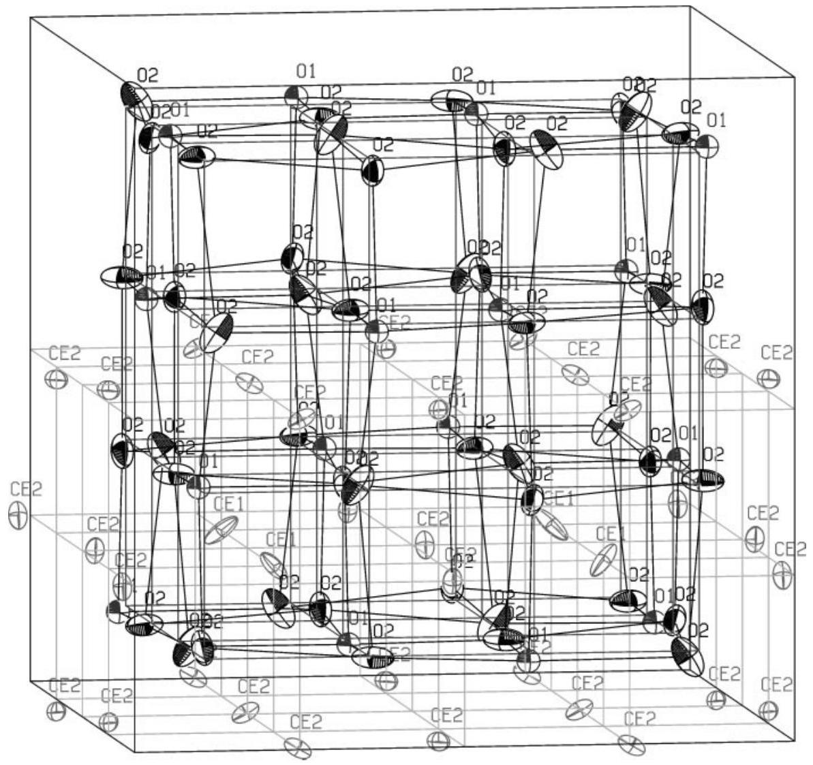
FIG. 1. The unit cell of $\mathrm{C}-\mathrm{Ce}_{2} \mathrm{O}_{3+\delta}$ (sample $\mathrm{CeO}_{1.68}$, refinement A). For clarity, the cerium atoms are only shown in the upper half of the cell. The oxygen position $\mathrm{O}(1)$ is occupied by only $39 \%$. The ellipsoids show the $50 \%$ probability range of the statistical atom distribution. Here and in the following figures, the darker dotted lines indicate the edges of the unit cell $(-0.5 \leq x, y, z \leq 0.5)$, the lighter dotted lines indicate the oxygen sublattice of the fluorite structure (unshifted O positions), and the solid lines indicate the bonds between the oxygen atoms (shifted O positions) and the cerium sublattice (unshifted Ce positions).

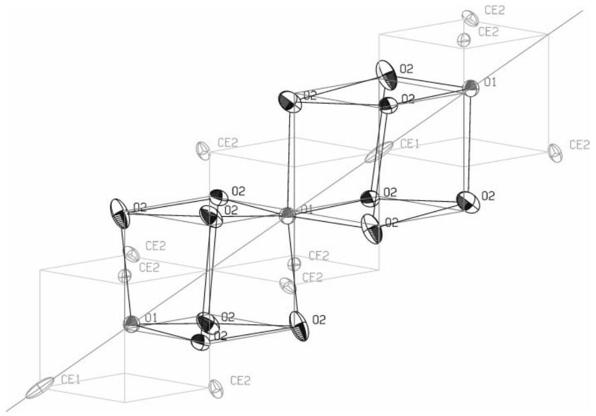
FIG. 2. One link of the chain of partially occupied oxygen positions $\mathrm{O}(1)$ that runs through the $\mathrm{CeO}_{1.68}$ crystal in the [111] direction. The link consists of two connected $[111]$ ]- $\mathrm{O}(1)$ pairs, one with a Ce atom at its center $(\mathrm{O}(1)$ positions $(0.116,0.116,0.116)$ and $(0.384,0.384,0.384), \mathrm{Ce}(1)$ position $\left.\left(\frac{1}{4}, \frac{1}{4}, \frac{1}{4}\right)\right)$ and the other with an empty center $(O(1)$ positions $(0.116,0.116,0.116)$ and $(-0.116,-0.116,-0.116)$ ). The dotted line shows the threefold rotation axis in the [111] -direction.

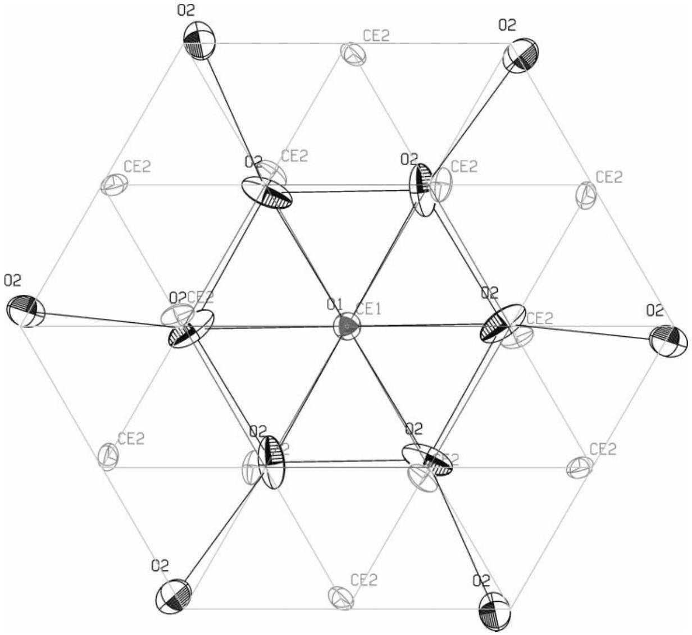
FIG. 3. $\mathrm{A}\left[\begin{array}{llll}1 & 1 & 1\end{array}\right]$ projection of a segment of the $\mathrm{CeO}_{1.68}$ structure. The radial and the tangential shift components of the atoms neighboring an $\mathrm{O}(1)$ position relative to the [1111]-axis can be clearly seen.

to the repulsive force between the vacancy and the cerium atom, it will be shifted toward the occupied $\mathrm{O}(1)$ position. Hereby, the oxygen atom on that position will be shifted in the same direction, i.e., off the $\mathrm{Ce}(1)$ position, as can also be seen in Fig. 2.

The roughly isotropic ellipsoid for the $\mathrm{O}(1)$ position indicates that most of the oxygen atoms occupying such a position have the same atomic environment; i.e., there seems to exist a short range order. Otherwise, this ellipsoid should be stretched in the [111]] direction similar to that for $\mathrm{Ce}(1)$.

Figure 3 shows a [ 1111 ] projection of a part of the unit cell. Here again, the shift of the oxygen or cerium atoms directly neighboring toward or off a partially occupied $\mathrm{O}(1)$ position is clearly visible. Moreover, a twist of the atom positions, with the [111] axis running through $\mathrm{O}(1)$ as the twist axis, can be seen. The inner $\mathrm{O}(2)$ atoms are turned a bit counterclockwise; the outer $\mathrm{O}(2)$ atoms are clearly clockwise against the unshifted positions in Fig. 3. The Ce atoms are all turned clockwise.
$\mathrm{Ce}_{7} \mathrm{O}_{12}\left(\mathrm{CeO}_{1.698}\right.$ and $\left.\mathrm{CeO}_{1.735}\right)$
Because of the superposition of reflection intensities originating from all eight domain types on the fluorite structure reflection positions, the structure refinement calculations were done using only superstructure reflection intensities. The results for both samples are listed in Table 12. They show only minor deviations in the positional parameters but significant differences in the mean square displacements which will be discussed later. The comparison to the results of Ray and Cox (1), which were based on a very small data set and contain only isotropic displacements, proves good agreement in the positional parameters.

The refinement results in Table 12 were obtained with fixed $O(2)$ and $O(3)$ oxygen occupations. But test refinements with variable occupations showed no hints on oxygen vacancies on these positions $(\operatorname{sof}(\mathrm{O}(2))=105(3) \%$, sof $(\mathrm{O}(3)) =104(3) \%)$. There could not be found any partial occupation of the position $\mathrm{V}_{\mathrm{O}}(1)$ for both samples as well.

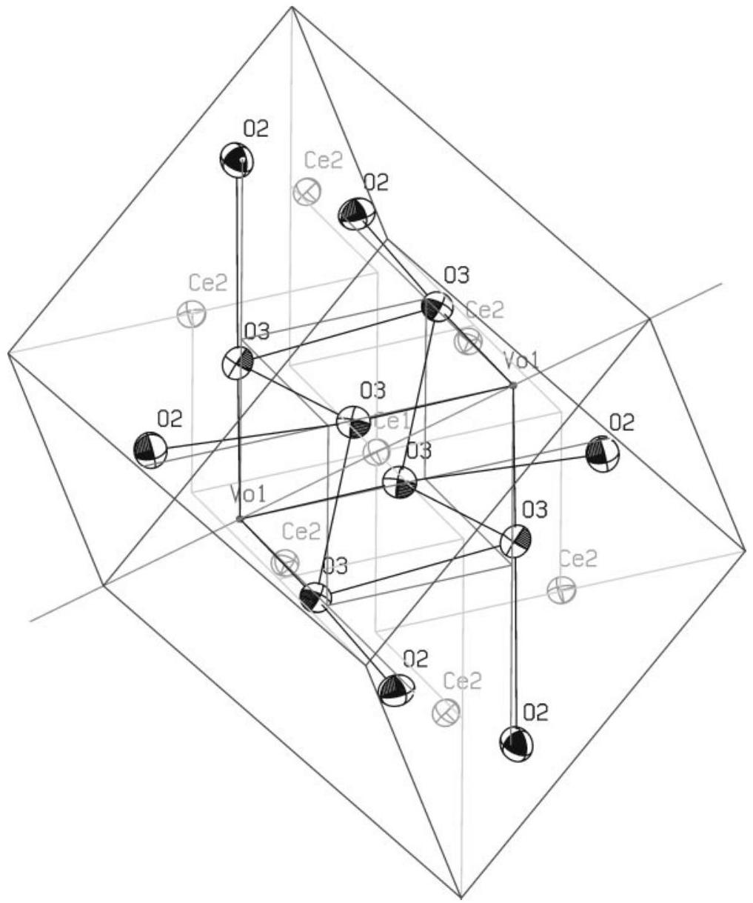
FIG. 4. The unit cell of $\mathrm{Ce}_{7} \mathrm{O}_{12}$, sample $\mathrm{CeO}_{1.698}$, at ambient temperature. The ellipsoids show the $50 \%$ probability range of the statistical atom distribution. See the captions of Figs. 1 and 2 for the meanings of the different lines. (The sublattices are slightly deformed, corresponding to the distortion of the superstructure cell.)

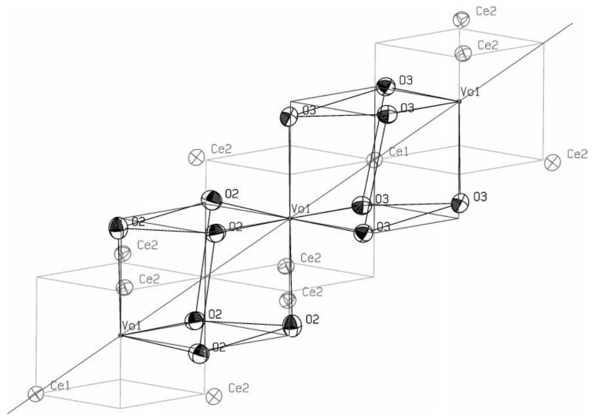
FIG. 5. One link of the chain of oxygen vacancy positions $\mathrm{V}_{\mathrm{O}}(1)$ that runs through the $\mathrm{Ce}_{7} \mathrm{O}_{12}$ structure in the rhombohedral [111] direction (sample $\mathrm{CeO}_{1.698}$, ambient temperature). As for $\mathrm{CeO}_{1.68}$, it consists of two connected [111]-O(1) pairs, one with a Ce atom at its center and one with an empty center $\left(\mathrm{V}_{\mathrm{O}}(1)\right.$ positions $(-0.25,-0.25,-0.25),(0.25,0.25,0.25)$, and $(0.75,0.75,0.75)$, Ce position $(0,0,0)$ ).

The unit cell of $\mathrm{Ce}_{7} \mathrm{O}_{12}\left(\mathrm{CeO}_{1.698}\right)$ is shown in Fig. 4. Fig. 5 shows the environment of the $\mathrm{V}_{\mathrm{O}}(1)$ vacancies arranged along the rhombohedral [111] axis, and Fig. 6 gives a [111] projection of the atomic arrangement, analogous to the Figs. 2 and 3 for $\mathrm{C}-\mathrm{Ce}_{2} \mathrm{O}_{3+\delta}$. The comparison of the corresponding illustrations proves that the local atom shifts in the two structures look quite similar. The radial shifts of the inner oxygen atoms in the [111] projections are smaller for $\mathrm{C}-\mathrm{Ce}_{2} \mathrm{O}_{3+\delta}$ than for $\mathrm{Ce}_{7} \mathrm{O}_{12}$ due to the partial occupation of the $\mathrm{O}(1)$ positions in $\mathrm{C}-\mathrm{Ce}_{2} \mathrm{O}_{3+\delta}$. The twists of the oxygen atoms relating to the [111] axis are similar in the two phases, too; the cerium atoms, however, are turned slightly counterclockwise in $\mathrm{C}-\mathrm{Ce}_{2} \mathrm{O}_{3+\delta}$, contrary to the situation in $\mathrm{Ce}_{7} \mathrm{O}_{12}$.

The most essential difference between the two structures consists in the different orientations of the [1111]-O(1)chains (or $-\mathrm{V}_{\mathrm{O}}(1)$-chains) relative to each other. While the chains in $\mathrm{Ce}_{7} \mathrm{O}_{12}$ are all parallel to each other, there exist four directions in $\mathrm{C}-\mathrm{Ce}_{2} \mathrm{O}_{3+\delta}$ with [1111]-O(1)-chains running along them, corresponding to the four directions of threefold rotation axes. However these chains do not intersect.

Furthermore it is noteworthy that in $\mathrm{C}-\mathrm{Ce}_{2} \mathrm{O}_{3+\delta}$ the $\mathrm{O}(1)$-pairs are all surrounded by oxygen atoms of the same type $\mathrm{O}(2)$, regardless whether they are pairs with or without a cerium atom at their centers. On the other hand, in
$\mathrm{Ce}_{7} \mathrm{O}_{12}$ the pairs with a cerium atom are surrounded by O(3) while pairs with an empty center are surrounded by $\mathrm{O}(2)$ oxygen positions (Figs. 3 and 6).

The displacement ellipsoids for $\mathrm{CeO}_{1.698}$ are almost isotropic for all atom positions but much larger than for $\mathrm{CeO}_{2}$, pointing to considerable structural disturbances in $\mathrm{CeO}_{1.698}$. These might be static atom shifts as well as dynamic disturbances due to fast electron hopping among $\mathrm{Ce}^{3+}$ and $\mathrm{Ce}^{4+}$, as discussed for $\mathrm{Tb}_{7} \mathrm{O}_{12}$ (12).

In contrast with the case of $\mathrm{CeO}_{1.698}$, the displacement ellipsoids for $\mathrm{CeO}_{1.735}$ are significantly anisotropic, especially that for $\mathrm{Ce}(1)$, which is stretched in the [ 1111 ] direction, similar to $\mathrm{CeO}_{1.68}$. This might indicate that the $\mathrm{V}_{\mathrm{O}}(1)$ position is slightly occupied in that specimen (in accordance with the higher oxygen content) even though a partial occupation could not be proved, as already mentioned.

The $\mathrm{Ce}_{7} \mathrm{O}_{12}$ structure at high temperatures. The $\mathrm{Ce}_{7} \mathrm{O}_{12}$ (sample $\mathrm{CeO}_{1.698}$ ) positional parameters at 1042 K (i.e., about 30 K below the phase transition) do not differ substantially from those at ambient temperature, but the mean square displacements are increased due to the thermal excitation. Table 13 lists the refinement results. Now, the ellipsoids are significantly anisotropic with the long axes pointing to the neighboring vacancy, i.e. in the direction

TABLE 12
Structure Parameters for $\mathrm{Ce}_{7} \mathrm{O}_{12}$ (Samples $\mathrm{CeO}_{1.698}$ and $\mathrm{CeO}_{1.735}$ ) at Ambient Temperature in the Rhombohedral as well as in the Hexagonal Setting
| Atom | Position | sof (\%) | $x$ | $y$ | $z$ | $U_{\text {eq }}$ ( $\AA^{2}$ ) | $U_{11}$ ( $\AA^{2}$ ) | $U_{22}$ ( $\AA^{2}$ ) | $U_{33}$ ( $\AA^{2}$ ) | $U_{23}$ ( $\AA^{2}$ ) | $U_{13}$ ( $\AA^{2}$ ) | $U_{12}$ ( $\AA^{2}$ ) |
| :--- | :--- | :--- | :--- | :--- | :--- | :--- | :--- | :--- | :--- | :--- | :--- | :--- |
| $\mathrm{CeO}_{1.698}$, rhombohedral setting |  |  |  |  |  |  |  |  |  |  |  |  |
| Ce(1) | 1a | 100 | 0 | 0 | 0 | 0.014(1) | 0.014(1) | $U_{11}$ | $U_{11}$ | 0.003(1) | $U_{23}$ | $U_{23}$ |
| $\mathrm{Ce}(2)$ | $6 f$ | 100 | 0.1388(2) | 0.6038(4) | 0.3011(2) | 0.014(1) | 0.015(1) | 0.014(1) | 0.015(1) | 0.003(1) | 0.004(1) | 0.004(1) |
| $\mathrm{V}_{\mathrm{O}}(1)$ | $2 c$ | 0 | 0.25 | $x$ | $x$ |  |  |  |  |  |  |  |
| O(2) | $6 f$ | 100 | 0.4327(2) | 0.5840(2) | 0.1772(2) | 0.023(1) | 0.021(1) | 0.027(1) | 0.020(1) | 0.002(1) | 0.004(1) | 0.007(1) |
| O(3) | $6 f$ | 100 | 0.9375(2) | 0.3162(2) | 0.0696(2) | 0.020(1) | 0.020(1) | 0.017(1) | 0.022(1) | 0.004(1) | 0.005(1) | 0.005(1) |
| Hexagonal setting |  |  |  |  |  |  |  |  |  |  |  |  |
| Ce(1) | $3 a$ | 100 | 0 | 0 | 0 | 0.014(1) | 0.013(1) | $U_{11}$ | 0.015(2) | 0 | 0 | $\frac{1}{2} U_{11}$ |
| $\mathrm{Ce}(2)$ | $18 f$ | 100 | 0.4108(2) | 0.1242(2) | - 0.0146(2) | 0.014(1) | 0.014(1) | 0.014(1) | 0.016(1) | 0.000(1) | - 0.001(1) | 0.007(1) |
| $\mathrm{V}_{\mathrm{O}}(1)$ | $6 c$ | 0 | 0.0 | 0.0 | 0.75 |  |  |  |  |  |  |  |
| O(2) | $18 f$ | 100 | 0.4459(1) | 0.1473(1) | 0.7313(2) | 0.023(1) | 0.024(1) | 0.026(1) | 0.022(1) | -0.003(1) | - 0.004(1) | 0.016(1) |
| O(3) | $18 f$ | 100 | 0.4582(2) | 0.1630(1) | 0.2256(2) | 0.020(1) | 0.018(1) | 0.018(1) | 0.021(1) | - 0.001(1) | - 0.003(1) | 0.008(1) |
| $R(F)=0.0382, \mathrm{w} R\left(F^{2}\right)=0.0896$ for 312 reflections with $I_{\mathrm{o}}>2 \sigma\left(I_{\mathrm{o}}\right) ; R(F)=0.0647, \mathrm{w} R\left(F^{2}\right)=0.0962, G o o F=1.040$ for all 407 reflections.   $\mathrm{CeO}_{1.735}$, rhombohedral setting |  |  |  |  |  |  |  |  |  |  |  |  |
| Ce(1) | $1 a$ | 100 | 0 | 0 | 0 | 0.018(1) | 0.021(1) | $U_{11}$ | $U_{11}$ | 0.012(1) | $U_{23}$ | $U_{23}$ |
| $\mathrm{Ce}(2)$ | $6 f$ | 100 | 0.1388(2) | 0.6035(5) | 0.3012(3) | 0.018(1) | 0.020(2) | 0.018(1) | 0.021(1) | 0.010(1) | 0.012(1) | 0.011(1) |
| $\mathrm{V}_{\mathrm{O}}(1)$ | $2 c$ | 0 | 0.25 | $x$ | $x$ |  |  |  |  |  |  |  |
| O(2) | $6 f$ | 100 | 0.4327(3) | 0.5841(3) | 0.1773(2) | 0.027(1) | 0.029(1) | 0.033(1) | 0.026(1) | 0.010(1) | 0.012(1) | 0.015(1) |
| O(3) | $6 f$ | 100 | 0.9374(2) | 0.3163(2) | 0.0696(2) | 0.023(1) | 0.026(1) | 0.023(1) | 0.028(1) | 0.011(1) | 0.012(1) | 0.012(1) |
| Hexagonal setting |  |  |  |  |  |  |  |  |  |  |  |  |
| Ce(1) | $3 a$ | 100 | 0 | 0 | 0 | 0.018(1) | 0.011(1) | $U_{11}$ | 0.032(2) | 0 | 0 | $\frac{1}{2} U_{11}$ |
| $\mathrm{Ce}(2)$ | $18 f$ | 100 | 0.4110(3) | 0.1243(3) | - 0.0145(3) | 0.018(1) | 0.012(1) | 0.011(1) | 0.030(1) | - 0.001(1) | - 0.002(1) | 0.005(1) |
| $\mathrm{V}_{\mathrm{o}}(1)$ | $6 c$ | 0 | 0.0 | 0.0 | 0.75 |  |  |  |  |  |  |  |
| O(2) | $18 f$ | 100 | 0.4460(2) | 0.1473(1) | 0.7314(2) | 0.027(1) | 0.023(1) | 0.023(1) | 0.039(1) | -0.003(1) | -0.004(1) | 0.014(1) |
| O(3) | $18 f$ | 100 | 0.4581(2) | 0.1630(2) | 0.2255(2) | 0.023(1) | 0.016(1) | 0.017(1) | 0.036(1) | - 0.000(1) | - 0.002(1) | 0.007(1) |
| $R(F)=0.0522, \mathrm{w} R\left(F^{2}\right)=0.1295$ for 316 reflections with $I_{\mathrm{o}}>2 \sigma\left(I_{\mathrm{o}}\right) ; R(F)=0.0739, \mathrm{w} R\left(F^{2}\right)=0.1370$, GooF $=1.092$ for all 407 reflections. |  |  |  |  |  |  |  |  |  |  |  |  |

where there is the most free space for the vibrational movements.

The structure of $\mathrm{CeO}_{1.698}$ above the phase transition. The refinement data for the fluorite type structure at 1116 K are listed in Table 14. Within the error interval, the oxygen site occupation factor matches with the oxygen concentration in the sample. The mean square displacements of the cerium and oxygen atoms are much larger than at 1042 K , indicating strong atomic relaxation due to the disordered vacancy distribution above the phase transition.

## $C e O_{1.832}$

The structure analysis proved that the superstructure observed for $\mathrm{CeO}_{1.832}$ is isomorphous with $\mathrm{Tb}_{11} \mathrm{O}_{20}$ (12), i.e., its stoichiometric composition is $\mathrm{Ce}_{11} \mathrm{O}_{20}$ or $\mathrm{CeO}_{1.818}$, in rough accordance with the composition derived from the supercell lattice parameters.

The refinement results are listed in Table 15. As for the $\mathrm{Ce}_{7} \mathrm{O}_{12}$ refinements, only superstructure reflection intensities were used. Due to the low quality of the data set only
one isotropic displacement parameter for all the oxygen atoms and a second one for all the cerium atoms was used.

The refinement results were obtained with fixed $\mathrm{O}(1)$ $O(10)$ oxygen occupations. However, test refinements with variable occupations showed no hints on oxygen vacancies on these positions $(\operatorname{sof}(\mathrm{O}(1), \ldots, \mathrm{O}(10))=94(4), 98(5)$, 92(4), 103(5), 100(5), 101(5), 101(5), 99(5), 101(5), 103(5)\%). Furthermore, no partial occupation of the position $\mathrm{V}_{\mathrm{O}}(11)$ could be found.

Figure 7 shows the unit cell of $\mathrm{Ce}_{11} \mathrm{O}_{20}$. The most important difference in the arrangement of the oxygen vacancies compared to $\mathrm{Ce}_{7} \mathrm{O}_{12}$ or $\mathrm{C}-\mathrm{Ce}_{2} \mathrm{O}_{3+\delta}$ is the absence of the distance vector type $\frac{1}{2}[1,1,1]_{\mathrm{F}}$, the shortest distance vectors between two vacancies in $\mathrm{Ce}_{11} \mathrm{O}_{20}$ are of the $\frac{1}{2}[0,1,2]_{\mathrm{F}}$ type. These vacancy pairs run in the $\left[\begin{array}{lll}0 & 1 & 1\end{array}\right]_{\mathrm{s}}$ and $\left[\begin{array}{lll}0 & \overline{1} & 1\end{array}\right]_{\mathrm{s}}$ directions of the primitive superstructure cell and form two-dimensional nets in the $(100)_{\mathrm{S}}$ layers as shown in Fig. 8.

The directions $\left[\begin{array}{lll}0 & 1 & 1\end{array}\right]_{\mathrm{s}}$ and $\left[\begin{array}{lll}0 & \overline{1} & 1\end{array}\right]_{\mathrm{s}}$ are not equivalent in $P \overline{1}$. Figure 9 compares the vacancy chains running in these two directions. Obviously, the respective atom shifts are very similar.

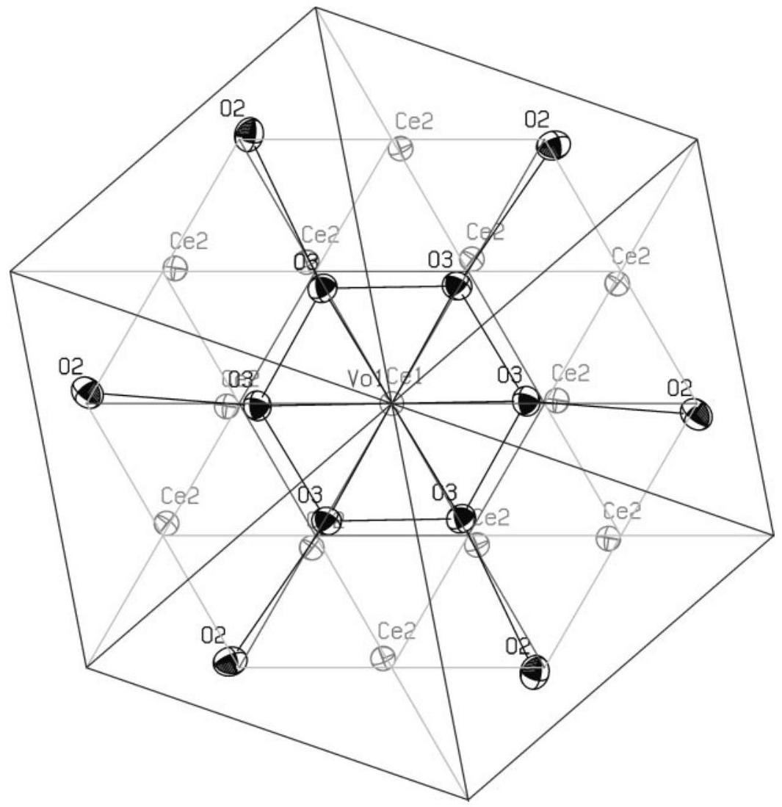
FIG. 6. $\mathrm{A}\left[\begin{array}{lll}1 & 1 & 1\end{array}\right]$ projection of a part of the $\mathrm{Ce}_{7} \mathrm{O}_{12}$ structure (sample $\mathrm{CeO}_{1.698}$, ambient temperature).

## COMPARISON OF THE OXYGEN VACANCY ORDER IN THE THREE SUPERSTRUCTURES OF $\mathrm{CeO}_{y}$

The crucial feature of the $\mathrm{CeO}_{y}$ superstructures described here is the periodic order of the oxygen vacancies.

Therefore, the vacancy pairs that occur in $\mathrm{C}-\mathrm{Ce}_{2} \mathrm{O}_{3+\delta}$, $\mathrm{Ce}_{7} \mathrm{O}_{12}$, and $\mathrm{Ce}_{11} \mathrm{O}_{20}$ are compared now.

In the following a vacancy pair is labeled by the pair vector that connects the two vacancies, with the oxygen sublattice of the fluorite structure as the coordinate system;

TABLE 13
Structure Parameters for $\mathrm{Ce}_{7} \mathrm{O}_{12}$ (Sample $\mathrm{CeO}_{1.698}$ ) at $\mathbf{1 0 4 2 ~ K}$
| Atom | Position | sof (\%) | $x$ | $y$ | $z$ | $U_{\text {eq }}$ ( $\AA^{2}$ ) | $U_{11}$ ( $\AA^{2}$ ) | $U_{22}$ ( $\AA^{2}$ ) | $U_{33}$ ( $\AA^{2}$ ) | $U_{23}$ ( $\AA^{2}$ ) | $U_{13}$ ( $\AA^{2}$ ) | $U_{12}$ ( $\AA^{2}$ ) |
| :--- | :--- | :--- | :--- | :--- | :--- | :--- | :--- | :--- | :--- | :--- | :--- | :--- |
| $\mathrm{CeO}_{1.698}$, rhombohedral setting |  |  |  |  |  |  |  |  |  |  |  |  |
| Ce(1) | 1a | 100 | 0 | 0 | 0 | 0.018(1) | 0.020(2) | $U_{11}$ | $U_{11}$ | 0.008(2) | $U_{23}$ | $U_{23}$ |
| $\mathrm{Ce}(2)$ | $6 f$ | 100 | 0.1390(3) | 0.6017(6) | 0.3009(4) | 0.020(1) | 0.017(2) | 0.020(1) | 0.022(2) | 0.005(1) | 0.006(1) | 0.003(1) |
| $\mathrm{V}_{\mathrm{o}}(1)$ | $2 c$ | 0 | 0.25 | $x$ | $x$ |  |  |  |  |  |  |  |
| O(2) | $6 f$ | 100 | 0.4304(5) | 0.5827(5) | 0.1769(5) | 0.035(1) | 0.032(2) | 0.046(2) | 0.028(1) | 0.005(1) | 0.008(1) | 0.013(2) |
| O(3) | $6 f$ | 100 | 0.9354(5) | 0.3145(5) | 0.0700(5) | 0.036(1) | 0.039(2) | 0.025(1) | 0.046(2) | 0.003(2) | 0.015(2) | 0.008(1) |
| Hexagonal setting |  |  |  |  |  |  |  |  |  |  |  |  |
| Ce(1) | 3a | 100 | 0 | 0 | 0 | 0.018(1) | 0.014(2) | $U_{11}$ | 0.026(3) | 0 | 0 | $\frac{1}{2} U_{11}$ |
| Ce(2) | $18 f$ | 100 | 0.4121(3) | 0.1251(3) | -0.0139(3) | 0.020(1) | 0.021(1) | 0.018(1) | 0.021(2) | 0.002(1) | -0.001(1) | 0.011(1) |
| $\mathrm{V}_{\mathrm{O}}(1)$ | $6 c$ | 0 | 0.0 | 0.0 | 0.75 |  |  |  |  |  |  |  |
| O(2) | $18 f$ | 100 | 0.4469(3) | 0.1473(2) | 0.7300(4) | 0.035(1) | 0.034(1) | 0.039(1) | 0.038(2) | -0.007(1) | -0.008(1) | 0.023(1) |
| O(3) | $18 f$ | 100 | 0.4588(3) | 0.1621(3) | 0.2267(4) | 0.036(1) | 0.035(2) | 0.029(2) | 0.039(2) | -0.005(1) | - 0.012(1) | 0.012(1) |
| $R(F)=0.0464, \mathrm{w} R\left(F^{2}\right)=0.0645$ for 201 reflections with $I_{\mathrm{o}}>2 \sigma\left(I_{\mathrm{o}}\right) ; R(F)=0.0902, \mathrm{w} R\left(F^{2}\right)=0.0757, G o o F=1.064$ for all 273 reflections. |  |  |  |  |  |  |  |  |  |  |  |  |

TABLE 14
Structure Parameters for the Fluorite Structure of $\mathbf{C e O}_{\mathbf{1 . 6 9 8}}$ at $\mathbf{1 1 1 6 ~ K}$
| Oxygen site occupation factor $(\%)$ | $83(2)$ |
| :--- | :---: |
| Mean square displacement $U$ for $\mathrm{Ce}\left(\AA^{2}\right)$ | $0.036(1)$ |
| Mean square displacement $U$ for $\mathrm{O}\left(\AA^{2}\right)$ | $0.057(1)$ |

$R(F)=0.0438, \mathrm{w} R\left(F^{2}\right)=0.0799$ for 37 reflections with $I_{\mathrm{o}}>2 \sigma\left(I_{\mathrm{o}}\right)$; $R(F)=0.0903, \mathrm{w} R\left(F^{2}\right)=0.0981$, GooF $=1.284$ for all 58 reflections.
i.e., $(0,0,1)$ labels two vacancies on directly neighboring oxygen positions.

As shown in Table 16 the vacancy pairs $(0,1,2),(0,1,3)$, $(0,2,3),(1,1,2)$, and $(1,2,3)$ are present in all three super-
structures, whereas the pairs $(0,0,1),(0,0,2),(0,0,3)$, and $(0,2,2)$ do not occur in any superstructure. The pairs $(0,0,4)$ and $(0,1,1)$ only occur in $\mathrm{C}-\mathrm{Ce}_{2} \mathrm{O}_{3+\delta}$, the structure with the highest vacancy density (it should be kept in mind that in $\mathrm{C}-\mathrm{Ce}_{2} \mathrm{O}_{3+\delta}$ the $\mathrm{O}(1)$ positions are partially occupied and the probably existing short range order might reduce the frequencies of these vacancy pairs).

Obviously, the common structural element of all these $\mathrm{CeO}_{y}$ phases are not $(1,1,1)$ pairs as postulated for $\mathrm{Pr}_{n} \mathrm{O}_{2 n-2}$ and related rare earth oxides (17) but rather pairs of the types $(0,1,2),(0,1,3),(0,2,3),(1,1,2)$, and $(1,2,3)$. As well, the absence of the above-mentioned apparently unfavorable pairs should be considered as a common structural element. In view of the repulsive force between two

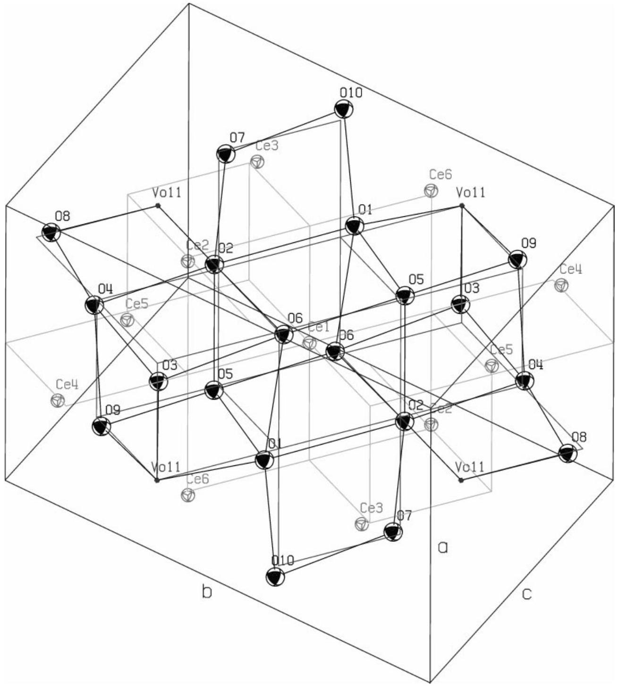
FIG. 7. The unit cell of $\mathrm{Ce}_{11} \mathrm{O}_{20}$. The ellipsoids show the $50 \%$ probability range of the statistical atom distribution according to the isotropic mean square displacements for the cerium and the oxygen atoms. See the caption of Fig. 1 for the meanings of different lines. (The sublattices are slightly deformed, corresponding to the distortion of the superstructure cell.)

TABLE 15
Structure Parameters for $\mathbf{C e}_{\mathbf{1 1}} \mathbf{O}_{\mathbf{2 0}}$ (Sample $\mathbf{C e O}_{\mathbf{1 . 8 3 2}}$ ) at Ambient Temperature
| Atom | Position | sof (\%) | $x$ | $y$ | $z$ | $U$ ( $\AA^{2}$ ) |
| :--- | :--- | :--- | :--- | :--- | :--- | :--- |
| Ce(1) | $1 a$ | 100 | 0 | 0 | 0 | 0.0077(10) |
| $\mathrm{Ce}(2)$ | $2 i$ | 100 | 0.1017(8) | 0.3629(5) | 0.1782(8) | 0.0077(10) |
| Ce(3) | $2 i$ | 100 | 0.5547(8) | 0.1743(5) | 0.1168(9) | 0.0077(10) |
| Ce(4) | $2 i$ | 100 | 0.6402(7) | 0.5252(6) | 0.2718(7) | 0.0077(10) |
| Ce(5) | $2 i$ | 100 | 0.1433(10) | 0.7243(5) | 0.3567(8) | 0.0077(10) |
| Ce(6) | $2 i$ | 100 | 0.7335(7) | 0.9180(5) | 0.4723(8) | 0.0077(10) |
| O(1) | $2 i$ | 100 | 0.6514(7) | 0.9581(5) | 0.1473(8) | 0.0146(7) |
| O(2) | $2 i$ | 100 | 0.1704(8) | 0.7962(5) | 0.0473(8) | 0.0146(7) |
| O(3) | $2 i$ | 100 | 0.4425(7) | 0.3710(5) | 0.0387(8) | 0.0146(7) |
| O(4) | $2 i$ | 100 | 0.9388(7) | 0.5650(5) | 0.1651(7) | 0.0146(7) |
| O(5) | $2 i$ | 100 | 0.0352(8) | 0.9274(5) | 0.3535(8) | 0.0146(7) |
| O(6) | $2 i$ | 100 | 0.2364(8) | 0.1508(5) | 0.2114(8) | 0.0146(7) |
| O(7) | $2 i$ | 100 | 0.7925(8) | 0.3340(5) | 0.3178(8) | 0.0146(7) |
| O(8) | $2 i$ | 100 | 0.3391(8) | 0.5488(5) | 0.3654(7) | 0.0146(7) |
| O(9) | $2 i$ | 100 | 0.8095(8) | 0.7044(5) | 0.4494(8) | 0.0146(7) |
| O(10) | $2 i$ | 100 | 0.5918(7) | 0.1255(5) | 0.4762(8) | 0.0146(7) |
| $\mathrm{V}_{\mathrm{O}}(11)$ | $2 i$ | 0 | 0.5 | 0.75 | 0.25 | 0.0146(7) |

Note. $R(F)=0.117, \mathrm{w} R\left(F^{2}\right)=0.322$ for 942 reflections with $I_{\mathrm{o}}>2 \sigma\left(I_{\mathrm{o}}\right)$; $R(F)=0.232, \mathrm{w} R\left(F^{2}\right)=0.416, G o o F=1.407$ for all 1760 reflections.
vacancies, the missing $(0,0,1)$ pairs seem trivial. But there is no obvious explanation for the absence of pairs with longer distance vectors such as $(0,0,3)$ or $(0,2,2)$.

TABLE 16
Vacancy Pair Frequencies for Pair Vectors up to a Length of $11 \AA$ in $\mathrm{C}-\mathrm{Ce}_{2} \mathrm{O}_{3+\delta}, \mathrm{Ce}_{7} \mathrm{O}_{12}$, and $\mathrm{Ce}_{11} \mathrm{O}_{20}$
|  | Mult. | $\mathrm{C}-\mathrm{Ce}_{2} \mathrm{O}_{3+\delta}$ | $\mathrm{Ce}_{7} \mathrm{O}_{12}$ | $\mathrm{Ce}_{11} \mathrm{O}_{20}$ |
| :--- | :--- | :--- | :--- | :--- |
| (0, 0, 1) | 6 | 0 | 0 | 0 |
| (0, 0, 2) | 6 | 0 | 0 | 0 |
| (0, 0, 3) | 6 | 0 | 0 | 0 |
| (0, 0, 4) | 6 | 6 | 0 | 0 |
| (0, 1, 1) | 12 | 3 | 0 | 0 |
| (0, 1, 2) | 24 | 12 | 6 | 4 |
| (0, 1, 3) | 24 | 6 | 6 | 2 |
| (0, 2, 2) | 12 | 0 | 0 | 0 |
| (0, 2, 3) | 24 | 12 | 6 | 2 |
| (1, 1, 1) | 8 | 2 | 2 | 0 |
| (1, 1, 2) | 24 | 6 | 12 | 4 |
| (1, 1, 3) | 24 | 6 | 0 | 4 |
| (1, 2, 2) | 24 | 0 | 0 | 2 |
| (1, 2, 3) | 48 | 12 | 6 | 4 |
| (2, 2, 2) | 8 | 8 | 2 | 0 |

Note. For every pair vector its cubic multiplicity and the respective number of existing vacancy pairs (or partially occupied positions $\mathrm{O}(1)$ in the case of $\mathrm{C}-\mathrm{Ce}_{2} \mathrm{O}_{3+\delta}$ ) are given.

Among the vacancy pairs that are present in all three superstructures, the vacancy pairs of the type $(0,1,2)$ are those with the shortest distance vector. While in $\mathrm{Ce}_{11} \mathrm{O}_{20}$ there are no pairs with a shorter distance vector, there

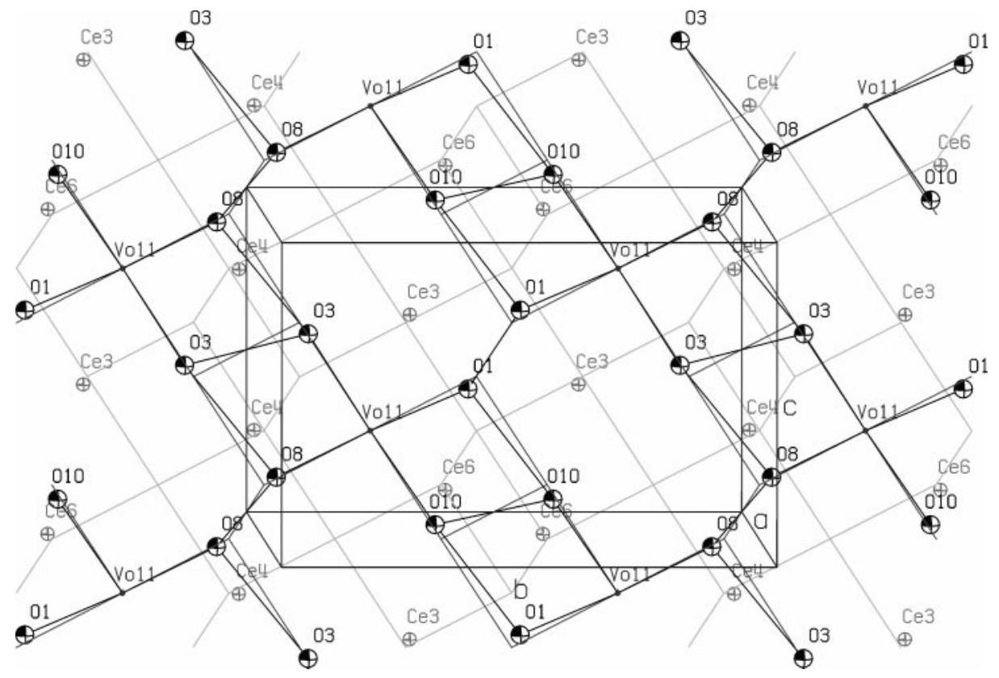
FIG. 8. The $(100)_{\mathrm{S}}$ layer of the $\mathrm{Ce}_{11} \mathrm{O}_{20}$ structure $(0.25 \leq x \leq 0.75,-1 \leq y, z \leq 1)$. The vacancies are located in the middle of the layer, i.e., at $x=0.5$. They represent the junctions of a two-dimensional net with connection vectors of the type $\frac{1}{2}[0,1,2]_{\mathrm{F}}$.

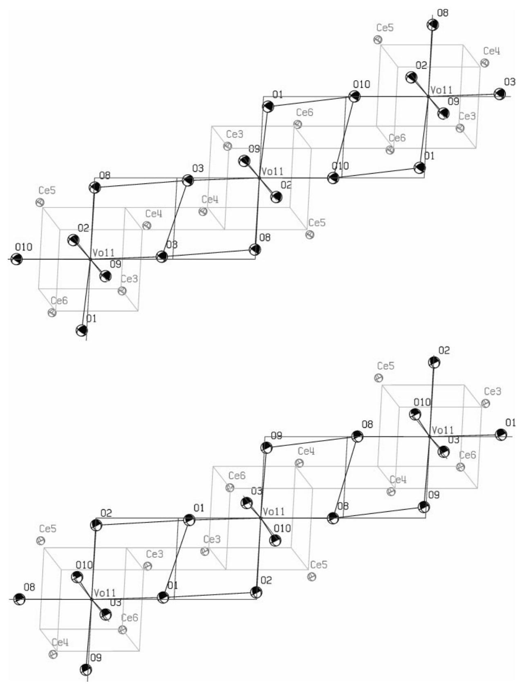
FIG. 9. Comparison of the two crossing chains of oxygen vacancy positions $\mathrm{V}_{\mathrm{O}}(11)$ that run through the $\mathrm{Ce}_{11} \mathrm{O}_{20}$ structure in the $[011]_{\mathrm{S}}$ (above) and $[0 \overline{1} 1]_{\mathrm{s}}$ directions (below).

are ( $1,1,1$ ) pairs in $\mathrm{Ce}_{7} \mathrm{O}_{12}$ and additionally ( $0,1,1$ ) in C $\mathrm{Ce}_{2} \mathrm{O}_{3+\delta}$. Nevertheless, the atom shift patterns in the vicinity of ( $0,1,2$ ) pairs are very similar in $\mathrm{Ce}_{7} \mathrm{O}_{12}$ and in $\mathrm{Ce}_{11} \mathrm{O}_{20}$; see Figs. 10 and 9. In $\mathrm{Ce}_{7} \mathrm{O}_{12}$, too, the $(0,1,2)$ pairs are connected to form straight chains. They run in the $\langle 11 \overline{1}\rangle_{\mathrm{S}}$ directions of the rhombohedral superstructure. At every vacancy position three chains (in the directions $\left[\begin{array}{lll}1 & 1 \\ 1\end{array}\right],\left[\begin{array}{lll}1 & \overline{1} & 1\end{array}\right]$, and $\left[\begin{array}{l}\overline{1} \\ 1\end{array} 1\right]$ ) intersect each other.

The situation in $\mathrm{C}-\mathrm{Ce}_{2} \mathrm{O}_{3+\delta}$ is more complicated. First, the $(0,1,2)$ pairs of partially occupied $\mathrm{O}(1)$ positions do not form straight chains but a complex network, in that every $O(1)$ position belongs to twelve different $(0,1,2)$ pairs. Always four of them lie in each of the planes (100), (010), and (001). Second, the presence of the $(0,1,1)$ pairs and the partial occupation of the $\mathrm{O}(1)$ positions cause differences in the atom shifts. See Fig. 11 for the situation in a (100) plane.

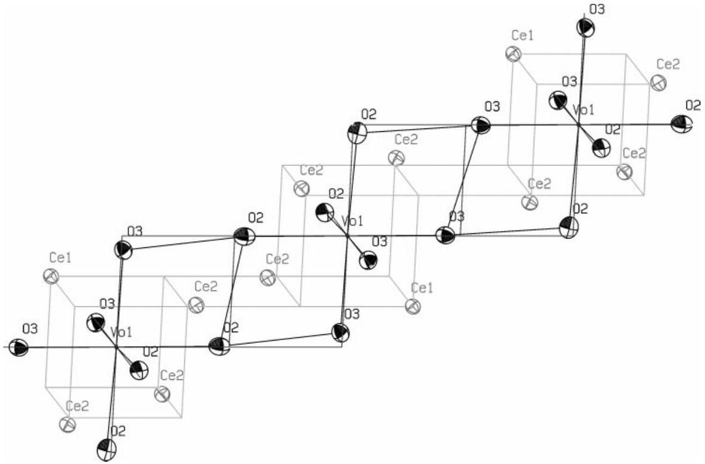
FIG. 10. A segment of a $[0,1,2]_{\mathrm{F}}$ vacancy chain that runs through $\mathrm{Ce}_{7} \mathrm{O}_{12}$ in the $\langle 11 \overline{1}\rangle_{\mathrm{S}}$ direction.

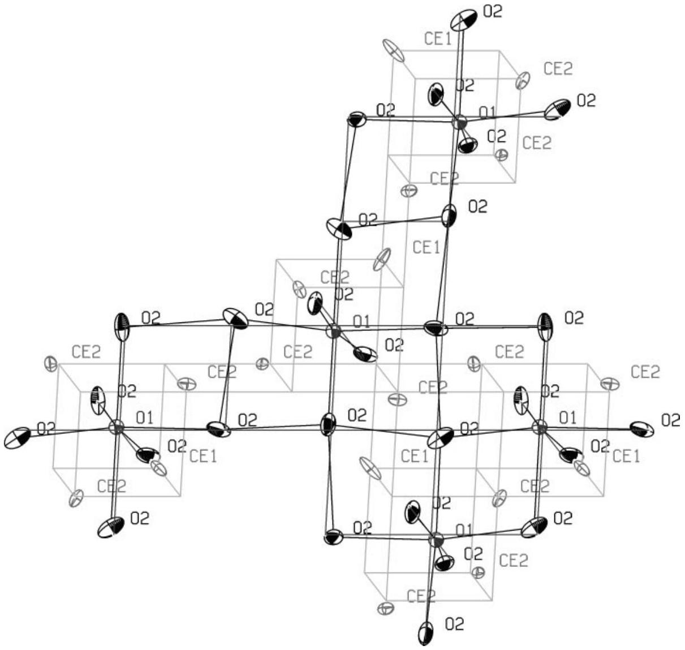
FIG. 11. A segment of the $[0,1,2]_{\mathrm{F}}$ pair network of partially occupied $\mathrm{O}(1)$ positions in $\mathrm{C}-\mathrm{Ce}_{2} \mathrm{O}_{3+\delta}$. The picture shows the four connected $[0,1,2]_{\mathrm{F}}$ pairs that lie in the (100) plane.

## ACKNOWLEDGMENTS

We thank G. Eckold for support on the specimen preparation and for many helpful discussions. We also thank W. Aßmus for the growth of the $\mathrm{CeO}_{2}$ single crystal.

## REFERENCES

1. S. P. Ray and D. E. Cox, J. Solid State Chem. 15, 333 (1975).
2. M. Ricken, J. Nölting, and I. Riess, J. Solid State Chem. 54, 89 (1984).
3. F. Vasiliu, V. Pârvulescu, and C. Sârbu, J. Mater. Sci. 29, 2095 (1994).
4. V. Perrichon, A. Laachir, G. Bergeret, R. Fréty, and L. Tournayan, J. Chem. Soc. Faraday Trans. 90, 773 (1994).
5. M. Gasgnier, J. Ghys, G. Schiffmacher, Ch. Henry la Blanchetais, P. E. Caro, C. Boulesteix, Ch. Loier, and B. Pardo, J. Less Common Metals 34, 131 (1974).
6. D. J. M. Bevan, J. Inorg. Nucl. Chem. 1, 49 (1955).
7. S. P. Ray, A. S. Nowick, and D. E. Cox, J. Solid State Chem. 15, 344 (1975).
8. P. Knappe and L. Eyring, J. Solid State Chem. 58, 312 (1985).
9. D. J. M. Bevan and J. Kordis, J. Inorg. Nucl. Chem. 26, 1509 (1964).
10. E. A. Kümmerle, F. Güthoff, W. Schweika, and G. Heger, in preparation.
11. E. Kümmerle, Doctoral Thesis, Forschungszentrum Jülich Report Jül-3576, 1998.
12. J. Zhang, R. B. von Dreele, and L. Eyring, J. Solid State Chem. 104, 21 (1993).
13. B. Touzelin, J. Nucl. Mater. 101, 92 (1981).
14. J. R. Sims and R. N. Blumenthal, High Temp. Sci. 8, 99 (1976).
15. H.-W. Chiang, R. N. Blumenthal, and R. A. Fournelle, Solid State Ionics 66, 85 (1993).
16. SHELX-97, Structure Solution and Refinement Software Package, (C) G. M. Sheldrick, Institute of Anorganic Chemistry, University of Göttingen, Germany.
17. E. Schweda, D. J. M. Bevan, and L. Eyring, J. Solid State Chem. 90, 109 (1991).
18. ORTEP-III, Oak Ridge Thermal Ellipsoid Plot program for crystal structure illustrations, Oak Ridge National Laboratory, available via World Wide Web at http://www.ornl.gov/ortep/ortep.html.

[^0]:    ${ }^{1}$ Institut für Kristallographie der RWTH Aachen, Jägerstraße 17-19, 52056 Aachen. Fax: + 49241 8888184. E-mail: heger@kristall.xtal.rwthaachen.de.

