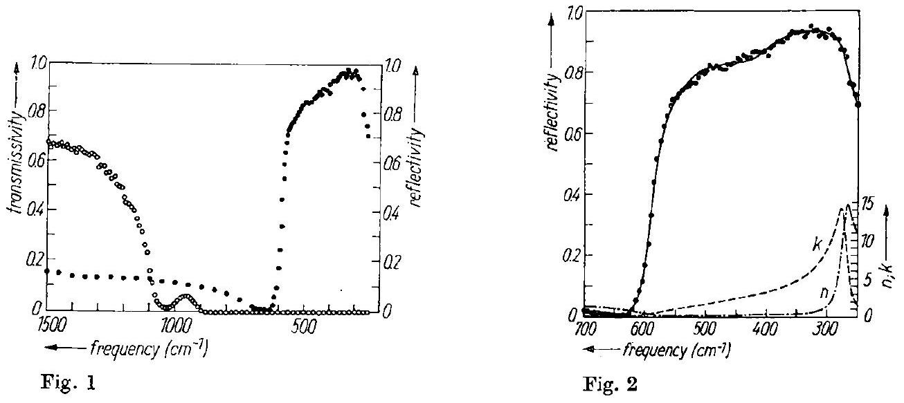
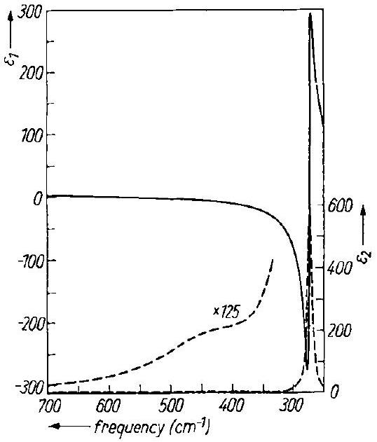
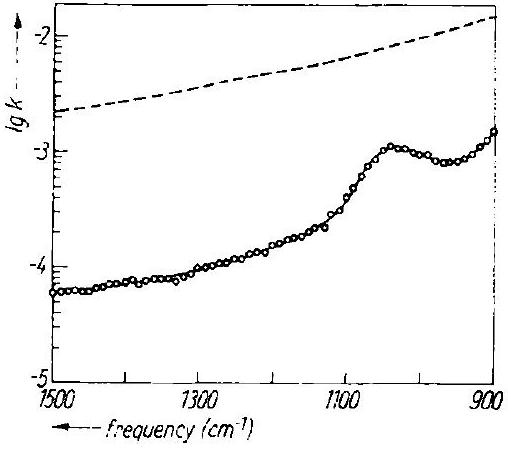
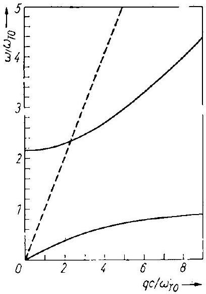
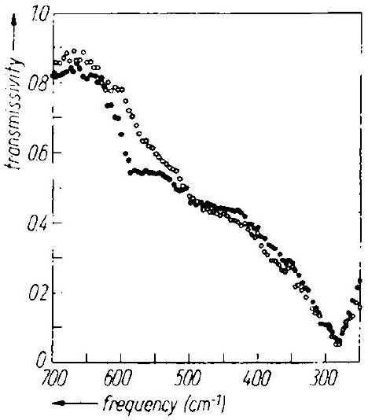
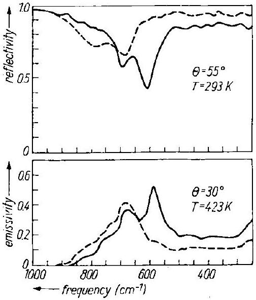
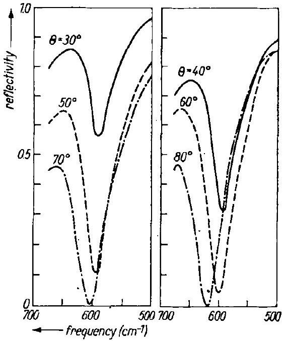
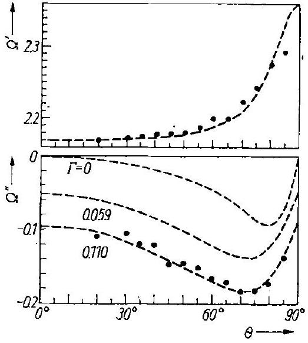

phys. stat. sol. (b) 114, 189 (1982)
Subject classification: 6 and 20.1; 22.6
Department of Physics, College of Humanities and Sciences, Nihon University, Tokyo ${ }^{1}$ )

# Infrared Optical Properties of Cerium Dioxide 

By

S. Mochizuki

The infrared spectra of bulk and thin-film $\mathrm{CeO}_{2}$ are measured at various conditions by reflection, transmission, and thermal-emission methods. The reststrahlen reflectivity spectra of bulk $\mathrm{CeO}_{2}$ are analyzed by means of a two-oscillator dispersion model, and the dielectric properties and the lattice vibrational properties of $\mathrm{CeO}_{2}$ are discussed. The virtual mode (polariton) spectra of the thinfilm $\mathrm{CeO}_{2}$ are analyzed by means of the virtual mode theory of the anharmonic ionic crystal slab.

Die Infrarotspektren von massivem und Dünnfilm- $\mathrm{CeO}_{2}$ werden unter verschiedenen Bedingungen mittels Transmission, Reflexion und Thermoemission gemessen. Die Reststrahlen-Spektren von massivem $\mathrm{CeO}_{2}$ werden mit einem Dispersionsmodell zweier Oszillatoren analysiert, und die dielektrischen Eigenschaften und die Gitterschwingungen von $\mathrm{CeO}_{2}$ werden diskutiert. Die Virtuell- Moden (Polariton)-Spektren von Dünnfilm- $\mathrm{CeO}_{2}$ werden mit einer Theorie der Virtuell-Mode anharmonischer Ionenkristallplatten analysiert.

## 1. Introduction

Cerium dioxide ( $\mathrm{CeO}_{2}$ ) is a useful material to investigate the mechanism of the electrical conduction in a narrow band, since it has a simple crystal structure and has an empty 4f electron shell which tends to form an extremely narrow conduction band owing to the small electron overlap. The sign of the hopping-type conduction of $\mathrm{CeO}_{2}$ has been reported by various workers [1,2]. Their results, however, show discrepancies in some points. The hopping-type conduction in 4f rare-earth metal oxide has been usually discussed in terms of 4f electron-phonon interaction: the strong interaction of the electrons in the narrow band with the longitudinal optical phonons leads to the formation of small polarons [3]. The most fundamental problems such as what kinds of lattice vibrational modes are contributing to the formation of the small polarons or what kind of the process corresponds to the apparent activation energy of the electron mobility still remain unclear. It is desirable for comparing the transport data with the small-polaron theory to measure the infrared optical spectra, which offer information on the lattice vibrations and are useful for estimating the strength of the electron-phonon interaction. Unfortunately, $\mathrm{CeO}_{2}$ has an extremely high value of the melting point (about 3000 K ), which makes it difficult to produce a transparent crystal large enough for the infrared measurements. Hence, the investigations on the infrared optical properties are quite limited in number. Recently, we have grown transparent $\mathrm{CeO}_{2}$ crystals without any perceptible contaminations by the fusion process and have been measuring the physical properties of the crystals. In the previous [4, 5], we reported preliminary results of the infrared optical study of crystals and thin films of $\mathrm{CeO}_{2}$. In this paper we investigate the infrared optical properties of $\mathrm{CeO}_{2}$ in more detail.

The fluorite-type $\mathrm{CeO}_{2}$ lattice consists of three f.c.c. sublattices, one of cerium ions ( $\mathrm{Ce}^{4+}$ ) and two of non-equivalent oxygen ions ( $\mathrm{O}_{1}^{2-}$ and $\mathrm{O}_{2}^{2-}$ ). The $\mathrm{O}_{1}^{2-}$ and $\mathrm{O}_{2}^{2-}$ sublattices

[^0]are displaced along the body diagonal of the $\mathrm{Ce}^{4+}$ sublattice by $2 r_{0}\left(\frac{1}{4}, \frac{1}{4}, \frac{1}{4}\right)$ and $2 r_{0}\left(\frac{3}{4}, \frac{3}{4}, \frac{3}{4}\right)$, where $2 r_{0}$ is the lattice constant. Each $\mathrm{Ce}^{4+}$ ion is at the centre of a cube with four $\mathrm{O}_{1}^{2-}$ and four $\mathrm{O}_{2}^{2-}$ ions at the corners and each $\mathrm{O}^{2-}$ ion is at the centre of a tetrahedron with $\mathrm{Ce}^{4+}$ ions at the corners: the space group is $\mathrm{O}_{\mathrm{h}}^{5}$ and the primitive cell contains only one formula unit. For one-phonon processes, the displacements of the three ions in the unit cell transform as $2 \mathrm{~T}_{1 \mathrm{u}}+\mathrm{T}_{2 \mathrm{~g}}$ at the Brillouin zone centre. Triply degenerate $\mathrm{T}_{2 \mathrm{~g}}$ modes are Raman-active modes due to the motion of $\mathrm{O}^{2-}$ ions against each another, and one of the $\mathrm{T}_{1 \mathrm{u}}$ modes corresponds to three acoustic branches. The remaining triply degenerate $\mathrm{T}_{1 u}$ mode splits into a longitudinal optical (LO) mode and a doubly degenerate transverse optical (TO) mode separated by an amount which depends on the oscillator strength. The doubly degenerate transverse optical mode strongly interacts with the electro-magnetic wave and therefore an intense reststrahlen band occurs in the infrared region. As a result of this strong photon-phonon interaction, a polariton mode occurs in the crystal. It is well known that the emitted photons after the polariton annihilation constitute the virtual modes.

In the present study, measurements are made of the reststrahlen reflectivity and transmissivity spectra of $\mathrm{CeO}_{2}$ crystals under quasi-normal incidence conditions, and of the polarized-reflectivity, -transmissivity, and -emissivity spectra of thin-film $\mathrm{CeO}_{2}$ under various incidence (emission) angles from $20^{\circ}$ to $85^{\circ}$. With these results, we studied the dielectric dispersion, the lattice vibrations, and the photon-phonon interactions in $\mathrm{CeO}_{2}$.

## 2. Experimental

Bulk $\mathrm{CeO}_{2}$ crystals were grown from the melt by using a large solar furnace in Tôhoku University as follows. The $\mathrm{CeO}_{2}$ powder of $99.99 \%$ purity was cold-pressed without binder into a disc of 30 mm diameter and 20 mm thick. The surface layer was scraped off the disc to avoid contamination from the steel-die walls. Then the disc was sintered at 1573 K for 100 h in flowing oxygen atmosphere and was cooled slowly down to room temperature which was placed at the focus of the solar concentrator. By irradiation, only the upper portion of the disc was melted to avoid contamination. By decreasing the intensity of the solar radiation, a crystal was obtained. The as-grown crystal is a conglomerate of quasi-single crystal blocks with an average volume of about $18 \mathrm{~mm}^{3}$. Each quasi-single crystal is slightly brown and is very transparent to visible radiation. Upon oxidation at elevated temperatures, the colour is bleached. To make the specimens for reststrahlen spectra measurements, the crystal blocks were cut and polished optically-flat with $\mathrm{CeO}_{2}$ powder or diamond paste as abrasive: the polished slab have dimensions of several millimeters. Since the shape of the reststrahlen band is sensitive to the stress induced by polishing, the as-polished specimens were annealed at a temperature higher than 1273 K and cooled slowly down to room temperature, before making the measurements.

The thin-film $\mathrm{CeO}_{2}$ specimens were produced by evaporating the $\mathrm{CeO}_{2}$ powder of $99.99 \%$ purity from a directly heated tungsten boat onto the optically-flat silicon, tungsten, or platinum substrates. The examination using the X-ray Laue method has indicated the as-evaporated films to be polycrystalline $\mathrm{CeO}_{2}$.

We made the infrared measurements by using a double-beam grating spectrophotometer (Hitachi 295). Several optical systems in the specimen chamber were chosen. According to the purpose of the measurement, for instance transmission-, the quasinormal incidence angle reflection-, the variable incidence angle reflection-, and the variable emission angle emission-optical systems were designed and constructed in our laboratory. A grid-type polarizer (Cambridge Physical Sciences IGP-225) was used for the polarization measurements. It consists of $0.2 \mu \mathrm{~m}$ wide strips of aluminium on a

KRS-5 substrate. No corrections were made for incomplete polarization of the beam caused either by the polarizer imperfection or by incomplete collimation of the beam.

## 3. Results and Discussion

Transmissivity and reflectivity of bulk $\mathrm{CeO}_{2}$ in the spectral region from 250 to $1500 \mathrm{~cm}^{-1}$ at room temperature are shown in Fig. 1. Empty circles indicate the transmissivity of the specimen with thickness of 0.61 mm , while solid circles show the reflectivity of the specimen with thickness of 5 mm relative to that of an aluminized plane mirror, which data was obtained at quasi-normal ( $12^{\circ}$ ) incidence condition. The reflectivity spectrum is very similar to those of uranium dioxide ( $\mathrm{UO}_{2}$ ) and thorium dioxide $\left(\mathrm{ThO}_{2}\right)$ [6], which are isomorphic with $\mathrm{CeO}_{2}$. It is found that the shape of the reflectivity spectrum in the spectral region from 400 to $600 \mathrm{~cm}^{-1}$ is slightly specimen dependent. The reflectivity spectrum was analyzed by means of the oscillator dispersion model. The complex dielectric constant, $\varepsilon(v)=\varepsilon_{1}(v)-i \varepsilon_{2}(v)$, at the frequency $v$ is given as

$$
\varepsilon(\nu)=[n(\nu)-i k(\nu)]^{2}=\varepsilon(\infty)+\sum_{j} \frac{4 \pi \varrho_{j} \nu_{j}^{2}}{\nu_{j}^{2}-\nu^{2}+i \nu \Gamma_{j}},
$$

where $n(v)$ and $k(v)$ are the real and imaginary parts of the complex refractive index, $\varepsilon(\infty)$ is the high-frequency dielectric constant, $v_{j}$ is the phonon frequency, $\Gamma_{j}$ is the phonon damping constant, and $4 \pi \varrho_{j}$ is the oscillator strength of the infrared-active $j$-th oscillator. The static dielectric constant $\varepsilon(0)$ is then

$$
\varepsilon(0)=\varepsilon(\infty)+\sum_{j} 4 \pi \varrho_{j} .
$$

The reflectivity $R$ for normal incidence condition is given by

$$
R(v)=\frac{[n(v)-1]^{2}+k(v)^{2}}{[n(v)+1]^{2}+k(v)^{2}} .
$$

Fig. 1. Transmissivity and reflectivity of $\mathrm{CeO}_{2}$ at room temperature. Empty circles represent the transmissivity of a specimen 0.61 mm thick, while solid circles represent the reflectivity of a specimen 5 mm thick

Fig. 2. Reststrahlen spectrum of $\mathrm{CeO}_{2}$ at room temperature. Solid circles represent the observed values and the solid curve is a least-squares fit of the data to the two-oscillator dispersion model. The calculated optical constants, $n$ and $k$, are also shown

Fig. 3

Fig. 4

Fig. 3. The complex dielectric constant of $\mathrm{CeO}_{2}$ at room temperature. Solid and dashed curves represent the real part, $\varepsilon_{1}$, and the imaginary part, $\varepsilon_{2}$, respectively
Fig. 4. Absorption index of $\mathrm{CeO}_{2}$ at room temperature. Empty circles smoothed by a solid curve are obtained from the transmissivity data by correcting for the reflection losses. The dashed curve is obtained from the best-fitting the two-oscillator dispersion model

By using the above equations and assuming the reflectivity of the aluminized plane mirror to be 0.97 , we determined the value of the dispersion parameters $v_{j}, \Gamma_{j}$, and $4 \pi \varrho_{j}$ so as to obtain the best overallfit between the observed and calculated reststrahlen spectra. A good fit as indicated by the solid curve in Fig. 2 was obtained by using two damped oscillators with parameters

$$
\begin{array}{lll}
v_{1}=272 \mathrm{~cm}^{-1}, & \Gamma_{1} / v_{1}=0.059, & 4 \pi \varrho_{1}=18.9 ; \\
v_{2}=424 \mathrm{~cm}^{-1}, & \Gamma_{2} / v_{2}=0.26, & 4 \pi \varrho_{2}=0.336 ; \\
\varepsilon(\infty)=5.31, & \text { and } \quad \varepsilon(0) \approx 24.5 .
\end{array}
$$

The optical constants ( $n$ and $k$ ) and the complex dielectric constants ( $\varepsilon_{1}$ and $\varepsilon_{2}$ ) thus obtained are shown in Fig. 2 and 3, respectively. Since $\mathrm{CeO}_{2}$ has six optical branches of which the transverse optical branch of the $\mathrm{T}_{1 \mathrm{u}}$ representation at zero wave vector ( $\boldsymbol{q}=\boldsymbol{0}$ ) gives rises to a first-order infrared absorption, the main $v_{1}$ resonance frequency, $272 \mathrm{~cm}^{-1}$, is identified with the $\mathrm{T}_{1 \mathrm{u}}$ transverse optical phonon frequency $v_{\mathrm{TO}}$ near zero wave vector. The $\mathrm{T}_{1 \mathrm{u}}$ longitudinal optical phonon frequency $v_{\mathrm{LO}}$ (LST) near zero wave vector obtained from the Lyddane-Sachs-Teller relation is $585 \mathrm{~cm}^{-1}$. It is close to the value $v_{\mathrm{LO}}\left(\varepsilon_{1}=0\right)$ of $595 \mathrm{~cm}^{-1}$ defined as the frequency where $\varepsilon_{1}$ vanishes: the deviation may arise from the anharmonicity of the lattice potential of $\mathrm{CeO}_{2}$. The subsidiary $v_{2}$ resonance at $424 \mathrm{~cm}^{-1}$ may be attributed to a process involving multi-phonons through the intermediate virtual excitation of the TO phonon near the centre of the Brillouin zone. At frequencies higher than $900 \mathrm{~cm}^{-1}$, it is possible to obtain the absorption index $k$ spectrum more accurately from both the transmissivity and reflectivity data of Fig. 1 by using the expression for the transmissivity $T_{\mathrm{r}}(v)$

$$
T_{\mathrm{r}}(v)=\frac{[1-R(v)]^{2} \exp \left(-\frac{4 \pi k(v) d}{c}\right)}{1-R(v)^{2} \exp \left(-\frac{8 \pi k(v) d}{c}\right)},
$$

where $c$ is the speed of light and $d$ the thickness of the plane-parallel specimen. The $k$-spectrum (open cricles smoothed by solid curve) thus obtained is shown in Fig. 4, together with that (dashed curve) obtained from the best-fitting dispersion formula (1). As seen in this figure, $k$ decreases with increasing frequency but a conspicuous absorption peak appears at $1030 \mathrm{~cm}^{-1}$. The frequency dependence of $k$ in this frequency region is explained in terms of multi-phonon processes. For two-phonon processes, absorption will appear when two branches of the phonon dispersion curves have a critical point for the same wave vector or when the slopes of the two branches are equal for a subtractive process and opposite for and additive process: hence the features of the absorption reflect singularities in the density of the pair states of the participating phonons. Axe and Pettit [6] have ascribed a similar $k$-peak at $1010 \mathrm{~cm}^{-1}$ appearing in $\mathrm{UO}_{2}$ to an additive optical transition, LO phonon + TO Raman-active phonon, at critical points by inspecting the experimental phonon dispersion curve. Unfortunately, it is impossible to make a similar assignment of the $k$-peak at $1030 \mathrm{~cm}^{-1}$ in $\mathrm{CeO}_{2}$, since the phonon dispersion curve of $\mathrm{CeO}_{2}$ has not been determined. The Raman spectrum of the same crystal has also been measured. The result shows that the $\mathrm{T}_{2 \mathrm{~g}}$ triply degenerate optical phonon frequency near zero wave vector is $465 \mathrm{~cm}^{-1}$ : the frequency $\nu_{\mathrm{R}}, 465 \mathrm{~cm}^{-1}$, is in good agreement with that [7] obtained for a $\mathrm{CeO}_{2}$ powder specimen. It is interesting to extract the effective charge and the nearestneighbour force constants from our results. According to the dipole shell model of $\mathrm{CaF}_{2}$-type crystals, the effective $\mathrm{Ce}-\mathrm{O}$ force constant $R_{12}^{\prime}$, the effective O-O force constant $R_{22}^{\prime}-R_{23}^{\prime}$, and the Szigetti effective charge $Z_{1}^{\prime} e$ of the $\mathrm{Ce}^{4+}$ ion are given as follows [8]:

$$
\begin{aligned}
& R_{12}^{\prime}=-\frac{4 \pi^{2} v_{\mathrm{To}}^{2} \mu_{0}[\varepsilon(0)+2]}{\varepsilon(\infty)+2}, \\
& R_{22}^{\prime}-R_{23}^{\prime}=4 \pi^{2} v_{\mathrm{R}}^{2} \mu_{\mathrm{R}}, \\
& Z_{1}^{\prime} Z_{2}^{\prime}=-\frac{9 \pi v_{\mathrm{To}}^{2} \mu_{0} v[\varepsilon(0)-\varepsilon(\infty)]}{e[\varepsilon(\infty)+2]^{2}}, \\
& \mu_{0}=\frac{m_{1} m_{2}}{m_{1}+2 m_{2}}, \quad \mu_{\mathrm{R}}=m_{2}, \quad v=2 r_{0}^{3},
\end{aligned}
$$

where $m$ is the ion mass, $e$ is the electron charge, $\mu_{0}$ and $\mu_{\mathrm{R}}$ are the appropriate reduced masses, $v$ is the volume of a unit cell, and the Ce ion and the two non-equivalent O ions in a unit cell are labelled by the indices, 1,2 , and 3 , respectively. With these relations and the afore-mentioned dispersion parameters, the values of these quantities for $\mathrm{CeO}_{2}$ were estimated as follows:

$$
\begin{aligned}
& R_{12}^{\prime}=-2.068 \times 10^{5} \mathrm{dyn} / \mathrm{cm}, \quad R_{22}^{\prime}-R_{23}^{\prime}=2.038 \times 10^{5} \mathrm{dyn} / \mathrm{cm} \\
& Z_{1}^{\prime} e=2.24 e
\end{aligned}
$$

These values are close to those estimated for $\mathrm{ThO}_{2}$ and $\mathrm{UO}_{2}$ [6]. It is noted that, comparing these values for $\mathrm{CeO}_{2}$ to those for the alkaline-earth fluorides, the effective charge is not doubled but the force constants are roughly doubled. As similar trend on the 4 f rare-earth metal oxides was already discussed in connection with the chemical bonding nature [7, 6]: such a trend may be due to increased electron overlap in these oxides.

In order to ascertain the validity of the above-mentioned results obtained from the dispersion analysis and to obtain information about the photon-phonon interaction in $\mathrm{CeO}_{2}$, we studied the virtual modes in thin-film $\mathrm{CeO}_{2}$ according to the theory [9] of the optical properties of an ionic crystal slab with NaCl-type structure: in the

Fig. 5

Fig. 6

Fig. 5. Polariton dispersion curve of $\mathrm{CeO}_{2}$ at room temperature. Two solid curves are the polariton dispersion curves, while the dashed curve is the dispersion line of light in vacuum

Fig. 6. Polarized transmissivity spectra of a thin-film $\mathrm{CeO}_{2}$ specimen of $0.8 \mu \mathrm{~m}$ thickness at room temperature. Empty and solid circles represent the transmissivity for S- and P-polarized radiation, respectively
barmonic approximation, since $\mathrm{CeO}_{2}$ has only one infrared-active phonon mode, the theory developed for the NaCl-type crystals is applied without any modifications. Fig. 5 shows the polariton dispersion curve calculated from the following relation:

$$
\left(\frac{q c}{\omega}\right)^{2}=\varepsilon(\infty)+\frac{\varepsilon(0)-\varepsilon(\infty)}{1-\left(\frac{\omega}{\omega_{\mathrm{T} 0}}\right)^{2}},
$$

where $\boldsymbol{q}$ is the wave vector, and the frequencies, $\nu$ and $v_{\mathrm{TO}}$, are expressed as angular frequencies, $\omega$ and $\omega_{\text {TO }}$, respectively. In the calculation, we used our dispersion parameters. The virtual mode occurs in the region to the left of the dispersion line of light in free space. This line is shown in Fig. 5 by a dashed one. The virtual mode equations for P -polarized radiation from a parallel-flat specimen with thickness $2 a$ are

$$
\begin{aligned}
& -i \varepsilon \frac{\beta_{0}}{\beta}=\tan \beta u, \\
& i \varepsilon \frac{\beta_{0}}{\beta}=\cot \beta a ; \\
& \beta_{0}=\sqrt{\left(\frac{\omega}{c}\right)^{2}-q_{x}^{2}}, \quad \beta=\sqrt{\left(\frac{\omega}{c}\right)^{2} \varepsilon-q_{x}^{2}}, \quad q_{x}=\frac{\omega}{c} \sin \theta,
\end{aligned}
$$

where the wave vector component $q_{x}$ parallel to the surface of the thin-film specimen is varied with incidence (emission) angle $\theta$. The following virtual mode equations are obtained for S -polarised radiation:

$$
\begin{aligned}
& -i \frac{\beta_{0}}{\beta}=\tan \beta a, \\
& i \frac{\beta_{0}}{\beta}=\cot \beta a .
\end{aligned}
$$

The above equations indicate that the optical properties of the thin-film specimen are dependent on the conditions of measurement, i.e. direction of polarization, incidence (emission) angle, and the thickness of the specimen. Fig. 6 shows the transmissivity spectra of a $\mathrm{CeO}_{2}$ film of $0.8 \mu \mathrm{~m}$ thickness. The data were obtained at room temperature under 30° incidence condition. Empty and solid circles represent the transmissivity for S- and P-polarized radiations, respectively. The term "transmissivity" expresses the ratio of the intensity of polarized radiation transmitted through the silicon substrate with $\mathrm{CeO}_{2}$ film and through that without $\mathrm{CeO}_{2}$ film. As seen in this figure, the P-polarized spectrum consists of two absorption bands centred at 585 and $280 \mathrm{~cm}^{-1}$, while the S-polarized spectrum has only one band centred at $280 \mathrm{~cm}^{-1}$. The band at $280 \mathrm{~cm}^{-1}$ has some shoulders on the high-frequency side. On the P-polarized spectrum, the virtual mode theory tells us that the sharp absorption peak at $280 \mathrm{~cm}^{-1}$, which is close to the TO-phonon frequency of bulk $\mathrm{CeO}_{2}$, is due primarily to the 2TL mode accompanied by the other virtual modes, 1CH, 3CL, 4TL, etc., and that the absorption peak at $585 \mathrm{~cm}^{-1}$, which is close to the LO-phonon frequency of bulk $\mathrm{CeO}_{2}$, is due to the OTH mode: the mode indices used are the same as those used in [9]. The 2TL mode (TO virtual mode) corresponds to polarization parallel to the surface of the thin-film layer, while the OTH mode (LO virtual mode) corresponds to polarization perpendicular to the thin-film layer. Some shoulders on the high-frequency side of the TO virtual mode band would be associated with the other virtual modes or the higherorder absorption process involving multi-phonons through the intermediate virtual excitations of TO phonons near the center of the Brillouin zone. Next, we measured the virtual mode radiation from thin-film $\mathrm{CeO}_{2}$ evaporated on metal (tungsten or platinum) substrates by the reflection and thermal-emission method. The boundary conditions at the $\mathrm{CeO}_{2}$ /metal substrate interface are more definite than those at the $\mathrm{CeO}_{2}$ /silicon substrate interface, in which silicon is the partial-transparent optical medium. Fig. 7 shows the reflectivity and emissivity spectra of a $\mathrm{CeO}_{2}$ film of $2.1 \mu \mathrm{~m}$ thickness on a tungsten substrate in which the maximum reflectivity and minimum emissivity are set at perfect reflectivity and zero emissivity, respectively. The conditions for measurements are indicated in the figure. The P-polarized spectra have a prominent peak near the frequency of the LO phonon of bulk $\mathrm{CeO}_{2}$, and the peak frequency increases with increasing incidence (emission) angle. The other peak near $680 \mathrm{~cm}^{-1}$ appears in both P- and S-polarized spectra. This peak has also a similar incidence (emission) angle dependence, and hence the peak corresponds to the virtual mode frequency. Since, of these virtual modes, we are interested in the OTH mode

Fig. 7. Reflectivity and emissivity spectra of a tungsten substrate coated with thin-film $\mathrm{CeO}_{2}$ of $2.1 \mu \mathrm{~m}$ thickness. The reflectivity is measured at 293 K under $55^{\circ}$ incidence condition, while the emissivity is measured at 423 K under $30^{\circ}$ emission condition. The solid and dashed curves represent the spectra for P- and S-polarization, respectively

(LO virtual mode), we discuss here only the behaviour of the OTH virtual mode in detail. The behaviours of the OTH mode are determined theoretically by expanding (10a) for a small value $\beta a$ and by using $q_{x}=(\omega / c) \sin \theta$ as follows:

$$
\frac{W \Omega}{2}\left(\varepsilon-\sin ^{2} \theta\right)=-i \varepsilon \cos \theta
$$

where $W$ is the reduced thickness, $\omega_{\mathrm{TO}} d / c$, and $\Omega$ is the reduced complex virtual mode frequency given by

$$
\Omega=\Omega^{\prime}+i \Omega^{\prime \prime}=\omega^{\prime} / \omega_{\mathrm{TO}}+i \omega^{\prime \prime} / \omega_{\mathrm{TO}},
$$

where $\omega^{\prime}$ is the central frequency of the OTH mode and $\omega^{\prime \prime}$ is the half-width of the OTH mode. From (9) and (12) we obtain the following relations in the harmonic approximation:

$$
\begin{aligned}
& \Omega_{\mathrm{H}}^{\prime 2} \approx \frac{\varepsilon(0)-\frac{\sin ^{2} \theta \cdot \Omega_{\mathrm{H}}^{\prime 2}}{\Omega_{\mathrm{H}}^{\prime 2}+\left(\frac{2 \cos \theta}{W}\right)^{2}}}{\varepsilon(\infty)-\frac{\sin ^{2} \theta \cdot \Omega_{\mathrm{H}}^{\prime 2}}{\Omega_{\mathrm{H}}^{2}+\left(\frac{2 \cos \theta}{W}\right)^{2}}}, \\
& \Omega_{\mathrm{H}}^{\prime \prime} \approx \frac{\sin ^{2} \theta \cdot\left(1-\Omega_{\mathrm{H}}^{\prime 2}\right)^{2}}{2[\varepsilon(0)-\varepsilon(\infty)]} \frac{\frac{2 \cos \theta}{W}}{\Omega_{\mathrm{H}}^{\prime 2}+\left(\frac{2 \cos \theta}{W}\right)^{2}} .
\end{aligned}
$$

Fig. 8

Fig. 9

Fig. 8. Reflectivity spectra due to the OTH virtual mode in a tungsten-backed thin-film $\mathrm{CeO}_{2}$ of $0.59 \mu \mathrm{~m}$ thickness at 293 K as a function of the frequency and the incidence angle

Fig. 9. Incidence-angle dependence of the reduced complex frequency of the OTH virtual mode in tungsten-backed thin-film $\mathrm{CeO}_{2}$ of $0.59 \mu \mathrm{~m}$ thickness at 293 K . Solid circles represent the values obtained from the experimental data, while dashed curves represent those obtained from the calculation

We measured the incidence (emission) angle dependence of the complex virtual mode frequency of the OTH mode for specimens with various thicknesses by the thermalemission and reflection method. A typical result for a specimen of $0.59 \mu \mathrm{~m}$ thickness, i.e. $W / 2=0.10$, is shown in Fig. 8. The reflectivity is determined by measuring the intensity of the radiation reflected from the metal (tungsten) substrate with $\mathrm{CeO}_{2}$ film and comparing it with that reflected by the substrate without $\mathrm{CeO}_{2}$ film at the same incidence angle and the same frequency. The spectra were measured at room temperature. As seen in this figure, the virtual mode frequency and the half-width are really dependent on the incidence angle. The angular dependences are shown in Fig. 9. The behaviours are quite similar to those obtained in the emission study on LiF, $\mathrm{CaF}_{2}$, and MgO [10, 11]. However, the data for $\Omega^{\prime}$ of $\mathrm{CeO}_{2}$ do not fit well with the theoretical curve calculated with our dispersion parameters, $\nu_{\mathrm{TO}}=272 \mathrm{~cm}^{-1}, \varepsilon(\infty)=$ $=5.31$ and $\varepsilon(0)=24.5$. It is not clear whether the discrepancy arises from some thinfilm nature, the anharmonicity of the lattice potential, etc. A thin-film specimen vacuum-evaporated may contain more crystalline defects than a bulk specimen and the defects may induce additional phonon damping. However, the problem of what scattering mechanism is contributing to the additional phonon damping still remains without being fully elucidated. On the other hand, the anharmonic effect on the phonon damping is studied by many workers. According to the well-known theory [12] of anharmonic crystals, if the anharmonicity is weak, the dielectric function is given as

$$
\begin{aligned}
& \varepsilon(\omega)=\varepsilon(\infty)+\frac{\tilde{\omega}_{\mathrm{TO}}(0)^{2}[\varepsilon(0)-\varepsilon(\infty)]}{\tilde{\omega}_{\mathrm{TO}}(\omega)^{2}-\omega^{2}-2 i \omega_{\mathrm{TO}} \Gamma\left(\begin{array}{l}
0 \\
j
\end{array} ; \omega\right)}, \\
& \tilde{\omega}_{\mathrm{TO}}(\omega)^{2}=\omega_{\mathrm{TO}}^{2}+2 \omega_{\mathrm{TO}} \Delta\left(\begin{array}{l}
0 \\
j
\end{array} ; \omega\right), \\
& \pi\left(\begin{array}{l}
0 \\
j
\end{array} ; \omega\right)=\Delta\left(\begin{array}{l}
0 \\
j
\end{array} ; \omega\right)-i \Gamma\left(\begin{array}{l}
0 \\
j
\end{array} ; \omega\right),
\end{aligned}
$$

where $\omega_{\mathrm{TO}}$ is the harmonic dispersion frequency, $\tilde{\omega}_{\mathrm{TO}}(\omega)$ is the anharmonic dispersion frequency, $\tilde{\omega}_{\mathrm{TO}}(0)$ is the dispersion frequency in the limiting case $\omega=0$, and $\Gamma\left(\begin{array}{l}0 \\ j\end{array} ; \omega\right)$ is the imaginary part of the phonon self-energy $\pi\left(\begin{array}{l}0 \\ j\end{array} ; \omega\right)$ of the dispersion oscillator of mode $\binom{0}{j}$ at the frequency $\omega$. Therefore, the Lyddane-Sachs-Teller relation for such an anharmonic crystal becomes

$$
\frac{\varepsilon(0)}{\varepsilon(\infty)}=\frac{\omega_{\mathrm{LO}}^{2}+\tilde{\omega}_{\mathrm{TO}}(0)^{2}-\tilde{\omega}_{\mathrm{TO}}\left(\omega_{\mathrm{LO}}\right)^{2}}{\tilde{\omega}_{\mathrm{TO}}(0)^{2}},
$$

where $\omega_{\text {LO }}$ is the frequency determined from $\varepsilon_{1}\left(\omega_{\text {LO }}\right)=0$. If the anharmonicity of the $\mathrm{CeO}_{2}$ crystal is very weak, one obtains $\Delta\left(\begin{array}{c}0 \\ j\end{array} ; 0\right), \Delta\left(\begin{array}{l}0 \\ j\end{array} ; \omega_{\mathrm{LO}}\right) \ll \omega_{\mathrm{TO}}$,

$$
\frac{\tilde{\omega}_{\mathrm{TO}}(0)^{2}-\tilde{\omega}_{\mathrm{TO}}\left(\omega_{\mathrm{LO}}\right)^{2}}{\tilde{\omega}_{\mathrm{TO}}(0)^{2}}=C^{*} \ll \frac{\omega_{\mathrm{LO}}^{2}}{\tilde{\omega}_{\mathrm{TO}}(0)^{2}} .
$$

Thus (16) becomes

$$
\frac{\varepsilon(0)}{\varepsilon(\infty)} \approx \frac{\omega_{\mathrm{LO}}^{2}}{\tilde{\omega}_{\mathrm{TO}}(0)^{2}}+C^{*}
$$

where $C^{*}$ is a minor correction factor due to the lattice anharmonicity. Under these considerations, a new parameter set

$$
v_{\mathrm{TO}}=272 \mathrm{~cm}^{-1}, \quad \varepsilon(\infty)=5.31, \quad \varepsilon(0) \approx 25.0
$$

is obtained by best-fitting the calculated incidence-angle dependence of $\Omega^{\prime}$ to the experimental one. The fitting curve is shown in Fig. 9 by a dashed curve.

Additionally, the reduced half-width $\Omega^{\prime \prime}$ of the OTH mode was examined. The halfwidth is due to radiation damping and phonon damping. In such a case, the reduced half-width $\Omega_{\mathrm{A}}^{\prime \prime}$ including the effect of phonon damping is expressed as

$$
\Omega_{\mathrm{A}}^{\prime \prime}=\Omega_{\mathrm{H}}^{\prime \prime}-\frac{T}{2} \frac{[\varepsilon(0)-\varepsilon(\infty)] \Omega_{\mathrm{H}}^{\prime 2}}{\left(1-\Omega_{\mathrm{H}}^{\prime 2}\right)^{2}\left[\varepsilon(\infty)-\sin ^{2} \theta+\frac{\varepsilon(0)-\varepsilon(\infty)}{\left(1-\Omega_{\mathrm{H}}^{\prime 2}\right)^{2}}\right]} .
$$

We calculated the $\Omega_{\mathrm{A}}^{\prime \prime}$ by using the values

$$
v_{\mathrm{TO}}=272 \mathrm{~cm}^{-1}, \quad \varepsilon(\infty)=5.31, \quad \varepsilon(0)=25.0,
$$

$\tilde{\Gamma}=\Gamma_{\mathrm{TO}} / \nu_{\mathrm{TO}}=0.059$, i.e. frequency-independent damping constant, but the calculated value is smaller than the observed one as shown in Fig. 9 by the dashed curve ( $\tilde{\Gamma}=0.059$ ); in the same figure, the curve for the perfectly harmonic case ( $\tilde{\Gamma}=0$ ) is also shown. This discrepancy may arise from the frequency dependence of $\tilde{\Gamma}$ and the difference between the lattice vibrational properties of thin-film and those of the bulk specimen. The damping constant at the frequency of the LO-phonon near zero wave vector is estimated so that $\Omega_{\mathrm{A}}^{\prime \prime}$ calculated from (18) may give the best fit to the experimental data. $\tilde{\Gamma}$ at the LO-phonon frequency, $\approx 590 \mathrm{~cm}^{-1}$, thus obtained is about 0.110 , i.e. $\tilde{\Gamma}\left(\nu_{\mathrm{LO}}\right) / \tilde{\Gamma}\left(\nu_{\mathrm{TO}}\right) \approx 1.9$, which shows the frequency-dependent nature of the optical phonon damping constant. Such a feature is well-known theoretically [13] and experimentally [14] for alkaline halides and other ionic crystals.

Thus, if we neglect the effects of defects in the thin-film specimen, the optical spectra of $\mathrm{CeO}_{2}$ specimens are well interpreted by taking account the interaction between photons and optical phonons with frequency-dependent nature of the damping constant.

## Acknowledgements

The author would like to thank the members of the Department of Physics for their kind aid. The author would like to acknowledge the help of S. Tateyama for the dispersion analysis.

## References

[1] I. K. Naik and T. Y. Tien, J. Phys. Chem. Solids 39, 311 (1978).
[2] H. L. Tuller and A. S. Nowick, J. Phys. Chem. Solids 38, 859 (1977).
[3] J. Yamashita and T. Kurosawa, J. Phys. Soc. Japan 15, 802 (1960).
[4] S. Mochizuki, phys. stat. sol. (b) 107, K53 (1981).
[5] S. Mochizuki and S. Tateyama, phys. stat. sol. (b) 110, Kl (1982).
[6] J. D. Axe and G. D. Pettit, Phys. Rev. 151, 676 (1966).
[7] Y. G. Keramidas and W. B. White, J. chem. Phys. 59, 1561 (1973).
[8] J. D. Axe, Phys. Rev. 139, A1215 (1965).

[9] R. Fuchs and K. L. Kliewer, Phys. Rev. 140, A2076 (1965); 144, 495 (1966); 150, 573 (1966); 150, 589 (1966).
[10] K. Hisano, Y. Okamoto, and O. Matumura, J. Phys. Soc. Japan 28, 425 (1970).
[11] Y. Okamoto and O. Matumura, J. Phys. Soc. Japan 33, 430 (1972).
[12] R. A. Cowley, Adv. Phys. 12, 421 (1963).
[13] E. R. Cowley and R. A. Cowley, Proc. Roy. Soc. A287, 259 (1965).
[14] R. P. Lowndes, Phys. Rev. B1, 2754 (1970).

(Received June 4, 1982)

[^0]:    ${ }^{1}$ ) 3-25-40, Sakurajosui, Setagaya-ku, Tokyo 156, Japan.

