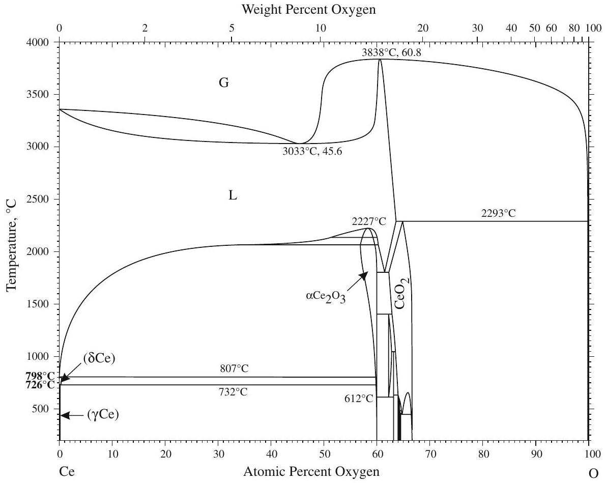
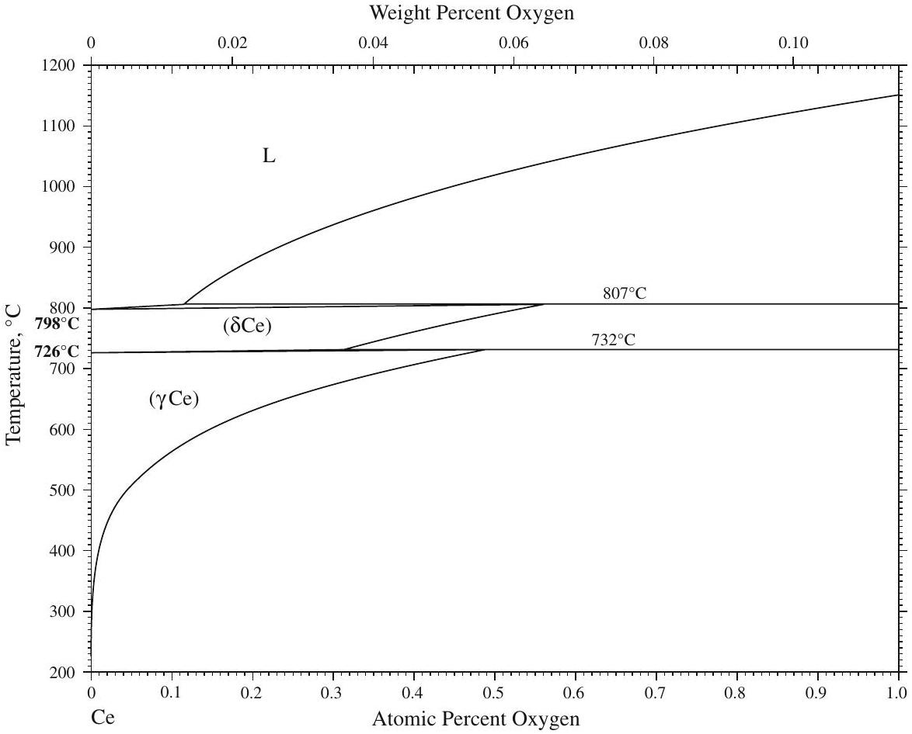
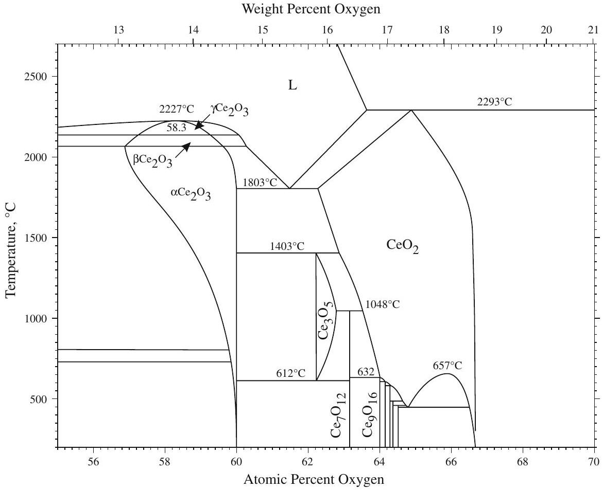
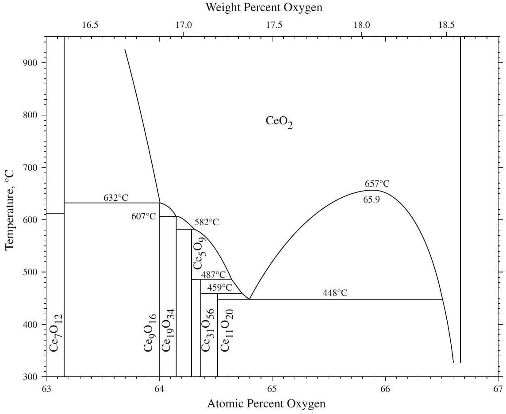

## Ce-O (Cerium-Oxygen)

## H. Okamoto

The partial $\mathrm{Ce}-\mathrm{O}$ phase diagram ( $59-68 \mathrm{at} . \% \mathrm{O}$ ) in [Massalski2] was redrawn from [Shunk].

A complete phase $\mathrm{Ce}-\mathrm{O}$ phase diagram (Fig. 1) was constructed thermodynamically by [2006Zin] based on
experimental data reported in numerous sources. Figure 2 shows solubility of oxygen in ( $\delta \mathrm{Ce}$ ) and ( $\gamma \mathrm{Ce}$ ). Figure 3 shows the detail of relationships among phases existing between $\mathrm{Ce}_{2} \mathrm{O}_{3}$ and $\mathrm{CeO}_{2}$. The possible existence of

Table 1 Ce-O crystal structure data
| Phase | Composition, at.\% O | Pearson symbol | Space group | Strukturbericht designation | Prototype |
| :--- | :--- | :--- | :--- | :--- | :--- |
| ( $\delta \mathrm{Ce}$ ) | 0-0.6 | $c I 2$ | $\operatorname{Im} \overline{3} m$ | A2 | W |
| $(\gamma \mathrm{Ce})$ | 0-0.5 | $c F 4$ | $F m \overline{3} m$ | A1 | Cu |
| $\gamma \mathrm{Ce}_{2} \mathrm{O}_{3}$ | 57.3-59.3 | ⋯ | ⋯ | ⋯ | ⋯ |
| $\beta \mathrm{Ce}_{2} \mathrm{O}_{3}$ | 56.9-58.6 | hP5 | $P 3 m 1$ | $D 5_{2}$ | $\mathrm{La}_{2} \mathrm{O}_{3}$ |
| $\alpha \mathrm{Ce}_{2} \mathrm{O}_{3}$ | 56.9-60 | cI80 | Ia 3 | $D 5_{3}$ | $\mathrm{Mn}_{2} \mathrm{O}_{3}$ |
| $\mathrm{Ce}_{7} \mathrm{O}_{12}$ | 63.2 | hR19 | $R \overline{3}$ | ⋯ | ⋯ |
| $\mathrm{Ce}_{3} \mathrm{O}_{5}$ | 62.2-62.8 | ⋯ | ⋯ | ⋯ | ⋯ |
| $\mathrm{CeO}_{2}$ | 62.2-66.7 | cF12 | $F m \overline{3} m$ | $C 1$ | $\mathrm{CaF}_{2}$ |
| $\mathrm{Ce}_{9} \mathrm{O}_{16}$ | 64.0 | $h R^{*}$ | ⋯ | ⋯ | ⋯ |
| $\mathrm{Ce}_{19} \mathrm{O}_{34}$ | 64.2 | ⋯ | ⋯ | ⋯ | ⋯ |
| $\mathrm{Ce}_{5} \mathrm{O}_{9}$ | 64.3 | ⋯ | … | ⋯ | ⋯ |
| $\mathrm{Ce}_{31} \mathrm{O}_{56}$ | 64.4 | ⋯ | ⋯ | … | ⋯ |
| $\mathrm{Ce}_{11} \mathrm{O}_{20}$ | 64.5 | aP31 | $P 1$ | ⋯ | ⋯ |

Fig. 1 Ce-O phase diagram

Fig. 2 Detail of $\mathrm{Ce}-\mathrm{O}$ phase diagram (0-1 at.\% O)

Fig. 3 Detail of $\mathrm{Ce}-\mathrm{O}$ phase diagram (55-70 at.\% O)

Fig. 4 Detail of $\mathrm{Ce}-\mathrm{O}$ phase diagram (63-67 at.\% O)

many intermediate phases around $\mathrm{CeO}_{2}$ was reported in [Massalski2]. These phases have been clarified by [2006Zin], as shown in Fig. 4.

Table 1 shows Ce-O crystal structure data.

Reference
2006Zin: M. Zinkevich, D. Djurovic, and F. Aldinger, Thermodynamic Modelling of the Cerium-Oxygen System, Solid State Ionics, 2006, 177, p 989-1001

