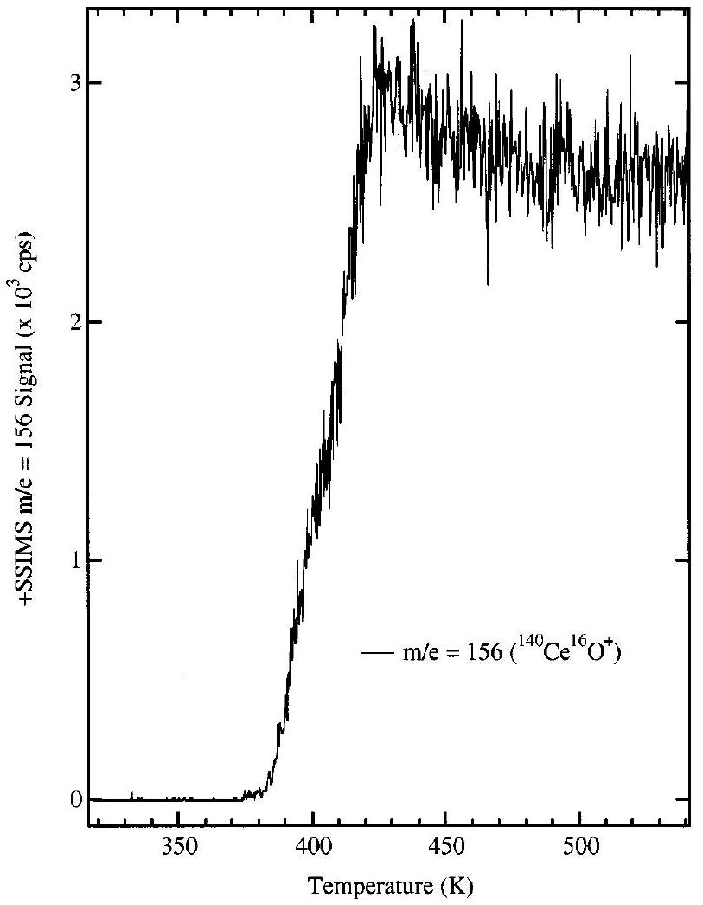
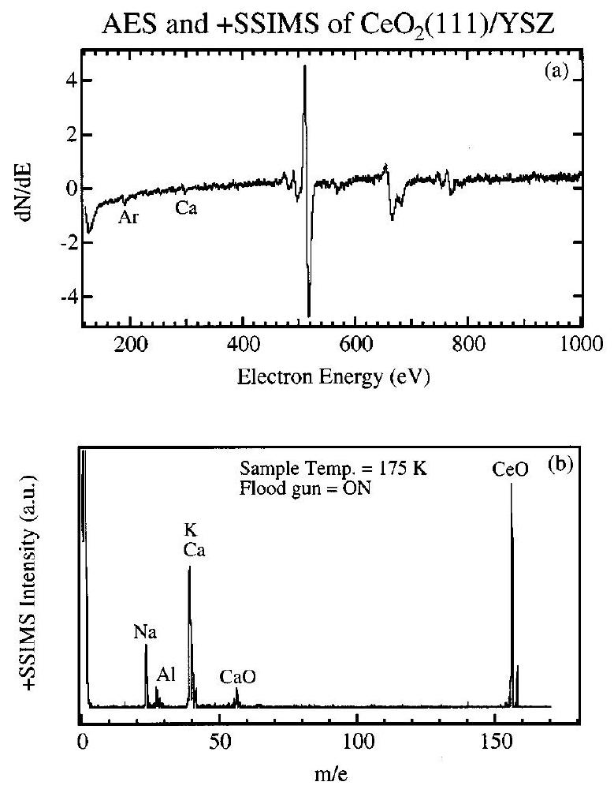
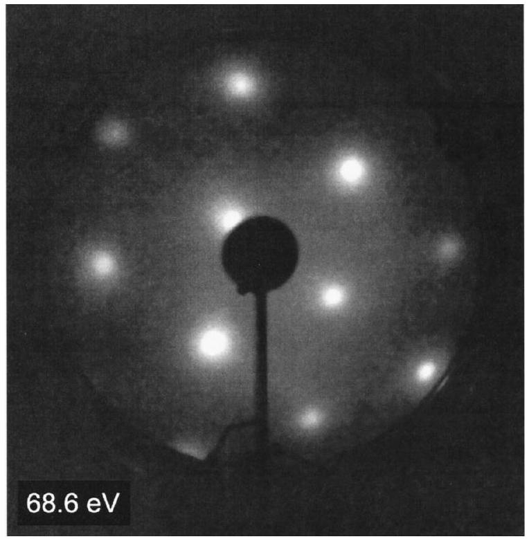
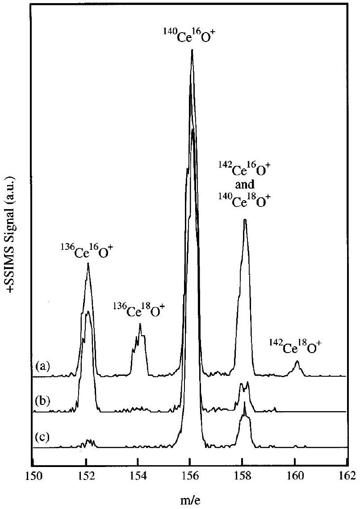
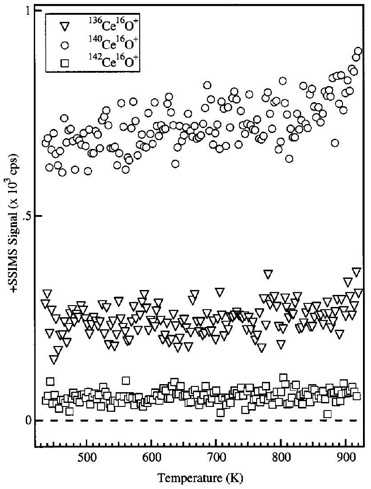
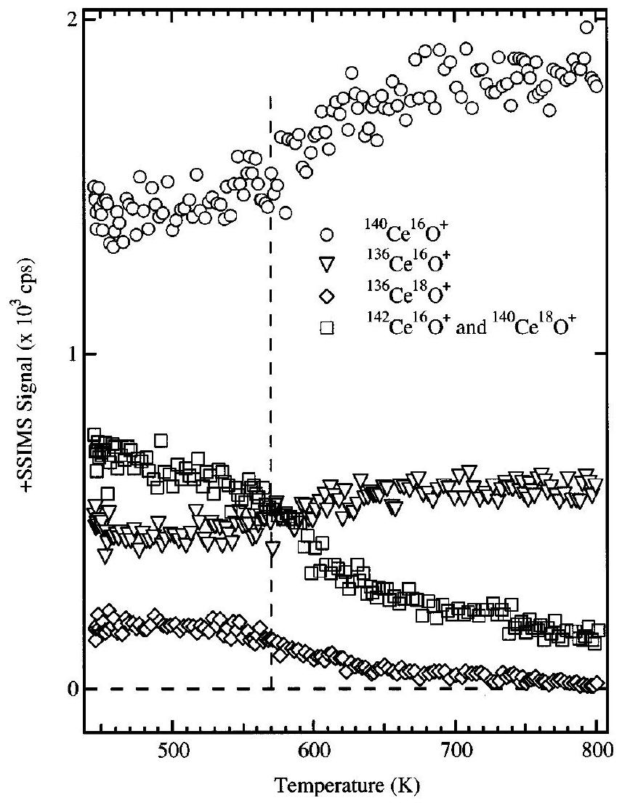
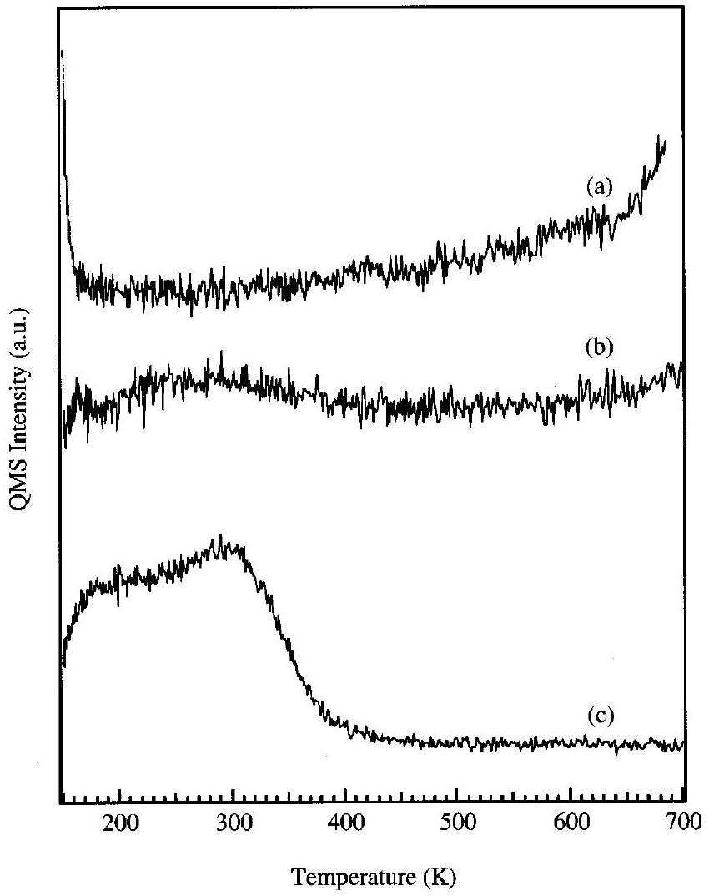

## Journal of Vacuum Science and Technology A

RESEARCH ARTICLE | JULY 012001
Self-diffusion in ceria
Craig L. Perkins; Michael A. Henderson; Charles H. F. Peden; Gregory S. Herman
Check for updates
J. Vac. Sci. Technol. A 19, 1942-1946 (2001)
https://doi.org/10.1116/1.1336831

## Articles You May Be Interested In

Static secondary ion mass spectrometry study of the decomposition of triethylgallium on GaAs (100)
J. Vac. Sci. Technol. A (November 1997)

Trimethylgallium dissociative chemisorption on gallium-rich $\operatorname{GaAs}(100)$ surfaces
J. Vac. Sci. Technol. A (November 1991)

Reaction kinetics of surface silicon hydrides
J. Vac. Sci. Technol. A (May 1989)

# Self-diffusion in ceria 

Craig L. Perkins, Michael A. Henderson, ${ }^{\text {a) }}$ Charles H. F. Peden, and Gregory S. Herman Environmental Molecular Sciences Laboratory, Pacific Northwest National Laboratory, P.O. Box 999, MS K8-93 Richland, Washington 99352

(Received 11 September 2000; accepted 6 November 2000)

#### Abstract

Ceria ( $\mathrm{CeO}_{2}$ ) is an oxygen storage material vital to the proper functioning of automobile three-way catalysts and is typically viewed as an anion conductor. Prior experimental work using temperature programmed static secondary ion mass spectrometry (TPSSIMS) has indicated that for rutile $\mathrm{TiO}_{2}$, a prototypical oxide, the mobile species are Ti cations rather than O anions. To further expand on the mobile species in $\mathrm{CeO}_{2}$ we have investigated the diffusion of both cerium and oxygen ions by TPSSIMS. The $\mathrm{CeO}_{2}$ (111) film was heteroepitaxially grown by molecular beam epitaxy on a yttria stabilized zirconia substrate. Although high quality low-energy electron diffraction patterns and Auger electron spectroscopy spectra free of impurity signals were obtained after just a few sputtering and annealing cycles, further cleaning was necessary to remove intense alkali and alkaline earth signals observed in SSIMS. The $\mathrm{CeO}_{2}(111)$ surface was slightly enriched in ${ }^{18} \mathrm{O}$ by first annealing the film in UHV at 830 K and then exposing the 130 K crystal to ${ }^{18} \mathrm{O}_{2}$. TPSSIMS data in conjunction with temperature programmed desorption data demonstrate that surface oxygen atoms begin to exchange with the bulk around 550 K . Physical deposition of submonolayer amounts of isotopically enriched cerium ( ${ }^{136} \mathrm{Ce}$ ) in an ${ }^{18} \mathrm{O}_{2}$ background allowed the simultaneous study of the diffusion of both cerium and oxygen ions. Surface cerium cations were found to be immobile with no diffusion into the bulk for temperatures up to 900 K , the highest temperature studied.

© 2001 American Vacuum Society. [DOI: 10.1116/1.1336831]

## I. INTRODUCTION

Self-diffusion in metal oxides affects many of the properties that make these materials useful in modern technological processes. Solid electrolytes such as ceria can conduct electrical currents by the exchange of cations, anions and electrons, and in applications such as fuel cells there frequently is a need to tailor the material such that a particular conduction mechanism prevails over another. Thin films of ceria ( $\mathrm{CeO}_{2}$ ) on yttria stabilized zirconia (YSZ) provide a barrier to the conduction of electrons, yet allow the passage of oxide ions. ${ }^{1}$ Furthermore, $\mathrm{CeO}_{2}$ is used as a diffusion barrier in the growth of YBCO high temperature superconductors on YSZ since the growth of YBCO directly on YSZ results in the undesirable formation of a $\mathrm{BaZrO}_{3}$ phase. ${ }^{2}$ The "three-way" catalyst used in automobile catalytic converters is another example of a metal oxide material in which self-diffusion plays an important role. These catalysts function effectively over a narrow stoichiometry range. ${ }^{3}$ Ceria, a fluorite oxide whose cations can switch between the +3 and +4 oxidation state, is used as an oxygen storage material that is capable of releasing oxygen when the exhaust mixture is rich and of taking up oxygen when the exhaust is too lean. The ability of the ceria based catalyst to serve as an oxygen buffer is necessarily dependent on the rates at which oxygen adsorption/ desorption sites become available at the surfaces of the oxide crystallites, and this is in turn dependent on the diffusion of cerium and oxygen ions and defects. Over time, these diffu-

[^0]sion processes adversely affect the oxygen storage ability of the ceramic, although the fundamental reasons for this degradation remain unclear.

Because of its direct bearing on the performance of devices such as catalytic converters and fuel cells, diffusion of oxygen in ceria and the ease with which ceria surfaces can be reduced have received much attention. ${ }^{4-18}$ However, there have been few surface science studies on the diffusion of cerium ions in $\mathrm{CeO}_{2}$. In the rutile polymorph of $\mathrm{TiO}_{2}$, a growing body of evidence suggests that it is the diffusion of interstitial $\mathrm{Ti}^{3+}$ cations that dominate the interactions of that material with oxygen. ${ }^{19-22}$ For this reason, we have revisited the processes of self-diffusion in $\mathrm{CeO}_{2}$ heteroepitaxial films grown on a $\langle 111\rangle$ oriented YSZ substrate. We find that cerium ions are essentially immobile with respect to diffusion into the bulk up to 900 K , whereas oxygen diffusion begins at 570 K .

## II. EXPERIMENT

The 500 -Å-thick $\mathrm{CeO}_{2}$ (111) film was grown on a 10 mm $\times 10 \mathrm{~mm} \times 1 \mathrm{~mm}$ yttria stabilized zirconia (YSZ)(111) substrate in a dedicated metal oxide plasma-assisted molecular beam epitaxy (MBE) system described in more detail elsewhere. ${ }^{23}$ The substrate was cleaned by an ex situ rinse in spectral grade methanol, and in the growth chamber by brief exposure to the oxygen plasma ( $1-2 \times 10^{-5}$ Torr $\mathrm{O}_{2}, 200 \mathrm{W})$ at the growth temperature ( $650^{\circ} \mathrm{C}$ ). Growth rates ranged from 0.1 to $0.3 \AA / \mathrm{s}$ and were monitored with a quartz crystal microbalance. Reflection high-energy electron diffraction images of the substrate and of the growing ceria film showed
the surfaces to be smooth and unreconstructed. The finished films were transferred through air to the analysis chamber.

The static secondary ion mass spectrometry (SSIMS), Auger electron spectroscopy (AES), and temperature programmed desorption (TPD) experiments were performed in a stainless steel ultrahigh vacuum (UHV) chamber that has been described in previous publications. ${ }^{24,25}$ In brief, the system has a base pressure of less than $5 \times 10^{-11}$ Torr and is equipped with instrumentation for high resolution electron energy loss spectroscopy AES, SSIMS, low-energy electron diffraction (LEED), and TPD, as well as a calibrated pinhole doser and the usual facilities for sample cleaning. The $\mathrm{CeO}_{2}(111) / \mathrm{YSZ}(111)$ sample was mounted on a thin Ta backing plate, held by Ta clips, and had a type K thermocouple affixed to its front face with high temperature ceramic adhesive.

The epitaxial film was initially cleaned by a series of $\mathrm{Ar}^{+}$ sputtering and annealing cycles. Annealing was done at 850 K in front of a calibrated pinhole doser through which flowed an $\mathrm{O}_{2}$ flux of $1.3 \times 10^{14}$ molecules $\mathrm{cm}^{-2} \mathrm{~s}^{-1}$. Oxygen was flowed over the surface until the liquid nitrogen-filled manipulator cooled the sample through 570 K . Between experiments, the $\mathrm{CeO}_{2}(111)$ film was treated to an oxygen annealing cycle to minimize the accumulation of damage from the defocused $500 \mathrm{eV} \mathrm{Ar}^{+}$beam used during SSIMS which exposed the surface to approximately $10^{13}$ collisions $\mathrm{cm}^{-2}$ during the course of each experiment.

A resistively heated two-strand cable of 0.005 in . Ta wire was formed into a hairpin and was the basis for a homemade $\mathrm{CeO}_{2}$ doser. A type C thermocouple was welded to the apex of the hairpin to monitor the temperature of the doser. $\mathrm{CeO}_{2}$ isotopically enriched in ${ }^{136} \mathrm{Ce}$ ( $21.5 \%$ compared to the natural abundance of $0.193 \%$ ) was obtained from Oak Ridge National Laboratory and coated onto the Ta cable in an aqueous slurry which was allowed to dry in air before the doser was mounted onto the chamber. Since $\mathrm{CeO}_{2}$ is readily reduced by vacuum annealing, the isotopically labeled Ce oxide that sublimed from the doser held at $\sim 1390 \mathrm{~K}$ during deposition was likely a suboxide ( $\mathrm{CeO}_{x}$ ). However, since $\mathrm{CeO}_{x}$ was dosed in an oxygen background, it likely formed $\mathrm{CeO}_{2}$ at the surface.

## III. RESULTS AND DISCUSSION

The large band gap of undoped ceria makes the use of standard surface science techniques difficult. Figure 1 demonstrates the effect of the sample conductivity on the ${ }^{140} \mathrm{Ce}^{16} \mathrm{O}^{+}$ion yield during a temperature programmed SSIMS experiment. The secondary ion yield is zero below 370 K because the sample has charged and the focused primary beam has been deflected off the crystal. As the sample was heated to above 370 K the charging dissipated and the secondary ion signal concurrently rose. It was possible to regain SSIMS signal from cold samples using a low flux 20 eV electron beam, however the ion yields showed complex behavior during temperature programmed experiments as the transition was made from charge neutralization by the electron beam to charge neutralization by both conduction and

Fig. 1. Change in the $m / e=156\left({ }^{140} \mathrm{Ce}^{16} \mathrm{O}^{+}\right)$secondary ion signal as a function of temperature as a result of sample charging and discharging. The argon ion beam current was $\sim 0.1 \mathrm{nA}$.

by the electron beam. For this reason, and unless noted otherwise, experiments were performed at temperatures above 450 K .

The sputtered and annealed film was judged clean by AES as indicated by a typical spectrum shown in Fig. 2(a). However, SSIMS spectra of the sample after an identical preparation demonstrated that considerable amounts of $\mathrm{K}, \mathrm{Ca}, \mathrm{Na}$, and Al exist at the surface. Further cleaning cycles were performed to reduce the SSIMS signals from these elements, however they were never completely eliminated as indicated in Fig. 2(b). LEED patterns of the sputtered and annealed (111) film are shown in Fig. 3. These patterns were obtained by briefly heating the sample to 450 K , shutting off the power supply, and quickly photographing the LEED screen. It was possible to obtain fairly sharp diffraction patterns down to about 68 eV . Their low background, sharpness, and symmetry indicate that the epitaxial $\mathrm{CeO}_{2}(111)$ film was well ordered and unreconstructed, as expected.

Figure 4 shows two SSIMS spectra of the ${ }^{136} \mathrm{Ce}$ exposed film and one spectrum of the clean, unexposed film. The majority of the total positive secondary ion signal from the ceria film resulted from $\mathrm{CeO}^{+}$, with the $\mathrm{Ce}^{+}$ion being less than $5 \%$ of the oxide ion peak [i.e., see Fig. 2(b)] and therefore of little use in the following analysis. Because naturally occurring oxygen consists essentially of the ${ }^{16} \mathrm{O}$ isotope, the relative natural isotopic abundances of the two main cerium isotopes, ${ }^{140} \mathrm{Ce}(88.4 \%)$ and ${ }^{142} \mathrm{Ce}(11.1 \%)$ can be observed in the SSIMS spectrum of the clean crystal in Fig. 4(c). ${ }^{26}$ By

FIG. 2. In (a) is an AES spectrum of the sputtered and annealed crystal. Further cleaning cycles were necessary to remove intense SSIMS signals from $\mathrm{Na}^{+}, \mathrm{K}^{+}$, and $\mathrm{Ca}^{+}$in order to obtain "clean" SSIMS spectra such as in (b).

varying the composition of the background gas from ${ }^{16} \mathrm{O}_{2}$ to ${ }^{18} \mathrm{O}_{2}$, it was possible to select the isotopic composition of the submonolayer amount of $\mathrm{CeO}_{x}$ which was deposited on the $\mathrm{CeO}_{2}$ (111) film. Figure 4(b) is the SSIMS spectrum of approximately 0.3 ML of ${ }^{136} \mathrm{Ce}^{16} \mathrm{O}_{x}$ deposited at room tempera-

FIG. 3. LEED pattern $[p(1 \times 1)]$ from the sputtered and annealed crystal for a beam energy of 69 eV .

FIG. 4. Positive SSIMS spectra of (a) ${ }^{136} \mathrm{Ce}^{18} \mathrm{O}_{x}$ exposed, (b) ${ }^{136} \mathrm{Ce}^{16} \mathrm{O}_{x}$ exposed, and (c) clean $\mathrm{CeO}_{2}$ (111) surfaces.

ture on the $\mathrm{CeO}_{2}$ (111) film. The temperature dependent behavior of the SSIMS signals from this film will be discussed below. Figure 4(a) is a SSIMS spectrum of a slightly greater amount of ${ }^{136} \mathrm{Ce}$ oxide deposited on the $\mathrm{CeO}_{2}(111)$ film at 440 K in a background of $2.0 \times 10^{-7}$ Torr ${ }^{18} \mathrm{O}_{2}$ in order to obtain a mixture of different cerium and oxygen isotopes. The fairly strong $m / e=158$ peak and the small peak at $m / e=160$ are indications that some ${ }^{18} \mathrm{O}$ from gas phase ${ }^{18} \mathrm{O}_{2}$ was incorporated into the deposited ${ }^{136} \mathrm{Ce}$ oxide as well as into the $\mathrm{CeO}_{2}(111)$ film.

Temperature programmed SSIMS experiments were performed on the ${ }^{136} \mathrm{CeO}_{x}$ dosed films of Figs. 4(a) and 4(b). A multiplexed temperature programmed static secondary ion mass spectrometry (TPSSIMS) spectrum of the ${ }^{136} \mathrm{Ce}^{16} \mathrm{O}_{x}$ dosed $\mathrm{CeO}_{2}$ (111) film is shown in Fig. 5. The self-diffusion behavior of cerium cations is evident based on the discussion of the SSIMS spectrum shown in Fig. 4(b). It is apparent that for temperatures up to 900 K there is no change in the intensities of the ${ }^{136} \mathrm{Ce}^{16} \mathrm{O}^{+}$, the ${ }^{140} \mathrm{Ce}^{16} \mathrm{O}^{+}$, or the ${ }^{142} \mathrm{Ce}^{16} \mathrm{O}^{+}$ SSIMS features. This indicates that the deposited ${ }^{136} \mathrm{Ce}$ atoms are essentially immobile with respect to diffusion into the bulk of the material and remain at the surface. The small increase in the signals of all the ions monitored is attributed to an increased sputter yield as a result of increased temperature. The immobility of cations in ceria found here is in contrast to what has been observed for $\mathrm{TiO}_{2}$. For rutile $\mathrm{TiO}_{2}$

FIG. 5. Temperature programmed SSIMS spectrum of the ${ }^{136} \mathrm{Ce}^{16} \mathrm{O}_{x}$ exposed crystal. The temperature ramp rate $=1 \mathrm{~K} \mathrm{~s}^{-1}$.

it has been found that the mobile species are Ti interstitials. ${ }^{19-22}$ Faber, Seitz, and Mueller concluded that for reduced $\mathrm{CeO}_{2}\left(\mathrm{CeO}_{1.92}\right)$, the interstitial Ce concentration is less than $0.1 \%$ of the total defect concentration. ${ }^{27}$ Therefore, cation self-diffusion may not be prominent in ceria because of the low interstitial concentration, which in turn may be related to the limited volume in the $\mathrm{CeO}_{2}$ fluorite structure available for occupation of the interstitial sites. The largest channels are along $\langle 110\rangle$ directions with widths reflected by a Ce-Ce distance of $3.83 \AA$ and an O-O distance of $2.70 \AA$. In contrast, the $\langle 001\rangle$ channels in $\mathrm{TiO}_{2}$ rutile are considerably larger (Ti-Ti of $4.59 \AA$ and $\mathrm{O}-\mathrm{O}$ of $3.33 \AA$ ). The available space within the fluorite structure for interstitials (especially for relatively large cations such as $\mathrm{Ce}^{3+}$ or $\mathrm{Ce}^{4+}$ ) may therefore limit the stability and kinetics of cation diffusion.

Figure 6 is comprised of traces obtained during a single TPSSIMS experiment conducted on the $\mathrm{CeO}_{2}(111)$ sample which had been dosed with ${ }^{136} \mathrm{Ce}^{16} \mathrm{O}_{x}$ in an ${ }^{18} \mathrm{O}_{2}$ background. It can be seen that the two ions which have been labeled with ${ }^{18} \mathrm{O}$ begin to decrease in intensity at 570 K , whereas the ions with ${ }^{16} \mathrm{O}$ increase in intensity at the same temperature. To assure that the relative change in the ion signals was not the result of some form of ${ }^{18} \mathrm{O}$ escaping into the gas phase, temperature programmed desorption data were taken on a crystal which had been exposed at low temperatures to oxygen ( ${ }^{16} \mathrm{O}_{2}$ for the TPD experiments). In Fig. 7 it can be seen that under these conditions there is some mo-

FIG. 6. Temperature programmed SSIMS spectrum of the ${ }^{136} \mathrm{Ce}^{18} \mathrm{O}_{x}$ exposed crystal. The temperature ramp rate $=1 \mathrm{~K} \mathrm{~s}^{-1}$.

lecular oxygen given off by the sample. However, our extensive experiments with oxygen TPD from identically mounted rutile crystals have shown that most of this low temperature $\mathrm{O}_{2}$ TPD peak results from desorption from the sample holder rather than the sample. In any case, the sample/sample holder has stopped evolving oxygen and oxygen containing species such as CO (TPD trace a) and $\mathrm{CO}_{2}$ (TPD trace b) at $\sim 425 \mathrm{~K}$, well before the SSIMS signals are seen to change in Fig. 6. These TPD results indicate that the reduction in intensity of the SSIMS features related to ${ }^{18} \mathrm{O}$ are the result of oxygen diffusion into the bulk $\mathrm{CeO}_{2}$. The low temperature for oxygen diffusion (starting at 570 K ) compared to the relatively high temperature for cerium diffusion (above 900 K ) suggests that oxygen is in fact the mobile species in $\mathrm{CeO}_{2}$.

## IV. SUMMARY AND CONCLUSIONS

Low-energy electron diffraction indicated that a high quality heteroepitaxial $\mathrm{CeO}_{2}(111)$ film was grown by plasma-assisted MBE on a YSZ(111) substrate. Although sample charging was problematic at temperatures below 425 K , it was possible to perform AES, LEED, SSIMS, and TPSSIMS experiments on the film. The major secondary ion signal resulting from $500 \mathrm{eV} \mathrm{Ar}{ }^{+}$bombardment of this film corresponds to $\mathrm{CeO}^{+}$and the signal from $\mathrm{Ce}^{+}$was negligible. The deposition of submonolayer amounts of isotopically enriched ${ }^{136} \mathrm{CeO}_{x}$ could easily be performed and the isotopic composition of the deposited oxide could be ad-

FIG. 7. Temperature programmed desorption from the vacuum annealed $\mathrm{CeO}_{2}$ (111) surface dosed with ${ }^{16} \mathrm{O}_{2}$ (exposure $=7.8 \times 10^{15}$ molecules $\mathrm{cm}^{-2}$ ) at 130 K . Trace (a) is $m / e=28(\mathrm{CO})$, trace (b) is $m / e=44\left(\mathrm{CO}_{2}\right)$ and trace (c) is $m / e=32\left(\mathrm{O}_{2}\right)$.

justed by the isotopic composition of $\mathrm{O}_{2}$ in the background gas. We found that the cerium cations are essentially immobile with respect to diffusion into the bulk for temperatures up to 900 K . However, we found that oxygen begins to diffuse from the surface into the bulk at $\sim 550 \mathrm{~K}$. The differences in the mobilities of cations in rutile $\mathrm{TiO}_{2}$ and $\mathrm{CeO}_{2}$ may be attributed to the lower number and lower stability of interstitial cations in $\mathrm{CeO}_{2}$ relative to the total number of defects.

## ACKNOWLEDGMENTS

The research described in this article was performed in the Environmental Molecular Sciences Laboratory, a na-
tional scientific user facility sponsored by the U.S. Department of Energy (DOE) Office of Biological and Environmental Research and is located at PNNL. PNNL is operated for the U.S. DOE by Battelle Memorial Institute under Contract No. DE-AC06- 76RLO. This work was supported by the U.S. DOE, Office of Basic Energy Sciences, Division of Chemical Sciences.
${ }^{1}$ M. Mogensen, N. M. Sammes, and G. A. Tompsett, Solid State Ionics 129, 63 (2000).
${ }^{2}$ G. L. Skofronick and A. H. Carmin, J. Mater. Res. 8, 2785 (1993).
${ }^{3}$ R. J. Farrauto and R. M. Heck, Catal. Today 51, 351 (1999).
${ }^{4}$ J. P. Holgado, R. Alvarez, and G. Munuera, Appl. Surf. Sci. 161, 301 (2000).
${ }^{5}$ J. A. Kilner, Solid State Ionics 129, 13 (2000).
${ }^{6}$ E. S. Putna, T. Bunluesin, X. L. Fan, R. L. Gorte, J. M. Vohs, R. E. Lakis, and T. Egami, Catal. Today 50, 343 (1999).
${ }^{7}$ G. S. Herman, Surf. Sci. 437, 207 (1999).
${ }^{8}$ C. Binet, M. Daturi, and J. Lavalley, Catal. Today 50, 207 (1999).
${ }^{9}$ H. Cordatos, T. Bunluesin, J. Stubenrauch, J. M. Vohs, and R. J. Gorte, J. Phys. Chem. 100, 785 (1996).
${ }^{10}$ H. Cordatos, D. Ford, and R. J. Gorte, J. Phys. Chem. 100, 18128 (1996).
${ }^{11}$ H. Inaba and H. Tagawa, Solid State Ionics 83, 1 (1996).
${ }^{12}$ J. C. Conesa, Surf. Sci. 339, 337 (1995).
${ }^{13}$ A. Pfau, K. D. Schierbaum, and W. Göpel, Surf. Sci. 331-333, 1479 (1995).
${ }^{14}$ J. Soria, A. Martinez-Arias, and J. C. Conesa, J. Chem. Soc., Faraday Trans. 91, 1669 (1995).
${ }^{15}$ A. Pfau and K. D. Schierbaum, Surf. Sci. 321, 71 (1994).
${ }^{16}$ T. X. T. Sayle, S. C. Parker, and C. R. A. Catlow, Surf. Sci. 316, 329 (1994).
${ }^{17}$ X. Zhang and K. J. Klabunde, Inorg. Chem. 31, 1706 (1992).
${ }^{18}$ E. Paparazzo, G. M. Ingo, and N. Zacchetti, J. Vac. Sci. Technol. A 9, 1416 (1991).
${ }^{19}$ M. A. Henderson, Surf. Sci. 419, 174 (1999).
${ }^{20}$ M. Li, W. Hebenstreit, L. Gross, U. Diebold, M. A. Henderson, D. R. Jennison, P. A. Schultz, and M. P. Sears, Surf. Sci. 437, 173 (1999).
${ }^{21}$ P. Stone, R. A. Bennett, and M. Bowker, New J. Phys. 1, 1.1 (1999).
${ }^{22}$ M. A. Henderson, Surf. Sci. 341, L1156 (1995).
${ }^{23}$ Y. J. Kim, Y. Gao, G. S. Herman, S. Thevusathan, W. Jiang, D. E. McReady, and S. A. Chambers, J. Vac. Sci. Technol. A 17, 926 (1999).
${ }^{24}$ M. A. Henderson, Surf. Sci. 319, 315 (1994).
${ }^{25}$ M. A. Henderson, Langmuir 12, 5093 (1996).
${ }^{26}$ CRC Handbook of Chemistry and Physics, 64th ed., edited by R. C. Weast (Chemical Rubber Corp., Boca Raton, FL, 1983), p. B-271.
${ }^{27}$ J. Faber, M. A. Seitz, and M. H. Mueller, J. Phys. Chem. Solids 37, 903 (1975).

[^0]:    ${ }^{\text {a) }}$ Author to whom correspondence should be addressed; electronic mail: ma.henderson@pnl.gov

