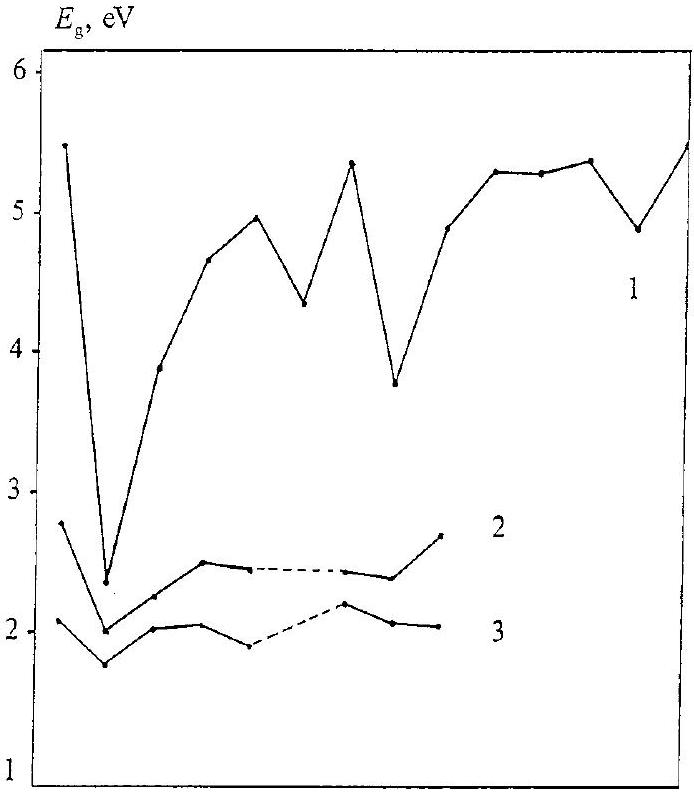
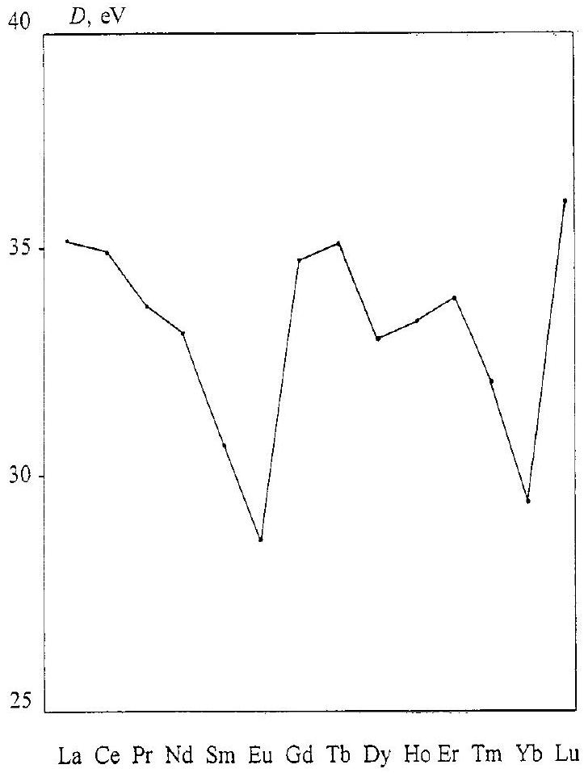

# Periodicity in the band gap variation of $\mathrm{Ln}_{2} \mathrm{X}_{3}(\mathrm{X}=\mathrm{O}, \mathrm{S}, \mathrm{Se})$ in the lanthanide series

A.V. Prokofiev*, A.I. Shelykh, B.T. Melekh A.F. Ioffe Physico-Technical Institute, St.-Petersburg 194021, Russia

Received 19 August 1995; in final form 27 February 1996

#### Abstract

Band gap. $E_{g}$ variation is considered across the lanthanides in rare earth oxides, sulphides and selenides of the type $\mathrm{Ln}_{2} \mathrm{X}_{3}$. A periodicity of the $E_{\mathrm{g}}$ variation for the $\mathrm{Ln}_{2} \mathrm{O}_{3}$ series is found. The minima are observed at the beginning (Ce, Tb) and at the end $(\mathrm{Eu}, \mathrm{Yb})$ of the two halfs of the lanthanide series. The greatest feature of the dependence of $E_{\mathrm{g}}$ on atomic number $Z$ of a lanthanide is a deep minimum for $\mathrm{Ce}_{2} \mathrm{O}_{3}$. In the sulphide and selenide series the peculiarities are smoother.

The analysis of the dependences $E_{\mathrm{g}}(Z)$ leads to the conclusion that there are two quite different reasons for the decrease of $E_{\mathrm{g}}$. The position of the 4f-band between the valence and conduction bands determines the anomalies of $E_{\mathrm{g}}$ at the beginning of the halfs of the lanthanide series. For Eu and Yb oxides the smaller values of $E_{\mathrm{g}}$ are determined by the smaller gap between the valence and conduction bands.

Keywords: Band gap; Secondary periodicity; 4f-5d transition; Rare earths

## 1. Introduction

In the rare earth (RE) series (from La to Lu ) the strongly localized f-shell which is considered usually as a core-like shell becomes filled. This determines the similar chemical properties of the lanthanides. The variation of their properties across the series often has a monotonous character. However, a striking periodicity of some properties was found [1,2]. The series is considered as a 'small periodic system of the lanthanides' not without reason [3].

The analysis of the dependences of properties of the lanthanides on their atomic number $Z$ is a fruitful method for exposure and study of the effect of the f-speciality of the lanthanides on the properties. The present paper makes an attempt to analyse the variation of the band gap $E_{\mathrm{g}}$ in the series of $\mathrm{Ln}_{2} \mathrm{X}_{3}$ compounds. We mean that $E_{\mathrm{g}}$ is a gap between the vacant $5 \mathrm{~d}(6 \mathrm{~s})$ conduction band and the highest fully occupied band. The effect of Coulomb correlation leads to a splitting of the 4f-band into two sub-bands: a completely filled $4 \mathrm{f}_{\mathrm{o}}$-band and an empty $4 \mathrm{f}_{\mathrm{e}}$-band,

[^0]separated by 6-12 eV [4]. This leads to $\mathrm{Ln}_{2} \mathrm{X}_{3}$ being insulators. In this paper when speaking about the f-band we mean filled $4 \mathrm{f}_{0}$-band.
$\mathrm{Ln}_{2} \mathrm{X}_{3}$ are typical compounds of RE elements. All lanthanides have the valency 3 in these compounds: All are insulators or wide-gap semiconductors. The $E_{\mathrm{g}}$ varies from 5.5 eV for oxides to 2 eV for selenides.

It was adopted that $E_{\mathrm{g}}$ of the sulphides and selenides is the gap between the valence band formed by $n p$-states of S, Se and the conduction band formed by $5 \mathrm{~d}(6 \mathrm{~s})$-states of RE ions. The f-band is supposed to lie within (or below) the valence band. For oxides the position in the electron spectrum of the f-band remains questionable. Usually it is considered that 4flevels lie in the valence band. However, calculations compared with the results of XPS studies [5,6] lead to the conclusion that the filled 4f-orbitals in $\mathrm{Pr}_{2} \mathrm{O}_{3}$ and $\mathrm{Nd}_{2} \mathrm{O}_{3}$ are situated above the $2 \mathrm{p}(\mathrm{O})$-band, the f-levels gradually becoming lowered across the series. For other oxides they lie in (or below) the 2p(O)-band.

For the free $\mathrm{Ln}^{3+}$ ions the energy difference between the 5 d - and 4 f -levels varies from about 6 eV for Ce to about 11 eV for Gd [7]. This exceeds the $E_{\mathrm{g}}$ values of $\mathrm{Ln}_{2} \mathrm{X}_{3}$ measured experimentally. In contrast, crystal fields split the d-band so that its bottom is
lowered. Let us suppose that the f-band in the solid compounds $\mathrm{Ln}_{2} \mathrm{X}_{3}$ lies within the valence band. From this point of view the $E_{\mathrm{g}}$ values of the compounds across the lanthanide series should change monotonously, in accordance with the variation of the RE ionic radius (lanthanide contraction). The difference in $E_{\mathrm{g}}$ for the oxides, sulphides and selenides series should be equal to constant values.
However, the experimental data show that this is not the case. It was known from the 1960s that $E_{\mathrm{g}}$ of cerium sulphide is about 2 eV [8] whereas that of other $\mathrm{Ln}_{2} \mathrm{~S}_{3}$ is about 2.5-2.8 eV. This fact remained without interpretation. Development of crystal growth techniques of RE sulphides and selenides and optical measurements on single crystals allow us to state that this anomaly is not fortuitous and it is also repeated for selenide series [9].
This anomaly for Ce was explained by so high an f-band position in the energy spectrum of $\mathrm{Ce}_{2} \mathrm{X}_{3}$, relative to the d-band, that it overlaps the forbidden gap [9]. So for $\mathrm{Ce}_{2} \mathrm{~S}_{3}$ and $\mathrm{Ce}_{2} \mathrm{Se}_{3}$ the absorption edge is determined by optical transitions from the 4f-band to the conduction band.
$\mathrm{Tb}^{3+}$ is the analogue of $\mathrm{Ce}^{3+}$. Both ions have one electron in excess of the most stable $\mathrm{f}^{7}$ and $\mathrm{f}^{0}$ configurations. Hence transitions of an electron to the d-level lead to stable states of the RE ions. This results in a relatively low energy of the $4 \mathrm{f}^{N} \rightarrow 4 \mathrm{f}^{N-1} 5 \mathrm{~d}^{1}$ transition for cerium and terbium. The anomaly of $E_{\mathrm{g}}$ like those for $\mathrm{Ce}_{2} \mathrm{~S}_{3}$ and $\mathrm{Ce}_{2} \mathrm{Se}_{3}$ was expected for $\mathrm{Tb}_{2} \mathrm{~S}_{3}$ and $\mathrm{Tb}_{2} \mathrm{Se}_{3}$. However, this has not been observed [10].
As the top of the valence band is lowered in the selenides-sulphides-oxides sequence it is expected that the specific 4f feature should be displayed in $E_{\mathrm{g}}(Z)$ in an increasingly more striking form in this sequence. Recently, new reliable data on the $E_{\mathrm{g}}$ of RE oxides have become available. In the present paper the band scheme proposed for cerium chalcogenides is applied for interpreting the $E_{\mathrm{g}}$ changes in the oxide series.

## 2. Sources and selection of experimental data

RE oxides are the most studied compounds among all $\mathrm{Ln}_{2} \mathrm{X}_{3}$. There are many data on optical $E_{\mathrm{g}}$ values almost for all RE oxides. This opens the possibility to construct the dependence of $E_{\mathrm{g}}=f(Z)$ for the complete oxide series. However, most of the data were measured on polycrystalline or powder samples. For some of the oxides discrepancies between the data exist. The most pronounced one is for the oxides of Pr and Tb. Reference data for $\mathrm{Ce}_{2} \mathrm{O}_{3}$ scarcely exist. The reason for this is the uncontrollable nonstoichiometric composition which is connected with the stability of the tetravalent state of these elements.
In Ref. [11] special attention was paid to the

Table 1
Band gaps of oxides [11, 13-18]
| Oxide | $E_{\mathrm{g}}(\mathrm{eV})$ |  |  |  |  |  |  |  |
| :--- | :--- | :--- | :--- | :--- | :--- | :--- | :--- | :--- |
|  | [13] | [14] | [15] | [16] | [17] | [18] | $E_{\text {g\|13-18\| }}$ | [11] |
| $\mathrm{La}_{2} \mathrm{O}_{3}$ | 5.5 | 5.4 |  |  | 5.60 |  | 5.5 |  |
| $\mathrm{Ce}_{2} \mathrm{O}_{3}$ |  |  |  |  |  |  |  | 2.4 |
| $\mathrm{Pr}_{2} \mathrm{O}_{3}$ | 3.9 | 4.0 | 5.5 |  | 5.56 | 3.88 | 4.6 | 3.9 |
| $\mathrm{Nd}_{2} \mathrm{O}_{3}$ |  | 4.4 |  | 4.9 | 4.00 |  | 4.4 | 4.7 |
| $\mathrm{Sm}_{2} \mathrm{O}_{3}$ |  | 5.0 | 5.1 | 4.7 | 5.04 |  | 5.0 |  |
| $\mathrm{Eu}_{2} \mathrm{O}_{3}$ |  | 4.5 | 4.6 | 4.0 | 4.48 |  | 4.4 |  |
| $\mathrm{Gd}_{2} \mathrm{O}_{3}$ |  | 5.3 |  | 5.0 | 5.45 |  | 5.3 | 5.4 |
| $\mathrm{Tb}_{2} \mathrm{O}_{3}$ | 3.9 | 3.4 | 4.2 | <1 | 4.77 |  | 4.1 | 3.8 |
| $\mathrm{Dy}_{2} \mathrm{O}_{3}$ | 5.0 | 5.0 | 5.0 | 4.7 | 4.86 |  | 4.9 | 4.9 |
| $\mathrm{Ho}_{2} \mathrm{O}_{3}$ | 5.4 | 5.4 | 5.4 | 4.7 | 5.27 |  | 5.2 | 5.3 |
| $\mathrm{Er}_{2} \mathrm{O}_{3}$ | 5.4 | 5.4 | 5.5 | 4.9 | 5.21 |  | 5.3 | 5.3 |
| $\mathrm{Tm}_{2} \mathrm{O}_{3}$ |  | 4.5 | 5.6 | 4.9 | 5.25 |  | 5.1 | 5.4 |
| $\mathrm{Yb}_{2} \mathrm{O}_{3}$ |  | 5.2 | 5.2 | 4.8 | 5.30 |  | 5.1 | 4.9 |
| $\mathrm{Lu}_{2} \mathrm{O}_{3}$ |  | 5.5 |  | 5.2 | 5.52 |  | 5.4 | 5.5 |

stoichiometry of the oxides. Single crystals were grown by the cold crucible technique. Oxides of Pr and Tb were given a reducing treatment in vacuum or in a hydrogen atmosphere. In Ref. [12] single crystals of $\mathrm{Ce}_{2} \mathrm{O}_{3}$ were grown by a special technique (in a closed crucible).
In Ref. [11] all measurements of the optical $E_{\mathrm{g}}$ values were carried out on single crystals. These data for stoichiometric $\mathrm{Ln}_{2} \mathrm{O}_{3}$ seems to us to be the most reliable. The $E_{\mathrm{g}}$ values of the lanthanide chalcogenides were taken from Ref. [9]. In the latter study most of the values were measured on stoichiometric single crystals.
The data from Ref. [11] and other reference data are collected in Table 1. The table contains a column of averaged $E_{\mathrm{g}}$ values from Refs. [13-18] for an evaluation of the reliability of the data. The $E_{\mathrm{g}}$ values measured on single crystals [11] were taken for graphic representation mainly. Data on $\mathrm{La}_{2} \mathrm{O}_{3}, \mathrm{Eu}_{2} \mathrm{O}_{3}$ and $\mathrm{Sm}_{2} \mathrm{O}_{3}$ were added from the column $\mathrm{E}_{[[13-18]}$.

## 3. Discussion

The $E_{\mathrm{g}}(Z)$ dependences of oxides, sulphides and selenides are presented in Fig. 1. The sulphide and selenide curves (2 and 3) have a few peculiarities. The most characteristic one is the minimum for cerium. A faint minimum for samarium can also be seen. The oxide curve (1) is rich in peculiarities. Maximum values of $E_{\mathrm{g}}=5.5 \mathrm{eV}$ are observed for La, Gd and Lu oxides. Close to these are the $E_{\mathrm{g}}$ values of Ho, Er and Tm oxides. The prominent feature is the deep minimum for cerium. The second feature is the minimum for terbium. There is a deviation from the value $E_{\mathrm{g}}=5.5$ eV for $\operatorname{Pr}\left(E_{\mathrm{g}}=3.9 \mathrm{eV}\right)$. Less pronounced minima for $\mathrm{Eu}_{2} \mathrm{O}_{3}$ and $\mathrm{Yb}_{2} \mathrm{O}_{3}$ can be seen. The anomalies are

La Ce Pr Nd Sm Eu Gd Tb Dy Ho Er Tm Yb Lu

Fig. 1. Variation of the band gap $E_{\mathrm{g}}$ of $\mathrm{Ln}_{2} \mathrm{X}_{3}$ in the lanthanide series: (1) oxides; (2) sulphides; (3) selenides.
observed at the beginning ( Ce and Tb ) and at the end (Eu and Yb) of the two halfs of the series. Each half consists of eight lanthanides with gadolinium being an element common to both. So the W-shaped curve (Fig. 1) strikingly demonstrates the periodicity in the variation of $E_{\mathrm{g}}$ across the series.
Let us try to explain the peculiarities by consideration of the active role of the 4f-band in the determination of $E_{\mathrm{g}}$ in $\mathrm{Ln}_{2} \mathrm{X}_{3}$. Beginning from $\mathrm{Ce}^{3+}$, the energy of the f-shell becomes lower than that of the d-shell and it further decreases across the lanthanide series. However, this fall is not monotonous. The monotony is violated at the beginning of the second half. If the f-band is situated in the forbidden gap, then $E_{\mathrm{g}}$ is determined by the f-d gap. If the f-band falls into the valence band and below it, then $E_{\mathrm{g}}$ is determined by the gap between the valence and the conduction bands. These factors determine the periodic change of $E_{\mathrm{g}}$.
The $E_{\mathrm{g}}$ values of $\mathrm{La}, \mathrm{Gd}$ and Lu oxides are maxima. On the one hand the empty 4f-levels in $\mathrm{La}^{3+}$ lie much higher than the bottom of the 5d-band. On the other hand, because of the high stability of the half- and fully-filled 4f-shells, the position of the 4f-band in the band spectra of Gd and Lu oxides should be located most deeply relative to the 5d-band. It is most probable that the 4f-band for these two oxides lies deep in the valence band. The proximity of $E_{\mathrm{g}}$ for the three oxides (one of them has no f-electrons) indicates that $E_{\mathrm{g}}$ is determined by the same gap between the valence band (formed by $2 \mathrm{p}(\mathrm{O})$-states) and the conduction band. For Ce, Pr and Tb the energy of 4f-5d transition is lower than for the rest of the lanthanides. It is the transition that determines the absorption edge $E_{\mathrm{g}}$ of these oxides (4f-band lies above valence band). The same reason was used to explain the lower values of $E_{\mathrm{g}}$ for the cerium chalcogenides [9]. It should be noted that despite the change of the top level of the valence band in the $\mathrm{Ce}_{2} \mathrm{O}_{3}-\mathrm{Ce}_{2} \mathrm{~S}_{3}-\mathrm{Ce}_{2} \mathrm{Se}_{3}$ sequence of about 3.5 eV , the $E_{\mathrm{g}}$ values in this range change only by 0.55 eV.
For the Pr, Nd, Sm oxides, and beginning from the Dy oxide, the energy of the 4f-shell decreases and $E_{\mathrm{g}}$ increases in the sequences $\mathrm{Ce}_{2} \mathrm{O}_{3}-\mathrm{Pr}_{2} \mathrm{O}_{3}-\mathrm{Nd}_{2} \mathrm{O}_{3}-$ $\mathrm{Sm}_{2} \mathrm{O}_{3}$ and $\mathrm{Tb}_{2} \mathrm{O}_{3}-\mathrm{Dy}_{2} \mathrm{O}_{3}-\mathrm{Ho}_{2} \mathrm{O}_{3}$. As soon as the f-band enters into the 2p-band the $E_{\mathrm{g}}$ values become constant. The oxides of $\mathrm{Sm}, \mathrm{Ho}, \mathrm{Er}$ and Tm have the same position of their 4f-band (within the valence band) as the Gd and Lu oxides.
The $E_{\mathrm{g}}$ values of the terbium sulphide and selenide are not anomalous in the sulphide and selenide series. However, owing to the lowering of the valence band the anomaly appears for oxides.
The character of the change of $E_{\mathrm{g}}$ in the oxide series qualitatively agrees with the character of the change of the energy of the $4 \mathrm{f}^{N} \rightarrow 4 \mathrm{f}^{N-1} 5 \mathrm{~d}^{1}$ transition of the free $\mathrm{Ln}^{3+}$ ions and of the $\mathrm{Ln}^{3+}$ ions in $\mathrm{CaF}_{2}$ and $\mathrm{LaF}_{3}$ matrices [19] (except Eu and Yb).
Fig. 1 (curve 1) also shows that $\mathrm{Eu}_{2} \mathrm{O}_{3}$ and $\mathrm{Yb}_{2} \mathrm{O}_{3}$ have $E_{\mathrm{g}}$ minima. However, they cannot be explained by the same reasons used for the oxides of $\mathrm{Ce}, \mathrm{Pr}$ and Tb. As the $4 \mathrm{f}^{6}$ and $4 \mathrm{f}^{13}$ configurations of $\mathrm{Eu}^{3+}$ and $\mathrm{Yb}^{3+}$ are quite stable, the 4f-band in the oxides should lie within the valence band.
$E_{\mathrm{g}}$ is closely connected with energetic characteristics of the chemical bond in crystals. The optical transition from the valence $2 \mathrm{p}(\mathrm{O})$-band to the conduction 5d6s(Ln)-band has an interatomic nature and can be considered formally as a partial break of the Ln-O bond. By contrast, the transition $4 \mathrm{f} \rightarrow 5 \mathrm{~d}(6 \mathrm{~s})$ is intraatomic. The first should be strongly affected by the bond energies. The bond energy correlates with the dissociation (atomization) energy $D$. Therefore, when $E_{\mathrm{g}}$ is determined by the valence-to-conduction band transition it should correlate with $D$. There should be no correlation between $E_{\mathrm{g}}(Z)$ and $D(Z)$ if the band gap were determined by the 4f-to-conduction band transition.
Fig. 2 shows the dependences of $D(Z)$ for oxides. The $D$ values were taken from Ref. [20] and evaluated in electron-volts per formula unit. A correlation between the minima of $E_{\mathrm{g}}(Z)$ and $D(Z)$ is observed only for Eu and Yb. Hence the lower values of $E_{\mathrm{g}}$ for $\mathrm{Eu}_{2} \mathrm{O}_{3}$ and $\mathrm{Yb}_{2} \mathrm{O}_{3}$ are really determined by the narrower energy gap between the valence $2 \mathrm{p}(\mathrm{O})$ - and conduction-bands. It may be supposed that the lower $D$ values for these oxides indicates a valence lower than 3 in these oxides. In Ref. [5] it was concluded that 4f-orbital participation in chemical bonding (hav-

Fig. 2. Variation of the dissociation (atomization) energy $D$ of $\mathrm{Ln}_{2} \mathrm{O}_{3}$ in the lanthanide series.

ing a significant value) does not change monotonously in the series but has a minima for Eu and Yb .
There is no correlation between the minima of $E_{\mathrm{g}}(Z)$ and $D(Z)$ for Ce and Tb. This fact confirms that $E_{\mathrm{g}}$ values for these oxides are determined not by the 2p-5d but by the 4f-5d transition.

The same consideration can be made for the sulphides. $E_{\mathrm{g}}$ of $\mathrm{Ln}_{2} \mathrm{~S}_{3}$ can be calculated directly from the available thermodynamic data. The transition of an electron from the valence 3p(S) band to the conduction 5d(6s) band can be considered as a reaction of local valence disproportionation [21]:

$$
\begin{aligned}
& \mathrm{Ln}_{2} \mathrm{~S}_{3}(\mathrm{sol})=2[\mathrm{LnS}](\text { sol })+1 / 2 \mathrm{~S}_{2}(\text { gas }) \\
& \Delta G=G_{0}\left(\operatorname{Ln}_{2} \mathrm{~S}_{3}\right)-2 G_{0}(\mathrm{LnS})+G_{0}\left(1 / 2 \mathrm{~S}_{2}\right)=E_{\mathrm{g}}
\end{aligned}
$$

where $G_{0}$ is Gibbs energy of formation.
In Table 2 the calculated values of $E_{\mathrm{g}}$ for some sulphides of the beginning of the series are given [22].

Table 2
Calculated thermodynamical $E_{\mathrm{g}}$ values of sulphides $\mathrm{Ln}_{2} \mathrm{~S}_{3}$ [22]
| Sulphide | $E_{\mathrm{g}}(\mathrm{eV})$ |
| :--- | :--- |
| $\mathrm{La}_{2} \mathrm{~S}_{3}$ | 2.8 |
| $\mathrm{Ce}_{2} \mathrm{~S}_{3}$ | 2.7 |
| $\mathrm{Pr}_{2} \mathrm{~S}_{3}$ | 2.6 |
| $\mathrm{Nd}_{2} \mathrm{~S}_{3}$ | 2.4 |

The calculated $E_{\mathrm{g}}$ value of $\mathrm{Ce}_{2} \mathrm{~S}_{3}$ does not stand out from the range of sulphides. Hence the real $E_{\mathrm{g}}$ value of $\mathrm{Ce}_{2} \mathrm{~S}_{3}$ is not determined by the $3 \mathrm{p} \rightarrow 5 \mathrm{~d}$ transition.
So the reasons which determine the peculiarities of the $E_{\mathrm{g}}$ are different for the elements at the beginning and at the end of the two halfs of the lanthanide series.

## Acknowledgements

The work was sponsored by the Russian Basic Research Foundation (93-02-3673).

## References

[1] D.F. Peppard, G.W. Mason and S. Lewey, J. Inorg. Nucl. Chem., 31 (1969) 2271.
[2] I. Fidelis and W. Siekierski, J. Inorg. Nucl. Chem., 28 (1966) 185.
[3] W. Klemm, in S.P. Sinha (ed.), Systematics and Properties of the Lanthanides, Kluwer, Dordrecht, 1983, p. 7.
[4] F. Lopez-Aguilar and J. Costa-Quintana, J. Phys. Status Solidi B, 118 (1983) 779.
[5] M.V. Ryzhkov, V.A. Gubanov, Yu.A. Teterin and A.S. Baev, Z. Phys. B, 59 (1985) 1.
[6] M.V. Ryzhkov, V.A. Gubanov, Yu.A. Teterin and A.S. Baev, Z. Phys. B, 59 (1985) 7.
[7] J. Sugar and J. Reader, J. Chem. Phys., 59 (1973) 2083.
[8] S.W. Kurnick and C.J. Meyer, J. Phys. Chem. Solids, 25 (1964) 115.
[9] A.V. Prokofiev, A.I. Shelykh, A.V. Golubkov and I.A. Smirnov, J. Alloys Comp., 219 (1995) 172.
[10] A.V. Prokofiev and A.I. Shelykh, Fiz. Tekh. Poluprovodn., 30 (1996) 71.
[11] A.I. Shelykh, A.V. Prokofiev and B.T. Melekh, Fiz. Tverd. Tela, 38 (1996) 91.
[12] A.V. Golubkov, A.V. Prokofiev and A.I. Shelykh, Fiz. Tverd. Tela, 37 (1995) 1028.
[13] H.J. Borhardt, J. Chem. Phys., 39 (1963) 504.
[14] S.S. Derbeneva and S.S. Batsanov, Dokl. Akad. Nauk USSR Ser. Khim., 175 (1967) 1062.
[15] W.B. White, Appl. Spectrosc., 21 (1967) 167.
[16] B.V. Bondarenko and V.M. Bozhkov, Elektron. Tekhın., 1 (1967) 94.
[17] A.F. Andreeva and I.Ya. Gilman, Zh. Prikl. Spectrosk., 28 (1978) 895.
[18] F. Vratni, M. Tsai and J.M. Honig, J. Inorg. Nucl. Chem., 16 (1961) 263.
[19] W.S. Heaps, L.R. Elias and W.M. Yen, Phys. Rev. B, 13 (1976) 94.
[20] V.P. Glushko (ed.), Termicheskiye Konstanty Veschestv. Vol. VIII, Moskow, 1978.
[21] S.A. Semenkovich, Dokl. Akad. Nauk USSR, 267 (1982) 1154.
[22] V.P. Zhuze, M.G. Karin, K.K. Sidorin, V.V. Sokolov and A.I. Shelykh, Fiz. Tverd. Tela, 28 (1985) 2205.

[^0]:    * Corresponding author. Tel.: (+7)(812)5159107; fax: ( + 7) (812) 5156747; e-mail: smirnov@smirnov.pti.spb.su.
