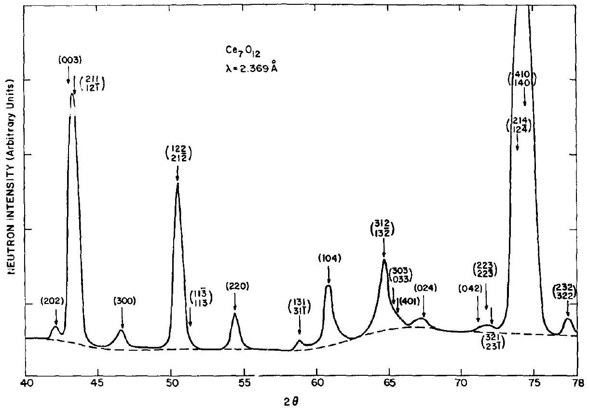
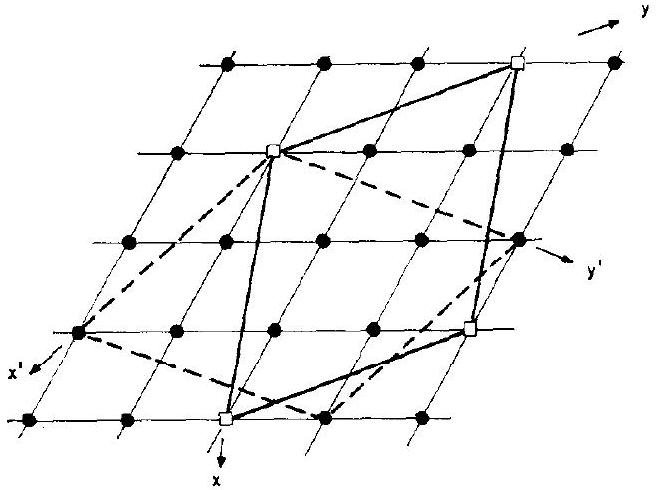
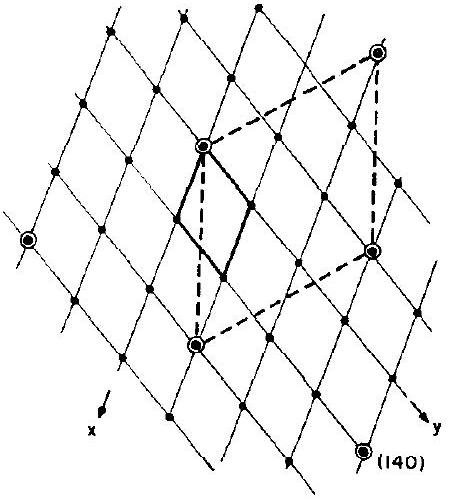
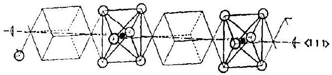

# Neutron Diffraction Determination of the Crystal Structure of $\mathbf{C e}_{7} \mathbf{O}_{12}$ 

S. P. RAY* Henry Krumb School of Mines, Columbia University, New York, New York 10027 AND D. E. $\mathrm{COX} \dagger$ Physics Department, Brookhaven National Laboratory, Upton, New York 11973

Received October 7, 1974; in revised form April 2, 1975

#### Abstract

A neutron diffraction study has been made on polycrystalline and single crystal samples of $\mathrm{CeO}_{1,714}$. The results confirm that the compound is isostructural with ternary oxides of the type $\mathrm{UY}_{6} \mathrm{O}_{12}$. The space group is $R \overline{3}$ with hexagonal unit cell dimensions $a=10.37 \AA$ and $c=9.67 \AA$ (rhombohedral cell $a=8.60 \AA$ and $\alpha=99.4^{\circ}$ ). The hexagonal unit cell contains three formula units of $\mathrm{Ce}_{7} \mathrm{O}_{12}$. Totals of 79 and 24 independent reflections from the single crystal were measured at neutron wavelengths of 1.185 and $2.37 \AA$, respectively. Simultaneous refinement of the two sets of data yielded a weighted $R$ factor of 0.144 . The structure is a rhombohedral defect type of fluorite arrangement in which pairs of oxygen vacancies are ordered along the [111] axis.

## Introduction

In the past few years, the complex phase relationships and oxygen transport properties of nonstoichiometric rare earth oxides of the type $\mathrm{RO}_{2-x}(0 \leqslant x \leqslant 0.5)$ have attracted a considerable amount of attention (1-14). The main interest has been in the oxides of $\mathrm{Ce}, \mathrm{Pr}$, and Tb , since these are capable of existing in both tri- and tetravalent ionic states. In fully oxidized $\mathrm{RO}_{2}$ these materials have the cubic fluorite type of structure, and in the reduced $\mathrm{RO}_{1.5}$ state either the $A$ or $C$ type sesquioxide structure. It has been found that for intermediate values of $x$ there exist a number of ordered

[^0]phases at low temperatures which are generally believed to form a homologous series of the type $\mathrm{R}_{n} \mathrm{O}_{2 n-2}$, where $n$ can take on a number of integer values. Thus in the $\mathrm{PrO}_{2-x}$ system, phases having $n=6,7,9,10,11$ and 12 are believed to exist (3), while in $\mathrm{TbO}_{2-x} n$ can be 7, 11, and 12(3). In the $\mathrm{CeO}_{2-x}$ system, previous studies (15) and our own unpublished work (16) have shown that phases occur in which $n$ is $6,7,9,10$, and 11 . These phases are thought to be formed by ordering of oxygen vacancies in one way or another, and at higher temperatures they transform to fluorite-type structures in which the vacancies are disordered.
A feature common to all these oxides is the remarkable ease with which oxygen transport occurs, the most striking example being the $\mathrm{CeO}_{2-x}$ system in which rapid oxidation takes place even at room temperature (17). In order to elucidate the mechanism underlying this rapid mass transport a thorough kinetic study
has been undertaken (18). However, kinetic studies by themselves are of limited value if the detailed structural relationships of the materials are not known. A structural investigation by neutron diffraction techniques has therefore been initiated.

Of the known low temperature phases, the $\mathrm{R}_{7} \mathrm{O}_{12}\left(\mathrm{RO}_{1.714}\right)$ compounds have the highest stability and are known to exist in all three of the systems mentioned above (3). They are generally assumed to have the same structure as a number of ternary oxides such as $\mathrm{UY}_{6} \mathrm{O}_{12}$ and $\mathrm{Zr}_{3} \mathrm{Sc}_{4} \mathrm{O}_{12}(19,20)$. The structure of the former has been established from a single crystal X-ray study by Bartram (19), who assigned the rhombohedral space group $\mathrm{R} \overline{3}$ and determined the atomic positions. However, no detailed crystallographic studies have been made on the corresponding binary rare earth compounds. The early X-ray powder work of Bevan (15) indicated that $\mathrm{Ce}_{7} \mathrm{O}_{12}$ had a rhombohedral cell capable of existing over the narrow composition range $\mathrm{CcO}_{1.715}^{-} \mathrm{CeO}_{1.722}$. The dimensions of the unit cell (hexagonal representation) were approximately $a_{0} / \sqrt{ } 2, a_{0} \sqrt{ } 3$, where $a_{0}$ is the pseudocubic fluorite value. Sawyer et al. (3) concluded that the true unit cell of $\mathrm{Pr}_{7} \mathrm{O}_{12}$ had the hexagonal dimensions $a_{0} \sqrt{ } 7 / \sqrt{ } 2, a_{0} \sqrt{ } 3$, as did Baenziger et al. (21) in a study of $\mathrm{Tb}_{7} \mathrm{O}_{12}$. In a recent single crystal and powder X-ray study, Anderson and Wuensch (22) have reported $\mathrm{Ce}_{7} \mathrm{O}_{12}$ to have a quite different hexagonal cell with space group $\mathrm{P6}_{3} / m m c$ and lattice parameters very roughly $a_{0} / \sqrt{ } 2$ and $2 a_{0} / \sqrt{ } 3$. However, in none of these studies were any details of the structure established.

X-ray powder diffraction techniques for the study of derivative structures or superstructures in these materials are of limited use, mainly because of the small X-ray scattering factor of oxygen. There are very few visible superlattice peaks, and the X-ray patterns typically consist of a number of fluorite-type peaks, which, however, are split, for the most part, because of the lowering of symmetry. It is impossible to establish any details of the structure from these patterns. With single crystals, on the other hand, there is the problem of minimizing surfacc oxidation of the tiny sample needed. However, neutron diffrac-
tion is much more advantageous insofar as the coherent neutron scattering amplitude of oxygen is quite large ( $0.580 \times 10^{-12} \mathrm{~cm}$ ), and also because the low absorption cross sections of cerium and oxygen permit much larger crystals to be used so that surface oxidation is not a problem. Moreover, it is easy to encapsulate the sample in a vacuum-tight quartz or aluminum holder without serious attenuation of the neutron beam.

The present paper describes the results of a detailed structural study of $\mathrm{Ce}_{7} \mathrm{O}_{12}$ powder and single crystal samples, and confirms that the compound is isostrutural with the ternary oxide $\mathrm{UY}_{6} \mathrm{O}_{12}$. It is hoped that this will help in solving some of the other intermediate structures closer to $\mathrm{CeO}_{2}$ stoichiometry, and also contribute towards establishing the mechanism responsible for the rapid low temperature oxidation.

## Experimental

## A. Sample Preparation

The starting material used was $\mathrm{CeO}_{2}$ obtained from Materials Research Corporation in the form of a pressed and sintered polycrystalline disc about 4 in . in diameter and 0.5 in . thick. Single crystals about $1 \mathrm{~cm}^{3}$ in volume were grown by the arc fusion technique. These gave sharp Laue spots but were not transparent as would be expected for a pure and perfect $\mathrm{CeO}_{2}$ crystal.

Polycrystalline samples of $\mathrm{Ce}_{7} \mathrm{O}_{12}$ were prepared by reduction of small pieces of the $\mathrm{CeO}_{2}$ compact in accordance with available thermodynamic data (14, 23). Reduction was accomplished at $1030 \pm 2^{\circ} \mathrm{C}$ in a mixture of $\mathrm{CO} / \mathrm{CO}_{2}$ in the ratio $1000: 1$, corresponding to an oxygen partial pressure of $10^{-19.6}$. The exact composition of the sample was determined to be $\mathrm{CeO}_{1.714 \pm 0.002}$ by recording the weight gain on reoxidizing a small part to $\mathrm{CeO}_{2}$. The reduced material is highly susceptible to oxidation on exposure to air even at room temperature. No detectable oxidation, however, occurs at dry ice temperatures. The reduced sample was therefore quenched in dry ice and maintained at this temperature prior to sealing in a quartz sample holder evacuated to $10^{-2} \mathrm{~mm}$ for the neutron diffrac-
tion study. The holder consisted of a thinwalled tube about 3 in . long and 0.5 in . in diameter. The sample was annealed at $425^{\circ} \mathrm{C}$ for three days in order to reduce inhomogeneities and strains.

Single crystals of $\mathrm{Ce}_{7} \mathrm{O}_{12}$ were prepared by utilizing an earlier important finding by Ban and Nowick (17), that the single crystal lattice of a $\mathrm{CeO}_{2}$ crystal is essentially retained in samples reduced as far as $\mathrm{CeO}_{1.67}$, although there is a complication introduced by the formation of domains as a result of the lowering of symmetry, which is discussed in the next section. Crystals of $\mathrm{CeO}_{2}$ were cut or cleaved to the desired orientation and shape and reduced at the same time as the powder sample. Selected specimens were analyzed as above and found to have the same composition. After annealing in a vacuum of $10^{-2} \mathrm{~mm}$, one of the crystals of $\mathrm{Ce}_{7} \mathrm{O}_{12}$ was mounted in a quartz sample holder fashioned from a piece of quartz tubing blown out to a thin-walled sphere about 1 in . in diameter. A small piece of quartz rod $\frac{1}{4} \mathrm{in}$. long and $\frac{1}{8} \mathrm{in}$. in diameter was attached inside this sphere to provide a sample pedestal. The $\mathrm{Ce}_{7} \mathrm{O}_{12}$ crystal was
glued on this pedestal and the holder evacuated to $10^{-2} \mathrm{~mm}$ and sealed.

## B. Neutron Diffraction Data Collection

Neutron diffraction experiments were carried out at the Brookhaven High Flux Beam Reactor. Pyrolytic graphite was used as the monochromator set to diffract neutrons of $2.369 \AA$ wavelength from the ( 002 ) reflection. A strong half-wavelength component is also obtained under these conditions, but this can be removed very effectively by means of a pyrolytic graphite filter (24). Data were collected at $2.369 \AA$ from both powder and crystal specimens with the filter in place, and additional data were obtained at $1.185 \AA$ from the crystal after removal of the filter. In this case, reflections of the type ( $2 h 2 k 2 l$ ) are always superimposed on ( $h k l$ ) reflections from the longer wavelength and cannot be used in the structural refinement.

## Results

## A. Powder Neutron Data

Powder neutron data were collected over a $2 \theta$ interval of $5^{\circ}$ to $95^{\circ}$. Fig. 1 shows the data

Fig. 1. Powder neutron diffraction data for $\mathrm{Ce}_{7} \mathrm{O}_{12}, \lambda=2.369 \AA$. Indexing is based on a hexagonal cell with $a=10.37 \AA$ and $c=9.67 \AA$.

Fig. 2. Two different ways of ordering oxygen vacancies within a given (111) plane of a fluorite type lattice, leading to two different hexagonal cells as shown (a) dashed (b) continuous. The oxygen vacancies lic above the corner Ce atoms of the hexagonal unit cell, e.g., above the open squares in the case of cell (b), at distances $c / 4$ and $3 c / 4$.

over part of the range ( $2 \theta=40^{\circ}-78^{\circ}$ ). There are a number of strong peaks which can be indexed on the basis of a face-centred cubic cell with an edge of $5.53 \AA$, although some of the peaks show some broadening. In addition, there are many weak peaks which can all be indexed in terms of a hexagonal cell with $a_{h}=10.37 \AA$ and $c_{h}=9.67 \AA$. These parameters correspond to the superlattice cell derived from the fluorite lattice with $a_{h} \simeq a(\sqrt{ } 7 / \sqrt{ } 2)$ and $c_{h} \simeq a \sqrt{ } 3$ (Fig. 2), and are similar to those of $\mathrm{UY}_{6} \mathrm{O}_{12}$. The ratio $a_{h}: c_{h}$ is close to the "ideal" value of 1.0801 . Furthermore, inspection of the indices of the observed reflections immediately reveals that the true symmetry is rhombohedral.

## B. Single Crystal Neutron Data and Domain Structure

The single crystal data were completcly consistent with the above unit cell, but data analysis was complicated by the domain structure of the crystal caused by twinning. In an order-disorder transition involing a lowering of symmetry from cubic to the trigonal arrangement in Fig. 2, there are eight possible independent domains. Each of the four equivalent cubic [111] directions may become the unique axis of the trigonal cell, and in
addition there are two different ways of ordering the oxygen vacancies within a given (111) plane (Fig. 2). The transformation matrices for each of the eight domains may be chosen as follows, with the primed and unprimed members of each pair representing the two possible domains within a given basal plane.

$$
\begin{array}{llll}
1 & {\left[1, \frac{1}{2}, \frac{\overline{3}}{2} ;\right.} & \frac{\overline{3}}{2}, 1, \frac{1}{2} ; & 1,1,1] \\
1^{\prime} & {\left[\frac{3}{2}, \frac{\overline{1}}{2}, \overline{1} ;\right.} & \overline{1}, \frac{3}{2}, \frac{\overline{1}}{2} ; & 1,1,1] \\
2 & {\left[\frac{\overline{1}}{2}, 1, \frac{\overline{3}}{2} ;\right.} & \overline{1}, \frac{\overline{3}}{2}, \frac{1}{2} ; & \overline{1}, 1,1] \\
2^{\prime} & {\left[\frac{1}{2}, \frac{3}{2}, \overline{1} ;\right.} & \frac{\overline{3}}{2}, \overline{1}, \frac{\overline{1}}{2} ; & 1,1,1] \\
3 & {\left[\frac{1}{2}, 1, \frac{3}{2} ;\right.} & 1, \frac{\overline{3}}{2}, \frac{\overline{1}}{2} ; & 1,1, \overline{1}] \\
3^{\prime} & {\left[\frac{\overline{1}}{2}, \frac{3}{2}, 1 ;\right.} & \frac{3}{2}, \overline{1}, \frac{1}{2} ; & 1,1, \overline{1}] \\
4 & {\left[\frac{1}{2}, \overline{1}, \frac{\overline{3}}{2} ;\right.} & 1, \frac{3}{2}, \frac{1}{2} ; & 1, \overline{1}, 1] \\
4^{\prime} & {\left[\frac{\overline{1}}{2}, \frac{\overline{3}}{2}, \overline{1} ;\right.} & \frac{3}{2}, 1, \frac{\overline{1}}{2} ; & 1, \overline{1}, 1]
\end{array}
$$

Each domain will give rise to an independent set of reciprocal lattice points except at the "pseudocubic" positions which are fundamental to the basic fluorite lattice. At each of these there is overlap from all the other domains and the observed intensity will be a composite of several reflections weighted according to the domain population. At the "superlattice" points, on the other hand, the intensities are simply proportional to the volume fraction of that particular domain. The situation is shown schematically in Fig. 3. The indices of the various reflections contributing to the strong pseudocubic peaks can be determined from the transformation matrices given above and the corresponding inverse ones. For example, the trigonal (140) reflection from domain $3^{\prime}$ corresponds to the (202) pseudocubic peak. This in turn transforms to (154) and (154) in domains 1 and $1^{\prime}$, to (410) and (140) in 2 and $2^{\prime}$, to (410) in 3, and to

Fig. 3. The reciprocal lattice net of $\mathrm{Ce}_{7} \mathrm{O}_{12}$ for a particular domain. There are a number of pseudocubic positions fundamental to the basic fluorite cell (shown as circled points), and the observed intensity at these points will include contributions from all the other domains. The remaining points are the superlattice reflections.

( $\overline{2} 34$ ) and ( $\overline{3} 24$ ) in 4 and $4^{\prime}$. Thus, the overall intensity is proportional to

$$
\begin{aligned}
& I_{(140)} \propto V_{1} F_{(124)}^{2}+V_{1^{\prime}} F_{(134)}^{2}+V_{2} F_{(410)}^{2} \\
& \quad+V_{2^{\prime}} F_{(140)}^{2}+V_{3} F_{(410)}^{2}+V_{3^{\prime}} F_{(140)}^{2} \\
& \quad+V_{4} F_{(234)}^{2}+V_{4^{\prime}} F_{(324)}^{2}
\end{aligned}
$$

where the $V_{i}$ 's are volume fractions and $F$ represents the structure factor.
The domain distribution in the crystal was determined by orienting the crystal along each of the pseudocubic [111] directions in turn and measuring the intensity of the equivalent trigonal (220) peaks in each of the two possible basal plane settings. This is a relatively strong superlattice reflection, and agreement between the intensities of equivalent reflections [i.e., ( $\overline{4} 20$ ) and ( $\overline{2} 40$ )] is within $10 \%$ (Table I). The volume fractions of each domain determined from the averaged intensities are also listed in Table I, and it can be seen that the domain labeled $3^{\prime}$ predominates, accounting for about three fifths of the volume of the crystal. Unequal domain populations of this sort are not unusual, as, for example, in NiO (25) and MnAs (26), both of which undergo structural transitions involving a lowering of the symmetry.
Data were collected from domain $3^{\prime}$ in three zones; ( $h k 0$ ), ( $h 0 l$ ), and ( $h h l$ ). Two or more

Table I
Volume Fraction of Material in Each Domain of $\mathrm{Ce}_{7} \mathrm{O}_{12}$ Crystal
| Domain |  | Observed relative intensities |  |  | Fraction of Material in the domain |
| :--- | :--- | :--- | :--- | :--- | :--- |
|  |  | (2240) | (4220) | ( $\overline{2} 4 \overline{2} 0$ ) | ( $V$ ) |
| 1 | [111] | 49 | 51 | 46 | 0.02 |
| $1^{\prime}$ | [111] | 0 | 0 | 0 | 0.00 |
| 2 | [111] | 94 | 97 | 91 | 0.04 |
| 2' | [111] | 326 | 345 | 332 | 0.13 |
| 3 | [11̄̄] | 317 | 331 | 312 | 0.12 |
| 3' | [111] | 1743 | 1612 | 1525 | 0.61 |
| 4 | [111] | 120 | 127 | 119 | 0.05 |
| $4^{\prime}$ | [11̄1] | 118 | 114 | 113 | 0.04 |

equivalent reflections were measured in most cases, and intensity agreement was generally within $5-10 \%$. The observations were assigned errors in this range, or according to the counting statistics, whichever was larger. The total number of inequivalent reflections measured was 79 at $1.185 \AA$ and 24 at $2.37 \AA$, of which 10 and 3 , repectively, were strong fluorite-type reflections.

## Crystal Structure Refinement

The space group $R \overline{3}$ was assumed with atoms in the equivalent positions determined for $\mathrm{UY}_{6} \mathrm{O}_{12}$ (19). The hexagonal unit cell contains three formula units of $\mathrm{Ce}_{7} \mathrm{O}_{12}$, with 3 Ce in the 3 (a) positions at $0,0,0$, and the remaining 18 Ce and two sets of inequivalent oxygens in the $18(f)$ positions at $x, y, z$. The single crystal data were refined with the aid of a computer by the method of least-squares comparison of observed and calculated $F^{2}$ with initial values of the parameters set equal to those of $\mathrm{UY}_{6} \mathrm{O}_{12}$ (19). Individual isotropic temperature factors B were assumed. Four scaling constants were also needed; one for each of the three zones, and one to scale the $1.185 \AA$ and $2.37 \AA$ neutron data to each other. Allowance was made at first for an extinction correction, but at no stage did this result in any significant improvement, and the extinction coefficient
was therefore set equal to zero in the later stages. In the final cycles of refinement a disorder parameter $f$ was also introduced to allow for the possibility of some fraction of the oxygen being in the $6(c)$ "vacancy" sites at ( $0,0, z ; z=0.25$ ). Complete disorder (defined as $f=1$ ) would correspond to $86 \%$ occupancy of these sites, or about 5 oxygens. This disorder parameter and the temperature factors were initially set to zero. The total number of variable parameters was 14 .

The final values of the parameters obtained after the refinement converged are given in Table II. These figures were also obtained if the starting parameters were assigned the ideal fluorite values, or the values for $\mathrm{Zr}_{3} \mathrm{Sc}_{4} \mathrm{O}_{12}$ listed by Thornber et al. (20). Standard errors and the ideal fluorite positions are listed in the table. The discrepancy factor $R=\left(\sum \mid I_{\text {obs }}\right.$ $\left.I_{\text {calc }} \mid / \sum I_{\text {obs }}\right)$ was 0.085 , and the weighted discrepancy $R$ factor $R_{w}=\left(\sum w\left(I_{\text {obs }}-I_{\text {cal c }}\right)^{2} /\right. \left.\sum w I_{\mathrm{obs}}{ }^{2}\right)^{1 / 2}$, where $w$ is $1 / \sigma_{I_{\text {obs }}}$, was 0.14 . Observed and calculated intensities are listed in Table III. The results in Table II indicate a small amount of disorder amounting to about one fifth of any oxygen atom per unit cell in the 6(c) sites. The improvement in the weighted $R$ factor obtained by including this disorder parameter is significant at about the $95 \%$ level of confidence (27). Attempts to refine the variable $z$ parameter and temperature factor of this small fraction of the oxygen resulted in rather large correlations and little further improvement.

An attempt was made to analyze the powder neutron data using the results of the single crystal refinement. In this case there is no domain problem, of course, but the data are too few to provide a completely independent check. A total of 20 peaks could be resolved, and a least-squares refinement was carried out with the program suitably modified to allow for overlapping peaks and the appropriate powder multiplicities. Initially, the disorder parameter was set equal to zero, the other parameters were held fixed at their single crystal values, and only the instrumental scale factor was allowed to vary. The intensity agreement was surprisingly poor ( $R_{w}=0.33$ ), but some improvement was gained by allowing the positional parameters to vary ( $R_{w}=0.18$ ).

TABLE II
Final Parameter Values and Errors from Least-Squares Refinement of $\mathrm{Ce}_{7} \mathrm{O}_{12}$ Single Crystal Data ${ }^{a, b}$

| Atom | Position | $x$ | $\sigma(x)$ | Fluorite (x) | $y$ | $\sigma(y)$ | Fluorite ( $y$ ) | $z$ | $\sigma(z)$ | Fluorite (z) | $B(\AA)^{2}$ | $\sigma(B)$ |
| :--- | :--- | :--- | :--- | :--- | :--- | :--- | :--- | :--- | :--- | :--- | :--- | :--- |
| $\mathrm{Ce}(1)$ | 18(f) | 0.4135 | 0.0003 | 0.4285 | 0.1258 | 0.0004 | 0.1428 | -0.0134 | 0.0003 | -0.25 | 0.57 | 0.11 |
| $\mathrm{Ce}(2)$ | 3(a) | 0.0 | - | 0.0 | 0.0 | - | 0.0 | 0.0 | - | 0.0 | 0.67 | 0.15 |
| O(1) | 18(f) | 0.4445 | 0.0004 | 0.4285 | 0.1473 | 0.0003 | 0.1428 | -0.2685 | 0.0004 | -0.25 | 1.38 | 0.12 |
| O(2) | 18(f) | 0.4572 | 0.0005 | 0.4285 | 0.1629 | 0.0003 | 0.1428 | -0.7716 | 0.0004 | -0.75 | 1.19 | 0.12 |
| O(3) | 3 (b) | 0.0 | - | 0.0 | 0.0 | - | 0.0 | -0.25 | - | -0.25 | 0.0 | - |

[^1]However, satisfactory agreement was obtained only by relaxing the constraint on the disorder parameter ( $R_{w}=0.07$ ). In all these refinements
the temperature factors were fixed at their single crystal values. In addition, the refinements would not converge if the $y$ parameters

TABLE III
Comparison of Observed and Calculated Intensities from Single Crystal $\mathrm{Ce}_{7} \mathrm{O}_{12}{ }^{a, b} \lambda=1.185 \AA$
| $h k 0$ | $\boldsymbol{I}_{\text {calc }}$ | $I_{\text {obs }}$ | hol | $I_{\text {calc }}$ | $I_{\text {obs }}$ |
| :--- | :--- | :--- | :--- | :--- | :--- |
| 110 | 57 | 45 | 101 | 4 | 4 |
| 300 | 159 | 144 | 102 | 116 | 109 |
| 410 | 7 | 8 | 201 | 16 | 17 |
| 330 | 85 | 91 | 300 | 165 | 147 |
| 250 | 21 | 24 | 104 | 736 | 697 |
| 520 | 119 | 129 | 303 | 82 | 81 |
| 170 | 12 | 20 | 303 | 3 | 9 |
| 710 | 214 | 215 | 105 | 11 | 19 |
| 360 | 187 | 186 | 501 | 11 | 13 |
| 550 | 10 | 11 | 205 | 34 | 33 |
| 900 | 9 | 9 | 502 | 28 | 30 |
| 740 | 132 | 144 | 405 | 51 | 58 |
| 470 | 98 | 108 | 504 | 655 | 694 |
| 140 , etc. ${ }^{\text {c }}$ | 8033 | 9163 | 306 | 388 | 353 |
| 630 , etc. ${ }^{c}$ | 2569 | 2782 | 306 | 6 | 5 |
| hhl | $I_{\text {calc }}$ | $I_{\text {obs }}$ | 603 | 39 | 42 |
|  |  |  | 603 | 23 | 29 |
| 110 | 60 | 56 | 107 | 3 | 1 |
| 113 | 3 | 3 | 505 | 5 | 8 |
| 113 | 18 | 19 | 207 | 28 | 38 |
| 223 | 28 | 35 | 108 | 282 | 322 |
| 223 | 3 | 2 | 407 | 63 | 48 |
| 330 | 89 | 93 | 801 | 0 | 2 |
| 116 | 37 | 29 | 507 | 2 | <1 |
| 116 | 53 | 56 | 309 | 14 | 24 |
| 333 | 5 | 7 | 309 | 26 | 32 |
| $33 \frac{7}{3}$ | 29 | 26 | 900 | 9 | 13 |
| 443 | 24 | 30 | 508 | 189 | 226 |
| 443 | 50 | 48 | 805 | 24 | 28 |
| 336 | 97 | 113 | 1, 0, 10 | 171 | 144 |
| 336 | 46 | 41 | 903 | 51 | 39 |
| 119 | 68 | 67 | 903 | 4 | 7 |
| 119 | 41 | 42 | 10, 0, 1 | 62 | 57 |
| 550 | 10 | 13 | 807 | 48 | 44 |
| 553 | 1 | 1 | 609 | 104 | 87 |
| 553 | 21 | 18 | 609 | 55 | 59 |
| 229 | 13 | 20 | 003 , etc. ${ }^{\text {c }}$ | 1715 | 1692 |
| 229 | 15 | 19 | 701, etc. ${ }^{\text {c }}$ | 577 | 588 |
| 339 | 29 | 30 | 702, etc. ${ }^{c}$ | 166 | 205 |
| 339 | 49 | 48 | 704, etc ${ }^{c}$ | 2546 | 2652 |
| 556 | 140 | 151 | 009, etc. ${ }^{\text {c }}$ | 387 | 419 |
| 556 | 1 | 4 | 705, etc. ${ }^{c}$ | 323 | 360 |
| 003 , etc. ${ }^{\text {c }}$ | 1728 | 1668 | 707 , etc. ${ }^{\text {c }}$ | 328 | 298 |
| 009 , etc. ${ }^{\text {c }}$ | 433 | 416 | 708 , etc. ${ }^{\text {c }}$ | 1052 | 1210 |

$$
\lambda=2.37 \AA
$$

TABLE III (continued)
|  |  |  | hol | $\boldsymbol{I}_{\text {calc }}$ | $I_{\text {obs }}$ |
| :--- | :--- | :--- | :--- | :--- | :--- |
| $h k 0$ | $\boldsymbol{I}_{\text {calc }}$ | $I_{\text {obs }}$ |  |  |  |
| 110 | 281 | 281 | 101 | 21 | 20 |
| 300 | 811 | 755 | 102 | 572 | 608 |
| 220 | 1698 | 1738 | 202 | 784 | 737 |
| 330 | 524 | 474 | 104 | 3956 | 3770 |
| 140 , etc. ${ }^{\text {c }}$ | 46024 | 42983 | 401 | 356 | 375 |
| hhl |  |  | 303 | 447 | 470 |
|  | $I_{\text {calc }}$ | $I_{\text {obs }}$ | 303 | 18 | 24 |
| 110 | 295 | 288 | 204 | 262 | 232 |
| 113 | 15 | 21 | 402 | 306 | 326 |
| $11 \overline{3}$ | 93 | 92 | 105 | 66 | 69 |
| 220 | 1784 | 1771 |  |  |  |
| 223 | 161 | 179 |  |  |  |
| 223 | 14 | 24 | 205 | 206 | 182 |
| 330 | 550 | 493 | 502 | 180 | 163 |
| 003 , etc ${ }^{c}$ | 8751 | 9079 | 003 , etc. ${ }^{c}$ | 8688 | 8695 |
| 006 , etc. ${ }^{c}$ | 1982 | 1487 | 006 , etc. ${ }^{c}$ | 1968 | 1520 |

${ }^{a}$ Parameters as in Table II.
${ }^{\mathrm{b}} R$ factor 0.071 ; weighted $R$ factor 0.144 .
${ }^{\mathrm{c}}$ Includes contributions from other domains.
of $0(1)$ and $0(2)$ were both varied. Therefore, the latter was given a succession of fixed values and a minimum $R_{w}$ obtained graphically. The final parameter values are given in Table IV, and the observed and calculated intensities are listed in Table V.
Comparison of the two sets of figures in Tables II and IV reveals that the positional parameters generally agree to within two
standard deviations. Such differences cannot be considered significant in view of the limited amount of powder data. However, the disorder parameter is significantly higher in the powder, amounting to roughly $35 \%$ disorder, or almost two oxygens per unit cell in the 6(c) sites.

This is a rather surprising result since the two samples were given similar heat treat-

TABLE IV
Finat. Parameter Values and Errors from Least-Squares Refinement of $\mathrm{Ce}_{7} \mathrm{O}_{12}$ Powder Data ${ }^{a, b}$
| Atom | Position | $x$ | $\sigma(x)$ | Fluorite ( $x$ ) | $y$ | $\sigma(y)$ | Fluorite (y) | $z$ | $\sigma(z)$ | Fluorite (z). |
| :--- | :--- | :--- | :--- | :--- | :--- | :--- | :--- | :--- | :--- | :--- |
| $\mathrm{Ce}(1)$ | 18(f) | 0.418 | 0.002 | 0.4285 | 0.134 | 0.003 | 0.1428 | -0.011 | 0.003 | 0.0 |
| $\mathrm{Ce}(2)$ | 3(a) | 0.0 | 0.0 | 0.0 | 0.0 | 0.0 | 0.0 | 0.0 | 0.0 | 0.0 |
| O(1) | 18(f) | 0.449 | 0.004 | 0.4285 | 0.154 | 0.005 | 0.1428 | -0.269 | 0.007 | 0.25 |
| O(2) | 18(f) | 0.451 | 0.004 | 0.4285 | 0.150 | 0.005 | 0.1428 | -0.765 | -0.006 | 0.75 |
| O(3) | 3(b) | 0.0 | 0.0 | 0.0 | 0.0 | 0.0 | 0.0 | -0.2500 | 0.0 | 0.75 |

[^2]TABLE V
Comparison of Observed and Calculated Intensities from Polycrystalline $\mathrm{Ce}_{7} \mathrm{O}_{12}{ }^{a, b}$
| hkl | $I_{\text {calc }}$ | $I_{\text {obs }}$ |
| :--- | :--- | :--- |
| 101 | 0 | <1 |
| 110 | 6 | 28 |
| 012 | 28 | 21 |
| 021 | 2 | 5 |
| 202 | 18 | 19 |
| 003, 211, 12 I | 603 | 585 |
| 300 | 39 | 39 |
| $122,21 \overline{2}, 113,11 \overline{3}$ | 376 | 392 |
| 220 | 70 | 69 |
| 131, 311 | 9 | 9 |
| 104 | 140 | 136 |
| $312,132,033,303,401$ | 177 | 193 |
| 024 | 18 | 23 |
| $042,223,223$, 23 ì, 321 | 18 | 13 |
| $410,140,214,12 \overline{4}$ | 2919 | 2769 |
| 232, 322,015 | 38 | 41 |
| 205 | 1 | 1 |
| 051 | 0 | 2 |
| $314,134,330$ | 22 | 19 |
| $413,502,41 \overline{3}, 143,404$, | 618 | 618 |
| 241, 14 3, 42 I, 125, 215 |  |  |

${ }^{a}$ Atomic positional parameters as in Table IV; temperature factors as in Table II.
${ }^{b} \mathrm{R}$ factor 0.052 ; weighted R factor 0.071 .
ments, but it also can be seen in a qualitative way by comparison of the two sets of data given in Table VI. The latter shows the ratios of the observed values of $F^{2}$ for powder and crystal derived from the intensity data in Tables III and V with the assumption that the different hexagonal reflections contributing to the strong pseudocubic (111) and (220) peaks have the structure factor relationships required for face-centered cubic symmetry. For domain $3^{\prime}$, for example, these relationships would be $F^{2}\{003\}=F^{2}\{211\}, F^{2}\{12 \overline{1}\}=0$; $F^{2}\{140\}=F^{2}\{214\}, F^{2}\{410\}=F^{2}\{124\}=0$. The calculated values obtained in the least-squares refinement show that this is a reasonable enough approximation. The ratios should all be the same, of course, since they merely reflect an instrumental scaling constant, but it can clearly be seen that there are two sets of values, one for the superlattice peaks averaging about 0.002 , and another of about 0.003 for the strong peaks. (The similarity between the values for the two strong peaks also provides independent confirmation of the absence of extinction effects in the crystal.) Thus the superlattice peaks are relatively noticeably weaker in the powder. If the $F_{o b s}^{2}$ ratio for the strong peaks is normalized to unity, that for

TABLE VI
Comparison of Observed Structure Factors for Selected Superlattice and Fundamental Reflections from Powder and Single Crystal Samples of $\mathrm{Ce}_{7} \mathrm{O}_{12}{ }^{a}$
| $h k l$ (hexagonal) | hkl (cubic) | $j$ | Powder |  | Crystal |  | $F_{\text {obs }}^{2}$ ratio |
| :--- | :--- | :--- | :--- | :--- | :--- | :--- | :--- |
|  |  |  | $I_{\text {obs }}$ | $F_{\text {obs }}^{2}$ | $I_{\text {obs }}$ | $F_{\text {obs }}^{2}$ |  |
| 300 | - | 6 | 39 | 1.9 | 755 | 899 | 0.0021 |
| 220 | - | 6 | 69 | 4.3 | 1771 | 2358 | 0.0018 |
| 104 | - | 6 | 136 | 10.0 | 3770 | 5398 | 0.0019 |
| $\left.\begin{array}{lll}0 & 0 & 3 \\ 2 & 1 & 1 \\ 1 & 2 & 1\end{array}\right\}$ | 111 | 8 | 585 | 18.6 | 8887 | 6070 | 0.0031 |
| $\left.\begin{array}{lll}4 & 1 & 0 \\ 1 & 4 & 0 \\ 2 & 1 & 4 \\ 1 & 2 & 4\end{array}\right\}$ | 220 | 12 | 2769 | 134.3 | 42983 | 41390 | 0.0032 |

[^3]the superlattice peaks is expected to be given very approximately by the ratio $\left(1-f_{p}\right)^{2} / \left(1-f_{c}\right)^{2}$, where $f_{p}$ and $f_{c}$ are the respective disorder parameters in powder and crystal samples. Since $f_{c}$ is about $4 \%, f_{p}$ determined in this way is about $25 \%$.

## Discussion

The structure determined for $\mathrm{Ce}_{7} \mathrm{O}_{12}$ confirms the basic similarity of this material to the ternary oxides studied by Bartram (19), and the unit cell agrees with those reported for $\mathrm{Pr}_{7} \mathrm{O}_{12}$ (28) and $\mathrm{Tb}_{7} \mathrm{O}_{12}$ (2l) in which $a_{h} \simeq a_{0} \sqrt{ } 7 / \sqrt{ } 2$ and $c_{h} \simeq a_{0} \sqrt{ } 3$. However, it is in striking disagreement with that proposed by Anderson and Wuensch for $\mathrm{Ce}_{7} \mathrm{O}_{12}$ (22), although in the latter study, the compositions of the samples were not determined.

Table VII lists some bond lengths determined from the single crystal parameters given in Table II. These show quite similar trends to

## TABLE VII

Bond Lengths in $\mathrm{Ce}_{7} \mathrm{O}_{12}{ }^{\text {a }}$
| Polyhedron around $\mathrm{Ce}(2)$ in $3(a)$ positions |  |
| :---: | :---: |
| $\mathrm{Ce}(2)-\mathrm{O}(2)$ | $2.243(4)$ |
| $\mathrm{Ce}(2)-\square$ | $2.418(1)$ |
| $\mathrm{O}(2)-\mathrm{O}(2)$ | $2.850(5)$ |
| $\mathrm{O}(2)-\square$ | $2.444(4)$ |

Polyhedron around $\mathrm{Ce}(1)$ in $18(\mathrm{f})$ positions
| $\mathrm{Ce}(1)-\mathrm{O}(1)$ | $2.315(4)$ |
| :--- | :--- |
| $\mathrm{Ce}(1)-\mathrm{O}\left(1^{\prime}\right)$ | $2.383(4)$ |
| $\mathrm{Ce}(1)-\mathrm{O}\left(1^{\prime \prime}\right)$ | $2.387(4)$ |
| $\mathrm{Ce}(1)-\mathrm{O}\left(1^{\prime \prime}\right)$ | $2.483(4)$ |
| $\mathrm{Ce}(1)-\mathrm{O}(2)$ | $2.376(4)$ |
| $\mathrm{Ce}(1)-\mathrm{O}\left(2^{\prime}\right)$ | $2.642(4)$ |
| $\mathrm{Ce}(1)-\mathrm{O}\left(2^{\prime \prime}\right)$ | $2.398(4)$ |
| $\mathrm{Ce}(1)-\square$ | $2.598(4)$ |
| $\mathrm{O}(1)-\mathrm{O}\left(1^{\prime}\right)$ | $2.909(5)$ |
| $\mathrm{O}(1)-\mathrm{O}\left(1^{\prime \prime}\right)$ | $2.824(7)$ |
| $\mathrm{O}(1)-\mathrm{O}(2)$ | $2.970(5)$ |
| $\mathrm{O}(1)-\mathrm{O}\left(2^{\prime}\right)$ | $3.010(4)$ |
| $\mathrm{O}(2)-\mathrm{O}\left(2^{\prime \prime}\right)$ | $2.869(7)$ |
| $\mathrm{O}(1)-\square$ | $2.576(4)$ |

[^4]those observed in the isostructural ternary compounds (19, 20), but the magnitudes of the deviations from ideal fluorite coordination are considerably less in $\mathrm{Ce}_{7} \mathrm{O}_{12}$. The oxygenoxygen close-neighbor distances range between quite narrow limits, $2.82-3.01 \AA$, with an average value of $2.92 \AA$. The $\mathrm{Ce}(1)-\mathrm{O}$ and $\mathrm{Ce}(2)-\mathrm{O}$ average distances are 2.43 and $2.24 \AA$, respectively. The corresponding values in $\mathrm{CeO}_{2}$ are $2.71 \AA$ for the oxygen separation, and $2.34 \AA$ for $\mathrm{Ce}-\mathrm{O}$. As suggested by Bartram, the coordination about the threefold positions strongly indicates that the smaller $\mathrm{Ce}^{4+}$ ions are located in these sites, with the $\mathrm{Ce}^{3+}$ and remaining $\mathrm{Ce}^{4+}$ ions distributed randomly in the $18(f)$ positions. Examination of the bond lengths about the defect sites reveals that relative to the ideal fluorite structure, the surrounding oxygens are displaced towards the vacancies as would be expected, the average oxygen vacancy distance being $2.51 \AA$.

The idealized structure of $\mathrm{Ce}_{7} \mathrm{O}_{12}$ may be considered to be derived from $\mathrm{CeO}_{2}$ by placing strings of oxygen vacancies (3) along the $\langle 111\rangle$ directions of the parent fluorite lattice, in such a way that one seventh of the cations lie in the strings and have six-fold coordination with oxygen, and the remaining six sevenths are nearest neighbors and are therefore sevencoordinated (see Fig. 4). Alternately, the structure can be viewed as consisting of blocks of units comprising one 6 - and six 7 -coordinated cations (20). The blocks are all oriented parallel to the three-fold axis in each domain. The question of whether either of these structural units is common to the other proposed $\mathrm{R}_{n} \mathrm{O}_{2 n-2}$ phases (e.g., $\mathrm{Ce}_{9} \mathrm{O}_{16}$, $\mathrm{Ce}_{11} \mathrm{O}_{20}$ ) is considered in the following paper (16), where these intermediate phases are studied.

The origin of the differing amounts of disorder in the crystal and powder is not understood. It does not seem unreasonable that a small amount of disorder might be frozen into the material on cooling, but such a large difference is quite unexpected. It may be that true equilibrium is very difficult to achieve in these materials. The high orderdisorder transition temperature for $\mathrm{Ce}_{7} \mathrm{O}_{12}$, $\sim 1000^{\circ} \mathrm{C}$, suggests that the single crystal data

Fig. 4. A string of oxygen vacancies along [111] of the original fluorite structure. The small circle represents cerium and the larger circles, oxygen. Note the pairs of oxygen vacancies on opposite sides of the cerium atoms. (From Hyde and Eyring (1)).

reflect more nearly the equilibrium situation. Another possibility is the presence of substantial amounts of disorder associated with the domain boundaries, which could conceivably be different for powder and crystal. However, this would presumably be reflected in noticeable line broadening, which was not observed.

## Acknowledgments

The authors are grateful to Professor A. S. Nowick for his continued interest and for numerous discussions of this work.

## References

1. B. G. Hyde and L. Eyring, "Rare Earth Research III," (L. Eyring, Ed.), p. 623, Gordon and Breach, New York (1965).
2. B. G. Hyde, D. J. M. Bevan, and L. Eyring, "Rare Earth Research II," (K. S. Vorres, Ed.), p. 277, Gordon and Breach, New York (1964).
3. J. O. Sawyer, B. G. Hyde, and L. Eyring, Bull. Soc. Chim. France, 1190 (1965).
4. L. Eyring and B. Holmberg, Advan. Chem. Ser. 39, 46 (1963).
5. N. C. Baenziger, E. Schuldt, and L. Eyring, J. Amer. Chem. Soc. 86, 2219 (1961).
6. B. Iwasaki and T. Katsura, Bull. Chem. Soc. Japan 44, 1297 (1971).
7. B. G. Hyde, D. J. M. Bevan, and L. Eyring, Phil. Trans. Roy. Soc. London, Ser. A 259, 583 (1966).
8. G. Brauer and K. A. Gingerich, J. Inorg. Nucl. Chem. 16, 87 (1960).
9. B. C. H. Steele and J. M. Floyd, Proc. Brit. Ceram. Soc., No. 19, 55 (1971).
10. G. Weber and L. Eyring, "Advances in Chemical Physics," (J. Hirschfelder and D. Henderson, Eds.), Vol. 21, p. 253, John Wiley and Sons, New York (1971).
11. B. G. Hyde, E. E. Garver, V. E. Kuntz, and L. Eyring, J. Phys. Chem. 69, 5 (1965).
12. V. E. Kuntz and L. Eyring, "Kinetics of High Temperature Processes," (W. D. Kingery, Ed.), p. 50, John Wiley and Sons, New York (1959).
13. G. Brauer, K. A. Gingerich, and U. Holtschmidt, J. Inorg. Nucl. Chem. 16, 77 (1960).
14. D. J. M. Bevan and J. Kordis, J. Inorg. Nucl. Chem. 26, 1509 (1964).
15. D. J. M. Bevan, J. Inorg. Nucl. Chem. 1, 49 (1955).
16. S. P. Ray, A. S. Nowick and D. E. Cox, J. Solid State Chem. 15, 344 (1975).
17. Y. Ban and A. S. Nowick, Proc. 5th Materials Res. Symp., Nat. Bur. Stand. Spec. Publ. 364, 353 (1972).
18. S. P. Ray and A. S. Nowick, in "Mass Transport Phenomena in Ceramics" (A. R. Cooper and A. H Heuer, Eds.), Plenum Press, New York (1975), p. 187.
19. S. F. Bartram, Inorg. Chem. 5, 749 (1966).
20. M. R. Thornber, D.J. M. Bevan, and J. Graham, Acta Crystallogr. B24, 1183 (1968).
21. N. C. Baenziger, H. A. Eick, H. S. Schuldt, and L. Eyring, J. Amer. Chem. Soc. 83, 2219 (1961).
22. H. T. Anderson and B. J. Wuensch, "Fast Ion Transport in Solids," (W. Van Gool., Ed.), p. 284, North-Holland, Amsterdam (1973).
23. B. Iwasaki and T. Katsura, Bull. Chem. Soc. Japan 44, 1297 (1971).
24. G. Shirane and V. J. Minkiewicz, Nucl. Instrum. Methods 89, 109 (1970).
25. H. A. Alperin, J. Appl. Phys. 31, 3545 (1960).
26. R. H. Wilson and J. H. Kasper, Acta Crystallogr. 17, 95 (1964).
27. W. C. Hamilton, Acta Crystallogr. 18, 502 (1965).
28. R. B. Von Dreele, L. Eyring, A. L. Bowman, and J. L. Yarnell, to be published.

[^0]:    * Work performed under the auspices of the National Science Foundation and Advanced Research Projects Agency. Present address: Department of Material Sciences, Pennsylvania State University, University Park, Pennsylvania 16802.
    † Work performed under the auspices of the U.S. Energy Research and Development Administration.

[^1]:    ${ }^{a}$ The "ideal" fluorite positions are listed for comparison.
    ${ }^{b} \mathbf{f}($ defect $)=0.037 \pm 0.015$ (see text).

[^2]:    ${ }^{a}$ Temperature factors held fixed at values listed in Table II. The "ideal" fluorite positions are listed for comparison.
    ${ }^{b} f($ defect $)=0.36 \pm 0.05$.

[^3]:    ${ }^{a}$ Neutron wavelength $2.37 \AA . F_{\text {obs }}^{2}($ powder $)=I_{\text {obs }} \sin \theta \sin 2 \theta / j ; F_{\text {obs }}^{2}($ crystal $)=I_{\text {obs }} \sin 2 \theta / \sum V_{i}$ calculated on the basis of ideal hexagonal-cubic relationships, i.e., for domain $3^{\prime}$, these would be $F^{2}(003)=F^{2}(211), F^{2}(12 \overline{1})=0$; $F^{2}(140)=F^{2}(124), F^{2}(410)=F^{2}(214)=0$; for the other domains, the relationships would be governed by the choice of matrices. The $V_{i}^{\prime}$ s are those given in Table I and are summed over all domains contributing to a given reflection.

[^4]:    a Values are in $\AA$, with numbers in parentheses denoting standard error referred to last significant digit.

