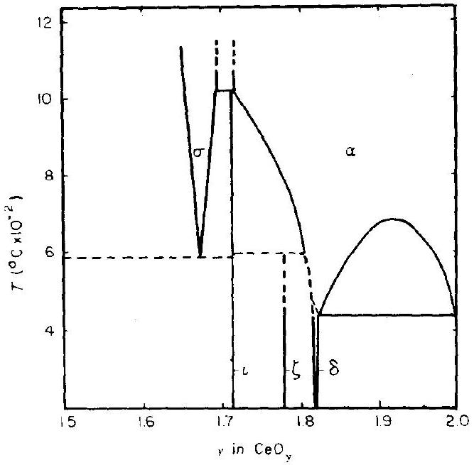
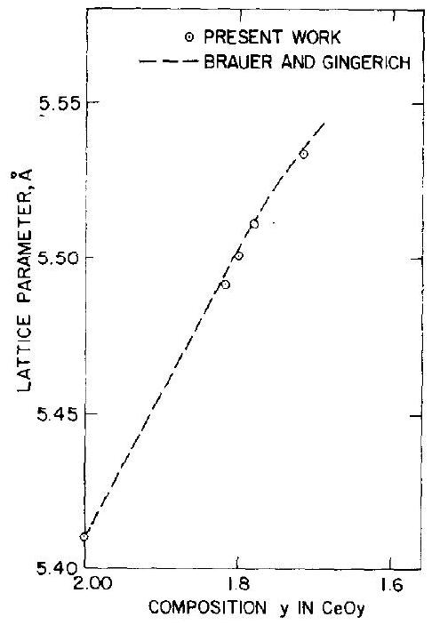
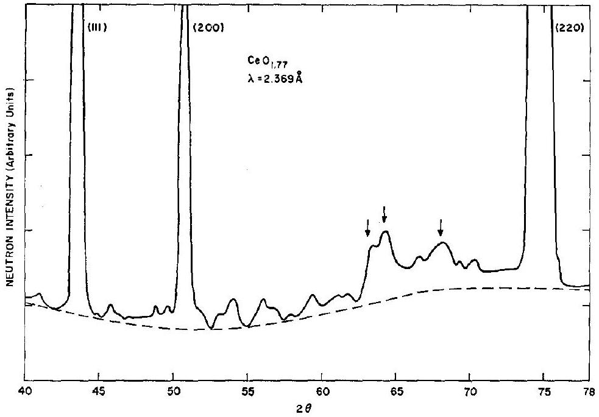
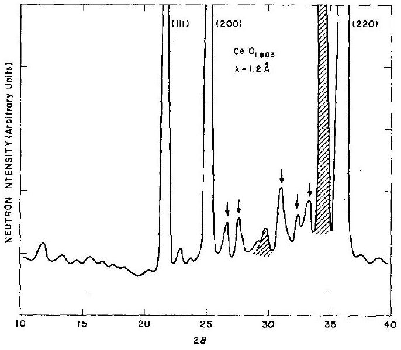
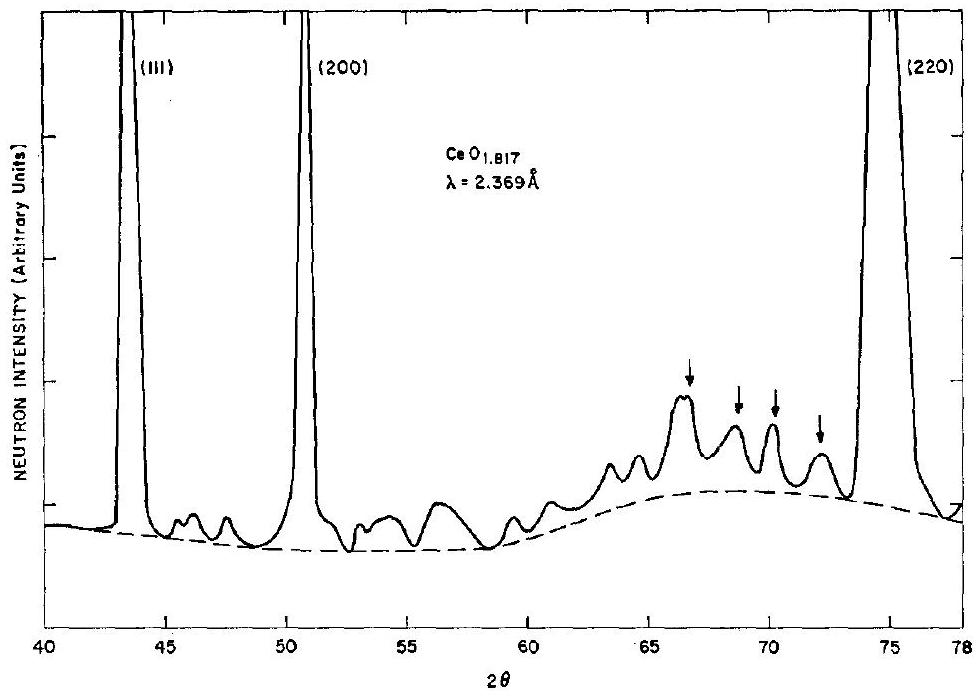

# X-Ray and Neutron Diffraction Study of Intermediate Phases in Nonstoichiometric Cerium Dioxide 

S. P. RAY* †, A. S. NOWICK* Henry Krumb School of Mines, Columbia University, New York, 10027 AND D. E. $\mathrm{COX}_{\ddagger}$ Physics Department, Brookhaven National Laboratory, Upton, New York 11973

Received October 7, 1974; in revised form April 2, 1975

#### Abstract

Powder samples of reduced ceria, $\mathrm{CeO}_{2-x}$, of known compositions in the range $0<x<0.3$ have been examined by X-ray and neutron diffraction techniques in order to determine which intermediate phases belonging to the homologous series $\mathrm{Ce}_{n} \mathrm{O}_{2 n-2}$ (with $n=$ integer) truly exist. Through the appearance of superlattice lines in the neutron diffraction patterns, the existence of four distinct phases, corresponding to $n=7,9,10$ and 11 was established. Aside from the phase $\mathrm{Ce}_{7} \mathrm{O}_{12}$, the structures of these phases cannot be accounted for with rhombohedral cells based on $\langle 111\rangle$ vacancy strings, but indicate lower (monoclinic or triclinic) symmetry. The structure of $\mathrm{Ce}_{9} \mathrm{O}_{16}$ and $\mathrm{Ce}_{10} \mathrm{O}_{18}$ do not agree with structures proposed for the analogous $\mathrm{Pr}_{n} \mathrm{O}_{2 n-2}$ compounds.

## Introduction

There has been considerable interest in recent years in the oxides of the rare earths Ce , Pr , and Tb , all of which can be reduced from the dioxide $\mathrm{RO}_{2}$ ( $R=$ rare earth) having the fluorite structure, to compositions over a range extending to $R_{2} \mathrm{O}_{3}$, which has the $A$-type or $C$-type sesquioxide structure ( 1 ). In the range of compositions between $\mathrm{RO}_{2}$ and $R_{2} \mathrm{O}_{3}$, at relatively low temperatures ( $T \lesssim 500^{\circ} \mathrm{C}$ ), there exist a number of intermediate phases which are widely believed to

[^0]Copyright © 1975 by Academic Press, Inc.
All rights of reproduction in any form reserved.
Printed in Great Britain
form a homologous series of the type $R_{n} \mathrm{O}_{2 n-2}$ where $n$ takes on a number of integral values (2). In the $\mathrm{PrO}_{2-x}$ system, detailed tensimetric and structural investigations have revealed the existence of phases having the following $n$-values and Greek-letter designations:
$n=6(\sigma), 7(i), 9(\zeta), 10(\varepsilon), 11(\delta)$, and $12(\beta)$. Similarly, in the $\mathrm{TbO}_{2-x}$ system, $n$ can be 7,11 and 12. For the $\mathrm{CeO}_{2-x}$ system, however, only a limited study has been made, from which Bevan and Kordis (3) proposed a phase diagram showing the existence of phases with $n=7,9$, and 11 (see Fig. 1). However, tensimetric data are not available for the $\mathrm{CeO}_{2-x}$ system, and the question of which phases are actually present is not entirely resolved.

Among the known intermediate phases, the structure of $R_{7} \mathrm{O}_{12}$ is now well established $(4,5)$. The structure is regarded as a rhombo-

Fig. 1. Temperature-composition projection of the cerium-oxide phase diagram in the region $\mathrm{CeO}_{1.5}-\mathrm{CeO}_{2}$, as proposed by Bevan and Kordix (3).

hedral distortion of the basic fluorite lattice caused by ordering of pairs of oxygen vacancies along the cubic $\langle 111\rangle$ axes. Such a structure is also found in certain ternary compounds containing a ratio of seven metal atoms to every 12 oxygens (e.g., $\mathrm{Zr}_{3} \mathrm{Sc}_{4} \mathrm{O}_{12}$ ) (6, 7).

For the intermediate phase $\mathrm{Ce}_{9} \mathrm{O}_{16}$, called $\zeta$, Bevan (8) reported that the unit cell has rhombohedral symmetry. However, Anderson and Wuensch (9) concluded in a recent X-ray study that there does not exist any unique intermediate phase corresponding to the composition $\mathrm{Ce}_{9} \mathrm{O}_{16}$, but rather, that this material can best be described as a mixture of phases with compositions $\mathrm{Ce}_{11} \mathrm{O}_{20}$ and $\mathrm{Ce}_{7} \mathrm{O}_{12}$. In the $\mathrm{PrO}_{2-x}$ system, however, Kunzman and Eyring (10) proposed a triclinic cell for the $\mathrm{Pr}_{9} \mathrm{O}_{16}$ phase based on X-ray and electron diffraction studies, while in the related ternary system $\mathrm{Ca}_{2} \mathrm{Hf}_{7} \mathrm{O}_{16}$ there exists a phase of rhombohedral symmetry belonging to space group $R 3$ or $R \overline{3}$ (11).

Bevan (8) reported in his early X-ray work that the phase $\delta, \mathrm{Ce}_{11} \mathrm{O}_{20}$, shows rhombohedral symmetry and exists over a relatively broad composition range $\mathrm{CeO}_{1.804}-\mathrm{CeO}_{1.812}$. Hyde and Eyring (1) proposed, however, that two distinct phases exist, one corresponding to $\mathrm{Ce}_{10} \mathrm{O}_{18}$ and the other to $\mathrm{Ce}_{11} \mathrm{O}_{20}$. On the other hand, Anderson and Wuensch (9)
reported the $\delta$-phase to be $b c c$, with the space group Ia3. The cell is related to that of $\mathrm{CeO}_{2}$ and has twice the cell edge of the fluorite lattice.

The phase $\beta$ of composition $\mathrm{Pr}_{12} \mathrm{O}_{22}$ is also well established, and thus there has been a question (2) of whether an analogous phase exists in the $\mathrm{CeO}_{2-x}$ system also. Bevan (8), however, did not report the existence of such a phase.

Apparently, there are conflicts in the literature concerning both the compositions and structures of the intermediate phases in $\mathrm{CeO}_{2-x}$. The present work was undertaken to determine which of these phases truly exists, and to attempt to elucidate their structures.

X-ray powder diffraction techniques for the study of derivative structures or superstructures in these materials are of limited use, mainly because of the small X-ray scattering factor of oxygen. The X-ray patterns typically show pseudocubic symmetry, consisting of a number of peaks which are related to those obtained from the fcc fluorite structure and are often split because of the lowering of symmetry. From the splittings of these lines, information about the symmetry of the structure can be obtained; however, it has proved impossible to obtain details of the atomic positions from such patterns. Neutron powder diffraction is more advantageous insofar as the coherent neutron scattering amplitude of cerium and oxygen are comparable ( 0.482 and $0.580 \times 10^{-12} \mathrm{~cm}$, respectively) and the neutron powder patterns indeed display a number of clearly discernible superlattice lines that are not easily observable by means of X-rays and that give additional information about the symmetry. It was decided, therefore, to use neutron diffraction techniques in conjunction with X-ray measurements for the present studies of the $\mathrm{CeO}_{2-x}$ phases.

## Experimental

## Sample Preparation

The starting material was $\mathrm{CeO}_{2}$ powder ( $99.99+$ pure) obtained from American Potash and Chemical Co., which was pressed
to a polycrystalline disc about 4 in . in diameter and 0.5 in. thick and sintered at $\sim 2000^{\circ} \mathrm{C}$. Reduction to various $\mathrm{CeO}_{2-x}$ compositions was achieved by heat treating portions of this material at various oxygen partial pressures. The thermodynamic data of Bevan and Kordis (3) and of Iwasaki and Katsura (12) were used to estimate the required oxygen partial pressures that were maintained with $\mathrm{CO} / \mathrm{CO}_{2}$ mixtures of appropriate compositions (ranging from $0.1-1.0 \% \mathrm{CO}_{2}$ ) and temperatures (708$1032^{\circ} \mathrm{C}$ ). Oxygen partial pressures were calculated at any given temperature from the tabulated free energy values for the $\mathrm{CO} / \mathrm{CO}_{2}$ reaction (13). The exact composition of the samples was determined (to within $\mathrm{CeO}_{y_{ \pm 0.002}}$ ) by reoxidizing a small part of the reduced material to the composition $\mathrm{CeO}_{2}$ and recording the weight gain. The actual compositions and the conditions of preparation of the various samples used are listed in Table I.
The reduced material is susceptible to oxidation near room temperature (14, 15); however, no detectable oxidation occurs at dry ice temperatures. Accordingly, in each case the reduced sample was quenched to dry ice temperature and then transferred immediately

TABLE I
Temperature and CO/CO2 Mixtures Used to Obtain Various Compositions ${ }^{\boldsymbol{a}}$
| Composition | Temp. ( ${ }^{\circ} \mathrm{C}$ ) | $\mathrm{CO} / \mathrm{CO}_{2}$ mixture (nominal) |
| :--- | :--- | :--- |
| $\mathrm{CeO}_{1.710}$ | 1032 | 1000:1 |
| $\mathrm{CeO}_{1.714}$ | 1030 | 1000:1 |
| $\mathrm{CeO}_{1.764}$ | 1017 | 1000:1 |
| $\mathrm{CeO}_{1.770}$ | 876 | 100:1 |
| $\mathrm{CeO}_{1.781}$ | 847 | 100:1 |
| $\mathrm{CeO}_{1.802}$ | 832 | 100:1 |
| $\mathrm{CeO}_{1.803}$ | 829 | 100:1 |
| $\mathrm{CeO}_{1.812}$ | 773 | 100:1 |
| $\mathrm{CeO}_{1,817}$ | 748 | 100:1 |
| $\mathrm{CeO}_{1,822}$ | 738 | 100:1 |
| $\mathrm{CeO}_{1.828}$ | 725 | 100:1 |
| $\mathrm{CeO}_{1,850}$ | 708 | 100:1 |
| $\mathrm{CeO}_{1,870}$ | Reoxidized from $\mathrm{CeO}_{1.85}$ |  |
| $\mathrm{CeO}_{1,960}$ | Reoxidized from $\mathrm{CeO}_{1.85}$ |  |

[^1]to and sealed in a pyrex holder evacuated to $10^{-2} \mathrm{~mm} \mathrm{Hg}$. The material was annealed between 400 and $450^{\circ} \mathrm{C}$ for 3 days in order to eliminate inhomogeneities and strains.
For X-ray studies, a powdered sample was encapsulated in a specimen holder with a mylar window, while the temperature was maintained at that of dry ice. The X-ray studies were then made at room temperature; then the samples were reoxidized to $\mathrm{CeO}_{2}$ and the weight gain noted. The results consistently showed that no oxidation had occurred while the measurements were made.

For the neutron diffraction studies, the reduced and anncaled material was scaled either in an aluminum holder about 0.5 in . in diameter and 3 in . long, or in an evacuated thin-walled quartz tube of the same dimensions.

## Diffraction Experiments

X-ray diffraction experiments were carried out with a Norelco diffractometer equipped with a fine focus copper tube and a pyrolytic graphite monochromator. The monochromator completely removed the $\mathrm{K} \beta$ radiation, leaving $\mathrm{CuK} \alpha_{1}(1.5405 \AA)$ and $\mathrm{CuK} \alpha_{2}$ ( $1.5443 \AA$ ), and also improved the peak to background ratio.

Neutron diffraction experiments were carried out at the Brookhaven High Flux Beam Reactor. Data were collected with neutron wavelengths $1.03-1.25 \AA$ or $2.369 \AA$ depending on the monochromator used, Ge or pyrolytic graphite, respectively. Half-wavelength and smaller components from the graphite monochromator were reduced to negligible proportions with the use of a pyrolytic graphite filter. In the case of Ge, the half-wavelength component is absent.

## Results and Data Analysis

## X Ray

Table II summarizes the results of the X-ray measurements. It is seen that for $\mathrm{CeO}_{1.710}$, the (200) and (400) pseudocubic peaks remain unsplit, while (220), (331), and (420) split into two peaks, and (311) splits into three. Previous results have revealed that $\mathrm{Ce}_{7} \mathrm{O}_{12}$ has rhombohedral symmetry of space group $R 3$. The

TABLE II
Pseudocubic Peak Positions Observed in X-Ray Patterns of Various $\mathrm{CeO}_{2-x}$ Compositions
| Composition | Peak positions (2 $\theta$ ) |  |  |  |  |  |
| :--- | :--- | :--- | :--- | :--- | :--- | :--- |
|  | (200) | (220) | (311) | (400) | (331) | (420) |
| $\mathrm{CeO}_{1.710}$ | 32.02 | 46.15 | 55.13 | 67.58 | 74.56 | 76.50 |
|  |  | 46.30 | 55.55 |  | 74.80 | 76.80 |
|  |  |  | 55.75 |  |  |  |
| $\mathrm{CeO}_{1.781}$ | 32.25 | 46.28 | Broad | 67.50 | 74.50 | 76.75 |
|  |  | 46.55 |  |  | 75.00 | 77.12 |
| $\mathrm{CeO}_{1,802}$ | 32.40 | 46.20 | Broad | 67.90 | 75.00 | 77.00 |
|  |  | 46.45 |  |  | 75.13 | 77.25 |
| $\mathrm{CeO}_{1,822}$ | 32.48 | 46.45 | Broad | 68.00 | 75.05 | 77.10 |
|  |  | 46.60 |  |  | 75.50 | 77.50 |
| $\mathrm{CeO}_{2}$ | 33.50 | 47.73 | 56.55 | 69.60 | 76.75 | 79.20 |

splitting scheme in Table II is consistent with the structure of the phase $\mathrm{Ce}_{7} \mathrm{O}_{12}$ already fully determined in a single crystal investigation (5).

For compositions $\mathrm{CeO}_{1.781}, \mathrm{CeO}_{1.802}$ and $\mathrm{CeO}_{1.822}$, the (200) and (400) peaks again remain unsplit, while (220), (331), and (420) peaks each split into two peaks. The (311)

Fig.2. Comparison of pseudocubic lattice parameters for $\mathrm{CeO}_{y}$ obtained from the present X-ray measurements with the data of Brauer and Gingerich (17), extrapolated to $20^{\circ} \mathrm{C}$ from the high temperature (cubic fluorite) range.

peak, however, is broad and could not be resolved. Nevertheless, this splitting scheme suggests a rhombohedral symmetry (16). The results are in agreement with those of Bevan (8) who also observed rhombohedral splittings for these compositions, with X-rays. The pseudocubic lattice parameters calculated from the volume of the rhombohedral cell were found to increase with increasing deviation from stoichiometry in quantitative agreement with the high temperature X-ray work of Brauer and Gingerich (17), who found a similar increase within the cubic phase field. Fig. 2 shows such a comparison. The close agreement is rather surprising considering that the high temperature phase is a disordered cubic phase while the low temperature phases involve structural transitions.

## Neutron Diffraction

Neutron powder diffraction data were obtained for a series of $\mathrm{CeO}_{2-x}$ compositions ( $0 \leqslant x \leqslant 0.3$ ), including the various possible $\mathrm{Ce}_{n} \mathrm{O}_{2 n-2}$ phases previously discussed as well as intermediate compositions. Figs. 3, 4, and 5 show the characteristic patterns for $\mathrm{CeO}_{1.770}$, $\mathrm{CeO}_{1.803}$, and $\mathrm{CeO}_{1.817}$, respectively. These are compositions close to those for which $n=9,10$, and 11 , respectively. The pattern for $\mathrm{Ce}_{7} \mathrm{O}_{12}$ has been shown in an earlier paper (5). The patterns of Figs. 3 and 5 were obtained with the specimens enclosed in an evacuated

Fig. 3. A portion of the neutron powder diffraction pattern ( $\lambda=2.369 \AA$ ) from a sample of $\mathrm{CeO}_{1.770}$ at $25^{\circ} \mathrm{C}$. The dashed line shows the diffuse scattering from quartz specimen holder. The arrows show the superlattice peaks chosen as the "characteristic peaks" for this composition. The large (off-scale) peaks are the pseudocubic peaks; these are labeled with cubic Miller indices.

quartz capsule, and the background, which results mainly from the diffuse scattering from the quartz, is shown as a dashed line. In cases (e.g., Fig. 4) where neutron diffraction was carried out with the sample in an aluminum holder, the pattern showed a lower background

Fig. 4. The powder neutron diffraction pattern ( $\lambda=1.200 \AA$ ) from a sample of $\mathrm{CeO}_{1.803}$ at $25^{\circ} \mathrm{C}$. The hatched peaks show the scattering from the aluminum specimen holder. The arrows show the "characteristic peaks" for this composition.

but additional strong lines of aluminum which, however, could be easily identified. Although these peaks might have been superimposed on some of the superlattice lines from the sample, the matter was not serious since no detailed intensity analysis was carried out from these patterns.

The patterns show a series of intense pseudocubic peaks together with numerous smaller superlattice peaks, some of which are quite strong ( $\sim 10 \%$ of the pseudocubic peaks). (Since the neutron line widths are relatively broad, no measurable splitting of the pseudocubic peaks, as found with X-rays, could be observed.) It was found that various sets of these "strong" superlattice peaks could be used to characterize the intermediate phases, so that the existence of a particular phase in a given composition could be checked by looking for these sets of characteristic peaks. For each of the compositions $\mathrm{CeO}_{1.714}, \mathrm{CeO}_{1.770}$, $\mathrm{CeO}_{1.803}$, and $\mathrm{CeO}_{1.817}$, one distinct set of characteristic peaks was found. Table III shows the positions of the characteristic peaks with their $d$-spacings, and also gives rough values of the relative intensities, obtained by assigning to the intensity of the strongest superlattice line a value of 10 .

Fig. 5. A portion of the powder neutron diffraction pattern ( $\lambda=2.369 \AA$ ) from a sample of $\mathrm{CeO}_{1,817}$ at $25^{\circ} \mathrm{C}$. The dashed line shows the diffuse scattering from the quart $\angle$ specimen holder. The arrows show the "characteristic peaks" for this composition.

These "characteristic peaks" are also marked with arrows in Figs. 3-5. Intermediate compositions were characterized by two sets of

TABLE III
Characteristic Peak Positions and Relative Intensities of the Four Distinct Phases in the $\mathrm{CcO}_{2-x}$ System as Obtained by Neutron Diffraction
|  | $2 \theta$ | $d$ | Intensity |
| :--- | :--- | :--- | :--- |
| $\mathrm{CeO}_{1.714}$ | 64.7 | 2.213 | 10 |
| $\lambda=2.369$ | 60.9 | 2.337 | 9 |
| $\boldsymbol{l}$ | 54.4 | 2.591 | 5 |
|  | 23.3 | 2.995 | 3 |
| $\mathrm{CeO}_{1.770}$ | 68.0 | 2.118 | 8 |
| $\lambda=2.369$ | 64.2 | 2.229 | 10 |
| $\xi$ | 63.4 | 2.254 | 8 |
| $\mathrm{CeO}_{1,803}$ | 33.3 | 2.094 | 6 |
| $\lambda=1.200$ | 32.3 | 2.157 | 4 |
| $\varepsilon$ | 31.0 | 2.245 | 10 |
|  | 27.6 | 2.515 | 8 |
|  | 26.7 | 2.598 | 7 |
| $\mathrm{CeO}_{1.817}$ | 72.2 | 2.010 | 5 |
| $\lambda=2.369$ | 70.2 | 2.060 | 5 |
| $\delta$ | 68.5 | 2.104 | 5 |
|  | 66.4 | 2.163 | 10 |

characteristic peaks suggesting that two distinct phases were present. The relative intensities could then be used to estimate the approximate proportions of the two phases. Table IV summarizes the results of the phase identifications from neutron diffraction runs carried out on various compositions. The phases present are identified with the help of characteristic peaks given in Table III and the

## TABLE IV

Observed Phases and Their Approximate Relative Amounts
| Composition |  |
| :--- | :--- |
| $\mathrm{CeO}_{2}$ | Phases present |
| $\mathrm{CeO}_{1.960}$ | $\alpha$ |
| $\mathrm{CeO}_{1.870}$ | $\alpha+\left(<\frac{1}{4} \delta\right)$ |
| $\mathrm{CeO}_{1.850}$ | $\delta+\frac{1}{4} \delta$ |
| $\mathrm{CeO}_{1.828}$ | $\delta+\left(<\frac{1}{4} \alpha\right)$ |
| $\mathrm{CeO}_{1.817}$ | $\delta+\left(<\frac{1}{4} \alpha\right)$ |
| $\mathrm{CeO}_{1.812}$ | $\frac{1}{2} \delta+\frac{1}{2} \varepsilon$ |
| $\mathrm{CeO}_{1.803}$ | $\varepsilon+\left(<\frac{1}{4} \delta\right)$ |
| $\mathrm{CeO}_{1.770}$ | $\xi$ |
| $\mathrm{CeO}_{1.764}$ | $\frac{3}{4} \xi+\frac{1}{4} \iota$ |
| $\mathrm{CeO}_{1.714}$ | $\imath$ |

Greek letter designations from that table are used.

## Structural Considerations

An attempt has been made to index the neutron diffraction patterns of each of the phases identified. The first step is to determine the symmetry of the structure. The present X-ray results as well as earlier X-ray data by Bevan (8) suggest that all of the phases have rhombohedral symmetry. Therefore, several rhombohedral cells that can be derived from the parent fluorite structure were examined. These can be described in terms of hexagonal parameters $a=a^{\prime}, a^{\prime}(3)^{1 / 2}, a^{\prime}(7)^{1 / 2}, a^{\prime}(13)^{1 / 2}$, etc. and $c=c^{\prime}$, and simple multiples of these parameters, where $a^{\prime}=a_{0} /(2)^{1 / 2}, c^{\prime}=a_{0}(3)^{1 / 2}$, and $a_{0}$ is the lattice parameter of the cubic (fluorite) cell.

Based on the pseudocubic lattice parameter obtained from the X-ray and neutron diffraction patterns, a series of peak positions were generated corresponding to these various rhombohedral cells, with a computer program. However, none of these cells generated the series of superlattice peaks corresponding to those actually observed with neutrons. A limited number of monoclinic and orthorhombic cells in which a principal axis coincides with the cubic [111] axis were also tried, but without success.

In addition, some specific low symmetry cells reported for other systems were considered. For $\mathrm{Ce}_{9} \mathrm{O}_{16}$ the triclinic cell (10) reported for the analogous Pr - compound $\left(1,1 / 2, \overline{1} / 2 ; 0,3 / 2,1 / 2 ; 1 / 2, \overline{1} / 2,1 ; \alpha=97.3^{\circ}\right.$, $\beta=99.6^{\circ}, \gamma=75.0^{\circ}$ ) (transformation matrix from the parent fluorite lattice with the rows of the matrix written in sequence) was tried unsuccessfully. A similar lack of correspondence was obtained for $\mathrm{Ce}_{10} \mathrm{O}_{18}$ with the monoclinic cell (10) described for $\mathrm{Pr}_{10} \mathrm{O}_{18}$ ( $1,1 / 2, \overline{1} / 2 ; 0, \overline{5} / 2, \overline{5} / 2 ; 0, \overline{2}, 2 ; \beta=125.2^{\circ}$ ) and that for $\mathrm{CaHf}_{4} \mathrm{O}_{9}(2,2,2 ; 2,2,0 ; 3 / 2,3 / 2,1$; $\beta=119.47^{\circ}$ ) (11).

In the case of $\mathrm{Ce}_{11} \mathrm{O}_{20}$, the positions of the observed peaks can be well accounted for by the triclinic cell reported (10) for $\operatorname{Pr}_{11} \mathrm{O}_{20}$ ( $1,1 / 2,1 / 2 ; \overline{1} / 2,3 / 2,1 ; 1 / 2, \overline{1} / 2,1 ; \alpha=90^{\circ}$, $\beta=99.6^{\circ}, \gamma=96.3^{\circ}$ ). However, the program
generates many more peaks than those actually observed, so that to confirm this cell would require a detailed intensity analysis involving adjustment of a large number of positional parameters, which is not possible with present data.

## Discussion

The use of characteristic neutron diffraction superlattice lines clearly establishes the presence of four distinct phases in $\mathrm{CeO}_{2-x}$ for samples annealed at $400^{\circ}-450^{\circ} \mathrm{C}$ and in the composition range $0 \leqslant x \leqslant 0.3$. In view of the fact that the compositions of the samples used were measured precisely in this work, it can be stated that, within close limits, these results confirm that these intermediate phases conform to the homologous series $\mathrm{Ce}_{n} \mathrm{O}_{2 n-2}$, and that the phases which appear are those corresponding to $n=7,9,10$, and 11. The existence of a new phase corresponding to a composition $\mathrm{Ce}_{10} \mathrm{O}_{18}$ is definitely established. This phase, designated $\varepsilon$, analogously to the $\mathrm{Pr}_{10} \mathrm{O}_{18}$ phase, must be incorporated into the phase diagram. The existence of this phase supports the earlier suggestion of Hyde and Eyring (1). The present results also show clearly that $\mathrm{CeO}_{1.833}$ does not exist as a distinct phase.
One of the major problems that has persisted in this field of study is the question of whether there exists some structural unit common to the series of $R_{n} \mathrm{O}_{2 n-2}$ compounds. Earlier, it had been suggested (18) that strings of oxygen vacancies along the cubic $\langle 111\rangle$ direction (as in $R_{7} \mathrm{O}_{12}$ ) provide such a unit. (See, for example, (5, Fig. 4).) Various possible arrangements of such strings of vacancies can give rise to structures of different symmetries and compositions. Alternatively, Thornber et al. (7) introduced the concept of an arrangement of blocks of composition $R_{7} \mathrm{O}_{12}$ alternating with blocks of $R_{7} \mathrm{O}_{14}$ (fluorite structure) to produce various structures and compositions. In this way, they viewed the structure of the ternary $\mathrm{Zr}_{3} \mathrm{Sc}_{4} \mathrm{O}_{13}$ phase as consisting of one block of $R_{7} \mathrm{O}_{12}$ to one block of $R_{7} \mathrm{O}_{14}$.

Recently Kunzman and Eyring (10) concluded, based on their electron diffraction
studies, that the intermediate phases $\mathrm{Pr}_{n} \mathrm{O}_{2 n-2}$, other than $\mathrm{Pr}_{7} \mathrm{O}_{12}$, do not have strings of oxygen vacancies along the cubic <111> direction. Further, they expressed the belief that no characteristic structural unit can be found in $\mathrm{Pr}_{n} \mathrm{O}_{2 n-2}$ structures. However, since both $\mathrm{Pr}_{9} \mathrm{O}_{16}$ and $\mathrm{Pr}_{11} \mathrm{O}_{20}$ are found to have two axes of the type ( $1 / 2$ ) $[21 \bar{I}]$ (with respect to the cubic lattice) in common with the $\mathrm{Pr}_{7} \mathrm{O}_{12}$ structure, they hypothesize that the arrangement of vacancies along these axes should always be the same in these intermediate structures.

The present X-ray and neutron diffraction studies on the series of $\mathrm{CeO}_{2-x}$ compositions reveal that none of the rhombohedral cells examined, based on $\langle 111\rangle$ vacancy strings, can account for the series of superlattice peaks observed. Further, we find that the structures of $\mathrm{Ce}_{9} \mathrm{O}_{16}$ and $\mathrm{Ce}_{10} \mathrm{O}_{18}$ do not agree with Kunzman and Eyring's (10) proposed structures for $\mathrm{Pr}_{9} \mathrm{O}_{16}$ and $\mathrm{Pr}_{10} \mathrm{O}_{18}$, respectively. This implies that, if Kunzman and Eyring's proposed unit cells are correct for the $\mathrm{Pr}-\mathrm{O}$ phases, $\mathrm{Pr}_{n} \mathrm{O}_{2 n-2}$ and $\mathrm{Ce}_{n} \mathrm{O}_{2 n-2}$ must have different structures in the cases of $n=9$ and 10.

At the present stage, it appears that a complete structural determination of the various $\mathrm{Ce}_{n} \mathrm{O}_{2 n-2}$ phases is required before we can arrive at a definite conclusion regarding a common structural unit. Because of the low symmetry of these structures (and, therefore, the extremely large number of domains which would be formed in an originally cubic single crystal), the single-crystal method used for $\mathrm{Ce}_{7} \mathrm{O}_{12}$ in the previous paper (5) would probably not be feasible. On the other hand, the profile refinement method $(19,20)$ using powder diffraction appears to offer the greatest promise for solving these structures.

## References

I. B. G. Hyde and L. Eyring, in "Rare Earth Research III" (L. Eyring, Ed.), p. 623, Gordon and Breach, New York (1965).
2. J. O. Sawyer, B. G. Hyde, and L. Eyring, Bull Soc. Chim. France 1190 (1965).
3. D. J. M. Bevan and J. Kordis, J. Inorg. Nucl. Chem. 26, 1509 (1964).
4. R. B. Von Dreele, L. Eyring, A. L. Bowman, and J. L. Yarnell, J. Solid State Chem., in press.
5. S. P. Ray and D. E. Cox, preceding paper.
6. S. F. Bartram, Inorg. Chem. 5, 749 (1966).
7. M. R. Thornber, D. J. M. Bevan, and J. Graham, Acta Crystallogr. B24, 1183 (1968).
8. D. J. M. Bevan, J. Inorg. Nucl. Chem. 1, 49 (1955).
9. H. T. Anderson and B. J. Wuensch, in "Fast Ion Transport in Solids" (W. Van Gool, Ed.), p. 284, North-Holland, Amsterdam (1973).
10. P. Kunzman and L. Eyring, Solid State Chem. 14, 229 (1975)
II. J. G. Allpress, H. J. Rossell, and H. G. Scott, Mater. Res. Bull. 9, 455 (1974).
12. B. Iwasaki and T. Katsura, Bull. Chem. Soc. Japan 44, 1297 (1971).
13. D. D. Wagner, J. I. Kilpatric, W. G. Taylor, K. S. Pitzer, and F. D. Rossini, J. Res. Nat. Bur. Stand. 34, 143 (1945).
14. Y. Ban and A. S. Nowick, in "Proc. 5th Materials Res. Symp.," Nat. Bur. Stand. Spec. Publ. 364, 353 (1972).
15. S. P. Ray and A. S. Nowick, in "Mass Transport Phenomena in Ceramics" (A. R. Cooper and A. H. Heuer, Eds.), Plenum Press, New York (1975), p. 187.
16. L. I. Mirkin, "Handbook of X-ray Analysis of Polycrystalline Materials," Consultants Bureau, New York (1964).
17. G. Brauer and K. A. Gingerich, J. Inorg. Nucl. Chem. 16, 87 (1960).
18. L. Eyring and B. Holmberg, Advan. Chem. Ser., Number 39, 46, (1963).
19. H. M. Rietveld, J. Appl. Crystallogr. 2, 65 (1969).
20. A. W. Hewat, J. Phys. C 6, 2259 (1973).

[^0]:[^1]:    ${ }^{a}$ All treatments were for $30-36 \mathrm{hr}$.

