# Specific Heat and Phase Diagram of Nonstoichiometric Ceria ( $\mathrm{CeO}_{2-x}$ ) 

M. RICKEN and J. NÖLTING Institut für Physikalische Chemie der Universität und Sonderforschungsbereich 126, Göttingen-Clausthal, Tammannstr. 6, 3400 Göttingen, Federal Republic of Germany and I. RIESS Department of Physics, Technion I.I.T., Haifa 32000, Israel

Received July 28, 1983; in revised form February 14, 1984

#### Abstract

The phase diagram for nonstoichiometric ceria, $\mathrm{CeO}_{2-x}$, was determined from specific heat measurements in the temperature range $320-1200 \mathrm{~K}$ and composition range $\mathrm{CeO}_{2}-\mathrm{CeO}_{1.72}$. Coexistence temperatures of three phases are found at $722,736,766,913$, and 1084 K . There is some indication for the existence of two other coexistence temperatures at 850 and at 880 K . The maximum of the miscibility gap occurs at $T=910 \mathrm{~K}$ and $2-x=1.93$. The phase diagram exhibits some phases in the homologous series $\mathrm{Ce}_{n} \mathrm{O}_{2 n-2}$ with $n=7,10,11$, and two phases at $2-x=1.79$ and $2-x=1.808$ not belonging to this series.

## 1. Introduction

Cerium dioxide, $\mathrm{CeO}_{2}$, is reduced at elevated temperatures and low oxygen pressures to form a seeming continuum of oxy-gen-deficient oxides, $\mathrm{CeO}_{2-x}$. X-Ray diffraction and thermodynamic measurements (1-6) reveal that this continuum exists above $685^{\circ} \mathrm{C}$ and has a composition range of $2.00 \geq(2-x) \geq 1.72$ at $1000^{\circ} \mathrm{C}$. At lower temperatures ceria forms a series of discrete stoichiometries $\mathrm{Ce}_{n} \mathrm{O}_{2 n-2}$ (with $n$ integer $\geq 4)$ ( $1,2,7-9$ ). Similar homologous series were observed in the oxides $\mathrm{PrO}_{2-x}$ and $\mathrm{TbO}_{2-x}(10-14)$. These series are formed because of ordering of oxygen vacancies in a discrete periodic structure (14, 15). The seemingly continuous variation in $x$ at low temperatures is due to the
coexistence of two phases with different stoichiometries ( $n, n+1$ ), whereas the pure phases $\mathrm{Ce}_{n} \mathrm{O}_{2 n-2}$ exist only in narrow composition ranges.

Bevan and Kordis have proposed the phase diagram in the $x, T$ plane shown in Fig. 1 for $x \leq 0.35$. It was based on X-ray ( 1,7 ) and their thermogravimetric measurements (2). The diagram contains the phases $\mathrm{CeO}_{1.714}(n=7), \mathrm{CeO}_{1.778}(n=9)$, and $\mathrm{CeO}_{1.818}(n=11)$. A miscibility gap exists between $\mathrm{CeO}_{1.818}$ and $\mathrm{CeO}_{2}$. The maximum of the dome-shaped curve occurs at $T =958 \mathrm{~K}$ and $2-x=1.93$.

X-Ray measurements by Anderson and Wuensch (8) reveal only the phases, $\mathrm{CeO}_{1.714}(n=7)$ and $\mathrm{CeO}_{1.818}(n=11)$, while the composition $\mathrm{CeO}_{1.778}(n=9)$ seems to be a mixture of the two others. Ray et al.

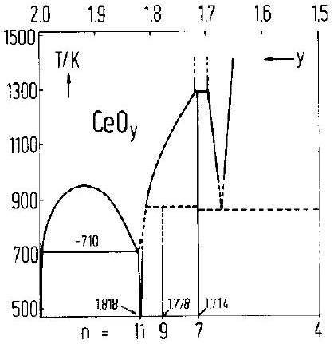
Fig. 1. Temperature-composition projection of $\mathrm{Ce}-$ O phase diagram, from Bevan and Kordis (Ref. (2)).

(9), using both neutron and X-ray diffraction, have observed these three phases and also in addition, $\mathrm{CeO}_{1.800}(n=10)$.

The temperatures of transformation presented by the dome are up to 50 K higher than those found by Blumenthal and Hofmaier (16) and by Tuller and Nowick (17) through conductivity measurements. The peritectic temperature seen in Fig. 1 at 873 $\mathrm{K}, 1.8>2-x>1.7$, was not found by Tuller and Nowick (17). Their results indicate that a peritectic temperature exists at 953 K .

The existence of a single $\alpha$ phase at high temperatures $T>950 \mathrm{~K}$ and $2-x>1.72$ was questioned by Sørensen (18, 19). In his thermogravimetric measurements various phases seem to exist in that part of the $x, T$ plane. However, these phases were not observed in other thermogravimetric measurements $(2,3)$ nor in calorimetric measurements of the partial molar enthalpy of solution of $\mathrm{O}_{2}$ in $\mathrm{CeO}_{2-x}$ (5), nor in measurements of electrical conductivity ( 16 , 17, 20, 21), Seebeck coefficient (17,20), or emf studies (4). Though no long range ordering of the defects was observed in the latter experiments, they do reveal interaction among the oxygen vacancies which apparently cause the defects to form clusters (15).

The phase diagram for $\mathrm{CeO}_{2-x}$ is thus still incomplete. There are discrepancies in
results of different authors and much data is missing since the experimental methods used were usually not continuous in both $x$ and $T$. Experimental difficulties can arise due to insufficient annealing, fast heating rates, or inadequate quenching. In the reduction of $\mathrm{CeO}_{2}$ to $\mathrm{CeO}_{2-x}$ a nonuniform oxygen vacancy distribution may be formed in the sample. This inhomogeneity must be eliminated by prolonged annealing at elevated temperatures under constant $P_{\mathrm{O}_{2}}$. Another difficulty arises when $T$ is varied rapidly at constant $x$ and the reduced oxide is not in a state of equilibrium. Special care must be taken near a phase transformation, to limit the rate of the heat supply (or removal) in order to keep the system close to equilibrium. Samples quenched from elevated temperatures may reveal low-temperature phases due to inadequate quenching (7).

To the best of our knowledge no specific heat measurements, $c_{p}$, have been reported on reduced ceria. Performing these measurements by a continuous scan of the temperature and in a high-precision calorimeter can be extremely useful in the exact determination of the transition temperatures. The phase diagram in the $\mathrm{Ce}-\mathrm{O}$ system can then be constructed. We have therefore measured the specific heat of $\mathrm{CeO}_{2-x}$. The measurements were done for closely spaced values of $x$ in the composition range $2.00>(2-x)>1.74$, and in the temperature range from 320 to 1200 K .

## 2. Experimental

## (a) General

The instrument used for the measurement of specific heat is a continuously heated, adiabatically shielded, tempera-ture-scanning calorimeter. The general description of the calorimeter was given previously (22,23). For the measurements presented in this paper special features had
to be added to allow in situ changes in the composition of the sample and to permit the analysis of the varying composition. Therefore, a sample holder was constructed which enabled the sample to be flushed in a controlled atmosphere. A gas system was built which transported either Ar or $\mathrm{Ar} / \mathrm{H}_{2}$ mixtures with very low oxygen content or an $\mathrm{H}_{2} / \mathrm{H}_{2} \mathrm{O}$ mixture. A water vapor analysis system for the exhaust gas was also incorporated.

Figure 2 is a schematic presentation of the whole experimental setup. The sample is surrounded by an adiabatic shield maintained exactly at the sample temperature. An outer shield was always kept at a somewhat lower temperature than the adiabatic shield, in order to maintain a small heat

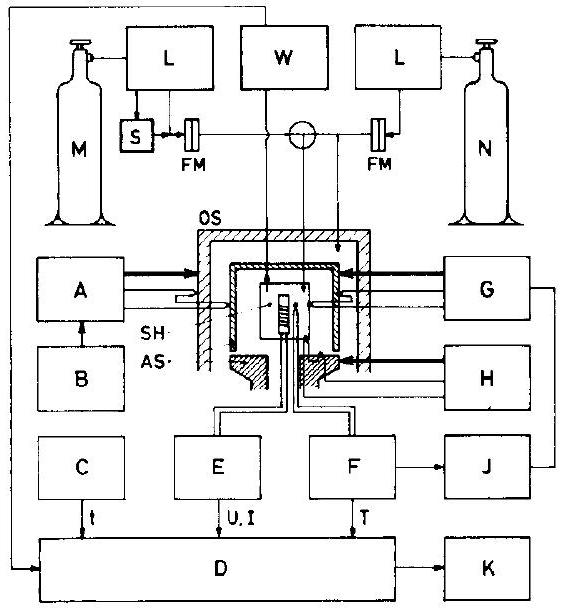
Fig. 2. Scheme of calorimetric setup. (A) Regulating device for outer oven, (AS) adiabatic shield, (B) compensating voltage for producing $\Delta T$ for outer oven, (C) quartz crystal clock, (D) data acquisition unit, (E) power supply for internal heater with digitally controlled output, (F) temperature measuring device, (FM) flowmeter, ( $\mathrm{G}, \mathrm{H}$ ) regulating devices for upper and lower part of adiabatic shield, (J) device for correcting temperature of adiabatic shield to minimize heat flow, (K) teletypewriter with punch tape, (L) oven with porous zirconium at $900^{\circ} \mathrm{C}$ for purifying gases from oxygen, (M) hydrogen supply, (N) argon supply, (OS) outer shield, (S) saturator, (SH) sample holder, (W) digitally recording microbalance for determining water in exhaust gas.

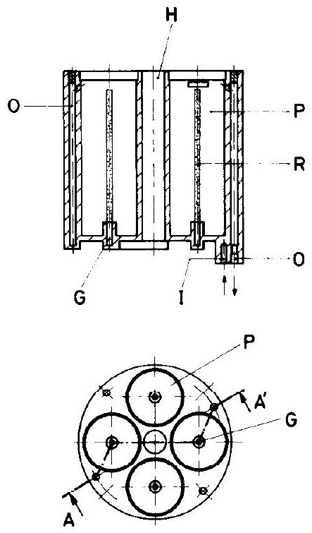
FIG. 3. Sections of sample holder. ( $\mathrm{AA}^{\prime}$ ) Section line of cut presented above, (G) tubing for incoming gas, (H) bore for heater element, (I) gas inlet, (O) tubing for outgoing gas, (P) cylindrical holes for sample, (R) thin capillary with holes in order to distribute incoming gas.

flow to the outside. This is necessary for the temperature control of the system. In most experiments the sample holder is heated continuously with nearly constant electric power, $\dot{Q}$. The $c_{p}$ of the sample together with the holder is calculated from $\dot{Q}$ and from the rate of change of the temperature of the sample. To obtain $c_{p}$ for the sample, that of the holder has to be determined.

## (b) Sample Holder

A nickel sample holder was used. It has a cylindrical shape $(37 \mathrm{~mm}$ length, 32 mm diam.) with a centric bore for the inner heater. Figure 3 shows a sections. Four cylindrical holes are arranged round the heater accommodating $11 \mathrm{~cm}^{3}$ of sample material. Gas is introduced to the sample holder via a thin capillary located on the axis of each of the four cylindrical holes. These capillaries have multiple openings to permit an even distribution of the incoming
gas. The gas is collected at the top of the sample. The exhaust gas is collected for further analysis.

## (c) Sample Preparation

Ceria powder 99.95\% by Koch Light Labs was pressed at 5000 atm and sintered at $1000^{\circ} \mathrm{C}$ to yield a porous but rigid sample. The grain size was initially about $10 \mu \mathrm{~m}$. The samples had a cylindrical shape with a hole along the axis of symmetry and fitted into the sample holder. The total amount was close to 0.3 mole.

## (d) Gas System

To reduce the sample, $\mathrm{H}_{2}$ or $\mathrm{H}_{2} / \mathrm{H}_{2} \mathrm{O}$ was used. Occasionally, argon was mixed with these gases. Pure Ar was used to keep the sample in a reduced state. The oxygen partial pressures of Ar and $\mathrm{H}_{2}$ were fixed by directing those gases through ovens containing porous zirconium metal kept at $900^{\circ} \mathrm{C}$. The oxygen partial pressure of a $\mathrm{ZrO}_{2}-\mathrm{Zr}$ mixture at this temperature has a theoretical value of about $10^{-53} \mathrm{~atm}$. An oxygen partial pressure measurement at the end of the gas system, with no sample inside the calorimeter, reveals that the pure Ar contains oxygen at a level of about $10^{-19}$ atm . The increase in the oxygen content compared with the theoretical value is explained by desorption of oxygen and perhaps by very small leaks. This oxygen partial pressure was monitored by using a calcia-stabilized zirconia solid state electrochemical cell. The measurement of the partial pressure of oxygen in $\mathrm{H}_{2}$ and $\mathrm{Ar} / \mathrm{H}_{2}$ showed that the $P_{\mathrm{O}_{2}}$ was below the detection limit of the electrochemical cell, i.e., below $10^{-22} \mathrm{~atm}$. The partial pressure of oxygen was therefore estimated using the mass action law, knowing the concentration of $\mathrm{H}_{2}$ and assuming that the total amount of $\mathrm{O}_{2}$ was the same as in the pure Ar atmosphere. This yields $P_{\mathrm{O}_{2}}$ at $900^{\circ} \mathrm{C}$ of about $10^{-53} \mathrm{~atm}$. Since the calorimeter usually operated at a lower temperature this
partial pressure is an upper limit for the oxygen in $\mathrm{H}_{2}$ and $\mathrm{Ar} / \mathrm{H}_{2}$ introduced into the calorimeter. The oxygen partial pressure of the $\mathrm{H}_{2} / \mathrm{H}_{2} \mathrm{O}$ mixtures was controlled by the temperature of a saturator ( $273-295 \mathrm{~K}$ ) and the temperature of the sample ( $900-1300 \mathrm{K})$. The rate of flow of the gases was monitored by flow meters and varied between 1 and $4 \mathrm{~cm}^{3}$ per second.

## (e) Gas Analysis

The gas emerging from the sample holder was analyzed for its water content. The amount of $\mathrm{H}_{2} \mathrm{O}$ in the exhaust gas is a direct measure of the amount of $\mathrm{O}_{2}$ released by the reduced sample, since practically all the oxygen reacts with $\mathrm{H}_{2}$ inside the sample holder to form water. The water vapor in the exhaust gas was absorbed by a specially prepared phosphorus pentoxide ("SICAPENT" by Merck). The absorbing material was continuously weighed by a digital analytical balance having a precision of 1 mg . The results could be recorded frequently. The adsorbent removes water from the gas as long as the water partial pressure is above $2 \times 10^{-8} \mathrm{~atm}$. A detection limit of $2 \times 10^{-8} \mathrm{~atm}$ of water in our case corresponds to a $P_{\mathrm{O}_{2}}$ of about $10^{-27} \mathrm{~atm}$ in the gas leaving the sample at 900 K . When using $\mathrm{H}_{2} / \mathrm{H}_{2} \mathrm{O}$ the amount of water entering the calorimeter has to be subtracted.

## (f) Sample Handling

The reduction of $\mathrm{CeO}_{2-x}$ was carried out in situ by flushing the sample with the purified $\mathrm{H}_{2}$ or $\mathrm{Ar} / \mathrm{H}_{2}$, followed by equilibration with $\mathrm{H}_{2} / \mathrm{H}_{2} \mathrm{O}$; alternatively, it was reduced directly in $\mathrm{H}_{2} / \mathrm{H}_{2} \mathrm{O}$. The temperature of reduction was 900 K for the range $x<0.1$ and was increased gradually to 1300 K for $x$ approaching 0.3 . The typical time of reduction and equilibration was 24 hr . The equilibration was carried out until $P_{\mathrm{O}_{2}}$ at the outgoing gas reached a steady level. At the end of this procedure the sample is expected to be homogeneous, since both the electronic
(16) and the ionic (24) mobilities are known to be high at these operating temperatures.

For the $c_{p}$ measurements the $\mathrm{H}_{2} / \mathrm{H}_{2} \mathrm{O}$ mixtures were replaced at the end of the reduction by purified argon. This ensured that $x$ remained practically constant while the temperature varied between room temperature and 1200 K . Blumenthal and Hofmaier (12) maintained $x$ constant, in a similar manner, using purified He. Changes in $x$ are associated with a relatively large amount of $\mathrm{O}_{2}$ gas being absorbed or liberated. The purified Ar with $P_{\mathrm{O}_{2}} \leq 10^{-19} \mathrm{~atm}$ cannot supply the amount of oxygen needed to oxidize the sample. To reduce the sample the Ar cannot flush away sufficient oxygen to induce a noticeable change in $x$. To elucidate this point we consider $\mathrm{CeO}_{1.99}$ as an example. For $x=0.01$ and $T =1000^{\circ} \mathrm{C}$ the oxygen partial pressure is about $10^{-11} \mathrm{~atm}$ (2). It is easy to show that for a flushing rate of $5 \mathrm{~cm}^{3} / \mathrm{sec}$ the removal of $\mathrm{O}_{2}$ involves only approximately $10^{-10}$ mole $\mathrm{O}_{2}$ per day. At lower temperature and all larger $x$ this rate is even lower.

## (g) Measurement Procedure

Essentially stoichiometric $\mathrm{CeO}_{2}$ was introduced into the sample holder. The sample was reduced as discussed before. The $c_{p}$ measurements were then conducted between 320 and 1200 K at a heating rate of approximately 0.5 or 1 K per minute. We observed no marked differences in the results for the two heating rates.

For higher $x$ values this procedure (reduction and $c_{p}$ measurements) was repeated many times.

The nearly gas-tight sample holder was repeatedly taken out of the calorimeter and tested for changes in oxygen content of the sample by weighing. The apparent $x$ determined in this manner usually was slightly larger than that deduced from the amount of water weighed. A correction proportional to the time of reduction was then applied to intermediate values of $x$ which
were determined from the water weight only. The error in $x$ is below $\pm 0.001$.

In the $c_{p}$ measurement the rate of heating of the sample varies slowly with temperature. Every 300 sec both the temperature and the heating power were monitored with high precision. A second run had to be made with an empty holder to determine the heat capacity of the sample by subtraction. The heating rate for both runs should be as similar as possible, to equalize heat losses, arising from incomplete adiabatic conditions. Since $c_{p}$ of the sample is determined by the difference of the two measurements the heat losses drop out. This can be achieved by a proper choice of the heating power. From all these values $c_{p}$ was calculated in straightforward fashion at roughly every 5 K .

The sensitivity in measuring $c_{p}$ values was high, less than 0.1 J mole ${ }^{-1} \mathrm{~K}^{-1}$. The accuracy, however, was assumed to be lower by at least a factor 10 or more. This presumably was caused by $\mathrm{H}_{2}$ gas which entered the calorimeter through leaks while reducing the sample. The $\mathrm{H}_{2}$ gas changed the thermal conductivity conditions inside the calorimeter.

The transition temperatures can be measured within $\pm 0.2 \mathrm{~K}$. They are slightly dependent on the heating rate and should therefore be quoted to within $\pm 2.5 \mathrm{~K}$.

## Experimental Results

## (a) Analysis

The impurities analysis by X-ray fluorescence, had a detection limit of 100 ppm for elements with atomic number above 21 , and 1000 ppm for the lighter elements. No impurities were detected. The overall impurity concentration is thus below $\sim 1000 \mathrm{ppm}$ which we consider as adequate for bulk properties, measurements of $c_{p}$, and phase transitions.

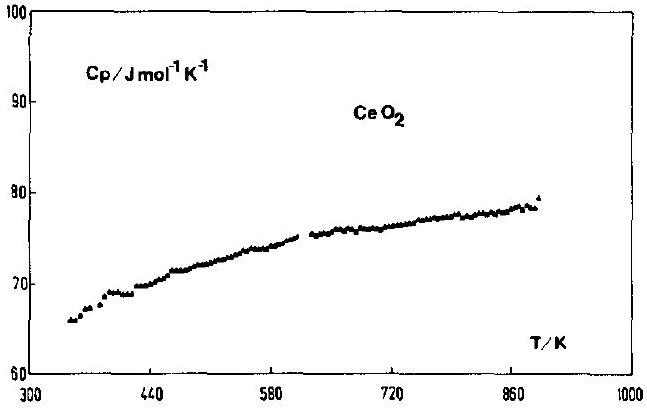
Fig. 4. Specific heat of nearly stoichiometric $\mathrm{CcO}_{2}$.

## (b) Specific Heat

The $c_{p}$ values for cerium dioxide are presented in Fig. 4. The nearly stoichiometric oxide exhibits no phase transition in the temperature range investigated. Figure 5 shows the specific heat for an oxide of composition $\mathrm{CeO}_{1.823}$, as a representative example for a nonstoichiometric sample. It exhibits distinct temperature regions corresponding to different combinations of phases.
In the intermediate temperature range between 700 and 900 K the specific heat exhibits a complicated behavior. Below 723 $\mathrm{K} \mathrm{CeO}_{1.823}$ consists of a mixture of two phases: The peak at 723 K indicates the coexistence of three different phases (see Fig. 6). At this temperature the low-temperature phases $\alpha, \delta$ transforms into a mixture of a new phase $\alpha^{\prime}$ and the original $\delta$ (eutectic transformation). This type of transition oc-

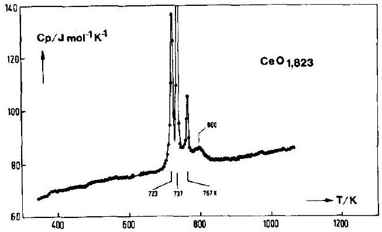
Fig. 5. Specific heat of $\mathrm{CeO}_{1.823}$.

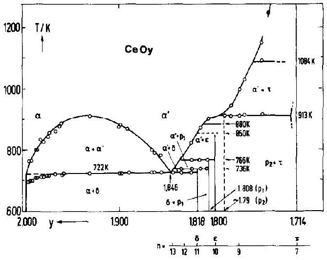
Fig. 6. The phase diagram of $\mathrm{CeO}_{2-x}$ in the composition range $2>2-x>1.714$ and $600<T<1300 \mathrm{~K}$. -, Data from Ref. (6).

curs at one fixed temperature and requires a finite heat of transformation similar to a first-order transformation in a pure substance. Above this transformation temperature the compound is a mixture of two phases $\alpha^{\prime}, \delta$. The peaks at 737 and 767 K are interpreted similarly. Both transformations will be entered in the phase diagram given above as peritectic changes.
$C_{p}$ at higher temperatures is marked by a shoulder with a maximum value at 800 K. This shoulder indicates a gradual transformation between two phases. This temperature ( 800 K ) is taken as a boundary of the homogeneous region, $\alpha^{\prime}$ at $2-x=$ 1.823 (in Fig. 6).

A set of $c_{p}$ - measurements for various $x$ is presented in Figs. 7 and 8. The variation of the transition temperatures with composition is clearly observed. Figures 7 and 8 contain the main information needed for the construction of the phase diagram which is shown in Fig. 6. In the phase diagram the horizontal lines are drawn through measured three phase transition temperatures having the same value. The curves are drawn through points determined by the maxima in the shoulders in $c_{p}$. The vertical lines are drawn at compositions for which the enthalpy of transforma-

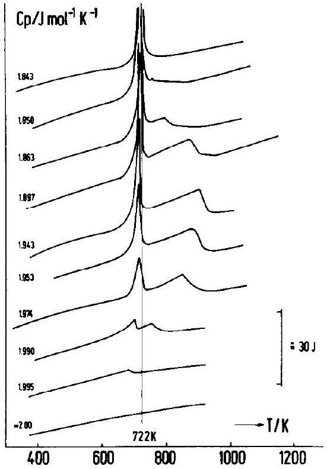
Fig. 7. Specific heat of $\mathrm{CeO}_{2-x}$ from nearly stoichiometric to $2-x=1.843$. Each of the curves is moved upward by 16 J mole ${ }^{-1} \mathrm{~K}^{-1}$ with respect to the next lower one.

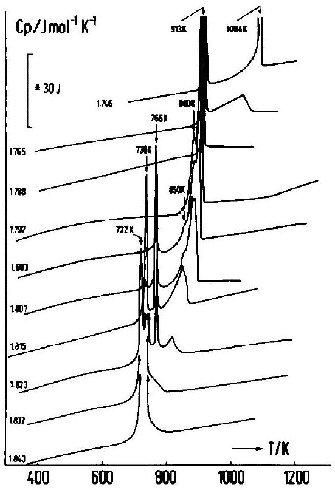
Fig. 8. Specific heat of $\mathrm{CeO}_{2-x}$ from $2-x=1.840$ to $2-x=1.746$. Each of the curves is moved upward by 16 J mole ${ }^{-1} \mathrm{~K}^{-1}$ with respect to the next lower one.

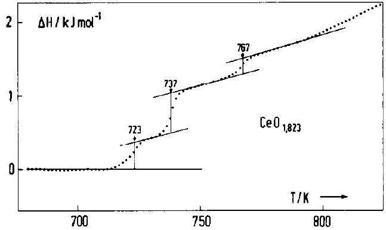
Fig. 9. Enthalpy curve ( $H-a T$ vs $T$ ) exhibiting three transitions in $\mathrm{CeO}_{1.823}$.

tion $L$ vanishes or exhibits a maximum, as discussed below.

## (c) Enthalpy of Transformation

The quantity measured by the calorimeter was the enthalpy change of the sample at constant composition $x$. Figure 9 presents as an example $H(x, T)-a T$ ( $a=$ const) for $2-x=1.823$, from which the enthalpies of transition $L$ at $722,736,766 \mathrm{~K}$ were determined. Figures 10, 11, and 12a and b show $L$ for the transformation temperatures $722,973,736,766 \mathrm{~K}$ at the relevant composition ranges. At a given transformation temperature, $L$ should attain a maximum value at the eutectic or peritectic composition and should vanish for the compositions of the boundaries. This latter property of $L$ was used to determine experimentally the compositions of the coexisting

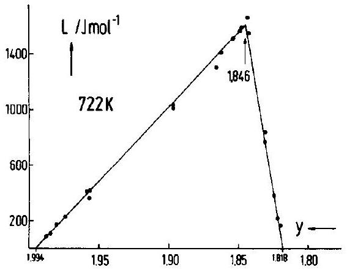
Fig. 10. Enthalpies of the eutectic transition at 722 K , vs composition $y=2-x, 1.994>2-x>1.818$.

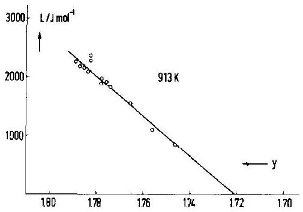
Fig. 11. Enthalpies of the peritectic transition at 913 K , vs composition $y=2-x, 1.80>2-x>1.72$.

phases at the transformation temperatures: $722,736,766,913 \mathrm{~K}$. Figure 10 shows that the maximum of the curve, i.e., the eutectic composition occurs at $2-x=1.846$, and the boundary phases are fixed at $2-x=$ 1.994 and 1.818. The eutectic composition was used in Fig. 12a to fix the upper limit of the $\alpha^{\prime}$ boundary composition. Then the other two coexisting phases are found at 2 $-x=1.818,1.808$. In Fig. 12b at the temperature of 766 K the coexisting phases are at $2-x=1.835,1.808,1.801$. All these numerical values of $2-x$ were used in the phase diagram (Fig. 6) for the composition of the phases. For the peritectic temperature 913 K the maximum in $L$ was not detected (see Fig. 11). The composition of the expected maximum (peritectic composition) can, however, be estimated to lie in the range $1.794 \geq 2-x \geq 1.788$. It was denoted by $p_{2}$. The vanishing of $L$ at $2-x =1.722$ is interpreted as indicating the boundary of the phase centered at $2-x=$ 1.714. This shows that the phase $\mathrm{CeO}_{1.714}$ has a relatively wide composition range.

## Discussion

The phase diagram shown in Fig. 6 differs from that of Bevan and Kordis (2) (see Fig. 1) with respect to both the phases and the transformation temperatures. Some of those entered in Fig. 6 were not reported before. There is an eutectic temperature at 722 K . Peritectic temperatures are seen at
$736,766,880,913$, and 1084 K. A very weak transformation is observed at 850 K . Figure 1 shows three transformation temperatures at 715,873 , and 1300 K (for $2-x >1.7$ ). Only the first of these is close to our results. According to the composition range the second probably corresponds to our 913 K transformation. For this composition range Tuller and Nowick (17) report a transformation temperature at 953 K . The transformation temperature of 1300 K (Fig. 1) probably corresponds to ours at 1084 K . The transformation temperatures at 736, 766,850 , and 880 K were not reported previously.
The transformation temperature near 720 K is lowered as $x$ decreases. In this range the crystal does not appear to be in equilibrium. This may be due to a difference in the densities and expansion coefficients of $\alpha$, $\alpha^{\prime}$, and $\delta$ phases. Dilatometer and X-ray diffraction measurements are initiated to investigate this problem.

Figure 1 includes the phases $\mathrm{Ce}_{n} \mathrm{O}_{2 n-2}$ with $n=7,9,11$. Ray et al. (9) also found a

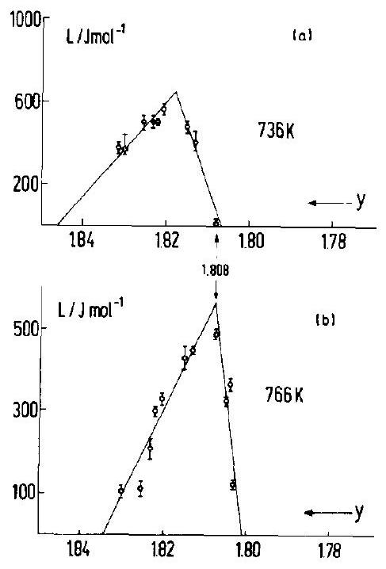
Fig. 12. Enthalpies of the peritectic transitions vs composition $y=2-x$. (a) At $T=736 \mathrm{~K}, 1.846>2-x >1.808$. (b) At $T=766 \mathrm{~K}, 1.835>2-x>1.801$.

phase with $n=10$. Figure 6 includes not only the phases with $n=7,10,11$ but also $\mathrm{CeO}_{1.808}$ and near $\mathrm{CeO}_{1.79}$. The phase with $n =9(2-x=1.778)$ was not observed here, in agreement with Andersen and Wuensch (8) but not with others (2,9). However, $\mathrm{CeO}_{1.807}$ and $\mathrm{CeO}_{1.790}$ were not previously reported.

Our results are then in partial contradiction with X-ray and neutron diffraction experiments $(7,9,25)$. The composition $2-x =1.808$ was clearly determined from enthalpy measurements (Figs. 12a,b). This phase was also observed in $\mathrm{TbO}_{2-x}$ (12). The possible existence of a phase near the composition $2-x=1.79$ was concluded from the enthalpy of the 913 K transformation (Fig. 11). It is further supported by the fact that the peritectic line at 880 K is observed only between the $\alpha^{\prime}$ phase boundary and the composition near $2-x=1.79$.

Extremely weak peaks in the $c_{p}$ measurements indicate that there might be an additional peritectic line at 850 K . If real, this requires the existence of another phase with $2-x$ between 1.79 and 1.800 .

Attempts to fit the composition 1.79 and 1.808 to another homologous series $\mathrm{Ce}_{n} \mathrm{O}_{2 n-1}$ or $\mathrm{Ce}_{n} \mathrm{O}_{2 n-3}$ do not lead to acceptable results. Sørensen (26) suggested that one should consider variations in chemical compositions. In his model an oxygen vacancy and its seven nearest neighbor oxygen atoms form a structural unit, $\mathrm{T}_{7}$. An oxygen vacancy and its 19 nearest and next nearest neighbors form another structural unit, $\mathrm{T}_{19}$. By varying the relative amount of these two units the various compositions can be accounted for. Table I includes the numbers $n, m$ of $\mathrm{T}_{19}, \mathrm{~T}_{7}$ units, respectively, and the compositions $2-x$ that are obtained for $n, m$. The compositions 1.818 , $1.808,1.800,1.793,1.787$, and 1.714 can be related to ours. The eutectic composition 1.846 can also be obtained by combining $\mathrm{T}_{19}$ and $\mathrm{T}_{7}$ units. This may explain why the $\alpha^{\prime}$ phase of that composition has the lowest

| TABLE I |  |  |
| :--- | :--- | :--- |
| Composition Constructed with $n \mathrm{~T}_{19}$ And $m \mathrm{~T}_{7}$ Units With the Formula $\mathrm{CeO}_{2-2}\left(\frac{n+m}{19 n+7 m}\right)$ |  |  |
| $\boldsymbol{n} \boldsymbol{(} \mathbf{T}_{\mathbf{1 9}} \boldsymbol{)}$ | $m\left(\mathrm{~T}_{7}\right)$ | $2-x$ |
| 2 | 2 | 1.846 |
| 2 | 3 | 1.831 |
| 2 | 4 | 1.818 |
| 2 | 5 | 1.808 |
| 2 | 6 | 1.800 |
| 2 | 7 | 1.793 |
| 2 | 8 | 1.787 |
| 2 | $\infty$ | 1.714 |

transformation temperature ( 722 K ). Table I also includes the combination $n=2, m=$ 3 which corresponds to $2-x=1.831$. A phase at $2-x \sim 1.831$ was observed in $\mathrm{PrO}_{2}$ (10) and in $\mathrm{TbO}_{2}$ (12).

When these units $\mathrm{T}_{19}, \mathrm{~T}_{7}$ form a periodic structure one encounters a kind of chemical layered segregation (15). We have been able to verify that such a periodic structure can be constructed from $\mathrm{T}_{7}$ and $\mathrm{T}_{19}$ for $\mathrm{CeO}_{1.800}$ and $\mathrm{CeO}_{1.714}$. The other compositions are still being examined for this feature.

At 722 K the $\alpha$ phase exits in a relatively wide composition range $2.00 \geq 2-x \geq$ 1.994. The $\tau$ phase ( $2-x=1.714$ ) also exhibits a relatively wide composition range. We have determined this at 913 K from the enthalpy of transformation (Fig. 11) which vanishes at $2-x=1.722$. The phase therefore extends up to this composition.

We have determined the boundary of the $\alpha^{\prime}$ phase up to 1100 K . When the boundary line is extrapolated to higher temperatures ( $T>1250 \mathrm{~K}$ ) it matches the $\alpha^{\prime}$ phase boundary given by Campserveux and Gerdanian (6).

The maximum of the miscibility gap occurs at $2-x=1.93$ and $T=910 \mathrm{~K}$. Bevan and Kordis (2) fix it at $2-x=1.93$ and $T=$ 958 K , while Blumenthal and Hofmaier (16)
and Tuller and Nowick (17) set it at $2-x=$ 1.95 and $T=903 \mathrm{~K}$. The latter temperature is in fair agreement with ours.

In the range $T>910 \mathrm{~K}$ and $2-x>1.8$ we see no structure in $c_{p}$ data, indicating that there exists a single $\alpha$ phase which can vary continuously in composition Sørensen (26), however, detected several phases in this $x, \mathrm{~T}$ region of the phase diagram. There is no support to the finding of Sørensen from other experiments carried out in that $x, T$ region. It seems that the "phases" observed by Sørensen may be due to hysteresis effects and they may reflect the existence of clustering and short range order in the $\alpha$ phase (27).

The question whether small quantities of impurities can partially stabilize $\mathrm{CeO}_{2-x}$ so as to eliminate some of the phases and to shift the transformation temperatures has not yet been studied. This might be the cause for the differences between the various experimental results.

Theoretical treatments exist which aim at calculating the phase diagram in materials such as $\mathrm{CeO}_{2-x}(28,29,30)$. However, such calculations must relay upon many simplifying assumptions that limit their application. The theoretical results are therefore only in qualitative agreement with experiment and cannot be used to resolve discrepancies between various findings.

Various thermodynamic quantities can be obtained from the $c_{p}$ results presented here. The sharp peaks in $c_{p}$ yield the heat of transformation. The broad shoulder reflects partial molar enthalpies of oxygen. The gradual increase in $c_{p}$ as $T$ approaches a transformation temperature is due to the formation of disorder (presumably disorder on the anion sublattice). The gradual increase in $c_{p}$ in the high temperature $\alpha$ phase is due to anharmonic effects and probably also due to changes in clustering of oxygen vacancies and quasi-free electron contributions. These topics will be discussed in a separate publication.

The present work has clearly shown that the phase diagram of $\mathrm{CeO}_{2-x}$ is more complicated than that suggested by Bevan and Kordis, as there are a number of phases and transformation temperatures which were not seen before. The determination of the transformation temperature is quite precise due to the continuous scanning, long anneal time, slow heating rate, and accurate temperature measurement. The identification of the compositions of the various phases is not consistent with previous X-ray and neutron diffraction experiments. It is suggested that the latter types of experiment be carried out in detail in the region $1.818>2-x >1.78$.

## Acknowledgments

Financial support of the Deutsche Forschungsgemeinschaft (DFG) is gratefully acknowledged. One of us (I. R.) acknowledges the support of the DAAD (Deutscher Akademischer Austauschdicnst) which permitted the beginning of the collaboration of our two groups. We are thankful to Dr. A. Schneider for the impurity analysis.

## References

1. G. Brauer and K. Gingerich, in "Rare Earth Research" (E. V. Kleber, Ed.), Lake Arrowhead Ca. 1960, p. 96. The MacMillan Comp. (Pub. 1961).
2. D. J. M. Bevan and J. Kordis, J. Inorg. Nucl. Chem. 26, 1509 (1964).
3. R. J. Panlener, R. N. Blumenthal, and J. E. Garnier, J. Phys. Chem. Solids 36, 1213 (1975).
4. F. A. Kuznetsov, V. I. Belyi, and T. N. Rezukhina, Dokl. Akad. Nauk. SSSR 139, 1405 (1961).
5. J. Campserveux and P. Gerdanian, J. Chem. Thermodyn. 6, 795 (1974).
6. J. Campserveux and P. Gerdanian, J. Solid State Chem. 23, 73 (1978).
7. D. J. M. Bevan, J. Inorg. Nucl. Chem. 1, 49 (1955).
8. H. T. Anderson and B. J. Wuensch, in "Fast Ion Transport in Solids" (W. van Gool, Ed.), p. 284, North-Holland, Amsterdam, Amsterdam (1973).
9. S. P. Ray, A. S. Nowick, and D. E. Cox, J. Solid State Chem. 15, 344 (1975).
10. B. G. Hyde, D. J. M. Bevan, and L. Eyring, Philos. Trans. R. Soc. London 259, 583 (1966).
11. L. Eyring, in "Solid State Chemistry of Energy Conversion and Storage" (J. B. Goodenough and M. S. Whittingham, Eds.), p. 240, Adv. Chem. Series 163, Amer. Chem. Soc., Washington, D.C. (1977).
12. N. C. Baenzinger, H. A. Eick, H. S. Schuldt, and L. Eyring, J. Amer. Chem. Soc. 83, 2219 (1961).
13. P. Kunzman and L. Eyring, J. Solid State Chem. 14, 229 (1975).
14. L. Eyring, in "Nonstoichiometric Oxides" (O. Toft Sørensen, Ed.), p. 338, Academic Press, New York (1981).
15. J. S. Anderson, J. de Physique 38, C7-17 (1977).
16. R. N. Blumenthal and R. L. Hofmaier, J. Electrochem. Soc. 121, 126 (1974).
17. H. L. Tuller and A. S. Nowick, J. Phys. Chem. Solids 38, 859 (1977).
18. O. T. Sørensen, J. Solid State Chem. 18, 217 (1976).
19. O. T. Sørensen, J. Therm. Anal. 13, 429 (1978).
20. H. L. Tuller and A. S. Nowick, J. Electrochem. Soc. 126, 209 (1979).
21. I. K. Naik and T. Y. Tien, J. Phys. Chem. Solids 39, 311 (1978).
22. J. Nölting, Ber. Bunsenges. Phys. Chem. 67, 172 (1963).
23. P. Kubaschewski and J. Nölting, Ber. Bunsenges. Phys. Chem. 77, 70 (1973).
24. I. Riess, D. Braunshtein, and D. S. Tannhauser, J. Amer. Ceram. Soc. 64, 479 (1981).
25. G. Brauer and K. A. Gingerich, J. Inorg. Nucl. Chem. 16, 87 (1960).
26. O. T. Sørensen, in "Nonstoichiometric Oxides," p. 1, Academic Press, New York (1981).
27. J. Faber, M. A. Seitz, and M. H. Mueller, J. Phys. Chem. Solids 37, 909 (1976).
28. J. S. Anderson, in "Problems of Nonstoichiometry" (A. Rabenau, Ed.), North-Holland, Amsterdam, Amsterdam (1970).
29. L. M. Atlas, J. Phys. Chem. Solids 29, 91 (1968).
30. L. Manes, in "Nonstoichiometric Oxides" (O. Toft Sørensen, Ed.), p. 100, Academic Press New York (1981).
