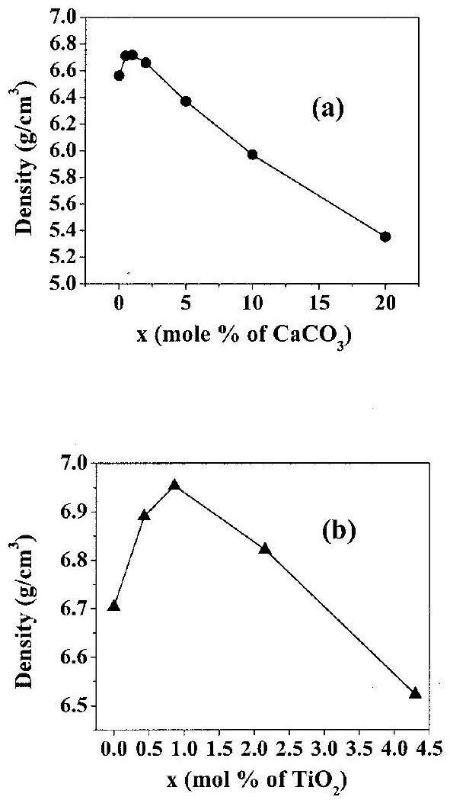
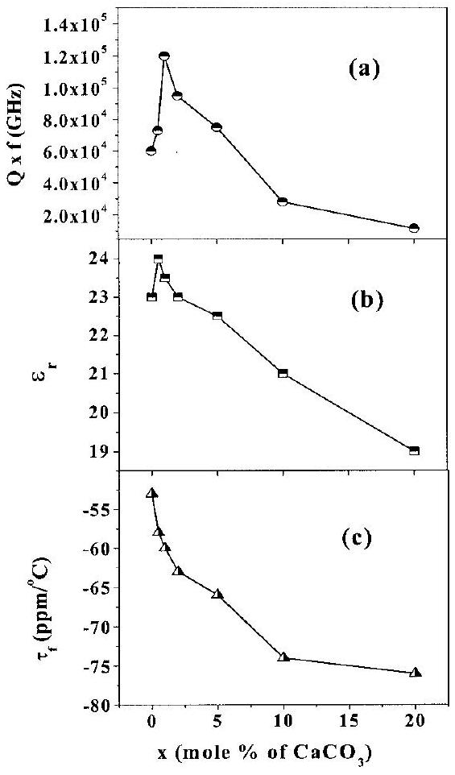
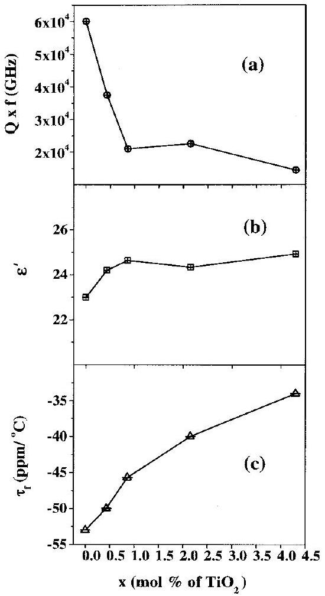
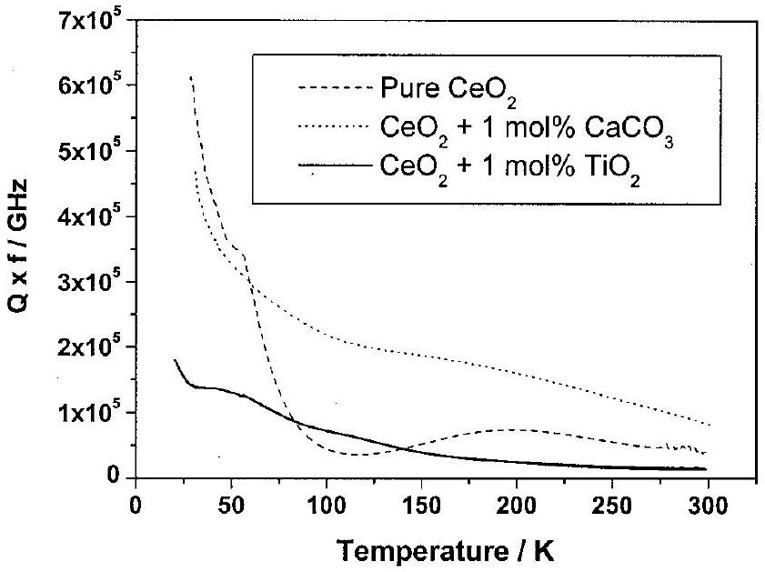
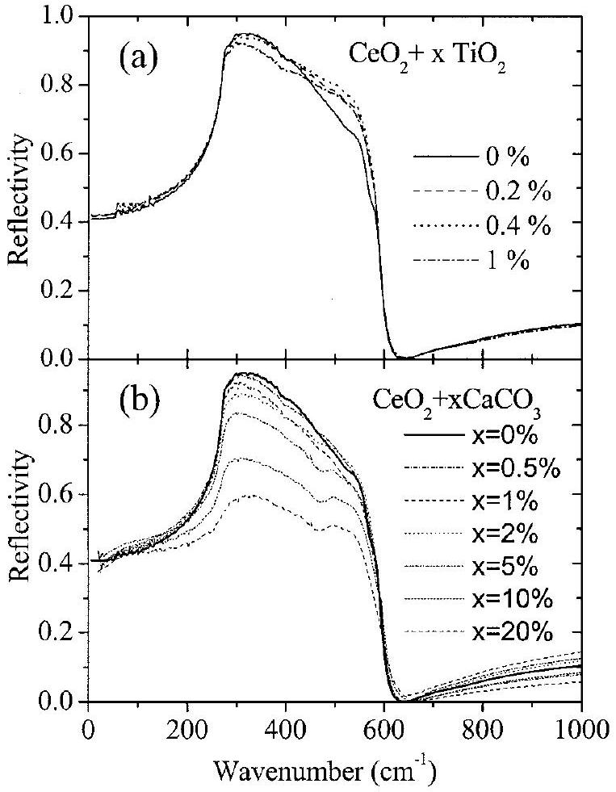
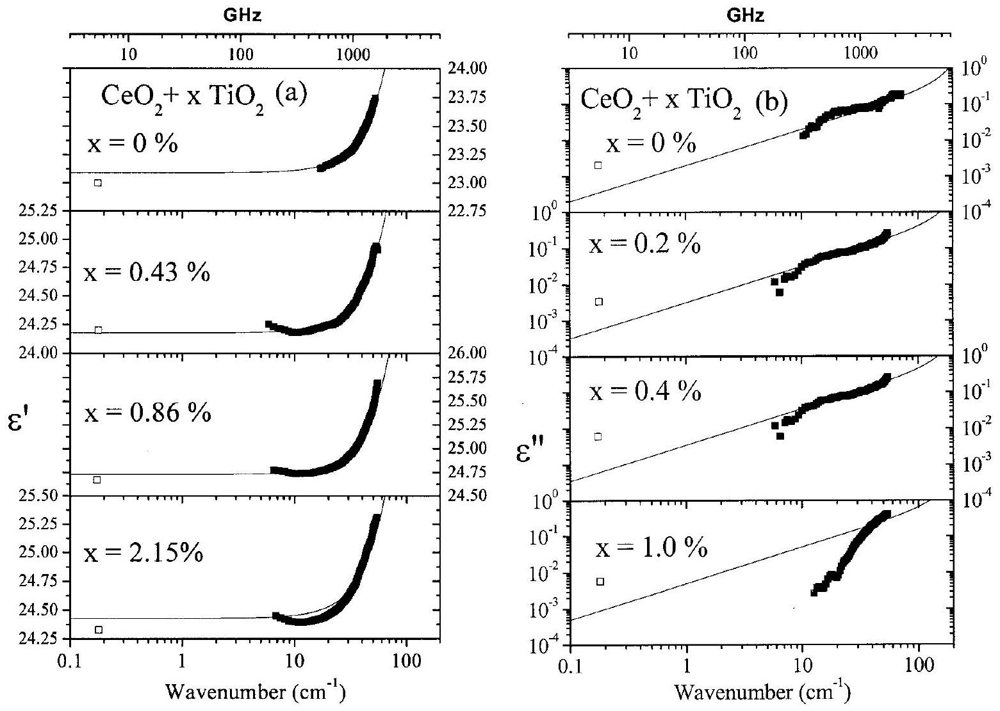
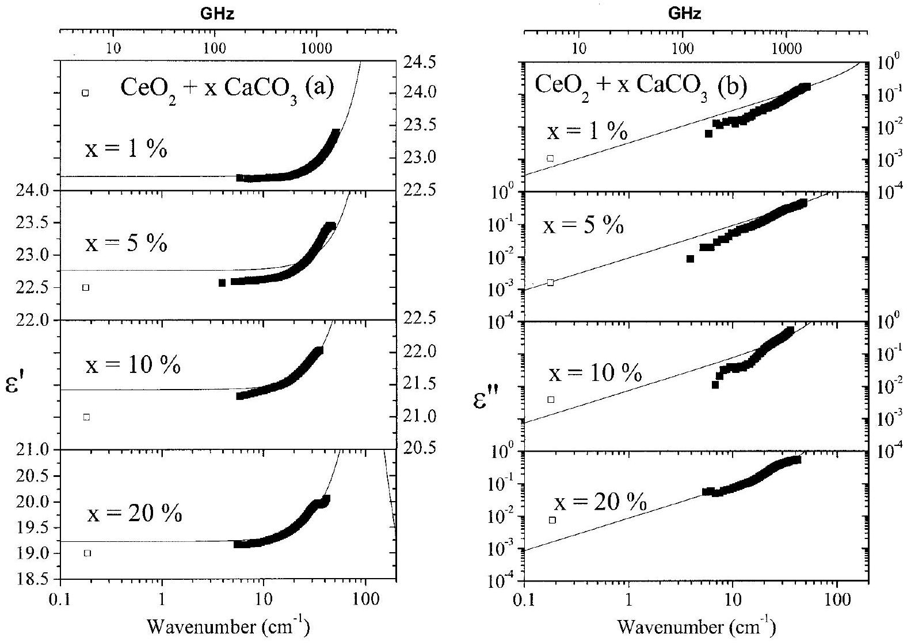
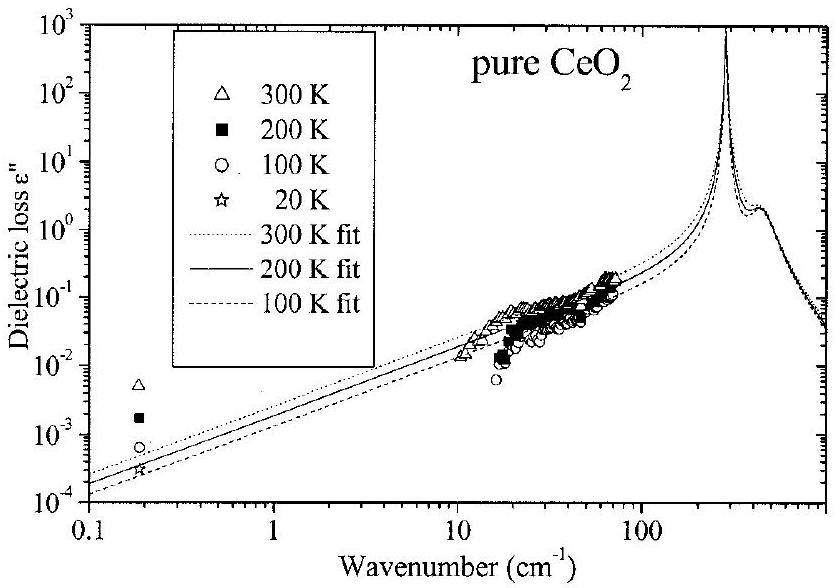

# Effect of Doping on the Dielectric Properties of Cerium Oxide in the Microwave and Far-Infrared Frequency Range 

Narayana Iyer Santha and Mailadil Thomas Sebastian Regional Research Laboratory, Trivandrum 695019, India Pezholil Mohanan Department of Electronics, CUSAT, Cochin 682022, India

Neil McN. Alford,* Kumaravinothan Sarma, and Robert C. Pullar*
Physical Electronics and Materials, Faculty of Engineering, Science, and the Built Environment, London South Bank University, London SW16 1QB, United Kingdom

Stanislav Kamba, Alexej Pashkin, Polina Samukhina, and Jan Petzelt Institute of Physics, Academy of Sciences of the Czech Republic, 18221 Prague 8, Czech Republic

#### Abstract

Cerium oxide $\left(\mathbf{C e O}_{\mathbf{2}}\right)$ has been prepared as a ceramic dielectric resonator by a conventional solid-state ceramic route. The sintered $\mathbf{C e O}_{\mathbf{2}}$ has a high dielectric quality factor ( $\boldsymbol{Q} \times \boldsymbol{f}$ ), $\boldsymbol{Q}$ value of 10000 at 6 GHz with a relative permittivity ( $\varepsilon^{\prime}$ ) of 23, and temperature coefficient of resonant frequency $\left(\boldsymbol{\tau}_{\mathbf{f}}\right)$ of -53 ppm/°C. The $\boldsymbol{Q}$ value increases to 20000 at 6 GHz when the $\mathbf{C e O}_{\mathbf{2}}$ is doped with $\mathbf{1} \mathbf{~ m o l}_{\boldsymbol{\%}} \mathbf{C a C O}_{\mathbf{3}}$. Higher levels of $\mathbf{C a C O}_{\mathbf{3}}$ doping lowers the $\boldsymbol{Q}$ and $\boldsymbol{\varepsilon}^{\prime}$ values and simultaneously decreases $\boldsymbol{\tau}_{\mathbf{f}} . \mathbf{T i O}_{\mathbf{2}}$ doping decreases $\boldsymbol{\tau}_{\mathbf{f}}$ and slightly increases $\boldsymbol{\varepsilon}^{\prime}$, but deceases the $\boldsymbol{Q}$ value. The $\boldsymbol{Q}$ value of pure $\mathbf{C e O}_{\mathbf{2}}$ increases to 105000 at a frequency of 5.58 GHz when it is cooled to 30 K, whereas $\boldsymbol{Q} \approx \mathbf{8 5} 000$ at 5.48 GHz for $\mathbf{1}$-mol\%-CaCO ${ }_{\mathbf{3}}$-doped $\mathbf{C e O}_{\mathbf{2}}$ at $\mathbf{3 0 ~ K}$.

## I. Introduction

Cerium oxide (ceria, $\mathrm{CeO}_{2}$ ) with a cubic fluorite structure is an attractive insulating material because of its chemical stability, high relative permittivity, and close lattice match with silicon. It has found application in capacitors and buffer layers of superconducting materials. ${ }^{1} \mathrm{CeO}_{2}$, either in its pure form or doped with alien cations ( $\mathrm{Ca}^{2+}, \mathrm{Mg}^{2+}, \mathrm{Sc}^{2+}, \mathrm{Y}^{3+}, \mathrm{Zr}^{4+}$, etc.), is used in many applications, including gas sensors, electrode materials for solidoxide fuel cells, oxygen pumps, amperometric oxygen monitors, and catalytic supports for automobile exhaust systems. ${ }^{2}$ Studies on the electrical conductivity of $\mathrm{CeO}_{2}$ with respect to various dopants and dopant concentrations have shown that $\mathrm{Y}_{2} \mathrm{O}_{3}$ is most soluble in the $\mathrm{CeO}_{2}$ lattice with excellent ionic conductivity. ${ }^{3}$ To elucidate the role of dopants on the morphology and chemical homogeneity of synthesized powder and on the sintering and grain growth of the compacted powders, Rahaman and Zhou ${ }^{4}$ have chosen $\mathrm{CeO}_{2}$ as a model system, because it has the advantage of having a relatively simple cubic fluorite structure and high solid solubility for many

[^0][^1]cations, and it does not undergo crystallographic transformation during the normal range of heating.

Thus, a considerable amount of work has been conducted on the various aspects of $\mathrm{CeO}_{2}$, but very little attention has been given to its microwave (MW) dielectric properties. Recently, Kim et al. ${ }^{5}$ have attempted to modify the MW dielectric properties of $\mathrm{TiO}_{2}$ by preparing various compounds in the solid-solution system $x \mathrm{TiO}_{2} \cdot(1-x) \mathrm{CeO}_{2}$.

We have found that pure $\mathrm{CeO}_{2}$ has a large negative temperature coefficient of resonant frequency $\left(\tau_{\mathrm{f}}\right)$, which precludes its immediate practical use. $\mathrm{CeO}_{2}$ has been doped for the purpose of improving its dielectric properties, especially $\tau_{\mathrm{f}}$. In the present paper, we report the room-temperature and, in some cases, the low-temperature dielectric properties of pure and calcium- and titanium-doped $\mathrm{CeO}_{2}$ in the MW and far-infrared (IR) frequency range.

## II. Experimental Procedure

Powders of undoped $\mathrm{CeO}_{2}$ and powders containing various concentrations (up to $20 \mathrm{~mol} \%$ ) of $\mathrm{Ca}^{2+}$ were prepared using a conventional solid-state ceramic route. The starting materials were $99.99 \% \mathrm{CeO}_{2}$ (Indian Rare Earths, Ltd.) and $\mathrm{CaCO}_{3}(99.99 \%$, Aldrich Chemical Co., Milwaukee, WI). $\mathrm{CeO}_{2}$ was heated in a platinum crucible at 800°C for 3 h to remove volatile impurities. To prepare undoped $\mathrm{CeO}_{2}$ ceramics, 3 wt\% poly(vinyl alcohol) was added to the fine powder, ground well, dried, and ground again. For $\mathrm{Ca}^{2+}$-doped $\mathrm{CeO}_{2}$, various concentrations (0.5-20 $\mathrm{mol} \%$ ) of $\mathrm{CaCO}_{3}$ were added to the calcined $\mathrm{CeO}_{2}$ and ground well in an agate mortar in distilled water and processed as described earlier. Powders for sintering were dry-pressed manually into cylinders with a diameter of 14 mm and a length of $6-8$ mm in a WC die. The powder compacts were sintered at 1675°C with a heating rate of 10°C/min and soaked for 2 h. The furnace was cooled to 1000°C at a rate of 5.5°C/min and then cooled to room temperature by natural cooling. $\mathrm{TiO}_{2}$ was added ( $0.43,0.86,2.15$, and 4.3 mol\%) to the calcined $\mathrm{CeO}_{2}$, and samples were prepared as described above. The density of the samples was calculated by measuring mass and dimensions. The sintered samples were ground and examined using X-ray diffractometry with $\mathrm{CuK} \alpha$ radiation. The MW dielectric properties of sintered specimens were measured using a network analyzer (Model 8510C, Hewlett-Packard, Palo Alto, CA). The end-shorted method proposed by Hakki and Coleman ${ }^{6}$ was used for the evaluation of the relative
dielectric constant using the $\mathrm{TE}_{011}$ mode. The dielectric quality factor $(Q \times f)$ of the samples was measured using the cavity method ${ }^{7}$ in the $\mathrm{TE}_{01} \delta$ resonant mode. $\tau_{\mathrm{f}}$ was measured by noting the response of the $\mathrm{TE}_{01} \delta$ mode with respect to temperature using two methods: the Hakki and Coleman method in the 20°-80°C region and the resonant cavity method in the 250-300 K region. The low-temperature MW dielectric properties were measured by placing the cavity on the cold head of a closed-cycle Gifford McMahon cryostat (Model Workhorse, Cryophysics, Abingdon, U.K.), and the MW dielectric properties were determined using a vector network analyzer (Model 8720C, Hewlett-Packard) in the temperature range 20-300 K.

IR reflectivity spectra were obtained using Fourier-transform spectrometry (Model IFS 113v, Bruker Instruments, Inc., Billercia, MA) in the frequency range of $30-5000 \mathrm{~cm}^{-1}(0.9-167 \mathrm{THz}) .^{8}$ Transmission spectra in the submillimeter range of $5-70 \mathrm{~cm}^{-1}$ (0.17-2.3 THz) were obtained using a custom-made time-domain terahertz spectrometer. In this setup, a beam of femtosecond titanium-sapphire laser falls to a biased, large-aperture antenna from GaAs, and it emits a terahertz signal that is detected using an electrooptic sampling detection technique. ${ }^{10}$ A cryostat (Model Optistat ${ }^{\text {CF }}$, Oxford Instruments, Inc., Concord, MA) was used for low-temperature terahertz measurement down to 20 K.

## III. Results and Discussion

$\mathrm{CeO}_{2}$ is sintered to a density of ~94\% of the theoretical density when sintered at 1675°C for 2 h. The sintering temperature has been optimized for the maximum density. Addition of a small amount of $\mathrm{Ca}^{2+}(0.5-2 \mathrm{~mol} \%)$ and $\mathrm{Ti}^{4+}(0.43-2 \mathrm{~mol} \%)$ increases the density of the $\mathrm{CeO}_{2}$ ceramics. However, as the $\mathrm{Ca}^{2+}$ and $\mathrm{Ti}^{4+}$ contents are increased further, the density decreases. Figure 1 shows the variation of density of $\mathrm{CeO}_{2}$ as a function of $\mathrm{Ca}^{2+}$ and $\mathrm{Ti}^{4+}$ contents. The powder XRD pattern of $\mathrm{CeO}_{2}$ sintered at 1675°C for 4 h matches with that reported in Powder Diffraction

Fig. 1. Variation of the densities of $\mathrm{CeO}_{2}$ with (a) $\mathrm{CaCO}_{3}$ and (b) $\mathrm{TiO}_{2}$ content.

File No. 43-1002 (International Centre for Diffraction Data, Newtown Square, PA).

The MW dielectric properties of pure $\mathrm{CeO}_{2}$ and $\mathrm{Ca}^{2+}$ - and $\mathrm{Ti}^{4+}$-doped $\mathrm{CeO}_{2}$ were measured at room temperature in the frequency range 5-8 GHz; the results are plotted in Figs. 2 and 3, respectively. The relative dielectric constant $\left(\varepsilon^{\prime}\right)$ of $\mathrm{CeO}_{2}$ increases slightly when a small amount of $\mathrm{CaCO}_{3}$ is added. However, $\varepsilon^{\prime}$ decreases when a higher $\mathrm{Ca}^{2+}$ content is added. This can be explained by the decrease in relative density, because $\varepsilon^{\prime}$ depends (in part) on porosity and/or secondary phase. ${ }^{9} \mathrm{TiO}_{2}$ has high $\varepsilon^{\prime}$, but there is only a slight increase in the $\varepsilon^{\prime}$ value of $\mathrm{CeO}_{2}$ by doping with $\mathrm{TiO}_{2}$ (Fig. 3(b)).

Figure 2(a) shows the variation of $Q \times f$ (in gigahertz) as a function of calcium content. The undoped $\mathrm{CeO}_{2}$ has a $Q \times f$ of ~60000 GHz. Addition of a small amount of calcium (1 mol\%) increases $Q \times f$ to ~120 000 GHz. Further additions of $\mathrm{Ca}^{2+}$ decrease the $Q \times f$. $\mathrm{CeO}_{2}$ has a maximum density when 1 mol \% $\mathrm{CaCO}_{3}$ is added to it. However, the addition of a large amount of $\mathrm{Ca}^{2+}$ decreases $Q$ (Fig. 2(a)). Doping with $1 \mathrm{~mol} \%$ of rare-earth ions, such as $\mathrm{Gd}^{3+}$ and $\mathrm{Sm}^{3+}$, increases $Q$, whereas addition of $\mathrm{Ti}^{4+}$ decreases $Q$ (Fig. 3(a)). Addition of even a small amount of $\mathrm{TiO}_{2}$ decreases $Q \times f$ considerably. Hence, the effect of $\mathrm{TiO}_{2}$ doping has been studied only up to $4.2 \mathrm{~mol} \%$.

Figure 2(c) shows the variation of $\tau_{\mathrm{f}}$ with $\mathrm{Ca}^{2+}$ content. The $\mathrm{CeO}_{2}$ has a $\tau_{\mathrm{f}}$ of -53 ppm/°C, which is very different from a recent report of Kim et al., ${ }^{5}$ who studied the $\mathrm{TiO}_{2}-\mathrm{CeO}_{2}$ system. $\mathrm{Ca}^{2+}$ addition decreases $\tau_{\mathrm{f}}$ to $-75 \mathrm{ppm} /{ }^{\circ} \mathrm{C}$. However, the high positive value of $\mathrm{TiO}_{2}$ helps to improve the $\tau_{\mathrm{f}}$ of $\mathrm{CeO}_{2}$ (Fig. 3(c)).

The variation in $Q \times f$ with temperature is shown for pure $\mathrm{CeO}_{2}$ and $\mathrm{CeO}_{2}$ doped with $1 \mathrm{~mol} \% \mathrm{CaCO}_{3}$ and $\mathrm{TiO}_{2}$ in Fig. 4. At cryogenic temperatures, the MW dielectric properties of pure $\mathrm{CeO}_{2}$ are improved. The $Q$ value increases as the temperature decreases from room temperature to 30 K (Fig. 4), to give a very high $Q$ value of 105000 (at 5.58 GHz) at the lower temperature. There is a nonmonotonic temperature dependence of $Q$, with a minimum at ~100 K. There is evidence of a weak extrinsic relaxation whose frequency softens on cooling, reaching a frequency of 5.58 GHz at $\sim 100 \mathrm{~K}$. $\varepsilon^{\prime}$ decrease to $\varepsilon^{\prime}=20.23$ (at 30

Fig. 2. Variation of the MW dielectric properties of $\mathrm{CeO}_{2}$ with $\mathrm{CaCO}_{3}$ content: (a) variation of $Q \times f$ with $\mathrm{CaCO}_{3}$ content; (b) variation of $\varepsilon^{\prime}$ with $\mathrm{CaCO}_{3}$ content; and (c) variation of $\tau_{\mathrm{f}}$ with $\mathrm{CaCO}_{3}$ content.

Fig. 3. Variation of the MW dielectric properties of $\mathrm{CeO}_{2}$ with $\mathrm{TiO}_{2}$ content: (a) variation of $Q \times f$ with $\mathrm{TiO}_{2}$ content; (b) variation of $\varepsilon^{\prime}$ with $\mathrm{TiO}_{2}$ content; and (c) variation of $\tau_{\mathrm{f}}$ with $\mathrm{TiO}_{2}$ content.

K) from $\varepsilon^{\prime}=23$ at room temperature. Figure 4 shows that, although the $Q$ value of the pure $\mathrm{CeO}_{2}$ is higher at very low temperatures, it decreases rapidly to near room-temperature values by 100 K, whereas the $\mathrm{CaCO}_{3}$-doped $\mathrm{CeO}_{2}$ loses $Q$ value much more slowly; the $Q$ value is greater than that of pure $\mathrm{CeO}_{2}$ at all temperatures $>60 \mathrm{~K}$. The $\mathrm{TiO}_{2}$-doped $\mathrm{CeO}_{2}$ begins with a lower $Q$ value than does pure $\mathrm{CeO}_{2}$, and it shows a much smaller increase than the other samples, even at the lowest temperatures. The $\tau_{\mathrm{f}}$ values calculated from the cryogenic resonant cavity method between 250 and 300 K show good agreement with those measured using the Hakki and Coleman method (shown in Figs. 2 and 3). The $\tau_{\mathrm{f}}$ value of pure $\mathrm{CeO}_{2}$ is -47.4 ppm/ °C when measured

Fig. 4. Variation in $Q \times f$ of pure $\mathrm{CeO}_{2}$, 1-mol\%- $\mathrm{CaCO}_{3}$-doped $\mathrm{CeO}_{2}$, and $1-\mathrm{mol} \%-\mathrm{TiO}_{2}$-doped $\mathrm{CeO}_{2}$ as a function of temperature. Resonant frequency is 5.5, 5.4, and 6.2 GHz, respectively, for the three samples.

over the temperature range 250-300 K, although the relationship is not linear, and $\tau_{\mathrm{f}}$ approaches zero at ~30 K. A similar pattern is observed with the $1-\mathrm{mol} \%-\mathrm{CaCO}_{3}-$ doped $\mathrm{CeO}_{2}$, and, although $\tau_{\mathrm{f}}$ is found to be higher than that of the pure $\mathrm{CeO}_{2}$ near room temperature (-57.7 ppm/°C), it also is nonlinear and approaches zero at 30 K. The $\tau_{\mathrm{f}}$ of $1-\mathrm{mol} \%-\mathrm{TiO}_{2}$-doped $\mathrm{CeO}_{2}$ is very similar to that of the pure $\mathrm{CeO}_{2}$, at -48.1 ppm/°C.

IR reflectivity spectra of pure and doped $\mathrm{CeO}_{2}$ are shown in Fig. 5. The reflectivity spectra $(R(\omega))$ were fitted together with complex dielectric data obtained from time domain terahertz transmission measurements (see the points in Figs. 6 and 7) using the formula ${ }^{11}$

$$
R(\omega) \equiv\left|\frac{\sqrt{\varepsilon^{*}(\omega)}-1}{\sqrt{\varepsilon^{*}(\omega)}+1}\right|^{2}
$$

where the complex permittivity $\varepsilon^{*}$ is modeled with the sum of quasi-harmonic damped oscillators

$$
\varepsilon^{*}(\omega)=\varepsilon^{\prime}(\omega)-i \varepsilon^{\prime \prime}(\omega)=\sum_{j=1}^{n} \frac{\Delta \varepsilon_{j} \omega_{j}^{2}}{\omega_{j}^{2}-\omega^{2}+i \omega \gamma_{j}}+\varepsilon_{\infty}
$$

and where $\omega_{j}, \gamma_{j}$, and $\Delta \varepsilon_{j}$ are the oscillator eigenfrequency, damping, and dielectric strength of $j$ th polar phonon mode, and $\Delta \varepsilon_{\infty}$ the high-frequency permittivity that originates from electron transitions. The fit allows the direct determination of the real $\left(\varepsilon^{\prime}\right)$ and imaginary ( $\varepsilon^{\prime \prime}$ ) parts of permittivity in the IR range and its extrapolation to MW range. The results of the fits (together with experimental terahertz data) are shown in Figs. 6 and 7. Although only one IR active phonon of $F_{1 u}$ symmetry is allowed in the cubic $F m 3 m$ structure of $\mathrm{CeO}_{2}$, two oscillators are needed for the fits of each reflectivity. The second oscillator has multiphonon (anharmonic) origin and has 2 orders of magnitude lower intensity (i.e., dielectric strength $\Delta \varepsilon$ ) than the $F_{1 u}$ mode. The second (multiphonon) mode is responsible for the decrease of reflectivity in the range $400-600 \mathrm{~cm}^{-1}$ (see Fig. 5(a)). It is rather surprising that small $\mathrm{TiO}_{2}$ doping causes an increase of reflectivity in the rage $450-600 \mathrm{~cm}^{-1}$. In other words, a small amount of $\mathrm{TiO}_{2}$ doping influences the decrease in multiphonon absorption; i.e., surprisingly, the anharmonicity of the lattice is decreased. This effect is

Fig. 5. IR reflectivities of pure and doped $\mathrm{CeO}_{2}$.

Fig. 6. (a) Real and (b) imaginary part of permittivity of $\mathrm{CeO}_{2}+x \mathrm{TiO}_{2}$ (time domain transmission measurement at (□) gigahertz and (■) terahertz frequencies).

Fig. 7. (a) Real and (b) imaginary part of permittivity of $\mathrm{CeO}_{2}+x \mathrm{CaCO}_{3}$ (time domain transmission measurement at (□) gigahertz and (■) terahertz frequencies).

Fig. 8. Temperature dependence of MW and submillimeter dielectric losses compared with the fit of IR reflectivity.

not seen in CaO-doped samples, where reflectivity decreases with doping because of the increase of $F_{1 u}$ mode damping (i.e., higher anharmonicity). The changes of reflectivity with doping are smaller in Fig. 5(a) than in Fig. 5(b), because, in the latter case, a higher doping level (by a factor of 10) was studied. In pure $\mathrm{CeO}_{2}$, the frequency of $\omega_{1}$ and $\Delta \varepsilon_{1}$ of the $F_{1 u}$ polar phonon mode is 283 $\mathrm{cm}^{-1}$ and 17, respectively. With $\mathrm{TiO}_{2}$ doping, $\omega_{1}$ softens (its value decreases) and $\Delta \varepsilon_{1}$ increases; therefore, $\omega_{1}=273 \mathrm{~cm}^{-1}$ and $\Delta \varepsilon_{1}=18.8$ in $\mathrm{CeO}_{2}+2.15 \mathrm{~mol} \% \mathrm{TiO}_{2}$. This explains the experimentally observed increase of MW permittivity (from 23.0 to 24.9) with $\mathrm{TiO}_{2}$ doping. In $\mathrm{CeO}_{2}+x \mathrm{~mol} \% \mathrm{CaCO}_{3}, \omega_{1}$ increases, and $\Delta \varepsilon_{1}$ decreases with $\mathrm{CaCO}_{3}$ doping, which explains the decrease of MW permittivity with doping. Doping at >10 $\mathrm{mol} \%$ of $\mathrm{CaCO}_{3}$ causes such a distinct breaking of cubic symmetry that a new heavily damped mode is activated in the spectra near $130 \mathrm{~cm}^{-1}$. The high damping of all modes is responsible for high submillimeter dielectric loss in heavily doped samples and a corresponding lower $Q$ factor in the MW range.

Figures 6 and 7 show that $\varepsilon^{\prime}$ is frequency independent below the phonon frequency; i.e., there is no distinct dielectric dispersion in the MW range, and the intrinsic dielectric losses $\varepsilon^{\prime \prime}$ extrapolated from IR and terahertz range down to MW range are always lower than experimental MW values. Their differences express extrinsic losses. The higher sensitivity of losses to defects is obvious. Permittivity is negative close to the phonon frequency, because an anomalous dispersion occurs where the electromagnetic wave cannot propagate through the sample because of the large absorption (see the maximum of losses in the same frequency range).

An interesting result is shown in Fig. 8 with temperature dependence of $\varepsilon^{\prime \prime}$ in pure $\mathrm{CeO}_{2}$. Figure 8 shows that the MW losses decrease faster on cooling than do submillimeter losses, which is rather surprising given that there is a similar temperature behavior of submillimeter and MW dielectric losses observed in $\mathrm{CeO}_{2}+0.86 \mathrm{~mol} \% \mathrm{TiO}_{2}$. Submillimeter $\varepsilon^{\prime \prime}$ are mostly intrinsic, and extrinsic losses predominate in the MW range. Extrinsic losses are mostly assumed to be temperature independent or to have only a weak temperature dependence, but a distinct temperature dependence is shown in Fig. 8 at $0.187 \mathrm{~cm}^{-1}(5.6 \mathrm{GHz})$. It seems that, in this instance, the extrinsic losses are temperature dependent; however, the explanation of this effect is not clear. Hitherto, it has been assumed that only intrinsic losses can be temperature dependent $\left(\varepsilon^{\prime \prime} \propto T^{\alpha}, 1<\alpha<2\right)$ and that extrinsic losses are temperature independent. ${ }^{12}$ Extrinsic losses are caused by lattice defect impurities, etc., and, therefore, can be decreased by careful material processing or by use of high-quality single crystals. In future experiments, it would be interesting to measure high-quality $\mathrm{CeO}_{2}$ single crystals and compare their dielectric loss data with that of polycrystalline ceramics.

## IV. Conclusions

The MW and submillimeter dielectric properties of pure and $\mathrm{Ca}^{2+}$ - and $\mathrm{Ti}^{4+}$-doped $\mathrm{CeO}_{2}$ have been investigated at room temperature and low temperatures. $\mathrm{TiO}_{2}$ doping decreases $\tau_{\mathrm{f}}$ and improves the $\varepsilon^{\prime}$, but the dielectric loss is increased considerably. The $Q \times f$ and $\varepsilon^{\prime}$ improve by the addition of $1 \mathrm{~mol} \% \mathrm{CaCO}_{3}$, but deteriorate as the $\mathrm{Ca}^{2+}$ content increases. $\tau_{\mathrm{f}}$ of $\mathrm{CeO}_{2}$ is not greatly altered with $\mathrm{Ca}^{2+}$ doping. The MW permittivity is in good agreement with extrapolated values from submillimeter and IR measurements. The difference between MW $\varepsilon^{\prime \prime}$ measured and extrapolated from IR data gives information about the value of extrinsic dielectric losses. The $Q \times f$ of $\mathrm{CeO}_{2}$ is very much enhanced at cryogenic temperatures. Submillimeter data show that curious temperature dependence of extrinsic losses is mainly responsible for the temperature dependence of the $Q$ factor.

## Acknowledgment

The authors are grateful to CSIR, New Delhi, the Czech Academy of Sciences, and the Engineering and Physical Sciences Research Council in the United Kingdom for financial assistance.

## References

${ }^{1}$ T. Nakazawa, T. Inoue, M. Satoh, and Y. Yamamoto, "Electrical Characteristics of Metal/Cerium Dioxide/Silicon Structure," Jpn. J. Appl. Phys., 34 [2A] 548-53 (1995).
${ }^{2}$ G. Li, T. Ikegami, J. H. Lee, and T. Mori, "Characterization and Sintering of Nanocrystalline $\mathrm{CeO}_{2}$ Powders Synthesized by a Mimic Alkoxide Method," Acta Mater., 49, 419-26 (2001).
${ }^{3}$ C. Tian and S. W. Chan, "Ionic Conductivities, Sintering Temperatures, and Microstructures of Bulk Ceramic $\mathrm{CeO}_{2}$ Doped with $\mathrm{Y}_{2} \mathrm{O}_{3}$," Solid State Ionics, 134, 89-102 (2000).
${ }^{4}$ M. N. Rahaman and Y. C. Zhou, "Effect of Solid Solution Additives on the Sintering of Ultrafine $\mathrm{CeO}_{2}$ Powders," J. Eur. Ceram. Soc., 15, 939-50 (1995).
${ }^{5}$ D. H. Kim, S. K. Lim, and C. An, "The Microwave Dielectric Properties of $x \mathrm{TiO}_{2} \cdot(1-x) \mathrm{CeO}_{2}$ Ceramics," Mater. Lett., 52, 240-43 (2002).
${ }^{6}$ B. W. Hakki and P. D. Coleman, "A Dielectric Resonator Method of Measuring Inductive Capacitance in the Millimeter Range," IEEE Trans. Microwave Theory Tech., MTT-8, 402-10 (1960).
${ }^{7}$ J. Krupka, K. Derzakowski, B. Riddle, and J. B. Jarvis, "A Dielectric Resonator for Measurements of Complex Permittivity of Low Loss Dielectric Materials as a Function of Temperature," Meas. Sci Technol., 9, 1751-56 (1998).
${ }^{8}$ R. Zurmuehlen, E. Colla, D. C. Dube, J. Petzelt, I. Reaney, A. Bell, and N. Setter, "Structure of $\mathrm{Ba}\left(\mathrm{Y}_{1 / 2}^{+3} \mathrm{Ta}_{1 / 2}^{+5}\right) \mathrm{O}_{3}$ and Its Dielectric Properties in the Range $10^{2}-10^{14} \mathrm{~Hz}$, 20-600 K," J. Appl. Phys., 76, 5864-73 (1994).
${ }^{9}$ A. Templeton, X. Wang, S. J. Penn, S. J. Webb, L. F Cohen, and N. McN. Alford, "Microwave Dielectric Loss of Titanium Oxide," J. Am. Ceram. Soc., 83, 95-100 (2000).
${ }^{10}$ P. Kuzel and J. Petzelt, "Time-Resolved Terahertz Transmission Spectroscopy of Dielectrics," Ferroelectrics, 239, 79 (2000).
${ }^{11}$ J. Petzelt, S. Kamba, G. V. Kozlov, and A. A. Volkov, "Dielectric Properties of Microwave Ceramics Investigated by Infrared and Submillimetre Spectroscopy," Ferroelectrics, 176, 145 (1996).
${ }^{12}$ J. Petzelt and N. Setter, "Far Infrared Spectroscopy and Origin of Microwave Losses in Low-Loss Ceramics," Ferroelectrics, 150, 89 (1993). $\square$

[^0]:    W. A. Schulze-contributing editor

[^1]:    Manuscript No. 186856. Received July 8, 2002; approved February 13, 2004.
    Supported by the Grant Agency of the Czech Republic under Project Nos. 202/01/0612 and K1010104 and by the U.K. Engineering and Physical Sciences Research Council.
    *Member, American Ceramic Society.

