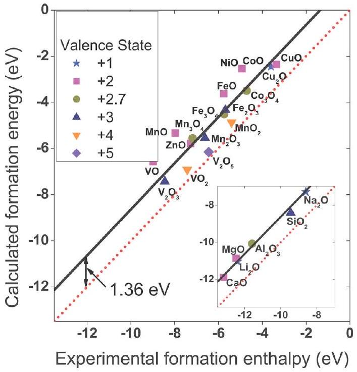
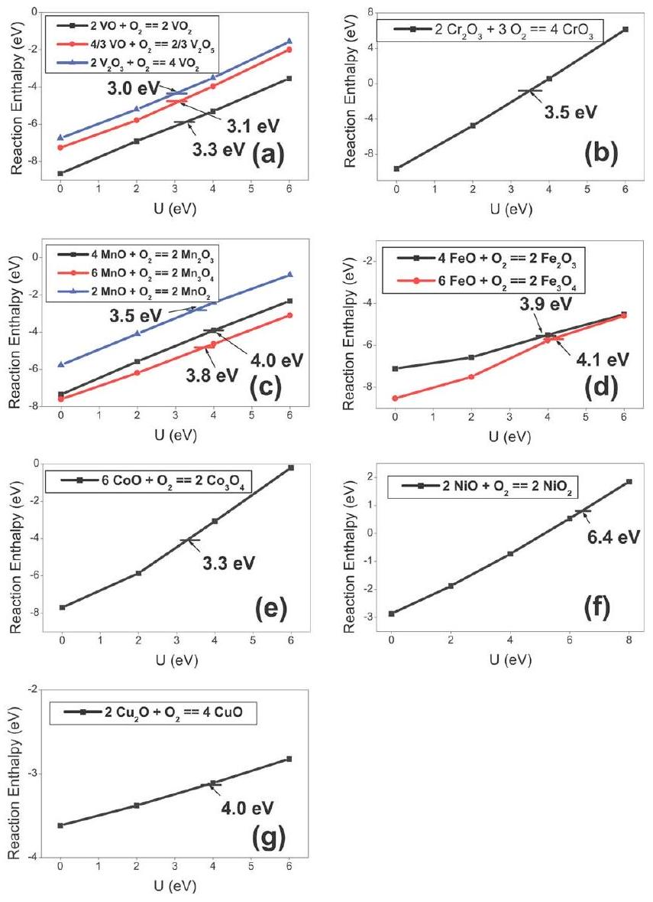

# Oxidation energies of transition metal oxides within the GGA + U framework

Lei Wang, Thomas Maxisch, and Gerbrand Ceder* Department of Materials Science and Engineering, Massachusetts Institute of Technology, Cambridge, Massachusetts 02139, USA

(Received 23 November 2005; revised manuscript received 13 March 2006; published 4 May 2006)

#### Abstract

The energy of a large number of oxidation reactions of $3 d$ transition metal oxides is computed using the generalized gradient approach (GGA) and GGA+U methods. Two substantial contributions to the error in GGA oxidation energies are identified. The first contribution originates from the overbinding of GGA in the $\mathrm{O}_{2}$ molecule and only occurs when the oxidant is $\mathrm{O}_{2}$. The second error occurs in all oxidation reactions and is related to the correlation error in 3d orbitals in GGA. Strong self-interaction in GGA systematically penalizes a reduced state (with more $d$ electrons) over an oxidized state, resulting in an overestimation of oxidation energies. The constant error in the oxidation energy from the $\mathrm{O}_{2}$ binding error can be corrected by fitting the formation enthalpy of simple nontransition metal oxides. Removal of the $\mathrm{O}_{2}$ binding error makes it possible to address the correlation effects in $3 d$ transition metal oxides with the GGA+U method. Calculated oxidation energies agree well with experimental data for reasonable and consistent values of U.

DOI: 10.1103/PhysRevB.73.195107
PACS number(s): 71.15.Nc

## I. INTRODUCTION

Oxidation and reduction reactions play a key role in many technological and environmental processes, such as corrosion, combustion, metal refining, electrochemical energy generation and storage, photosynthesis, and metabolism. The ability to correctly predict the reaction energy and electrochemical potentials of such reactions with first-principles methods is therefore important. Although the local density approximation (LDA) and generalized gradient approximation (GGA), two standard approximations to density functional theory (DFT), are rather crude approximations to the many-body electron problems, their successes in accurately predicting materials properties are in large part due to the cancellation of errors in energy differences. In this paper, we show that GGA has systematic and noncanceling errors in the energy of oxidation reactions for $3 d$ transition metals, and we identify two causes for them.

It is well known that the binding energy of the $\mathrm{O}_{2}$ molecule exhibits large errors when LDA or GGA is used. ${ }^{1-3}$ Much of this overbinding is not canceled when forming an oxide where $\mathrm{O}^{2-}$ binds largely electrostatically. The overbinding of the $\mathrm{O}_{2}$ molecule by both LDA and GGA makes calculated oxidation energies less negative than experimental values when $\mathrm{O}_{2}$ is the oxidant. While the $\mathrm{O}_{2}$ binding error represents essentially a constant shift in oxidation energies and, if present alone, would be easy to correct for, a more subtle error arises due to the self-interaction errors present in LDA and GGA. This error, related to the fact that reduced and oxidized states in transition metal oxides have different numbers of localized $d$ electrons, is present even when the energy of the oxidant is exactly known. The magnitude of the self-interaction in LDA and GGA depends very much on the nature of the hybridization of electron orbitals in the oxide. When an electron is transferred between significantly different environments, as is the case for many redox processes, little error cancellation is to be expected. This is well observed in GGA (or LDA) predictions for electrochemical oxidation reactions, in which the energy of the oxidation source (the electron acceptor) is not suspect as in the case for $\mathrm{O}_{2}$. For example, the energy to simultaneously extract a $\mathrm{Li}^{+}$ion and an electron from a lithium transition metal oxide and add both to Li metal can be in error by as much as 1.5 eV (out of 4 eV). ${ }^{4}$ The $\mathrm{Li}^{+}$binding in the oxide is purely electrostatic and should be well represented by LDA or GGA. The culprit in these large electrochemical energy errors is the $3 d$-metal oxidation state change. When an electron is removed from the localized $3 d$ orbital of a transition metal ion in an oxide, and transferred to the metallic $2 s$ orbital of $\mathrm{Li}^{+}$ion in the metal (the electron accepting process), it experiences considerably less self-interaction in the metallic state of Li, leading to a consistent underestimation of the energy required for this redox process. While this error has been identified and corrected in calculations on Liinsertion oxides, ${ }^{4,5}$ we expect that similar effects will play a role in the reactions of transition metals to their oxides. In this paper, we investigate a large number of oxidation reactions of $3 d$ metals and attempt to separate the error related to the $\mathrm{O}_{2}$ molecule from that caused by the self-interaction. We also suggest that the latter error can be remedied with GGA + U.

## II. METHODOLOGY AND BACKGROUND

## A. Computational methods

The total energies of oxides and metals in this work are calculated with the generalized gradient approximation to DFT and with the GGA+U extension to it. Projected augmented wave (PAW) (Ref. 6) pseudopotentials are used, as implemented in the vienna ab initio simulation package (VASP). ${ }^{7}$ An energy cutoff of 550 eV and appropriate $k$-point meshes are chosen so that the total ground-state energies are converged within 3 meV per formula unit. All atom coordinates and lattice vectors are fully relaxed for each structure. For oxides having mixed valence, such as $\mathrm{Co}_{3} \mathrm{O}_{4}, \mathrm{Fe}_{3} \mathrm{O}_{4}$, and $\mathrm{Mn}_{3} \mathrm{O}_{4}$, the crystal symmetry is removed by imposing different initial magnetic moments on the ions, so that the electronic ground state can adopt lower symmetry than the ionic
configuration. All calculations are spin-polarized unless stated otherwise.

The DFT+U method was developed by Anisimov et al. ${ }^{8,9}$ to deal with electron correlations in transition metal and rare earth compounds. Its implementation within a PAW framework was developed by Bengone et al. ${ }^{5}$ For a more detailed comparison of LDA+U and GGA+U, the reader can refer to the work of Rohrbach et al. ${ }^{10}$ The key concept of DFT + U is to address the on-site Coulomb interactions in the localized $d$ or $f$ orbitals with an additional Hubbard-type term. At the GGA +U level, the total energy can be summarized by the following expression: ${ }^{11}$

$$
E^{G G A+U}=E^{G G A}+\frac{\bar{U}-\bar{J}}{2} \sum_{\sigma}\left[\left(\sum_{m} n_{m, m}^{\sigma}\right)-\left(\sum_{m, m^{\prime}} n_{m, m^{\prime}}^{\sigma} n_{m^{\prime}, m}^{\sigma}\right)\right],
$$

where $\bar{U}$ and $\bar{J}$ are spherically averaged matrix elements of the on-site Coulomb interactions, and $n$ is the on-site 3d-orbital occupation matrix obtained by projection of the wave function onto $3 d$ atomiclike states. ( $m$ or $m^{\prime}=-2$, $-1,0,1,2$ denotes different $d$ orbitals, while $\sigma=1$ or -1 denotes spin.) Note that we express the on-site occupation matrix in an explicit spin and orbital representation. An effective interaction parameter $U_{\text {eff }}=\bar{U}-\bar{J}$, or simply U, can be introduced. The calculated total energies are insensitive to $\bar{J}$ when $U_{\text {eff }}$ is fixed.

In this paper we focus solely on oxidation reactions with $\mathrm{O}_{2}$, as accurate experimental data are available for them. We consider the general oxidation reaction,

$$
M \mathrm{O}_{x}+\frac{y-x}{2} \mathrm{O}_{2} \rightarrow M \mathrm{O}_{y},
$$

and calculate the reaction energy (on a per $\mathrm{O}_{2}$ molecule basis) as

$$
\Delta \mathrm{H}_{o}=\frac{E\left(M \mathrm{O}_{y}\right)-E\left(M \mathrm{O}_{x}\right)-\frac{y-x}{2} E\left(\mathrm{O}_{2}\right)}{\frac{y-x}{2}} .
$$

Note that we neglect the small $P \Delta V$ term when comparing calculated reaction energies with measured enthalpies. Experimental room temperature formation enthalpy and heat capacity of compounds are obtained from the JANAF thermochemical tables ${ }^{12}$ and from the monograph by Kubaschewski. ${ }^{13}$

## B. Crystal structures

The oxides of V, Cr, Mn, Fe, Co, Ni, and Cu are studied in this paper. We did not investigate Ti oxides as they are metallic in their partially reduced states, where GGA+U might not be an appropriate approach. The crystal structures of these oxides and their magnetic configurations are summarized in Table I. Since $\beta-\mathrm{MnO}_{2}$ has a nontrivial helimagnetic structure, we assume a ferromagnetic electronic structure for practical reasons.

TABLE I. Crystal structures and magnetic configurations of transition metal oxides. Except for $\beta-\mathrm{MnO}_{2}$ the experimental structures and magnetic configurations were used in the calculations.
| TMO | Crystal structure | Magnetic structure | $T_{N} / \mathrm{K}$ or $T_{C} / \mathrm{K}$ |
| :--- | :--- | :--- | :--- |
| VO | Fm-3m (Ref. 14) | AFM ${ }^{\text {a }}$ | 125 (Ref. 15) |
| MnO | Fm-3m (Ref. 14) | AFM | 122 (Ref. 16) |
| FeO | Fm-3m (Ref. 14) | AFM | 175 (Ref. 16) |
| CoO | Fm-3m (Ref. 14) | AFM | 289 (Ref. 16) |
| NiO | Fm-3m (Ref. 14) | AFM | 523 (Ref. 16) |
| CuO | $C 2 / c$ (Ref. 17) | AFM | 225 (Ref. 18) |
| $\mathrm{VO}_{2}$ | $P 2_{1} / c$ (Ref. 14) | NM ${ }^{\mathrm{b}}$ | 340 (Ref. 19) |
| $\beta-\mathrm{MnO}_{2}$ | $P 4_{2} / m n m$ (Ref. 14) | AFM | 92 (Ref. 20) |
| $\mathrm{NiO}_{2}$ | $R-3 m$ or $C 2 / m$ (Ref. 21) |  |  |
| $\mathrm{V}_{2} \mathrm{O}_{3}$ | R-3c (Ref. 14) | AFM | 150 (Ref. 15) |
| $\mathrm{Cr}_{2} \mathrm{O}_{3}$ | R-3 (Ref. 14) | AFM | 310 (Ref. 22) |
| $\alpha-\mathrm{Mn}_{2} \mathrm{O}_{3}$ | Pbca (Ref. 23) | AFM | 90 (Ref. 23) |
| $\alpha-\mathrm{Fe}_{2} \mathrm{O}_{3}$ | R-3c (Ref. 14) | AFM | 953 (Ref. 14) |
| $\mathrm{Mn}_{3} \mathrm{O}_{4}$ | $I 4_{1}$ / amd (Ref. 24) | $\mathrm{FM}^{\mathrm{c}}$ | 42 (Ref. 25) |
| $\mathrm{Fe}_{3} \mathrm{O}_{4}$ | Fd-3m (Ref. 8) | FM ${ }^{\text {d }}$ | 860 (Ref. 8) |
| $\mathrm{Co}_{3} \mathrm{O}_{4}$ | $F d-3 m$ (Ref. 26) | AFM | 33 (Ref. 27) |
| $\mathrm{Cu}_{2} \mathrm{O}$ | $P n-3 m$ (Ref. 28) | DM ${ }^{\mathrm{e}}$ |  |
| $\mathrm{V}_{2} \mathrm{O}_{5}$ | Pmmn (Ref. 29) | DM |  |
| $\mathrm{CrO}_{3}$ | $C 2 c m$ (Ref. 30) | DM |  |

${ }^{\mathrm{a}}$ Antiferromagnetic.
${ }^{\mathrm{b}}$ Nonmagnetic.
${ }^{\mathrm{c}}$ Ferromagnetic.
${ }^{\mathrm{d}}$ Ferrimagnetic.
${ }^{\mathrm{e}}$ Diamagnetic.

## III. RESULTS

Figure 1 shows the energy to form various oxides from their metals as calculated using GGA. The calculated reaction energy (per mole $\mathrm{O}_{2}$ ) is plotted versus the experimental enthalpy. There is a clear tendency for GGA to underestimate the oxidation energy. This trend can be attributed to the overbinding of GGA in the $\mathrm{O}_{2}$ molecule. We calculate a binding energy of $\mathrm{O}_{2}$ of -6.02 eV, which compares well with previous GGA calculations of $-5.99 \mathrm{eV} .{ }^{31}$ The experimental binding energy is considerably lower and about $-5.23 \mathrm{eV} .{ }^{32}$ To separate the $\mathrm{O}_{2}$ binding error from more complex correlation effects in the 3d localized orbitals of transition metal oxides, the oxidation energies of several nontransition metal oxides are plotted as an inset in Fig. 1. The latter indicates a rather constant shift between calculated and experimental values. The minor deviation of $\mathrm{SiO}_{2}$ from the constant shift can be attributed to the high Si-O bond covalency in that oxide. The constant shift, estimated as -1.36 eV per $\mathrm{O}_{2}$ from Fig. 1, is larger than the binding energy error of $\mathrm{O}_{2}$ in GGA. We believe that the additional error might be GGA error associated with adding electrons to the oxygen $p$ orbital when $\mathrm{O}^{2-}$ is formed from $\mathrm{O}_{2}$.

FIG. 1. (Color online) Formation energy of oxides (per $\mathrm{O}_{2}$ in the reaction) in the GGA approximation as a function of the experimental enthalpy (Refs. 12 and 13). The data symbol indicates the valence of the metal ion. The inset shows nontransition metal oxides. The solid line is the best fit for the nontransition metal data, and a -1.36 eV energy correction for $\mathrm{O}_{2}$ molecule is obtained from this fit.

By using the correction derived in this way for the $\mathrm{O}_{2}$ molecule, we can identify other sources of error in the oxidation energy obtained with GGA. Substantial deviations between calculated and experimental values still exist for the $3 d$ transition metal oxides. We believe that the remaining error is due to inaccuracies of GGA in the correlation energy of the 3d states in the transition metal oxides. Correlation effects are substantial in the localized orbitals formed by the metal $3 d$ orbital and oxygen $2 p$ ligands.

Correlation effects in localized orbitals can be treated with the GGA+U approach. ${ }^{8,9,33,34}$ In GGA+U, local atomiclike $3 d$ states are projected out and treated with a Hubbard model. While this treats correlation between the $3 d$ states and removes the self-interaction, it suffers somewhat from the arbitrary nature of the projection orbitals, which are atomiclike, rather than the true one-electron orbitals. This makes GGA+U less applicable to metals where the $d$ orbitals are not atomiclike anymore. Because of this problem with metallic states, we investigate the accuracy of GGA+U on reactions that oxidize a low-valent oxide to a higher valent one, e.g., $M \mathrm{O}_{x}+\frac{y-x}{2} \mathrm{O}_{2} \rightarrow M \mathrm{O}_{y}$. Since these reactions involve a transfer of electrons from the $3 d$ states of the metal to the oxygen $2 p$ states, these reactions should still show the energy error that GGA makes in the $3 d$ transition metal orbitals.

Figure 2 shows how the calculated oxidation energies for several transition metal oxides change with the value of U in the GGA + U method. For a transition metal with $n$ accessible oxidation states ( $n-1$ ) independent oxidation reactions are shown. Short horizontal lines indicate the experimental values of the oxidation enthalpy at room temperature. The corrected value for the $\mathrm{O}_{2}$ molecule is taken into account to obtain these results.

For all the oxidation reactions we investigated, unmodified GGA (at $\mathrm{U}=0$ ) overestimates the oxidation energies, in

FIG. 2. (Color online) Oxidation energies of transition metal oxides as a function of U: (a) vanadium oxides; (b) chromium oxides; (c) manganese oxides; (d) iron oxides; (e) cobalt oxides; (f) nickel oxides; (g) copper oxides. Short horizontal lines indicate experimental oxidation enthalpy values at room temperature.

some cases by several electron volts. Turning on U stabilizes the reduction products (which have more $3 d$ electrons) and reduces the oxidation energy. This trend is obtained consistently in all six chemistries and with all reactions studied. In the three systems (V, Mn, and Fe), for which data on multiple oxidation reactions are available, it is encouraging that the U values, which bring each calculated oxidation energy in agreement with experiments, lie within a narrow range. To investigate whether these U values also improve the other physical properties, we show in Table II the band gaps and magnetic moments, calculated in the GGA+U with U values derived from Fig. 2. GGA results and available experimental values are also provided. It is encouraging that for many systems, the U value that corrects the oxidation energies also improves the band gaps and magnetic moments. A few notable exceptions are present. The electronic structure of Cu oxides is challenging and it is not surprising that even GGA +U does not obtain good band gaps for CuO and $\mathrm{Cu}_{2} \mathrm{O}$. The large discrepancy in $\mathrm{Fe}_{3} \mathrm{O}_{4}$ is possibly related to the off-stoichiometry and charge disorder between the $A$ and $B$ sites that are common in this material.

TABLE II. Magnetic moments $M$ (in $\mu_{B}$ per TM atom), band gaps $E_{g}$ (in eV) and U values (in eV) used for transition metal oxides.
| TMO | $M$ |  |  |  |  | $E_{g}$ |  | $\mathrm{U}^{\mathrm{a}}$ |
| :--- | :--- | :--- | :--- | :--- | :--- | :--- | :--- | :--- |
|  | GGA | GGA + U | Expt. | GGA | GGA +U |  | Expt. |  |
| VO | 2.12 | 2.68 |  | 0.6 | 2.4 |  |  | 3.1 |
| MnO | 4.39 | 4.65 | 4.58-4.79 (Ref. 9) | 1.5 | 3.2 |  |  | 4.0 |
| FeO | 3.43 | 3.69 | 3.32 | 0 | 2.2 |  | 2.4 (Ref. 35) | 4.0 |
| CoO | 2.37 | 2.65 | 3.35-3.8 (Ref. 9) | 0 | 2 |  | 2.4 (Ref. 35) | 3.3 |
| NiO | 1.32 | 1.72 | 1.64-1.90 (Ref. 9) | 0.6 | 3.4 |  | 4 (Ref. 35) | 6.4 |
| CuO | 0 | 0.53 | 0.68 (Ref. 18) | 0 | 0.5 |  | 1.4 (Ref. 35) | 4.0 |
| $\mathrm{VO}_{2}$ | 0 | 1.09 |  | 0.1 | 0.8 |  | 0.7 (Ref. 35) |  |
| $\beta-\mathrm{MnO}_{2}$ | 2.74 | 3.24 | 1.84-2.35 (Ref. 20) | 0 | 0 |  |  |  |
| $\mathrm{V}_{2} \mathrm{O}_{3}$ | 1.38 | 1.85 | 1.2 (Ref. 36) | 0 | 1.3 |  | 0.2 (Ref. 35) |  |
| $\mathrm{Cr}_{2} \mathrm{O}_{3}$ | 2.63 | 2.9 | 3.8 (Ref. 37) | 1 | 2.8 |  | 3.4 (Ref. 35) | 3.5 |
| $\alpha-\mathrm{Mn}_{2} \mathrm{O}_{3}$ | 3.56 | 3.92 | 3.4-3.9 (Ref. 23) | 0 | 0.5 |  |  |  |
| $\alpha-\mathrm{Fe}_{2} \mathrm{O}_{3}$ | 3.58 | 4.14 | 4.9 (Ref. 38) | 0.5 | 1.8 |  | 2.0-2.7 (Ref. 35), 2 (Ref. 38) |  |
| $\mathrm{Mn}_{3} \mathrm{O}_{4}$ | $4.48{ }^{\mathrm{b}}$ | $4.70^{\mathrm{b}}$ |  | 0.2 | 0.6 |  |  |  |
|  | $3.82^{\mathrm{c}}$ | $4.01^{\mathrm{c}}$ |  |  |  |  |  |  |
| $\mathrm{Fe}_{3} \mathrm{O}_{4}$ | $3.54^{\mathrm{b}}$ | $4.06^{\mathrm{b}}$ | 4 (Ref. 15) | 0 | 1.7 |  | 0.07 (Ref. 39) |  |
|  | $3.60^{\mathrm{c}}$ | $3.64^{\mathrm{c}}$ |  |  |  |  |  |  |
|  | $3.59^{\mathrm{c}}$ | $4.17^{\mathrm{c}}$ |  |  |  |  |  |  |
| $\mathrm{Co}_{3} \mathrm{O}_{4}$ | $2.39^{\mathrm{b}}$ | $2.67^{\mathrm{b}}$ | 3.02 (Ref. 40) | 0.7 | 1.6 |  | 1.6 (Ref. 41) |  |
|  | $0.11^{\mathrm{c}}$ | $0.07^{\mathrm{c}}$ |  |  |  |  |  |  |
| $\mathrm{Cu}_{2} \mathrm{O}$ | 0 | 0 |  | 0.4 | 0.6 |  | 2.4 (Ref. 35) |  |
| $\mathrm{V}_{2} \mathrm{O}_{5}$ | 0 | 0 |  | 1.6 | 2.1 |  | 2.0 (Ref. 35) |  |
| $\mathrm{CrO}_{3}$ | 0 | 0 |  | 1.7 | 1.8 |  |  |  |

${ }^{\mathrm{a}}$ The same U value for each transition metal oxides system.
${ }^{\mathrm{b}} A$ sites.
${ }^{\mathrm{c}} B$ sites in spinel structure $A \mathrm{~B}_{2} \mathrm{O}_{4}$.

## IV. DISCUSSION

All calculated oxidation energies are less negative than experimental values when GGA is used. We believe that this error is systematic and has two distinct contributions. The first and most obvious error originates from the inaccuracy of GGA in reproducing the $\mathrm{O}_{2}$ change of state. The $\mathrm{O}_{2}$ molecule binds too strongly in GGA and its dissociation in oxidation reactions therefore requires too much energy, leading to an underestimation of the oxidation energy. It is not likely that the GGA error in describing the covalent bonding of $\mathrm{O}_{2}$ cancels in the reaction energy as the oxygen ion has limited covalency in the oxide. Rather than correcting reaction energies with the difference between the calculated and experimental binding energy of $\mathrm{O}_{2}$, we choose to fit a correction to the formation enthalpy of simple nontransition metal oxides, such as $\mathrm{Li}_{2} \mathrm{O}, \mathrm{MgO}$, etc. This allows us to include any correlation energy error associated with adding two electrons to the oxygen $p$ orbital.

We believe that the remaining error, after the oxygen change of state is corrected, is due to the correlation energy in the $3 d$ metal states. This error will also be present in oxidation reactions that do not involve $\mathrm{O}_{2}$ molecules. The correlation energy can clearly be identified (Fig. 2): all GGA oxidation energies are too negative, indicating that GGA penalizes the reduced state where more $3 d$ orbitals are filled. This is similar to what has been observed for electrochemical redox energies (where the energy of $\mathrm{O}_{2}$ does not play a role): the GGA self-interaction overestimates the energy of the filled $3 d$ states, thereby artificially lowering redox potentials. In our results, the effect of the self-interaction is to increase the energy of the reduced state. It is then no surprise that increasing the localization into $3 d$ orbitals and removing self-interaction from it with GGA+U decreases the magnitude of the oxidation energy, bringing it closer to experimental values.

Note that if an uncorrected $\mathrm{O}_{2}$ energy is used, the pure GGA results in Fig. 2 would be in better agreement with experiment, due to the cancellation of two substantial errors: underestimation of the oxidation energy due to the $\mathrm{O}_{2}$ binding error and overestimation due to the self-interaction in $3 d$ states. This cancellation is rather arbitrary and cannot be relied upon to get accurate results. Indeed, differences between
calculated and experimental oxidation energies in GGA can be as high as 1 eV.

The U values that bring the calculated oxidation energies in agreement with experimental results are remarkably consistent for a given transition metal, which implies that the U values of different oxidation states may lie close together. This could make the GGA+U with the U values fitted here of practical value in predicting the potential and energy of redox processes more accurately.

We did not discuss oxides of Ti in this paper. Ti oxides have weakly localized $d$-orbital electrons, and when reduced are almost always metallic. The GGA+U approach used here [also referred to as the fully localized limit (FLL) GGA + U], is developed to correct band gap errors of insulators, and is not appropriate for such metallic systems. For these metal oxides having weak electron correlations, approaches such as the around mean field (AMF) GGA+U approach ${ }^{42-44}$ may be more appropriate. The AMF GGA+U approach has shown success in metallic systems with weak correlation, e.g., $\mathrm{Fe}_{3} \mathrm{Al},{ }^{44}$ and FeAl. ${ }^{42}$

Finally, in this paper we use the experimental reaction enthalpy data at room temperature, while our first-principles calculations results are for 0 K. The enthalpy difference is estimated by integrating the heat capacity difference between the reactants and products from 0 K to room temperature. We find that this difference is usually less than 10 kJ per mole $\mathrm{O}_{2}$ (100 meV/molecule). Taking the oxidation of VO to $\mathrm{VO}_{2}$ as an example, the enthalpy difference between 0 K and room temperature is just 5.77 kJ per mole of $\mathrm{O}_{2}$ reacted. This small enthalpy difference will have only a small influence on our results. The only exception is the reaction of cobalt oxide " $6 \mathrm{CoO}+\mathrm{O}_{2} \rightarrow 2 \mathrm{Co}_{3} \mathrm{O}_{4}$," which has a relative large enthalpy difference of 28 kJ per mole of $\mathrm{O}_{2}$ reacted between room temperature and 0 K. This difference would change the fitted U to 3.5 eV, compared to the value of 3.3 eV in Fig. 2(e).

In conclusion, we have investigated the oxidation energies of $3 d$ transition metal using GGA and GGA + U. When using $\mathrm{O}_{2}$ as the oxidant, the error in the binding energy of $\mathrm{O}_{2}$ is opposite the error caused by the correlation error in the $3 d$ orbitals, and the two errors mask each other to some extent. Hence, GGA will be considerably more in error when calculating reactions where $3 d$ metals (oxides) are oxidized by means other than oxygen. The calculated reaction energies become correct for very reasonable and systematic values of U. Although GGA +U is semiempirical in nature, it has been found to improve the accuracy in predicting the energetics of redox processes from first principles.

## ACKNOWLEDGMENTS

This work was supported by the U.S. Department of Energy under Contract No. DE-FG02-96ER45571 and the BATT program under Contract No. 6517748. L. Wang would like to thank M. Cococcioni for the valuable advice.
*Author to whom correspondence should be addressed. Email address: gceder@mit.edu
${ }^{1}$ R. O. Jones and O. Gunnarsson, Rev. Mod. Phys. 61, 689 (1989).
${ }^{2}$ D. C. Patton, D. V. Porezag, and M. R. Pederson, Phys. Rev. B 55, 7454 (1997).
${ }^{3}$ B. Hammer, L. B. Hansen, and J. K. Nørskov, Phys. Rev. B 59, 7413 (1999).
${ }^{4}$ F. Zhou, M. Cococcioni, C. A. Marianetti, D. Morgan, and G. Ceder, Phys. Rev. B 70, 235121 (2004).
${ }^{5}$ O. Le Bacq, A. Pasturel, and O. Bengone, Phys. Rev. B 69, 245107 (2004).
${ }^{6}$ G. Kresse and D. Joubert, Phys. Rev. B 59, 1758 (1999).
${ }^{7}$ G. Kresse and J. Furthmüller, Phys. Rev. B 54, 11169 (1996); Comput. Mater. Sci. 6, 15 (1996).
${ }^{8}$ V. I. Anisimov, F. Aryasetiawan, and A. I. Liechtenstein, J. Phys.: Condens. Matter 9, 767 (1997).
${ }^{9}$ V. I. Anisimov, J. Zaanen, and O. K. Andersen, Phys. Rev. B 44, 943 (1991).
${ }^{10}$ A. Rohrbach, J. Hafner, and G. Kresse, J. Phys.: Condens. Matter 15, 979 (2003).
${ }^{11}$ S. L. Dudarev, G. A. Botton, S. Y. Savrasov, C. J. Humphreys, and A. P. Sutton, Phys. Rev. B 57, 1505 (1998).
${ }^{12}$ M. W. Chase, NIST-JANAF Thermochemical Tables (American Chemical Society, New York, 1998).
${ }^{13}$ O. Kubaschewski, C. B. Alcock, and P. I. Spencer, Materials Thermochemistry (Pergamon Press, Oxford, 1993).
${ }^{14}$ C. N. R. Rao and B. Raveau, Transition Metal Oxides (Wiley-

VCH, New York, 1995).
${ }^{15}$ D. Adler, Rev. Mod. Phys. 40, 714 (1968).
${ }^{16}$ J. Kübler and A. R. Williams, J. Magn. Magn. Mater. 54, 603 (1986).
${ }^{17}$ H. Yamada, Y. Soejima, X. G. Zheng, and M. Kawaminami, Trans. Mater. Res. Soc. Jpn. 25, 1199 (2000).
${ }^{18}$ B. X. Yang, J. M. Tranquada, and G. Shirane, Phys. Rev. B 38, 174 (1988).
${ }^{19}$ M. Abbate, F. M. F. de Groot, J. C. Fuggle, Y. J. Ma, C. T. Chen, F. Sette, A. Fujimori, Y. Ueda, and K. Kosuge, Phys. Rev. B 43, 7263 (1991).
${ }^{20}$ M. Regulski, R. Przenioslo, I. Sosnowska, D. Hohlwein, and R. Schneider, J. Alloys Compd. 362, 236 (2004).
${ }^{21}$ J. M. Tarascon, G. Vaughan, Y. Chabre, L. Seguin, M. Anne, P. Strobel, and G. Amatucci, J. Solid State Chem. 147, 410 (1999).
${ }^{22}$ B. N. Brockhouse, J. Chem. Phys. 21, 961 (1953).
${ }^{23}$ M. Regulski, R. Przenioslo, I. Sosnowska, D. Hohlwein, and R. Schneider, J. Alloys Compd. 362, 236 (2004).
${ }^{24}$ V. Baron, J. Gutzmer, H. Rundloef, and R. Tellgren, Am. Mineral. 83, 786 (1998).
${ }^{25}$ B. Chardon and F. Vigneron, J. Magn. Magn. Mater. 58, 128 (1986).
${ }^{26}$ W. L. Smith and A. D. Hobson, Acta Crystallogr., Sect. B: Struct. Crystallogr. Cryst. Chem. 29, 362 (1973).
${ }^{27}$ W. Kündig, M. Kobelt, H. Appel, G. Constabaris, and R. H. Lindquist, J. Phys. Chem. Solids 30, 819 (1969).
${ }^{28}$ R. Restori and D. Schwarzenbach, Acta Crystallogr., Sect. B:

Struct. Sci. 42, 201 (1986).
${ }^{29}$ R. Enjalbert and J. Galy, Acta Crystallogr., Sect. C: Cryst. Struct. Commun. 42, 1467 (1986).
${ }^{30}$ A. Bystroem and K. A. Wilhelmi, Acta Chem. Scand. (1947-1973) 4, 1131 (1950).
${ }^{31}$ B. Hammer, L. B. Hansen, and J. K. Nørskov, Phys. Rev. B 59, 7413 (1999).
${ }^{32}$ J. A. Pople, M. H. Gordon, D. J. Fox, K. Raghavachari, and L. A. Curtiss, J. Chem. Phys. 90, 5622 (1989).
${ }^{33}$ W. E. Pickett, S. C. Erwin, and E. C. Ethridge, Phys. Rev. B 58, 1201 (1998).
${ }^{34}$ I. V. Solovyev, P. H. Dederichs, and V. I. Anisimov, Phys. Rev. B 50, 16861 (1994).
${ }^{35}$ R. Zimmermann, P. Steiner, R. Claessen, F. Reinert, S. Hufner, P. Blaha, and P. Dufek, J. Phys.: Condens. Matter 11, 1657 (1999).
${ }^{36}$ C. Castellani, C. R. Natoli, and J. Ranninger, Phys. Rev. B 18, 4945 (1978).
${ }^{37}$ A. Rohrbach, J. Hafner, and G. Kresse, Phys. Rev. B 70, 125426 (2004).
${ }^{38}$ G. Rollmann, A. Rohrbach, P. Entel, and J. Hafner, Phys. Rev. B 69, 165107 (2004).
${ }^{39}$ A. Chainani, T. Yokoya, T. Morimoto, T. Takahashi, and S. Todo, Phys. Rev. B 51, 17976 (1995).
${ }^{40}$ W. L. Roth, J. Phys. Chem. Solids 25, 1 (1964).
${ }^{41}$ J. van Elp, J. L. Wieland, H. Eskes, P. Kuiper, G. A. Sawatzky, F. M. F. de Groot, and T. S. Turner, Phys. Rev. B 44, 6090 (1991).
${ }^{42}$ P. Mohn, C. Persson, P. Blaha, K. Schwarz, P. Novák, and H. Eschrig, Phys. Rev. Lett. 87, 196401 (2001).
${ }^{43}$ A. G. Petukhov, I. I. Mazin, L. Chioncel, and A. I. Lichtenstein, Phys. Rev. B 67, 153106 (2003).
${ }^{44}$ F. Lechermann, M. Fähnle, B. Meyer, and C. Elsässer, Phys. Rev. B 69, 165116 (2004).
