# Thermodynamic modelling of the cerium-oxygen system 

Matvei Zinkevich*, Dejan Djurovic, Fritz Aldinger Max-Planck Institut für Metallforschung, Institut für Nichtmetallische Anorganische Materialien, Universität Stuttgart, Heisenbergstr. 3, D-70569 Stuttgart, Germany

Received 29 June 2005; received in revised form 25 January 2006; accepted 28 February 2006

#### Abstract

The published data for the thermochemical properties and phase relationships of the cerium-oxygen system have been critically examined. No major inconsistencies in the experimental database have been found. Thermodynamic model parameters of all phases, i.e., liquid, fcc-Ce, bcc-Ce, A-, H-, and X- $\mathrm{Ce}_{2} \mathrm{O}_{3-x}, \mathrm{Ce}_{3} \mathrm{O}_{5 \pm x}\left(\mathrm{Mn}_{2} \mathrm{O}_{3}\right.$-type), $\mathrm{CeO}_{2-x}$, as well as $\mathrm{Ce}_{11} \mathrm{O}_{20}, \mathrm{Ce}_{62} \mathrm{O}_{112}, \mathrm{Ce}_{40} \mathrm{O}_{72}, \mathrm{Ce}_{19} \mathrm{O}_{34}, \mathrm{Ce}_{9} \mathrm{O}_{16}$, and $\mathrm{Ce}_{7} \mathrm{O}_{12}$ have been derived by the least-squares minimization procedure using Thermo-Calc ${ }^{\circledR}$ software. The models are simple to be compatible with the standard Gibbs energy minimization procedure, but provide enough flexibility to account for the crystal structure, defect chemistry, and thermodynamic properties of phases in the $\mathrm{Ce}-\mathrm{O}$ system. The backward compatibility of the refined parameters with experimental data has been demonstrated by calculation of phase and property diagrams. The $\mathrm{Ce}-\mathrm{O}$ phase diagram in the whole range of compositions and at elevated temperature, a complete list of invariant reactions as well as the enthalpy and entropy of formation of $\mathrm{Ce}_{n} \mathrm{O}_{2 n-2 m}$ phases are presented for the first time.

© 2006 Elsevier B.V. All rights reserved.

Keywords: Ceria; Phase diagram; Thermodynamics; Defect chemistry; Compound energy formalism

## 1. Introduction

Owing to the great technological interest, cerium-oxygen system has been a subject of numerous studies over the past several decades. Cerium oxides are of interest to the steel industry since cerium is used as a deoxidizing and desulphurising agent and also improve the oxidation resistance of stainless steel. Pure ceria is an effective catalyst, while it becomes solid electrolyte upon doping with cations of lower valency. The phase diagram of $\mathrm{Ce}-\mathrm{O}$ system, however, is still a subject of controversy. On the one hand, this is due to the complexity of phase relations at low temperatures, where the defect fluorite structure orders to form a series of discrete compounds $\mathrm{Ce}_{n} \mathrm{O}_{2 n-2 m}$. On the other hand, cerium oxides are refractory compounds, so that the liquid phase is difficult to study experimentally.

[^0]Considerable efforts have been dedicated to the model representation of the nonstoichiometry of cerium dioxide using the CALPHAD method [1-3] and statistical-thermodynamic approach [4-7]. However, none of the proposed models accounts simultaneously for thermochemical properties, the defect chemistry and the $\mathrm{Ce}-\mathrm{O}$ phase diagram in the whole composition range. The development of a model, which does so is the objective of the present work.

## 2. Survey of literature information

The binary system $\mathrm{Ce}-\mathrm{O}$ contains the gas phase, the liquid phase, the interstitial solid solutions of oxygen in fcc- and bccCe and various oxide phases (Table 1). The dioxide, $\mathrm{CeO}_{2}$ and sesquioxide, $\mathrm{Ce}_{2} \mathrm{O}_{3}$ are well-known compounds, whereas a confusion existed in the literature regarding intermediate phases and their thermodynamic stability [12]. Recent studies [9,1315] have shown that a variety of discrete compounds, which have been reported to exist in the $\mathrm{Ce}-\mathrm{O}$ system are commensurate superstructures of the fluorite-type lattice and their compositions can be rationalized as $\mathrm{Ce}_{n} \mathrm{O}_{2 n-2 m}$, where $n$ and $m$ are integers $(n>m)$. Apart from the phases shown in

Table 1
Crystallographic data for cerium oxides
| Phase | O/Ce ratio | $n$ | $m$ | Pearson symbol | Space group | Prototype | Lattice parameters ${ }^{\text {a }}$ | Ref. |
| :--- | :--- | :--- | :--- | :--- | :--- | :--- | :--- | :--- |
| $\mathrm{Ce}_{2} \mathrm{O}_{3-x}$ (A) | $(3-x) / 2$ | 4 | 1 | hP5 | $P \overline{3} \frac{2}{m} 1$ | A- $\mathrm{La}_{2} \mathrm{O}_{3}$ | $a=0.3891(1) \mathrm{nm}$   $c=0.6059(1) \mathrm{nm}$ | [8] |
| $\mathrm{Ce}_{3} \mathrm{O}_{5 \pm x}$ (C) | $(5 \pm x) / 3$ | 6 | 1 | $c I 96$ | la $\overline{3}$ | $\mathrm{Mn}_{2} \mathrm{O}_{3}$ | $a=1.111(2) \mathrm{nm}$ | [9] |
| $\mathrm{Ce}_{7} \mathrm{O}_{12}$ | 1.714 | 7 | 1 | hR19 | $R \overline{3}$ | $\mathrm{UY}_{6} \mathrm{O}_{12}$ | $a=0.6785(1) \mathrm{nm}$   $\alpha=99.42(1)^{\circ}$ | [9] |
| $\mathrm{Ce}_{9} \mathrm{O}_{16}$ | 1.778 | 9 | 1 | - | - | - | - | [10] |
| $\mathrm{Ce}_{19} \mathrm{O}_{34}$ | 1.790 | 19 | 2 | - | triclinic | - | $a=0.6627 \mathrm{~nm}$   $\mathrm{b}=1.1478 \mathrm{~nm}$   $c=1.0123 \mathrm{~nm}$   $\alpha=100.9^{\circ}$   $\beta=90.0^{\circ}$   $\gamma=95.5^{\circ}$ | [11] |
| $\mathrm{Ce}_{40} \mathrm{O}_{72}$ | 1.800 | 40 | 4 | - | - | - | - | [10] |
| $\mathrm{Ce}_{62} \mathrm{O}_{112}$ | 1.806 | 62 | 6 | - | - | - | - | [11] |
| $\mathrm{Ce}_{11} \mathrm{O}_{20}$ | 1.818 | 11 | 1 | aP31 | $P \overline{1}$ | $\mathrm{Tb}_{11} \mathrm{O}_{20}$ | $a=0.6757(3) \mathrm{nm}$   $b=1.0260(5) \mathrm{nm}$   $c=0.6732(3) \mathrm{nm}$   $\alpha=90.04(4)^{\circ}$   $\beta=99.80(4)^{\circ}$   $\gamma=96.22(4)^{\circ}$ | [9] |
| $\mathrm{CeO}_{2-x}$ (F) | $2-x$ | ◯ | 1 | cF12 | $F m \overline{3} m$ | $\mathrm{CaF}_{2}$ | $a=5.4112(10) \mathrm{nm}$ | [9] |

The numbers $n$ and $m$ refer to the stoichiometric compounds $\mathrm{Ce}_{n} \mathrm{O}_{2 n-2 m}$.
${ }^{\mathrm{a}}$ For the stoichiometric composition $(x=0)$.

Table 1 , compounds with $n=13,29$ and 39 may also exist [11], but neither their chemical composition nor the stability range is known. In the present work, the following phase designations are used: F for $\mathrm{CeO}_{2-x}, \mathrm{C}$ for $\mathrm{Ce}_{3} \mathrm{O}_{5 \pm x}$ and A for $\mathrm{Ce}_{2} \mathrm{O}_{3-x}$. The latter exhibits two reversible polymorphic transformations, similar to $\mathrm{La}_{2} \mathrm{O}_{3}$ [16]. Hexagonal $\mathrm{A}-\mathrm{Ce}_{2} \mathrm{O}_{3}$ transforms into partially ordered hexagonal $\mathrm{H}-\mathrm{Ce}_{2} \mathrm{O}_{3}$ at 2338 K , then into cubic $\mathrm{X}-\mathrm{Ce}_{2} \mathrm{O}_{3}$ at 2413 K [17,18]. These high-temperature modifications are designated as H and X . Discrete $\mathrm{Ce}_{n} \mathrm{O}_{2 n-2 m}$ compounds are identified by the stoichiometric numbers.

The experimental database for $\mathrm{Ce}-\mathrm{O}$ system (Table 2) includes results from measurements of equilibrium oxygen partial pressure (direct or by electromotive force method), partial enthalpy of oxygen dissolution, enthalpy of formation, enthalpy of invariant reactions, and heat capacity or enthalpy increment over a wide range of compositions and temperatures as well as determinations of phase boundaries in the region of compositions between $\mathrm{Ce}_{2} \mathrm{O}_{3-x}$ and $\mathrm{CeO}_{2}$ and close to metallic Ce. Almost all these data have already been reviewed $[1,12,42,64,65]$ and only a summary is given here. Both the subregular solution model [1,3] and the sublattice model [2] were successfully applied to describe thermodynamic properties of the nonstoichiometric ceria ( $\mathrm{CeO}_{2-x}$ ). Lindemer [1] analysed the differences between observed and calculated oxygen potentials for a given value of $x$ and temperature. With the exception of three datasets [23,25,28], for which the residuals reach the value of $100 \mathrm{~kJ} \cdot \mathrm{~mol}^{-1}$, the experimental database was found to show good consistency.

The reported melting temperatures of $\mathrm{Ce}_{2} \mathrm{O}_{3}$ and $\mathrm{CeO}_{2}$ show considerable scatter (Table 3). Obviously, the scattering is due to the fact that both compounds become oxygen deficient at high temperatures and neither the type of melting (congruent or
incongruent) nor the actual composition could be determined. The data on the melting temperature of $\mathrm{Ce}_{2} \mathrm{O}_{3}$ were reviewed by Coutures and Rand [75]. Based on the careful analysis of the measurements conditions, $T_{\mathrm{m}}=2503 \pm 50 \mathrm{~K}$ was recommended as probable value and it is accepted in the present work. Watson [29] evaluated the literature, where the melting temperature of $\mathrm{CeO}_{2}$ is given. He recommended a value of 2753 K measured by Foex [74] in air using a solar furnace. However, since ceria is very prone to reduction, it can be expected that stoichiometric $\mathrm{CeO}_{2}$ will melt congruently only under elevated pressure of oxygen. Indeed, Mordovin et al. [67] detected the liquid phase already at 2670 K , when heating ceria in an argon atmosphere. The available surveys [69-73] give a higher melting point of ceria, in the range 2998 to 3073 K , but the only value, for which the confidence interval is given is $T_{\mathrm{m}}=3000 \pm 20 \mathrm{~K}$ [70], and it is accepted in this work.

## 3. Thermodynamic models

With the CALPHAD-method [76,77], all available thermodynamic and phase equilibrium data for the system are evaluated simultaneously to obtain one set of model equations for the Gibbs energies of all phases as functions of temperature and composition. Some of these expressions contain adjustable coefficients (model parameters). The optimal values of the unknown parameters providing the best match between the calculated quantities and their experimental counterparts are usually obtained by the weighted non-linear least-squares minimization procedure (thermodynamic optimization). From these equations, the thermodynamic properties and the phase diagrams can be back-calculated. The selection of the model for a phase must be based on the physical and chemical properties

Table 2
The experimental database for $\mathrm{Ce}-\mathrm{O}$ system
| Data description | Temperature range (K) | Composition range (O/Ce) | Phases involved | Ref. |
| :--- | :--- | :--- | :--- | :--- |
| Equilibrium oxygen pressure | 813-1323 | 1.670-1.996 | F, A | [19] |
| Equilibrium oxygen pressure | 968-1282 | 1.581-1.960 | F, A | [20] |
| Equilibrium oxygen pressure | 909-1442 | 1.500-1.997 | F, C, A, $\mathrm{Ce}_{7} \mathrm{O}_{12}$ | [21] |
| Equilibrium oxygen pressure | 1073-1273 | 1.930-1.984 | F | [22] |
| Equilibrium oxygen pressure | 1173-1573 | 1.727-2.000 | F | [23] |
| Equilibrium oxygen pressure | 1173-1323 | 1.710-2.000 | F | [24] |
| Equilibrium oxygen pressure | 1173-1823 | 1.723-1.992 | F | [25] |
| Equilibrium oxygen pressure | 900-1400 | 1.650-2.000 | F, C, A, $\mathrm{Ce}_{7} \mathrm{O}_{12}$ | [26] |
| Equilibrium oxygen pressure | 1023-1773 | 1.721-2.000 | F | [27] |
| Equilibrium oxygen pressure | 1173-1673 | 1.749-1.997 | F | [28] |
| Equilibrium oxygen pressure | 1750-2243 | 1.600-1.958 | F, liquid | [29] |
| Equilibrium oxygen pressure | 1244-1353 | 1.731-1.999 | F, C, A, $\mathrm{Ce}_{7} \mathrm{O}_{12}$ | [30] |
| Equilibrium oxygen pressure | 1273-1573 | 1.720-2.000 | F | [31] |
| Equilibrium oxygen pressure | 1073 | 1.997-2.000 | F | [32] |
| Equilibrium oxygen pressure | 1273-1603 | 1.647-1.994 | F, C, A | [33] |
| Equilibrium oxygen pressure | 1073-1218 | 1.968-1.998 | F | [34] |
| Equilibrium oxygen pressure | 1073 | 1.995-2.000 | F | [35] |
| Equilibrium oxygen pressure | 1073-1273 | 1.750-2.000 | F | [36] |
| Partial enthalpy of oxygen dissolution | 1353 | 1.529-1.994 | F, C, A | [37] |
| Enthalpy of formation | 298 | 1.500 | A | [38-42] |
| Heat capacity | 50-298 | 1.500 | A | [43] |
| Heat capacity | 5-300 | 1.500 | A | [44] |
| Heat capacity | 3-420 | 1.500 | A | [42] |
| Heat capacity | 578-1116 | 1.500 | A | [45] |
| Heat capacity | 400-1100 | 1.500 | A | [46] |
| Enthalpy increment | 400-1000 | 1.500 | A | [47] |
| Enthalpy increment | 470-883 | 1.500 | A | [42] |
| Enthalpy of formation | 298 | 2.000 | F | [48,49] |
| Heat capacity | 5-300 | 2.000 | F | [50] |
| Heat capacity | 608-1172 | 2.000 | F | [51] |
| Heat capacity | 418-758 | 2.000 | F | [52] |
| Enthalpy increment | 298-1800 | 2.000 | F | [53] |
| Enthalpy increment | 492-1141 | 2.000 | F | [54] |
| Enthalpy increment | 391-1624 | 2.000 | F | [55] |
| Enthalpy of reaction | 722 | 1.846 | F, $\mathrm{Ce}_{11} \mathrm{O}_{20}$ | [56] |
| Enthalpy of reaction | 736 | 1.818 | F, $\mathrm{Ce}_{11} \mathrm{O}_{20}, \mathrm{Ce}_{62} \mathrm{O}_{112}$ | [56] |
| Enthalpy of reaction | 766 | 1.808 | F, $\mathrm{Ce}_{62} \mathrm{O}_{112}, \mathrm{Ce}_{40} \mathrm{O}_{72}$ | [56] |
| Heat capacity | 348-1200 | 1.823-2.000 | $\mathrm{F}, \mathrm{Ce}_{11} \mathrm{O}_{20}, \mathrm{Ce}_{62} \mathrm{O}_{112}, \mathrm{Ce}_{40} \mathrm{O}_{72}$ | [57] |
| Phase diagram | 293-1273 | 1.790-2.000 | F | [58] |
| Phase diagram | 673-901 | 1.800-2.000 | F | [59] |
| Phase diagram | 573-1073 | 1.750-1.960 | $\mathrm{F}, \mathrm{Ce}_{11} \mathrm{O}_{20}, \mathrm{Ce}_{9} \mathrm{O}_{16}, \mathrm{Ce}_{7} \mathrm{O}_{12}$ | [60] |
| Phase diagram | 600-1200 | 1.714-2.000 | $\mathrm{F}, \mathrm{Ce}_{11} \mathrm{O}_{20}, \mathrm{Ce}_{62} \mathrm{O}_{112}, \mathrm{Ce}_{40} \mathrm{O}_{72}$, $\mathrm{Ce}_{19} \mathrm{O}_{34}, \mathrm{Ce}_{9} \mathrm{O}_{16}, \mathrm{Ce}_{7} \mathrm{O}_{12}$ | [56,57,61] |
| Phase diagram | 597-1064 | 1.698-1.800 | $\mathrm{F}, \mathrm{Ce}_{62} \mathrm{O}_{112}, \mathrm{Ce}_{40} \mathrm{O}_{72}, \mathrm{Ce}_{19} \mathrm{O}_{34}$, $\mathrm{Ce}_{9} \mathrm{O}_{16}, \mathrm{Ce}_{7} \mathrm{O}_{12}$ | [15] |
| Phase diagram | 2123-2243 | 1.600-1.660 | F, liquid | [29] |
| Phase diagram | 1606-2302 | 1.330-1.540 | A, liquid | [62] |
| Phase diagram | 923-1386 | 0.002-0.008 | fcc-Ce, bcc-Ce, liquid, A | [63] |

of that phase, most importantly crystallography, type of bonding, ordering, and defect structure. In this way, all the data are rendered self-consistent and consistent with thermodynamic principles. In this work, the thermodynamic optimization and calculations were carried out using the software package "Thermo-Calc" [78].

Since the enthalpies cannot be defined absolutely, the Gibbs energy is referred to the constant enthalpy values of the socalled Stable Element References, $H^{\mathrm{SER}}$, at 298.15 K and 1 bar [79]. The Gibbs energy of the pure elements is taken from the SGTE unary database [79]. The Gibbs energy of stoichiometric solid phases $\left(\mathrm{Ce}_{11} \mathrm{O}_{20}, \mathrm{Ce}_{62} \mathrm{O}_{112}, \mathrm{Ce}_{40} \mathrm{O}_{72}, \mathrm{Ce}_{19} \mathrm{O}_{34}, \mathrm{Ce}_{9} \mathrm{O}_{16}\right.$,
$\mathrm{Ce}_{7} \mathrm{O}_{12}$ ) and end-members of solutions (see below) are represented as a power series in terms of temperature in the form [79]

$$
{ }^{\circ} G(T)=a+b T+c T \ln (T)+\sum_{n} g_{n} T^{n},
$$

where $a$ to $f$ and $g_{n}$ are coefficients and $n$ represents a set of integers, typically taking the values of 2,3 and -1 .

The liquid phase was described by the two-sublattice partially ionic liquid model [ 80,81 ] with trivalent and tetravalent cerium on the cation sublattice and divalent oxygen and vacancies on the anion sublattice, i.e., $\left(\mathrm{Ce}^{3+}, \mathrm{Ce}^{4+}\right)_{p}\left(\mathrm{Va}^{q-}, \mathrm{O}^{2-}\right)_{q}$, where the

Table 3
Melting points reported for $\mathrm{CeO}_{2}$ and $\mathrm{Ce}_{2} \mathrm{O}_{3}$
| Phase | Melting point (K) | Environment | Ref. | Year |
| :--- | :--- | :--- | :--- | :--- |
| $\mathrm{Ce}_{2} \mathrm{O}_{3}$ | $2433 \pm 30$ | - | [66] | 1966 |
| $\mathrm{Ce}_{2} \mathrm{O}_{3}$ | $2415 \pm 30$ | $\mathrm{H}_{2}$ in tungsten tube | [67] | 1967 |
| $\mathrm{Ce}_{2} \mathrm{O}_{3}$ | $2483 \pm 10$ | $\mathrm{H}_{2}$ | [68] | 1968 |
| $\mathrm{Ce}_{2} \mathrm{O}_{3}$ | $2513 \pm 20$ | Ar in molybdenum crucible | [17] | 1971 |
| $\mathrm{Ce}_{2} \mathrm{O}_{3}$ | $2513 \pm 20$ | Ar in molybdenum crucible | [18] | 1985 |
| $\mathrm{CeO}_{2}$ | 3073 | Under pressure (16 atm) | [69] | 1949 |
| $\mathrm{CeO}_{2}$ | $3000 \pm 20$ | Under $\mathrm{O}_{2}$-pressure | [70] | 1953 |
| $\mathrm{CeO}_{2}$ | 3023 | - | [71] | 1960 |
| $\mathrm{CeO}_{2}$ | 2998 | - | [72] | 1961 |
| $\mathrm{CeO}_{2}$ | 3023 | - | [73] | 1964 |
| $\mathrm{CeO}_{2}$ | 2753 | Air in solar furnace | [74] | 1966 |
| $\mathrm{CeO}_{2}$ | 2670 | Ar in tungsten tube | [67] | 1967 |

number of sites on the respective sublattice, $p$ and $q$, vary with composition in order to maintain electroneutrality. With this model, it is possible to handle the whole range of compositions from pure cerium to $\mathrm{CeO}_{2}$ and to describe a gradual change from metallic to ionic liquid. The molar Gibbs energy is given by

$$
\begin{aligned}
G^{\mathrm{liq}}= & y_{\mathrm{Ce}^{3+}} y_{\mathrm{O}^{2-}}{ }^{\circ} G_{\mathrm{Ce}_{2} \mathrm{O}_{3}}^{\mathrm{liq}}+y_{\mathrm{Ce}^{4+}} y_{\mathrm{O}^{2-}} 2^{\circ} G_{\mathrm{CeO}_{2}}^{\mathrm{liq}} \\
& +q\left(y_{\mathrm{Ce}^{3+}} y_{\mathrm{Va}^{q^{-}}}{ }^{\mathrm{liq}} G_{\mathrm{Ce}^{3+}: \mathrm{Va}^{q^{-}}}+y_{\mathrm{Ce}^{4+}} y_{\mathrm{Va}^{q^{-}}}{ }^{\circ} G_{\mathrm{Ce}^{4+}: \mathrm{Va}^{q^{-}}}\right) \\
& +p R T\left(y_{\mathrm{Ce}^{3+}} \ln y_{\mathrm{Ce}^{3+}}+y_{\mathrm{Ce}^{4+}} \ln y_{C^{4+}}\right) \\
& +q R T\left(y_{\mathrm{O}^{2-}} \ln y_{\mathrm{O}^{2-}}+y_{\mathrm{Va}^{q^{-}}} \ln y_{\mathrm{Va}^{q^{-}}}\right)+{ }^{\mathrm{E}} G^{\mathrm{liq}},
\end{aligned}
$$

where $y_{i}$ represents the site fraction of the species $i$ on the respective sublattice, while ${ }^{\circ} G_{\mathrm{Ce}_{2} \mathrm{O}_{3}}^{\text {liq }}$ and ${ }^{\circ} G_{\mathrm{CeO}_{2}}^{\text {liq }}$ are equal to the Gibbs energy of liquid $\mathrm{Ce}_{2} \mathrm{O}_{3}$ and $\mathrm{CeO}_{2}$ respectively. The parameter ${ }^{\circ} G_{\mathrm{Ce}^{4+}: \mathrm{Va}^{-}}^{\text {liq }}$-represents pure liquid Ce with $\mathrm{Ce}^{4+}$ ions, whereas real liquid Ce is represented by the parameter ${ }^{\circ} G_{\mathrm{Ce}^{3+}: \mathrm{Va}^{q-}}^{\text {liq }}$ (i.e., with $\mathrm{Ce}^{3+}$ ions). The fraction of $\mathrm{Ce}^{4+}$ ions in the liquid should be very small for $\mathrm{O} / \mathrm{Ce}<1.5$, so that a large positive value should be given to ${ }^{\circ} G_{\mathrm{Ce}^{4+}: \mathrm{Va}^{q^{-}}}^{\text {liq }}$ relative to ${ }^{\circ} G_{\mathrm{Ce}^{3+}: \mathrm{Va}^{q^{-}}}^{\text {liq }}$. In this work it is achieved using the reciprocal relation

$$
{ }^{\circ} G_{\mathrm{Ce}^{4+}: \mathrm{Va}^{q^{-}}}^{\text {liq }}+2^{\circ} G_{\mathrm{Ce}_{2} \mathrm{O}_{3}}^{\text {liq }}=2^{\circ} G_{\mathrm{Ce}^{3+}: \mathrm{Va}^{q^{-}}}^{\text {liq }}+3^{\circ} G_{\mathrm{CeO}_{2}}^{\text {liq }} .
$$

A similar formalism was already used to describe the liquid in the $\mathrm{Cu}-\mathrm{O}$ system [82]. The remaining term in Eq. (2), ${ }^{\mathrm{E}} G^{\mathrm{liq}}$, is the excess Gibbs energy, which can be expressed in terms of interaction parameters ( $L$ ) using Redlich-Kister type polynomial series [83]:

$$
\begin{aligned}
{ }^{\mathrm{E}} G^{\mathrm{liq}} & =y_{\mathrm{Ce}^{3+}} y_{\mathrm{O}^{2-}} y_{\mathrm{Va}^{q^{-}}} \sum_{\nu=0}^{n}{ }^{\nu} L_{\mathrm{Ce}^{3+}: \mathrm{O}^{2-}, \mathrm{Va}^{q^{-}}}^{\mathrm{liq}}\left(y_{\mathrm{O}^{2-}}-y_{\mathrm{Va}^{q^{-}}}\right)^{\nu} \\
& +y_{\mathrm{Ce}^{4+}} y_{\mathrm{O}^{2-}} y_{\mathrm{Va}^{q^{-}}} \sum_{\nu=0}^{n}{ }^{\nu} L_{\mathrm{Ce}^{4+}: \mathrm{O}^{2-}, \mathrm{Va}^{q^{-}}}^{\mathrm{liq}}\left(y_{\mathrm{O}^{2-}}-y_{\mathrm{Va}^{q^{-}}}\right)^{\nu} \\
& +y_{\mathrm{Ce}^{3+}} y_{\mathrm{Ce}^{4+}} y_{\mathrm{O}^{2-}} \sum_{\nu=0}^{n}{ }^{\nu} L_{\mathrm{Ce}^{3+}, \mathrm{Ce}^{4+}: \mathrm{O}^{2-}}^{\mathrm{liq}}\left(y_{\mathrm{Ce}^{3+}}-y_{\mathrm{Ce}^{4+}}\right)^{\nu} \\
& +y_{\mathrm{Ce}^{3+}} y_{\mathrm{Ce}^{4+}} y_{\mathrm{Va}^{q^{-}}} \sum_{\nu=0}^{n}{ }^{\nu} L_{\mathrm{Ce}^{3+}, \mathrm{Ce}^{4+}: \mathrm{Va}^{q^{-}}}\left(y_{\mathrm{Ce}^{3+}}-y_{\mathrm{Ce}^{4+}}\right)^{\nu}
\end{aligned}
$$

Commas separate species on the same sublattice, and colons separate species on different sublattices. The thermodynamic properties of liquid in the metal-rich region ( $\mathrm{O} / \mathrm{Ce}<1.5$ ) are described by the interaction parameter ${ }^{\nu} L_{\mathrm{Ce}^{3+}: \mathrm{O}^{2-}, \mathrm{Va}^{q-}}$, while the interactions in the range $1.5<\mathrm{O} / \mathrm{Ce}<2.0$ are described by the

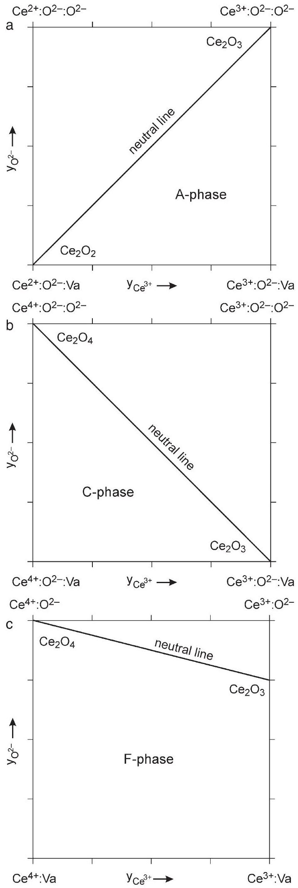
Fig. 1. Geometric representation of thermodynamic models for the nonstoichiometric cerium oxide phases: $\mathrm{Ce}_{2} \mathrm{O}_{3-x}$ (a), $\mathrm{Ce}_{3} \mathrm{O}_{5 \pm x}$ (b), and $\mathrm{CeO}_{2-x}$ (c).

Table 4
Summary of the thermodynamic parameters describing condensed phases in the Ce-O system referred to stable element reference $H^{\text {SER }}(T=298.15 \mathrm{~K}, P=1$ bar $)$
| Phase, parameter | Ref. |
| :--- | :--- |
| Liquid $\left(\mathrm{Ce}^{3+}, \mathrm{Ce}^{4+}\right)_{p}\left(\mathrm{Va}^{q-}, \mathrm{O}^{2-}\right)_{q}$, Eqs. (2)-(4) |  |
| ${ }^{\circ} G_{\mathrm{Ce}_{2} \mathrm{O}_{3}}^{\mathrm{liq}}=126654-54.497 \mathrm{~T}+{ }^{\circ} G_{\mathrm{A}-\mathrm{Ce}_{2} \mathrm{O}_{3}}$ | This work |
| ${ }^{\circ} G_{\mathrm{CeO}_{2}}^{\mathrm{liq}}=87177-29.059 T+{ }^{\circ} G_{\mathrm{CeO}_{2}}$ | This work |
| ${ }^{\circ} G_{\mathrm{Ce}^{3+}: \mathrm{Va}^{q-}}^{\text {liq }}={ }^{\circ} G_{\mathrm{Ce}(l)}$ | [79] |
| ${ }^{\circ} G_{\mathrm{Ce}^{4+}: \mathrm{Va}^{q-}}^{\text {liq }}=2^{\circ} G_{\mathrm{Ce}(l)}+3^{\circ} G_{\mathrm{CeO}_{2}}^{\text {liq }}-2^{\circ} G_{\mathrm{Ce}_{2} \mathrm{O}_{3}}^{\text {liq }}$ | This work |
| ${ }^{0} L_{\mathrm{Ce}^{3+}, \mathrm{Ce}^{4+}: \mathrm{O}^{2-}}^{\text {liq }}=-105398$ | This work |
| ${ }^{1} L_{\mathrm{Ce}^{3+}, \mathrm{Ce}^{4+}: \mathrm{O}^{2-}}^{\text {liq }}=-35158$ | This work |
| ${ }^{0} L_{\mathrm{Ce}^{3+}: \mathrm{O}^{2-}, \mathrm{Va}^{q-}}^{\text {liq }}=114250$ | This work |
| fcc (bcc)-Ce $(\mathrm{Ce})_{1}(\mathrm{O}, \mathrm{Va})_{1}$, Eq. (5) |  |
| ${ }^{\circ} G_{\mathrm{Ce}: \mathrm{Va}}^{\mathrm{fcc}}={ }^{\circ} G_{\mathrm{Ce}(\mathrm{fcc})}$ | [79] |
| ${ }^{\circ} G_{\mathrm{Ce}: \mathrm{O}}^{\mathrm{fcc}}=-525009+67.7626 T+{ }^{\circ} G_{\mathrm{Ce}(\mathrm{fcc})}+1 / 2^{\circ} G_{\mathrm{O}_{2}(g)}$ | This work |
| ${ }^{\circ} G_{\mathrm{Ce}: \mathrm{Va}}^{\mathrm{bcc}}={ }^{\circ} G_{\mathrm{Ce}(\mathrm{bcc})}$ | [79] |
| ${ }^{\circ} G_{\mathrm{Ce}: \mathrm{O}}^{\mathrm{bcc}}=-521242+67.7626 T+{ }^{\circ} G_{\mathrm{Ce}(\mathrm{bcc})}+1 / 2^{\circ} G_{\mathrm{O}_{2}(g)}$ | This work |
| A-phase $\left(\mathrm{Ce}^{3+}, \mathrm{Ce}^{2+}\right)_{2}\left(\mathrm{O}^{2-}\right)_{2}\left(\mathrm{O}^{2-}, \mathrm{Va}\right)_{1}$, Eqs. (6)-(8) |  |
| ${ }^{\circ} G_{\mathrm{Ce}^{3+}: \mathrm{O}^{2-}: \mathrm{O}^{2-}}^{\mathrm{A}}={ }^{\circ} G_{\mathrm{A}-\mathrm{Ce}_{2} \mathrm{O}_{3}}$ | This work |
| ${ }^{\circ} G_{\mathrm{Ce}^{3+}: \mathrm{O}^{2-}: \mathrm{Va}}^{\mathrm{A}}={ }^{\circ} G_{\mathrm{A}-\mathrm{Ce}_{2} \mathrm{O}_{3}}-1 / 2^{\circ} G_{\mathrm{O}_{2}(g)}$ | This work |
| ${ }^{\circ} G_{\mathrm{Ce}^{2+}: \mathrm{O}^{2-}: \mathrm{Va}}^{\mathrm{A}}={ }^{\circ} G_{\mathrm{Ce}_{2} \mathrm{O}_{2}}$ | This work |
| ${ }^{\circ} G_{\mathrm{Ce}^{2+}: \mathrm{O}^{2-}: \mathrm{O}^{2-}}^{\mathrm{A}}={ }^{\circ} G_{\mathrm{Ce}_{2} \mathrm{O}_{2}}+1 / 2^{\circ} G_{\mathrm{O}_{2}(g)}$ | This work |
| ${ }^{0} L_{\mathrm{Ce}^{3+}, \mathrm{Ce}^{2+}: \mathrm{O}^{2-}: \mathrm{O}^{2-}}^{\mathrm{A}}={ }^{0} L_{\mathrm{Ce}^{3+}, \mathrm{Ce}^{2+}: \mathrm{O}^{2-}: \mathrm{Va}}^{\mathrm{A}}=102206$ | This work |
| H-phase $\left(\mathrm{Ce}^{3+}, \mathrm{Ce}^{2+}\right)_{2}\left(\mathrm{O}^{2-}\right)_{2}\left(\mathrm{O}^{2-}, \mathrm{Va}\right)_{1}$, Eqs. (6)-(8) |  |
| ${ }^{\circ} G_{\mathrm{Ce}^{3+}: \mathrm{O}^{2-}: \mathrm{O}^{2-}}^{\mathrm{H}}={ }^{\circ} G_{\mathrm{H}-\mathrm{Ce}_{2} \mathrm{O}_{3}}$ | [86] |
| ${ }^{\circ} G_{\mathrm{Ce}^{3+}: \mathrm{O}^{2-}: \mathrm{Va}}^{\mathrm{H}}={ }^{\circ} G_{\mathrm{H}-\mathrm{Ce}_{2} \mathrm{O}_{3}}-1 / 2^{\circ} G_{\mathrm{O}_{2}(g)}$ | This work |
| ${ }^{\circ} G_{\mathrm{Ce}^{2+}: \mathrm{O}^{2-}: \mathrm{Va}}^{\mathrm{H}}={ }^{\circ} G_{\mathrm{Ce}_{2} \mathrm{O}_{2}}$ | This work |
| ${ }^{\circ} G_{\mathrm{Ce}^{2+}: \mathrm{O}^{2-}: \mathrm{O}^{2-}}^{\mathrm{H}}={ }^{\circ} G_{\mathrm{Ce}_{2} \mathrm{O}_{2}}+1 / 2^{\circ} G_{\mathrm{O}_{2}(g)}$ | This work |
| ${ }^{0} L_{\mathrm{Ce}^{3+}, \mathrm{Ce}^{2+}: \mathrm{O}^{2-}: \mathrm{O}^{2-}}^{\mathrm{H}}={ }^{0} L_{\mathrm{Ce}^{3+}, \mathrm{Ce}^{2+}: \mathrm{O}^{2-}: \mathrm{Va}}^{\mathrm{H}}=102206$ | This work |
| X-phase $\left(\mathrm{Ce}^{3+}, \mathrm{Ce}^{2+}\right)_{2}\left(\mathrm{O}^{2-}\right)_{2}\left(\mathrm{O}^{2-}, \mathrm{Va}\right)_{1}$, Eqs. (6)-(8) |  |
| ${ }^{\circ} G_{\mathrm{Ce}^{3+}: \mathrm{O}^{2-}: \mathrm{O}^{2-}}^{\mathrm{X}}={ }^{\circ} G_{\mathrm{X}-\mathrm{Ce}_{2} \mathrm{O}_{3}}$ | [86] |
| ${ }^{\circ} G_{\mathrm{Ce}^{3+}: \mathrm{O}^{2-}: \mathrm{Va}}^{\mathrm{X}}={ }^{\circ} G_{\mathrm{X}-\mathrm{Ce}_{2} \mathrm{O}_{3}}-1 / 2^{\circ} G_{\mathrm{O}_{2}(g)}$ | This work |
| ${ }^{\circ} G_{\mathrm{Ce}^{2+}: \mathrm{O}^{2-}: \mathrm{Va}}^{\mathrm{X}}={ }^{\circ} G_{\mathrm{Ce}_{2} \mathrm{O}_{2}}$ | This work |
| ${ }^{\circ} G_{\mathrm{Ce}^{2+}: \mathrm{O}^{2-}: \mathrm{O}^{2-}}^{\mathrm{X}}={ }^{\circ} G_{\mathrm{Ce}_{2} \mathrm{O}_{2}}+1 / 2^{\circ} G_{\mathrm{O}_{2}(g)}$ | This work |
| ${ }^{0} L_{\mathrm{Ce}^{3+}, \mathrm{Ce}^{2+}: \mathrm{O}^{2-}: \mathrm{O}^{2-}}^{\mathrm{X}}={ }^{0} L_{\mathrm{Ce}^{3+}, \mathrm{Ce}^{2+}: \mathrm{O}^{2-}: \mathrm{Va}}^{\mathrm{X}}=102206$ | This work |
| C-phase $\left(\mathrm{Ce}^{3+}, \mathrm{Ce}^{4+}\right)_{2}\left(\mathrm{O}^{2-}\right)_{3}\left(\mathrm{O}^{2-}, \mathrm{Va}\right)_{1}$, Eq. (9) |  |
| ${ }^{\circ} G_{\mathrm{Ce}^{3+}: \mathrm{O}^{2-}: \mathrm{Va}}^{\mathrm{C}}={ }^{\circ} G_{\mathrm{C}-\mathrm{Ce}_{2} \mathrm{O}_{3}}$ | [86] |
| ${ }^{\circ} G_{\mathrm{Ce}^{3+}: \mathrm{O}^{2-}: \mathrm{O}^{2-}}^{\mathrm{C}}={ }^{\circ} G_{\mathrm{C}-\mathrm{Ce}_{2} \mathrm{O}_{3}}+1 / 2^{\circ} G_{\mathrm{O}_{2}(g)}$ | This work |
| ${ }^{\circ} G_{\mathrm{Ce}^{4+}: \mathrm{O}^{2-}: \mathrm{Va}}^{\mathrm{C}}=19140+2^{\circ} G_{\mathrm{CeO}_{2}}-1 / 2^{\circ} G_{\mathrm{O}_{2}(g)}$ | This work |
| ${ }^{\circ} G_{\mathrm{Ce}^{4+}: \mathrm{O}^{2-}: \mathrm{O}^{2-}}^{\mathrm{C}}=19140+2^{\circ} G_{\mathrm{CeO}_{2}}$ | This work |
| ${ }^{0} L_{\mathrm{Ce}^{3+}, \mathrm{Ce}^{4+}: \mathrm{O}^{2-}: \mathrm{O}^{2-}}^{\mathrm{C}}={ }^{0} L_{\mathrm{Ce}^{3+}, \mathrm{Ce}^{4+}: \mathrm{O}^{2-}: \mathrm{Va}}^{\mathrm{C}}=-7178-17.7264 T$ | This work |
| ${ }^{1} L_{\mathrm{Ce}^{3+}, \mathrm{Ce}^{4+}: \mathrm{O}^{2-}: \mathrm{O}^{2-}}^{\mathrm{C}}={ }^{1} L_{\mathrm{Ce}^{3+}, \mathrm{Ce}^{4+}: \mathrm{O}^{2-}: \mathrm{Va}}^{\mathrm{C}}=-25591+22.2801 \mathrm{~T}$ | This work |
| F-phase $\left(\mathrm{Ce}^{4+}, \mathrm{Ce}^{3+}\right)_{2}\left(\mathrm{O}^{2-}, \mathrm{Va}\right)_{4}$, Eqs. (10)-(12) |  |
| ${ }^{\circ} G_{\mathrm{Ce}^{4+}: \mathrm{O}^{2-}}^{\mathrm{F}}=2^{\circ} G_{\mathrm{CeO}_{2}}$ | This work |
| ${ }^{\circ} G_{\mathrm{Ce}^{4+}: \mathrm{Va}}^{\mathrm{F}}=2^{\circ} G_{\mathrm{CeO}_{2}}-2^{\circ} G_{\mathrm{O}_{2}(g)}$ | This work |
| ${ }^{\circ} G_{\mathrm{Ce}^{3+} \cdot \mathrm{O}^{2-}}^{\mathrm{F}}={ }^{\circ} G_{\mathrm{F}-\mathrm{Ce}_{2} \mathrm{O}_{3}}+1 / 2^{\circ} G_{\mathrm{O}_{2}(g)}+18.702165 T$ | This work |
| ${ }^{\circ} G_{\mathrm{Ce}^{3+}: \mathrm{Va}}^{\mathrm{F}}={ }^{\circ} G_{\mathrm{F}-\mathrm{Ce}_{2} \mathrm{O}_{3}}-1.5^{\circ} G_{\mathrm{O}_{2}(g)}+18.702165 T$ | This work |
| ${ }^{0} L_{\mathrm{Ce}^{3+}, \mathrm{Ce}^{4+}: \mathrm{O}^{2-}}^{\mathrm{F}}={ }^{0} L_{\mathrm{Ce}^{4+}, \mathrm{Ce}^{3+}: \mathrm{Va}}^{\mathrm{F}}=-117572+25.9745 T$ | This work |
| ${ }^{1} L_{\mathrm{Ce}^{3+}, \mathrm{Ce}^{4+}: \mathrm{O}^{2-}}^{\mathrm{F}}={ }^{1} L_{\mathrm{Ce}^{4+}, \mathrm{Ce}^{3+}: \mathrm{Va}}^{\mathrm{F}}=-115033+31.1026 T$ | This work |
| ${ }^{\circ} G_{\mathrm{Ce}_{7} \mathrm{O}_{12}}=-133719-11.0961 T+3^{\circ} G_{\mathrm{CeO}_{2}}+2^{\circ} G_{\mathrm{F}-\mathrm{Ce}_{2} \mathrm{O}_{3}}$ | This work |
| ${ }^{\circ} G_{\mathrm{Ce}_{9} \mathrm{O}_{16}}=-125351-31.333 T+5^{\circ} G_{\mathrm{CeO}_{2}}+2^{\circ} G_{\mathrm{F}-\mathrm{Ce}_{2} \mathrm{O}_{3}}$ | This work |

Table 4 (continued)
| Phase, parameter | Ref. |
| :--- | :--- |
| ${ }^{\circ} G_{\mathrm{Ce}_{19} \mathrm{O}_{34}}=-247150-71 T+11^{\circ} G_{\mathrm{CeO}_{2}}+4^{\circ} G_{\mathrm{F}-\mathrm{Ce}_{2} \mathrm{O}_{3}}$ | This work |
| ${ }^{\circ} G_{\mathrm{Ce}_{40} \mathrm{O}_{72}}=-488650-155 T+24^{\circ} G_{\mathrm{CeO}_{2}}+8^{\circ} G_{\mathrm{F}-\mathrm{Ce}_{2} \mathrm{O}_{3}}$ | This work |
| ${ }^{\circ} G_{\mathrm{Ce}_{62} \mathrm{O}_{112}}=-730900-237.3 T+38^{\circ} G_{\mathrm{CeO}_{2}}+12^{\circ} G_{\mathrm{F}-\mathrm{Ce}_{2} \mathrm{O}_{3}}$ | This work |
| ${ }^{\circ} G_{\mathrm{Ce}_{11} \mathrm{O}_{20}}=-121419-40.45 T+7^{\circ} G_{\mathrm{CeO}_{2}}+2^{\circ} G_{\mathrm{F}-\mathrm{Ce}_{2} \mathrm{O}_{3}}$ | This work |
| Functions | Ref. |
| ${ }^{\circ} G_{\mathrm{A}-\mathrm{Ce}_{2} \mathrm{O}_{3}}=-1832858+667.3307 T-119.855$ | This work |
| ${ }^{\circ} G_{\mathrm{H}-\mathrm{Ce}_{2} \mathrm{O}_{3}}=32699-13.986 T+{ }^{\circ} G_{\mathrm{A}-\mathrm{Ce}_{2} \mathrm{O}_{3}}$ | [86] |
| ${ }^{\circ} G_{\mathrm{X}-\mathrm{Ce}_{2} \mathrm{O}_{3}}=43724-18.555 T+{ }^{\circ} G_{\mathrm{A}-\mathrm{Ce}_{2} \mathrm{O}_{3}}$ | [86] |
| $\begin{gathered} { }^{\circ} G_{\mathrm{CeO}_{2}}=-1116518+434.8839 T-72.866 \\ T \ln T-0.003992 T^{2}+602000 T^{-1} \end{gathered}$ | This work |
| ${ }^{\circ} G_{\mathrm{Ce}_{2} \mathrm{O}_{2}}=2 / 3^{\circ} G_{\mathrm{A}-\mathrm{Ce}_{2} \mathrm{O}_{3}}+2 / 3^{\circ} G_{\mathrm{Ce}(\mathrm{fcc})}$ | This work |
| ${ }^{\circ} G_{\mathrm{C}_{-} \mathrm{Ce}_{2} \mathrm{O}_{3}}=4390+7.232 \mathrm{~T}+{ }^{\circ} G_{\mathrm{A}-\mathrm{Ce}_{2} \mathrm{O}_{3}}$ | [86] |
| $\begin{aligned} & { }^{\circ} G_{\mathrm{F}_{-} \mathrm{Ce}_{2} \mathrm{O}_{3}}=-1804481+1067.043 T-175.3336 T \ln T \\ & \quad-6.498627 \mathrm{E}-4 T^{2}++546000 T^{-1} \end{aligned}$ | This work |
| ${ }^{\circ} G_{\mathrm{Ce}(l)}=4117.865-11.423898 T-7.5383948 T \ln T$ | [79] |
| $-0.02936407 T^{2}+4.827734 \mathrm{E}-6 T^{3}$ |  |
| $-198834 T^{-1}(298 \mathrm{~K}<T<1000 \mathrm{~K})$ |  |
| $-6730.605+183.023193 T$ |  |
| $-37.6978 T \ln T(1000 \mathrm{~K}<T<4000 \mathrm{~K})$ |  |
| ${ }^{\circ} G_{\mathrm{Ce}(\mathrm{fcc})}=-7160.519+84.23022 T-22.3664 T \ln T$ | [79] |
| $-0.0067103 T^{2}-3.20773 \mathrm{E}-7 T^{3}$ |  |
| $-18117 T^{-1}(298 \mathrm{~K}<T<1000 \mathrm{~K})$ |  |
| $-79678.506+659.4604 T-101.32248 T \ln T$ |  |
| $+0.026046487 T^{2}-1.930297 \mathrm{E}-6 T^{3}$ |  |
| $+11531707 T^{-1}(1000 \mathrm{~K}<T<2000 \mathrm{~K})$ |  |
| $-14198.639+190.370192 T$ |  |
| $-37.6978 T \ln T(2000 \mathrm{~K}<T<4000 \mathrm{~K})$ |  |
| ${ }^{\circ} G_{\mathrm{Ce}(\mathrm{bcc})}=-1354.69-5.21501 T-7.7305867 T \ln T$ | [79] |
| $-0.029098402 T^{2}+4.784299 \mathrm{E}-6 T^{3}$ |  |
| $-196303 T^{-1}(298 \mathrm{~K}<T<1000 \mathrm{~K})$ |  |
| $-12101.106+187.449688 T$ |  |
| $-37.6142 T \ln T(1000 \mathrm{~K}<T<1072 \mathrm{~K})$ |  |
| $-11950.375+186.333811 T$ |  |
| $-37.4627992 T \ln T-5.7145 \mathrm{E}-5 T^{2}$ |  |
| $+2.348 \mathrm{E}-9 T^{3}-25897 T^{-1}(1072 \mathrm{~K}<T<4000 \mathrm{~K})$ |  |
| Values are given in SI units (Joule, mole, and Kelvin). |  |

parameter ${ }^{\nu} L_{\mathrm{Ce}^{3+}, \mathrm{Ce}^{4+}: \mathrm{O}^{2-}}^{\text {liq }}$. Both the interaction parameters ${ }^{\nu} L_{\mathrm{Ce}^{4+}: \mathrm{O}^{2-}, \mathrm{Va}^{q^{-}}}^{\text {liq }}$ and ${ }^{\nu} L_{\mathrm{Ce}^{3+}, \mathrm{Ce}^{4+}: \mathrm{Va}^{q^{-}}}^{\text {liq }}$ have only a minor influence and are set equal to zero for convenience.

The solid solution phases (fcc-Ce, bcc-Ce, A, C, and F) are described by a multi-sublattice model using the compound energy formalism [84]. Oxygen occupies octahedrally coordinated interstitial sites in solid Ce and both the fcc and bcc phase are then represented by a two-sublattice model $(\mathrm{Ce})_{1}(\mathrm{O}, \mathrm{Va})_{1}$. Although there are three equivalent octahedral voids per metal atom in the bcc lattice, the occupation of an interstitial site is prevented by the prior occupation of a neighboring interstitial site, since the effective repulsion exists between near-neighbor O -atoms. This results in the splitting of the interstitial sites into three sublattices, while the maximum separation between oxygen atoms is achieved, if only one of them is occupied. The molar Gibbs energy is given by

$$
\begin{aligned}
G^{\varphi}= & y_{\mathrm{Va}}{ }^{\circ} G_{\mathrm{Ce}: \mathrm{Va}}^{\varphi}+y_{\mathrm{O}}{ }^{\circ} G_{\mathrm{Ce}: \mathrm{O}}^{\varphi}+R T\left(y_{\mathrm{O}} \ln y_{\mathrm{O}}+y_{\mathrm{Va}} \ln y_{\mathrm{Va}}\right) \\
& +y_{\mathrm{O}} y_{\mathrm{Va}}{ }^{0} L_{\mathrm{Ce}: \mathrm{O}, \mathrm{Va}}^{\varphi} \cdot
\end{aligned}
$$

${ }^{\circ} G_{\mathrm{Ce}: \mathrm{Va}}^{\varphi}$ is the expression for the Gibbs energy of the pure fcc- or bcc-Ce, whereas ${ }^{\circ} G_{\mathrm{Ce}: \mathrm{O}}^{\varphi}$ corresponds to the hypothetical
compound CeO and controls the oxygen solubility in solid cerium. The latter is low enough in order to assume zero for the interaction parameter ${ }^{0} L_{\mathrm{Ce}: \mathrm{O}, \mathrm{Va}}^{\varphi}$.

Cerium sesquioxide ( $\mathrm{Ce}_{2} \mathrm{O}_{3}$ ) is substoichiometric in equilibrium with cerium metal [62], while density and X-ray diffraction studies [85] indicate that substoichiometry is due to the formation of oxygen vacancies. The crystal structure of A$\mathrm{Ce}_{2} \mathrm{O}_{3}$ can be described as hexagonal close packing of the cations, the oxygen ions, O 1 and O 2 respectively, occupying half of tetrahedral and half of octahedral holes [8]. Since the $\mathrm{O} 2-\mathrm{Ce}$ distance is longer than the $\mathrm{O} 1-\mathrm{Ce}$ one, it is reasonable to assume that the vacancies are formed on the octahedrally coordinated sites. In the model, the lack of negative charge in the anion sublattice due to oxygen vacancies is effectively compensated by the introduction of $\mathrm{Ce}^{2+}$ into the cation sublattice, i.e., $\left(\mathrm{Ce}^{3+}\right.$, $\left.\mathrm{Ce}^{2+}\right)_{2}\left(\mathrm{O}^{2-}\right)_{2}\left(\mathrm{O}^{2-}, \mathrm{Va}\right)_{1}$. Note that vacancies are neutral species here. The molar Gibbs energy of $\mathrm{Ce}_{2} \mathrm{O}_{3-x}(\mathrm{~A})$ is then represented as

$$
\begin{aligned}
G^{\mathrm{A}}= & y_{\mathrm{Ce}^{3+}} y_{\mathrm{O}^{2-}}{ }^{\circ} G_{\mathrm{Ce}^{3+}: \mathrm{O}^{2-}: \mathrm{O}^{2-}}^{\mathrm{A}}+y_{\mathrm{Ce}^{3+}} y_{\mathrm{Va}}{ }^{\circ} G_{\mathrm{Ce}^{3+}: \mathrm{O}^{2-}: \mathrm{Va}}^{\mathrm{A}} \\
& +y_{\mathrm{Ce}^{2+}} y_{\mathrm{O}^{2-}}{ }^{\circ} G_{\mathrm{Ce}^{2+}: \mathrm{O}^{2-}: \mathrm{O}^{2-}}+y_{\mathrm{Ce}^{2+}} y_{\mathrm{Va}}{ }^{\circ} G_{\mathrm{Ce}^{2+}: \mathrm{O}^{2-}: \mathrm{Va}}^{\mathrm{A}} \\
& +2 R T\left(y_{\mathrm{Ce}^{3+}} \ln y_{\mathrm{Ce}^{3+}}+y_{\mathrm{Ce}^{2+}} \ln y_{\mathrm{Ce}^{2+}}\right) \\
& +R T\left(y_{\mathrm{O}^{2-}} \ln y_{\mathrm{O}^{2-}}+y_{\mathrm{Va}} \ln y_{\mathrm{Va}}\right)+{ }^{\mathrm{E}} G^{\mathrm{A}}
\end{aligned}
$$

The model can be visualized by the composition square in Fig. 1a. Each corner represents a ${ }^{\circ} G$-parameter. The endmember ${ }^{\circ} G_{\mathrm{Ce}^{3+}: \mathrm{O}^{2-}: \mathrm{O}^{2-}}^{\mathrm{A}}$ corresponds to the stable form of A$\mathrm{Ce}_{2} \mathrm{O}_{3}$. The condition of electroneutrality defines a line $\left(\mathrm{Ce}_{2} \mathrm{O}_{3}-\mathrm{Ce}_{2} \mathrm{O}_{2}\right)$, on which all possible compositions fall. $\mathrm{Ce}_{2} \mathrm{O}_{2}$ is considered as a hypothetical compound, which keeps the crystal structure of $\mathrm{A}-\mathrm{Ce}_{2} \mathrm{O}_{3}$, although all the $\mathrm{O} 2-$ sites are vacant. Its molar Gibbs energy is expressed as
${ }^{\circ} G_{\mathrm{Ce}^{2+}: \mathrm{O}^{2-}: \mathrm{Va}}^{\mathrm{A}}={ }^{\circ} G_{\mathrm{Ce}_{2} \mathrm{O}_{2}}=\frac{2}{3}{ }^{\circ} G_{\mathrm{A}-\mathrm{Ce}_{2} \mathrm{O}_{3}}+\frac{2}{3}{ }^{\circ} G_{\mathrm{Ce}(\mathrm{fcc})}$.

The remaining end-members are charged and it would be impossible to give physically meaningful values to their Gibbs energies. The parameter ${ }^{\circ} G_{\mathrm{Ce}^{3+}: \mathrm{O}^{2-}: \mathrm{Va}}^{\mathrm{A}}$ was chosen as a reference, i.e., ${ }^{\circ} G_{\mathrm{Ce}^{3+}: \mathrm{O}^{2-}: \mathrm{Va}}^{\mathrm{A}}={ }^{\circ} G_{\mathrm{A}-\mathrm{Ce}_{2} \mathrm{O}_{3}}-1 / 2^{\circ} G_{\mathrm{O}_{2}(g)}$, while the parameter ${ }^{\circ} \mathrm{G}_{\mathrm{Ce}^{2+}: \mathrm{O}^{2-}: \mathrm{O}^{2-}}^{\mathrm{A}}$ can be determined by the reciprocal relation, which does not involve the net change of charge:

$$
\begin{gathered}
{ }^{\circ} G_{\mathrm{Ce}^{3+}: \mathrm{O}^{2-}: \mathrm{O}^{2-}}^{\mathrm{A}}+{ }^{\circ} G_{\mathrm{Ce}^{2+}: \mathrm{O}^{2-}: \mathrm{Va}}^{\mathrm{A}}={ }^{\circ} G_{\mathrm{Ce}^{3+}: \mathrm{O}^{2-}: \mathrm{Va}}^{\mathrm{A}} \\
+{ }^{\circ} G_{\mathrm{Ce}^{2+}: \mathrm{O}^{2-}: \mathrm{O}^{2-}}^{\mathrm{A}}
\end{gathered}
$$

The excess term, ${ }^{\mathrm{E}} G^{\mathrm{A}}$ represents deviations from ideality and can be expressed in terms of interaction parameters (cf. Eq. (4)). The parameters ${ }^{\nu} L_{\mathrm{Ce}^{3+}, \mathrm{Ce}^{2+}: \mathrm{O}^{2-}: \mathrm{O}^{2-}}^{\mathrm{A}}$ and ${ }^{\nu} L_{\mathrm{Ce}^{3+}, \mathrm{Ce}^{2+}: \mathrm{O}^{2-}: \mathrm{Va}}^{\mathrm{A}}$ were used to model the extent of substoichiometry in $\mathrm{Ce}_{2} \mathrm{O}_{3-x}$, whereas ${ }^{\nu} L_{\mathrm{Ce}^{3+}: \mathrm{O}^{2-}: \mathrm{O}^{2-}, \mathrm{Va}}^{\mathrm{A}}$ and ${ }^{\nu} L_{\mathrm{Ce}^{2+}: \mathrm{O}^{2-}: \mathrm{O}^{2-}, \mathrm{Va}}^{\mathrm{A}}$ were not used and set equal to zero. Although the substoichiometry of the hightemperature modifications of $\mathrm{Ce}_{2} \mathrm{O}_{3}$ was not studied, there is no reason to expect significant differences compared to $\mathrm{A}-\mathrm{Ce}_{2} \mathrm{O}_{3}$. Thus, the same model with the same values of ${ }^{\circ} G_{\mathrm{Ce}_{2} \mathrm{O}_{2}}$ and interaction parameters was used for $\mathrm{A}-, \mathrm{H}-$, and $\mathrm{X}-\mathrm{Ce}_{2} \mathrm{O}_{3-x}$.

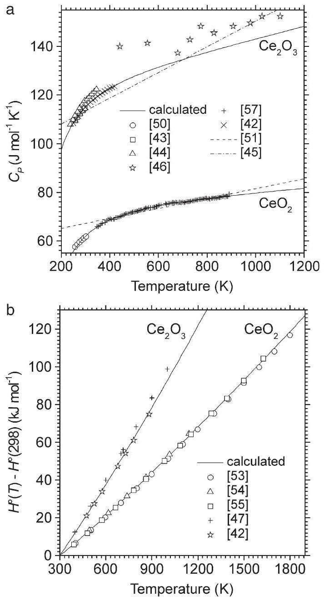
Fig. 2. Heat capacity (a) and enthalpy increment (b) of the stoichiometric $\mathrm{Ce}_{2} \mathrm{O}_{3}$ and $\mathrm{CeO}_{2}$ as functions of temperature.

The crystal structure of $\mathrm{Ce}_{3} \mathrm{O}_{5 \pm x}$ (C) contains four atomic positions in the unit cell. Cerium cations fully occupy $8 b$ - and $24 d$-sites, while oxygen anions fully occupy $48 e$ - and partly $16 c$-sites [9]. The variable oxygen content is effectively compensated by changing the oxidation state of cerium from $3+$ to $4+$. The sublattice formulation is $\left(\mathrm{Ce}^{3+}, \mathrm{Ce}^{4+}\right)_{2}\left(\mathrm{O}^{2-}\right)_{3}\left(\mathrm{O}^{2-}\right.$, Va) ${ }_{1}$ and the molar Gibbs energy is given by

$$
\begin{aligned}
G^{\mathrm{C}}= & y_{\mathrm{Ce}^{3+}} y_{\mathrm{O}^{2-}}{ }^{\circ} G_{\mathrm{Ce}^{3+}: \mathrm{O}^{2-}: \mathrm{O}^{2-}}^{\mathrm{C}}+y_{\mathrm{Ce}^{3+}} y_{\mathrm{Va}}{ }^{\circ} G_{\mathrm{Ce}^{3+}: \mathrm{O}^{2-}: \mathrm{Va}}^{\mathrm{C}} \\
& +y_{\mathrm{Ce}^{4+}} y_{\mathrm{O}^{2-}}{ }^{\circ} G_{\mathrm{Ce}^{4+}: \mathrm{O}^{2-}: \mathrm{O}^{2-}}+y_{\mathrm{Ce}^{4+}} y_{\mathrm{Va}}{ }^{\circ} G_{\mathrm{Ce}^{4+}: \mathrm{O}^{2-}: \mathrm{Va}} \\
& +2 R T\left(y_{\mathrm{Ce}^{3+}} \ln y_{\mathrm{Ce}^{3+}}+y_{\mathrm{Ce}^{4+}} \ln y_{\mathrm{Ce}^{4+}}\right) \\
& +R T\left(y_{\mathrm{O}^{2-}} \ln y_{\mathrm{O}^{2-}}+y_{\mathrm{Va}} \ln y_{\mathrm{Va}}\right)+{ }^{\mathrm{E}} G^{\mathrm{C}}
\end{aligned}
$$

The model can be visualized by the composition square in Fig. 1b. The end-member ${ }^{\circ} G_{\mathrm{Ce}^{3+}: \mathrm{O}^{2-}: \mathrm{Va}}^{\mathrm{C}}$ corresponds to the cubic $\mathrm{Ce}_{2} \mathrm{O}_{3}$, which is metastable with respect to the A -form, while for heavier rare-earth sesquioxides and $\mathrm{Y}_{2} \mathrm{O}_{3}$ the cubic modifications are stable ones. Obviously, the ionic radius of $\mathrm{Ce}^{3+}$ is too large and explains the stabilisation of the C -phase by smaller $\mathrm{Ce}^{4+}$ cations. The other neutral end-member is $\mathrm{Ce}_{2} \mathrm{O}_{4}$, which contains tetravalent cerium only. Clearly, it must be unstable with respect to the fluorite-like $\mathrm{CeO}_{2}$.

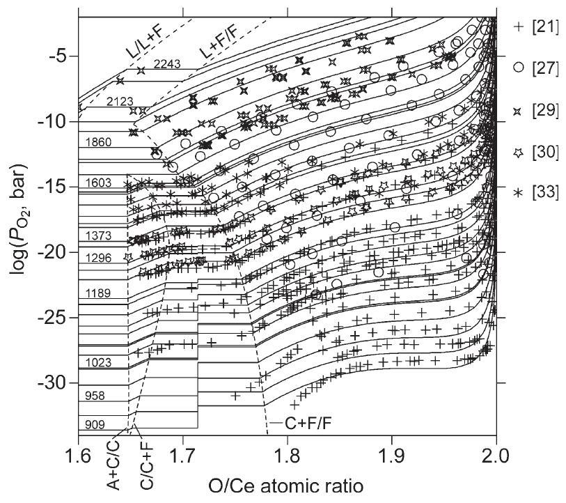
Fig. 3. Equilibrium oxygen pressures over the condensed phases in the $\mathrm{Ce}-\mathrm{O}$ system versus composition $(1.6<\mathrm{O} / \mathrm{Ce}<2.0)$. The curves are calculated for the following temperatures (from bottom to top, in K ): 909, 933, 958, 988, 1020, 1023, 1050, 1070, 1073, 1098, 1117, 1145, 1173, 1189, 1244, 1273, 1296, 1353, $1373,1426,1442,1473,1522,1573,1583,1603,1673,1750,1773,1860$, 1998, 2081, 2123, 2203, 2243. Some selected curves are also labeled. The dashed lines show the phase boundaries.

As in the model for the A-phase, one of the charged parameters, ${ }^{\circ} G_{\mathrm{Ce}^{3+}: \mathrm{O}^{2-}: \mathrm{O}^{2-}}^{\mathrm{C}}$ was again chosen as a reference, while the parameter ${ }^{\circ} \mathrm{G}_{\mathrm{Ce}^{4+}: \mathrm{O}^{2-}: \mathrm{Va}}^{\mathrm{C}}$ can be determined by the reciprocal relation. Similarly, the interaction parameters ${ }^{v} L_{\mathrm{Ce}^{3+}, \mathrm{Ce}^{4+}: \mathrm{O}^{2-}: \mathrm{O}^{2-}}^{\mathrm{C}}$ and ${ }^{v} L_{\mathrm{Ce}^{3+}, \mathrm{Ce}^{4+}: \mathrm{O}^{2-}: \mathrm{Va}}^{\mathrm{C}}$ were used to model the homogeneity range of the C-phase, whereas ${ }^{v} L_{\mathrm{Ce}^{3+}: \mathrm{O}^{2-}: \mathrm{O}^{2-}, \mathrm{Va}}^{\mathrm{C}}$ and ${ }^{v} L_{\mathrm{Ce}^{3+}: \mathrm{O}^{2-}: \mathrm{O}^{2-}, \mathrm{Va}}^{\mathrm{C}}$ were not used and set equal to zero.

Stoichiometric ceria has a fluorite-like structure with two atomic positions in the unit cell, one for $\mathrm{Ce}^{4+}(4 a)$ and one for $\mathrm{O}^{2-}(8 c)$. When $\mathrm{CeO}_{2}$ is reduced to $\mathrm{CeO}_{2-x}$ defects are formed

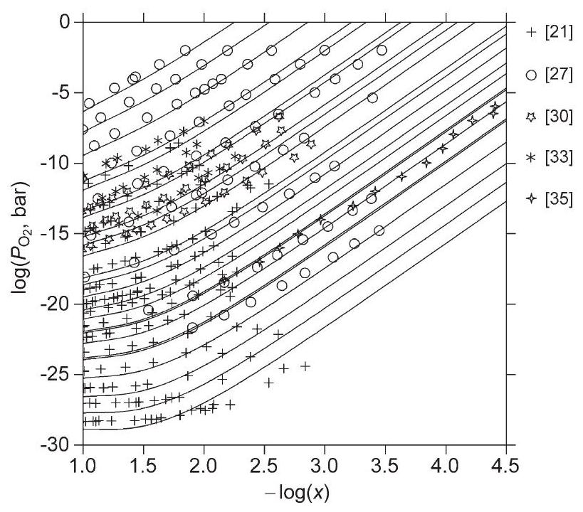
Fig. 4. Equilibrium oxygen pressures over $\mathrm{CeO}_{2-x}$ versus composition $(x>1.9)$. The curves are calculated for the following temperatures (from bottom to top, in K): $909,933,958,988,1020,1023,1050,1070,1073,1098,1117,1145,1173$, 1189, 1244, 1273, 1296, 1353, 1373, 1442, 1473, 1573, 1673, 1773.

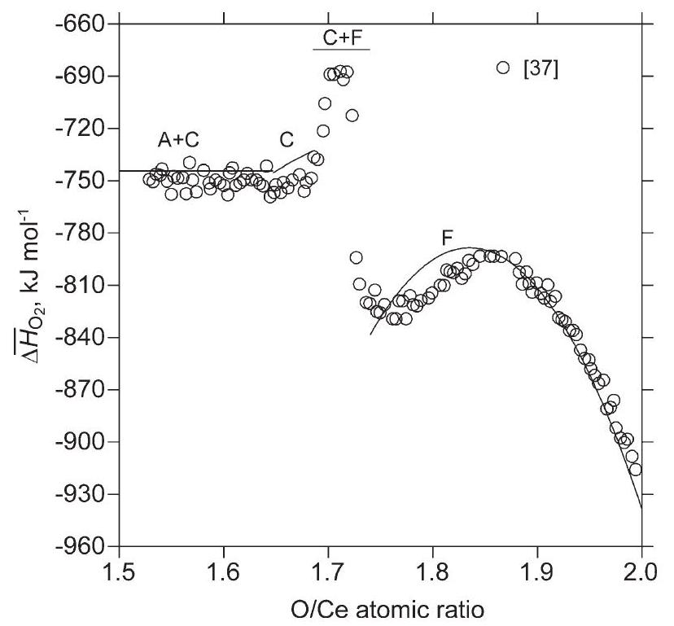
Fig. 5. Partial molar enthalpy of solution of $\mathrm{O}_{2}$ in cerium oxides at 1353 K as function of composition. The corresponding phase fields are indicated.

in the form of oxygen vacancies and $\mathrm{Ce}^{3+}$-cations [12]. The model for nonstoichiometric ceria can be expressed as ( $\mathrm{Ce}^{4+}$, $\left.\mathrm{Ce}^{3+}\right)_{2}\left(\mathrm{O}^{2-}, \mathrm{Va}\right)_{4}$ and can be visualized by the composition square in Fig. 1c. The molar Gibbs energy is then defined as

$$
\begin{aligned}
G^{\mathrm{F}}= & y_{\mathrm{Ce}^{4+}} y_{\mathrm{O}^{2-}}{ }^{\circ} G_{\mathrm{Ce}^{4+}: \mathrm{O}^{2-}}^{\mathrm{F}}+y_{\mathrm{Ce}^{4+}} y_{\mathrm{Va}}{ }^{\circ} G_{\mathrm{Ce}^{4+}: \mathrm{Va}}^{\mathrm{F}} \\
& +y_{\mathrm{Ce}^{3+}} y_{\mathrm{O}^{2-}}{ }^{\circ} G_{\mathrm{Ce}^{3+}: \mathrm{O}^{2-}}^{\mathrm{F}}+y_{\mathrm{Ce}^{3+}} y_{\mathrm{Va}} G_{\mathrm{Ce}^{3+}: \mathrm{Va}}^{\mathrm{F}} \\
& +2 R T\left(y_{\mathrm{Ce}^{3+}} \ln y_{\mathrm{Ce}^{3+}}+y_{\mathrm{Ce}^{4+}} \ln y_{\mathrm{Ce}^{4+}}\right) \\
& +4 R T\left(y_{\mathrm{O}^{2-}} \ln y_{\mathrm{O}^{2-}}+y_{\mathrm{Va}} \ln y_{\mathrm{Va}}\right)+{ }^{\mathrm{E}} G^{F}
\end{aligned}
$$

There is one neutral end-member ${ }^{\circ} G_{\mathrm{Ce}^{4+}: \mathrm{O}^{2-}}^{\mathrm{F}}$, which corresponds to the stoichiometric $\mathrm{CeO}_{2}$. The other three endmembers are charged, but a combination of $0.75 \mathrm{~mol}\left(\mathrm{Ce}^{3+}\right)_{2} \left(\mathrm{O}^{2-}\right)_{4}$ and $0.25 \mathrm{~mol}\left(\mathrm{Ce}^{3+}\right)_{2}(\mathrm{Va})_{4}$ gives the neutral compound

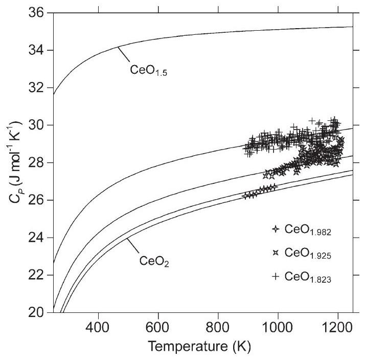
Fig. 6. Calculated heat capacity of the nonstoichiometric ceria as function of temperature superimposed with experimental points [57].

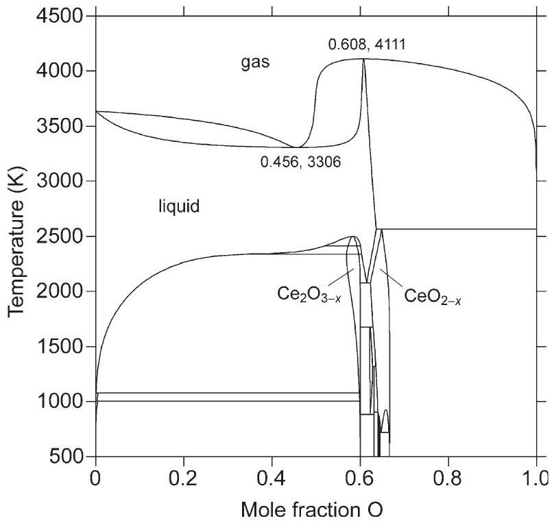
Fig. 7. Calculated phase diagram of $\mathrm{Ce}-\mathrm{O}$ system for the total pressure of 1 bar.

$\left(\mathrm{Ce}^{3+}\right)_{2}\left(\mathrm{O}^{2-}\right)_{3},(\mathrm{Va})_{1}$, which corresponds to $\mathrm{Ce}_{2} \mathrm{O}_{3}$ in the fluorite-related structure, i.e.

$$
\begin{aligned}
{ }^{\circ} G_{\mathrm{F}-\mathrm{Ce}_{2} \mathrm{O}_{3}}= & \frac{3}{4}{ }^{\circ} G_{\mathrm{Ce}^{3+}: \mathrm{O}^{2-}}^{\mathrm{F}}+\frac{1}{4}{ }^{\circ} G_{\mathrm{Ce}^{3+}: \mathrm{Va}}^{\mathrm{F}} \\
& +4 R T\left(\frac{3}{4} \ln \frac{3}{4}+\frac{1}{4} \ln \frac{1}{4}\right),
\end{aligned}
$$

where the last term is due to the ideal entropy of mixing on the anion sublattice. Using ${ }^{\circ} G_{\mathrm{Ce}^{4+}: \mathrm{Va}}^{\mathrm{F}}$ as a reference, i.e., ${ }^{\circ} G_{\mathrm{Ce}^{4+}: \mathrm{Va}}^{\mathrm{F}}= 2^{\circ} G_{\mathrm{CeO}_{2}}-2^{\circ} G_{\mathrm{O}_{2}(g)}$ and the reciprocal relation

$$
{ }^{\circ} G_{\mathrm{Ce}^{4+}: \mathrm{O}^{2-}}^{\mathrm{F}}+{ }^{\circ} G_{\mathrm{Ce}^{3+}: \mathrm{Va}}^{\mathrm{F}}={ }^{\circ} G_{\mathrm{Ce}^{4+}: \mathrm{Va}}^{\mathrm{F}}+{ }^{\circ} G_{\mathrm{Ce}^{3+}: \mathrm{O}^{2-}}^{\mathrm{F}}
$$

all the end-members in Eq. (10) can be defined. The term ${ }^{\circ} G_{\mathrm{F}-\mathrm{Ce}_{2} \mathrm{O}_{3}}$ was used together with the interaction parameters ${ }^{\nu} L_{\mathrm{Ce}^{3+}, \mathrm{Ce}^{4+} \cdot \mathrm{O}^{2-}}^{\mathrm{F}}$ and ${ }^{\nu} L_{\mathrm{Ce}^{4+}, \mathrm{Ce}^{3+} \cdot \mathrm{Va}}^{\mathrm{F}}$ to model the homogeneity range of $\mathrm{CeO}_{2-x}$, whereas ${ }^{v} L_{\mathrm{Ce}^{4+}: \mathrm{O}^{2-}, \mathrm{Va}}^{\dot{\mathrm{F}}}$ and ${ }^{v} L_{\mathrm{Ce}^{3+}: \mathrm{O}^{2-}, \mathrm{Va}}^{\mathrm{F}}$ were not used and set equal to zero.

## 4. Results and discussion

4.1. Thermodynamic functions for the stoichiometric $\mathrm{Ce}_{2} \mathrm{O}_{3}$ and $\mathrm{CeO}_{2}$

The assessed Gibbs energy functions of both compounds are given in Table 4. The coefficients of Eq. (1) for $\mathrm{A}-\mathrm{Ce}_{2} \mathrm{O}_{3}$ were obtained by fitting the heat capacity and enthalpy increment data [42,43,47], while using the standard entropy value of 148.8 J $\mathrm{mol}^{-1} \mathrm{~K}^{-1}$ [42]. The standard enthalpy of formation of the A- $\mathrm{Ce}_{2} \mathrm{O}_{3}$ was used as an adjustable parameter in the present work. The best fit of the phase diagram and thermodynamic data was obtained with $\Delta_{\mathrm{f}} H^{\circ}(298.15 \mathrm{~K})=-1792.4 \mathrm{~kJ} \mathrm{~mol}^{-1}$, which is well within the scatter of experimental measurements, -1788.0 to $-1822.3 \mathrm{~kJ} \mathrm{~mol}^{-1}$ [38-42]. The enthalpies of $\quad \mathrm{A} \rightarrow \mathrm{H}$ and $\mathrm{H} \rightarrow$ X phase transitions in $\mathrm{Ce}_{2} \mathrm{O}_{3}$ and the entropy of melting as well as the Gibbs energy of the metastable $\mathrm{C}-\mathrm{Ce}_{2} \mathrm{O}_{3}$ relative to the

A-form were estimated [86] based on the pronounced correlation between thermodynamic properties of rare-earth sesquioxides and the cation radius, while the heat capacity of all $\mathrm{Ce}_{2} \mathrm{O}_{3}$ phases is described by the same function. There is a lack of corresponding measurements in the literature. All estimations are given in Table 4 together with other thermodynamic parameters describing the $\mathrm{Ce}-\mathrm{O}$ system. The Gibbs energy equation for $\mathrm{CeO}_{2}$ was obtained by fitting the corresponding heat capacity and enthalpy increment data [50,53-55,57], while accepting the standard entropy value of $62.3 \mathrm{~J} \mathrm{~mol}^{-1} \mathrm{~K}^{-1}$ [50] and the standard enthalpy of formation as $-1090.4 \mathrm{~kJ} \mathrm{~mol}^{-1}$ [65]. The entropy of melting of $\mathrm{CeO}_{2}\left(29.059 \mathrm{~J} \mathrm{~mol}^{-1} \mathrm{~K}^{-1}\right)$ was adopted from the SGTE substance database [87]. This value is very close to the entropy of melting of the isomorphous compound $\mathrm{ZrO}_{2}$ [88], which also has a similar melting point. The enthalpy of melting of $\mathrm{CeO}_{2}$ is then $87.177 \mathrm{~kJ} \mathrm{~mol}^{-1}$. Again, the heat capacity of liquid $\mathrm{CeO}_{2}$ is assumed to have the same temperature dependence, as the solid phase. The calculated heat capacity and enthalpy increment of the stoichiometric $\mathrm{Ce}_{2} \mathrm{O}_{3}$ and $\mathrm{CeO}_{2}$ are shown in Fig. 2 in comparison with all available experimental data. It can be seen (Fig. 2a) that the heat capacity descriptions proposed in [45,51] are oversimplified and cannot be used in a wide temperature range. According to the present evaluation, the heat capacity of $\mathrm{Ce}_{2} \mathrm{O}_{3}$ is best represented by the data from [42,43], while that of $\mathrm{CeO}_{2}$ by the data from [50,57]. The datapoints of [52] for $\mathrm{CeO}_{2}$ show big deviations as already mentioned in the literature [89] and are actually off of the plot, whereas the other measurements for $\mathrm{Ce}_{2} \mathrm{O}_{3}$ [44,46] are slightly above the calculated curve. The calculated enthalpy increment of $\mathrm{Ce}_{2} \mathrm{O}_{3}$ (Fig. 2b) is in better agreement with the measurements of [42], while all three datasets for $\mathrm{CeO}_{2}$ [5355] show good consistency with the present assessment.

### 4.2. Solution phases and intermediate compounds

For the F - and the C -phase, interaction parameters of zeroth and first order (Table 4) were reliably determined based on the extensive experimental database (Table 2). Several datasets

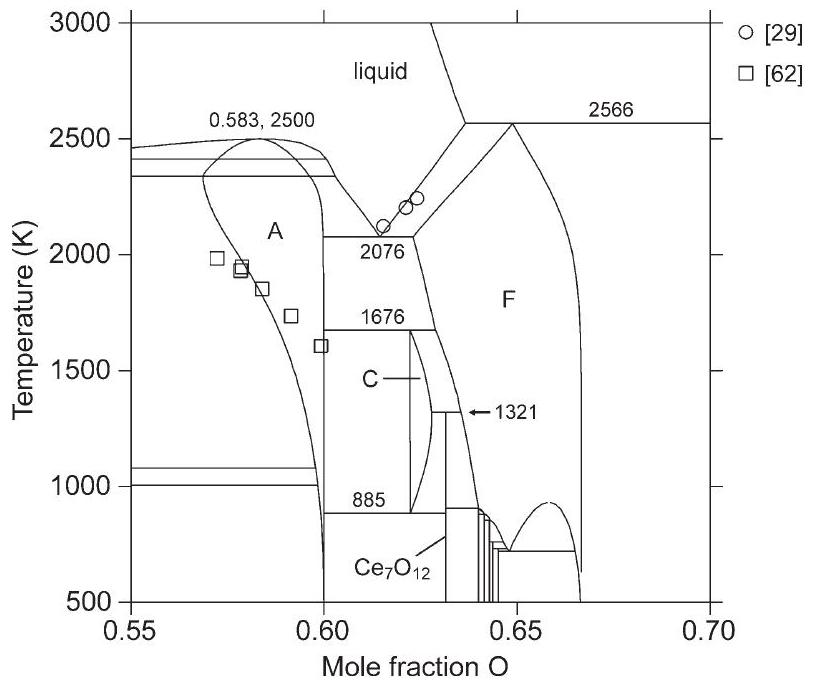
Fig. 8. The central part of Fig. 7 showing phase equilibria between cerium oxides.

Table 5
Invariant reactions in the $\mathrm{Ce}-\mathrm{O}$ system
| Reaction | Type | $T(\mathrm{~K})$ | $\Delta H_{\mathrm{r}}\left(\mathrm{J} \mathrm{mol}^{-1}\right)$ | Compositions of phases (at.\% O) | Ref. |
| :--- | :--- | :--- | :--- | :--- | :--- |
| $\mathrm{L}=\operatorname{gas}(P=1 \mathrm{bar})$ | Congruent | 4111 |  | 60.8 (L, gas) | This work |
| $\mathrm{L}=\operatorname{gas}(P=1$ bar $)$ | Congruent | 3306 |  | 45.6 (L, gas) | This work |
| $\mathrm{F}=\mathrm{L}+$ gas $(P=1$ bar $)$ | Gas-peritectic | 2566 |  | $63.7(\mathrm{~L}), 64.9(\mathrm{~F})$ | This work |
| $\mathrm{L}=\mathrm{X}$ | Congruent | 2500 |  | 58.3 (L, X) | This work |
| $\mathrm{L}+\mathrm{X}=\mathrm{H}$ | Metatectic | 2413 |  | 60.1 (L), 59.3 (X, H) | This work |
| $\mathrm{L}+\mathrm{X}=\mathrm{H}$ | Metatectic | 2413 |  | $52.0(\mathrm{~L}), 57.2(\mathrm{X}, \mathrm{H})$ | This work |
| $\mathrm{L}+\mathrm{H}=\mathrm{A}$ | Metatectic | 2338 |  | 60.3 (L), 59.6 (H, A) | This work |
| $\mathrm{L}+\mathrm{H}=\mathrm{A}$ | Metatectic | 2338 |  | $33.7(\mathrm{~L}), 56.9(\mathrm{H}, \mathrm{A})$ | This work |
| $\mathrm{L}=\mathrm{A}+\mathrm{F}$ | Eutectic | 2076 |  | 61.4 (L), 60.0 (A), 62.3 (F) | This work |
| $\mathrm{A}+\mathrm{F}=\mathrm{C}$ | Peritectoid | 1676 |  | 60.0 (A), 62.9 (F), 62.2 (C) | This work |
| $\mathrm{C}+\mathrm{F}=\mathrm{Ce}_{7} \mathrm{O}_{12}$ | Peritectoid | 1321 |  | $62.8(\mathrm{C}), 63.5(\mathrm{~F})$ | This work |
|  |  | 1296 |  |  | [21] |
|  |  | 1084 |  |  | [56] |
|  |  | 1072 |  |  | [15] |
| $\mathrm{C}=\mathrm{A}+\mathrm{Ce}_{7} \mathrm{O}_{12}$ | Eutectoid | 885 |  | 62.2 (C), 60.0 (A) | This work |
|  |  | 873 |  |  | [21] |
| $\mathrm{Ce}_{7} \mathrm{O}_{12}+\mathrm{F}=\mathrm{Ce}_{9} \mathrm{O}_{16}$ | Peritectoid | 905 |  | 64.003 (F) | This work |
|  |  | 952 |  |  | [60] |
|  |  | 913 |  |  | [56] |
|  |  | 905 |  | 64.1 (F) | [61] |
|  |  | 911 |  |  | [15] |
| $\mathrm{Ce}_{9} \mathrm{O}_{16}+\mathrm{F}=\mathrm{Ce}_{19} \mathrm{O}_{34}$ | Peritectoid | 880 |  | 64.154 (F) | This work |
|  |  | 880 |  |  | [56] |
|  |  | 898 |  |  | [15] |
| $\mathrm{Ce}_{19} \mathrm{O}_{34}+\mathrm{F}=\mathrm{Ce}_{40} \mathrm{O}_{72}$ | Peritectoid | 855 |  | 64.310 (F) | This work |
|  |  | 850 |  |  | [56] |
|  |  | 860 |  | 64.5 (F) | [61] |
|  |  | 866 |  |  | [15] |
| $\mathrm{Ce}_{40} \mathrm{O}_{72}+\mathrm{F}=\mathrm{Ce}_{62} \mathrm{O}_{112}$ | Peritectoid | 760 | -94 | 64.647 (F) | This work |
|  |  | 766 | -200 |  | [56] |
|  |  | 756 |  | 64.7 (F) | [61] |
|  |  | 755 |  |  | [15] |
| $\mathrm{Ce}_{62} \mathrm{O}_{112}+\mathrm{F}=\mathrm{Ce}_{11} \mathrm{O}_{20}$ | Peritectoid | 732 | -183 | 64.736 (F) | This work |
|  |  | 736 | -229 |  | [56] |
|  |  | 725 |  | 64.8 (F) | [61] |
| $\mathrm{F}^{\prime}=\mathrm{F}^{\prime \prime}+\mathrm{Ce}_{11} \mathrm{O}_{20}$ | Eutectoid | 721 | -473 | $64.802\left(\mathrm{~F}^{\prime}\right), 66.504\left(\mathrm{~F}^{\prime \prime}\right)$ | This work |
|  |  | 722 | -565 | $64.86\left(\mathrm{~F}^{\prime}\right), 66.60\left(\mathrm{~F}^{\prime \prime}\right)$ | [56] |
|  |  | 714 |  |  | [61] |
| $\mathrm{F}=\mathrm{F}^{\prime}+\mathrm{F}^{\prime \prime}$ | Congruent | 930 |  | $65.860\left(\mathrm{~F}, \mathrm{~F}^{\prime}, \mathrm{F}^{\prime \prime}\right)$ | This work |
| $\mathrm{L}+\mathrm{A}=$ bcc-Ce | Peritectic | 1080 |  | $0.11(\mathrm{~L}), 59.8(\mathrm{~A}), 0.57(\mathrm{bcc})$ | This work |
| $\mathrm{bcc}-\mathrm{Ce}+\mathrm{A}=\mathrm{fcc}-\mathrm{Ce}$ | Peritectoid | 1005 |  | $0.31(\mathrm{bcc}), 59.8(\mathrm{~A}), 0.49(\mathrm{fcc})$ | This work |

The enthalpies of reactions ( $\Delta H_{\mathrm{r}}$ ) refer to one mole of atoms.
were not included in the optimization either because they largely disagree with the majority of reports [ $23,25,26,28$ ] or because not the original data, but smoothed curves have been presented [24,34,36]. In addition, heat capacity data measured for the compositions $\mathrm{CeO}_{1.982}, \mathrm{CeO}_{1.925}$, and $\mathrm{CeO}_{1.823}$ allowed to evaluate the end-member ${ }^{\circ} G_{\mathrm{F}-\mathrm{Ce}_{2} \mathrm{O}_{3}}$ in the form of Eq. (1), while the end-member ${ }^{\circ} G_{\mathrm{Ce}^{4+}: \mathrm{O}^{2-}: \mathrm{O}^{2-}}^{\mathrm{C}}$ was expressed relative to ${ }^{\circ} G_{\mathrm{CeO}_{2}}$ (Table 4) to avoid unexpected stabilisation of the C phase in the F-region. The Gibbs energy of the intermediate cerium oxides (i.e., $\mathrm{Ce}_{11} \mathrm{O}_{20}, \mathrm{Ce}_{62} \mathrm{O}_{112}, \mathrm{Ce}_{40} \mathrm{O}_{72}, \mathrm{Ce}_{19} \mathrm{O}_{34}$, $\mathrm{Ce}_{9} \mathrm{O}_{16}, \mathrm{Ce}_{7} \mathrm{O}_{12}$ ) was evaluated relative to ${ }^{\circ} G_{\mathrm{CeO}_{2}}$ and ${ }^{\circ} G_{\mathrm{F}-\mathrm{Ce}_{2} \mathrm{O}_{3}}$ according to the stoichiometry in the form $a+b T$. This implies that the heat capacity of those compounds is set equal to the heat capacity of the F-phase of the same composition, since the corresponding experimental data are lacking.

For the A-phase, only a regular interaction parameter was evaluated. This is sufficient to reproduce the available experi-
mental data on the oxygen substoichiometry [62]. For the interstitial solid solution phases, fcc- and bcc-Ce, only the endmembers, ${ }^{\circ} G_{\mathrm{Ce}: \mathrm{O}}^{\mathrm{fcc}}$ and ${ }^{\circ} G_{\mathrm{Ce}: \mathrm{O}}^{\mathrm{bcc}}$ were evaluated relative to pure elements (Table 4) based on the measurements of oxygen solubility in solid cerium [63].

For the liquid phase, the adjustable parameters were temperature-independent terms ${ }^{\nu} L_{\mathrm{Ce}^{3+}, \mathrm{Ce}^{4+}: \mathrm{O}^{2-}}^{\text {liq }}, \nu=0,1$ and ${ }^{0} L_{\mathrm{Ce}}^{\mathrm{liq}} \cdot \mathrm{O}^{2-}, \mathrm{Va}^{q^{-}}$as well as the enthalpy of melting of $\mathrm{Ce}_{2} \mathrm{O}_{3}$ (Table 4), since the congruent melting point does not exactly correspond to $\mathrm{O} / \mathrm{Ce}=1.5$ (see below). They were evaluated simultaneously using data on the oxygen solubility in liquid cerium [63] and the liquidus points in the $\mathrm{Ce}_{2} \mathrm{O}_{3}-\mathrm{CeO}_{2}$ region [29].

The calculated equilibrium oxygen pressures for the composition range $\mathrm{O} / \mathrm{Ce}=1.6-2.0$ are shown in Fig. 3 in comparison with selected experimental data $[21,27,29,30,33,35]$. The temperatures, for which oxygen pressures are calculated are taken from those publications. The measured oxygen pressures

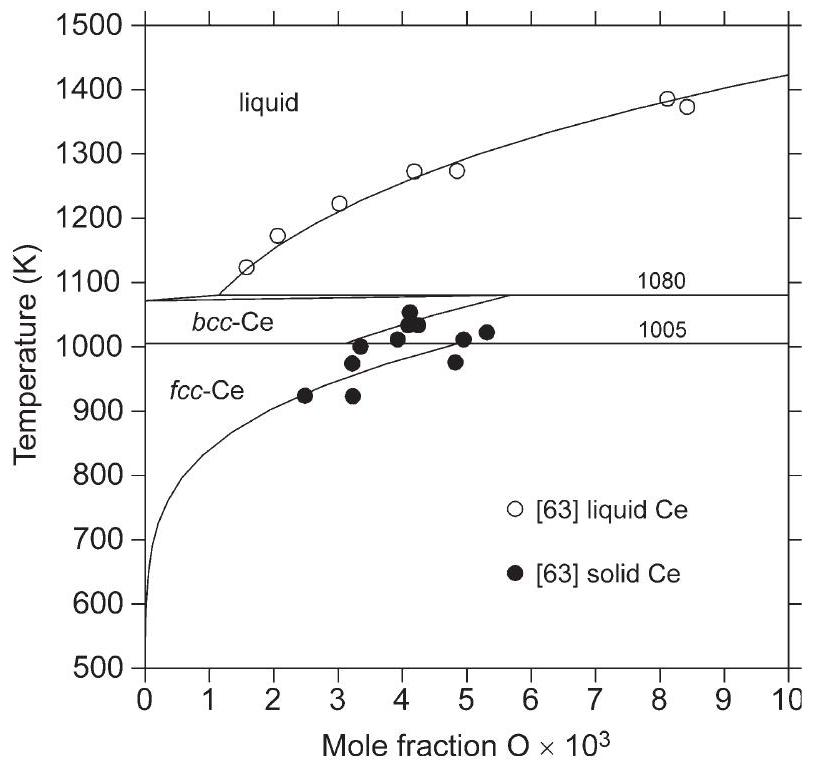
Fig. 9. The cerium-rich part of Fig. 7 showing phase equilibria between liquid, interstitial solution phases and solid $\mathrm{Ce}_{2} \mathrm{O}_{3}$.

are reproduced within the limits of experimental errors. The lowtemperature measurements of Bevan and Kordis [21] deviate from the curves with decreasing oxygen content (Fig. 3) because equilibrium was not established as pointed out by the authors themselves. Good agreement was also found to exist between calculations and data from [19,20,22,31,32], which are not included in Fig. 3 to ensure clarity. The plateaus correspond to the miscibility gap in the nonstoichiometric ceria around $\mathrm{O} / \mathrm{Ce}=1.9$ and to the biphasic regions $\mathrm{F}+\mathrm{Ce}_{7} \mathrm{O}_{12}, \mathrm{~F}+\mathrm{C}, \mathrm{F}+\mathrm{A}, \mathrm{F}+$ liquid, $\mathrm{Ce}_{7} \mathrm{O}_{12}+\mathrm{C}$, and $\mathrm{C}+\mathrm{A}$, while the curves partly overlap at the composition of $\mathrm{Ce}_{7} \mathrm{O}_{12}$.

Fig. 4 shows equilibrium oxygen pressures for the composition range $\mathrm{O} / \mathrm{Ce}>1.9$. Note that the composition axis here is logarithmic. It is worth mentioning that traditional defect chemistry predicts a straight line with a slope of $-1 / 6$ for the

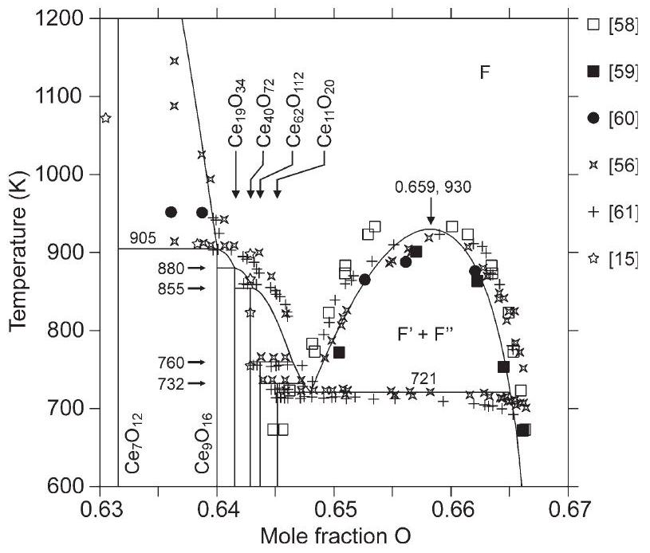
Fig. 10. A part of $\mathrm{Ce}-\mathrm{O}$ phase diagram between $\mathrm{Ce}_{7} \mathrm{O}_{12}$ and $\mathrm{CeO}_{2}$ at low temperatures.

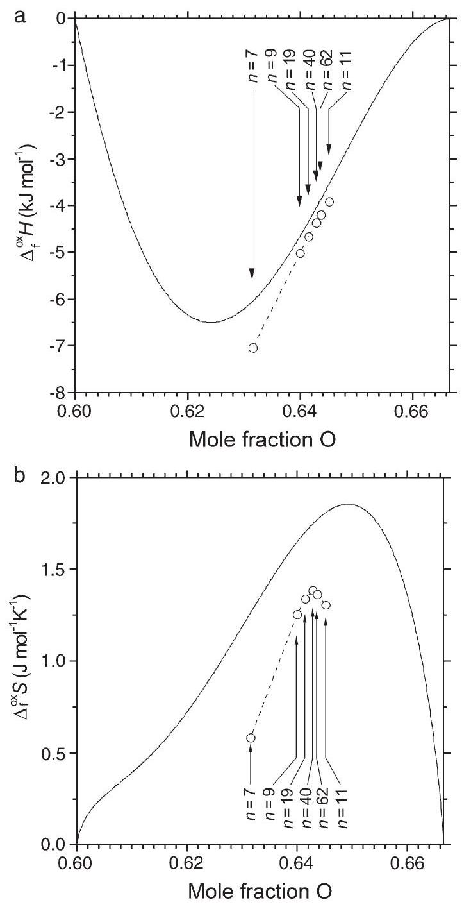
Fig. 11. Enthalpy (a) and entropy (b) of formation of $\mathrm{Ce}_{n} \mathrm{O}_{2 n-2 m}$ compounds from $\mathrm{CeO}_{2}$ and fluorite-like $\mathrm{Ce}_{2} \mathrm{O}_{3}$ (circles) in comparison with the enthalpy and entropy of mixing in the nonstoichiometric ceria (solid curves) at 298.15 K . All values refer to one mole of atoms. The dashed lines are only guides for eye.

plot of $\log \left(P_{\mathrm{O} 2}\right)$ versus $\log (x)$. As it can be seen in Fig. 4, this approach is accurate enough as long as the deviations from stoichiometry in $\mathrm{CeO}_{2-x}$ are very small $(x>1.99)$ but fails at higher defect concentrations. At low temperatures the slope even reaches the value zero when passing through the miscibility gap, then increases again. The present modelling uses the same basic assumptions as the traditional defect chemistry, but the nonideality is introduced and expressed quantitatively in terms of the interaction parameters ${ }^{0} L_{\mathrm{Ce}^{3+}, \mathrm{Ce}^{4+}: \mathrm{O}^{2-}}^{\mathrm{F}}$ and ${ }^{1} L_{\mathrm{Ce}^{3+}, \mathrm{Ce}^{4+}: \mathrm{O}^{2-}}$. In this way, the change of slope is described very well without a need to introduce artificial clusters to model the nonstoichiometry of the $\mathrm{CeO}_{2-x}$ phase. In addition, since the fraction of $\mathrm{Ce}^{3+}$ ions in the cation sublattice of $\mathrm{CeO}_{2-x}$ is always equal to $2 x$, Figs. 3 and 4 can be used to obtain the concentration of small polarons (which are responsible for the electronic conductivity of ceria [12]) at different temperatures and oxygen pressures. This is important to estimate the applicability of ceria-based materials as solid electrolytes.

Fig. 5 presents a plot of calculated partial molar enthalpy of solution of $\mathrm{O}_{2}$ in cerium oxides at 1353 K in comparison with the measurements [37]. The agreement is quite satisfactory, except for the compositions adjacent to biphasic region $\mathrm{F}+\mathrm{C}$. Since the measurements were done by stepwise oxidation of the sample it is believed that the heat effect registered in the regions $\mathrm{O} / \mathrm{Ce}=1.69-1.70$ and $\mathrm{O} / \mathrm{Ce}=1.72-1.75$ reflect a transient state rather than the true equilibrium. Indeed, $\overline{\Delta H}^{\mathrm{O}_{2}}$ must show a discontinuity when a phase boundary is crossed and the corresponding gaps between calculated curves are clearly seen in Fig. 5. Panhans and Blumenthal [35] suggested that at $1073 \mathrm{~K}, \overline{\Delta H} \mathrm{O}_{2}$ goes through a minimum around $\mathrm{CeO}_{1.998}$ and reaches the value of $-500 \mathrm{~kJ} \cdot \mathrm{~mol}^{-1}$ at the near-stoichiometric composition $\mathrm{CeO}_{1.999997}$. This trend is not confirmed in the present work. It should be noted that the enthalpy was not measured directly in [35] and the accurate measurements of extremely small deviations from the stoichiometry in $\mathrm{CeO}_{2}$ over a range of temperatures are still lacking in the literature. In Fig. 6, the calculated heat capacity of $\mathrm{CeO}_{2-x}$ at several compositions (normalized to one mole of atoms) is compared with experimental data [57]. A very good consistency is evident. It can be also seen that the heat capacity of the fluorite-like $\mathrm{Ce}_{2} \mathrm{O}_{3}$ (if it would exist) would be very high.

Fig. 7 shows the phase diagram of the $\mathrm{Ce}-\mathrm{O}$ system calculated in the temperature range $500-4500 \mathrm{~K}$ for the total pressure of 1 bar. The liquid phase extends over a wide range of compositions and shows a tendency for demixing around 35 at . $\% \mathrm{O}$, where the corresponding liquidus curve becomes very flat.

The central part of the diagram (Fig. 8) is occupied by the A-, $\mathrm{C}-, \mathrm{F}-$, and $\mathrm{Ce}_{n} \mathrm{O}_{2 n-2 m}$ phases. The former melts congruently at slightly substoichiometric composition, whereas ceria decomposes on heating into the liquid phase and oxygen gas. It is interesting that the temperature of this gas-peritectic reaction $(2566 \mathrm{~K})$ is rather close the "melting point of $\mathrm{CeO}_{2}$ " reported in [67,74] (Table 3). Two horizontal lines just below the congruent melting point of X-phase in Fig. 8, correspond to the polymorphic transformations in $\mathrm{Ce}_{2} \mathrm{O}_{3}, \mathrm{X}=\mathrm{H}$ and $\mathrm{H}=\mathrm{A}$, respectively. It can be seen that a very good fit to the liquidus data [29] was obtained, while the calculated slope of the liquid+ A/A phase boundary is slightly smaller than reported in [62]. Attempts to fit the experimental slope resulted in an artifact that the A -phase became stable at the composition $\mathrm{Ce}_{2} \mathrm{O}_{2}$. It is concluded that the specimens in [62] were probably not fully equilibrated at lower temperatures. The boundaries of the F- and C -phases correspond to the points of intersection between horizontal lines and curves in Fig. 3 and show good compliance with experimental data. The temperatures of the invariant reactions $\mathrm{C}+\mathrm{F}=\mathrm{Ce}_{7} \mathrm{O}_{12}$ and $\mathrm{C}=\mathrm{A}+\mathrm{Ce}_{7} \mathrm{O}_{12}$ were calculated as 1321 and 885 K , respectively (Table 5). They are in close agreement with the results of [21]. Two other works [15,56] indicated significantly lower temperature for the former reaction. However, it is just one point in [56] that may be associated with the decomposition of $\mathrm{Ce}_{7} \mathrm{O}_{12}$, while no X-ray diffraction analysis of the samples was made. Kümmerle et al. [15] reported that $\mathrm{Ce}_{7} \mathrm{O}_{12}$ transformed directly to F , what is in contradiction with the phase diagram (Fig. 8). It is therefore believed that the temperature between 1072 and 1084 K
corresponds to the rapid oxidation of the sample, so that single F-phase is formed. The stability of $\mathrm{Ce}_{7} \mathrm{O}_{12}$ at higher temperatures is also supported by the measurements of equilibrium oxygen pressure versus composition at 1244 and 1296 K [30], where the clear plateaus, corresponding to the equilibria with $\mathrm{Ce}_{7} \mathrm{O}_{12}$ were observed (cf. Fig. 3). In Fig. 9, the calculated metal-rich part of the $\mathrm{Ce}-\mathrm{O}$ phase diagram is shown. One can see that experimental data [63] are reproduced with high accuracy.

Fig. 10 shows phase equilibria in the $\mathrm{Ce}-\mathrm{O}$ system in the region between $\mathrm{Ce}_{7} \mathrm{O}_{12}$ and $\mathrm{CeO}_{2}$ at low temperatures. It is evident that the present calculation complies well with most experimental information. Comparing Figs. 3 and 10 it can be concluded that the equilibrium oxygen pressure measurements and phase diagram data, which concern the miscibility gap in the F-phase are in good accord. The invariant peritectoid/ eutectoid reactions, in which $\mathrm{Ce}_{n} \mathrm{O}_{2 n-2 m}$ and F-phases are involved are listed in Table 5. The best agreement exists with the data of [56]. The enthalpies of those transformation, where they were measured are reproduced within the limits of experimental error. The transition temperature of 823 K [15], however, does not correspond to any invariant reaction in the present assessment. It may be related to the decomposition of one of the $\mathrm{Ce}_{n} \mathrm{O}_{2 n-2 m}$ compounds with $n=13,29$ or 39 [11], which were not taken into account in the present work. The possible existence of such phases may also be inferred from the largest deviations between calculated and measured enthalpy of the peritectoid reaction $\mathrm{Ce}_{40} \mathrm{O}_{72}+\mathrm{F}=\mathrm{Ce}_{62} \mathrm{O}_{112}$ (Table 5).

It is now interesting to compare the enthalpy and entropy of formation of $\mathrm{Ce}_{n} \mathrm{O}_{2 n-2 m}$ phases relative to F solid solution (Fig. 11). The enthalpy of mixing in the F-phase shows a minimum around $62.4 \mathrm{at} . \% \mathrm{O}$, whereas the entropy of mixing passes through the maximum around $64.9 \mathrm{at} . \% \mathrm{O}$. The enthalpy and entropy of formation of $\mathrm{Ce}_{n} \mathrm{O}_{2 n-2 m}$ exhibit similar behaviour: enthalpy decreases from $\mathrm{Ce}_{11} \mathrm{O}_{20}$ to $\mathrm{Ce}_{7} \mathrm{O}_{12}$, while the entropy reaches its maximum value for $\mathrm{Ce}_{40} \mathrm{O}_{72}$. The observed dependencies are quite logical in a sense that all the discrete compounds $\mathrm{Ce}_{n} \mathrm{O}_{2 n-2 m}$ are superstructures of the fluorite-type lattice. In addition, Fig. 11 shows that extrapolating the composition dependence of $\Delta_{\mathrm{f}}^{\mathrm{ox}} S^{\circ}$ would result in a zero or even negative value at $62.5 \mathrm{at} . \% \mathrm{O}$ (Fig. 11b). This can explain, why the stoichiometric compound $\mathrm{Ce}_{3} \mathrm{O}_{5}(n=6, m=1)$ is not stable at low temperatures, but exists as a solution phase (C) due to the positive entropy of mixing.

## 5. Concluding remarks

The experimental database for the $\mathrm{Ce}-\mathrm{O}$ system is large and difficult to use for practical purposes. In the present work, this information was condensed in the form of coefficients of the Gibbs energy equations, which are parts of thermodynamic models for individual phases. The models developed in this work are, on the one hand, simple to be compatible with the standard Gibbs energy minimization procedure. On the other hand, they provide enough flexibility to account for the crystal structure, defect chemistry, and thermodynamic properties of ionic solids. Using the parameters of thermodynamic description
of the $\mathrm{Ce}-\mathrm{O}$ system evaluated in the present work (Table 4) any thermochemical property and a phase diagram can be calculated. This is a significant improvement compared to the previous modelling works, which have dealt mainly with the $\mathrm{CeO}_{2-x}$ phase. With a few exceptions $[23,25,26,28,52]$ a good consistency of the experimental database (Table 2) was demonstrated. While present work accumulates all previous knowledge about the $\mathrm{Ce}-\mathrm{O}$ system, several new results were also obtained:

1) Probable value for the melting point of the stoichiometric $\mathrm{CeO}_{2}(3000 \pm 20 \mathrm{~K})$. The melting is congruent only under elevated pressure.
2) The $\mathrm{Ce}-\mathrm{O}$ phase diagram in the whole range of compositions (Fig. 7) or at elevated temperature (Fig. 8) not reported previously.
3) A complete list of invariant reactions in the $\mathrm{Ce}-\mathrm{O}$ system (Table 5). While not all these temperatures and compositions have been measured, the calculated values are based on the real thermodynamic and phase boundary data and thus, contribute to the database.
4) The enthalpy and entropy of formation of $\mathrm{Ce}_{n} \mathrm{O}_{2 n-2 m}$ phases (Fig. 11) assessed for the first time.

## References

[1] T.B. Lindemer, Calphad 10 (2) (1986) 129.
[2] M. Hillert, B. Jansson, J. Am. Ceram. Soc. 69 (10) (1986) 732.
[3] H. Yokokawa, N. Sakai, T. Horita, K. Yamaji, Y. Xiong, T. Otake, H. Yugami, T. Kawada, J. Mizusaki, J. Phase Equilib. 22 (3) (2001) 331.
[4] P. Tetot, P. Gerdanian, J. Phys. Chem. Solids 46 (10) (1985) 1131.
[5] M. Benzakour, R. Tetot, G. Boureau, J. Phys. Chem. Solids 49 (4) (1988) 381.
[6] A. Nakamura, J. Nucl. Mater. 201 (1993) 17.
[7] S. Ling, Phys. Rev., B 49 (2) (1994) 864.
[8] H. Bärnigshausen, G. Schiller, J. Less-Common Met. 110 (1985) 385.
[9] E.A. Kümmerle, G. Heger, J. Solid State Chem. 147 (1999) 485.
[10] S.P. Ray, A.S. Nowick, D.E. Cox, J. Solid State Chem. 15 (1975) 344.
[11] P. Knappe, L. Eyring, J. Solid State Chem. 58 (1985) 312.
[12] M. Mogensen, N.M. Sammes, G.A. Tompsett, Solid State Ionics 129 (2000) 63.
[13] J. Zhang, Z.C. Kang, L. Eyring, J. Alloys Compd. 192 (1993) 57.
[14] Z.C. Kang, L. Eyring, J. Alloys Compd. 249 (1997) 206.
[15] E.A. Kümmerle, F. Güthoff, W. Schweika, G. Heger, J. Solid State Chem. 153 (2000) 218.
[16] P. Aldebert, J.P. Traverse, Mater. Res. Bull. 14 (1979) 303.
[17] S.G. Tresvyatskii, L.M. Lopato, A.W. Schwetschenko, A.E. Kutschewskij, Colloq. Int. Centre Natl. Rech. Sci. (Paris) 205 (1971) 247.
[18] A.V. Shevthenko, L.M. Lopato, Thermochim. Acta 93 (1985) 537.
[19] G. Brauer, K.A. Gingerich, U. Holtschmidt, J. Inorg. Nucl. Chem. 16 (1960) 77.
[20] F.A. Kuznetsov, V.I. Belyi, T.N. Rezukhina, Ya.I. Gerasimov, Dokl. Phys. Chem. Eng. Transl. 139 (1961) 642.
[21] D.J.M. Bevan, J. Kordis, J. Inorg. Nucl. Chem. 26 (1964) 1509.
[22] T.L. Markin, R.J. Bones, V.J. Wheeler, Proc. Br. Ceram. Soc. 8 (1967) 51.
[23] B. Iwasaki, T. Katsura, Bull. Chem. Soc. Jpn. 44 (1971) 1297.
[24] Y. Wilbert, J.J. Oehlig, A. Duguesnoy, C.R. Acad. Sci. Paris. Ser. C 273 (1971) 550.
[25] O.T. Sorensen, Proc. 3rd Int. Conf. Therm. Anal., vol. 2, 1971, p. 31.
[26] P.J. Hampson, Thermodynamic Properties of the Cerium-Oxygen System, Lab. Rep., vol. RD/L/R/ 1843, Central Electricity Research Laboratories, Leatherhead, Surrey, 1973.
[27] R.J. Panlener, R.N. Blumenthal, J.E. Garnier, J. Phys. Chem. Solids 36 (1975) 1213.
[28] O.T. Sorensen, J. Solid State Chem. 18 (1976) 217.
[29] M.D. Watson. Phase equilibrium for solid and molten $\mathrm{CeO}_{2-x}$ above $1500^{\circ} \mathrm{C}$. Thesis, PhD, Georgia Institute of Technology, USA (1977)
[30] J. Campserveux, P. Gerdanian, J. Solid State Chem. 23 (1978) 73.
[31] R.J. Fruehan, Metall. Trans. 10B (1979) 143.
[32] J.W. Dawicke. Oxygen dissociation pressure measurements on nonstoichiometric cerium dioxide. Thesis, PhD, Marquette University, USA (1980)
[33] K. Kitayama, K. Nohri, T. Sugihara, T. Katsura, J. Solid State Chem. 56 (1985) 1.
[34] J.-H. Park, Physica B 150 (1988) 80.
[35] M.A. Panhans, R.N. Blumenthal, Solid State Ionics 60 (1993) 279.
[36] B. Zachau-Christiansen, T. Jacobsen, S. Skaarup, Solid State Ionics 86-88 (1996) 725.
[37] J. Campserveux, P. Gerdanian, J. Chem. Thermodyn. 6 (1974) 795.
[38] F.A. Kuznetsov, T.N. Rezukhina, A.N. Golubenko, Russ. J. Phys. Chem. 34 (9) (1960) 1010.
[39] A.D. Mah, Rep. Invest., vol. 5676, U.S. Bureau of Mines, 1961.
[40] F.B. Baker, C.E. Holley Jr., J. Chem. Eng. Data 13 (3) (1968) 405.
[41] R.L. Putnam, A. Navrotsky, E.H.P. Cordfunke, M.E. Huntelaar, J. Chem. Thermodyn. 32 (2000) 911.
[42] M.E. Huntelaar, A.S. Booij, E.H.P. Cordfunke, R.R. van der Laan, A.C.G. van Genderen, J.C. van Miltenburg, J. Chem. Thermodyn. 32 (2000) 465.
[43] W.W. Weller, E.G. King, Low-Temperature Heat Capacities and Entropies at 298.15 K of the Sesquioxides of Scandium and Cerium, Rep. Invest., vol. 6245, U.S. Bureau of Mines, 1963, p. 1.
[44] B.H. Justice, E.F. Westrum Jr., J. Phys. Chem. 73 (6) (1969) 1959.
[45] F.A. Kuznetsov, T.N. Rezukhina, Russ. J. Phys. Chem. 35 (4) (1961) 470.
[46] R. Basili, A. El-Sharkawy, S. Atalla, Rev. Int. Hautes Temp. Refract. Fr. 16 (1979) 331.
[47] L.B. Pankratz, K.K. Kelley, High-Temperature Heat Content and Entropies of the Sesquioxides of Lutetium, Dysprosium, and Cerium, Rep. Invest., vol. 6248, U.S. Bureau of Mines, 1963, p. 1.
[48] E.J. Huber Jr., C.E. Holley Jr., J. Am. Chem. Soc. 75 (1953) 5645.
[49] F.B. Baker, E.J. Huber Jr., C.E. Holley Jr., N.H. Krikorian, J. Chem. Thermodyn. 3 (1977) 77.
[50] E.F. Westrum Jr., A.F. Beale Jr., J. Chem. Phys. 65 (2) (1961) 353.
[51] F.A. Kuznetsov, T.N. Rezukhina, Russ. J. Phys. Chem. 34 (9) (1960) 1164.
[52] S.A. Gallagher, W.R. Dworzak, J. Am. Ceram.Soc. 68 (8) (1985) C206.
[53] E.G. King, A.U. Christensen, High-Temperature Heat Content and Entropies of Cerium Dioxide and Columbium Dioxide, Rep. Invest., vol. 5789, U.S. Bureau of Mines, 1961, p. 1.
[54] R. Mezaki, E.W. Tilleux, T.F. Jambois, J.L. Margrave, Advances in Thermophysical Functions at Extreme Temperatures and Pressures, Proc. 3rd ASME Symp. on Thermophys. Prop., New York, 1965, p. 138.
[55] T.S. Yashvili, D.S. Tsagareishvili, G.G. Gvelesiani, Izv. Akad. Nauk Gruz. SSR 46 (1967) 409.
[56] M. Ricken, J. Nölting, I. Riess, J. Solid State Chem. 54 (1984) 89.
[57] I. Riess, M. Ricken, J. Nölting, J. Solid State Chem. 57 (1985) 314.
[58] G. Brauer, K.A. Gingerich, J. Inorg. Nucl. Chem. 16 (1960) 87.
[59] R.N. Blumenthal, R.L. Hofmaier, J. Electrochem. Soc. 121 (1) (1974) 126.
[60] H.L. Tuller, A.S. Nowick, J. Phys. Chem. Solids 38 (1977) 859.
[61] R. Körner, M. Ricken, J. Nölting, I. Riess, J. Solid State Chem. 78 (1989) 136.
[62] R.J. Ackermann, E.G. Rauh, J. Chem. Thermodyn. 3 (1971) 609.
[63] T. Fujisawa, S. Takai, C. Yamauchi, Proc. 1st Int. Conf. Process. Mater. Prop., 7-10 November 1993, Hawaii, 1993, p. 917.
[64] M.A. Miganelli, P.E. Potter, M.H. Rand, "The phase relationships and thermochemical properties of the cerium-oxygen system, a critical assessment", Comm. Eur. Communities (Report) (1982), EUR 7820, Pt. 2, 12-1/12-38
[65] E.H.P. Cordfunke, R.J.M. Konings, Thermochim. Acta 375 (2001) 65.
[66] A.I. Leonov, A.B. Andreeva, E.K. Keler, Izv. Akad. Nauk SSSR. Neorg. Mater. 2 (1966) 137.
[67] O.A. Mordovin, N.I. Timofeeva, L.N. Drozdova, Inorg. Mater. (USSR) 3 (1967) 159.
[68] T. Sata, M. Yoshimura, Yogyo Kyokaishi 76 (1968) 116.
[69] F. Trombe, Bull. Soc. Fr. Ceram. 3 (1949) 18.
[70] L. Brewer, Chem. Rev. 52 (1953) 1.
[71] E. Ryskewitch, Oxide Ceramics, Academic Press, New York, 1960.
[72] G.V. Samsonov, G.A. Yasinskaya, E.P. Lapteva, Ogneupory (1961) 41.
[73] S.G. Tresvyatkii, A.M. Cherepanov, Highly Refractory Materials and Products Made From Oxides, Metallurgizdat, Moscow, 1964, p. 358, (in Russian).
[74] M. Foex, Rev. Hautes Temp. Refract. 3 (1966) 309.
[75] J.P. Coutures, M.H. Rand, Pure Appl. Chem. 61 (8) (1989) 1461.
[76] L. Kaufman, Calphad 25 (2) (2001) 141 (and references therein).
[77] P.J. Spencer, Calphad 25 (2) (2001) 163 (and references therein).
[78] J.-O. Anderson, T. Helander, L. Höglund, P. Shi, B. Sundman, Calphad 26 (2) (2002) 273.
[79] A.T. Dinsdale, Calphad 15 (4) (1991) 317.
[80] M. Hillert, B. Jansson, B. Sundman, J. Ågren, Metall. Trans. 16A (1985) 261.
[81] B. Sundman, Calphad 15 (2) (1991) 109.
[82] B. Hallstedt, L. Gauckler, Calphad 27 (2) (2003) 177.
[83] O. Redlich, A.T. Kister, Ind. Eng. Chem. 40 (1949) 345.
[84] M. Hillert, J. Alloys Compd. 320 (2001) 161.
[85] A.E. Miller, A.H. Daane, J. Inorg. Nucl. Chem. 27 (1965) 1955.
[86] M. Zinkevich. Thermodynamics of rare-earth sesquioxides, Progress in Materials Science (submitted for publication).
[87] The SGTE substance database, version 1997, SGTE (Scientific Group Thermodata Europe), Grenoble, France (1997).
[88] C. Wang, M. Zinkevich, F. Aldinger, Calphad 28 (3) (2004) 281.
[89] Y. Du, M. Yashima, M. Kakihana, T. Koura, M. Yoshimura, J. Am. Ceram. Soc. 77 (10) (1994) 2783.

[^0]:    Is Presented at the 15th Int. Conf. on Solid State Ionics in Baden-Baden, Germany 2005.

    * Corresponding author. Tel.: +49 7116893 105; fax: +49 7116893131.

    E-mail address: zinkevich@mf.mpg.de (M. Zinkevich).
    URL: http://aldix.mpi-stuttgart.mpg.de/zinkevit/home_mz.html (M. Zinkevich).

